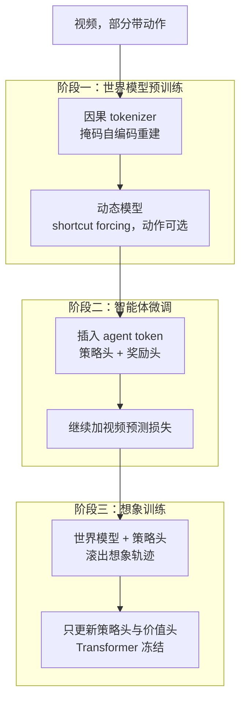
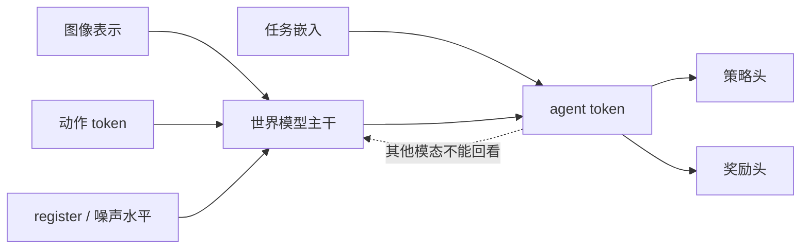

# Dreamer 4：世界模型又快又准，智能体才能只在想象里学会挖钻石

<!-- release-date: 2025-09-29 -->

> 本文依据 Google DeepMind 的 **Training Agents Inside of Scalable World Models**（作者 Danijar Hafner、Wilson Yan、Timothy Lillicrap），arXiv:2509.24527v1（2025-09-29 提交），共 32 页。页码均指 PDF 自身的页码。文中会区分三件事：**报告明确写了什么**、**我们怎么解释它**、**哪些是外部资料或本文推算**。

## 读前先把几个词说成人话

这篇论文难读的地方不在公式多，而在它同时改了三样东西：世界模型的训练目标、Transformer 的结构，以及策略怎么在世界模型里学。先把会反复出现的词说清楚：

- **世界模型（world model）**：给定到目前为止看到的画面和这一步的动作，预测下一帧（或下一帧的压缩表示）的模型。它和普通视频生成模型的区别在于：**能在中途接受控制**。
- **想象训练（imagination training）**：不让策略去真实环境里试错，而是让世界模型滚出一条条「假经历」，策略只在这些假经历上做强化学习（PDF p. 1、p. 4）。
- **离线（offline）**：训练全程不向环境要新数据，只用一份固定的录像。
- **流匹配（flow matching）**：扩散模型的一种写法。训练时把干净数据和纯噪声按比例混合，让网络学会「从噪声走回数据」；生成时从纯噪声出发，一步步走回数据（PDF p. 3）。
- **shortcut 模型（shortcut models）**：在流匹配的网络上再加一个输入「这一步请跨多大」，于是推理时可以只走 2 步或 4 步，不必另做蒸馏（PDF p. 3）。
- **diffusion forcing**：序列里每个时间步可以有不同的噪声水平，一个时间步既是去噪任务，又是后面时间步的历史（PDF p. 3）。
- **行为克隆（Behavioral Cloning，BC）**：看专家在某一帧按了什么，就让策略去拟合那个动作。
- **FVD（Fréchet Video Distance）**：衡量生成视频和真实视频分布差多远，**越低越好**。

本篇自己起的名字只有一个：**shortcut forcing**。它把上面三块积木（流匹配、shortcut 模型、diffusion forcing）接在一起，再把预测目标从「速度」换成「干净数据」。后面会把它走完一条因果链。

同一作者的前作 Dreamer 3（见 DreamerV3 一篇）也在 Minecraft 里挖到过钻石，但设定完全不同，第一节先把两者分开。

## 一句话先说清

2025 年，想用世界模型训练智能体的人面前有两条路，各缺一半（PDF p. 2）：

- **Dreamer 3 这类世界模型智能体**：在游戏和机器人上又快又准，但架构吃不下复杂的真实数据分布；
- **Genie 3 这类可控视频模型**：用扩散 Transformer 在多样的真实视频和游戏上训练，能生成多样场景和简单交互，但学不会物体交互与游戏机制的精确物理，而且往往要很多块 GPU 才能实时模拟一个场景。

Dreamer 4 要做的是一个**既准到能当仿真器、又快到单卡实时**的世界模型，再把策略完全放进它里面用强化学习练。

论文给出的结果，带着各自的限定：

- **离线钻石**：只用 OpenAI VPT 的 2541 小时承包商录像，不和环境交互，在 1000 局 60 分钟的评测里有 0.7% 的局挖到钻石；铁镐成功率 29%（PDF p. 12、p. 28，表 7）。报告说这是第一个纯离线挖到钻石的智能体（PDF p. 2）。
- **100 倍更少数据**：对比的是 VPT 的离线行为克隆智能体（2.5K 小时承包商数据 + 270K 小时网页视频），不是 VPT 的在线强化学习版，也不是 Dreamer 3（PDF p. 2、p. 16，表 3）。
- **单卡实时**：2B 参数的世界模型在单块 H100 上每秒生成 21 帧，超过 Minecraft 每秒 20 次的游戏刻；上下文 9.6 秒（PDF p. 12–13，表 1）。
- **交互准确**：人在世界模型里用鼠标键盘完成作者选定的 16 项任务，Dreamer 4 完成 14 项，此前最好的 Oasis（大号）5 项（PDF p. 12–13）。

如果只记一句话，可以记：

> **智能体能不能纯靠录像学会一件很难的事，瓶颈往往不在策略算法，而在世界模型够不够格当仿真器。够格有两个条件：交互要准，推理要快。**

## 主要矛盾：准与快，想象训练两个都要

想象训练要反复做一件事：从数据集里取一段开头，让世界模型和策略交替往前滚，生成大量假经历，再用它们更新策略。这件事对世界模型提出两个硬要求。

**要准。** Minecraft 挖钻石需要从原始像素出发，选出超过 2 万步的鼠标键盘动作（PDF p. 1）；有经验的人类玩家平均 20 分钟拿到钻石，约合 2.4 万步（PDF p. 10）。途中要砍树、合成、换工具、下挖。世界模型如果在玩家放了几块木板之后自动「补全」出一堵玩家没砌过的墙，或者把合成界面里的物品画错，策略在里面练得再久也是在学一个错误的游戏。

**要快。** 想象训练的吞吐由世界模型的生成速度决定。人要检查世界模型好不好，最直接的办法也是亲手在里面玩，这要求实时。可当时常见的扩散视频模型每帧要走几十步，单卡远到不了实时（PDF p. 2、p. 15）。

两者还互相牵制：想更准，就要更多 token、更大模型、更多采样步；想更快，就要反过来。Dreamer 4 的做法是先用目标函数和结构把速度压下来，再把省出的预算换回容量。

## 先看全景：一个 tokenizer、一个动态模型、三个阶段

图引自原文 Figure 2（PDF p. 4）。两个部件用的是同一种块因果 Transformer（PDF p. 4）：

- **因果 tokenizer** 把视频帧压成连续表示。它在时间上是因果的，可以一帧一帧解码，不必等整段视频（PDF p. 5）。
- **交互动态模型** 在「动作、噪声水平与步长、带噪表示」交错排成的序列上做去噪，预测每一帧的干净表示（PDF p. 5–6）。

训练分三个阶段（PDF p. 4，算法 1）：

这张图按算法 1 与 Figure 2 图注重画（PDF p. 4），表达阶段之间的依赖，不代表时长或并行方式。关键点在阶段二：**不另训一个策略网络**，而是往训好的动态 Transformer 里插入任务 token，从它们上面长出策略、奖励和价值三个头（PDF p. 4）。

一个 Transformer 同时学多种模态、多个损失时，报告用每个损失的均方根（RMS）的滑动估计做归一化，免得某一项把其他项淹没（PDF p. 4）。

规模：tokenizer 4 亿参数，动态模型 16 亿参数，合计 2B；在 256–1024 块 TPU-v5p 上训练，每卡 batch 1，用 FSDP 切分（PDF p. 9）。每个 batch 里 30% 的视频被当作单张图像训练，让动态模型学会在没有上下文时生成起始帧（PDF p. 9）。

## 核心设计一：因果 tokenizer，连续的有界瓶颈

### 旧问题

交互推理要求当前帧在下一帧到来之前就能解码。如果 tokenizer 拿未来帧帮忙压缩当前帧，训练时重建会更好，推理时却没法逐帧用（PDF p. 5）。

### 新设计

每个时间步由当前图像的图块 token 和一组可学习的潜 token 组成。编码器之后，从潜 token 上用线性投影降到更窄的通道，再过一个 tanh，得到瓶颈表示；解码器把它投回模型宽度，和另一组可学习 token 拼起来读出图块（PDF p. 5）。

输入多个模态时，注意力是不对称的（PDF p. 5）：

- 编码器里，潜 token 可以看所有模态，每个模态只看自己；
- 解码器里，每个模态看自己和潜 token，潜 token 只看自己。

训练目标是重建：均方误差加 0.2 倍的 LPIPS 感知损失（PDF p. 5，式 5）：

$$
\mathcal{L}(\theta)=\mathcal{L}_{\mathrm{MSE}}(\theta)+0.2\,\mathcal{L}_{\mathrm{LPIPS}}(\theta)
$$

同时做**掩码自编码（Masked Autoencoding，MAE）**：每张图的丢弃概率 $p$ 从 $U(0, 0.9)$ 里随机取，被丢的图块换成一个可学习的嵌入。$p$ 会取到 0，所以训练时也覆盖了推理时「什么都不遮」的情形（PDF p. 5）。

Minecraft 上的尺寸（PDF p. 25）：原图 $360\times 640$，补零到 $384\times 640$，按 $16\times 16$ 切成 960 个图块 token；瓶颈是 $N_b=512$ 个 token、每个 $D_b=16$ 维，再重排成动态模型用的 $N_z=256$ 个空间 token、每个 32 维。

### 收益与边界

报告对 MAE 只有一句定性结论：它改善了动态模型生成视频的空间一致性（PDF p. 5）。没有单独的 tokenizer 消融表，所以只知道作者觉得有用，不知道去掉会差多少。

**我们如何解释它。** 连续、有界的表示是为下游的流匹配准备的：扩散过程在一个有界的连续空间里做，比在离散码本上做更直接。$p$ 取到 0，是为了让训练分布把推理分布包进去——这条比「用不用 MAE」更值得抄。

## 核心设计二：shortcut forcing，少走几十步，又不让误差在时间上堆起来

这是全文最需要讲清楚的一块。

### 旧问题

表 2 的起点是一个朴素的 diffusion forcing Transformer：密集注意力、预测速度、每帧 64 个采样步。它在单块 H100 上只有 0.8 FPS，离 20 FPS 差得很远（PDF p. 15–16）。

把采样步直接砍到 4 步，速度到 9.1 FPS，但 FVD 从 306 恶化到 875（PDF p. 15，表 2）。

原因有两层。第一，网络是按「一小步的速度」训练的，硬让它跨一大步，离散化误差会写进每一帧。第二，交互生成是一帧接一帧的，前一帧的误差会变成后一帧的历史，越滚越偏。

视频模型常见的补救是再做一轮蒸馏，把 64 步的老师压成 4 步的学生。这要两个训练阶段，而且老师本身就很贵（PDF p. 17）。

### 新设计：三块积木，外加一刀

讲解图依据 PDF p. 3 式 1–4、p. 6 式 6–8 与推理段画成，是机制示意，不是实测数据。

**第一块：流匹配。** 信号水平 $\tau\in[0,1]$ 决定数据和噪声各占多少，$\tau=0$ 是纯噪声，$\tau=1$ 是干净数据（PDF p. 3，式 1）：

$$
x_\tau=(1-\tau)\,x_0+\tau\,x_1,\qquad x_0\sim\mathcal{N}(0,I),\qquad x_1\sim\mathcal{D}
$$

网络学的是从噪声指向数据的速度 $v=x_1-x_0$，损失是这个速度的均方误差。推理时从纯噪声出发，每步走 $d=1/K$，走 $K$ 步（PDF p. 3，式 2）：

$$
x_{\tau+d}=x_\tau+f_\theta(x_\tau,\tau)\,d
$$

**第二块：shortcut 模型。** 网络除了 $\tau$，还看「这一步请跨多大」的 $d$（PDF p. 3，式 3–4）：

- 最小步 $d_{\min}$ 仍用流匹配损失；
- 更大的步 $d$ 用**自举（bootstrap）**：先让网络跨 $d/2$，再从那里跨 $d/2$，两段速度取平均、停止梯度，当作「一次跨 $d$」的目标；
- $d$ 按 2 的幂均匀采样，$d_{\min}=1/K_{\max}$；$\tau$ 在当前步长能走到的网格上均匀采样。

好处是一个训练阶段就能在推理时选 2 步或 4 步，不需要额外蒸馏（PDF p. 3）。

**第三块：diffusion forcing。** 序列里每个时间步独立取噪声水平，于是推理时可以「历史几乎干净，只生成下一帧」（PDF p. 3）。

**那一刀：改成预测干净数据。** shortcut 模型默认预测速度，叫 **v-prediction**。报告说，这种写法在一次生成整张图或整段视频时很好；但它让网络输出高频成分，按帧逐步生成长视频时，细小误差会随时间累积（PDF p. 6）。于是改成预测干净表示本身，叫 **x-prediction**（PDF p. 6）。

### 工作机制

动态模型的输入是交错排列的动作 $a$、每个时间步的离散信号水平 $\tau$ 与步长 $d$，以及被污染的表示 $\tilde z$；输出是干净表示 $\hat z_1$（PDF p. 6，式 6）：

$$
\hat z_1=f_\theta(\tilde z,\tau,d,a),\qquad \tilde z=(1-\tau)\,z_0+\tau\,z_1
$$

注意这里有两种「时间」：$t$ 是序列里的第几帧，$\tau$ 是这一帧被污染到什么程度（PDF p. 6）。

损失分两种情况（PDF p. 6，式 7）：

- **最小步**：直接在 $x$ 空间回归干净表示，$\|\hat z_1-z_1\|_2^2$；
- **更大的步**：先把网络的 $x$ 预测换算成速度，按上面的自举做法跨两个 $d/2$ 得到目标速度，在速度空间里算误差，再乘 $(1-\tau)^2$ 换回 $x$ 空间的量级。脚注解释了这个系数：$x$ 空间与速度空间的均方误差恰好差一个 $(1-\tau)^2$ 因子，乘上它让两项损失的量级相当（PDF p. 6）。

式 7 里把两个半步的速度写成 $b'$、$b''$，损失里又写成 $b_1$、$b_2$，是同一对量，符号前后没有统一。

还有一个权重。低信号水平（更吵）的位置学习信号少：流匹配项会退化成预测数据集均值，而自举项的目标是确定的、更好优化。为了把容量留给最有信号的位置，报告加了一个随 $\tau$ 线性升高的 **ramp 权重**（PDF p. 6，式 8）：

$$
w(\tau)=0.9\,\tau+0.1
$$

$\tau=0$ 时权重 0.1，$\tau=1$ 时 1.0。

推理时，每帧用 $K=4$ 步、$d=1/4$ 生成；已生成的历史帧再轻微加噪到 $\tau_{\mathrm{ctx}}=0.1$，让模型对自己生成时的小瑕疵更有容忍度（PDF p. 6）。

### 收益

表 2 前六行把这一刀的效果写得很清楚（PDF p. 15）：

| 改动 | 推理 FPS | FVD |
|---|---:|---:|
| 朴素 diffusion forcing，64 步 | 0.8 | 306 |
| 只把采样步砍到 4 | 9.1 | 875 |
| + shortcut 模型 | 9.1 | 329 |
| + x-prediction | 9.1 | 326 |
| + x 空间损失 | 9.1 | 151 |
| + ramp 权重 | 9.1 | 102 |

读法：**4 步能用，主要是 shortcut 救回来的；质量再往下压，主要靠 x 空间的损失和 ramp 权重。** 只换预测对象（x-prediction）几乎不动，把损失也搬到 $x$ 空间才是大头。报告另给了一个对照：在最终架构上，如果仍用速度空间的预测和损失，FVD 是 124，换成 $x$ 空间后是 57（PDF p. 16）。

图引自原文 Figure 8（PDF p. 16），两条线都用 $x$ 空间损失加 ramp 权重。shortcut forcing 用 4 步就接近 diffusion forcing 用 64 步的质量，报告称之为 16 倍加速（PDF p. 16）。

### 代价与边界

- **不改目标、只砍步数，一定崩。** 表 2 第二行的 875 说明，shortcut 的关键是在训练时就把「大步」当成一等公民来学。
- **x-prediction 的好处是观察加假设。** 报告写的是：他们假设 $x$ 空间的目标更有结构，因此更不容易产生会累积的高频误差（PDF p. 16）。这不是定理。
- **历史仍要加噪。** $\tau_{\mathrm{ctx}}=0.1$ 说明模型并不完全信任自己生成的历史；误差没有被消灭，只是被控制在可以容忍的范围。

### 可迁移启发

> 生成必须按时间逐步进行、而每一步的误差又会变成下一步的输入时，不要只优化「单步看起来像」；要把「推理时会走大步」和「预测更有结构的量」写进训练目标。

## 核心设计三：为了单卡实时，把 Transformer 拆成「空间密、时间稀」

shortcut forcing 把每帧的前向次数从 64 降到 4。如果每一层还在所有时空 token 上做密集注意力，4 次仍然太贵。

### 旧问题

块因果 Transformer 的推理速度受两头限制：MLP 的计算量，以及长上下文时读取 KV 缓存的显存带宽（PDF p. 8）。Minecraft 一帧有 256 个空间 token，上下文 192 帧（PDF p. 25），全部两两做注意力，长上下文跑不到实时。

### 新设计

骨架是有时间、空间两个轴的 2D Transformer，时间上因果：同一帧内的 token 互相可见，也能看过去，但看不到未来（PDF p. 8）。底座是常见配置：层前 RMSNorm、RoPE、SwiGLU，再加 QKNorm 和注意力 logit 软截断来稳住训练（PDF p. 8）。

然后做了三件提速的事（PDF p. 8）：

1. **空间注意力和时间注意力分开**，不在全部视频 token 上做密集注意力；
2. **每 4 层才做一次时间注意力**，Figure 2 右边画的就是「三层空间 + 一层因果时间」重复 $L/4$ 次；
3. **动态模型的所有注意力层用 GQA（分组查询注意力）**：多个 query 头共用一组 key-value，进一步缩小 KV 缓存。

训练长度上，交替训练大量短 batch 和少量长 batch，最后只在长 batch 上微调（PDF p. 8）。报告说交替训练让中途的指标和生成结果更接近最终模型。另有一条约束：batch 长度必须**长于**模型的上下文长度，否则 Transformer 会过拟合于「上下文开头总是视频第一帧」，没法生成任意长度（PDF p. 8）。Minecraft 上两种 batch 长度是 64 和 256，上下文 192（PDF p. 25）。

### 收益：表 2 后半段

表 2 从「交替 batch 长度」往下，证明的不是目标函数，而是**把省下来的时间换成容量**。每个变体训 48 小时，无上下文生成 1024 段 384 帧（约 20 秒）的视频，动作来自一个固定的行为克隆策略，再切成 16 帧小段，对留出集算 FVD（PDF p. 15）：

| 改动 | 每步训练秒数 | 推理 FPS | FVD |
|---|---:|---:|---:|
| 到 ramp 权重为止 | 9.8 | 9.1 | 102 |
| + 交替 batch 长度 | 1.5 | 9.1 | 80 |
| + 每 4 层才做长上下文 | 0.6 | 18.9 | 70 |
| + GQA | 0.5 | 23.2 | 71 |
| + 长上下文层只做时间注意力 | 0.4 | 30.1 | 91 |
| + register token | 0.5 | 28.9 | 91 |
| + 空间 token 增到 128 | 0.8 | 25.7 | 66 |
| + 空间 token 增到 256 | 1.7 | 21.4 | 57 |

几处要单独读（PDF p. 16）：

- **时间注意力变稀，FVD 反而从 80 降到 70。** 报告的解释是空间注意力的归纳偏置让计算集中在当前帧，用的是「可能」这个措辞；
- **长上下文层改成只做时间注意力**，速度冲到 30.1 FPS，质量回退到 91。报告说这一步是为后面加 token 腾预算；
- **register token 不降 FVD**，作者仍然保留，理由是肉眼看时间一致性更好。这是定性观察，表上的数字不支持也不反对；
- 最后两行把速度余量换成空间 token，FVD 回到 57，FPS 仍在 20 以上。

每 4 层做一次时间注意力这一条，报告引用的依据是参考文献 [39]，一篇第三方写的 Llama 4 介绍（发表在 SSRN），不是 Meta 的官方技术报告（PDF p. 8、p. 21）。

### 代价

空间层看不到别的帧，大多数层也没有时间注意力；跨时间、跨位置的关系只能靠四分之一的时间层间接建立。「长上下文层只做时间注意力」那一行已经展示了代价：FPS 高了，FVD 从 71 回到 91。能靠加空间 token 救回来，前提是速度先被砍出了余量。

### 可迁移启发

> 先用结构把推理压到实时预算以下，再把省出的步数和时间拿去加容量；不要在一个已经跑不动的骨架上继续堆 token。

## 核心设计四：想象训练，世界模型冻结，策略在假经历里超越录像

世界模型准了、快了，还只是仿真器。智能体要在里面学出比录像更好的策略。

图引自原文 Figure 1（PDF p. 1）。这些画面是策略在世界模型里练习时滚出的轨迹，解码回像素只是为了给人看。

### 旧问题

纯行为克隆会被录像里的行为锁死。VPT 的离线智能体看了 270K 小时合成标注的网页视频，也只稳定走到木棍这一档（PDF p. 12、p. 17）。再往前，传统做法是进真实环境试错。报告把这条路明确拿掉：在物理机器人上，半成品策略在线交互往往不安全，场景难重置，奖励也难实时给（PDF p. 10）。

### 阶段二：插入一条不会污染世界模型的任务通道

在动态 Transformer 里插入 **agent token**，和图像表示、动作、register token 交错排列。它们的输入是任务嵌入，上面接小 MLP，做策略和奖励预测（PDF p. 6–7）。

关键的注意力限制（PDF p. 6–7）：

按 3.3 节文字重画，是机制示意（PDF p. 6–7）。agent token 可以看自己和所有其他模态；**其他模态一律不能看回 agent token**。报告说这对避免世界模型的「因果混淆」至关重要：未来画面只应被动作直接影响，不应被「当前任务是什么」直接影响（PDF p. 6–7）。

**我们如何解释它。** 如果允许回看，模型可能学会「任务是挖钻石，于是下一帧就出现钻石」，而不是「任务是挖钻石，于是策略选了挖掘动作，世界再按动作演化」。单向注意力从结构上堵掉了这条捷径。

策略头和奖励头用**多 token 预测（Multi-Token Prediction，MTP）**，长度 $L=8$：从当前的任务输出嵌入 $h_t$ 一次预测此后若干步的动作和奖励（PDF p. 7，式 9）：

$$
\mathcal{L}(\theta)=-\sum_{n=0}^{L}\ln p_\theta(a_{t+n}\mid h_t)-\sum_{n=0}^{L}\ln p_\theta(r_{t+n}\mid h_t)
$$

每个 MTP 距离有一个自己的输出层（PDF p. 7）。为了不丢掉已有能力，这一阶段沿用预训练设定：表示仍然带噪声，视频预测损失继续加（PDF p. 7）。奖励头沿用 Dreamer 3 的 symexp twohot 输出，用来稳健地学跨数量级的随机奖励；策略头按动作空间用分类分布或逐维二元分布（PDF p. 7）。

### 阶段三：想象里的强化学习

加入一个价值头，再复制一份冻结的策略头当**行为先验**。**只更新策略头和价值头，Transformer 冻结**（PDF p. 7）。脚注说微调整个 Transformer 有一点点额外好处，但更贵，而且必须同时继续施加动态、先验和奖励损失，否则这些功能会被破坏（PDF p. 7）。

想象轨迹从前两个阶段用过的数据集片段出发；和前几代 Dreamer 不同，每个片段只滚一条轨迹，优先保证数据多样性、也省显存（PDF p. 7）。滚动时，flow 头出表示，策略头出动作，奖励头和价值头给这条轨迹打分（PDF p. 7）。

价值头学的是折扣回报，让策略看到想象长度之外的奖励。它也用 symexp twohot 输出，用 TD 学习拟合 $\lambda$-回报，$\gamma=0.997$，$c_t$ 标记非终止状态（PDF p. 7，式 10）：

$$
R_t^\lambda=r_t+\gamma\,c_t\bigl((1-\lambda)\,v_t+\lambda\,R_{t+1}^\lambda\bigr),\qquad R_T^\lambda=v_T
$$

式 10 印的是 $v_t$；常见的 $\lambda$-回报在这个位置用下一步的价值 $v_{t+1}$。这里按原文照录，读者自己核对时留意。

策略头不再用前几代 Dreamer 的回报归一化加熵正则，改用 **PMPO**（出自参考文献 [29] Abdolmaleki 等人的 *Preference optimization as probabilistic inference*，论文正文没有展开这个缩写）（PDF p. 7、p. 21）。PMPO 只看优势 $A_t=R_t^\lambda-v_t$ 的**符号**，不看大小。好处是不必对回报或优势做归一化，多个任务即使回报尺度差很多，也能得到同等关注（PDF p. 7）。

具体做法：把一个 batch 里所有想象状态按优势正负分成 $\mathcal{D}^+$ 和 $\mathcal{D}^-$，最小化（PDF p. 8，式 11）

$$
\mathcal{L}(\theta)=\frac{1-\alpha}{|\mathcal{D}^-|}\sum_{i\in\mathcal{D}^-}\ln\pi_\theta(a_i\mid s_i)-\frac{\alpha}{|\mathcal{D}^+|}\sum_{i\in\mathcal{D}^+}\ln\pi_\theta(a_i\mid s_i)+\frac{\beta}{N}\sum_{i=1}^{N}\mathrm{KL}\bigl[\pi_\theta(a_i\mid s_i)\,\|\,\pi_{\mathrm{prior}}\bigr]
$$

逐项读：

- 第一项没有负号，最小化它等于**压低**负优势动作的概率；
- 第二项带负号，最小化它等于**抬高**正优势动作的概率；
- 两项分别在各自集合里取平均，$\alpha=0.5$ 让好坏两边一样重；
- 第三项把策略拴在行为先验附近，$\beta=0.3$ 是较弱的系数。和原版 PMPO 不同，这里用的是反向 KL，为的是把策略更牢地约束在「合理行为」的范围里（PDF p. 8）。

三项都以 nat 为单位，报告说它们之间的比例在实践中很稳（PDF p. 8）。

### 代价与边界

- Transformer 冻结，想象训练就**不会**顺便把世界模型在策略自己的状态分布上校准。策略一旦走出录像覆盖的区域，世界模型可能进入没见过的状态。报告没有测这个偏移有多大。
- 每个片段只滚一条，多样性好，但同一开局的价值估计方差更大。报告没有做「一条对多条」的消融。
- 反向 KL 把策略拴在行为克隆先验附近：能抑制乱探索，也可能挡住需要「不像人」的捷径。报告没有单独消融 $\beta$。

### 可迁移启发

> 往一个已经会预测世界的模型里接策略时，先问：任务信息有没有一条不该存在的捷径，直接改写了下一帧？如果有，把这条通道做成单向的。

## 实验一：纯离线钻石

### 设定

评测沿用 VPT 的协议：原始像素输入，低层鼠标键盘动作，合成必须通过游戏界面完成；每局 60 分钟，从随机生成的世界和空背包开始，共 1000 局（PDF p. 9–10）。训练只用 VPT 承包商数据（子集 6–10，共 2541 小时），不与环境交互（PDF p. 9–10、p. 25）。

实现上（PDF p. 10、p. 27）：

- 用 VPT 数据里已有的事件标注出 20 个任务和它们的稀疏二元奖励（表 4）；
- 评测时用一张线性提示表，按顺序切换任务，把智能体从砍木头一路领到挖钻石，最后一项 `mine_diamond` 的次数是无穷，一直挖到时间结束（表 6）；
- 数据按 50% 均匀序列、50% 完成某个任务的「相关」序列混合；行为克隆损失只加在相关序列上，动态损失只加在均匀序列上，避免生成变得过于乐观；
- 任务用 one-hot 表示，报告说换成文本嵌入也很容易；键盘是 23 个二元变量，鼠标沿用 VPT 的 $\mu$-law 编码，每个坐标 11 档，枚举成 121 类。

### 对照

正文列了六种（PDF p. 11），附录表 7、表 8 实际有八列，多出 VPT 预训练版和一个正文没有描述的「WM+BC（无任务）」（PDF p. 28）：

- **VPT（微调）**：文献里最强的鼠标键盘 Minecraft 智能体。VPT 在离线设定下有两个无条件行为克隆策略，都在 270K 小时合成标注的网页视频上训练，其中一个再在「前期游戏」子集上微调；报告用效果明显更好的微调版（PDF p. 11）。
- **BC（无任务）**：从零用 MTP 做行为克隆，没有任务条件，只在承包商数据的相关子集上训练。VPT 用承包商数据训一个动作标注器再去标网页视频，这个 BC 则直接拟合承包商的动作，和 VPT 最直接可比（PDF p. 11）。
- **BC**：同样的数据，加上任务条件，评测时由提示表引导（PDF p. 11）。
- **VLA（Gemma 3）**：按 VLA 的做法，把视觉语言模型 Gemma 3 在相关序列上用 MTP 微调成行为克隆策略。Gemma 3 的预训练算力和数据远多于本篇其他模型，还原生看过图像，是个强对照（PDF p. 11）。
- **WM+BC**：Dreamer 4 想象训练之前的策略。世界模型先在**全部**承包商数据上预训练，再做行为克隆、奖励建模和动态损失的微调（PDF p. 11）。
- **Dreamer 4（想象强化学习）**：把 WM+BC 放进世界模型里做强化学习。虽然在模型里是 on-policy 的，但没有真实环境交互，所以仍是离线方法（PDF p. 11）。

### 表 7：越难的里程碑，想象训练的优势越大

1000 局里拿到各物品的成功率（%）（PDF p. 28）：

| 物品 | VPT 预训练 | VPT 微调 | BC 无任务 | WM+BC 无任务 | BC | VLA | WM+BC | Dreamer 4 |
|---|---:|---:|---:|---:|---:|---:|---:|---:|
| 原木 | 81.9 | 84.3 | 71.4 | 92.6 | 97.3 | 98.5 | 99.6 | 99.1 |
| 木板 | 30.6 | 65.3 | 68.6 | 91.6 | 95.7 | 98.3 | 99.6 | 98.9 |
| 合成台 | 1.7 | 4.7 | 63.8 | 90.6 | 93.5 | 97.2 | 99.1 | 98.5 |
| 木棍 | 30.3 | 52.6 | 62.4 | 90.1 | 95.0 | 97.7 | 98.9 | 98.7 |
| 木镐 | 0.0 | 0.0 | 33.8 | 77.3 | 86.5 | 94.1 | 97.3 | 96.6 |
| 圆石 | 4.8 | 6.9 | 32.0 | 77.4 | 83.9 | 91.6 | 97.2 | 95.9 |
| 石镐 | 0.0 | 0.0 | 8.8 | 38.4 | 53.8 | 76.7 | 89.4 | 90.1 |
| 铁矿 | 0.1 | 0.1 | 3.6 | 22.0 | 26.5 | 46.3 | 62.9 | 66.7 |
| 熔炉 | 0.0 | 0.0 | 4.0 | 28.0 | 16.2 | 42.4 | 51.1 | 58.1 |
| 铁锭 | 0.1 | 0.1 | 0.2 | 1.2 | 4.3 | 22.5 | 27.8 | 39.5 |
| 铁镐 | 0.0 | 0.0 | 0.0 | 0.1 | 0.6 | 11.2 | 16.9 | 29.0 |
| 钻石 | 0.0 | 0.0 | 0.0 | 0.0 | 0.0 | 0.0 | 0.0 | 0.7 |

这张表至少说明四件事，不能读成「Dreamer 4 全面最高」：

1. **VPT 微调版卡在木棍**（52.6%），木镐是 0。它拿到的少量石头、铁矿、铁锭，报告归因于苦力怕爆炸、战利品箱这类边角情况（PDF p. 12）。只拿承包商动作直接做行为克隆，合成台就从 4.7% 升到 63.8%（BC 无任务）。所以「100 倍更少数据」的对比里，一部分差距来自数据用法（真动作对合成标签），不只来自世界模型。
2. **世界模型的表示比 Gemma 3 更适合在这个环境里做决策。** WM+BC 石镐 89.4%、铁镐 16.9%，VLA 分别是 76.7%、11.2%（PDF p. 12）。报告据此说视频预测隐式学到了对决策有用的环境理解。
3. **任务条件很值钱。** BC 无任务的石镐只有 8.8%，加上任务条件是 53.8%。提示表在评测时把长任务拆成了一串短任务——这是评测协议的一部分，不是智能体自己发现的课程。
4. **想象训练主要在后半程发力。** 原木到木镐，WM+BC 常常略高于 Dreamer 4；从石镐开始反超，铁镐 16.9 → 29.0，钻石 0 → 0.7。报告自己的话是：里程碑越难，想象训练相对行为克隆的提升越大（PDF p. 12）。

0.7% 在 1000 局里约是 7 局（本文算术）。这确实是纯离线第一次挖到，但量级很小；报告正文也只写「0.7% 的局拿到钻石」（PDF p. 12）。

### 表 8：成功时也更快

成功局里到达各物品的平均分钟数；成功率低于 0.5% 的格子留空（PDF p. 28）：

| 物品 | VPT 预训练 | VPT 微调 | BC 无任务 | WM+BC 无任务 | BC | VLA | WM+BC | Dreamer 4 |
|---|---:|---:|---:|---:|---:|---:|---:|---:|
| 原木 | 9.1 | 6.3 | 11.9 | 5.4 | 1.8 | 2.2 | 1.2 | 0.9 |
| 木板 | 25.2 | 14.2 | 12.2 | 5.9 | 4.3 | 3.4 | 2.1 | 2.0 |
| 木棍 | 32.0 | 24.0 | 13.3 | 6.7 | 6.4 | 5.0 | 3.1 | 2.9 |
| 合成台 | 41.4 | 27.5 | 17.1 | 8.0 | 9.5 | 7.2 | 4.6 | 4.4 |
| 木镐 | — | — | 18.8 | 11.6 | 11.4 | 9.8 | 5.7 | 5.0 |
| 圆石 | — | — | 19.6 | 12.7 | 13.3 | 12.1 | 6.7 | 5.6 |
| 石镐 | — | — | 23.5 | 15.7 | 15.8 | 14.5 | 8.9 | 6.7 |
| 铁矿 | — | — | 28.9 | 17.5 | 20.9 | 23.5 | 14.3 | 9.9 |
| 熔炉 | — | — | 29.4 | 19.7 | 24.5 | 24.7 | 16.1 | 11.0 |
| 铁锭 | — | — | — | 30.5 | 28.8 | 30.8 | 17.2 | 12.4 |
| 铁镐 | — | — | — | — | 29.1 | 31.1 | 17.0 | 13.3 |
| 钻石 | — | — | — | — | — | — | — | 20.7 |

Dreamer 4 在每一行都是最快的。铁镐从 WM+BC 的 17.0 分钟降到 13.3；钻石成功局平均 20.7 分钟，和人类玩家平均 20 分钟在同一量级（PDF p. 10、p. 28）。报告的结论是：想象训练不只提高成功率，也让策略更高效（PDF p. 12）。

VLA 的铁镐要 31.1 分钟，比带任务的 BC（29.1）还慢：通用预训练把成功率抬高了（11.2% 对 0.6%），没有让动作序列走得更利落。

### 「100 倍更少数据」成立到哪一步

表 3 把各家设定并排（PDF p. 16）：

| 智能体 | 输入 | 动作 | 离线（小时） | 网页视频（小时） | 在线（小时） |
|---|---|---|---:|---:|---:|
| Dreamer 3 | 64×64 + 背包 | 键盘、相机、抽象合成 | — | — | 1.4K |
| VPT（RL） | 128×128 | 键盘、鼠标 | 2.5K | 270K | 194K |
| VPT（BC） | 128×128 | 键盘、鼠标 | 2.5K | 270K | — |
| Dreamer 4 | 360×640 | 键盘、鼠标 | 2.5K | — | — |

$270\mathrm{K}/2.5\mathrm{K}=108$，报告说 100 倍（PDF p. 2、p. 16）。比较对象是 **VPT 的离线行为克隆**。Dreamer 3 用的数据更少（1.4K 小时），但那是在线交互，动作空间带抽象合成，输入还带背包状态（PDF p. 16、p. 29）。

图引自原文 Figure 10（PDF p. 29）。本篇要求通过游戏界面合成，**分辨率本身就是任务的一部分**：低分辨率下合成格子里的物品和提示文字都看不清。

附录 F 把本篇和 Dreamer 3 的差别列得很清楚（PDF p. 29）：Dreamer 3 从零在线交互挖到钻石，输入低分辨率图像和背包状态，输出鼠标键盘加抽象合成动作，世界模型是基于循环网络和变分目标的 RSSM，轻量、推理高效，但难以扩展到多样数据；Dreamer 4 纯离线，只看高分辨率图像，只输出低层鼠标键盘，世界模型是高效 Transformer 加 shortcut forcing；Dreamer 3 用回报归一化和熵正则，Dreamer 4 用带行为先验 KL 的 PMPO，不需要归一化。两者是两个设定，不是同一件事的升级版。

## 实验二：人在世界模型里玩，这才是「准不准」的硬证据

FVD 只说明生成的视频和数据集像不像。人亲自用鼠标键盘在里面完成任务，才能测「交互对不对」。

图引自原文 Figure 5（PDF p. 11）。三个模型从同一张起始图开始。图注说：Dreamer 4 是第一个能准确预测「按正确形状放置方块」的世界模型；此前的 Minecraft 世界模型画面退化、手持物品改变、还会幻觉出玩家从没砌过的结构（PDF p. 11）。这个砌墙任务不在下面那 16 项里。

协议：玩家拿到任务描述，世界模型从该任务的起始帧开始，玩家实时在里面玩（PDF p. 12）。对照是 Oasis、Lucid-v1、MineWorld。报告说明**不能直接和 Genie 3 比**：Genie 3 只支持相机动作和一个通用的「交互」键，而 Minecraft 需要完整的鼠标键盘（PDF p. 12）。

表 1（PDF p. 12；都在单块 H100 上测；Oasis 大号不公开，报告根据公开信息估算单卡约 5 FPS）：

| 模型 | 参数量 | 分辨率 | 上下文 | FPS | 16 项任务 |
|---|---|---|---|---:|---|
| MineWorld | 1.2B | 384×224 | 0.8 秒 | 2 | 未测 |
| Lucid-v1 | 1.1B | 640×360 | 1.0 秒 | 44 | 0/16 |
| Oasis（小） | 500M | 640×360 | 1.6 秒 | 20 | 0/16 |
| Oasis（大） | 未公开 | 360×360 | 1.6 秒 | 约 5 | 5/16 |
| Dreamer 4 | 2B | 640×360 | 9.6 秒 | 21 | 14/16 |

MineWorld 用并行解码，需要提前知道未来的动作，它提供的界面也是这样，所以无法做「边玩边给动作」的实时评测（PDF p. 13）。Lucid-v1 虽然 44 FPS 最快，但一项都没完成：**实时和交互正确是两件事**。192 帧的上下文在 20 FPS 下是 9.6 秒，是此前模型 0.8–1.6 秒的约 6 倍（PDF p. 12–13）。

附录 Figure 12–14 把 16 项任务逐行画了出来（PDF p. 30–32），按图上的勾叉整理如下：

| 任务 | Lucid-v1 | Oasis（大） | Dreamer 4 |
|---|:---:|:---:|:---:|
| 吃苹果 | ✗ | ✓ | ✓ |
| 放三个火把 | ✗ | ✓ | ✓ |
| 砍树 | ✗ | ✗ | ✓ |
| 用铲子挖 3×3 的坑 | ✗ | ✗ | ✓ |
| 合成木镐 | ✗ | ✗ | ✗ |
| 用熔炉并退出界面 | ✗ | ✗ | ✓ |
| 放置并打开工作台 | ✗ | ✗ | ✓ |
| 打僵尸 | ✗ | ✗ | ✓ |
| 挖钻石 | ✗ | ✗ | ✓ |
| 补全窗户 | ✗ | ✓ | ✓ |
| 放船并坐上去 | ✗ | ✗ | ✓ |
| 进传送门 | ✗ | ✗ | ✓ |
| 放门并走出去 | ✗ | ✓ | ✓ |
| 在屋里放床并睡觉 | ✗ | ✗ | ✓ |
| 种甘蔗并倒水 | ✗ | ✓ | ✓ |
| 原地转 360 度再进屋 | ✗ | ✗ | ✗ |

报告对三者的描述（PDF p. 13）：Lucid-v1 的生成会发散，或者直接忽略交互；Oasis（大）能完成放火把、补窗户、开门这类任务，但砌东西时放了几块之后就迅速幻觉出大片结构，报告把这种「自动补全」的失败看作没有理解游戏机制；Dreamer 4 能准确生成切换物品、放置与破坏方块、打怪、放船并骑乘、进传送门等交互。

Dreamer 4 没做成的两项是「合成木镐」和「原地转 360 度再进屋」。报告没有逐项解释原因，只在总体上写了两条限制：时间一致性受限于 9.6 秒的上下文；背包、合成台和熔炉界面基本画对了，鼠标移动大多跟得上，但背包里的物品有时不清楚，或者会随时间变化（PDF p. 13）。这两条恰好对得上这两项失败，但对应关系是我们的推断。

**这段评测的边界**：任务由作者挑选，成败由作者看视频判定，没有第三方评测员，也没有盲评。14/16 是很强的定性差距，但不是一个可复现的基准分数。

## 实验三：少量带动作的视频，就能教会动作条件

世界模型的一个长期许诺是：从没有动作标注的网页视频里学到世界知识，再用少量带动作的数据接上具体的身体。第 4.3 节是报告自称的第一次受控检验（PDF p. 14）。

图引自原文 Figure 7（PDF p. 14）。

**指标**：给 320 帧上下文，做 16 步动作条件生成，在留出集上和真实视频比 PSNR 与 SSIM；数字都换算成相对值，0 对应「完全不给动作训练」，100 对应「全部给动作训练」（PDF p. 14）。

**动作要多少。** 2541 小时视频全部用来训练，只给其中 0、10、100、1000、2541 小时配上动作；没有动作的片段，动态模型收到一个可学习的占位嵌入（PDF p. 5、p. 14）。给动作的那部分按数据集原本的顺序取前若干小时，覆盖的世界和玩家比随机抽要少，是更严格的设定（PDF p. 14）。结果（PDF p. 14）：

- 10 小时动作：达到全动作模型的 53% PSNR、75% SSIM；
- 100 小时动作：85% PSNR、100% SSIM。

报告的结论是：世界模型的大部分知识来自无标注视频，只需要少量动作数据（PDF p. 14）。Figure 7 的图注写的是「超过 80%」，正文给的是 85% 与 100%。

**动作能不能外推到没见过的地方。** 把 VPT 数据仔细切成主世界和「下界 + 末地」两部分。下界是岩浆和红色方块，末地是黄色方块和黑色高塔，外观、方块和地形都和主世界不同（PDF p. 14–15、p. 25）。为防止玩家从下界带回方块造成泄漏，先去掉以长时间自由游玩为主的 VPT 子集 6 和 7；再按数据集提供的物品事件，把每段 5 分钟录像归类，只要碰过下界或末地的物品就划到那一边。这样主世界那一份里没有下界和末地的录像，报告还人工抽查过（PDF p. 25）。

训练时两部分的视频都用，**只给主世界配动作**；评测在下界和末地上做动作条件生成——模型从没在这些地方见过动作（PDF p. 15）。结果是全动作模型的 76% PSNR、80% SSIM（PDF p. 15）。报告还提到一个先前的实验：如果连下界的视频都不给看，从下界起始帧开始生成，分数会很差（PDF p. 15）。

**我们如何解释它。** 这证明的是动作条件可以迁移，前提是模型在无动作视频里见过那个世界的样子。三个维度仍是同一个游戏、同一套控制；从网页视频迁到某款机器人，要跨的距离大得多。报告把它写成「为从多样的无标注网页视频学习仿真器铺路」（PDF p. 14），这是方向，不是已经完成的迁移。

## 实验四：真实视频，只看会不会崩

图引自原文 Figure 6（PDF p. 13）。

机器人数据用的是 SOAR：180 小时，包含遥操作演示和一个强化学习策略的在线轨迹，所以成功失败都有；7 维相对末端执行器动作，256×256，每秒 5 帧；动态模型用 512 个空间 token、上下文 96 帧、batch 长度 32 与 128（PDF p. 25）。Figure 6 让人控制想象中的机器人去捡物体、把碗翻过来、把球按到盘子上、挪毛巾、把碗扔掉。报告的定性判断是：物理看起来准确，而且克服了现有视频模型的因果混淆（PDF p. 13）。

另外还在 Epic Kitchens 100 上训了一版（100 小时第一人称厨房视频、45 个厨房，256×256、每秒 10 帧），附录 Figure 9 展示了从留出片段接着往下生成的结果（PDF p. 25–26）。

**这两份真实数据都没有任务成功率，也没有 FVD。** 它们在本篇里的作用是看一眼这套世界模型离开方块世界后会不会崩，不是第二个钻石实验。也没有把智能体放到真实机械臂上闭环控制。

## 报告把自己放在哪

相关工作分四条线（PDF p. 17）：

- **Minecraft 智能体**：VPT 用 2.5K 小时承包商数据给 270K 小时网页视频打上合成动作标签，离线行为克隆偶尔能拿到木镐，再加 194K 小时在线强化学习才拿到钻石和钻石镐；Dreamer 3 从零用 1.4K 小时在线交互拿到钻石，动作空间是含抽象合成的 MineRL 竞赛版。本篇只用那 2.5K 小时承包商数据、低层鼠标键盘和高分辨率画面。
- **世界模型智能体**：从 Visual Foresight、Ha 与 Schmidhuber 的 World Models、PlaNet 到 Dreamer 系列；基于 Transformer 或扩散的世界模型在离散控制上样本效率高，但容量有限，只适用于相对简单的仿真环境。
- **可扩展世界模型**：Genie 3 生成多样场景、模拟相机运动和简单交互；Oasis、Lucid、MineWorld 从鼠标键盘学 Minecraft；GameNGen、DIAMOND、GAIA 分别做 Doom、CS:GO 和驾驶。报告的判断是，这些模型还不能把复杂物体交互预测得足够准，用不来做想象训练。
- **快速生成**：MaskGIT、扩散蒸馏、一致性模型、shortcut 模型、Mean Flow，以及视频生成里的稀疏注意力。报告说这些方法大多不支持交互式推理，其中不少技术和本篇互补。

## 限制与没公开的

报告自己写的（PDF p. 13、p. 18）：

- 世界模型远不是游戏的完整克隆，主要因为**记忆短**和**背包预测不精确**；
- 时间一致性受限于 9.6 秒的上下文；
- 未来方向：在通用网页视频上预训练、给世界模型和智能体加长期记忆、接入语言理解、用少量在线校正数据、自动发现目标来拆分长任务。

读完全文后能确认的其他边界：

- 钻石 0.7%、铁镐 29%：离线设定被打通，任务本身没有被解决；而且提示表在评测时把长任务拆成了短任务，报告没有展示去掉提示表还能走多远；
- 人机交互 16 项是作者自选、作者判定（PDF p. 12–13、p. 30–32）；
- 表 2 每个变体只训 48 小时，不是训到收敛（PDF p. 15）；
- 真实机器人与厨房只有定性生成，没有控制任务的数字；
- 没有单独消融：tokenizer 与 MAE、agent token 的单向注意力、PMPO 的 $\alpha$ 与 $\beta$、反向 KL、每片段一条轨迹、冻结 Transformer；
- 没有量化世界模型在策略分布上会不会漂；
- 没有公开代码、权重、训练步数、学习率与完整超参表。附录 A 只给了数据切分和 token 尺寸。

## 可迁移启发

### 1. 先问仿真器够不够格，再问策略算法

在离线钻石实验里，大部分跃升发生在「用世界模型的表示做行为克隆」这一步：带任务的 BC 铁镐 0.6%，WM+BC 16.9%；想象训练再把它推到 29%，并第一次挖到钻石。换一个不准的仿真器，最后那一步强化学习无从下手。

### 2. 逐步生成时，预测更干净的量，并在训练里学会走大步

shortcut forcing 的三个部件各对应一种失败：步数太多（流匹配）、大步没学过（shortcut）、误差在时间上高频累积（$x$ 空间损失加 ramp 权重）。要抄的不是「4 步生成」这个结果，而是「推理时会遇到的情形，必须写进训练目标」。

### 3. 把速度预算明确换成容量

表 2 后半段是一份可以照着走的菜单：先让时间注意力变稀、缩小 KV 缓存，把 FPS 冲过目标；质量回退了，再加空间 token 买回来。register token 这种「表上看不出、肉眼看得出」的部件，要单独标成未经证实，不要和 FVD 的收益混在一起报。

### 4. 任务通道必须是单向的

agent token 能看世界、世界不能看任务，为的是防止「任务是挖钻石，于是下一帧出现钻石」。任何「世界模型加条件策略」的系统都有这条捷径，单向注意力比事后加正则更干净。

### 5. 离线强化学习把策略拴在先验上，就要有东西把它领到稀疏奖励附近

反向 KL 和评测时的提示表是配套的。没有提示表，钻石任务的探索空间是两万多步的鼠标键盘。

### 6. 少量有标注数据能接上大量无标注数据，前提是无标注数据已经覆盖了目标世界

100 小时动作加 2400 多小时无动作视频，以及「主世界的动作外推到下界」，指向同一个条件：模型必须先在无动作视频里见过那个世界。

## 关键词回看

- **想象训练**：策略只在世界模型滚出的轨迹上做强化学习，不碰真实环境。
- **离线钻石挑战**：只用固定录像、评测前不进环境，从原始像素用鼠标键盘挖到钻石。
- **流匹配**：按 $\tau$ 混合噪声与数据，网络学从噪声指向数据的速度。
- **shortcut 模型**：网络同时看噪声水平和步长，大步的目标由两个半步自举得到，一个训练阶段就支持少步生成。
- **diffusion forcing**：序列里每个时间步独立取噪声水平，支持逐帧交互生成。
- **shortcut forcing**：diffusion forcing 加 shortcut 模型，再改成 $x$ 空间预测与损失、加 ramp 权重。
- **x-prediction / v-prediction**：网络预测干净数据还是速度；本篇为逐帧长生成选前者。
- **ramp 权重**：$w(\tau)=0.9\tau+0.1$，越接近干净的位置权重越高。
- **因果 tokenizer**：MAE 加连续 tanh 瓶颈，可以逐帧编码解码。
- **块因果 Transformer**：同一帧内双向、跨帧因果；空间层与时间层分开，每 4 层一次时间注意力，动态模型全用 GQA。
- **agent token**：插在动态 Transformer 里的任务通道，只能看别人，别人不能看它。
- **MTP**：一次预测此后多步的动作和奖励。
- **PMPO**：只按优势的正负更新策略，正负两组分别平均，再加一项到行为先验的反向 KL。
- **VPT 承包商数据**：OpenAI 雇人录制的 2541 小时带鼠标键盘动作的游戏录像，本篇唯一的训练数据来源。

## 最后的判断

Dreamer 4 值得记住的，不是「Minecraft 又被刷了一次」，而是它把一句常被口号化的话写成了可检验的工程约束：

> **世界模型要承担训练智能体的责任，就必须同时跨过「交互准确」和「单卡实时」两道门槛；少一道，想象训练都只是演示。**

证据是分层的：

- **有直接实验支撑的**：表 2 管「快而仍准」（FVD 306 → 57，0.8 → 21.4 FPS）；Figure 8 管「4 步接近 64 步」；表 1 与附录 16 项任务管「交互是不是真的」（14/16 对 5/16 和 0/16）；表 7、表 8 管「准了之后策略有没有变强」（铁镐 16.9% → 29.0%，钻石 0 → 0.7%，而且更快）；Figure 7 管「少量动作就够」。
- **作者观察或假设**：$x$ 空间目标「更有结构」是假设；register token 改善时间一致性、MAE 改善空间一致性是定性观察；真实机器人上「物理准确」只有生成视频。
- **需要读者自己打折的**：人机交互是作者自选自评；钻石只有约 7 局，且依赖评测时的提示表；「100 倍更少数据」只对 VPT 的离线行为克隆成立。

如果只带走一句：

> **先把世界模型做成一块卡上能玩、交互不会自动补全的仿真器，再把策略放进去练；否则想象训练优化的是一个错误的游戏。**

## 资料与阅读边界

- **原始依据**：`papers/Google/Dreamer-4.pdf`，即 arXiv:2509.24527v1，32 页。arXiv 提交历史截至核验只有 v1（2025-09-29 09:42:27 UTC），没有找到更新的修订版或会议正式版。
- **首发日**：Dreamer 4 没有通过官方 Web、App、API 或权重对外开放；官方项目页 [danijar.com/project/dreamer4](https://danijar.com/project/dreamer4/) 只提供论文、评测视频和并排试玩视频，没有找到官方代码仓或权重。按「对象从未对外可用，取技术首次官方公开日」，取 arXiv v1 的 2025-09-29。
- **外部补充**：项目页用于确认没有权重与代码发布；Dreamer 3、Genie 3、VPT、Oasis 等只按本文 PDF 的转述写，没有引用它们各自论文里的数字。社区后来出现的非官方复现不是论文内容，本文不用它们补写实现细节。
- **本文推算与读图**：0.7% 约合 7 局是本文算术；Figure 8 各点的 FVD 近似值、Figure 12–14 的逐项勾叉表读自原图；Dreamer 4 两项失败与报告所述两条限制之间的对应，是我们的推断。
- **站内对照**：DreamerV3 一篇讲前作的在线钻石与 RSSM；Genie 一篇讲初代 Genie 的潜在动作；V-JEPA 2 一篇讲不生成像素、在表征里做规划的另一条世界模型路线。
