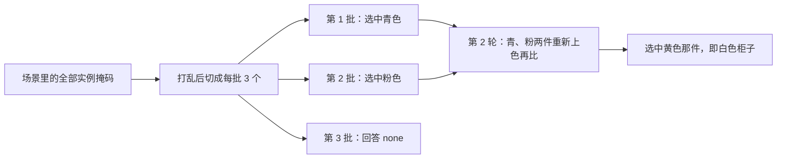

# FirePlace：不微调 3D，把「书放书架上」落成可解的表面约束

<!-- release-date: 2025-03-06 -->

> 本文依据 **FirePlace: Geometric Refinements of LLM Common Sense Reasoning for 3D Object Placement**，arXiv:2503.04919v1，2025-03-06，共 32 页；CVPR 2025 Highlight。作者来自 Google DeepMind 与斯坦福大学，第一作者 Ian Huang 的工作在 DeepMind 实习期间完成。页码均指 PDF 自身页码：正文 p. 1–8，参考文献 p. 9–11，p. 12 起是附录（附录页脚从 1 重新编号，本文仍按 PDF 页码引）。文中区分三件事：**论文明确写了什么**、**我们怎么解释它**、**哪些是外部资料或本文推算**。

## 读前先把几个词说成人话

- **MLLM（Multimodal Large Language Model，多模态大语言模型）**：能同时看图和读文字的大模型。本文的方法和全部基线都用现成的 Gemini-1.5 Pro，**不做任何 3D 微调**（PDF p. 6）。
- **USD（Universal Scene Description）**：一种显式的 3D 场景文件，物体网格、建筑构件、材质和层级都在文件里。论文写作 Universal Scene Descriptor（PDF p. 2、p. 16），指的是同一种格式。
- **包围盒（bounding box）**：把整件物体罩住的盒子。盒子内部的搁板、椅面、靠背，对盒子来说都不存在。
- **交互表面（interaction surface）**：真正参与约束的那块几何。FirePlace 把它表示成三维里的一块 **平面凸包**，包住法向相近的一组三角面（PDF p. 4）。书架某一层的搁板、椅子的坐垫、墙的立面，都是交互表面。
- **锚物体 $O_A$ 与可动物体 $O_T$**：约束总写在「已经在场景里的那件」（锚物体，如架子、墙、窗台）和「正要插入的那件」（可动物体，如书、相框、盆栽）之间（PDF p. 3–4）。
- **约束函数**：吃两块交互表面、吐出一个损失的函数，约束满足时损失最小（PDF p. 5）。求解器对可动物体的变换 $T$ 最小化这些损失之和。
- **视觉选择（visual selection）**：不让模型报物体名字，而是把候选涂成不同颜色，让模型报颜色来「指」（PDF p. 4）。
- **可行（feasible）与合理（plausible）**：前者指满足几何约束；后者还要照顾美观、功能与可达性这些常识（PDF p. 2）。

## 一句话先说清

往一间已经布置好的房间里加一件东西，要同时懂两件事：高层上「为什么该放这儿」，低层上「这块板、这面墙、这把椅子的几何长什么样」（PDF p. 2）。MLLM 常识够用，3D 几何是短板；常见对策是拿大量 3D 数据去微调（PDF p. 2）。

FirePlace 走另一条路：**模型本身不动，给它配上几何工具。** 模型负责写关系、指实例、指表面、看图挑结果；连续的三维坐标交给表面抽取算法和约束求解器。


输入是四样东西：一份 USD 场景、一个拍到这间房的相机视角、一件要插入的物体网格、一句语言指令；输出是插好物体的 USD，形式上是世界坐标系下的一个变换矩阵 $T$（PDF p. 2–3）。论文把这条链叫作「视觉思维链」（PDF p. 3）。

实验结论（PDF p. 6–8）：在 50 个场景、266 条摆放任务上，平移误差大约是两条 LLM 基线（LayoutGPT、Holodeck）的一半，可见性、合理性与约束正确率也都更高；人评在三个维度上都胜过两条基线。

### 一条阅读路线

1. **p. 2 引言的三个缺口**：细粒度几何、指得到实例、常识收尾。全文按这三条组织。
2. **p. 4 Figure 2 与 Algorithm 1、p. 5 Algorithm 2**：流水线和分批视觉选择。
3. **p. 5 §3.4 与 p. 15 附录 §13**：六条约束函数和它们的实现。
4. **p. 6–8 Table 1–3**：主表、人评、消融。
5. **p. 12 附录 §6 的失败模式与 p. 17 Figure 13**：这套方法在哪里会坏、分批到底值多少。

## 主要矛盾：旧方法吃包围盒，书架这种东西会摆错

论文指出，此前用 LLM 生成布局的系统，放到「往复杂的已有场景里加一件东西」这个任务上会缺三样能力（PDF p. 2）：

**细粒度几何。** 旧方法在物体的包围盒上推理。盒子能表达「桌子在沙发左边」，表达不了「书要落在架子某一层的搁板上」——关键表面在盒子里面（PDF p. 2）。

**指得到具体实例。** 房间里有四面墙、两把相似的椅子时，「挂到墙上」「放到椅子上」不够用。旧方法要么预设墙的布局，要么假定选哪个实例无所谓、或在构造时已经定好（PDF p. 2）。

**常识收尾。** 几何上能放不等于好看、好用、不挡路。旧方法往往不看最终画面，求出一个满足约束的位姿就结束（PDF p. 2）。

旧路线本身也分两类（PDF p. 3）：LayoutGPT 让模型直接吐物体的位置和朝向；Holodeck、SceneCraft 等改成「模型写约束、求解器解坐标」，这一步是对的，但约束仍写在盒子上，写不出物体局部之间的关系。

于是矛盾变成：

> MLLM 有常识，但看不清几何；几何工具算得准，但不懂人话。要把两者接起来，就得让模型的每一个输出都停在它擅长的离散选择上，并且选项要少到它看得过来。

## 核心设计一：约束大纲——模型写关系，不写坐标

### 新设计：三元组加一个六条的约束库

Stage 1 不输出任何坐标。给定指令 $l$、约束库 $F$ 和场景渲染图，模型产出一组三元组 $G=\{(f,t_A,t_T)\}$：$f$ 是库里的哪条约束，$t_A$ 用文字描述锚物体上参与约束的表面，$t_T$ 描述可动物体上的表面（PDF p. 3）。

约束库只有六条，全是作用在两块平面上的二元函数（PDF p. 5）：

| 函数 | 含义 |
|---|---|
| `Parallel(p1, p2)` | 两块表面平行 |
| `CloseTo(p1, p2, dist)` | 两块表面之间的最大距离为 `dist` |
| `FarFrom(p1, p2, dist)` | 两块表面之间的最小距离为 `dist` |
| `InfrontPlane(p1, p2)` | `p2` 在 `p1` 法向所指的那一侧 |
| `Contact(p1, p2)` | 两块表面接触 |
| `NoOverhang(p1, p2)` | `p1` 投影到 `p2` 上完全落在 `p2` 之内，用来表达「不要悬出边缘」 |

论文认为这六条组合起来能表达 Holodeck、SceneCraft 等前作的大部分约束（PDF p. 5）。附录 Figure 22 给模型看的文档里，第四条写成 `Above`（`surface1` 在 `surface2` 上方，且不保证俯视重叠），Figure 15 的可视化标签也是 Above（PDF p. 20、p. 24）；正文与附录 §13 叫 InfrontPlane。两个名字指同一条「分侧」约束，原文没有统一命名。

### 大纲长什么样

附录 Figure 23 的提示要求模型返回 JSON 列表，每项三个字段：约束名、`surface1` 的文字描述、`surface2` 的文字描述；可动物体一律称作 target object（PDF p. 25）。下面用 Figure 2 的窗台例子（两只动物玩偶放到窗台上）按这个字段格式写一份示意，**不是论文给出的原始输出**：

```json
[
  {"constraints": "Contact",
   "surface1": "bottom of the target object",
   "surface2": "top of the window seat"},
  {"constraints": "NoOverhang",
   "surface1": "bottom of the target object",
   "surface2": "top of the window seat"}
]
```

Figure 2 里原图的写法是 `Contact("Bottom of the animals", "Top of the window seat")` 加同一对表面的 `NoOverhang`（PDF p. 4）。提示还写死了几条规则（PDF p. 25）：列表必须以 Contact 开头，因为场景里没有东西是悬空的；距离关系一律用 CloseTo 或 FarFrom 表达，单位厘米，并假定场景是真实尺寸；没有相关约束时可以返回空列表。

### 为什么这样拆

LayoutGPT 那种「直接吐坐标」在定性对比里会出现物体相交、明显不合理的位置（PDF p. 8，Figure 5）。另一个极端是完全不写约束：消融里随机生成 100 个位姿、渲染后让模型挑，Mean L2 升到 124.11 cm，物体只有 24% 的时候看得见（PDF p. 7–8，Table 3）。常识能做最后一刀，做不了在整个位姿空间里从零搜索。

**我们如何解释它。** 大纲把模型的输出限制在三类离散量上：用哪条关系、哪块表面、少数几个带单位的距离。这正是语言模型相对稳的输出形态；连续位姿交给求解器。

## 核心设计二：表面而不是盒子——关键面往往在盒子里面

### 旧问题：包围盒把「能放东西的那一层」吃掉了


约束写在盒子上时，求解器看到的只有盒子的六个面。「书放在书架上」退化成「两个盒子叠在一起」，书会被送到整架顶上（PDF p. 2）。

### 新设计：先让模型说朝向，再让算法抽平面

对大纲里的每条三元组，FirePlace 分两步把表面的文字描述变成几何（PDF p. 4，Algorithm 1；p. 13–14，附录 §11）：

1. **DirExtr（抽方向）**：渲染锚物体，让 MLLM 从上、下、左、右、前、后六个方向里选出这块表面的法向。「椅子的坐垫」是朝上，「动物的底面」是朝下。附录说换提示就能支持更多方向，但实验只用了这六个（PDF p. 13）。
2. **SurfExtr（抽表面）**：保留法向与该方向余弦相似度够高的三角面，把面中心沿法向投影，用 DBSCAN 按「高度层」聚类；每一层的面投影到同一平面后拟合凸包，每块凸包就是一个候选交互表面（PDF p. 14）。

候选往往很多，附录又加了两道处理（PDF p. 14）：距离很近的候选合并，保留面积大的那块；再把朝同一方向的包围盒面也加进候选，因为不少约束用盒子面就够了。最后仍用视觉选择：候选表面用 matplotlib 涂成不同颜色叠在物体上，每批不超过 3 块，让模型报颜色（PDF p. 14）。

Figure 2 的窗台例子能说明这一步的用处：垫子和花瓶连在窗台的同一个网格上，FirePlace 仍抽出并选中了能放东西的那块面（PDF p. 7）。附录 Figure 20 是 L 形书桌，必须抽到真正的桌面、而不是整张桌子包围盒的顶面，才能写对 Contact 和 NoOverhang（PDF p. 22）。

### 收益、代价与边界

消融 −Geometry 把抽出的交互表面换成朝同一方向的包围盒面：可见性从 0.87 掉到 0.79，合理性从 2.94 掉到 2.89；作者的定性观察是，物体经常放不进架子，或放不上被大盒子包住、高度不一致的平面（PDF p. 8，Table 3）。

这一行的 Energy 反而更高（0.44 对 0.34）。作者的解释是：换成盒子后，模型写出的约束里很多本来就能用盒子解释，约束更少、更容易在真值位姿上成立，但表达力变差了（PDF p. 8）。**这是作者对表的解释，没有另做实验验证。**

代价在「规范空间」假设上。表面是在物体自己的规范坐标系里抽的，默认「规范空间里朝上的面，放进世界后仍朝上」。附录 Figure 7 就是反例：书架被艺术家在世界里转过，约束贴到了一个规范空间朝上、实际已转走的面上，书被放到了架子底下；作者说这种情况在数据集里少见（PDF p. 12–13）。余弦阈值、DBSCAN 参数与合并距离，原文都没有给出。

### 可迁移启发

只要接触发生在包围盒内部，就不要让语言模型在盒子上做空间推理。模型只说「哪一类表面、朝哪」，连续几何由网格算法交出来。FirePlace 同时把盒子面留作候选之一，而不是教条地只用细表面。

## 核心设计三：分批视觉选择——选项一多，模型就会指错

### 旧问题：caption 分不清哪把椅子，选项太多又看不过来

Holodeck 一类基线用 caption 加物体 ID 选锚物体（PDF p. 15–16）。房间里有几件相似的白柜、几面墙时，「白色柜子」这种描述会撞车。FirePlace 改成看图报颜色，但又撞上另一个问题：论文引用 V* 的发现，一次给模型太多视觉选项，它选对的能力会明显下降（PDF p. 5）。评测任务里，一个场景的物体数可以到 100 件以上，建筑构件也能到近 100 个（PDF p. 16，Figure 10）。

### 新设计：每次最多看 $m$ 个，赢的留下再比

Algorithm 2 把一次多选改成淘汰赛（PDF p. 5）：候选多于一个时先打乱，切成大小为 $m$ 的批；每批让模型挑出符合描述的那些，合并后再来一轮，直到只剩一个。系统默认 $m=3$（PDF p. 8、p. 17）。提示允许回答 `none`，即这一批里没有要找的物体（PDF p. 26，Figure 24）。

附录 Figure 9 画了一个物体不多的房间，任务是找「白色柜子」（PDF p. 15）。按原图过程重画：



分割掩码直接来自 USD 渲染，不另训分割网络（PDF p. 13）。所以这条能力绑定「场景已经是分件资产」这个前提。

论文把这一招归入「用推理期算力换准确率」一类，引用了重复采样和测试期计算的工作，以及作者自己的 BlenderAlchemy（PDF p. 3、p. 5）。**这些引用是动机，不是 FirePlace 测出的规律**；它自己测的是把 $m$ 调大会怎样。

### 收益、代价与边界

消融给了两刀（PDF p. 8，Table 3）：

- **−Vis. Select.**：去掉视觉选择，改回和基线一样按 caption 选锚物体。Mean L2 从 62.52 升到 67.61，Energy 从 0.34 掉到 0.25，可见性与合理性也下降。作者的解释是约束写到了错误实例上，对真值就不成立了。
- **−Vis. Scale.**：批大小一路加到一次最多 100 个选项。Mean L2 83.95，合理性 2.55，Energy 0.19。在 L2、合理性、Energy 三列上，这一刀比去掉细表面、去掉常识剪枝、去掉视觉选择都伤得更重（PDF p. 8）。


图引自 PDF p. 17 Figure 13，横轴是批大小。论文的文字说随批变大，合理性与 Energy 下降、两种 L2 上升（PDF p. 17）。**读图要留意一处：** 合理性曲线在批大小 6 时比默认的 3 更高，此后才下降；也就是说，$m=3$ 对 L2 和 Energy 是最优，对合理性不是。图上各点带误差带，没有给出精确数值；按目测，批大小 3 那一点与 Table 1、Table 3 的 Ours 都不完全一致。

代价是调用次数。候选越多、批越小，轮次越多；附录把「场景里已有物体越多、分批要选的就越多、调用 MLLM 越多」列为延迟的主要来源之一（PDF p. 12）。为什么选 3 而不是别的值，原文没有给出搜索过程。

### 可迁移启发

让 MLLM 在很多视觉选项里做单选时，不要把全部选项画进一张图。把「每一眼看几个」当成推理期的超参：每次只给看得过来的几个，用淘汰赛换准确率。这不依赖 3D；任何「在图上指哪个实例」的流程都能用。但这里的证据只覆盖家具场景和 Gemini-1.5 Pro，换模型后最优的 $m$ 不能照搬。

## 核心设计四：求解与常识剪枝——先保证能放，再挑该放

### 求解：把表面三元组变成可求值的损失

每条三元组依次走完「选锚物体 → 抽方向 → 抽表面 → 选表面 → 估参数」，变成一条真正可求值的约束（PDF p. 4，Algorithm 1）。连续参数 $\pi$ 只有 CloseTo 和 FarFrom 有，就是那段距离；模型看着场景渲染和涂色表面来估，单位厘米（PDF p. 14、p. 29）。收齐后对 $T$ 最小化损失和：

$$
\{T_1^\ast,\ldots\}=\arg\min_T\sum_{(f,\,s^A,\,s^T,\,\pi)\in R} f\bigl(s^A,\,T(s^T),\,\pi\bigr)
$$

$R$ 是全部约束的集合，$s^A$、$s^T$ 是选中的锚物体表面和可动物体表面。求解器是模拟退火，写法同 Infinigen Indoors；损失和低于某个标量阈值的解作为可行候选进入 Stage 5（PDF p. 5）。阈值、退火温度与迭代步数，原文没有给出。

附录 §13 写出了五条约束的实现（PDF p. 15）。设 $n_1$、$n_2$ 为两块表面的法向：

- **Parallel**：$\min\bigl(|1-n_1^\top n_2|,\;|-1-n_1^\top n_2|\bigr)$，法向同向或反向都算平行。
- **CloseTo**：$k\cdot\max\bigl(d(p_1,p_2)-\mathrm{dist},\,0\bigr)$，$k=0.1$；距离函数 $d$ 没有具体定义。
- **InfrontPlane**：取 $p_1$ 与 $p_2$ 顶点两两之差 $v_{ij}$，返回 $\min\bigl(0,\;\max_{ij}(-\tfrac{v_{ij}^\top n_1}{|v_{ij}|})\bigr)$。
- **Contact**：InfrontPlane$(p_1,p_2)$ 加 InfrontPlane$(p_2,p_1)$，两块面接触或共面时最小。
- **NoOverhang**：把 $p_1$ 投影到 $p_2$ 所在平面，在投影区域里采 1000 个点 $q_i$，返回 $1-\frac{1}{1000}\sum_i \mathbb{I}_{\mathrm{inside}}(q_i)$，即落在 $p_2$ 外的点的比例。

FarFrom 只有 §3.4 与 Figure 22 的文字定义，§13 没有对应公式。

### 常识剪枝：可行集合里再看一眼

几何过关的解往往不止一个。窗台例子里，Stage 4 给出好几个同时满足 Contact 与 NoOverhang 的位置，有的靠边；剪枝选出了更居中的那组（PDF p. 7）。

Stage 5 把每个候选插进场景渲染出来，再跑一轮视觉选择，任务换成「哪一张更合理」：先让模型写出好摆放应该满足什么（美观、功能、可达性），再两两比较渲染图（PDF p. 5）。做法沿用作者的前作 BlenderAlchemy。附录贴出了其余各段的提示词（PDF p. 23–32），唯独没有这一段的。

消融 −Com. Sense 直接拿可行解当最终结果：合理性从 2.94 掉到 2.60，可见性与 Energy 不变（0.87、0.34）（PDF p. 8）。这正是设计想要的分工：剪枝不改变约束是否成立，只改变结果看起来对不对。

### 边界

剪枝吃的是渲染图，能处理「约束没写出来、但人一看就不对」的情况；处理不了「可行集合本身全错」——约束如果没碰到正确的那块板，剪枝只是在错的集合里挑一个不那么难看的。附录 Figure 6 右图就是剪枝没救回来的例子：书底面和茶几接触了，却悬在桌沿外（PDF p. 12）。

### 可迁移启发

几何求解保证的是「能放」，不是「该放」。损失写不全是常态；把常识检查放在能看见结果的那一层（渲染或仿真之后），比把美观编成又一条能量更现实。前提是前面的可行集合够干净。

## 实验：证明了什么，没证明什么

### 评测怎么做

50 个由人类专家设计、带固定相机视角的写实 3D 场景，全部是 USD 格式（PDF p. 5、p. 16）。每条任务先选一件可动物体，用一句话标注它在场景里的摆法，再把它从场景里拿掉，剩下的就是输入场景；50 个场景共得到 **266 条任务**（PDF p. 5）。可动物体多是家具（椅、桌、冰箱）和装饰品（书、相框、墙饰），专挑「摆得对不对取决于指没指对锚物体、写没写对约束」的那种（PDF p. 16）。场景资产由 Manycore Tech 的 SpatialVerse 团队提供（PDF p. 9）。

五个指标（PDF p. 5–6）：

| 指标 | 量的是什么 | 方向 |
|---|---|---|
| Min L2（cm） | 同一任务多次尝试中，平移离真值最近那次的误差 | 越低越好 |
| Mean L2（cm） | 多次尝试的平均平移误差 | 越低越好 |
| Energy | 生成的约束里，在艺术家给的真值位姿上损失 < 0.01 的比例 | 越高越好 |
| Plausibility | Gemini 按 1–4 分量表给最终渲染打分 | 越高越好 |
| Visibility | 摆好后可动物体在渲染图里看得见的比例 | 越高越好 |

附录解释了为什么需要 Energy 和 Plausibility 两个指标（PDF p. 13）：真值只是众多合理摆法中的一个（杯子放桌上有无数合理位置），光看 L2 不公平。Energy 像约束的「精确率」——写错或过约束，真值上的损失就下不来；Plausibility 像「召回率」——约束写少了（比如杯子只写了 Parallel、没写 Contact），求解器会给出悬空的解，看图打分会抓住。

「多次尝试」到底几次，主实验没写。L2 只比平移、不比旋转。

基线是 LayoutGPT 与 Holodeck，因为两者都用大模型的常识，但各自缺 FirePlace 声称的三种能力（PDF p. 6）。两者都拿到 Gemini 根据单物体渲染写的 caption，并在「场景里已有这些物体」的前提下写坐标或约束；Holodeck 只用它负责摆放的约束布局模块，与 FirePlace 共用同一个求解器和同一组参数（PDF p. 6、p. 16）。三者都用 Gemini-1.5 Pro（PDF p. 6）。

### 主表：266 条文字指令任务

Table 1（PDF p. 6）：

| 指标 | LayoutGPT | Holodeck | FirePlace |
|---|---:|---:|---:|
| Min L2（cm，↓） | 89.01 | 113.17 | **48.39** |
| Mean L2（cm，↓） | 132.96 | 137.60 | **69.89** |
| Visibility（↑） | 0.79 | 0.63 | **0.88** |
| Plausibility（↑） | 2.14 | 2.13 | **2.95** |
| Energy（↑） | 不适用 | 0.22 | **0.42** |

LayoutGPT 不写约束，所以没有 Energy。Holodeck 的定性失败有两类：盒子表示放不进书架；按 caption 选错锚物体（PDF p. 7，Figure 4）。

这些数字支撑的是：在这 266 条「先拿走再放回」的任务上，相对两条 LLM 包围盒基线，FirePlace 平移更近、更常看得见、打分更高、写出的约束更常在真值上成立。它们不支撑「已达到可用的室内设计质量」——Mean L2 仍约 70 cm；也不能拿来和其他布局论文排名，测试集不同。

### 人评：30 人、2075 组对比

参与者看两张随机左右排列的渲染图和原指令，从三个角度选更好的一张或判平：物理上是否合理（不悬空）、是否符合指令、是否符合常识（PDF p. 7）。Table 2（PDF p. 7）：

| | 物理 | 语义 | 常识 |
|---|---:|---:|---:|
| 胜 Holodeck | 60.27% | 65.70% | 62.08% |
| 平 Holodeck | 19.69% | 20.77% | 19.81% |
| 胜 LayoutGPT | 76.02% | 76.10% | 76.42% |
| 平 LayoutGPT | 11.39% | 11.47% | 11.22% |

没有单列「负」，胜加平之外的就是输。在人有明确偏好的样本上，Plausibility 分数与人的判断一致 89.82%（PDF p. 7；附录 p. 13 写作 89.92%，两处差 0.1 个点）。参与者是否专家、每人看多少组，原文没写。

### 消融：五刀在同一张表上

Table 3（PDF p. 8），L2 按表注是 Mean L2：

| 设定 | L2（↓） | Vis（↑） | Plaus.（↑） | Energy（↑） |
|---|---:|---:|---:|---:|
| 完整方法 | **62.52** | **0.87** | **2.94** | 0.34 |
| −Constraints：随机 100 个位姿再看图挑 | 124.11 | 0.24 | 1.95 | 不适用 |
| −Vis. Select.：按 caption 选锚物体 | 67.61 | 0.82 | 2.85 | 0.25 |
| −Geometry：表面换成包围盒面 | 63.44 | 0.79 | 2.89 | **0.44** |
| −Com. Sense：不做常识剪枝 | 66.08 | **0.87** | 2.60 | 0.34 |
| −Vis. Scale.：一次最多看 100 个选项 | 83.95 | 0.84 | 2.55 | 0.19 |

**这张表的完整方法与 Table 1 的 FirePlace 不是同一组数字**：Mean L2 62.52 对 69.89，Energy 0.34 对 0.42，合理性 2.94 对 2.95。原文没有解释差别来自采样次数、随机种子还是任务子集，两张表只宜各自内部比较。附录 Figure 11–12（大衣挂进衣柜、瓶子放上柜子）给了各刀的定性后果：去掉约束会悬空，去掉剪枝会和已有物体重叠（PDF p. 16–17）。这是作者挑的例子，不是量化。

### 附录：换成图像示范，和让 Gemini 当裁判

因为约束大纲也由 MLLM 写，指令可以换成一张示范摆放图，让模型写出类似的约束（PDF p. 18，§17）。Table 4（PDF p. 17）：

| 指标 | LayoutGPT | Holodeck | FirePlace |
|---|---:|---:|---:|
| Min L2（cm，↓） | 126.19 | 91.25 | **43.69** |
| Mean L2（cm，↓） | 166.11 | 136.51 | **68.84** |
| Visibility（↑） | 0.69 | 0.59 | **0.88** |
| Plausibility（↑） | 2.31 | 1.99 | **2.92** |
| Energy（↑） | — | 0.17 | **0.38** |

两条基线之间的次序和文字输入时相反：文字输入下 LayoutGPT 的两种 L2 都优于 Holodeck，图像输入下反过来。原文没有讨论。Figure 14 的定性是：输出会跟着示范图的语义走，最终位置可以不同（PDF p. 18）。

§18 再让 Gemini-1.5 Pro 看成对渲染图当裁判（PDF p. 18–19）。文字输入（Table 6）：FirePlace 对 LayoutGPT 胜率 0.70，对 Holodeck 0.72；LayoutGPT 对 Holodeck 0.54。图像输入（Table 5）：FirePlace 对两者都是 0.72；LayoutGPT 对 Holodeck 0.56。这里同一个模型既是选手的底座又是裁判，只能当人评之外的一致性旁证。

## 限制、边界与不要补进去的实现

- **延迟。** 除 Stage 4 求解外每一段都调用 MLLM，摆一件东西要 30 秒到 2 分钟，随已有物体数和抽出的表面数变化；渲染候选占了大量时间，实验只用 CPU，作者认为换 GPU 渲染可能更快（PDF p. 12）。没有按场景规模分档的耗时表。
- **三类常见失败**（PDF p. 12，Figure 6）：约束库里没有「不许相交」，花盆会和已有物体重叠；约束写不全，椅子只约束了与地面接触、没与邻椅靠背平行，朝向就乱了；剪枝没删掉悬边的结果，多发生在物体相对场景很小时。此外还有选错锚物体或表面（继承自 MLLM），以及上文的规范空间假设。作者预期 MLLM 变强后前者会缓解，这是展望，没有按模型代际测过。
- **评测提示的小瑕疵。** 附录 Figure 21 的合理性量表在 2、3 分的定义里拿结果与「参考图」比较，Figure 23 的大纲提示也提到「参考图」（PDF p. 23、p. 25），更像是图像示范设定的版本；文字指令设定下提示是否改过，原文没说。
- **原文没公开的：** 代码、USD 场景与 266 条任务；模拟退火的阈值、温度与步数；每条任务尝试几次；余弦阈值、DBSCAN 参数与合并距离；FarFrom 的实现公式与距离函数 $d$ 的定义；Stage 5 剪枝的提示词；Table 1 与 Table 3 数字不一致的原因。
- **社会影响一节**只说除继承现有 MLLM 的偏见外没有预见到显著负面影响（PDF p. 13），没有偏见评测。

## 可迁移启发

1. **表示要匹配接触发生的位置。** 接触在盒子内部就抽表面；接触在盒子外面，盒子约束就够用。
2. **语言模型停在离散选择上。** 关系类型、六选一的朝向、颜色名、少数带单位的距离，是它相对稳的输出；三维坐标不是。
3. **选择题的题量是推理期超参。** 分批不是装饰：一次看 100 个选项，比拿掉细粒度几何伤得还重。
4. **常识检查放在能看见结果之后。** 先求可行集合，再渲染剪枝；损失写不全时，看图比把美观编进能量现实。
5. **评测要拆开「约束写对没有」和「看起来对不对」。** Energy 抓写错与过约束，Plausibility 抓欠约束；只看 L2 对「杯子放桌上有很多合理位置」不公平。
6. **不微调也有代价。** 每一步都在调模型、做渲染，一件东西 30 秒到 2 分钟，适合交互式编辑，批量铺满房间会很贵。

## 关键词回看

- **USD**：显式的分件 3D 场景文件；FirePlace 的输入和输出都在这一层。
- **包围盒 vs 交互表面**：前者罩住整件物体；后者是法向一致的平面凸包，对应搁板、椅面、墙面。
- **约束大纲**：$(f,t_A,t_T)$ 三元组，此时表面还只是文字。
- **DirExtr / SurfExtr**：先让模型在六个方向里选法向，再按法向分层抽凸包。
- **分批视觉选择**：每次至多看 $m$ 个涂色选项的淘汰赛，默认 $m=3$。
- **可行 / 合理**：满足几何约束；再加上美观、功能、可达性。流水线先求前者，再挑后者。
- **Energy / Plausibility**：约束在真值上成立的比例；Gemini 的 1–4 分打分。分别对应约束的精确率与召回率。

## 资料与阅读边界

**版本与首发日。** arXiv:2503.04919 截至核验只有 v1。`release-date` 取 2025-03-06，即 arXiv v1 的提交日：FirePlace 没有公开的代码、权重或服务，项目页晚于 arXiv 建立（2025-03-23 起提交），CVPR 2025 会议也在其后。

**外部资料补充（不是 PDF 原文）：**

- 项目页：<https://fireplace3d.github.io/>，标注 CVPR 2025 Highlight，只链接 arXiv 与作者介绍帖，没有代码链接。
- CVPR 2025 论文集收录的是 11 页的会议版（[CVPR Open Access](https://openaccess.thecvf.com/content/CVPR2025/html/Huang_FirePlace_Geometric_Refinements_of_LLM_Common_Sense_Reasoning_for_3D_CVPR_2025_paper.html)）；本文的页码与附录内容都以 32 页的 arXiv 版为准。
- 文中提到的方法均为原文引用：LayoutGPT（直接预测包围盒位置与朝向）、Holodeck（盒子约束加求解器）、SceneCraft、Infinigen Indoors（模拟退火求解器的写法来源）、BlenderAlchemy（看渲染图做 MLLM 剪枝的前作）、V*（视觉选项越多越容易选错的观察）。

**同方向已发布、只对照问题粒度的几篇**：LayoutVLM 与 Global-Local-Tree-Search 也做室内 3D 布局，但分别偏向可微优化和树搜索生成整个场景；CAST 从单张照片重建分件场景；SpatialLLM 与 Video-3D-LLM 做 3D 空间问答与场景理解。FirePlace 的输入是已经建好的 USD 场景，任务是按一句话插入一件物体。不要把那几篇的数字读进本文。
