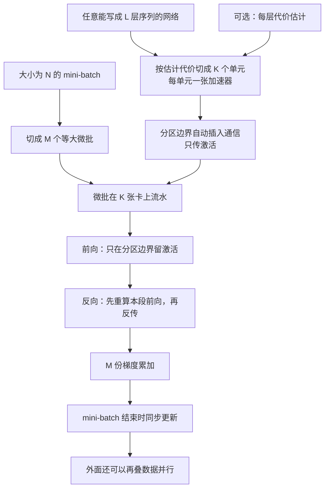

# GPipe：按层切开大网，微批流水线让加卡不必改梯度

<!-- release-date: 2018-11-16 -->

> 本文依据 Google 的 **GPipe: Efficient Training of Giant Neural Networks using Pipeline Parallelism**，NeurIPS 2019 正式发表版（会议录 103–112 页，正文 PDF 共 10 页）及随会议发布的 6 页补充材料；arXiv 编号 1811.06965。页码 `(PDF p. N)` 指正文 PDF 自身的 1–10 页，补充材料写作「补充材料 p. N」。文中会区分三件事：**论文明确写了什么**、**我们怎么解释或验算它**、**哪些是外部资料**。

## 读前先把几个词说成人话

这篇论文的门槛不在公式，而在它同时用了两套词：「模型怎么切」和「一个训练步怎么走」。先把它们分开。

- **加速器（accelerator）**：论文里的 GPU 或 TPU。同一篇里两种硬件都出现，读表时先看是哪一种。
- **层（layer）**：网络里能单独写出前向函数 $f_i$ 与参数 $w_i$ 的一段。卷积、残差块、Transformer 层，在这里都只是「一层」。
- **分区 / 单元（partition / cell）**：连续若干层捆成一组，放到一张加速器上。第 $k$ 个单元的前向记作 $F_k$，反向记作 $B_k$。
- **Mini-batch（小批量）**：一次参数更新看到的全部样本，大小记作 $N$。同步 SGD 的更新单位是它。
- **Micro-batch（微批）**：把一个 mini-batch 再切成 $M$ 等份。流水线一次推一份微批，梯度先攒着，$M$ 份都算完才更新。
- **朴素模型并行（naive model parallelism）**：层切到多卡上，但数据不切，一个 mini-batch 整份走完前向再走反向。
- **流水线气泡（pipeline bubble）**：后一段在等前一段、加速器空转的那段时间。
- **重计算（re-materialization）**：前向时丢掉大部分中间激活，反向时把这一段前向再算一遍，拿计算换显存。
- **$T(L,H,A)$**：编码器 $L$ 层、解码器 $L$ 层、前馈隐层 $H$、注意力头 $A$ 的 Transformer，模型维度固定 1024（PDF p. 6 脚注 1）。所以「128 层」是 $T(64,\cdot,\cdot)$。

GPipe 本身是一个 **流水线并行库**，不是一种新网络。它落地在 Google 的 Lingvo 框架里（PDF p. 2）。

## 一句话先说清

2018 年的共识已经很清楚：模型做大，图像与翻译质量都会涨。卡住的不是「要不要做大」，而是 **一张加速器的内存做不大**。当时的模型并行又多半绑死某种架构：为某类卷积或某类矩阵乘专门写一套，换任务就作废（PDF p. 1）。

GPipe 的回答很窄，也很硬：

> 任何能写成「一层接一层」的网络，都按层切到多张加速器上；再把 mini-batch 切成微批做流水；梯度在整个 mini-batch 上同步累积，所以切成几段都不改变这次更新在优化什么。

摘要给了两张质量收据（PDF p. 1）：

- 图像：557M 参数的 AmoebaNet，ImageNet-2012 top-1 **84.4%**；
- 翻译：单个 6B 参数、128 层的 Transformer，覆盖 100 多种语言，质量超过全部双语模型。

对训练系统来说，要记的是边界：你买到的是「加卡不改更新语义」和一条在层间均衡时几乎线性的吞吐曲线；你没有买到把单层矩阵乘切到多卡的张量并行，也没有买到后来「做一个前向就还一个反向」的 1F1B 日程。

### 一条阅读路线

只有半小时时，按这个顺序读原文：

1. **p. 3 的图 2**：朴素切法为什么空转，微批流水把空转填到哪里。下文第一张图就是它的重画。
2. **p. 3 的 §2.2–2.3**：同步累积与重计算，两件事撑起「与分区数无关」和「显存放得下」。
3. **p. 4 的气泡公式与 $M\ge 4K$**，**p. 5 的表 2 与表 4**：气泡多大，开销到底花在哪。
4. **p. 4 的表 1**：能塞多大的模型。
5. **p. 6 的表 5、p. 7 的图 3**：切开之后质量还在不在。
6. **p. 8 的 §6**：和 Mesh-TensorFlow、PipeDream 各让了什么。

## 主要矛盾：单卡装不下，旧的模型并行又绑死架构

论文先指出一条已经走通、却越来越贵的路（PDF p. 1–2）。图 1a 把近年代表性图像模型的参数量与 ImageNet top-1 画在一起，容量涨了大约 36 倍，准确率跟着涨；图 1b 在自家多语翻译语料上，模型越大平均 BLEU 越高（PDF p. 2）。图 1a 的红点图注写的是 550M 的 AmoebaNet，正文与摘要写 557M；同一份 PDF 两个数并存，下文统一用 557M。

硬件没有跟上。论文把约束写成两条：加速器的内存上限，以及加速器之间的通信带宽，逼着用户把大模型切开、分到不同加速器上（PDF p. 1）。难处在于，高效的模型并行算法极难设计，实践者常被迫在「扩容量」「通用性」和「训练效率」三者之间取舍，结果最高效的做法往往只适用于特定架构和任务（PDF p. 1）。

矛盾因此是：

> 研究者想加卡就把模型做大，但不想每换一个网络就重写并行算法，更不想因为切成几段，这次梯度就变成了另一种更新。

GPipe 的办法是把「放置」和「优化语义」拆开：放置随分区数 $K$ 改变，一次更新永远是这份 mini-batch 的同步梯度。

## 先看全景：不是新网络，是一条按层切的流水线

这张图按 PDF p. 2–4 的叙述重画，是流程示意，不是论文原图。三个旋钮贯穿全文，先分清：

| 旋钮 | 符号 | 改它会怎样 | 这次更新的数学对象变不变 |
|---|---|---|---|
| 分区数 | $K$ | 模型按层切到更多卡 | 不变，论文的设计保证 |
| 微批数 | $M$ | 气泡变薄、每份微批变小 | 不变；但 BatchNorm 的训练统计跟着微批走 |
| Mini-batch 大小 | $N$ | 一次更新看多少样本 | 这才是 SGD 的对象 |

后文所有「与分区数无关」说的都是 $K$，不是 $M$。

## 核心设计一：把 mini-batch 切成微批，让不同卡同时干不同份数据

### 旧问题：层与层是一条链

图 2a 把一个四段网络放到四张卡上（PDF p. 3）。$B_k$ 既依赖上一段传回来的 $B_{k+1}$，也依赖本段前向 $F_k$ 的结果。这是反向传播本来的依赖，不是 GPipe 引入的。

朴素切法（上图 b）里，一份 mini-batch 必须整份走完四段前向、再整份走完四段反向，然后四张卡一起更新。论文把后果写成一句：网络的顺序依赖导致严重的低利用率（PDF p. 3）。加卡买到的只是「塞得下」，不是并行。

### 新设计：同一条链上同时走多份数据

GPipe 把大小为 $N$ 的 mini-batch 切成 $M$ 个等大微批，在 $K$ 张加速器上流水（PDF p. 3）。Device 0 算完第 0 份微批的前向，立刻把边界激活交给 Device 1，自己转去算第 1 份。上图 c 就是原文图 2c 的逐格重画：先做完全部微批的前向，再按微批下标递减做完全部反向，最后四卡一起更新。

两件事要从图上读准：

- **图 2c 不是后来的 1F1B。** 前向全部做完才开始反向，没有「做一个前向就还一个反向」的交错。
- **中间那块空白是气泡。** 每张卡在 8 格计算之外空着 3 格前向与 3 格反向的时间，正是流水线灌满与排空的代价。

### 工作机制：接口只有三样

用户只需给出三样东西（PDF p. 3）：分区数 $K$、微批数 $M$，以及 $L$ 层的顺序与定义。每层给出前向函数 $f_i$ 与参数 $w_i$，还可以给一个代价估计 $c_i$。第 $k$ 个单元的前向是这些层的复合 $F_k = f_j\circ\cdots\circ f_i$，反向 $B_k$ 由自动符号微分得到，单元代价是层代价之和（PDF p. 3）。

切分算法让各单元的估计代价方差最小，目的是让各段耗时对齐；分区边界上自动插入通信原语，相邻分区之间只传数据（PDF p. 3）。接口示例在补充材料里：用户把网络写成层列表，交给流水线层（补充材料 p. 1–2）。

### 可迁移启发

先问两件事：模型能不能写成层序列，一个训练步能不能切成彼此独立的若干份。两个都能，这篇的流水线才用得上。若热点是单层内部的巨型矩阵乘，GPipe 明确假定「单层先得装进一张加速器」（PDF p. 8），这里给不了现成切法。

## 核心设计二：同步累积，所以梯度与分区数无关

「与分区数无关」不是口号，是同步 mini-batch SGD 的直接推论（PDF p. 2–3）：

- 每个微批的反向，用的是它前向时的同一份参数；
- 一个 mini-batch 结束，把 $M$ 份梯度累加，再同时更新所有加速器上的参数；
- 中间没有任何异步的参数更新。

满足这三条，切成 2 段还是 8 段，这次更新都是同一份大小为 $N$ 的 mini-batch 的梯度。论文的原话是：梯度更新与分区数无关，研究者因此可以靠加加速器把模型做大（PDF p. 2）。结论把它收成第三条属性 Reliability（PDF p. 8）。

补充材料给了两份实际核对。一份是单元测试：同一个网络切成 1、2、4 段，梯度范数都要等于同一个值，误差 $10^{-6}$（补充材料 p. 2）。另一份是端到端：AmoebaNet-D (6, 256) 训 35 个 epoch，官方实现跑 5 次取均值与标准差；GPipe 在 1、2、4、8 个分区上的最终准确率都落在均值的 1.6 个标准差以内（补充材料 p. 3）。

**我们如何解释它。** 这条保证对 $K$ 成立，不对 $M$ 成立。论文自己写明：用了 BatchNorm 时，训练阶段的充分统计量按 **每个微批** 算（必要时跨副本同步），评估时用整个 mini-batch 上的滑动平均（PDF p. 3）。第 6 节把这类「要看整批」的层列为需要额外策略的限制（PDF p. 8）。

这份保证的代价要一起记：

| 代价 | 在哪 | 为什么非付不可 |
|---|---|---|
| 必须等 $M$ 份微批都走完才更新 | 图 2c、§2.2 | 否则就不是这份 mini-batch 的同步梯度 |
| 前向和反向之间有气泡 | §2.3 | 先灌满、再排空，链的两端必然空一段 |
| 多份微批的边界激活同时活着 | §2.3 | 前向全做完才开始反向 |
| BatchNorm 统计跟着微批走 | §2.2、§6 | 微批不是原来的 mini-batch |
| 单层必须装进一张卡 | §6 与脚注 3 | 它不切单次矩阵乘 |

### 可迁移启发

要「加卡不改收敛」，先锁死更新边界：一个 mini-batch 只能有一次参数更新，微批只是计算编排。$K$ 是放置，$M$ 是填气泡，不是同一个旋钮。任何依赖整批统计的层（BatchNorm、对比学习的批内负样本），都要单独规定微批口径。

## 核心设计三：重计算，把激活收到「边界 + 当前一段」

不重计算、也不切分时，算第 $i$ 层的梯度既要上一层传回的梯度，又要缓存的前向激活 $f_i(x)$，峰值激活按 $O(N\times L)$ 走（PDF p. 3）。网络一深，激活比参数先爆。

GPipe 的做法是（PDF p. 3）：

- 前向时，每张加速器 **只保存分区边界上的输出激活**；
- 反向时，第 $k$ 张卡把本段的复合前向 $F_k$ 重算一遍，当场恢复需要的中间量。

峰值激活因此降到

$$
O\left(N + \frac{L}{K}\times\frac{N}{M}\right)
$$

$N/M$ 是微批大小，$L/K$ 是每个分区的层数（PDF p. 3）。

**我们如何解释它。** 第一项来自边界激活：前向全做完才开始反向，$M$ 份微批的边界输出都得留到各自的反向到来，每份大小 $N/M$，合起来是 $O(N)$。第二项是重算当前这一段时，本分区内部、当前这一份微批的激活。$M$ 在分母上，$M$ 变大第二项变小。常见的「GPipe 日程要攒 $M$ 份完整激活」说的是不配重计算的情形，不是这篇论文给出的式子。

表 1 第一行给出单卡的实测账（PDF p. 4）：不用 GPipe 时，单张 8 GB 加速器最多训 82M 的 AmoebaNet；开 GPipe 之后，靠重计算与切微批，中间激活从 6.26 GB 降到 3.46 GB，单卡能放 318M（PDF p. 4）。表注说明每个参数按 12 字节计，因为训练用的是 RMSProp（PDF p. 4）。

重计算不是免费的，下一节的开销拆账会给出它的价钱。

### 可迁移启发

流水线并行与重计算是一套：只切不重算，边界激活和层内激活一起涨；只重算不切，参数仍塞不进。讨论 GPipe 显存时，先把重计算算进去，再谈微批份数。

## 气泡有多大，时间到底花在哪

### 气泡公式与 $M\ge 4K$

图 2c 中间那块空白，论文叫 bubble overhead。把它摊到 $M$ 个微步上，是（PDF p. 4）

$$
O\left(\frac{K-1}{M+K-1}\right)
$$

**我们如何解释它。** 分子 $K-1$ 是灌满和排空一条 $K$ 段流水线时两端必然空出的段数；分母 $M+K-1$ 是每张卡从开始到结束经过的总步数。上面那张图里 $K=M=4$，每张卡 7 步里空 3 步。后来的资料常写成 $(K-1)/M$，那是相对「理想计算时间」的另一种分母口径。

论文的经验阈值是：$M\ge 4K$ 时气泡几乎可以忽略；部分原因是反向里的重计算可以提前调度，不必等更早层的梯度（PDF p. 4）。

### 表 2：$M$ 太小时加卡几乎没用

表 2 在 TPU 上测归一化吞吐，模型是 AmoebaNet-D (18, 256) 和 48 层 Transformer，每个分区一张加速器，以 $K=2,M=1$ 为 1；必要时调整 batch 大小以塞进内存（PDF p. 5）。

| $M$ | AmoebaNet $K=2$ | $K=4$ | $K=8$ | Transformer $K=2$ | $K=4$ | $K=8$ |
|---|---:|---:|---:|---:|---:|---:|
| 1 | 1 | 1.13 | 1.38 | 1 | 1.07 | 1.3 |
| 4 | 1.07 | 1.26 | 1.72 | 1.7 | 3.2 | 4.8 |
| 32 | 1.21 | 1.84 | 3.48 | 1.8 | 3.4 | 6.3 |

读表只抓三件事（PDF p. 5）：

1. $M=1$ 等于没有流水线，吞吐几乎不随卡数涨，说明同一时刻只有一张卡在算。这是图 2b 的数字版。
2. Transformer 在 $M=32$、卡数从 2 到 8 时，吞吐从 1.8 到 6.3，即论文说的「四倍加速器约 3.5 倍」。
3. AmoebaNet 同样条件只有 $3.48/1.21\approx 2.9$ 倍（这道除法是我们算的），因为它各层计算量不均；Transformer 各层一样，才接近线性。

### 表 4：步时间拆账，大头是重计算

正式版新增了一节性能开销拆账（§3.1），用饼图给出 Cloud TPU 上一步时间的构成（PDF p. 5）。图上读得出的比例：

| 时间去向 | 占一步时间 |
|---|---:|
| 正常计算 | 65.6% |
| 重计算 | 22.5% |
| 气泡 | 4.1% |
| 负载不均 | 3.2% |
| 启动开销 | 2.9% |
| 权重更新 | 图上未标数值，余量约 1.7% |

权重更新那一格是我们用 100% 减去其余五项推出来的。论文的读法是（PDF p. 5）：

- **重计算是 GPipe 最大的开销来源**，最多占一步时间的 23%；
- 负载不均是第二个来源，两个分区时只有 3.2%；
- 实测气泡略低于理论值，部分因为重计算被提前调度去填气泡；
- 流水线末尾聚合梯度、更新权重的时间也小，得益于加速器间的高速互联。

**我们如何解释它。** 这张饼图改变了读这篇论文的重心：在这个配置下，真正贵的不是气泡，而是为了省显存付出的重计算。它也没有写明对应的模型、$K$ 与 $M$，正文只提到「两个分区时」的负载不均，所以不能把 4.1% 当成任意配置下的气泡。

### 可迁移启发

先把 $M$ 加到约 $4K$ 再谈线性度；$M=1$ 的那一行已经说明，加卡不加微批只买到放置。层间不齐时别指望流水线自己抹平负载。最后，拆账要做全：压完气泡，下一个大头往往是重计算。

## 规模：同样的卡，能塞多大的网

表 1 分上下两块（PDF p. 4）。先把硬件口径钉住：正文写 AmoebaNet 这组跑在 **Cloud TPUv2**，每加速器 8 GB，输入 $224\times 224$，mini-batch 128；表头却印着「NVIDIA GPUs (8GB each)」（PDF p. 4）。8 GB 与 TPUv2 单核对得上。**我们的判断**：表头更像残留，以正文为准。

| 设定 | AmoebaNet-D (L, D) | 参数 | 参数内存 | 峰值激活 |
|---|---|---:|---:|---:|
| Naive-1 | (18, 208) | 82M | 1.05 GB | 6.26 GB |
| Pipeline-1 | (18, 416) | 318M | 3.8 GB | 3.46 GB |
| Pipeline-2 | (18, 544) | 542M | 6.45 GB | 8.11 GB |
| Pipeline-4 | (36, 544) | 1.05B | 12.53 GB | 15.21 GB |
| Pipeline-8 | (72, 512) | 1.8B | 24.62 GB | 26.24 GB |

Naive-1 是不用 GPipe 的顺序版本，Pipeline-$k$ 是 $k$ 个分区、$k$ 张加速器（PDF p. 4）。8 张加速器放到 1.8B，论文写成「比不用 GPipe 大 25 倍」，并解释不完全线性是因为 AmoebaNet 各层参数分布不均（PDF p. 4）。直接相除 $1.8\text{B}/82\text{M}\approx 22$，25 倍是论文自己的写法。

下块是 Transformer，跑在 **Cloud TPUv3**，每核 16 GB；词表 32k、序列长度 1024、batch 32；每层模型维 2048、前馈 8192、32 个头，靠加层做大（PDF p. 4）。

| 设定 | 层数 | 参数 | 参数内存 | 峰值激活 |
|---|---:|---:|---:|---:|
| Naive-1 | 3 | 282.2M | 11.7 GB | 3.15 GB |
| Pipeline-1 | 13 | 785.8M | 8.8 GB | 6.4 GB |
| Pipeline-8 | 103 | 5.3B | 59.5 GB | 50.9 GB |
| Pipeline-32 | 415 | 21.0B | 235.1 GB | 199.9 GB |
| Pipeline-128 | 1663 | 83.9B | 937.9 GB | 796.1 GB |

单卡上重计算放大约 2.7 倍；128 个分区放到 83.9B，是单卡的 298 倍（PDF p. 4）。Transformer 每层参数与输入一样大，所以最大模型随加速器数线性放大（PDF p. 4）。

两块表别混：25 倍是 AmoebaNet、8 张 TPUv2、相对 Naive-1；298 倍是 Transformer、128 张 TPUv3、相对单卡。输入分辨率也不是后文 ImageNet 质量实验用的 $480\times 480$。

## 通信：没有高速互联，吞吐仍接近线性

GPipe 只在分区边界传激活，所以论文声称没有高速互联也能放大（PDF p. 4）。表 3 在单机多块 **NVIDIA P100、没有 NVLink** 上验证，跨卡数据要经过 PCI-E 先到主机再回设备；$M$ 固定 32，AmoebaNet 用 D (18, 128)，Transformer 用 24 层（PDF p. 5）。

| $M=32$ | AmoebaNet $K=2$ | $K=4$ | $K=8$ | Transformer $K=2$ | $K=4$ | $K=8$ |
|---|---:|---:|---:|---:|---:|---:|
| 归一化吞吐 | 1 | 1.7 | 2.7 | 1 | 1.8 | 3.3 |

分区从 2 加到 8，AmoebaNet 2.7 倍，Transformer 3.3 倍，和 TPU 上的近线性同类（PDF p. 5）。论文的读法是：设备间带宽不再是模型并行的瓶颈，因为只在边界传激活。

**我们如何解释它。** 表 3 只有相对吞吐，没有带宽或通信占比。它支持的是「边界传激活比每层一次 AllReduce 便宜」，不是「通信为零」。

## 图像：557M AmoebaNet，ImageNet top-1 84.4%

质量实验不是「最大能塞多大」。这里把 AmoebaNet 加宽通道、输入拉到 $480\times 480$，得到 557M 的 AmoebaNet-B (18, 512)，超参沿用 AmoebaNet 原论文，切成 **4 个分区**，单裁验证 top-1 **84.4%**、top-5 **97%**（PDF p. 5–6）。

再用这份 ImageNet 权重做迁移：换掉最后一层 softmax、随机初始化，其余层沿用；输入仍是 $480\times 480$，随机水平翻转加 cutout，其余超参与 ImageNet 相同（PDF p. 6）。表 5 是 5 次微调的平均单裁测试准确率（PDF p. 6）：

| 数据集 | 训练 / 测试 | 类数 | 准确率 % | 此前最好 % |
|---|---:|---:|---:|---|
| ImageNet-2012 | 1,281,167 / 50,000 | 1000 | 84.4 | 83.9（85.4\*） |
| CIFAR-10 | 50,000 / 10,000 | 10 | 99.0 | 98.5 |
| CIFAR-100 | 50,000 / 10,000 | 100 | 91.3 | 89.3 |
| Stanford Cars | 8,144 / 8,041 | 196 | 94.6 | 94.8\* |
| Oxford Pets | 3,680 / 3,369 | 37 | 95.9 | 93.8\* |
| Food-101 | 75,750 / 25,250 | 101 | 93.0 | 90.4\* |
| FGVC Aircraft | 6,667 / 3,333 | 100 | 92.7 | 92.9\* |
| Birdsnap | 47,386 / 2,443 | 500 | 83.6 | 80.2\* |

表注说明：Real 等人与 Cubuk 等人的基线是从零训练的；ImageNet 那格的 85.4% 用了非公开的 Instagram 数据预训练；Ngiam 等人用私有的 JFT-300M 预训练还能更好（PDF p. 6）。其余带星号的格子，表注没有逐一说明。Stanford Cars 与 FGVC Aircraft 两行，GPipe 略低于此前最好。补充材料给出各数据集选出的学习率与 $L_2$，选法是在 20% 训练数据的留出集上网格搜索（补充材料 p. 1）。

这节要证明的不是新图像算法，而是：**切开之后，大卷积网仍然训得动、质量还在涨。** 超参沿用原论文，等于在说并行没有改动优化。

## 翻译：单个 6B、128 层模型覆盖 103 种语言

第 5 节把灵活性从卷积换到序列模型（PDF p. 6）。语料是 102 种语言与英语之间的平行文档，共 250 亿训练样本，每种语言 $10^4$ 到 $10^9$ 条不等；补充材料写得更细：最少 35k、最多 20 亿（PDF p. 6；补充材料 p. 3）。

对照尺是单个 Transformer，沿两个方向放大：加深度，或者加前馈隐层与注意力头（PDF p. 6）。起点是 400M 的 Transformer Big $T(6,8192,16)$，词表 64k（PDF p. 6）。

| 模型 | 参数 | 切到几张加速器 |
|---|---:|---:|
| $T(6,8192,16)$ | 400M | 正文没写 |
| $T(12,16384,32)$ | 1.3B，宽 | 2 |
| $T(24,8192,16)$ | 1.3B，深 | 4 |
| $T(32,16384,32)$ | 3B | 8 |
| $T(64,16384,32)$ | 6B | 16 |

分区那句把深模型写成 $T(24,8192,32)$（PDF p. 7），同页前后文都写 $T(24,8192,16)$；**我们的判断**是笔误，本文用 16 头。

图 3 的横轴按训练数据从多到少排列 102 种语言，纵轴是相对各自双语基线的 BLEU 差（PDF p. 7）。正文没有逐语言数字，下表是从平滑曲线读出的约值，只为给形状一个刻度：

| 模型 | 高资源端（图左） | 低资源端（图右） |
|---|---:|---:|
| 400M $T(6,8192,16)$ | 约 −4 | 约 +10 |
| 1.3B 宽 $T(12,16384,32)$ | 约 −0.5 到 0 | 约 +8 |
| 1.3B 深 $T(24,8192,16)$ | 约 0 | 约 +15 |
| 6B $T(64,16384,32)$ | 约 +1 | 约 +12 到 +15 |

从图上能读出三件事：

- **400M 的多语模型在高资源语言上比双语基线差**，要到 1.3B 才追平。「对所有语言都超过双语模型」是大模型的结论，不是多语训练本身的结论。
- 从 400M 到 1.3B 所有语言都明显涨；1.3B 到 6B 继续涨，高资源一侧尤其明显（PDF p. 7）。
- 低资源一侧增益最大，论文读成多语训练带来的迁移（PDF p. 7）。

**深还是宽。** 同样 1.3B，高资源上两者差不多；低资源上深模型大幅领先，论文据此推测加深度可能更利于泛化与向低资源迁移（PDF p. 7）。这是作者观察，没有单独的消融表。

**深模型难训。** 大规模实验里，尖峭激活（正峰度）加上数据噪声，训几千步后预测变得极尖、怕噪声，频繁出现非有限或过大的梯度，把已学到的东西毁掉。两招合起来才稳住：按 Zhang 等人的做法，把所有前馈层的初始化按层数缩小；softmax 前的 logit 幅度超过某个值就裁剪（PDF p. 7）。裁剪阈值没给。

**大批次。** 这一组放在补充材料里：把标准 Transformer Big 的 batch 从每批 260K token 加到 4M，看高资源德英的验证损失与 BLEU（补充材料 p. 4）。

| Batch | BLEU | Loss (NLL) |
|---|---:|---:|
| 260K | 30.92 | 2.58 |
| 1M | 31.86 | 2.51 |
| 4M | 32.71 | 2.46 |

两个指标都随 batch 变好，作者认为 4M 是当时 NMT 文献里用过的最大 batch（补充材料 p. 4）。它测的是 Transformer Big 的数据并行，**不是** 6B 模型的分数。

## 第 6 节：和 SPMD、PipeDream 各让了什么

论文把 GPipe 放回当时的模型并行菜单里（PDF p. 7–8）。核心想法都是把网络切成计算单元放到不同设备上，但朴素切法利用率低、通信容易成瓶颈。出路有两条：SPMD 与流水线。

**Mesh-TensorFlow 的 SPMD**（PDF p. 8）：把数据并行那种按样本切的思路推广到其他张量维度，单次矩阵乘、因此单层参数，都能随加速器数线性变大。代价是要用大量类似 AllReduce 的操作拼回每次并行矩阵乘的输出，只适合高速互联；能高效切开的算子也有限，卷积按通道切不划算，按空间切又要处理边缘区域；想靠它加深度，每层都得切到更多卡上，通信再涨。

**PipeDream**（PDF p. 8）：让前向与反向交错以提高利用率，目标是降低参数服务器的通信。代价是异步反向更新带来的权重过时；为了算准梯度，每张加速器要存多个版本的参数，反而妨碍把模型做大。

GPipe 给自己的定位（PDF p. 8）：

- 微批先流水，整个 mini-batch 只做一次同步更新；
- 与重计算结合，才能把 $M$ 加得足够大，压住气泡而不必走异步；
- 模型大小随加速器数线性放大；
- 通信只发生在每个微批的分区边界，开销边缘，所以没有高速互联也能用。

同一页写了两条限制：单层必须装进一张加速器；要看整批的层（如 BatchNorm）需要复杂策略（PDF p. 8）。脚注 3 给了绕开第一条的思路：把一次矩阵乘拆成若干小的、按层顺序摊开（PDF p. 8）。这仍是「沿层切」，不是把同一次矩阵乘同时铺到多卡上的张量并行。

## 论文写了什么、没写什么

### 被实验支撑的

- 朴素按层切会严重空转；切成微批后不同卡才能同时干活（PDF p. 3 图 2；p. 5 表 2 的 $M=1$ 行）。
- 同步累积使更新对象始终是整个 mini-batch；补充材料有梯度范数单元测试与 1、2、4、8 分区的准确率一致性（PDF p. 2–3；补充材料 p. 2–3）。
- 重计算让单卡 AmoebaNet 从 82M 放到 318M；8 卡 1.8B；Transformer 128 分区 83.9B（PDF p. 4）。
- $M=32$ 时 Transformer 四倍卡约 3.5 倍吞吐；无 NVLink 的 P100 上 3.3 倍（PDF p. 5）。
- 重计算是步时间里最大的额外开销，最多 23%（PDF p. 5）。
- 557M AmoebaNet 84.4% top-1；6B 多语模型相对双语基线全面上涨（PDF p. 5–7）。

### 只是作者观察的

- 深比宽更利于低资源迁移（PDF p. 7）。
- 在补充材料里，控制 batch 与宽度不变时，加深度还会让优化更快收敛（补充材料 p. 5）。
- 更好的切分算法还能挖出性能；论文的切分只是启发式（PDF p. 4）。

### 没写的，不要补

- **没有 1F1B 日程，也没有交错流水。** 图 2c 是先全前向、再全反向、再同步更新。
- **没有张量并行实现。** 对照的是 Mesh-TensorFlow 那种 SPMD。
- 没有序列并行、专家并行、优化器状态切分。
- 表 4 饼图没有写明对应的模型与分区配置。
- 没有学习率、步数、墙钟等完整翻译训练配方；正文把这些推到补充材料，补充材料也只给了双语基线的一部分超参（补充材料 p. 3）。

## 论文之后：日程换了，同步更新这条还在

**以下是外部背景，不是本文原件的内容。**

GPipe 那种「先全前向、再全反向」后来常被叫作 AFAB（all-forward-all-backward）。接着出现的同步 1F1B 让每张卡灌满后「做一个前向就还一个反向」：气泡大小不变，但卡上同时存着的激活从 $M$ 份降到至多 $K$ 份；交错 1F1B 再把每张卡拆成多个虚拟段去压气泡，代价是更多点对点通信。这条演进的工程账见 Ultra-Scale-Playbook 一篇与 Megatron-LM-2 一篇。

2023 年的零气泡流水线又往前走一步：把反向拆成「对输入求梯度」和「对参数求梯度」，后者没有跨段依赖，可以拿去填气泡，并把优化器步前的全局同步改成事后核对，同步语义下第一次把气泡压到接近零。细节见 Zero-Bubble-Pipeline-Parallelism 一篇。那条线仍然守着 GPipe 的第一原则：一次更新只发生在 mini-batch 边界。

## 可迁移启发

1. **先把「放置」和「这次 SGD 在优化什么」拆开。** 微批可以流水，权重必须等 mini-batch 结束才动。加卡若悄悄变成异步更新，你已经不在优化原来的目标。
2. **链状计算图的并行，靠同一条链上同时走多份数据。** 图 2b 失败是因为一份数据只能占一个环节；图 2c 成功是因为四份微批能分别停在四段上。
3. **气泡公式要带着分母读。** $O((K-1)/(M+K-1))$ 已把灌满时间算进去；$M\ge 4K$ 是操作建议，不是定律。
4. **重计算是显存公式的一部分，也是时间账的大头。** 峰值激活 $O(N+(L/K)(N/M))$，步时间里重计算最多 23%。优化流水线时，压完气泡要回头看重计算。
5. **「几乎线性」有前提。** 3.5 倍绑在 Transformer、TPU、$M=32$、层间均衡；AmoebaNet 同样条件约 2.9 倍。离开这些分母就不能当通用加速比。
6. **任务无关，不等于层无关。** 单层要装进一张卡，整批统计的层要另写口径。卷积和 Transformer 能共用一个库，是因为两者都能写成层序列。

## 关键词回看

- **层序列 / 单元**：网络写成 $L$ 层，连续层捆成 $K$ 个单元，每单元一张加速器（PDF p. 2–3）。
- **Mini-batch / 微批**：更新单位与流水单位，$N$ 切成 $M$ 份（PDF p. 3）。
- **同步累积**：$M$ 份梯度加总后才更新，保证对 $K$ 一致（PDF p. 2–3）。
- **气泡**：$O((K-1)/(M+K-1))$，经验上 $M\ge 4K$ 可忽略（PDF p. 4）。
- **重计算**：只存边界激活，反向重算本段；峰值 $O(N+(L/K)(N/M))$，时间代价最多 23%（PDF p. 3、p. 5）。
- **SPMD / Mesh-TensorFlow**：把单次运算切到多卡，靠 AllReduce 拼回，依赖高速互联（PDF p. 8）。
- **PipeDream（这篇里的那一版）**：前反向交错的异步流水，权重过时、要存多版本（PDF p. 8）。
- **$T(L,H,A)$**：编码器 $L$ 层加解码器 $L$ 层的 Transformer；6B 是 $T(64,16384,32)$（PDF p. 6–7）。

## 资料与阅读边界

- **本文依据**：NeurIPS 2019 正式发表版正文 10 页与补充材料 6 页，均取自 [会议页](https://proceedings.neurips.cc/paper/2019/hash/093f65e080a295f8076b1c5722a46aa2-Abstract.html)。arXiv 最新修订 v5（2019-07-25）内容基本相同，但没有 §3.1 的开销拆账，多一张随后移入补充材料的大批次表，数字以正式版为准。
- **首发日**：`release-date` 取 [arXiv:1811.06965](https://arxiv.org/abs/1811.06965) v1 的提交日 2018-11-16，这是该技术最早的官方公开事件。GPipe 是训练库，没有对外可用的模型。
- **外部资料**：Google AI 博客 [Introducing GPipe](https://research.google/blog/introducing-gpipe-an-open-source-library-for-efficiently-training-large-scale-neural-network-models/)（2019-03-04）宣布核心库在 Lingvo 下开源；代码见 [`tensorflow/lingvo` 的 `gpipe.py`](https://github.com/tensorflow/lingvo/blob/master/lingvo/core/gpipe.py)。补充材料里的单元测试用的是匿名期的类名 `TensorPipe`，指同一个库。
- **同期对照**：[PipeDream（arXiv:1806.03377）](https://arxiv.org/abs/1806.03377)；[Mesh-TensorFlow（arXiv:1811.02084）](https://arxiv.org/abs/1811.02084)。
- **原文没有公开的**：切分算法的伪代码与代价模型；表 4 对应的模型配置；翻译主实验的学习率、步数与墙钟；逐语言 BLEU 数字（只有图 3 曲线）。
