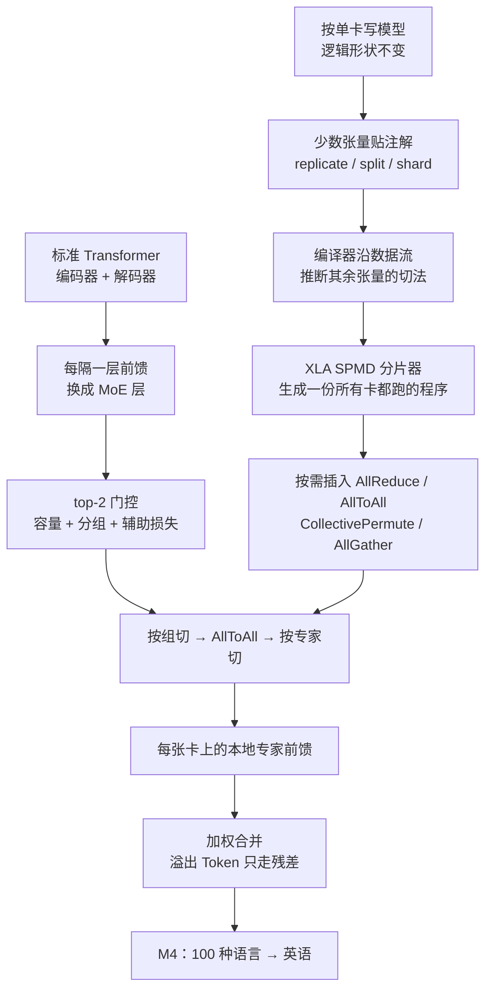
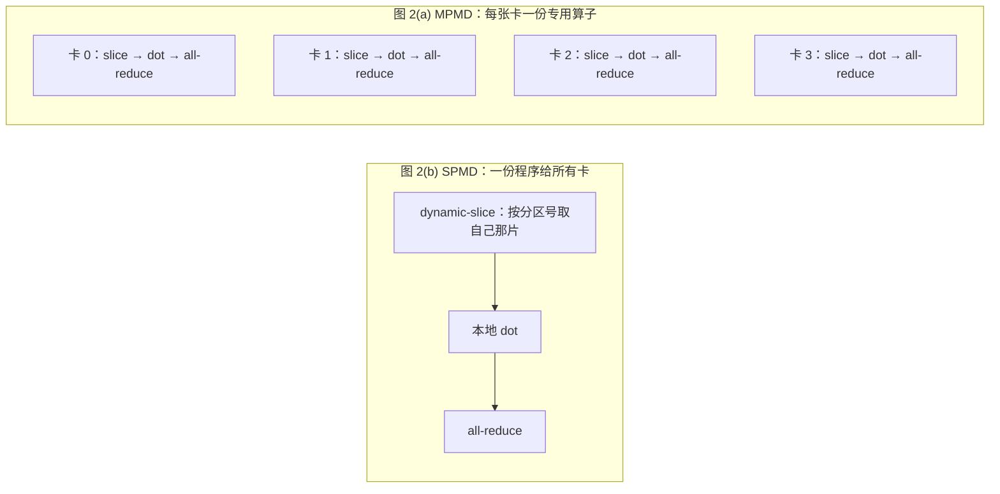

# GShard：不手写并行，用注解和稀疏专家把翻译模型做到 6000 亿

<!-- release-date: 2020-06-30 -->

> 本文依据 Google 的 **GShard: Scaling Giant Models with Conditional Computation and Automatic Sharding**，arXiv:2006.16668v1，2020-06-30 提交，共 35 页（正文 25 页、参考文献、附录 A.1–A.4）。页码 `(PDF p. N)` 均指这份 PDF 自身的页码。文中会区分三件事：**论文明确写了什么**、**我们怎么解释或验算它**、**哪些是外部资料**。

## 读前先把几个词说成人话

这篇论文难读，不是因为公式多，而是它同时讲两套东西：一套是「模型怎么稀疏」，一套是「编译器怎么切」。后面每张表都踩在这两套词上。

- **Token（词元）**：模型读写文本的最小单位。这篇里是 SentencePiece 切出的子词。
- **Dense（稠密模型）**：每一层的全部参数对每个 Token 都算一遍。参数翻倍，每步计算量大致也翻倍。
- **MoE（Mixture-of-Experts，混合专家）**：把前馈网络换成一排小网络（专家），每个 Token 只交给其中少数几个。总参数可以很大，每个 Token 的计算量却不必跟着涨。
- **条件计算（conditional computation）**：按输入决定「算哪一部分」，而不是每次把整张网跑完。MoE 是它在这篇里的实现。
- **专家容量（expert capacity）**：一个 batch 里每个专家最多接多少 Token。接满了，多出来的 Token 这一层不进专家，只沿残差连接原样往下传。
- **分片注解（sharding annotation）**：给张量贴一张标签，告诉编译器「这一维切开」或「整份复制」。注解不改张量在代码里的逻辑形状，用户仍按完整张量写代码。
- **SPMD（Single Program Multiple Data，单程序多数据）**：所有设备跑同一份程序，各自拿不同的数据片。对照是 **MPMD（Multiple Program Multiple Data）**：每张卡生成一份专用程序，卡一多，图就跟着膨胀。
- **XLA**：Google 的机器学习编译器。TensorFlow、JAX、PyTorch 等前端都能把计算图降成它的中间表示 HLO，GShard 的分片器就做在这一层。
- **AllToAll**：每张卡把自己的数据切成 $D$ 份，分别发给 $D$ 张卡，再把收到的拼起来。MoE 里「按组切」换成「按专家切」，靠的就是它。

论文自己的几个专有设定：

- **GShard**：一组轻量注解 API，加上 XLA 编译器里的 SPMD 分片扩展。它是一个工具模块，不是一种新网络（PDF p. 1、p. 3）。
- **MoE Transformer**：编码器和解码器里每隔一层，把前馈换成位置级 MoE 层（PDF p. 4–5）。
- **M4（Massively Multilingual, Massive Machine Translation）**：用这套系统训的 100 种语言到英语翻译模型（PDF p. 14）。
- **`MoE(2048E, 36L)`**：每个 MoE 层 2048 个专家、编码器加解码器共 36 层。`T(96L)` 则是 96 层的稠密 Transformer（PDF p. 15–17）。

## 一句话先说清

2020 年大家已经看清：模型越大，质量越好。卡住的不是「要不要做大」，而是做大的三笔账同时变贵（PDF p. 1–3）：计算成本跟着参数至少线性涨；换一种并行就得把模型代码迁进专用框架；图的规模随卡数膨胀，编译先撑不住。

GShard 的回答分成两半：

> **模型按「好像只有一张无穷大的卡」来写，只在少数张量上贴「切开」或「复制」的标签，编译器生成一份所有卡都跑的程序；参数与计算量脱钩，靠的是每隔一层换成 top-2 专家。**

摘要给的成绩单是（PDF p. 1）：多语翻译 Transformer 加稀疏门控 MoE，扩到 6000 亿以上参数；2048 块 TPU v3 训 4 天；100 种语言到英语的质量远超此前工作。

图 1 把这张账单说得最直白（PDF p. 2）。它画的三个点，正是表 3 里 36 层、每层 128 / 512 / 2048 个专家的三行，改写成表如下：

| 模型 | 参数 | TPU v3 核 | 平均 ∆BLEU | 训练天数 | TPU v3 core-year |
|---|---:|---:|---:|---:|---:|
| `MoE(128E, 36L)` | 37.5B | 128 | 8.2 | 17.3 | 6.1 |
| `MoE(512E, 36L)` | 150B | 512 | 12.9 | 11.0 | 15.5 |
| `MoE(2048E, 36L)` | 600B | 2048 | 13.5 | 4.0 | 22.4 |
| 对照：`T(96L)` 稠密 | 2.3B | 2048 | 6.1 | 约 42 | 约 235.5 |
| 对照：100 个双语基线合计 | 100 × 0.4B | — | 0 | — | 29 |

参数、∆BLEU、天数与成本分别来自图 1 图注、图 6 内嵌表和表 3（PDF p. 2、p. 16、p. 19）。图 1 横轴写 37.5B，表 1 与图 6 写 37B，同一份 PDF 两种写法并存。

图注的读法是：参数从 37.5B 到 600B 涨了 **16 倍**，成本从 6 个 core-year 到 22 个只涨了 **3.6 倍**；同样 2048 核，稠密的 `T(96L)` 要训 6 周、235.5 个 core-year，质量还低一截（PDF p. 2）。core-year 就是核数乘以按年计的墙钟时间（PDF p. 19 脚注 14）。

你从这篇买到的是「参数可以单独涨、编译不随卡数爆炸」，以及一张 100 种语言到英语的 BLEU 表。你没有买到开源代码、非翻译任务上的结果、推理延迟，也没有买到路由学到了什么的分析。这些在文末单独列出。

### 一条阅读路线

只有半小时读原文，建议按这个顺序：

1. **p. 2 图 1、p. 4 图 2**：16 倍参数只花 3.6 倍成本；SPMD 为什么让编译时间不随卡数涨。
2. **p. 5 图 3、p. 6 四条门控机制、p. 7 算法 1**：隔层 MoE 怎么插进 Transformer，容量、分组、辅助损失、随机第二专家怎么配合。
3. **p. 8–9 算法 2 与三行注解**：用户到底改了哪几行。
4. **p. 11–12 图 4**：einsum 切分维对不上时的三种通信。
5. **p. 16 图 6、p. 17–19 表 1–3**：高资源吃容量、低资源吃共享；深度省样本；600B 训 4 天。
6. **p. 20–23 图 7–9、表 4**：每卡显存、步时拆账、AllToAll 按 $\sqrt{D}$ 涨。

附录 A.1 的扁平束搜索、A.2 的超参、A.3 的 `shard()`、A.4 的卷积 halo 交换，第一次读可以只知道它们在那里。

## 主要矛盾：质量要涨，算力、编程、编译一起卡

论文没有从「我们做了一个 6000 亿的 MoE」开场。它先承认一条走通了、但越来越贵的路：模型容量涨，质量跟着涨；最终质量对数据、算力和模型大小呈幂律（PDF p. 1）。然后它说，训练效率这件事常被漏掉——用多少算力、多少墙钟时间打过当时最好的系统（PDF p. 1）。

接着它列出四道具体的卡（PDF p. 2–3）：

1. **模型并行绑死架构**。TensorFlow、PyTorch 只有朴素的图划分，层间顺序依赖让卡大量空转。想做大，就得把代码迁到 Mesh-TensorFlow 或 GPipe 这类专用框架。
2. **计算成本随模型大小超线性涨**。加深加宽至少让步时线性涨；再把层或算子切到多卡，通信和负载不均又把账往上抬。加卡解决不了。
3. **图本身撑不住**。层间或算子内切到 $D$ 张卡，图节点可以是 $O(D)$；切 Gather、Transpose 这类算子时，卡间通信通道能把图推到 $O(D^2)$。建图和编译时间先炸。
4. **手写切分太累**。每种算子的通信模式不同——要累加部分和，还是要重排数据片。换一层结构，底下的通信就得跟着改，连锁反应。

于是矛盾变成：

> 研究者想把模型做大，但不想每换一个网络就重写一遍并行，更不想卡数一多，编译时间先变成新的墙。同时，只靠加宽加深，计算账单会把「做大」这条路自己堵死。

论文的设计原则对应地拆成三句（PDF p. 3）：**次线性缩放**（条件计算，每个输入只激活一个子网络）、**抽象的力量**（模型描述与切分实现分开，用户只标少数张量）、**可扩展的编译器**（SPMD 生成一份程序，编译时间与卡数无关）。

## 先看全景：一条「注解 → 编译 → 稀疏前馈」的链



这张图按 PDF p. 3–9、p. 14–16 的叙事重画，是机制示意，不是论文原图，也不表示耗时。主路径不是新的注意力，而是两条线在 MoE 层汇合：左边编译器负责「怎么切」，右边条件计算负责「算多少」。

全文有三个旋钮，先分清：

| 旋钮 | 改它会怎样 | 论文认为它改的是什么 |
|---|---|---|
| 每层专家数 $E$（实验里与卡数 $D$ 绑定） | 总参数涨，每个 Token 激活的子网几乎不涨 | 容量。高资源语言最吃这个 |
| 深度 $L$（12 / 36 / 60） | 共享子网变长，样本效率变好 | 迁移。低资源语言最吃这个 |
| 分片注解 | 同一份模型代码换一种切法 | 放置。不改数学上算的是什么 |

后文所有「次线性」说的都是：参数涨得比每步计算快。通信并不免费，它按 $O(\sqrt{D})$ 涨（PDF p. 8、p. 22）。

实验里所有模型共享同一组超参（附录 A.2，PDF p. 31）：

| 项 | 取值 |
|---|---|
| 模型维 / 前馈与 MoE 隐层维 | 1024 / 8192 |
| 注意力 | 16 头，key 与 value 维 128 |
| Dropout | 输入、残差、注意力均为 0.1 |
| 优化器 | Adafactor：二阶矩分解，$\beta_1 = 0$，$\beta_2 = 0.99$ 配 $1 - t^{-0.8}$ 日程，更新裁剪阈值 1.0 |
| 学习率 | 1.0，1 万步后按平方根衰减 |
| 词表 | SentencePiece；源侧一张多语词表覆盖 102 种语言、64000；目标侧英语 32000 |
| 数值精度 | 权重与激活都用 float32，为了训练稳定（PDF p. 16） |

## 核心设计一：每隔一层换成 top-2 专家

### 旧问题：稠密放大让步时至少线性涨

同实验室的 GPipe 已经把一个 128 层、60 亿参数的多语 Transformer 训起来，高资源和低资源语言都受益（PDF p. 15）。GShard 承认这条路满足「通用翻译」的目标，但把它归进第 1 节的训练效率问题：稠密放大，计算账单跟着参数走。

条件计算的旧答案是 Shazeer 等人 2017 年的位置级稀疏门控 MoE，接在 RNN 上做翻译和语言模型（PDF p. 3）。这篇要做两件事：把它接进 Transformer 的前馈，并让门控在数百万 Token、数千专家时仍能并行算。

### 新设计：每隔一层前馈，换成一排专家

图 3（PDF p. 5）的改法很朴素：编码器和解码器里 **每隔一个前馈层**，换成 $E$ 个前馈网络 $\mathrm{FFN}_1 \ldots \mathrm{FFN}_E$，前面加一个门控；注意力层始终是稠密的（PDF p. 4）。12 层对应原始 Transformer 的 6 层编码器加 6 层解码器；36 层、60 层按同样节奏插专家（PDF p. 17）。整个网络里被稀疏化的，只有一半前馈。

每个专家就是标准的两层 ReLU 前馈，层输出是被选中专家的加权和（PDF p. 4，式 (1)–(3)）：

$$
\mathrm{FFN}_e(x_s) = w_{o,e} \cdot \mathrm{ReLU}(w_{i,e} \cdot x_s),
\qquad
y_s = \sum_{e=1}^{E} G_{s,e} \cdot \mathrm{FFN}_e(x_s)
$$

$x_s$ 是进入 MoE 层的第 $s$ 个 Token，$G_{s,E}$ 是门控网络给出的一个向量，每个专家一个非负权重，绝大多数为 0。论文选择 **每个 Token 最多进两个专家**（PDF p. 5）。门控本身是一层线性投影加 softmax。

### 工作机制：容量、分组、辅助损失、随机第二专家

朴素 top-$k$ 会塌：多数 Token 挤进少数几个专家，忙的专家缓冲区爆掉，闲的专家根本训不到（PDF p. 5）。顺序扫描一遍可以做到均衡，但 $N$ 是百万级、$E$ 是千级，门控光这一步就是 $O(NE)$，串行做会让绝大多数卡闲着（PDF p. 5）。

于是门控里装了四件东西（PDF p. 6），完整伪代码是算法 1（PDF p. 7）：

1. **专家容量**。一个 batch $N$ 个 Token、每个最多进两个专家，每个专家的容量设成 $O(N/E)$。门控给每个专家一个计数器 $c_e$；一个 Token 的两个专家都已超容量，它就是溢出 Token，$G_{s,E}$ 退化成全零，表示沿残差原样传到下一层。
2. **分组派发**。batch 均分成 $G$ 组，每组 $S = N/G$ 个 Token，组与组独立并行；每组分到每个专家 $2N/(G \cdot E)$ 个名额。容量约束仍在，串行扫描却只发生在组内。
3. **辅助损失**。总损失是 $L = \ell_{\mathrm{nll}} + k \cdot \ell_{\mathrm{aux}}$。
4. **随机路由**。第二专家的权重很小时，占一个名额不划算；于是在容量允许的前提下，以正比于 $g_2$ 的概率派发第二专家。

下面这张图把算法 1 在一个小组上走一遍。


图里的数字是编的，机制是算法 1 的。有三点图上一眼看得出、文字不必重复：第一选择永远优先于任何 Token 的第二选择；随机门会让不少 Token 只用一个专家；负载再偏，容量也只是封顶，封不住的 Token 就白走这一层。

还有两处只有读伪代码才知道的细节：

- **辅助损失的形状。** 作者想压的是每个专家分到的比例 $c_e/S$ 的均方，但 $c_e$ 来自 top-2，不可导；于是把 $(c_e/S)^2$ 换成 $m_e \cdot (c_e/S)$，$m_e$ 是该专家在组内的平均门控（PDF p. 6，算法 1 第 3、13 行）：

  $$
  \ell_{\mathrm{aux}} = \frac{1}{E} \sum_{e=1}^{E} \frac{c_e}{S} \cdot m_e
  $$

  算法 1 在第 13 行算这项时，计数器只记了第一轮的第一选择，且不论写没写进缓冲区都加一。系数 $k$ 的数值论文没有给。
- **两个门控先归一化。** 第一轮 $g_1 \leftarrow g_1/(g_1+g_2)$，第二轮 $g_2 \leftarrow g_2/(g_1+g_2)$（算法 1 第 6、16 行）。所以随机门的条件 $2 \cdot g_2 > \mathrm{rnd}$ 在两个权重相等时必然成立，第二名越弱越容易被放弃。

### 收益：子网大小几乎不随专家数涨

每个 Token 在训练和推理时都只激活 MoE Transformer 的一个子网络，子网大小大致与每层专家数无关（PDF p. 4）。算法 2 把整层写成几条 einsum 加一个 Top2Gating，并分析了它随卡数 $D$ 的规模（PDF p. 8）。设每卡 Token 数 $N/D = O(1)$，组数 $G = O(D)$，专家数 $E = O(D)$，每组每专家容量 $C = O(1/D)$，则整层浮点运算量是

$$
\underbrace{O(D^2)}_{\text{softmax}} + \underbrace{O(D)}_{\text{top-2}} + \underbrace{O(D)}_{\text{派发 / 合并}} + \underbrace{O(D)}_{\text{专家前馈}}
$$

除以 $D$ 张卡，每卡只有 softmax 那项是 $O(D)$；但实践中 $D$ 远小于隐层维 $H$，也小于组大小 $S$，这一项被别的盖住，每卡计算量可以看成 $O(1)$（PDF p. 8）。

这条公式有尽头：$C$ 至少是 1，所以「$E$ 随 $D$ 涨、$C$ 随 $1/D$ 降」不能无限用下去，论文认为够撑到数千专家（PDF p. 8 脚注 2、p. 21）。

### 代价和边界

- **溢出 Token 白走一层。** 容量满了就只走残差；全文没有给出溢出率。
- **门控里有串行热点。** 把「每个 Token 选了哪些专家」的 one-hot 反转成「每个专家收了哪些 Token」要做 Cumsum，这是内存受限甚至串行的操作；2048 专家时占 MoE 加 Transformer 层时间不到 10%，但随专家数线性可见（PDF p. 21–22）。
- **数值稳定性。** 1 万亿参数的 `MoE(2048E, 60L)` 用 bfloat16 激活，靠细致的人工诊断能训，但数值不稳，为了可复现 **没有放进结果**（PDF p. 16）。
- **专家数绑卡数只是为了简单。** 论文明说这不是硬约束（PDF p. 16）。

### 对自己的项目有什么用

负载均衡不是一个损失项能做完的事：真正拦住「全挤进一个专家」的是容量上限和组内名额，辅助损失只提供可导的压力，第二专家还可能被随机门放掉。抄 MoE 时只抄 $\ell_{\mathrm{aux}}$ 那一行，均衡并没有做完。反过来，分组是一个可以直接复用的工程技巧：把全局的串行计数拆成组内计数，门控就能和数据一起按组切到多卡上。

## 核心设计二：三种注解，逻辑形状不动

### 旧问题：换一种切法就要改模型代码

MoE 层逼着整张网在两种切法之间来回切：注意力沿 batch 切、权重复制；专家太大复制不了，只能按专家切到多卡（PDF p. 6）。如果把通信写进模型，每换一层就要改一处。

### 新设计：`replicate`、`split`、`shard`

GShard 在 TensorFlow / Lingvo 里暴露三个函数（PDF p. 8）：

| 注解 | 做什么 | 典型用途 |
|---|---|---|
| `replicate(tensor)` | 整份复制到每个分区 | 非 MoE 层的权重、门控权重 |
| `split(tensor, split_dimension, num_partitions)` | 沿一个维切开，第 $i$ 片放第 $i$ 张卡；分区数不能超过卡数 | 输入按组切、专家按 $E$ 切 |
| `shard(tensor, device_assignment)` | `split` 的推广：可切多个维，并指定每一片放哪张卡 | 按设备拓扑安排切片（附录 A.3） |

调用这些函数 **只加注解，不改用户程序里的逻辑形状**；不齐分片之类的问题不归用户管（PDF p. 9）。可切的维不限：batch（数据并行）、特征、专家、图像的空间维都行；因为注解是按张量贴的，模型不同部分可以切法不同（PDF p. 9）。

下面这张图把图 3(c) 的放置与算法 2 的注解叠在一起，看一个 MoE 层在 4 张卡上怎么走一遍。


用户实际加的就是图中 ①②④ 三行，论文在代码里用绿底标出（PDF p. 9）：

```text
inputs = split(inputs, 0, D)                  # 沿组维 G 切开
wg = replicate(wg)                            # 门控权重复制
dispatched_expert_inputs = split(..., 0, D)   # 派发之后改沿专家维 E 切
```

### 工作机制：传播、推断、手动与自动混用

用户不必给每个张量贴标签。通常只标少数关键算子（这篇里主要是 einsum），其余由编译器推断：输入按 $G$ 切、门控权重复制，门控 einsum 的输出就推成按 $G$ 切；派发 einsum 的两个输入都按 $G$ 切，输出也推成按 $G$ 切，再由用户那行 `split` 把它改到 $E$（PDF p. 9）。论文建议至少标出整段计算的初始输入和最终输出。

推断必须存在还有一个原因：反向图通常由前端框架自动生成，用户根本拿不到那些张量（PDF p. 9 脚注 3）。传播算法是一次迭代的数据流分析，从用户标过的算子出发向操作数和使用者扩散，尽量让相邻算子切法一致、少做重新分片。整数规划或学习的方法也能做，但 **自动分片赋值不是本文重点，留作未来工作**（PDF p. 9）。

编译器不够聪明时，允许手动与自动混用（PDF p. 9–10）。典型例子是 Gather：XLA 和 TensorFlow 的 Gather 定义里没有「下标只在本分区内打乱」这种运行时知识，编译器只能保守地加通信。用户知道这一点时，可以用 `auto_to_manual_spmd_partition` 把张量切到手动模式，本地做 Gather，再用 `manual_to_auto_spmd_partition` 切回来。算法 2 里那条用 one-hot 矩阵实现的派发 einsum，就可以这样换成手动 Gather。

### 收益和代价

收益是第 1.2 节说的「抽象的力量」：开发者按单卡写，编译器按注解和启发式做保持语义的变换，换切法不必重写模型（PDF p. 3）。

代价写在同一处：传播是启发式，只对齐相邻算子，不保证全局最优；关键张量上的选择仍要人做对。派发之后从 $G$ 改到 $E$ 的那次重新分片，编译器推不出来，必须人标。

### 对自己的项目有什么用

值得学的不是这三个函数名，而是「注解不改逻辑形状」。用户始终和完整张量打交道，不齐、填充、halo 都沉到编译器里；做不到这一点，所谓自动分片很容易退化成「把切分算术写回模型代码」。另一件是留一个手动入口：语义比中间表示更强的地方，让人插手，比让编译器保守地加一圈通信便宜。

## 核心设计三：XLA 里的 SPMD 分片器

### 旧问题：MPMD 让图随卡数膨胀

图 2（PDF p. 4）用一次矩阵乘说明两种切法的差别：$[M, K] \times [K, N]$ 沿收缩维 $K$ 切到 4 张卡，每卡算本地结果，再用 AllReduce 求和。



按 PDF p. 4 图 2 重画。MPMD 的节点数随卡数线性涨，SPMD 只有一份，编译时间与卡数无关。第 1 节把 $O(D)$、$O(D^2)$ 的图当成基础设施的墙，脚注 4 直说 MPMD 不能扩展（PDF p. 2、p. 10）。

### 新设计：在 HLO 上逐个算子降成「一片大小」

分片器实现在 XLA 里（PDF p. 10）。TensorFlow、JAX、PyTorch、Julia 已经能把图降到 XLA HLO；HLO 的算子集比 TensorFlow 小得多，实现分片器的负担也小。论文认为同样的技术可以用在 ONNX、TVM Relay、Glow IR 上，但本文只实现了 XLA 这一条。

分片器的核心是逐算子变换：按输入输出上的分片标签，把一个「完整大小」的算子改写成「一片大小」的算子，并插入必要的通信（PDF p. 10）。因为所有卡跑同一份程序，通信模式也是规则的，只用四个 MPI 风格的集合通信（PDF p. 10–11）：

| 原语 | 做什么 | 在这篇里的用途 | 随分区数 $D$ 的代价（第 5.3 节） |
|---|---|---|---|
| **CollectivePermute** | 按源–目的对点对点发送 | 改变分片的设备顺序；halo 交换 | 源与目的相邻时 $O(1)$ |
| **AllGather** | 按指定顺序拼接各卡张量 | 把切开的张量变成复制的 | 输入固定时 $O(D)$ |
| **AllReduce** | 逐元素规约（如求和） | 累加收缩维切开后的部分和 | TPU 上近似常数 |
| **AllToAll** | 各卡沿一维切开、交叉发送、再拼接 | 把切分维从一维换到另一维 | 约 $O(\sqrt{D})$ |

### 工作机制：einsum 的三种通信

逐元素算子几乎无事可做。真正要通信的，论文用 einsum 讲，因为 MoE 层几乎全是它（PDF p. 11）。einsum 在 XLA 里是 Dot，每个操作数的维分三类：**batch 维**三方都有，天然并行；**收缩维**只在两个操作数里，输出里被求和掉；**非收缩维**只在一个操作数和输出里，也可并行。传播优先让三方在 batch 维上切法一致，那样零通信；对不齐时有三种办法，对应图 4（PDF p. 11–12）。


三种里 (a) 就是 MoE 层用的那一招：之所以敢「先本地算、再 AllToAll 换维」，是因为在 TPU 上 AllToAll 的代价只按 $\sqrt{D}$ 涨（PDF p. 11）。(c) 类似 Cannon 算法；复制其中一个操作数也能免掉循环，而且不增加冗余计算，但那份操作数必须装得进单卡内存（PDF p. 12）。

### 更脏的部分：静态形状、不齐分片、halo

SPMD 的麻烦是：一份程序要覆盖所有分区，又不能按运行时设备号写一堆分支，否则程序体积爆炸（PDF p. 13）。XLA 还要求形状静态。于是不齐和窗口算子都得靠填充、切片、掩码，让每张卡「假装形状一样」（PDF p. 13–14）：

- **不齐分片**：维长除不尽分区数时，每片形状向上取整，填充区的值随意；需要正确性时再填单位元。例子是沿长度 15 的维把 Reduce-Add 切成 2 份，第二份多出一列，用 Iota 加上「分区号 × 8」的偏移去和 15 比，把多出的那列掩成 0。
- **静态算子配置**：卷积的 padding、stride、dilation 是静态的，但最左分区该垫左边、最右分区该垫右边。分片器宁可让某些分区多算一点，再切掉无关部分。
- **halo 交换**：卷积、ReduceWindow 这类窗口算子，相邻分区要用到重叠的输入，用 CollectivePermute 交换边界数据（图 5a）。Slice、Pad 改变形状、从而改变分片边界，也当成 halo 处理（图 5b）。Reverse、Reshape 逻辑上不改大小，但在不齐分片加静态形状下也可能要换数据：`[3, 2]` 按第一维不齐切成 `[2, 2]` 两片，Reshape 成 `[6]` 后切成 `[3]` 两片，输入里的填充在输出里消失了，得像 Slice 那样补一次 halo（图 5c）。

这些数据整理算子很多。靠 TPU 上的算子融合，以及对 slice、pad 的代码外提，运行时开销通常可以忽略，掩码和填充很重的卷积网也是如此（PDF p. 14）。

### 收益、代价、失败模式

收益：编译时间近乎常数，才能上到数千分区（PDF p. 10）。代价与失败模式论文自己写了：自动分片赋值只是启发式（PDF p. 9）；两个操作数切法对不上的大矩阵乘，每卡计算与通信都是 $O(D)$——不是分片算法低效，是完整算子本来就是 $O(D^2)$（PDF p. 23）；窗口 dilation 在右操作数也切开时的实现细节被跳过（PDF p. 35）。

### 对自己的项目有什么用

在编译器里做切分，最值得搬的是：先固定一小撮集合通信，让每个算子的降级都落在这几个原语上。einsum 的三种模式，几乎覆盖了后来所说的数据并行、张量并行、专家并行的通信形状。halo 则是个提醒：空间维一旦切开，静态形状会立刻变成「每卡 halo 大小不同」，而「先按最大 halo 换、再按分区号切、再掩掉非法区」是这份附录反复用的套路。

## 实验：100 种语言到英语，质量涨、成本次线性

### 为什么选多语翻译

多语翻译天生是多任务：一个网络同时翻很多语言对（PDF p. 14）。成功有两根尺：高资源语言不能被挤掉，低资源语言要吃到正迁移。语言一多，正迁移帮了低资源，每个任务分到的容量却变少，高资源翻得比单语对模型还差；这叫容量瓶颈。做大模型，就是在「多语带来的共享」与「规模带来的容量」之间找平衡。手工决定哪些层共享、哪些层按语言分开，搜索空间随语言数爆炸；条件计算把它变成可学的布线，每个 Token 自己决定走哪些专家，事先不需要知道语言亲缘（PDF p. 14）。

论文在这里给了一句常被引用的话：600B 的 GShard M4 模型能在 25 万步、不到 4 天里处理 1 万亿个 Token（源侧子词，PDF p. 14 及脚注 7）。

### 数据、基线与模型家族

训练语料是网上挖掘的内部平行文档，100 种语言与英语双向，共 250 亿条样本；噪声大、领域杂，语言之间呈陡峭的幂律——高资源十亿级，低资源几万条（PDF p. 15）。评测只做 100 种语言到英语，约 130 亿条用于训练；和此前用同一数据集的工作相比，哈萨克语和拉丁语到英语不参加评测（PDF p. 15 及脚注 8）。

基线有两类（PDF p. 15）：每个语言对一个独立的双语模型，按数据量在 Transformer-Big 或 Transformer-Base 上调 batch 与 dropout；以及一个用 GPipe 流水线训的 96 层稠密 `T(96L)`，2048 核训了 6 周以上，处理 1 万亿以上 Token（约 30 万步、每步约 400 万 Token），预算 235.5 个 core-year，超过了 GPipe 论文原来的 `T(128L)`（64 + 64 层、隐层 16384、32 头），是论文里最强的单个稠密模型（PDF p. 15 脚注 10–11）。

模型家族见表 1（PDF p. 17）：

| Id | 模型 | 每层专家 | 专家总数 | TPU v3 核 | 编码器 + 解码器层 | 参数 |
|---|---|---:|---:|---:|---:|---:|
| (1) | `MoE(2048E, 36L)` | 2048 | 36684 | 2048 | 36 | 600B |
| (2) | `MoE(2048E, 12L)` | 2048 | 12228 | 2048 | 12 | 200B |
| (3) | `MoE(512E, 36L)` | 512 | 9216 | 512 | 36 | 150B |
| (4) | `MoE(512E, 12L)` | 512 | 3072 | 512 | 12 | 50B |
| (5) | `MoE(128E, 36L)` | 128 | 2304 | 128 | 36 | 37B |
| (6) | `MoE(128E, 12L)` | 128 | 768 | 128 | 12 | 12.5B |
| * | `MoE(2048E, 60L)` | 2048 | 61440 | 2048 | 60 | 1T |

卡数固定等于每层专家数。每个模型都训到见过 1 万亿个 Token，用这时的检查点评测；到这一点都没有过拟合迹象，继续训训练损失还在降（PDF p. 17）。

**我们如何验算它。** 隔层放专家，36 层应有 18 个 MoE 层：$18 \times 128 = 2304$、$18 \times 512 = 9216$ 都和表一致，$18 \times 2048 = 36864$，表上是 36684；12 层应有 6 个 MoE 层，$6 \times 2048 = 12288$，表上是 12228；60 层 $30 \times 2048 = 61440$ 一致。2048 专家的两行像是数字抄错了位，下文照表引用，不自行改动。

### 图 6：质量随规模涨，高资源和低资源吃的不是同一根轴

图 6（PDF p. 16）把每个模型画成一条相对双语基线的 ∆BLEU 曲线，横轴从左到右按训练数据从多到少排语言，每条曲线用宽度 10 的滑动窗口平滑过。它内嵌的汇总表和我们从曲线上读出的两端如下：

| 模型 | 参数 | 平均 BLEU | 平均 ∆BLEU | 高资源端 ∆BLEU（读图） | 曲线峰值（读图） | 低资源端 ∆BLEU（读图） |
|---|---:|---:|---:|---:|---:|---:|
| `MoE(2048E, 36L)` | 600B | 44.3 | 13.5 | 约 7.7 | 约 18 | 约 15 |
| `MoE(2048E, 12L)` | 200B | 41.3 | 10.5 | 约 6 | 约 15 | 约 13 |
| `MoE(512E, 36L)` | 150B | 43.7 | 12.9 | 约 7 | 约 18 | 约 16.5 |
| `MoE(512E, 12L)` | 50B | 40.0 | 9.2 | 约 5 | 约 14 | 约 12.5 |
| `MoE(128E, 36L)` | 37B | 39.0 | 8.2 | 约 4 | 约 13 | 约 12.5 |
| `MoE(128E, 12L)` | 12.5B | 36.7 | 5.9 | 约 2.5 | 约 10 | 约 9.5 |
| `T(96L)` 稠密 | 2.3B | 36.9 | 6.1 | 约 3 | 约 11 | 约 11 |
| 100 个双语基线 | 100 × 0.4B | 30.8 | — | 0 | 0 | 0 |

读表时要知道：600B 在高资源一侧最高，但到低资源最右三分之一，150B 的 `MoE(512E, 36L)` 反而略高于它；`T(96L)` 在高资源端只比基线高约 3，到低资源端追到约 11，与 37B 的 36 层 MoE 相当。

正文把趋势收成四句（PDF p. 17–18）：

1. **更深，两边都涨。** 专家数固定、12 层加到 36 层，高资源与低资源都有近似恒定的加性收益，平均 2–3 BLEU。
2. **容量瓶颈松开，收益才明显。** 同为 12 层，128 → 512 专家平均 BLEU **+3.3**，512 → 2048 只有 **+1.3**。作者推测，对这套参数化、语言数和数据量，瓶颈落在 128 到 512 专家之间；瓶颈没松开之前，加深度也帮得不多。
3. **专家越多，高资源越赚。** 12 层和 36 层都能看到：加专家主要涨高资源，低资源收益递减。专家一多，共享子网的比例下降，迁移的带宽变窄。
4. **深而稠密的模型更会向低资源迁移。** `T(96L)` 与浅层 `MoE(128E, 12L)` 在中高资源上的差距几乎恒定，进入低资源区后差距拉开，稠密模型占优——共享比例 100% 时迁移带宽最大。

第 4 句里论文写「同样的低资源迁移质量可以用 `MoE(36E, 128L)` 做到，它有 370 亿参数」（PDF p. 18）。表 1 里没有这一行，370 亿参数的是 `MoE(128E, 36L)`，从曲线看它在低资源端也确实与 `T(96L)` 持平。**我们的解释**：原文把 $E$ 与 $L$ 写反了，应读作 `MoE(128E, 36L)`。

论文结论里还有一句判断值得留住：单纯数参数，并不总能反映模型的有效容量；比较模型时要看任务性质（多任务、数据极不均衡），并控制「容量瓶颈」与「正迁移」这两种工作模式（PDF p. 25）。

### 训练效率：更深更省样本，最大模型 4 天

表 2 看训练交叉熵（不含辅助损失）降到给定值时，模型要见多少十亿 Token（PDF p. 19）：

| Id | 模型 | 核数 | 到 0.7 | 到 0.6 | 到 0.5 |
|---|---|---:|---:|---:|---:|
| (1) | `MoE(2048E, 36L)` | 2048 | 82 | 175 | 542 |
| (2) | `MoE(2048E, 12L)` | 2048 | 176 | 484 | 1780 |
| (3) | `MoE(512E, 36L)` | 512 | 66 | 170 | 567 |
| (4) | `MoE(512E, 12L)` | 512 | 141 | 486 | — |
| (5) | `MoE(128E, 36L)` | 128 | 321 | 1074 | — |
| (6) | `MoE(128E, 12L)` | 128 | 995 | — | — |

三倍深度，大约少用 2–3 倍 Token 就到同一训练损失：`MoE(128E, 12L)` 到 0.7 要 9950 亿个 Token，36 层只要 3210 亿（PDF p. 19）。同深比较，128 → 512 专家时到 0.7 所需 Token 大幅下降，再到 2048 与 512 档相近——和「瓶颈在 128 到 512 之间」对得上。论文把深模型更省样本归到过参数化的加速效应，并引了 GPipe 与 Megatron-LM 的同类观察（PDF p. 18）。

表 3 看墙钟（PDF p. 19）：

| Id | 模型 | 核数 | 步 / 秒 | 每 batch Token | core-year | 天数 | 平均 BLEU |
|---|---|---:|---:|---:|---:|---:|---:|
| (1) | `MoE(2048E, 36L)` | 2048 | 0.72 | 4M | 22.4 | 4.0 | 44.3 |
| (2) | `MoE(2048E, 12L)` | 2048 | 2.15 | 4M | 7.5 | 1.4 | 41.3 |
| (3) | `MoE(512E, 36L)` | 512 | 1.05 | 1M | 15.5 | 11.0 | 43.7 |
| (4) | `MoE(512E, 12L)` | 512 | 3.28 | 1M | 4.9 | 3.5 | 40.0 |
| (5) | `MoE(128E, 36L)` | 128 | 0.67 | 1M | 6.1 | 17.3 | 39.0 |
| (6) | `MoE(128E, 12L)` | 128 | 2.16 | 1M | 1.9 | 5.4 | 36.7 |
| * | `T(96L)` | 2048 | — | 4M | 约 235.5 | 约 42 | 36.9 |

600B 用 2048 核训 4 天，平均 BLEU 最高，总成本 22.4 个 core-year；摘要、图 1 和结论写成 22。同样 2048 核，`T(96L)` 要十倍以上的成本，质量还落在所有 36 层 MoE 之后（PDF p. 19）。结论把效率收成一句：600B 的 22 个 core-year，对照训全部 100 个双语基线要 29 个（PDF p. 25）。

**我们如何验算它。** 表 3 自洽：1 万亿 Token 除以每步 4M，是 25 万步，按每秒 0.72 步约 4.0 天；128 专家档每步 1M，要 100 万步，按每秒 0.67 步约 17.3 天。这也说明了「次线性」的来路：专家数和卡数一起翻 16 倍，每步墙钟几乎不变，每步吞下的 Token 却多了 4 倍，同样 1 万亿 Token 只要四分之一的步数。core-year 只涨 3.6 倍，是因为卡多了、步数少了，不是因为大模型每个 Token 更便宜。

## 系统账：显存、步时、通信

第 5 节把系统效率从翻译质量里拆出来，主结论两句（PDF p. 20）：专家数增加时每卡显存大致不变；从 128 卡扩到 2048 卡、模型大 16 倍，步时只涨 1.7 倍。

### 显存：每卡三类占用都不随专家数涨

SPMD 之后，三类占用的每卡大小在专家数增加时都是常数（PDF p. 20）：复制的权重（稠密 Transformer 前馈等）、切开的权重（MoE 前馈）、激活（前向留下、反向要用的各层输出）。门控投影是 $O(E)$，本可切开，但实际足够小，选择复制，对峰值显存影响可忽略（PDF p. 21 脚注 15）。

图 7（PDF p. 20）读图如下，单位 GB：

| 模型 | 权重（读图） | 激活（读图） | 合计（读图） | 重计算占总周期 |
|---|---:|---:|---:|---:|
| `MoE(128E, 12L)` | 约 1.9 | 约 2.3 | 约 4.2 | 0% |
| `MoE(512E, 12L)` | 约 2.0 | 约 2.2 | 约 4.2 | 0% |
| `MoE(2048E, 12L)` | 约 2.4 | 约 2.5 | 约 4.9 | 0% |
| `MoE(2048E, 24L)` | 约 4.2 | 约 4.6 | 约 8.8 | 0% |
| `MoE(2048E, 36L)` | 约 6.0 | 约 6.0 | 约 12.0 | 28% |
| `MoE(2048E, 60L)` | 约 9.6 | 约 4.3 | 约 13.9 | 34% |

最后一列是正文数字（PDF p. 20）。层数固定时专家数翻 16 倍，每卡合计只从约 4.2 到约 4.9 GB；层数则让权重和激活都线性涨。装不下时，编译器自动在反向时重计算部分激活——所以 60 层的激活反而比 36 层小。

### 步时：稠密部分不动，涨的是通信和门控

图 8（PDF p. 21）只画前向，拆的是一个 MoE 层加相邻 Transformer 层，模型是 36 层、每层 128 / 512 / 2048 个专家。下表是实测柱的读图值，单位微秒：

| 分项（实测，读图） | 128 专家 | 2048 专家 | 论文的说法（PDF p. 21–22） |
|---|---:|---:|---|
| MoE 前馈 | 约 2450 | 约 2450 | 每卡被设计成常数 |
| Transformer 注意力 + 投影 + 前馈 | 约 3400 | 约 3400 | 投影与前馈超过 85% 峰值 FLOPS，注意力只到 30% 以上 |
| Gate einsum | 约 700 | 约 1500 | 约 2 倍 |
| Gate cumsum | 很小 | 约 1200 | 线性增长，2048 专家时仍不到 10% |
| MoE dispatch and combine（AllToAll） | 约 1300 | 约 4750 | 约 3.75 倍；占比从 16% 到 36% |
| 合计 | 约 7900 | 约 13300 | 1.7 倍 |

图 8 还画了 Roofline：假设每个算子都能跑满峰值算力、内存带宽或互联带宽的乐观上界。128 专家时实测达到 Roofline 的 70% 以上，2048 专家时仍有 48%（PDF p. 21）。

三个 Gate einsum 里，第一个是算 softmax 输入的投影，$O(D)$ 但很小；另两个是派发与合并，用 one-hot 矩阵实现 Gather，成本 $O(GC) = O(1)$，与专家数无关（PDF p. 21）。真正随专家数涨的，是把 one-hot 反转方向的串行 Cumsum，和跨卡的 AllToAll。

**我们如何解释它。** 这张拆账说明了「稀疏的账」到底算在哪：专家前馈这块确实被按住了，涨的全是 MoE 层特有的「搬运」开销。2048 专家时 AllToAll 已经吃掉 MoE 加 Transformer 层三分之一以上的时间，后来的 MoE 系统把大量精力花在通信上，起点就在这张图。

### 通信微基准：AllToAll 按 $\sqrt{D}$ 涨

图 9（PDF p. 23）从 16 到 2048 个分区，双对数坐标，每个分区 8 MB 和 32 MB 两种数据量。读图：AllToAll 32 MB 从 16 分区的约 1150 微秒涨到 2048 分区的约 10500 微秒；AllReduce 32 MB 在约 550–1150 微秒之间来回，8 MB 在约 170–280 微秒之间。AllReduce 的抖动来自拓扑是方是长、是环面还是网格（PDF p. 22）。

AllToAll 为什么是 $O(\sqrt{D})$，论文给了推导（PDF p. 22）：每个分区发送量固定时，全部数据量 $d = O(D)$；在二维 TPU 网络上每片数据平均走 $h = O(\sqrt{D})$ 跳；网络里共有 $l = O(D)$ 条卡间链路。带宽受限时

$$
t = \frac{d \cdot h}{l} = \frac{O(D) \cdot O(\sqrt{D})}{O(D)} = O(\sqrt{D})
$$

延迟受限时也是 $O(h) = O(\sqrt{D})$。2048 对 16 分区，$D$ 涨 128 倍，AllToAll 只涨约 9 倍。

表 4（PDF p. 22）把常见算子切开后的规模收成一张查询表：

| 算子 | 规模随 $D$ 涨的维 | 总计算 | 每分区计算 | 每分区通信 |
|---|---|---|---|---|
| `Add(A,A->A)` | A | $O(D)$ | $O(1)$ | 0 |
| `Matmul(AB,BC->AC)` | B | $O(D)$ | $O(1)$ | $O(1)$ AllReduce |
| `Matmul(AB,BC->AC)` | A | $O(D)$ | $O(1)$ | 0 |
| `Matmul(AB,BC->AC)` | A、B | $O(D^2)$ | $O(D)$ | $O(D)$ AllGather 或 CollectivePermute |
| `Matmul(AB,BC->AC)` | A、C | $O(D^2)$ | $O(D)$ | $O(D)$ AllGather 或 CollectivePermute |
| `Reduce(AB->A)` | A | $O(D)$ | $O(1)$ | 0 |
| `Reduce(AB->B)` | A | $O(D)$ | $O(1)$ | $O(1)$ AllReduce |
| `Einsum(GSEC,GSM->EGCM)`（派发，$C = O(1/D)$） | G、E | $O(D)$ | $O(1)$ | $O(\sqrt{D})$ AllToAll |
| `Convolution(BIXY,xyIO->BOXY)`（沿空间维切） | X | $O(D)$ | $O(1)$ | $O(1)$ CollectivePermute |

多数算子的计算与通信都是次线性的，和 MoE 模型的实测一致；卷积沿空间维切开也是 $O(1)$，这是附录里图像空间切分的依据（PDF p. 23）。

## 附录里的四件事

**A.1 扁平束搜索（PDF p. 31）。** 解码是带长度归一化的束搜索，自回归地一次生成一个 Token；每个解码器 MoE 层都要派发与合并，即跨卡通信。**推理用的集群和卡数与训练相同。** 束里的各个假设被压平成一条交错的长序列，自注意力掩码改成「每个假设只看自己的位置」，每层维护的 key / value 也同样处理。这样每次束扩展不用重排已算好的 key / value，只重排一个表示活跃假设的 0/1 掩码；代价是注意力变长 $k$ 倍。论文的理由是：增量解码受内存带宽限制，扁平化用「一次算力内存比略高的长点积」换掉「点积 + key/value 重排」两次低比值操作，访问的内存总量不变（引 Shazeer 2019 的 MQA 论文）。好坏取决于实现，论文没给数字。

**A.2 翻译实验细节（PDF p. 31）。** 已并入上文「先看全景」的超参表。

**A.3 通用 `shard()`（PDF p. 31–32）。** `device_assignment` 是和数据张量同秩的整数数组，元素个数等于分区数，每个元素是占用对应切片的设备编号。例如形状 `[3, 16, 64]` 的张量配 `[1, 2, 4]` 的分配，每片形状 `[3, 8, 16]`。图 10 用同一个 2 × 4 切法、行方向通信的张量举例：网格拓扑下让同一行落在物理相邻的卡上，树形拓扑下让同一行落在同一棵子树里。注解是通用的，编号怎么排仍要看拓扑。

**A.4 卷积与窗口算子（PDF p. 32–35）。** 用户侧还是两行注解：输入 `[N, C, H, W]` 沿 W 切开、卷积核复制，编译器把空间维的切法传到后续层和反向。剩下四页都是编译器的脏活：

- **halo 大小常常不是常数。** 图 11 是一个没有 dilation 的例子：基长 12、窗口 3、两端各垫 1、步长 2，切 4 份，每片输入 3、输出 2；第 $i$ 片的右 halo 是 $1 + i$，左 halo 是 $1 - i$（PDF p. 33）。
- **通用 halo 交换分四步**（图 12）：按所有分区里最大的左、右 halo 各交换一次；与本地数据拼接；按分区号 DynamicSlice 出本片真正需要的区域；把越界的垃圾值掩成单位元。
- **base dilation 分三种情况**（图 13，PDF p. 34–35）：步长乘每片窗口数能被 dilation 整除时，所有分区用同一个低端 padding，右界可以写成 $a \cdot i + b$；步长为 1 但不能整除时，用最大低端 padding 让每片都算够，再在输出上 DynamicSlice；步长不为 1 且不能整除时，不管选哪个 padding 都有分区出错，办法是把窗口本身也用 Pad + DynamicSlice 按分区垫大，让窗口的非填充部分对齐到该分区想要的起点。
- **window dilation**：右操作数复制时只影响有效窗口大小；右操作数也切开时（常见于步进卷积的梯度）比 base dilation 简单，因为右边没有低端、高端 padding，**实现细节论文跳过了**（PDF p. 35）。

## 相关工作里，这篇把自己放在哪

第 6 节（PDF p. 23–25）的定位很清楚：数据并行是各框架的标配；模型并行要么是流水线（GPipe、PipeDream），要么是算子级切分（Mesh-TensorFlow、FlexFlow），GShard 属于后者，用它把专家切到大量卡上。对自动并行，它逐个划界：

- **Mesh-TensorFlow** 要用户用一套 Python 库重写计算；GShard 在编译器里按轻量注解切图，不要求重写模型。
- **FlexFlow** 搜索最优切法，管的是「策略」；GShard 的分片器管的是「有了注解之后怎么变换」。
- **Weight-update sharding** 同样基于 XLA，论文把它看成 GShard 的一个特例。
- **ZeRO** 把权重、激活、优化器状态分开切，扩到 1700 亿参数；GShard 自认更一般：不区分这些张量，那些切法都能靠给对应张量贴注解来表达，并扩到 1 万亿以上。

条件计算一线，路由可以按样本难度、按算力预算，或按学出来的稀疏专家；GShard 扩展的是 Shazeer 2017 那一条（PDF p. 25）。Megatron-LM 与 ZeRO 在本站各有一篇解读；它们在这篇里只以文献 [56]（深模型更省样本）和 [83]（相关工作）出现，各自的数字不要读进本文。

## 限制、边界，以及不要补进去的实现

### 论文自己写了的限制

- 1 万亿参数的 `MoE(2048E, 60L)` 用 bfloat16 激活能训但不稳，结果不报告（PDF p. 16）。
- 自动分片赋值是启发式，改进留作未来（PDF p. 9）。
- 容量公式要求 $C \ge 1$，专家数不能按当前设定无限跟着卡数涨（PDF p. 21）。
- 门控里的 Cumsum、ArgMax 受内存限制甚至是串行的，2048 专家时已经可见（PDF p. 21–22）。
- 切法对不上的大矩阵乘，每卡 $O(D)$（PDF p. 23）。
- window dilation 在右操作数切开时的实现细节跳过（PDF p. 35）。
- 图 6 的曲线经过窗口 10 的平滑，没有逐语言 BLEU 表（PDF p. 16）。

### 论文没有写、不要从今天的 MoE 倒推回去的

- **没有开源代码。** 正文只指向 XLA 与 Lingvo，没有仓库、没有发布清单。
- **没有翻译以外的任务。** 没有语言模型困惑度，没有 GLUE 类下游，没有视觉主结果；空间切分只作为 API 能力出现。
- **没有推理延迟与吞吐。** 附录只说推理与训练用同一集群、同样卡数；也没有推理时的容量设置。
- **没有路由分析。** 论文强调路由从数据里学、不需要语言亲缘的先验，但没有展示专家是否偏向某种语言、路由是否随训练变尖。
- **没有溢出率，没有辅助损失系数 $k$ 的数值。**
- **没有 GPU 上的数字。** 全部是 TPU v3；账单单位是 core-year，没有电费、美元或碳排。
- **没有与 top-1 的对照。** 那是后来 Switch Transformers 的实验。

## 论文之后：注解进了编译器，路由被收成 top-1

**以下全部是外部资料，不是这份 PDF 的内容。**

- **会议版。** 这篇以 poster 录用于 ICLR 2021，见 [OpenReview](https://openreview.net/forum?id=qrwe7XHTmYb)。
- **GSPMD。** 同一批作者 2021 年把分片器扩写成 [GSPMD（arXiv:2105.04663）](https://arxiv.org/abs/2105.04663)。Google Research 2021-12-08 的[博客](https://research.google/blog/general-and-scalable-parallelization-for-neural-networks/)称它已接入 TensorFlow 与 JAX，并在效率表里列了 GShard-M4：577B、32 层、1024 块 TPU v3、46.8% FLOPS 利用率。**这一行和 2020 年这份 600B、36 层、2048 核不是同一个配置**，不要回写进本文的表。
- **Switch Transformers（arXiv:2101.03961，2021-01）。** 把 GShard 的 top-2 收成 top-1，把稀疏模型推到万亿参数，并把普及障碍归为复杂度、通信成本和训练不稳。见 Switch-Transformers 一篇。
- **隔层 top-2 的后续对照。** Meta 2022 年按训练算力把 MoE 与稠密配对比较，沿用的是 GShard 式隔层 top-2，见 Efficient-Large-Scale-MoE 一篇。DeepSeekMoE 2024 年拿 GShard 式 top-2 当基线，论证专家切细、再隔离共享专家才能让特化真的发生，见 DeepSeekMoE 一篇。
- **专家并行进了通用手册。** 2025 年的 Ultra-Scale Playbook 把专家并行列为与数据、张量、流水线、上下文并列的一维，见 Ultra-Scale-Playbook 一篇。

## 可迁移启发

1. **先把「模型写成什么样」和「卡上怎么切」拆开。** 用户看到的形状始终是完整的，切法是贴在张量上的标签（PDF p. 3、p. 8–9）。如果换一种切法必须改 einsum 字符串，抽象就已经漏了。
2. **编译时间也是墙。** MPMD 让节点数随卡数涨，通信多的算子可到 $O(D^2)$（PDF p. 2、p. 4）。一份程序加「按分区号动态切片」，才把编译从「卡数的函数」变成近乎常数。设计并行系统时，除了问算不算得动，还要问图编不编得完。
3. **参数与每步计算可以分开记账，但通信不是零。** 隔层 top-2 让每卡计算近似 $O(1)$，16 倍参数只花 3.6 倍成本；可 AllToAll 按 $\sqrt{D}$ 涨，2048 专家时已占 MoE 加 Transformer 层 36% 的时间（PDF p. 2、p. 22）。稀疏免费的是「专家权重不必每张卡都放一份」，不是通信。
4. **高资源吃容量，低资源吃共享。** 128 → 512 专家平均 +3.3 BLEU，再到 2048 只有 +1.3；12 → 36 层则稳定多出 2–3 点（PDF p. 17–18）。调 MoE 前先问任务落在哪一侧，再决定加专家还是加层。
5. **均衡靠硬约束兜底。** 容量与组内名额是硬切，辅助损失只是可导的压力，随机门再省一部分名额（PDF p. 6–7）。只抄一行辅助损失，不等于做完了负载均衡。
6. **注解通用，不等于每个算子都一样轻松。** 切卷积的空间维，用户只写两行；编译器却要处理非恒定 halo 和三种 dilation（PDF p. 32–35）。API 的通用性要和窗口算子的代价一起读，空间切分不是免费的。

## 关键词回看

- **GShard**：轻量分片注解加 XLA SPMD 扩展，不是一种新网络（PDF p. 1、p. 3）。
- **MoE Transformer**：每隔一层把前馈换成位置级专家，注意力保持稠密（PDF p. 4–5）。
- **top-2 门控**：每个 Token 最多两个专家，第二专家按 $2 g_2$ 的概率派发（PDF p. 6–7）。
- **专家容量 / 分组派发**：每组每专家 $2N/(G \cdot E)$ 个名额；两个专家都满就只走残差（PDF p. 6）。
- **辅助损失**：$\ell_{\mathrm{aux}} = \frac{1}{E} \sum_e (c_e/S) \cdot m_e$，系数 $k$ 未给（PDF p. 6–7）。
- **`replicate` / `split` / `shard`**：复制、沿一维切、按设备分配表多维切；都不改逻辑形状（PDF p. 8、p. 31–32）。
- **SPMD 对 MPMD**：一份程序对每卡一份；编译时间近乎常数（PDF p. 4、p. 10）。
- **einsum 的三种通信**：重新分片用 AllToAll，部分和用 AllReduce，循环切片用 CollectivePermute（PDF p. 11–12）。
- **halo 交换**：窗口算子与不齐分片下的边界数据交换：按最大 halo 换、切、掩（PDF p. 13、p. 33）。
- **$O(\sqrt{D})$ 的 AllToAll**：二维 TPU 网络上的推导，2048 对 16 分区只涨约 9 倍（PDF p. 22）。
- **600B / 2048 核 / 4 天 / 22.4 core-year**：最大模型的账单；稠密 `T(96L)` 约 235.5，100 个双语基线合计 29（PDF p. 2、p. 19、p. 25）。

## 资料与阅读边界

- **本文依据**：[arXiv:2006.16668](https://arxiv.org/abs/2006.16668) v1（2020-06-30），也是 arXiv 上唯一的版本，35 页含附录。作者为 Dmitry Lepikhin、HyoukJoong Lee、Yuanzhong Xu、Dehao Chen、Orhan Firat、Yanping Huang、Maxim Krikun、Noam Shazeer、Zhifeng Chen，均署 Google 邮箱。ICLR 2021 的会议定稿版本文未能逐页核对，数字与页码一律以 arXiv v1 为准。
- **首发日**：`release-date` 取 arXiv v1 的提交日 2020-06-30。GShard 是编译器模块加训练方法，没有对外可用的模型，按技术首次官方公开日取值；ICLR 投稿与 Google Research 的年度回顾都晚于此。
- **外部资料**：见上一节「论文之后」，均与原文结论分开标注。
- **原文没有公开的**：代码；辅助损失系数 $k$；溢出率；逐语言 BLEU；1 万亿参数档的不稳发生在哪、多频繁；路由与专家的语言分工；推理延迟与推理时的容量设置；翻译以外的任务；GPU 上的同等实验；window dilation 切开右操作数时的实现。
