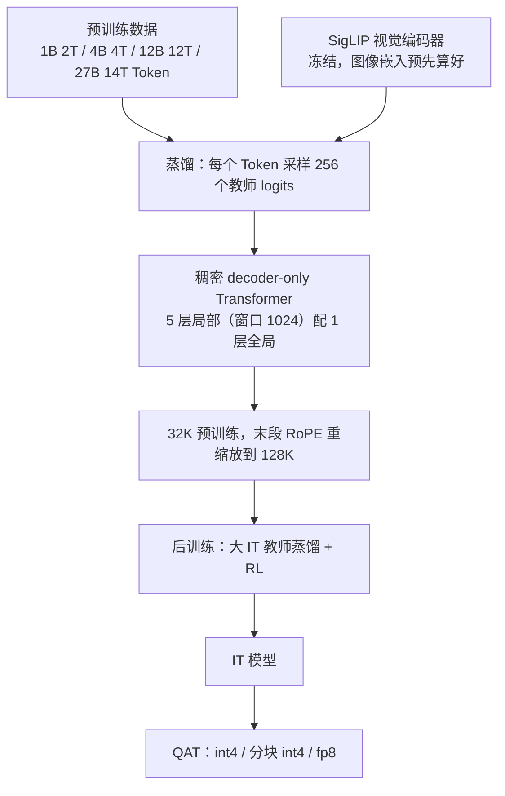
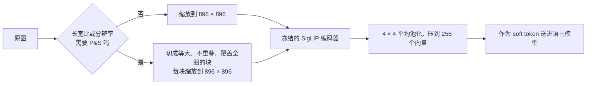
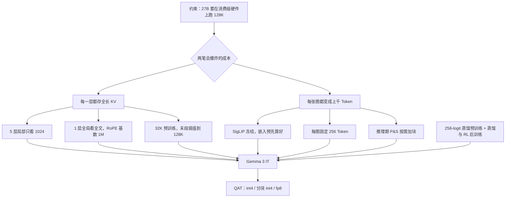

# Gemma 3：五个局部层配一个全局层，把 128K 的 KV Cache 压下来

<!-- release-date: 2025-03-10 -->

> 本文依据 Google DeepMind Gemma 团队的 **Gemma 3 Technical Report**，arXiv:2503.19786v1，2025-03-25 提交（封面日期 2025-03-12），共 25 页：正文 p. 1–11，参考文献 p. 11–16，贡献者名单 p. 17–19，附录 p. 20–25。页码均指 PDF 自身的页序。文中区分三件事：**报告明确写了什么**、**我们怎么解释或验算它**、**哪些是外部资料补充**。

## 阅读前先认识几个词

- **Token（词元）与 KV Cache（键值缓存）**：Token 是模型读写的最小单位。模型每读过一个 Token，就把它在每一层的 Key 和 Value 存下来，生成下一个 Token 时不必重算。上下文越长，这份缓存越大。
- **全局注意力与局部注意力**：全局层能看完整段上下文，缓存随长度线性增长；局部层只看最近一小段，缓存封顶。
- **滑动窗口注意力（Sliding Window Attention，SWA）**：局部注意力的常见实现，当前位置只与最近 $W$ 个 Token 做注意力，$W$ 叫窗口。
- **GQA（Grouped-Query Attention，分组查询注意力）**：多个 Query 头共用一组 Key/Value 头，先把每层缓存的常数砍一刀。
- **蒸馏（distillation）**：学生不只学「正确的下一个 Token」，而是学更大的教师模型给出的整个概率分布。
- **SigLIP**：一种把图像编码成向量的视觉编码器，CLIP 的变体。
- **QAT（Quantization-Aware Training，量化感知训练）**：训练时就把量化误差算进去，而不是训完再压。
- **PT / IT**：pre-trained（预训练）与 instruction-tuned（指令微调）两种权重。

## 一句话先说清

Gemma 3 的目标读者不是数据中心，而是手机、笔记本和一张高端消费级显卡（PDF p. 1）。在这里，把上下文从 Gemma 2 的 8K 拉到 128K，最先爆的不是算力，而是**推理时的 KV Cache**：每一层都给每个 Token 存一份 Key 和 Value，长度涨 16 倍，缓存就涨 16 倍。

报告的回答写在摘要里（PDF p. 1）：提高局部层对全局层的比例，同时把局部层的视野缩短。落到数字上是：

> **每 5 个只看最近 1024 个 Token 的局部层，才配 1 个看全文的全局层。**

于是随上下文增长的成本只出现在六分之一的层上。视觉也按同一个思路进账：每张图固定压成 256 个 Token，需要读小字时再在推理期按需多付。这篇报告最值得带走的是这种分层付费的方式：

> **先把「随长度增长的成本」和「不随长度增长的成本」分开，再只对前者动刀。**

## 先看全景：四个尺寸，一条 KV 策略



据 PDF p. 1–4、p. 7 的文字重画，只表示组件关系，不是训练时间线。

四个尺寸是 1B、4B、12B、27B。Table 1 只把参数拆成三列（PDF p. 2）：

| 模型 | 视觉编码器 | 嵌入参数 | 非嵌入参数 |
|---|---:|---:|---:|
| 1B | 0 | 302M | 698M |
| 4B | 417M | 675M | 3,209M |
| 12B | 417M | 1,012M | 10,759M |
| 27B | 417M | 1,416M | 25,600M |

1B 没有视觉编码器，上下文只有 32K；其余三个共用同一个视觉编码器、支持 128K（PDF p. 2）。报告没有给层数、隐藏维度和头数，下文需要时用官方实现补，都会标明是外部补充。

骨架沿用前两代（PDF p. 2）：decoder-only Transformer、GQA、RMSNorm 同时做 pre-norm 与 post-norm。和 Gemma 2 的一处具体差别是**用 QK-norm 替换了 soft-capping**，依据是 Dehghani、Wortsman 与 Chameleon 的工作；报告没有给这个替换的消融。

## 核心设计一：5:1 交错，局部窗口锁在 1024

### 旧问题：每一层都在存全长

自回归生成时，每一层都为每个已读 Token 存一份 Key 和 Value。每个 Token 的缓存大约是：

$$
2 \times n_{\text{kv}} \times d_{\text{head}} \times n_{\text{layers}} \times \text{每元素字节数}
$$

乘 2 是因为 Key 和 Value 各一份。总缓存再乘上下文长度 $L$。对千亿级模型，权重远大于缓存，这笔账不痛；对要塞进一张消费卡的 27B，上下文一长，缓存就和权重同级。报告开篇就把长上下文的挑战定性为推理时 KV Cache 的「内存爆炸」（PDF p. 1）。

Gemma 2 已经在做局部与全局交错，但比例是 1:1，局部窗口 4096（PDF p. 7）。

### 新设计：把两个旋钮同时拧紧


报告写的排布是（PDF p. 1–2）：局部滑动窗口自注意力与全局自注意力交替，每 5 个局部层配 1 个全局层，**模型第一层是局部层**；局部层的跨度只有 1024 个 Token。所以「只有全局层看长上下文」。

位置编码也按层类型分开（PDF p. 2、7）：全局层的 RoPE 基数从 10k 提到 1M，局部层保持 10k。局部层本来就只看 1024 个 Token，不需要为长距离准备更慢的旋转频率。

右半图是 Figure 6 的重画：同一个 2B 结构，纯全局的缓存随上下文长度线性往上冲，5:1 加 1024 窗口那条被压平（PDF p. 7）。128K 时两者相差约 6 倍，这与「只有六分之一的层随长度增长」的算术吻合；报告正文没有给精确 MB 数，数值是我们读图。

### 为什么敢这么省：两组消融只看困惑度

直觉上，让六分之五的层只看最近 1024 个 Token，模型应该会忘掉远处的事。报告用两组纯文本小模型的消融回答（PDF p. 6–7）：

- **比例**：Figure 3 在 2B 和 9B 上扫 1:1、3:1、5:1、7:1，验证集困惑度的变化都在约 ±0.03 以内，连 7:1 也「影响很小」（PDF p. 6）；
- **窗口**：Figure 4 在两个 2B 模型上扫 512、1024、2048、4096，困惑度的变化在约 ±0.02 以内，报告说窗口可以显著缩小而不影响困惑度（PDF p. 7）。

记号要留意：Figure 4 的图例写 `L:G=1:1` 和 `L:G=3:1`，图注却写「1:1 和 1:3 的局部对全局比例」（PDF p. 7）。报告在「局部对全局」和「全局对局部」两种写法之间来回用，下面 Figure 5 的横轴也写 `1:3`。按图例和柱高的方向，`1:3` 都应读作「3 个局部层配 1 个全局层」。

这两张图说的是一件反直觉的事：**常规语言建模并不需要每一层都看见全文。** 局部语法和近处的词序，1024 个 Token 足够大多数层用；需要翻到很久以前的能力，可以集中养在少数全局层里。

但要说清证据的边界：两组消融只量了**困惑度**。报告没有按比例或窗口扫大海捞针、RULER 这类检索指标。困惑度会告诉你 7:1 也行，它回答不了精确检索会不会受伤。

### KV 到底省了多少

Figure 5 把 2B 模型在 32K 预填充时的「权重 vs KV Cache」画成堆叠柱（PDF p. 7）。数值读自原图，约数：

| 配置 | 权重（MB） | KV Cache（MB） | KV ÷ 权重 |
|---|---:|---:|---:|
| 纯全局（Gemma 1、Llama 的做法） | 3300 | 1750 | 约 53% |
| 1:1，窗口 4096（Gemma 2） | 3300 | 1000 | 约 30% |
| 1:1，窗口 1024 | 3300 | 900 | 约 27% |
| 1:3，窗口 4096 | 3300 | 580 | 约 18% |
| 1:3，窗口 1024 | 3300 | 440 | 约 13% |

报告正文写的是：纯全局的内存开销 60%，「1:3 加窗口 1024」降到 15% 以下（PDF p. 7）。后者和读图一致；前者读图只有约 53%，报告没说 60% 怎么算。更要紧的是，**最终采用的 5:1 不在这张图里**，15% 属于 3:1 加 1024。

两个旋钮的分量也能从表里读出来：同样 1:1，窗口从 4096 缩到 1024 只省一点；提高局部比例才省得多。因为比例 1:1 时仍有一半的层存全长，窗口再小也救不了那一半。

### 用官方配置算一遍 27B 的账

报告没给层配置。下面用 Google DeepMind 官方实现 [`google-deepmind/gemma`](https://github.com/google-deepmind/gemma) 里的 Gemma 3 配置（外部补充）：

| 模型 | 层数 | 隐藏维度 | Q 头 | KV 头 | 每头维度 | 局部窗口 |
|---|---:|---:|---:|---:|---:|---:|
| 1B | 26 | 1152 | 4 | 1 | 256 | 512 |
| 4B | 34 | 2560 | 8 | 4 | 256 | 1024 |
| 12B | 48 | 3840 | 16 | 8 | 256 | 1024 |
| 27B | 62 | 5376 | 32 | 16 | 128 | 1024 |

实现里的注意力模式正是 5 个 `LOCAL_SLIDING` 加 1 个 `GLOBAL` 循环，与报告一致；只有一处不同：1B 的窗口是 512，不是报告写的 1024。

27B 若每一层都按全长存 bf16 的 KV，每个 Token 是（本文验算）：

$$
2 \times 16 \times 128 \times 62 \times 2\,\text{B} = 507{,}904\,\text{B} = 496\,\text{KiB}
$$

这就是常被拿来当对照基准的 **496 KiB/token**：它是「什么都不省」的上界，不在 PDF 里。62 层里全局层是第 6、12、……、60 层，共 10 层，真正随长度增长的只有：

$$
\frac{10}{62} \times 496\,\text{KiB} = 80\,\text{KiB/token}
$$

局部层的缓存封顶在 1024 个 Token，只是一个与长度无关的常数。跨模型比较「每 Token 多少 KiB」时要先统一口径：滑窗模型的公开数字常常是上界。

再对照报告 Table 3（PDF p. 3）。它给出 32,768 上下文下权重与「权重加 KV」的内存（GB），不论权重是什么格式，27B 的 KV 增量都是 18.7 GB（如 bf16 的 54.0 → 72.7）。按上面的配置推算，同一长度下：

| 口径 | 27B 在 32K 的 KV | 27B 在 128K 的 KV |
|---|---:|---:|
| Table 3 的 KV 增量（报告） | 18.7 GB | — |
| 62 层全长，每元素 2 字节（本文推算） | 16.6 GB | 66.6 GB |
| 5:1 加窗口 1024，每元素 2 字节（本文推算） | 3.1 GB | 11.2 GB |

其余尺寸也是同样的模式：Table 3 的 KV 增量是 1B 0.9、4B 4.7、12B 14.9 GB，全长上界推算为 0.87、4.56、12.9 GB。**Table 3 的 KV 数字和「全部层按全长存」的上界同量级，而不是 5:1 之后的量级。** 报告没有说明 Table 3 的计算口径；表注写的「量化到 8 bits」若指 KV，推算值还要减半，更对不上。所以 Table 3 不能用来展示 5:1 的收益，它更像一个保守的部署上界。这是我们的推算与判断。

### 长上下文是后加的，不是从零训到 128K

报告没有用 128K 序列从头预训练（PDF p. 7）：先在 32K 上预训练；预训练末段把 4B、12B、27B 扩到 128K，按 Chen 等人的位置插值重缩放 RoPE，缩放因子 8 「在实践中效果好」；全局层基数 1M、局部层 10k。

Figure 7 画了重缩放前后、不同上下文长度上的平均困惑度（PDF p. 7）。读图可见：重缩放之前（虚线），12B 过了 32K 困惑度就急剧上升，4B 与 27B 走平或回升；重缩放之后（实线）三个尺寸的困惑度一路下降到 128K 附近，4B 与 12B 在 256K 之后明显回升，27B 到 512K 只有轻微上翘。报告正文的概括是「能泛化到 128K，继续拉长会迅速退化」（PDF p. 7），图上 27B 的退化并不明显。

**5:1 解决的是 128K 的内存，不是任意长度的质量。** 长度的上限来自位置插值，不来自注意力排布。

### 代价与边界

- 远距离的两个 Token 之间，只能靠六分之一的全局层直接相连。精确检索更依赖这少数几层，但报告没有做按比例的检索消融；
- 最终模型的长上下文成绩（Table 15，见实验一节）显示 128K 上确实掉分，IT 掉得比 PT 多；
- 报告只给了 2B 消融的内存图，没有 27B 实测的 KV 曲线。

**这一节可以带走什么**：先数清楚「有几层在存全长状态」，再决定优化谁；选比例时不要只看困惑度，精确检索要单独测。

## 核心设计二：视觉是另一笔 Token 预算

### 旧问题

一张高分辨率图若按 patch 原样送进语言模型，Token 数轻松上千，会把刚省下的 KV 预算再花回去。反过来，固定分辨率的编码器又有另一个毛病：非正方形图被拉变形，高分辨率图里的文字读不出、小物体会消失（PDF p. 2）。

### 新设计：冻结的 SigLIP、固定 256 个向量、推理期再切图



据 PDF p. 2、8 的文字重画，是机制示意。三句话概括（PDF p. 1–2、8）：

1. 编码器是 SigLIP 的一个 **400M** 变体（Table 1 记作 417M，报告没解释差额），输入缩放到 $896 \times 896$ 的正方形，在视觉助手任务数据上微调过；为简单起见，4B、12B、27B **共用同一个编码器，训练时冻结**；
2. 每张图固定表示为 **256 个** soft token，高分辨率编码器用平均池化把输出压到 256，896 这一档是 $4 \times 4$ 池化；
3. 训练时图像嵌入**预先算好**，语言模型直接吃向量，编码器不增加语言模型的训练成本（PDF p. 3）。

### 分辨率与 Pan and Scan：需要读字时才加钱

Table 7 用一个短程训练的 2B 模型扫编码器输入分辨率（PDF p. 8）：

| 分辨率 | DocVQA | InfoVQA | TextVQA |
|---:|---:|---:|---:|
| 256 | 31.9 | 23.1 | 44.1 |
| 448 | 45.4 | 31.6 | 53.5 |
| 896 | 59.8 | 33.7 | 58.0 |

编码器看得越细越好，但输出仍锁在 256 个 Token：语言模型只收固定长度的摘要。

**Pan and Scan（P&S，平移扫描）** 受 LLaVA 启发，是一个只在推理期启用的自适应切窗算法：把图切成覆盖全图、大小相等、互不重叠的块，每块缩到 $896 \times 896$ 再送编码器；只在必要时启用，并控制最大块数，也可以关掉换速度（PDF p. 1–2）。最大块数是多少、是否另留一张全图缩略、每块各占 256 个 Token 怎样排进上下文，报告都没写。

Table 8 是 P&S 的开关对照，4-shot、验证集（PDF p. 8）：

| 模型 | DocVQA | InfoVQA | TextVQA |
|---|---:|---:|---:|
| 4B | 72.8 | 44.1 | 58.9 |
| 4B + P&S | 81.0 | 57.0 | 60.8 |
| 27B | 85.6 | 59.4 | 68.6 |
| 27B + P&S | 90.4 | 76.4 | 70.2 |

InfoVQA（信息图）涨得最多，27B 涨 17.0；TextVQA 只涨 1–2 分。报告的解释是收益集中在长宽比多变或要读图中文字的任务上（PDF p. 8）。一处口径冲突：正文说比较的是「27B IT 模型」，表注说是**预训练 checkpoint**，表里无 P&S 的数字也与预训练的 Table 11 一致（PDF p. 20），应以表注为准。Figure 1 的超市收据问答（从小票上找到菜价再算 18% 小费）就是这类读小字任务的示范（PDF p. 2）。

视觉的主轴不是「看得多细」，而是**先把视觉 Token 变成常数，再留一个显式、可关的贵阀门**。这和 5:1 是同一类决策：默认路径便宜，贵的路径按需开。

## 核心设计三：预训练就是蒸馏，教师多大取决于训多久

### 256 个 logits 的蒸馏

所有 Gemma 3 都用知识蒸馏训练（PDF p. 1）。具体做法只有三句（PDF p. 3）：每个 Token 按教师概率加权采样 256 个 logits；学生用交叉熵拟合教师在这些样本上的分布；没被采到的 logits，教师目标概率置零再重新归一化。

词表有 262,144 条，完整搬运教师分布很贵；256 个槽是一个明确的计算与存储预算。代价是有偏：教师认为可能的词更容易被采到，长尾被当成不可能。教师是谁、多大，学生是否同时学真实的下一个 Token，报告没写。

### 小教师还是大教师

常见的经验是：训小模型时从更小的教师蒸馏更好。报告怀疑这些研究的训练太短，较差教师带来的正则效应盖过了教师质量（PDF p. 8）。Figure 8 让同一个学生分别跟一大一小两个教师学不同时长，纵轴是两者困惑度的相对差，越负表示大教师越好（PDF p. 8）。读图：约 100 亿 Token 时小教师略好（差约 +0.0015），约 200 亿 Token 附近交叉，到约 3000 亿 Token 时大教师领先约 0.007，差距还在拉大。

> **教师该多大，是训练时长的函数，不只是学生尺寸的函数。**

两处边界：教师的具体尺寸没公开；图上最长只到约 3000 亿 Token，比 Gemma 3 实际的 2T–14T 短一个量级，外推到正式训练是作者的判断。

## 数据与分词器

预训练 Token 预算比 Gemma 2 略多（PDF p. 3）：27B 14T、12B 12T、4B 4T、1B 2T，增量用于图像与文本的混合。多语言数据加量，单语与平行数据都有，语言不均衡用受 Chung 等人（2023）启发的策略处理。过滤包括：降低不当或不安全输出的风险、去掉部分个人与敏感信息、对评测集去污染、减少敏感内容的扩散以降低复述风险，以及受 Sachdeva 等人（2024）启发的质量重加权（PDF p. 3）。

分词器与 Gemini 2.0 相同：SentencePiece，数字拆开，保留空白，带 byte 级编码，对非英语更均衡（PDF p. 3）。词表在正文写「262k」（PDF p. 3），在 Table 1 表注写「256k」（PDF p. 2）。官方实现里的词表大小是 262,144，正好是 $2^{18}$，即 256 × 1024；两处是同一个数，一个按 1000 计、一个按 1024 计（本文解释）。27B 的嵌入参数 1,416M 也与 262,144 × 5376 ≈ 1,409M 对得上。

数据配比、合成数据比例、知识截止日报告都没写。

## 后训练与对话格式

IT 模型靠「相对以前的配方改进过的后训练」（PDF p. 4）：从一个大的 IT 教师做改进版知识蒸馏，加一段 RL 微调，基于改进版的 BOND、WARM、WARP。奖励函数用来提高有用性、数学、代码、推理、指令遵循与多语言，同时压低有害性，来源包括：用人类反馈训练并做权重平均的奖励模型（WARM）、代码执行反馈、解数学题的真值奖励（PDF p. 4）。

数据过滤去掉含个人信息的样本、不安全或有毒的输出、错误的自我身份数据和重复样本；加入鼓励上下文内标注出处、适度对冲和拒答的子集，能提高事实性指标且「不损害其他指标」（PDF p. 4）。后半句是因果陈述，报告没给对应的分数表。SFT 数据量、RL 步数、奖励权重、教师是哪个模型都没写；BOND、WARM、WARP 只给了论文名。

格式上有两处实用细节（PDF p. 4）。Table 4 给出的 IT 对话格式是（报告原文示例）：

```text
[BOS]<start_of_turn>user
Who are you?<end_of_turn>
<start_of_turn>model
My name is Gemma!<end_of_turn>
<start_of_turn>user
What is 2+2?<end_of_turn>
<start_of_turn>model
```

模型输出 `2+2=4.<end_of_turn>`。

- PT 与 IT 的文本都以 `[BOS]` 开头，但它必须在分词**之后**显式加上（或用 `add_bos=True`），把字符串 `"[BOS]"` 拿去分词得不到这个 Token；
- PT 生成结束输出 `<eos>`，IT 输出 `<end_of_turn>`。微调哪一种，就要补哪一种结束符。

## 量化：约 5000 步把部署格式练进去

除原始 checkpoint，报告还提供量化版（PDF p. 3）：对每个模型用 QAT 再微调一小段，通常 5000 步，以未量化 checkpoint 的概率为目标，数据贴近预训练与后训练分布。格式跟着最流行的开源推理引擎走（点名 llama.cpp），只做三种权重表示：逐通道 int4、分块 int4（块大小 32）、switched fp8。

Table 3（PDF p. 3，32K 上下文，单位 GB）：

| 模型 | bf16 | int4 | int4 分块 32 | SFP8 |
|---|---:|---:|---:|---:|
| 1B | 2.0 | 0.5 | 0.7 | 1.0 |
| 1B + KV | 2.9 | 1.4 | 1.6 | 1.9 |
| 4B | 8.0 | 2.6 | 2.9 | 4.4 |
| 4B + KV | 12.7 | 7.3 | 7.6 | 9.1 |
| 12B | 24.0 | 6.6 | 7.1 | 12.4 |
| 12B + KV | 38.9 | 21.5 | 22.0 | 27.3 |
| 27B | 54.0 | 14.1 | 15.3 | 27.4 |
| 27B + KV | 72.7 | 32.8 | 34.0 | 46.1 |

27B 从 bf16 的 54.0 GB 压到 int4 的 14.1 GB，是能否放进一张 24 GB 消费卡的分界。KV 那一行的口径前面已经分析过。报告没有给量化前后同一基准的分数对照，「QAT 保质量」在这份材料里是方法描述，不是实验结论。

## 训练基础设施：芯片数公开，时长与算力没有

Table 2（PDF p. 3）：

| 模型 | TPU | 芯片数 | 数据分片 | 序列分片 | 副本 |
|---|---|---:|---:|---:|---:|
| 1B | TPUv5e | 512 | 16 | 16 | 2 |
| 4B | TPUv5e | 2048 | 16 | 16 | 8 |
| 12B | TPUv4 | 6144 | 16 | 16 | 24 |
| 27B | TPUv5p | 6144 | 24 | 8 | 32 |

每行三个分片数的乘积都等于芯片数。软件栈（PDF p. 3–4）：优化器状态用 ZeRO-3 的一个实现分片；多 pod 训练时用 Pathways 在数据中心网络上做数据副本间的归约；编程范式是 JAX 与 Pathways 的「单控制器」，配 GSPMD 分区器和 MegaScale XLA 编译器。每种配置都按最小化单步时间调过。训练时长、步数和总算力都没有。

## 实验：先看两句口号，再看表

摘要把后训练成绩收成两句（PDF p. 1）：Gemma3-4B-IT 与 Gemma2-27B-IT **有竞争力**；Gemma3-27B-IT 与 Gemini-1.5-Pro 在各基准上**可比**。报告说明它只和自家模型比，不直接比外部模型，因为在自己的设置里跑别人的模型不能保证公平（PDF p. 5）。下面用 Table 6（PDF p. 6，IT、zero-shot）核对这两句。

### 4B-IT 对 Gemma2-27B-IT：数学跳级，知识没有

| 基准 | Gemma 3 4B | Gemma 2 27B |
|---|---:|---:|
| MATH | 75.6 | 55.6 |
| HiddenMath | 43.0 | 14.8 |
| FACTS Grounding | 70.1 | 62.4 |
| MMLU-Pro | 43.6 | 56.9 |
| Global MMLU-Lite | 54.5 | 68.6 |
| LiveCodeBench | 12.6 | 20.4 |
| Bird-SQL（dev） | 36.3 | 46.7 |
| GPQA Diamond | 30.8 | 34.3 |
| SimpleQA | 4.0 | 9.2 |

「有竞争力」成立的主要是数学和事实接地。知识、代码、多语言知识，4B 仍明显落后。后训练把小模型的推理抬了上去，世界知识没有跟着蒸馏到同一水平。

### 27B-IT 对 Gemini-1.5-Pro：数学贴近，知识差一截

| 基准 | Gemma 3 27B | Gemini 1.5 Pro |
|---|---:|---:|
| MATH | 89.0 | 86.5 |
| HiddenMath | 60.3 | 52.0 |
| Bird-SQL（dev） | 54.4 | 54.4 |
| MMMU（val） | 64.9 | 65.9 |
| LiveCodeBench | 29.7 | 34.2 |
| FACTS Grounding | 74.9 | 80.0 |
| Global MMLU-Lite | 75.1 | 80.8 |
| MMLU-Pro | 67.5 | 75.8 |
| GPQA Diamond | 42.4 | 59.1 |
| SimpleQA | 10.0 | 24.9 |

表格显示的是 **STEM 近、知识远**，不是全面可比。同一张表里 Gemini 2.0 Pro 几乎全面更高。

附录 Table 18 另列了 IT 模型的更多基准（PDF p. 23），其中两行和 Table 6 对不上：27B 的 LiveCodeBench 在 Table 6 是 29.7、在 Table 18 是 39.0，HiddenMath 是 60.3 对 56.0；Gemma 2 27B 的 LiveCodeBench 也是 20.4 对 29.0。报告没说明两张表的版本差别，可能是不同的题目窗口。Table 18 里还有一组能补全 4B 画像的数字：HumanEval 71.3（Gemma 2 27B 51.8）、IFEval 90.2（91.1）、BBH 72.2（74.9）。

### 人类盲评：Arena Elo 1338

Table 5 是 LMSys Chatbot Arena 的盲评 Elo，27B IT 为 1338（+8/−9），是 2025-03-08 收到的初步结果（PDF p. 4–5）。摘几行：

| 排名 | 模型 | Elo | 开放权重 | 类型 |
|---:|---|---:|---|---|
| 6 | DeepSeek-R1 | 1363 | 是 | MoE 671B/37B |
| 9 | Gemma-3-27B-IT | 1338 | 是 | 稠密 27B |
| 13 | DeepSeek-V3 | 1318 | 是 | MoE 671B/37B |
| 18 | Gemini-1.5-Pro-002 | 1302 | 否 | — |
| 28 | Meta-Llama-3.1-405B-Instruct-bf16 | 1269 | 是 | 稠密 405B |
| 38 | Llama-3.3-70B-Instruct | 1257 | 是 | 稠密 70B |
| 39 | Qwen2.5-72B-Instruct | 1257 | 是 | 稠密 72B |
| 59 | Gemma-2-27B-it | 1220 | 是 | 稠密 27B |

正文说 1338 进入前十，高于 DeepSeek-V3（1318）、「LLaMA 3 405B（1257）」和「Qwen2.5-70B（1257）」这些大得多的非思考开放模型（PDF p. 5）。正文这两处和表对不上：表里 Llama 3.1 405B 是 1269，1257 是 Llama 3.3 70B 与 Qwen2.5-72B。结论不受影响，引用时以表为准。报告还写明 **Elo 不计视觉能力**（PDF p. 5），这是文本偏好盲评。

### 预训练探针：加了视觉，多数能力仍在涨

Figure 2 用雷达图概括 Gemma 2 与 Gemma 3 预训练模型在科学、代码、事实性、多语言、推理、视觉上的相对位置，细节在附录 Table 9–14（PDF p. 6、20–21）。作者的观察是尽管加了视觉，多数类别仍有提升，多语言是这一代的重点；并自己加了保留：即使做了去污染，探针仍有污染风险，更硬的结论不好下（PDF p. 6）。

附录里值得单独看的（PDF p. 20）：常识与事实类（Table 9）和 Gemma 2 大体持平；STEM 与代码（Table 10）4B、12B 稳定提升，但 **27B 的代码没有**：HumanEval 48.8 对 Gemma 2 27B 的 51.2，GPQA Diamond 24.3 对 26.3，报告也承认代码的提升不包括 27B。

### 长上下文：能用 128K，但 IT 比 PT 更怕 128K

Table 15（PDF p. 22）：

| 基准 | 4B PT | 12B PT | 27B PT | 4B IT | 12B IT | 27B IT |
|---|---:|---:|---:|---:|---:|---:|
| RULER 32K | 67.1 | 90.6 | 85.9 | 61.4 | 80.3 | 91.1 |
| RULER 128K | 51.7 | 80.7 | 72.9 | 46.8 | 57.1 | 66.0 |
| MRCR 32K | 44.7 | 59.8 | 63.2 | 49.8 | 53.7 | 63.2 |
| MRCR 128K | 40.6 | 56.9 | 60.0 | 44.6 | 49.8 | 59.3 |

27B IT 的 RULER 从 32K 的 91.1 掉到 128K 的 66.0，PT 从 85.9 掉到 72.9；12B IT 从 80.3 掉到 57.1。**后训练没有把 128K 的检索一起抬上去。** 5:1 让 128K 装得进内存，不等于 128K 上的检索和 32K 一样稳。报告对这组数没有讨论。

### 视觉与视频

IT 多模态（Table 16，PDF p. 22，默认开 P&S，多为测试集）：27B 的 MMMU val 64.9、DocVQA 86.6、InfoVQA 70.6、MathVista testmini 67.6。

和专用视觉模型比：按 PaliGemma 2 的迁移协议（只扫学习率）微调预训练 checkpoint 后（Table 12，PDF p. 21，无 P&S），Gemma 3 在文档理解上甚至超过更大的 PaliGemma 2，在 AI2D 与 OKVQA 上也更好，VQAv2 与 COCO caption 上 PaliGemma 2 略好。报告还算了一笔账：因为编码器输出做了平均池化，4B 与 12B 在 896 分辨率下的迁移成本约为 PaliGemma 2 9B 与 27B 的十分之一（PDF p. 21）。

视频不是独立模态。Table 17 用 0-shot、均匀抽 16 帧（PDF p. 22）：27B 的 Perception Test MCVQA 58.1、ActivityNet-QA 52.8。按每帧 256 个 Token 算，16 帧就是约 4096 个视觉 Token（本文算术）。

## 记忆化与安全

### 记忆率明显低于前代

方法沿用 Gemma 2（PDF p. 8–9）：从各语料均匀抽取大量训练数据，用 50 个 Token 的前缀测能否续出 50 个 Token 的原文后缀；全部匹配算精确记忆，编辑距离 10% 以内算近似记忆。Figure 9（对数纵轴）显示 Gemma 3 的记忆率明显低于此前所有 Gemma、Gemini 与 PaLM 模型；4B、12B、27B 之间差别很小，1B 更低；近似记忆平均约是精确记忆的 24 倍（PDF p. 9）。用 Google Cloud 敏感数据保护服务扫被判为记忆的输出，所有尺寸都没扫到个人信息；该服务偏高召回、会高估，所以报告的措辞是「低于检测阈值」（PDF p. 9）。脚注特意说明，他们不声称模型「装着」训练数据的副本（PDF p. 8）。

### 安全：有流程，几乎没有分数

安全策略禁止的类别有：儿童性虐待与剥削、可能导致伤害的个人身份信息、仇恨与骚扰、危险或恶意内容、露骨性内容、违背科学或医学共识的医疗建议（PDF p. 10）。预训练数据做了安全过滤，微调用 SFT 与 RLHF 引导模型远离不良行为。

基线保证性评测用大量合成对抗查询、人工标注是否违规，结论是违规率「显著偏低」，没有给百分比；因为 STEM 能力提升，另用内部闭卷选择题评估生物、放射、核知识，化学用 Macknight 等人的方法，结论是这些领域的知识「低」，同样没有分数（PDF p. 10）。治理上的判断是：考虑到已有许多更强的开放模型，这次发布对整体风险格局的影响可以忽略；并沿用「把更强的模型测透通常就足以为更弱的模型托底」的做法，只在可能有更高风险时做深入的危险能力评估（PDF p. 10）。

ShieldGemma 2 是用 Gemma 3 做的 4B 图像安全分类器，输出危险内容、露骨性内容、暴力三类标签（PDF p. 9），是伴随产物，不是本报告的模型。

**安全这一节是流程说明加作者陈述，不是这份 PDF 提供的可核对证据。**

## 报告没有告诉我们的事

- **层配置**：层数、KV 头数、隐藏维度都不在 PDF 里，496 KiB 只能从官方实现反推；
- **5:1 对检索的消融**：只有困惑度和 2B 的内存图，没有按比例扫 RULER 或大海捞针；
- **QK-norm 替换 soft-capping 的消融**；
- **教师模型的身份与大小**，蒸馏是否同时学真实标签；
- **数据配比、知识截止日、训练时长与总算力**；
- **后训练的数据量、步数、奖励权重**；
- **P&S 的最大块数与 Token 排布**；
- **量化的质量代价**：没有量化前后对照；
- **Table 3 的 KV 口径**：是否计入滑窗封顶、按几位存储。

它是一份清楚的架构说明加一份合格的成绩单，写给要部署的人（内存表、对话格式、量化格式都很具体），但不够用来复现 Gemma 3。

## 最值得带回自己项目的五条

### 1. 先问哪几层必须看见全文

Gemma 3 没有发明新的注意力公式，它只是承认大多数层不需要 $L$ 这么长的视野。任何长会话、长日志、长视频系统都可以先数「有几层在存全长状态」，再决定优化谁。

### 2. 用困惑度调比例，一定会调得太省

Figure 3 和 Figure 4 显示语言建模对 5:1 甚至 7:1、对 1024 窗口几乎无感；而最终模型在 128K 上的 RULER 明显掉分。线上若要精确检索，必须另测检索类指标。

### 3. 教师大小跟训练时长绑定

短程蒸馏里较差教师的正则可能赢，训得够长大教师才会兑现信息量。「小模型配小教师」不是与时长无关的定理。

### 4. 多模态先锁 Token 数，再留一个贵的阀门

256 是默认账单，P&S 是按需加钱。分辨率消融和 P&S 开关表都说明：读字任务吃的是空间分辨率，要把它做成显式、可关的选项。

### 5. 部署格式要进训练闭环，并且跟着生态走

5000 步 QAT、三种 llama.cpp 生态熟悉的表示，目标不是数学上最优的量化，而是用户不换工具链就能把 27B 塞进一张消费卡。

## 用一张图重新串起全文



## 关键词回看

- **5:1 交错**：每 5 个局部滑动窗口层配 1 个全局层，第一层是局部层。
- **窗口 1024**：局部层只在最近 1024 个 Token 上做注意力，缓存封顶。
- **496 KiB/token**：27B 若每层都按全长存 bf16 KV 的上界，按官方配置验算，不在 PDF 里；真正随长度增长的约 80 KiB。
- **双基数 RoPE 与位置插值**：全局层 1M、局部层 10k，预训练末段按因子 8 扩到 128K。
- **QK-norm**：对 Query 和 Key 做归一化，替换 Gemma 2 的 soft-capping。
- **SigLIP 与 256 soft token**：冻结的视觉编码器，每图固定 256 个向量。
- **Pan and Scan**：推理期按需把图切成等大块，解决固定正方形输入的变形与糊字。
- **256-logit 蒸馏**：每个 Token 只学教师分布里采样出的 256 个位置。
- **BOND / WARM / WARP**：后训练 RL 所基于的三项工作，报告只给了名字。
- **QAT**：约 5000 步，产出逐通道 int4、分块 int4 与 switched fp8。

## 最后的判断

Gemma 3 被实验托住的结论有三条：局部与全局的比例、窗口大小对困惑度很不敏感，5:1 加 1024 作为内存优化站得住，2B 的 KV 曲线被压平约 6 倍；后训练把数学抬得很高，4B 的 MATH 超过上一代 27B，27B 超过 Gemini 1.5 Pro；视觉侧「固定 256 加推理期 P&S」在文档与信息图上有清晰的开关增益。

表格不完全支持口号的：「4B 与 Gemma 2 27B 有竞争力」（知识类明显落后）；「27B 与 Gemini 1.5 Pro 全面可比」（GPQA、SimpleQA 差距大）。只是作者判断的：5:1 对长上下文检索无伤（没有检索消融，128K 的 RULER 还掉了）；QAT 保质量；大教师在正式训练时长上更好（消融只到约 3000 亿 Token）。

还有几处要读者自己校准：Table 3 的 KV 数字接近「全部层存全长」的上界，不是 5:1 的收益；Table 6 与 Table 18 的 LiveCodeBench 不一致；Arena 正文里两个对比分数张冠李戴；256k 与 262k 是同一个词表。

如果只带走一句：

> **128K 不是把窗口改大，而是禁止大多数层去看全文；视觉也先变成 256 个 Token，贵的分辨率只在推理时按需买。**

## 资料与阅读边界

**原始依据**

- 本地 `papers/Google/Gemma-3.pdf`，即 arXiv:2503.19786v1（2025-03-25 提交，封面日期 2025-03-12），25 页。[arXiv 页面](https://arxiv.org/abs/2503.19786) 截至 2026-09-30 只有 v1，与本地一致。

**首发日证据**

- `release-date` 取 2025-03-10：官方 [Gemma 发布日志](https://ai.google.dev/gemma/docs/releases) 记载当日发布 Gemma 3 的 1B、4B、12B、27B 与 ShieldGemma 2。官方博客与 Gemini API 变更日志（`gemma-3-27b-it` 上线）都是 2025-03-12，按「官方日志与博客不一致时取日志」取前者。

**外部补充（不是报告内容）**

- 官方实现 [google-deepmind/gemma](https://github.com/google-deepmind/gemma) 中 Gemma 3 的配置：各尺寸层数、隐藏维度、头数、窗口（1B 为 512）、词表 262,144、全局层 RoPE 缩放因子 8。本文用它验算 496 KiB/token、80 KiB/token 与 Table 3 的 KV 口径。
- 官方 [Gemma 3 model card](https://ai.google.dev/gemma/docs/core/model_card_3)：训练数据知识截止 2024 年 8 月；后续成员 270M（2025-08-14 发布，6T Token，32K 上下文）不是本报告对象。
- 本文标注为读图或推算的内容：Figure 3–8 的数值、Figure 5 的 KV 与权重比、496 KiB 与 80 KiB、Table 3 各尺寸的全长上界对照、16 帧视频的 Token 数。
- 一代之后的变化见 Gemma-4 一篇：5:1 被保留，又叠了 p-RoPE、键当值与跨层共享 KV；那些不属于这份报告。
