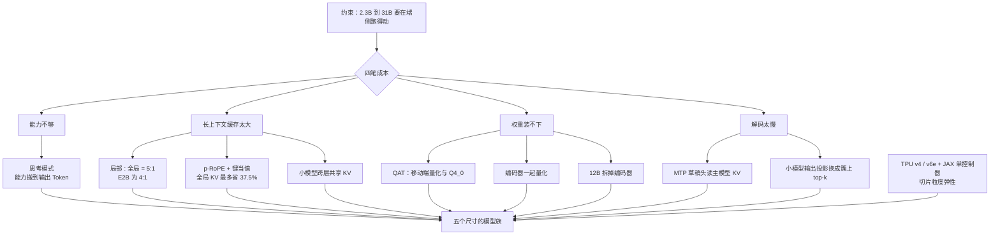

# Gemma 4：参数加不动了，就把成本搬到别处

<!-- release-date: 2026-03-31 -->

> 本文依据 Google DeepMind 的 **Gemma 4 Technical Report**，arXiv:2607.02770v2，2026-07-24 提交的修订版（封面日期 2026-06-19），共 17 页：正文 p. 1–9，参考文献 p. 9–12，作者名单 p. 13–15，附录 p. 16–17。页码均指 PDF 自身的页序。文中区分三件事：**报告明确写了什么**、**我们怎么解释它**、**哪些是外部资料补充**。

## 阅读前先认识几个词

- **Token（词元）与 KV Cache（键值缓存）**：Token 是模型读写内容的最小单位。模型每读过一个 Token，就把它在每一层的 Key 和 Value 存下来，生成下一个 Token 时不必重算。上下文越长，这份缓存越大。
- **稠密（Dense）与 MoE（Mixture-of-Experts，混合专家）**：稠密模型每次都要把全部参数跑一遍；MoE 把前馈层拆成很多专家，每个 Token 只激活少数几个。
- **滑动窗口注意力（局部层）与全局注意力（全局层）**：局部层只看最近一段固定长度的 Token，缓存封顶；全局层看全文，缓存随上下文线性变长。
- **编码器（Encoder）**：把图像或音频先转成向量的前置网络，通常单独训练，挂在语言模型前面。
- **量化（Quantization）与 QAT（Quantization-Aware Training，量化感知训练）**：量化是把权重和激活从 16 位压到 8 位、4 位甚至 2 位；QAT 是训练时就把量化误差算进去，而不是训完再压。
- **投机解码（speculative decoding）与 MTP 草稿头（Multi-Token Prediction drafter）**：让一个便宜的小网络先猜后面几个 Token，主模型一次验证。Gemma 4 给每个尺寸配了一个这样的小网络。
- **p-RoPE（partial RoPE，部分旋转位置编码）**：只对一部分特征维度做旋转位置编码，其余维度不带位置。
- **思考模式（thinking mode）**：模型在正式回答前先输出一段推理轨迹。

## 一句话先说清

Gemma 4 不是一篇「我们把模型做得更大了」的报告，而是一篇 **「模型不能做大，就把成本一件件搬到别处」** 的报告。

整个模型族只有 2.3B 到 31B（PDF p. 1）。这个区间的读者不是数据中心，而是笔记本、手机和边缘芯片。在这里最稀缺的不是训练算力，而是**部署时那几 GB 内存和用户能忍受的延迟**。于是 Gemma 4 把「省」拆成五条互不重叠的路线（PDF p. 1）：

| 成本项 | 旧做法卡在哪 | Gemma 4 把它搬到哪 |
|---|---|---|
| 推理能力 | 只能靠堆参数 | 搬到**输出的 Token**：思考模式 |
| 长上下文内存 | KV Cache 随长度线性膨胀 | 搬到**缓存结构**：局部 / 全局配比、p-RoPE、键当值、跨层共享 |
| 权重内存 | 训完再压，掉点不可控 | 搬到**训练过程**：QAT |
| 解码延迟 | 一次只出一个 Token | 搬到**草稿头**：MTP 加投机解码 |
| 多模态参数 | 挂独立的视觉、音频编码器 | 搬进**主干**：12B 的无编码器架构 |

如果只记一句话：

> **参数预算被锁死时，先问「这项成本能不能换个地方付」，而不是「这个模块还能不能再优化一点」。**

## 先看全景：五个尺寸，一张成本账

### 参数怎么数

Table 1 把每个尺寸的参数拆成五列（PDF p. 2）：

| 模型 | 音频编码器 | 视觉编码器 | Embedder | Einsums | 草稿头 |
|---|---:|---:|---:|---:|---:|
| E2B | 305M | 150M | 400M + 2,340M | 1,870M | 76M |
| E4B | 305M | 150M | 670M + 2,820M | 3,940M | 77M |
| 12B | – | – | 1,000M | 10,890M | 400M |
| 26B-A4B | – | 550M | 740M | 24,500M（激活 2,800M） | 430M |
| 31B | – | 550M | 1,410M | 29,290M | 500M |

词表 262k 条（PDF p. 2）。Einsums 列指主干 Transformer 的矩阵参数，报告没有解释这个列名；Google 的 JAX 代码习惯用 einsum 写注意力和前馈层，这是本文的推测。

**E2B 与 E4B 的「E」是 effective（有效）。** 它们沿用 Gemma 3n 的逐层嵌入（per-layer embeddings），Embedder 列的第二个数就是这部分；报告据此说两者是「总量 5B / 8B 中的有效 2.3B / 4.5B」（PDF p. 2）。本文验算：Embedder 第一个数加 Einsums，E2B 是 400M + 1,870M ≈ 2.3B，E4B 是 670M + 3,940M ≈ 4.6B（报告写 4.5B），31B 是 1,410M + 29,290M = 30.7B。编码器、草稿头和逐层嵌入都不计入这个口径。逐层嵌入在推理时怎么调度（常驻内存还是按层载入），报告没写。

有一处对不上：正文两次说 MoE 版本激活 3.8B（PDF p. 1、2），Table 1 的激活口径是 740M + 2,800M ≈ 3.5B。报告没解释差额。

### 内存才是真正的约束

Table 3 是整篇报告的动机表（PDF p. 3，纯文本、32k 上下文，单位 GB；KV 列是 int8 缓存的额外开销）：

| 模型 | bf16 权重 | 量化后权重 | + KV Cache |
|---|---:|---:|---:|
| E2B | 4.6 | 0.8（移动端量化） | +0.05 |
| E4B | 9.0 | 2.3（移动端量化） | +0.14 |
| 12B | 24.0 | 7.65（Q4_0） | +0.28 |
| 26B-A4B | 52.0 / 7.6 | 16.2 / 2.8（Q4_0） | +0.28 |
| 31B | 64.0 | 19.2（Q4_0） | +1.10 |

26B-A4B 一格的两个数是「总参数 / 激活参数」。E4B 从 9.0 GB 压到 2.3 GB 才装得进手机，31B 从 64 GB 压到 19.2 GB 才进得了一块消费级显卡。**这不是百分之几的优化，而是「能不能跑」的分界线**。KV 列在 32k 上只有 0.05 到 1.10 GB，但这已经是全部优化之后的数字；上下文拉到 128k、256k，这一列会跟着长，所以注意力结构要先动手。

### 报告没写、官方文档写了的规格

报告正文没给各尺寸的层数、窗口大小和支持的上下文长度。以下来自官方 model card 与 Hugging Face 上的 config（外部补充，链接见文末）：

| 尺寸 | 层数 | 滑动窗口 | 上下文 | 模态 |
|---|---:|---:|---:|---|
| E2B | 35 | 512 | 128K | 文本、图像、音频 |
| E4B | 42 | 512 | 128K | 文本、图像、音频 |
| 12B | 48 | 1024 | 256K | 文本、图像、音频 |
| 26B-A4B | 30 | 1024 | 256K | 文本、图像 |
| 31B | 60 | 1024 | 256K | 文本、图像 |

26B-A4B 是 128 个专家里激活 8 个，另加 1 个共享专家（model card）。**26B-A4B 和 31B 不能处理音频**：Table 1 里它们的音频编码器一列是空的（PDF p. 2），model card 也写明只支持文本与图像。

## 省法一：长上下文的账，主要在全局层的 KV Cache

### 旧问题

对千亿模型来说，权重远大于缓存。对一个量化后只有 2.3 GB 的 E4B，情况倒过来：上下文一长，缓存会和权重一样贵。报告开篇就点出「长上下文会让 KV Cache 内存爆炸」（PDF p. 1）。

### 新设计：四道减法叠在一起

Gemma 4 没有发明新的注意力机制，而是把几种已知手段按尺寸配好叠着用（PDF p. 1–2）。

图里三行的长度就是层数之比。四道减法各省一处：

- **局部 / 全局配比**：沿用 Gemma 3，E2B 是 4:1，其余 5:1（PDF p. 2）。只有全局层背全长的缓存。
- **p-RoPE**：全局层取 $p = 0.25$、RoPE 频率 1M；局部层用普通 RoPE、频率 10k（PDF p. 2）。
- **键当值（values = keys）**：全局层直接令 Value 等于 Key，E2B 与 E4B 除外（PDF p. 2）。依据是 Kayyam 等人的 *Do Transformers Need Three Projections? Systematic Study of QKV Variants*（arXiv:2606.04032，PDF p. 10 参考文献）。
- **跨层共享 KV**：只用在 E2B 与 E4B，比例写作 20/35 与 18/42（PDF p. 2）。

架构的其他部分：decoder-only，RMSNorm 做 pre-norm 与 post-norm，加 QK-Norm（PDF p. 2）。

### 20/35 是什么意思

报告只给了这两个分数，没有定义。分母恰好等于官方 config 里的层数（35、42），config 里的 `num_kv_shared_layers` 也正是 20 和 18。所以 20/35 的意思是：E2B 的 35 层里有 20 层不存自己的 KV，复用前面层已经算好的。这个解读来自外部 config，报告本身没写；复用的是哪几层、复用谁，图上按官方实现画成「后面一段复用前面的」。

### 37.5% 是怎么来的

报告两处提到这个数，归因不同（PDF p. 1–2）：

- p. 1：p-RoPE「结合 KV 共享（引 Shazeer 2019）与全局层键当值」，全局 KV Cache 占用**最多**降 37.5%；
- p. 2：全局层用 $p = 0.25$ 的 p-RoPE、局部层用 RoPE，**有效地**把全局 KV Cache 降 37.5%。

报告没给推导。下面是本文的一种自洽读法，不是报告原文。普通全局层存 Key 和 Value 两份，记作 2 个单位。p-RoPE 只旋转 25% 的维度，其余 75% 不带位置；Value 不该被旋转。于是在键当值的前提下：

- 那 75% 不旋转的维度上，Key 与 Value 完全相同，存一份就够；
- 那 25% 旋转的维度上，打分要旋转后的 Key，取值要旋转前的原值，得各存一份。

$$
\frac{2 - (1 + 0.25)}{2} = 37.5\%
$$

这个读法同时用上了 p-RoPE 和键当值，能解释为什么两处把功劳记在不同项上。它也意味着 37.5% 只适用于做了键当值的 12B、26B-A4B、31B。

### 代价与边界

- **报告没给任何一项的单独消融。** 键当值等于给注意力加了硬约束：一个 Token「被找时的身份」和「被取走的内容」被迫相同。报告引用外部研究作依据，没给 Gemma 4 自己的对照。跨层共享同理，复用层失去了为本层定制 K、V 的自由。
- **长上下文能力要分项看。** Table 9 的 RULER 在 128k 上 31B 仍有 96.4（PDF p. 8），但 Table 5 里同样是 128k 的 MRCR v2 8-needle，31B 只有 66.4，E4B 只有 25.4（PDF p. 5）。单针检索近乎饱和，不代表多针检索也行。另外 Table 9 不开思考、Table 5 开思考，两张表不能直接互证。

可迁移的是它的记账方式：**先把随上下文增长的成本和不增长的成本分开，只对前者动刀。**

## 省法二：量化不是训完再压，而是训练时就练

### 只押两种格式

Gemma 4 用 QAT 产出可以直接部署的低精度权重，并且只做两种表示（PDF p. 3）：

- **移动端量化**：按通道的低位宽权重（int2 与 int4 混用），激活 int8；
- **Q4_0**：分块 4 位量化，即 llama.cpp 生态里最常见的那种。

理由写得很直白：基于最流行的开源量化推理引擎（例如 llama.cpp）和高效的硬件支持（PDF p. 3）。**它挑的不是数学上最优的格式，而是生态里已经跑得动的格式。**

还有一处小护栏：为了 fp16 推理稳定，在每个块上加一个标量 scale，把激活范围约束进 fp16 能表示的区间（PDF p. 3）。fp16 的动态范围比 bf16 窄得多，激活一超就溢出成 inf。

### 编码器也一起量化

这组是报告里最扎实的端侧数字（PDF p. 4）：

- 150M 视觉编码器做 W8A8（权重、激活都 8 位）：前向总内存从 400 MB 降到 200 MB（含端侧编译开销）；相对 Gemma 3n，在较新硬件上端侧延迟降 44%；
- 音频编码器：激活降到 8 位，权重按层簇分别取 2、4、8 位；磁盘占用从 Gemma 3n 的 390 MB 降到 87 MB，降 78%。

「按层簇取不同位宽」承认了不同层对精度的敏感度不同，让不敏感的层扛 2 位。怎么决定哪簇取几位，报告没写。

### 代价与边界

报告说量化「对质量影响很小」（PDF p. 1），但**没有给出量化前后同一 benchmark 的对照**，Table 5 到 Table 9 也都没标是 bf16 还是量化版跑的。所以这句目前只是作者陈述。音频那组（编码器小了 78%、指标反而变好，PDF p. 7）是跨代对比，混着架构改进和量化两件事，不能单独归给量化。

## 省法三：让一个小草稿头替主模型先跑

### 旧问题

自回归解码一次只出一个 Token。端侧的瓶颈往往不是算力，而是每一步都要把权重从内存搬进计算单元，搬一次只算一个 Token，太亏。投机解码的思路是让便宜的小网络先猜几个，主模型一次验证，猜对就白赚。

### 新设计：读主模型 KV 的自回归草稿头

报告的文字描述是：主模型上一步的最后一层激活与 Token 嵌入一起送进 MTP 头；MTP 头用独立的 embedder 和一个 4 层 Transformer 逐个生成后续 Token，这 4 层 cross-attend 主模型的 KV（PDF p. 4）。Figure 1 比文字多给了一个细节：草稿层读的只是**主模型最后一个已 prefill 的全局层和局部层**这两层的 KV（PDF p. 3）。

图上读不出的是收益的来源。报告说这样「免去了 MTP 的 prefill，并支持任意草稿长度」（PDF p. 4）。人话是：草稿头不需要把前文再读一遍建自己的缓存，直接借主模型已经算好的那份。这正是投机解码里最容易被忽略的一笔开销。

### 小模型再省一步：输出投影换成簇上 top-k

草稿头每出一个 Token 都要做一次「投影到整个词表」的矩阵乘法。词表 262k 条，在只有几十 M 参数的草稿头里，这一步反而成了大头。**E2B 与 E4B 的草稿头**把它换成「在 Token 簇上做 top-k」，最终矩阵乘法从 $d \times 262{,}000$ 降到 $d \times 4096$，接受率「相近」（PDF p. 4）。这一招报告只说用在 E2B、E4B 上。

这是一个「瓶颈换了位置就要重新测量」的例子：主模型里无足轻重的输出层，在草稿头里成了大头。

### 代价与边界

报告**没有给任何接受率数字，也没给端到端加速倍数**。「相近的接受率」相近于什么、原始接受率多少，都没写。Table 1 里草稿头的参数量（76M 到 500M）是它唯一量化过的成本。外部补充：官方发布日志显示，MTP 草稿头是在首发两周后的 2026-04-16 单独发布的。

## 省法四：多模态不一定需要独立编码器

### 默认路线：冻结的编码器

除 12B 外，各尺寸都挂视觉编码器；音频编码器只有 E2B 和 E4B 有（PDF p. 2）。

- **视觉**：E2B / E4B 用 150M，26B-A4B 和 31B 用 550M，都是 patch size 16 的 ViT，用轴向 2D-RoPE（非因果注意力）加 2D 绝对位置嵌入（PDF p. 2）。结构见附录 Table 10（PDF p. 16）：550M 版 $d_{model} = 1152$、$d_{MLP} = 4304$、16 头、27 层；150M 版 768 / 3072 / 12 头 / 16 层。
- **音频**：305M 编码器，40ms 一块，输入 Mel 滤波器组特征；基于 USM（Universal Speech Model），两层降采样卷积加十二层 Conformer；参数比 Gemma 3n 少 55%（680M → 305M）；不做向量量化，语言模型直接吃编码器的连续表示（PDF p. 2–3）。

**两个编码器在预训练时权重都冻结**（PDF p. 3）：是语言模型去适应编码器，不是反过来。

视觉支持可变长宽比，最大 Token 数限定为 70、140、280、560、1120 五档（PDF p. 2）。附录 Figure 2 与 Algorithm 1 给了一个完整例子（PDF p. 16），参数是 patch 16、池化核 3、最多 10 个 soft token：

| 步骤 | 规则 | 这个例子 |
|---|---|---|
| 池化后一个 Token 对应的像素块 | $m = k \cdot p$ | $3 \times 16 = 48$ px |
| 理想缩放系数 | $f = \sqrt{N_{max} m^2 / (H W)}$ | 572 × 1024 的图，$f \approx 0.198$ |
| 各边向下取整到 $m$ 的倍数 | $\lfloor f H / m \rfloor \cdot m$ | 缩成 96 × 192（1:1.79 变成 1:2） |
| 切 patch、过编码器、3 × 3 池化 | — | 72 个 patch → 8 个 soft token |

两点值得记：长宽比只是「大体保持」（1:1.79 变成 1:2）；向下取整让这张图只用了 10 个预算里的 8 个。**Token 数就是钱，分辨率是一个可调的旋钮。**

### 12B 的路线：把编码器整个拆掉

Gemma 4 12B 从零训练，走一条统一、无编码器的路线（PDF p. 3）：

| | 有编码器（E2B / E4B / 26B-A4B / 31B） | 无编码器（12B） |
|---|---|---|
| 视觉输入 | 图像 → 150M / 550M ViT → soft token | 48 × 48 × 3 的 RGB 块 → **一次大矩阵乘法（35M 参数）** |
| 视觉位置 | 编码器内的 2D-RoPE 加 2D 绝对位置嵌入 | 直接给块表示加 2D 坐标位置嵌入，再过一层 LayerNorm |
| 音频输入 | Mel 特征 → 305M USM Conformer | 16kHz 原始音频切 40ms 块 → 640 维向量 → **直接投影** |
| 音频位置 | 编码器内部处理 | 不需要，音频本身就是时间序列 |

550M 的视觉编码器换成了 35M 的一次矩阵乘法，305M 的音频编码器被「整个丢掉」（entirely discarded）。报告给的动机是省掉独立编码器、减少内存碎片（PDF p. 1）。**「减少内存碎片」是部署视角的理由，不是建模视角的理由**：在端侧，一个独立编码器意味着一块单独分配、单独调度、单独量化、单独编译的内存区域，折进主干省的不只是参数。

### 证据强度：比表注说的弱

报告为这条路线给的证据是 Table 8（PDF p. 7），表注的结论是「不配专用音频编码器也能拿到有竞争力的音频到文本表现」。拿 12B 和有编码器的 E4B 逐语言对照（Table 7、8，PDF p. 7）：

- FLEURS 转写（字错误率，越低越好）：12B 在英语（0.063 对 0.065）、德语、意大利语上略好，**阿拉伯语明显更好**（0.070 对 0.162）；但在韩语、日语、法语、西班牙语、葡萄牙语上 E4B 略好，俄语持平。
- CoVoST 翻译（越高越好）：12B 在日、法、意、俄上略高，德、西上略低，差距都在 1.5 分以内。
- Table 8 没有印地语和中文的 FLEURS 结果，也没有中文的 CoVoST，表注说这是 12B「支持的语言」。

所以准确的说法是：**12B 与 E4B 在音频上大体持平、互有输赢，覆盖的语言还更少**。而且 12B 比 E4B 大两倍多，这不是一次干净的消融；报告没有训练一个「有编码器的 12B」作对照。「无编码器能做到有竞争力」被支持了，「无编码器不比有编码器差」没有被证明。

视觉上还有一处更明显的代价，在后面的分辨率对照里：12B 降到 280 个视觉 Token 时掉得最多。

## 省法五：能力可以来自输出的 Token

### 后训练只写了两段

后训练在报告里只有两段（PDF p. 5）：用「和 Gemma 3 类似的后训练方法」把预训练模型变成指令模型，一个显著不同是加入思考模式。公开的具体内容只有两项：

- **数据过滤**：过滤含个人信息的样本、不安全或有毒的模型输出、错误的自我身份认知数据和重复样本；加入鼓励「在上下文中注明出处、适度对冲、必要时拒答」的数据，能提升事实性指标「而不损害其他指标」。后半句是这一节唯一带因果的实验性陈述，但没有对应的分数表。
- **PT 与 IT 的格式差异**：所有模型共用一个 tokenizer，一部分控制 Token 专留给指令格式。预训练模型（PT）以 `<eos>` 结束生成，指令模型（IT）以 `<turn|>` 结束；微调哪一种就补对应的结束 Token。

强化学习、奖励模型、蒸馏、SFT 数据规模，这一节都没有写。

### 思考模式靠格式协议打开

附录 Table 11 给出控制 Token（PDF p. 17）：

| 用途 | 格式 |
|---|---|
| 打开思考 | `<\|think\|>` |
| 函数声明 | `<\|tool>declaration:...<tool\|>` |
| 函数调用 | `<\|tool_call>call:...<tool_call\|>` |
| 思考轨迹 | `<\|channel>thought ...<channel\|>` |
| 角色回合 | `<\|turn>system`、`<\|turn>user`、`<\|turn>model` |
| 回合结束 | `<turn\|>` |

**思考模式是靠在开头的 system 回合里放一个 `<|think|>` 打开的**（PDF p. 17），思考轨迹走独立的 channel 标记，和正式回答在 Token 层面就分开。这意味着思考轨迹可以被工具链干净地剥离，开不开思考是写进格式协议的能力。表注还特别提醒：`[BOS]` 要在分词之后显式加上，或用 tokenizer 的 `add_bos=True`，不要把「[BOS]」这几个字符当文本去分词。

### 证据要小心读

Table 5 是 Gemma 4 各尺寸（全部开思考）对 Gemma 3 27B（不开思考）（PDF p. 5）：

| 基准 | 31B | 26B-A4B | 12B | E4B | E2B | Gemma 3 27B |
|---|---:|---:|---:|---:|---:|---:|
| MMLU Pro | 85.2 | 82.6 | 77.2 | 69.4 | 60.0 | 67.6 |
| AIME 2026（无工具） | 89.2 | 88.3 | 77.5 | 42.5 | 37.5 | 20.8 |
| LiveCodeBench v6 | 80.0 | 77.1 | 72.0 | 52.0 | 44.0 | 29.1 |
| Codeforces Elo | 2150 | 1718 | 1659 | 940 | 633 | 110 |
| GPQA Diamond | 84.3 | 82.3 | 78.8 | 58.6 | 43.4 | 42.4 |
| MMMLU | 88.4 | 86.3 | 83.4 | 76.6 | 67.4 | 70.7 |
| MRCR v2 8-needle 128k | 66.4 | 44.1 | 43.4 | 25.4 | 19.1 | 13.5 |
| Terminal Bench Hard | 36.0 | 14.0 | 18.0 | 8.0 | 3.0 | 4.0 |
| Tau2 – airline | 75.0 | 76.0 | 75.0 | 52.0 | 31.0 | 39.0 |
| Tau2 – retail | 86.4 | 85.5 | 77.6 | 67.1 | 34.6 | 6.6 |

**这是「开思考的新模型」对「不开思考的旧模型」**，不是思考模式的消融。报告没给 Gemma 4 关掉思考时的分数，所以分不出「思考贡献了多少」和「模型本身变强了多少」。

还有一个容易漏掉的形状：26B-A4B（激活约 4B）在推理与编程上紧贴 31B，但 Terminal Bench Hard（14.0 对 36.0）和 MRCR（44.1 对 66.4）上落后很多，Tau2-telecom 也只有 43.0 对 69.3。少激活参数的代价集中在长程与多步交互上。

## 训练与基础设施

### 预训练：半页

报告对预训练只写了半页（PDF p. 3）：

- 训练方式「和 Gemma 3 类似」；
- 数据是网页文档、代码、图像、音频（音频只给 E2B、E4B 和 12B），截止 2025 年 1 月；
- tokenizer 与 Gemini 同一套：SentencePiece，数字切分，保留空白，字节级编码，词表 262k；
- 过滤三件事：benchmark 去污染，降低不当或不安全内容的风险，降低原文复述（recitation）的风险。

训练了多少 Token、多长时间、总算力、数据配比、多语言配比，都没写。

### 芯片与软件栈

| 模型 | TPU | 芯片数 | Data 分片 | Seq 分片 | Replica |
|---|---|---:|---:|---:|---:|
| E2B | v6e | 4,096 | 16 | 8 | 32 |
| E4B | v6e | 6,144 | 16 | 16 | 24 |
| 12B | v4 | 12,288 | 16 | 16 | 48 |
| 26B-A4B | v6e | 6,144 | 16 | 16 | 24 |
| 31B | v6e | 10,240 | 16 | 16 | 40 |

（PDF p. 2，Table 2。）三列分片相乘正好等于芯片数，例如 31B 是 $16 \times 16 \times 40 = 10{,}240$（本文算术）。报告给的是芯片数与切法，不是训练时长或总算力。12B 是唯一用 v4 的，而且芯片最多，报告没解释。

软件栈（PDF p. 4–5）：优化器状态用 ZeRO-3 的一种实现分片；跨 pod 训练时经数据中心网络做数据副本间的归约（Pathways）；JAX 加 Pathways 的**单控制器**编程范式，分区器 GSPMD，编译器 MegaScale XLA。单控制器的意思是由一个控制进程描述整个分布式计算，再由编译器和运行时展开，而不是每张卡各跑一份程序互相协调。

### 切片粒度弹性：局部故障不让整个作业停下

较大的几个模型用了来自 Gemini 团队的 Slice-Granularity Elasticity（切片粒度弹性）：发生局部故障时，用更少的 TPU「切片」继续训练；这种重配置把中断造成的延迟从「许多分钟」降到「几秒」（PDF p. 4）。报告只写了这两句。

为什么可能，本文的解释是：它跳过了最贵的几步——不重新调度整个作业、不重新载入 checkpoint、不重放已完成的步。数据并行的副本组本来就可增可减，少一个组只相当于全局 batch 小了一点。但报告**没有**回答：少了切片后全局 batch 怎么处理，修好的切片怎么加回来，一次训练触发多少次、挽回多少有效吞吐；「较大的模型」具体指哪几个也没点名。实现细节在 Gemini 2.5 报告里（PDF p. 9 参考文献）。

可迁移的是：**把容错的粒度设计得比「整个作业」更细**。前提是任务对「工作单元数量变化」鲁棒，数据并行天然满足，模型并行、流水并行就不满足，这是它的适用边界。

## 实验：先看条件，再看排名

### 人类盲评：Arena

Table 4 是 Arena Text 的 Elo 快照，日期 2026-06-19，正好是封面日期（PDF p. 4）。节选：

| 排名 | 模型 | Elo | 95% CI | 类型 | 参数 / 激活 |
|---:|---|---:|---|---|---|
| 1 | Claude Fable 5（闭源，作参照） | 1508 | ±9 | – | – |
| 15 | GLM 5.1 | 1475 | ±6 | MoE | 744B / 40B |
| 34 | Kimi K2.6 | 1460 | ±5 | MoE | 1T / 32B |
| 36 | DeepSeek V4 Pro Thinking | 1458 | ±5 | MoE | 1.6T / 49B |
| **43** | **Gemma 4 31B** | **1451** | ±8 | Dense | 31B |
| 44 | Kimi K2.5 Thinking | 1450 | ±4 | MoE | 1T / 32B |
| 57 | Qwen 3.5 397B-A17B | 1444 | ±4 | MoE | 397B / 17B |
| **61** | **Gemma 4 26B-A4B** | **1438** | ±8 | MoE | 26B / 4B |
| 63 | DeepSeek V4 Flash Thinking | 1436 | ±5 | MoE | 284B / 13B |
| 157 | Gemma 3 27B | 1366 | ±4 | Dense | 27B |

报告的措辞是准确的：31B 是榜上领先的**稠密**开放模型（PDF p. 4、6），没说自己是最强开放模型。真正值得注意的是参数效率：31B 的 1451 和 1T 参数的 Kimi K2.5 Thinking（1450）落在彼此的置信区间里。也要看清代价：31B 排第 43，它不是最强的，是**这个参数量上**最强的。一代之内 Elo 涨了 85 分（1366 到 1451），但 Arena 会随时间漂移，这个对比只在这一次快照下成立。

### 静态基准：E2B 真的「匹配」Gemma 3 27B 吗

报告说 E2B「以少 10 倍的参数大致匹配 Gemma 3 27B」（PDF p. 6）。按有效参数算 2.3B 对 27B 约 11.7 倍，成立；按含嵌入的 5B 算约 5.4 倍。「大致匹配」也是有输有赢：E2B 在 AIME（37.5 对 20.8）、LiveCodeBench（44.0 对 29.1）、Tau2-retail（34.6 对 6.6）上大幅领先，在 MMLU Pro（60.0 对 67.6）、MMMLU（67.4 对 70.7）、Tau2-airline（31.0 对 39.0）、Terminal Bench Hard（3.0 对 4.0）上落后（PDF p. 5）。

**规律是：推理密集的任务上，小模型靠思考反超；知识密集的任务上，参数量仍然说话。**

### 视觉：分辨率是一个看得见的旋钮

Table 6 用最大分辨率（1120 个视觉 Token），附录 Table 12 给了 280 个视觉 Token 的同一组结果（PDF p. 6、17）。把两张表并起来看 InfographicVQA 和 OmniDocBench（越低越好）：

| 模型 | InfoVQA @1120 | @280 | 掉多少 | OmniDocBench @1120 | @280 |
|---|---:|---:|---:|---:|---:|
| 31B | 92.0 | 82.8 | −9.2 | 0.131 | 0.201 |
| 26B-A4B | 89.3 | 77.8 | −11.5 | 0.149 | 0.269 |
| **12B（无编码器）** | 88.4 | 58.7 | **−29.7** | 0.164 | 0.408 |
| E4B | 70.0 | 54.8 | −15.2 | 0.181 | 0.307 |
| E2B | 63.9 | 44.6 | −19.3 | 0.290 | 0.496 |

三个判断：

- **读小字的任务对分辨率最敏感。** MMMU Pro、MATH-Vision 从 1120 降到 280 几乎不掉（31B 只掉 1.1 和 2.2 分），E2B 的 MATH-Vision 甚至从 52.4 升到 53.0；图表问答和文档解析则掉得多。视觉 Token 预算应该按任务类型分档，而不是一个全局常数。报告没把这条写成结论，但两张表把证据摆出来了。
- **12B 在低分辨率下掉得最狠。** InfographicVQA 掉 29.7 分，是其他尺寸的两到三倍；OmniDocBench 从 0.164 恶化到 0.408，比 E4B 还差。报告没有讨论这一点。本文的推测是：有编码器的模型在池化前还有 16px 的细粒度 patch 和一个几亿参数的编码器，12B 一个 Token 就是一个 48px 的原始块，只经过一次线性投影，像素一少就没有别处补。
- 报告说「E4B 在所有视觉评测上追平或超过 Gemma 3 27B」（PDF p. 6），但 InfographicVQA 上 E4B 是 70.0、Gemma 3 27B 是 70.6，略低。另外 Gemma 3 27B 不开思考、用了 Pan & Scan（PDF p. 6 表注），两边条件不同。

### 音频：更小的编码器，大体更好的成绩

Table 7 把 Gemma 4 与同尺寸的 Gemma 3n 对照（PDF p. 7）。报告的总结是：翻译上 E2B / E4B 相对提升 12% / 10%，转写上 17% / 12%，同时音频编码器磁盘占用降 78%（390 MB → 87 MB）。本文验算 FLEURS 平均字错误率：E2B 0.108 → 0.090、E4B 0.085 → 0.075，对得上。

但平均掩盖了个别语言的退步：阿拉伯语上 Gemma 4 E2B 是 0.143（3n 为 0.131），E4B 是 0.162（3n 为 0.101），明显变差；E2B 的英语也从 0.076 变成 0.080（PDF p. 7）。这组是全篇最干净的跨代对比（同尺寸、同评测、同前代基线），但仍然混着架构改进与量化两件事。

### 长上下文：优势真实，但有裂缝

Table 9（PDF p. 8，全部不开思考）：

| 基准 | 上下文 | 31B | 26B-A4B | 12B | E4B | E2B | Gemma 3 27B |
|---|---|---:|---:|---:|---:|---:|---:|
| RULER | 32k | 96.8 | 97.3 | 96.4 | 95.2 | 83.0 | 91.1 |
| RULER | 128k | 96.4 | 89.8 | 91.2 | 86.6 | 70.4 | 66.0 |
| LOFT 文本检索 | 128k | 79.5 | 66.3 | 66.4 | 58.5 | 50.5 | 8.6 |
| GraphWalks | <128k | 82.3 | 72.6 | 71.0 | 50.9 | 4.1 | 32.8 |
| MTOB eng→kgv | 约 128k | 52.9 | 50.0 | 45.1 | 37.8 | 15.4 | 41.0 |
| MTOB eng→kgv | 约 256k | 54.3 | 48.9 | 41.9 | – | – | – |
| MTOB kgv→eng | 约 128k | 48.6 | 45.0 | 37.3 | 34.6 | 28.2 | 31.2 |
| MTOB kgv→eng | 约 256k | 46.2 | 42.7 | 32.9 | – | – | – |

三条判断：

- **31B 在 128k 上几乎不掉。** RULER 从 96.8 到 96.4，只掉 0.4，而 Gemma 3 27B 从 91.1 掉到 66.0。这是这一代最实在的进步。
- **小模型的长上下文会崩。** E2B 的 GraphWalks 只有 4.1（Gemma 3 27B 是 32.8），MTOB eng→kgv 只有 15.4。结构省下的缓存不会自动变成小模型的长上下文能力，它仍要参数量兜底。
- **报告的概括在一处不成立。** 正文说 E4B 在长上下文上超过 Gemma 3 27B（PDF p. 6），但 MTOB eng→kgv 约 128k 上 E4B 是 37.8，Gemma 3 27B 是 41.0。E4B 在 RULER、LOFT、GraphWalks、MTOB kgv→eng 上领先，唯独这一项落后。

MTOB 是「用一本语法书学一门低资源语言」的任务，考的是从超长文档里做归纳，和检索类任务的能力结构不同。**「长上下文」不是一种能力，是一组能力。**

## 安全与责任：写了立场，没写分数

第 5 节（PDF p. 6–8）写了完整的安全叙事：和内部安全团队合作，对齐 Google 的 AI 原则，列出禁止内容（儿童性虐待材料、危险内容、露骨性内容、仇恨言论、骚扰），训练数据过滤个人信息，遵循 Frontier Safety Framework。有一条方法细节值得记：**所有安全测试都在不开安全过滤器的情况下做**，评估的是模型本身的行为（PDF p. 8）。

但整节没有一个分数。「每一类内容安全相对前代都有大幅改进」「策略违规极少」「不合理拒答保持在低水平」都是定性表述，没有基准名，也没有对比表。这一节是作者陈述，不是报告提供的证据。

## 报告没有告诉我们的事

- **训练规模**：预训练 Token 数、训练时长、总算力、成本都没有，只有芯片数和切法；
- **数据配比**：网页、代码、图像、音频各占多少，多语言怎么配；
- **后训练**：只有「和 Gemma 3 类似」加思考模式和一段数据过滤；
- **消融**：思考模式、p-RoPE、键当值、跨层共享、无编码器，五项核心设计都没有单独对照，所有对比都是 Gemma 4 对 Gemma 3 的整体跨代对比；
- **量化的质量代价**与 **MTP 的收益**：没有量化前后同基准分数，没有接受率与加速倍数；
- **各尺寸的层数、窗口、上下文长度**：正文都没写，只能靠官方文档补；
- **跨层 KV 共享的记法**：20/35、18/42 没有定义；
- **弹性训练的统计**：只有「几分钟降到几秒」；
- **两处概括与自己的表格不一致**：E4B 在 InfographicVQA 与 MTOB eng→kgv 上都低于 Gemma 3 27B。

这些缺口有相当一部分是体裁选择。Gemma 4 的定位是发权重给开发者用，所以篇幅给了内存表、量化格式、控制 Token 和会话协议——使用者当天就要用的东西。但这也意味着：**这份报告不足以复现 Gemma 4**，它是一份好的部署说明和合格的设计概览，不是训练配方。

## 最值得带回自己项目的六条

### 1. 先问成本能不能换个地方付

五条省法没有一条是「把某个模块做得更好」，都是「把这项成本搬到更便宜的维度」：推理能力搬到输出 Token，权重精度搬进训练过程，草稿计算借主模型的 KV。优化前先列一张成本表。

### 2. 把随规模增长的成本和固定成本分开

局部 / 全局配比有效，是因为它准确识别出「只有全局层的缓存随上下文增长」。任何长会话、长日志、长视频系统都可以先画这条线。

### 3. 部署格式跟着生态走

只押移动端量化与 Q4_0，理由是开源推理引擎和硬件已经支持。发给别人用的东西，能被现成工具链直接消费比理论最优更重要。

### 4. 辅助模块借用主模块的状态

草稿头读主模型两层的 KV，所以不用自己 prefill、草稿长度也不受限。凡是「主流程加旁路加速器」的结构都值得问一句：旁路真的需要自己那份完整状态吗？

### 5. 模块边界的成本要算进部署形态，也要算进最坏条件

12B 拆掉编码器的理由之一是减少内存碎片，这只在端侧成立；而它在低分辨率下掉得最狠，说明省掉编码器的代价会在资源最紧的时候才显形。**边界画在哪，取决于它最终跑在哪、在什么预算下跑。**

### 6. 容错粒度可以比整个作业更细

切片粒度弹性把恢复从分钟级降到秒级，靠的是数据并行的副本组本来就可增可减。换到模型并行就不成立，它是一个有明确边界的技巧。

## 用一张图重新串起全文

## 关键词回看

- **思考模式**：回答前先输出推理轨迹，靠 system 回合里的 `<|think|>` 开启，轨迹走独立的 channel。
- **局部 / 全局配比**：滑动窗口层与全局层交错，E2B 4:1，其余 5:1。
- **p-RoPE**：只对一部分维度做旋转位置编码，全局层取 $p = 0.25$。
- **键当值（values = keys）**：全局层直接用 Key 充当 Value，12B、26B-A4B、31B 使用。
- **跨层共享 KV**：E2B、E4B 的部分层不存自己的 KV，复用前面层的；报告记作 20/35、18/42。
- **逐层嵌入（per-layer embeddings）**：沿用自 Gemma 3n 的额外嵌入参数，不计入「有效参数」。
- **QAT**：训练时就带上量化误差，产出可直接部署的低位宽权重。
- **Q4_0**：分块 4 位量化，llama.cpp 生态最常见的格式。
- **MTP 草稿头**：4 层小 Transformer，读主模型最后一个全局层与局部层的 KV，为投机解码生成草稿。
- **无编码器架构**：12B 不挂独立编码器，把原始图像块与原始音频块直接投影进语言模型的嵌入空间。
- **切片粒度弹性**：局部故障时摘掉坏切片、用剩余切片继续训练，中断延迟从分钟级降到秒级。
- **单控制器**：JAX 加 Pathways 的编程范式，一个控制进程描述整个分布式计算。

## 最后的判断

Gemma 4 没有提出一个惊人的新机制。p-RoPE、键当值、QAT、投机解码、MoE，每一件都是已有工作。它做的是另一件事：**把这些手段按「端侧部署」这一个目标重新配好比例，然后把账算给你看。**

证据强度是分层的：

- **有表格支撑的**：31B 在 128k RULER 上几乎不掉；一代之内推理类基准跨越很大；量化后的音频编码器更小、平均成绩更好；31B 在人类盲评里与参数量大几十倍的模型处在同一区间；视觉 Token 预算对图表与文档任务影响很大。
- **只是作者陈述的**：量化对质量影响很小；无编码器架构有竞争力（表格只支持「与 E4B 大体持平」）；安全性全面改进；MTP 的 top-k 方案接受率相近。
- **完全没公开的**：训练规模与成本、数据配比、后训练方法、所有消融、MTP 的实际加速比。

还有几处要读者自己校准：E4B 在 InfographicVQA 与 MTOB eng→kgv 上都低于 Gemma 3 27B；12B 在低分辨率下掉得最多；阿拉伯语转写比前代变差；RULER 近乎饱和不代表多针检索也好。**表格永远比正文的形容词可靠。**

如果只带走一句：

> **当你不能把模型做大时，真正的工作是把每一笔成本重新分配到最便宜的那个维度上，并且诚实地记下为此付了什么。**

## 资料与阅读边界

**原始依据**

- 本地 `papers/Google/Gemma-4.pdf`，即 arXiv:2607.02770v2（2026-07-24），17 页。[arXiv 页面](https://arxiv.org/abs/2607.02770) 截至 2026-09-30 的最新版就是 v2，与本地一致。

**首发日证据**

- `release-date` 取 2026-03-31。官方 [Gemma 发布日志](https://ai.google.dev/gemma/docs/releases) 记载：2026-03-31 发布 E2B、E4B、31B、26B A4B 四个尺寸；2026-04-16 发布四个尺寸的 MTP 草稿头；2026-06-03 发布 12B Unified。取模型家族最早对外可用的那一天。

**外部补充（不是报告内容）**

- [Gemma 4 model card](https://ai.google.dev/gemma/docs/core/model_card_4)：各尺寸的层数、滑动窗口、上下文长度、支持模态，26B-A4B 的专家数（128 选 8 加 1 个共享）与 25.2B 总参数，Apache 2.0 许可。
- Hugging Face 上 [gemma-4-E2B-it](https://huggingface.co/google/gemma-4-E2B-it)、[gemma-4-E4B-it](https://huggingface.co/google/gemma-4-E4B-it)、[gemma-4-31B-it](https://huggingface.co/google/gemma-4-31B-it) 的 `config.json`：`num_kv_shared_layers` 为 20、18、0，层类型排布为每 5 层（E2B）或每 6 层一个全局层，31B 的 `attention_k_eq_v` 为真，全局层 `partial_rotary_factor` 为 0.25。本文用它们解释 20/35、18/42 的含义并画层排布图。
- 报告引用而未展开的工作：p-RoPE 出自 Barbero 等人的 ICLR 2025 论文；键当值出自 Kayyam 等人的 [arXiv:2606.04032](https://arxiv.org/abs/2606.04032)；MTP 草稿头引 EAGLE（Li et al. 2024）；tokenizer 与切片粒度弹性出自 Gemini 2.5 报告（[arXiv:2507.06261](https://arxiv.org/abs/2507.06261)）。本文只转述 Gemma 4 对它们说了什么。
- 本文标注为推算或读图的内容（有效参数的加法、37.5% 的来源、分片乘积、12B 低分辨率掉分的原因）不是报告原文。
