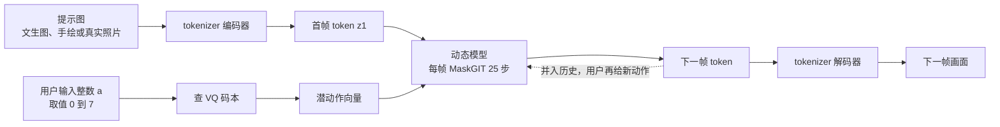
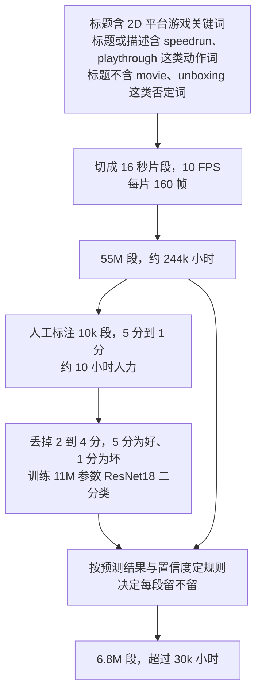

# Genie：一个动作标签都没有，它是怎么学出「按键」的

<!-- release-date: 2024-02-23 -->

> 本文依据 Google DeepMind 的 **Genie: Generative Interactive Environments**，ICML 2024 正式收录版（PMLR 235，第 4603–4623 页），共 21 页。页码均指这份 PDF 自身的页码。文中区分三件事：**论文明确写了什么**、**我们怎么解释或推算它**、**哪些是外部资料补充**。

## 读前先把几个词说成人话

这篇论文用到的部件大多是现成的，新的是把它们拼成一个「只看视频就能学会被操控」的系统。先把反复出现的词说清楚。

- **世界模型（World Model）**：在给定动作的条件下预测下一帧画面的模型。它和普通视频生成模型的根本差别只有一条：能不能在中途接受控制。
- **动作标签（action label）**：某一帧到下一帧之间，操作者实际做了什么。游戏里是按了哪个键，机器人里是发了什么控制指令。互联网视频普遍没有这个东西。
- **Token 与 tokenizer**：模型不直接吃像素，先把画面切成小块、编码成一串离散符号，这些符号叫 token，做这件事的模块叫 tokenizer。token 越少，后面的模型越跑得动。
- **VQ-VAE（Vector Quantized Variational Autoencoder，向量量化自编码器）**：把连续向量强行映射到「有限个候选向量」之一的自编码器。候选清单叫**码本（codebook）**，清单长度决定了这个变量最多能有几种取值。Genie 用它把动作限制成 8 种。
- **自回归（autoregressive）**：一次生成一步，把生成结果接回输入，再生成下一步。Genie 的画面就是这样一帧一帧长出来的。
- **MaskGIT**：一种掩码式生成方法。一帧不是一次生成完的，而是先全部遮住，再分若干轮逐步把 token 填满。
- **行为克隆（Behavioral Cloning，BC）**：最朴素的模仿学习：收集专家的「观测到动作」配对，用监督学习让策略去拟合它。文中用它检验学出来的动作靠不靠谱。

**潜动作（latent action）不是这篇论文造的词**，相关工作一节就点了好几项更早使用潜动作的工作（PDF p. 8）。这篇新提出的名字只有「生成式可交互环境」（generative interactive environment）这个类别，以及 **ST-ViViT** 这个自家 tokenizer 的称呼。

## 一句话先说清

视频生成模型能画出一段像样的游戏录像，但你按下左键，什么都不会发生：它接受的控制是整段级别的，一句文本或一张首帧说完，中间没有你插话的位置。游戏、仿真器、机器人训练环境要的却是逐帧控制：第 37 帧按左键，第 38 帧就得因此不同。

论文用一张三行的表把这件事讲清楚（PDF p. 2，Table 1）：

| 模型类别 | 训练需要什么数据 | 可控粒度 |
|---|---|---|
| 世界模型 | 视频 + 动作 | 帧级 |
| 视频模型 | 视频 + 文本 | 段级 |
| Genie | 只要视频 | 帧级 |

前两行是既有的两条路：想要帧级可控，就得有动作标签；只有视频和文本，就只能段级可控。Genie 要的是第三种组合：**只用视频训练，拿到帧级可控**。

它的做法是从 30k 小时 2D 平台跳跃游戏录像里，同时学三样东西（PDF p. 2–5）：

1. **潜动作模型（Latent Action Model，LAM）**：看相邻两帧之间发生了什么变化，把变化压成 8 个离散代码之一。这 8 个代码就是学出来的「按键」；
2. **视频 tokenizer**：把画面压成离散 token；
3. **动态模型（dynamics model）**：拿着「历史画面 token + 这一步的按键」，预测下一帧的 token。

推理时整个潜动作模型被扔掉，只留那本 8 个条目的码本。用户输入一个 0 到 7 的整数，系统查出对应向量交给动态模型，「按键」就成立了（PDF p. 3–4）。

规模上，最终 Genie 的动态模型 10.1B 参数，加上 tokenizer 与潜动作模型合计 10.7B，训练了 942B 个 token（PDF p. 5）；摘要里的「11B」是这个数的约数（PDF p. 1）。

如果只记一句话：

> **动作标签不一定要从外部拿。把一个很窄的变量放在「只有它能解释画面差异」的位置上，模型会自己把动作的含义填进去。**

这篇论文最硬的定量证据都集中在机制验证上（两张消融表、数据过滤表、行为克隆曲线）；11B 模型本身只有定性展示，没有和任何外部模型的并排对比。读的时候要把「机制成立」和「这个模型有多强」分开。

### 一条阅读路线

如果只有半小时读原文：

1. **p. 2 的 Table 1 与 p. 3 的 Figure 3**：三行表是论点，Figure 3 是三个模块怎么连起来。
2. **p. 3 的 Figure 5 与右栏两段**：潜动作模型为什么能「挤」出动作，这是全文的核心机制。
3. **p. 4 的 tokenizer、动态模型与推理三段**：stopgrad、加性嵌入、推理时只留码本。
4. **p. 5 的配置段与 Figure 9**：最终模型的规模，以及 scaling 实验到底测了什么。
5. **p. 7 的 Figure 15 与 p. 8 的 Table 2–3**：最硬的三组定量证据。
6. **p. 16–19 附录 B–D**：数据过滤流水线、全部超参与 scaling 的硬件账。

## 主要矛盾：数据最多的地方，恰恰没有动作标签

论文把世界模型定义为「能在动作输入条件下预测下一帧」的一类模型，它的用处是让智能体在不真正接触环境的情况下学策略（PDF p. 8）。它学的是这样一个函数：

$$
\hat x_{t+1} = f(x_{1:t},\ u_t)
$$

$x_{1:t}$ 是到目前为止的画面，$u_t$ 是这一步执行的动作，$\hat x_{t+1}$ 是预测的下一帧。

问题在训练数据上。要学 $f$，每段视频都得配一条动作序列 $u_{1:T}$，而这种数据只能从「你自己控制的环境」里录。互联网上有海量视频，却没有动作标签。论文点名的同期工作各自绕这个坑（PDF p. 8–9）：

- **GAIA-1 与 UniSim**：分别做自动驾驶和机器人操作的世界模型，都需要文本与动作标签；
- **VPT**：先请人玩游戏录下按键，用这批数据训一个逆动力学模型，再拿它给互联网视频自动打动作标签；
- **PVG（Playable Video Generation）**：已经在用潜动作控制从视频学出的世界模型，但针对的是领域特定的静态样例，不是从提示生成全新环境。

VPT 的路子有一个绕不开的前提：得先有人类的真实按键数据，它决定了动作空间长什么样。换一个领域，就得重新采一批。

于是矛盾可以写成一句话：

> 互联网视频量大，却没有动作；有动作的数据只能在自己控制的环境里录，量小且换领域就作废。能不能一条动作标签都不要，直接从视频里把「动作」这个变量学出来？

## 先看全景：两个训练阶段，三个模块

训练分两个阶段：先单独训视频 tokenizer；再拿训好的 tokenizer，联合训练潜动作模型和动态模型。潜动作模型**直接从像素**学，动态模型**在 token 上**学（PDF p. 3）。论文没有明说第二阶段 tokenizer 是否完全冻结。

| 模块 | 回答的问题 | 参数量 | 出处 |
|---|---|---:|---|
| 视频 tokenizer | 这一帧长什么样，怎么用最少的符号写下来 | 200M | PDF p. 5 |
| 潜动作模型 | 从这一帧到下一帧，发生了什么「操作」 | 300M | PDF p. 5 |
| 动态模型 | 给定历史和这个操作，下一帧应该是什么 | 10.1B | PDF p. 5 |

参数量已经说明了重心：绝大部分算力花在「预测下一帧」上，学动作的模块不到总量的 3%（本文按上表计算）。三项直接相加是 10.6B，与文中的 10.7B 差 0.1B，应是各项分别取整造成的（本文推算）。

三个模块用的是同一个骨架 ST-transformer，后面单独讲它的成本账。

## 核心设计一：潜动作模型，把动作定义成「唯一能解释差异的东西」

### 旧问题：动作标签昂贵，而且不可迁移

想让模型学会「按左键会怎样」，就得有人真的按过左键并留下记录。每个新领域都得重来一遍。

### 新设计：编码器看得到未来，解码器看不到

论文的做法只有两句话（PDF p. 3）：

- **编码器**读入所有历史帧 $x_{1:t}$ **以及下一帧** $x_{t+1}$，输出一串连续的潜动作 $\tilde a_{1:t}$；
- **解码器**读入所有历史帧 $x_{1:t}$ 和潜动作 $\tilde a_{1:t}$，预测下一帧 $\hat x_{t+1}$。

训练目标是 VQ-VAE 式的，潜动作被量化到一个只有 $|A| = 8$ 个码的码本（PDF p. 3）。由于 ST-transformer 的时间层带因果掩码，一次输入整段视频 $x_{1:T}$，就能算出每两帧之间的全部潜动作 $\tilde a_{1:T-1}$（PDF p. 3）。

### 工作机制：为什么这样就能挤出动作

解码器要重建 $x_{t+1}$，手上只有两样东西：历史 $x_{1:t}$，和一个很窄的 $\tilde a_t$。所有「历史预测不了的那部分变化」都必须由 $\tilde a_t$ 承担。论文的原话是：解码器只能访问历史和潜动作，所以 $\tilde a_t$ 应当编码过去与未来之间**最有意义的变化**（PDF p. 3）。

关键在于通路要足够窄。码本限制为 8，论文给了两个理由：**让人类玩得动**，以及**进一步强化可控性**（PDF p. 3）。上图下半的推算把第二个理由说得更具体：一个潜动作最多 $\log_2 8 = 3$ 比特，一帧画面按 tokenizer 配置约有 920 个 token、每个从 1024 个码里选，量级在 $920 \times 10 = 9{,}200$ 比特（每帧 920 个 token 的推算见后文 ST-transformer 一节）。3 比特装不下画面本身，只装得下「这一步做了哪一类操作」。

**我们如何解释它。** 反过来看：码本放大到几万个码，或者干脆用不量化的高维连续向量，最优解就会滑向「把 $x_{t+1}$ 压进去」，解码器重建得很好，潜动作却退化成一张缩略图。在这个设计里，离散化和小码本是机制成立的条件，不是为了省显存。

### 两个容易漏掉的实现选择

**解码器故意做得轻，而且不复用动态模型。** 论文说，用一个轻量解码器学潜动作，比直接拿动态模型当解码器更好；这个解码器只为提供训练信号，推理时不用（PDF p. 3）。论文只写了「we found it to be beneficial」，没有给消融数字。**我们如何解释它：** 10.1B 的动态模型自身建模能力足够强，拿它当解码器，它可能不太依赖 $\tilde a_t$ 也能把下一帧猜个大概，潜动作就学不出东西；弱解码器反而逼潜动作携带信息。

**推理时整个潜动作模型被丢弃，只留 VQ 码本**（PDF p. 3）。训练时潜动作是推断出来的，推理时它由用户指定。学出来的接口和用起来的接口在这里分开了。

### 收益

- 训练数据从「视频 + 动作」降到「只要视频」，可用数据放大到互联网规模；
- 动作空间是学出来的，不用为每个新领域重新设计。论文在机器人视频上用 Platformers 上找到的最佳超参直接训了一版，同样学出了区分明显、含义一致的动作（PDF p. 6–7）。

这张图是「动作含义跨画面一致」最直接的样例：同一个编号，在四个完全不同的游戏画面里都让角色做同一件事（PDF p. 16）。

### 代价与边界

- **动作个数是硬上限。** 附录说增加码的数量有好处，代价是对人类和 AI 智能体的可玩性下降（PDF p. 17）。论文没有给不同 $|A|$ 的定量对比，只知道存在这个权衡。
- **动作语义不可指定。** 你没法要求 3 号动作是「跳」。平台游戏上四个动作被观察到对应左、右、跳、不动（PDF p. 16，Figure 17），机器人上三个动作对应下、上、左（PDF p. 7，Figure 13）。这是定性观察，论文没有「动作语义一致性」的量化指标。
- **第一次玩时没人知道哪个数字对应什么。** 论文的说法是，每个动作的含义在不同输入之间保持一致，解读潜动作的映射「就像学习一个新手柄上的按钮」（PDF p. 4）。最硬的一致性证据来自后面的行为克隆实验。

### 可迁移启发

需要一个「原本要靠标注才能得到」的中间变量时，先问：能不能把它放在一个位置上，让只有它能解释输入与输出之间的差异？要复用这个模式，三个条件缺一不可：**通路唯一**（没有旁路把信息漏过去）、**容量受限**（否则退化成复制）、**另一侧不能太强**（否则它绕过中间变量也能拟合）。Genie 三条都做到了：解码器看不到未来、码本只有 8 个、解码器故意做轻。

## 核心设计二：视频 tokenizer 必须把时间带进来

### 旧问题：逐帧压缩会丢掉运动

以往的视频 tokenizer 大多只做空间压缩：每帧独立编码，时间关系交给后面的模型（PDF p. 4）。一个小人在相邻两帧里挪了两格，两帧各自编码之后，这个「挪了两格」的事实要靠后面的模型从两串 token 里重新推断。

### 新设计：编码器和解码器都用 ST-transformer

Genie 的 tokenizer 是 VQ-VAE，编码器和解码器都用 ST-transformer，把时间动态一起编进去；论文把它叫 ST-ViViT（PDF p. 4）。因为因果结构，每个离散编码 $z_t$ 都包含此前所有帧 $x_{1:t}$ 的信息（PDF p. 4），所以 tokenizer 输出的不是「一帧的静态描述」，而是「到这一帧为止的状态描述」。

Phenaki 的 C-ViViT 也是时间感知的 tokenizer，但它用完整时空注意力，成本随帧数二次增长；ST-ViViT 的主导项随帧数线性增长（PDF p. 4）。

### 证据：Table 3

三种 tokenizer 用相近参数量、patch size 10、batch 128、序列长 16，再接同一套动态模型与潜动作模型（PDF p. 8）：

| tokenizer | 参数量 | 显存 | FVD ↓ | $\Delta_t$PSNR ↑ |
|---|---:|---:|---:|---:|
| ViT（只做空间） | 230M | 0.3GB | 114.5 | 1.39 |
| C-ViViT | 225M | 1.6GB | 272.7 | 1.37 |
| ST-ViViT（Genie） | 205M | 0.9GB | **81.4** | **1.66** |

ST-ViViT 参数最少、保真度和可控性都最好，显存居中。C-ViViT 表达力最强、显存最高，结果却最差；论文的解释是它倾向过拟合、需要很强的正则（PDF p. 8）。

### 边界

三个 tokenizer 只在这一组固定配置下比过一次，没有不同数据规模、不同 patch size 的对照，也没说明各自的最优正则是否都调过。更准确的读法是「在这份配置下 ST-ViViT 赢了」，不是「时空 tokenizer 普遍优于全时空 tokenizer」。

## 核心设计三：动态模型，MaskGIT 加三个细节

动态模型是一个 decoder-only 的 MaskGIT transformer，同样用 ST-transformer（PDF p. 4）。在每个时间步 $t$，它读入 $z_{1:t-1}$ 和 $\tilde a_{1:t-1}$，预测下一帧 token $\hat z_t$，损失是预测与真值 token 的交叉熵（PDF p. 4）。值得讲的是三个细节。

**训练时随机遮住一半以上的 token。** 输入 token $z_{2:T-1}$ 按一个在 0.5 到 1 之间均匀采样的遮蔽率随机遮住（PDF p. 4）。**我们如何解释它：** 推理时模型面对的是整帧全遮，必须从零填满；训练时只遮一小部分，学到的是「补少量空缺」，和推理任务对不上。推理时每帧跑 25 步 MaskGIT，温度 2，随机采样（PDF p. 5）。

**潜动作进来时带 stopgrad。** 动态模型读入的是 stopgrad 之后的潜动作，梯度不回传到潜动作模型（PDF p. 4）。论文没做这一项的消融。**我们如何解释它：** 潜动作模型只对自己那条重建路径负责；没有这道闸，10.1B 的动态模型可能把潜动作空间拉成一个方便它自己降损失、对人却毫无意义的编码。它和「用轻量解码器」指向同一个意图：不让最强的模块去决定动作空间长什么样。

**动作用加法接入，不是拼接。** 常见做法是把 $t$ 时刻的动作拼接到对应帧上；Genie 在潜动作模型和动态模型里都把潜动作当作加性嵌入，论文说这有助于提升可控性（PDF p. 4），没有给消融数字。**我们如何解释它：** 拼接把动作放进独立的维度子空间，模型可以选择忽略；加法把动作叠到每个位置的表示上，影响无处可躲。

## 骨架：ST-transformer 是这套设计跑得动的前提

视频可以包含多达 $O(10^4)$ 个 token，而 transformer 的注意力开销是二次的（PDF p. 2）。

这个量级可以从论文自己的数字反推（本文推算）：batch 128、256、448 分别对应 1.9M、3.8M、6.6M 个 token（PDF p. 5），三者都指向**每个训练序列约 14,720 个 token**，除以 16 帧得到**每帧约 920 个 token**。两处独立数字可以交叉验证：$512 \times 125{,}000 \times 14{,}720 \approx 942\text{B}$，正是最终模型的训练 token 数（PDF p. 5）；$256 \times 200{,}000 \times 14{,}720 \approx 754\text{B}$，与附录「750B 训练 token」吻合（PDF p. 18）。而 $920 = 40 \times 23$，正好是 160×90 的帧按 patch size 4 切出的网格（90/4 向上取整为 23）。

每个 ST 块是交错的空间注意力层和时间注意力层，后接一个前馈层：空间层在每个时间步内对 $1 \times H \times W$ 个 token 做注意力，时间层对同一位置跨 $T$ 个时间步做注意力、带因果掩码（PDF p. 2）。论文还特意说明，块里只在空间和时间两部分之后放一个前馈层，省掉空间层之后那个，把参数让给其他部分，观察到结果明显改善（PDF p. 3）。

**收益能算出来（本文推算）。** 设 $T$ 帧、每帧 $N$ 个 token，完整时空注意力的代价正比于 $(TN)^2$，ST 结构是 $T \cdot N^2 + N \cdot T^2$，两者之比：

$$
\frac{T N^2 + N T^2}{T^2 N^2} = \frac{1}{T} + \frac{1}{N}
$$

代入 $T = 16$、$N = 920$，约为 $0.0625 + 0.0011 \approx 6.4\%$：同样的 token 数下，注意力开销约为完整时空注意力的十六分之一。Table 3 里 C-ViViT 的显存是 ST-ViViT 的约 1.8 倍（PDF p. 8），方向一致；显存还含权重和其他激活，实测倍数不会等于这个纯注意力比例。

**代价。** 空间层看不到别的帧，时间层看不到别的位置。「跨位置又跨时间」的关系只能靠多层堆叠间接建立。论文没有测量这个损失；Table 3 的 C-ViViT 参数相近但算力预算不同，不是干净的等算力对照。

## 推理：把学出来的接口交到用户手上

这张图按原文 Figure 8 与 2.2 节重画（PDF p. 4），是机制示意，不代表帧率或延迟。

- **用户给的是一个整数**，在 $[0, |A|)$ 里挑，系统用它索引 VQ 码本（PDF p. 4）；
- **提示帧可以不止一张**，正文只是拿一张图举例（PDF p. 4，脚注 1）；
- **可以复现，也可以改写**：把数据集里的起始帧和推断出的动作一起喂回去，就能重新生成原视频；改动作，就得到全新轨迹（PDF p. 4）。这也是潜动作模型「学对了」的便宜自检。

论文说 Genie 目前运行在大约 1 FPS（PDF p. 9），没有给硬件配置与延迟拆解。成本结构是清楚的（本文推算）：每帧要跑 25 步 MaskGIT，每步都是 10.1B 动态模型对最多 16 帧、约 14,720 个 token 的一次前向；语言模型出一个 token 是一次前向，Genie 出一帧是 25 次，而这一帧只对应用户的一次按键。

## 数据：30k 小时是从 244k 小时里筛出来的

主数据集叫 Platformers，来自公开互联网上的 2D 平台跳跃游戏视频（PDF p. 4、p. 16–17）：

这张图按附录 B.1 重画（PDF p. 16–17），数量与人力投入均为原文数字。「高质量」的定义是画面清楚展示游玩过程、不含菜单界面和主播人脸这类干扰物（PDF p. 16）。

流水线里有两个动作值得学。**第一，把中间档整段扔掉**：只用 5 分和 1 分训分类器，2 到 4 分全部删除（PDF p. 17）。**我们如何解释它：** 中间档是标注噪声最大的地方，扔掉最模糊的样本，比给它们定一个精确阈值更划算。**第二，最终决定不是「分类器说好就要」**，而是按预测结果与置信度定一条规则（PDF p. 17），具体阈值没有公开。

过滤后只剩原始数据的十分之一出头，效果反而更好（PDF p. 17，Table 4）：

| 数据集 | 模型参数量 | FVD ↓ |
|---|---:|---:|
| 原始数据集（55M 段） | 580M | 61.4 |
| 过滤后数据集（6.8M 段） | 580M | **54.8** |

论文把这条结论和 VPT、DINOv2 的发现放在一起，称为质量胜过数量（PDF p. 17）。边界是：它用的是 580M 模型，不是最终模型，只报了 FVD，没报可控性。被过滤掉的游戏分布、关键词全表、是否去重，论文都没公开。

**第二份数据：机器人视频。** 为了验证通用性，论文还用了 RT-1 的约 130k 条机器人演示、一份仿真数据，以及此前工作的 209k 条真实机器人 episode，统称 Robotics；**这些数据本来有动作标签，论文刻意不用，只当视频**（PDF p. 5）。

## 训练配置：散落各处的数字汇总

| 项目 | 取值 | 出处 |
|---|---|---|
| 视频 tokenizer | 200M，patch size 4，码本 1024 个码、嵌入维 32 | PDF p. 5 |
| 潜动作模型 | 300M，patch size 16，码本 8 个码、嵌入维 32 | PDF p. 5 |
| 序列长度 / 帧率 / 分辨率 | 16 帧 / 10 FPS / 160×90 | PDF p. 4–5 |
| 训练精度与稳定性 | bfloat16，动态模型用 QK norm | PDF p. 5 |
| 推理采样 | 每帧 25 步 MaskGIT，温度 2，随机采样 | PDF p. 5 |
| 最终动态模型 | 10.1B，48 层，36 头，$d_{model}$ 5120，k/q 128 | PDF p. 19，Table 12 |
| 最终训练 | batch 512，125k 步，256 块 TPUv5p | PDF p. 5 |
| 最终训练算力 | $6.6 \times 10^{22}$ FLOPs | PDF p. 19 |
| tokenizer 优化器 | AdamW + cosine decay，300k 步，max lr 与 min lr 都是 3e-4，warmup 10k | PDF p. 18，Table 8 |
| 动态模型优化器 | max lr 3e-5，min lr 3e-6，$\beta_1 = \beta_2 = 0.9$，weight decay 1e-4，warmup 5k | PDF p. 18，Table 9 |

两处对比论文没有解释。**tokenizer 的 patch size 是 4，潜动作模型是 16**：同一帧切出的 patch 数差 16 倍，潜动作模型看到的网格粗得多。**我们如何解释它：** 判断「这两帧之间做了什么操作」不需要像素级细节，而且瓶颈只有 3 比特，输入再精细也传不过去。**tokenizer 的学习率上下限相同**，等于不衰减，动态模型则从 3e-5 衰减到 3e-6。

附录还提到 tokenizer 扩解码器比扩编码器更有效，增大 batch 只有边际收益：batch 64 时 PSNR 35.7，batch 384 时 36.5，算力从 $4.22 \times 10^{20}$ 涨到 $2.57 \times 10^{21}$ FLOPs（PDF p. 17，Table 6）。六倍算力换 0.8 个 PSNR，这就是「边际」的具体含义。

## Scaling：证明了什么，没证明什么

论文做了两组实验（PDF p. 5、p. 18–19）：

- **模型规模**：固定 tokenizer 与潜动作模型，把动态模型从 41M 扩到 2.7B，全部 batch 256、训 200k 步、共 750B token。每增大一档，最终训练损失一致下降；
- **batch 规模**：固定一个 2.3B 模型（34 层、20 头、$d_{model}$ 2560），batch 取 128、256、448，对应 1.9M、3.8M、6.6M token。batch 越大损失越低。

| 参数量 | 层数 | 头数 | $d_{model}$ | 训练硬件 | 训练时长 | FLOPs |
|---:|---:|---:|---:|---|---|---:|
| 41M | 18 | 8 | 512 | 64 TPUv2 | 3 天 | $2.05 \times 10^{20}$ |
| 96M | 16 | 16 | 768 | 64 TPUv2 | 6 天 | $3.58 \times 10^{20}$ |
| 192M | 20 | 18 | 1024 | 64 TPUv2 | 9 天 | $6.4 \times 10^{20}$ |
| 404M | 21 | 12 | 1536 | 64 TPUv2 | 18 天 | $1.2 \times 10^{21}$ |
| 811M | 20 | 20 | 2048 | 128 TPUv3 | 7 天 | $2.2 \times 10^{21}$ |
| 1.6B | 28 | 22 | 2560 | 128 TPUv3 | 12 天 | $4.04 \times 10^{21}$ |
| 2.7B | 36 | 22 | 3072 | 256 TPUv3 | 16 天 | $6.91 \times 10^{21}$ |

数字取自 Table 10（PDF p. 19）。这组实验的边界比结论更值得记：

1. **纵轴是训练损失，不是生成质量。** 论文没有给 FVD 或 $\Delta_t$PSNR 随模型规模变化的曲线。
2. **不是等算力最优曲线。** 所有点都是同样步数、同样 token 数，模型越大算力越大，两者绑死；从图里读不出「给定算力该选多大模型」。
3. **硬件不是常量。** 模型规模实验跨了 TPUv2 与 TPUv3；batch 实验三次运行分别在 64 TPUv3、128 TPUv3、64 TPUv5p 上，论文说「唯一差别是硬件」（PDF p. 19）。
4. **对照实验都不在最终规模上做。** scaling 最大 2.7B，消融用 1B–2.5B，最终模型是 10.1B（PDF p. 5、p. 8、p. 19）。10.1B 那一档只有定性展示。

## 两个指标，各自只说了一件事

**FVD（Fréchet Video Distance）** 衡量视频保真度，论文引用它的理由是与人类对视频质量的判断一致性较高（PDF p. 5）。

**$\Delta_t$PSNR** 是论文自己定义的可控性指标（PDF p. 5）：

$$
\Delta_t \text{PSNR} = \text{PSNR}(x_t, \hat x_t) - \text{PSNR}(x_t, \hat x_t')
$$

$x_t$ 是真值帧，$\hat x_t$ 是用从真值帧推断出的潜动作生成的帧，$\hat x_t'$ 是用随机采样的潜动作生成的帧；所有实验取 $t = 4$。人话：**用「对的动作」生成的帧，比用「乱按的动作」生成的帧，更接近真实画面多少。** 差值越大，说明动作真的在起作用。

它的边界要说清：它衡量的是动作**有没有**影响画面，不是影响得**对不对**；它依赖逐像素的 PSNR，对轻微位移敏感；只报了 $t = 4$。全文没有人类评测，可玩性与动作语义靠样例展示。FVD 的参考分布、采样条数与特征网络也都没写，所以文中的 FVD 只能在论文内部横向比较。

## 消融：潜动作模型该看像素，还是看 token

既然已经有 tokenizer，潜动作模型直接吃 token 岂不省一次编码？论文比了（PDF p. 8，Table 2）：

| 潜动作模型输入 | 数据集 | 参数量 | FVD ↓ | $\Delta_t$PSNR ↑ |
|---|---|---:|---:|---:|
| token | Platformers | 2.3B | **38.8** | 1.33 |
| 像素（Genie） | Platformers | 2.5B | 40.1 | **1.91** |
| token | Robotics | 1B | 257.8 | 1.65 |
| 像素（Genie） | Robotics | 1B | **136.4** | **2.07** |

这张表没有全赢：Platformers 上 token 输入的 FVD 反而略好。论文如实承认了这一点，并指出这个优势在 Robotics 上没有保持，而两个环境里 token 输入的可控性都更差；它的解释是一部分关于动态和运动的信息在 tokenization 中丢失了，所以让潜动作模型直接读原始视频更好（PDF p. 7–8）。Platformers 两行参数量是 2.3B 与 2.5B，严格说不是等参数对照。

把 Table 2 和 Table 3 放在一起，说的是同一件事的两面：tokenizer 必须带时间，否则保真和可控都掉；潜动作模型不能只看 tokenizer 的输出，否则可控性掉。**tokenizer 是为重建优化的，它保「像什么」，不保「怎么变」；谁需要运动信息，谁就应该尽量靠近原始信号。**

## 定性结果：分布外提示与机器人

论文强调，Platformers 模型的定性评估全部用分布外的提示图（PDF p. 6）。

提示图来自 Imagen2 生成、手绘草图和真实照片；每组展示提示帧和执行某个潜动作四次后的一帧，都能看到清楚的角色移动（PDF p. 6）。论文还展示了一个「涌现」出的视差效果：执行一个潜动作后，前景比中景移动得多，背景只动一点（PDF p. 6，Figure 11）。这些都是挑选出的样例，不是统计结果。

**机器人数据上的版本。** 论文说用 Platformers 上的最佳超参在 Robotics 上训了一个 2.5B 模型，测试集 FVD 82.7（PDF p. 6）。它学到的不只是机械臂的控制，还有物体的交互与形变。

没有任何文本或动作标签，三个潜动作在不同起始画面上保持同一含义：下、上、左（PDF p. 7）。

同一页正文还有一处对不上：3.2 节开头说 Robotics 上是「更小的 1.3B 模型」，几段之后又写训了一个 2.5B 模型（PDF p. 6）。Table 2 里 Robotics 那两行标 1B，那是消融用的独立模型（PDF p. 8）。所以 82.7 这个 FVD 对应的模型规模，以论文正文的 2.5B 为准但存疑；它和 Table 2 里 1B 模型的 136.4 也不能当成一条干净的规模收益，82.7 明确写了是 test split，Table 2 没写评测划分。

## 潜动作的第二个用途：拿它去训智能体

这是全文论证里最硬的一块证据。思路是：**如果学出来的潜动作真的是「动作」，它就应该能当动作标签用。**

流程（PDF p. 7、p. 19）：

1. 取在互联网视频上训好的 Genie，把潜动作模型**冻结**；
2. 拿目标环境里的专家视频（没有动作标签），用它给每对相邻帧打上潜动作 $a_t \leftarrow \text{LAM}(x_t, x_{t+1})$；
3. 训练策略 $\pi(a_t \mid x_t)$，预测专家在观测 $x_t$ 下会采取哪个潜动作；
4. 用一小批带真动作的专家序列 $\langle x_t, u_t, x_{t+1} \rangle$ 算出每步的潜动作，建一张字典 $D$，把潜动作映射到对应的真动作列表；
5. 执行时先采样 $a_t \sim \pi(x_t)$，再取 $u_t \sim D[a_t]$。

评测环境是 Procgen 的 CoinRun，分 easy 与 hard 两档；专家数据来自一个 R2D2 训练的智能体；对照是拿得到专家真动作的 oracle 行为克隆（上界）和随机智能体（下界）（PDF p. 7、p. 19）。

论文的结论是：基于潜动作的策略**达到了与 oracle 相同的分数**，只需少至 200 条专家样本就能完成适配，尽管它几乎肯定从没见过 CoinRun（PDF p. 7）。曲线跨 5 个种子平均，带 95% 置信区间。

它比生成样例更有说服力的原因，论文自己点出来了：**从潜动作到真动作的映射不包含任何关于当前观测的信息**（PDF p. 7）。字典 $D$ 是一张查表，输入只有潜动作编号，没有画面。同一个编号若在不同画面下意思会变，这张表就不可能工作；它能工作，说明潜动作的语义是全局稳定的。「动作含义一致」原本靠看图判断，在这里变成了一个会掉分的数值任务。

**边界。**

- CoinRun 是 2D 平台跳跃环境，和训练数据同类。「几乎肯定没见过」指这个具体游戏，不是这个游戏类型；跨到连续控制的机械臂会怎样，论文没测。
- oracle 本身只有 50% 出头，「达到 oracle」的天花板不高。
- 策略网络用 ST-ViViT 编码器、序列长 4、batch 16；oracle 在推理时以 10% 概率随机采样动作会表现更好（PDF p. 20）。两边的调优程度未必完全对等。

## 「第一个」和「基础世界模型」，各自成立到什么程度

**「第一个以无监督方式从无标注互联网视频训练出的生成式可交互环境」**（PDF p. 1）。限定词一个都不能去掉。潜动作本身不新，PVG 这条线已经在用潜动作控制从视频学出的世界模型；论文写清的差别是：PVG 及相关工作面对领域特定的静态样例，而 Genie 通过提示生成全新环境，把方法推到这个尺度需要放弃归纳偏置、换来一个通用方法（PDF p. 8）。新的是「潜动作 + 互联网规模数据 + 可提示生成」这个组合。

**「在 11B 参数量级，Genie 可以被视为一个基础世界模型」**（PDF p. 1）。依据是它表现出基础模型的典型性质：拿一张没见过的图当提示，就能创造并进入想象出来的世界（PDF p. 2、p. 6）。这条证据链是定性的：全文没有泛化能力的量化评测，也没有一张跨模型的性能对比表。所以在这篇里，「基础世界模型」是一个定位声明，不是被测量出来的结论（本文判断）。

论文自己也没有回避这一点。结论一节把三条限制写得很直白（PDF p. 9）：

- **会幻觉出不真实的未来**，继承了自回归 transformer 的弱点；
- **只有 16 帧记忆**，长时程上很难保持环境一致。16 帧、10 FPS，就是 1.6 秒；
- **大约 1 FPS**，需要未来的进展才能达到适合交互的帧率。

另外还有一条硬约束不在限制小节里：分辨率只有 160×90（PDF p. 4）。

## 论文没有写的

- **没有人类评测**，可玩性、动作语义、交互体验都靠样例；
- **没有 $|A|$ 的定量消融**，只有附录一句权衡（PDF p. 17）；
- **没有 tokenizer 与潜动作模型的 scaling**，scaling 只扩动态模型（PDF p. 5）；
- **没有 FVD 随规模的曲线**，scaling 只报训练损失；
- **没有 stopgrad、加性嵌入、轻量解码器三项的消融**，都只有一句结论；
- **没有失败案例**，全文没有展示生成崩坏的例子；
- **没有代码、权重、数据集或数据样例。** Impact Statement 明说这是有意选择，希望先与研究社区和游戏社区充分沟通，确保未来的发布尊重、安全、负责（PDF p. 9）。

论文给的补偿是附录 F 的可复现小例子：在 Procgen CoinRun 的 hard 模式下，用随机策略、关卡种子 0 到 10,000、每关 1,000 步，收集 10M 条转移，**用一块中端 TPU 或 GPU、一周之内**训完 tokenizer、潜动作模型和动态模型（PDF p. 9、p. 20）。tokenizer 用 batch 48 条长 16 的序列、三天跑完 300k 步，能塞进 16G 显存；潜动作与动态模型再并行训 200k 步，batch 36 条序列（PDF p. 20–21）。这个小例子的动作码本是 6 个，不是主实验的 8 个（PDF p. 21，Table 16），论文没解释为什么。

## 原文里几处对不上的地方

引用数字时要知道该引哪个：

- **机器人模型的参数量两个说法**：同一页先写 1.3B，后写 2.5B（PDF p. 6），见上文定性结果一节。
- **一处图号引错**：3.2 节说机器人模型的动作一致性「如 Figure 17 所示」（PDF p. 6），但 Figure 17 是 Platformers 的动作示例（PDF p. 16），机器人的是 Figure 13（PDF p. 7）。
- **TPU 型号写法不统一**：正文写 256 块 TPUv5p（PDF p. 5），附录同一件事写 256 TPUv5（PDF p. 19）。
- **Table 17 有一行标签重复**：CoinRun 动态模型的架构行列了 num layers 12、d model 512、num layers 8，第三行按上下文应为头数（PDF p. 21）。

## 可迁移启发

1. **缺标注时，先找「唯一能解释差异的位置」。** 潜动作模型靠的不是更好的标注工具，而是架构安排：把一个窄变量放在信息通路的咽喉上。复用时三条缺一不可：通路唯一、容量受限、另一侧不能太强。
2. **不要让最强的模块去定义中间表示。** stopgrad 和轻量解码器指向同一件事：大模型能影响中间层，中间层就会被优化成对它方便、对人不方便的样子。切断梯度、限制容量，或者用一个弱模块来定义它。
3. **压缩链条每多一道，运动信息就少一点。** 有损中间表示都有偏好。用它之前先问，它是为什么目标被优化的，你要的东西在不在那个目标里。
4. **人力用在定义标准上，不用在执行标准上。** 10 小时人力标 10k 段，蒸馏成一个 11M 分类器去筛 55M 段；再配上「扔掉中间档」和「预测加置信度」两个小技巧。
5. **省算力的结构要能算出省了多少。** ST-transformer 的价值在于把注意力开销压到约 $1/T + 1/N$。有了这个式子，才能在自己的 $T$ 和 $N$ 下判断值不值；代价（跨位置又跨时间的关系要靠堆层）也要一起写出来。
6. **把「看起来对」的性质变成一个会掉分的任务。** 行为克隆实验用一张不含观测的查表检验潜动作的一致性，比任何生成样例都硬。

## 关键词回看

- **生成式可交互环境**：论文提出的类别，只用视频训练却支持帧级控制。
- **潜动作（latent action）**：从相邻帧差异中无监督学出的离散代码，Genie 里一共 8 个。
- **潜动作模型（LAM）**：编码器看历史加下一帧、轻量解码器只看历史，用重建误差逼出潜动作；推理时只保留 VQ 码本。
- **VQ-VAE 与码本**：把连续潜变量量化到有限码本，是「动作只有 8 个」的实现方式。
- **ST-transformer**：交错空间注意力与时间注意力，块内只保留一个前馈层，注意力开销约为完整时空注意力的 $1/T + 1/N$。
- **ST-ViViT**：用 ST-transformer 做编解码器的视频 tokenizer。
- **MaskGIT**：一帧分多轮逐步填充 token，Genie 推理时每帧 25 步；训练遮蔽率在 0.5 到 1 之间均匀采样。
- **stopgrad**：切断动态模型到潜动作模型的梯度。
- **$\Delta_t$PSNR**：论文自定义的可控性指标，「对的动作」与「随机动作」生成结果的 PSNR 差。
- **行为克隆（BC）**：用冻结的潜动作模型给无标签专家视频打标签再模仿，验证潜动作的一致性。

## 资料与阅读边界

- **本文依据**：`papers/Google/Genie.pdf`，即 ICML 2024 论文集版本（[PMLR 235:4603–4623](https://proceedings.mlr.press/v235/bruce24a.html)），21 页；它比 2024-02-23 的 arXiv 预印本（[2402.15391](https://arxiv.org/abs/2402.15391)，只有 v1）更晚，文中页码以正式版为准。PDF 首页页眉带有 DeepMind 模板的 Proprietary + Confidential 字样，正式收录版同样如此，不代表材料的公开状态。
- **`release-date`**：Genie 第一代没有任何官方 Web、App、API 或权重发布（PDF p. 9 的 Impact Statement 写明不发布 checkpoint、数据集与数据样例），因此取技术首次官方公开日 2024-02-23，即 arXiv v1 提交日，与 Google DeepMind 官方论文页标注的日期一致。
- **外部补充**：本文没有使用 Genie 后续代际的任何材料，所有数字与结论只来自这一篇论文。
- **本文推算的内容**：每序列约 14,720 token、每帧约 920 token 的反推，一帧约 9,200 比特与潜动作 3 比特的比较，ST 结构约 $1/T + 1/N$ 的开销比，10.6B 与 10.7B 的取整差额，以及各处标明「我们如何解释它」的机制解读。
- **读图所得的内容**：Figure 9 的训练损失数值与 Figure 15 的各条曲线数值，论文正文没有给出对应表格。
