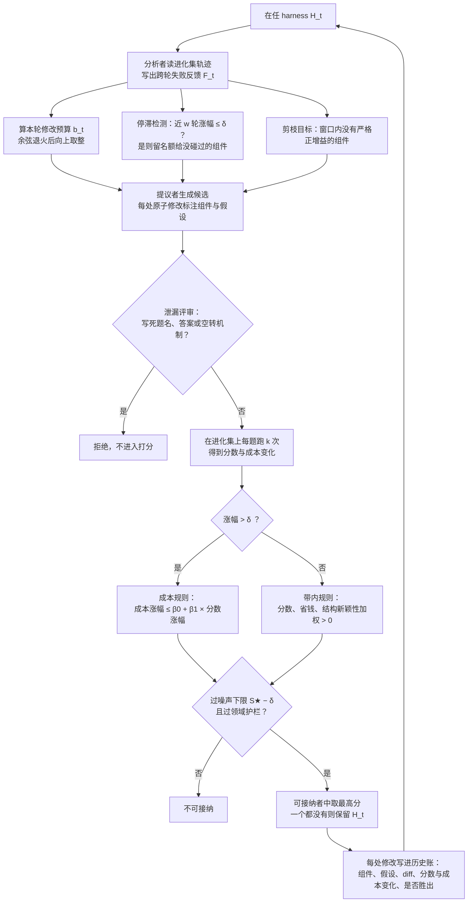

# RRSI：给 harness 的自我进化加正则，进化分涨得少，没见过的题反而涨得多

<!-- release-date: 2026-09-21 -->

> 本文依据 **RRSI: Regularized Recursive Self-Improvement of Agent Harnesses**，arXiv:2609.24972v2，2026-09-23，共 24 页。Google Cloud AI Research 主导，UNC-Chapel Hill、斯坦福大学、圣路易斯华盛顿大学参与。页码均指 PDF 自身页码。这是一篇方法论文：不训练模型、不改权重，改的是「用 AI 自动改 Agent 外壳程序」这个搜索过程本身。文中区分三件事：**论文明确写了什么**（带页码）、**我们如何解释或验算它**（写明）、**外部资料补充**（给出处）。

## 读前先把几个词说成人话

这篇论文同时在讲三层东西：干活的 Agent、改 Agent 的「进化器」、给进化器套上的「正则」。先把词分清。

- **Harness（外壳程序）**：包在冻结大模型外面的一切。系统与任务提示词、决定何时计划 / 行动 / 反思 / 停止的控制流、工具接口与描述、可查阅的记忆与技能文件、决定每一步给模型看什么的上下文管理（PDF p. 3）。同一个模型换一套 harness，能不能先读对文件、能不能从失败命令里恢复、能不能把结论写进交付物，都会不同（PDF p. 1）。
- **Policy（策略模型）**：被包在里面、权重冻结的那个大模型。论文把 Agent 写成 $A = (\pi, H)$，$\pi$ 是策略模型，$H$ 是 harness（PDF p. 3）。
- **Harness evolution（harness 进化）**：把 $H$ 当优化变量，让一个「提议者」大模型读执行轨迹、提出改 harness 的候选，在一组题上打分、留下最好的，一轮一轮循环（PDF p. 3）。
- **RSI（Recursive Self-Improvement，递归自我改进）**：系统用自己当前表现的反馈，去改塑造自己后续行为的东西。论文把 harness 进化看成 Agent 系统层面上一种实用的 RSI（PDF p. 1）。
- **Evolve set（进化集）**：进化过程中反复拿来打分的那组题。**Held-out（留出集）**：进化期间从不打分、只在最后验收的题。**ID held-out（同分布留出）** 与进化集出自同一个 benchmark；**OOD（Out-of-Distribution，分布外）** 是另一个 benchmark，任务描述、工具接口或判分器都不同（PDF p. 2）。
- **Incumbent（在任者）**：当前这一轮被保留下来的 harness。候选要打赢它才能上位。
- **Policy tokens（策略 token）**：一条轨迹里策略模型消耗的 token，本文拿它当成本（PDF p. 3）。
- **正则化（regularization）**：机器学习里防止把训练集背下来的一类手段，比如限制非零参数个数（$L_0$）、把没用的参数压成 0（Lasso / $L_1$）、把整体量级往小里收（Ridge / $L_2$）。本文把这些思路**类比地**搬到 harness 搜索上，论文反复强调只是功能类比，没有真的优化任何范数惩罚目标（PDF p. 4、p. 19、p. 21）。

同库可对照的几篇：ADAS、GEPA、Darwin-Godel-Machine 是自动设计 Agent 的前作；SoL-Pi 同样是自动研究 harness，优化目标是 token 账单，把留出集验收当方法论核心；日常研读里的 RSI Survey 是递归自我改进方向的综述。

## 一句话先说清

让 AI 自动改 harness 已经是一条热门路线，但它有一个和训练神经网络一模一样的病：**过拟合**。进化器每一轮都在同一组有限的题上打分，再根据分数提下一轮候选，于是进化集上的分数一路往上爬，换一个没见过的 benchmark 却涨得很少，甚至掉到起点以下（PDF p. 1–2）。

RRSI 的回答是：不限制 harness 能改什么（提示词、控制流、工具、记忆、子 agent 全都能改），只限制**搜索怎么走**（PDF p. 2、p. 4）。它在循环两端各装一组约束：

1. **提议侧**：一个候选能捆几处修改有预算，预算随轮次退火变小；提议者必须看完整的历史账，被证伪的假设不再反复试；卡住时强制去试还没碰过的组件（PDF p. 5）。
2. **选择侧**：评审模型在打分前拦下写死题名、答案的修改；分数必须过「噪声下限」；多花的 token 必须由足够大的涨分买单；近期没有正贡献的组件被列为删除目标（PDF p. 5–6）。

摘要用的是另一套说法：选择侧配一个 critic 和一个 pruner，critic 筛掉针对特定基准的提议，pruner 去掉「太小、太贵或已无用」的改动（PDF p. 1）。对照正文，「太小」对应噪声下限与带内规则，「太贵」对应成本规则，「已无用」对应结构剪枝；正文里并没有一个单独叫 pruner 的模块。

主要结果（PDF p. 1–2、p. 7–10）：

- 3 个领域、8 个 benchmark；进化集最多涨 14.1 分（Gemini 3.5 Flash 做策略模型时的 Terminal-Bench 2.1，PDF p. 9 Table 3），5 个 OOD benchmark 最多涨 4.7 分（JobBench，PDF p. 8）；
- 6 个留出切分（1 个 ID held-out 加 5 个 OOD）全部上涨，没有一个下跌（PDF p. 2、p. 7）；
- agentic workspace 领域，4 个前作的进化集分数都比 RRSI 高，但 OOD 平均只有 RRSI 高出起点 1 分以上：43.6 对 39.7（PDF p. 7）；
- 最终 harness 比不加正则的进化少用约 30% 的策略 token（PDF p. 1 摘要）；按 Table 2 实算是 2.42 对 3.80 百万，少 36.3%（PDF p. 9，我们的计算）。

先记住一个「不是」：RRSI 在进化集上**不是**最强的。它主动少拿进化集的分，换 OOD 上的分；论文原话是这正是正则器要做的交换（PDF p. 7）。

### 一条阅读路线

只有半小时读原文，建议按这个顺序：

1. **p. 2 的 Figure 1(a)**：一张散点图看懂「进化集涨、分布外不涨」。
2. **p. 3 的式 (2)–(3)**：通用进化循环，以及为什么反复用同一组题是「自适应的」。
3. **p. 4 的 Figure 2**：7 个约束各装在循环哪一侧。
4. **p. 5–6 的式 (4)–(7)**，再跳 **p. 20–22 的 Algorithm 1–2 与式 (17)**：退火预算、噪声下限、成本规则与带内规则。
5. **p. 8–9 的 Table 1、Table 2**：盯着「进化集那列」和「OOD 那列」的排名反转。
6. **p. 23–24 的 Table 5、Table 6**：超参实际取值，以及 4 个「留下 / 拒绝」的真实决策。

## 主要矛盾：有限的题被反复「偷看」，分数就会骗人

### 旧问题：进化器在用测试集调参

普通评测里，测试集只看一次。harness 进化不是：第 $t$ 轮的候选，是根据前几轮在**同一组题**上的测量结果提出来的（PDF p. 3）。每多评一次，就是对同一个有限进化集的又一次自适应「偷看」；论文引的是 Dwork 等人 2015 年关于自适应数据分析与留出集重用的工作（PDF p. 5）。

更麻烦的是 harness 的搜索空间极宽：任何源码修改都行。论文称之为「在一个表达能力异常强的搜索空间上做自适应经验优化」（PDF p. 3）。空间越宽、偷看越多，越容易把题背下来。

论文把过拟合拆成三种耦合的行为（PDF p. 2）：

1. **benchmark 特定拟合（benchmark-specific fitting）**：修改里编码了只对这组题有用的模式，最极端就是写死题名、实体名、答案；
2. **追噪声（noise chasing）**：Agent 每次运行都有随机性，偶然跑得好的候选被当成真进步留下；
3. **复杂度累积（complexity accumulation）**：堆上去的机制让进化集分数涨了，底层机制没变好，而且越堆越贵。

*引自原文 Figure 1（PDF p. 2）。*

Figure 1(a) 就是这篇论文的问题陈述。前作全挤在 1:1 虚线下方：进化集涨了 1.5%–4%，OOD 只拿回很少，AHE 与 TTHE 甚至落进红区，OOD 比起点还差。RRSI 的星号在最左上：进化集涨得最少，OOD 涨得最多。

**我们如何验算它。** 用 Table 1、Table 2 的数字（PDF p. 8–9）能还原图上的点。RRSI 进化集 90.5 对 89.4，相对涨 1.2%；OOD 平均 43.6 对 39.7，相对涨约 10%。Meta-Harness 进化集 93.0，相对涨 4.0%；OOD 平均约 40.6，相对涨约 2.4%。TTHE 进化集相对涨 1.9%，OOD 平均约 38.0，相对跌约 4.3%。和图上位置一致。右边三幅柱图里「prior」一栏（82.3、39.4、17.9）是 4 个前作的平均；编码和工程设计领域里前作各自的分数，全文只给了这个平均。

### 新思路：不收窄空间，收窄轨迹

限制过拟合最直接的办法是限制能改什么，比如只许改提示词。RRSI 刻意不这么做。记 $\Omega(H)$ 为从 $H$ 出发、任意源码修改可达的 harness 集合，RRSI 让它保持开放：提示词、控制流、配置、上下文管理、工具、技能、记忆、子 agent 都可以改、加、删（PDF p. 4）。

它约束的是「搜索怎么穿过这个空间」（PDF p. 4）。这像训练神经网络时不缩小模型结构，而是加权重衰减、早停：假设空间不变，只是别让优化在有限数据上走得太猛。

## 先看基线：所有前作共用的那个循环

论文先把大多数 harness 进化方法抽象成同一个循环（PDF p. 3）。

先定义要量的两样东西。给定一组任务 $\mathcal{D}$，harness $H$ 的**得分**是所有任务、所有随机轨迹上判分器分数的期望，**成本**是策略 token 数的期望（PDF p. 3，式 1）：

$$
S(H;\mathcal{D}) = \mathbb{E}_{x\sim\mathcal{D}}\,\mathbb{E}_{\tau\sim A(\cdot\mid x)}\bigl[r(x,\tau)\bigr],
\qquad
C(H;\mathcal{D}) = \mathbb{E}_{x\sim\mathcal{D}}\,\mathbb{E}_{\tau\sim A(\cdot\mid x)}\bigl[c(\tau)\bigr]
$$

$r(x,\tau)\in[0,1]$ 是判分器给的分，编码任务里是单元测试，agentic workspace 任务里是 LLM 当裁判；$c(\tau)$ 是这条轨迹消耗的策略 token（PDF p. 3）。

实际只能跑有限次：每题跑 $k$ 次取平均，得到经验得分 $\hat S$ 与经验成本 $\hat C$（PDF p. 3，式 3）。第 $t$ 轮的循环是（PDF p. 3，式 2）：

$$
\mathcal{H}_t \sim P_0(\cdot \mid H_t, \mathcal{F}_t),
\qquad
H_{t+1} = \arg\max_{H' \in \mathcal{H}_t \cup \{H_t\}} \hat S(H'; \mathcal{D}_{\text{evolve}})
$$

人话版：当前 harness 在进化集上跑一遍，轨迹被总结成反馈 $\mathcal{F}_t$；提议者 $P_0$ 不受约束地生成一批候选 $\mathcal{H}_t$；候选在**同一个进化集**上打分；分最高的成为下一轮的在任者。

问题全在最后那个 $\arg\max$：它只看一个带噪声的经验分数，不管这分是不是背题背出来的、是不是运气、多花了多少钱。

## 全景：RRSI 一轮在做什么

*引自原文 Figure 2（PDF p. 4）。注意面板 F、G 上的 $L_1$、$L_0$ 标签与正文口径不一致，见后文「正则类比」一节。*

中间一栏就是 RRSI 对式 (2) 的改写：提议从 $P_{\text{reg}}$ 里采样，而不是 $P_0$；选择只在「可接纳」（admissible）的候选里挑最高分，一个都不可接纳就保留在任者。附录给出完整的一轮（PDF p. 19，式 8）：

$$
\mathcal{H}_t \sim P_{\text{reg}}\bigl(\cdot \mid H_t, \mathcal{F}_t, \mathcal{L}_t, b_t, \mathcal{E}_t, \mathcal{B}_t\bigr) \subseteq \Omega(H_t),
\qquad
H_{t+1} = \arg\max_{H' \in \mathcal{H}_t \cap \mathcal{A}_t} \hat S(H')
$$

提议者多拿到四样东西：修改历史 $\mathcal{L}_t$、本轮修改预算 $b_t$、探索指令 $\mathcal{E}_t$、剪枝目标 $\mathcal{B}_t$。选择多了一道门：只在可接纳集合 $\mathcal{A}_t$ 里挑（PDF p. 19）。

把附录 Algorithm 1 与 Algorithm 2（PDF p. 20）按执行顺序重画如下：

这张图按 PDF p. 20 的两段算法与 p. 19–22 的文字重画，是流程示意，不是论文原图。两处细节：泄漏评审发生在打分**之前**（PDF p. 5、p. 21）；噪声下限、成本分支与领域护栏是同时满足的三个非补偿条件，一个不过就不可接纳（PDF p. 20 Algorithm 2 第 12 行、p. 22）。

下面按「提议侧三个、选择侧四个」逐个讲。

## 提议侧一：退火的修改预算，前期大胆、后期一次只改一两处

### 旧问题：一个候选里塞了太多东西

不受约束的提议者可以把很多不相关的修改打包进一个候选。论文说这种候选「有效容量高」：能拟合当前反馈里更多的偶然特征，而且一旦分数变了，说不清是哪一处修改起的作用（PDF p. 5）。

### 新设计：每轮最多 $b_t$ 处可独立归因的修改

$T$ 轮运行里，第 $t$ 轮的预算是（PDF p. 5，式 4）：

$$
b_t = \left\lceil b_{\min} + (b_{\max} - b_{\min}) \cdot \tfrac{1}{2}\bigl(1 + \cos(\pi t / T)\bigr) \right\rceil
$$

括号里是一条余弦退火曲线：$t=0$ 时取 $b_{\max}$，$t=T$ 时取 $b_{\min}$，外面一层向上取整。早期允许几处协调的修改一起上，用来发现新机制；后期越来越稀疏，每个候选的效果越来越好归因（PDF p. 5）。

附录把它写成 $L_0$ 形式（PDF p. 19，式 9）：本轮提议者先起草一个原子修改池 $E_t$，候选是池子的一个子集，用 0/1 向量 $z_t$ 表示选了哪几处，约束是 $\|z_t\|_0 \le b_t$。池子每轮从开放空间里重新生成，$|E_t|$ 不固定。$b_t$ 限制的是「一个候选里捆几处修改」，不是「最终能改哪些组件」（PDF p. 19）。

实际取值（PDF p. 23，Table 5）：三个领域 $b_{\min}$ 都是 1；$b_{\max}$ 在编码与工程设计是 4，在 agentic workspace 是 3；$T$ 在编码与 agentic workspace 是 20，工程设计是 40。

**我们如何验算它。** 按式 (4) 字面算，编码领域（$T=20$、$b_{\max}=4$）$t=0$–7 的预算是 4，$t=8$–12 是 3，$t=13$–19 是 2。附录写一次运行跑 $t = 0, \dots, T-1$（PDF p. 19），而 $t = T-1$ 时括号里约为 1.02，向上取整后是 2。所以**按公式字面，运行期间预算最低只到 2，要到 $t=T$ 才等于 $b_{\min}=1$**；Table 5 却把 $b_{\min}$ 称为「最后一轮的预算」（PDF p. 23），另一处又说证据「随着编辑预算退火趋向 1」越来越好归因（PDF p. 20）。实际每轮用了几处修改，论文没有报告。这可能只是取整写法上的出入，复现时要注意。

### 为什么叫 $L_0$ 类比

把候选里每处可独立归因的修改看成一个 0/1 开关，预算就是限制「开」的个数，正是 $L_0$ 范数约束的形状（PDF p. 5）。论文自己限定：类比作用在「更新」上，不是固定的参数向量；修改池每轮在变；也没有去优化 $L_0$ 惩罚目标（PDF p. 5）。

### 可迁移启发

让 AI 改代码时，**每个候选改几处**本身就是一个超参。前期允许捆绑，因为有些机制要几处配合才起效；后期收窄，是为了知道分数到底是谁带来的。自动调 prompt、调配置的系统可以直接复用这条退火曲线。

## 提议侧二：证据感知的信用分配，被证伪的假设不再重试

### 旧问题：搜索没有记忆，就会反复试已经失败的想法

限制每轮改多少，只有在搜索记得之前学到了什么时才有用。反复测试早已被证伪的假设，只会白白消耗搜索容量，不增加有用证据（PDF p. 5）。

### 新设计：每处修改一条账

RRSI 对每个被评测过的候选记下：改了哪个组件、测什么假设、源码 diff、分数与成本变化、有没有被接受（PDF p. 5）。附录把历史写成（PDF p. 20，式 10）：

$$
\mathcal{L}_t = \{(t_i, \ell_i, h_i, d_i, \Delta S_i, \Delta C_i, a_i) : i \le n_t\}
$$

$\ell_i$ 是组件，$h_i$ 是假设，$d_i$ 是 diff。$a_i=1$ 当且仅当带着这处修改的候选**赢下了那一轮**、进入被接受的进化路径；可接纳但输给更高分候选的，$a_i=0$（PDF p. 20）。没拿到有效测量就失败的候选不记账（PDF p. 20）。

一个候选里有几处修改就记几条，它们共享同一个测出来的 $\Delta S$、$\Delta C$ 和结局（PDF p. 20）。这就是退火预算和历史账要配合的原因：前期捆绑时，一条好结果被几处修改平分，归因很粗；后期预算变小，每条账越来越能对应到单一修改（PDF p. 5、p. 20）。

提议者后续以这份历史为条件：被拒的机制作为负证据保留，成功的机制保留明确的功劳（PDF p. 5）。

### 可迁移启发

自动优化循环里，**失败实验的记录和成功一样值钱**。强制给每个候选打上「改了哪个组件、验证什么假设」的标签，是让后续轮次避开死路的最低成本做法。

## 提议侧三：结构化探索，卡住时去碰没碰过的组件

### 旧问题：提议者会塌缩到一种修改上

同一份历史还能揭示另一种病：提议者塌缩到一个很窄的修改家族，例如反复重写提示词，完全不碰 Agent 的结构性机制（PDF p. 5）。

### 新设计：停滞检测加预留名额

可编辑组件的词表固定为 9 类（PDF p. 20，式 12）：提示词（prompt）、控制流（control_flow）、配置（config）、输出管道（output_plumbing）、上下文管理（context_mgmt）、客户端工具（client_tool）、技能（skill）、记忆（memory）、子 agent（subagent）。

每轮算三样东西（PDF p. 21，式 13）：

- 停滞信号 $\sigma_t = \mathbb{1}[\hat S_t - \hat S_{t-w} \le \delta]$：最近 $w$ 轮的进步没超出噪声带；
- 未试集合 $\mathcal{U}_t$：词表里还没被任何测量过的修改碰过的组件；
- 预留名额 $m_{\text{draft}}$：停滞时留给探索性修改的候选个数。

三个领域都取 $w=3$、$m_{\text{draft}}=1$（PDF p. 23，Table 5）。也就是连续 3 轮没有超出噪声的进步，就拿出 1 个候选名额去试没碰过的组件。论文把它类比成多样性或熵正则（引 Soft Actor-Critic）：把有限的提议容量引向没探索过的机制，但不改变 harness 被允许包含哪些机制（PDF p. 5）。

### 可迁移启发

「停滞就强制换方向」是便宜的规则，前提是先有组件词表和历史账，否则连「哪些没试过」都说不出来。

## 选择侧一：泄漏筛查，背题的修改连打分的机会都没有

### 旧问题：写死答案的候选分数最高

标准 harness 进化会把测量分最高的候选升上去，哪怕这分来自显式泄漏（PDF p. 5）。

### 新设计：打分前先过评审

评审模型（critic）在完整评测前读每个候选的 diff，拒绝两类修改（PDF p. 5）：

1. 显式编码任务名、实体名、任务特定数值、答案，或其他只对进化 benchmark 有用的逻辑；
2. 加入空转机制（inert machinery）的修改。

筛查针对的是**内容**是否 benchmark 特定，不针对**组件**：通用的提示词或工具描述改进照样是合法候选（PDF p. 5）。

**为什么必须在打分前。** 泄漏的候选如果先被打分，会拿到虚高的进化集分数，这个分数进了历史就会吸引后续轮次往那个方向走；在打分前拦下，它永远拿不到这个分（PDF p. 5）。

评审模型与提议者、分析者一样都是 Claude Opus 4.8（PDF p. 7）。评审的提示词、判定细则、实际拦下了多少候选，论文都没有给。

### 可迁移启发

把「防作弊检查」放在评测**之前**。事后过滤只能不采纳，事前过滤才能让污染信号不进入搜索的记忆。

## 选择侧二、三：噪声下限、成本线与带内规则，三道门画在一张图上

*按原文式 (5)、(7)、(17) 与 Table 5 的编码超参重画（PDF p. 6、p. 21–23），三个候选取自 Table 6（PDF p. 24）。机制示意，不是论文原图；假设在任者即历史最佳，带内规则的 $w_c$、$w_n$ 原文没有数值，黄区真实边界画不出。*

这三条规则针对的是同一件事：**一个带噪声的分数差，什么时候才配改变 harness 的永久状态**。图上横着切三栏：下限以下、噪声带内、噪声带外；每一栏用不同的规则判。

### 先量噪声，再设下限

在一堆带噪声的评测里反复挑最高分，会把随机性造出来的赢家固化下来（PDF p. 6）。所以进化开始前，先把**不做任何修改**的起点 harness 反复评测，估出经验噪声带 $\delta$（PDF p. 6、p. 19）。记 $S^\star$ 为迄今见过的最佳进化集分数，候选必须满足（PDF p. 6，式 5）：

$$
\hat S(H') \ge S^\star - \delta
$$

参照物是**历史最佳** $S^\star$，不是当前在任者。论文说这样能防止搜索通过一连串单看都小到像噪声的退步「走下坡路」（PDF p. 6）。每轮结束后 $S^\star$ 更新为它和新在任者分数的较大者（PDF p. 22）。

$\delta$ 的实际取值（PDF p. 22–23）：

| 领域 | $\delta$ | 原文给的换算 | 折成百分制 |
|---|---:|---|---:|
| 编码 | 0.017 | 89 题 × $k=2$ = 178 次试验中的 3 次通过 | 约 1.7 分 |
| agentic workspace | 0.004 | 约 14,100 条评分标准判定中的 60 条 | 约 0.4 分 |
| 工程设计 | 0.020 | 61 题 × $k=4$ = 244 次试验中的 5 次通过 | 约 2.0 分 |

最后一列是我们的换算。这张表本身就有信息量：编码任务上跑 2 遍 89 道题，1.7 分以内的涨跌都可能只是运气。

### 超出噪声带：多花的钱要用涨分来买

分数导向的进化没有动力控制成本，机制越堆越多、轨迹越来越长（PDF p. 6、p. 9）。RRSI 对候选 $H'$ 相对在任者 $H_t$ 定义分数变化与**相对**成本变化（PDF p. 6，式 6）：

$$
\Delta S = \hat S(H') - \hat S(H_t),
\qquad
\Delta C = \frac{\hat C(H') - \hat C(H_t)}{\hat C(H_t)}
$$

涨幅超出噪声带（$\Delta S > \delta$）时，要求（PDF p. 6，式 7）：

$$
\Delta C \le \beta_0 + \beta_1 \Delta S
$$

$\beta_0$ 是「几乎不涨分时也容忍的成本涨幅」，$\beta_1$ 控制「每多涨一点分，允许多花多少」；成本用每次试验的策略 token 数；这两个值只在进化集上选，之后所有迁移评测都固定不变（PDF p. 6）。这就是图右栏那条斜线。

| 领域 | $\beta_0$ | $\beta_1$ | 原文给的直观含义 |
|---|---:|---:|---|
| 编码 | 0.10 | 44.5 | 每多通过 1 次，多给 25% token |
| agentic workspace | 0.10 | 35.4 | 每多满足 100 条评分标准，多给 25% token |
| 工程设计 | 0.15 | 24.4 | 每多通过 1 次，多给 10% token |

（PDF p. 22–23，Table 5）

**我们如何验算它。** 编码一次通过占 $1/178 \approx 0.0056$ 的分数，$0.25 / 0.0056 \approx 44.5$；工程设计一次通过占 $1/244 \approx 0.0041$，$0.10/0.0041 \approx 24.4$。和表里一致。

### 落在噪声带内：换一条规则

涨幅不超过 $\delta$、但已过下限的候选，不用式 (7)，改用一个加权打分（PDF p. 22，式 17）：

$$
w_s \Delta S - w_c \Delta C + w_n \nu_t(H') > 0
$$

三项分别是分数变化、成本变化（省钱加分）、结构新颖性。$\nu_t(H')$ 数的是候选碰了几种「从未在胜出修改里出现过」的**结构性**组件；结构性组件只有 4 类：客户端工具、技能、记忆、子 agent。改提示词、控制流、配置、输出管道、上下文管理拿不到新颖性加分（PDF p. 21，式 15–16）。

用意是：分数的小波动本身不足以当证据；在不确定区里，省钱或引入新结构才能让候选过关（PDF p. 22）。编码领域干脆设 $w_s = 0$，带内的涨分完全不算数；另两个领域 $w_s$ 为正（PDF p. 22）。这就是图中间那一栏：零线以下（更省）可接纳，零线以上（更贵）只能靠新结构加分。

原文说三个权重「报告在 Table 5」（PDF p. 22），但 Table 5 只有 $T$、$k$、$\delta$、$b_{\min}$、$b_{\max}$、$w$、$m_{\text{draft}}$、$n_{\text{prune}}$、$\beta_0$、$\beta_1$ 这 10 项，**没有 $w_s$、$w_c$、$w_n$ 的数值**（PDF p. 23）。

### 领域护栏

工程设计领域另加一道「不可补偿」的护栏：候选的有效输出率比在任者降超过 0.03，或不提交率升超过 0.02，直接拒绝；编码与 agentic workspace 不设护栏（PDF p. 22）。目的是防止主指标上的涨分掩盖基本执行可靠性的恶化。

### 可迁移启发

「成本上限随收益放宽」比固定成本上限更合理：小改进只配小开销，大改进可以花大钱。更关键的是在噪声带里**换一套规则**，让「省钱」和「引入新结构」成为不确定区里的决胜因素；参照「历史最佳」而不是「上一版」，才防得住一连串小退步累积成大退步。

## 选择侧四：结构剪枝，组件要持续挣到自己的位置

### 旧问题：只看分数的进化从不删东西

分数导向的进化没有动机删一个机制，机制一旦加进来就一直留着（PDF p. 6）。

### 新设计：窗口内没有严格正增益的组件列为删除目标

对每个组件 $\ell$，取它在最近 $n_{\text{prune}}$ 轮内所有测量过的修改里的最佳分数变化，窗口内一条记录都没有时取 $-\infty$（PDF p. 20，式 11）：

$$
g_t(\ell) = \max\{\Delta S_i : \ell_i = \ell,\ t - t_i \le n_{\text{prune}}\}
$$

在所有被测过的组件里，$g_t(\ell) \le 0$ 的就是剪枝目标（PDF p. 21，式 14）。换句话说，一个组件只要在窗口内没测出严格为正的增益，包括窗口内根本没人碰过它，就会上名单。剪枝窗口在编码和 agentic workspace 是 4 轮，工程设计是 5 轮（PDF p. 23）。

剪枝本身不直接删代码。提议者拿到这张名单，连同之前被接受、与这些组件有关的修改，被指示在后续提议里删掉不产出的机制（PDF p. 21）；删不删、怎么删，仍要走一遍提议和选择。

### 可迁移启发

退火预算让**每次更新**稀疏，剪枝让**留下来的 harness** 稀疏（PDF p. 6），两者对象不同。长期维护的 Agent 系统可以照搬：定期把「最近 N 次实验里没带来正收益的组件」列出来，逼自己证明它还有用。

## 正则类比：三条对应关系，以及原文自己的不一致

论文把三个约束分别类比为三种经典正则（PDF p. 4）：

| RRSI 约束 | 正文类比 | 为什么这么类比 |
|---|---|---|
| 退火修改预算 | $L_0$ 风格的基数约束 | 直接限制一次更新里独立生效的修改个数 |
| 结构剪枝 | Lasso / $L_1$ 风格的稀疏化 | 持续无产出的组件被整个删掉，结构变稀疏 |
| 复杂度感知接受 | Ridge / $L_2$ 风格的收缩 | 压住总资源占用的无节制增长，但不要求删掉任何特定组件 |

正文和附录反复强调这只是**功能上的**类比：没有优化范数惩罚目标，也没有把异质的 harness 组件当成同一个连续参数向量的坐标（PDF p. 4、p. 19、p. 21）。

**原文有一处标签不一致。** Figure 2 面板把「复杂度感知接受」标成 $L_1$ 风格，把「结构剪枝」标成 $L_0$ 风格（PDF p. 4）；正文第 3.1 节、第 3.2–3.3 节的段落标题、附录 Algorithm 1 的注释都写成复杂度感知接受是 Ridge / $L_2$、结构剪枝是 Lasso / $L_1$、修改预算才是 $L_0$（PDF p. 4–6、p. 20–21）。第 4.3 节还有一句把成本规则称作「$L_1$ 风格的预算」（PDF p. 9）。本文按正文与附录的口径，即上表。

**我们如何解释它。** 这组类比有用的地方不在数学精确，而在分工清楚：一个管「每步改多少」，一个管「留下多少件」，一个管「总共多重」。三者作用对象不同，所以不会互相替代。

## 实验设置：三个领域，每个领域只在一个套件上进化

### 8 个 benchmark

每个领域只在一个套件上进化，然后原封不动地拿到留出集上跑（PDF p. 2）：

| 领域 | 进化集 | ID 留出 | OOD 留出 | 判分方式 |
|---|---|---|---|---|
| 编码 | Terminal-Bench 2.1 全部 89 题 | 无 | SWE-bench Verified | 单元测试 |
| agentic workspace | Harvey LAB 固定 120 题 | Harvey LAB 另 40 题 | JobBench、GDPval、APEX-Agents | LLM 裁判 |
| 工程设计 | EngDesign 61 题 | 无 | Frontier-Eng | 冻结的仿真器或测试台 |

来源：PDF p. 7、p. 17–18。每个 benchmark 测什么、怎么判（PDF p. 17–18）：

- **Terminal-Bench 2.1**：89 个容器化终端任务，Agent 驱动真实 shell，任务自带的隐藏单元测试全过才算解出。不同实验分支之间容器销毁重建，状态不跨评测。
- **SWE-bench Verified**：真实 GitHub issue 加当时的仓库快照；补丁必须让 fail-to-pass 测试由失败变通过、pass-to-pass 测试保持通过。论文没写用了多少个实例。
- **Harvey LAB**：法律工作 benchmark，跨 25 个执业领域，共 160 题。每题给一个文件夹的 Word、Excel、PDF 源文件，要求按指定文件名产出交付物；每题 20–100 条独立判分的评分标准，一次完整评测约 14,000 条判定（PDF p. 17；p. 22 写约 14,100）。每条标准由 Gemini-3.5-Flash 单独判；分数是全部题目上通过标准的比例，标准多的题权重更大，缺交付物则它负责的标准全部判失败。
- **JobBench**：取自真实职业工作流，所需参考资料被刻意扣下，逼 Agent 真去检索；harness 给文件系统、代码执行、带出处的网页搜索。判分用 benchmark 自带的加权评分表，裁判分是 Gemini-3.5-Flash 与 Claude Opus 4.8 的平均。
- **GDPval**：185 题，把 harness 的交付物和 benchmark 附带的人类专家交付物并排放，由三个不同来源的裁判二选一，报对专家的胜率。三个裁判是本地部署的开源模型 Qwen3.6-35B-A3B、Claude Sonnet 4.6、Gemini-3.1 Pro；每对交付物正反两种顺序各判一次消除位置偏差，取三票多数。胜率高于 50% 意味着 harness 比人类专家更常被偏好（PDF p. 17–18）。原文又说「每个裁判对每个 harness 发出 204 次比较」（PDF p. 18），与 185 题、正反两序的计数对不上，原文没有解释。
- **APEX-Agents**：每题一个沙盒世界，带自己的 MCP 工具面（文件系统、PDF、表格、邮件、聊天、日历、文档、代码执行），覆盖三个职业领域；按 pass@1 计，Gemini-3.5-Flash 按每题评分表判。全部 480 题都评，基础设施故障导致缺轨迹的也算失败，不从分母剔除，防止「在难题上崩溃」的 harness 反而显得更好（PDF p. 18）。
- **EngDesign**：免授权子集里不需要专有仿真器的 61 题，每题给设计目标与物理约束，由冻结的仿真或测试台判分，判分确定，方差全部来自策略模型。题太少，全部 61 题都用于进化，不设 ID 留出（PDF p. 18）。
- **Frontier-Eng**：26 个领域的真实工程优化问题，同样由冻结的仿真器在连续目标上判分。各题目标不可比，报奖牌分：以冻结 v1 快照里前三名的可行结果为金、银、铜门槛，达到分别得 1、0.67、0.33，对 v1 的 47 题取平均。其中 EngDesign 领域的题与进化集重复而被排除；沙盒里建不起评测环境的题两边都不给分，最终 47 题中 38 题能贡献分数，两边在完全相同的题上比（PDF p. 18）。

### 对照与实现

对照组是所有运行的共同起点、未进化的 harness $H_0$，以及 4 个近期的 harness 进化方法（PDF p. 7、p. 18–19）：

- **Meta-Harness**：把 harness 工程写成对可执行 harness 代码的外层优化，提议者能看到历史候选的源码、分数和执行轨迹；
- **AHE（Agentic Harness Engineering）**：面向编码 Agent 的可观测性驱动进化循环，把组件、执行经验、修改结果组织成显式表示；
- **TTHE（Test-Time Harness Evolution）**：测试时进化可执行 harness，维护多个候选，用 agentic 裁判选出延续到后续输入的那个；
- **HarnessX**：把 harness 表示为提示词、工具、记忆、控制流等带类型的模块化原语的组合，用轨迹驱动的适配机制修改与选择配置。

所有对照都从同一个 $H_0$ 出发，共享冻结的策略模型、进化集和候选预算（PDF p. 7）。候选预算具体是多少（每轮多少候选），正文和附录都没有给数字。

策略模型、提议者、写跨轮失败反馈的分析者、泄漏评审全是 Claude Opus 4.8（PDF p. 7）。起点 harness：编码用 Terminus-2；Harvey LAB 与 EngDesign 用一个 ReAct 循环，接在 MCP 工具网关上，配动态工具带（dynamic toolbelt）和 ReSum 风格的上下文管理（PDF p. 7）。

## 主结果：留出集全涨，没有一个下跌

Figure 3 把每个切分都和同一时间窗口里测的 $H_0$ 对比，排除评测基础设施漂移带来的涨分（PDF p. 7）。原图是一排柱，数字如下：

| 领域 | 切分 | 类型 | $H_0$ | RRSI | 涨幅 |
|---|---|---|---:|---:|---:|
| 编码 | Terminal-Bench 2.1 | 进化集 | 74.2 | 80.2 | +6.0 |
| 编码 | SWE-bench Verified | OOD | 82.0 | 83.8 | +1.8 |
| agentic workspace | Harvey LAB | 进化集 | 89.4 | 90.5 | +1.1 |
| agentic workspace | Harvey LAB | ID 留出 | 86.9 | 89.2 | +2.3 |
| agentic workspace | JobBench | OOD | 36.0 | 40.7 | +4.7 |
| agentic workspace | GDPval | OOD | 48.8 | 52.3 | +3.5 |
| agentic workspace | APEX-Agents | OOD | 34.2 | 37.9 | +3.7 |
| 工程设计 | EngDesign | 进化集 | 50.0 | 54.9 | +4.9 |
| 工程设计 | Frontier-Eng | OOD | 17.7 | 22.0 | +4.3 |

（读自原文 Figure 3，PDF p. 8）

论文的读法（PDF p. 7）：三个 OOD agentic benchmark 涨 3.5–4.7 分，相对涨 7.2%–13.1%；Frontier-Eng 涨 4.3 个奖牌分，相对涨 24.3%；SWE-bench Verified 从没被打过分，仍涨 1.8 分；没有任何留出切分下跌，而下跌正是「背题 harness」会产生的失败。

值得停一下的是 agentic workspace：进化集只涨 1.1 分，OOD 却涨 3.5–4.7 分。进化集涨得比留出集少，和普通的过拟合图景正好相反。

**判分方式不是解释。** 可能的质疑是：Harvey LAB、JobBench、GDPval 都用 LLM 裁判，harness 可以学会「写成裁判喜欢的样子」。论文用工程设计领域回应：EngDesign 与 Frontier-Eng 都由仿真或测试台确定性判分，设计要么满足约束要么不满足，涨分在那里照样存在，也去掉了裁判方差（PDF p. 8）。

**我们如何解释它。** 这个论证对「裁判偏好」这条路有效，但有一处没讨论：JobBench 的裁判之一是 Claude Opus 4.8（PDF p. 17），而策略模型、提议者、评审也都是 Claude Opus 4.8（PDF p. 7）。同一模型家族既当选手又当裁判的影响，论文没有分析。

## 和前作比：进化集排名与 OOD 排名反过来了

Table 1 把 4 个前作放在完全相同的条件下（同一 $H_0$、同一进化集、同一候选预算）比（PDF p. 7–8）：

| 方法 | Harvey LAB 进化集 | Harvey LAB ID 留出 | JobBench | GDPval | APEX-Agents |
|---|---:|---:|---:|---:|---:|
| $H_0$（不进化） | 89.4 | 86.9 | 36.0 | 48.8 | 34.2 |
| Meta-Harness | **93.0** | 89.2 | 37.1 | 49.1 | 35.7 |
| AHE | 90.7 | 88.7 | 37.2 | 47.2 | 33.1 |
| TTHE | 91.1 | 88.5 | 35.2 | 47.0 | 31.7 |
| HarnessX | 91.8 | 89.1 | 36.3 | 48.5 | 34.3 |
| RRSI | 90.5 | **89.2** | **40.7** | **52.3** | **37.9** |

（PDF p. 8，Table 1）

读法分三段（PDF p. 7）：

1. **进化集**：每个方法都有效。RRSI 的 90.5 是所有进化方法里最低的，Meta-Harness 的 93.0 最高。
2. **ID 留出**：大家差不多，RRSI 与 Meta-Harness 并列 89.2。
3. **OOD**：排名反转。Meta-Harness 的 OOD 平均只比起点多 0.9 分；HarnessX 落回起点；AHE 与 TTHE 比起点还差，TTHE 差 1.7 分。只有 RRSI 高出起点 1 分以上：43.6 对 39.7。

**我们如何验算它。** 按表算 OOD 平均：Meta-Harness 约 40.6，AHE 约 39.2，TTHE 约 38.0，HarnessX 约 39.7；4 者再平均约 39.4，正是 Figure 1(c) 里「prior」那根柱（PDF p. 2）。引言里「比前作平均最多高 22.9%」对应 Frontier-Eng：22.0 对前作平均 17.9（PDF p. 2），$22.0/17.9 \approx 1.229$。

## 消融：拆掉任何一组，进化集分都涨，OOD 都跌

消融在 agentic workspace 领域做，所有分支共享起点、策略模型、进化集、轮数和候选预算，只在研究的因素上不同（PDF p. 8）。

| 变体 | Harvey LAB 进化集 | Harvey LAB ID 留出 | OOD 平均 | 每次试验 token（百万） |
|---|---:|---:|---:|---:|
| $H_0$（不进化） | 89.4 | 86.9 | 39.7 | 1.56 |
| 不加正则的进化 | 92.8 | 88.9 | 40.3 | 3.80 |
| 去掉提议侧正则 | 90.7 | 88.8 | 41.9 | 2.69 |
| 去掉接受侧正则 | 91.5 | 88.7 | 41.0 | 3.59 |
| RRSI | 90.5 | 89.2 | 43.6 | 2.42 |

（PDF p. 9，Table 2）

论文的三条观察（PDF p. 8–9）：

1. **去掉接受侧约束**：进化集从 90.5 升到 91.5，OOD 平均从 43.6 降到 41.0，token 成本涨了一半。论文的解读是，不受约束的选择规则把接受的修改大多花在噪声和上下文上，而不是机制上。
2. **去掉提议侧约束**：进化集只差 0.2 分，OOD 却差 1.7 分。即使什么都不拒绝，「引导搜索往哪看」本身也重要。
3. **两组都去掉**：进化集升到 92.8，所有分支里最高；OOD 平均只有 40.3，离不进化的起点不到 1 分；每次试验 3.80 百万 token，RRSI 是 2.42。

**我们如何解释它。** 这张表里进化集那列和 OOD 那列几乎是反着排的，是全文最有说服力的一张表。「不加正则的进化」相对起点花了 2.4 倍 token，换来 OOD 上 0.6 分；RRSI 花了 1.55 倍，换来 3.9 分（我们的计算）。边界有两条：消融只在 agentic workspace 一个领域做；只按「两组」拆，没有逐个拆 7 个约束，所以不知道哪个贡献最大。

## 换策略模型：机制不绑在某个骨干上

### 用另一家的模型独立再进化一次

编码领域用两个不同家族的策略模型各独立跑一次进化，都只在 Terminal-Bench 2.1 上进化，再原样拿到 SWE-bench Verified 上测（PDF p. 9）：

| 策略模型 | Benchmark | $H_0$ | RRSI | 涨幅 |
|---|---|---:|---:|---:|
| Claude Opus 4.8 | Terminal-Bench 2.1（进化集） | 74.2 | 80.2 | +6.0 |
| Claude Opus 4.8 | SWE-bench Verified（OOD） | 82.0 | 83.8 | +1.8 |
| Gemini 3.5 Flash | Terminal-Bench 2.1（进化集） | 64.6 | 78.7 | +14.1 |
| Gemini 3.5 Flash | SWE-bench Verified（OOD） | 76.8 | 79.0 | +2.2 |

（PDF p. 9，Table 3）

摘要里的「最多涨 14.1 分」就是 Gemini 3.5 Flash 这一行。Claude Opus 4.8 起点更高、离两个套件的天花板更近，涨幅因此更小（PDF p. 9）。两种情况下，harness 都在从没被打过分的 benchmark 上涨了。

### 把进化好的 harness 交给一个没参与搜索的弱模型

harness 是程序，不是权重。只对搜索时那个模型有用的机制，是那个模型的伪影，不可复用（PDF p. 9）。论文把用 Gemini 3.5 Flash 进化出来的编码 harness，原样交给更小、从没参与搜索的 Gemini 3.1 Flash Lite：

| 评测时的策略模型 | $H_0$ | RRSI | 涨幅 |
|---|---:|---:|---:|
| Gemini 3.5 Flash（搜索用的模型） | 64.6 | 78.7 | +14.1 |
| Gemini 3.1 Flash Lite（没见过） | 11.2 | 14.6 | +3.4 |

（PDF p. 10，Table 4）

Terminal-Bench 2.1 从 11.2 升到 14.6，相对涨 30.4%，而它的起点不到搜索模型的五分之一（PDF p. 9）。论文的结论是：机制不依赖搜索时的能力水平，只是弱模型够得着的题更少，所以绝对涨幅小。

**边界。** 跨模型迁移只在编码领域做，只测了进化集 Terminal-Bench 2.1 本身，没有测 Flash Lite 在 SWE-bench Verified 上的表现；也只在 Gemini 家族内部从大迁到小，没有跨家族迁移。

## 成本：最轻的进化 harness，但仍比起点贵

*引自原文 Figure 4（PDF p. 10），在 agentic workspace 的进化集上测最终 harness 的成本。*

图上一眼看到的是：四个前作都在 RRSI 的右下方，更贵且 OOD 更差。论文把原因归到两个直接作用在成本上的正则：接受规则在提议时就拒绝没人买单的增长，剪枝把后来不再有人买单的增长删掉，前作都没有这两个约束（PDF p. 9）。最极端的是 AHE：每次试验 3.82 百万 token，比 RRSI 多 58%，OOD 少 4.4 分（PDF p. 10）。TTHE 是另一种极端：从图上读，它的 token 只比 RRSI 略多（约 2.5 百万），OOD 却是全场最低，说明「便宜」本身不等于「不过拟合」。

但论文也没有回避：**没有任何进化后的 harness 像 $H_0$ 那么便宜**，$H_0$ 是 1.56 百万 token、21.2 步。进化确实用测试时算力买了一部分涨分，预算决定买多少（PDF p. 10）。

**我们如何解释它。** RRSI 的 token 是起点的 1.55 倍（2.42 对 1.56，PDF p. 9）。所以「更省」的比较对象是其他进化方法，不是不进化。部署时要问的是 OOD 多出的 3.9 分值不值 55% 的 token，这取决于任务；论文没有给美元成本或延迟。摘要写「比不加正则的进化少 30% 策略 token」（PDF p. 1），按 Table 2 实际是少 36.3%，摘要数字偏保守，原文没说明 30% 怎么来的。

## 四个真实决策：规则在实战里怎么起作用

附录 E 从发布的轨迹里挑了四个代表性决策（PDF p. 24，Table 6）；论文说完整的逐轮记录（提议、评审决定、接受决定、精确 diff）放在项目网站上（PDF p. 23）。

| 领域 / 轮次 | 修改内容 | 结果 | 原文要说明的事 |
|---|---|---|---|
| 编码 R0-A | 加一个有界的完成前核验审计，以及对长时间任务做非阻塞轮询的指引 | 接受：进化集 +3.93 分 | 可复用的行为机制，涨幅超过噪声门槛时，早期较宽的更新也能被接受 |
| 编码 R0-B | 类似的核验提醒与长任务指引，但测出的涨幅更小、推理成本更高 | 被成本规则拒绝：+1.69 分，成本 +26.1% | 表面进步落在噪声带内又要大量额外算力时，不会自动保留 |
| 编码 R8-B | 把原始任务指令钉进完成闸门，让策略模型提交前再核对字面规格 | 被下限拒绝：−2.81 分，尽管成本 −13.6% | 单靠省钱不能补偿低于噪声下限的性能 |
| 工程设计 R2 | 对反复出现的「workdir must be an existing directory」工具错误加一个有界恢复提示 | 接受：244 次中通过数 122 → 128，token +1.6% | 小而与任务无关的控制流修复，几乎不增加复杂度就能提升可靠性 |

（PDF p. 24，Table 6；R0-A 与 R0-B 是第一个编码轮次里表面相似的两个候选，PDF p. 23）

**我们如何把它们代回规则。** 编码领域一次评测是 178 次试验，所以这几个分数差都能折回整数次通过：+3.93 分是多 7 次，+1.69 分是多 3 次，−2.81 分是少 5 次（我们的计算）。代回前面那张接受区域图：

- **R0-B 恰好压在噪声带边上。** 编码的 $\delta$ 就定义成 3 次通过（PDF p. 22），而规则是 $\Delta S > \delta$ 才走成本线，所以多 3 次通过归带内。编码设了 $w_s = 0$，这 3 次通过不算数，成本 +26.1% 又是负分，修改内容是提醒与指引，不像新的结构性组件，拿不到新颖性加分，于是被拒。原文把它标成「被成本规则拒绝」，文字又说它「落在噪声带内」；按附录算法，起作用的是带内那条规则，不是式 (7)。
- **R0-A 走成本线。** 多 7 次通过远超带宽，允许的成本涨幅是 $0.10 + 44.5 \times 0.0393 \approx 1.85$，即最多多花约 185%。原文没有给它的实测成本变化。
- **R8-B 被下限拦下。** 少 5 次通过，超过 3 次的带宽，省多少钱都没用。
- **工程设计 R2 走成本线。** 122/244 正好是 50.0%，等于 Figure 3 里 EngDesign 的 $H_0$ 分数（PDF p. 8），说明第 2 轮时在任者可能还是起点（我们的推断）。多 6 次通过，超过工程设计 5 次的带宽；允许成本涨幅约 $0.15 + 24.4 \times 0.0246 \approx 0.75$，实际只涨 1.6%，轻松通过。

**我们如何解释它。** R0-A 那个 185% 的上限说明，$\beta_1$ 在大涨分时相当宽松；成本规则真正卡人的地方，是涨幅贴着噪声带的「小进步、大开销」候选，R0-B 就是典型。复杂度控制主要靠带内规则和剪枝，式 (7) 更像一道挡离谱开销的外墙。

## 限制与没公开的东西

论文自己写的限制（PDF p. 11）：

- 只研究冻结骨干模型的 harness 级 RSI，不涉及进化过程中更新权重的情形；
- RRSI 仍依赖有限的进化集和若干正则超参，效果可能取决于反馈信号质量和搜索预算；
- 虽然跨了多个领域、benchmark 和策略模型，仍需要更广的验证，尤其是差异更大的 Agent 架构、工具生态和更长的自我改进过程。

我们读完要额外留下的判断：

- **没有重复实验的方差。** 主结果、Table 1、Table 2 都是单个数字，没有标准差或置信区间。论文花了力气估噪声带 $\delta$，但最终结果本身没有报告多次独立进化之间的波动。
- **agentic workspace 的进化集涨幅 1.1 分，只比噪声带 0.4 分大不到 3 倍**（我们的计算）。这个领域的进化几乎是「在噪声边缘小心挪步」，OOD 的大涨幅从哪来，论文没有从机制层面拆解：最终 harness 里留下了哪些修改，正文没有列出。
- **消融粒度粗。** 只拆两组，只在一个领域做。
- **缺关键超参与细节。** 带内规则的 $w_s$、$w_c$、$w_n$ 没有数值；每轮候选数量没有给；泄漏评审的提示词与拦截率没有给；估噪声带时起点 harness 重复评测了多少次，没有给。
- **模型身份。** 策略模型、提议者、分析者、评审都是 Claude Opus 4.8，JobBench 的裁判之一也是它。「不加正则的进化」是两组约束都去掉的分支（PDF p. 9），它与 4 个前作在实现上具体差在哪，论文没有单独描述。
- **原文内部不一致。** Figure 2 与正文的 $L_0$ / $L_1$ / $L_2$ 标签对不上；摘要 30% 与表中 36.3%；式 (4) 按字面取整后运行期间到不了 $b_{\min}=1$；GDPval 的 204 次比较与 185 题对不上；R0-B 标成「成本规则」拒绝，按算法实际走的是带内规则。都不影响主结论。

## 可迁移启发

1. **自动优化就是在测试集上调参，先承认这一点。** 只要循环根据同一组题的分数决定下一步，它就在过拟合那组题。留出集、OOD 集、确定性判分器，一个都不能省。
2. **先量噪声带，再谈进步。** 把不改动的基线重复跑几遍得到 $\delta$；涨幅小于 $\delta$ 的「进步」换一套更严的规则。编码任务上这个带宽约 1.7 分，比很多论文宣称的提升还大。
3. **参照「历史最佳」而不是「上一版」。** 噪声下限用 $S^\star - \delta$，才防得住一连串小退步累积成大退步。
4. **反作弊检查放在评测之前。** 泄漏的候选一旦拿到分，就会污染搜索的记忆。
5. **每个候选改几处，是一个要退火的超参。** 早期大胆组合，后期单点归因；配一份逐修改的历史账，失败的假设才不会被反复重试。
6. **成本上限随收益放宽，不确定区里省钱和新结构优先。** 这比固定成本上限更贴近真实决策。
7. **定期列出「近期无正贡献」的组件并逼自己删。** 只看分数的系统永远不会主动删东西。
8. **评价自动 harness 方法时，盯 OOD 那一列。** 进化集排名和 OOD 排名可以完全反过来；进化集上最强，往往恰恰是背题最多的信号。

## 关键词回看

- **Harness 进化**：把 harness 当优化变量、冻结模型权重，用提议者改、在进化集上打分挑。本文的研究对象。
- **自适应重用**：同一组有限的题被反复用来决定下一步，每次评测都是一次「偷看」。过拟合的根源。
- **三种过拟合行为**：benchmark 特定拟合、追噪声、复杂度累积。
- **提议侧正则**：退火修改预算、证据感知信用分配、结构化探索。
- **选择侧正则**：泄漏筛查、噪声调整下限、复杂度感知接受（成本线加带内规则）、结构剪枝。
- **噪声带 $\delta$**：反复评测起点 harness 得到的经验噪声。编码 0.017（3 次通过）、agentic workspace 0.004、工程设计 0.020（5 次通过）（PDF p. 22–23）。
- **$L_0$ / $L_1$ / $L_2$ 类比**：修改预算 / 结构剪枝 / 复杂度感知接受。只是功能类比，Figure 2 的标签与正文不一致。
- **43.6 对 39.7**：agentic workspace 上 RRSI 与起点的 OOD 平均（PDF p. 7）；前作最高约 40.6（按 PDF p. 8 Table 1 计算）。
- **2.42 对 3.80**：RRSI 与不加正则的进化每次试验的百万策略 token；起点是 1.56（PDF p. 9）。
- **14.1 / 4.7**：进化集最大涨幅（Gemini 3.5 Flash，Terminal-Bench 2.1）/ OOD 最大涨幅（JobBench）（PDF p. 8–9）。

## 资料与阅读边界

### 本文依据的版本与首发日

- 原件：arXiv:2609.24972v2，2026-09-23，24 页。v2 与 2026-09-21 的 v1 相比，正文、图表与页码一致，只改了首页日期与一位作者姓名的拼写。
- `release-date` 取 **2026-09-21**，即 arXiv v1 的提交日。RRSI 是一项方法，没有可对外使用的模型，按「技术首次官方公开日」取值。论文给出的代码仓库 [google-research/rrsi](https://github.com/google-research/rrsi) 的建库与最早提交都在 v1 之前，但何时对外可见未能核实，不作为首发证据。项目页 [regularized-rsi.com](https://regularized-rsi.com) 与附录 E 所说的逐轮记录，内容未核，本文不引用。

### 报告明确写了、本文覆盖了的部分

摘要；第 1 节引言与 Figure 1；第 2 节式 (1)–(3)；第 3 节全部，含 Figure 2、式 (4)–(7)；第 4 节实验设置、Figure 3、Table 1–4、Figure 4；第 5 节相关工作（以对照方式点到）；第 6 节结论与限制；附录 A 的 8 个 benchmark 评测口径；附录 B 的 4 个前作；附录 C 的式 (8)–(17) 与 Algorithm 1–2；附录 D 的 Table 5；附录 E 的 Table 6。

### 我们的计算与外部补充（不是 PDF 原文）

- 「我们如何验算 / 解释」段落里的除法与代入（相对涨幅、token 倍数、$\beta_1$ 换算、分数差折回通过次数、案例代入式 (7) 与 (17)、式 (4) 的逐轮取值）都是用论文表格数字算的，原文没有写成这些形式。接受区域图是据式 (5)、(7)、(17) 重画的机制示意。
- 同库对照：ADAS、GEPA、Darwin-Godel-Machine、SoL-Pi 各篇，以及日常研读的 RSI Survey。SoL-Pi 同样用「预先冻结指标、留出集不回流」对抗自动研究的过拟合，但它是用固定闸门筛机制，RRSI 是在搜索的每一步上施加约束，两篇可以对照读。

### 原文没有公开、本文也不补的缺口

- 带内规则权重 $w_s$、$w_c$、$w_n$ 的数值（原文说在 Table 5，实际没有）；
- 每轮候选数量（即「候选预算」）的具体值；
- 泄漏评审的提示词、判定细则与拦截统计；
- 估计噪声带时起点 harness 重复评测的次数；
- 最终进化出来的 harness 包含哪些修改；
- 多次独立进化运行之间的方差；
- 4 个前作在编码与工程设计领域各自的分数（只给了平均）；
- SWE-bench Verified 使用的实例数；
- 美元成本、墙钟时间与延迟。
