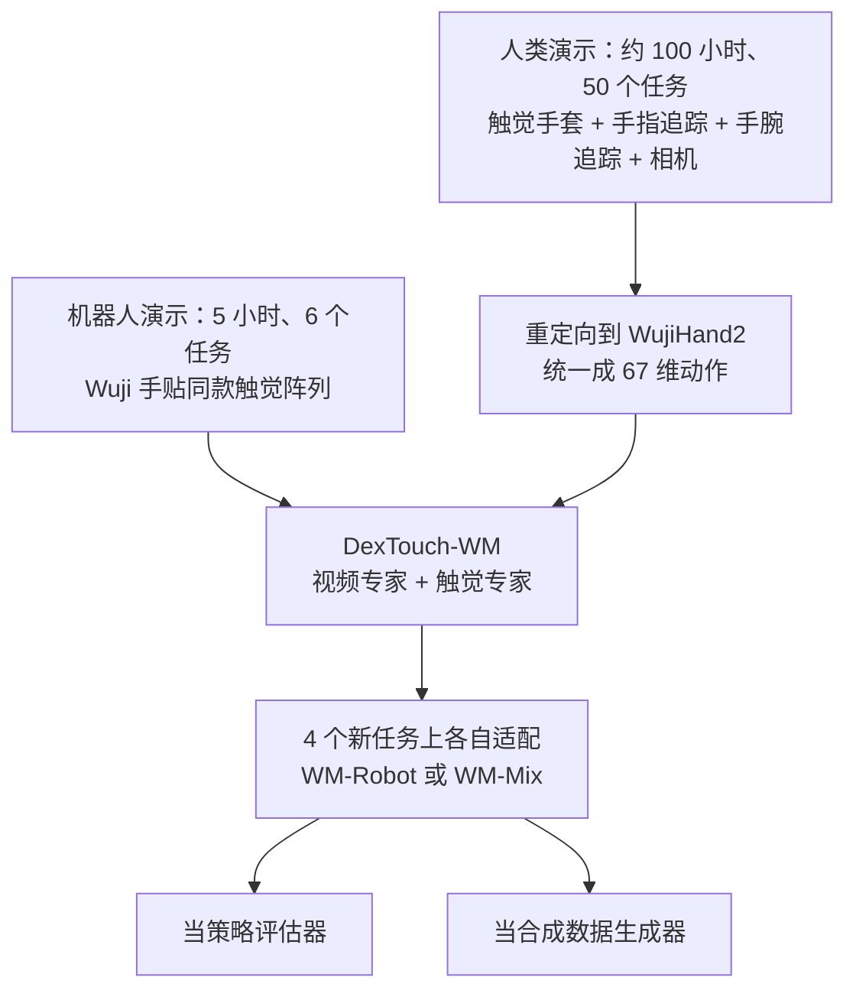

# DexTouch-WM：让戴触觉手套的人替灵巧手攒「接触经验」

<!-- release-date: 2026-09-17 -->

> 本文依据 **DexTouch-WM: Learning Action-Conditioned Tactile World Models from Human Touch for Dexterous Robot Manipulation**，arXiv:2609.20649v2，2026-09-18 修订，共 8 页（正文 7 页，参考文献 1 页）。作者 12 人，四位共同一作；机构为 HKUST（GZ）、Xspark AI、北京大学、香港大学、清华大学。作者行给 Wenbo Ding、Tianxing Chen、Renjing Xu 三人标了通讯符号，脚注只写 HKUST（GZ）的 Renjing Xu（PDF p. 1）。页码均指这份 PDF。这是一篇短篇方法论文，没有模型规模表、训练超参与开源仓库可讲。文中区分三件事：**论文明确写了什么**、**我们怎么解释它**、**哪些是外部资料补充**。

## 读前先把几个词说成人话

这篇论文的新意不在某个网络模块，而在一个数据上的赌注：人手摸东西的经验，能不能直接拿来训练机器人手的「想象力」。先把反复出现的词说清楚。

- **世界模型（world model）**：给定当前观测和一串「接下来要做的动作」，预测未来会看到什么。像一个从数据里学出来、可以反复试错的模拟器。
- **动作条件（action-conditioned）**：预测时把动作序列当输入条件。同一个起点，给不同的动作，应该预测出不同的未来。
- **灵巧手（dexterous hand）**：有多根可独立弯曲手指的机器人手，区别于只会开合的平行夹爪（parallel-jaw gripper）。本文用的是 20 自由度的 Wuji 手（PDF p. 4）。
- **触觉图（tactile map）与 taxel**：把手上每个压力传感点的读数排成数组，就是触觉图；一个传感点叫 taxel（tactile pixel，触觉像素）。
- **压阻阵列（piezoresistive array）**：受压时电阻会变的柔性薄膜传感器，做成手套就能测整只手的压力分布。
- **双侧（bilateral）**：左右两只手都算。本文的触觉图同时包含两只手。
- **重定向（retargeting）**：把人手动作换算成机器人手的关节角，因为两者的骨骼尺寸和关节结构不同。
- **MoT（Mixture-of-Transformers）**：多模态模型的一种写法，各模态保留自己的前馈层等专属参数，只在注意力里互相看见（PDF p. 2–3）。
- **AdaLN（Adaptive Layer Normalization，自适应层归一化）**：用条件信号算出层归一化的缩放和偏移，常用来把扩散时间步「调制」进每一层。本文把动作也这样注入。
- **流匹配（flow matching）**：和扩散模型同族的生成训练方法，学习把噪声搬运成数据的速度场（PDF p. 3 引用 Lipman 等人 2023）。

## 一句话先说清

接触丰富的灵巧操作，关键状态往往看不见，只能摸出来：画面相似的两段动作，接触压力、是否打滑、是否快卡住可能完全不同，手挡住物体时更是如此（PDF p. 1）。视觉触觉世界模型能同时预测画面和触觉，但训练数据几乎都靠机器人遥操作采集，每份数据绑死在一台机器、一种传感器上，所以攒不多（PDF p. 1–2）。

DexTouch-WM 的做法是把触觉数据采集从机器人身上拆下来（PDF p. 2）：

1. 人戴一副全手压阻触觉手套干活，**机器人手上贴同一套布局的触觉阵列**，两边的触觉观测天然同构；
2. 人的手腕、手指和头部相机运动被重定向到机器人动作空间，两边共用一个 67 维动作向量（PDF p. 2、p. 4）；
3. 模型是一个预训练视频专家加一个轻量触觉专家，联合预测未来 RGB 和双手触觉图（PDF p. 2–3）。

全文最硬的实验是一组控制变量式扩展：机器人数据固定 5 小时，人类数据从 0 加到 100 小时，在留出的机器人片段上，视觉、几何和接触预测都明显变好；人类任务与机器人任务完全不重叠（PDF p. 1、p. 6）。之后作者把世界模型当策略评估器和合成数据生成器：前者与真机排序大体一致，后者因策略而异，有正有负（PDF p. 6–7）。

### 一条阅读路线

原文只有 7 页正文，建议按这个顺序读：

1. **p. 1 Fig. 1 与 p. 2 引言后半**：人类数据为什么能喂机器人世界模型，硬件对齐之后还剩哪些难题。
2. **p. 3 Fig. 2 与式 (2)–(4)**：双专家架构、残差触觉潜变量、双速率动作条件、训练目标。
3. **p. 4 Fig. 3 与式 (5)–(6)**：共享触觉布局、67 维动作表示。
4. **p. 5 Table I 与 Fig. 4**：左半是设计消融，右半是人类数据扩展。全文最硬的一张表。
5. **p. 6 Table II–III 与式 (7)**：世界模型当策略评估器。
6. **p. 7 Fig. 5、Table IV–V**：世界模型当数据生成器，结果有正有负。

## 主要矛盾：触觉最值钱，也最难攒

论文开场的逻辑是三步（PDF p. 1–2）：

1. 灵巧操作由看不见的物理接触状态支配，只预测视频的世界模型表示不了决定成败的接触动力学。
2. 已有的视觉触觉世界模型（VT-WM、ViTacWorld、Dream-Tac、VT-WAM 等）用联合预测补上了这一块。
3. 但它们的触觉轨迹大多靠机器人遥操作采集，数据集与具体本体、具体传感器绑定。想要更多数据就得继续开同一台机器，所以触觉数据集一直很小，而且多是平行夹爪或孤立的指尖传感器。

于是矛盾变成：

> 触觉世界模型需要大量「动作导致接触怎么变」的样本，而机器人上的触觉样本又贵又不可迁移。能不能找一个不依赖机器人、规模能上去的数据来源，让它监督的正是机器人要用的那个世界模型？

作者的回答是人手。但他们也承认，硬件对上还不够（PDF p. 2）。全手触觉点分布在互不相连的指尖和手掌上，当成普通图片处理会引入虚假的邻接关系；第一视角的双手动作同时混着手指运动和相机运动，还要和不同采样率的视觉、触觉流对齐。方法部分就是依次拆这几个难题。

相关工作一节也把边界画清了：人手采集的视觉触觉数据（Touch and Go、OpenTouch、DexUMI、FreeTacMan 等）多用来做模仿或表征学习，TactAlign、FTP-1 把触觉当控制或对齐信号；TouchWorld 已经用人类触觉做预训练。本文要研究的是两者的组合：让人类轨迹监督**同一个动作条件世界模型**，并用固定机器人数据的扩展协议来检验（PDF p. 2）。

## 先看全景

这张图按 PDF p. 2–4 的方法描述与 p. 6–7 的实验流程重画，是流程示意，不是论文原图。要点是：人类数据和机器人数据进的是**同一个模型、同一套输入格式**，不需要学一个「人触觉到机器人触觉」的映射（PDF p. 4）。

## 问题怎么写成一个式子

给定初始 RGB 观测 $v_0$、初始双手触觉图 $x_0$、语言指令 $\ell$ 和未来的位姿序列 $a_{1:T}$，模型学的是未来视频和触觉的联合分布（PDF p. 2，式 1）：

$$
p_\theta\bigl(v_{1:T},\, x_{1:T} \mid v_0,\, x_0,\, a_{1:T},\, \ell\bigr)
$$

两点值得先记住。第一，视频和触觉是**联合**生成的，不是先生成视频再从视频推触觉。第二，条件里的动作是机器人坐标系下的位姿序列，人类数据要先换算成这个格式才能用。

## 核心设计一：同一套触觉布局，同时贴在人手和机器人手上

### 旧问题：触觉数据绑死在本体上

遥操作采集的触觉数据，传感器型号、贴的位置、分辨率都是那台机器专属的。换一台机器人，旧数据就用不上了（PDF p. 1–2）。

### 新设计：可穿戴的全手压阻阵列，机器人手贴同款

每只手套记录 360 个 taxel，采样率 60 Hz；训练只保留图中的 320 个，即 5 块 4×4 指尖阵列加 1 块 15×16 手掌阵列（PDF p. 3、p. 4）。同一套 320 点布局装在机器人手上，两个域共享一个触觉观测空间（PDF p. 4）。验算：$5 \times 16 + 15 \times 16 = 320$。被舍掉的 40 个点在哪、为什么舍，报告没给。

### 人类数据怎么采：HumanTouch

采集者在 Manus MetaGloves（手指追踪手套）里面再戴一层 Moxian 触觉手套；HTC Vive 追踪器给出手腕的 6 自由度位姿；两个腕部相机记录局部手物交互，一个头部相机记录整个工作台。每次采集标定相机内参、相机到追踪器的外参和统一的时间基准，设备监控负责发现丢失或异常的数据流。手指追踪加手腕位姿合成 25 关键点的 3D 手部骨架。每条轨迹存 RGB、触觉图、骨架、手腕位姿和元数据（PDF p. 3–4）。

人类数据分两份（PDF p. 4）：

- **预训练语料**：约 100 小时第一视角交互，覆盖 50 个日常双手任务，包括搬运、抓取与重新抓取、撞击、插入、铰接与可变形物体、持续多区域接触；
- **下游适配**：另外为 4 个下游任务单独采的人类演示，与预训练语料不重叠。

两份合起来就是实验设置一节说的「54 个任务」（PDF p. 4）。

**我们如何解释它。** 真正省掉的是「必须开着机器人才能采触觉」这条约束。人手操作不需要遥操作系统、不怕撞坏机器，任务种类也更自然。代价是机器人手上要做一套和手套完全同构的传感器，这条路对传感器形态有硬要求；换成视觉触觉传感器一类的原理，就不能直接照搬。

### 可迁移启发

跨本体迁移，先想办法让**观测空间在硬件层面就对齐**，比事后学一个跨域映射便宜得多。论文明确说这套对齐「不需要学一个触觉域映射」（PDF p. 4）。能从传感器设计上消掉的域差，别留给模型去学。

## 核心设计二：把人手动作翻译成机器人动作

### 旧问题：触觉对上了，运动学没对上

人手和机器人手的骨骼长度、关节位置不一样，共享触觉并不能顺带对齐运动学（PDF p. 4）。

### 新设计：标定、归一化、逆运动学重定向

先用相机与世界坐标系的标定把追踪到的人手运动搬到机器人参考系；再对手部几何做归一化，抹掉形态差异；最后用逆运动学映射重定向到 WujiHand2（PDF p. 4，式 5）：

$$
\bigl(e^h_t,\, J^h_t\bigr) \xrightarrow{\;\mathcal{A}\;} \bigl(e^r_t,\, q^r_t\bigr)
$$

左边是人手腕位姿 $e^h_t$ 和手部几何 $J^h_t$，右边是机器人末端位姿 $e^r_t$ 和 20 自由度手部构型 $q^r_t$。论文的说法是，这一步去掉人特有的动作坐标，同时保留演示出的手部运动。

之后两个域共用同一个动作表示（PDF p. 4，式 6）：

$$
a_t = \bigl[e^L_t,\; e^R_t,\; q^L_t,\; q^R_t,\; e^c_t\bigr] \in \mathbb{R}^{67}
$$

$e^L_t$、$e^R_t$ 是相对第一帧的左右手腕运动，$q^L_t$、$q^R_t \in \mathbb{R}^{20}$ 是左右手构型，$e^c_t$ 是头部相机运动（PDF p. 2、p. 4）。所有数据流在切训练窗口之前先做同步。

**我们如何解释它。** $67 - 2 \times 20 = 27$，剩下 27 维分给左腕、右腕、相机三个位姿，平均每个 9 维。「3 维平移加 6 维旋转」恰好是 9 维，是常见写法，但这只是我们的推测，报告没给具体参数化。逆运动学的求解器、目标函数与归一化公式，报告也没给。

### 可迁移启发

世界模型的动作条件是它和下游策略的接口。把人类数据先翻译到**目标本体的动作空间**，训练出来的模型在机器人上直接可用；动作空间若留在人手坐标，机器人用的时候还得再翻译一次，误差会叠在模型外面。

## 核心设计三：大视频专家加小触觉专家，只在注意力里见面

### 旧问题：从零训太贵，硬拼又互相干扰

视频生成已经有很强的预训练模型，触觉没有。把触觉当新模态硬塞进视频模型，要么破坏视频模型已学到的东西，要么触觉被视频压着学不好。

### 新设计：MoT 双专家

按 Fig. 2 与正文（PDF p. 2–3）：

- **视觉专家**：从 Wan2.2-TI2V-5B 及其视频 VAE 初始化；
- **触觉专家**：论文只说是「轻量」的 TactileDiT，没给层数和参数量；
- **怎么交互**：照 MoT 的做法，两路在每一层 Transformer 里通过带掩码的联合自注意力交换上下文，各自保留自己的前馈通路；图注还写明各自保留 AdaLN；
- **条件**：初始 RGB 帧经冻结的视频 VAE 编码，作为时间位置 0 的干净潜变量保留，后续视频潜变量加噪后被预测；语言指令过冻结的文本编码器，初始触觉状态也作为上下文；
- **输出**：冻结的视频解码器和冻结的 Split-Hands 触觉解码器，把预测的潜变量还原成未来 RGB 和压力图。

两个模态之间**没有额外的对齐损失**，只靠联合注意力耦合（PDF p. 3）。

**我们如何解释它。** 这是「借大模型、挂小专家」：视频先验几乎全部来自预训练，触觉专家只要学接触动力学以及它和画面的对应。联合注意力让画面里的手部运动能提示触觉（手指靠近物体，压力快来了），也让触觉反过来约束画面。

### 可迁移启发

给一个成熟的单模态生成模型加新模态，「共享注意力、分开前馈与归一化」是低风险的起点：旧模态的计算路径基本不动，新模态有自己的参数，交互只发生在注意力里。

## 核心设计四：按解剖结构切的触觉分词器 Split-Hands

### 旧问题：把全手触觉当一张图，会凭空造出邻居

手掌和指尖在手上是分开的。拼进一张 2D 画布后，卷积核会把拇指边缘和手掌边缘当成相邻像素，而它们在物理上根本不相连（PDF p. 3、p. 5）。

### 新设计：指尖一个编码器，手掌一个编码器，再贴身份标签

做法（PDF p. 3）：

1. 先把左右两只手对齐到同一个解剖坐标系；
2. 10 个指尖共用一个编码器，2 个手掌共用另一个编码器；
3. 加上**阵列身份嵌入**（pad identity embeddings），让模型知道这块数据来自哪根手指、哪只手，局部压力特征仍然共享；
4. 分词器先单独用**接触加权重建**预训练，然后在世界模型训练时冻结。接触加权是因为大量没被压到的 taxel 读数接近零，不加权的话它们会主导表示。

### 证据：Fig. 4

对照组叫 Grid：把整张触觉图当一个空间画布，手掌和指尖用同一个 CNN 一起编码（PDF p. 5）。

图中的数值是目测。论文的结论是：保留解剖结构对稀疏、局部的接触模式是更有效的归纳偏置，之后所有实验都用 Split-Hands（PDF p. 5）。

**我们如何解释它。** 右图说明两者最后都能认出「哪里有接触」，差别主要在收敛速度；左图说明「压力值本身」的重建精度差得多。这组消融只在 5 小时机器人数据上做（PDF p. 5），只比了分词器自身的重建，没有报告换成 Grid 之后整个世界模型的预测指标。

### 可迁移启发

传感器排布不是规则网格时，别急着把它拼成图片。**按物理拓扑分组、组内共享编码器、组间用身份嵌入区分**，对任何「分布式、分块」的传感器都适用，比如多相机阵列、分布在身体不同部位的 IMU。

## 核心设计五：锚定残差与双速率动作条件

这两件事都在回答「触觉流该预测什么、按什么节奏给动作」，放在一张图里看最清楚。

### 锚定残差：只预测相对第一帧的变化

一次操作开始时，手可能已经握着物体，触觉图上有一块稳定的压力背景。直接预测每一帧的绝对触觉，模型的大部分精力可能花在「把背景原样抄一遍」上。

设触觉编码器 $E_x$、解码器 $D_x$，$z_t = E_x(x_t)$。模型预测的是相对初始触觉潜变量的差，解码前把 $z_0$ 加回去（PDF p. 3，式 2）：

$$
r_t = z_t - z_0, \qquad \hat{x}_t = D_x\bigl(z_0 + \hat{r}_t\bigr)
$$

干净的 $z_0$ 一直作为上下文可见。论文的说法是，残差预测让模型聚焦于交互引起的变化，同时保住初始压力背景（PDF p. 3）。

**我们如何解释它。** 这和视频预测里「预测帧差」、控制里「预测状态增量」是同一思路：容易的部分（不变的背景）交给结构，模型容量留给难的部分（接触怎么变）。论文没有给「残差对绝对值」的单独消融，这项设计目前只有动机，没有数字。

### 双速率：各按各的时间分辨率喂动作

视频 VAE 是因果的：初始帧单独保留一个潜变量，之后在时间上压缩 4 倍；触觉分词器不压时间，保留原始观测速率（PDF p. 3）。同一份动作序列要条件两个流，总有一边的时间对不上。于是每个流在自己的潜变量分辨率上接受条件（PDF p. 3，式 3）：

$$
c^v_j = \phi_v\bigl(a_{4j-3:4j}\bigr), \qquad c^x_t = \phi_x\bigl(a_t\bigr), \qquad c^v_0 = c^x_0 = 0
$$

$c^v_j$ 是第 $j$ 个未来视频块的条件，由对应 4 帧动作经 $\phi_v$ 编码；$c^x_t$ 是第 $t$ 个触觉步的条件，直接用那一帧的动作。动作里手腕和相机是相对第一帧的运动，手部关节是**绝对**角度；这些信号经 AdaLN 注入每个专家的时间步调制，也就是 Fig. 2 中间那条横跨两边的「Pose AdaLN」（PDF p. 3）。

**我们如何解释它。** 手腕和相机用相对量，是因为不同片段起点的绝对位置没有意义；手指用绝对量，是因为「手指弯到多少度」本身就决定会不会碰到东西。视频按 4 帧一块取动作是在迁就 VAE 的时间压缩；触觉逐帧取，保住了接触发生那一瞬间的细节。

### 为什么用 AdaLN，而不是交叉注意力

这是 Table I 左半边回答的问题。三个变体都只用 5 小时机器人数据（PDF p. 5）：

- **V-only**：只预测视频，动作用交叉注意力注入；
- **Cross-Attn**：视觉触觉联合模型，动作仍用交叉注意力注入；
- **Robot-only**：把注入方式换成 AdaLN，即 Split-Hands 加 AdaLN。这就是后面扩展实验的起点。

结论分两步（PDF p. 5–6，数字见下一节的 Table I）：

1. **加触觉、用交叉注意力，像素指标几乎不变，高层指标变差。** PSNR、SSIM、LPIPS 与 V-only 基本持平，但语义对齐从 0.829 掉到 0.788，轨迹准确率从 0.884 掉到 0.850。作者的解读是：直接用交叉注意力耦合触觉流不伤像素重建，但会在动作条件的高层动力学上引入跨模态干扰。
2. **换成 AdaLN，干扰大部分消失。** 相对 Cross-Attn，视觉 PSNR 从 22.130 到 23.473，LPIPS 从 0.118 到 0.098，轨迹准确率恢复到 0.891，略超 V-only 的 0.884；触觉侧接触 IoU 从 0.388 到 0.415，接触 F1 从 0.523 到 0.551。

**我们如何解释它。** Table I 里也有不支持「AdaLN 全面更好」的格子：Robot-only 的几何误差 0.131 是三者里最差的（V-only 0.128），JEPA 相似度 0.864 与语义对齐 0.813 也低于 V-only 的 0.870 和 0.829（PDF p. 5）。正文没有讨论这几格。差距都不大，但说明「加触觉不伤视频」在只有 5 小时机器人数据时并没有完全做到。

## 训练目标

两个专家都用条件流匹配训练，总损失是视频项加一个权重为 $\lambda_{\mathrm{tac}}$ 的触觉项（PDF p. 3，式 4）：

$$
\mathcal{L} = \mathcal{L}^{\mathrm{FM}}_{\mathrm{video}} + \lambda_{\mathrm{tac}}\,\mathcal{L}^{\mathrm{FM}}_{\mathrm{tactile}}
$$

三个细节（PDF p. 3）：初始视觉潜变量不算预测损失，它是条件不是目标；触觉项预测的是式 (2) 的残差，而且只在「有接触或随时间变化」的 token 上计算；两个模态之间没有对齐损失。$\lambda_{\mathrm{tac}}$ 的取值、「有接触」的判定阈值，报告没给。

**我们如何解释它。** 分词器的接触加权重建、残差潜变量、只在接触与变化 token 上算损失，是三道方向一致的保险，都在防止「大片零读数」把模型带偏。这是本文在触觉建模上最一致的一条设计原则。

## 数据与评测怎么设

**机器人数据。** Tianji 机械臂加 20 自由度 Wuji 灵巧手，手上装与人类采集相同的全手压阻手套；共 10 个灵巧操作任务，其中 6 个提供 5 小时世界模型预训练数据，另外 4 个与之不重叠，用于下游适配与评估。每条轨迹包含同步的 RGB、全手触觉和机器人关节轨迹（PDF p. 4）。

**指标。** 视觉侧沿用 WorldArena 的多维评测协议和 GigaWorld 面向评估器的分析（PDF p. 4）：

| 维度 | 指标 | 测什么 |
|---|---|---|
| 像素保真 | PSNR、SSIM、LPIPS | 预测画面和真值在像素、结构、感知上有多像 |
| 外观 | Aesthetic Quality、Image Quality | 画面本身好不好看、清不清楚 |
| 表征与语义 | JEPA Similarity、Subject Consistency、Semantic Alignment | 在表征空间和语义上是否一致 |
| 动作 | Trajectory Accuracy | 画面里的运动是否跟着给定动作走 |
| 几何 | Geometry Error | 几何一致性 |

触觉侧分两类：连续信号重建（$\mathrm{PSNR}_{\mathrm{taxel}}$、$\mathrm{SSIM}_{\mathrm{taxel}}$、$\mathrm{LPIPS}_{\mathrm{heatmap}}$、MSE、MAE）与接触动力学（Contact-MAE、Contact-IoU、Contact-F1）。加第二类的理由是：平均重建误差会被大片无接触区域主导，掩盖稀疏但关键的接触（PDF p. 4）。各指标的具体计算（轨迹怎么从视频里提取、接触阈值多少），论文只给了名字和出处。

## 实验一：人类数据能不能扩展机器人世界模型

起点是 Robot-only（Split-Hands 加 AdaLN、0 小时人类数据）。机器人数据固定 5 小时，分别加入 10、50、100 小时人类数据；加 100 小时的就是 DexTouch-WM，也是后面下游适配的初始化。所有变体在同一批留出的机器人片段上评估，片段来自 6 个机器人操作任务；人类任务集与机器人任务集不重叠，所以作者把提升解读为跨任务迁移，而不是同任务的数据增强（PDF p. 6）。

下表是原文 Table I 全表（PDF p. 5）。左三列是设计消融，右三列是人类数据扩展；所有列都用 5 小时机器人数据；↑ 越高越好，↓ 越低越好。V-only 只预测视频，所以触觉行为空。

| 模态 | 能力 | 指标 | V-only | Cross-Attn | Robot-only | +10h 人类 | +50h 人类 | +100h 人类 |
|---|---|---|---:|---:|---:|---:|---:|---:|
| 视觉 | 像素保真 | PSNR ↑ | 22.099 | 22.130 | 23.473 | 24.032 | 26.874 | 27.096 |
| 视觉 | 像素保真 | SSIM ↑ | 0.799 | 0.801 | 0.824 | 0.838 | 0.886 | 0.890 |
| 视觉 | 像素保真 | LPIPS ↓ | 0.117 | 0.118 | 0.098 | 0.084 | 0.048 | 0.048 |
| 视觉 | 外观 | Aesthetic Quality ↑ | 0.406 | 0.405 | 0.400 | 0.404 | 0.414 | 0.414 |
| 视觉 | 外观 | Image Quality ↑ | 0.718 | 0.717 | 0.718 | 0.717 | 0.723 | 0.724 |
| 视觉 | 表征 | JEPA Similarity ↑ | 0.870 | 0.860 | 0.864 | 0.894 | 0.917 | 0.924 |
| 视觉 | 表征 | Subject Consistency ↑ | 0.689 | 0.681 | 0.751 | 0.740 | 0.748 | 0.751 |
| 视觉 | 语义 | Semantic Alignment ↑ | 0.829 | 0.788 | 0.813 | 0.835 | 0.866 | 0.860 |
| 视觉 | 动作 | Trajectory Accuracy ↑ | 0.884 | 0.850 | 0.891 | 0.900 | 0.962 | 0.962 |
| 视觉 | 几何 | Geometry Error ↓ | 0.128 | 0.130 | 0.131 | 0.112 | 0.102 | 0.100 |
| 触觉 | 重建 | $\mathrm{PSNR}_{\mathrm{taxel}}$ ↑ | – | 24.132 | 24.813 | 24.349 | 28.401 | 29.179 |
| 触觉 | 重建 | $\mathrm{SSIM}_{\mathrm{taxel}}$ ↑ | – | 0.795 | 0.810 | 0.823 | 0.876 | 0.896 |
| 触觉 | 重建 | $\mathrm{LPIPS}_{\mathrm{heatmap}}$ ↓ | – | 0.009 | 0.008 | 0.008 | 0.003 | 0.002 |
| 触觉 | 重建 | MSE ↓ | – | 0.105 | 0.093 | 0.108 | 0.038 | 0.029 |
| 触觉 | 重建 | MAE ↓ | – | 0.075 | 0.069 | 0.069 | 0.040 | 0.035 |
| 触觉 | 接触 | Contact-MAE ↓ | – | 0.880 | 0.806 | 0.819 | 0.580 | 0.516 |
| 触觉 | 接触 | Contact-IoU ↑ | – | 0.388 | 0.415 | 0.417 | 0.534 | 0.588 |
| 触觉 | 接触 | Contact-F1 ↑ | – | 0.523 | 0.551 | 0.554 | 0.659 | 0.706 |

### 论文怎么读这张表

作者给了三条观察（PDF p. 6）：

1. **视觉全面变好。** 从 Robot-only 到 +100h，视觉 PSNR 从 23.47 到 27.10，轨迹准确率从 0.89 到 0.96，几何误差从 0.13 到 0.10；收益覆盖像素、表征、运动和几何，而美学和图像质量分几乎不变。作者据此说人类数据贡献的是可迁移的交互结构。
2. **接触迁移更强。** +100h 时触觉 PSNR 从 24.81 到 29.18，接触 IoU 从 0.42 到 0.59，接触 F1 从 0.55 到 0.71。
3. **收益集中在 50–100 小时。** +10h 在触觉指标上几乎是平的；视觉指标在 +50h 到 +100h 之间趋于饱和，接触预测还在继续涨。

结论是：对齐后的人类交互是一条互补的扩展轴，不多采机器人数据，也能提升留出机器人片段上的视觉与接触预测（PDF p. 6）。

### 我们怎么读这张表

**美学分和图像质量不动，是好事。** 这两项衡量画面本身好不好看，而视频专家来自 Wan2.2 预训练，画质早就够了。人类数据改善的是「画面有没有按动作正确地动」，也就是 PSNR、轨迹准确率、几何误差这些与真值对照的指标。两类指标分开走，说明提升不是来自更漂亮的画面。

**+10h 在触觉上有升有降。** $\mathrm{PSNR}_{\mathrm{taxel}}$ 从 24.813 降到 24.349，MSE 从 0.093 升到 0.108，Contact-MAE 从 0.806 升到 0.819；$\mathrm{SSIM}_{\mathrm{taxel}}$ 从 0.810 升到 0.823，Contact-IoU 与 Contact-F1 只多了 0.002–0.003（PDF p. 5）。少量人类数据在触觉侧没带来明显收益，部分误差指标还略差，量上去以后才转为明显收益。想用少量人类数据试水的人要有这个预期。

**视觉饱和、接触没饱和。** 50 到 100 小时，PSNR 只从 26.874 涨到 27.096，轨迹准确率不动（0.962），语义对齐甚至从 0.866 略降到 0.860；接触 IoU 却从 0.534 涨到 0.588，接触 F1 从 0.659 涨到 0.706（PDF p. 5）。若趋势延续，触觉是更值得继续堆人类数据的一侧；但只有 4 个点，不能外推成规模定律。

**这张表回答不了的事：**

- 评测片段来自 6 个机器人预训练任务的留出片段，是「见过的任务、没见过的片段」（PDF p. 6）。「跨任务迁移」指的是人类任务与机器人任务不重叠，不是在全新机器人任务上测。
- 加人类数据的变体，训练数据总量变多了；论文没说各变体是否对齐训练步数或算力。
- 没有「多采机器人数据」的对照，比如 10 小时机器人对比 5 小时机器人加 100 小时人类。我们知道人类数据有用，但不知道 1 小时人类数据值多少机器人数据。
- 没有「只用人类数据、0 小时机器人」的变体。
- 没有和 VT-WM、ViTacWorld 等其他视觉触觉世界模型的横向数字对比，只有内部消融。

## 实验二：世界模型当策略评估器

### 协议

换到 4 个下游任务：Place Shoes（放鞋）、Place Phone（放手机）、Stack Bowls（叠碗）、Stand Bottle（立瓶）。被评估的是三个策略：FTP-1、π0.5、X-VLA（PDF p. 6）。按相关工作与参考文献，FTP-1 是跨触觉传感器的通用触觉策略，π0.5 与 X-VLA 是视觉语言动作模型（PDF p. 2、p. 8）。

每个任务 300 条机器人轨迹，切成互不相交的 A、B、C 三份各 100 条；另有 100 条该任务的人类演示，与扩展语料不重叠（PDF p. 6）。三份数据各有用途：

| 用途 | A（100 条机器人） | B（100 条机器人） | C（100 条机器人） | 100 条人类演示 |
|---|:-:|:-:|:-:|:-:|
| WM-Robot 适配 | | ✓ | ✓ | |
| WM-Mix 适配 | | ✓ | | ✓ |
| 策略训练（Real） | ✓ | ✓ | | |
| 策略训练（+WM，见实验三） | 只取初始观测与动作 | ✓ | | |

两个世界模型都从同一个 DexTouch-WM 检查点出发（PDF p. 6）。所有策略用 A 和 B 的 200 条真实轨迹训练，然后分别在真机和两个世界模型里评估，初始帧对齐；世界模型里的推演是闭环的，预测出的观测作为下一步策略的输入（PDF p. 6）。

打分规则（PDF p. 6）：

| 任务 | 原始分怎么给 | 满分 |
|---|---|---:|
| Place Shoes | 每只鞋拿起、放下各 1 分 | 4 |
| Stack Bowls | 每叠上一个碗 1 分 | 2 |
| Place Phone | 拿起手机 1 分，放到支架上 1 分 | 2 |
| Stand Bottle | 瓶子成功立起 1 分 | 1 |

世界模型里的推演出现明显物理不一致扣 0.5 分；所有分数按任务细则映射到 $[0, 1]$，1 表示完全完成。每个「策略–任务」组合在每个环境里做 10 次对齐的推演，每次由 5 名人工评分员独立打分，报告值对评分员和推演取平均（PDF p. 6）。

### 结果：Table II

| 策略 | 评估环境 | Place Shoes | Place Phone | Stack Bowls | Stand Bottle |
|---|---|---:|---:|---:|---:|
| FTP-1 | 真机 | 0.725 | 0.800 | 0.500 | 0.900 |
| FTP-1 | WM-Robot | 0.975 | 0.975 | 0.750 | 0.900 |
| FTP-1 | WM-Mix | 0.963 | 0.975 | 0.800 | 1.000 |
| π0.5 | 真机 | 0.450 | 0.700 | 0.850 | 0.500 |
| π0.5 | WM-Robot | 0.950 | 0.925 | 0.950 | 0.850 |
| π0.5 | WM-Mix | 0.900 | 0.925 | 0.950 | 0.800 |
| X-VLA | 真机 | 0.500 | 0.600 | 0.300 | 0.600 |
| X-VLA | WM-Robot | 0.600 | 0.725 | 0.150 | 0.150 |
| X-VLA | WM-Mix | 0.925 | 0.700 | 0.250 | 0.400 |

数字取自 Table II（PDF p. 6）。

### 评估器好不好，看排序，不看绝对分

作者用两个指标衡量世界模型评估与真机评估是否一致（PDF p. 6）：Pearson 相关看想象得分与真机得分的线性关系；**MMRV**（Mean Maximum Rank Violation，平均最大排序违例）看世界模型有没有把策略的真实排序弄反，弄反了按真实分差惩罚。

对任务 $k$，$R_{ik}$、$S_{ik}$ 分别是策略 $i$ 的真机分与想象分。若策略 $i$、$j$ 在真机和想象里高低顺序相反，即 $(R_{ik} - R_{jk})(S_{ik} - S_{jk}) < 0$，则 $v_{ij,k} = 1$，否则为 0（PDF p. 6，式 7）：

$$
\mathrm{MMRV}_k = \frac{1}{N} \sum_{i=1}^{N} \max_j \Bigl( \lvert R_{ik} - R_{jk} \rvert \, v_{ij,k} \Bigr)
$$

$N = 3$，即 3 个策略。人话：对每个策略，找它被排错的那一对里真实分差最大的一个，再对 3 个策略取平均；越低越好，0 表示排序完全正确。

| 模型 | 指标 | Place Shoes | Place Phone | Stack Bowls | Stand Bottle |
|---|---|---:|---:|---:|---:|
| WM-Robot | Pearson ↑ | 0.400 | 0.945 | 0.906 | 0.334 |
| WM-Robot | MMRV ↓ | 0.033 | 0 | 0 | 0.067 |
| WM-Mix | Pearson ↑ | 0.972 | 0.939 | 0.889 | 0.577 |
| WM-Mix | MMRV ↓ | 0 | 0 | 0 | 0.067 |

数字取自 Table III（PDF p. 6）。论文的读法（PDF p. 6–7）：

- WM-Mix 的平均 Pearson 高于 WM-Robot（0.844 对 0.646），平均 MMRV 更低（0.017 对 0.025）；
- Place Phone 和 Stack Bowls 上两者都保住了真实排序，MMRV 为 0，WM-Robot 的 Pearson 还略高；
- Place Shoes 上，WM-Robot 把 π0.5 和 X-VLA 的顺序排反了，WM-Mix 纠正了这一点；
- Stand Bottle 仍然难：Pearson 从 0.334 升到 0.577，但两个模型都把 π0.5 和 X-VLA 排反，MMRV 都是 0.0667。

用 Table II 验算 Place Shoes：真机上 X-VLA（0.500）高于 π0.5（0.450），WM-Robot 里 π0.5（0.950）高于 X-VLA（0.600），排反了，分差 0.05，两个策略各计一次，$\mathrm{MMRV} = (0.05 + 0.05 + 0)/3 \approx 0.033$，与表一致。Table III 的其余格子和四个平均值也都能从 Table II 复算出来（WM-Mix 的 Place Shoes 复算为 0.973，与表中 0.972 只差舍入）。

**人类数据能不能替掉一半适配数据。** Table II 里 12 对 WM-Robot 与 WM-Mix 得分的合并 Pearson 是 $r = 0.925$（PDF p. 7）。作者强调这衡量的是两个适配变体之间的一致性，Table III 才是各自对真机的一致性。两者合起来，支持用人类演示替换一半任务专属的机器人适配数据：评估器的一致性保住了，与真机的平均对齐还更好（PDF p. 7）。

### 我们怎么读这一节

**世界模型的绝对分明显偏乐观。** π0.5 在 Place Shoes 真机只有 0.450，在 WM-Robot 里是 0.950；FTP-1 在 Place Shoes 真机 0.725，两个世界模型里都在 0.96 以上（Table II）。这个评估器只能用来**排序**，不能用来估计上线后的成功率。作者选 Pearson 和 MMRV 这两个只看相对关系的指标，本身就默认了这一点。

**每个任务只有 3 个点。** 3 个点的相关系数非常敏感，一个策略的分数动一下，Pearson 就可能从 0.4 跳到 0.9。「WM-Mix 平均 Pearson 更高」是对的，但统计把握不强。

**X-VLA 在世界模型里被低估。** Stack Bowls 真机 0.300，WM-Robot 0.150、WM-Mix 0.250；Stand Bottle 真机 0.600，WM-Robot 0.150、WM-Mix 0.400。同样两个任务上，另外两个策略的想象分都不低于真机分。论文没解释原因。

**评估还靠人工。** 每次推演由 5 人打分（PDF p. 6），「世界模型当评估器」目前还需要人看视频，不是全自动的。

## 实验三：世界模型当合成数据生成器

### 协议

问题是：想象出来的轨迹能不能用来训练真机策略（PDF p. 7）。Real 组用 A 和 B 的 200 条真实轨迹训练；+WM-Robot 与 +WM-Mix 组用 B 的 100 条真实轨迹，加上对应世界模型生成的 100 条合成轨迹。每条合成轨迹取 A 里一条轨迹的初始观测和**记录下来的动作序列**，未来的 RGB 与触觉由世界模型预测；A 不参与任何世界模型训练。所有最终得分都在真机上测。

**我们如何解释它。** 合成轨迹的动作是真的，只有观测是想象的。所以 +WM 组不是「在 200 条真实数据之外再加 100 条」，而是「把 A 的 100 条真实观测换成世界模型重新渲染的版本」。这组实验测的是：世界模型预测的观测，能在多大程度上顶替真实观测去训练策略。

作者说，两个适配模型推演中的物体运动与接触时机都跟得上留出的真实片段（PDF p. 7）。上面这一列里亮点出现的时刻和大致位置三行一致，但这是单个示例的目测，不是定量结论。图注特意说明，这些是用于策略训练的合成演示，不是模型内的策略评估。原图还有一处标注与正文不一致：第三列标题写的是「Pack Shoes」，表格里是「Place Shoes」（PDF p. 7）。

### 结果：Table IV

| 策略 | 训练数据 | Place Shoes | Place Phone | Stack Bowls | Stand Bottle | 四任务均值 |
|---|---|---:|---:|---:|---:|---:|
| FTP-1 | Real | 0.725 | 0.800 | 0.500 | 0.900 | 0.731 |
| FTP-1 | +WM-Robot | 0.750 | 0.850 | 0.350 | 0.800 | 0.688 |
| FTP-1 | +WM-Mix | 0.775 | 0.700 | 0.500 | 0.800 | 0.694 |
| π0.5 | Real | 0.450 | 0.700 | 0.850 | 0.500 | 0.625 |
| π0.5 | +WM-Robot | 0.400 | 0.550 | 0.800 | 0.500 | 0.563 |
| π0.5 | +WM-Mix | 0.375 | 0.350 | 0.850 | 0.400 | 0.494 |
| X-VLA | Real | 0.500 | 0.600 | 0.300 | 0.600 | 0.500 |
| X-VLA | +WM-Robot | 0.675 | 0.300 | 0.450 | 0.600 | 0.506 |
| X-VLA | +WM-Mix | 0.550 | 0.600 | 0.450 | 0.000 | 0.400 |

分项数字取自 Table IV，四任务均值取自正文（PDF p. 7）。作者的结论写得克制：效果取决于策略。FTP-1 用 +WM-Mix 训练的均值 0.694，接近全真实数据的 0.731；π0.5 从 0.625 降到 0.494；X-VLA 从 0.500 降到 0.400，其中 Stand Bottle 得了 0 分。人类数据适配的世界模型能提供有用的演示，但**评估器上的一致性，不保证同等的策略训练效用**；即使生成的推演看起来像真实片段、两个源模型当评估器时表现相近，合成数据有没有用仍取决于策略和任务（PDF p. 7）。

### Table V：换成合成数据，策略之间的排序变没变

| 数据 | 指标 | Place Shoes | Place Phone | Stack Bowls | Stand Bottle |
|---|---|---:|---:|---:|---:|
| +WM-Robot | Pearson ↑ | 0.783 | 0.999 | 0.836 | 0.996 |
| +WM-Robot | MMRV ↓ | 0 | 0 | 0.133 | 0 |
| +WM-Mix | Pearson ↑ | 0.961 | 0.277 | 0.968 | 0.721 |
| +WM-Mix | MMRV ↓ | 0 | 0.067 | 0 | 0.067 |

数字取自 Table V（PDF p. 7）。它比较的是同一任务上，用合成数据训练的 3 个策略与用真实数据训练的 3 个策略，得分的相关性与排序一致性；按 Table IV 复算，每个格子都是在单个任务的 3 个策略上算的。正文没有专门讨论这张表。

**我们如何解释它。** 这张表问的是「换成合成数据后，哪个策略更强的结论变没变」。+WM-Robot 只在 Stack Bowls 上把 FTP-1 与 X-VLA 排反；+WM-Mix 在 Place Phone 上 Pearson 只有 0.277，对应 Table IV 里 π0.5 从 0.700 掉到 0.350、落到 X-VLA（0.600）之下。

### 我们怎么读这一节

**当评估器好，不等于当数据源好。** 这是整篇论文最值得记的负面结果。WM-Mix 当评估器时与真机更一致（Table III），但它生成的数据训出来的 π0.5 和 X-VLA 反而比 WM-Robot 那组更差（均值 0.494 对 0.563、0.400 对 0.506）。排序正确只要求世界模型「好坏分得清」，训练数据则要求每一帧观测的细节都足够真，两者对世界模型的要求不同。

**FTP-1 受伤最小，可能和它是触觉策略有关。** 它在两种合成数据下的均值都只比 Real 低 0.04 左右（0.731 对 0.688、0.694）。π0.5 与 X-VLA 如何使用触觉输入，论文没写，所以「触觉策略更能吃合成触觉数据」只是一个可检验的猜想，原文没有这个结论。

**个别格子高于 Real，不宜过度解读。** X-VLA 在 Place Shoes 上 +WM-Robot 得 0.675，高于 Real 的 0.500；Stack Bowls 两组都是 0.450，高于 Real 的 0.300。同一个 X-VLA 在 +WM-Mix 下 Stand Bottle 是 0。单任务、单次训练的波动很大，论文没有报告多种子的方差。

## 训练栈里写了什么、没写什么

写了的：视觉专家从 Wan2.2-TI2V-5B 初始化，视频 VAE、文本编码器冻结（PDF p. 2–3）；触觉分词器先接触加权重建预训练，再冻结（PDF p. 3）；两个专家都用条件流匹配训练（PDF p. 3）；手套 60 Hz、每手 360 点、保留 320 点（PDF p. 4）；预训练数据约 100 小时人类、5 小时机器人（PDF p. 2、p. 4）。

没写的：触觉专家的层数、宽度、参数量；预测窗口长度 $T$、视频帧率与分辨率；世界模型实际用了哪几路相机（实验设置提到头戴 RGB 视角，采集系统还有两个腕部相机）；$\lambda_{\mathrm{tac}}$、学习率、批大小、训练步数、GPU 与训练时长；下游适配的训练细节；推理速度与闭环推演成本；逆运动学重定向的实现；代码、权重与数据集是否公开。

## 限制与判断

- **被实验支持的**：5 小时机器人数据固定时，加 50–100 小时对齐的人类数据，能明显改善同一批机器人任务留出片段上的视觉与接触预测（Table I、PDF p. 6）。这是全文证据最扎实的结论。
- **被支持、但证据偏薄的**：Split-Hands 比 Grid 重建更准、收敛更快（Fig. 4，只比了分词器本身）；AdaLN 注入比交叉注意力好（Table I 左半，只在 5 小时机器人数据上做）；用人类演示替一半适配数据能改善评估器一致性（Table III，每个任务只有 3 个策略）。
- **只有动机、没有单独消融的**：锚定残差潜变量、只在接触与变化 token 上算触觉损失、双速率动作条件。
- **明确的负面或混合结果**：合成数据对策略训练的效用因策略和任务而异，π0.5 与 X-VLA 用 WM-Mix 数据训练后平均变差（Table IV）；Stand Bottle 上两个评估器都排错了顺序（Table III）。
- **论文没回答的**：人类数据与机器人数据的「汇率」、只用人类数据能走多远、在全新机器人任务上的预测质量、与其他视觉触觉世界模型的横向对比。
- **适用边界**：整套方法依赖「人手套与机器人手的触觉布局完全同构」这个硬件前提；机器人手是 20 自由度五指手，才能与人手做逆运动学重定向（PDF p. 4）。平行夹爪或其他构型的末端，这条路不直接适用。

## 可迁移启发

1. **先在硬件上消掉域差，再谈迁移。** 人手和机器人手贴同一套触觉布局，模型就不用学跨域映射。能在采集端对齐的，别留给模型。
2. **稀疏信号要三处设防。** 分词器接触加权、残差只预测变化、损失只算接触与变化区域。任何「大部分读数是零、关键信息很稀疏」的模态（事件相机、力传感、稀疏日志）都能借这三招。
3. **非网格传感器按物理拓扑分组。** 组内共享编码器、组间用身份嵌入，比硬拼成图片更好。
4. **给大模型加新模态，从「共享注意力、分开前馈」起步。** 保住预训练模型的计算路径，新模态只在注意力里接入。
5. **条件注入方式会影响跨模态干扰。** 本文里交叉注意力注入动作伤高层动力学指标，换成 AdaLN 就好转。多模态联合生成时，注入方式值得单独做一组消融。
6. **控制变量式扩展实验值得学。** 固定稀缺数据（机器人），只扩展廉价数据（人类），任务集不重叠，能干净地回答「廉价数据有没有用」。
7. **评估器与数据生成器是两种要求。** 世界模型排序准确，不代表它生成的数据能训出好策略；拿世界模型做合成数据前，要单独验证下游训练效果。
8. **世界模型评估看排序指标。** 绝对分普遍偏乐观，Pearson 与 MMRV 这种只看相对关系的指标更合适；但策略数太少时，相关系数本身很不稳。

## 关键词回看

- **动作条件触觉世界模型**：给当前画面、触觉和未来动作，联合预测未来画面与触觉。本文的主角。
- **共享触觉接口**：人手手套与机器人手贴同一套 320 点布局，5 块 4×4 指尖加 1 块 15×16 手掌（PDF p. 3–4）。
- **67 维动作**：左右手腕、左右手各 20 自由度构型、头部相机；人类数据经逆运动学重定向到这个空间（PDF p. 4）。
- **MoT 双专家**：Wan2.2-TI2V-5B 视频专家加轻量触觉专家，只在联合注意力里交互，各自保留前馈与 AdaLN（PDF p. 2–3）。
- **Split-Hands 分词器**：指尖共享编码器、手掌共享编码器、阵列身份嵌入，接触加权预训练后冻结。
- **锚定残差潜变量**：只预测相对初始触觉潜变量的变化 $r_t = z_t - z_0$。
- **双速率动作条件**：视频按 4 帧一块取动作，触觉逐帧取动作，都经 AdaLN 注入（PDF p. 3）。
- **人类数据扩展**：机器人 5 小时固定，人类 0、10、50、100 小时；收益集中在 50–100 小时，接触预测未饱和（PDF p. 5–6）。
- **WM-Robot / WM-Mix**：下游 4 个任务上分别用 200 条机器人轨迹、或 100 条机器人加 100 条人类演示适配（PDF p. 6）。
- **MMRV**：平均最大排序违例，看世界模型有没有把策略排反，排反了按真实分差计罚。
- **评估一致性不等于训练效用**：WM-Mix 当评估器更好，当数据源却让两个 VLA 策略变差（PDF p. 6–7）。

## 资料与阅读边界

### 本文依据的版本与首发日

- 原件：arXiv:2609.20649v2（[arXiv 页面](https://arxiv.org/abs/2609.20649)），8 页；核验时 v2 是 arXiv 上的最新版，v1 提交于 2026-09-17。
- `release-date` 取 2026-09-17。论文没有给出模型权重、代码仓库或在线服务，也没有找到官方项目页，对象从未以模型形式对外可用，因此取技术首次官方公开日，即 arXiv v1 提交日。

### 外部资料补充（不是 PDF 原文）

- Wan2.2-TI2V-5B 的规格见 [Wan2.2 官方仓库](https://github.com/Wan-Video/Wan2.2)：5B 参数，同时支持文生视频与图生视频，配套 VAE 压缩比 16×16×4。时间维 4 倍与论文所说的「未来帧时间压缩 4 倍」对得上（PDF p. 3）；空间压缩比、分辨率论文没写。
- arXiv 页面的 Comments 栏写明该文被 IROS 2026 Workshop RoBoWoMo 接收为 Lightning Talk；PDF 正文没有提到。
- 同站相关篇目：同样用人类视频训练机器人世界模型的 DreamDojo 一篇；把接触力数据混进物理世界模型预训练的 InternW0 一篇。

### 报告明确写了、本文覆盖了的部分

摘要与 Fig. 1；第 I 节动机与三项贡献；第 II 节相关工作的定位；第 III 节问题形式化（式 1）、双专家架构与 Fig. 2、Split-Hands 分词器、锚定残差潜变量（式 2）、双速率动作条件（式 3）、训练目标（式 4）、HumanTouch 采集与 Fig. 3、人到机器人的动作对齐（式 5–6）；第 IV 节实验设置与评测指标、Table I 与 Fig. 4 的设计消融、人类数据扩展、Table II–III 与式 7 的策略评估、Fig. 5 与 Table IV–V 的数据生成；第 V 节结论。

### 原文没有公开、本文也不补的缺口

- 触觉专家规模、训练超参、算力与训练时长；
- 各扩展变体是否对齐训练算力；
- $\lambda_{\mathrm{tac}}$、接触判定阈值、各评测指标的计算细节；
- 预测窗口长度、视频帧率与分辨率、世界模型实际使用的相机视角；
- 手套 360 点中被舍弃的 40 点位置与原因；
- 67 维动作里手腕与相机位姿的具体参数化，逆运动学重定向的求解器与目标函数；
- 残差潜变量、双速率条件、接触区域损失各自的消融；
- 与其他视觉触觉世界模型的横向对比；
- 推理速度与闭环推演成本；
- 代码、权重、HumanTouch 数据集是否公开。
