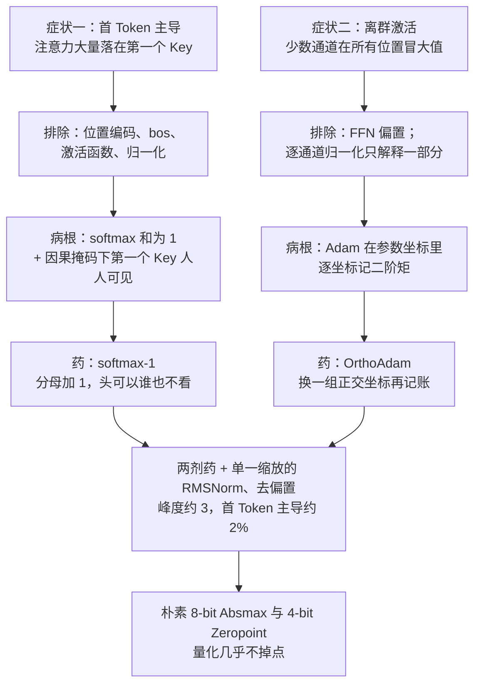

# 首 Token 吸走注意力、少数通道冒出大值：一个怪 softmax，一个怪 Adam 的坐标系

<!-- release-date: 2024-10-22 -->

> 本文依据 **From Attention to Activation: Unraveling the Enigmas of Large Language Models**，ICLR 2025 正式版（arXiv:2410.17174），共 52 页：正文 p. 1–10，参考文献 p. 11–13，附录 A–L 在 p. 14–52。作者 Prannay Kaul、Chengcheng Ma、Ismail Elezi、Jiankang Deng，署名机构是华为诺亚方舟实验室伦敦（Huawei Noah's Ark Lab, London）与中科院自动化所（CASIA）；第一作者脚注写明工作在实习期间完成，通讯作者 Elezi 用华为邮箱（PDF p. 1）。页码均指这份 PDF 自身的页码。文中会区分三件事：**论文明确写了什么**、**我们怎么解释它**、**哪些是外部资料或本文推算**。

## 读前先把几个词说成人话

这篇论文盯的是两个「模型照样能用、但部署时很疼」的怪现象。先把会反复出现的词说清楚：

- **Token（词元）**：模型读写文本的最小单位。序列第一个位置常常是 `<bos>` 这种起始符，本身几乎没有语义。
- **Query / Key / Value（查询 / 键 / 值）**：注意力的三个角色。当前位置拿 Query 去和历史位置的 Key 打分，再按分数把各位置的 Value 加权求和。
- **softmax**：把一行打分变成一行非负权重，**这一行加起来必须等于 1**。它逼着每个头每一步都「必须读点什么」。
- **因果掩码（causal mask）**：自回归模型里，位置 $t$ 只能看见 $1$ 到 $t$。于是第一个 Key 是**唯一一个所有 Query 都看得见**的位置。
- **首 Token 主导（first token dominance）**：大量注意力落在第一个 Key 上。这就是其他文献里的 **attention sink（注意力汇聚）**，Gated-Attention 一篇用的是后一个名字。
- **隐藏状态（hidden states）**：每一层在残差相加**之后**的中间特征（PDF p. 2）。本文说的离群值出现在这里，不是注意力分数里。
- **离群激活（outlier activations）**：少数几个特征通道上的数值比其他通道大几个数量级，而且换一段输入，冒大值的仍是那几个通道（PDF p. 3）。Gated-Attention 一篇叫它 **massive activation（超大激活）**；两篇量法不同，本篇主要看峰度。
- **峰度（kurtosis）**：衡量一组数「尾巴有多厚」。标准高斯分布是 3；有一根特别高的钉子，峰度就会冲到几百上千。
- **Adam / RMSProp / SGD**：三种优化器。SGD 直接沿梯度走；RMSProp 按每个参数各自的梯度平方滑动平均来缩放步长；Adam 在此基础上再加一阶动量。
- **量化（quantisation）**：把权重或激活从 16 位浮点压成 8 位、4 位整数。一个张量里只要有一个特别大的值，量化刻度就得照顾它，其余正常值就只剩很少的有效位。

论文自己造的两个名字：

- **softmax-1**：在 softmax 的分母里加一个常数 1，让一行权重可以加起来小于 1。
- **OrthoAdam**：先用一个固定的随机正交矩阵把梯度转到另一组坐标里，在那组坐标里做 Adam 的记账，再把更新转回来。

## 一句话先说清

2024 年，大家已经知道 LLM 里有两件怪事：注意力大把大把砸在第一个 Token 上；隐藏状态里有几条通道常年冒出几千的大值。两件事常被放在一起讲，也常被当成同一个病——比如「首 Token 的大激活造成了 sink」，或者反过来。

这篇论文的主张是：**它们是两件事，病根不同，药也不同**（PDF p. 3）。

1. 首 Token 主导的根源是 **softmax 的「和为 1」加上因果掩码**。一个头这一步没东西可读，也得把 1 分出去；第一个 Key 人人看得见，就成了公共垃圾桶。药是 softmax-1。
2. 离群激活的主要根源是 **Adam 这类自适应优化器**。它按每个参数自己的坐标去记梯度二阶矩，二阶矩偏小的那几个坐标会被一直大步推，最后长成大权重、大激活。药是 OrthoAdam。

两剂药一起用，论文在自己从零训练的 GPT2-1.4B 上报告（PDF p. 1、p. 8–9）：

- 首 Token 当最常被看的键的比例，从 64.8% 降到 3.3%；
- 首位置隐藏状态的峰度，从 1656.5 降到 3.1；
- 4-bit 权重量化带来的困惑度损失，从 3564.3 降到 0.2（摘要写成 3565 到 0.3）。

困惑度基本不变。它要卖的不是更高的分数，而是**模型从训练起就不长这两个毛病，于是最朴素的量化也能用**。

对读者来说，边界同样重要。实验全是自己训的 60M–1.4B 小模型，序列长度 256，数据只有 C4 英文；7B 以上的公开模型只拿来观察，没有用这套方法重训过。

### 一条阅读路线

1. **p. 1 Figure 1、p. 2 Table 1**：两个现象长什么样，以及它们让 4-bit 量化崩到什么程度。
2. **p. 4 式 (1) 与 p. 5 Figure 2**：softmax-1 的定义，以及「放开因果掩码，垃圾桶就换位置」的对照实验。
3. **p. 5–7**：峰度的定义、排除法、OrthoAdam 的理想化模型与 Algorithm 1。
4. **p. 8 Table 2、p. 9 Table 3、p. 10 Table 5**：主结果、量化、消融。消融表比贡献列表更诚实。
5. **附录 E（p. 17–19）与 F（p. 20）**：为什么是「坐标系」出了问题，以及离群方向在旋转之后去了哪。

附录 G–H 的推导、附录 I–K 的逐层曲线和公开模型热力图、附录 L 的训练曲线，第一次读可以只看结论。

## 主要矛盾：两个怪现象，长上下文和量化都在为它买单

论文先交代这两件事为什么值得追（PDF p. 2）：

- **首 Token 主导**让 Llama 这类模型在扩长上下文时需要复杂的注意力掩码方案，论文点名的是 StreamingLLM 那种保留开头 sink Token、再接一段滑动窗口的做法（Xiao 等，ICLR 2024）。
- **离群激活**让量化很难做。为了装下那几个大值，量化范围被撑开，其余正常激活只剩很少的有效位。已有的解法要么做混合精度分解（LLM.int8()），要么为每个模型学一套权重和激活的缩放（SmoothQuant），都要额外校准。

它把问题收成三问：这两个现象是怎么来的？好模型必须有它们吗？如果不必，能不能在**训练时**就把它们消掉，而不是部署时再打补丁（PDF p. 2）？

还有一层更隐蔽的矛盾。已有文献倾向把离群激活和首 Token 主导挂在一起讲（Xiao 等 2023、Bondarenko 等 2023）。论文承认这对首 Token 位置那个最极端的离群值说得通，但解释不了**所有位置上**都在冒大值的那几条通道（PDF p. 3）。它要证明的是：这两件事可以拆开。

先看这两件事伤量化伤得多重。Table 1（PDF p. 2）用最朴素的 4-bit Zeropoint 权重量化：

| 模型 | 参数量 | FP16 PPL | 4-bit PPL |
|---|---:|---:|---:|
| GPT2-Small | 137M | 37.8 | 4456.1 |
| GPT2-Medium | 350M | 28.8 | 2435.3 |
| GPT2-Large | 812M | 25.2 | 571.0 |
| GPT2-XL | 1.6B | 23.2 | 7981.8 |
| Llama2-7B | 6.7B | 7.7 | 191477.5 |
| Llama3.1-8B | 8B | 10.2 | 2087638.0 |
| 本文 GPT2（两剂药） | 350M | 16.3 | 17.1 |
| 本文 GPT2（两剂药） | 1.4B | 13.3 | 13.6 |

公开模型全部崩掉，本文用两剂药训出来的模型只掉零点几。**我们要提醒一句**：上下两组不是同一份训练数据、同一套训练长度训出来的，FP16 困惑度本身就不可比；这张表只能说明「朴素 4-bit 对公开模型是灾难」，严格的对照要看后面的 Table 3。

## 先看全景：两个症状，两条病根，两剂药

这张图按 PDF p. 3–7 的叙事重画，是流程示意，不是论文原图。左右两条线在论文里是分开推进的：第 3 节只管注意力，第 4 节只管激活，第 5 节才把两剂药放进同一张 2×2 表。最下面那一格里的「单一缩放的 RMSNorm、去偏置」不在贡献列表里，却是实验里每个模型都带着的前提，消融一节再讲。

## 怪现象一：首 Token 吸走注意力

### 有多普遍

论文在 C4 英文验证集上量了预训练好的 GPT2-Medium：在 76% 的（查询，头）组合里，第一个 Key 是被看得最多的那个；全部注意力的 52% 落在它身上（PDF p. 3）。Llama 系列、DeepSeek、GPT2 系列都有同样的样子，附录 K 给了各模型的注意力图（PDF p. 3、p. 44–50）。

摘要里「Llama 在 98% 的注意力头里最看重第一个 Token」这个数，正文表格里没有直接出现。附录 C 的 Table 7 给的是 Llama-3.1-8B 95.45%、Instruct 版 95.53%；首 Token 分走的注意力总和分别是 73.49% 和 70.13%（PDF p. 15）。附录 I 的逐层曲线里，Llama-3.1-8B 大部分层都贴近 1.0（PDF p. 28，Figure 11），98% 可能取自这类层级读数，但论文没有写明算法。

还要注意一个指标上的细节。表格里的「%First Attn」量的是「第一个 Key 是最常被看的那个」的（查询，头）比例，是一个 argmax 频率；摘要把它写成「首 Token 上的注意力比例从 65% 降到 3.3%」，措辞把两种量法混在了一起。真正的「注意力总量」口径只在附录 C、D 出现过（73.49%、41.49%）。

### 先排除一批看起来像原因、其实不是的

GPT2 和 Llama 都有这个现象，所以两者**不同**的部件都不可能是原因（PDF p. 4）：

- 位置编码：Llama 用 RoPE，GPT2 用可学习的绝对位置编码；
- 起始 Token：Llama 有 `<bos>`，GPT2 没有；
- 激活函数：SiLU 对 GeLU；
- 归一化：RMSNorm 对 LayerNorm。

「任何位置编码都可能是原因」这一条，论文又专门训了一个**完全没有位置编码**的 GPT2：有、无位置编码两个模型，首 Token 主导的（查询，头）比例分别是 33% 和 20%，分走的注意力是 17% 和 10%（PDF p. 4）。去掉位置编码后现象减弱但仍在，所以位置编码不是原因。这两个模型训练步数较少，现象比长训模型和公开模型轻（PDF p. 4）。

剩下两个候选：因果掩码，和 softmax 归一化。

### 病根：和为 1，而第一列人人看得见

论文的推理很短（PDF p. 4）：

1. 第 1 个查询只能看自己，注意力必然是 1；第 2 个查询只能看前两个 Key，两者之和必然是 1。
2. 已有工作发现注意力头会专门负责某类概念。遇到和自己专长无关的查询，这个头也**必须**把 1 分出去。
3. 因果掩码让第一个 Key 成为唯一一个所有查询都能看的位置。于是它成了所有「没东西可读」的头共用的去处。

论文把这种大量看第一个 Key 的行为，读成这个头「在什么都不做」（引 Bondarenko 等 2023、Clark 等 2019）。这就是左幅。

### 新设计：分母加 1

「一个头在没有相关信息时，应该可以哪里都不看。」于是论文把注意力里的 softmax 改成（PDF p. 4，式 1）：

$$
\mathrm{softmax}_1(x_i)=\frac{\exp(x_i)}{1+\sum_{j=1}^{L}\exp(x_j)},
\qquad
\sum_{i=1}^{L}\mathrm{softmax}_1(x_i)<1
$$

$x_i$ 是这个查询对第 $i$ 个 Key 的打分，$L$ 是能看到的 Key 数。多出来的 1 就是 $\exp(0)$：相当于序列里多了一个打分恒为 0、不携带任何 Value 的键。所有真实打分都很低时，大部分份额会流给这个「空键」，这一步的注意力输出就接近 0。论文自己也这么说：从 register 或 attention sink 的视角看，分母里的 1 等价于一个与任何查询点积都为 0 的 sink 键（PDF p. 4）。这就是中幅。

### 验证：两组对照

**同一套设置，只换 softmax。** 标准 softmax 的 GPT2 里，第一个 Key 在 53% 的（查询，头）组合里是最常被看的，拿走全部注意力的 46%；换成 softmax-1 后，这两个数降到 2% 和 4%（PDF p. 4）。论文还说，softmax-1 不影响训练稳定性、收敛和最终性能（PDF p. 5，训练曲线在附录 L）。

**放开因果掩码。** 为了证明「特权来自人人可见」而不是「来自排第一」，论文训了一个标准 softmax 的 GPT2，把前 10 个位置的因果掩码去掉（损失函数相应改过），让所有查询都能看到前 10 个 Key。结果仍有一个 Token 主导注意力，只是它是这 10 个里的某一个，而且是哪一个呈均匀分布（PDF p. 5，Figure 2）。这就是右幅：垃圾桶跟着「可见性」走，不跟着「位置」走。

### 我们怎么看这一节

- 两组对照合在一起，支撑的是一个很窄但很干净的结论：在这套小模型设置下，**只要给头一个不必分完的出口，首 Token 主导就基本消失**。论文没有测「消掉 sink 之后，长上下文外推能不能不再依赖保留开头 Token」，动机里提到的 StreamingLLM 问题在实验里没有闭合。
- **公式不是这篇首创**（外部补充）。论文在相关工作里引了 Evan Miller 2023-07-24 的博文 [Attention Is Off By One](https://www.evanmiller.org/attention-is-off-by-one.html)，但只把它概括为「认为离群激活是注意力机制造成的」（PDF p. 10）。那篇博文其实已经写下了同样的 $\mathrm{softmax}_1$，并把用它的注意力叫 QuietAttention。这篇论文的新东西是**对照实验**：用它证明 softmax-1 能消 sink，同时证明它不足以消掉所有位置上的离群通道。
- **后来的工业界做法**（外部补充）：gpt-oss 在每个头的 softmax 分母里放了一个可学习的偏置，作用同样是允许一个头谁也不看，见 gpt-oss 一篇。本篇的常数 1 可以看成它的固定版本。

### 可迁移启发

凡是「必须分完」的归一化，都要问一句：当这个单元无事可做时，份额会流向哪？如果答案是「某个恰好人人可见的位置」，这个位置就会变成垃圾桶，还会顺带长出别的异常。给它一个显式的弃权出口，比事后在推理阶段绕开它更干净。

## 怪现象二：少数通道在所有位置冒大值

### 先定一把尺：峰度

离群的程度用峰度量。对第 $m$ 层、第 $l$ 个位置的隐藏状态，沿 $D$ 个特征通道算（PDF p. 5，式 2）：

$$
\kappa_{m,l}=\frac{\mathbb{E}_d\big[(X_{m,l,d}-\mu_{m,l})^4\big]}{\big(\mathbb{E}_d\big[(X_{m,l,d}-\mu_{m,l})^2\big]\big)^2},
\qquad
\mu_{m,l}=\mathbb{E}_d[X_{m,l,d}]
$$

分子是四次方的平均，对极端值特别敏感；分母是方差的平方，用来去掉整体尺度。$D$ 个值近似高斯时 $\kappa\approx 3$；其中有一个值比别人大几个数量级时，$\kappa$ 会冲上去。后面所有表都分开报两个数：**首位置**的峰度，和**其余位置**的峰度。这个拆法是读懂全篇的钥匙。

### 先排除：不是偏置，逐通道缩放只解释一部分

- **FFN 偏置**：GPT2 的前馈层都有偏置，Llama 一个都没有，两者都有离群，所以不是偏置（PDF p. 5）。
- **归一化层**：LayerNorm 和 RMSNorm 都给每个通道学一个缩放系数，这确实可能把某些通道放大。论文把它换成只有一个全局缩放的 RMSNorm，叫 **RMSNormSingle**（消融表里写作 RMSNorm-S），离群依然存在（PDF p. 5）。后面的消融会显示，它能把峰度压掉大约 40%，但压不到 3（PDF p. 9）。

### 真正的主因：自适应优化器

几乎所有 Transformer 都用 Adam 或其变体训练。Adam 用指数滑动平均跟踪梯度的一阶矩和二阶矩，而且是**逐参数**跟踪。论文怀疑的正是这一点：矩在和模型参数**同一组坐标**里被记账（PDF p. 5）。

验证方法是只换优化器、各自调学习率和训练长度让它收敛：Adam 收敛最快、困惑度最低，但峰度 140；RMSProp 峰度 70；SGD 峰度约 3.0，代价是收敛最慢、困惑度最高（PDF p. 5–6）。

**我们如何解释它。** 论文在这里用「$\beta_2=0$ 时 Adam 近似带动量的 SGD、$\beta_1=0$ 时近似 RMSProp」来介绍这几种优化器的关系（PDF p. 5）。严格说，$\beta_2=0$ 时 Adam 的分母变成当前梯度的绝对值，更新接近按符号走，并不等于 SGD 动量；这句话只是帮读者定位，结论靠的是上面那组实测。

### 为什么是「坐标系」出了问题

附录 E 把直觉写成了一个可检验的性质（PDF p. 19）。先定义**与基无关（basis-independent）**：一个函数 $f$ 如果对任意正交矩阵 $Q$ 都满足 $f(Qx)=Qf(x)$，它就不偏爱任何一组坐标轴。

- SGD 与基无关。把参数整体旋转成 $\hat\theta=Q\theta$，梯度也跟着旋转成 $Q\nabla L$，更新后的参数仍是 $Q\theta_{t+1}$（PDF p. 19，式 E.1–E.2）。动量 SGD 同理。
- Adam、RMSProp 与基有关。二阶矩是逐元素平方：$(Qg)\odot(Qg)\neq Q(g\odot g)$（PDF p. 19，式 E.3–E.4）。它对每个坐标单独除一个 $\sqrt{v}$，所以「哪些坐标被推得快」取决于坐标轴怎么摆。

有了这个区分，因果链是（PDF p. 6、p. 19）：

1. 某些坐标上的梯度二阶矩偏小，尤其在训练早期滑动平均还没校准时；
2. Adam 用 $1/\sqrt{v}$ 缩放步长，这些坐标就被不成比例地大步更新；
3. 它们长成特别大的权重。论文观察到，最大的参数恰好是**作用在离群通道上**的那些权重，比如注意力和 MLP 输出投影的第 $i$ 个输出通道（PDF p. 6）；
4. 大权重把对应通道的激活推大，而且这种放大与输入无关——所以换一段输入，冒大值的还是那几条通道。论文据此认为，这些通道是优化器的产物，不对应输入里的什么有意义特征（PDF p. 6）。

附录 E 的 Figure 4 给了第 3 步的证据：基线 GPT2-130M 里，各层 MLP 输出权重的范数有几条特别亮的竖线，对应位置上的梯度二阶矩之和恰好是特别暗的竖线；换成两剂药后，二阶矩在通道之间均匀得多（PDF p. 17–18，Figure 4–5）。论文正文在这里把两张图写成了「Figure 6 和 Figure 5」（PDF p. 19），实际是 Figure 4 和 Figure 5。

这也顺带解释了为什么逐通道缩放的归一化层同样可疑：逐通道的缩放和带偏置的仿射层，本身也是与基有关的部件（PDF p. 19）。

### 理想化模型：一根钉子加一团高斯

论文把高峰度的隐藏状态简化成（PDF p. 6）：

$$
x=\alpha e_i+z,\qquad z\sim\mathcal{N}(0,I),\qquad \alpha\gg 1
$$

第一项是压在第 $i$ 个通道上的那根钉子，第二项是「有信息」的正常激活。两个假设：只有一根钉子，其余激活是高斯。

附录 G 算出，这个向量的峰度是 $\alpha$ 与 $D$ 的函数；取保守假设 $\alpha=D$ 时，峰度约为 $D-4$，随维度线性增长（PDF p. 21–23，式 G.3–G.4）。我们用这组公式代入 $D=512$ 到 $2048$ 验算过，结果与 $D-4$ 一致。所以同一架构下，模型越宽，峰度应当越大——这和 Table 2 里 60M 到 1.4B 基线峰度一路上升对得上。$\alpha=D$ 还是偏保守的：附录 Table 9 给出论文自训模型的最大激活都远大于宽度，比如 GPT2-1.4B 宽 2048、最大激活 56798（PDF p. 22）。

附录 H 再算旋转之后：正交变换不改变 $\ell_2$ 范数，但如果选 $Q$ 使 $Qe_i=\tfrac{1}{\sqrt D}\mathbf{1}$，钉子就被均匀摊到所有通道上，峰度回到 3，$\|y\|_\infty^2/\|y\|_2^2$ 从约 1 降到约 $1/D$（PDF p. 24–25）。这样的 $Q$ 可以数值求，也可以用归一化的 Hadamard 矩阵构造（PDF p. 25）。

**我们如何解释它。** 这个玩具模型说明的是「旋转**能**把钉子摊平」，不是「Adam **一定**会造出钉子」。后者靠的是前面那组优化器对照和附录 E 的权重–二阶矩对应图，是相关证据，不是严格因果证明。

### 新设计：OrthoAdam，换一组坐标再记账

最直接的办法是把 $Q$ 固定地乘在隐藏状态上，作为模型的一部分。论文没有这么做，而是把旋转放进优化器：**梯度先转进一组随机正交坐标，Adam 的一阶矩、二阶矩都在那组坐标里算，更新再转回参数坐标**（PDF p. 6–7，Algorithm 1）：

$$
\bar g_t=Q\,g_t,\qquad
\bar m_t=\beta_1\bar m_{t-1}+(1-\beta_1)\bar g_t,\qquad
\bar v_t=\beta_2\bar v_{t-1}+(1-\beta_2)\bar g_t^{\,2}
$$

$$
\theta_t=\theta_{t-1}-\lambda_t\,\eta\;Q^{\top}\frac{\hat m_t}{\sqrt{\hat v_t}+\epsilon}
$$

$\hat m_t$、$\hat v_t$ 是做过偏差校正的两个矩，$\lambda_t$ 是学习率调度的乘子。与普通 Adam 相比，多的只有开头一次 $Q$ 和结尾一次 $Q^{\top}$。Algorithm 1 的缺省超参是 $\eta=0.001$、$\beta_1=0.9$、$\beta_2=0.999$、$\epsilon=10^{-8}$（PDF p. 7）。每个参数各自随机采样一个正交矩阵，训练全程固定（PDF p. 6）。

为什么这样就不再造钉子：参数坐标里「二阶矩特别小」的那几个方向，转到随机正交坐标后会被摊到很多坐标上，大小变得相近，于是不会再有某几个参数被不成比例地大步推（PDF p. 19）。

### 实现上的空白

Algorithm 1 把参数写成向量 $\theta\in\mathbb{R}^n$、正交矩阵写成 $Q\in O^n$（PDF p. 7）。按字面，一个几百万元素的参数就要一个几百万乘几百万的矩阵，存不下。附录 F 又写输出层用的是 $Q_i\in O^D$，即 $D\times D$（PDF p. 20）；Table 4 里显存只多了 0.4–3.1 GB（PDF p. 9）。所以实际实现应当是按矩阵的某一维乘 $D\times D$ 的正交阵，但作用在哪一维、所有参数是否一视同仁、正交阵怎么采样，正文都没写。论文首页给出的代码仓库 [prannaykaul/OrthoAdam](https://github.com/prannaykaul/OrthoAdam) 在核验时无法访问，这些细节未能核实。

## 两个开关各管一段：Table 2

实验设置：全部模型在 C4 英文训练集上训练，在 10 万条验证样本上评测；GPT2 有 60M、130M、350M、1.4B 四档，Llama2 结构有 130M 一档。除了换 softmax 与优化器，所有模型都用 RMSNormSingle、FFN 不带偏置（PDF p. 7）。

上图是 130M 的完整 2×2。论文对这张表的读法是：各组合困惑度相近；两剂药各自都能明显降低离群，一起用效果最大；softmax-1 单独就足以消掉首 Token 主导（PDF p. 7–8）。

**我们如何解释它。** 图上更值得看的是两种颜色的分工：

- softmax-1 单独使用，把**首位置**的峰度砍掉大半（514.9 → 175.4），**其余位置**几乎不动；
- OrthoAdam 单独使用，把**其余位置**压到 20 左右，**首位置**仍在 400 以上，首 Token 主导也还在；
- 只有两者一起，首位置才回到个位数。

所以论文说的「两件事不相关」要分开读：**所有位置上的离群通道**确实与 sink 无关，只归优化器管；但**首位置那个最极端的离群值**同时挂在两个开关上——sink 在，它就在。论文自己在第 2 节也承认，把离群和首 Token 主导联系起来的旧说法「对首位置最极端的离群值说得通」（PDF p. 3）。这张表恰好把这句话量化了。

四档规模与 Llama 结构，基线与两剂药的对比（PDF p. 8，Table 2）：

| 模型 | 设置 | PPL | 首位置峰度 | 其余位置峰度 | 首位置最大激活 | 其余位置最大激活 | 首 Token 最常被看 |
|---|---|---:|---:|---:|---:|---:|---:|
| GPT2-60M | 基线 | 31.9 | 313.8 | 77.9 | 1856.1 | 266.6 | 48.9% |
| | 两剂药 | 31.8 | 7.6 | 7.0 | 92.8 | 87.8 | 1.9% |
| GPT2-130M | 基线 | 22.9 | 514.9 | 141.5 | 7018.1 | 1014.8 | 52.7% |
| | 两剂药 | 22.8 | 10.1 | 7.3 | 318.1 | 261.6 | 1.9% |
| GPT2-350M | 基线 | 16.4 | 820.3 | 161.8 | 40196.0 | 3801.1 | 57.9% |
| | 两剂药 | 16.3 | 3.1 | 3.1 | 388.1 | 333.3 | 2.1% |
| GPT2-1.4B | 基线 | 13.4 | 1656.5 | 351.9 | 56798.3 | 7051.2 | 64.8% |
| | 两剂药 | 13.3 | 3.1 | 3.0 | 181.9 | 132.1 | 3.3% |
| Llama2-130M | 基线 | 17.4 | 435.0 | 170.0 | 4622.7 | 1627.4 | 10.5% |
| | 两剂药 | 17.3 | 4.2 | 6.9 | 161.1 | 157.0 | 1.7% |

几条读表要点：

- 基线的峰度和最大激活随规模一路上涨，和上一节「峰度随 $D$ 线性增长」的玩具模型同向。
- 350M 和 1.4B 只跑了「全关」和「全开」两行，没有单开关的对照（PDF p. 8）。
- Llama2-130M 的单开关结果和 GPT2 不一样：只换 OrthoAdam 时，首位置 435.8、其余位置 169.5，几乎没降；只有两者一起才降下来（PDF p. 8）。论文正文没有讨论这个差异。
- 正文把这张表概括为「GPT2 各档峰度从 77.9、141.5、161.8、351.0 降到 7、7.3、3.1、3.0，Llama2-130M 从 170 降到 6.9」（PDF p. 8），引的是**其余位置**那一列。

## 消融：真正的药方比贡献列表多一味

Table 5 在 GPT2-130M 上逐个换部件，每个模型只训 4 万步、约 5B Token；SGD 的两行训了 8 倍长以帮助收敛（PDF p. 10，p. 14）。

| 偏置 | 位置编码 | 归一化 | 优化器 | softmax-1 | PPL | 峰度 | 首 Token 最常被看 | 最大激活 |
|---|---|---|---|---|---:|---:|---:|---:|
| 有 | 绝对 | LayerNorm | Adam | 否 | 26.9 | 291.7 | 33.3% | 1675.9 |
| 无 | 绝对 | LayerNorm | Adam | 否 | 26.9 | 263.7 | 30.8% | 1104.0 |
| 无 | 无 | LayerNorm | Adam | 否 | 27.4 | 283.3 | 19.7% | 1478.7 |
| 无 | 旋转 | LayerNorm | Adam | 否 | 25.6 | 391.9 | 33.6% | 2577.4 |
| 无 | 绝对 | LayerNorm | Adam | 是 | 26.5 | 244.7 | 2.2% | 648.6 |
| 无 | 绝对 | RMSNorm-M | Adam | 是 | 26.6 | 230.4 | 2.6% | 628.6 |
| 无 | 绝对 | RMSNorm-S | Adam | 是 | 26.6 | 140.0 | 2.0% | 432.0 |
| 无 | 绝对 | RMSNorm-S | RMSProp | 是 | 27.4 | 70.5 | 2.1% | 302.2 |
| 无 | 绝对 | RMSNorm-S | 带动量 SGD | 是 | 25.3 | 5.0 | 1.9% | 17.8 |
| 无 | 绝对 | RMSNorm-S | 无动量 SGD | 是 | 33.4 | 3.2 | 1.7% | 13.1 |
| 无 | 绝对 | RMSNorm-S | OrthoAdam | 是 | 26.8 | 3.0 | 2.2% | 43.5 |
| 无 | 绝对 | RMSNorm-S | OrthoAdam | 否 | 27.3 | 323.0 | 23.1% | 726.4 |
| 无 | 绝对 | RMSNorm-M | OrthoAdam | 是 | 26.7 | 380.9 | 2.5% | 737.2 |
| 无 | 绝对 | LayerNorm | OrthoAdam | 是 | 26.6 | 188.4 | 2.3% | 514.6 |

RMSNorm-M 是逐通道缩放的 RMSNorm（Llama2 用的那种），RMSNorm-S 是单一缩放的版本。论文对这张表的读法（PDF p. 9）：

- 去偏置、换位置编码都消不掉首 Token 主导；去掉位置编码时略有减弱。softmax-1 把它压到约 2%。
- LayerNorm 换成逐通道的 RMSNorm-M，离群不减；换成单一缩放的 RMSNorm-S，峰度和最大激活降约 40%，但仍然很高。
- 优化器从 Adam 换成 RMSProp，峰度和最大激活再降约 50% 和 30%；换成 SGD，最多降 98% 和 97%，但要长得多的训练，无动量 SGD 困惑度还高 6.8。
- OrthoAdam 兼得两头：峰度 140 → 3.0、最大激活 432 → 43.5，困惑度与 Adam 相当。
- 最后三行最关键：OrthoAdam 配 softmax-1 与 RMSNorm-S 才是最好的组合；去掉 softmax-1，首 Token 主导回来；换回 LayerNorm 或 RMSNorm-M，离群激活回来。

**我们如何解释它。** 贡献列表只写了 softmax-1 和 OrthoAdam 两味药，这张表说明真正的配方至少是三味：**softmax-1 + OrthoAdam + 不带逐通道缩放的归一化**（外加去掉偏置）。这和附录 E 的「与基无关」框架是一致的：优化器换成了与基无关的记账方式，但如果模型里还留着逐通道缩放这种与基有关的部件，离群照样长——OrthoAdam 配 RMSNorm-M 的峰度 380.9，甚至比 Adam 配 RMSNorm-S 的 140 还高。

倒数第三行也值得单独看：OrthoAdam 不配 softmax-1，峰度 323.0。这里的峰度列没有注明是首位置还是全部位置，结合 Table 2 的拆法，我们推测主要是首位置那根钉子没被消掉。

## 量化：把「训练时消掉」兑现成部署收益

论文用两种最朴素的量化（PDF p. 8）：

- **Absmax 8-bit**：用张量里绝对值最大的数定刻度。分三档：细（输入激活和权重按通道缩放）、中（输入激活和权重按张量缩放）、粗（输入、输出激活和权重都按张量缩放）。
- **Zeropoint 4-bit**：平移刻度，让张量最小值对上可表示的最小整数；只量化权重，按通道缩放。

只量化线性层，嵌入、归一化层和 softmax 激活都不量化。

Table 3（PDF p. 9）给的是量化后困惑度的增量 $\Delta$：

| 模型 | 两剂药 | 全精度 PPL | 粗 $\Delta$ | 中 $\Delta$ | 细 $\Delta$ | 4-bit PPL | 4-bit $\Delta$ |
|---|---|---:|---:|---:|---:|---:|---:|
| GPT2-60M | 否 | 31.88 | 11.65 | 2.99 | 0.27 | 68.5 | 36.6 |
| | 是 | 31.83 | 0.47 | 0.35 | 0.06 | 33.9 | 2.1 |
| GPT2-130M | 否 | 22.89 | 23.60 | 5.42 | 0.18 | 679.9 | 657.0 |
| | 是 | 22.78 | 0.43 | 0.32 | 0.05 | 24.0 | 1.2 |
| GPT2-350M | 否 | 16.37 | 36.12 | 3.55 | 0.13 | 118507.1 | 118490.7 |
| | 是 | 16.31 | 0.19 | 0.15 | 0.02 | 17.1 | 0.8 |
| GPT2-1.4B | 否 | 13.44 | 31.61 | 1.75 | 0.24 | 3577.7 | 3564.3 |
| | 是 | 13.33 | 0.12 | 0.10 | 0.01 | 13.6 | 0.2 |
| Llama2-130M | 否 | 17.39 | 26.22 | 7.07 | 0.30 | 21.5 | 4.1 |
| | 是 | 17.31 | 3.54 | 2.80 | 0.07 | 19.7 | 2.4 |

读表要知道三件事：

1. **刻度越粗，差距越大。** 细粒度（按通道）量化下，基线也只掉零点几；到按张量的中、粗两档，基线掉几个到三十几个点，两剂药模型基本不动。这正对应离群通道的伤害方式：按通道缩放能把那几条大通道单独照顾，按张量缩放就不行。
2. **4-bit 权重量化是最极端的对比。** GPT2 基线全部不可用，两剂药模型最多多出 2.1（PDF p. 8–9）。
3. **Llama2-130M 是个例外。** 它的基线 4-bit 只掉 4.1，两剂药后仍掉 2.4；粗量化下两剂药版本也还有 3.54 的损失。论文只说 Llama2 两种情况都还能用、基线掉得更多（PDF p. 8），没有解释为什么 Llama 结构吃这剂药吃得比 GPT2 少。

这里的对照对象是「同一个模型、朴素量化」，不是 SmoothQuant、LLM.int8() 这类带校准的方案。论文的论点是训练期消掉离群后，**不再需要**那些方案；它没有和它们正面比过效果。

### 代价

Table 4（PDF p. 9）：

| 模型 | 基线速度 | 两剂药速度 | 基线显存 | 两剂药显存 |
|---|---:|---:|---:|---:|
| 60M | 14 it/s | 12 it/s | 16.4 GB | 16.8 GB |
| 130M | 7.5 it/s | 6.0 it/s | 22.6 GB | 23.3 GB |
| 350M | 3.3 it/s | 3.0 it/s | 46.6 GB | 47.3 GB |
| 1.4B | 1.0 it/s | 1.1 it/s | 61.9 GB | 65.0 GB |

论文称代价「小而可接受」（PDF p. 9）。130M 慢了 20%，是四档里最多的；1.4B 反而快了一点，论文没有解释。显存是单卡还是八卡合计，没有写明——训练用的是 8 张 32 GB V100（PDF p. 14），1.4B 的 65.0 GB 显然超过单卡。

## 附录里还值得带走的证据

**训练配置（附录 A，PDF p. 14）。** batch 512 条、序列长度 256；Adam 与 OrthoAdam 峰值学习率 $10^{-3}$，SGD 为 0.2；余弦调度，热身 1000、2000、6000、10000 步；60M、130M、350M、1.4B 分别训 160k、320k、960k、600k 步，对应 21B、42B、126B、79B Token。1.4B 因算力限制步数反而少于 350M。序列长度 256 被认为已足以复现公开模型里的两个现象。

**更长序列（附录 B，PDF p. 15，Table 6）。** 60M 与 130M 在序列长度 512、1024 上重训，基线的粗量化损失仍在 11.65–24.16 之间，两剂药模型都在 0.6 以内，结论不变。这张表有几处数字对不上：60M-512 两剂药那一行与 Table 3 的 60M 数值完全相同，而 60M-256 那一行却不同；同一行的粗、细两列 $\Delta$ 看起来互换了（32.30 − 31.83 = 0.47，表里写 0.06）；130M-1024 两剂药的全精度 23.87 比量化后还高，按 $\Delta$ 反推应是 22.87。

**公开大模型（附录 C，PDF p. 15，Table 7）。** Llama-3.1-8B 与它的 Instruct 版：首 Token 最常被看 95.45% 与 95.53%，首 Token 注意力总和 73.49% 与 70.13%，首位置峰度 1227 与 1228，平均峰度 55 与 69。论文的读法：模型越大，头越专门化，大部分头在大部分时候「什么都不做」，看第一个 Token 就是它学会的「不做」方式；指令微调不会让这两个现象消失（PDF p. 15）。正文这里把 Table 7 写成了「Table 8」。

**指令微调（附录 D，PDF p. 16，Table 8）。** 在 Alpaca 上微调 GPT2-130M。基线：首 Token 最常被看 65.57%、注意力总和 41.49%、首位置峰度 564.75、平均峰度 69.31，粗量化损失 12.07；两剂药模型：2.4%、0.8%、2.97、2.96，三档量化损失都在 0.02 以内（PDF p. 16）。

**逐层曲线（附录 I，PDF p. 26–36）。** 标准 softmax 的模型，首 Token 主导在浅层低、中层达到峰值、最后几层回落。论文的解释是：浅层在做初步处理，中层的头已经专门化、首 Token 成了默认的「空操作」，末层在把特征「还原回 Token 空间」（PDF p. 26）。峰度则在不用 OrthoAdam 的模型里逐层上升，说明多层共同造出了大值；两剂药模型各层都在 3 附近，60M、130M 末层略有回升，原因留作后续工作（PDF p. 28–29）。附录 Table 10 给出峰度与 $\|x\|_\infty/\|x\|_2$ 的跨层相关系数：除一处外都在 0.846–0.998，那一处是 Llama2-130M 两剂药版本的首位置，只有 0.560（PDF p. 34），论文没有讨论。

**公开模型的热力图（附录 J、K，PDF p. 37–50）。** GPT2 四档、Llama2-7B、Llama3.1-8B、DeepSeek-V2-Lite 的隐藏状态与注意力图，各看两段输入：离群通道在两段输入里位置相同；首 Token 主导在第一、二层之后就已建立并一直保持。

**训练曲线（附录 L，PDF p. 51–52）。** 各组合的最终训练损失几乎重合：60M 为 3.58、3.56、3.59、3.57，130M 为 3.20、3.19、3.21、3.19，350M 为 2.86 对 2.86，1.4B 为 2.64 对 2.63，Llama-130M 为 2.84、2.83、2.84、2.83。

### 附录 F：离群方向在旋转之后去了哪

附录 F 取两剂药训出的 GPT2-350M，把每一层的输出分别放进四组坐标里量峰度：原坐标 $X_i$、OrthoAdam 用的基 $X_iQ_i$ 与 $X_iQ_i^{\top}$、以及 $X_i$ 自己的右奇异向量基 $X_iV_i$；奇异向量基用来给出「换一组正交基最多能把峰度抬多高」的参照（PDF p. 20）。

**我们如何解释它。** 前三组都在 3 附近，说明离群值不是被「藏」进了 OrthoAdam 那组坐标里。但奇异向量基下峰度仍约 $10^3$：层输出里仍有少数占主导的方向，只是它们不再对齐任何一个通道。这和理想化模型的图景一致——旋转没有删掉那个大分量，只是把它摊平到所有通道上。对量化而言，这正是需要的：量化刻度是按坐标轴（通道或整个张量）定的，只要大分量不贴着某条轴，刻度就不必为它撑开。论文正文没有这样总结，这一段是我们的读法。

## 和 Gated-Attention 一篇的对照

同一个问题在本站还有一篇现行解读：Gated-Attention（Qwen 团队，NeurIPS 2025）。下表是**我们的对照**；本篇早于 Gated-Attention，后者的参考文献里也没有本篇。

| | 本篇（From Attention to Activation） | Gated-Attention |
|---|---|---|
| 两个现象的名字 | 首 Token 主导；离群激活（用峰度量） | attention sink；massive activation（用最大激活量） |
| sink 的解释 | softmax 和为 1 + 因果掩码下首 Key 人人可见 | 引用同一解释：非负归一化下冗余注意力的堆积 |
| 对 sink 的药 | 改归一化本身：分母加 1，多一个空键 | 不改 softmax，在注意力输出后加由查询决定的稀疏门 |
| 离群激活的解释 | Adam 逐坐标记二阶矩 + 逐通道缩放等与基有关的部件 | 作者推测起源于浅层 FFN 的大输出，经 pre-norm 残差流向下传播 |
| 对离群的药 | 换优化器（OrthoAdam）+ 单一缩放的归一化 | 同一个门顺带压低最大激活 |
| 两者关系 | 「不相关」；但本篇自己的 Table 2 显示首位置的极端值随 sink 一起消 | 超大激活不是 sink 的必要条件 |
| 规模 | 60M–1.4B，从零训练，序列 256，C4 | 1.7B 稠密与 15B MoE，最多 3.5T Token |
| 主要诉求 | 朴素量化可用 | 训练稳定性与效果 |

相同的地方：两篇都把 sink 归到「必须分完」的归一化，都给每个头开了一个弃权出口（空键或门）；两篇都有一组「离群降了、sink 还在」的数据——本篇是只换 OrthoAdam 的那几行，Gated-Attention 是 $G_2$ 值门那一行——所以都支持「超大激活不是 sink 的必要条件」。

不同的地方：**离群激活从哪来**，两篇给了不同的故事。本篇指向优化器与坐标系，Gated-Attention 指向浅层 FFN 与残差流。两者并不互斥：本篇附录 E 找到的离群权重也正是 MLP 输出层（PDF p. 19），它回答的是「为什么偏偏是这几个通道被放大」，Gated-Attention 回答的是「大值在哪一层出现、怎么传下去」。但本篇的「两件事不相关」说得比数据更满：首位置那根最大的钉子确实跟着 sink 走，这一点与 Gated-Attention「门同时压低 sink 和最大激活」的观察是一致的。规模上，本篇最大只到 1.4B，Gated-Attention 的结论出自 15B MoE，两者的实验尺度不在同一档。

## 限制与判断

**实验支持的：**

- 在 60M–1.4B、序列 256、C4 的设置下，softmax-1 能把首 Token 主导从约 50% 压到约 2%，且不伤困惑度。
- softmax-1、OrthoAdam、单一缩放的归一化三者一起，能把隐藏状态峰度压到约 3，并让朴素的按张量 8-bit 量化和 4-bit 权重量化几乎不掉点。
- 在同一设置下，只换优化器就能让峰度从 140 降到约 3（SGD、OrthoAdam），说明优化器是离群激活的主要来源之一。

**只是作者的解释或观察：**

- 「离群通道是优化器的产物、不对应任何有意义的输入特征」——依据是通道与输入无关、以及权重范数与二阶矩的对应图，没有做功能性的消融。
- 「模型越大，头越专门化，所以越多头在什么都不做」——出自附录 C 的一句解读（PDF p. 15）。
- 「两件事完全不相关」——被本篇自己的 Table 2 部分反驳：首位置的极端值与 sink 一起出现、一起消失。

**没有公开或没有做的：**

- 没有在 7B 以上从零训练过这套方法；公开大模型只被观察。
- 没有长上下文实验，动机里提到的「扩长上下文要靠复杂掩码」没有在实验里闭合。
- 没有和 SmoothQuant、LLM.int8()、GPTQ 等后训练量化方案正面对比。
- OrthoAdam 的张量级实现细节（$Q$ 作用在哪一维、怎么采样）、与权重衰减的配合，正文没写，代码仓库无法访问。
- softmax-1 对 FlashAttention 这类融合内核、混合精度数值的影响，没有讨论。

**文中的笔误与不一致**（不影响主结论，但引用时要小心）：OrthoAdam 一节说「Table 3 的实验表明矩的计算是关键」（PDF p. 6），实为 Table 5；附录 C 把 Table 7 写成 Table 8（PDF p. 15）；附录 E 把 Figure 4–5 写成 Figure 6 与 5（PDF p. 19）；附录 B Table 6 有行错位与列互换（见上）；摘要的「3565 到 0.3」混用了 Table 3 的 3564.3 与 Table 1 的 13.3 → 13.6。

## 可迁移启发

1. **两件同时出现的怪事，先做 2×2 再下因果结论。** 本篇最值钱的是 Table 2 的拆法：只开 A、只开 B、都开。它不仅拆开了两个现象，还拆出了「首位置的极端值同时挂在两边」这个更细的结论。
2. **给「必须分完」的归一化留一个弃权出口。** softmax 的和为 1 会把无事可做的份额推到某个恰好人人可见的位置；分母加 1、可学习的 sink 偏置、输出门，都是同一个思路的不同实现。
3. **优化器也是模型的一部分。** 逐坐标的自适应缩放会偏爱某些坐标轴，结果就是权重和激活沿坐标轴长出钉子。调查离群值时，不要只看架构。
4. **与基无关要整条链一起满足。** OrthoAdam 配逐通道缩放的归一化，峰度比 Adam 配单一缩放的归一化还高。换掉一个与基有关的部件，其余与基有关的部件照样能把离群值养出来。
5. **量化友好可以在训练时买。** 朴素的按张量量化能不能用，取决于大分量是否贴着坐标轴。训练期让它不贴轴（本篇）和部署期把它转离坐标轴（外部补充：QuaRot、SpinQuant 等后训练旋转方案），是同一个几何问题的两端。
6. **看小模型结论时记住尺度。** 本篇结论出自 1.4B 以下、序列 256 的从零训练；搬到大模型、长上下文之前，至少要复现 Table 2 那张 2×2。

## 关键词回看

- **首 Token 主导 / attention sink**：注意力大量落在第一个 Key。GPT2-Medium 上 76% 的（查询，头）以它为最常看的键；病根是 softmax 和为 1 加因果掩码。
- **softmax-1**：分母加 1，等价于一个打分为 0、不带值的空键。公式最早见于 Miller 2023 的博文。
- **放开因果掩码实验**：前 10 个位置对所有查询可见后，sink 换成这 10 个中的某一个（Figure 2）。
- **离群激活 / massive activation**：少数通道在所有位置冒大值，与输入无关。
- **峰度**：高斯为 3。本篇把首位置和其余位置分开报，这是读懂 Table 2 的钥匙。
- **与基无关**：$f(Qx)=Qf(x)$。SGD 满足，Adam、RMSProp、逐通道缩放的归一化与带偏置的仿射层不满足。
- **OrthoAdam**：梯度乘 $Q$ 进入随机正交坐标，在那里算 Adam 的两个矩，更新乘 $Q^{\top}$ 转回。
- **RMSNorm-S / RMSNormSingle**：只有一个全局缩放的 RMSNorm，是配方里没写进贡献列表的第三味药。
- **Absmax 8-bit 与 Zeropoint 4-bit**：本篇用来检验的朴素量化；按张量缩放时差距最大。
- **64.8% → 3.3%，1656.5 → 3.1，3564.3 → 0.2**：GPT2-1.4B 上首 Token 主导、首位置峰度、4-bit 困惑度损失的前后对比。

## 资料与阅读边界

### 本文依据的版本与首发日

- 原件为 ICLR 2025 正式版，页眉标注「Published as a conference paper at ICLR 2025」，52 页，含附录 A–L。arXiv 上的 [2410.17174](https://arxiv.org/abs/2410.17174) 只有 v1（2024-10-22 提交，10 页预印本，标题拼作 Unravelling），不含附录；会议正式版更完整，本文按正式版写。OpenReview 论坛页为 [forum?id=IjduZQK8gM](https://openreview.net/forum?id=IjduZQK8gM)。
- `release-date` 取 **2024-10-22**。本文讲的是一项公开技术，不存在「模型对外可用」事件，取技术首次官方公开日，即 arXiv v1 提交日。ICLR 2025 投稿在 OpenReview 上以匿名形式公开的日期可能更早，未能核实。
- 机构归属按首页：华为诺亚方舟实验室伦敦与中科院自动化所，第一、三、四作者属华为，通讯作者为华为；本站据此放在 Huawei 目录。

### 报告明确写了、本文覆盖了的部分

摘要与 Figure 1；第 1 节动机与 Table 1；第 2 节两个现象的定义与统计；第 3 节排除法、式 (1)、softmax-1 验证与 Figure 2；第 4 节峰度式 (2)、排除法、优化器对照、OrthoAdam、Figure 3 与 Algorithm 1；第 5 节实验设置、Table 2–5；第 6 节相关工作；第 7 节结论；附录 A–L，其中 G、H 只取结论与关键式，I–K 的逐图曲线只取趋势与 Table 10。

### 外部资料补充（不是 PDF 原文）

- Evan Miller，[Attention Is Off By One](https://www.evanmiller.org/attention-is-off-by-one.html)（2023-07-24）：写出了与式 (1) 相同的 $\mathrm{softmax}_1$。本篇在参考文献里引了它，但没有把公式归功于它。
- gpt-oss 在每个头的 softmax 分母里加可学习偏置，见 gpt-oss 一篇。
- Gated-Attention 一篇的对照，出自本站那篇解读对其原文的记录，对照表是我们的归纳。
- QuaRot、SpinQuant 等后训练旋转量化方案只在可迁移启发里点名作为同一几何问题的另一端，本篇论文没有引用它们，也没有与之比较。

### 原文没有公开、本文也不补的缺口

- OrthoAdam 的张量级实现与代码（首页链接的仓库无法访问）；
- 7B 以上从零训练的结果、长上下文实验、与带校准的后训练量化方案的对比；
- 350M、1.4B 的单开关对照；
- Llama2-130M 单独使用 OrthoAdam 为何几乎无效、两剂药后粗量化为何仍有 3.54 的损失；
- Table 4 显存数字的统计口径；
- 60M、130M 末层峰度回升的原因（论文明确留作后续工作）。
