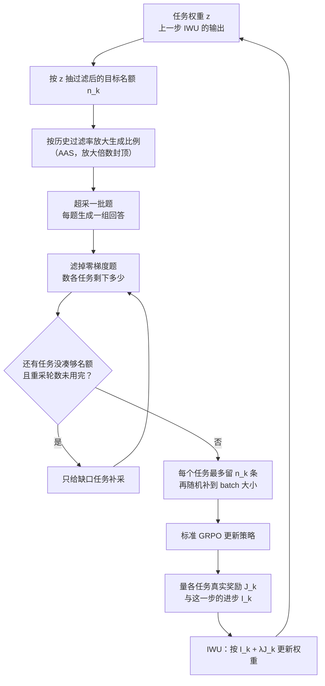

# 权重写在采样前，梯度份额发生在过滤后：MT-GRPO 怎样保住最差的那一项

<!-- release-date: 2026-02-05 -->

> 本文依据 **Multi-Task GRPO: Reliable LLM Reasoning Across Tasks**，arXiv:2602.05547v3，2026-08-05，共 30 页，ICML 2026 录用稿（PMLR 306）。页码均指这份 PDF 自身的页码。作者来自 UCL、华为诺亚方舟实验室、UNIST、爱丁堡大学与巴塞尔大学，通讯作者在 UCL（PDF p. 1）；按工业实验室归属放在 Huawei 目录下。文中区分三件事：**论文明确写了什么**、**我们怎么解释它**、**哪些是外部资料或本文推算**。

## 读前先把几个词说成人话

这篇是算法论文，没有新模型架构，也没有预训练配方。它只回答一个问题：把 GRPO 直接拿去同时训几个推理任务，为什么平均分好看、最差那项却掉队，以及怎么拧回来。

会反复出现的词：

- **可验证奖励强化学习（Reinforcement Learning with Verifiable Rewards，RLVR）**：对错由程序判定的 RL 后训练，不另训奖励模型。DeepSeek-R1 一篇是这条路的基模例子。
- **GRPO（Group Relative Policy Optimization，组相对策略优化）**：同一道题采一组回答，用组内均值和标准差把奖励变成优势（advantage），不训价值网络。出处见 DeepSeekMath 一篇。
- **零优势题 / 零梯度题**：一组回答奖励全相同，组内优势全是 0，这道题对参数更新没有贡献（PDF p. 3）。
- **动态采样（dynamic sampling）**：DAPO 的做法，把零梯度题滤掉、再补采，凑满一个「有对有错」的 batch。来龙去脉见 DAPO 一篇。
- **任务权重 $z$**：下一步从每个任务抽多少题的概率向量。均匀就是每个任务 $1/K$。
- **最差任务准确率（worst-task accuracy）**：所有任务准确率里最小的那个。本文的主指标，平均准确率只作对照（PDF p. 7）。

实验任务都是单次作答、程序可判的推理题（PDF p. 6）：**Countdown** 用 3–5 个整数做四则运算凑出目标值；**Zebra** 按文本约束给 3–5 个实体填属性；**ARC** 是字符串版的抽象推理，给 3 个输入输出例子，归纳变换规则再作答，串长 10、20、30 对应难度。

这篇是 **Multi-Task** GRPO，不是多轮（multi-turn）GRPO。多轮智能体的多任务 RL 见 AgentRL 一篇，那边对齐的是各环境优势的尺度；本篇对齐的是过滤后真正进梯度的样本比例，并显式优化最差任务。

## 一句话先说清

最直接的多任务做法，是把几个任务的题均匀混进同一个 GRPO batch，最大化平均奖励。论文指出这条路有两个漏洞，而且会互相放大（PDF p. 1–3）：

1. **平均目标允许牺牲最差任务**。某项暴涨可以抵消另一项停滞，均值看不出来。
2. **零梯度率在任务之间差很远**。滤掉零梯度题之后，真正进梯度的比例不再等于写在权重里的比例——你特意给弱任务加的权重，会在过滤口被改写掉。

图引自 PDF p. 2 的 Figure 1。上排是病，下排是药：权重按「准确率 + 进步」自适应，采样器保证权重过滤后仍然成立。图上的柱值是示意，和后文 Figure 4、Figure 20 的逐任务数不完全对应，读结构不读数。

对应两招：

> **权重不盯 GRPO 损失，改盯真实任务奖励和这一步有没有进步；名额不定在生成前，而定在滤掉零梯度题之后。**

摘要给的结论是（PDF p. 1）：3 任务与 9 任务设定上，最差任务准确率相对标准 GRPO 绝对提升 16–28 个百分点、相对 DAPO 提升 6 个百分点，平均准确率保持有竞争力；3 任务设定里到达 50% 最差任务准确率的步数少一半。这几个数字分别出自哪次实验、分母是什么，实验一节会拆开。

### 一条阅读路线

1. **p. 2 的 Figure 1、p. 3 的两条局限**：先看清病在哪。
2. **p. 4 的式 (5) 与 Figure 2**：严格按最差任务加权为什么会振荡。
3. **p. 5 的 Algorithm 1 与 Subroutine 1**：改进感知权重更新（IWU）。
4. **p. 6 的 Figure 3 与第 5 节、p. 28 的 Algorithm 2**：保比例采样器。
5. **p. 7–9 的 Figure 4–8**：三组实验。
6. **p. 22–26 的附录 D**：消融、顺序训练、墙钟。其中 p. 25 的 Figure 16 与 p. 26 的 Table 1 最值得看。

附录 C 的推导（p. 17–21）第一次可以只看结论。

## 主要矛盾：平均分好看，最差任务被过滤悄悄拿走

### 第一层：平均目标没有任务级鲁棒性

标准多任务目标是 $K$ 个任务的 KL 正则期望奖励取平均（PDF p. 2，式 1–2）：

$$
\max_{\theta}\;J_{\mathrm{avg}}(\theta)=\frac{1}{K}\sum_{k=1}^{K}J_k(\theta)
$$

$J_k(\theta)$ 是策略在任务 $k$ 上的期望奖励减去 KL 惩罚。均值有一个结构性许可：强项的涨幅可以替弱项的停滞买单。论文的例子很直白：一个竞赛数学很强、基本逻辑推理很弱的模型，基准分数好看，部署时并不可靠（PDF p. 1、p. 3）。

### 第二层：零梯度率不同，权重写了也不算

图引自 PDF p. 6 的 Figure 3。图注只说 ARC 的比例远高于 Zebra，没有写是哪一种方法的训练过程。

GRPO 的组内归一化让「全对」和「全错」的题都没有梯度。DAPO 在单任务里的修法是滤掉再补采（PDF p. 3）。进了多任务，同一条规则变成了另一件事：过滤后的 batch 会偏向零梯度更少的任务；当弱任务被显式加权时，实现出来的梯度贡献会大幅偏离预定比例，让它们继续欠优化（PDF p. 3）。

**我们用一个粗算说明偏差有多大。** 按 Figure 3 后段的读图约值，ARC、Countdown、Zebra 的零梯度率约为 0.85、0.65、0.35，存活比例约为 0.15、0.35、0.65。均匀权重各 1/3，过滤后的实际占比约为 13%、30%、57%。名义上三家平分，实际 ARC 只拿到七分之一左右。这是本文推算，不是论文数字；论文自己的实测见后文 Figure 6 与 Figure 12。

### 第三层：GRPO 损失不能当任务成绩单

分布鲁棒优化和多任务学习里，常见做法是谁损失大就给谁加权（PDF p. 4）。前提是损失能代表这个组现在有多差。

GRPO 的目标是概率加权的优势。一组全错和一组全对，这项值都可以是零（PDF p. 4）。对更新参数来说无所谓，没有区分度就不更新；对比较任务来说是致命的：**完全失败的任务和已经学满的任务，在 GRPO 损失上可以无法区分**。论文说据他们所知，这个问题先前没有被讨论过，因为它来自现代 LLM 后训练里 GRPO 式目标特有的结构（PDF p. 4）。

于是三层合成一个矛盾：

> 要保住最差任务，必须按任务表现加权；可 GRPO 损失认不出谁最差，而按权重抽的题又会在过滤时被重新分配。加权信号和加权执行两头都漏。

## 先看全景：一步训练里转了两个环

按 PDF p. 5 的 Algorithm 1、Subroutine 1 与 p. 28 的 Algorithm 2 重画，是控制流示意，不是实测时间轴。上半圈是「采到的样本和权重一致」，下半圈是「权重跟着任务表现走」。

实现上，全部实验跑在 verl 上（PDF p. 27），即 HybridFlow 一篇那套框架。HybridFlow 管的是多个模型之间谁发号施令；本篇管的是进了这口锅之后，多个推理任务的梯度份额怎么分。

## 核心设计一：目标从「平均」改成「平均，但任务之间不能差太远」

### 新设计：带差距约束的目标

论文先把两个愿望写成约束优化（PDF p. 3，式 4）：平均奖励尽量高，且任意两个任务的奖励差不超过 $\varepsilon$。$\varepsilon=0$ 强制各任务表现相等，$\varepsilon$ 越大越接近普通平均。

为了能优化，拉格朗日改写成对任务分布 $z$ 的 max–min 代理（PDF p. 4，式 5）：

$$
\max_{\theta}\;\min_{z\in\Delta_K}\;\sum_{k=1}^{K}z_k\,J_k(\theta)+\varepsilon\,\Omega(z),
\qquad
\Omega(z)=\tfrac12\Bigl\lVert z-\tfrac1K\mathbf 1\Bigr\rVert_1
$$

$\Delta_K$ 是 $K$ 个任务上的概率单纯形。内层替对手挑一个最坏的任务分布，$\Omega(z)$ 惩罚它偏离均匀多远；附录 C.1 用最小流论证这个正则恰好是到均匀分布的 $\ell_1$ 距离的一半（PDF p. 17–18，式 28）。

### 工作机制：交替更新，按奖励低于均值的方向加权

令 $z=\mathrm{Softmax}(\xi)$，在 logits $\xi$ 上做无约束梯度下降。策略用 $z$ 加权的 GRPO 梯度更新；权重的梯度是（PDF p. 4，式 6–7）：

$$
(g_t)_k=z_{k,t}\Bigl(J_k(\theta_t)-\sum_{j=1}^{K}z_{j,t}\,J_j(\theta_t)\Bigr),
\qquad
\xi_{t+1}=\xi_t-\beta\,g_t
$$

奖励低于当前加权平均的任务，$g$ 为负，logit 上升，下一步抽得更多。注意这里用的是真实任务奖励 $J_k$，不是 GRPO 损失——这是对第三层矛盾的直接回应（PDF p. 4）。

### 代价：严格按最差任务加权会振荡

图引自 PDF p. 4 的 Figure 2。$\varepsilon=0$ 时，固定 $\theta$ 的内层最优解是独热分布：全部质量给当下最差的任务；Softmax 的指数映射又把这个趋势放大（PDF p. 4–5）。结果是权重在「当前最差」之间来回跳，非最差任务被系统性欠优化。论文把它当反面教材，不是最终算法。

**可迁移启发：** 把「别丢下最差任务」写进目标，比事后看平均分老实。但严格 minimax 在任务轮流垫底时会振荡；真正能用的是带松弛的版本。

## 核心设计二：改进感知权重更新，别只追当前最差

### 旧问题：只看绝对奖励，分不清「差但在变好」与「差且停了」

低奖励但进步很快的任务，不必一直加权；奖励相近、却不再从更新里获益的任务，才更该加（PDF p. 5）。只用绝对奖励，前者会被反复加权，后者得不到区别对待。

### 新设计：进步量加 $\lambda$ 倍奖励

**改进感知权重更新（Improvement-aware Weight Update，IWU）**。每一步做完策略更新后，量每个任务的 GRPO 目标变了多少（PDF p. 5，式 8）。这个进步量的定义借自多任务学习里的 FAMO（Liu 等人，NeurIPS 2023）：

$$
I_k^{(t)}=J_{\mathrm{GRPO},k}(\theta_{t+1})-J_{\mathrm{GRPO},k}(\theta_t)
$$

然后用组合信号替换上一节梯度里的 $J_k$（PDF p. 5，Subroutine 1 第 3–5 行）：

$$
s_k^{(t)}=I_k^{(t)}+\lambda\,J_k(\theta_t),\qquad
(g_t)_k=z_{k,t}\Bigl(s_k^{(t)}-\sum_{j}z_{j,t}\,s_j^{(t)}\Bigr),\qquad
\xi_{t+1}=\xi_t-\beta\,g_t
$$

$s_k$ 低于加权平均的任务被加权：它要么现在差，要么这一步没动，要么两样都占。$\lambda$ 大，接近严格最差任务最大化；$\lambda$ 小，更强调各任务都要有进步（PDF p. 5）。

论文说 $\lambda$ 的角色「类似」式 5 里的 $\varepsilon$。两者方向相反，别记混：$\varepsilon$ 越大越接近平均，$\lambda$ 越大越盯最差任务。类比的是「有一个折中旋钮」。

### 它从哪来

附录 C.3 从一个单步 minimax 推出这条规则（PDF p. 19–21）：把策略更新方向 $d_t$ 也当成变量，用一阶泰勒展开把进步写成 $I_k\approx\gamma_t\langle\nabla_\theta J_{\mathrm{GRPO},k},d_t\rangle$（式 32），解出最优方向是 $z$ 加权的任务梯度，回代后 $z$ 的梯度正好是「方向与任务梯度的内积 $+\lambda J_k$」（式 39）。算任务梯度两两内积又贵又噪，于是用实测的 $I_k$ 替代，只沿这个代理信号走一步。

**我们如何解释它。** 这里有两个量来自两个源：绝对水平用真实奖励 $J_k$，相对变化却用 GRPO 目标的差分 $I_k$。论文拒绝拿 GRPO 损失当成绩单，却拿它的差分当进步——差分只在「这一步有没有动」上有意义，饱和的任务两头都不动，$I_k\approx 0$，此时权重主要由 $\lambda J_k$ 决定，这正是想要的行为。但论文没有量过这个差分近似的误差。

### 实现细节与没说清的地方

附录 E（PDF p. 28）：权重初始化为均匀；更新用当前 batch 的奖励；logit 的梯度步用 AdamW 实现，学习率 0.025，权重衰减实验 1 为 $10^{-5}$、实验 2 为 $10^{-4}$。原文还写「改进量被裁到 $\{0.1, 0.2\}$ 以保稳定」，没有说明这是一个区间、两档阈值还是分实验的取值，也没有消融。

$\lambda$ 没有默认值：实验 1 用 0.2 与 0.25，实验 2 用 0.1、0.3、0.9、1.2，Qwen2.5-7B 用 0.05 与 0.2，OLMo-3 用 0.5（PDF p. 7–9、p. 22、p. 27–28）。任务集合一变，折中点就要重扫。

**可迁移启发：** 多任务加权至少要两个信号——现在有多差，以及这一步动没动。只有前者，优化器围着当前最差打转；把前者向均匀正则，又等于放弃加权（附录 F 的实验在后文）。

## 核心设计三：保比例采样，让权重变成真的梯度份额

### 旧问题：$z$ 是意图，过滤后的 batch 才是事实

图引自 PDF p. 8 的 Figure 6。先看右下两格：基线的 ARC 权重是 1/3，过滤后在 batch 里的实际占比明显更低——这就是第二层矛盾的实测版。再看左下：大约 50 步后 Countdown 反超 Zebra，MT-GRPO 随即把权重从 Countdown 挪走；DAPO 和 SEC-DAPO 在 Countdown 已经很高之后仍给它三分之一上下的权重（PDF p. 7）。

### 新设计：名额定在过滤之后

**保比例采样器（Ratio-Preserving Sampler，RP sampler）**，全文在附录 Algorithm 2（PDF p. 28），正文第 5 节给了要点（PDF p. 6）。全景图里的上半圈就是它，关键是三步：

1. **先定过滤后的名额**：$(n_1,\ldots,n_K)\sim\mathrm{Multinomial}(B,z)$，$n_k$ 是最终 batch 里任务 $k$ 应有的「有信号」样本数，不是生成前的名额。
2. **按接受率提前多采**：维护各任务的历史过滤率 $\rho_k$，把生成分布放大：

   $$
   m_k=\min\Bigl\{\frac{1}{1-\rho_k},\,M_{\mathrm{acc}}\Bigr\},\qquad
   \hat z_k=\frac{z_k\,m_k}{\sum_j z_j\,m_j}
   $$

   过滤率 0.8 的任务放大 5 倍，封顶 $M_{\mathrm{acc}}$。按 $\hat z$ 超采 $M_{\mathrm{os}}B$ 道题生成、过滤。论文把这一步叫**接受感知采样（Acceptance-Aware Sampling，AAS）**。
3. **缺多少补多少，最后截取**：数各任务过滤后剩的 $c_k$，缺口 $\max\{n_k-c_k,0\}$ 乘放大系数作为补采分布，直到凑齐或用完 $N_{\mathrm{rs}}$ 轮。若总数超过 $B$，每个任务最多留 $n_k$ 条，再从剩下的里随机补到 $B$。

实验超参（PDF p. 28）：$M_{\mathrm{os}}=3$，$M_{\mathrm{acc}}=5$；最多重采 $N_{\mathrm{rs}}$ 轮，实验 1 是 10，实验 2 是 2。

**正确性来自第 3 步的截取，效率来自第 2 步的放大。** 没有 AAS，高过滤率任务会逼出一轮又一轮重采；Figure 16 最右格显示去掉 AAS 后平均重采轮数更高（PDF p. 25）。

正文第 5 节有一处笔误：写「$z$ 是来自 Subroutine 2 的任务权重」（PDF p. 6）。主算法用的是 Subroutine 1（IWU）；Subroutine 2 是附录 F 的对照。按 Algorithm 1 理解即可。

### 收益：加权补偿不了过滤偏差

按 PDF p. 22 与 p. 25 的正文数字重画。三行是同一个问题的三次尝试：

- 只加权不保比例，权重和实际占比差了将近一半（PDF p. 22–23，Figure 12）；
- 保留过滤与重采、只拿掉比例约束，IWU 会自己把 ARC 权重抬高来「补偿」，可实际占比反而更低，ARC 准确率也更低（PDF p. 25，Figure 16）；
- 加上比例约束，权重就是份额。

论文的原话是：强制保比例约束，才是把意图的权重变成实际梯度贡献的那一步（PDF p. 25）。反过来看，Figure 13 固定均匀权重、只开保比例采样器，三个任务的过滤后占比都在 1/3 附近晃，尽管零梯度率差很远（PDF p. 24）。

### 代价：每步多采一成

对照同样做超采与过滤的 DAPO，实验 1 里 MT-GRPO（$\lambda=0.2$）每步平均 727 秒对 659 秒，多 67 秒、慢 10.2%（PDF p. 26，Figure 18）。原因是重采：DAPO 全程一轮生成就够，MT-GRPO 随过滤率上升走到约 2–2.25 轮。墙钟总账见实验一节末尾。

**可迁移启发：** 任何「先加权、再按有没有信号过滤」的流水线，权重都会在过滤口被改写。修法不是再加大权重，而是把配额定义在过滤之后。接受率估计只是为了少重采，不是为了正确性。

## 实验怎么证明

### 设定

| 项 | 实验 1 | 实验 2 | 实验 3 |
|---|---|---|---|
| 基座 | Qwen2.5-3B base | Qwen2.5-3B base | Qwen2.5-7B；OLMo-3-7B-Instruct |
| 任务 | Countdown / Zebra / ARC 中等难度 | 三族 × 易中难，共 9 个 | MATH + ARC + SciKnowEval（化学、物理）；SciKnowEval 四个科学域 |
| 每题回答数 | 72 | 8 | 未给 |
| 全局 batch / PPO minibatch | 32 / 8 | 256 / 64 | 未给 |
| 过滤规则 | 严格：全对或全错都滤掉 | 宽松：组内奖励不是常数即保留 | 未给 |
| 训练步数 | 720 | 720 | 150 |
| MT-GRPO 的 $\lambda$ | 0.2、0.25 | 0.1、0.3、0.9、1.2 | 0.05、0.2；OLMo 为 0.5 |

来源：PDF p. 6–9、p. 22、p. 27–28。共同设置（PDF p. 27）：verl 框架，两张 NVIDIA H200（141 GB）；vLLM 采样，温度 1.0；KL 系数 0；提示最长 1024、回答最长 4096 Token；AdamW，学习率 $10^{-6}$，betas (0.9, 0.99)；每个全局步做 4 次策略更新。MT-GRPO 与 DAPO 都用 DAPO 的 clip-higher，裁剪上界 0.28。奖励沿用 SEC 论文的协议：答对 1.0，格式对但答错 0.1，否则 0。

实验 2 把每题回答数从 72 砍到 8、把过滤改松、把重采预算从 10 轮砍到 2 轮，原文给的理由是任务更多、算力受限（PDF p. 27–28）。两组实验的绝对准确率不能横比。

四个基线（PDF p. 6–7）：**GRPO**（任务均匀）；**SEC-GRPO**（Self-Evolving Curriculum，按绝对优势更大的任务加权）；**DAPO**（任务均匀 + clip-higher + 动态采样）；**SEC-DAPO**（两者叠加）。

指标除最差任务与平均准确率外，还有「相对 DAPO 的平均逐任务相对变化」：各任务相对 DAPO 的涨跌幅除以 DAPO 在该任务上的准确率，再取平均（PDF p. 7、p. 27）。分母是各任务自己的准确率，所以弱任务上的涨幅被放大。

### 实验 1：三个中等难度任务

Figure 4 的柱值，加上附录 Figure 20 给出的逐任务准确率（PDF p. 7、p. 30）：

| 方法 | 最差任务 | 拖后腿 | 平均 | 相对 DAPO | ARC | Countdown | Zebra |
|---|---:|---|---:|---:|---:|---:|---:|
| SEC-GRPO | 24.6 | ARC | 51.0 | $-24.6$ | — | — | — |
| GRPO | 30.3 | ARC | 52.0 | $-22.3$ | — | — | — |
| SEC-DAPO | 45.8 | ARC | 61.8 | $-5.5$ | 45.8 | 85.2 | 54.3 |
| DAPO | 52.6 | Zebra | 65.2 | 0.0 | 54.7 | 88.2 | 52.6 |
| MT-GRPO $\lambda=0.2$ | 57.5 | Zebra | 67.2 | $+5.8$ | 64.8 | 79.2 | 57.5 |
| MT-GRPO $\lambda=0.25$ | **58.8** | Zebra | 66.9 | $+5.1$ | 61.6 | 80.3 | 58.8 |

单位是百分比。GRPO 与 SEC-GRPO 的逐任务数原文没有给。

读表要知道三件事：

- **摘要的数字从这里来**：$58.8-30.3=28.5$ 是「相对 GRPO 28 个百分点」那一端，$58.8-52.6=6.2$ 是「相对 DAPO 6 个百分点」。
- **钱从哪里挪来的**：相对 DAPO，MT-GRPO 在 Countdown 上让出约 8–9 个百分点，换来 ARC 高 7–10 个、Zebra 高 5–6 个。平均分没有为最差任务让路，反而略高。
- **SEC 比均匀更差**：SEC-GRPO 的最差任务 24.6，低于均匀 GRPO 的 30.3。按「绝对优势大」排课，会把信号强、好学的任务排在前面，方向正好和 MT-GRPO 相反。

$\lambda=0.25$ 最差任务更高、$\lambda=0.2$ 平均更高，和 IWU 的设计一致（PDF p. 7）。

**到达阈值的步数。** Figure 5 没有标柱值，下表是我们的读图约值，只作量级参考（PDF p. 7）：

| 方法 | 到 30% | 到 40% | 到 50% |
|---|---:|---:|---:|
| GRPO | 约 320 | 未达到 | 未达到 |
| SEC-GRPO | 未达到 | 未达到 | 未达到 |
| SEC-DAPO | 约 270 | 约 450 | 未达到 |
| DAPO | 约 140 | 约 270 | 约 540 |
| MT-GRPO $\lambda=0.2$ | 约 60 | 约 110 | 约 230 |
| MT-GRPO $\lambda=0.25$ | 约 80 | 约 140 | 约 260 |

「到 50% 少 50% 的步数」对应的是 DAPO 约 540 步对 MT-GRPO 约 230–260 步；其余基线在 720 步预算内根本没到 50%。

### 实验 2：九个任务，$\lambda$ 的折中变得刺眼

Figure 7 上排（PDF p. 8）：

| 方法 | 最差任务 | 拖后腿 | 平均 | 相对 DAPO |
|---|---:|---|---:|---:|
| GRPO | 30.4 | ARC-hard | 56.0 | $-20.7$ |
| SEC-GRPO | 34.3 | ARC-hard | 59.2 | $-15.7$ |
| SEC-DAPO | 40.5 | ARC-hard | 66.7 | $-3.9$ |
| DAPO | 40.9 | Zebra-hard | 68.7 | 0.0 |
| MT-GRPO $\lambda=0.1$ | 40.4 | Zebra-hard | **69.5** | $+1.7$ |
| MT-GRPO $\lambda=0.3$ | 42.1 | Zebra-hard | 66.0 | $-2.8$ |
| MT-GRPO $\lambda=0.9$ | 44.3 | Zebra-hard | 63.9 | $-5.4$ |
| MT-GRPO $\lambda=1.2$ | **46.3** | Zebra-hard | 61.7 | $-7.7$ |

正文写 $\lambda=1.2$ 时最差任务「相对 GRPO 高 16%、相对 DAPO 高 6%」（PDF p. 7）。按图上数字：$46.3-30.4=15.9$，$46.3-40.9=5.4$。**所以摘要里的 16–28 不是一个区间估计，而是 9 任务约 16、3 任务约 28 这两端；「相对 DAPO 6 个点」在 3 任务是 6.2，在 9 任务实为 5.4。**

折中在这里一目了然：$\lambda=0.1$ 平均最高，最差任务却略低于 DAPO；$\lambda=1.2$ 最差任务最高，平均比 DAPO 低 7 个点。摘要说「在最差任务上一致优于基线」，严格说对 $\lambda=0.1$ 的这一格不成立。

Figure 7 下排按难度拆开相对变化（PDF p. 8）：$\lambda=0.1$ 在 easy 档是 $-2.7$、hard 档是 $+5.4$，小 $\lambda$ 更看重「进步慢」，而难任务恰恰学得慢，于是算力从易挪到难；$\lambda=1.2$ 则把力气集中到当前最差的 Zebra-hard，easy 档掉到 $-12.7$。

**顺序训练是天然对照。** 按任务族轮流训，每族 240 步，两种顺序（Countdown→Zebra→ARC 记 CZA，Zebra→ARC→Countdown 记 ZAC），GRPO 与 DAPO 各跑一遍（PDF p. 8、p. 24）。Figure 14（PDF p. 24）：

| 方法 | 最差任务 | 平均 |
|---|---:|---:|
| SEQ-GRPO CZA | 37.9 | 58.0 |
| SEQ-GRPO ZAC | 41.1 | 61.9 |
| SEQ-DAPO CZA | 39.4 | 63.7 |
| SEQ-DAPO ZAC | 36.6 | 65.0 |
| MT-GRPO $\lambda=1.2$ | **46.3** | 61.7 |

最强的顺序变体 41.1，低于联合训练的 MT-GRPO 46.3（PDF p. 8）。同一种算法换个顺序，最差任务就差约 3 个点；Figure 15 显示换族之后前一族的 hard 档准确率会掉（PDF p. 25）。论文的判断是：顺序训练要搜顺序、还会遗忘，部署上并不省事（PDF p. 24）。

这证明的是「在这九个变体上，联合加最差任务加权优于逐族专训」，没有给出遗忘的定量规律。

### 实验 3：换到 7B 和更不像的任务混合

**Qwen2.5-7B，MATH + ARC + SciKnowEval（化学、物理），150 步**，Figure 8（PDF p. 9、p. 22）：

| 方法 | 平均 | 最差任务（均为 ARC） |
|---|---:|---:|
| SEC-GRPO | 52.6 | 8.9 |
| GRPO | 55.4 | 15.0 |
| SEC-DAPO | 56.1 | 8.8 |
| DAPO | **58.3** | 25.0 |
| MT-GRPO $\lambda=0.05$ | 56.2 | 33.1 |
| MT-GRPO $\lambda=0.2$ | 51.8 | **37.6** |

$\lambda=0.2$ 的最差任务比 DAPO 高 12.6 个点；到达 DAPO 最终的 25.0%，MT-GRPO 用约 5.5 小时，DAPO 用约 13.3 小时，约少 60%（PDF p. 9）。代价同样清楚：两档 MT-GRPO 的平均分都低于 DAPO，$\lambda=0.2$ 低 6.5 个点。异构混合上，最差任务涨得更多，平均分让得也更多。

**OLMo-3-7B-Instruct，只在 SciKnowEval 的生物、化学、物理、材料四个域上训 150 步，$\lambda=0.5$**，Figure 9（PDF p. 22）：

| 方法 | 平均 | 最差任务 |
|---|---:|---|
| SEC-GRPO | 47.4 | 39.0（生物） |
| GRPO | 41.1 | 33.8（物理） |
| SEC-DAPO | 45.9 | 32.0（生物） |
| DAPO | 46.2 | 30.8（生物） |
| MT-GRPO $\lambda=0.5$ | **52.7** | **45.8**（生物） |

注意口径：这张表取的是每个方法「最差任务最好的那一步」，不是最后一步，因为若干基线先升后降（PDF p. 22）。这个口径对基线是宽松的；即便如此 MT-GRPO 仍然更高，而且 Figure 9 右格里它的最差任务曲线没有那截回落。论文没有同时给最后一步的表。

### 消融：两块缺一不可

实验 1（Figure 10，PDF p. 23）与实验 2（Figure 11，PDF p. 23）。GRPO_IWU 只开权重更新，GRPO_RPS 只开保比例采样、权重固定均匀：

| 变体 | 实验 1 最差 | 实验 1 平均 | 实验 2 最差 | 实验 2 平均 |
|---|---:|---:|---:|---:|
| GRPO | 30.3 | 52.0 | 30.4 | 56.0 |
| 只有 IWU | 41.9 | 43.9 | 35.7 | 50.3 |
| DAPO | 52.6 | 65.2 | 40.9 | 68.7 |
| 只有保比例采样 | 54.6 | **68.9** | 36.6 | 66.1 |
| MT-GRPO（两者都开） | **58.8** | 66.9 | **46.3** | 61.7 |

只有 IWU 的一行用 $\lambda=0.25$（实验 1）与 $\lambda=1.2$（实验 2）；MT-GRPO 行取两实验最差任务最好的那一档。

- **只加权**：最差任务涨了，平均分大跌，因为权重进不了梯度（上一节的 0.80 对 0.45）。
- **只保比例**：实验 1 里两项都超过 DAPO，相对 DAPO 的变化 $+6.5$ 甚至高于完整 MT-GRPO 的 $+5.1$–$+5.8$；可到了 9 任务，它的最差任务 36.6 连 DAPO 的 40.9 都不到。
- **任务一多，均匀加保比例不够，权重必须跟着最差任务走；任务一偏，加权又必须靠保比例落地。**

**正则化能不能代替进步信号？** 附录 F 把 IWU 和「只用奖励、给 logits 加 $\ell_2$ 收缩」的 Subroutine 2 比（PDF p. 29–30）。收缩写成 $\xi_{t+1}=\xi_t-\beta(g_t+\eta\,\xi_t)$。Figure 20、21 的读数：

| 设定 | 变体 | 最差任务 | 平均 |
|---|---|---:|---:|
| 实验 1 | 收缩 $\eta=10^{-5}$ | 51.7（Countdown） | 55.5 |
| 实验 1 | 收缩 $\eta=5\times10^{-4}$ | 58.7（ARC） | 64.1 |
| 实验 1 | 收缩 $\eta=10^{-2}$ | 58.4（Zebra） | **69.7** |
| 实验 1 | MT-GRPO $\lambda=0.25$ | **58.8** | 66.9 |
| 实验 2 | 收缩 $\eta=10^{-5}$ | 39.1 | 55.5 |
| 实验 2 | 收缩 $\eta=5\times10^{-4}$ | 43.9 | 64.7 |
| 实验 2 | 收缩 $\eta=10^{-2}$ | 38.8 | 67.6 |
| 实验 2 | MT-GRPO $\lambda=1.2$ | **46.3** | 61.7 |

弱收缩仍会塌成独热、忽略 Countdown。实验 1 里强收缩的最差任务和 IWU 相近、平均更高，但多出来的分主要来自最容易的 Countdown（90.5），ARC 60.1 不如 IWU $\lambda=0.2$ 的 64.8。实验 2 里中等收缩的最差任务高过基线、仍低于 IWU；再加大收缩，最差任务掉到 DAPO 以下，平均也没超过 DAPO（PDF p. 29–30）。论文的结论：**收缩能防塌缩，却不能可靠地把力气分给欠优化的任务。**

### 墙钟：每步更贵，到达阈值更快

实验 1，两张 H200。所有方法放在 GRPO 跑完 720 步所用的 80 小时预算上比，Table 1（PDF p. 26）：

| 方法 | 80 小时平均 | 80 小时最差任务 | 到 40% 最差任务 | 到 50% 最差任务 |
|---|---:|---:|---:|---:|
| GRPO | 53.7 | 34.5 | 未达到 | 未达到 |
| DAPO | 59.4 | 43.2 | 49.2 小时 | 98.0 小时 |
| MT-GRPO $\lambda=0.2$ | **60.6** | **53.6** | **17.6 小时** | **38.6 小时** |

每步慢 10.2%，到 50% 最差任务的总时间却不到 DAPO 的四成。Figure 19 把准确率画成墙钟小时的函数，结论同向（PDF p. 27）。原因是弱任务更早拿到有效梯度，省下的步数远多于每步多花的重采。

## 限制、笔误和没写的东西

论文自己划了两条（PDF p. 9）：

1. 鲁棒性只针对**训练混合内部**的任务。混合之外的任务会不会也被带起来，是未来工作。实验 3 的 MATH 和 SciKnowEval 仍在训练混合里，不是分布外评测。
2. 流水线依赖可验证奖励，权重更新在这种奖励下才可靠；偏好、开放写作这类不可验证领域没有刻画。

读完全文我们认为还要记住的：

- **数据规模两处写法打架**：第 6 节写每个难度 1 万条训练、200 条评测（PDF p. 6）；附录 E 写每个变体 1000 条训练、200 条测试（PDF p. 27）。
- **附录 E 写「全部实验用 Qwen-2.5-3B」**（PDF p. 27），与实验 3 的 7B 矛盾；实验 3 的回答数、batch 与过滤规则没有单独交代。
- **第 5 节把权重来源写成 Subroutine 2**（PDF p. 6），应为 Subroutine 1。
- **「相对 DAPO 6 个点」在 9 任务上实为 5.4**，$\lambda=0.1$ 那一档最差任务还略低于 DAPO（PDF p. 7–8）。
- **改进量用 GRPO 目标差分近似，再裁到 $\{0.1, 0.2\}$**，没有误差分析，也没有说明裁剪的确切含义。
- **单次运行**：没有报告随机种子方差，柱上数字按单次运行理解更稳妥。
- **算力裁剪没有单独消融**：9 任务把回答数从 72 砍到 8、重采从 10 轮砍到 2 轮、过滤改松，这些对最差任务的影响没有拆开。
- 只到 3B 与 7B；没有工具使用、多轮环境，也没有代码类任务。

Impact Statement 说方法专为增强推理而设计，「因此不预期任何不道德应用」（PDF p. 10）。这是作者立场，不是被论证的结论。

## 可迁移启发

1. **多任务 GRPO 的第一偏差往往不在损失，在过滤。** 零梯度题在单任务里是浪费，在多任务里是重新分配发言权。任何先加权、再按「有没有信号」过滤的流水线，都该在过滤之后核对一次实际比例。
2. **配额定义在过滤之后。** 加权重补偿不了过滤偏差，只会越补越偏（0.63 的权重换来 0.36 的份额）。接受率估计是为了省重采，截取才是为了正确。
3. **不要用组内相对的损失比较任务。** 全对和全错都会让组内优势消失。比较任务要用真实奖励，或至少用一个在两端行为不同的量。这条对所有组内相对的目标都成立，不限于 GRPO。
4. **严格最差任务会振荡，进步信号是便宜的阻尼。** 独热追逐当前最差，会饿死已经会的任务。向均匀收缩也能止振，但会把加权目标本身稀释掉。若只能改一处，先加进步信号。
5. **$\lambda$ 是产品决策。** 小 $\lambda$ 保平均、照顾进步慢的难任务；大 $\lambda$ 保最差、平均让路。上线前先定「最差不许低于多少」，再扫 $\lambda$。
6. **每步开销要用到达阈值的时间来摊。** 只报 step time 或只报最终分都会误判；把「到某个最差任务阈值的墙钟」算进去。
7. **和 DAPO、AgentRL 不在同一层。** DAPO 修单任务的零梯度浪费与裁剪默认；本篇把它的过滤变成必须受配额约束的对象。AgentRL 修多轮轨迹与跨环境优势尺度；本篇没有多轮环境，也不做按任务的优势标准化。两边的涨幅都不能当「多任务 RL 的通用涨幅」。

## 关键词回看

- **MT-GRPO**：在 GRPO 上加改进感知任务加权与保比例采样，目标是最差任务别掉队。
- **最差任务准确率**：各任务准确率的最小值，本文主指标。
- **零梯度题**：一组回答奖励全相同，对参数没有贡献；多任务里它们的出现率会改写梯度份额。
- **任务权重 $z$ 与名额 $n_k$**：前者是意图，后者是过滤后 batch 里的实际人数；保比例采样让二者一致。
- **IWU**：用进步 $I_k$ 加 $\lambda$ 倍真实奖励更新权重，避免独热追逐当前最差。
- **$\lambda$ 与 $\varepsilon$**：都是鲁棒与平均的旋钮，方向相反：$\lambda$ 越大越盯最差，$\varepsilon$ 越大越接近平均。
- **RP sampler 与 AAS**：先定过滤后名额，按 $1/(1-\rho_k)$ 放大生成，缺口补采，超额截取。
- **SEC**：按绝对优势加权的课程方法，在本文设定里最差任务反而更差。
- **clip-higher**：DAPO 把裁剪上界单独抬高，本文 MT-GRPO 与 DAPO 都设为 0.28。

## 资料与阅读边界

- **本文依据**：arXiv:2602.05547v3（2026-08-05），30 页，ICML 2026（PMLR 306）。正文 p. 1–10，参考文献 p. 10–14，附录 A–F 为 p. 15–30。arXiv 共三版，v3 是最新版；v1 为 26 页，本文页码与表数均按 v3。
- **首发日**：`release-date` 取 2026-02-05，即 arXiv v1 的提交日（11:06 UTC），v1 摘要已给出官方代码仓库 [rsshyam/MT-GRPO](https://github.com/rsshyam/MT-GRPO) 的链接。该仓库的首个提交 `16f432d` 带数据与实验脚本，时间是 2026-02-04 15:00 UTC，但当时仓库是否已公开可见没有直接证据，互联网档案馆最早的快照是 2026-02-06，所以不取 02-04。
- **外部补充**（不是 PDF 原文）：FAMO 为 Liu 等人 NeurIPS 2023 的多任务优化方法，SEC 为 Chen 等人 arXiv:2505.14970，ReasoningGym 为 arXiv:2505.24760，均按 PDF 参考文献核对。仓库 README 写明在 verl 上改编；本文没有阅读仓库源码，也没有把仓库里的实现当作论文结论。
- **未公开或无法核实**：训练集每档究竟是 1000 还是 1 万条；实验 3 的训练超参；改进量裁剪的确切含义；随机种子方差；算力裁剪的单独影响；训练混合之外的泛化；不可验证奖励；更大规模。
- **跨篇参考**：GRPO 出处见 DeepSeekMath；规则奖励推理 RL 见 DeepSeek-R1；零梯度过滤与 clip-higher 见 DAPO；verl 见 HybridFlow；多轮多任务智能体 RL 见 AgentRL。
