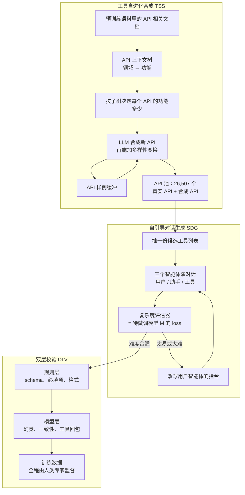
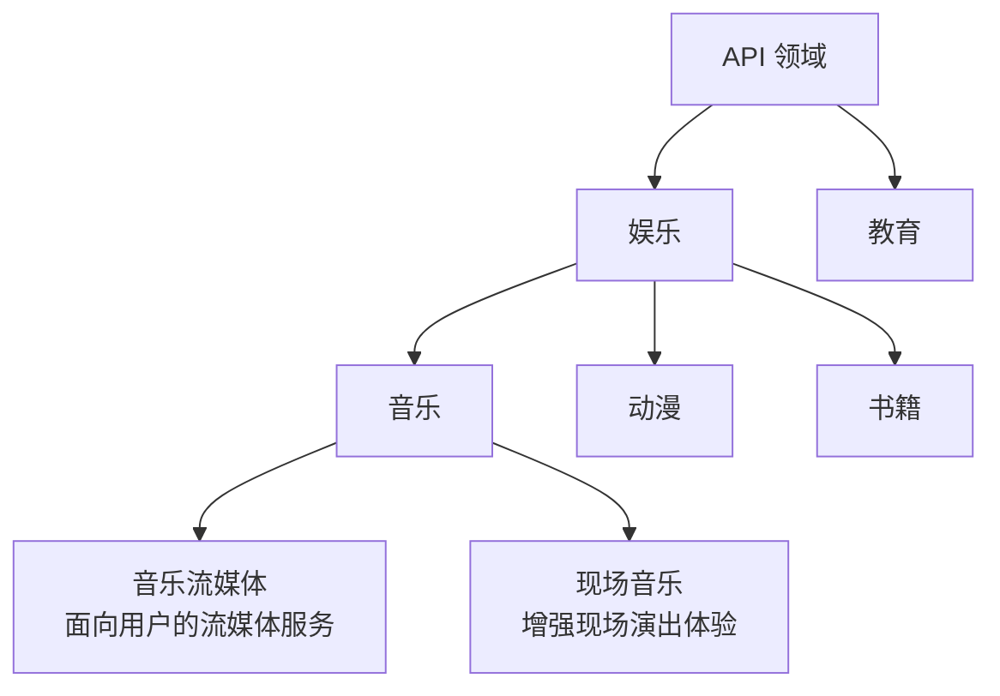

# 函数调用的泛化卡在工具池：ToolACE 先长出 26,507 个 API，再按学生自己的 loss 调难度

<!-- release-date: 2024-09-02 -->

> 本文依据本地 `papers/Huawei/ToolACE.pdf`，即 **ToolACE: Winning the Points of LLM Function Calling**，arXiv:2409.00920v2、2025-07-25 提交，ICLR 2025 会议版，共 23 页。页码均指 PDF 自身的页码。文中区分三件事：**论文明确写了什么**、**我们怎么解释它**、**哪些是外部资料或本文推算**。

## 读前先把几个词说成人话

这是一篇**数据合成论文**。它不发明新架构，也不讲预训练；它讲的是怎样自动造出一批让小模型学会调函数的训练数据。名字里的 ACE 就是它要同时满足的三件事：准确（Accurate）、复杂（Complex）、多样（divErse）。

先把会反复出现的词说清楚：

- **函数调用（function calling）**，也叫工具使用（tool use）：模型不直接回答，而是写出「调哪个函数、参数是什么」；外部系统去执行，再把返回值放回对话。论文把 API、工具、函数、插件当成同一件事（PDF p. 1 脚注 1）。
- **四种调用形态**：单次（一个函数一次）、并行（同一轮对同一个函数发多次、参数不同）、依赖（后一次要用前一次的返回值）、非工具（不该调就不调，缺参数就先追问）。论文生成的正是这四种对话（PDF p. 4）。
- **嵌套参数（nested）**：参数本身是结构体，例如「列表的列表」「字典的列表」（PDF p. 4）。
- **BFCL（Berkeley Function-Calling Leaderboard）**：本文的主战场，4,951 道题，其中单轮 3,951、多轮 1,000（PDF p. 14）。它的几个口径（PDF p. 15）：
  - **AST（Abstract Syntax Tree，抽象语法树）**：把模型写出的调用解析成树，对照标准答案查函数名、必填参数、类型和取值；
  - **Exec（可执行）**：真的执行这个调用，比对返回值；
  - **Relevance / Irrelevance（相关 / 无关）**：该调时调没调、不该调时忍没忍住；
  - **Overall**：全部子类准确率的未加权平均。
- **非直播（non-live）与直播（live）**：BFCL 里的两类单轮题。论文只交代了一句区别：直播题涉及的函数更少见、更复杂（PDF p. 18 脚注 4）。
- **API-Bank**：另一个评测，314 段对话、753 次调用，分 Call（工具已知直接调）、Retrieval+Call（工具未知先检索）、Plan+Retrieval+Call（连续规划）三档能力（PDF p. 15）。
- **LoRA（Low-Rank Adaptation，低秩适配）**：只训一小组低秩增量矩阵的参数高效微调。本文主模型就是这么训出来的。

## 一句话先说清

2024 年要让一个开源小模型学会调函数，训练数据只有两条路，两条都卡住了（PDF p. 1–2）：

1. **采真实日志**。函数调用连着第三方服务、内部系统和用户隐私，日志拿不到，标注更贵。
2. **拿公开 API 让大模型编对话**。Gorilla、ToolAlpaca、ToolLLM、xLAM 都走这条。公开 API 本身又少又窄，参数结构简单，编出来的对话也跟着窄；数据一复杂，编错的比例又上去。

ToolACE 把「工具」和「对话」拆成两步造，再补一道校验：

> 先不在现成 API 上编对话，而是从预训练语料里长出一个覆盖 390 个领域、26,507 个接口的 API 池；再让三个智能体演对话，并用**即将被微调的那个模型**自己的 loss 把难度调到「刚好够不着」；最后用规则加模型两层过滤编错的样本。

摘要的结论是：用这批数据训出的 8B 模型达到 SOTA，可与最新的 GPT-4 相比（PDF p. 1）。拆开看，它在 2024-09-20 那张 BFCL-v3 榜上总分排第 3，离第 1 名 GPT-4-turbo 只差 0.27；非直播可执行一列是全表最高；**多轮只有 14.37，是明显短板**（PDF p. 7）。

你能从这篇里拿走的，是一套「先扩对象空间、再对着学生调难度、最后按规格滤错」的数据配方。你拿不走的是全量数据（只公开了子集）、真实执行闭环（工具返回全是模拟的），以及多轮能力。

### 一条阅读路线

1. **p. 2 Table 1、p. 3 Figure 1**：现有数据缺什么，三个模块各补哪一处。
2. **p. 3–4 的 TSS**：API 池怎么长出来。
3. **p. 4–5 的式 (1) 与 Figure 2**：用学生的 loss 当难度计。
4. **p. 7 Table 2、Table 3**：总榜第 3 的真实构成。
5. **p. 8 Figure 3–5，p. 17–18 Table 6–8**：三条主张各有多少实验撑着。这一组比排行榜要紧。

## 主要矛盾：模型学到的工具世界，上限就是那份公开 API 清单

函数调用在真实应用里有三个麻烦（PDF p. 1）：API 更新很快，模型必须零样本认没见过的接口；用户需求含糊，经常要并行、依赖或多轮；一次调用必须精确，函数名、必填项、类型、取值错一个就跑不了。

已有的工具增强模型大多只练简单、单轮、扁平参数的调用，而且几乎都绑在公开 API 上（PDF p. 1–2）。Table 1 把各家数据的家底摆在一起（PDF p. 2）：

| 模型 | API 数 | 领域数 | 嵌套参数 | 并行 | 依赖 | 多类型（含不该调） |
|---|---:|---:|:---:|:---:|:---:|:---:|
| Gorilla | 1,645 | 3 | 否 | 否 | 否 | 否 |
| ToolAlpaca | 3,938 | 50 | 否 | 否 | 否 | 否 |
| ToolLLM | 16,464 | 49 | 否 | 否 | 是 | 否 |
| Functionary | 未公开 | 未公开 | 否 | 是 | 否 | 否 |
| xLAM | 3,673 | 21 | 否 | 是 | 否 | 否 |
| Granite | 未公开 | 未公开 | 否 | 是 | 否 | 是 |
| **ToolACE** | **26,507** | **390** | **是** | **是** | **是** | **是** |

「API 数」「领域数」量的是覆盖面，不是数据质量。ToolLLM 已有 16,464 个真实 API，却没有嵌套、并行和「不该调」的样本；Functionary 与 Granite 没报 API 数，「最广」只在报了数的几家里成立。

论文还点出一层连锁：数据一多样、一复杂，用现有那种简单流水线就很难保证样本是对的（PDF p. 2）。所以 ToolACE 的三块不是并列的三个亮点，而是一条链：

> 工具池扩了，对话才能复杂；对话复杂了，编错的样本就多；编错的多了，才必须上专门的校验。

论文自称这是第一份把「合成多样 API」本身当作函数调用泛化手段的工作（PDF p. 2）。「第一」是作者的定位，不是本文能独立核实的判断。

## 先看全景：三个模块，一条数据流

这张图按 PDF p. 3 的 Figure 1 与 2.1–2.3 节正文重画，是数据流示意，不是实测时间轴。原图只画了评估器把「数据指导」交给生成器（PDF p. 3），没画样本之后的去向；「难度合适才进入校验」这条分支是本文按 2.2.2–2.3 节的先后顺序补的推断，论文没有明写（PDF p. 5）。

三个模块各对一处缺口（PDF p. 2）：

| 缺口 | 模块 | 它实际在干什么 |
|---|---|---|
| 公开 API 少、领域窄、几乎没有嵌套参数 | **TSS（Tool Self-Evolution Synthesis，工具自进化合成）** | 从预训练文档抽领域树，再按「物种形成、适应、进化」合成新 API |
| 同一批数据对这个模型要么太易、要么太难 | **SDG（Self-Guided Dialog Generation，自引导对话生成）** | 三个智能体演戏，待训模型用 loss 把对话调到略高于当前能力 |
| 数据一复杂就编错 | **DLV（Dual-Layer Verification，双层校验）** | 规则查格式与可执行性，模型查幻觉与语义，人在上面监督 |

## 核心设计一：工具自进化合成——先把工具池长出来

### 旧问题：对话再多，工具还是那几个

多数工作合成的对象是**对话**：给一份公开 API 文档，让大模型扮演用户和助手。文档本身不动。于是模型见到的工具世界，上限就是那份公开清单。零样本泛化要的恰恰是「没见过的接口长什么样」，这个上限直接变成天花板。

### 新设计：物种形成、适应、进化

TSS 不凭空幻想 API，也不只爬公开文档，分三步走（PDF p. 3）。

**物种形成（Speciation）：从预训练文档里抽出领域树。** 预训练语料是覆盖面最广的人类文本之一。论文从中挑出 API 相关的原始文档——技术手册、API 文档、产品说明、用户指南、教程——让一个「前沿 LLM 驱动的智能体」从每篇文档里抽出一个 API 领域，以及所有可能的功能或用例。树的子节点逐层递归生成，每个节点是一种功能，例如查天气预报、查股价、发邮件。附录给了娱乐领域的一小枝（PDF p. 14，Figure 9）：

按 PDF p. 14 的 Figure 9 重画，只是论文给出的那一枝，原图其余分支用省略号代替，不是整棵 390 领域的树。

**适应（Adaptation）：用子树大小控制每个 API 的复杂度。** 给每个 API 从树上采一棵子树，决定它有哪些功能。采得多的 API 功能细、偏领域；只含一个节点的 API 目的单一、简单直白（PDF p. 3）。

**进化（Evolution）：从样例出发一代代变形。** 让 LLM 根据采到的子树和一份 API 样例写出新 API 定义，要求清楚完整；再施加一组多样性变换：加功能或参数、加约束、改参数类型、改返回结果。系统维护一个 API 样例缓冲，迭代地「取样例、适配到当前子树、产出下一代」（PDF p. 3）。产出的文档里有「列表的列表」「字典的列表」这类嵌套类型（PDF p. 4）。

论文说 API 池里同时有真实 API 与合成 API（PDF p. 3），但没给两者比例。

### 工作机制：领域树给方向，样例缓冲给锚点

**我们如何解释它。** 三步各管一件事：物种形成回答「从哪来」，预训练文档提供领域先验，免得模型在真空里编一套没人用的接口；适应回答「同一领域里的工具怎么不雷同」，子树大小就是复杂度旋钮；进化回答「怎样持续变」，样例缓冲像遗传算法里的种群，多样性变换像突变。这和 WizardLM 那篇的 Evol-Instruct 是同一类动作——改写已有对象而不是从零生成——只是对象从「指令」换成了「API 定义」。

### 代价与边界

论文没写、本文标为缺口的：

- 物种形成用的「前沿 LLM」没有点名，调用成本、失败率和树的总节点数都没给；
- 真实与合成 API 的比例没给；
- 多样性变换是一组启发式，没有消融「哪种变换最有用」；
- 合成 API **从不被真的调用**，后面的工具智能体只模拟返回值。

### 可迁移启发

如果你的任务缺的是**对象的种类**而不是对象上的标注，先扩对象空间，再生成交互。内部 RPC、企业插件、工作流节点都一样：在几千个公开 API 上继续堆对话，堆不出对下一个陌生接口的零样本能力。

## 核心设计二：自引导对话生成——难度必须对着这个学生调

### 旧问题：同一批数据，0.5B 吃不消，70B 又嫌简单

不同模型预训练学到的东西不同，需要的函数调用数据也不该一样（PDF p. 4）。论文的例子很直白：0.5B 的模型看不懂 API 之间的长依赖；训练充分的 70B 模型对意图清楚、接口简单的请求早就会了。两种数据对「当前这个要微调的模型」都是浪费。现有工作大多不管模型能力与训练数据的匹配，数据效率因此上不去（PDF p. 4）。

### 新设计：三个智能体演对话

SDG 由多智能体生成器和复杂度评估器组成（PDF p. 4）。三个角色都由 LLM 扮演：

| 角色 | 干什么 | 动作空间 |
|---|---|---|
| 用户智能体 | 发起请求、补充信息；按评估器的指示把请求写难或写简单 | 提问、补充、改写查询 |
| 助手智能体 | 拿着抽到的 API 回应用户 | 调 API、追问、总结工具返回、给出不调工具的回答 |
| 工具智能体 | 充当 API 执行器 | 读工具描述与参数，吐出**模拟**的执行结果 |

一段对话这样推进（PDF p. 4）：用户按抽到的 API 开口；助手决定调用还是追问；需要调用时工具智能体给模拟结果，助手总结给用户；用户再问或回答，直到目标轮数。

助手这边还有两道质量工序，正文都只点到为止（PDF p. 4）：每个助手动作生成多次，只有多次决策一致才采纳；另有一套「专为函数调用设计的结构化思维过程」增强助手的调用决策。生成次数和思维过程的模板都没给。

### 复杂度怎么量：用学生自己的 loss

评估器不是另请一位裁判，就是**即将被微调的模型 $M$**。一条样本 $(x,y)$ 的复杂度，定义为 $M$ 在助手回复上的平均负对数似然（PDF p. 4，式 1）：

$$
H_M(x,y)=-\frac{1}{n_y}\sum_{i=1}^{n_y}\log p\left(t_i \mid x, t_1,\ldots,t_{i-1}\right)
$$

$x$ 是输入查询，$y=[t_1,\ldots,t_{n_y}]$ 是长度为 $n_y$ 的回复，$p$ 是模型预测下一个 token 的概率。loss 越高，说明 $M$ 越觉得这条难学。公式本身就是普通的逐 token 交叉熵；新意在用法：把训练目标拿来当难度计。

loss 真的能代表函数调用的难度吗？论文用 Figure 2 回答（PDF p. 5）：

原图引自 PDF p. 5 的 Figure 2。论文的读法是：loss 与三个量大体正相关；候选越多越难选对，用到的越多查询越复杂，问法离文档越远越要推理（PDF p. 5）。

**我们如何解释它。** 图上没有纵轴刻度、没有相关系数，也没写样本量，只能看形状。(a)(b) 两组的分布主体在右端（7–9 个候选、5–7 个已用）明显抬高，前面几档变化很小；(c) 的中段几乎是平的，正相关主要来自两端。所以它支持的是「极端难的样本 loss 确实更高」，撑不起「loss 与难度线性相关」。

### 合适的难度区间怎么定

先做一份覆盖各种难度的小先验集（PDF p. 5）：

- $M$ 已经能正确生成的样本，说明它会了，不必再练，这些样本的 loss 当**下界**；
- 微调之后 loss 仍然很高的样本，说明太难学不会，这些样本的 loss 当**上界**。

评估器把这个区间和当前样本的 loss 一起交给生成器。拿到复杂度之后，用户智能体的指令动态改写（PDF p. 5）：太简单，就让用户写一个要多用几个 API、或者问法离 API 描述更远的查询；太难，就让用户写简单些。论文把这叫 **self-guided complication（自引导复杂化）**。

### 代价与边界

论文在附录 H 自己写了两条（PDF p. 19）：复杂度评估的算力随被训模型变大而涨，模型和样本量一起涨时可扩展性差；非均匀采样可能让模型一轮之后仍停在舒适区，难样本学不够。

本文另加三条：工具返回是模拟的，依赖调用学到的是「文本上的依赖」，不是真实 API 的报错、限流和字段漂移；多次采样取一致没报次数，也没报因此丢了多少；结构化思维过程没公开，外部复现不了这一支。

### 可迁移启发

合成数据时不要只问「难不难」，要问「对这个学生难不难」。用学生自己的 loss 当难度计，比请一个更强的模型打分更对齐（证据见后文 Table 8）。代价是每条候选都要在学生模型上跑一遍前向。这条对指令微调、代码数据同样适用。

## 核心设计三：双层校验——函数调用比普通问答更容易验

### 旧问题：数据一复杂，编错的样本会直接教坏模型

不一致、不准确的数据会妨碍模型理解和执行函数（PDF p. 5）。普通问答的对错很难自动判；函数调用不同——一次成功的调用必须严格符合 API 定义里的格式。整套校验就建在这个性质上（PDF p. 5）。

### 新设计：规则看结构，模型看内容，人在上面监督

**规则层**覆盖四个方面，附录 Table 4 列了规则样例（PDF p. 14）：

| 方面 | 规则 |
|---|---|
| API 定义清楚 | 是否符合 JSON Schema；是否含全部必要字段 |
| 调用可执行 | 函数名是否在工具列表里；必填参数是否都给了；参数格式与模式是否符合 API 定义 |
| 对话正确 | 是否含必要字段；助手回复是否过长；是否有非法字符；是否中英混杂；回复是否完整 |
| 样本自洽 | 调用里的 API 名与工具回包是否一致；是否与系统提示要求的格式冲突；角色顺序对不对；工具回包是否紧跟调用 |

「可执行」这一项**不真的执行 API**：查函数名、查必填项、用正则查参数格式，就算验过，以省去部署开销（PDF p. 5–6）。

**模型层**处理规则抓不住的内容错误。论文发现把整条样本直接丢给 LLM 问「对不对」太复杂、效果不好，于是拆成三个子问题，各由一个 LLM 驱动的专家智能体负责（PDF p. 6）：

- **幻觉检测**：调用里的参数值是否是编的，即用户查询和系统提示里都没出现过；
- **一致性**：回复能否真的完成用户任务，是否遵守查询和系统提示里的约束；
- **工具回包检查**：模拟的工具返回是否符合 API 定义。

另有提示用来去掉重复回复和无意义 token（PDF p. 6）。两层的结果都由人类专家监督（PDF p. 5），但人工看了多少、否决了多少，论文没报。

### 代价与边界

论文自己写了「校验层越多，剩下的数据越少」（PDF p. 8），但没报每层滤掉的比例。本文的判断：规则层验的是格式，验不了业务语义；模型层自己也会幻觉，用哪个 LLM、什么温度都没写；静态可执行不等于真可执行，参数写对了，真实服务照样可能报错。

### 可迁移启发

能被形式规格约束的数据（API、SQL、DSL、配置文件），质检不要做成一次「你看这对不对」。先把机器能判的结构用规则判完，再把只能靠语义判的内容拆成几个窄问题交给模型。论文自己的经验就是整条丢给 LLM 效果不好（PDF p. 6）。

## 实验怎么搭：先把分母摆清楚

主实验在 LLaMA-3.1-8B-Instruct 上做 LoRA 监督微调，得到 **ToolACE-8B**；因为资源有限，没做全参数微调（PDF p. 6）。超参见附录 Table 5（PDF p. 15）：

| 学习率 | warmup 比例 | 调度 | batch | epoch | LoRA rank | LoRA alpha |
|---|---:|---|---:|---:|---:|---:|
| $10^{-4}$ | 0.1 | cosine | 48 | 3 | 16 | 32 |

LoRA 打在全部模块上（PDF p. 6）。

有一条脚注决定了后面所有数字怎么读（PDF p. 6 脚注 3）：总体表现在最新的 BFCL-v3 上评；**后续研究只评非直播类别**，因为这些类别题目更多、结果更稳。所以：

- Table 2 的 Overall（59 分左右）是完整 BFCL-v3，含多轮和直播；
- Figure 3–7 里 85–92 分的 Overall 是**非直播子集**上的数；
- 附录 Table 6–8 又回到完整 BFCL-v3（58–59 分）。

**主实验的训练样本总数全文没写。** 消融里出现过三个规模：复杂度三档各 60,000 条（PDF p. 8）、多样性三档各约 30,000 条（PDF p. 9）、数据对比与数据类型消融各 25,000 条（PDF p. 16–17）。复杂度三档是从全量里按 loss 取最低、中间、最高各 60,000 条，论文称它们为三个互不相同的子集（PDF p. 8），据此全量至少 18 万条——这是本文的推算，论文没有确认。

## 主结果：总榜第 3，赢在非直播，输在多轮

### BFCL-v3：总分之外，逐列看

Table 2 列了 21 个模型（图注写 top 20），榜单停在 2024-09-20（PDF p. 7）。前几名与几个对照行：

| 排名 | 模型 | Overall | 非直播 AST | 非直播 Exec | 直播 AST | 多轮 | Rel | Irrel |
|---:|---|---:|---:|---:|---:|---:|---:|---:|
| 1 | GPT-4-turbo-2024-04-09 (FC) | 59.49 | 82.65 | 83.80 | 73.39 | 21.62 | 70.73 | 79.79 |
| 2 | GPT-4o-2024-08-06 (FC) | 59.29 | 85.52 | 82.96 | 71.79 | 21.25 | 63.41 | 82.91 |
| 3 | **ToolACE-8B (FC)** | **59.22** | 89.27 | **90.07** | 73.21 | 14.37 | 85.37 | 83.81 |
| 4 | xLAM-8x22b-r (FC) | 59.13 | 89.75 | 89.32 | 72.81 | 15.62 | 97.56 | 75.23 |
| 5 | GPT-4o-mini-2024-07-18 (FC) | 58.45 | 82.83 | 81.80 | 67.53 | 25.75 | 82.93 | 71.83 |
| 9 | GPT-4-turbo-2024-04-09 (Prompt) | 55.67 | 91.31 | 88.12 | 67.97 | 10.62 | 82.93 | 61.82 |
| 10 | Claude-3.5-Sonnet-20240620 (FC) | 54.83 | 70.35 | 66.34 | 71.39 | 23.50 | 63.41 | 75.91 |
| 15 | GPT-3.5-Turbo-0125 (FC) | 51.93 | 84.52 | 81.66 | 59.00 | 19.12 | 97.56 | 35.83 |
| 18 | xLAM-7b-fc-r (FC) | 51.45 | 86.83 | 85.02 | 68.81 | 0.00 | 80.49 | 79.76 |

FC 表示针对函数调用适配过的模型。完整 21 行见 PDF p. 7。

读这张表要记住的四件事：

1. **「可与 GPT-4 相比」在总分上成立**：59.22 对 59.49 和 59.29。开源模型里它最高，也略高于大得多的 xLAM-8x22b。
2. **非直播可执行 90.07 是全表最高**；非直播 AST 最高是 GPT-4-turbo 的提示版（91.31），直播 AST 最高是 GPT-4o 的提示版（73.88，PDF p. 7）。
3. **多轮 14.37 是短板**：GPT-4o-mini (FC) 有 25.75，Claude-3.5-Sonnet 有 23.50。总分能排第 3，靠的是非直播和幻觉两类指标把多轮的缺口补上了。
4. **相关与无关的平衡是论文特意强调的卖点**：85.37 / 83.81 都不是最高，但两边都不低；对照 GPT-3.5 相关 97.56、无关只有 35.83（PDF p. 7）。

同尺寸、同样专为函数调用微调的 xLAM-7b-fc-r，每一列都低于 ToolACE-8B（PDF p. 7）。这是比「第 3 名」更干净的对照：规模相近，差的主要是数据。

这是 2024-09-20 的快照。BFCL 之后换过版本和题目，名次不能外推到今天。

### API-Bank：开源组两项都第一

Table 3（PDF p. 7）：

| 组别 | 模型 | Call | Retrieval+Call |
|---|---|---:|---:|
| API | gpt-3.5-turbo-0125 | 70.43 | **52.59** |
| API | gpt-4-0613 | 75.94 | 48.89 |
| API | gpt-4-turbo-2024-04-09 | 72.43 | 39.26 |
| API | gpt-4o-mini-2024-07-18 | 74.69 | 45.93 |
| API | gpt-4o-2024-05-13 | **76.19** | 42.96 |
| 开源 | Alpaca-7B | 24.06 | 5.19 |
| 开源 | ChatGLM-6B | 23.62 | 13.33 |
| 开源 | Lynx-7B | 49.87 | 30.37 |
| 开源 | xLAM-7b-fc-r | 32.83 | 21.48 |
| 开源 | LLaMA-3.1-8B-Instruct | 71.18 | 37.04 |
| 开源 | **ToolACE-8B** | **75.94** | **47.41** |

相对基座 LLaMA-3.1-8B-Instruct，Call 从 71.18 到 75.94，Retrieval+Call 从 37.04 到 47.41（PDF p. 7，Table 3）。Call 与 gpt-4-0613 持平、低于 gpt-4o；Retrieval+Call 仍低于 gpt-3.5 的 52.59。附录把 API-Bank 定义成三档能力（PDF p. 15），表里只报了前两档，**Plan+Retrieval+Call 没有结果**。

## 消融：三条主张，证据硬度差了一个数量级

摘要把功劳分给准确、复杂、多样三件事。先把每组消融拉开的分差放到同一把尺子上：

这张图由本文根据 PDF p. 8 的 Figure 3–5 柱顶数字和 p. 17–18 的 Table 6–8 相减绘制，不是论文原图。紫、绿两组分母不同，不能跨组比长短。

一眼能看出来的是：**「数据类型要全」和「整批数据比别人好」有十几到三十几分的差距撑着；「复杂度」和「多样性」的直接消融只有零点几分。** 下面逐组看细节。

### 准确：双层校验有用，但不是每一列都变好

Figure 3 比较三组数据：完全不校验（w.o. dual）、只走规则（w.o. model）、两层都走（Final），各训一个 LLaMA-3.1-8B-Instruct（PDF p. 8）。柱顶数字：

| | AST | Exec | Irrelevance | Overall |
|---|---:|---:|---:|---:|
| 不校验 | 90.82 | 91.18 | 82.92 | 89.59 |
| 只走规则 | 90.56 | **92.79** | **90.00** | 90.47 |
| 两层都走 | **91.90** | 91.81 | 89.17 | **91.41** |

论文的两句结论（PDF p. 8）与表一致：只走规则在可执行与总体上超过不校验；两层都走在 AST 与总体上超过两个对照。

论文没说的是：**两层都走在 Exec 和 Irrelevance 上反而低于只走规则**（92.79 → 91.81，90.00 → 89.17）。而且论文明说，层数越多数据越少（PDF p. 8）——三组的数据量不同，这张图没法把收益单独归给「更准」。

### 复杂度：中档略好，幅度很小

从全量里按式 (1) 排序，取 loss 最低、中间、最高各 60,000 条（PDF p. 8）。Figure 4 柱顶数字：

| | Tool-use | Irrelevance | Overall |
|---|---:|---:|---:|
| 最易 | 91.13 | **90.42** | 90.47 |
| 中档 | **91.21** | 88.75 | **90.71** |
| 最难 | 90.80 | 86.25 | 89.65 |

论文说中档在总体和工具使用上略优，符合「太易太难都不好」的假设（PDF p. 8）。数字支持「最难档最差」，中档对最易档只高 0.24。无关检测是另一个方向：越难越差，最易档最好。

还要注意：这组实验是**事后按 loss 切全量数据**，不是比较「开不开自引导复杂化」。它检验的是「难度分层有没有影响」，不是 SDG 的反馈回路本身。

### 多样性：方向对，幅度更弱

先把全部 API 按上下文树聚成 30 簇，再分别从 6、14、30 簇里取 API，把样本按关联 API 分成三个子集，每个随机取约 30,000 条（PDF p. 9）。Figure 5 柱顶数字（PDF p. 8）：

| | Tool-use | Irrelevance | Overall |
|---|---:|---:|---:|
| 6 簇 | **88.34** | 87.92 | 88.18 |
| 14 簇 | 88.20 | **88.75** | 88.35 |
| 30 簇 | 88.24 | **88.75** | **88.41** |

论文说多样性与总体准确率正相关，无关检测的提升尤其明显（PDF p. 9）。总体从 88.18 到 88.41，差 0.23；无关差 0.83；工具使用几乎是平的，6 簇反而最高。这张图能说「多样性没有坏处、略有好处」，撑不起摘要里「多样性是关键」的强因果。

### 换成别人的数据：差距一下拉开

同样 25,000 条、同一个 LLaMA-3.1-8B-Instruct，只换数据来源（PDF p. 17，Table 6）：

| 训练数据 | Overall | 非直播 AST | 非直播 Exec | 直播 AST | 多轮 | Rel | Irrel |
|---|---:|---:|---:|---:|---:|---:|---:|
| ToolLLM | 24.90 | 42.46 | 36.36 | 39.45 | 0.00 | 100.00 | 4.41 |
| xLAM | 40.51 | 81.94 | 81.77 | 43.18 | 4.38 | 73.17 | 11.87 |
| ToolACE | **58.19** | **86.96** | **84.73** | **71.35** | **16.50** | 75.61 | **86.42** |

xLAM 数据训出的模型几乎不会说「不」，无关只有 11.87；论文归因于缺少「给定工具解决不了」这类样本（PDF p. 17）。ToolLLM 数据以多步、依赖调用为主，在 BFCL 上泛化很弱：相关 100、无关 4.41（PDF p. 17），用我们的话说就是「见什么都调」。这组对照比 Figure 5 更能支持「覆盖面决定上限」，因为它比的是别人的数据，而不是自己数据里再切一刀。

### 数据类型：拿掉并行和多类型，洞最大

总量保持 25,000 条，把嵌套、并行、依赖、多类型四类分别换成其他类型的样本（PDF p. 17–18，Table 7）：

| 子集 | Overall | 非直播 AST | 非直播 Exec | 直播 AST | 多轮 | Rel | Irrel |
|---|---:|---:|---:|---:|---:|---:|---:|
| 去掉并行 | 50.60 | 74.75 | 77.30 | 72.19 | 1.75 | 78.05 | 85.05 |
| 去掉依赖 | 57.97 | 87.63 | 85.55 | 71.17 | 15.50 | 80.49 | 85.62 |
| 去掉嵌套 | 57.19 | 85.46 | 84.48 | 70.19 | 15.38 | 78.05 | 86.45 |
| 去掉多类型 | 42.71 | 89.46 | 85.50 | 47.89 | 1.75 | 95.12 | **6.99** |
| 完整 ToolACE | 58.19 | 86.96 | 84.73 | 71.35 | 16.50 | 75.61 | 86.42 |

两处大洞，论文的解释都对得上（PDF p. 17）：

- **去掉并行**：非直播 AST、Exec 明显下降，因为这两类题大量要求一轮调多次；多轮也只剩 1.75。
- **去掉多类型**（不该调、缺参追问）：无关跌到 6.99；多轮同样只剩 1.75，因为多轮测试里常常要求模型不调函数、先问清楚。

去掉依赖和嵌套，总分只掉 0.22 和 1.00。论文自己说明原因：BFCL 里需要嵌套参数的题很少，几乎没有依赖调用（PDF p. 17）。所以这两类对**这张榜**贡献小，不代表真实系统里用不上——把「榜上不敏感」读成「可以不合成」是错的。

### 评估器必须是学生自己

Table 8 固定学习者为 LLaMA-3.1-8B，换复杂度评估器（PDF p. 18）：

| 评估器 | Overall | 非直播 AST | 非直播 Exec | 直播 AST | 多轮 | Rel | Irrel |
|---|---:|---:|---:|---:|---:|---:|---:|
| Qwen1.5-7B-Chat | 57.61 | **90.42** | 85.88 | 71.30 | 13.12 | **87.80** | 78.12 |
| Qwen1.5-14B-Chat | 57.67 | 87.98 | 87.02 | **73.30** | 11.75 | **87.80** | **84.00** |
| LLaMA-3.1-8B（学生自己） | **59.22** | 89.27 | **90.07** | 73.21 | **14.37** | 85.37 | 83.81 |

最后一行与 Table 2 的 ToolACE-8B 逐列相同，说明这组比较是在全量流水线上做的，不是 25,000 条那一档。论文的解释（PDF p. 18）：更强的评估器会把「它觉得简单、学生未必会」的样本丢掉，于是更难的直播 AST 略升、非直播 AST 下降；更弱的评估器留下的样本对学生偏简单，非直播 AST 最高、直播 AST 最低。

这是三条「方法」主张里证据最整齐的一条：更强的评估器并不更好，评估器和学习者对齐才好。但分差也只有 1.55–1.61 分，同样是单次运行。

## 换基座、换规模：数据可迁移，上限仍看基座

Figure 6 用 Qwen-1.5-Chat 的 0.5B、1.8B、4B、7B 看规模（PDF p. 9，折线图上标注的数字）：

| 规模 | AST 原始 → 微调 | Exec 原始 → 微调 | Overall 原始 → 微调 |
|---|---|---|---|
| 0.5B | 0.00 → 58.95 | 0.00 → 55.10 | 14.12 → 61.41 |
| 1.8B | 4.99 → 70.89 | 3.41 → 72.79 | 17.18 → 73.00 |
| 4B | 40.30 → 83.03 | 23.34 → 82.69 | 41.35 → 82.94 |
| 7B | 55.33 → 85.69 | 26.24 → 84.58 | 49.12 → 85.24 |

0.5B 和 1.8B 的原始模型几乎写不出结构化调用，微调后可以（PDF p. 9）。微调后的曲线随规模单调上升，但 4B 到 7B 只多 2.30 分。论文说这显示了 ToolACE 抬更大模型的潜力（PDF p. 9）——这是外推，实验停在 7B。

Figure 7 换三个 8B 左右的基座（PDF p. 10，柱顶数字）：

| 基座 | 原始 | ToolACE 微调后 |
|---|---:|---:|
| Qwen1.5-7B-Chat | 49.12 | 86.47 |
| LLaMA-3-8B-Instruct | 53.25 | 89.29 |
| LLaMA-3.1-8B-Instruct | 75.06 | 91.41 |

三个基座都大涨，名次不变，差距缩小。论文把 Qwen 起点低归因于它的预训练里中文对话更多（PDF p. 9）。

两处要自己对上：LLaMA-3.1 微调后的 91.41 与 Figure 3 的「两层都走」相同，说明这里也是非直播 Overall。Qwen1.5-7B-Chat 微调后在 Figure 7 是 86.47，在 Figure 6 的 7B 点却是 85.24；两者原始值都是 49.12。论文没解释这 1.23 分的差，可能是两次训练的数据或设置不同。

## 通用能力：函数调用涨了，别的没有明显塌

原图引自 PDF p. 10 的 Figure 8，图上没有标数值，只有 0.2–0.8 的同心刻度。

论文的文字结论是（PDF p. 10）：相对 xLAM-7B-fc-r，多数基准明显更好，MMLU、GSM8K、CommonSenseQA 尤其明显；相对 GPT-4，推理和理解仍有明显差距，主因是模型规模与语料；相对原始 LLaMA-3.1-8B-Instruct，部分基准只有可忽略的下降，而函数调用显著增强。

**我们读图的补充**（读图约值，不是论文数字）：BFCL 轴上 xLAM-7B-fc-r 与 ToolACE-8B 相差不大，都接近最外圈；HumanEval 轴上 xLAM 并不低于 ToolACE-8B，所以「多数基准」确实不是全部；GSM8K 轴上 ToolACE-8B 略向内收，是「可忽略的下降」最能看出来的一处。「可忽略」没有量化。

## 少样本不如微调：3-shot 会抄示例里的工具

附录用 BGE 模型按用户问题和给定工具检索最相关的 3 条训练样本，拼成少样本提示给 LLaMA-3.1-8B-Instruct（PDF p. 19）。Table 9（PDF p. 18）：

| 方法 | 非直播 AST | 非直播 Exec | 直播 AST | Rel | Irrel |
|---|---:|---:|---:|---:|---:|
| LLaMA-8B（3-shot） | 58.81 | 53.32 | 36.83 | 82.93 | 23.66 |
| ToolACE 微调 | 89.27 | 90.07 | 73.21 | 85.37 | 83.81 |

我们把表里的 3-shot 行理解为这组检索式少样本。正文说少样本不仅不如微调，也不如零样本（PDF p. 19），但零样本那一行表里没有。Figure 16 给了翻车现场：用户要解 $a=3,b=-11,c=-4$ 的二次方程，模型却照抄示例里的积分求解器，连参数都是示例里的（PDF p. 23）；同类题微调后零样本就能做对，见 Figure 15 的绝对压强例子（PDF p. 22）。

**我们如何解释它。** 少样本把「示例里的工具」和「当前可用的工具」放在同一段上下文里，弱模型分不清哪份是清单。这也是 Table 7 里多类型样本那么重要的另一面：模型要学会的不只是怎么调，还有「现在能调什么」。

## 合成数据长什么样

附录 D 给了三类样本（PDF p. 15–17），只看结构：

- **并行（Figure 10）**：用户要 2021-04-01 到 2021-05-01 之间的戏剧、舞蹈、音乐演出。助手对同一个 `performanceArt.get_upcoming_events` 调三次，只换 `category`。
- **多函数（Figure 11）**：工具列表有五个体育与博彩接口，用户要足球直播场次、2025 赛季 NBA 数据和湖人队最新媒体。助手挑对三个，还补上了 `locale="en_US"`、`timezone=-4.0`、`team_id=13.0` 这类用户没说、接口却要求的值。
- **无关与缺参（Figure 12）**：可用工具是活动过滤和小说人物查询，用户却问影院场次，助手拒绝；用户要启动安卓模拟器却没给设备名、系统镜像、API 级别，助手追问而不是瞎填。

**我们如何解释 Figure 11。** 那几个补上的值不是用户说的，是按常识填的。按模型层「参数值不能是查询和系统提示里都没出现过的」这条幻觉规则（PDF p. 6），它们恰好落在边界上。论文把它当正例展示，没有说明这类补值怎么通过校验。

附录 F 的 Figure 13、14 是 BFCL 与 API-Bank 的提示模板（PDF p. 20–21），都要求模型只输出 `[func(k=v, ...)]` 这样的方括号调用，不夹解释。

## 限制：论文自己写的，和读下来就是的

附录 H 只列了两条（PDF p. 19）：

1. **复杂度评估不便宜，采样可能有偏**。未来想做多轮「评估、训练、再采样」的迭代。
2. **通用能力仍落后 GPT-4**。专精函数调用成功了，同时抬多种能力仍是开放问题；作者建议探索多个小的领域智能体协作。

读下来还有这些（本文的判断）：

- 主实验训练样本总数没公开，公开的只是子集；
- 工具返回全部是模拟的，没有真实执行闭环；
- 主实验是 LoRA，没有与全参数微调对比；
- 多轮 14.37，和「支持多轮交互」的数据设计之间落差很大；
- API-Bank 的规划档没报；
- 消融主指标在非直播子集和完整榜之间来回切换，Figure 3–5 与 Table 6–8 不是同一个分母；
- 所有消融都是单次运行，没有误差条，零点几分的差距无法判断显著性；
- 「前沿 LLM」、结构化思维过程、助手一致性采样次数、模型层三个专家所用的 LLM，都没有规格。

## 可迁移启发

1. **缺对象种类就先合成对象，再合成交互。** 在公开 API 上堆对话，堆不出对陌生接口的零样本。TSS 从更广的先验（预训练文档）抽对象空间，再用变换制造结构差异。
2. **难度计装在学生身上，不装在老师身上。** Table 8 是这条的证据：更强的评估器并不更好。代价是每条候选都要在学生模型上前向一次。
3. **「不该调」和「一轮调多次」比「依赖调用」更值钱——至少在 BFCL 上。** 拿掉多类型和并行，洞比拿掉依赖、嵌套大一个数量级（PDF p. 18）。设计工具数据时，拒绝、缺参追问、并行调用要各自成类，别只生成「成功调一次」的顺利路径。
4. **能被规格约束的数据，质检拆成规则层和语义层。** 函数调用比普通问答好验，是因为 JSON Schema、必填项、正则这些机器能判。先判完这些，再把幻觉和任务完成度拆成窄问题交给模型。
5. **排名要连着分母读。** 总分第 3、非直播执行第 1、多轮 14.37 是三件事；消融的 90 分与总榜的 59 分也不是同一把尺。看到「8B 达到 SOTA」，先问哪张榜、哪一天、哪几列、训练方式是什么。
6. **模拟执行教不会真实失败。** 工具智能体吐的是编出来的 JSON，报错、鉴权、分页、限流在模拟器里都偏干净。要做生产 agent，合成流水线之后仍缺一个真实执行闭环。

## 关键词回看

- **TSS（工具自进化合成）**：从预训练文档长出 API 上下文树，再按物种形成、适应、进化合成新接口。
- **API 上下文树**：领域到功能的层次树；采到的子树越大，API 的功能越多。
- **SDG（自引导对话生成）**：用户、助手、工具三个智能体演出单次、并行、依赖、非工具四种对话。
- **$H_M(x,y)$**：待微调模型在该样本回复上的平均负对数似然，被当成复杂度。
- **自引导复杂化**：太易就让用户多用几个 API 或问得离文档更远；太难就写简单。
- **DLV（双层校验）**：规则层查结构与静态可执行性，模型层查幻觉、一致性和工具回包，人类专家监督。
- **多类型（Multi-type）**：不该调、缺参追问这类「不是一次成功调用」的样本；拿掉它无关检测跌到 6.99。
- **非直播 / 完整 BFCL-v3**：消融多用前者（85–92 分），总榜用后者（59 分左右）。
- **ToolACE-8B**：LLaMA-3.1-8B-Instruct 的 LoRA 微调版，rank 16、alpha 32。

## 资料与阅读边界

### 本文依据的版本

- 本地原件：`papers/Huawei/ToolACE.pdf`，23 页，页边水印 `arXiv:2409.00920v2 [cs.LG] 25 Jul 2025`，页眉为 ICLR 2025 会议论文。
- 官方页：[arXiv:2409.00920](https://arxiv.org/abs/2409.00920)。截至 2026-09-30 共两版：v1 于 2024-09-02 03:19:56 UTC 提交，v2 于 2025-07-25 08:26:54 UTC 提交，本地即最新的 v2。v2 是 ICLR 2025 定稿版，摘要里的「formalized thinking process」在 v2 改成了「complexity evaluator」；正文 2.2.1 节仍保留结构化思维过程这一句（PDF p. 4）。
- 正式发表：ICLR 2025，[OpenReview 8EB8k6DdCU](https://openreview.net/forum?id=8EB8k6DdCU)。

### 首发日

`release-date` 取 **2024-09-02**，即 arXiv v1 提交日。同一天稍晚，作者在 BFCL 仓库提交 [PR #619](https://github.com/ShishirPatil/gorilla/pull/619)（2024-09-02 05:00 UTC），同时链接了模型与数据集。更早的线索都证实不了「当时已对外可用」：Hugging Face 数据集 `Team-ACE/ToolACE` 的 `data.json` 提交于 2024-08-21，模型 `Team-ACE/ToolACE-8B` 仓库的首个提交与权重上传在 2024-08-29，都无法证明当时仓库已公开；作者 2024-08-22 在 BFCL 仓库开的 [PR #594](https://github.com/ShishirPatil/gorilla/pull/594) 已经写了模型链接，但那时模型仓库还不存在。故从严取可证实的 arXiv v1 日期。

### 外部补充（不是 PDF 原文）

- 公开数据在 [Team-ACE/ToolACE](https://huggingface.co/datasets/Team-ACE/ToolACE)，数据集查看器显示 11,300 行；论文只说公开的是「数据的一个子集」（PDF p. 1），全量规模仍未知。
- 公开模型在 [Team-ACE/ToolACE-8B](https://huggingface.co/Team-ACE/ToolACE-8B)。同一组织后来发布了 ToolACE-2、ToolACE-2.5 等后续版本，不能用来改写本篇的 14.37。
- 同一团队的后续论文：[ToolACE-R](https://arxiv.org/abs/2504.01400)（2025-04-02 v1，模型感知的迭代训练与自适应精化）、[ToolACE-DEV](https://arxiv.org/abs/2505.07512)（2025-05-12 v1）、[ToolACE-MT](https://arxiv.org/abs/2508.12685)（2025-08-18 v1，多轮交互生成）。多轮短板正是后续要补的方向。
- 本站相关篇目：公开子集后来被 rStar2-Agent 拼进函数调用冷启动数据；Evol-Instruct 式「改写已有对象」见 WizardLM 一篇；两个评测本身见日常研读的 BFCL 与 API-Bank 两篇；自监督学调工具的更早路线见 Toolformer 一篇。

### 原文没有公开、本文也不补的缺口

- 主实验训练样本总数、真实与合成 API 的比例；
- 物种形成所用的前沿 LLM、模型层三个专家智能体所用的 LLM 与参数；
- 结构化思维过程的模板、助手一致性采样的次数；
- DLV 各层滤掉的比例与人工否决率；
- API-Bank 的 Plan+Retrieval+Call 结果、Table 9 缺的零样本一行；
- Figure 2 的纵轴刻度与相关系数、Figure 8 的精确数值；
- Figure 6 与 Figure 7 中 Qwen1.5-7B-Chat 微调结果不一致的原因。
