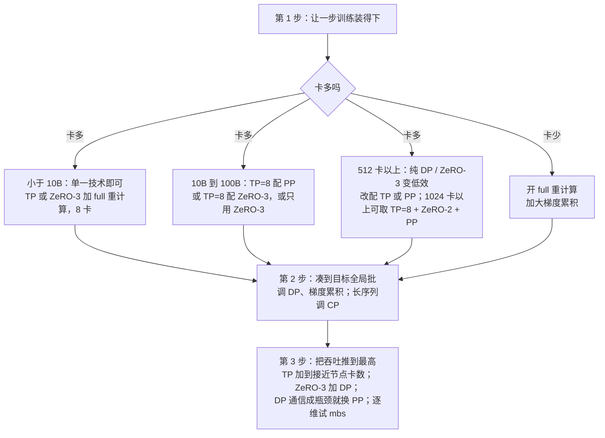

# Ultra-Scale Playbook：显存、算力、通信三笔账，五把刀各砍一笔

<!-- release-date: 2025-02-19 -->

> 本文依据 Hugging Face 的 **The Ultra-Scale Playbook: Training LLMs on GPU Clusters**，原件是网页：[nanotron/ultrascale-playbook](https://huggingface.co/spaces/nanotron/ultrascale-playbook)，访问日期 2026-09-30，页面自报发布日 2025-02-19。作者 Nouamane Tazi、Ferdinand Mom、Haojun Zhao、Phuc Nguyen、Mohamed Mekkouri、Leandro Werra、Thomas Wolf。网页正文不带小节编号，证据一律标原文英文小节名（如「原文 Data Parallelism 一节」）；原文交互图表的数字取自图表的底层数值，不是读图估值。文中会区分三件事：**原文明确写了什么**、**我们怎么解释它**、**哪些是外部资料或本文推算**。

## 读前先把几个词说成人话

这本书不是论文，是一本从单卡讲到上千张卡的训练手册。它反复用同一组词，先说清楚：

- **模型状态**：参数、梯度、优化器状态。只和参数量有关，和批大小、序列长度无关。
- **激活（activations）**：前向时为了反向求梯度而存下的中间结果。随批大小线性涨、随序列长度平方涨。
- **micro-batch / global batch**：一次前向反向吃进去的样本叫微批，大小记作 $mbs$；两次优化器更新之间累计的样本叫全局批，记作 $gbs$。
- **集合通信**：all-reduce 是「每张卡一份同形张量，加总后每张卡都拿到总和」；它可以拆成 reduce-scatter（按块归约到不同卡）加 all-gather（再把各块拼回每张卡）。原文附录 A0 把这组原语各讲了一遍。
- **五个并行维度**：数据并行（DP，切批）、张量并行（TP，切隐藏维）、序列与上下文并行（SP / CP，切序列）、流水并行（PP，切层）、专家并行（EP，切专家）。另有和 DP 配套的 **ZeRO**，把模型状态沿 DP 切开。
- **MFU（Model FLOPs Utilization）**：只按模型本身前反向需要的浮点运算算利用率，不计重计算；**HFU** 则把重计算也算进去（原文 Activation recomputation 一节）。
- **节点内 / 跨节点**：一台节点 8 张 H100，卡间走 NVLink；节点之间走网络（原文集群是 EFA）。后面几乎每条结论都卡在这条边界上。

## 一句话先说清

2025 年，开源社区能下载到 Llama 和 DeepSeek 的权重、读到技术报告，但「怎么让几千张卡协同训练」的知识散在论文和私有代码库里（原文开篇）。这本书要做的，是用一条连贯的叙事，把单卡、数据并行、ZeRO、张量并行、上下文并行、流水并行、专家并行、GPU 算子和低精度串成一本手册，并用自家集群上的实测给每一步定价。

全书的主线只有一句：**所有技术都在同三笔账之间换手——显存、计算效率、通信开销**（原文 High-Level Overview 一节）。显存是硬约束，一步训练塞不进去就没法训；计算效率要求卡把时间花在算上；通信开销要压小，手段是尽量走节点内的快链路、并把通信藏到计算后面。重计算用算力换显存，张量并行用通信换显存，没有一把刀是免费的。

证据来自一组基准：最多 512 张 GPU 上跑了 **4100 多次**分布式实验，算上测试跑超过 **1.6 万次**（原文开篇）。配套代码有两套：教学用、单文件自包含的 Picotron，和 Hugging Face 生产训练用的 Nanotron。

### 一条阅读路线

原文自报阅读时间 2–4 天。只想抓骨架，按这个顺序读：

1. **First Steps: Training on One GPU**：显存账本。后面所有并行都是为了还这笔账。
2. **Data Parallelism 与 ZeRO**：第一把刀，以及沿 DP 切模型状态的三级。
3. **Tensor Parallelism、Context Parallelism、Pipeline Parallelism、Expert Parallelism**：另外四把刀，重点看每把刀的通信落在哪。
4. **5D Parallelism in a Nutshell**：五把刀怎么叠、谁和谁不该叠。
5. **Finding the Best Training Configuration**：三步选配置，和那张最优配置热力图。全书最能直接拿来用的一节。
6. **Diving into the GPUs**：算子层面的融合、FlashAttention 与 FP8。
7. **附录 A3**：通信能不能藏住的四个比值公式。

## 主要矛盾：模型装不下一张卡，切开又要付通信

单卡训练只有三步：前向、反向、优化器更新。难处在显存。原文先把一张卡上的东西列清：参数、梯度、优化器状态、激活，外加 1–2 GB 的 CUDA 内核占用和碎片（原文 Memory usage in transformers 一节）。

两件事同时在涨。模型状态跟参数量走，7B 就已经超过一张 80 GB 的 H100；激活跟批大小和序列长度走，而社区训练的批越来越大：Llama 1 用约 4M token 一批训 1.4T token，DeepSeek 用约 60M token 一批训 14T token，常见区间是每批 4–60M token（原文 First Steps 一节）。

解法只有两类：把张量搬到 CPU，或把参数、梯度、优化器状态、激活切到多张卡上。切又分两派——**并行**（TP、CP、PP）和**分片**（ZeRO / FSDP），两者正交，可以叠（原文 Our journey up to now 一节）。每切一刀都要付通信，而通信能不能藏到计算后面、走的是节点内还是跨节点，决定了这一刀值不值。

> 显存逼着你切，通信逼着你少切、切在节点内。整本书就是在这两股力之间，给每一种切法标价。

## 显存账本：先算清一步训练要多少

### 模型状态：每参数 16 或 20 字节

一个简单 Transformer 的参数量（原文 Memory for weights/grads/optimizer states 一节）：

$$N = h \cdot v + L \cdot (12 h^2 + 13 h) + 2h$$

$h$ 是隐藏维，$v$ 是词表大小，$L$ 是层数。模型变大时，只有 $h^2$ 这一项按平方涨，所以它说了算。

混合精度的默认做法是：计算用 BF16，另存一份 FP32 的主权重；Adam 的动量和方差用 FP32 存。每个参数的账单：

| 项 | 字节 |
|---|---:|
| BF16 参数 | 2 |
| BF16 梯度 | 2 |
| FP32 主权重 | 4 |
| Adam 动量 + 方差（FP32） | 4 + 4 |
| 合计 | 16 |
| 若梯度也在 FP32 里累计（如 Nanotron） | 再加 4，共 20 |

混合精度本身不省显存，只是把显存换了个分法，梯度用 FP32 累计时还比全 FP32 多 4 字节。它的好处在别处：半精度算子更快，前向的激活也更小（原文同节）。

落到具体规模（原文同节表格）：

| 参数量 | 不用 FP32 累计梯度 | 用 FP32 累计梯度 |
|---|---:|---:|
| 1B | 16 GB | 20 GB |
| 7B | 112 GB | 140 GB |
| 70B | 1120 GB | 1400 GB |
| 405B | 6480 GB | 8100 GB |

### 激活：随序列长度平方涨

混合精度下激活显存的估算（原文 Memory for activations 一节，推导出自 NVIDIA 的重计算论文）：

$$m_{act} = L \cdot seq \cdot bs \cdot h \cdot \left(34 + \frac{5 \cdot n_{heads} \cdot seq}{h}\right)$$

括号里第二项带着 $seq$，所以激活对序列长度是平方关系。原文用 Llama 3.1 算给读者看：短序列时激活几乎可以忽略，从 2–4k token 起就开始占大头。按原文图表的底层数值（$bs = 1$）：

| 模型 | 序列 1024 | 序列 4096 | 序列 16384 | 参数 + 梯度 + 优化器状态 |
|---|---:|---:|---:|---:|
| Llama 3.1 8B | 约 9 GB | 约 97 GB | 约 1348 GB | 约 104 GB |
| Llama 3.1 70B | 约 46 GB | 约 485 GB | 约 6740 GB | 约 976 GB |

模型状态那一列几乎不随序列变；激活从 1k 到 16k 涨了 140 多倍。长序列训练里，激活才是真正会爆的那一块。

### 两把单卡上的刀：重计算与梯度累积

**重计算**（activation recomputation，也叫梯度检查点）：前向只在少数关键点存激活，反向时从最近的存档点把中间结果重算出来（原文 Activation recomputation 一节）。两种策略：

- **full**：每层边界存一份，反向时等于多做一遍前向。最省显存，算力和时间通常多 30–40%。
- **selective**：只丢那些又大又便宜的激活。注意力计算正好属于这一类。对 GPT-3 175B，它能砍掉 70% 的激活显存，只多 2.7% 的计算。

用了 FlashAttention 的训练，其实已经在做 selective 重计算：注意力分数在反向时重算，不存（原文同节）。原文还提醒，重计算多了浮点运算，却少了显存读写；在显存带宽比算力稀缺的 GPU 上，整体往往反而更快。这也是为什么比较硬件要看 MFU 而不是 HFU：省得起重计算的卡算得更少、训得更快，应该被奖励。

**梯度累积**：把一个全局批切成几个微批，依次前向反向，把梯度加起来再更新（原文 Gradient accumulation 一节）：

$$gbs = mbs \times grad\_acc$$

显存只按一个微批算，全局批可以涨到任意大；代价是这几个微批只能串行跑。原文点破下一步：这几个微批本来就互相独立，为什么不放到几张卡上同时跑？这就是数据并行。

## 全景：五把刀，各切哪一维、各付什么通信

原文 5D Parallelism in a Nutshell 一节的总表，是全书最值得背下来的一张：

| 方法 | 主要省的是 | 切的维度 | 缺点 |
|---|---|---|---|
| DP | 激活（把本地批变小） | 批 | 受最大批大小限制 |
| PP | 模型参数 | 层 | 空转气泡、日程复杂 |
| TP + SP | 模型参数与激活 | 隐藏维 / 序列 | 要高带宽通信 |
| CP | 激活 | 序列 | 注意力模块里多了通信 |
| EP | 专家参数 | 专家 | 必须是 MoE，多了路由通信 |
| ZeRO-1 | 优化器状态 | 在 DP 副本间分片 | 参数通信开销 |
| ZeRO-2 | 优化器状态与梯度 | 在 DP 副本间分片 | 参数通信开销 |
| ZeRO-3 | 优化器状态、梯度与参数 | 在 DP 副本间分片 | 参数通信开销 |

光看这张表，会以为每把刀的代价差不多。实际差别在**通信落在一步训练的什么位置**：

DP 和 ZeRO-3 的通信大部分能被计算盖住，所以它们能跨节点；TP 的通信卡在每一层的关键路径上，所以只能待在节点内；PP 的通信很小，代价换成了空转。后面几节沿这张图逐把刀展开。

## 第一把刀：数据并行，以及沿它切开的 ZeRO

### 数据并行：三招把梯度同步藏进反向

每张卡放一份完整模型，吃不同的微批，反向后用 all-reduce 平均梯度（原文 Data Parallelism 一节）。朴素写法是等反向全部算完再同步，卡在通信时全部空等。原文给了三招：

1. **与反向重叠**：某一层的梯度一算出来就开始 all-reduce，不等前面的层。PyTorch 里给每个参数挂一个钩子即可。
2. **分桶**：把梯度装进几个大桶，每桶一次 all-reduce。通信和算子一样，大张量比一堆小张量高效。
3. **和梯度累积配合**：累积的中间几步不需要同步，用 `model.no_sync()` 关掉，只在最后一步同步一次。

加了 DP 之后，全局批变成（原文 Revisiting global batch size 一节）：

$$gbs = mbs \times grad\_acc \times dp$$

原文的实操顺序：先定全局批（token 数）和序列长度，再在单卡上把 $mbs$ 加到爆显存为止，最后用 $gbs / (mbs \cdot dp)$ 算出剩下的累积步数。例子：目标 4M token、序列 4k，全局批取 1024 条；单卡只放得下 $mbs = 2$，128 张卡时累积 4 步；换成 512 张卡，累积 1 步就够，训练更快（原文 Our journey up to now 一节）。

代价也写在同一节。到 512 张卡以上，通信开始受环形延迟（信号绕环一圈的时间）限制，DP 的通信就藏不住了。原文基准里，每卡吞吐从 DP=8 的 40150 tokens/s 一路掉到 DP=256 的 15700，其中最后从 128 到 256 一步就掉了 40.6%，而每卡显存始终是 36.66 GB，加卡一点没省显存（原文图表的底层数值；图上没有标这组实验的模型规模）。

DP 还有一个前提：一张卡至少要放得下 $mbs = 1$ 的一次前向。放不下，就得切模型。

### ZeRO：DP 副本之间不必各存一份

普通 DP 里，每张卡存着同一份参数、梯度和优化器状态，更新时还做着同样的计算。ZeRO 把它们沿 DP 维切成 $N_d$ 份，用的时候再拼（原文 Zero Redundancy Optimizer (ZeRO) 一节）。记参数量为 $\Psi$，优化器状态倍数为 $k$（Adam 取 12），不在 FP32 里累计梯度时：

| 级别 | 切什么 | 每卡模型状态 | 通信 |
|---|---|---|---|
| 普通 DP | 不切 | $2\Psi + 2\Psi + k\Psi$ | 梯度 all-reduce |
| ZeRO-1 | 优化器状态 | $2\Psi + 2\Psi + \dfrac{k\Psi}{N_d}$ | 梯度 reduce-scatter，更新后参数 all-gather |
| ZeRO-2 | 再切梯度 | $2\Psi + \dfrac{2\Psi + k\Psi}{N_d}$ | 同 ZeRO-1 |
| ZeRO-3（FSDP） | 再切参数 | $\dfrac{2\Psi + 2\Psi + k\Psi}{N_d}$ | 前向、反向各 all-gather 一次参数，再 reduce-scatter 梯度，共 $3\Psi$ |

ZeRO-1 和 ZeRO-2 的通信量和普通 DP 一样，都是 $2\Psi$：把 all-reduce 拆成了 reduce-scatter 加 all-gather，只是 all-gather 挪到了更新之后（原文 ZeRO-1、ZeRO-2 两节）。ZeRO-3 多出一个 $\Psi$，而且一步里要多做 $2 \cdot L - 1$ 次 all-gather，每次都有一点固定延迟。原文说这不是大问题，因为可以**预取**：算第 $n$ 层前向时就去拼第 $n+1$ 层的参数，反向同理。经验上 DP 不要超过 512，否则预取也盖不住（原文 ZeRO-3 一节）。

按原文图表的底层数值，8B 模型、DP=8、序列 4096 时，每卡显存这样降：

| 配置 | 参数 | 梯度 | 优化器状态 | 激活 | 合计 |
|---|---:|---:|---:|---:|---:|
| DP=8 | 15 GB | 15 GB | 60 GB | 17 GB | 107 GB |
| ZeRO-1 | 15 GB | 15 GB | 7.5 GB | 17 GB | 约 55 GB |
| ZeRO-2 | 15 GB | 约 1.9 GB | 7.5 GB | 17 GB | 约 41 GB |
| ZeRO-3 | 约 1.9 GB | 约 1.9 GB | 7.5 GB | 17 GB | 约 28 GB |

最后一列的 17 GB 纹丝不动。**ZeRO 切不了激活**：每个 DP 副本吃的是不同的微批，激活本来就不重复，没有冗余可切（原文 ZeRO 一节）。序列一长，激活照样会爆，这就轮到下一把刀。ZeRO 的原论文怎么推出这三级、实测了什么，见 ZeRO 一篇。

## 第二把刀：张量并行，把一层矩阵乘拆到几张卡

### 列切接行切，一层只同步两次

矩阵乘有两种切法：按列切权重，每张卡算出输出的一部分列，最后 all-gather；按行切权重，输入也得跟着按列切，每张卡算出一份部分和，最后 all-reduce（原文 Tensor Parallelism 一节）。

放进 Transformer 块里（原文 Tensor parallelism in a transformer block 一节）：

- **MLP**：第一个线性层列切，第二个行切。中间的激活函数在各卡本地做，只在出口 all-reduce 一次。反过来先行切再列切，中间就要多一次 all-reduce。
- **注意力**：Q、K、V 列切，输出投影行切。列切在这里有个很自然的含义：每张卡负责一部分注意力头。MQA、GQA 同样适用。

两个硬约束：TP 度不能超过注意力头数；用 GQA 时 K/V 头更少，比如 Llama-3 8B 有 32 个 query 头、只有 8 个 K/V 头，TP 开到 8 以上就要额外处理 K/V 头的同步。

TP 的麻烦在于，这次 all-reduce 的结果下一步马上要用（前面时间线图里的红块）。它躺在前向的关键路径上，没法像 DP 那样藏到反向后面。节点内走 NVLink 还撑得住，一出节点就掉下悬崖：

左图的四段降幅依次是 10.8%、12.2%、42.7%、65.6%。原文的读法是：TP 从 8 到 16 掉得明显，从 16 到 32 更陡，高 TP 度时通信直接压过计算（原文 Tensor parallelism in a transformer block 一节）。换来的是显存：同一组实验里，单卡能放下的最大批从 TP=2 的 3 条涨到 TP=32 的 20 条。70B 模型、序列 4096 时，每卡模型状态从不切的约 789 GB 降到 TP=8 的约 99 GB（原文图表的底层数值）。

TP 只把矩阵乘里的激活切开了。LayerNorm 和 dropout 需要完整的隐藏维，它们的激活仍然每张卡一份。TP 的原论文怎么切 MLP 和注意力，见 Megatron-LM 一篇。

### 序列并行：把 LayerNorm 和 dropout 也切开

序列并行（SP）让 TP 区域之外的算子沿**序列维**切：LayerNorm 在各自那段序列上独立算，进 TP 区前用 all-gather 拼回完整序列，出 TP 区时用 reduce-scatter 一边求和、一边按序列切开（原文 Sequence parallelism 一节）。这样每张卡上最大的激活从 $b \cdot s \cdot h$ 降到 $\dfrac{b \cdot s \cdot h}{tp}$。

通信量没有变多。纯 TP 每块前向有两次 all-reduce；TP + SP 变成两次 all-gather 加两次 reduce-scatter。次数翻倍，但一次 all-reduce 本来就等于一次 reduce-scatter 加一次 all-gather，总量相同（原文同节，推导在附录 A0 的 Ring AllReduce）。

原文这里有一处容易漏的细节，前后两种情形相反。纯 TP 时，各卡 LayerNorm 看到的是同一份完整激活，它的权重梯度天然一致，不用同步；但 dropout 要同步随机种子（原文 Tensor parallelism in a transformer block 一节末尾的注）。加了 SP 之后，各卡 LayerNorm 处理的是不同的序列段，梯度不同，反而要 all-reduce（原文 Sequence parallelism 一节末尾的注）。

70B 的例子里，TP + SP = 16 能放下 16k 的序列（原文同节）：按底层数值，每卡激活从纯 TP=16 的 115 GB 降到 21.25 GB，合计约 70 GB，低于 H100 的 80 GB。3B 模型上，TP + SP 的最大批从 TP=2 的 4 条涨到 TP=32 的 100 条；吞吐的悬崖还在，TP 从 8 到 16 仍掉 43.4%（原文图表的底层数值）。

## 第三把刀：上下文并行，只在注意力里付通信

TP + SP 之后还剩两个问题：序列再长，TP 区域里的激活照样爆；模型大到 TP=8 放不下，跨节点的 TP 又太慢（原文 Sequence parallelism 一节结尾）。上下文并行（CP）解决前一个。

CP 沿序列维切输入，而且切的是**整个模型**，不只是 SP 那几个算子（原文 Context Parallelism 一节）。MLP、LayerNorm 逐 token 独立算，不受影响；梯度像 DP 一样在 CP 组内 all-reduce。唯一的例外是注意力：每个 token 要看到之前所有 token 的 K 和 V。即便开了 full 重计算（原文说代价约 30%），层边界的激活仍随序列线性涨，所以这一刀省不掉。

### Ring Attention：边算边传

每张卡先异步把自己的 K/V 发给下一张卡，同时用手上已有的 K/V 算局部注意力；算完时，下一块 K/V 最好已经到了（原文 Ring Attention 一节）。$N$ 张卡转 $N$ 轮，每张卡就看遍了全部 K/V，通信藏在计算后面。

因果掩码让朴素分法严重不均：第一张卡拿到的是开头的 token，几乎没什么要算；最后一张卡要算的最多。**Zig-Zag** 分法让每张卡同时拿一段靠前和一段靠后的 token，计算量就平衡了（原文 Zig-Zag Ring Attention 一节；它与 Striped Attention 略有不同）。K/V 的交换有两种实现：一次 all-gather 拼齐全部 K/V，简单但临时显存大；或者按环一块一块传，省显存但多几次通信延迟。

按原文图表的底层数值，8B 模型在 TP=2 的基础上加 CP=4，128k 序列时每卡激活从 352 GB 降到 88 GB。

## 第四把刀：流水并行，把层分到不同节点

### 先按层切：参数省了，激活没省

模型大到一台节点的 8 张卡都放不下时（70B 以上常见），只能跨节点。TP 跨节点太慢，于是按层切：第 1–4 层放第一张卡，第 5–8 层放第二张，依此类推（原文 Pipeline Parallelism 一节）。节点之间只传层边界上的激活，带宽要求很低。

但按原文图表的底层数值，8B 模型 PP=8 时，每卡优化器状态从约 60 GB 降到约 10 GB，激活却还是 17 GB（序列 4096）。原因是：每张卡只管 $1/p$ 的层，但在第一次反向之前要先处理 $p$ 个微批的前向，$p \times \dfrac{activs}{p} \approx activs$（原文同节的注）。

### 气泡：从 AFAB 到 1F1B，再到交错

**AFAB（all forward, all backward）**：先把所有微批的前向做完，再做全部反向。设单个微批在一段上的前向、反向时间为 $t_f$、$t_b$，流水度为 $p$，微批数为 $m$，气泡占比（原文 Splitting layers on various nodes 一节）：

$$r_{bubble} = \frac{(p-1)(t_f + t_b)}{m(t_f + t_b)} = \frac{p-1}{m}$$

多加微批能摊薄气泡，但 AFAB 要把所有微批的激活一直存到反向，显存会爆。

**1F1B**：热身之后一个前向、一个反向交替做。气泡大小不变，但每张卡最多只存 $p$ 个微批的激活，而不是 $m$ 个；省下的显存可以拿去加微批，间接把气泡压小（原文 One forward, one backward 一节）。原文基准里，$m \le p - 1$ 时气泡伤害极大，加流水度吞吐反而掉；$m = 32$ 时小流水度的表现好得多。关键的一句对比：微批少时，流水度从一台节点（$p = 8$）加到两台（$p = 16$）只掉 **14%**，而 TP 在类似的跨节点场景下要掉约 **43%**。跨节点时，流水并行比张量并行扛得住。

**交错（interleaved）**：每张卡不再拿连续的一段层，而是拿 $v$ 段不相邻的层，微批在卡之间绕几圈（原文 Interleaving stages 一节）：

$$r_{bubble} = \frac{p-1}{v \cdot m}$$

代价是通信次数乘 $v$。原文给了 $p = 8$ 时各种 $(m, v)$ 的气泡：$m = 1, v = 1$ 时是 7，$m = 32, v = 8$ 时约 0.027（原文图表的底层数值）。交错之后还多了一个调度选择：先让早的微批走完后面的层（depth-first），还是先把后面的微批填进前面的层（breadth-first）。Llama 3.1 用的是带交错的 1F1B，两种优先级可调。

### 零气泡与 DualPipe

最后一步是把反向再拆细：对输入求梯度（B）必须马上做，下一层的反向要用它；对权重求梯度（W）只要在优化器更新前做完就行，可以挪去填气泡。Sea AI Lab 的 Zero Bubble 就是这么把气泡压到接近零；DeepSeek-V3 的 DualPipe 在此基础上让两股数据流从流水线两端同时进入（原文 Zero bubble and DualPipe 一节）。这类日程要实测每个细粒度操作的耗时，再解整数线性规划求最优，原文因此不给代码。交错日程、零气泡的推导和实测，见 Megatron-LM-2、Zero-Bubble-Pipeline-Parallelism 两篇。

## 第五把刀：专家并行

MoE 把每层的一个前馈模块换成多个并列的专家，每个 token 只路由到其中几个。专家之间完全独立，所以可以直接把不同专家放到不同卡上，不用切矩阵，只要把 token 的隐藏状态送到对应专家那里（原文 Expert Parallelism 一节）。

EP 只作用于 MoE 层，不切输入 token。单用 EP，非 MoE 的部分会在每张卡上重复计算，所以 EP 通常和 DP 一起用：非 MoE 部分按 DP 切批，MoE 部分按 EP 切专家。它的关键通信是两次 all-to-all，一次把 token 送到专家，一次把结果送回来（原文 5D Parallelism in a Nutshell 一节）。

原文举了一个模型设计与并行配合的例子：DeepSeek-V3 在路由器里限制每个 token 最多只发往 4 个节点，把通信留在少数节点内。这一节原文写得最短，自己也说 Picotron / Nanotron 的 EP 完整示例还在计划中。

## 五把刀怎么叠

### ZeRO-3 和流水并行：同一个问题的两种付费方式

两者都沿模型深度切权重、每张卡上算的都是完整的层，区别在搬什么（原文 5D Parallelism in a Nutshell 一节）：

| | ZeRO-3 | 流水并行 |
|---|---|---|
| 每张卡存 | 一层的一部分 | 完整的几层 |
| 通信搬的是 | 权重 | 激活 |
| 编排 | 与模型无关 | 与模型无关 |
| 实现难点 | 模型分片与通信 | 高效的流水日程 |
| 喜欢什么 | 大 $mbs$、长序列，好藏通信 | 大 $grad\_acc$，好藏气泡 |

两者能叠，但实践中少见：叠了就得把全局批显著加大来摊通信。真要叠，ZeRO-3 要把权重在一串流水微批期间留在显存里，别每个微批都重新拼。相比之下，ZeRO-1、ZeRO-2 和流水并行天然互补，DeepSeek-V3 用的就是 PP 加 ZeRO-1（原文同节）。

### 谁待在节点内，谁跨节点

TP（加 SP）和 PP、ZeRO-3 都能叠，但 TP 有两个硬伤：通信在关键路径上，规模一大就被通信压垮；而且它要按模型结构小心处理激活的切法，时而切隐藏维、时而切序列维，不像 ZeRO 和 PP 那样与模型无关（原文同节）。所以组合时的分工是：**TP 放在节点内的高速链路上，ZeRO-3 或 PP 负责跨节点**。PP 需要的带宽低，ZeRO-3 的通信容易被计算盖住。CP 和 EP 都是在切激活，可以看成 TP 的补充：CP 管长序列，EP 管 MoE，彼此叠加没有特别的问题。

每把刀影响的范围也不同：TP 贯穿整个模型；CP 主要影响注意力层；EP 只影响 MoE 层；PP 和 ZeRO 不挑子模块，只是 PP 要把各段负载配平，首尾两段因为有 embedding 常要特殊处理（原文 Scope and focus 一节）。

## 怎么选配置：三步法与最优配置表

### 三步法

原文把决策过程压成三步，并强调最终都要在自己的集群上实测（原文 Finding the Best Training Configuration 一节）：

这张图按原文 Step 1–3 三节的条目重画，是决策示意，不是原文插图。第 1 步另有两条特殊情况：超长序列跨节点加 CP，MoE 跨节点加 EP。

### 实测：28 格里的最优配置

原文在 1–64 台 8×H100 节点上，对四个规模的模型（1.34B、3.57B、8.86B、80B）扫了所有可行的并行配置，序列长度 4096，全局批 1M token，把每格 MFU 最高的配置画成热力图（原文 Benchmarking thousands of configurations 一节）。下表是那张图的底层数值，每格依次是 MFU、每卡显存和配置（GAS 是梯度累积步数）：

| 节点数 | 1.34B | 3.57B | 8.86B | 80B |
|---|---|---|---|---|
| 1 | 44.3%，41.8 GB；DP4 PP2 GAS16 MBS4 ZeRO-1 | 46.7%，56.9 GB；DP4 PP2 GAS32 MBS2 ZeRO-1 | 45.2%，63.1 GB；DP2 PP4 GAS128 MBS1 ZeRO-1 | 全部崩溃或爆显存 |
| 2 | 41.6%，19.4 GB；DP8 PP2 GAS32 MBS1 ZeRO-1 | 43.8%，54.3 GB；DP8 PP2 GAS16 MBS2 ZeRO-1 | 43.9%，58.3 GB；DP4 TP4 GAS16 MBS4 ZeRO-1 | 无数据 |
| 4 | 38.4%，16.4 GB；DP16 PP2 GAS16 MBS1 ZeRO-1 | 40.4%，53.3 GB；DP16 PP2 GAS8 MBS2 ZeRO-1 | 43.3%，61.1 GB；DP16 PP2 GAS16 MBS1 ZeRO-1 | 14.8%，66.0 GB；TP8 PP4 GAS256 MBS1 |
| 8 | 32.5%，16.3 GB；DP32 PP2 GAS8 MBS1 ZeRO-1 | 35.5%，36.7 GB；DP32 PP2 GAS8 MBS1 ZeRO-1 | 39.5%，59.1 GB；DP32 PP2 GAS8 MBS1 ZeRO-1 | 30.6%，63.1 GB；TP4 PP16 GAS256 MBS1 |
| 16 | 29.5%，38.8 GB；DP64 TP2 GAS1 MBS4 | 34.6%，66.2 GB；DP32 TP4 GAS1 MBS8 | 36.3%，66.9 GB；DP16 TP8 GAS2 MBS8 | 34.3%，61.2 GB；TP4 PP32 GAS256 MBS1 |
| 32 | 23.2%，19.6 GB；DP64 TP4 GAS1 MBS4 | 26.8%，39.0 GB；DP64 TP4 GAS1 MBS4 | 32.7%，63.4 GB；DP32 TP8 GAS1 MBS8 | 30.7%，64.2 GB；DP4 TP4 PP16 GAS64 MBS1 ZeRO-1 |
| 64 | 5.2%，8.4 GB；DP128 TP2 PP2 GAS1 MBS2 ZeRO-1 | 10.5%，16.4 GB；DP128 TP4 GAS1 MBS2 ZeRO-1 | 18.7%，57.8 GB；DP128 TP4 GAS1 MBS2 | 17.8%，53.5 GB；DP32 TP16 GAS4 MBS2 ZeRO-1 |

没写 DP、TP、PP 的维度就是 1，没写 ZeRO 就是 ZeRO-0。原文从这张图读出三点：节点越多效率越低，小模型尤其明显，因为 1M token 的全局批限制了它用加批来补；大模型在节点少时要么装不下，要么贴着显存上限跑得很慢，如 80B 在 4 个节点上；最后，结果高度依赖实现质量——他们最初实现的 TP 比 PP 快，优化 PP 代码后 PP 反超，正在改进 TP 的通信重叠，预期 TP 会再追回来（原文同节）。

**我们如何解释它。** 这张表还能读出几件原文没明说的事：

- **大节点数下 DP 被全局批卡住了。** 1M token ÷ 4096 = 256 条样本。64 个节点共 512 张卡，DP × MBS × GAS 不能超过 256，剩下的卡只能交给 TP 或 PP。1.34B 在 64 个节点上 MFU 掉到 5.2%，最优配置是 DP128 × MBS2 × GAS1，正好把 256 条用满。这是本文推算。
- **最优格里没有 ZeRO-2 和 ZeRO-3。** 28 格里只出现 ZeRO-0 和 ZeRO-1。在这组规模和集群上，切参数的通信代价没换来足够的收益。这一条只对这组实验成立，不能推广成「ZeRO-3 没用」：80B 这类要切参数的模型，赢家用的是 PP，而原文实现质量那一条提醒过，名次会随代码改进而变。
- **80B 靠深流水加大量微批。** 8–16 个节点时，最优配置是 TP4 配 PP16 或 PP32、GAS 256，用很多微批去摊气泡；到 64 个节点又换成 DP32 × TP16，TP 跨了两台节点仍然胜出。
- **最高 MFU 不一定是最快的配置。** 在底层数据里，1.34B 单节点时 MFU 最高的是 44.3% 的 PP2 配置，每卡吞吐 38895 tokens/s；而纯 DP8 配置 MFU 只有 39.2%，吞吐却是 40150 tokens/s。1.34B 的 1–8 节点、3.57B 的 2–8 节点都有这种错位。同一模型、同样卡数下，MFU 本应和吞吐同涨同落；原文没有给出它的 MFU 计算口径，这里只指出数据里的不一致。

基准交互面板里一共列了 3219 个配置，其中 1475 个标为崩溃或爆显存（本文按面板底层数据统计）。

### 基准测试本身的教训

原文坦白了跑这几千个实验的狼狈（原文 Lessons learned on benchmarking 一节）：PyTorch 进程有时清理不干净；Slurm 强杀作业导致节点故障；几分钟的基准拖成几小时；有的作业无限挂起。为此他们花了大量时间压缩集群重启和空闲时间、读 NCCL 调试日志、搞清 CUDA 显存分配器的行为、调多节点下的流水并行性能。

这一节的价值在于，它把「理论上能跑」和「真的跑出数字」之间的工程成本摆了出来。原文也借此引出下一章的前提问题：前面一直假设通信和计算能完美重叠，但 NCCL 的通信内核和计算内核用的是同一批 SM，重叠时会互相抢资源，计算吞吐会下降（原文同节结尾）。

## 下到 GPU 里：算子、FlashAttention 与低精度

### GPU 的层级

以 H100 为例：132 个 SM，每个 SM 128 个核，共 16896 个核。存储由近到远依次是寄存器（线程私有）、共享内存与 L1（同一 SM 内的线程共享）、L2（全部 SM 共享）、全局内存（H100 的 80 GB，最大也最慢）。线程按 32 个一组组成 warp，warp 再组成 block，每个 block 分到一个 SM 上（原文 A primer on GPUs 一节）。

### 写算子的四级台阶

原文给的顺序是：PyTorch（简单但慢）→ `@torch.compile`（简单、快、不灵活）→ Triton（更难、更快、更灵活）→ CUDA（最难、最快、最灵活）（原文 Improving performance with kernels 一节）。起步建议是先用 `torch.compile` 生成 Triton 代码，再在它的基础上改，而不是从零写。

CUDA 层面原文讲了四个技巧，数字都来自它自己的矩阵乘例子：

- **访存合并**：让同一 warp 的线程访问连续地址，DRAM 一次突发就能喂饱。改完后显存吞吐约提高 10 倍，执行时间也约降为十分之一（原文 Memory coalescing 一节）。
- **分块（tiling）**：把 A、B 的一块载入共享内存，让 block 内线程复用。显存吞吐升到 410 Gb/s，执行时间降约 43%，达到约 6.6 TFLOPS（原文 Tiling 一节）。
- **线程粗化**：warp 卡在等共享内存的指令队列上时，让一个线程算多个输出，减少共享内存访问（原文 Thread coarsening 一节）。
- **减少控制分歧**：同一 warp 内的线程走不同分支，就只能串行执行（原文 Minimizing control divergence 一节）。

### 融合算子与 FlashAttention

**融合**的思路是：一串逐点操作（如 LayerNorm 里的那些）不要每做一步就写回全局内存再读回来，而是在一个内核里一口气做完（原文 Fused kernels 一节）。

**FlashAttention** 是这个思路的极致。朴素注意力要把分数矩阵 $S = QK^T$ 和 $P = \mathrm{softmax}(S)$ 都写进 HBM 再读回来；FlashAttention 把 $S$ 分块放进 SRAM，只保留 softmax 归一化需要的统计量，根本不把 $S$ 整个写出来（原文 FlashAttention 一节）。它同时减轻了注意力的显存负担和 $O(S^2)$ 带来的大部分代价，以至于大多数线性注意力和亚二次近似都被搁置了。FlashAttention-2 和 -3 的改进更多在底层：减少非矩阵乘运算、在 warp 与 block 间更细地划分工作，以及针对 Hopper 的 FP8 与 Tensor Core 优化。四代的细节见 FlashAttention 系列各篇。

### 混合精度与 FP8

几种浮点格式的位数分配（原文 Mixed precision training 一节）：

| 格式 | 总位数 | 符号 | 指数 | 尾数 |
|---|---:|---:|---:|---:|
| float32 | 32 | 1 | 8 | 23 |
| float16 | 16 | 1 | 5 | 10 |
| bfloat16 | 16 | 1 | 8 | 7 |
| float8（e4m3） | 8 | 1 | 4 | 3 |
| float8（e5m2） | 8 | 1 | 5 | 2 |

指数位决定范围，尾数位决定精度。bfloat16 保住了 float32 的范围，代价是精度更粗；到 FP8 更极端，在 [1, 2] 区间里 e4m3 只能表示 7 个数，e5m2 只能表示 3 个（原文同节）。原文写 float32 的 epsilon「实际是 $1.19^{-7}$」，应为 $1.19 \times 10^{-7}$，是笔误。

FP16 直接训会发散，原始混合精度论文用三招补上：保留一份 FP32 权重，防止小更新被舍入掉；缩放损失，防止梯度下溢；求和、求平均这类运算在 FP32 里累计（原文 FP16 and BF16 training 一节）。

FP8 的吸引力在于，H100 上 FP8 矩阵乘的理论算力是 BF16 的 2 倍；难点是稳定性，学习率越大越容易发散（原文 FP8 pretraining 一节）。原文把 DeepSeek-V3 称作第一次公开报告的超大规模 FP8 混合精度训练：激活按 1×128、权重按 128×128 的块分别算缩放，减少离群值的影响。几种已知方案的每参数显存：

| 方案 | 矩阵乘精度 | 每参数合计 |
|---|---|---:|
| BF16 + FP32 混合精度基线 | BF16 | 20 字节 |
| 上面去掉 FP32 梯度累计 | BF16 | 16 字节（省 20%） |
| Transformer Engine | FP8 | 16 字节（省 20%） |
| FP8-LM 的 O3 级 | FP8 | 9 字节（省 55%） |
| DeepSeek-V3 | FP8 | 15 字节（省 25%） |
| Nanotron 的 FP8 | FP8 | 10 字节（省 50%） |

原文的判断是：到 2025 年初，FP8 仍是实验性技术，但大概率会取代 BF16 混合精度成为标准；Blackwell 宣布支持 FP4 训练，稳定性问题会再来一轮。

## 附录 A3：通信能不能藏住，看四个比值

附录 A3 把「通信能不能藏到计算后面」写成了可以直接代数的判据，比值小于 1 就能藏住（原文 A3: Math for Compute/Communication Overlap 一节）：

| 并行 | 通信时间 / 计算时间 | 这个比值取决于 |
|---|---|---|
| DP | $\dfrac{num\_params}{2 \cdot num\_tokens} \cdot \dfrac{DP-1}{DP} \cdot \dfrac{peak\_flops}{peak\_bw}$ | 参数量与每步 token 数之比 |
| ZeRO-3 | $\dfrac{1}{2 \cdot seq\_len \cdot mbs} \cdot \dfrac{DP-1}{DP} \cdot \dfrac{peak\_flops}{peak\_bw}$ | 每卡每步的 token 数 |
| TP | $\dfrac{TP-1}{2h} \cdot \dfrac{peak\_flops}{peak\_bw}$ | 只看隐藏维和 TP 度 |
| PP | $\dfrac{peak\_flops}{32 \cdot h \cdot num\_layers\_in\_next\_pp \cdot peak\_bw}$ | 隐藏维与下一段的层数 |

这张表把前面几节的经验规则变成了同一个结构：每一行都是「硬件的算力带宽比」乘上一个由模型和配置决定的系数。TP 那一行最说明问题：比值和序列长度、批大小都无关，只取决于 $h$ 和 TP 度。一旦跨节点、$peak\_bw$ 掉一个量级，加大批也救不回来。ZeRO-3 那一行则说明，它喜欢大 $mbs$ 和长序列，和前面对照表里的「喜欢什么」一致。

## 限制与边界

- **它是综述性的手册，不是新方法。** 书里几乎没有原创算法，价值在叙事和实测。每个方法的出处都在原论文里，原文多处直接引用。
- **实测只来自一个集群。** 全部基准是 H100、每节点 8 卡、节点间 EFA。原文自己说，没法给出统一配方，只能给出一套在自己集群上扫配置的方法（原文开篇）。悬崖的位置、TP 与 PP 的名次，换了网络都可能变。
- **规模上限是 512 卡。** 1024 卡以上的建议（TP=8 + ZeRO-2 + PP）是经验性建议，这组基准没有覆盖。
- **热力图只覆盖一种设定。** 序列 4096、全局批 1M token；长序列下的 CP、MoE 下的 EP 都不在这组扫描里。
- **专家并行写得最薄。** 没有实测，也没有代码。
- **实现质量会改写名次。** 原文明说 TP 与 PP 的快慢随代码优化反复换位，所以热力图是「当时这套代码」的结果。
- **MFU 的口径没写清。** 如上一节所列，底层数据里最高 MFU 与最高吞吐有时不一致。

## 可迁移启发

1. **先建显存账本，再谈并行。** 每参数 16 或 20 字节加激活公式，几行就能算出一步训练要多少显存。先知道爆的是模型状态还是激活，才知道该用 ZeRO、TP 还是 CP。
2. **通信在不在关键路径上，比通信量大小更要紧。** ZeRO-3 的通信量是 DP 的 1.5 倍，却能跨节点；TP 的通信量不大，却只能留在节点内。判断一种切法，先问它的结果是不是下一步马上要用。
3. **把硬件边界画进配置。** 节点边界就是一道悬崖。TP 放节点内，PP 与 ZeRO 跨节点，这条分工来自带宽，不是来自偏好。
4. **拆开一个操作，往往能找到调度自由度。** all-reduce 拆成 reduce-scatter 加 all-gather，得到了 ZeRO 和 SP；反向拆成 B 和 W，得到了零气泡。
5. **全局批是一条硬边界。** 卡数多到 DP 用不完全局批时，剩下的卡只能交给 TP 或 PP，而它们的效率更低。扩卡之前先算 $gbs / mbs$ 还剩多少 DP 空间。
6. **基准要连实现质量、失败率一起报。** 同一套技术，代码优化前后名次互换；几千个配置里近一半跑不起来。只报最优数字，别人复现不了。

## 关键词回看

- **显存账本**：模型状态每参数 16 或 20 字节；激活随批线性、随序列平方涨。
- **重计算 / 梯度累积**：单卡上用算力换显存、用时间换批大小。
- **DP / ZeRO-1/2/3**：切批；再沿 DP 切优化器状态、梯度、参数，通信 $2\Psi$、$2\Psi$、$3\Psi$。
- **TP / SP**：列切接行切，一层出口 all-reduce；SP 把 LayerNorm 与 dropout 沿序列切开，通信量不变。
- **CP / Ring Attention / Zig-Zag**：沿序列切整个模型，注意力里环形传 K/V；Zig-Zag 平衡因果掩码下的计算量。
- **PP / AFAB / 1F1B / 交错 / 零气泡**：按层切；气泡 $(p-1)/m$，交错再除以 $v$；1F1B 省激活，零气泡拆 B 与 W。
- **EP**：按专家切，两次 all-to-all。
- **MFU / HFU**：利用率口径，差别在算不算重计算。
- **访存合并、分块、融合、FlashAttention**：让数据尽量留在快存储里。
- **FP8**：算力翻倍，稳定性是难点；DeepSeek-V3 按块缩放。

## 资料与阅读边界

### 本文依据的版本

原件是网页，没有版本号，本文以 2026-09-30 访问的线上版为准；全文按页面结构逐节取文，公式取自页面的 LaTeX 源，交互图表的数字取自图表片段里的底层数据。本地另存有一份 2025-02-20 的整页打印件，只用来对照线上版后来改过什么：此后线上版改过若干小节标题，并加了附录 A0–A3。`release-date` 取页面自报的 2025-02-19，是这本书首次公开的日期；此后的原地修改不回写。

### 跟进过的链接

- **前作**：本书自称三部曲的第二部，第一部是讲预训练数据处理的 [FineWeb 博文](https://huggingface.co/spaces/HuggingFaceFW/blogpost-fineweb-v1)；讲数据配比与架构选择的第三部当时尚未发布。
- **配套代码**：[Picotron](https://github.com/huggingface/picotron) 与 [Nanotron](https://github.com/huggingface/nanotron)。原文的 DP 重叠与分桶、TP 的列切与行切、AFAB 与 1F1B 都嵌了 Picotron 的代码片段；FP8 实现指向 [Nanotron PR 70](https://github.com/huggingface/nanotron/pull/70)。
- **MoE 入门**：原文在专家并行一节推荐先读 Hugging Face 的 [MoE 博文](https://huggingface.co/blog/moe)。
- **Zig-Zag 与 Striped Attention 的差别**：原文指向 [ring-flash-attention 的讨论](https://github.com/zhuzilin/ring-flash-attention/issues/2#issuecomment-2236746166)。

### 外部资料与本文推算

- 最优配置表是原文热力图的底层数值，四个模型规模（1.34B、3.57B、8.86B、80B）与每格配置都和原图逐格对过。
- 「DP 被全局批卡住」「最优格里没有 ZeRO-2/3」「最高 MFU 与最高吞吐错位」三条，以及 3219 个配置、1475 个失败的统计，都是本文对底层数据的读法，不是原文结论。
- 显存表格里的「合计」由本文按原文图表的各项加总。
- 各方法的原论文细节见本库对应篇目：ZeRO、ZeRO-Infinity、Megatron-LM、Megatron-LM-2、GPipe、Zero-Bubble-Pipeline-Parallelism、GShard、FlashAttention 系列、DeepSeek-V3。

### 原文没有公开、本文也不补的缺口

- 数据并行扩展那组基准用的模型规模；
- MFU 的计算口径；
- 专家并行的实测与代码；
- 热力图之外的序列长度与全局批设定下的扫描结果；
- 1024 卡以上建议的实测依据。
