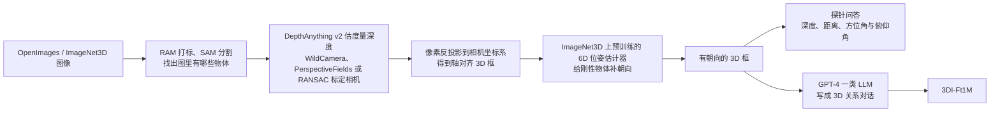

# SpatialLLM：多模态模型缺的不是认物体，是 3D 方位与碰撞

<!-- release-date: 2025-05-01 -->

> 本文依据 **SpatialLLM: A Compound 3D-Informed Design towards Spatially-Intelligent Large Multimodal Models**，arXiv:2505.00788v3，2025-06-10，共 14 页；CVPR 2025 Highlight。作者来自约翰霍普金斯大学与 DEVCOM 陆军研究实验室。页码均指 PDF 自身页码：正文到 p. 8，p. 9–12 是致谢与参考文献，p. 13–14 是附录。文中区分三件事：**论文明确写了什么**、**我们怎么解释它**、**哪些是外部资料或本文推算**。

## 读前先把几个词说成人话

这篇论文没有新公式，难的是它同时动了数据、模型结构和训练阶段三样东西。先把反复出现的词说清楚：

- **LMM（Large Multimodal Model，大多模态模型）**：一张图先进视觉编码器变成特征，经 **连接器**（connector，这里是 MLP）映射成一串视觉 token，再交给大语言模型作答。本文的骨架是 LLaVA-v1.5（PDF p. 3、p. 6）。
- **3D 空间推理（3D spatial reasoning）**：不是认出物体，而是推断物体在真实三维世界里的相互关系——谁离谁近、谁朝着谁、从某个物体的视角看另一个在哪边（PDF p. 3）。它和图像平面上的「左边那个」不是一回事：后者随相机转动就变。
- **深度与 3D 距离**：深度是物体离相机多远，常能从物体在图里的大小粗估；3D 距离还包括两个物体彼此相隔多远，往往更难（PDF p. 3）。
- **朝向与 6D 位姿**：朝向回答「物体正面朝哪」；6D 位姿是三维位置加三维旋转。两辆车会不会对撞，取决于朝向，不取决于谁离相机更近（PDF p. 2）。
- **3D 意识（3D awareness）**：视觉编码器的特征里有没有编进 3D 形状、3D 朝向这类信息。常用线性探针来量：冻住特征，只训一个线性分类器去猜姿态（PDF p. 4）。
- **LLaVA 的两段训练**：Stage 1 **多模态对齐**，用图文对训练连接器，让视觉特征落进语言模型的词嵌入空间（数据是 CC558K）；Stage 2 **视觉指令微调**，用图加多轮对话微调语言模型（数据是 Mix665K）。本文在前面又试了一段 Stage 0 **编码器预训练**（pre-pretraining），用 LoRA 微调 CLIP（PDF p. 3、p. 5）。
- **探针数据与对话数据**：探针（probing）问单个物体的基本 3D 量——离相机多远、方位角和俯仰角、两物间距；对话问更高层的关系——谁朝谁、从谁的视角看谁在哪边（PDF p. 5）。
- **VQA（Visual Question Answering，视觉问答）**：给图和一句问题，模型用自然语言作答。本文的训练数据和评测都是 VQA 形式。

## 一句话先说清

2025 年初的 LMM 认物体、写描述已经很强，但一碰到「预测物体会不会相撞」这类需要三维关系的问题就弱（PDF p. 1）。论文把原因拆成两条：**缺 3D 训练数据**，以及 **模型设计偏向 2D**（PDF p. 1、p. 4）。

前人也往训练里加过空间数据。最有代表性的 SpatialVLM 只在最后的指令微调阶段加 3D 问答，而且问答里没有朝向（PDF p. 2、p. 6）。论文认为缺的不是再加一点空间问答，而是回答两个没人系统回答过的问题：3D 意识该在 **哪一段训练** 注入、注入到 **网络的哪一部分**（PDF p. 2）。


图上的黄格就是这篇论文的全部新东西。它不是一种新网络，而是一张 **复合设计**（compound design）的搜索表：数据、编码器组合、训练阶段一起搜，最后收成一条配方（PDF p. 2、p. 5）。

结论写得很硬（PDF p. 2、p. 7–8）：

- 在自建的 **SpatialVQA**（1,323 道题）上平均 **62.7%**，比 GPT-4o 的 54.0% 高 8.7 个点，比空间专项模型 SpatialVLM-13B 的 52.2% 高 10.5 个点；
- 相对 LLaVA-v1.5 的 47.7%，架构改动只贡献 **1.3** 个点，3D 数据放进对的训练阶段贡献 **13.7** 个点；
- 用 3D 数据去微调视觉编码器（Stage 0）不增反降。

论文写的是「8.7%」「13.7%」，其实都是准确率的百分点差，下文统一按百分点读。

### 一条阅读路线

如果只有半小时读原文：

1. **p. 1 Figure 1、p. 3 §3.2**：三类 3D 关系——距离、朝向、两者组合。
2. **p. 4 Figure 2 与 §3.2.2、p. 13–14 附录 B**：SpatialVQA 怎么出题。
3. **p. 5 Figure 3–4、附录 A（p. 13）**：设计空间与两类 3D 数据怎么造。
4. **p. 6 Figure 5–6**：和 LLaVA、SpatialVLM 的对照，以及 47.7 → 62.7 的路线图。
5. **p. 7 Table 1、p. 8 Table 2**：主结果与全部消融。Table 2 比 Table 1 更值得细读。

## 主要矛盾：会认物体，不等于知道谁朝着谁

Figure 1 用一张街景把问题摊开（PDF p. 1）：画面里有一辆白色面包车、一个行人和一个骑车人。现有模型多半能把三样东西都叫对名字。但人看这张图，会同时知道三件事：

1. 行人比骑车人离观察者更近——这是 **距离**；
2. 白面包车正对着行人，而不是骑车人——这是 **朝向**；
3. 从行人的视角看，面包车在他的右侧——这要把位置和朝向叠起来，是 **组合推理**。

判断会不会撞、该往哪让，三件缺一不可。论文把这三类定为 LMM 必须掌握的 3D 空间关系（PDF p. 2–3）。

为什么现有 LMM 做不到？论文给出两个独立的缺口（PDF p. 4）：

- **视觉编码器缺 3D 意识。** 多数 LMM 的视觉编码器是 CLIP 这类语言监督模型，在海量图文对上训出来。Probe3D 与 ImageNet3D 的线性探针实验显示，这类编码器对物体 3D 姿态的意识有限（PDF p. 4）。图文对擅长「这是一辆车」，很少写「车头朝左前方 40 度」。编码器里没有的东西，后面的语言模型再强也推不出来。
- **训练数据缺 3D 推理。** 现有的预训练和指令数据讲的是细节描述、场景、外观和动作，对构成物理事件的 3D 关系含糊其辞（PDF p. 4）。近期工作已经能用深度估计器做出「谁更远」这类伪标注，但几乎都停在距离上；朝向没人做，因为一直缺可靠的 6D 位姿估计器（PDF p. 1–2）。

于是矛盾变成：

> 表征里可能没有 3D，数据里也几乎没有朝向。只在最后一段补点空间问答，等于让语言模型在一份缺 3D 的视觉表征上编空间故事。要解决，就得同时回答数据造什么、放进哪一段、改不改编码器。

## 核心设计一：先把「空间」拆成三类，题必须逼出 3D

### 旧问题：一提空间，2D 左右、深度远近、朝向对撞被混在一起

早期空间推理数据集建在 3D 扫描上，不是普通照片；近期的图文基准要么只问图像平面上的左右，要么只问距离（PDF p. 4）。模型在这些基准上失败，你分不出它是看不见深度、看不见朝向，还是看见了但不会组合。

### 新设计：SpatialVQA，每道题都不能靠 2D 蒙对

论文为此自建评测基准 SpatialVQA：图像取自 Omni3D（一个带 3D 框标注的真实照片集合，覆盖城市街景与室内场景），按预定义规则从 3D 真值生成问答，共 1,323 道（PDF p. 4、p. 13–14）。它自称和以往所有空间基准的区别是：**每道题都需要不同程度的 3D 意识，不能只靠 2D 空间推理作答**（PDF p. 4）。

附录 B 列出七类题型（PDF p. 13–14）。Figure 2 的四个样例（PDF p. 4）一并放进来，问句照原图转写：

| 题型 | 原文归类 | 问什么 | Figure 2 的样例 |
|---|---|---|---|
| Closer to camera | 距离 | 两个物体谁离相机更近 | — |
| Closer to object | 距离 | 两个物体谁离第三个物体更近 | 书房：Region[1] 的书柜和 Region[2] 的椅子，谁离 Region[0] 的椅子更近 |
| Facing camera | 朝向 | 物体哪一面朝着相机 | — |
| Facing object | 朝向 | 第三个物体朝着两者中的哪一个 | 雨天街道：Region[0] 的车朝着 Region[1] 还是 Region[2] 的车 |
| Same direction | 空间关系 | 两个物体朝向相同还是不同 | 路口：Region[0] 和 Region[1] 两辆车是否同向 |
| Higher | 空间关系 | 两个物体谁的 3D 位置更高 | — |
| On which side | 空间关系 | 一个物体在另一个的哪一侧（前、左等） | 城市道路：站在 Region[0] 那辆车的位置、顺着它的朝向看，Region[1] 的巴士在哪边 |

Figure 2 给每个样例标了需要的信息：书房那题只要 3D 位置、不要朝向；其余三题两样都要（PDF p. 4）。

归类在原文里前后不一。正文 p. 3 把「两物是否同向」当作朝向关系的例子，附录却把 Same direction 归进空间关系；Figure 2 又把同向那题标作朝向关系、把「朝着谁」那题标作空间推理（PDF p. 3–4、p. 14）。归类只影响 Table 1 的三列怎么切，不影响总分，但读分项时要记得边界是模糊的。

### 工作机制与代价

附录说答案大致平衡，例如「是否同向」约 240 道里 yes 和 no 各 120 道；真实照片里天然稀少的答案频率更低，例如「物体底面朝着相机」（PDF p. 14）。

这里有一笔账对不上，**这是我们的核对，不是原文**：附录写总数 1,323、每类约 240 道，但 7 × 240 = 1,680，1,323 ÷ 7 只有约 189。原文没有解释，分类题数也没有列表。下文以总数 1,323 为准。

代价有三条。基准不大；题是规则生成的，和训练用的 3D 对话是同一类造法（PDF p. 4、p. 13）；计分方式——精确匹配、选项匹配还是模型判分——原文没写。训练对话的图来自 OpenImages，评测图来自 Omni3D，来源不同，但题型家族是近亲。

### 可迁移启发

测 3D 能力，先问每道题「只看 2D 能不能蒙对」。把距离、朝向、组合分开计分，比只报一个平均分有用得多——下文会看到，本文 62.7 的平均分几乎全靠距离一列撑起来。

## 核心设计二：两类 3D 数据，一类进对齐，一类进微调

### 旧问题：只在最后一段加空间对话，表征里可能根本没有 3D

SpatialVLM 沿用 LLaVA 的标准两段训练，只在指令微调时加 3D 问答（PDF p. 2、p. 6）。如果 CLIP 特征里没编进朝向，语言模型怎么微调也只能在 2D 表征上推空间。论文想试的是：3D 信息能不能更早地进来，先写进视觉 token。

### 新设计：探针像词汇，对话像作文

论文把 3D 数据按目的分成两类（PDF p. 5）：

- **3D 探针数据**：物体级的基础 3D 量——方位角、俯仰角、物体到相机的深度、两物之间的 3D 距离。目的是「把基础 3D 意识注入模型，供后续推理使用」。有两份：
  - **3DI-Pb-IN166K**：从人工标注姿态的 ImageNet3D 转换而来，约 16.6 万条；
  - **3DI-Pb-OI1M**：OpenImages 上的图，深度与距离用半自动工具标，约 100 万条。
- **3D 指令微调数据 3DI-Ft1M**：100 万条关于 3D 空间关系的问答，图像来自 OpenImages，由基础 3D 量组合出高层关系（PDF p. 5、p. 13）。

标准 LLaVA 数据照旧保留：CC558K 的详细描述用于对齐，Mix665K 的多轮对话用于微调。3D 数据是 **加进去**，不是替换（PDF p. 5）。实验设置一节把规模总结成「100 万条 3D 图文对用于编码器预训练与对齐，另 100 万条多轮 3D 对话用于指令微调」（PDF p. 7）。

两类数据分工明确：附录说探针阶段 **只训练连接器、冻结其他模块**，让视觉 token 带上 3D 信息；对话数据则教语言模型把这些信息聚合起来做推理（PDF p. 13）。

### 工作机制：同一条视觉工具链，多产出一个朝向

Figure 4 右侧画的是 3D 数据卡，附录 A 把步骤写全（PDF p. 5、p. 13）。按原文重画成流程：



前三步与 SpatialVLM、SpatialRGPT 的数据引擎同类（PDF p. 13）。多出来的是第四步：未标注的自然图用位姿估计器预测朝向；有 3D 标注的数据（ImageNet3D 的人工姿态、Apollo 合成数据的真值框）直接用真值（PDF p. 13）。流程图是按原文文字重画的示意；Figure 4 与附录都用「例如」列举工具，没有说每份数据具体走了哪几个工具。

Figure 8 给了四条 3DI-Ft1M 的样例（PDF p. 14）。下面转写问答文字，图像略；这是论文展示的样例，不是完整语料：

```text
Q: Consider the real-world 3D orientations of the objects. Are the sports car
   in Region [0] and the car in Region [1] facing the same (or similar)
   directions, or very different directions?
A: They are facing the same direction.

Q: Consider the real-world 3D locations and orientations of the objects.
   Which object is closer to the viewer, the chair in Region [0] or the chair
   in Region [1]?
A: The chair in Region [1] is closer to the viewer.

Q: Consider the real-world 3D orientations of the objects. Are the suv in
   Region [0] and the bus in Region [1] facing the same (or similar)
   directions, or very different directions?
A: They are facing different directions.

Q: Consider the real-world 3D locations and orientations of the objects.
   From the perspective of the player in Region [0], in which direction is
   the player in Region [1]?
A: The player in Region [1] is in the front direction of the player in Region [0].
```

样例显示两个格式约定：每题先用一句「Consider the real-world 3D …」提示模型按真实三维而不是图像平面作答；物体用 `Region [k]` 指代，图上画框。探针数据的问句模板、每张图问几轮、GPT-4 的提示词，原文都没有给。

### 收益、代价与边界

收益在 Table 2 里（PDF p. 8，完整表见核心设计四）：Stage 2 加 3DI-Ft1M，平均分从 49.0 到 59.7；再在 Stage 1 加 3DI-Pb-IN166K，到 62.7。代价同样清楚：

- **对齐阶段吃标注质量。** Stage 1 用半自动的 OI1M 是 60.0，用人工标注的 IN166K 是 62.7。论文的解释是人工标注的 ImageNet3D 给出更准确的 3D 朝向（PDF p. 7–8）。
- **对话数据不能提前放。** 把 3DI-Ft1M 也塞进 Stage 1，平均分从 59.7 掉到 57.5（PDF p. 8）。
- **朝向的上限是位姿估计器。** 论文没有报告伪标签的朝向准确率，也没有「去掉朝向、只留深度」的数据消融。

### 可迁移启发

基础属性和组合推理是两种数据，不要塞进同一段。基础量进对齐，让连接器学会把它们从视觉特征里取出来；组合关系进微调，让语言模型学会用。对齐阶段宁小而准：16.6 万条人工姿态赢了 100 万条半自动标注。

## 核心设计三：朝向必须进入真实照片上的 VQA

### 旧问题：有深度就能问远近，问不了对撞

前人的数据引擎用深度把像素抬回三维，得到的是 **轴对齐 3D 框**：知道中心和尺寸，不知道车头朝哪。这足够问「谁更近」，但问不了「两辆车是否同向」「从这辆车的车头看那辆在哪侧」（PDF p. 13）。摘要特意点出这一条：首次在真实图像上整理出包含 3D 朝向关系的 VQA 数据（PDF p. 1–2）。

### 新设计：把位姿估计器接进数据引擎


右栏把附录 B 的七类题按「要不要朝向」分成两组。一半以上的题型必须有朝向框才能按规则算出答案，这就是为什么论文说前人「更复杂的 3D 空间推理题没有被探索」（PDF p. 13）。朝向的两条来源：ImageNet3D 的人工姿态直接转成图文对，得到 3DI-Pb-IN166K；OpenImages 用位姿估计器补朝向，再生成朝向相关的对话进 3DI-Ft1M（PDF p. 2、p. 5、p. 13）。

### 收益、代价与边界：朝向一列只涨了一点

Table 1（PDF p. 7）按三列拆分得分：

| 模型 | 平均 | 3D 距离 | 3D 朝向 | 3D 空间关系 |
|---|---:|---:|---:|---:|
| GPT-4o | 54.0 | 59.4 | 52.4 | 50.8 |
| GPT-4o Mini | 45.4 | 46.9 | 39.3 | 48.5 |
| Claude 3.5 Sonnet | 49.3 | 50.8 | 44.5 | 51.5 |
| LLaVA-v1.5-7B | 47.7 | 50.6 | 46.4 | 46.2 |
| LLaVA-NeXT-8B | 50.6 | 63.5 | 49.2 | 41.5 |
| Cambrian-8B | 51.7 | 59.8 | 46.4 | 48.9 |
| SpatialVLM-13B | 52.2 | 64.3 | 48.5 | 45.8 |
| SpatialLLM | **62.7** | **86.3** | **52.9** | 50.8 |

前三行是专有模型，中间三行开源，SpatialVLM 单列为空间专项。**下面是我们的读表，不是原文：**

- 相对 GPT-4o 的 8.7 个点几乎全来自距离一列（86.3 对 59.4）。朝向只高 0.5 个点；空间关系与 GPT-4o 持平，还低于 Claude 3.5 Sonnet 的 51.5。原文写「在 3D 距离、3D 朝向和 3D 空间关系的所有方面都更优」（PDF p. 7），与空间关系这一列不符。
- 原文说 SpatialVLM 因为缺朝向专项数据，朝向「不如 LLaVA」（PDF p. 7）。表上它的 48.5 低于 LLaVA-NeXT-8B 的 49.2，却高于 LLaVA-v1.5-7B 的 46.4，这句话只对前者成立。
- 最终模型在 Table 2 里的空间关系是 51.0，Table 1 是 50.8，两表差 0.2，原文没有解释；其余三列一致。

所以「首次做朝向 VQA」是数据层面的贡献，模型层面的朝向能力只比 GPT-4o 高一点。朝向题的难度也依赖「哪一面算正面」的定义；非刚性物体、截断严重的物体、底面朝相机这种罕见姿态，附录自己承认频率低（PDF p. 13–14）。按物体类别或七类题型的分项准确率，原文没有给。

### 可迁移启发

给 LMM 加空间，只有深度排序会在「会不会撞」上静默失败。先问自己的数据引擎能不能按规则算出「从物体自己的朝向看」这类题的答案；不能，模型学到的只是远近比较。评测时把朝向单独报，否则会被距离一列拉高的平均分带偏。

## 核心设计四：在数据、架构、训练阶段上做组合搜索

### 旧问题：改一处、报一个分，不知道增益从哪来

换更强的语言模型、混一个自监督编码器、在微调里加空间问答，都能让平均分动一点。没有一张把改动按顺序叠起来的表，就答不了「先改架构还是先改数据」「3D 数据进哪一段」。

### 新设计：一条从 LLaVA-v1.5 走到 SpatialLLM 的路线


四步里只有换语言模型需要额外说明。论文给的理由是 Llama3-8B 在 MMLU（一个通用知识问答基准）上比 Vicuna-v1.5-7B 高 20%，更好的语言推理也可能帮到空间推理（PDF p. 6）。这 20% 是引用的通用分，不是本文在 SpatialVQA 上测的。混合编码器的做法是把 CLIP 与 DINOv2（一个只在图像上自监督训练的编码器）的特征图合用，论文说这说明自监督特征能增强空间推理（PDF p. 6）；两路特征具体怎么拼，原文没写。

### 工作机制：完整的 Table 2

所有实验沿用 LLaVA-v1.5 的超参，除非另外说明；在 8 张 A100 上完成（PDF p. 7）。Table 2（PDF p. 8）的非灰色行从上到下就是路线图，灰色行是同一设计空间里的对照，最终模型那一行底色为浅橙。下表照录数字；第一列是原表小标题的意译，标「灰」的是灰色行：

| 分组 | 编码器 | LLM | Stage 0 | Stage 1 对齐 | Stage 2 微调 | 平均 | 距离 | 朝向 | 空间关系 |
|---|---|---|---|---|---|---:|---:|---:|---:|
| 基线 | CLIP | Vicuna-7B | — | CC558K | Mix665K | 47.7 | 50.6 | 46.4 | 46.2 |
| 混合编码器（灰） | CLIP + MAE | Vicuna-7B | — | CC558K | Mix665K | 47.9 | 52.2 | 45.7 | 46.1 |
| 混合编码器 | CLIP + DINOv2 | Vicuna-7B | — | CC558K | Mix665K | 48.0 | 51.9 | 46.9 | 45.6 |
| 换 LLM | CLIP + DINOv2 | Llama3-8B | — | CC558K | Mix665K | 49.0 | 56.3 | 51.7 | 41.5 |
| Stage 2 加 3D | 同上 | Llama3-8B | — | CC558K | + 3DI-Ft1M | 59.7 | 85.2 | 52.1 | 44.8 |
| Stage 1 加 3D（灰） | 同上 | Llama3-8B | — | + 3DI-Ft1M | + 3DI-Ft1M | 57.5 | 80.8 | 46.9 | 46.4 |
| Stage 1 加 3D（灰） | 同上 | Llama3-8B | — | + 3DI-Pb-OI1M | + 3DI-Ft1M | 60.0 | 82.1 | 46.9 | 51.6 |
| **最终模型** | 同上 | Llama3-8B | — | + 3DI-Pb-IN166K | + 3DI-Ft1M | **62.7** | **86.3** | **52.9** | **51.0** |
| Stage 0（灰） | 同上 | Llama3-8B | OI1M，CLIP 对比目标 | + 3DI-Pb-IN166K | + 3DI-Ft1M | 60.3 | 85.0 | 50.5 | 47.5 |
| Stage 0（灰） | 同上 | Llama3-8B | OI1M，NTP 目标 | + 3DI-Pb-IN166K | + 3DI-Ft1M | 62.6 | 85.2 | 52.9 | 51.5 |

「+」表示在标准数据（CC558K 或 Mix665K）之外追加。NTP 是 next-token prediction，即语言建模目标。

### 收益、代价与边界

论文从这张表读出三条（PDF p. 7–8）：架构升级有帮助；3D 对齐与 3D 微调「非常重要」；对齐阶段看重数据质量。把表逐列读下去，还有几处要自己留意，**以下是我们的读表**：

- **架构那 1.3 个点不稳。** 混合编码器那一步，论文说「尤其提升 3D 朝向」（PDF p. 7），表上朝向只涨 0.5（46.4 到 46.9），距离涨得更多（50.6 到 51.9），空间关系反而降了 0.6。换 Llama3 那一步，空间关系从 45.6 掉到 41.5。更强的 LLM 并没有单调帮助每一类 3D 题。
- **MAE 被淘汰的依据很薄。** CLIP + MAE 的平均 47.9 对 CLIP + DINOv2 的 48.0，差 0.1，都是单次点估计。
- **3D 对话几乎只抬距离。** Stage 2 加 3DI-Ft1M 后，距离从 56.3 跳到 85.2，朝向只从 51.7 到 52.1，空间关系从 41.5 到 44.8。IN166K 的对齐才把朝向推到 52.9、空间关系推到 51.0。
- **这张表不是完整的因子设计。** 它按一条路线往前叠，每步只在当前最优上换一个开关。没有「只用 Vicuna 但加 3D 数据」这样的交叉格，所以 1.3 与 13.7 的分账依赖叠加顺序。

路线本身的边界：搜索在 7B–8B 规模、8 张 A100 上完成；学习率、epoch、batch 都「同 LLaVA-v1.5」，原文没有重写；没有连接器结构、图像分辨率或视觉 token 数的消融。

### 可迁移启发

先分清「改架构」和「改数据」各能搬多少分，再决定工时投哪。这篇里数据是架构的十倍。若自己手上是现成的 LMM 骨架、缺一种关系数据，先造对数据、选对阶段，再考虑换编码器。但同时要逐列看分：平均分的涨幅可能只来自一类题。

## 核心设计五：视觉编码器冻着，别用 3D 数据去改它

### 旧问题：CLIP 缺 3D，直觉是再训一下

既然 CLIP 为图文对比学习而生、缺 3D 意识，一个自然的假设是：拿 3D 探针数据再训一段编码器，3D 意识应该上来（PDF p. 7）。

### 新设计：试了两种目标，最终不做

论文用 3DI-Pb-OI1M 对 CLIP 做 Stage 0，只训练插在 ViT 里的 LoRA 层，试了两种目标：CLIP 式对比学习，以及语言建模（NTP）（PDF p. 5、p. 7–8）。结果见上表最后两行：对比目标平均掉到 60.3，朝向与空间关系两列都掉；NTP 目标 62.6，与不做持平。最终模型不做 Stage 0，混合编码器保持预训练权重冻结。

论文的解释是：微调视觉基础模型可能损害特征的泛化能力，这与主张冻结或锁定视觉编码器的前人工作一致（PDF p. 8）。项目页把同一结论写成「3D 意识与泛化能力之间的取舍」——那是项目页的表述，PDF 的措辞更弱，只说「may compromise」。

### 边界

这是一条否定结果，但只排除了很窄的一种做法：在已经选好的最终配方上，用 OI1M 这份半自动数据 LoRA 微调 CLIP。原文没有测 Stage 0 之后编码器在姿态探针上的 3D 意识是否真的变强，所以「伤了泛化」是对下游分数的解释，不是另一次测量。方法一节说 Stage 0 可以用 OI1M 或 IN166K（PDF p. 5），Table 2 只报了用 OI1M 的两行。LoRA 的秩、作用层、学习率与训练步数都没写。

### 可迁移启发

缺某种能力时，先分清是「表征里没有」还是「表征里有、语言模型不会用」。本文的顺序是：冻住编码器，用对齐数据把已有特征里能用的 3D 取出来，再用微调数据教推理；改编码器排在最后，而且这一次没带来好处。

## 实验还说明了什么、没说明什么

**对照组的选法。** Table 1 的「最佳开源」按空间专项的 SpatialVLM-13B 计，它是用第三方复现 SpaceLLaVA 跑的，不是原作者检查点（PDF p. 7）。SpatialRGPT 被排除，因为它推理时还要额外输入物体框、分割掩膜和深度图；本文和 LLaVA、Cambrian 一样只吃原始图像（PDF p. 7）。这是输入条件的公平性选择，不说明谁更强。

**定性例子。** Figure 7 两例（PDF p. 8）：左图问 Region[0] 的车离 Region[1] 还是 Region[2] 的车更近，GPT-4o 回答自己「无法在视觉上评估图像」、请用户描述位置，SpatialLLM 答 Region[1]；右图问两把椅子是否同向，GPT-4o 说朝向相似，SpatialLLM 答「非常不同」。图里的模型名写作 3DI-LMM，与正文的 SpatialLLM 是同一个；Figure 2 的样例回答也用这个名字（PDF p. 4、p. 8）。这是作者挑的成功例，不是错误分析。GPT-4o 在左例里表现得像没收到图，专有模型的调用方式与提示词原文没写。

**没有的证据：**

- 正文说模型「仍保持通用视觉推理（详见附录）」、「数据分布见附录」（PDF p. 7），但附录只有数据生成、题型与统计、公开说明三节（PDF p. 13–14），两张表都不在里面。通用基准会不会掉点，无法从 PDF 判断。
- 没有多次随机种子与置信区间；62.7 是单次点估计。
- 只在自建的 SpatialVQA 上测；没有拿其他空间基准或人工标注的题测最终模型。

## 限制、边界与不要补进去的实现

- **平均分会掩盖子项。** 62.7 对 54.0 很好看，拆开看是距离一列大涨、朝向小涨、空间关系与 GPT-4o 持平。
- **朝向贡献主要体现在数据，不在模型得分。** 「首次在真实图像上做朝向 VQA」是数据层面的声明，比较范围是文中引用的 SpatialVLM、SpatialRGPT 等（PDF p. 1–2）。
- **1.3 与 13.7 的分账依赖叠加顺序。** Table 2 是一条路线，不是交叉实验。
- **Stage 0 的否定结论很窄。** 只排除了用半自动数据 LoRA 微调 CLIP 这一种做法。
- **原文没公开的：** 连接器层数与宽度（只说「follow LLaVA」）、CLIP 与 DINOv2 的拼接方式、图像分辨率与视觉 token 数、LoRA 与训练超参、墙钟时间；3DI-Ft1M 的题型分布、问句模板与 GPT-4 提示词；位姿估计器的准确率与类别覆盖；SpatialVQA 的计分规则与分题型准确率；训练图与评测图是否有场景重叠。
- **没有独立的 SpatialLLM 权重或代码。** 附录的公开说明指向项目页（PDF p. 14），项目页的数据与代码随后续工作 SpatialReasoner 发布，见文末。

## 可迁移启发

1. **LMM 缺 3D，多半不缺新骨干，缺的是对的阶段看见对的监督。** 本文架构开关全开只搬了 1.3 个点，数据放对阶段搬了 13.7 个点。已有 LLaVA 或 Qwen-VL 类骨架时，先问数据，再问编码器。
2. **基础量进对齐，组合关系进微调。** 深度、方位、朝向像词汇，「从 A 看 B 在左侧」像句子。把句子提前塞进对齐，本文掉了 2.2 个点。
3. **对齐阶段宁小而准。** 16.6 万条人工姿态赢过 100 万条半自动标注。我们的推断是：连接器只在对齐阶段学「从特征里取哪些量」，伪标签的朝向误差在这里代价最大。
4. **朝向是深度补不上的一维。** 只有深度排序，模型学得会谁更近，学不会谁正对着谁。需要碰撞、让行、交互判断时，数据引擎里要有带朝向的 3D 框。
5. **冻结编码器是默认，不是妥协。** 用 3D 数据 LoRA 微调 CLIP 在本配方里掉点或空转。先改对齐数据和微调数据，对齐也取不出来时再动视觉权重。
6. **至少拆三列报分。** 距离、朝向、组合各报一次，再看平均分。

## 关键词回看

- **3D 空间推理**：在三维世界里推断物体间的距离、朝向与组合关系，不是识别物体，也不是生成网格。
- **SpatialVQA**：1,323 道规则生成的 3D VQA，图来自 Omni3D，七类题归成距离、朝向、空间关系三列。
- **3D 意识**：视觉编码器特征里有没有 3D 形状与姿态信息，用线性探针测。
- **探针数据（3DI-Pb-IN166K / 3DI-Pb-OI1M）**：物体级深度、距离、方位角与俯仰角；最终配方用人工标注的 IN166K 进 Stage 1 对齐。
- **对话数据（3DI-Ft1M）**：100 万条 3D 关系问答，含朝向；进 Stage 2 指令微调。
- **有朝向的 3D 框**：比轴对齐框多了物体正面方向，才能按规则生成朝向题和「从谁的视角看」题。
- **Stage 0 / 1 / 2**：编码器 LoRA 预训练、多模态对齐、指令微调。最终模型不用 Stage 0。
- **混合视觉编码器**：CLIP 与 DINOv2 特征合用；相对纯 CLIP 平均只多 0.3 个点。
- **复合设计**：数据、架构、训练阶段一起搜，最后收成一条路线图。
- **SpatialVLM / SpatialRGPT**：前者只在指令微调加 3D 且没有朝向；后者推理时还要掩膜与深度，本文不与之比较。

## 资料与阅读边界

**版本与首发日。** arXiv:2505.00788 共三版，本文依据最新的 v3（2025-06-10）。`release-date` 取 2025-05-01，即 arXiv v1 的提交日：SpatialLLM 没有独立发布的权重或代码，项目页在此之前只挂出标题、一句简介与一张概览图，技术内容以 arXiv v1 为最早公开；CVPR 2025 会议在 2025-06 召开，晚于 v1。

**外部资料补充（不是 PDF 原文）：**

- 项目页：<https://3d-spatial-reasoning.github.io/spatial-llm/>。其「Data & Code」一节写明数据与代码随后续工作 [SpatialReasoner](https://arxiv.org/abs/2504.20024) 发布，包括伪 3D 真值与空间 VQA 的生成代码、预生成训练数据，以及在 3DSRBench 上对 Qwen2.5-VL 做 SFT 或 RL 的配方。那是另一条路线、另一个基准，分数不能读回本文的 Table 1。
- ImageNet3D 是同一第一作者更早的数据集工作（[arXiv:2406.09613](https://arxiv.org/abs/2406.09613)），为 200 个类别的物体人工标注 6D 位姿；本文的 IN166K 探针由它转换而来。
- CVPR 2025 论文集页码为 17249–17260，Highlight 身份见 CVPR 2025 会议的海报页。
- 武汉大学另有同名工作 *SpatialLLM: From Multi-modality Data to Urban Spatial Intelligence*（[arXiv:2505.12703](https://arxiv.org/abs/2505.12703)），做城市空间分析，与本文无关。

**同方向已发布、不要串数字的几篇**：World-Tracing 讲像素对齐的多层几何，HunyuanWorld-1.0 讲从全景生成可导出的 3D 世界，LayoutVLM 与 FirePlace 讲用视觉语言模型摆放 3D 物体。它们都不是 LMM 的空间问答，人评、秒数与参数量不能读成本文的实验。
