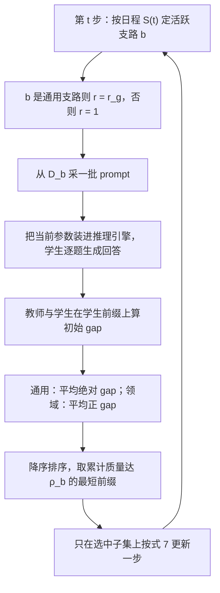

# CaMOPD：通用教师的原始数据对不齐时，恢复和保住不能混在同一次更新里

<!-- release-date: 2026-05-26 -->

> 本文依据快手（Kuaishou Technology）的 **Counteraction-Aware Multi-Teacher On-Policy Distillation for General Capability Recovery with Domain Preservation**，作者 Tianlei Chen、Jiao Ou、Ziyuan Liu、Ruiming Tang、Jian Liang、Han Li，全部署名 Kuaishou Technology, Beijing；Chen 与 Ou 并列第一，通讯作者是 Ou 与 Tang，Chen 的工作完成于在快手实习期间（PDF p. 1）。版本是 arXiv:2605.27115v2，2026-09-14，共 17 页。页码均指这份 PDF 本身的页码。文中区分三件事：**论文写了什么**、**我们如何解释或验算它**、**哪些是外部资料补充**。
>
> 这是一篇后训练方法论文，不发布模型。它只处理「领域特化之后，怎样把丢掉的通用能力找回来、又不把领域行为改丢」这一步。实验规模是 4B 与 8B（PDF p. 5–6）。模型架构、预训练、推理加速都不在范围内。

## 读前先把几个词说成人话

先看一个很常见的场景。你拿一个开源通用模型，用自己的数据把它后训练成角色扮演模型或医学问答模型。领域指标上去了，可原来会的写代码、做数学、听指令，掉了一截。

想把这截能力找回来，最直接的老师就是那个原模型。难处在于：你不知道它当年是用什么数据后训练出来的。这篇论文就卡在这里。

后面反复出现的词先说清楚：

- **策略 $\pi_\theta$**：正在训练的语言模型。给它一道题 $x$，它写出回答 $y$。
- **通用教师 $T_g$**：特化之前的那个开源原模型，冻结不动。
- **领域教师 $T_d$**：特化之后的模型，也冻结。学生的初始化就是这份权重，不是从原模型重新出发（PDF p. 3）。
- **On-policy 蒸馏（在策略蒸馏，OPD）**：学生先按自己当前的策略写回答，教师只在学生写出的前缀上逐 token 表态。相对的是 off-policy，教师先写范文，学生去背。
- **MOPD（Multi-Teacher On-Policy Distillation，多教师在策略蒸馏）**：同一个学生同时接受多个教师的逐 token 反馈，每个教师负责自己那一类题（PDF p. 1–3）。
- **师生对数概率差（token-level log-probability gap）**：学生已经写出某个词，教师和学生各给这个词一个对数概率，两者相减。它是本文所有公式围着转的那个标量。
- **灾难性遗忘（catastrophic forgetting）**：模型学了新领域之后，旧能力掉下去。经典补救是把通用数据混进训练，或者定期回放旧样本（PDF p. 1、p. 3）。
- **代理 prompt（proxy prompts）**：不是教师当年真正训练用的那批题，只是现在能拿到、看起来像通用分布的公开题。它和教师真实分布差多少，观察不到（PDF p. 1–2）。

强化学习算法 DAPO 只出现在医学教师 II-Medical-8B 的既有训练史里（PDF p. 6、p. 12），这篇论文没有重训它。

## 一句话先说清

现有的 MOPD 管线通常默认一件事：蒸馏时用的 prompt 要和教师自己的训练分布对得上，论文把它叫 **teacher-aligned prompt coverage（教师对齐的 prompt 覆盖）**，举的例子是 Xiaomi 的 MiMo-V2-Flash 与 Baichuan-M3（PDF p. 1）。通用教师是后训练数据未知的开源模型时，这个前提满足不了。

论文不去重建那份隐藏分布，而是只用公开通用题当代理，问：这样能不能一边找回通用能力、一边保住领域行为（PDF p. 1–2）。

在这种 **不完整覆盖（incomplete-coverage）** 设定下，论文指出原版 MOPD 有两种失效（PDF p. 2）：

1. **恢复–保住对抗（recovery-preservation counteraction）**：通用恢复和领域保住的梯度方向相反，加进同一次更新就互相抵消。
2. **弱信号抹平（weak-signal flattening）**：同一批样本的纠正需求差很多，均匀平均会把真正需要改的少数样本冲淡。

对应的方法叫 **CaMOPD（Counteraction-Aware MOPD）**，两招各治一种失效（PDF p. 2）：

1. **解耦交替训练（decoupled alternating training）**：默认连续三步只做通用恢复，第四步只做领域保住。
2. **基于 gap 的样本选择（gap-based sample selection）**：每一步只在当前那条支路里，挑师生对数概率差大的样本进入损失。

两条风格差很远的特化上，CaMOPD 的九项通用平均都是全表最高：角色扮演从最强对照的 45.26 到 49.07，医学从 43.35 到 45.84；领域平均保持在领域教师附近或之上（PDF p. 6–7）。梯度一致性分析用来支撑「选出来的子集更新方向更齐」（PDF p. 8）。

读完全文要补两句限定。第一，通用能力没有回到原模型：角色扮演九项平均 49.07 对通用教师的 53.39，医学 45.84 对 53.36（PDF p. 6）。第二，证据只在 4B 与 8B 两个尺度、两条领域上，没有多种子。

### 一条阅读路线

只有半小时读原文，建议按这个顺序：

1. **p. 4 的 Figure 2**：设定、两种失效、两招，一张图全有。
2. **p. 2 的 Figure 1 下半**：原版 MOPD 的跨域梯度点积，对抗假说的直接证据。
3. **p. 3 式 (1)–(2)，p. 5 式 (4)–(7) 与 Algorithm 1**：优势怎么算、分数怎么打、前缀怎么截。
4. **p. 6 Table 1–2**：主结果，连同两个教师一起读。
5. **p. 7 Figure 3，p. 8 Table 3**：选样在训练里的样子，以及四步消融链。
6. **p. 16–17 Table 7–9**：超参与消融的逐项明细。

## 主要矛盾：要找回的能力来自一个你看不到训练数据的老师

论文把问题放在特化之后，而不是从零整合多个领域（PDF p. 1、p. 3）。流水线只有三步：

1. 从一个开源通用模型出发；
2. 把它后训练成垂直领域模型；
3. 再用 MOPD 把丢掉的通用能力找回来。

到第三步，角色就定死了：原开源模型当通用教师；特化模型既是学生的起点，也是领域教师。领域 prompt 来自特化流水线，手里有；通用教师的原始后训练数据未知（PDF p. 1–3）。

经典对策为什么不够用？混入通用数据、回放旧样本，都严重依赖海量高质量原数据，训练日程也难排（PDF p. 1）。MOPD 用学生自己采样的轨迹加教师逐 token 反馈，看起来更省数据，可它默认的「prompt 盖住教师分布」这一条，恰好是开源教师给不了的（PDF p. 1）。

于是矛盾变成：

> 通用恢复只能用一批对不齐的代理题，而且和领域保住挤在同一个学生身上。两股信号怎么同时用，才不会互相踩？


图上有一个细节必须先看清：领域教师和学生一开始是**同一份权重**（PDF p. 3）。我们的推论是：领域支路在第一步几乎没有信号，要等通用恢复把学生从特化点拉开，领域教师才开始「往回拽」。这不是「大模型教小模型」，也不是「多个领域教师合进一个通才」，而是特化之后找回能力，外加别把垂直行为改丢。

多教师整合那一侧的设定，见 MOPD 一篇：那边每道题都能路由到对口教师，训练 prompt 被假定盖住了教师分布，教师之间是并列的领域专家。这边只有一个特化过的学生，两个教师一个是它的过去、一个是它的现在，而且通用那一侧故意用对不齐的题。

「故意预算有限」在附录里写得很具体。Nemotron-Post-Training-Dataset-v1 一共 25,659,642 条，五个官方划分是 chat 746,622、code 1,896,395、math 2,044,407、stem 20,662,167、tool calling 310,051；他们只按官方类别比例抽 10K 条当通用代理题（PDF p. 12）。**我们的换算**：10K 相对 2566 万大约是 0.039%。论文的意思是：在这么小、这么对不齐的代理语料上还能恢复，说明要处理的是两股信号互相踩，而不是数据找没找全（PDF p. 12）。

## 先把师生对数概率差说成人话

后面所有公式都围着同一个标量转。先不要看符号。

学生已经按自己的策略写出一个词 $y_t$。教师看到同一个前缀，也会给这个词一个概率。把两个对数概率相减：

- 教师比学生更喜欢这个词：差为正，训练鼓励学生以后多写它；
- 教师比学生更不喜欢这个词：差为负，训练把它压下去。

这条信号不需要环境打分，也不需要标准答案，每个 token 都有一个带符号的纠正量。前缀来自学生自己，所以是 on-policy。

论文还把这个差的大小当作 **纠正需求（correction demand）** 的无标签指标：有的样本师生差很多，有的几乎贴在一起（PDF p. 2、p. 5）。原版 MOPD 把它们平均进同一个 batch，CaMOPD 按这个需求挑样本。

### 原版 MOPD 的写法

记 $x\sim\mathcal{D}_b$，$b\in\{g,d\}$ 分别是通用支路和领域支路；学生写出长度为 $L$ 的回答 $y$，前缀 $h_t=(x,y_{<t})$。逐 token 的优势就是师生对数概率差（PDF p. 3，式 1）：

$$
\hat{A}_{b,t}(\theta)
=
\operatorname{sg}
\left[
\log\frac{\pi_{T_b}(y_t\mid h_t)}{\pi_\theta(y_t\mid h_t)}
\right]
$$

$\operatorname{sg}[\cdot]$ 是停梯度：只取数值，不回传。

回答不是由训练中的 $\pi_\theta$ 生成的，而是由推理引擎里加载了同一份参数的策略 $\mu_\theta$ 生成的。两者在数值上会有细微差别，所以每个 token 再乘一个训练–推理重要性权重 $w_t(\theta)$：比值 $\pi_\theta/\mu_\theta$ 落在 $[\epsilon_{\mathrm{low}},\epsilon_{\mathrm{high}}]$ 里时取这个比值（停梯度），否则取 0（PDF p. 3）。支路损失是（PDF p. 3，式 2）：

$$
\mathcal{L}^{b}_{\mathrm{MOPD}}(\theta)
=
-\mathbb{E}_{x\sim\mathcal{D}_b,\,y\sim\mu_\theta}
\left[
\frac{1}{L}
\sum_{t=1}^{L}
w_t(\theta)\,
\hat{A}_{b,t}(\theta)\,
\log\pi_\theta(y_t\mid h_t)
\right]
$$

读法是：优势当作固定系数，乘在学生对自己所写 token 的对数概率上；教师更喜欢的词被推高，更不喜欢的被压低。$\epsilon_{\mathrm{low}}$、$\epsilon_{\mathrm{high}}$ 的具体取值原文没有给。

原版 MOPD 每一步都把两条支路的梯度无条件加在一起（PDF p. 4）。问题就出在这一加。

## 失效一：恢复和保住在同一次更新里对冲


上半是概念图，不是实测轨迹。下半才是证据：原版 MOPD 训练过程中，通用恢复梯度和领域保住梯度的点积大部分时间为负（PDF p. 2、p. 4）。点积为负，意思是两条梯度夹角大于 90 度，加在一起时恢复方向有一部分被保住方向顶回去。

论文据此写：恢复方向的一部分在同一次混合更新里被保住方向隐式抵消了（PDF p. 4）。

**我们如何解释它。** 图下半的形状比「大部分为负」这句话多给了两条信息。

第一，冲突最强的是**训练早期**。两条曲线都在前 20 步前后到谷底，之后一路往 0 回升。这和「学生从领域教师的权重出发」一致：刚开始通用恢复把学生往外拉得最猛，领域教师往回拽得也最猛；后来学生找到了两边都能接受的位置，冲突就淡了。

第二，冲突没有在 120 步内完全消失，医学曲线一直略低于 0，角色扮演要到 100 步前后才偶尔过 0。

原文没有检验「只在前段交替、后段恢复混合」是否就够，也没有把点积由负转正和评测上涨逐步对应起来。所以这张图支持「对抗存在」，不支持「对抗贯穿全程且强度不变」。

## 失效二：弱信号被平均抹平

第二种失效发生在**同一条**反馈源内部。全批均匀平均时，每条样本的聚合权重相同，低需求样本会稀释高需求样本的贡献（PDF p. 4）。论文补了一句更关键的：纠正信号弱的样本，跨样本梯度一致性往往也差，它们分散的方向会进一步削弱那些方向一致、最有用的梯度（PDF p. 4）。

**我们如何解释它。** 两种失效的层次不同：

- 对抗是**跨支路**的加法问题。即使两条梯度各自都很干净，加在一起也会对冲。
- 抹平是**支路内**的加权问题。即使只训通用支路，把几乎已对齐的样本和差得很远的样本平均，更新方向也会被拉偏。

所以两招缺一不可：时间上把两条支路拆开，每条支路内部再按需求挑样本。

## 设计一：解耦交替训练，三步恢复、一步保住

**旧问题。** 原版 MOPD 每一步都把 $g_g+g_d$ 加在一起。Figure 1 已经说明这两条梯度在早期大多反向。

**新设计。** 借鉴多任务学习里任务级的交替优化（引 Luong 等人 2016、Akbari 等人 2023），把两股信号分配到不同的更新步上，按周期性日程轮流（PDF p. 4，式 3）：

$$
\mathcal{S}
=
\underbrace{G,\ldots,G}_{n_g},\,D
$$

连续 $n_g$ 个通用恢复步 $G$，后面跟一个领域保住步 $D$。每一步只更新当前活跃的那条支路 $b=\mathcal{S}(t)$。

**工作机制。** 这样一来，通用梯度和领域梯度是在**不同的参数点**上算的，不再在同一个混合更新里直接对冲（PDF p. 4–5）。主实验取 $n_g=3$，即 3-1 日程（PDF p. 13）。

**收益。** Table 3 的消融链里，把「3:1 数据比例的混合更新」换成「3-1 交替更新」，其余不变，角色扮演通用平均 46.10→46.51、领域平均 42.00→42.60；医学通用平均 43.19→44.63、领域平均 54.55→54.59（PDF p. 8）。两边都是一起涨，没有拿一边换另一边。

**代价与边界。** 领域信号的更新频率只剩四分之一。超参扫描里，5-1 日程的通用平均 48.53 与 3-1 的 49.07 接近，领域平均却从 45.00 掉到 43.86；1-1 日程通用只有 47.64，领域 43.93（PDF p. 8，Figure 4；PDF p. 16，Table 7）。回看太稀会丢领域，太密则恢复不够，3-1 只是角色扮演上扫出来的折中。医学设定没有做日程扫描，直接沿用 3-1。

**我们的解释。** 「3:1 数据比例」和「3-1 日程」看起来是同一个数字，其实是两件事。前者仍在同一次反传里让两股梯度对冲，只是通用那股更重；后者让每一步的梯度里根本没有另一条支路。消融链最后一步比的正是这一点。

**可迁移启发。** 两个目标的梯度点积若持续为负，先把它们放到不同的 step，再谈怎么加权。日志里「数据比例」和「更新日程」要分开记，不能混成一个超参。

## 设计二：按角色不对称的 gap 选样

### 两条支路打分方式不同

**旧问题。** 全批均匀平均会抹平少数高需求样本（失效二）。

**新设计。** 在当前活跃支路里，先用参数更新**之前**的初始 token 级差当作无标签指标（PDF p. 5）：

$$
\Delta_{b,i,t}
=
\log\pi_{T_b}(y_{i,t}\mid h_{i,t})
-
\log\pi_\theta(y_{i,t}\mid h_{i,t})
$$

通用恢复看整条回答上**绝对差**的平均，任何和通用教师的大偏离都算恢复信号（PDF p. 5，式 4）：

$$
s_g(x_i)=\frac{1}{L_i}\sum_{t=1}^{L_i}\lvert\Delta_{g,i,t}\rvert
$$

领域保住只看**正差**的平均，也就是领域教师仍比学生更喜欢的那些 token（PDF p. 5，式 5）：

$$
s_d(x_i)=\frac{1}{L_i}\sum_{t=1}^{L_i}[\Delta_{d,i,t}]_{+}
$$

$[z]_{+}=\max(z,0)$。论文的理由是两条支路职责不同：通用恢复把任何大偏离都当有用信号；领域保住优先保护领域教师给了更高概率的 token，避免对已经像样的领域行为过度惩罚（PDF p. 5）。

**我们的解释，分三层。**

第一，通用侧用绝对值，是因为特化之后学生相对原模型的偏离可正可负。只看正差会漏掉「学生把原模型不喜欢的词写得太高」这类该压的位置。

第二，领域侧只看正差，等于承认学生在特化点附近已经会写领域风格。学生比领域教师还自信的位置不算保住需求，这样不会把已经对的领域行为再往回拧。

第三，这个分数在生成当下就算出来，不需要标准答案，也不需要另训一个打分模型。代价是：它量的是「当前师生在这条轨迹上差多少」，不是「这道题对评测有多重要」。代理题本身对不齐时，gap 大也可能只是分布外噪声。论文用梯度一致性的正增益来说明「至少更新方向更齐」，没有直接证明 gap 大的样本就是评测上该补的能力。

### 按累计质量截取，不按固定条数


给定活跃支路的一批样本 $\mathcal{B}_b$ 和 **gap 分质量目标** $\rho_b\in(0,1]$，先按 $s_b$ 从大到小排序得到 $x_{(1)},\ldots,x_{(|\mathcal{B}_b|)}$，再取能覆盖累计质量 $\rho_b$ 的最短前缀（PDF p. 5，式 6）：

$$
k_b
=
\min
\left\{
k:
\frac{\sum_{j=1}^{k}s_b(x_{(j)})}
{\sum_{j=1}^{|\mathcal{B}_b|}s_b(x_{(j)})}
\ge\rho_b
\right\}
$$

选中集合是 $S_b=\{x_{(1)},\ldots,x_{(k_b)}\}$，损失只在这个子集上算。主实验两条支路都取 $\rho=0.8$（PDF p. 13）。

上图把式 (6) 画成了两种形状。条数不是超参，而是被这一批的分数分布算出来的：纠正需求集中时自动少留，分散时自动多留。后面 Figure 3 会显示，真实训练里正好出现了这两种形状。

### 支路缩放与最终目标

为了在选中样本上加大优化力度，再给每条支路一个缩放系数 $r_b$，默认 $r_g=2$、$r_d=1$，只放大通用支路的教师反馈（PDF p. 5、p. 13）。活跃支路 $b$ 的目标是（PDF p. 5，式 7）：

$$
\mathcal{L}^{\mathrm{CaMOPD}}_{b}(\theta)
=
-\frac{1}{|S_b|}
\sum_{x_i\in S_b}
\left[
\frac{1}{L_i}
\sum_{t=1}^{L_i}
w_{i,t}(\theta)\,
r_b\,\hat{A}_{b,i,t}(\theta)\,
\log\pi_\theta(y_{i,t}\mid h_{i,t})
\right]
$$

和式 (2) 比，变化只有三处：期望换成选中子集上的平均；优势乘了 $r_b$；每一步只碰当前支路。重要性采样的那部分原样保留（PDF p. 4）。

Algorithm 1 把一步写全（PDF p. 5）：



这张流程图按原文 Algorithm 1（PDF p. 5）重画，是步骤示意，不含实测时间。

**我们的判断。** 公式层面 CaMOPD 没有换散度，也没有改 on-policy 骨架。它改的是**什么时候更新哪条支路**，以及**这条支路里哪些样本进入损失**。贡献在调度和选样，不在新的蒸馏损失。

**可迁移启发。** 纠正需求可以直接用教师已经在算的对数差打分，不必另训 selector。选样按质量覆盖而不是按固定条数，能自动适应尖和平两种需求分布。

## 实验设定：两条风格差很远的特化

### 模型与数据

| 项目 | 角色扮演对话 | 医学推理问答 |
|---|---|---|
| 基座与通用教师 $T_g$ | Qwen3-4B-Instruct-2507 | Qwen3-8B |
| 领域教师 $T_d$ 与学生初始化 | 同一基座在 CoSER 上 SFT | 公开的 II-Medical-8B（在 Qwen3-8B 上做医学 SFT 与 DAPO 强化学习） |
| 通用恢复数据 | 10K Nemotron 代理题，按官方类别比例抽 | 同左 |
| 领域保住数据 | 10K 条留出的长轮次 CoSER 对话 | 10K 条只有题目的医学题，训练不用标准答案 |

（PDF p. 5–6、p. 12–14，Table 4）

角色扮演的数据切分值得单独说。CoSER 来自 771 本小说的多轮、多角色对话。他们先按对话轮数排序，轮数最多的 10K 段留给 MOPD 的领域支路：前面的轮次当上下文，最后一轮留给学生 on-policy 续写，这些对话**从不进入**角色扮演 SFT；其余 300K 段用来 SFT 出领域教师（PDF p. 12）。理由是：领域保住的更新要在 SFT 没见过的上下文上算；长轮次还逼模型在更丰富的上下文里维持人设、对话状态和情节一致性（PDF p. 12）。

医学侧不在本工作里从零训医学模型，直接拿 II-Medical-8B 当起点和保住教师（PDF p. 12）。10K 条保住题来自与 II-Medical 数据生态相关的来源：MedMCQA 4K、MedReason 3K、Medical-R1-Distill-Data 英文 2K、m23k-tokenized 1K（PDF p. 12–13）。

三路数据的样本长什么样，附录 Figure 5–7 给了字段结构（PDF p. 13）：

| 数据流 | 一条样本里有什么 | 训练时怎么用 |
|---|---|---|
| Nemotron 通用题 | 类别标签（math、code、stem、chat、tool calling）；用户任务；公开模型合成的参考回答；来源元数据，工具调用类另带工具 schema | 只用用户任务当 prompt |
| CoSER 角色扮演 | 系统消息里的角色设定与场景；之前各轮的对话与动作；下一句角色回复；另有人物档案、情节摘要等辅助字段 | 前面轮次当上下文，学生续写下一句 |
| 医学保住题 | 原始字段：题干、可选的 A–D 选项 | 套进固定模板，答案与解析不放进 prompt |

医学题的模板按原文 Figure 7 整理如下，是中文转述的结构示意，花括号是占位符：

```text
[system] 你是谨慎的医学推理助手。提供教育性的医学信息，必要时说明不确定性，
         并建议就诊断或治疗决策咨询专业医生。
[user]   {question}
         A. {opa}  B. {opb}  C. {opc}  D. {opd}
         请逐步推理，并在最后给出答案选项。
（只有题干、没有选项的来源：改成「请逐步推理并清楚作答，不要把答案当作专业医疗建议的替代」）
```

### 训练配方

SFT 用 ms-swift，MOPD 训练管线用 verl（PDF p. 13）。所有 MOPD 类方法：每道题只生成 1 条回答，训练 120 步，每步 512 道题，学习率 $2\times10^{-6}$，prompt 截断 4096 token，回答上限 32768 token。CaMOPD 默认 3-1 日程、$\rho_g=\rho_d=0.8$、$r_g=2$、$r_d=1$。训练在 4 台、每台 8 张 H100 的集群上，每次运行 32 张卡约 7 小时，约合 224 GPU 小时（PDF p. 13）。

Figure 1 和 Figure 3 里的梯度，是对全部模型参数在每个分析步上计算，并在张量并行与流水线并行的分片之间聚合得到的（PDF p. 13）。

**我们的换算。** $120\times512=61{,}440$ 次题目采样。3-1 日程下大约 90 步通用、30 步领域，即通用约 46K 次、领域约 15K 次，分别来自各自那 10K 道题，必然重复使用。原文没有讨论轮数与去重。

### 评测怎么打分

通用能力九项（PDF p. 6、p. 14–15，Table 5）：

| 基准 | 生成设置 | 计分 |
|---|---|---|
| GPQA-Diamond | 0-shot，$T=0.7$，$n=4$，最长 32K | Qwen2.5-14B-Instruct 抽答案并判等价，报 $k=1$ 的 pass@1 估计 |
| HMMT25 | $T=0.6$，$n=16$，最长 32K | 同上 |
| ZebraLogic | $T=0$，$n=1$，最长 32K | 官方网格规则 |
| LiveCodeBench v5 / v6 | 0-shot，$T=0$，$n=1$，最长 32K | 官方执行 |
| IF-Eval | $T=0$，$n=1$，最长 16K | 官方确定性规则 |
| Arena-Hard v2 Hard Prompt / Creative Writing | $T=0$，$n=1$，最长 32K | GPT-4.1 成对偏好 |
| LiveBench 1125 | $T=0$，$n=1$，最长 32K | 官方混合判分 |

GPQA 与 HMMT 的答案验证器，在 100 条模型输出（两项各 50 条）上与官方规则抽取全部一致（PDF p. 15）。

角色扮演跟 CoSER 的 Given-Circumstance Acting（GCA）协议：环境模型、下一说话人预测和评委都固定为 Qwen2.5-72B-Instruct，只换被评的模型。四个维度是 Storyline Consistency、Anthropomorphism、Character Fidelity、Storyline Quality，算术平均当领域平均（PDF p. 15）。他们也用官方 GPT-4o 版的 GCA 配置评过 Table 1 的模型，排名相同；因为多轮模拟和评判成本高，所有报告的主表、消融和超参都用 Qwen2.5-72B 配置（PDF p. 15）。

医学领域：MedXpertQA Text 全量测试集 2,450 题，MedQA-USMLE 四选一测试集 1,273 题，都从最终答案字母做精确匹配（PDF p. 15–16，Table 6）。

### 对照：同一套训练外壳，改的是局部信号

每个领域比较这几种方法（PDF p. 6）：

- **Vanilla MOPD**：原版，两条支路每步混合更新。
- **Relaxed OPD**（Ko 等人 2026）：把师生对数似然比当 token 奖励，用奖励裁剪和按熵采样 token 放松严格模仿。
- **SelecTKD**（Huang 等人 2025）：propose-and-verify 式的 token 选择，接受的 token 走完整蒸馏损失，拒绝的 mask 或降权。
- **Off-policy KD**：对两个教师各自生成的回答混在一起做 SFT。

Relaxed OPD 和 SelecTKD 是在原版 MOPD 的训练机制里复现的：同一学生初始化、同一对教师、同一数据流、同一 batch、同一 rollout 预算、同一优化器与步数（PDF p. 6）。

**我们的观察。** 这两个对照改的是**局部 token 信号**，不改「每一步是否混合两条支路」。论文在相关工作里也把这类方法归为「修正局部信号」，而把自己的选样说成提高跨样本梯度一致性（PDF p. 2–3）。所以 Table 1–2 实际在问：在同样的混合更新外壳里修 token，能不能替代「拆开支路加按样本挑人」。

## 主结果：通用平均全表最高，但离原模型还有距离

### Table 1：角色扮演（4B）

（PDF p. 6，Table 1。全部越高越好；Gen. 为九项通用平均，Dom. 为 GCA 四维平均。）

| 模型 | GPQA | Zebra | HMMT25 | LCB v5 | LCB v6 | IF-Eval | Arena-HP | Arena-CW | LiveBench | Gen. | Story Cons. | Anthro. | Char. Fid. | Story Qual. | Dom. |
|---|---:|---:|---:|---:|---:|---:|---:|---:|---:|---:|---:|---:|---:|---:|---:|
| 通用教师 | 61.49 | 79.50 | 33.12 | 34.77 | 20.57 | 83.18 | 36.50 | 65.80 | 65.60 | 53.39 | 34.74 | 23.09 | 23.89 | 41.98 | 30.92 |
| 角色扮演教师 | 54.29 | 31.50 | 26.67 | 25.09 | 16.00 | 67.65 | 9.70 | 4.20 | 42.80 | 30.88 | 42.27 | 33.42 | 38.75 | 49.89 | 41.08 |
| Off-policy KD | 60.35 | 68.50 | 28.54 | 30.47 | 23.43 | 75.97 | 23.60 | 11.20 | 57.00 | 42.12 | 41.25 | 32.15 | 38.23 | 49.61 | 40.31 |
| Vanilla MOPD | 61.99 | 71.30 | 29.17 | 31.54 | 22.29 | 79.67 | 25.50 | 13.70 | 58.90 | 43.78 | 43.57 | 34.91 | 41.45 | 51.50 | 42.86 |
| Relaxed OPD | 63.51 | 71.40 | 31.25 | 32.26 | 22.86 | 79.67 | 30.10 | 17.30 | 59.00 | 45.26 | 45.42 | 33.35 | 41.53 | 52.84 | 43.28 |
| SelecTKD | 60.98 | 70.60 | 31.04 | 34.41 | 24.00 | 78.93 | 27.10 | 16.90 | 58.90 | 44.76 | 43.87 | 32.28 | 39.46 | 51.54 | 41.79 |
| CaMOPD | 62.63 | 76.30 | 31.04 | 37.28 | 24.00 | 80.41 | 33.20 | 33.30 | 63.50 | 49.07 | 47.81 | 33.96 | 44.65 | 53.47 | 45.00 |

论文的读法：九项通用里 CaMOPD 在七项上最好或并列最好；相对每项的最强对照，Arena-Hard Creative Writing 17.30→33.30，ZebraLogic 71.40→76.30，LiveBench 59.00→63.50（PDF p. 7）。领域侧，所有 MOPD 类方法都贴近或超过领域教师（PDF p. 7）。

读这张表还要看清四件事。

**特化切得很深，而且不均匀。** 从通用教师到角色扮演教师，Arena-CW 从 65.80 掉到 4.20，ZebraLogic 79.50→31.50，GPQA 只从 61.49 掉到 54.29。CaMOPD 把 Arena-CW 拉回 33.30，只有原模型的一半。「通用恢复最好」是相对对照而言，不是回到了特化前。

**不是每一列都赢。** 没赢的两项是 GPQA（Relaxed OPD 的 63.51 更高，甚至高过通用教师）和 HMMT25（Relaxed 的 31.25 略高）；LCB v6 与 SelecTKD 并列 24.00；Anthropomorphism 上 Vanilla 的 34.91 更高。CaMOPD 赢的是写作、代码、综合榜和领域平均这组最难同时拉起来的组合。

**学生在个别项上超过了教师。** LCB v6 上连 Vanilla 都以 22.29 超过通用教师的 20.57。领域平均 45.00 也超过领域教师的 41.08。

**Off-policy KD 两头都输。** 它的通用平均 42.12 低于所有 MOPD 类方法，领域平均 40.31 还低于领域教师本身。这是论文把 MOPD 当起点的最直接理由：同样两个教师，让学生去背教师写好的范文，既找不回通用、也保不住领域。原文没有单独评论这一行，这是我们的读法。

### Table 2：医学（8B）

（PDF p. 6，Table 2。Dom. 为 MedQA-USMLE 与 MedXpertQA Text 的平均。）

| 模型 | GPQA | Zebra | HMMT25 | LCB v5 | LCB v6 | IF-Eval | Arena-HP | Arena-CW | LiveBench | Gen. | MedQA | MedXpertQA | Dom. |
|---|---:|---:|---:|---:|---:|---:|---:|---:|---:|---:|---:|---:|---:|
| 通用教师 | 62.50 | 84.80 | 45.00 | 58.42 | 31.43 | 84.66 | 24.80 | 36.50 | 52.10 | 53.36 | 79.03 | 17.22 | 48.13 |
| 医学教师 | 62.37 | 71.60 | 28.33 | 48.75 | 27.43 | 48.98 | 10.90 | 36.40 | 34.40 | 41.02 | 86.17 | 22.90 | 54.54 |
| Off-policy KD | 60.10 | 70.30 | 34.38 | 50.54 | 24.57 | 48.61 | 13.20 | 32.60 | 41.70 | 41.78 | 85.23 | 22.41 | 53.82 |
| Vanilla MOPD | 60.10 | 72.60 | 33.96 | 51.25 | 24.00 | 48.06 | 14.80 | 33.00 | 42.80 | 42.29 | 86.02 | 23.55 | 54.79 |
| Relaxed OPD | 61.49 | 73.20 | 32.92 | 53.76 | 29.14 | 48.61 | 15.40 | 34.90 | 40.70 | 43.35 | 85.94 | 24.12 | 55.03 |
| SelecTKD | 58.46 | 72.10 | 33.54 | 54.48 | 29.71 | 49.17 | 15.20 | 35.60 | 41.80 | 43.34 | 85.78 | 23.51 | 54.65 |
| CaMOPD | 61.99 | 72.60 | 34.58 | 56.63 | 29.71 | 59.89 | 16.40 | 31.80 | 49.00 | 45.84 | 85.78 | 23.63 | 54.71 |

论文的读法：九项通用里同样有七项最好或并列最好；相对每项最强对照，IF-Eval 49.17→59.89，LiveBench 42.80→49.00，LiveCodeBench v5 54.48→56.63（PDF p. 7）。

没赢的两项是 ZebraLogic（72.60，低于 Relaxed 的 73.20）和 Arena-CW（31.80，低于 SelecTKD 的 35.60，也低于两个教师）。领域平均 54.71 贴着医学教师的 54.54，但低于 Relaxed 的 55.03 和 Vanilla 的 54.79，不是第一。

**我们的解释。** 医学特化几乎没伤 GPQA（62.50→62.37）和 Arena-CW（36.50→36.40），伤的是 IF-Eval（84.66→48.98）、LiveBench（52.10→34.40）、HMMT 与代码。CaMOPD 把 IF-Eval 拉回 59.89，仍离 84.66 很远；LiveBench 49.00 已接近原模型的 52.10。不同能力的可恢复程度差很多。Arena-CW 在所有方法里都比两个教师低，说明通用恢复不是各项一起单调回升。

领域数字几乎不动，和角色扮演形成对照。CoSER 的 GCA 平均还能从 41.08 推到 45.00，医学两项客观题已经在教师附近饱和。保住的成功标准，在医学这条线上是「别掉」，在角色扮演上还能「再涨」。

## 训练里的选样长什么样


右边两列是选中比例，四张图都在同一个 80% 质量目标下。论文的读法：通用支路在两个领域都需要较宽的覆盖；领域支路在角色扮演里很稀，在医学里仍然较宽，说明领域纠正需求随任务差很多（PDF p. 7–8）。

左边两列是 **梯度一致性增益（gradient coherence gain，GCG）**。先定义一组样本 $A$ 的梯度一致性（PDF p. 8）：

$$
\mathrm{Coh}(A)=\frac{\left\lVert\sum_{i\in A}g_i\right\rVert}{\sum_{i\in A}\lVert g_i\rVert}
$$

$g_i$ 是样本 $i$ 的参数梯度。所有梯度同向时，分子等于分母，Coh 为 1；互相抵消时接近 0。GCG 是选中子集相对完整候选批的相对提升（PDF p. 8）：

$$
\mathrm{GCG}
=
\frac{\mathrm{Coh}(A_{\mathrm{selected}})-\mathrm{Coh}(A_{\mathrm{full}})}{\mathrm{Coh}(A_{\mathrm{full}})}\times 100\%
$$

论文的读法：两个领域的 GCG 大部分时间为正，角色扮演领域支路增益尤其大，医学更小但方向一致；结合选中比例，他们认为 gap 选样减轻了弱信号抹平（PDF p. 8）。

**我们如何解释它。** 两列放在一起读，正好是上一节小例子的真实版。角色扮演领域支路是「尖」的：四分之一的样本就拿走了 80% 的正 gap 质量，扔掉的四分之三梯度方向很散，所以一扔增益就大。医学领域支路是「平」的：要留大约四分之三，能扔的尾巴短，增益也小。

角色扮演的通用支路还有一个细节：选中比例在前 20 步从约 0.45 升到约 0.65，之后停在 0.68 附近。训练刚开始时通用纠正需求更集中，后来摊开了。这和 Figure 1 的「早期冲突最强」是同一段时间，但原文没有把两者联系起来。

**GCG 证明不了什么。** 它说明「按 gap 丢掉的那些样本，梯度更不齐」，不说明「这些样本对评测没用」。它支持抹平假说的机制一侧，不能单独解释 Table 1 里 Arena-CW 的大涨。交替训练那一招也不出现在这八张图里，对抗假说主要靠 Figure 1 与消融链。

## 超参：3-1、$r_g=2$、$\rho_g=0.8$ 是折中，不是单项冠军

只在角色扮演上扫了日程、$r_g$ 和 $\rho_g$（PDF p. 8、p. 15–16）。原文 Figure 4 把九项通用平均和领域平均画成条形图，数值如下：

| 配置 | 通用平均 | 角色扮演平均 |
|---|---:|---:|
| Vanilla MOPD | 43.78 | 42.86 |
| 1-1，$r_g=2$，$\rho_g=0.8$ | 47.64 | 43.93 |
| 3-1，$r_g=2$，$\rho_g=0.8$（主配置） | 49.07 | 45.00 |
| 5-1，$r_g=2$，$\rho_g=0.8$ | 48.53 | 43.86 |
| 3-1，$r_g=1$，$\rho_g=0.6$ | 46.03 | 44.45 |
| 3-1，$r_g=1$，$\rho_g=0.8$ | 46.09 | 44.01 |
| 3-1，$r_g=2$，$\rho_g=0.6$ | 47.72 | 44.56 |
| 3-1，$r_g=3$，$\rho_g=0.6$ | 47.03 | 44.70 |
| 3-1，$r_g=3$，$\rho_g=0.8$ | 47.89 | 44.54 |

（PDF p. 8，Figure 4；逐项明细在 PDF p. 16，Table 7。）

论文的读法：3-1 给出最好的恢复–保住折中；5-1 通用差不多，领域开始掉；1-1 恢复更保守，领域也更低。固定 3-1 时，$r_g=2$、$\rho_g=0.8$ 的通用汇总最好：质量目标更大、覆盖更宽，缩放又放大了选中的高需求样本（PDF p. 16）。

**读 Table 7 时不要被汇总带偏。** 单项最高分散落在别的配置里：5-1 的 Arena-HP 35.20、ZebraLogic 76.70，1-1 的 LCB v5 37.99，$r_g=3$、$\rho_g=0.8$ 的 IF-Eval 80.96 和 HMMT25 31.88（PDF p. 16）。论文自己也写：其他组合能提高单项，但提升不够一致；主配置优先的是各类基准上稳健的通用恢复，同时保持有竞争力的角色扮演保住（PDF p. 16）。

$r_g=3$ 没有比 $r_g=2$ 更好，放大不是越大越好。医学设定没有做超参扫描，主配置是从角色扮演搬过去的。

## 消融链：四步各拿掉一个部件

Table 3 是一条逐步拆的消融链：每相邻两行只改一个部件，其余设置不变（PDF p. 8）。

- **CaMOPD**：3-1 交替，丢掉低 gap 尾巴，对高 gap 样本乘 $r_g=2$；
- **去掉选样**：同样 3-1 交替，高 gap 样本仍乘 $r_g=2$，低 gap 样本留着但不放大；
- **再去掉缩放**：全部样本都用，不放大；
- **再去掉解耦**：改成混合更新，通用与领域样本按 3:1 混在一起。

| 变体 | 角色扮演 通用平均 | 角色扮演 领域平均 | 医学 通用平均 | 医学 领域平均 |
|---|---:|---:|---:|---:|
| CaMOPD | 49.07 | 45.00 | 45.84 | 54.71 |
| 去掉选样 | 47.21 | 43.46 | 44.94 | 54.61 |
| 再去掉缩放 | 46.51 | 42.60 | 44.63 | 54.59 |
| 再去掉解耦（3:1 混合） | 46.10 | 42.00 | 43.19 | 54.55 |

（PDF p. 8，Table 3；逐项明细在 PDF p. 17，Table 8–9。）

论文的结论：两个设定里，每往下拆一步，通用平均和领域平均都下降（PDF p. 8）。表上确实如此。

**我们的读法。** 把每一步的增量拆开看，两个领域的主力部件不一样：

- 角色扮演上，最大的一步是**选样**：通用 +1.86、领域 +1.54；解耦只贡献通用 +0.41、领域 +0.60。
- 医学上，最大的一步是**解耦**：通用 +1.44；选样 +0.90；领域平均四行只差 0.16。

这和 Figure 3 对得上：角色扮演领域支路的 gap 分布很尖，选样能扔掉的东西多；医学领域支路很平，选样能扔的少，交替更新反而更要紧。

还有一个对照要和主表连起来读。最后一行「3:1 混合」在角色扮演上通用 46.10、领域 42.00，对比 Vanilla MOPD 的 43.78 与 42.86：往混合更新里多塞通用题能抬通用，但领域掉到了 Vanilla 之下。医学上 43.19 对 42.29、54.55 对 54.79，方向相同。这正是「改数据比例替代不了拆开更新」。Vanilla MOPD 自己的混合比例，原文没有写明。

逐项明细里还有不单调的地方。角色扮演「去掉选样」一行的 HMMT25 是 28.13、IF-Eval 77.63，都低于再拆一步的那一行（PDF p. 17，Table 8）。只有平均值是单调的，单项不是。消融只有单次运行，没有多种子，不能当成各部件贡献的精确分解。

## 它在后训练系统里接在哪

这篇论文交付的是特化之后的恢复配方，不是新模型。放回后训练系统里，可以收成三句话。

**第一，把 MOPD 从「教师数据齐全的能力整合」拉到「教师数据缺失的能力找回」。** 工业报告里的多教师蒸馏，往往默认能按领域把题路由给对口教师、训练题盖住教师分布。开源通用教师不满足这一条。CaMOPD 的做法是：领域题用特化流水线里现成的，通用题用公开代理，再用调度处理两股信号的冲突。

**第二，冲突先按时间拆，再按样本筛。** 跨支路的加法冲突与支路内的均匀平均是两种不同的失效。只改数据比例会伤领域；只交替不选样，角色扮演领域平均到不了 45.00。这给后训练系统一个可检查的顺序：先看跨目标的梯度点积，再看批内的梯度一致性。

**第三，打分用的是教师本来就在算的对数概率。** 通用用绝对差，领域用正差，对应「找回一切偏离」和「只保教师仍想保的」。按质量覆盖而不是按条数截取，能适应尖和平两种需求分布。

适用前提也很清楚：

1. 学生从领域特化点出发，通用教师就是它特化之前的那个原模型，不是更大的外部教师；
2. 领域题可得，通用教师的原始数据不可得，只能用代理题；
3. 训练时知道当前这一步属于恢复还是保住，两个教师不在同一次反传里混；
4. 证据在 4B 与 8B、固定 32K 回答上限下，没有外推到更大的模型。

## 限制与未公开信息

论文自己写的限制（PDF p. 9）：

- 实验只有 4B 角色扮演和 8B 医学。受算力所限，没有评测更大的特化模型。
- On-policy 回答固定 32K 上限，是为了不人为限制长推理模型的输出，但没有研究不同长度预算怎样改变恢复–保住折中。

伦理一节把医学线限定在研究和教育基准上，写明结果不应被当作专业医疗建议、诊断或治疗；临床部署需要更强的验证、专家监督、安全护栏与合规。训练和评测只用公开数据集与开源模型，不用私人病历或可识别身份的医疗信息（PDF p. 9）。

对照原文还能看到、但没有当成头条的缺口：

- 两种失效各有一类证据：负点积支持对抗，GCG 支持抹平。没有把「点积由负转正」和「评测上涨」做成逐步的因果链。
- 没有「单个通才教师做 on-policy 蒸馏」的对照，收益不能完全归给「多教师」，更应归给「交替加选样」。
- 没有多种子、没有显著性检验。Arena-Hard 用 GPT-4.1 评，角色扮演评委是 Qwen2.5-72B-Instruct，GPQA 与 HMMT 的等价判定是 Qwen2.5-14B-Instruct。
- 医学设定没有超参扫描，3-1 是从角色扮演搬过去的。
- 重要性权重的截断区间 $\epsilon_{\mathrm{low}}$、$\epsilon_{\mathrm{high}}$ 没给数值；教师前向占多少卡、是否与生成重叠、每步墙钟开销都没写。
- 没有代码或数据发布页。
- 通用恢复没有回到原模型：角色扮演 Arena-CW 33.30 对 65.80，医学 IF-Eval 59.89 对 84.66。摘要里的「在通用恢复上超过所有基线」不能读成「恢复到了特化前」。

**主张与证据要分开的地方。**

- 「MOPD 训练机制本身足以保护领域能力」（PDF p. 7）是两条设定上领域平均不掉的观察，不是去掉领域支路后的对照实验。
- 「两条风格迥异的设定都成功，说明方法具有广泛适用性」（PDF p. 2）只有两个领域、两个尺度。
- GCG 大部分为正，是机制侧的支持，不是评测上的因果证明。

## 可迁移启发

1. **先画跨目标的梯度点积。** 两条损失的点积若持续为负，优先把它们拆到不同的 step，而不是继续调混合权重。消融链最后一行已经说明，给恢复多塞数据会伤保住。
2. **看点积曲线的形状，不只看符号。** Figure 1 的冲突集中在前 20–40 步。自己的系统里若也是这样，交替最该在早期严格执行；后期能不能放松，原文没有测，值得自己试。
3. **纠正需求用教师已经在算的对数差打分。** 不必另训 selector。先问这条支路要的是「拉回一切偏离」还是「只保教师仍想抬的行为」，再决定用绝对值还是正部。
4. **按质量覆盖截取，不要死守固定条数。** 同样 $\rho=0.8$，角色扮演领域只留约四分之一，医学领域要留约四分之三。固定条数会在尖分布上留太多噪声，在平分布上丢掉有用的尾巴。
5. **先看分布再决定主力部件。** 角色扮演靠选样拿到最大增量，医学靠解耦。上线前先画一张批内 gap 分布，尖就先上选样，平就先上交替。
6. **只放大需要猛恢复的那一支。** $r_g=2$、$r_d=1$ 是不对称缩放；$r_g=3$ 没有更好，放大有上限。
7. **领域留出集要比 SFT 更难、更新鲜。** CoSER 把最长的 10K 段对话留给 MOPD，且不进 SFT。On-policy 保住问的是学生现在会怎么续写，不是把背过的范文再喂一遍。
8. **对照要放进同一训练外壳。** Relaxed OPD 和 SelecTKD 都在原版 MOPD 机制里复现，比各跑各的官方配方更能回答「局部修 token 能不能替代拆开支路」。

## 关键词回看

- **领域特化**：把通用模型后训练到垂直行为，常常伤及通用能力。
- **教师对齐的 prompt 覆盖**：现有 MOPD 常作的假设，蒸馏用的题要盖住教师自己的训练分布。
- **代理 prompt 与不完整覆盖**：公开通用题代替未知的教师后训练数据；本文是按类别比例抽的 10K 条 Nemotron。
- **恢复–保住对抗**：通用恢复与领域保住的梯度方向冲突，混进同一次更新就互相抵消；Figure 1 的跨域点积大部分为负，早期最强。
- **弱信号抹平**：均匀平均让低需求样本稀释高需求样本，且弱信号样本的梯度方向更散。
- **解耦交替训练**：日程 $G,\ldots,G,D$，每步只更新一条支路；主配置 3-1。
- **绝对 gap / 正 gap**：通用支路对 $\lvert\Delta\rvert$ 取平均，领域支路对 $[\Delta]_{+}$ 取平均。
- **gap 分质量目标 $\rho$**：选中的最短前缀至少覆盖这么多累计分数；主配置 0.8。
- **支路缩放 $r_b$**：主配置 $r_g=2$、$r_d=1$。
- **Coh 与 GCG**：梯度合向量长度除以长度之和；选中子集相对完整批的相对提升。
- **Vanilla MOPD / Relaxed OPD / SelecTKD / Off-policy KD**：混合更新基线、两种修局部 token 信号的对照、对教师回答做 SFT 的离策略基线。

## 最后的判断

CaMOPD 的损失函数几乎就是带重要性权重的 on-policy 蒸馏，优势仍是师生对数概率差。它多出来的是一个诊断：在代理题下，失败来自**跨支路对冲**和**支路内抹平**，然后用日程和选样分别处理，而不是再写一种蒸馏损失。

被实验支撑的：

- 原版 MOPD 的跨域梯度点积在两条设定上大部分为负，早期最强（PDF p. 2，Figure 1）；
- 角色扮演九项通用平均从最强对照 45.26 到 49.07，领域平均 45.00 为全表最高（PDF p. 6–7，Table 1）；
- 医学九项通用平均从 43.35 到 45.84，IF-Eval 49.17→59.89，领域平均 54.71 贴近教师的 54.54（PDF p. 6–7，Table 2）；
- 同一 80% 质量目标下，角色扮演领域支路选中比例约四分之一、GCG 增益最大，医学领域支路约四分之三、增益较小（PDF p. 7，Figure 3）；
- 四步消融链里通用与领域平均逐步下降，3:1 混合的领域平均低于原版 MOPD（PDF p. 6、p. 8）；
- 3-1、$r_g=2$、$\rho_g=0.8$ 是角色扮演扫描里汇总最好的折中（PDF p. 8、p. 16）。

是作者观察或组织主张的：

- 「MOPD 机制本身足以保护领域能力」；
- 「风格迥异的两个设定都成功，因此具有广泛适用性」；
- GCG 正增益等于减轻了弱信号抹平。

明确没做到的：

- 通用能力没有回到原模型，角色扮演 Arena-CW、医学 IF-Eval 缺口仍大；
- 医学 Arena-CW 低于两个教师，医学领域平均不是第一；
- 没有更大模型、没有变长回答预算、没有多种子、没有代码。

如果只记一句话：

> **教师对齐的题集拿不到时，稀缺的不是一种新蒸馏公式，而是别让恢复和保住在同一次更新里对打，并把更新预算留给师生对数概率真正差得远的那些样本。**

## 资料与阅读边界

### 版本与首发日

- 依据 [arXiv:2605.27115v2](https://arxiv.org/abs/2605.27115v2)，2026-09-14 修订，17 页。v1 于 2026-05-26 提交；v2 增加了 Off-policy KD 基线与九项通用平均列，定义了重要性权重的截断形式，并把消融改成覆盖两个领域的四步消融链，旧版的消融表与措辞不再沿用。
- `release-date` 取 **2026-05-26**。这是一篇只讲公开技术、不发布模型的方法论文，按技术首次官方公开日取 arXiv v1 的提交日（[v1 页面](https://arxiv.org/abs/2605.27115v1)）。原文没有给出代码仓库，也没有更早的官方博客。

### 本文覆盖了原文哪些部分

摘要；第 1 节动机、两种失效、两招与三项贡献；第 2 节三块相关工作；第 3 节设定、式 (1)–(7)、Figure 1–2 与 Algorithm 1；第 4 节两个实例化、评测、对照、Table 1–3、Figure 3–4、GCG 定义、超参与消融；第 5 节结论；限制与伦理；附录 A 的数据来源、CoSER 切分、Nemotron 抽样、医学保住题、Figure 5–7 的样本结构、Table 4 与训练协议；附录 B 的 Table 5–6、答案验证器与 GCA 协议；附录 C 的 Table 7；附录 D 的 Table 8–9。

### 我们的解释与验算（不是原文）

- 10K 对 2566 万约 0.039%，以及 61,440 次采样、约 46K 通用与 15K 领域的拆分，是按原文数字计算的。
- Figure 1 与 Figure 3 里的谷底位置、回升时间和比例区间，是读图得到的近似值，原文正文只写「大部分为负」「角色扮演领域稀疏、医学较宽」。
- 消融链逐步增量的拆分，以及「角色扮演靠选样、医学靠解耦」的读法，是按 Table 3 相减得到的。
- Off-policy KD 领域平均低于领域教师、3:1 混合的领域平均低于原版 MOPD，是我们对表格的对照阅读。
- gap 质量截取的两个 12 条样本小例子是虚构的示意。

### 外部补充

- 原文附录给出的数据与模型卡：[CoSER](https://huggingface.co/datasets/Neph0s/CoSER)、[II-Medical-8B](https://huggingface.co/Intelligent-Internet/II-Medical-8B)、[Nemotron-Post-Training-Dataset-v1](https://huggingface.co/datasets/nvidia/Nemotron-Post-Training-Dataset-v1)、[MedMCQA](https://huggingface.co/datasets/openlifescienceai/medmcqa)、[MedReason](https://huggingface.co/datasets/UCSC-VLAA/MedReason)、[Medical-R1-Distill-Data](https://huggingface.co/datasets/FreedomIntelligence/Medical-R1-Distill-Data)、[m23k-tokenized](https://huggingface.co/datasets/UCSC-VLAA/m23k-tokenized)、[MedXpertQA](https://huggingface.co/datasets/TsinghuaC3I/MedXpertQA)。
- 论文引用、用来标明范式出处的工作：Agarwal 等人的 on-policy 蒸馏（[arXiv:2306.13649](https://arxiv.org/abs/2306.13649)）；MiniLLM（[arXiv:2306.08543](https://arxiv.org/abs/2306.08543)）；Relaxed OPD（[arXiv:2603.11137](https://arxiv.org/abs/2603.11137)）；SelecTKD（[arXiv:2510.24021](https://arxiv.org/abs/2510.24021)）；MiMo-V2-Flash 技术报告（[arXiv:2601.02780](https://arxiv.org/abs/2601.02780)）；Baichuan-M3（[arXiv:2602.06570](https://arxiv.org/abs/2602.06570)）；Nemotron-Cascade 2（[arXiv:2603.19220](https://arxiv.org/abs/2603.19220)）；GLM-5（[arXiv:2602.15763](https://arxiv.org/abs/2602.15763)）；DAPO（[arXiv:2503.14476](https://arxiv.org/abs/2503.14476)）。
- 论文引用的 Xiaomi 来源是 MiMo-V2-Flash 技术报告，不是 2026-06-29 那篇独立的 MOPD 方法论文（[arXiv:2606.30406](https://arxiv.org/abs/2606.30406)）；后者的设定与数字见 MOPD 一篇，两边不得互改。同样讨论多教师 on-policy 蒸馏、但诊断的是教师 top-K 丢掉工具调用决策坐标的，见 Behavior-Leverage-Imbalance 一篇，它与这里的恢复–保住对抗不是同一条因果链。

### 原文没有公开的缺口

- 重要性权重截断区间的取值、Vanilla MOPD 的混合比例；
- 代码、训练日志与评测输出；
- 多种子方差与显著性；
- 更大模型、其他领域、不同回答长度预算下的结果；
- 医学设定的超参扫描；
- 教师前向与生成的系统开销、每步墙钟时间。
