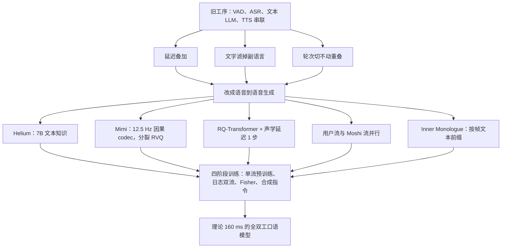

# Moshi：对话不必先变成字，也不必等轮到你

<!-- release-date: 2024-07-03 -->

> 本文依据 Kyutai 的 **Moshi: a speech-text foundation model for real-time dialogue**，arXiv:2410.00037v2（2024-10-02 修订），共 67 页，含附录 A–F。页码均指 PDF 自身的页码。文中区分三件事：**报告明确写了什么**、**我们怎么解释它**、**哪些是外部资料补充**。外部补充都给出链接并标明；报告没写的地方直接写「报告没写」。

## 一段对话被切成了三次等待

假设你对着语音助手说：

> 「等下——不对，你先听我说完——其实我想改成周二。」

真人对话里，这句话几乎不会被当成「一轮完整输入」。中间有停顿、有自我打断、有抢话，听的人一边听一边已经在准备接话。当时主流的语音助手做不到这件事。它们走的是一条**级联流水线**：先用语音活动检测（Voice Activity Detection，VAD）判断你说完没有，再用自动语音识别（Automatic Speech Recognition，ASR）把声音变成字，再把字交给文本大语言模型，最后用文本转语音（Text-to-Speech，TTS）把回复读出来（PDF p. 1–2）。

这条流水线把同一句话弄丢了三次。

**第一次丢在等待**。每一段都要等上一段结束：识别要等你说完，语言模型要等转写出来，合成要等整句文本写完。延迟沿组件叠加，报告写的典型体验是「数秒」；而自然对话的回应时间只有几百毫秒（PDF p. 2）。

**第二次丢在文字**。中间那段「思考」发生在文本里。情绪、口音、周围的非语音声音，以及「等下」这种还没成句的信号，都过不了文字这道瓶颈。报告把这类东西叫非书面信息：副语言（paralinguistic）信息，以及非语音音频（PDF p. 2）。

**第三次丢在轮次**。流水线默认对话是「你说完 → 我说完」的一串单说话人片段。口语不是这样：重叠语占说话时间的 10%–20%，「嗯」「我懂了」这种不打断对方的附和（backchanneling）更常见（PDF p. 2）。把对话切成轮次，抢话和重叠就没有位置可放。

Moshi 的主张不是把这三段各做快一点，而是换掉问题本身：

> **把口语对话写成语音到语音的生成。** 模型一直在听，也一直在出声（说话或沉默）；用户和系统各走一条音频流；系统在出音频 token 之前，先给自己对齐一串文本 token 当腹稿。

后面每一节，都是在给这三件事补机制和证据。

## 读之前：把语音这条线补到刚好够用

这一节是通用背景。报告自己讲到的地方，正文另标页码。

### 声音要先变成编号，模型才写得出来

原始波形是一串采样点，Moshi 用的是一秒 24000 个点（24 kHz）。这个密度直接喂给语言模型不现实，中间必须压缩。压缩后的形态有两种：

- **连续特征**：一小段声音压成一个浮点向量。细节多，但不是词表里的编号，模型没法像写字一样一个个吐出来；
- **离散音频 token**：一小段声音映射成词表里的整数编号，和文字 token 平级。因为是编号，可以自回归地生成，再交给解码器还原成波形。

Moshi 走第二条路：进出都是离散音频 token。负责这一步压缩与还原的模型叫**神经音频编解码器**（neural audio codec）。

### 帧率：一秒钟占几个位置

压缩之后，一秒声音变成多少个时间步，叫**帧率**（frame rate）。12.5 Hz 就是一秒 12.5 步、一步 80 ms。帧率直接决定两件事：语言模型一秒要跑几步，以及延迟的下限——一步没算完，这一步的声音就出不去。

### 残差向量量化：同一小段声音切成好几层编号

**残差向量量化**（Residual Vector Quantization，RVQ）是神经 codec 把一帧向量变成整数的标准做法。第一本码本先给这一帧挑一个最近的码字，留下的误差交给第二本；第二本的误差再交给第三本。每本只记一个整数编号，各本码字加起来就是重建出的向量。于是同一个时间步会有好几个 token：前几层抓粗结构，后几层补细节。完整的机制图与码本利用率问题见 DAC 一篇，更早的 SoundStream / EnCodec 做法见 EnCodec 一篇。

音频语言模型的文献还把 token 分成两类（PDF p. 9）：

- **声学 token**：来自神经 codec，为高保真重建而优化，但不太像语言；
- **语义 token**：来自自监督语音模型（如 WavLM），和音素、词语更相关，却不能重建出好听的波形。

### 全双工：不是「听完再答」

电话里的全双工，意思是两边可以同时说话。用在这里就是：模型**一直在听，也一直在生成**——生成的不一定是话，也可以是接近静音的波形。它不需要一个显式的「现在轮到谁」开关（PDF p. 2–3）。

### 会反复出现的名字

- **Helium**：Moshi 底下那根 7B 参数的文本语言模型骨干，从零预训练；
- **Mimi**：把 24 kHz 波形编成 12.5 Hz 离散 token、再解回去的流式神经音频编解码器；
- **Temporal Transformer / Depth Transformer**：沿时间轴走的大 Transformer，以及在同一个时间步里把多层 token 逐层吐出来的小 Transformer；
- **Inner Monologue（内心独白）**：系统侧先预测与音频按帧对齐的文本 token，再预测语义和声学 token。

## 一句话先说清

Moshi 是一个**语音—文本基础模型**，也是一套**全双工口语对话框架**。它从文本语言模型 Helium 出发，用 Mimi 把声音变成离散 token，再用一个较小的 Depth Transformer 按层次、可流式地生成这些 token；同时把「自己的声音」和「用户的声音」写成两条并行流，从而取消显式轮次（PDF p. 1–3、p. 6）。

它还把前人「先语义、后声学」的层次往前伸了一层：每个时间步先出一个对齐好的文本 token，再出音频 token。这套训练与推理安排就是 Inner Monologue。摘要给出的延迟是理论 160 ms、实践 200 ms（PDF p. 1）；160 ms 的拆法正文有，200 ms 的测法正文没写，后文单独核对。

如果只记一个判断：

> **口语对话的三个旧瓶颈——叠加延迟、文字过滤、轮次假设——不是三个独立的 bug，而是同一种建模方式的后果。Moshi 用「双流语音生成 + 每帧一份文本腹稿」把它们一次换掉。**

## 阅读路线

这份 PDF 正文 42 页，参考文献之后还有 14 页附录。按下面的顺序读最省力：

1. **p. 2 的三个瓶颈、p. 7 的 Figure 1**：先看清系统由哪几块拼成；
2. **p. 10–12 的 Mimi 与 Figure 2**：因果、12.5 Hz、分裂 RVQ；
3. **p. 13–17 的 RQ-Transformer、声学延迟、双流与 Inner Monologue，以及 Figure 4**：这是全文的心脏；
4. **p. 8 的 Table 1 与 p. 17–21 的第 4 节**：四阶段训练与数据；
5. **p. 22–35 的第 5 节**：Table 5–6 的生成消融、Table 8 的口语问答最值得细看；
6. **p. 36–41 的第 6 节**：毒性、复读、音色一致性、水印四个独立问题；
7. **附录 C（p. 56–58）**：改一个延迟就能从对话模型得到流式 ASR / TTS；附录 B、D、E 是去重、量化伪影与毒性细表，需要时再查。

## 先看全景：一次对话在模型里怎么走

*图：原文 Figure 1（PDF p. 7）。紫色是用户音频流，橙色是 Moshi 的音频流，浅橙是 Inner Monologue 文本流；音频进出 24 kHz，token 流 12.5 Hz。*

图上读不出、但必须先知道的四件事：

1. **用户流在推理时不是模型「编」出来的**。真实麦克风音频经 Mimi 编码后写入用户流，模型对用户流的预测被丢弃；这份预测只在离线模拟整段对话时才用（PDF p. 17）。
2. **Moshi 流一直在生成**。用户说话、Moshi 不说时，这条流解码成接近静音的「自然静音」，而不是一个固定的静音符号；对应的文本流填 PAD（PDF p. 17）。
3. **文本流只属于 Moshi**。报告明确说不转写用户流：实时转写很难，而依赖外部 ASR 又和端到端语音到语音的初衷相矛盾（PDF p. 16）。
4. **大模型只按 12.5 Hz 走**。一秒音频只需要 12.5 次 Temporal Transformer 前向，而不是按码本数乘出 100 步（PDF p. 13–14）。

这套东西要成立，得先有三样零件：一个不太差的文本骨干、一个低帧率又流式的 codec，以及一种能在同一个时间步吐出 17 个 token 的生成结构。下面按这个顺序讲。

## 核心设计一：Helium，一根从零训的 7B 文本骨干

### 旧问题：纯语音模型会说话，但没有世界知识

报告在相关工作里写得很直白：只在原始语音上训练的模型，能学到词法、句法和一点语义，但事实知识与推理「差到接近没有」。所以语音—文本模型都想把文本 LLM 的知识接进来（PDF p. 4）。Moshi 没有去微调一颗现成的开源 7B，而是自己训了 Helium。

### Helium 长什么样

Helium 是标准的自回归 Transformer，改了几处现在已经很常见的零件（PDF p. 7）：

- 注意力块、前馈块和输出线性层的入口用 RMSNorm；
- 旋转位置编码（RoPE），上下文 4096 个 token，训练用 FlashAttention；
- 前馈换成以 SiLU 为门控的 GLU；
- 分词器是 SentencePiece 的 unigram 模型，词表 32000，主要面向英语；数字拆成单个数字，并保留 byte-backoff，保证分词不丢信息。

规模写在 Table 1：隐藏维度 4096，MLP 维度 11264，32 个头，32 层（PDF p. 8）。优化器 AdamW，权重衰减 0.1、$\beta_1 = 0.9$、$\beta_2 = 0.95$；500k 步、每步 4.2M token，峰值学习率 $3\cdot 10^{-4}$，线性 warmup 后余弦衰减（PDF p. 8、p. 20）。500k × 4.2M 正好是摘要里的 2.1T token（PDF p. 3）。

### 文本数据怎么来、怎么滤

语料的 12.5% 来自高质量源：Wikipedia、Wikibooks、Wikisource、Wikinews、StackExchange 和科学论文集 peS2o；Wikipedia 用了 2017、2018、2019、2021、2022 五个 dump，而不是反复扫同一版。其余 87.5% 来自 CommonCrawl 的十次抓取，从 2018-30 到 2023-40（PDF p. 17）。

网页数据过三道滤网（PDF p. 8–9）：

1. **去重**：从只含正文的 WET 文件起步，每次抓取分 100 个 shard，shard 内按行算 FNV-1a 哈希、用 bloom filter 去掉导航栏一类重复行；再训一个判断「是否重复」的 fastText 分类器做模糊去重，只删连续至少 3 行被判为重复的块；
2. **语言识别**：文档级 fastText，只留英语，阈值 0.85；
3. **质量过滤**：用高质量源与随机网页的行训练一个 9 类 fastText 分类器（类别对应 Wikipedia、Wikibooks 等来源，以及 StackExchange 的 STEM、人文等子集），按行打分、按长度加权平均，超过阈值才留。分 9 类而不是二分类，是为了不只看「像不像高质量」，还能按领域控制保留什么。

报告没有给质量过滤的阈值数字，也没有给各领域的最终配比表。

### 它接在系统哪里

Helium 不是 Moshi 旁边的另一个模型。Moshi 的 Temporal Transformer **直接用 Helium 初始化**，之后在音频上继续训；为了防止灾难性遗忘，音频预训练阶段有一半时间仍在训纯文本 batch，而且文本与音频用两套独立的优化器状态（PDF p. 8、p. 20）。后文口语问答会显示：拿掉这 50% 的文本 batch，分数明显下降（PDF p. 29–30）。

**可迁移启发**：把文本 LLM 接进语音系统，不只是「用它的权重当初始化」，还要在后续的音频训练里给文本一条活路。

## 核心设计二：Mimi，把语义蒸馏进一个流式 codec

### 旧问题：高质量重建和「能当语言来建模」互相打架

前人的做法是两套 token 一起用：先生成语义 token，再以它为前缀生成声学 token。这能在没有文本条件时也生成可懂的语音，但报告指出它不适合实时：语义 token 通常不是因果的，只能离线算；两套编码器同时跑，计算负担也不小（PDF p. 9）。

Mimi 要的是：**一个因果模型，同时给出语义和声学信息，帧率还要低到 7B 骨干跑得动**。思路借自 SpeechTokenizer：把非因果的高层语义，蒸馏进一个因果 codec 的 token 里（PDF p. 9）。

*图：原文 Figure 2（PDF p. 10）。蓝色部分（WavLM 蒸馏、对抗损失）只在训练时存在。*

### 基本规格

骨架来自 SoundStream / EnCodec 一类的 SeaNet 自编码器加 RVQ。编码器由 4 个残差卷积块组成，步幅分别是 $(4,5,6,8)$，最后再接一个步幅为 2 的一维卷积（PDF p. 10），于是：

$$
\frac{24000}{4\times 5\times 6\times 8\times 2}=12.5\ \text{Hz}
$$

潜在维度 $D = 512$，解码器对称地用转置卷积回到 24 kHz。所有卷积都是因果的，所以编码和解码都能流式跑（PDF p. 10）。

量化用 $Q = 8$ 个码本、每本 $N_A = 2048$ 个码字；量化前先把 512 维投影到 256 维，解码前再投影回 512 维。报告写的比特率是 1.1 kbps（PDF p. 11）。这个数可以自己验算：2048 条码字是 11 bit，$12.5 \times 8 \times 11 = 1100$ bit/s（乘法为本文所做）。

帧长和总步幅都是 80 ms：送进第一帧 80 ms 音频，Mimi 就吐出第一个潜在时间步，解码后还是 80 ms 声音（PDF p. 11）。这是后面 160 ms 理论延迟的一半来源。

### 瓶颈里加 Transformer

量化前和量化后各放一个因果 Transformer：8 层、8 头、维度 512、MLP 2048，RoPE，GELU，上下文 250 帧（20 秒），并用 LayerScale（对角线初值 0.01）稳住训练（PDF p. 10）。消融显示，解码器侧的 Transformer 明显提高听感，编码器侧的 Transformer 则让后面的语义蒸馏更有效（PDF p. 11、p. 23–24）。

因为加了 Transformer，优化器从纯卷积 codec 常用的 Adam 换成 AdamW，只对 Transformer 参数加权重衰减 $5\cdot 10^{-2}$。学习率 $8\cdot 10^{-4}$，动量衰减 0.5，二阶矩衰减 0.9，权重做衰减 0.99 的指数滑动平均；batch 128，随机 12 秒窗口，训 400 万步；Transformer 的实际上下文限制在 10 秒（PDF p. 11）。

### 蒸馏语义，但不要让声学去吃残差

语义来源是 WavLM：它吃 16 kHz 波形，吐 50 Hz、1024 维的嵌入；Mimi 是 24 kHz 进、12.5 Hz、512 维。训练时把输入降采样到 16 kHz 算 WavLM，再做步幅 4、核 8 的平均池化对到 12.5 Hz。报告特别写了一句：这个平均池化必须做成**非因果**才有效，而它只在训练时用，所以不破坏推理的流式性（PDF p. 12）。第一层量化器的输出再经线性层对齐到 1024 维，与 WavLM 目标算余弦距离。

问题出在 RVQ 的结构上。如果把这层语义量化器当成一条普通 RVQ 的第 1 层，后面 7 层只能去量化「语义层吃剩的残差」。语义与声学于是在同一条残差链上抢容量：第一层要为音素可分性让出重建质量（PDF p. 12）。

解法是把 RVQ **劈开**：一路是单独的语义 VQ，另一路是 7 层声学 RVQ，两路输出相加再送进解码器。两路都参与重建，但声学信息不必再被迫保存在语义量化器的残差里（PDF p. 12）。上面 Figure 2 中间那块就是这个分裂结构。

Table 3 把这笔账算得很清楚（PDF p. 24）：

| 50% 不量化 | 编码器 Transformer | 解码器 Transformer | WavLM 蒸馏 | 分裂 RVQ | ABX ↓ | VisQOL ↑ | MOSNet ↑ | MUSHRA ↑ |
|:-:|:-:|:-:|:-:|:-:|---:|---:|---:|---:|
| ✓ | ✓ | ✓ | | | 23.3% | 2.91 | 2.89 | 65.9 |
| ✓ | ✓ | ✓ | ✓ | | 6.5% | 2.22 | 2.87 | 57.8 |
| ✓ | | ✓ | ✓ | ✓ | 10.8% | 2.79 | 2.85 | 59.7 |
| ✓ | ✓ | | ✓ | ✓ | 8.1% | 2.59 | 2.72 | 48.4 |
| | ✓ | ✓ | ✓ | ✓ | 8.0% | 2.45 | 2.88 | 68.3 |
| ✓ | ✓ | ✓ | ✓ | ✓ | 8.1% | 2.82 | 2.89 | 64.0 |

ABX 是三音素可分性错误率：给同一三音素的两个样本（如 beg）和一个最小差异的反例（如 bag），看表示空间能不能把它们分开，越低越好；它被证明能预测下游音频语言模型生成连贯语音的能力（PDF p. 23）。读表要看三件事：

1. **蒸馏有效也有代价**：ABX 从 23.3% 降到 6.5%，MUSHRA 从 65.9 掉到 57.8；
2. **分裂 RVQ 是折中**：MUSHRA 拉回 64.0，ABX 退到 8.1%，报告称之为更好的语义—声学权衡（PDF p. 23）；
3. **两个 Transformer 各管一边**：去掉编码器 Transformer，ABX 变差到 10.8%；去掉解码器 Transformer，MUSHRA 掉到 48.4。

表里还有一行容易被误读。「50% 不量化」指训练时每条序列有一半概率完全不做量化，把未量化的嵌入直接交给解码器。报告说这是沿用 DAC 一篇的观察：训练时以一定概率「不施加量化」能提升音质。区别在于，DAC 那一侧是不做量化器 dropout、走满全部码本，Mimi 则是彻底跳过量化（PDF p. 11）。它明显提升 VisQOL（2.45 → 2.82），但主观听感没有随之上升——去掉它的那一行 MUSHRA 反而是 68.3。报告自己的说法是「人工评测没有定论」，并观察到码率越低，这个做法的客观收益越大（PDF p. 11、p. 24）。附录 A 的 Table 17 另给了去掉蒸馏时更多组合的 ABX / VisQOL / MOSNet（PDF p. 54），结论方向一致。

### 只留对抗损失：客观指标会骗人

基线训练沿用 EnCodec 的多尺度梅尔重建损失加多尺度 STFT 判别器。他们另外试了**纯对抗训练**：只留特征匹配损失和判别器损失。开发时就发现，去掉重建损失后客观指标大跌，但听起来比指标预示的好得多（PDF p. 11）。Table 4 确认了这一点（PDF p. 24）：

| 模型 | 采样率 | 帧率 | 比特率 | 因果 | ABX ↓ | VisQOL ↑ | MOSNet ↑ | MUSHRA ↑ |
|---|---|---|---|:-:|---:|---:|---:|---:|
| Ground Truth | 24 kHz | — | — | — | — | — | 3.08 | 90.6 |
| RVQGAN | 24 kHz | 75 Hz | 1.5 kbps | | — | 1.74 | 2.74 | 31.3 |
| SemantiCodec | 16 kHz | 50 Hz | 1.3 kbps | | 42.2% | 2.43 | 3.12 | 64.8 |
| SpeechTokenizer | 16 kHz | 50 Hz | 1.5 kbps | | 3.3% | 1.53 | 2.67 | 45.1 |
| SpeechTokenizer | 16 kHz | 50 Hz | 4.0 kbps | | 3.3% | 3.07 | 3.10 | 74.3 |
| Mimi，仅对抗损失 | 24 kHz | 12.5 Hz | 1.1 kbps | ✓ | 8.7% | 1.84 | 3.10 | 81.0 |
| 同上，降采样到 16 kHz | 16 kHz | 12.5 Hz | 1.1 kbps | ✓ | — | — | — | 77.7 |
| Mimi，非仅对抗 | 24 kHz | 12.5 Hz | 1.1 kbps | ✓ | 8.1% | 2.82 | 2.89 | 58.8 |

MUSHRA 由 20 名听者、每人 30 条 10 秒样本打分，0–100 分，比的是与原声的相似度（PDF p. 23–24）。几条读法：

- 表里的 RVQGAN 就是 DAC 一篇讲的 Improved RVQGAN，只保留前两层码本，把码率压到 1.5 kbps 以便对比（PDF p. 23）；DAC 的设计码率是 8 kbps，只留两层等于把它压到设计点的五分之一以下，这个对比对它并不友好（本文判断）；
- 纯对抗训练的 Mimi VisQOL 只有 1.84，MUSHRA 却是 81.0；混用重建损失的是 2.82 和 58.8。**同一个 codec，只换训练目标，客观分与听感走向相反**；
- 为了和 16 kHz 的对手公平比较，Mimi 还降采样到 16 kHz 再测，MUSHRA 仍有 77.7；
- Mimi 的 ABX 不如 SpeechTokenizer 的 3.3%，但帧率只有它的四分之一，而且完全因果。报告强调低帧率的意义：Moshi 每生成一帧音频 token 都要跑一次完整的 Temporal Transformer 前向（PDF p. 24–25）。

报告把这当作研究的附带发现：改生成器结构时 VisQOL 是可靠代理，改训练目标时它会与人的感知完全脱钩（PDF p. 25）。

### 代价与边界

- 语义蒸馏和重建确实冲突，分裂 RVQ 是折中，不是两头都拿到最优；
- 纯对抗训练让客观指标失效，以后做 codec 搜索时不能只看 VisQOL；
- 报告没有把「最终装进 Moshi 的那份 Mimi」和 Table 4 的某一行明确钉死。能确定的是：Moshi 用的是 12.5 Hz、8 码本、2048 码字、带语义蒸馏、因果流式的 Mimi（PDF p. 8、p. 14）。

**可迁移启发**：生成模型必须实时时，codec 的第一约束往往不是「重建分数最高」，而是**因果 + 帧率低到骨干网跑得起**。语义信息用蒸馏塞进一路单独的量化器，比再跑一个非因果语义编码器更适合这条约束。

## 核心设计三：RQ-Transformer，让「一步里的多层 token」跑得动

### 旧问题：8 个码本若展平，一秒要预测 100 次

Mimi 每个时间步吐 8 个 token。如果把它们展平成一条普通序列，12.5 Hz 就变成每秒 100 个自回归步，5 分钟音频是 30000 步。报告拿英语做对照：同样一秒钟的话，文本大约只要 3–4 个 token（PDF p. 13）。这既贵，也没法流式。

### 新设计：时间用大模型，深度用小模型

*图：原文 Figure 3（PDF p. 13），为示意取 $K = 4$；Moshi 实际是 $K = 17$。*

RQ-Transformer 把序列拆成两个轴（PDF p. 13–14）：

- **Temporal Transformer**：沿时间 $s = 1, \ldots, S$ 走，结构就是 Helium 那根 7B；
- **Depth Transformer**：在同一时间步内部，沿子序列序号 $k = 1, \ldots, K$ 走，只有 6 层、维度 1024、MLP 4096、16 个头（PDF p. 8、p. 14）。

记 $V_s = (V_{s,1}, \ldots, V_{s,K})$ 为第 $s$ 步的全部子序列。时间模型先读完过去所有步，给出一个上下文向量：

$$
z_s=\mathrm{Tr}_{\mathrm{Temp}}(V_0,\ldots,V_{s-1})\in\mathbb{R}^{d}
$$

第 1 个子序列（后面会是文本 token）直接由 $z_s$ 经一层线性打到词表；从第 2 个子序列起，深度模型吃 $z_s$ 和本步已经生成的 token：

$$
\ell_{s,k}=\mathrm{Tr}_{\mathrm{Depth}}(z_s,V_{s,1},\ldots,V_{s,k-1})\in\mathbb{R}^{N_k}
$$

训练目标是让 $\mathrm{softmax}(\ell_{s,k})$ 逼近「给定过去所有步、以及本步已出的更粗 token」时第 $k$ 个 token 的条件分布（PDF p. 13–14，式 1–3）。关键在于：Temporal Transformer 的步数永远是 $S$，而不是 $K \cdot S$；Depth Transformer 每步至多走 $K$ 步。

两个实现细节（PDF p. 14）：

- Temporal Transformer 每步的输入，是 $K$ 张嵌入表对上一步各 token 的**求和**；Depth Transformer 的输入是 $z_s$ 加上前一个 token 的嵌入；
- Depth Transformer **按深度各用一套参数**：每个子序列有自己的线性层、投影和全连接。报告的理由是不同子序列可能需要不同变换；这个 Transformer 很小，所以对训练和推理时间没有影响，Table 6 显示这样做有益。

RQ-Transformer 本身来自前人（Lee 等人 2022；音频上有 Yang 等人 2023、Zhu 等人 2024）。Moshi 自称的新东西是按深度的参数、声学延迟，以及把语义与声学 token **一起**流式生成——Zhu 等人是先生成全部语义 token（PDF p. 15）。

### 声学延迟：让大模型去管语义与声学怎么配合

如果同一步里 8 个码本互相依赖太强，6 层的 Depth Transformer 扛不住。做法是给声学 token 加一个延迟 $\tau$：语义 token 留在当前步，声学 token 挪到 $\tau$ 步之后（PDF p. 14，式 4）：

$$
V_{s,1} = A_{s,1},\qquad
V_{s,q} = A_{s-\tau,q}\ \ (s \ge \tau+1,\ q>1),\qquad
V_{s,q} = 0\ \ (s<\tau+1,\ q>1)
$$

$A_{t,q}$ 是 Mimi 第 $t$ 帧第 $q$ 层的 token，$q = 1$ 是语义层。直觉是：「这一帧在说什么」先由语义 token 定下，7B 的 Temporal Transformer 看过它之后，「这一帧听起来什么样」再在下一步跟上。延迟越大，同一步内的码本越接近条件独立，小模型越好学；但延迟本身就是延迟（PDF p. 14）。

*图：本文按式 4、Table 5–6（PDF p. 14、p. 25–27）重画的机制示意，延迟是理论值，不是实测时延。*

Table 5 与 Table 6 把这笔账量了出来（PDF p. 25–26）：

| 声学延迟 | RQ-Transformer | 困惑度 ↓ |
|---|:-:|---:|
| [0,1,2,3,4,5,6,7] | | 42.2 |
| [0,1,2,3,4,5,6,7] | ✓ | 40.3 |
| [0,2,2,2,2,2,2,2] | | 135.4 |
| [0,2,2,2,2,2,2,2] | ✓ | 36.8 |

困惑度只能在同一延迟模式内比较，因为延迟越大、高层 token 的分类任务越容易（PDF p. 25）。所以这张表要按两行一组读：

- 按 MusicGen 的逐层错位，理论延迟 8 步即 640 ms，实时对话不能用；这时 RQ-Transformer 相对独立分类头只带来边际改善；
- 改成统一晚两步（240 ms）后，独立分类头的困惑度是 135.4，换成 RQ-Transformer 是 36.8。**低延迟下，深度模型从可有可无变成关键零件**（PDF p. 26）。

至于 $\tau$ 取几，不同延迟之间不能比困惑度，报告改用生成质量：从 3 秒提示生成续写，用 Whisper 转写，再用 LiteLlama-460M 给转写打负对数似然（NLL），同时看转写长度——弱模型往往塌成沉默，所以长度本身就是质量代理（PDF p. 25–26）。全 0 延迟（80 ms 下限）的 NLL 是 4.36；晚一步（160 ms）明显好到 4.12；晚两步（240 ms）只再小幅好到 4.09（PDF p. 25–26，Table 6）。

最终配方：预训练用声学延迟 2，后面三个阶段都用 1，对应理论延迟 160 ms（PDF p. 8、p. 27）。

### 语义 token 的损失要加重

即便有了延迟，早期实验里各层 RVQ 的损失仍互相打架，尽管每一层对最终可懂度和音质的贡献都比下一层大。报告做了两处改动：把语义 token 的损失权重提到 100、其余音频层保持 1；再用上面说的按深度参数化，减少层与层之间的竞争。两者配合，转写 NLL 从 4.09 降到 3.65，转写长度从 519 升到 602 个字符（PDF p. 25–26，Table 6）。真正的大跳要等 Inner Monologue。

## 核心设计四：双流，取消「现在轮到谁」

### 旧问题：一条 token 流装不下两个人同时说话

即便已经是语音到语音，如果用户和系统仍被排进同一条序列，模型就得假设某一刻只有一个人在响。Spectron、SpeechGPT、PSLM 都把用户与系统的语音和文本放在同一条流里，因此需要切好的轮次；Wang 等人 2024 的方案同样把双方塞进单流，重叠一多就难办（PDF p. 5–6）。

前人里只有 dGSLM 是全双工：它把用户和系统分成两条语义 token 流，用孪生（Siamese）网络联合处理。报告称它只是概念验证：不在线运行、没有文本 LLM 的知识、只建模语义不建模声学（PDF p. 6）。

### 新设计：用户一条，Moshi 一条，延迟规则相同

给定 Moshi 的音频流 $A_{t,q}$ 和用户的音频流 $A'_{t,q}$，两边套上同样的声学延迟，再拼进同一个 $V$（PDF p. 15）。报告称这是第一个多流音频语言模型（PDF p. 2）。

*图：原文 Figure 4（PDF p. 15），声学延迟 $\tau = 1$。同一种颜色是同一帧音频的 token，可以看到声学 token 比语义 token 晚一列出现。*

这张图同时画出了双流和下一节的 Inner Monologue。推理时，虚线以下、属于 Moshi 的 token（文本 + Moshi 音频）由模型采样；虚线以上属于用户的 token 来自真实输入，模型对它们的预测被丢掉（PDF p. 15、p. 17）。

没有「切换说话人」的特殊符号。Moshi 可以一直说、一直听，也可以同时做两件事。图的右半边就是重叠：Moshi 还在说 Moshi 的后半个词，用户已经开口说 Hey Moshi，两段话在同一批时间步里各占自己的流，不需要先做说话人分离再排队。反过来，文本流也成了一个控制把手：强制采样一个 EPAD，就能让 Moshi 立刻开口（PDF p. 17）。

### 双流是训出来的，不是画出来的

双流不是预训练一开始就有的。能力按四段往上加（PDF p. 8、p. 18–21）：

1. **单流音频预训练**：700 万小时无监督音频，所有说话人混在一条流里，文本流是所有人的话。这一阶段还不会全双工；
2. **用说话人日志模拟双流**：对同一批音频跑 PyAnnote 做说话人日志（diarization），随机抽一个说话人当主说话人，按其活跃掩码把波形拆成「他」和「其余所有人」两路分别编码。这能让模型看见「有人在说、有人静着」，但报告明说它不够：没有真实重叠，不说话的一方是完全静音；
3. **Fisher 上学真正的双流**：Fisher 是 2000 小时的电话对话，两侧分声道录音，天然就是分好的两条流；原始 8 kHz，用 AudioSR 升到 24 kHz。这是 Moshi 获得「同时听和说」的关键阶段；
4. **指令微调**：把第一条流的身份固定成 Moshi，用合成对话脚本做成「一个助手 + 一个用户」。

所以双流是**数据形态和损失共同训出来的行为**。没有分轨数据，这个架构只会是「假装有两路、其实还是单声道切分」。

**可迁移启发**：产品需要抢话、附和、重叠时，优先去找或造分轨对话数据，而不是在单流模型上后加 VAD。架构能表达重叠而训练数据没有，最后还是学不会。

## 核心设计五：Inner Monologue，每帧先写一句腹稿

### 旧问题：纯音频生成能出声，但语言质量撑不住

报告观察到，只在音频域生成已经「像样」，但让 Moshi 同时建模自己语音的文本表示，能提供一层脚手架，明显抬高生成的语言质量（PDF p. 15）。前人把文本接进来的方式有三种，报告都认为不够（PDF p. 5）：

- **Chain-of-Modality**（Spectron、SpeechGPT）：先把整句答成文本，再拿它当前缀生成语音。文本质量好，但必须等整句写完才开口，与实时交互根本不相容；
- **文本与语音并行**（PSLM）：降低了等待，但报告认为回答质量会掉，而且仍依赖 ASR，副语言信息还是丢了；
- **序列内模态切换**（Spirit-LM）：这一段是语音 token，下一段改成文本 token。Moshi 不要切换，它要每一句话既是文本也是语音。

### 新设计：文本是语义前面的那一层前缀

Inner Monologue 把 Moshi 自己语音的转写写成一条文本流 $W$，放在 $V$ 的第一个子序列。于是每个时间步的层次变成：

**文本 → 语义 → 延迟后的声学**

这是把 AudioLM 那套「从粗到细」往前伸了一层：最粗的不是语义音频，而是字（PDF p. 16）。它按帧分解，每一步都产出一帧语音，所以不增加 Temporal Transformer 的步数，也不必先写完整句（PDF p. 5）。

文本来自 Whisper 对 Moshi 那一侧音频的转写与词级时间戳，再用 Helium 的 SentencePiece 分词（PDF p. 15–16）。这是构造训练数据的工具，不是推理时的级联 ASR。

### 文本和 12.5 Hz 音频怎么对齐

文本稀、音频密。英语对话里大约 65% 的文本位置其实是填充（PDF p. 16）。为此引入两个永远不会出现在词里的特殊 token：PAD 和 EPAD。对齐规则用人话讲：

1. 整条 $W$ 先全部填成 PAD；
2. 第 $i$ 个词的起始时间换算成帧下标 $t_i$；
3. 从 $t_i$ 起写入这个词的 $n_i$ 个文本 token，后面继续是 PAD，直到下一个词；
4. 下一个词开始前的那一格写一个 EPAD，表示「填充到此结束」。

形式化是（PDF p. 16，式 5）：

$$
W_{t_i-1} \leftarrow \mathrm{EPAD},\qquad
W_{t_i+j} \leftarrow w_{i,j}\quad (j \le n_i)
$$

若 $t_i = 1$，EPAD 放在位置 1，文本 token 往后挪一格；EPAD 不许覆盖上一个词的文本 token。报告说 EPAD 不是严格必需，但它把「这个词结束没有」和「下一个说什么」拆成两步决策，给模型提供了有用的引导（PDF p. 16）。Figure 4 的文本行就是一个例子：Hello 占一格，随后 PAD、EPAD，再写出后面几个词的 token。

### 改一个延迟，同一套模型变成流式 ASR 或 TTS

在文本流和音频流之间再加一个延迟，等于在选「由哪个模态决定内容」（PDF p. 16–17）：

- **音频领先文本**：模型先听见、再写字。推理时强制使用真实音频 token、只采样文本，就得到一个流式 ASR，还自带词级对齐；
- **文本领先音频**：模型先写字、再出声。推理时强制喂入已经填好 PAD 的文本，就得到流式 TTS。

附录 C 补上了细节（PDF p. 56–58）。两种模式都固定 2 秒延迟，图示里声学延迟取 $\tau = 2$。TTS 的难点是输入文本本来没有 PAD：做法是在每个词之后放开让模型自由采样 PAD 或 EPAD，一旦它想采别的 token，就改喂下一个要读的词。还可以在线统计 PAD 占比，低于目标值时给 PAD 的 logit 加一点奖励，以控制语速、保证可懂度；用一段文本加音频的前缀，还能控制音色。多流模式下，两位说话人的文本放在同一条流里，用 `<bos>` 与 `<eos>` 分隔。

这组 ASR / TTS 不是 Moshi 对话系统的主任务，报告自己说实验只为展示 Inner Monologue 的灵活性（PDF p. 32）。但它的一个副产品很关键：合成指令数据用的正是这台多流 TTS。

### 拼起来：Moshi 真正在建模的那条联合序列

双流加上 Inner Monologue，$V$ 的定义是式 6（PDF p. 17）。按子序列序号从小到大：

| 子序列 $k$ | 内容 | 谁产生 |
|---|---|---|
| 1 | 对齐后的文本 $W_s$ | Moshi 采样 |
| 2 | Moshi 的语义 token $A_{s,1}$ | Moshi 采样 |
| 3–9 | Moshi 延迟后的声学 token $A_{s-\tau,q}$，$q = 2,\ldots,8$ | Moshi 采样 |
| 10 | 用户的语义 token $A'_{s,1}$ | 推理时来自麦克风 |
| 11–17 | 用户延迟后的声学 token $A'_{s-\tau,q}$ | 推理时来自麦克风 |

$Q = 8$，所以 $K = 2Q + 1 = 17$。文本 token 由 $z_s$ 经一层线性直接打出，其余子序列走 Depth Transformer；Temporal Transformer 始终只按 12.5 Hz 走 $S$ 步。

损失把「文本 token」与「全部音频 token 合在一起」放在同一档重要性上（PDF p. 21，式 7）：

$$
\mathcal{L}(V,\ell)
=\frac{1}{S}\sum_{s=1}^{S}
\left[
\mathrm{CE}(\ell_{s,1},V_{s,1})
+\frac{1}{\sum_{k=2}^{K}\alpha_k}
\sum_{k=2}^{K}\alpha_k\,\mathrm{CE}(\ell_{s,k},V_{s,k})
\right]
$$

CE 是交叉熵。方括号里第一项是文本，第二项是音频各层的加权平均：语义层 $\alpha_k = 100$，声学层 $\alpha_k = 1$（PDF p. 21）。

### 消融：这是整份报告里最猛的一跳

Table 6 在同一套 Helium 初始化、同一套音频预训练、都用 RQ-Transformer 的前提下，逐步打开各项设计（PDF p. 25）：

| 声学延迟 | 语义权重 | 按深度参数化 | Inner Monologue | 转写 NLL ↓ | 转写长度 ↑ |
|---|---:|:-:|:-:|---:|---:|
| [0,0,0,0,0,0,0,0] | 1 | ✓ | | 4.36 | 486 |
| [0,1,1,1,1,1,1,1] | 1 | ✓ | | 4.12 | 529 |
| [0,2,2,2,2,2,2,2] | 1 | ✓ | | 4.09 | 519 |
| [0,2,2,2,2,2,2,2] | 100 | | | 3.75 | 538 |
| [0,2,2,2,2,2,2,2] | 100 | ✓ | | 3.65 | 602 |
| [0,2,2,2,2,2,2,2] | 100 | ✓ | ✓ | **2.77** | **1920** |

打开 Inner Monologue 后，NLL 从 3.65 降到 2.77，转写长度从 602 跳到 1920 个字符，比前面所有改动加起来的幅度都大。口语问答上更明显：没有 Inner Monologue 的 Moshi 在三个问答集上是 9.2 / 21.0 / 7.3，打开之后是 26.6 / 62.3 / 22.8，报告说「几乎翻了三倍」；而推理代价只是每步从生成 16 个 token 变成 17 个（PDF p. 29–30，Table 8）。

**可迁移启发**：输出已经是分层的离散 token 时，把「更像语言的那一层」放到最前面当前缀，往往比让文本与音频平行预测更稳。关键约束是**按帧对齐，而不是按整句对齐**——整句对齐会把你送回 Chain-of-Modality 的等待。

## 160 ms 和 200 ms 到底是怎么来的

这两个数字最容易被口口相传，单独核一次。

**理论 160 ms 有明确拆法**。一步音频 80 ms（Mimi 的帧长，也是 12.5 Hz 的倒数，PDF p. 11）；微调后声学延迟 $\tau = 1$，再加 80 ms（PDF p. 8、p. 27）。两者相加是 160 ms。报告拿它和跨 10 种语言测得的自然对话平均回应时间 230 ms 比（PDF p. 2）。预训练用的 $\tau = 2$ 对应 240 ms，那是为了更好学，不是部署延迟。

**实践 200 ms 只有一句陈述**。「200 ms in practice」出现在摘要（PDF p. 1）。第 5 节没有一张延迟表，没有写硬件、百分位、是否含网络与 Mimi 编解码。所以准确的说法是：160 ms 是由帧长和 $\tau$ 推出的理论下界；200 ms 是作者给出的实践数字，这份 PDF 没有测量协议。

外部补充（不是报告原文）：官方仓库 [kyutai-labs/moshi](https://github.com/kyutai-labs/moshi) 的 README 写的是「在 L4 GPU 上整体延迟可低至 200 ms」，并把 160 ms 拆成 80 ms 帧长加 80 ms 声学延迟。这只能当实现侧的旁证。

## 数据与训练 recipe

### 总表

Table 1 把 Helium 与 Moshi 的四个阶段放在一张表里（PDF p. 8）。两个 Transformer 的结构各阶段相同：Temporal 即 Helium（4096 维、32 层、32 头），Depth 是 1024 维、6 层、16 头；文本词表 32000，音频码本 2048，帧率 12.5 Hz。

| 阶段 | Helium 预训练 | Moshi 预训练 | 后训练（日志双流） | Fisher 微调 | 指令微调 |
|---|---|---|---|---|---|
| 数据 | 2.1T 文本 token | 700 万小时单流音频 + 一半时间纯文本 | 同批音频，按说话人拆两路 | Fisher 2000 小时 | 合成对话 2 万小时以上 |
| Temporal 学习率 | $3\cdot 10^{-4}$ | $3\cdot 10^{-5}$ | $3\cdot 10^{-6}$ | $2\cdot 10^{-6}$ | $2\cdot 10^{-6}$ |
| Depth 学习率 | — | $2\cdot 10^{-4}$ | $5\cdot 10^{-5}$ | $4\cdot 10^{-6}$ | $2\cdot 10^{-6}$ |
| 文本 batch | 4.2M token | 1.2M token | 1.2M token | — | — |
| 音频 batch | — | 16 小时 | 8 小时 | 40 分钟 | 2.7 小时 |
| 步数 | 500k | 1M | 100k | 10k | 30k |
| 学习率调度 | 余弦 | 余弦 | 固定 | 固定 | 固定 |
| 声学延迟 | — | 2 | 1 | 1 | 1 |
| 文本延迟 | — | ±0.6 秒随机 | 0 | 0 | 0 |

上下文一栏写的是「3000 步，例如 4 分钟」（$3000 / 12.5 = 240$ 秒），而正文说预训练每条样本是 5 分钟序列，引言与结论也说能建模 5 分钟上下文（PDF p. 3、p. 8、p. 20、p. 41）。报告自己这两处没有对齐，这里两边都保留。所有阶段都用 AdamW（权重衰减 0.1，$\beta_1 = 0.9$，$\beta_2 = 0.95$），在 H100 上用 FSDP 与 activation checkpointing 训练（PDF p. 20）；卡数与总 GPU 小时报告没写。

### 阶段 1：单流音频预训练

Temporal Transformer 从 Helium 初始化，Depth Transformer 随机初始化。音频全部重采样到 24 kHz、混成单声道，用 Whisper large-v3 转写，多数是英语（PDF p. 18）。几个细节（PDF p. 20）：

- 文本 token 以 30% 概率被遮掉；
- 文本相对音频的延迟在 −0.6 到 +0.6 秒之间随机，为后面「谁先决定内容」的 ASR / TTS 打基础；
- 一半时间训纯文本 batch，文本与音频用两套优化器状态；在音频 batch 里，文本嵌入和文本输出层的学习率再乘 0.75；
- PAD 在音频 batch 里占绝大多数，交叉熵里 PAD 的权重减半。

### 阶段 2：用说话人日志模拟双流

PyAnnote 做说话人日志，抽一个主说话人，文本流只含他的话，文本—音频延迟固定为 0；仍有 10% 时间训纯文本 batch（PDF p. 20）。这一阶段的静音是「把别人的声道抹掉」造出来的，不是真实对话里的你来我往。

### 阶段 3：Fisher 上的真全双工

随机选一侧当主说话人（即 Moshi），另一侧当用户，文本流只含主说话人。长静音会让时间戳不可靠，这里改用 whisper-timestamped 加 medium 规格的 Whisper 转写（PDF p. 18）。这一阶段不再训纯文本 batch（PDF p. 21）。

### 阶段 4：合成指令微调，把第一说话人变成 Moshi

早期他们试过直接用 OpenHermes 这类文本指令数据，发现不适合口语：URL 之类的格式没法用 TTS 念，列表和长枚举也不像人说话（PDF p. 18）。于是改成三步：

1. 用在 OpenHermes 与真实对话转写上微调过的 Helium 写对话脚本；
2. 用自家的多流流式 TTS（音频相对文本延迟 2 秒）把脚本合成双轨对话；
3. 一共得到 2 万小时以上的合成语音（PDF p. 18、p. 21）。

Moshi 一侧的声音来自同一位配音演员录制的独白，正文写覆盖 70 多种说话风格，Table 19 实际列出 92 项，情绪、语速和角色混在一张表里（PDF p. 18、p. 67）；用户一侧每条样本随机采样音色，以覆盖不同录音条件与口音（PDF p. 18）。

脚本覆盖的交互类型（PDF p. 18–20，示例见附录 F，p. 63–66）：

- 从 Wikipedia 段落或 StackExchange 帖子出发，先生成两句话的对话摘要，再生成「短轮次、多附和」的完整对话；
- 关于 Moshi 自己和 Kyutai 实验室的介绍；
- 声音指令：要求 Moshi 用某种情绪或角色说一句话、一段独白或一首诗，以及按「某种情绪的某类角色」生成情景对话；
- 用户口误或拼错，Moshi 请对方重复或澄清；
- 含错误事实的提问（如「埃菲尔铁塔在北京吗？」），训练 Moshi 说「不」并纠正；
- 基础算术、语法和常识单轮问答——因为早期的 Moshi 连加法都做不好；
- 不道德或不适宜内容的请求，Moshi 拒绝。

用户流还做了很重的数据增强，让真实麦克风环境不至于把模型打崩（PDF p. 21）：

- 50% 概率给用户流加 −24 dB 到 +15 dB 的随机增益；
- 30% 概率叠加 Deep Noise Suppression Challenge 的噪声，相对音量 −30 dB 到 +6 dB；每次要换新噪声时，有 50% 概率改插一段最长 30 秒的静音，让模型习惯「吵 ↔ 静」切换；
- 把 Moshi 自己的声音按 0–0.2 的比例、延迟 100–500 ms 混回用户流，模拟回声；再加类混响增强，回声与混响一起以 30% 概率施加。

还有一件容易漏的事：**Moshi 本身不在那 170 小时高质量分轨对话上训练**。这批数据只用来训多流 TTS，以及给 Helium 做对话转写微调（PDF p. 18、p. 21）。多流 TTS 与 Moshi 共享音频预训练，后训练起改为音频相对文本延迟 2 秒，再在这 170 小时上微调（PDF p. 21）。

## 实验怎么证明这些设计

第 5 节的评测轴很多。下面按「它证明了哪一环」来读。

### Helium：7B 文本骨干够用，但不是最强

Table 2 把 Helium 放进「训练量少于 2.5T token 的 7B 级」对照（MPT、Falcon、Llama 2、OLMo），另列训练算力最多高出 3 倍的 Mistral 与 Gemma 1（PDF p. 22）。协议沿用 GPT-3 / Llama：TriviaQA、NQ、MMLU 做 5-shot，其余 0-shot。

| 模型 | ARC-e | ARC-c | OBQA | HellaSwag | NQ | MMLU |
|---|---:|---:|---:|---:|---:|---:|
| Helium | 79.6 | 55.9 | 53.6 | 76.3 | 23.3 | 54.3 |
| Llama 2 | 75.2 | 45.9 | 58.6 | 77.2 | 25.7 | 45.3 |
| OLMo | 67.2 | 42.5 | 50.0 | 75.5 | — | 52.0 |
| Mistral | 80.5 | 54.9 | 52.2 | 81.0 | 23.2 | 62.5 |
| Gemma 1 | 81.5 | 53.2 | 52.8 | 81.2 | 23.0 | 64.3 |

（摘自 Table 2，PDF p. 22；完整表另有 WinoGrande、PIQA、SIQA、TriviaQA 与 MPT、Falcon 两行。）Helium 在同算力档大多持平或领先，MMLU 54.3 高出 Llama 2 九分；对更大算力的 Mistral 和 Gemma，只在 ARC、OBQA、NQ 上接近（PDF p. 22）。准确的说法是：这批过滤后的 2.1T 英语数据训得出一颗能用的 7B，不是「7B 文本最强」。

### 音频语言建模：Moshi 能建模任意音色，但指令微调伤了词汇判断

Table 7 用「无文本 NLP」指标比较似然：sWUGGY 看词表（真词与伪词谁更可能），sBLIMP 看句法，Spoken StoryCloze 看常识，Spoken Topic-StoryCloze 是反例随机取自无关句子的简单版（PDF p. 27）。评分时不计入 Inner Monologue 的文本 token，指令微调后的模型只对用户流打分，以便和只建模语义 token 的前人公平比较（PDF p. 28）。

| 模型 | sWUGGY | sBLIMP | sTopic-StoryCloze | sStoryCloze | MMLU |
|---|---:|---:|---:|---:|---:|
| *只训音频、随机初始化* | | | | | |
| GSLM | 64.8 | 54.2 | 66.6 | 53.3 | — |
| TWIST | 72.2 | 56.5 | — | — | — |
| Moshi | 74.8 | 59.9 | 80.9 | 56.9 | — |
| *只训音频、文本 LLM 热启动* | | | | | |
| TWIST | 74.5 | 59.2 | 76.4 | 55.4 | — |
| Spirit-LM | 69.5 | 58.0 | 72.9 | 54.8 | — |
| Moshi | 74.3 | 58.9 | 81.8 | 58.7 | — |
| *文本与音频联合训练* | | | | | |
| Spirit-LM | 69.0 | 58.3 | 82.9 | 61.0 | 36.9 |
| Moshi，单流预训练后 | 72.6 | 58.8 | 83.0 | 60.8 | 49.8 |
| Moshi，多流指令微调后 | 63.0 | 55.2 | 83.6 | 62.7 | 49.7 |
| 同上，合成音色 | 60.9 | 54.6 | 82.5 | 60.9 | 48.7 |

（摘自 Table 7，PDF p. 27；完整表另有 AudioLM 与 VoxtLM。）几件值得记住的事：

- 随机初始化的 Moshi 在 sTopic-StoryCloze 上已明显高于前人；热启动后多数指标超过同类（PDF p. 28）；
- 多模态训练让常识（sStoryCloze）变好，但词汇与句法变差。单流预训练只是小幅拉低 sWUGGY（72.6），**指令微调让它掉到 63.0**。报告的假设是：指令阶段数据质量参差，且用户流加了噪声、混响和回声，而这张表恰恰拿用户流打分，细粒度的词汇判断被环境变化打乱了（PDF p. 28）。它同时说，微调后没有观察到词汇多样性或可懂度下降，与 sWUGGY 的下降相矛盾，所以另用口语问答来探测（PDF p. 29）；
- 指令微调后的 MMLU 是 49.7，比 Helium 的 54.3 低 4.6 分，仍比 Spirit-LM 的 36.9 高约 12 分（PDF p. 28、p. 30）。文本知识没被音频训练洗掉，但也不是无损；
- 这张表里只有 Moshi 把语义和声学放进**同一个生成模型**：AudioLM 分三个阶段，VoxtLM、TWIST、Spirit-LM 只建模语义、外接声码器（PDF p. 28）。所以「任意音色、任意声学条件」是 Moshi 多出来的能力，不是大家共有的轴。

### 口语问答：Inner Monologue 几乎就是这项能力本身

评测时把问题的音频 token 写进用户流，再塞一个 EPAD，逼 Moshi 立刻作答（PDF p. 29）。Web Questions 与 TriviaQA 的语音是他们自己合成的，LlaMA-Questions 用 Spectron 作者提供的音频（PDF p. 29）。

| 模型 | Web Q. | LlaMA Q. | Audio Trivia QA |
|---|---:|---:|---:|
| GSLM | 1.5 | 4.0 | — |
| AudioLM | 2.3 | 7.0 | — |
| TWIST（7B） | 1.1 | 0.5 | — |
| Moshi，无 Inner Monologue | 9.2 | 21.0 | 7.3 |
| SpeechGPT（7B） | 6.5 | 21.6 | 14.8 |
| Spectron（1B） | 6.1 | 22.9 | — |
| **Moshi** | **26.6** | **62.3** | **22.8** |
| Moshi，预训练不保留文本 batch | 23.2 | 61.3 | 18.3 |
| Helium（纯文本上界） | 32.3 | 75.0 | 56.4 |

（PDF p. 29，Table 8，0-shot。）三件事同时成立：

1. 没有 Inner Monologue，Moshi 只是一个「还行的音频模型」，撑不起需要事实的对话；
2. 有了它，Moshi 超过 Chain-of-Modality 的 SpeechGPT 与 Spectron，而且是表中唯一能流式推理、同时建模声学的（PDF p. 30）；
3. 它仍明显低于 Helium 文本上界，TriviaQA 缺口最大（22.8 对 56.4）。报告检查错误后认为：多句长题和特定句法结构的问题，与它在口语短轮次上微调的分布不匹配，并推测覆盖更多句法场景能缩小差距（PDF p. 30）。

预训练保留 50% 纯文本 batch 也不是装饰：拿掉之后三项都掉，TriviaQA 掉得最多。报告的结论是，光从 Helium 热启动不足以在整个训练中保住原文本模型的知识（PDF p. 30）。

### 生成对话：语言质量追平级联，重叠也学到了

双流模型能自己生成对话的两边，所以不需要真人就能评测对话动态。方法沿用 dGSLM：从 Fisher 随机取 1000 段 10 秒提示，每段在三个温度下各生成 32 条续写；转写后用 DialoGPT 算困惑度，并统计轮次指标（PDF p. 31）。IPU 是两侧各有至少 0.2 秒静音夹着的连续语音段；Pause 是同一说话人 IPU 之间的静音；Gap 是不同说话人之间的静音；Overlap 是双方同时有 IPU 的时间。

| 模型 | 样本数 | 温度 | 条件 PPL | IPU | Pause | Gap | Overlap |
|---|---:|---:|---:|---:|---:|---:|---:|
| dGSLM 最佳非级联 | 50 | 1.0 | 195.9 | 41.4s | 13.8s | 10.7s | 6.1s |
| 级联（ASR + LM + TTS） | 50 | 1.0 | 45.9 | 54.8s | 0.0s | 5.3s | 0.0s |
| Ground Truth（dGSLM 口径） | 50 | — | 65.0 | 53.5s | 5.5s | 4.4s | 3.6s |
| Moshi | 1000 | 0.8 | 41.9 | 35.1s | 13.2s | 12.5s | 1.2s |
| Moshi | 1000 | 0.9 | 56.7 | 44.7s | 9.1s | 7.5s | 2.2s |
| Moshi | 1000 | 1.0 | 79.3 | 50.8s | 7.0s | 4.5s | 4.1s |
| Ground Truth | 1000 | — | 59.6 | 51.1s | 6.4s | 4.2s | 3.3s |

（PDF p. 30，Table 9。）报告的读法是：Moshi 作为音频到音频模型，语言质量与级联系统相当（温度 0.8 时 41.9 对 45.9），而且两者的困惑度都优于真实对话，原因是它们的训练数据比 Fisher 更接近 DialoGPT 的训练分布；相对 dGSLM 的非级联模型则是大幅进步（PDF p. 31）。

**我们如何解释它**：温度在这里是一个明显的旋钮。温度 0.8 困惑度最低，但 IPU 偏短、停顿与间隙偏长、重叠只有 1.2 秒；温度 1.0 的轮次统计最接近真实对话（Gap 4.5 秒对 4.2 秒、Overlap 4.1 秒对 3.3 秒），困惑度却升到 79.3。报告没有讨论这个取舍，也没有说在线 demo 用哪个温度。级联系统的 Overlap 是 0，按设计就不会重叠。

### 流式 ASR 与 TTS：同一套层次，换延迟就能干活

设定（PDF p. 31–32）：TTS 让音频落后文本 2 秒、推理时强制文本、温度 0.6；ASR 让文本落后音频 2 秒、强制音频、贪心解码。在 LibriSpeech test-clean 上算词错误率（WER）；TTS 先用 HuBERT-Large 转写生成音频，只取 4–10 秒的句子以便对比 Vall-E。训练时没见过 LibriSpeech。

结果：TTS 的 WER 是 4.7%，好于 Vall-E 的 5.9%，差于 NaturalSpeech 3 的 1.81%，但后两者要看完整序列，Moshi 这条 TTS 只要 2 秒前瞻。ASR 的 WER 是 5.7%，前瞻相近的 Streaming FastConformer 是 3.6%；时间戳精度是 Temporal Transformer 的 80 ms（PDF p. 31–32）。

报告自己划清了边界：这组实验不为打最强，只为说明 Inner Monologue 能把多种任务收进同一框架；LibriSpeech test-clean 也展示不了他们更在意的能力——双说话人、5 分钟、自发而有表情的语音（PDF p. 32）。

### 量化：听感比 MMLU 更扛压，在线 demo 用 8 bit

做的是训练后量化（Post-Training Quantization，PTQ），不是量化感知训练（PDF p. 32）。激活以 BF16 存储、在每个线性层入口动态量化到 8 bit（对称 AbsMax）；权重用非对称 MinMax，扫不同位宽与分块大小。Temporal 与 Depth Transformer 的权重都量化——Depth Transformer 单独保留高精度对音质没有明显帮助；只有文本与音频的嵌入层、RMSNorm 和 Mimi 保持不量化（PDF p. 32）。

| 权重位宽 | Helium（块 32） | Moshi 单流预训练后（块 32） | Moshi 指令微调后（块 32） |
|---|---:|---:|---:|
| 不量化（BF16） | 54.3 | 49.8 | 49.7 |
| 8 bit | 53.81 | 48.5 | 47.6 |
| 6 bit | 53.86 | 49.1 | 48.3 |
| 4 bit | 52.97 | 45.7 | 42.2 |
| 3 bit | 50.85 | 35.7 | 29.9 |
| 2 bit | 24.27 | 24.4 | 24.9 |

（MMLU，激活均为 8 bit；摘自 PDF p. 33，Table 10–11，完整表另有 5 bit 一行，以及逐通道与块 256 两列。）Helium 很抗压：4 bit、块 32 时体积缩小 3.43 倍，MMLU 仍在浮点基线 2 分以内，而且这个格式几乎就是 llama.cpp 的 Q4_0。同样的配方用到 Moshi 上，MMLU 掉 5–10 分。在线 demo 因此保持 8 bit 权重：MMLU 掉约 2 分，模型体积约减半（PDF p. 33）。

音频侧先用 MOSNet 看（Figure 5，PDF p. 34）：从未量化模型生成 64 个 token 的提示，各量化模型续写 1024 个 token，重复 500 次，按 5 秒窗口统计分数。权重压到 4 bit 时音质几乎不降；再往下，MOSNet 对「重复说话」「乱语」这类模式伪影不敏感。于是他们改看文本与音频 token 的熵谱，按阈值把 64 个 token 的窗口判为乱语、噪声音频、背景噪声或重复文本（阈值定义在附录 D，PDF p. 57–59）：

| 模型 | 乱语 | 噪声音频 | 背景噪声 | 重复文本 | 无伪影 |
|---|---:|---:|---:|---:|---:|
| 不量化 | — | 4.1% | 0.1% | 0.1% | 95.8% |
| 4 bit，块 32 | — | 3.8% | 0.1% | 0.4% | 95.7% |
| 3 bit，块 256 | 0.2% | 12.2% | 3.1% | 21.9% | 62.7% |
| 2 bit，块 32 | 12.7% | 40.9% | 0.5% | 0.4% | 45.4% |
| 2 bit，块 256 | 83.1% | — | — | 11.0% | 5.9% |

（摘自 PDF p. 35，Table 12，500 个样本平均。）报告的结论是：Moshi 的语言能力比输出音质更怕量化——音质到 4 bit 仍接近浮点，MMLU 在 6 bit 以下就明显下降（PDF p. 34）。量化感知训练可能更好，但 Moshi 的多阶段训练让它需要重新设计量化训练阶段和校准集，报告留作后续（PDF p. 35）。

## 安全：毒性居中，复读可压，音色稳，水印几乎无效

第 6 节是四个独立问题，不是一个安全总分（PDF p. 36）。

**毒性**。为了和文本模型比，只评 Inner Monologue 产出的文本，基准是 ALERT。Moshi 的综合安全分 83.05，在表里排中间：GPT-4 99.18、Llama 2 99.98、Mixtral 98.22 更高，Alpaca 62.13、Mistral 75.45、Zephyr 77.86 更低（PDF p. 36）。附录 E 的分类细表里，Moshi 最低的是大麻（62.95）、毒品（65.79）、色情（73.33）、网络犯罪（73.68）等类（PDF p. 62）。报告把商业模型的优势归因于大量私有标注、红队与反馈闭环，没有声称 Moshi 已经「安全」。

**复读**。评测看无条件生成时，有多大比例原样复现训练集里最常出现的一个 16 秒片段（用附录 B 的音频指纹找出，并人工核对，PDF p. 37）。

| 模型 | 3 秒提示 | 训练集去重 | 温度 | 复读率 |
|---|:-:|:-:|---:|---:|
| 单流预训练 | | | 0 / 0.6 / 0.8 / 1.0 | 0 / 0.13% / 0.19% / 0.16% |
| 单流预训练 | ✓ | | 0 / 0.8 | 100% / 98.4% |
| 单流预训练 | 有或无 | ✓ | 0 / 0.8 | 0 |
| 多流指令微调 | 有或无 | 有或无 | 0.8 | 0 |

（整理自 PDF p. 37，Table 13。）不给提示时复读率本身很低（0.2% 以内），但常用的 0.6–1.0 温度比温度 0 更容易复读；一旦用这个片段的前 3 秒做提示，未去重的模型几乎必然把后面原样说完。训练集去重后，即便给提示也不再精确复读（PDF p. 37–38）。指令微调后的模型同样是 0，但报告加了免责声明：微调可能被绕过，本身不足以防止复读（PDF p. 37）。表注写的是 $10^5$ 次生成，正文对微调模型又写的是 1000 次生成，报告两处口径不一。

附录 B 给了去重用的音频指纹（PDF p. 54–56）：在 200–3000 Hz 的 64 个梅尔频带、40 Hz 时间分辨率的梅尔谱上，用能量、时间、频率三道滤波选出「星座图」关键点，再由前后关键点组成哈希签名（最多约 $2^{26}$ 种取值）；全库互相匹配、出现至少 10 次的片段合成一份「重复签名集」，训练时和它匹配过阈值的片段就丢掉。同一套系统也可用于检索某段音频是不是在线 demo 生成的。

**系统音色**。担心的是模型不用自己的声音、反而模仿用户。做法是生成 100 小时 Moshi 与另一个合成说话人的对话，用 WavLM large 抽说话人嵌入，比较 Moshi 的每段话更像自己的首段还是对方的首段（排除 15 秒以前的段）。10249 次（98.7%）更像自己，133 次（1.3%）更像对方；按起始时间切片，20–45 秒各段都在 98.4%–99.3%，没有越聊越漂（PDF p. 38，Table 14）。结论：指令微调时把系统音色固定住，就足以在推理时保持稳定，不必另加控制。

**水印**。先测信号水印 Audioseal（PDF p. 39，Table 15，1000 条生成平均）：

| 处理 | 10 秒检测分 | 1 分钟检测分 |
|---|---:|---:|
| 未加水印 | 0.0855 | 0.2474 |
| 加水印，不处理 | 0.9999 | 0.9999 |
| 加水印 + 粉红噪声 | 0.7093 | 0.9019 |
| 加水印 + RVQGAN 压缩再解压 | 0.1101 | 0.2662 |
| 加水印 + Mimi 压缩再解压 | 0.0805 | 0.2404 |

经过一次低码率 codec 的压缩—重建，检测分就跌回未加水印的水平：codec 本来就会丢掉重建不需要的东西（PDF p. 39）。这里的 RVQGAN 用的是 DAC 公开的 16 kHz 权重。

再试生成式离散水印——在采样时按哈希偏置 token 概率，这是文本水印的做法。它要求把音频重新编码回 token 后能读到同样的编号，但 Mimi 不是幂等的：解码再编码，语义层编号保持不变的概率约 0.77，越高的层越低，第 8 层约 0.30；再平移 40 ms，语义层降到约 0.48（PDF p. 40，Table 16）。报告认为 Mimi 按感知目标而非保真目标优化，所以尤其不稳（PDF p. 40）。它把这写成负结果，列了几条未验证的出路：只标记前几层、在离散潜空间加幂等损失、让自编码对信号变换更鲁棒、改为标记文本（PDF p. 41）。

## 限制、没写清楚的，以及不要过度解读的地方

**有实验支撑的**：

- 在报告自己的音频语言建模与口语问答表上，Moshi 高于表内已发表的语音—文本模型，而且是其中唯一流式、同时建模声学的（PDF p. 27–30）；
- Inner Monologue 对语言质量与事实性的贡献，有 Table 6 与 Table 8 双重消融；
- 低延迟下 RQ-Transformer 的必要性（Table 5），分裂 RVQ 的权衡（Table 3），纯对抗训练的听感提升（Table 4）；
- 双流能产生非零重叠，语言质量与级联相当（Table 9）；
- 合成对话中系统音色稳定；去重后针对最常见训练片段的精确复读为 0。

**只是作者观察，或证据偏弱的**：

- 「第一个实时全双工口语大模型」是报告自己的定位，判据是同时满足实时、双流、文本知识与声学生成（PDF p. 1、p. 6）；
- 实践 200 ms 没有测量协议；
- 「指令微调伤 sWUGGY 是因为噪声增强」是假设，没有关掉增强再测一次（PDF p. 28）；
- TriviaQA 的失败模式分析是定性的（PDF p. 30）。

**报告没写的**：

- Helium 与 Moshi 的训练卡数、总 GPU 小时；
- 700 万小时音频的来源清单与许可；
- 推理实现（kernel、批处理、KV cache 布局）；
- 多语言：Helium 词表主要面向英语，音频多数是英语，没有多语结果；
- 真实用户对话的盲评——只有离线生成的对话统计与合成语音的问答。

**不要把 Moshi 读成「级联系统的全面替代」**。Table 8 显示它离 Helium 文本上界还远；Table 7 显示指令微调牺牲了一部分词汇判断；Table 9 显示轮次统计最像真人的温度，困惑度并不是最好的。它赢的是建模范围：重叠、副语言、流式开口，以及不必先把声音降级成字。

## Moshiko 和 Moshika：报告怎么写，开源怎么命名

PDF 里的说法是：指令微调时，Moshi 一侧用一位配音演员的固定声音；另外评估过把 Moshi 换成合成音色的版本，即 Table 7 最后一行，MMLU 48.7，音频指标略低于演员音色那一行（PDF p. 18、p. 27–28）。致谢里点了这位演员的名字 Alice，说她为在线 demo 提供了声音（PDF p. 42）。PDF 里没有出现 Moshiko / Moshika 这两个名字。

外部补充：官方仓库 [kyutai-labs/moshi](https://github.com/kyutai-labs/moshi) 的 README 写明，开源的是两个在合成音色上微调的 Moshi——男声 Moshiko、女声 Moshika，外加 Mimi，并提供 PyTorch、MLX、Rust / Candle 的多种精度权重。这是发布渠道的命名，不要把「Moshiko = 论文主结果那一行」写死。

## 能带回自己项目的七条

### 1. 级联的三个毛病要一起换问题，不要分开打补丁

延迟、文字瓶颈、轮次假设来自同一种「先切段、再转写、再生成」的工序。只加速 ASR，或者只把 LLM 换成流式，抢话仍然没有表示空间。

### 2. codec 先满足因果和帧率，再谈重建分数

Mimi 把帧率压到 12.5 Hz，是为了让 7B 骨干一秒只跑 12.5 次。换训练目标时，VisQOL 会和听感走反（PDF p. 24–25）。

### 3. 语义不要和声学抢同一条残差链

把语义 VQ 和声学 RVQ 并行相加，比「第一层语义、后面全是它的残差」更不容易两头受损（PDF p. 12、p. 24）。

### 4. 低延迟下，同一步的多层 token 需要一个小的深度模型

错位越少，同一步内码本间的依赖越强，独立分类头越不够用。RQ-Transformer 的价值在 240 ms 设定里才显出来，在 640 ms 设定里几乎看不出（PDF p. 25–26）。

### 5. 全双工是分轨数据训出来的

说话人日志只能造出假静音。真重叠来自 Fisher 这种本来就分轨的对话，再加上合成脚本里的附和与抢话（PDF p. 18–21）。

### 6. 文本腹稿按帧对齐，不按整句对齐

Inner Monologue 能实时，是因为它每 80 ms 都先写一个文本 token（或 PAD），而不是先写完整答案。PAD / EPAD 把「这个词结束没有」从内容决策里拆出来（PDF p. 16）。

### 7. 接音频之后，文本知识要有一条活路

50% 纯文本 batch、两套优化器状态、文本层更小的学习率，看起来像工程琐事，Table 8 证明它们对 TriviaQA 有可测的影响（PDF p. 20、p. 30）。

## 用一张图把因果链收起来

这张图按正文第 1、3、4 节的叙事重画，是因果示意，不是原文图。

## 关键词回看

- **级联流水线**：VAD → ASR → 文本 LLM → TTS。中间是文字世界，两端才是声音。
- **全双工**：模型一直听、一直生成；生成内容可以是话，也可以是自然静音。
- **Helium**：从零预训练的 7B 文本 Transformer，2.1T 英语 token，用作 Moshi 的 Temporal Transformer 初始化。
- **Mimi**：24 kHz → 12.5 Hz、1.1 kbps 的因果神经 codec；WavLM 蒸馏进单独的语义 VQ，再与 7 层声学 RVQ 相加。
- **RVQ / 分裂 RVQ**：多层残差量化；分裂之后，声学信息不必保存在语义量化器的残差里。
- **RQ-Transformer**：时间轴上用 7B，同一时间步的 17 个 token 用 6 层 Depth Transformer 逐个生成。
- **声学延迟 $\tau$**：让声学 token 晚若干帧出现；微调后 $\tau = 1$，对应多等 80 ms。
- **双流**：用户音频与 Moshi 音频各一条流，取消显式轮次。
- **Inner Monologue**：每个时间步先出对齐的文本 token，再出语义与声学 token；PAD / EPAD 负责把词和 12.5 Hz 的帧对齐。
- **EPAD**：结束填充的特殊 token；推理时强制采样它，可以让 Moshi 立刻开口。
- **理论延迟 160 ms**：80 ms 帧长加 80 ms 声学延迟。实践 200 ms 只有摘要里一句陈述。

## 最后的判断

Moshi 最值得记住的，不是又一个「也能说话的 7B」，而是它把口语对话的表示问题说清楚了：

**表示里没有重叠的位置，系统就学不会抢话；思考只能发生在整句文本之后，系统就不可能边听边开口；codec 不能因果、帧率又高，前面两句话再漂亮也跑不成实时。**

Helium 负责把世界知识留在骨干里，Mimi 负责把声音压成 LLM 吃得下的因果 token，RQ-Transformer 负责在低延迟下生成多层音频，双流负责给两个人同时出声的空间，Inner Monologue 负责在不增加时间步的前提下，把「字」重新变成每一帧的前缀。五件零件对着同一个矛盾。

它留下的边界同样清楚：知识仍低于纯文本的 Helium；指令微调牺牲了一部分词汇判断；实践延迟的测法没写；开源音色与论文主实验用的演员音色不是同一件事；水印在这类低码率 codec 面前基本失效。这些是把它当设计材料时必须带着走的条件。

如果只记一句话：

> **不要把口语先切成轮次、再降级成字；给用户和系统各留一条声音，让字成为每一帧的腹稿，而不是整段话的入口。**

## 资料与阅读边界

**原始依据与版本**：本地 `papers/Kyutai/Moshi.pdf`，即 [arXiv:2410.00037](https://arxiv.org/abs/2410.00037) 的 v2（2024-10-02），67 页；v1 提交于 2024-09-17。截至核验，v2 是最新版。

**首发日**：`release-date` 取 2024-07-03。Kyutai 当天在巴黎公开发布 Moshi 原型，[官方新闻稿](https://kyutai.org/cp_moshi.pdf)写明交互式 demo 当天起可在官网免费在线试用；同日的官方博客为 [Meet Moshi](https://kyutai.org/blog/2024-07-03-meet-moshi/)。论文脚注给的 demo 地址是 moshi.chat（PDF p. 3）。权重、代码与技术报告在 2024-09 才开放（[官方开源博客](https://kyutai.org/blog/2024-09-18-moshi-release/)，页面日期 2024-09-18），按「最早的官方可用事件」口径不回写首发日。

**外部补充（不是报告内容）**：

- 官方仓库 [kyutai-labs/moshi](https://github.com/kyutai-labs/moshi) 的 README：Moshiko / Moshika 两个开源音色、Mimi 权重，以及「L4 GPU 上整体延迟可低至 200 ms」；
- Hugging Face 模型卡 [kyutai/moshiko-pytorch-bf16](https://huggingface.co/kyutai/moshiko-pytorch-bf16) 另写训练用了 Scaleway 的 127 个 DGX 节点、1016 张 H100。PDF 只写在 Scaleway 的 H100 上训练，没有卡数（PDF p. 20、p. 42），这个数字不进入正文主张；
- 文中 $12.5 \times 8 \times 11 = 1100$ 等算式、温度与轮次统计的取舍分析，是本文根据报告数字所做的算术与解释。

**同方向对照**：Mimi 的 RVQ 与「以一定概率不量化」都承自 DAC 一篇的 Improved RVQGAN，更早的流式 codec 见 EnCodec 一篇，语义 token 加声学 token 的三阶段做法见 AudioLM 一篇；另一条全双工路线——把输入输出按 1 秒一块拼成一条序列、每块显式预测听或说——见 MiniCPM-o-4.5 一篇，两篇对照读，能看清「双流并行」与「时分复用」各自的代价。
