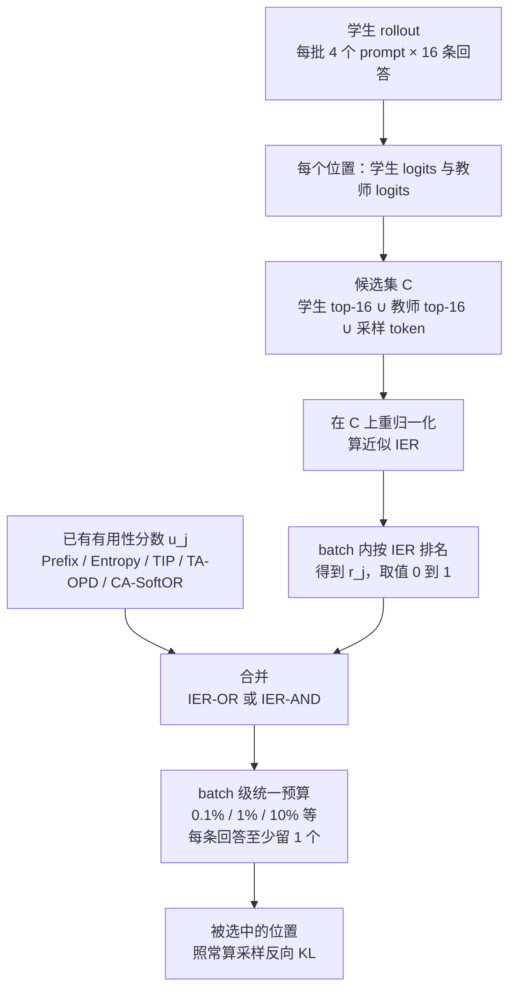

# IER-OPD：稀疏蒸馏不只要问哪个 token 有用，还要问它的梯度估得准不准

<!-- release-date: 2026-09-21 -->

> 本文依据 **1% of Tokens Can Be Enough: On Gradient Estimation in On-Policy Distillation**，作者 Huanxin Sheng、Zhiling Ye、Haonan Wang、Jian Wang、Jinjie Gu、Jian Kang（MBZUAI 与蚂蚁集团 Ant Group），arXiv:2609.24432v1，2026-09-21，共 29 页。页码均指这份 PDF 的页码。第一作者同时挂 MBZUAI 与蚂蚁集团，通讯邮箱在 MBZUAI；6 位作者里 3 位来自 MBZUAI、4 位挂蚂蚁集团（PDF p. 1）。文中区分三件事：**论文写了什么**、**我们如何解释或验算它**、**哪些是外部资料补充**。
>
> 这是一篇方法论文，不发布模型。它只改 on-policy 蒸馏里「挑哪些 token 来算损失」这一步，训练目标仍是采样反向 KL（PDF p. 1）。实验里的模型最大 4B，任务是数学推理与医学问答（PDF p. 5）。

## 读前先把几个词说成人话

学生写一条回答，里面有几千个 token。预算只允许监督其中 1%，甚至 0.1%，该挑哪些？

过去的答案都在问「这个位置有没有用」。这篇论文补上第二问：就算有用，**在这个位置上只用一个采样 token 估出来的梯度，靠不靠谱**。两问挑出来的 token 可以很不一样，这是全文的出发点。

后面反复出现的词先说清楚：

- **OPD（On-Policy Distillation，在策略蒸馏）**：学生自己写回答（rollout），教师在学生写出的每个前缀上给出「下一个 token 应该是什么分布」，学生向它靠拢。好处是教师监督的恰好是学生自己会走到的状态（PDF p. 1）。
- **前缀（prefix）**：回答写到第 $j$ 个位置之前的全部内容。每个位置对应一个前缀，也对应一次「下一个 token」的预测。
- **反向 KL（reverse KL）**：$D_{\mathrm{KL}}(p\|q)$，期望在学生分布 $p$ 下取。标准 OPD 在每个 token 位置上用它把学生对齐到教师（PDF p. 1、p. 3）。
- **采样反向 KL（sampled reverse KL）**：完整的反向 KL 要对整个词表求和；实践里只拿学生实际采出的那一个 token 来估它（PDF p. 1）。这是全文所有问题的源头。
- **稀疏 OPD（sparse OPD）**：只在一小部分位置上加监督。预算写成百分比，1% 就是整个 rollout batch 里只有 1% 的 token 参与损失（PDF p. 5）。
- **有用性分数（usefulness score）**：已有方法挑 token 用的启发式指标，如学生熵、师生分歧、位置靠前（PDF p. 1–2）。
- **梯度估计可靠性（gradient-estimation reliability）**：本文的新轴。同一个前缀下换一个采样 token，梯度估计就会变；变得越厉害，这个位置的单样本梯度越不可信。
- **Fisher 信息矩阵（Fisher information matrix）**：衡量「参数稍微动一下，分布变了多少」的局部度量。用它量误差，量的是分布层面的偏差，不是 logits 数值上的偏差（PDF p. 3）。
- **IER（Information-Efficiency Ratio，信息效率比）**：本文定义的分数，等于梯度信号除以采样噪声，噪声取最优基线下的最小值（PDF p. 4）。

## 一句话先说清

标准 OPD 在每个位置用一个采样 token 估反向 KL 的梯度。这个估计无偏，但方差可以很大。已有的稀疏 OPD 只问「这个位置有没有用」，于是可能挑中一堆「有用但估不准」的位置（PDF p. 1）。

论文在固定前缀下，用 Fisher 几何把单样本梯度拆成**信号**和**噪声**，得到闭式解：信号是学生分布下对数似然比的方差，噪声由一个「杠杆因子」加权（PDF p. 3–4，定理 1）。两者之比就是 IER，它的倒数恰好是单样本估计的相对均方误差（PDF p. 16，推论 1）。

工程上，IER 在「学生 top-16 ∪ 教师 top-16 ∪ 采样 token」这个小候选集上近似计算（PDF p. 4、p. 17），再在 batch 内转成排名，用软或（IER-OR）、软与（IER-AND）和已有的有用性分数合并（PDF p. 5）。

摘要的结论是：在数学与医学推理上，加入 IER 能改进多种已有选择器；在 0.1%–1% 的 token 预算下，稀疏配置可以打平甚至超过不做选择的全量 OPD（PDF p. 1）。读完全文要补一句限定：这句话在两组数学师生对上分量不同，Nemotron 那一对在 0.1% 预算下没有任何稀疏配置的均值超过全量 OPD（PDF p. 20，Figure 9），实验一节会拆开讲。

### 一条阅读路线

只有半小时读原文，建议按这个顺序：

1. **p. 3 式 (1)–(4)**：「采样一个 token 估梯度」怎么写，基线 $b$ 为什么不改期望。
2. **p. 3–4 定理 1 与定义 1**：信号、噪声、最优基线、IER 四个式子。
3. **p. 4 式 (12)–(14)**：候选集近似，它能落地的关键。
4. **p. 5 式 (15)**：软或、软与怎么把可靠性和有用性合起来。
5. **p. 6 的 Figure 1 与 Table 1、p. 8 的 Table 2**：主结果。
6. **p. 16 推论 1、p. 17 Table 3、p. 18 Figure 5**：IER 的统计含义、训练开销、IER 随位置下降。
7. **p. 19–21 的 Figure 6–11**：把 Table 2 按四项均值重排，并加入并发工作的 Sampled RKL min，比 Table 2 更好读出「谁真的赢了全量 OPD」。

## 主要矛盾：有用的监督，也可能给出一个方向错的梯度

### 旧问题：稀疏 OPD 只看有用性

OPD 的逐 token 信号比序列级损失、比只看最终答案的可验证奖励都密得多（PDF p. 1）。近来一批工作发现 token 的贡献并不均等，于是有了各种挑选或重加权的方法（PDF p. 1–2）：

- 按重要性：如 TIP，把学生熵和师生分歧合起来（PDF p. 2）；
- 按学生不确定性：只挑高熵位置；
- 按可教性（teachability）：如 TA-OPD，看教师在学生 top-K 候选上的概率质量与分歧（PDF p. 2）；
- 按位置：只蒸馏前面若干 token，依据是推理链越往后监督质量越差（PDF p. 1）。

论文把这些统称为**基于有用性的方法**：它们问的是「在这里监督，大概会不会帮到学生」（PDF p. 1）。

### 被忽略的一面：单样本估计的采样误差

在一个固定前缀上，反向 KL 的梯度本来是对整个词表的期望。采样 OPD 只用一个（或少数几个）学生采出的 token 去估它（PDF p. 1）。所以：

- 即使这个位置真正该做的修正很有价值，采出的那个 token 给出的梯度也可能离真值很远；
- 只有一小部分 token 参与更新时，这个问题更要紧（PDF p. 1）。**我们的解释**：全量 OPD 时几千个位置的噪声还能互相平均；只留 1% 时，每个被选中位置在更新里的份量变大，它的噪声也跟着放大。

论文由此给出的矛盾是：只看有用性，可能留下估不准的位置；只看可靠性，可能留下估得准但没什么价值的位置。两个维度都要看（PDF p. 1）。

> 旧的稀疏 OPD 在问「这里值不值得教」。这篇论文补问「在这里教，用一个样本能不能教对方向」。

## 先看全景：只改选择这一步

这张图按 PDF p. 4–5 的第 4 节与 p. 17 的附录 C.1–C.2 重画，是流程示意，不是论文原图。IER 也可以不和有用性合并，单独当选择器用（PDF p. 5）。

三点先记住，后面谈收益与代价都会用到：

1. **训练目标没变**。仍是采样反向 KL，IER 只决定哪些位置参与（PDF p. 1）。
2. **rollout 没变短**。所有回答仍完整生成、完整打分，稀疏只发生在损失上，所以不会按比例省算力（PDF p. 17）。
3. **预算是 batch 级的**。所有回答的 token 在同一个预算下竞争，每条回答至少留 1 个，不同回答被选中的比例因此可以不同（PDF p. 17）。

## 核心设计一：把单样本梯度拆成信号和噪声

### 旧问题：单样本估计「无偏」不等于「靠谱」

REINFORCE 一系早就说明，用采到的一个动作乘上它的回报，梯度在期望上是对的（PDF p. 2）。但期望对不说明单次估计离真值多远。以往给 OPD 降方差的工作（如 vOPD）加了控制变量基线，量误差用的是参数空间的欧氏范数（PDF p. 2）。论文要换一把更贴合蒸馏目标的尺子，并且要让这把尺子能直接拿来**给位置排序**。

### 要算什么：一个固定前缀上的局部梯度

固定一个学生写出的前缀 $s$，把它从记号里省掉。词表 $\mathcal{A}$ 至少有 2 个 token；学生的下一 token 概率记为 $p_a$，教师记为 $q_a$，都大于 0（PDF p. 3）。OPD 在这个前缀上要最小化反向 KL（PDF p. 3，式 1）：

$$
D_{\mathrm{KL}}(p\|q)=\mathbb{E}_{a\sim p}\left[\log\frac{p_a}{q_a}\right]
$$

对数里那一项后面会反复出现，单独起名叫**对数似然比**：$\rho(a)=\log(p_a/q_a)$。它为正，说明学生在 $a$ 上比教师自信；为负，说明学生低估了 $a$。

接着求这个 KL 对学生 logits $z_\theta$ 的梯度。softmax 下 $\phi_a=\nabla_{z_\theta}\log p_a=e_a-p$，$e_a$ 是 $a$ 的 one-hot 向量，并且 $\mathbb{E}_p[\phi_a]=0$（PDF p. 3）。利用这一点，局部梯度可以写成（PDF p. 3，式 2）：

$$
g=\mathbb{E}_{p}\bigl[\rho(a)\,\phi_a\bigr]
$$

意思是：把每个候选 token 的「方向」$\phi_a$ 按它的对数似然比 $\rho(a)$ 加权，再按学生概率求平均。

### 采样估计：一个 token 代替整个期望

采样 OPD 只采一个 $a\sim p$。借用策略梯度里的控制变量（control variate）做法，论文引入一个与动作无关的标量基线 $b$（PDF p. 3，式 3–4）：

$$
\hat g_b(a)=\bigl(\rho(a)-b\bigr)\phi_a,\qquad \mathbb{E}_p[\hat g_b]=g
$$

因为 $\mathbb{E}_p[\phi_a]=0$，减去任何常数 $b$ 都不改期望，只改方差。估计误差记为 $\delta_b(a)=\hat g_b(a)-g$。乘上雅可比 $J_s=\partial z_\theta/\partial\theta$ 的转置，就回到参数空间（PDF p. 3）。

### 为什么不用欧氏距离量误差

最直接的做法是量 $\hat g_b$ 与 $g$ 的欧氏均方误差（PDF p. 3，式 5）。论文认为不合适：反向 KL 衡量的是两个分布的差异，欧氏距离却把概率值当成普通坐标（PDF p. 3）。

于是改用 KL 自己诱导的局部几何。logits 挪动一个很小的 $\Delta z$ 时，分布变化的 KL 近似为二次型（PDF p. 3，式 6）：

$$
D_{\mathrm{KL}}\bigl(p\,\|\,p^{\Delta}\bigr)\approx\tfrac12\,\Delta z^{\top}F\,\Delta z,\qquad F=\mathrm{diag}(p)-pp^{\top}
$$

$F$ 就是 softmax 分布的 Fisher 信息矩阵。它是奇异的（全 1 向量方向上加常数不改 softmax），所以用伪逆 $F^{+}$。两个梯度对应的**自然梯度** $F^{+}g$ 与 $F^{+}\hat g_b$ 之差，在 $F$ 度量下的长度平方是 $\delta_b^{\top}F^{+}\delta_b$，记为 $\|\delta_b\|^2_{F^{+}}$（PDF p. 3）。

人话版：误差不按「logits 数值差了多少」算，而按「这一步更新会把分布推偏多少」算。

### 定理 1：信号、噪声、最优基线

先定义**杠杆因子**（leverage factor）：

$$
L(a)=\frac{1-p_a}{p_a}
$$

学生越不常写的 token，$L(a)$ 越大。论文证明（PDF p. 3–4，定理 1；证明在 PDF p. 14–15），信号的平方长度等于对数似然比在学生分布下的方差：

$$
\|g\|^2_{F^{+}}=\mathrm{Var}_p\bigl[\rho(a)\bigr]
$$

任一基线 $b$ 下的均方估计误差是：

$$
\mathbb{E}_p\bigl[\|\hat g_b-g\|^2_{F^{+}}\bigr]=\mathbb{E}_p\Bigl[\bigl(\rho(a)-b\bigr)^2L(a)\Bigr]-\mathrm{Var}_p\bigl[\rho(a)\bigr]
$$

让误差最小的基线是：

$$
b^{\star}=\frac{\mathbb{E}_p\bigl[\rho(a)L(a)\bigr]}{\mathbb{E}_p\bigl[L(a)\bigr]}
$$

证明里有两步值得记住（PDF p. 15）：

- 单个 token 方向的 Fisher 长度恰好是杠杆因子：$\|\phi_a\|^2_{F^{+}}=L(a)$。学生很少写的 token 一旦被采中，它带来的那一步在分布层面「很长」。
- $\mathbb{E}_p[L(a)]=\sum_a(1-p_a)=m-1>0$，$m$ 是词表大小；二阶导为 $2(m-1)>0$，所以 $b^{\star}$ 是唯一全局最小点。

下面这张图用两组 3 词表的小例子，把三个式子摆成能看见的样子：

**我们如何解释它。** 图里的数是按定理 1 手算的，不在原文里。两种情形的信号差不多，差别全在噪声：B 要修的分歧落在学生只写 20% 与 10% 的两个 token 上，杠杆 4 和 9 把它们的贡献放大。单样本多数时候采不到它们，一采到又是一步很长的更新，估计自然不稳。反过来看信号：如果学生在所有 token 上都比教师「同样多自信一点」，$\rho$ 是常数，就没有要修的方向（定理 1 也要求 $\rho$ 非常数）。

还有一个验算结果：词表只有 2 个 token 时，最优基线下的噪声恰好为 0。因为此时 $\phi_a$ 只有一个自由方向，一个标量基线就能把它完全抵消。IER 里的噪声，来自「好几个方向、只有一个标量基线」的结构性不足。

### 定义 1：IER

有了信号和最优基线下的噪声，IER 定义为（PDF p. 4，定义 1，式 10–11）：

$$
\mathrm{IER}=\frac{\mathrm{Signal}}{\mathrm{Noise}}=\frac{\|g\|^2_{F^{+}}}{\mathbb{E}_p\bigl[\|\hat g_{b^\star}-g\|^2_{F^{+}}\bigr]}
$$

只在噪声大于 0 时有定义。论文强调两点：IER 高意味着梯度方向估得更准；**IER 高不代表这个监督有用**（PDF p. 4）。

### 推论 1：IER 的倒数就是相对均方误差

在同一个前缀上独立采 $K$ 个 token 取平均得到 $\bar g_K$，相对均方误差是（PDF p. 16，推论 1，式 34）：

$$
\frac{\mathbb{E}_p\bigl[\|\bar g_K-g\|^2_{F^{+}}\bigr]}{\|g\|^2_{F^{+}}}=\frac{1}{K\cdot\mathrm{IER}}
$$

$K=1$ 时，$1/\mathrm{IER}$ 就是单样本估计的相对误差。反过来，要把相对误差压到 $\epsilon$ 以下，这个前缀上至少要采 $K\ge 1/(\epsilon\cdot\mathrm{IER})$ 个样本。按 IER 自适应分配每个位置的采样数，论文留作未来工作（PDF p. 16）。

同页还有一句限定：IER 量的是相对估计精度，不是梯度大小；高 IER 对梯度幅度、是否与任务对齐、更新是否有益都没有保证（PDF p. 16）。

### 收益、代价与可迁移启发

收益是：不必在同一前缀上重复采样，只凭学生与教师在这个位置的两份分布，就能算出一个带统计含义的可靠性分数。代价是：理论只覆盖单个固定前缀和反向 KL 这一种目标；跨位置的相关性、选中后怎么加权，定理都不管。

可迁移的做法是：用单样本估计期望时，先问「这个期望本来有多难估」。把误差放在目标自己的几何里量（这里是 KL 的 Fisher 几何），常常能得到闭式的信噪比，它可以直接当成挑样本、分配采样预算的依据。任何「每个位置只采一次」的 token 级 RL 或蒸馏目标都能套这个思路，但论文只推导了反向 KL。

## 核心设计二：候选集近似，让 IER 算得起

### 旧问题：精确 IER 要遍历整个词表

定义 1 的每一项都是对全词表的期望。每个位置都算一遍，在实践里不可行（PDF p. 4）。

### 新设计：只在学生与教师都看好的 token 上算

每个前缀上，取学生 logits 的 top-K、教师 logits 的 top-K，再并上实际采到的 token，构成候选集（PDF p. 4，式 12）：

$$
\mathcal{C}=\mathrm{TopK}(z_\theta)\cup\mathrm{TopK}(z_T)\cup\{a\}
$$

然后在 $\mathcal{C}$ 上分别对学生和教师做 softmax 重归一化，得到 $\hat p$ 与 $\hat q$（PDF p. 4，式 13）。其余量全部换成候选集版本 $\hat\rho$、$\hat L$、$\hat b^{\star}$，最终（PDF p. 4，式 14）：

$$
\widehat{\mathrm{IER}}=\frac{\mathrm{Var}_{\hat p}\bigl[\hat\rho(a)\bigr]}{\mathbb{E}_{\hat p}\Bigl[\bigl(\hat\rho(a)-\hat b^{\star}\bigr)^2\hat L(a)\Bigr]-\mathrm{Var}_{\hat p}\bigl[\hat\rho(a)\bigr]}
$$

### 工程细节

附录 C.1 给出了全部实现参数（PDF p. 17）：

| 项 | 取值 |
|---|---|
| top-K 的 K | 16 |
| 候选集大小 | $16\le|\mathcal{C}|\le 33$ |
| 一方 top-K 里没有的 token 的 logit | 填 −12，再在候选集上 softmax |
| 对数似然比 $\hat\rho$ 截断 | $[-30,\,30]$，所有相关计算都用截断后的值 |
| 分母防除零 | $\epsilon=10^{-8}$，用于杠杆因子与最终 IER |

正文第 4 节写的是「给缺失 logit 赋一个小值 $\epsilon$」（PDF p. 4），附录给的具体值是 −12（PDF p. 17），以附录为准。

### 代价与边界

**我们如何解释它。** 候选集把 IER 变成一个只依赖两边 top-16 logits 的小计算。学生和教师的前向本来就要做，增量很小（实测见后文的训练开销）。代价是近似：学生很少写、教师也不看好的长尾 token 被整体丢掉，而上面的小例子说明噪声恰恰可能集中在冷门 token 上。论文没有给近似 IER 与精确 IER 的误差分析，也没有 K 的消融。

可迁移的一点：top-K 并集加采样 token 是一个通用的「全词表统计」代理，凡是需要在每个位置算分布级指标、又负担不起全词表的场合都能用；但用之前最好先在少量位置上对照一次全词表的精确值。

## 核心设计三：可靠性与有用性，用软或与软与合并

IER 只管「估得准不准」，不管「有没有用」。论文因此不拿它取代已有分数，而是和它们合并（PDF p. 5）。

做法：在一个 rollout batch 内，先按近似 IER 排序，把位置 $j$ 的排名归一化为 $r_j\in[0,1]$；已有的有用性分数同样在 batch 内归一化为 $u_j\in[0,1]$。然后（PDF p. 5，式 15）：

$$
s^{\mathrm{OR}}_j=1-(1-u_j)(1-r_j),\qquad s^{\mathrm{AND}}_j=u_j\,r_j
$$

- **IER-OR**：两者任一高，分数就高，一边可以弥补另一边，倾向留下「最有用或最可靠」的位置。
- **IER-AND**：两者都高才高，倾向留下「又有用又可靠」的位置（PDF p. 5）。

合并用的是 IER 的**排名**而不是原始值。原文只写了「归一化排名」（PDF p. 5）；**我们的解释**是，原始 IER 极度长尾（实验一），直接相乘会被少数极端值主导，排名把它压到与有用性同一个尺度上。

附录 B.1 给了一个更一般的表述：在预算 $\alpha$ 下，从全部 rollout token 里选至多 $\alpha$ 比例的子集 $S$ 并赋权，目标是最大化选中位置加权梯度带来的期望改进（PDF p. 14，式 16）。论文把它类比为高维统计里的变量筛选，又指出 token 之间天然相关、采样是动态的，传统统计筛选不能直接套用（PDF p. 14）。这一节只是问题表述，实验里用的仍是上面的排名加软逻辑合并。

**可迁移启发。** 两个分数不在同一尺度上时，先各自转成 batch 内排名，再用软逻辑合并，不需要调权重。直觉上 OR 与 AND 分工不同：基线弱时，OR 能把可靠位置补进来；基线强时，AND 像在它的候选里再过一道筛。这是我们的读法：医学上弱基线 Prefix 配 OR 明显好于配 AND（Table 1），但数学结果不整齐，论文也没有给出何时选 OR、何时选 AND 的规则。

## 实验怎么设

### 任务与师生对

论文考虑两种蒸馏情形（PDF p. 5）：**强到弱**（strong-to-weak），师生同尺寸同架构，学生没有在该推理任务上做过后训练；**大到小**（big-to-small），教师更大更强，与学生共享分词器。

| 任务 | 教师 → 学生 | 类型 | 训练数据与轮数 | 评测 |
|---|---|---|---|---|
| 数学 | JustRL-Nemotron-1.5B → OpenMath-Nemotron-1.5B | 强到弱 | DAPO-Math-17k，50 轮 rollout | AIME 2025/2026、HMMT-Feb 2025/2026，每题 32 个样本，报 Bayes@32 均值与标准误 |
| 数学 | JustRL-Qwen3-4B → Qwen3-1.7B | 大到小 | 同上 | 同上 |
| 医学 | ClinAlign-4B → Qwen3-4B | 论文未单独归类 | RaR-Medicine，100 轮 rollout | HealthBench 整体分与 Hard 分 |

两个数学教师都由 JustRL 训练（PDF p. 5）。医学的 ClinAlign-4B 与 Qwen3-4B 同为 4B，论文没有把这一对明确归到哪一类。

医学回答由 gpt-oss-120B 打分，它在 HealthBench 元评测上的宏 F1 是 0.6614（PDF p. 5）。附录给了对照：gpt-5.6-luna（最大推理强度）为 0.6068；HealthBench 默认评委 GPT-4.1 为 0.709，但按实验规模用它会超出作者的评测经费（PDF p. 17）。

### 训练与评测超参

| 项 | 取值（PDF p. 17） |
|---|---|
| 每个 rollout batch | 4 个 prompt × 每个 16 条学生回答 |
| rollout 采样 | 温度 1，top-p 1 |
| 最大 prompt / 回答 / 上下文 | 2,048 / 8,192 / 16,384 token |
| minibatch | 每个 rollout batch 切 8 个，每个 batch size 8 |
| 优化器 | Adam，学习率 $10^{-6}$，权重衰减 0.1，$(\beta_1,\beta_2)=(0.9,\,0.98)$ |
| 数学评测解码 | 温度 0.7，top-p 0.9，最大回答 32,768 token；规则验证器判答案 |

主实验里 Qwen3 关闭思考（thinking-off），思考模式另做一节（PDF p. 9）。

### 对照组

五个基于有用性的选择器（PDF p. 5）：

1. **Prefix**：选回答里靠前的位置；
2. **Entropy**：按学生下一 token 熵的归一化值；
3. **TIP**：对归一化熵与师生分歧做软或；
4. **TA-OPD**：归一化局部分歧乘以教师在学生 top-k 上的归一化概率质量；
5. **CA-SoftOR**：TA-OPD 的变体，把归一化熵与「兼容性加权分歧」做软或。

另有：随机选择、全量 OPD（不做选择）、学生与教师本身，以及并发工作 Liu 等人 2026d 的两个选择器 Sampled RKL max / min，按本文的实验设置跑（PDF p. 8、p. 18）。预算主要取 0.1%、1%、10%，参数分析再加 5%、20%、50%、80%（PDF p. 5）。

## 实验一：IER 分数极度长尾，单独用它挑 0.1% 就有效

论文观察到 IER 分数分布极度长尾：通常不到 0.1% 的 token 分数超过 1（PDF p. 6）。按定义，这意味着在候选集近似下，绝大多数位置估出的噪声大于信号。作者由此推断，不管梯度可靠性、把所有位置都拿来监督的全量 OPD，可能并不是最优的（PDF p. 6）。

上图是附录 Figure 5，图注的结论是 IER 在靠后的位置趋于下降（PDF p. 18）。它和「推理链越往后监督质量越差」这条前缀类方法的依据方向一致；区别是 IER 给出的是连续分数，而不是一刀切的截断点。

### 单独当选择器

IER 单独用、预算 0.1% 时（PDF p. 6，Table 2 在 PDF p. 8）：

- Nemotron 对：AIME26 上 58.9 对全量 OPD 的 59.9，HMMT26 上 34.1 对 34.7，接近但没超过；
- Qwen3 对：四项里三项超过全量 OPD（AIME25 15.8 对 14.4、AIME26 15.2 对 12.5、HMMT25 9.5 对 8.7），HMMT26 的 13.0 对 13.4 是例外；
- 医学：这个预算大约相当于每条回答只选 1 个 token。IER 的 HealthBench 整体分 45.25，全量 OPD 45.77；同预算下 Prefix 只有 38.30，与学生本身的 38.23 几乎一样（PDF p. 6）。

论文的读法：挑一个很小的 IER 子集就能实现有效蒸馏；梯度估计嘈杂时，加入更多 token 未必更好（PDF p. 6）。

## 实验二：可靠性与有用性挑中的是不同的 token

Figure 1（PDF p. 6）是四张选择器两两比较的热图。下表摘出 IER 与其余选择器那一行：左边是 top-10% 挑选的 Jaccard 相似度（两份挑选的交集除以并集），右边是全体 token 排名的 Spearman 相关。

| IER 与…… | Jaccard，Nemotron 对 | Jaccard，Qwen3 对 | Spearman，Nemotron 对 | Spearman，Qwen3 对 |
|---|---:|---:|---:|---:|
| Prefix | 0.06 | 0.04 | 0.04 | −0.01 |
| Entropy | 0.14 | 0.39 | 0.81 | 0.94 |
| TIP | 0.15 | 0.39 | 0.82 | 0.94 |
| CA-SoftOR | 0.15 | 0.39 | 0.82 | 0.94 |
| TA-OPD | 0.23 | 0.22 | 0.68 | 0.69 |

作为对照，同一张图里 TIP 与 CA-SoftOR 的 top-10% Jaccard 是 0.99（Nemotron 对）和 0.97（Qwen3 对），几乎挑的是同一批 token（PDF p. 6，读自 Figure 1）。

论文的说法：除 Prefix 外，各选择器的全体排名高度相关，但 IER 与有用性选择器的 top-10% 挑选常常差得很远；梯度估得可靠的 token，有用性分数可能不高；有用性分数高的 token，梯度可能很嘈杂，把更新带向错误方向；预算越小，Jaccard 还会进一步下降（PDF p. 6，这一句没有给数字）。这就是合并两者的直接动机。

**我们如何解释它。** 「整体排序相关、头部不重合」是一个很实用的诊断。两个分数在大多数平庸位置上意见一致，真正决定稀疏预算的是最头部那一小撮，而那一小撮恰恰分歧最大。预算越稀疏，选择器之间的差异越要紧。

## 实验三：主结果

### 医学推理：Table 1

Table 1 给出 HealthBench 整体分 / Hard 分（PDF p. 6）。参照行：学生 38.23 / 8.78，全量 OPD 45.77 / 19.77，教师 46.37 / 20.24；标准误约为 0.5 / 1。

| 选择器 | 10% | 1% | 0.1% |
|---|---|---|---|
| IER（单独） | 45.85 / 19.68 | 44.95 / 18.39 | 45.25 / 18.37 |
| Prefix | 42.17 / 14.11 | 39.91 / 10.97 | 38.30 / 8.68 |
| +IER-OR | 45.34 / 19.68 | 44.79 / 19.07 | 44.98 / 19.49 |
| +IER-AND | 44.48 / 16.25 | 42.58 / 14.96 | 41.55 / 12.72 |
| Entropy | 45.47 / 19.00 | 44.20 / 17.32 | 42.75 / 15.36 |
| +IER-OR | 45.97 / 20.07 | 45.09 / 20.10 | 45.64 / 19.91 |
| +IER-AND | 45.19 / 19.01 | 45.40 / 19.02 | 44.92 / 18.77 |
| TIP | 45.03 / 19.96 | 43.99 / 16.85 | 42.87 / 14.27 |
| +IER-OR | 45.59 / 20.17 | 44.92 / 19.05 | 46.08 / 19.61 |
| +IER-AND | 45.18 / 19.61 | 44.41 / 19.44 | 45.05 / 19.37 |
| TA-OPD | 44.02 / 18.02 | 45.19 / 19.22 | 44.71 / 18.61 |
| +IER-OR | 45.21 / 18.26 | 45.05 / 20.31 | 45.69 / 19.68 |
| +IER-AND | 46.11 / 20.45 | 45.10 / 20.01 | 44.46 / 19.38 |
| CA-SoftOR | 45.14 / 19.88 | 44.02 / 17.23 | 41.98 / 14.86 |
| +IER-OR | 44.16 / 19.37 | 44.82 / 19.58 | 44.63 / 18.44 |
| +IER-AND | 45.56 / 19.26 | 44.49 / 19.68 | 42.37 / 18.41 |

读这张表看三件事（PDF p. 6–7）：

1. **预算越小，IER 帮得越多**。0.1% 时，每个有用性选择器的 Hard 分都在加入 IER 后上升。
2. **弱基线收益最大**。Prefix+IER-OR 在 0.1% 下把整体 / Hard 从 38.30 / 8.68 拉到 44.98 / 19.49。
3. **接近甚至越过全量与教师**。0.1% 下 TIP+IER-OR 是 46.08 / 19.61，TA-OPD+IER-OR 是 45.69 / 19.68，与全量 OPD 的 45.77 / 19.77 相当；10% 下 TA-OPD+IER-AND 是 46.11 / 20.45，与教师 46.37 / 20.24 相当。

反例也在表里：10% 下 CA-SoftOR+IER-OR 的整体分从 45.14 降到 44.16；Prefix+IER-AND 在三档预算下都明显不如 Prefix+IER-OR。

按标准误约 0.5 / 1 的量级读（我们的读法）：整体分落在 44–46 之间的大部分差距在 1–2 个标准误以内。明显超出噪声的，是 Prefix 类的大幅提升，以及 0.1% 下 Prefix、Entropy、TIP、CA-SoftOR 四个基线加入 IER 后 Hard 分 3.4–10.8 分的上升。TA-OPD 在 0.1% 下 Hard 分只升了约 1 分（18.61 到 19.68 或 19.38），仍在 1 个标准误上下。

### 数学推理：Table 2 与 Figure 6–11

Table 2 是 Bayes@32（%），标准误在 0.4–1 之间（PDF p. 8）。全表三档预算 × 18 行 × 8 列，这里只摘读表必需的行：

| 方法 | Nemotron AIME25 | AIME26 | HMMT25 | HMMT26 | Qwen3 AIME25 | AIME26 | HMMT25 | HMMT26 |
|---|---:|---:|---:|---:|---:|---:|---:|---:|
| 学生 | 47.3 | 53.3 | 32.8 | 32.6 | 11.6 | 10.3 | 8.4 | 10.4 |
| 教师 | 58.6 | 62.3 | 40.6 | 35.7 | 22.5 | 19.9 | 13.7 | 20.2 |
| 全量 OPD | 56.3 | 59.9 | 36.9 | 34.7 | 14.4 | 12.5 | 8.7 | 13.4 |
| 0.1% 随机 | 49.6 | 55.4 | 33.5 | 32.9 | 13.6 | 12.4 | 8.7 | 10.6 |
| 0.1% IER | 53.5 | 58.9 | 34.8 | 34.1 | 15.8 | 15.2 | 9.5 | 13.0 |
| 0.1% TIP | 53.2 | 57.5 | 36.2 | 35.3 | 14.9 | 13.4 | 8.9 | 11.6 |
| 0.1% TIP+IER-AND | 52.1 | 56.1 | 35.8 | 34.8 | 19.4 | 16.3 | 11.7 | 14.4 |
| 1% TA-OPD | 52.4 | 57.8 | 36.4 | 33.1 | 16.8 | 13.3 | 8.3 | 14.1 |
| 1% TA-OPD+IER-AND | 54.6 | 59.8 | 37.8 | 36.2 | 17.6 | 13.5 | 9.7 | 14.4 |
| 10% TIP | 56.6 | 59.3 | 37.0 | 37.2 | 15.8 | 14.1 | 9.9 | 14.7 |

论文点名的两个例子（PDF p. 7）：TIP+IER-AND 在 0.1% 下对 Qwen3 对四项都超过全量 OPD；TA-OPD+IER-AND 在 1% 下对 Nemotron 对与全量 OPD 相当。10% 预算下 TIP 在 HMMT26 上的 37.2 还高过教师的 35.7（PDF p. 6）。论文也承认，有用性选择器本身仍有竞争力，如 Nemotron 对上 10% 的 TA-OPD、1% 的 CA-SoftOR（PDF p. 6）。

反例同样写在 Table 2 里：Nemotron 对 0.1% 下，TIP+IER-AND 四项全部低于 TIP 本身；Entropy+IER-OR 在 1% 下 AIME25 从 53.6 掉到 49.7（PDF p. 8）。论文明说：收益取决于选择器与设置，基于 Entropy 的组合尤其会让数学性能下降，IER-OR 和 IER-AND 都不能稳定改进 Entropy；有用性分数与 IER 都是近似，不保证选得更好（PDF p. 7）。

附录 C.4 的 Figure 6–11 把每个设置下各方法在四个数学基准上的 Bayes@32 取平均排序，加入三个种子的随机选择与 Sampled RKL min（PDF p. 18–21）。这六张图本身就是带数字的排行表，下面摘出关键行：

| 方法 | Qwen3 0.1% | Qwen3 1% | Qwen3 10% | Nemotron 0.1% | Nemotron 1% | Nemotron 10% |
|---|---:|---:|---:|---:|---:|---:|
| 教师 | 19.08 | 19.08 | 19.08 | 49.30 | 49.30 | 49.30 |
| 全量 OPD | 12.25 | 12.25 | 12.25 | 46.95 | 46.95 | 46.95 |
| 最好的 IER 组合 | 15.45（TIP+AND） | 14.40（Entropy+AND） | 13.85（TIP+AND） | 45.73（Prefix+OR） | 47.10（TA-OPD+AND） | 47.83（TIP+OR） |
| 最好的有用性基线 | 12.25（CA-SoftOR） | 13.55（TIP） | 13.63（TIP） | 45.55（TIP） | 45.80（Entropy） | 47.78（TA-OPD） |
| IER 单独 | 13.38 | 12.70 | 12.90 | 45.33 | 45.60 | 46.88 |
| Sampled RKL max | 12.15 | 11.38 | 12.73 | 45.70 | 47.22 | 46.95 |
| Sampled RKL min | 11.07 | 12.02 | 12.95 | 45.83 | 48.17 | 47.67 |
| 随机（3 种子） | 11.31 | 11.33 | 12.02 | 42.87 | 43.02 | 45.08 |
| 学生 | 10.18 | 10.18 | 10.18 | 41.50 | 41.50 | 41.50 |

来源：Figure 6、7（PDF p. 19），Figure 8、9（PDF p. 20），Figure 10、11（PDF p. 21）。

这张表把摘要那句话拆开了：

- **Qwen3 对（大到小）**：三档预算下，最好的 IER 组合都高过全量 OPD；IER 单独也三档都高过全量 OPD。
- **Nemotron 对（强到弱）**：0.1% 下全量 OPD 的 46.95 排在教师之后第一，没有任何稀疏配置超过它；1% 下有两个 IER 组合（TA-OPD+IER-AND 47.10、Prefix+IER-AND 47.08）略超全量，但排第一的是 Sampled RKL min 的 48.17；10% 下多个组合与基线都超过全量。IER 单独三档都低于全量。

论文自己对 Sampled RKL 的总结是：它们在 Nemotron 对的 0.1% 与 1% 下几乎胜过所有其他选择器，换到 Qwen3 对就明显退化，与随机和 Prefix 相当甚至更差；六个设置里没有哪个选择器处处最好，「有用性 + IER」仍是一个有前景的选项（PDF p. 18）。

按 Figure 6–11 的均值逐组比较（我们的统计）：5 个基线 × 2 种合并 × 6 个设置共 60 组，加入 IER 后均值上升的有 45 组，Qwen3 对 0.1% 一档 10 组全升。这与论文「多数设置下加入 IER 提高均值 Bayes@32」一致（PDF p. 18）。

**我们如何解释它。** Qwen3 对上全量 OPD 本身很弱：50 轮之后均值只从学生的 10.18 走到 12.25，离教师的 19.08 很远，10% 随机选择已到 12.02（PDF p. 19–20）。在「全量也没学到多少」的设置里，稀疏配置超过全量的门槛低。Nemotron 对的全量 OPD 已经拿到师生差距的大半（41.50 到 46.95，教师 49.30；PDF p. 20），稀疏要追上它难得多。摘要里「0.1%–1% 打平或超过全量」在两组师生对上的分量并不相同。

## 实验四：预算越大不一定越好

论文把预算扫过 0.1%、1%、5%、10%、20%、50%、80%（PDF p. 7）。医学上的这张图最干净：弱选择器 Prefix 要靠堆预算才能追上全量，加了 IER-OR 就不必；本来就强的 TIP，加不加 IER-OR 的差别只在最小预算那一点上。论文的总结：有用性选择器表现差、预算小时 IER 有益；二者组合在 0.1% 与 1% 预算下能打平或超过全量 OPD（PDF p. 9）。

数学上的观察（PDF p. 9）：基线弱（Prefix）或预算极小（0.1%、1%）时，IER 通常能改进蒸馏后的学生；改进幅度随预算变化，但在若干设置下，用「有用性 + IER」选 1%–5% 的 token 就能打平或超过全量 OPD。

读这张图要注意一处原文不一致：Figure 3 的图注写下半幅是 TIP，但图例写的是 TA-OPD，第 5.4 节正文也说比较的是 Prefix 与 TA-OPD（PDF p. 7）；这里按图例把下半幅当作 TA-OPD。图注还写「Nemotron 对用 IER-OR，Qwen3 对用 IER-OR」，两处都是 IER-OR。

预算与效果不单调，论文给了两个候选原因（PDF p. 9）：启发式有用性分数只是真实有用性的粗糙代理，本身可能失效；即使 token 有用，它的梯度也可能估得很差，从而误导训练。两者都会让加大预算的收益变小甚至反降。论文没有做实验把这两个原因分开。

## 实验五：思考模式开与关

前面 Qwen3 的实验都关闭了思考。这一节打开思考，并让推理 token 也参与选择；有用性选择器取 TIP（它在 Table 2 里表现强），合并方式取 IER-AND（PDF p. 9）。

论文的观察（PDF p. 9）：TIP+IER-AND 在 0.1% 或 1% 预算下收益最大；关闭思考时，稀疏方法（TIP 与 TIP+IER-AND）常常打平或超过全量 OPD；开启思考时，TIP 单独可能不如全量 OPD，甚至比学生本身还差；无论开关，TIP+IER-AND 在多数情况下都改进了数学推理。

图里有一个反例要看到：HMMT2026 开启思考时，TIP+IER-AND 在 0.1% 与 1% 两档都低于 TIP 与全量 OPD（读自 Figure 4）。「多数情况改进」是准确的描述，「处处改进」不是。

## 训练开销：选得更少，不代表算得更少

Table 3 在 Qwen3-4B → Qwen3-1.7B、DAPO-Math-17k 上测了 30 个稳态 rollout 步，峰值显存是 8 张卡合计（PDF p. 17）：

| 方法 | 保留比例 | 步时（秒） | 相对全量 | P95（秒） | 峰值显存（GiB） |
|---|---:|---:|---:|---:|---:|
| 全量 OPD | 100% | 2.103 ± 0.255 | — | 2.687 | 235.95 |
| IER | 10% | 2.152 ± 0.270 | +2.3% | 2.667 | 236.03 |
| TIP | 10% | 2.123 ± 0.318 | +1.0% | 2.809 | 235.95 |
| TIP + IER | 10% | 2.150 ± 0.291 | +2.2% | 2.738 | 238.12 |
| TA-OPD | 10% | 2.120 ± 0.341 | +0.8% | 3.010 | 235.94 |
| TA-OPD + IER | 10% | 2.155 ± 0.277 | +2.5% | 2.631 | 234.81 |

论文的结论：IER 及其组合让平均步时增加 2.2%–2.5%，聚合峰值显存最多增加 2.17 GiB，即 0.92%（PDF p. 17）。

更要紧的是这句限定：实验里虽然只选 10% 甚至更少的 token，但**不裁剪、不截断任何推理轨迹**，仍完整生成并在全部位置上评估监督质量，再额外算分数与选择。所以在这个实现里，稀疏监督不带来成比例的算力节省（PDF p. 17）。表里的 TIP+IER 与 TA-OPD+IER 没有注明是 OR 还是 AND，GPU 型号也没写。

论文据此提了一个方向：既然 IER 在靠后位置下降（Figure 5），而 Prefix+IER-OR 在 0.1% 下表现强，可以在「前面已经攒够预算数量的可靠 token」时就截断轨迹，从而真正省下生成开销（PDF p. 17–18）。这一条没有实现，也没有实验。

**可迁移启发。** 评估一个「稀疏训练」方法的收益，先问稀疏发生在哪一段。这里稀疏只在损失上，生成与教师打分照旧，省下的只有反向传播里很小的一部分，净开销反而略增。要把稀疏变成吞吐收益，必须让它反过来缩短 rollout 或减少教师调用。

## 附录 D：IER 改变了哪些 token

附录 D 给了 7 个样例，全部在 10% 预算下：4 个数学样例对比 Entropy、CA-SoftOR 与其 IER-OR / IER-AND 变体，每个只展示回答的前 350 个 token；3 个医学样例对比 TA-OPD、TIP 与其变体，展示完整回答（PDF p. 22）。颜色标出基线选中且保留、IER 新加入、重排后被移除三类。

论文的观察：加入 IER 后新选中的 token 既有技术表达，也有普通用语。数学样例 35 里，Entropy+IER-OR 新加了「polynomial remainder」「divisor」「constants」「degree」这类词，也加了「Wait」「So」；医学样例 889 里，TA-OPD+IER-OR 新加的是与算术计算和最终数值答案相关的 token（PDF p. 22）。同页的提醒是：IER 衡量的是梯度估计可靠性，不决定哪些 token 对下游性能贡献最大，加入 IER 可能加入也可能移除看起来对推理很重要的 token（PDF p. 22）。这些样例是定性展示，没有配统计。

## 和相关工作的分界

论文把自己放在两条线的交叉处（PDF p. 2、p. 13–14）：

- **OPD 的 token 选择**：TIP、TA-OPD、各种熵方法、前缀截断方法都在量「有用性」的不同侧面。并发工作 Liu 等人 2026d 发现，按奖励值在每条轨迹里只选 1 个 token 也可能有效（PDF p. 2）。
- **策略梯度估计**：REINFORCE、方差缩减基线、自然策略梯度、策略梯度的信噪比分析是理论来源（PDF p. 2）。在 OPD 里最接近的是 vOPD：它也用控制变量基线降低单样本 OPD 梯度的方差，但基于参数空间的欧氏梯度范数（PDF p. 2）。

与 vOPD 的差别有两点：误差在 Fisher 几何而不是欧氏范数下量；IER 被用来**挑位置**，而不只是用基线降方差（PDF p. 1–2）。论文也点了其他用信噪比或可靠性的 OPD 工作，说明它们量的不是单样本采样误差：SA-OPD 的梯度信噪比区分的是输入驱动与先验驱动的更新；TrOPD 用教师接受概率当可靠性（PDF p. 2）。

站内几篇 OPD 解读可以对照读。RetireOPD 一篇讲教师何时退出，Rethinking-OPD 一篇讨论强教师为什么不等于可学。和本文最有意思的对照是 Privileged-Info-OPSD 一篇：那边追问的是「OPD 的信号从哪来」，发现在线自蒸馏的大部分收益来自思考模式教师与直答模式学生之间的模式差，而不是参考答案；它用的是对全词表逐项截断的前向 KL，每个位置不存在本文讨论的单样本估计噪声。**我们的读法**：两篇合起来说明，OPD 的「逐 token 信号」至少有两层要单独核算，一层是信号本身的来源与价值，一层是这个信号在当前实现里被估得准不准。

## 限制、边界，以及不要补进去的实现

论文自己承认的（PDF p. 7、p. 9、p. 16–18、p. 22）：

- **收益依赖选择器与设置**。基于 Entropy 的组合在数学上会掉点；没有哪个选择器在六个数学设置里处处最好。
- **IER 与有用性分数都是近似**，不保证选得更好。
- **IER 不代表有用**，也不代表梯度幅度或任务对齐。
- **不省算力**。完整生成、全位置打分，净开销略增。
- **如何最好地选 token、给 token 加权仍是开放问题**；更好的 token 重要性理解与训练目标设计留作未来工作（PDF p. 9）。

我们读完必须留下的判断：

- **「0.1%–1% 打平全量」在两组数学师生对上不对称**。Nemotron 对 0.1% 下没有稀疏配置的均值超过全量 OPD（PDF p. 20，Figure 9）；Qwen3 对的全量 OPD 本身离教师很远，稀疏超过它的门槛低。
- **理论只覆盖单个固定前缀**。定理与推论都在固定前缀下成立；跨位置的相关性、选择后如何加权，论文在 B.1 提出了问题（PDF p. 14），没有给出理论保证。
- **候选集近似没有误差分析**。top-16 并集丢掉了长尾，而按定理 1，冷门 token 恰是噪声的主要来源；K 取 16 也没有消融。
- **规模与领域有限**。学生与教师最大都是 4B，训练 50 或 100 轮 rollout；只有数学与医学问答，医学评分依赖一个宏 F1 为 0.6614 的开源评委（PDF p. 5、p. 17）。
- **没有报告多次独立训练**。Table 2 的标准误来自每题 32 个样本的评测（PDF p. 5、p. 8），不是多次训练；只有随机基线在附录里跑了三个种子（PDF p. 18）。
- **原文有几处前后不一**。Figure 3 图注与图例、正文对下半幅方法的写法不一致（PDF p. 7）；第 4 节说缺失 logit 赋「小值 $\epsilon$」，附录写的是 −12（PDF p. 4、p. 17）。

## 可迁移启发

1. **稀疏监督要看两本账**。一本是「这里值不值得教」，一本是「在这里用一个样本能不能教对方向」。两本账挑出的头部 token 重合度很低（Figure 1），只看一本会漏掉另一本的好位置。
2. **在目标自己的几何里量误差**。反向 KL 的梯度误差用 Fisher 度量来量，得到闭式的信号（$\rho$ 的方差）与噪声（杠杆加权的偏差），不需要重复采样就能算。
3. **IER 的倒数就是相对均方误差**。它不只是排序分数，还能反推「这个位置要采几个样本才够」，是自适应采样预算的现成依据。
4. **冷门 token 上的分歧最难用单样本修**。杠杆因子 $L(a)=(1-p_a)/p_a$ 直接说明了这一点；关键修正常落在学生很少写的 token 上时，单样本 OPD 的方差会很大，要么多采样，要么换更低方差的估计。
5. **组合异质分数时先转排名再软逻辑合并**。直觉上弱基线用 OR 补位、强基线用 AND 过筛；医学上 Prefix 配 OR 明显优于配 AND 支持前半句，但论文没有给出一般规则，数学结果也不整齐。
6. **损失稀疏不等于训练便宜**。只有让选择反过来缩短 rollout 或减少教师调用，才有吞吐收益；IER 随位置下降给了一个提前截断的方向，但论文没有实现。
7. **预算扫描是必需的**。预算与效果不单调，只报一个预算点，很容易把噪声当成方法收益。

## 关键词回看

- **采样反向 KL**：每个位置只用学生采出的一个 token 估反向 KL 的梯度。无偏，但方差可以很大，全文的出发点。
- **对数似然比 $\rho(a)$**：$\log(p_a/q_a)$。它的方差就是信号。
- **杠杆因子 $L(a)$**：$(1-p_a)/p_a$，也是 $\phi_a$ 的 Fisher 长度平方。学生越少写的 token 杠杆越大，噪声越集中在这里。
- **最优标量基线 $b^\star$**：$\mathbb{E}_p[\rho L]/\mathbb{E}_p[L]$，唯一全局最小点。
- **IER**：信号除以最优基线下的噪声。倒数等于单样本相对均方误差。只量可靠性，不量有用性。
- **候选集近似**：学生 top-16 ∪ 教师 top-16 ∪ 采样 token，缺失 logit 填 −12，$\hat\rho$ 截断到 ±30。
- **IER-OR / IER-AND**：用 IER 排名与有用性分数做软或 / 软与。
- **batch 级预算**：全部回答共用一个预算，每条至少留 1 个 token。
- **Jaccard 与 Spearman**：整体排名高度相关、头部挑选重合很低，这是合并两类分数的依据。
- **不到 0.1% 的 token IER 大于 1**：候选集近似下，大多数位置噪声大于信号。

## 资料与阅读边界

### 版本与首发日

- 依据 arXiv:2609.24432 的 v1，2026-09-21 提交；截至 2026-09-29 这是唯一版本（[arXiv 页](https://arxiv.org/abs/2609.24432)）。
- `release-date` 取 **2026-09-21**。这是一篇只讲公开技术、不发布模型的方法论文，按技术首次官方公开日取值。官方代码仓库 [BruceSheng1202/IER-OPD](https://github.com/BruceSheng1202/IER-OPD) 与 arXiv v1 同一天公开，没有更早的官方公开记录。

### 本文覆盖了原文哪些部分

摘要与第 1 节的动机和三项贡献；第 2 节相关工作；第 3 节式 (1)–(11)、定理 1 与定义 1；第 4 节候选集近似式 (12)–(14) 与软或 / 软与式 (15)；第 5 节全部实验设置、Table 1–2、Figure 1–4；第 6 节结论；附录 A 相关工作；附录 B.1 的选择问题表述、B.2 证明要点、B.3 推论 1；附录 C.1 实现参数、C.2 训练与评测细节、C.3 Table 3 与截断设想、C.4 与 Figure 5–11；附录 D 的样例说明。

### 我们的解释与验算（不是原文）

- 3 词表小例子的信号、噪声与 IER，以及「2 个 token 时最优基线下噪声为 0」，都是按定理 1 手算的。
- 「合并时用排名是为了压住长尾」是我们的解释。
- 从 Figure 6–11 摘出的均值对照表，以及「60 组里 45 组上升」的统计，是按图中均值列整理的。
- 「Qwen3 对全量 OPD 本身很弱，所以稀疏更容易超过它」是我们的读法。
- 与 Privileged-Info-OPSD 一篇的对照是我们的读法。

### 外部补充

- 代码仓库见上。仓库内容本文没有逐行核对，全部实现细节都来自 PDF 正文与附录。

### 原文没有公开的缺口

- 近似 IER 与精确全词表 IER 的误差分析，以及 top-K 中 K 的消融；
- 多次独立训练的种子方差（只有随机基线跑了三个种子）；
- 选中位置之外的损失如何归一化、选中位置是否再加权（B.1 有权重 $w_j$ 的表述，实验设置没写具体取值）；
- Table 3 用的 GPU 型号，以及其中 TIP+IER、TA-OPD+IER 是 OR 还是 AND；
- 按 IER 截断轨迹、按 IER 自适应分配采样数这两个设想的实现与实验；
- 大于 4B 的模型、数学与医学之外的任务。
