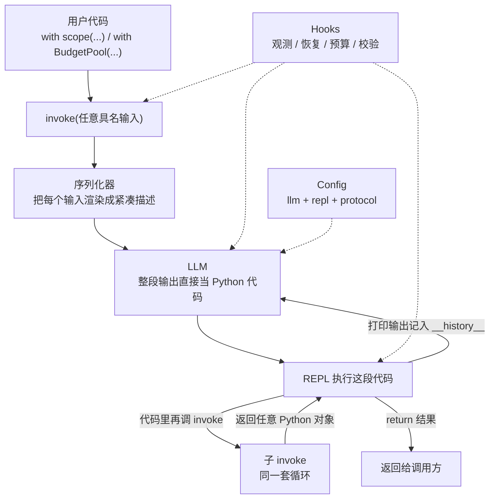
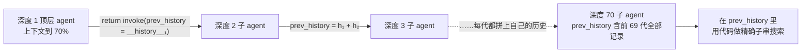

# JAZ：把 harness 写成一门语言，用一个 invoke 顶掉记忆系统与自改进框架

<!-- release-date: 2026-08-18 -->

> 本文依据本地 `papers/MIT/JAZ.pdf`，即 MIT CSAIL 的 **Harness as a Language: A Minimalist Agent Framework With Maximal Expressivity**，arXiv:2609.26891v1，2026-09-22 提交，共 25 页。作者为 Zhening Li、Joshua Liu、Mateja Vukelic、Nicole Shen、Supriya Lall、Amitayush Thakur、Alex Zhang、Omar Khattab、Jonathan Light、Armando Solar-Lezama；除 Thakur 与 Light 标为独立研究者外均属 MIT CSAIL，Liu 与 Vukelic 同等贡献（PDF p. 1）。页码均指这份 PDF 本身。文中区分 3 件事：论文明确写了什么、我们如何解释它、哪些是外部资料补充。

## 读前先把几个词说成人话

这篇论文短，正文只有 10 页（PDF p. 1–10），但它把 agent 领域里几个常被混用的词重新摆了位置。先把这些词说清：

- **Agent 循环（agent loop）**：模型看一眼环境、做一个动作、看动作的结果、再做下一个动作，如此往复。今天几乎所有 LLM agent 都是这个骨架（PDF p. 1）。
- **Harness（外挂框架）**：包在模型外面、替模型安排流程的那层工程，比如记忆系统、反思—整理流水线、上下文压缩器。论文标题里的「harness」指的就是这层东西。
- **ReAct**：最早的 agent 循环范式之一，模型每一步选一个工具、填一组参数（PDF p. 2、p. 9）。
- **CodeAct（代码即动作）**：让模型在 **REPL**（Read–Eval–Print Loop，交互式解释器）里写可执行代码当作动作。工具、数据都成了代码里能引用的 Python 对象（PDF p. 2）。
- **子 agent（subagent）**：agent 在执行中再拉起的另一个 agent。论文关心的是「通用子 agent」，即没有预设角色、和主 agent 一样什么都能干的那种（PDF p. 5）。
- **RLM（Recursive Language Models，递归语言模型）**：把超长输入当作 REPL 里的一个 Python 对象交给模型，模型写代码切片、再递归调用子模型处理。库里另有 Recursive-Language-Models 一篇专讲它；本文作者里 Alex Zhang 与 Omar Khattab 也是 RLM 的作者（PDF p. 1、p. 10 参考文献 [5]）。
- **压缩（compaction）与记忆系统（memory system）**：上下文窗口装不下时，把历史摘要掉，或存进一个能按关键词、向量检索的外部库。Letta（即 MemGPT 的新版）是后者的代表（PDF p. 6、p. 9–10）。
- **持续自我改进（continual self-improvement，CSI）**：按顺序做一串任务，边做边根据反馈改进自己。常见做法是拆成一个 **元 agent（meta-agent）** 和一个 **求解 agent（solver agent）**：前者负责改后者的提示词、技能乃至源码（PDF p. 7）。ACE（Agentic Context Engineering）是这一类的专用框架（PDF p. 8–9）。
- **Hook（钩子）**：在 agent 运行的固定时刻被调用的回调函数，用来观测、限预算、校验返回值，而不改动循环本身（PDF p. 4）。

## 一句话先说清

2026 年的 agent 框架有一个默认分工：agent 循环负责「一步一步做」，而「记得很久以前的事」和「越做越好」要另外造系统——前者靠记忆系统，后者靠自改进框架（PDF p. 1–2）。

JAZ 的赌注是：这 2 样东西不必另造。只要 agent 循环本身足够有表达力，模型可以用提示词引导，自己在代码里把它们写出来（PDF p. 2）。

它给出的「足够有表达力」只有 2 条（PDF p. 1、p. 4）：

1. 模型写的是任意可执行代码，而且代码里可以再调 `invoke`，也就是递归地开子 agent；
2. 模型看得到的一切——传给 `invoke` 的全部输入，包括提示词本身，以及它和 REPL 的交互历史——都是 REPL 里的变量。


*引自原文首页未编号的成本—通过率图（PDF p. 1）。左幅纵轴是 StuLife 远距回忆子集通过率，右幅纵轴是 AppWorld 的任务完成率，在 50 与 65 之间断轴，官方基线落在断轴下方；横轴都是每次完整运行的美元成本。*

图上 2 条箭头就是论文的全部实验结论。摘要把它写成两句（PDF p. 1）：

- 在需要回忆远超上下文窗口的长程任务上，JAZ invoke 在 StuLife 的回忆密集部分胜过 Letta 8 个点，成本约为其一半；
- 在持续自我改进上，JAZ invoke 在 AppWorld 上胜过 ACE 4 个点，成本更低。

对应到表里的原始数字：StuLife 远距回忆通过率 69.9% 对 61.8%，成本 18.3 美元对 42.1 美元（PDF p. 6，Table 1）；AppWorld 任务完成率 74.2% 对 69.9%，成本 20.9 美元对 30.6 美元（PDF p. 8，Table 2）。摘要里的「8%」「4%」是百分点差，不是相对提升。

而且这 2 个结果都是「只靠提示词」拿到的：没有人工设计的工具，没有文件系统，没有外部记忆库（PDF p. 1）。

### 一条阅读路线

如果只有半小时读原文，建议按这个顺序：

1. **p. 2 的 Figure 1 与 p. 3 的 Figure 2**：先看懂 invoke 为什么被叫做「运行时由 LLM 填函数体的函数」。
2. **p. 3–4 的 2 个性质**：这是 invoke 和 CodeAct、RLM 的全部差别。
3. **p. 6 的尾递归委派代码与 Table 1**：长程回忆怎么只靠一个 `return invoke(...)` 做出来。
4. **p. 7 对任务 #1282 的逐步分析**：为什么 CodeAct 丢了指令、Letta 搜不到原文。
5. **p. 8 的 Table 2 与 p. 8–9 的分析**：元 agent 就是顶层 invoke。
6. **p. 14–16 附录 C.1 的评测协议**：判断这些对比到底公不公平，要看这一节。

附录 A 的形式化定义（p. 13）、附录 B 的钩子事件模型（p. 14）、附录 E 的提示词全文（p. 21–25）可以当对照尺，需要复现时再读。

## 主要矛盾：循环越来越强，但记忆和自改进仍然外挂

论文开头梳理了一条表达力逐级上升的线（PDF p. 2）：

- ReAct 让模型每一步自由挑动作；
- CodeAct 让模型用代码编排整段流程，常见实现还允许用户把 Python 对象放进 REPL；
- RLM 证明，CodeAct 加上子 agent，不借任何外部工具，就能在长上下文任务上胜过直接读长上下文的 LLM——办法是把输入当作 REPL 里的对象交给模型。

每往上走一级，都解锁了新能力。但到了「长程记忆」和「自我改进」，大家又退回老路：在循环外面再造一层专用系统（PDF p. 2）。

这层外挂系统的问题，论文在 2 个案例里各点了一次（PDF p. 7、p. 9）：

> 人工设计的流程会把一些假设写死。这些假设在多数场景下成立，所以系统平时好用；一旦环境打破了假设，系统就僵住了。

Letta 假设「按关键词加向量检索历史」就够回忆，结果碰上需要精确子串匹配的题就失手；ACE 假设「每做完一个任务就反思、整理一次提示词」是好流程，结果成本高到论文只能让它在前 10% 的任务上学习（PDF p. 7、p. 9）。

于是矛盾变成：

> 专用 harness 用写死的流程换来可用性，也把灵活性一起写死了。JAZ 要问的是：能不能把「造流程」的权力还给模型，让 harness 退回到几乎只剩 agent 循环本身？

## 先看全景：一个原语，加 3 样配套



这张图按 PDF p. 2–5 与 p. 13 的叙述重画，是机制示意，不是论文原图。主体只有一个 `invoke`；`scope`（动态作用域）、Hooks（钩子）、Config（配置）3 样是为了让人用得顺手而加的配套（PDF p. 4–5）。下面先讲 `invoke` 为什么长这样，再讲配套。

## 核心设计一：invoke 是一个「运行时才写函数体」的函数

### 旧问题：LLM 原语的签名是 str -> str

通常把 LLM 当成一个字符串进、字符串出的函数。要让它操作数据、调工具，就得先把数据和工具说明拼成字符串，再从输出字符串里解析出动作。每多一种输入，就多一层手工拼接。

### 新设计：输入是任意对象，输出是任意对象


*引自原文 Figure 2（PDF p. 3）：函数式版本的 invoke，每次调用 LLM 都写出完整的函数实现；尾递归的 invoke 自然构成一个闭合的 agent 循环。图底一行标出定义的 2 个后果：递归子 agent 是默认的，所有输入与历史都是变量。*

论文从一个与具体语言无关的问题出发：给任何一门图灵完备的语言加一个新原语 `invoke`，它应该是什么（PDF p. 3）。

定义 1 的答案是（PDF p. 3）：

- **语法**：一次普通的函数调用 `invoke(...)`，参数是任意多个具名输入；
- **语义**：把所有输入的字符串表示交给语言模型，模型产出一段代码——用的是已经加了 `invoke` 的那门语言——作为这个函数的函数体，然后执行。

Figure 2 的 a 栏就是这个调用。`spec`、`data`、`tool` 分别像是说明书、数据和工具，但 invoke 对它们一视同仁，不区分提示词、工具与「普通」输入（PDF p. 3）。b 栏是模型看到的东西和它写的东西：参数被渲染成紧凑的描述，模型填出函数体。

和普通函数的区别只有一处：普通函数的实现写在静态代码里，invoke 的实现每次调用时由模型现写（PDF p. 3）。

论文还给了一个更抽象的理由：`str -> str` 的 LLM 只在有字符串类型的语言里说得通。像 λ 演算这样的语言没有字符串，唯一在所有语言里都存在的「字符串」就是这门语言自己的表达式。所以最自然的做法，就是让模型直接生成一段本语言的表达式，当作这一次 invoke 的一次性实现（PDF p. 3）。

### 形式化：在 λ 演算上多加一条求值规则

附录 A 把它写成了 λ 演算上的扩展（PDF p. 13）。语法只多一种表达式：

$$
e ::= c \mid x \mid e\,e \mid \lambda x.\,e \mid \mathtt{invoke}\,(x := e)^{+}
$$

前 4 种是常量、变量、函数调用、函数定义；最后一种是新原语，$(x := e)^{+}$ 表示「一个或多个具名参数」。

按值调用的求值规则里，前 3 条是 λ 演算的标准规则，新增的第 4 条是：

$$
\frac{\sigma = [\vec{x} := \vec{v}]}{\mathtt{invoke}\;\sigma \;\to\; \bigl(\lambda \vec{x}.\;\pi(\mathrm{LM}\langle\sigma\rangle)\bigr)\,\vec{v}}
$$

这条规则读起来是 3 步：

1. $\sigma$ 是已经求好值的输入映射 $x_1 := v_1, \dots, x_k := v_k$；
2. $\langle\sigma\rangle$ 是把这些输入序列化成的提示词，$\mathrm{LM}\langle\sigma\rangle$ 是模型对它的输出，$\pi$ 从输出里解析出代码；
3. 解析出的代码被包成以 $\vec{x}$ 为参数的函数体，再作用到 $\vec{v}$ 上。

论文据此点出设计这个原语时只有 3 处可调（PDF p. 13）：

- **语言本身**；
- **序列化器** $\langle\cdot\rangle$：好的序列化器不把大对象原样倒给模型，而是给出足够的信息，让模型能通过代码去和它交互、取出需要的部分；
- **输出解析器** $\pi$：传统做法是从自然语言里抠出代码块。JAZ 直接取恒等函数 $\pi(y) = y$，模型的整段输出都当 Python 代码执行，计划之类的自然语言写成代码开头的注释。

### 工作机制：尾递归的 invoke 就是 agent 循环

函数式 invoke 每次调用只写一次函数体，那「看结果、再决定下一步」从哪来？答案在 Figure 2 的 b、c 2 栏（PDF p. 3）：

- b 栏里，模型先调 `tool(data)`，然后 `return invoke(..., history=[("tool(data)", result)])`——把原有输入和刚才的交互记录一起，交给一个新的 invoke；
- c 栏里，新的 invoke 在输入里看到了第 1 步的输出，于是就像 agent 循环的第 2 步一样接着干。

也就是说，一个闭合的 agent 循环，可以写成尾递归的 invoke。论文由此认为，invoke 在原则上至少和闭合的 agent 循环一样有表达力（PDF p. 3）。

### 代价：为什么实际不这么跑

这条纯函数式路线不实用，论文给了 2 个理由（PDF p. 3）：

1. 在 Python 里，这样层层递归很费内存；
2. 想吃到 LLM 的提示缓存，相邻 2 次请求之间必须是严格的前缀关系，而每次重新序列化输入会破坏这一点。

所以 JAZ 不让模型自己写尾递归调用，而是由 harness 自动补上这一步，并做尾调用优化。结果就是一个真实的代码式 agent 循环：模型在同一个 REPL 里一轮一轮写代码（PDF p. 3）。论文把它叫做 invoke 的命令式版本，并用「命令式里的 while 循环对函数式里的递归」来类比两者的关系（PDF p. 4）。

**我们如何解释它。** 这一段推导的价值不在于 λ 演算本身，而在于它回答了「为什么这 2 条性质是必然的，而不是随手加的功能」。既然循环是从尾递归优化来的，那么递归前本来就会作为参数传下去的东西——原始输入和交互历史——在循环里自然也应该是变量。下一节的 2 个性质，就是这个推导的直接后果。

## 核心设计二：2 个性质，把「看得见的」全部变成「摸得着的」


*引自原文 Figure 1（PDF p. 2）：在 JAZ 里，invoke 是一个每次调用时由 LLM 在 Python REPL 中给出实现的函数。所有具名输入与 REPL 历史本身都是 REPL 里的变量。*

Figure 1 的 b 部分标了 3 处：输入被「对 LLM 友好地展示」；代码里再调 `invoke` 就是子 agent；`__history__[0].repl_output`——第 1 轮 REPL 的输出——能像普通变量一样被传给子 agent。这 3 处对应论文说的 2 个性质（PDF p. 4）：

**性质 1：模型写的语言里已经有 invoke。** 所以默认情况下，模型不仅能写任意 Python，还能写出调用 invoke 的代码，即递归的子 agent。论文把这些递归调用叫做 sub-invoke（子 invoke）。

**性质 2：模型看到的一切都是它能在代码里引用的变量。** 这又分 2 层：

- 传给 invoke 的全部输入都是变量，不管它原本的用途是提示词还是工具；
- REPL 历史本身也是 REPL 里的一个变量。

附录 E.3 给出了实际的系统提示词样例。`__history__` 是一个列表，每轮 REPL 一条，每条有 3 个字段：`.llm_response`（模型这一轮写的完整代码）、`.repl_output`（这一轮打印的输出，含报错栈）、`.repl_exception`（这一轮抛出的可恢复异常，没有则为 None）（PDF p. 24–25）。

### 和已有范式差在哪

论文强调，性质 1 让 invoke 成为 CodeAct+subagents 或 RLM 的一个变体；真正把它区分开的是性质 2，尤其是「REPL 历史是 REPL 变量」这一面（PDF p. 4）。把论文散落在 p. 2、p. 4 与 p. 9 的描述整理成一张表：

| 范式 | 每一步模型写什么 | 子 agent | 数据与工具进 REPL | 用户提示是变量 | 交互历史是变量 |
|---|---|---|---|---|---|
| ReAct | 一次工具调用，参数写死 | 无 | 否 | 否 | 否 |
| CodeAct | 任意代码 | 无 | 常见实现允许 | 否 | 否 |
| CodeAct+subagents / RLM | 任意代码 | 默认有 | 是 | 否 | 否 |
| JAZ invoke | 任意代码，含 invoke | 默认有 | 是 | 是 | 是 |

论文的原话是：smolagents、RLM 这类已有代码式 agent，把用户提示和 REPL 历史只当作展示给模型看的消息列表，而不是模型能用程序操作的变量（PDF p. 4）。

### 收益：能按引用传，就不必手抄

这件事听上去很小，但它决定了子 agent 之间怎么交接。

没有性质 2 时，主 agent 要把任务说明交给子 agent，只能把自己上下文里看到的那段文字「抄」进子 agent 的参数里；要把自己做过什么交给子 agent，只能自己在代码里另外维护一份历史列表。有了性质 2，主 agent 直接写 `instructions=instructions`、`prev_history=__history__`，按引用传过去，一个字都不会丢。

论文 2 个案例的第一条结论都是这句话（PDF p. 7、p. 9）：当 agent 在上下文里看到的一切都在 REPL 变量里时，它可以在需要的时候把这些变量按引用传给子 agent 或调用方，这比手工复制内容可靠。

### 可迁移启发

如果你在设计自己的代码式 agent，最便宜的一条改动是：把系统提示之外的用户提示、以及 agent 自己的执行历史，都作为解释器里的命名变量暴露出来。它不增加任何工具，却让「交接」「压缩」「检索历史」这些动作都能用普通代码写。

## 框架层：动态作用域、钩子、配置

JAZ 在 invoke 之外只加了 3 样东西，都为一个目的：让人写 agent 时少传参数、多加约束（PDF p. 4–5）。

### 动态作用域：工具一次挂上，所有子孙都能用

`scope` 是一个 Python 上下文管理器。在它里面发起的 invoke，以及这些 invoke 递归开出的所有子 invoke，都自动拿到 `scope` 里的变量（PDF p. 4）。最常见的用法是让一个工具对顶层 agent 和全部子 agent 可用：

```python
from jaz import invoke, scope

def web_search(...):
    ...

with scope(web_search=web_search):
    # 顶层 agent 与所有子 agent 都能用 web_search
    invoke(task="Use subagents to find 100 agent framework papers.")
```

传统编程偏好静态作用域，理由是同一个函数放到不同上下文里行为不会意外改变。论文的论证是：invoke 没有静态实现，也就没有静态作用域可言；而且每次调用都现写一份实现，根本不存在「复用同一个函数」这回事。所以对 invoke 来说，只有动态作用域是合适的（PDF p. 4）。

### 钩子：观测和约束，但不改循环

JAZ 内置的钩子分 4 类（PDF p. 4）：

| 类别 | 内置钩子 |
|---|---|
| 可观测性 | `PrintLogger`、`FileLogger`、`TrajectoryRecorder`、`LangfuseTracing`、`JaegerTracing` |
| 可恢复 | `TrajectoryRecorder`、`TrajectoryReplay` |
| 资源控制 | `BudgetPool`、`IterationLimit`、`RecursionLimit`、`BudgetForcing`、`ContextWindowWarning` |
| 校验 | `ReturnType`、`ValidateReturn`、`ValidateREPLCode` |

钩子和变量一样分 2 种生效范围：作为位置参数传给某次 invoke 的是局部钩子，只管这一次；作为上下文管理器激活的是作用域钩子，管其下所有 invoke 及其子孙（PDF p. 4–5）。论文的例子是：

```python
from jaz import invoke
from jaz.hooks import ReturnType, BudgetPool

with BudgetPool(max_cost=5):          # 作用域钩子
    invoke(
        ReturnType(float),            # 局部钩子
        question="What is the value of ...?"
    )
    invoke(another_question="Why is ...?")
```

这里 5 美元的预算由 `with` 块下的所有 invoke 与子 invoke 共享；`ReturnType(float)` 只约束第一个顶层 invoke 的返回类型，不管它的子 invoke（PDF p. 4–5）。

附录 B 给出了自定义钩子的事件模型（PDF p. 14）。invoke、LLM 请求、REPL 执行这 3 种操作各有 4 个事件：`Enter` 能改输入，`Send` 能用一个现成输出替掉真正的调用，`Complete` 能改输出，`Exit` 总会触发并带上结局（完成、中止或失败）；另有只在 LLM 请求重试时触发的 `LLMQueryRetry`。钩子不能随意改 agent 状态，只能发出该事件允许的「效果」。多个钩子同时生效时，事件一次性分发给所有处理器，效果先收集、再按一条尽量与顺序无关的规则合成，无法调和的冲突写入直接报错。钩子之间还可以通过一块叫 blackboard（黑板）的全局留言板通信。所有内置钩子都是用这套公开接口写的（PDF p. 14）。

**我们如何解释它。** 「只发效果、统一合成」这条约束，是为了让多个钩子叠加时行为可预测：不会因为分发顺序不同，A 钩子看到的是 B 钩子改过的输入而 C 钩子看到的是原始输入。这和论文实验里「允许监控、不许改循环」的公平性规则（下一节）是同一个思路。

### 配置：llm、repl、protocol 3 件套

一份配置的签名是 `Config(llm, repl, protocol)`：`llm` 配模型，`repl` 配解释器，`protocol` 配两者之间的接缝——怎么从模型输出里取代码、怎么把 REPL 输出格式化给模型。默认 protocol 不做任何解析，整段原始回复就是代码；REPL 输出过长时截断，除此之外不加格式（PDF p. 5）。配置同样分局部与作用域 2 种：`ConfigOverride(...)` 作为位置参数只管这一次调用，作为上下文管理器则管其下全部调用（PDF p. 5）。自改进实验就是靠这个让顶层用大模型、子 agent 用小模型的（PDF p. 17）。

## 先看实验怎么做到公平

在读结果之前，先看附录 C.1 的评测协议（PDF p. 14–16）。这篇论文的主张是「只靠提示词就够」，而提示词恰恰是最容易偷偷塞进任务知识的地方。协议有 5 条。

**1. 任务与方法解耦。** 用户提示被拆成不相交的两部分（PDF p. 14）：

- `instructions`，由环境提供，与方法无关：任务说明、环境描述，可以带与方法无关的流程指导；在自改进实验里，它只保留任务说明和环境描述，完全不带流程指导，以便检验从一个最小种子开始自我改进的能力；
- `guidance`，由方法提供，与任务无关：只能写适用于整个领域的流程指导。长程提示词不得含 StuLife 专属信息，自改进提示词不得含 AppWorld 专属信息（PDF p. 15）。

**2. 必要的差异照实现，不必要的差异压到最小。** 例如 CodeAct+subagents 没有 `__history__`，就在提示里教它自己维护一个历史列表；除此之外，JAZ invoke 与 CodeAct+subagents 的提示词逐字节相同（PDF p. 15）。

**3. CodeAct 系基线在 JAZ 里重写。** 论文用一个钩子把 invoke REPL 里的用户提示变量与 `__history__` 删掉，再对提示模板做最小改动，得到 CodeAct+subagents；再加 `RecursionLimit(depth=1)` 禁掉子 agent，得到 CodeAct（PDF p. 5、p. 16）。这样两者的差别就只剩性质 2。论文说这样做是因为现成实现在提示与 REPL 上有缺陷，表现比重写版更差（PDF p. 5）。

**4. 「只用提示词」的明确边界**（PDF p. 15）：

- 唯一的工具是基准环境自带的工具，不许访问文件系统或互联网；
- 不许有改动循环本身的外部逻辑（如截断历史、往 REPL 里注入变量），但允许监控类钩子：预算、步数上限、递归上限、完成守卫、上下文将满提醒；允许根 agent 与子 agent 用不同模型；
- 系统提示只含循环机制与工具文档；用户提示只含上面那两部分。

**5. 成本测量要控住缓存。** 每次运行设独立的提示缓存键；同一个 OpenAI 组织下同时最多跑 3 个运行。论文实测：并行数从 4 升到 5 时缓存命中率下降超过 5%，4 个以内变化在 2% 以内，于是固定并行 3 个，估计成本的系统误差小于 2%；需要 6 次重复的自改进实验分 2 批、每批 3 个跑（PDF p. 15）。

2 个环境都是一串任务，所以所有方法都加了一个返回守卫（JAZ 里是 `ValidateReturn`，smolagents 里是 `final_answer_checks`）：agent 在做完所有任务之前停下，就让它继续干（PDF p. 5）。

**我们如何解释它。** 这套协议的核心是第 3 条：CodeAct+subagents（JAZ 版）与 JAZ invoke 用同一套代码、同一份提示，只差「用户提示和历史是不是变量」。所以两者的差距，可以比较干净地归到性质 2 上。但要注意，这个消融是把「用户提示是变量」和「历史是变量」一起拿掉的，论文没有把两者分开测。

## 案例一：长程回忆，只靠一个 return invoke（...）

### 场景：比上下文窗口长好几倍，又不能切成子任务

论文关心的长程环境有 2 个特征（PDF p. 5）：

- 任务要迭代成千上万次，不开子 agent 的话，对话历史会把上下文窗口撑爆好几次；
- 做对决策常常要回忆好几个上下文窗口之前的某个细节。压缩会丢掉这些细节，而长距离依赖又让整段流程难以干净地拆成子任务。

### 设计：尾递归委派

JAZ 的做法是：上下文快满时，agent 把剩下的全部工作委派给一个子 agent，同时把完整的对话历史按引用、无损地传过去。论文把这个模式叫 **尾递归委派**（tail-recursive delegation）（PDF p. 6）：

```python
return invoke(
    ...,  # 顶层 invoke 的原始输入
    prev_history=globals().get("prev_history", []) + __history__,  # REPL 历史
    prev_progress_summary=...,  # 历史摘要
    next_steps=...,             # 给子 agent 的下一步
    ...,                        # 其他需要跟踪的状态
)
```

注意那一行 `prev_history`：顶层 agent 只需传自己的 `__history__`，而每个子 agent 在继续委派前，必须把自己收到的 `prev_history` 和自己的 `__history__` 拼起来（PDF p. 6）。于是历史沿着委派链一路累加，每一代都拿到从第 1 步起的全部记录。



这张图按 PDF p. 6–7 的描述重画，是机制示意；深度 70 取自论文分析的那一次运行（PDF p. 7）。

实验里，这个行为由内置的 `ContextWindowWarning` 钩子触发：上下文窗口用到 70% 时，它往对话里追加一条用户消息，要求 agent 把剩余工作全部委派出去，并附上一份照做的代码模板（PDF p. 6、p. 16）。模板要求把 `instructions` 和 `guidance` 按引用传下去，并在第一行写 `# timeout: 86400` 把超时调长，以免子 agent 过早超时（PDF p. 22）。给顶层的 `guidance` 则反复强调：要回忆早先信息就去搜 `prev_history`，不要搜 `__history__`（当前会话的历史本来就全在眼前）；找到匹配后要打印命中点前后的一段窗口；这一轮只做搜索，别的事留到下一轮（PDF p. 21）。

### 它把各种上下文管理都包进来了

论文指出，这个通用模式能表达多种已有的长程上下文管理方法（PDF p. 6）：

| 已有做法 | 在尾递归委派里相当于 |
|---|---|
| 压缩（compaction） | 只传 `prev_progress_summary` |
| 自动上下文管理（如 Chroma Context-1） | 传一个删掉了某些条目的 `__history__` |
| JAZ 实验里的做法 | 摘要、下一步、完整历史一起传 |

更一般地说，有了 invoke，agent 就能控制下一次 LLM 调用的输入与上下文；有了 `__history__` 和代码环境，它就能高效地基于当前上下文去构造那份新上下文（PDF p. 6）。

### 实验：StuLife 上的 Table 1

StuLife 是一个长程基准：一条有序的 1284 个任务的序列，模拟一个大学生一学期里的各种活动，很多任务需要回忆前面任务里给过的信息。一个典型回合要 7000–8000 次环境交互，一个典型的代码式 agent 要 3000–5000 次 LLM 调用。1284 个任务里 939 个计分，其中 207 个需要 **远距回忆**，论文定义为回忆 50 个任务以前给出的信息（PDF p. 6）。

所有方法都用 GPT-5.4 nano（high），每种方法跑 3 次（PDF p. 6）。环境工具经过改造：删掉用不到的，把总是一起用的几个合成一个，再包成结构化输入输出、带输入校验的形式，文档字符串里加了代码示例；二元通过率沿用官方评分器，部分得分（Score 列）是论文自己实现的指标（PDF p. 16）。

对照方法有 4 个（PDF p. 6、p. 16）：

- CodeAct（逐任务）：每个任务单独开一个 CodeAct agent，任务间不保留任何状态，当作「无记忆」基线；
- CodeAct+subagents，分 smolagents 版与 JAZ 重写版；
- Letta Agent：MemGPT 的最新版，一个带记忆的对话 agent，是领域专用 harness。

| 方法 | 只用提示 | 全集通过率（%） | 全集得分（%） | 远距回忆通过率（%） | 远距回忆得分（%） | 成本（美元） |
|---|:---:|---:|---:|---:|---:|---:|
| CodeAct（JAZ 版，逐任务） | ✓ | 52.5 ± 0.3 | 59.2 ± 0.1 | 24.8 ± 0.6 | 25.8 ± 0.5 | 4.4 ± 0.1 |
| CodeAct+subagents（smolagents 版） | ✓ | 30.2 ± 4.8 | 33.6 ± 5.2 | 20.6 ± 0.6 | 22.0 ± 0.9 | 9.4 ± 1.4 |
| CodeAct+subagents（JAZ 版） | ✓ | 60.0 ± 1.1 | 68.1 ± 1.0 | 32.0 ± 2.3 | 33.9 ± 2.0 | 13.1 ± 0.9 |
| Letta Agent | ✗ | 70.9 ± 0.5 | 81.0 ± 0.5 | 61.8 ± 2.3 | 67.0 ± 2.4 | 42.1 ± 1.6 |
| JAZ invoke | ✓ | 72.6 ± 0.1 | 81.6 ± 0.1 | 69.9 ± 1.8 | 73.6 ± 1.5 | 18.3 ± 0.3 |

*转自原文 Table 1（PDF p. 6），均值 ± 标准误，3 次独立运行；逐次数据见 Table 3（PDF p. 19）。*

读表要知道 3 件事：

1. **全集上 JAZ 与 Letta 几乎打平，差距集中在远距回忆。** 全集通过率 72.6 对 70.9、得分 81.6 对 81.0；远距回忆通过率则是 69.9 对 61.8（PDF p. 6）。JAZ 的 3 次远距回忆通过率是 70.0、72.9、66.7，Letta 是 62.8、65.2、57.5，区间不重叠（PDF p. 19）。
2. **同一套代码里只拿掉性质 2，远距回忆从 69.9 掉到 32.0。** 这是 JAZ invoke 对 CodeAct+subagents（JAZ 版）的差距，也是论文最干净的一组对照（PDF p. 6）。32.0 只比无记忆的逐任务基线 24.8 高一点。
3. **成本：JAZ 18.3 美元，Letta 42.1 美元**，前者约为后者的 43%（我们按表算）；比 CodeAct+subagents（JAZ 版）的 13.1 美元贵一些（PDF p. 6）。

smolagents 版 CodeAct+subagents 比 JAZ 重写版差很多（全集 30.2 对 60.0）。论文把几乎全部差距归到 smolagents 系统提示的一个缺陷上：它把子 agent 称为「团队成员」，还错误地说「这个团队成员是真人」，于是 agent 一缺信息就开子 agent，以为这位「真人队友」能去把信息找来；论文尝试在子 agent 角色描述里覆盖这一点，没有成功（PDF p. 17）。

### 分析：任务 #1282 为什么只有 JAZ 做对

为了看清差距从哪来，论文拆了一道题：第 1282 个任务（共 1284 个），JAZ invoke 3 次全对，CodeAct+subagents 0 次，Letta 1 次（PDF p. 6）。

这是期末考试的一道选择题。4 个选项各描述一个虚构协议的应用场景，要根据前面课上讲过的这些协议，选出唯一完全正确的那个（PDF p. 7、p. 25）。正确选项 D 涉及的协议，是在第 785 个任务里讲的，距这道题已经过去 497 个任务（PDF p. 7）。

3 种方法的走法完全不同（PDF p. 7）：

- **JAZ invoke**：在其中一次运行里，agent 到这道题时已经在递归深度 70，做过 69 次尾递归委派。但每次委派都通过 `prev_history` 完整保留了之前每一代的 `__history__`。agent 用一轮在 `prev_history` 里搜全部协议名，所有相关课程都被正确找回，下一轮就答对了。
- **CodeAct+subagents**：根本没去搜。它的用户提示里原本写着「这些考题考的是虚构协议，必须回忆课上内容」，也写着怎么自己维护 REPL 历史。但用户提示不是变量，每一代都得把它抄给下一代，几十次委派后，这 2 条指令都在抄写中丢了。agent 既没有任何历史变量，也不知道这题考回忆，于是按真实世界的常识选了 A——在 StuLife 的虚构世界里是错的。
- **Letta**：用 `conversation_search` 工具按题里的协议名搜历史。这个工具把关键词检索和向量检索混在一起，排在前面的要么是这道题本身，要么是名字相近但不同的协议。这里需要的是精确子串匹配，而 Letta 唯一的检索工具不支持。

论文对 Letta 的配置也写了（PDF p. 16）：用的是 Python 版 Letta 服务 v0.16.8 与最新的并行工具调用 agent；SQL 检索后端对整条查询做精确子串匹配，而 agent 写的查询更像搜索引擎用语，几乎总是搜空，所以改用混合检索（BM25 关键词加向量嵌入）的 Turbopuffer 后端；因为工具输出不进 Letta 的可检索历史，环境改成以用户消息下发任务；论文试了多种提示，除一种外都会让 agent 卡在一个空描述任务上无限搜索，结果用的就是那一种。

据此，论文给出长程版的 2 条结论（PDF p. 7）：

> 结论 1：当 agent 上下文里看到的一切都在 REPL 变量里时，它可以在需要时把这些变量按引用传给子 agent（比如尾递归委派），这比手工复制内容可靠。
>
> 结论 2：领域专用 harness 写死了一些假设，这让它们在许多场景下好用，却在打破假设的环境里变得僵硬。与其给一个大对象配一个搜索工具，不如给 agent 对原始接口的完整程序化访问，这能找回所需的灵活性。

**我们如何解释它。** 这道题说明的不是「向量检索不好」，而是「检索方式被写死了」。JAZ 的 agent 拿到的是历史本身，想精确匹配就写 `str.find`，想模糊匹配也可以自己写；Letta 的 agent 只能调一个已经定好语义的工具。另一方面也要看到，这是一道被挑出来的题，用来解释差距的来源，不是差距的统计证据；统计证据是上面的 Table 1。

### 可迁移启发

长程 agent 的上下文管理，不一定要做成一个独立的「记忆模块」。把完整历史当成一个可以用代码检索的对象，沿子 agent 链无损传递，再用提示词教会模型「先搜再答」，就能覆盖压缩、过滤和检索 3 种常见做法。代价是历史对象会一直增长，论文没有讨论它在更长序列上的内存或检索开销。

## 案例二：持续自我改进，元 agent 就是顶层 invoke

### 设计：顶层当元 agent，子 invoke 当求解 agent

论文的观察是：顶层 invoke 完全掌握要传给子 invoke 的所有输入，因此它天然可以充当元 agent——在一串任务上反复优化这些输入（PDF p. 7）。一次典型的优化迭代是：构造求解 agent 的提示与技能（即高层工具），在一个任务上运行，再检查结果（PDF p. 7–8）：

```python
instructions = "... When done, return `(answer, __history__)`"

def skill(...): ...  # 调用基础环境方法的函数

answer, trajectory = invoke(
    task=get_next_task(),
    instructions=instructions,
    skill=skill,
)

eval_report = complete_task(answer)
print(eval_report)
print(trajectory)
```

元 agent 想看子 agent 的执行轨迹，只需叫子 agent 把自己 REPL 里的 `__history__` 一起返回（PDF p. 8）。这又是性质 2 在起作用。

引导顶层 agent 做自我改进的提示词写在附录 E.2，只描述高层流程和实现所需的 JAZ 知识，不含任何代码示例或模板（PDF p. 8）。它的要点是（PDF p. 23）：

- 先在最小种子提示上跑约 5 个任务的小批，分析结果；
- 然后在「改提示与工具」和「用一批任务验证」之间交替，直到任务队列用完；上一批做得好就加大批量、缩小改动，几乎全对就不改、只验证；
- 提示改动必须提炼适用于多个任务的规律，不许针对单个任务的失败形状；工具必须 100% 可靠、没有漏抽象，没人用或用不好就删；
- 每次改动要先说清假设、做最小改动、在下一批上测量是否真有用，没用就撤回；
- 所有任务都必须交给子 agent 做，一个任务只用一次子 agent 调用，顶层自己绝不动手。

实验里用作用域 `ConfigOverride` 把模型设成 GPT-5.4 nano，再在顶层用局部 `ConfigOverride` 单独换成 GPT-5.4；用 `RecursionLimit` 把递归深度限制在 2，让求解 agent 不能再开子 agent。这样它与逐任务 CodeAct 基线的差距，就只能归到自我改进本身，而不是求解 agent 多了子 agent 可用（PDF p. 8、p. 17）。顶层 agent 能在上下文窗口内处理完全部任务，所以没有挂 `ContextWindowWarning`（PDF p. 17）。

### 实验：AppWorld 上的 Table 2

AppWorld 模拟了人们在手机和电脑上常用的 9 个应用的 API，任务要求 agent 调这些 API 替用户办事。实验用 test-challenge 划分的全部 417 个任务，用种子 42 打乱顺序后按固定次序交给 agent，每做完一个任务给出完整的测试反馈，让 agent 能从错误中学习（PDF p. 8、p. 17）。

AppWorld 的原生接口只能通过它自己的 Python REPL 调用，论文因此造了一个镜像的 `apis` 对象：每次方法调用被翻译成一行代码交给 AppWorld 的 REPL 执行，再从那边的命名空间取回结果（PDF p. 17）。原基准的提示把环境描述、任务说明和流程指导混在一起，论文删掉流程指导，把环境描述放进 `apis` 的文档字符串，把任务说明放进 `instructions`（PDF p. 17）。

| 方法 | 只用提示 | TGC（%） | SGC（%） | 总成本（美元） | 元 agent（美元） | 求解 agent（美元） |
|---|:---:|---:|---:|---:|---:|---:|
| CodeAct（AppWorld 官方，逐任务） | ✗ | 48.2 ± 1.6 | 20.4 ± 3.2 | 16.6 ± 0.2 | — | 16.6 ± 0.2 |
| CodeAct（JAZ 版，逐任务） | ✓ | 67.5 ± 1.2 | 43.4 ± 2.5 | 10.2 ± 0.2 | — | 10.2 ± 0.2 |
| CodeAct+subagents（JAZ 版） | ✓ | 71.1 ± 1.3 | 47.6 ± 2.1 | 21.6 ± 1.8 | 7.3 ± 1.7 | 14.3 ± 0.9 |
| ACE（基于 JAZ 版 CodeAct） | ✗ | 69.9 ± 1.4 | 47.1 ± 1.3 | 30.6 ± 0.5 | 17.1 ± 0.3 | 13.5 ± 0.3 |
| JAZ invoke | ✓ | 74.2 ± 2.1 | 51.1 ± 3.7 | 20.9 ± 3.7 | 9.9 ± 3.8 | 10.9 ± 0.6 |

*转自原文 Table 2（PDF p. 8），均值 ± 标准误。求解 agent 一律用 GPT-5.4 nano（high），自改进方法的元 agent 用 GPT-5.4（high）；非自改进方法跑 3 次，自改进方法因方差更大跑 6 次。官方基线的提示含 AppWorld 专属流程指导，所以不算「只用提示」。*

TGC 与 SGC 这 2 个指标名，论文没有在正文里展开定义；按 AppWorld 基准自己的口径（外部补充），TGC 是任务目标完成率，SGC 是场景目标完成率，后者要求同一场景下的一组任务全部完成，所以数字更低。论文首页图里的「pass rate」对应的是 TGC（PDF p. 1、p. 8）。

均值会被离群值拉动，论文在 Table 4 另给了中位数与 78% 置信区间（由 6 次运行的第 2 与第 5 个次序统计量构成）（PDF p. 20）：

| 方法 | TGC 中位数 [区间] | SGC 中位数 [区间] | 总成本中位数 [区间]（美元） |
|---|---|---|---|
| CodeAct+subagents（JAZ 版） | 71.2 [68.6, 72.9] | 47.8 [42.4, 48.9] | 22.1 [20.2, 24.0] |
| ACE（基于 JAZ 版 CodeAct） | 70.1 [68.1, 70.7] | 46.0 [46.0, 48.9] | 30.2 [29.9, 31.7] |
| JAZ invoke | 75.2 [74.6, 76.3] | 53.6 [48.2, 55.4] | 17.6 [15.1, 22.2] |

*转自原文 Table 4 的中位数行（PDF p. 20）。*

读表要知道 4 件事：

1. **JAZ invoke 在均值与中位数上都排第一**（PDF p. 8）。中位数下它的 TGC 区间 [74.6, 76.3] 与 ACE 的 [68.1, 70.7] 不重叠。
2. **JAZ 的 6 次运行里有 1 次明显离群。** 第 5 次 TGC 只有 64.5，低于逐任务 CodeAct 基线的 67.5，那一次的元 agent 花了 28.3 美元（PDF p. 20）。其余 5 次在 74.6–79.6 之间。表注明言中位数明显高于均值就是因为这一次（PDF p. 20）；从逐次数据看，标准误偏大也主要来自它。
3. **自我改进的额外开销在元 agent 上。** JAZ 的求解 agent 成本 10.9 美元，和逐任务 CodeAct 的 10.2 美元几乎一样；多出的约 10 美元花在元 agent 上（PDF p. 8）。相对逐任务 CodeAct，TGC 从 67.5 升到 74.2，总成本约翻一倍。
4. **论文重写的逐任务 CodeAct 反而比官方基线高得多**（67.5 对 48.2）（PDF p. 8）。这一点下面单独讲。

### 分析：3 种自我改进的行为差异

论文定性对比了 3 种方法的实际行为（PDF p. 8–9）。

**JAZ invoke** 的顶层 invoke 当元 agent，按批把任务派给子 agent，批与批之间查失败轨迹与指标，更新传给子 agent 的输入（提示与技能），还会自适应地调整批大小（PDF p. 8）。

**CodeAct+subagents** 走的是同一套流程，但子 agent 拿不到自己的 REPL 历史。元 agent 只能叫子 agent「把 REPL 历史作为一个列表返回，每条包含运行的代码、打印的输出和发生的异常」（PDF p. 17）。取决于元 agent 写的提示，子 agent 要么在最后的 return 里把整段历史硬编码出来，要么每轮追加一条。2 种做法都容易丢信息，额外的输出 token 也推高了求解 agent 的成本（PDF p. 9）：14.3 美元对 JAZ 的 10.9 美元（PDF p. 8）。

**ACE** 是一个人工设计的自改进循环：求解 agent 每做完一个任务，反思器（reflector）就对轨迹做一次反思，整理器（curator）再把发现提炼成条目，加进作为求解提示一部分的「playbook」（PDF p. 9）。它的问题是贵：反思器与整理器的每任务成本是 JAZ invoke 的 10 倍。论文只好让 ACE 在前 42 个任务（即 10%）上学习、然后冻结提示，即便如此，ACE 的总成本仍高过在全部任务上持续学习的 JAZ invoke（PDF p. 9）。另一个限制是 ACE 只优化提示，而 JAZ 的元 agent 优化的是 invoke 的全部输入，包括技能（PDF p. 9）。

论文把 JAZ 的成本优势归到 2 点：元 agent 可以把多个任务并成一批，省下元 agent 的调用次数；元 agent 按需只读轨迹的一部分，不必让每个子 agent 的完整轨迹都塞进自己的上下文（PDF p. 9）。

据此，论文给出自改进版的 2 条结论（PDF p. 9）：

> 结论 1：当子 agent 在上下文里看到的一切都在 REPL 变量里时，子 agent 可以在需要时把这些变量按引用交还给调用方（比如为了让调用方观察子 agent 的行为），这比显式构建这些内容可靠。
>
> 结论 2：人工设计的流程写死了一些假设，在打破假设的环境里变得僵硬。给一个强 LLM 代码的全部表达力与 invoke 原语，能找回所需的灵活性。

### 对 ACE 的 3 处改动，读结果时要一起看

为了公平，论文对 ACE 做了 3 处偏离原设置的改动（PDF p. 17–18）：

1. **删掉 AppWorld 专属的元指导。** ACE 的参考实现在反思器与整理器的提示里写死了 AppWorld 的真实失败模式和对应的最优应对，这违反了「方法提示必须与任务无关」的协议，论文做了最小删改。
2. **模型对齐。** 原实验里反思器、整理器与生成器用同一个模型；这里把反思器与整理器设为 GPT-5.4，对齐 JAZ 的顶层模型，生成器保持 GPT-5.4 nano，对齐 JAZ 的子 agent。
3. **只在 10% 的任务上学习。** 原版在线 ACE 每个测试任务都跑一遍反思与整理，估计总成本超过 180 美元，接近 JAZ invoke 总成本的 10 倍。若严格按成本对齐，ACE 只能学 20 个任务，可能不足以产生有意义的改进；原论文在离线模式下用 90 个训练样本就有明显收益，于是取了中间值 42 个。

另外，条目去重阈值取 0.7，即原论文报告结果不敏感的 {0.5, 0.7, 0.9} 的中点（PDF p. 17）。

**我们如何解释它。** 这 3 处改动都有道理，但也意味着表里的 ACE 不是「原汁原味的 ACE」：删掉专属指导会削弱它，只学 42 个任务会削弱它，换更强的反思模型会增强它。论文把理由都写清了，读者应当把「JAZ 胜 ACE 4 个点」理解为「在同一套任务无关、成本受限的协议下」的比较。

### 为什么官方基线这么低

官方 CodeAct 基线（AppWorld 作者称之为 ReAct，但它让 agent 写任意 Python 调 API，实质是 CodeAct）开箱即跑，TGC 只有 48.2，比论文自己那个不含任何 AppWorld 专属流程指导的 CodeAct 还低 19 个点。论文找到 2 处提示缺陷（PDF p. 18）：

- 官方提示没讲清「不需要提交答案的任务」该怎么收尾。很多 agent 做对了任务，最后却提交了一份报告，于是自动判错。因为这个原因失败的任务占 （14.9 ± 1.0）%，是两者差距的大头；而论文自己的环境描述讲清了这一点，1251 个 CodeAct agent 里只有 1 个犯这个错。
- 官方提示教了 `complete_task(status="fail")` 这个逃生口，agent 就把它写进条件分支，有时还没干正事就提前判自己失败，估计损失约 1%。论文的环境描述去掉了它。

**我们如何解释它。** 这段附录本身就是全文论点的一个旁证：同样的模型、同样的循环，提示词里一处表述不清就能差出将近 15 个点。反过来也提醒读者，这篇论文里「只靠提示」的结果，同样高度依赖提示写得好不好。

### 可迁移启发

做自改进时，元 agent 和求解 agent 不一定要分成 2 个系统。让同一个框架的顶层调用去管子调用的输入，优化对象就自然扩展到提示、工具以及任何能作为参数传下去的东西。成本上最值得学的 2 点是：批量派发、批间再反思，而不是每个任务都反思一次；只读失败轨迹里需要的部分，而不是把完整轨迹都塞进元 agent 的上下文。

## 这些实验证明了什么，没证明什么

被实验直接支持的：

- 在 2 个基准上，「只用提示」的 JAZ invoke 以相近或更低的成本超过了专用 harness（PDF p. 6、p. 8）。
- 同一套代码与提示下，拿掉「用户提示与历史是变量」这一性质，StuLife 远距回忆通过率从 69.9% 掉到 32.0%，AppWorld 的 TGC 从 74.2% 掉到 71.1%（PDF p. 6、p. 8）。前者差距很大，后者在标准误量级上只是略占优。

只是作者观察或定性分析的：

- Letta 失手是因为检索不支持精确子串，CodeAct+subagents 失手是因为指令在手抄中丢失——这些来自对单道题（#1282）的拆解（PDF p. 7）。
- ACE 贵是因为流程僵硬、JAZ 省是因为批处理与选择性读轨迹——这是定性分析：Table 2 只把成本拆成元 agent 与求解 agent 两段，没有再拆到反思、整理或批处理这些环节（PDF p. 8–9）。

论文没有做或没有写的：

- **只用了一个模型家族。** 所有求解都是 GPT-5.4 nano，自改进的元 agent 是 GPT-5.4（PDF p. 6、p. 8）。换模型后结论是否成立，论文没有测。
- **2 个基准、各一次序列。** 长程只测了 StuLife，自改进只测了 AppWorld 的 test-challenge，顺序固定为种子 42（PDF p. 6、p. 8）。
- **重复次数少。** 非自改进方法 3 次，自改进方法 6 次，而 JAZ 自改进的 6 次里就有 1 次跌到基线以下（PDF p. 8、p. 20）。
- **性质 2 的两半没有分开消融。** CodeAct 钩子同时删掉用户提示变量与 `__history__`（PDF p. 5、p. 16）。
- **「只用提示」不等于「提示很短」。** 长程的 `guidance` 带有完整的历史搜索代码模板，上下文告警附带逐行照抄的委派模板（PDF p. 21–22）；这些提示是与任务无关的，但它们本身就是精心设计的流程。论文的主张是「不需要外部系统」，不是「不需要设计」。
- **基准有改造。** StuLife 的工具被合并、重包装，部分得分是自定义指标；AppWorld 的接口通过镜像对象转接，提示被重新拆分（PDF p. 16–17）。与其他论文报告的这 2 个基准的数字不能直接比较。
- **没有给出更长序列下的扩展性分析。** `prev_history` 随委派链线性增长，递归深度能到 70（PDF p. 7），论文没有讨论它的内存、序列化或检索成本上限。

## 结论：能力来自表达力，而不是来自外挂

论文在结论里把立场说得很直白（PDF p. 10）：许多通常归功于专用 harness 的行为，包括记忆与自我改进，可以从一个足够强的计算基底的表达力中涌现出来。从这个角度看，各个 agent 框架的区别主要不在于「有没有某种能力」，而在于它们对流程构建、状态表达和递归计算施加了哪些限制。

它据此建议一种不同的研究方向：与其造越来越专门的外部编排机制，不如给模型一个表达力最大的执行环境，再训练 agent 自己构建和调整工作流（PDF p. 10）。

**我们如何解释它。** 这个结论与库里 Recursive-Language-Models 一篇的思路一脉相承：RLM 把「长输入」从提示里搬进了 REPL 变量，JAZ 把「提示本身」和「历史本身」也搬了进去。2 篇共享作者，也共享同一个判断——与其替模型设计流程，不如给它一个能自己写流程的环境。但本文的实验证据停在「提示工程 + 强表达力环境」这一步；结论里说的「训练 agent 自己构建工作流」，论文本身没有做任何训练。

## 可迁移启发

1. **把「看得见」变成「摸得着」。** agent 能在上下文里看到的东西——任务说明、执行历史——都应该是代码里的命名变量。这一条改动几乎零成本，却让交接、压缩、检索都变成普通代码。
2. **交接按引用，不按抄写。** 子 agent 链越长，手抄的损耗越大。StuLife 上几十次委派后，手抄的指令全丢了；按引用传的历史一条不少。
3. **上下文管理可以是一个 return。** 压缩、过滤、完整保留，都能写成 `return invoke(...)` 时传什么参数。与其选一种策略写死进框架，不如把选择权交给模型，再用提示词给出默认模板。
4. **检索工具会把假设写死。** 一个「关键词 + 向量」的搜索工具，在需要精确子串时就失效。给 agent 原始对象和代码，比给它一个固定语义的工具更不容易在奇怪的环境里卡死。
5. **自改进的元 agent 可以就是顶层调用。** 优化对象是「传给子调用的一切」，不只是提示。批量派发、按需读轨迹，是成本控制的关键。
6. **钩子只观测和约束，不改循环。** 预算、递归上限、返回类型校验、上下文告警都能以钩子形式叠加，多个钩子的效果统一合成，行为可预测。
7. **评测「只靠提示」时要把提示拆干净。** 环境给的、与方法无关；方法给的、与任务无关。基线用同一套代码实现，差异只留一处。否则「我的方法更好」很可能只是「我的提示更懂这个基准」——AppWorld 官方基线因为一处表述不清就少了近 15 个点。

## 关键词回看

- **invoke**：一个运行时由 LLM 现写函数体的函数。输入是任意具名对象，输出是任意对象。
- **函数式 / 命令式 invoke**：前者每次调用写一次函数体，靠尾递归形成循环；后者由 harness 自动补上尾调用并优化，变成同一个 REPL 里的多轮循环。
- **2 个性质**：代码里能再调 invoke（递归子 agent 是默认的）；看得到的一切（输入与历史）都是变量。
- **sub-invoke**：代码里递归发起的 invoke，即子 agent。
- **`__history__`**：REPL 里的历史变量，每条含模型代码、REPL 输出与异常。
- **序列化器 ⟨·⟩ 与解析器 π**：设计 invoke 时除语言本身外的 2 处可调部件；JAZ 的 π 是恒等函数。
- **动态作用域 `scope`**：在其中发起的所有 invoke 及其子孙都自动拿到这些变量；对没有静态实现的 invoke，只有动态作用域说得通。
- **Hooks**：观测、恢复、资源控制、校验 4 类；局部或作用域生效；只发效果、统一合成。
- **尾递归委派**：上下文将满时 `return invoke(...)`，把累加的 `prev_history` 按引用交给子 agent。
- **远距回忆**：StuLife 中回忆 50 个任务以前信息的 207 道计分题。
- **元 agent / 求解 agent**：自改进里前者改后者的输入；在 JAZ 里就是顶层 invoke 与子 invoke。
- **只用提示的通用循环**：只用环境自带工具，不许改循环，允许监控；提示拆成与方法无关的 `instructions` 和与任务无关的 `guidance`。

## 资料与阅读边界

### 本文依据的版本

- 本地原件：`papers/MIT/JAZ.pdf`，25 页，页边标注 `arXiv:2609.26891v1 [cs.AI] 22 Sep 2026`。
- 官方页：[arXiv:2609.26891](https://arxiv.org/abs/2609.26891)。截至核验只有 v1，提交于 2026-09-22 18:00:08 UTC，备注为「25 pages, 3 figures」。
- `release-date` 取 **2026-08-18**，早于 arXiv v1。按报告解读「对象首次对外可用日」的口径，JAZ 是一个可安装的框架：作者以 `jaz-lang` 为包名发布在 PyPI 上，2026-08-18 上传的 0.2.0a2 版已是完整代码，主页指向论文给出的 `github.com/jaz-lang/jaz`，并已包含论文描述的 `invoke`、`scope`、`__history__`、`ConfigOverride`、`BudgetPool` 与 `ContextWindowWarning`。同名包更早的 0.0.1a0（2026-06-13）只是一个约 1 KB 的占位包，不含实现，不算首发。未发现更早的官方博客或公告。

### 外部资料补充（不是 PDF 原文）

- 框架仓库 [jaz-lang/jaz](https://github.com/jaz-lang/jaz) 为 Apache-2.0 许可，README 称该仓库是从另一处源码仓库生成的发布镜像；PyPI 包 [jaz-lang](https://pypi.org/project/jaz-lang/) 在论文提交前已有 0.2.0a2、0.2.0a3、0.2.0a4 3 个预发布版。评测代码仓库 `jaz-lang/jaz-evals` 的链接见论文摘要（PDF p. 1），其内容未能核实。
- TGC 与 SGC 的含义取自 AppWorld 基准的通行口径，论文正文未定义。
- StuLife、Letta（MemGPT）、ACE、smolagents、Chroma Context-1 等只按论文的描述与引用介绍，没有另读原文；它们的具体设计以各自原文为准。
- 库内相关篇目：Recursive-Language-Models（同一作者线的前作，把长输入放进 REPL 变量）、ReAct（最早的推理—行动循环）、GEPA（提示进化，论文在自改进相关工作里引用的提示优化方法之一，参考文献 [14]，PDF p. 7、p. 10；它不是实验对照）。

### 原文覆盖范围

摘要与首页成本—通过率图；第 1 节动机与 3 项贡献、Figure 1；第 2 节 invoke 定义、Figure 2、尾递归与尾调用优化、2 个性质；第 3 节动态作用域、钩子、配置系统；第 4.1 节尾递归委派、StuLife 设置、Table 1、任务 #1282 分析；第 4.2 节自改进伪代码、AppWorld 设置、Table 2、3 种方法的行为分析；第 5 节相关工作（以对照形式融入正文）；第 6 节结论；附录 A 形式化定义；附录 B 钩子事件模型；附录 C 评测协议与 2 个实验的环境、方法细节；附录 D Table 3–4；附录 E 提示词要点；附录 F.1 任务 #1282 题面。致谢里的资助方为 Zup/Itaú 与 NSF Grant No. 1918839（PDF p. 10）。

### 原文没有公开、本文也不补的缺口

- 2 个性质各自的独立消融（用户提示是变量、历史是变量）；
- 非 GPT-5.4 系列模型上的结果；
- `prev_history` 长期增长下的内存、序列化与检索成本；
- ACE 与 JAZ 在元 agent 内部按环节（反思、整理、批处理）拆开的成本明细；
- 结论中提到的「训练 agent 自己构建工作流」——论文没有做任何训练实验；
- JAZ 默认序列化器对各类对象的具体渲染规则，正文只在附录 E.3 的系统提示里给了概述（PDF p. 25）。
