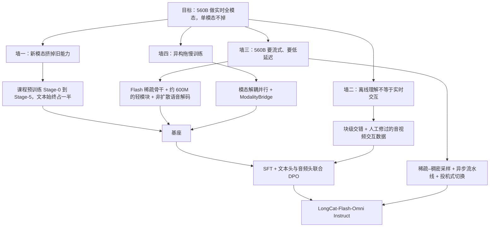

# LongCat-Flash-Omni：560B 的 MoE 怎么一边看、一边听、一边开口

<!-- release-date: 2025-11-01 -->

> 本文依据美团 LongCat 团队的 **LongCat-Flash-Omni Technical Report**，arXiv:2511.00279v2，2025-11-28 提交，共 40 页（正文与结论到 p. 32，p. 33 是作者名单，p. 34–40 是参考文献）。页码均指 PDF 自身页码。文中区分三件事：**报告明确写了什么**、**我们怎么解释它**、**哪些是外部资料或本文推算**。

## 阅读前先认识几个词

- **全模态（omni-modal）**：一个模型直接吃文本、图像、视频、音频的任意组合，直接吐出文本和语音，中间不外挂语音识别或语音合成服务。
- **MoE（Mixture-of-Experts，混合专家）**：前馈网络拆成很多个小网络（专家），每个 Token 只让其中少数几个干活。总参数可以很大，单次计算量不必跟着涨。
- **零计算专家（zero-computation expert）**：什么都不算、把输入原样返回的「专家」。路由器选中它，这个 Token 在这一层就少花一份算力。它让每个 Token 的计算量可以不一样。
- **ScMoE（Shortcut-connected MoE，快捷连接 MoE）**：LongCat-Flash 的骨干排布，让专家并行的跨卡通信和另一段稠密计算同时进行，通信被计算遮住。
- **码本（codebook）与离散音频 Token**：把一小段声音编成若干个整数编号。一帧声音用几个码本，就有几个编号；第一个管内容（语义），后面几个补音色和细节（声学）。
- **预填（prefill）与解码（decode）**：预填是把已经到手的输入一次性算进 KV Cache；解码是一个一个往外吐 Token。实时对话里，谁先谁后、何时切换，直接决定用户等多久。
- **首包延迟（first-packet latency）**：从用户说完到第一段能播放的语音出来之间的时间。

报告里反复出现的几个自有名词：

- **LongCat-ViT**：637M 参数的视觉编码器，原生分辨率，图像和视频共用。
- **LongCat-Audio-Codec**：把波形变成 4 个码本的离散 Token，也负责把 Token 还原成波形。
- **MDP（Modality-Decoupled Parallelism，模态解耦并行）** 与 **ModalityBridge**：训练时让编码器和 LLM 各用各的并行方式，中间由一座「桥」负责换格式。

## 一句话先说清

LongCat-Flash-Omni 拿一根已经能上线服务的 560B 稀疏语言骨干（LongCat-Flash，每 Token 平均激活约 27B），在它周围接三个各约 600M 的轻模块，让它能边收音视频、边出语音（PDF p. 5、p. 7–8）。

报告要回答的，是把这件事做成时撞上的四堵墙：

1. **新模态会把旧能力挤掉**：视觉、音频塞进同一份权重后，文本和单模态能力不能掉；
2. **离线理解和实时交互不是一回事**：看完整段视频再答题，和对着摄像头随时插话，需要的能力不同；
3. **560B 要做到实时**：流式进、流式出，还要低延迟；
4. **训练被异构拖慢**：三个模块算力差两个数量级，数据长度分布也各不相同（PDF p. 4）。

对应的四个回答分别是：课程式预训练加固定配比；块级交错加人工修过的交互数据；轻模块加非扩散的语音解码加异步流水线；模态解耦并行。

如果只记一句：

> **全模态的难处不在「再接一个编码器」，而在新模态进来时旧能力别掉、大模型别慢、训练别被最慢的那个模块拖住。**

## 全景：一根稀疏骨干，三个轻模块

图上最值得看的是右上角那张小网格：**LLM 每一步同时出 1 个文本 Token 和 4 个音频 Token**，不是先写完文字再合成语音（PDF p. 6，Figure 2 图注）。语音 Token 与文本 Token 由同一根骨干、同一次前向产生，所以不存在「等文本写完一句再送去 TTS」这一段延迟。

三个外围模块——视觉编码器、音频编码器、音频解码器——各约 600M（PDF p. 5），视觉编码器在 Table 1 里写明 637M（PDF p. 6）。和骨干每 Token 18.6B–31.3B 的激活量相比，它们只是零头（PDF p. 7–8）。**容量和稀疏性都在骨干上，外围只负责快。**

后面的设计都挂在这张图的某条线上：声音怎么进、怎么出（音频编码器与解码器）；视频怎么压（视觉编码器前后）；音视频按什么顺序排进骨干（块级交错）；训练时这几块怎么分卡（MDP）；上线时怎么抢首包（异步流水线）。

## 核心设计一：骨干不重做，直接沿用 LongCat-Flash

### 旧问题：全模态若换一根更重的骨干，实时先死

全模态模型最省事的做法是挑一根更强的稠密 LLM 接编码器。但实时交互要求每一秒都在预填新帧、新声音，稠密大模型每 Token 都要跑满全部参数，延迟先顶不住。

### 报告的选择

Omni 的 LLM 就是 LongCat-Flash：一个 560B 的 MoE，用 MLA（多头潜在注意力）、快捷连接 MoE 和零计算专家，每 Token 激活 18.6B 到 31.3B，平均约 27B。报告说这些特性被「保留并扩展到多模态理解与音视频交互」（PDF p. 7–8）。

这里要分清两层：

- **报告写了什么**：骨干是同一套结构；预训练的 Stage-0 走「LongCat-Flash 初始阶段的同一套流程」（PDF p. 12）；文本 SFT 数据复用 Flash 的（PDF p. 16）；推理部署也沿用 Flash 的 PD 分离和 ScMoE 单批重叠（PDF p. 22）。
- **报告没写什么**：零计算专家在多模态 Token 上被选中的频率、不同模态的激活参数分布，报告都没有统计，也没有针对 Omni 的骨干消融。

零计算专家、ScMoE 的机制本身见 LongCat-Flash 一篇。对 Omni 而言要记住的只有一条因果：**骨干先是稀疏的、先是能服务的，外围模块才有资格做轻。** 如果骨干每 Token 要跑满 560B，编码器做得再轻也救不回延迟。

## 核心设计二：声音进出走两套表示

### 旧问题：离散 Token 好训，但丢细节

让 LLM 听声音有两条路：把声音变成离散 Token，和文本一样做下一词预测；或者用编码器把声音变成连续特征，投影进 LLM。前者和文本共享一套训练目标，训练稳；后者保得住细节，但生成端没法直接用。

报告的观察是：**离散化会妨碍模型捕捉细粒度的声学细节**（PDF p. 7）。于是它两条路都走，分时段、分方向地走：

| 方向 | 预训练 Stage-1 到 Stage-4 | Stage-5 起（含后训练） |
|---|---|---|
| 输入（听） | 离散 Token：4 码本 | 连续特征：音频编码器 |
| 输出（说） | 离散 Token：4 码本 | 离散 Token：4 码本 |

（PDF p. 7）输出端始终离散，因为骨干的生成方式就是下一词预测。

### 输出：4 码本，1 个语义 + 3 个声学，解码不走扩散

分词器和解码器都来自 LongCat-Audio-Codec：每秒 16.67 帧，每帧 4 个码本，其中 1 个表示语义，3 个表示声学细节（PDF p. 7）。

常见的语音生成链路是「语音 Token → 扩散或流匹配模型出梅尔谱（code2mel）→ 声码器出波形」。报告明确不这么做：直接用 codec 自己的解码器从 Token 还原波形，解码器由 LSTM、卷积块和因果转置卷积组成，用 GAN 训练，流式解码只需前瞻 3 帧（PDF p. 7，Figure 3）。按每秒 16.67 帧算，3 帧约 180 毫秒（本文换算）。

这 4 个码本在 LLM 里怎么生成，Stage-1 的示意图画得最清楚：

从图里要读出三件事（PDF p. 12–13）：

1. **输入端相加，不是拼接**：同一个时间步的文本嵌入和音频嵌入加在一起进骨干，序列长度不因多了 4 路音频而变成 5 倍；
2. **输出端多头并行**：1 个文本头、4 个音频头，一步同时出；
3. **声学比语义晚一步**：先定这一帧「说什么」，下一步再补「怎么说」。报告只写了「语义与声学 Token 之间有一步时间偏移」，没有给这一步偏移的消融。

（第 3 条是一种常见的多码本排布；同类排布为什么有用，见知识库 音频编解码 篇「多层 token 怎么排进一维序列」。）

### 输入：Stage-5 起换成连续编码器

音频编码器吃 80 维 Fbank 特征。前置 FFN 用帧拼接把序列长度压到八分之一，每帧对应 80 毫秒；主干保留 Transformer 的外形，但把自注意力换成 FSMN（前馈序列记忆网络），只在有限窗口里看上下文；**只有最后 6 层允许看 1 帧未来，前面各层严格因果**（PDF p. 7，Figure 4）。它先用语音识别数据和 CTC 损失单独训过，Stage-5 再对齐到 LLM（PDF p. 7、p. 14）。

每帧 80 毫秒意味着输入端每秒 12.5 个连续向量（本文换算）。报告举的对照是：常见的 12.5 Hz 语音分词器每秒约出 12.5 个 Token，而人说话每秒只有 3–4 个文本 Token（PDF p. 12）——**声音天生比文字稀**，这是后面课程训练要先练语音的原因之一。

### 收益与边界

- **收益**：生成端少了一级扩散，是报告明说的「为了实时交互的低延迟」（PDF p. 7）；输入端换连续特征，是为了补回离散化丢掉的声学细节。
- **边界**：报告没有给「连续输入 vs 离散输入」的对照表，也没有给解码器、编码器各自的推理毫秒数，更没有给「不走扩散快了多少」的数字。
- **可迁移**：生成走下一词预测时，解码器越接近「Token 直接变波形」，越容易流式；输入侧可以先离散对齐、后连续补细节，不必一开始就上连续编码器。

## 核心设计三：视觉编码器和视频预算

### LongCat-ViT：刻意偏轻的原生分辨率 ViT

LongCat-ViT 保留标准 ViT 骨架，加了图像视频统一的 patch 化、二维旋转位置编码（2D-RoPE）、SwiGLU、RMSNorm、LayerScale 和 Query-Key 归一化（PDF p. 5）。为了实时交互里逐帧编码不拖后腿，配置刻意做轻（PDF p. 6，Table 1）：

| Patch 大小 | 位置编码 | 隐藏维 | 中间维 | 层数 | 头数 | 参数量 |
|---:|---|---:|---:|---:|---:|---:|
| 14 | 2D-RoPE | 1280 | 5184 | 32 | 16 | 637M |

- **原生分辨率**：训练时每张图或每帧的 patch 数若落在 576–5832 之间，只做最小缩放让宽高都能被 112 整除；否则按原宽高比缩进这个区间（PDF p. 6）。
- **投影**：两层带前置归一化的 MLP；空间上再做 2 倍 pixel-unshuffle，压住高分辨率的平方开销（PDF p. 6）。
- **ViT 自己的课程**：先在固定低分辨率（例如 224）上做对比学习，再转原生分辨率；视频数据留到最后一个阶段才加；前期用冻结的预训练视觉模型做特征蒸馏，权重逐渐降低。对比预训练从零开始，共 146 亿个样本（PDF p. 6–7）。

### 视频：三道压缩

视频从几秒到几小时都有。报告用三件事控制 Token 预算（PDF p. 8）：

1. **动态抽帧**：默认每秒 2 帧；短视频提高帧率、至少 16 帧；过长的视频按最大帧数均匀抽；
2. **文本时间戳**：在第 $i$ 秒的帧前面插纯文本 `Second{i}`，序列形如 `Second{i}||Vi||Second{j}||Vj||…`。时间信息走文本空间，不另造一套时间位置编码；
3. **分层压缩**：先按 patch 上限缩放每帧；进编码器前用时间步长为 2 的三维卷积把 $N$ 帧压成 $N/2$；投影成视觉 Token 后若仍超上限，再插值下采样。

第 2 条值得多看一眼。给视频标时间有两种做法：改位置编码（把时间写进 RoPE 的一个分量），或者直接写成文字。LongCat 选了后者。它的好处是「第几秒」这个概念 LLM 早就在文本里学过，时间问答可以直接复用；代价是每帧多几个 Token。报告没有做两种做法的对照。

## 核心设计四：块级交错与稀疏–稠密采样

### 旧问题：离线拼接和实时预填是两种序列

离线理解可以等整段音视频到齐，把音频特征和视觉特征在序列维拼起来。实时交互不行：用户问完的那一刻，前面若干秒的画面和声音必须已经在 KV Cache 里，否则首包一定晚（PDF p. 8）。

### 新设计：按时间对齐切块，一块一块预填

报告给出的块格式是「时间戳：视频 Token、音频起始符、音频 Token，下一个时间戳：视频 Token、音频 Token……音频结束符」，时间戳仍是文本（PDF p. 8）。

图上两段期间的密度差是刻意的：

- **用户输入期**：1 秒一块、每秒 2 帧，尽量保住音画信息；
- **模型回答期**：2 秒一块、每秒 0.5 帧，帧先缓存，拼到下一轮用户输入前面（PDF p. 8）。

报告把这称作「区别于社区其他全模态模型的核心能力」（PDF p. 8）。服务端对应的实现是：VAD（语音活动检测）判定用户在说话时用稠密帧加音频，否则只用稀疏帧跟踪画面大意（PDF p. 22–23）。

### 收益与边界

- **收益**：KV Cache 在用户还没说完时就在增长；回答期把视频降到四分之一帧率，是拿画面信息换算力（1 秒 2 帧对 2 秒 1 帧，本文换算）。
- **边界**：报告没有给「1 秒块 vs 整段拼接」的延迟对照，也没有给回答期降帧率掉了多少视频理解分。
- **可迁移**：**实时系统的序列形状，应该由「什么时候必须开口」决定**，而不是照搬离线 benchmark 的拼接习惯。谁在说话，就把算力花在谁的那一路上。

## 核心设计五：课程式预训练——先文本，再语音，再图像，最后视频与连续音频

### 旧问题：模态差太远，一锅炖会把单模态炖坏

报告对四种模态的判断是：文本是高度压缩的符号；语音和文本同为序列，但多了音色、情感、韵律、口音，语义密度低得多；图像是空间结构；视频再叠上时间，最难（PDF p. 12）。所以训练按「从简单序列建模到复杂序列建模」排队：离文本最近的先进来，最远的最后进来。

### 六个阶段

原文 Figure 5 用火焰和雪花标出每阶段哪些模块在训、哪些冻结，下表把它和 3.2 节的文字合成一张（PDF p. 11–14）：

| 阶段 | 新加入 | 在训的模块 | 规模与配比 | 学习率 |
|---|---|---|---|---|
| Stage-0 文本预训练 | 文本 | LLM | 约 16T Token；推理与代码数据占比逐步升高 | 恒定 |
| Stage-1 文本–语音 | 语音–文本交错、少量 ASR（语音离散成 4 码本） | LLM（加 4 个音频头） | 约 5.1T Token，文本∶音频 = 2∶1 | 轻微衰减 |
| Stage-2 多模态继续预训练 | 图像描述、图文交错 | LLM + ViT + 视觉投影 | 超过 3T Token，文本∶音频 = 2∶1，文本∶视觉 = 2∶1；视觉损失权重 0.25 | 近乎恒定 |
| Stage-3 多模态退火 | 视频；OCR、定位、GUI、多图、STEM | LLM + ViT + 视觉投影 | 0.33T Token，文本∶视觉∶语音 = 2∶1∶1 | 退火 |
| Stage-4 长上下文 | 另加 25% 长上下文多模态数据 | LLM + ViT + 视觉投影 | 8K→32K 用 100B Token，RoPE 底频 1M→5M；再到 128K 用 20B Token，底频 10M；配比仍 2∶1∶1 | 报告未写 |
| Stage-5 音频编码器对齐 | 连续音频输入 | 只训音频编码器与音频投影；LLM、ViT 冻结 | 报告未给 Token 数 | 报告未写 |

读这张表要注意几处细节：

- **Stage-1 的损失是四项加权**（PDF p. 12）：

$$
L_{\text{total}} = a\,L_{\text{pure-text}} + b\,L_{\text{audio}} + c\,L_{\text{audio-text}} + d\,L_{\text{first-audio}}
$$

$L_{\text{pure-text}}$ 是纯文本数据的损失；$L_{\text{audio}}$ 与 $L_{\text{audio-text}}$ 是语音–文本数据里音频部分和文本部分的损失；$L_{\text{first-audio}}$ 是额外加在语义音频 Token 上的一项。调参后取 $a = 1.75$、$b = 0.25$、$c = 1.5$、$d = 0.1$（PDF p. 12）。文本两项的权重加起来是 3.25，音频两项是 0.35——**权重明显向文本倾斜**，报告的理由是在「保住文本能力」和「提升音频能力」之间取最好的平衡。
- **ASR 数据只放一小部分**：报告的经验是 ASR 任务对模态对齐帮助很小（PDF p. 12）。
- **Stage-3 按困惑度缺口调采样**：先按语义和任务把语料切成子集；每个子集配一个验证集，用现成的视觉–语言模型算出参考困惑度；训练中谁的困惑度收敛落后于参考，就提高谁的采样权重；困惑度收敛与下游表现一致的高价值样本被单独拆成子集，避免被平均数稀释（PDF p. 13）。报告说这显著提升了数据效率和下游表现，但没有给调度前后的对照表。
- **Stage-5 冻 LLM**：输入格式是「任务提示 + 语音输入 + LLM 回复」，损失只算回复段；试过先单独预训练音频投影再端到端，结果与直接端到端差别可以忽略，于是省掉（PDF p. 14）。

各阶段 Token 数加起来约 24.5T 以上（16 + 5.1 + 3 以上 + 0.33 + 0.12，本文加总；Stage-5 未计）。

### 配比本身就是护栏

表里反复出现的 2∶1 和 2∶1∶1 有一个共同点：**文本始终占一半**。每加一种新模态，都按固定比例和文本混训，而不是事后回放文本数据去补。

### 数据：写了数字的部分

多模态预训练语料总计超过 2.5T Token（PDF p. 9）。有数字的子集：

- **语音–文本交错**：数千万小时音频。VAD 切段 → 两套自研 ASR 交叉校验、丢掉转写分歧大的段 → 多语种对齐器强制对齐 → 按「时长 / 文本长度」比丢掉 0.5 与 99.5 百分位之外的段 → 相邻段间静音短于 10 秒的合并。再按标点切成 $(A_i, T_i)$ 片段，随机遮掉某些片段的音频或文本，得到 $(T_1, A_2 + T_2, T_3, \dots)$ 这类交错样本（PDF p. 9）。
- **图像描述**：多级清洗后用多个开源视觉–语言模型重写稠密描述；按图文联合嵌入聚类后分簇重采样；仿 MetaCLIP 做概念重采样，词表扩了一个 20 万规模的中文词表。报告的实验结论是「这一阶段保多样性比过严的质量过滤更有益」（PDF p. 9）。
- **图文交错**：开源数据经过滤、SigLIP 相似度对齐、密度剪枝与语义聚类，原始集合约减少 74%（PDF p. 10）。
- **OCR、定位、GUI**：合成 2–6 页的多页 OCR 样本；定位坐标统一归一化到 0–1000（PDF p. 10）。
- **STEM**：1500 万图文对，从 K12 到大学（PDF p. 10）。
- **长上下文**：超过 3 分钟的视频；把同主题单图拼接、或把长文某些段落渲染成图，造「大海捞针」式检索数据；长视频按片段描述拼成连贯长描述，再造时间定位问答（PDF p. 11）。
- **Stage-4 语音**：处理后的中英文录音超过 1000 万小时（PDF p. 14）。

各子集的 Token 占比、去重与污染检查方法，报告没有公开。

### 收益与边界

- **有证据的收益**：Base 与 Instruct 的文本表相对 LongCat-Flash 大体持平（后文实验节），这是「课程保住单模态」最直接的证据；Stage-1 到 Stage-4 的各个中间基座已经能做语音识别、语音合成和语音续写（PDF p. 26，Table 7–8）。
- **边界**：没有「不用课程、一次混训」的对照；2∶1 是经验配比，不是扫出来的最优点；Stage-5 没给数据量。
- **可迁移**：新模态按「和已有模态有多像」排队接入；接入时用固定配比当护栏；离散对齐可以先于连续对齐。

## 后训练：SFT 教会对话，联合 DPO 把文本头和音频头绑在一起

报告把后训练分成 SFT 和「强化学习」两段，后者实际用的算法是 DPO（Direct Preference Optimization，直接偏好优化）（PDF p. 14、p. 16）。

### SFT 数据

- **图文**：基础描述与问答（单图、多图），加文档图表、OCR、定位、Agent 任务、STEM 推理；用强多模态模型做裁判过滤后约 300 万条（PDF p. 14–15）。
- **视频**：约 300 万个视频的数据池；按 48 个能力子类打标签定向补弱项；动作计数、关系比较、事件定位、属性变化这类难点加人工标注；最后约 70 万条（PDF p. 15）。
- **音频理解**：从 Stage-5 的数据里抽子集，覆盖 ASR、语音翻译、副语言理解、音频问答（PDF p. 15）。
- **视觉–语音问答**：从现有文本问答里挑适合朗读的，用 LLM 改写成口语，再用 TTS 合成回答语音（PDF p. 15）。
- **音视频理解**：让强多模态模型针对视频里音画都用得上的内容出题，按交错块格式组织（PDF p. 15）。
- **语音对话**：滤掉公式、代码、Markdown，把回答改写成能说出口的话；另请专业配音演员录制多种情绪、风格和主要汉语方言（四川话、北京话、东北话）的对话，用来微调一个专用 TTS 引擎，再用它合成全部对话（PDF p. 15）。
- **音视频交互**：这是报告为「离线理解 vs 实时交互」那堵墙准备的专门数据，下面单独说。

SFT 还混入了 LongCat-Flash 用过的纯文本 SFT 数据，覆盖推理、数学、代码、工具调用和日常对话（PDF p. 16）。

### 音视频交互数据：自动生成，再让人改

真实的大规模音视频交互数据采不起，模型合成又容易幻觉（PDF p. 15–16）。报告的做法是两段：

1. **模型自动生成**：先定六个能力维度——记忆、理解、分析、创造、应用、娱乐；用 PySceneDetect 把视频切成场景片段；对每个片段让强多模态模型生成逐轮加深、前后指代相连的多轮问答；LLM 裁判过滤后拼成多轮对话。为了练长期记忆，还特意把一些问题挪到离对应画面很远的时间位置（PDF p. 16）。
2. **人在环路**：人工核查发现自动数据常有五类错误——事实不符、回答不全、指代含糊、语言别扭、答非所问。报告的判断是**再叫一个多模态模型去改，会引入新错误**，所以交给人：事实错的改或换，回答不全的补齐，指代含糊的换成具体名词（PDF p. 16）。

最后用 TTS 把问答转成语音，嵌回视频（PDF p. 16）。

### SFT 配方

冻结音频编码器，其余全部更新；报告的经验是这样收敛更稳，也不会忘掉底层声学特征（PDF p. 16）。AdamW，$\beta_1 = 0.9$、$\beta_2 = 0.95$，权重衰减 0.1；前 4% 步线性升温，之后从 $1 \times 10^{-5}$ 余弦降到 0；训 1 个 epoch，batch 1024（PDF p. 16）。

### 联合 DPO：文本头和音频头放在同一个偏好损失里

多数 DPO 变体只优化文本输出，或把文本和语音分开优化。报告认为分开优化会破坏文本回答与语音回答的一致性（PDF p. 16）。因为模型有 1 个文本头和多个音频头，损失写成（PDF p. 17）：

$$
L_{\text{DPO}} = \alpha\, L_{\text{DPO}}(\text{text}_{\text{chosen}}, \text{text}_{\text{rejected}}) + \beta \sum_{i=1}^{N} L_{\text{DPO}}(\text{audio}^{i}_{\text{chosen}}, \text{audio}^{i}_{\text{rejected}})
$$

$N$ 是音频头的个数。文本那一项管语义质量；每个音频头那一项管对应语音的语言与发音稳定性。

配方（PDF p. 17）：

- 数据两类：通用偏好数据（安全、有用、回答风格）与从 SFT 模型采样的偏好数据；提示覆盖 SFT 的全部类型；每个提示采 6 条回答，人工标注加多模态裁判模型打分，挑出区分度高的偏好对；
- 1 个 epoch，batch 256，每批按模态配平；学习率从 $1 \times 10^{-6}$ 余弦降到 0，升温比例 0.03；
- $\alpha : \beta = 1 : 1$；另加系数 0.1 的 KL 正则，防止离 SFT 模型太远。

报告没有给 DPO 数据条数，也没有「联合优化 vs 分开优化」的对照实验。

## 训练基础设施：让编码器和 LLM 各切各的

### 旧问题：数据和模型都异构

SFT 阶段每个 micro-batch 的计算量，三个模块差得很远（PDF p. 18，Table 2）：

| 模块 | 最小（TFLOPs） | 最大 | 均值 | 标准差 |
|---|---:|---:|---:|---:|
| 音频编码器 | 0.01 | 109.96 | 3.29 | 7.94 |
| 视觉编码器 | 0.08 | 400.37 | 89.85 | 61.02 |
| LLM 解码器 | 1920.57 | 4667.74 | 3531.32 | 1111.11 |

按均值算，LLM 是视觉编码器的约 39 倍、音频编码器的一千多倍（本文换算）；两个编码器的最大值与均值差出好几倍，说明一批数据里有没有长视频、长音频，编码器负载天差地别。Figure 7 的序列长度分布也显示视觉和音频的长度形状完全不同（PDF p. 18）。

报告对比了两条现成路线（PDF p. 17–18）：

- **FSDP 一类**：切参数、靠数据并行抹平异构。对 560B 来说参数太多，走不通；
- **按并行维度解耦**：DistTrain、PipeWeaver、Optimus 等。其中 Optimus 让编码器和 LLM 用不同的并行策略，把编码器计算塞进 LLM 的空档。LongCat 在这条思路上更进一步，做成 MDP：**编码器和 LLM 在分布式层面彻底拆开**。

### MDP：同一组卡，两种切法

编码器和 LLM 放在同一组卡上（co-locate），但切法不同（PDF p. 18）：

- **编码器**：HSDP（混合分片数据并行）降静态显存，全量激活重计算降激活显存；
- **LLM**：流水线并行（PP）+ ZeRO-1 数据并行（DP）+ 上下文并行（CP）+ 专家并行（EP）。

两边靠一个新维度 InnerDP 对上号：

$$
d_{\text{inner\_dp}} = d_{\text{lm\_cp}} \times d_{\text{lm\_pp}}, \qquad d_{\text{world\_size}} = d_{\text{dp}} \times d_{\text{inner\_dp}}
$$

意思是：LLM 的一个数据并行组里有 $\text{PP} \times \text{CP}$ 张卡，这些卡在编码器眼里全都是数据并行的副本，每张卡分一份图像和音频去编码。**LLM 用流水线和上下文并行占住的卡，编码器拿来做数据并行，一张都不闲着。**

一次迭代分四相（PDF p. 18，Figure 8）：取数（只有 inner_dp = 0 的卡读全部 micro-batch，广播元数据；micro-batch 按文本长度排序，减少专家并行的负载空泡）→ 编码器前向（BalanceData 分发，各卡编码，ModalityBridge 汇总）→ LLM 前向与反向 → 编码器反向（ModalityBridge 把梯度分回去）。图上已经画出这四相，这里不再逐条复述。

### ModalityBridge：分块把峰值显存除以块数

长上下文时，inner_dp = 0 那张卡要汇总、分发全部嵌入和梯度，显存会爆。ModalityBridge 把一次完整的格式转换拆成 num_chunk 次，每次两步：先把各 InnerDP 的嵌入汇总到 inner_dp = 0，再沿 hidden_size 维切开分给各 CP rank。每一轮显存先升后降，峰值约降到原来的 $1/\text{num\_chunk}$，并且**逐位数值一致**（bitwise）；反向走逆过程，先在 CP 上 gather 梯度，再按全局偏移 scatter 回各 inner_dp（PDF p. 19–20，Figure 9）。

### 性能调优：先选配置，再把配置塞进显存

报告的顺序是：先按核心算子的效率选分布式配置，再用显存优化满足这个配置的预算（PDF p. 20）。

- **配置**：序列越长核心算子越高效，减小 CP 能明显提升 MoE GEMM 效率；8K 序列下选中的配置是 EP = 32、CP = 2（PDF p. 20–21，Figure 10）。读图估计，选中点两条曲线的 MoE GEMM 平均 MFU 都在 0.74–0.77 之间。
- **通信**：快捷连接结构让专家并行通信与同一 micro-batch 内的计算重叠；按场景分别调通信核与计算核占用的 SM 数；流水线各段之间的点对点通信用独立的通信组和流（PDF p. 20）。
- **算子**（PDF p. 21）：Grouped GEMM 在评测场景约 75% MFU（动态 SwapAB、可配置 SM 数、细调 Tile / Pipeline / Cluster 形状、swizzle 提高 L2 命中、反向 ping-pong 遮住权重梯度读写）；融合 permute 同时算反向元数据与 CP 组内的 Token 丢弃；把 RoPE 融进 MLA 的前序 kernel，比基线快 3 倍；用信号量实现确定性的 FlashAttention 反向，速度约为非确定性版本的 0.8 倍。

显存从 137 GB 一路压下来（PDF p. 21–22，Table 3–4）。目标是 80 GB 的卡，还要给专家负载不均留余量，所以理论占用要压到约 72 GB：

| 设置 | 静态（GB） | 动态（GB） | 其他（GB） | 合计（GB） |
|---|---:|---:|---:|---:|
| 基线 | 20.4 | 103.2 | 13.4 | 137.0 |
| + 编码器 HSDP | 17.5 | 103.2 | 13.4 | 134.1 |
| + V 形流水线调度（Vhalf） | 17.5 | 58.6 | 13.4 | 89.4 |
| + 选择性重计算 | 17.5 | 49.2 | 13.4 | 80.1 |
| + 省显存 permute | 17.5 | 42.8 | 13.4 | 73.6 |
| + NCCL 显存优化 | 17.5 | 42.8 | 8.9 | 69.1 |

最大的一刀是 V 形流水线调度：它限制同时存活的激活 micro-batch 数，合计从 134.1 GB 降到 89.4 GB，一步少了 44.7 GB（本文减法）。选择性重计算只针对 SwiGLU、LayerNorm 这类算得少、激活占得多的算子；省显存 permute 把路由概率与隐状态的聚合挪进 SwiGLU。另有一个兜底机制：某张卡分到的 Token 过多时，动态重算它的 down-projection，只保留 down-projection 的输入，避免专家不均衡把训练打崩（PDF p. 21）。

### 数值一致性

沿用 LongCat-Flash 的原则：所有计算、通信和数据流都走确定性实现，每次实验可复现、损失逐位对齐（PDF p. 22）。新特性优先做逐位对齐，例如 fused_permute、fused_swiglu 开关前后损失逐位一致；Grouped GEMM 与 Router GEMM 用非 Split-K 实现，保证不同 batch 与分布式设置下对齐。做不到逐位对齐的，对照黄金实现找出全部偏差来源，例如对齐 DeepEP 与 All2All 两种专家并行实现的累加顺序（PDF p. 22）。

### 「90% 吞吐」这句话

摘要、引言和第 5 节三次写到：多模态设定下，系统保持纯文本训练吞吐的 90% 以上（PDF p. 1、p. 4、p. 17）。**报告没有写测量条件**：哪个阶段、多长序列、多少张什么卡、对照的纯文本训练是哪一次、指标是 MFU 还是 Token/秒。本文只把它当作作者给出的系统效率主张。

### 这一节可以带走什么

- 异构模块不要强行共用一种并行：轻编码器走数据并行加重计算，重 LLM 走自己的 PP / EP / CP，**中间用一层可分块、逐位一致的桥换格式**；
- 调优顺序是「先让核心算子跑在高效区，再想办法把显存塞进去」，而不是反过来迁就显存选一个低效配置；
- 为专家负载不均准备一个只在超限时触发的兜底（动态重算），比整体压低 batch 更划算。

## 推理：模块分卡部署，预填与解码抢那段静音

### 解耦部署

编码器、解码器和 LLM 分别部署在适合各自计算特征的硬件上，避免互相抢资源；LLM 侧沿用 LongCat-Flash 的 PD 分离与 ScMoE 单批重叠。报告说相比混合部署延迟更低、吞吐更高，代价是一点额外通信（PDF p. 22）。没有给分卡方案和实测毫秒表。

### 异步流水线

一次对话被拆成四段同时跑的流水：VAD 与抽帧、音视频编码、LLM 预填与解码、音频解码；每个模块都支持流式输入的增量推理和自适应组批（PDF p. 22）。图上的关键时刻有三个：

1. **投机式切换**：VAD 靠「静音持续够长」判定用户说完，这段静音窗是 $[t_2, t_4]$。若等到 $t_4$ 才从预填切到解码，首包会晚一整段静音。系统在更早的 $t_3$ 就开始解码；如果用户又开口，丢掉已生成的内容，回滚到预填状态（PDF p. 23）。
2. **送音频以 VAD 为准**：即使首包音频提前生成，也要等 VAD 在 $t_4$ 明确判定轮次结束才播给用户（PDF p. 23）。
3. **打断**：用户在 $t_5$ 插话，生成立即终止，已生成的 Token 序列截到最近的自然断点，比如最近的标点（PDF p. 23）。

实现细节：用户侧每个请求包是 1 秒音频加对应的 2 帧视频，到了就预填，不必等这一轮说完。VAD 端点检测本身要 600–700 毫秒，预填与它重叠后，**用户能在端点检测之后 100 毫秒内收到回复**（PDF p. 23）。

这个 100 毫秒要读准口径：它是「VAD 判定结束之后」的额外等待，不是「用户停口到首包」的端到端延迟（那还要加上 600–700 毫秒的端点检测），更不是 560B 模型的单 Token 解码时延。引言里的「毫秒级响应」没有另给测量条件（PDF p. 4）。

**可迁移**：优化交互延迟，先把时间轴画出来，找到哪一段是在「等」而不是在「算」。这里的静音窗就是纯等待，投机式切换用「偶尔回滚」换来了这段时间。

## 实验：哪些结论有证据，哪些要打问号

所有对照模型的数字都以本报告表格为准；带 `*` 的是报告从其他公开材料转引的。视觉与视频对照 Gemini 时把 Gemini-2.5-Pro 的思考预算限制在 128 Token，跟随 Qwen3-VL 的评测设置（PDF p. 24）。

### 跨模态理解：开源第一，对 Gemini-2.5-Pro 四项输三项

OmniBench 用的是团队内部修正过的版本，报告说公开版有计分缺陷。UNO-Bench 是团队自建的：1880 道人工题、44 类任务、98% 的题需要跨模态推理，另有多步开放题（PDF p. 29）。

| 基准 | LongCat-Flash-Omni | Gemini-2.5-Pro（思考预算 128） | Gemini-2.5-Flash（非思考） | Qwen3-Omni Instruct | Qwen2.5-Omni Instruct |
|---|---:|---:|---:|---:|---:|
| OmniBench | 61.38 | **66.80** | 54.99 | 58.41 | 48.16 |
| WorldSense | 60.89 | **63.96** | 58.72 | 52.01 | 46.69 |
| DailyOmni | **82.38** | 80.61 | 80.78 | 69.33 | 47.45 |
| UNO-Bench | 49.90 | **64.48** | 54.30 | 42.10 | 32.60 |

（PDF p. 30，Table 14）

对开源的 Qwen3-Omni、Qwen2.5-Omni 四项全胜。对 Gemini-2.5-Flash 赢三项、UNO-Bench 输。对 Gemini-2.5-Pro 只有 DailyOmni 更高，UNO-Bench 差了 14.58 分。报告说自己「与 Gemini-2.5-Pro 相当」（PDF p. 29），这句话在 OmniBench、WorldSense 上勉强成立，在 UNO-Bench 上不成立。而 UNO-Bench 恰好是团队自建、明确为跨模态推理设计的那一张。

### 图像：和 Gemini-2.5-Flash 同一档，强项在多图、定位和 GUI

Table 5 有 19 行、8 个模型（PDF p. 24）。报告的总结是：整体与 Gemini-2.5-Flash 相当，超过开源的 Qwen3-Omni，多图任务优势尤其明显（PDF p. 24）。逐行数一遍（本文统计）：

- 对 Gemini-2.5-Flash：11 行更高，7 行更低，OmniDocBench 英文持平、中文更好；
- 对 Qwen3-Omni：15 行更高，4 行更低（DocVQA、OCRBench、VisualWebBench、ScreenSpot-v2）；
- 在全部 8 个模型里拿第一的只有 3 行：MuirBench 77.1、Mantis 84.8、RefCOCO-avg 93.9。

几行最能说明位置的数字（PDF p. 24，Table 5）：

| 基准 | LongCat-Flash-Omni | Gemini-2.5-Flash | Qwen3-Omni | Qwen3-VL-235B |
|---|---:|---:|---:|---:|
| MuirBench（多图） | 77.1 | 73.7 | 62.1 | 72.8* |
| RefCOCO-avg（定位） | 93.9 | 74.8 | 91.6 | 88.2 |
| ScreenSpot-v2（GUI） | 91.2 | 63.9 | 94.7 | 93.4 |
| MMMU-val（STEM） | 70.7 | 76.3 | 69.1* | 78.7* |
| DocVQA（文档） | 91.8 | 93.6* | 95.7 | 94.6 |

短板在 STEM 与文档：MMMU 比 Gemini-2.5-Flash 低 5.6 分，DocVQA 低于表中除 GPT-4o 以外的所有模型。

### 视频：短视频三项全第一，长视频和 STEM 视频落后

所有视频基准都把上下文上限设为 32K；VideoMME 按无字幕协议，分「有音频」与「无音频」两种条件（PDF p. 25）。

| 基准 | LongCat-Flash-Omni | Gemini-2.5-Pro | Gemini-2.5-Flash | Qwen3-Omni | Qwen3-VL-235B |
|---|---:|---:|---:|---:|---:|
| MVBench | **75.2** | 66.4 | 63.0 | 69.3* | 71.3 |
| NextQA | **86.2** | 84.2 | 81.4 | 82.4 | 81.3 |
| TempCompass | **82.2** | 80.8 | 80.2 | 73.5 | 80.5 |
| VideoMME 无音频 | 76.2 | — | — | 70.5* | **79.2*** |
| VideoMME 有音频 | 78.2 | **80.6*** | 78.5 | 73.0 | — |
| LongVideoBench | 69.3 | **69.4** | 66.4 | 65.4 | — |
| MMVU | 67.1 | **75.6** | 72.4 | 62.4 | 69.3 |
| Video-MMMU | 67.5 | **79.4*** | 76.6 | 60.3 | 73.7 |

（PDF p. 25，Table 6）

短视频三项确实是全表第一，报告归因于动态抽帧、分层压缩和骨干的长上下文能力（PDF p. 25）。但报告说它在 VideoMME 上「是全模态模型里最好的」，要打个折：报告自己在 7.1 节把 Gemini-2.5-Pro 也归为全模态模型（PDF p. 24），而后者有音频条件下是 80.6，高于 LongCat 的 78.2。这句话只在开源全模态模型里成立。

### 音频：基座已经能听会说；Instruct 的识别并不领先

**基座（Stage-1 到 Stage-4，输入仍是离散 Token）**（PDF p. 26，Table 7–8）：

| 基座 | ASR SpeechIO02 ↓ | ASR LibriSpeech clean / other ↓ | TTS SpeechIO02 ↓ | TTS LibriSpeech ↓ | 语音续写 音频入文本出 / 音频入音频出 ↑ |
|---|---:|---:|---:|---:|---:|
| Stage-1 | 2.93 | 1.98 / 3.96 | 4.12 | 4.72 | 88.80 / 84.80 |
| Stage-2 | 3.18 | 2.11 / 4.59 | 2.16 | 8.64 | 89.60 / 84.80 |
| Stage-3 | 3.01 | 1.93 / 3.74 | 2.53 | 3.68 | 92.80 / 92.00 |
| Stage-4（32K） | 3.49 | 2.30 / 4.00 | 1.73 | 5.99 | 91.20 / 91.20 |
| Stage-4（128K） | 3.46 | 2.12 / 4.15 | 2.62 | 7.38 | 90.40 / 90.40 |

TTS 的测法是：给离散语音提示，以文本作 teacher-forcing 条件生成语音 Token，经解码器还原成波形后用 ASR 转写，算词错率或字错率（PDF p. 25）。语音续写用 1200 条由 CMMLU 文本合成的语音选择题，1-shot（PDF p. 25–26）。

两件事值得看：第一，**音频入音频出与音频入文本出的差距从 Stage-3 起几乎消失**（92.00 对 92.80，之后完全相等），说明用语音回答没有比用文字回答更笨；第二，英文 TTS 并不随阶段单调变好，Stage-2 加入图像后从 4.72 恶化到 8.64，Stage-3 回到 3.68，拉长上下文后又升到 7.38。报告没有解释这种波动。

**Instruct 模型**：报告对语音识别的文字总结是「始终优于其他对手」（PDF p. 26），但 Table 9 的 10 个识别数字里，LongCat 没有一个是最低错误率（PDF p. 27）：

| 基准 | LongCat-Flash-Omni | Qwen3-Omni | Kimi-Audio | Step-Audio-2-mini |
|---|---:|---:|---:|---:|
| LibriSpeech clean / other | 1.57 / 4.01 | **1.22** / 2.48 | 1.28 / **2.42** | 1.33 / 2.86 |
| AISHELL-1 | 0.63 | 0.84 | **0.60** | 0.78 |
| AISHELL-2 | 2.78 | 2.34 | 2.56 | **2.16** |
| Fleurs zh / en | 3.99 / 5.02 | **2.20** / **2.72** | 2.69 / 4.44 | 2.53 / 3.05 |
| CommonVoice15 zh / en | 4.98 / 13.59 | **4.31** / **6.05** | 8.46 / 7.92 | 5.00 / 6.75 |
| WenetSpeech meeting / net | 6.69 / 6.09 | 5.89 / 4.69 | 6.28 / 5.37 | **4.87** / **4.82** |

它能压过的是 Gemini-2.5-Pro 和 GPT-4o-Audio 这两个通用闭源模型（例如 AISHELL-1 上两者分别是 3.11 和 34.81）。语音翻译 CoVoST2 两个方向也都低于 Step-Audio-2-mini（47.23 对 49.12、27.32 对 29.47）（PDF p. 27，Table 9）。

音频理解（Table 10）七项里只有 TUT2017（65.43）是第一；MMAU 75.90 低于 Qwen3-Omni 的 77.50，CochlScene、MELD 明显低于 Kimi-Audio（PDF p. 27）。音频驱动的对话（Table 11）十二项里，拿第一的是 VoiceBench 的 AlpacaEval（4.94）与 IFEval（77.99），AdvBench 与 Kimi-Audio 并列 100（PDF p. 28）。

封面 Figure 1 把「音频理解平均」画成 74.8，而图上 Kimi-Audio 是 75.9，比 LongCat 还高；按 Table 10 七项简单平均算，LongCat 是 75.05，与图上的 74.8 也对不上（本文计算；其余四个模型的平均与图上一致）。VoiceBench 平均 88.7 可以由 Table 11 复算出来（把两项 5 分制乘 20 后七项平均，本文计算）（PDF p. 1）。

**准确的说法是**：LongCat 的音频理解与音频对话达到专用音频模型的水平，明显强于通用闭源模型；语音识别与翻译不是它的强项，报告的文字总结说高了。

### 文本：大体没掉，指令遵循掉得明显

对照里的 LongCat-Flash 是本报告表里的一列。要注意这不是一次受控对照：Omni 从 Flash「早期的 base」出发（PDF p. 28），之后又经历了 8.5T Token 以上的多模态继续训练（Stage-1 到 Stage-4 加总，本文计算），而 Flash 有它自己完整的后续训练。

**Base（Stage-5 之后）**，18 项里 11 项高于 Flash Base、7 项低于（本文统计），差距多在 1 分以内（PDF p. 29，Table 12）：

| 基准 | Omni Base | Flash Base | 差 |
|---|---:|---:|---:|
| MMLU | 86.81 | 87.05 | −0.24 |
| MMLU-Pro | 69.05 | 70.32 | −1.27 |
| MATH | 66.80 | 64.82 | +1.98 |
| HumanEval+ | 69.51 | 65.85 | +3.66 |
| CRUXEval-O | 73.50 | 75.88 | −2.38 |

**Instruct（全部为非思考模式）**，17 项里 13 项高于 Flash、4 项低于（本文统计）（PDF p. 30，Table 13）：

| 基准 | Omni Instruct | LongCat-Flash | DeepSeek-V3.1 | Qwen3-235B-A22B-2507 |
|---|---:|---:|---:|---:|
| CMMLU | 89.39 | 84.34 | 88.04 | 88.14 |
| AIME24（avg@10） | 72.92 | 70.42 | 66.30* | 81.67 |
| LiveCodeBench | 52.64 | 48.02 | 56.40* | 46.48 |
| IFEval | 82.44 | 89.65 | 86.69 | 88.54 |
| COLLIE | 45.69 | 57.10 | 43.80 | 49.71 |
| Meeseeks-zh | 39.05 | 43.03 | 33.83 | 35.32 |
| ZebraLogic | 86.00 | 89.30 | 85.30 | 94.22 |

掉的四项里有三项是指令遵循，IFEval 低 7.21 分、COLLIE 低 11.41 分。报告的结论是「文本能力没有退化，某些领域甚至更好」（PDF p. 28），前半句对知识、数学、代码成立，对指令遵循不成立，正文也没有解释这一点。

### 实时音视频交互：开源第一，离豆包和 GPT-4o 还有距离

现成基准测不到「音画进、语音出」的实时体验，团队自建了一套评测（PDF p. 30–31）：

- 10 名受过训练的专业对话员，在各家官方 App 或网页的实时音视频界面上与每个模型做约 3 分钟的多轮会话；每个模型 200 场，覆盖解题、娱乐、自我提升、情感支持四类，每类 50 场；
- 定量：250 名真实用户对完整交互视频做三重独立标注，按 0–3 分评自然度与流畅度（0 完全不自然，3 完全自然流畅）；
- 定性：专家按六个维度拆解影响自然度的因素。

| 模型 | 豆包 | GPT-4o | LongCat-Flash-Omni | 讯飞星火 | StepFun | ChatGLM | Qwen2.5-Omni | Qwen3-Omni |
|---|---:|---:|---:|---:|---:|---:|---:|---:|
| 得分 | 1.92 | 1.79 | 1.37 | 1.25 | 1.22 | 0.99 | 0.96 | 0.81 |
| 95% 置信区间 | [1.85, 1.98] | [1.72, 1.85] | [1.30, 1.44] | [1.18, 1.32] | [1.15, 1.28] | [0.93, 1.05] | [0.89, 1.02] | [0.75, 0.87] |

（PDF p. 30，Table 15）

定性「好案例」占比（%）（PDF p. 31，Table 16）：

| 维度 | 豆包 | GPT-4o | 讯飞星火 | StepFun | ChatGLM | Qwen2.5-Omni | Qwen3-Omni | LongCat-Flash-Omni |
|---|---:|---:|---:|---:|---:|---:|---:|---:|
| 实时性 | 65.5 | **71.5** | 67.0 | 18.0 | 3.0 | 4.0 | 1.5 | 49.5 |
| 像人 | **93.5** | 69.0 | 92.5 | 70.5 | 76.5 | 59.0 | 13.5 | 62.5 |
| 副语言理解 | 88.0 | 87.5 | 80.0 | 87.0 | 84.5 | 89.0 | 89.0 | **91.5** |
| 相关性 | **66.5** | 60.0 | 25.5 | 31.5 | 25.0 | 16.0 | 8.0 | 54.5 |
| 准确性 | **65.0** | 55.0 | 38.5 | 42.5 | 33.5 | 35.5 | 40.0 | 36.0 |
| 记忆 | **98.0** | **98.0** | 81.5 | 92.5 | 83.0 | 64.0 | 36.0 | 94.5 |

LongCat 的总分排第三，比开源最好的 Qwen3-Omni 高 0.56，置信区间与豆包、GPT-4o 不重叠。长处是副语言理解（会从表情和语气读情绪）、相关性和记忆；报告自己点名的短处更具体（PDF p. 32）：

- **实时性**：对用户的停顿过于敏感，常常提前开口、打断用户；
- **像人**：偶有发音错误、结巴、电音；
- **准确性**：动态物体认得不错，文字和数字会掉；还倾向于附和用户的说法，忽略画面里的反证。

第一条正好和推理节那个投机式切换对得上：抢在 VAD 确认之前开始解码，本来就要在「快」和「抢话」之间取舍。报告没有把两者联系起来，这是本文的解读。

评测窗口写在脚注里：豆包 8 月 11–15 日，GPT-4o 8 月 18–22 日，讯飞星火 8 月 25–29 日，ChatGLM 9 月 1–5 日，StepFun 9 月 8–12 日，均为 2025 年（PDF p. 31）。各产品在不同的一周里被测，线上产品可能在这几周里更新过，这一点报告没有讨论。

## 报告没有公开的

- 零计算专家在多模态 Token 上的路由统计，以及 Omni 的骨干消融；
- 课程顺序、2∶1 配比、困惑度缺口调度、块大小与帧率、离散与连续音频输入、联合 DPO，**都没有对照实验**；
- Stage-5 的数据量、Stage-4 之后各阶段的学习率数值、DPO 数据条数；
- 训练用了多少卡、多少 GPU 小时；「90% 吞吐」的测量条件；
- 推理侧各模块的毫秒数、分卡方案、560B 骨干的单 Token 解码时延；「毫秒级响应」的测量条件；
- 内部修正版 OmniBench 改了什么；实时交互评测的对话视频与标注数据；
- Figure 1 的音频理解平均按什么口径算。

## 最值得带回自己项目的七条

### 1. 先有能服务的稀疏骨干，再往上挂模态

外围模块能不能做轻，取决于骨干每 Token 花多少算力。先把骨干的延迟做到可上线，编码器和解码器才有资格按延迟预算设计。

### 2. 新模态按「离文本多远」排队接入，用固定配比当护栏

文本 → 语音 → 图像 → 视频 → 连续音频；每一步都让文本占一半。这比先训多模态、事后回放文本去修补更直接。

### 3. 对齐可以先离散、后连续；生成端保持离散

离散 Token 让语音与文本共享下一词预测，训练稳；连续编码器在后期补回声学细节。输出端保持离散并配一个非扩散解码器，才方便流式。

### 4. 实时序列的形状由「何时必须开口」决定

用户说话时 1 秒一块、看得密，模型说话时 2 秒一块、看得疏。把算力花在必须听清、看清的那几秒上。

### 5. 异构模块各用各的并行，中间放一座逐位一致的桥

编码器拿 LLM 的 PP × CP 网格做数据并行，一张卡都不闲；桥用分块把峰值显存降到 $1/\text{num\_chunk}$。数值一致性是拆开之后仍敢上线的前提。

### 6. 等待时间用投机填满，但要准备回滚

静音窗是纯等待。投机式切换把解码提前到窗口中间，用户再开口就丢掉重来。代价是抢话，这正是评测里实时性维度点名的问题。

### 7. 自动合成的交互数据，最后一关交给人

报告明确说用另一个多模态模型去修自动数据会引入新错，所以五类错误交给人工改。数据量大的地方用模型，质量关口用人。

## 用一张图重新串起全文

## 关键词回看

- **ScMoE 与零计算专家**：LongCat-Flash 的骨干设计，Omni 原样沿用；每 Token 激活 18.6B–31.3B，平均约 27B。
- **LongCat-ViT**：637M，原生分辨率，训练时 patch 数 576–5832，图像视频共用。
- **LongCat-Audio-Codec**：每秒 16.67 帧、4 码本（1 语义 + 3 声学）；解码器前瞻 3 帧，不走扩散。
- **多头预测与一步偏移**：1 个文本头 + 4 个音频头同时出，声学 Token 比语义 Token 晚一步。
- **文本时间戳**：视频帧前插 `Second{i}`，时间信息走文本空间。
- **块级交错与稀疏–稠密采样**：输入期 1 秒一块、每秒 2 帧；回答期 2 秒一块、每秒 0.5 帧并缓存到下一轮。
- **课程式预训练**：Stage-0 文本 → Stage-1 语音 → Stage-2 图像 → Stage-3 视频与退火 → Stage-4 长上下文 → Stage-5 连续音频对齐。
- **联合 DPO**：文本头与 $N$ 个音频头放进同一个偏好损失，$\alpha : \beta = 1 : 1$。
- **MDP / InnerDP / ModalityBridge**：编码器按 LLM 的 PP × CP 网格做数据并行；桥分块汇总与切分，逐位一致。
- **投机式预填–解码切换**：在 VAD 确认说完之前开始解码，用户再开口就回滚。

## 最后的判断

LongCat-Flash-Omni 这份报告最值得学的，是它**把「全模态」拆成了训练、结构、系统三条互不相干的约束，分别处理**：训练侧用课程和配比保住单模态；结构侧用稀疏骨干加轻模块保住延迟；系统侧用解耦并行和异步流水线把异构与等待消化掉。

证据强度是分层的：

- **有表格支撑的**：文本知识、数学、代码没有明显退化（Table 12–13）；短视频、多图、定位是强项（Table 5–6）；实时交互自然度在开源里第一、全部产品里第三（Table 15）；显存从 137 GB 压到 69.1 GB 的每一步（Table 4）。
- **只有作者主张、没有测量条件的**：「90% 纯文本训练吞吐」「毫秒级响应」。
- **文字总结高于表格的**：语音识别「始终优于对手」实际 10 个数字无一最低；「与 Gemini-2.5-Pro 相当」在 UNO-Bench 上差 14.58 分；「VideoMME 全模态最好」只在开源范围成立；「文本没有退化」不包括指令遵循。
- **完全没有消融的**：课程、配比、块大小、离散与连续音频、联合 DPO。

如果只带走一句：

> **做实时全模态，先确保骨干足够稀疏、外围足够轻，再按「什么时候必须开口」去排序列；训练和部署里所有异构的东西，都不要强迫它们共用一种切法。**

## 资料与阅读边界

**原始依据**

- LongCat-Flash-Omni Technical Report，[arXiv:2511.00279](https://arxiv.org/abs/2511.00279) v2（2025-11-28 提交），40 页。arXiv 上的最新版就是 v2。

**首发日（外部证据）**

- `release-date` 取 **2025-11-01**（北京时间）。官方代码仓库 [meituan-longcat/LongCat-Flash-Omni](https://github.com/meituan-longcat/LongCat-Flash-Omni) 唯一的根提交（含 README、许可证、推理说明与下载入口）提交时间为 2025-10-31 22:10 UTC，即北京时间 11 月 1 日 06:10；官方 X 账号 [Meituan_LongCat 的发布帖](https://x.com/Meituan_LongCat/status/1984398560973242733) 按帖子编号换算为 2025-10-31 23:14 UTC，即北京时间 11 月 1 日 07:14，写明模型开源。Hugging Face 权重仓库的文件在 10 月 23 日起就已上传，但无法证明当时对公众可见，不取；美团技术团队博客标注 2025-11-03，晚于上述事件，不取；arXiv v1 是论文事件，不回写。

**外部补充（不是报告内容）**

- 同系列：LongCat-Flash Technical Report（[arXiv:2509.01322](https://arxiv.org/abs/2509.01322)），骨干的 ScMoE、零计算专家与 MLA 均出自这篇；本仓库另有 LongCat-Flash 一篇解读。
- 报告引用的组件来源：LongCat-ViT 对应 UniViTAR（[arXiv:2504.01792](https://arxiv.org/abs/2504.01792)）；LongCat-Audio-Codec（[arXiv:2510.15227](https://arxiv.org/abs/2510.15227)）；ScMoE 原始论文 Shortcut-connected Expert Parallelism（[arXiv:2404.05019](https://arxiv.org/abs/2404.05019)）；Optimus 发表于 USENIX ATC 2025；UNO-Bench 代码在 [meituan-longcat/UNO-Bench](https://github.com/meituan-longcat/UNO-Bench)。以上编号均取自报告参考文献。

**本文推算与读图**

- 3 帧前瞻约 180 毫秒、音频编码器每秒 12.5 个向量、各阶段 Token 加总、Table 2 的倍数、Vhalf 那一步的显存差、表格逐行胜负计数、Figure 1 音频平均的复算，都是本文按报告数字做的计算。
- Figure 10 选中配置处的 MFU 区间是读图估计。
- 两张讲解图（块级交错、模态解耦并行）是按 PDF p. 8、p. 18–19 与 p. 22–23 的文字和 Figure 8 重画的机制示意，秒数是示例，不是实测。
