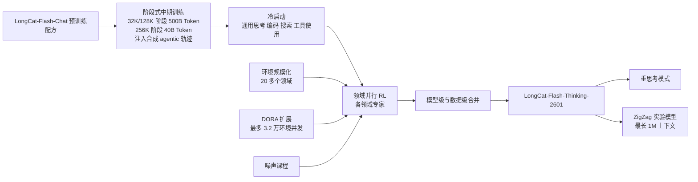
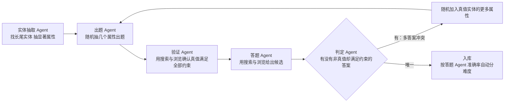
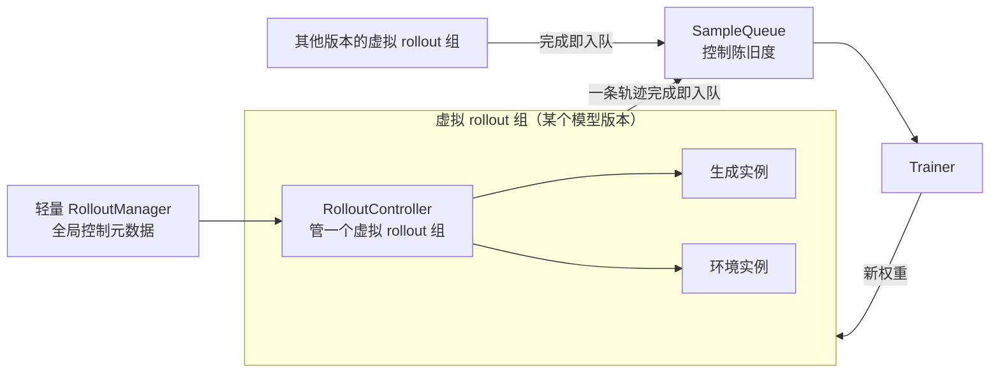
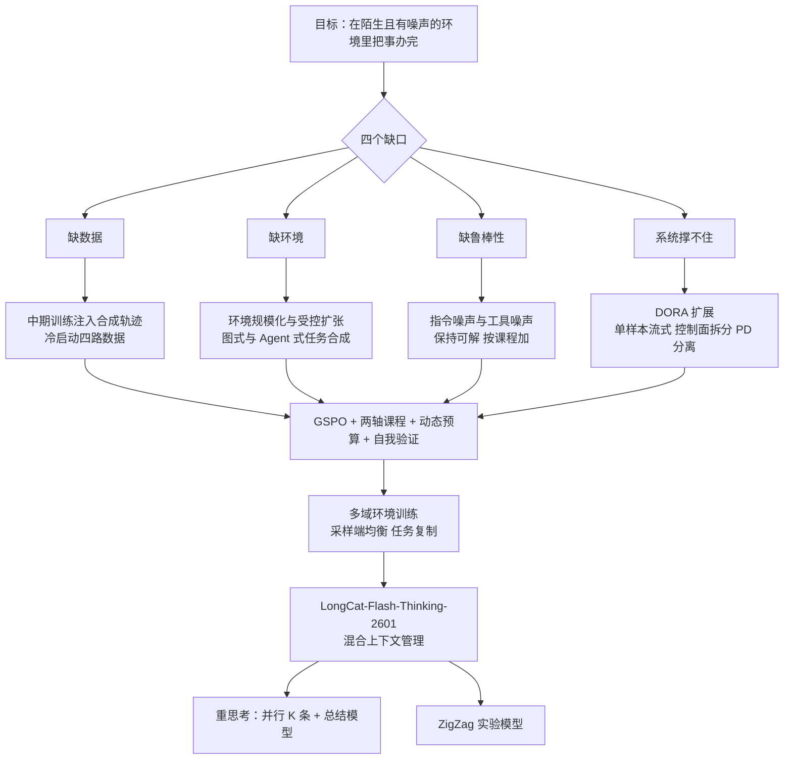

# LongCat-Flash-Thinking-2601：环境不够就批量造，真实世界的噪声再故意加回去

<!-- release-date: 2026-01-14 -->

> 本文依据美团 LongCat 团队的 **LongCat-Flash-Thinking-2601 Technical Report**，arXiv:2601.16725v2，2026-02-01 提交，共 27 页（正文 1–21 页，参考文献 22–26 页，附录 27 页）。页码均指 PDF 自身页码。它是 LongCat-Flash-Thinking 一篇所解读报告的续作，凡对照前作处注明「前作 PDF p. N」。文中区分三件事：**报告明确写了什么**、**我们怎么解释它**、**哪些是外部资料**。

## 阅读前先认识几个词

- **Agentic 推理**：报告的定义是「通过与外部环境的自适应交互来解决复杂问题的能力」（PDF p. 2）。模型不只在脑子里想，还要决定何时调哪个工具，并把返回结果接进推理。
- **环境与工具依赖图**：一个环境由一组工具和它们背后的数据库组成。工具之间有参数依赖（「删文件」先要「文件存在」），把工具当节点、依赖当边，就是一张有向图。
- **轨迹与多轮 rollout**：Agent 解一道题要反复经历「模型输出 → 工具执行 → 模型再输出」，整条记录叫轨迹；RL 里让模型自己跑出轨迹这一步叫 rollout。
- **陈旧度（staleness）**：异步 RL 里生成与训练互不等待，训练用到的样本可能来自几个版本之前的策略。
- **pass@k 与 Avg@k**：pass@k 是采 $k$ 次至少对一次的概率，量能力上限；Avg@k 是 $k$ 次的平均正确率，量稳定发挥。本报告主表几乎全用 Avg@k。
- **测试时扩展（Test-Time Scaling）**：推理时多花算力换更好的答案。沿「深度」是把一条思维链写长，沿「宽度」是并行采多条再选。

报告里最常出现的几个名字：

- **环境规模化（Environment Scaling）**：从一句领域描述出发，自动生成工具、数据库和依赖图，再在图上扩张出成千上万个可执行、可验证的环境。
- **DORA**：美团的多版本异步 RL 系统（Dynamic ORchestration for Asynchronous rollout），前作已有，这一版扩到多轮、多环境。
- **GSPO（Group Sequence Policy Optimization，组序列策略优化）**：这一版的 RL 目标，重要性比在整条序列上算。
- **鲁棒 RL 与噪声课程**：把「用户说话含糊」「工具会出错」两类噪声按课程加进训练。
- **重思考模式（Heavy Thinking Mode）**：并行采多条推理，再让一个总结模型读完所有答案给出最终回复。
- **Zigzag Attention**：报告附带的实验性稀疏注意力，约一半的全注意力层换成「局部窗口 + 开头锚点」。

## 一句话先说清

LongCat-Flash-Thinking-2601 是 560B 总参数、平均每 Token 激活 27B 的 MoE 推理模型，预训练基本沿用 LongCat-Flash-Chat 的配方与数据分布（PDF p. 2）。它没有新的主干结构，整份报告讲的是一件事：

> **怎样把一个会长篇推理的模型，训练成能在没见过的、会出错的环境里把事情办完的 Agent。**

报告自列三项贡献（PDF p. 2–3）：环境规模化与多域环境训练；噪声环境下的鲁棒训练；重思考模式。代表性成绩是 BrowseComp 73.1、τ²-Bench 88.2、VitaBench 29.3（PDF p. 18）。

如果只记一句话：

> **Agent 的泛化来自见过足够多、足够不一样的环境。环境不够就自己造，造的时候把「可验证」当第一约束；训练时再把真实世界的噪声加回去。**

这份报告最值钱的地方，是把「造环境」写到了能照着做的粒度：怎么从领域描述生成工具和数据库，为什么随手扩张会把奖励信号弄坏，怎么避免。

## 先看全景：从预训练到重思考

根据 PDF p. 2–4 正文重画（机制示意，不含时长）：

报告把 agentic RL 的前提拆成三条（PDF p. 4）：准备好可扩展的环境、高质量冷启动数据与校准过的任务集；能撑住高吞吐、异步、长尾多轮 rollout 的基础设施；在异构领域和不同难度上都稳定的训练策略。下文按这三条走。

「领域专家分别训、再合并成一个模型」这条主线沿用前作（PDF p. 4），这一版对专家怎么分组、怎么合并只有一句话。下面这张表把两份报告对齐，读者只需记住右列才是这一版的新东西：

| 环节 | 前作 LongCat-Flash-Thinking | 本报告 |
|---|---|---|
| 中期训练 | 推理密集课程 | 阶段式长上下文（32K/128K 共 500B，256K 再 40B Token），注入合成 agentic 轨迹（PDF p. 3） |
| RL 目标 | 改造过的 GRPO：去 KL、三段裁剪、截断重要性采样（前作 PDF p. 10） | GSPO，序列级重要性比（PDF p. 11–12） |
| RL 系统 | DORA，比同步快三倍以上（前作 PDF p. 9） | 单样本粒度流式、控制面拆分、预填充—解码分离加 CPU 侧 KV 交换；比同步快 2–4 倍（PDF p. 9–11） |
| 新增 | 形式化证明、GenRM 奖励 | 环境规模化、任务合成、上下文管理、多域训练、噪声课程、重思考、Zigzag |

## 第一层矛盾：训练 Agent 缺的是什么

报告在引言里说（PDF p. 2）：当模型内部推理接近极限，**与外部环境交互**成了继续进步的主要途径；但 Agent 任务的长程轨迹、异构环境、长尾交互，给数据、环境、RL 策略和系统都出了新题。把各节动机合起来，缺四样东西：

1. **缺数据**。真实语料几乎全是自然语言，主动调工具的多轮轨迹极少；没见过这种模式的模型进了 RL 会「探索得很低效」（PDF p. 2）。
2. **缺环境**。传统推理是「无环境」的；搜索和工具使用这两类任务，现成的高质量任务「稀缺或根本不存在」（PDF p. 5、8）。
3. **缺鲁棒性**。现有 Agent 都在整理好的指令、稳定可控的环境里训练，一到没见过或有缺陷的环境就明显退化（PDF p. 15）。
4. **系统撑不住**。多轮 rollout 里生成、环境执行、奖励评估交替进行，轨迹长尾且环境延迟不可预测；生产集群还是可用显存只有约 60GB 的中端加速器（PDF p. 9）。

前三样是「训练材料」的问题，第四样是「训练机器」的问题。材料靠合成，机器靠改 DORA。

## 中期训练：先让模型见过 Agent 怎么做事

报告的判断是：没有一个已经具备基本 agentic 行为的模型，大规模 RL 通常既低效又不稳定，所以在中期训练就喂「中等规模」的 agentic 数据（PDF p. 3）。同时 Agent 要长上下文，中期训练按长度分阶段：32K/128K 阶段共 500B Token，256K 阶段再 40B Token（PDF p. 3）。

数据来自一套「混合合成框架」，两条来源互补（PDF p. 3–4）：

- **文本驱动合成**：教程、操作说明、多步解题里藏着隐式的过程性知识。先挑出含多步工作流的文本段，定义潜在函数、抽出函数调用列表，把隐式过程变成显式工具 schema；再翻译成多轮用户—Agent 交互，做模式多样性增强与质量过滤。这条流水线出自同团队的另一篇论文（外部补充，见文末）。在此之上再做两种分解式增强：**工具分解**把工具参数的一部分「藏进环境」，合成模型去取回参数的交互；**推理分解**给每个动作步生成多个备选，合成「从备选里挑最合适的」这一步推理。
- **环境落地合成**：给已有工具集写轻量 Python 环境，显式建模工具间的参数依赖图；从图上采合法执行路径，再**反向合成**与之对齐的用户模拟器系统提示；每条轨迹的正确性靠真的执行代码、检查数据库终态来验证。

另有一类**面向规划的增强**（PDF p. 4）：一类数据合成「有效的问题分解 + 正确的首个动作」，监督从粗到细的规划；另一类在完整轨迹的每个决策步生成多个备选，训练模型在备选间推理和选择。

效果证据是 Figure 2：τ²-Bench 三个子集上，旧中期训练配方与增强配方的 pass@k（PDF p. 4）。读自图，数值为近似：

| 子集 | 旧配方 pass@1 → pass@32 | 增强配方 pass@1 → pass@32 |
|---|---|---|
| Airline | 0.42 → 0.86 | 0.58 → 0.88 |
| Retail | 0.25 → 0.96 | 0.51 → 0.97 |
| Telecom | 0.05 → 0.56 | 0.20 → 0.72 |

增强配方在每个 $k$ 上都更高。差距在小 $k$ 最大；到 $k = 32$，Airline 与 Retail 几乎追平，Telecom 仍差约 16 个点。报告只说「agentic 能力边界更宽」（PDF p. 3）。我们的读法是：小 $k$ 的提升意味着 RL 的起点更好；Telecom 在大 $k$ 上也拉开，说明旧配方在这个子集上有些任务根本采不到正确解，RL 无从强化。

中期训练的超参不靠网格搜索，而是按附录 A 从 checkpoint 预测（PDF p. 27）：先用一批小 MoE（100M 与 1.8B）把最优 batch size 与学习率拟合成随算力变化的幂律，在 3B、6B 上验证后外推到 26B（Figure 14）；再对要继续训练的 checkpoint，用验证损失折算「等价算力」——在继续训练的数据上从头训到同样损失要多少算力——结合实际负载从曲线上读出超参。关键想法是**把「已经训了多久」折算成「相当于从头训了多少算力」**，让预训练的 scaling law 也能用在继续训练上。报告没给预测出的具体超参，也没说 26B 对应哪个实际模型。

合成轨迹数量、两条来源的配比、agentic 数据在中期训练里的占比、Figure 2 用的模型规模，报告都没有给出。

## 核心设计一：环境规模化，把「可验证」当第一约束

### 矛盾：泛化要靠多样的环境，环境一大就验不准

报告的假设是：可迁移的工具使用能力来自接触多样的工具集与交互模式；造一个覆盖真实世界的元环境不可行，但一批足够多样的环境可以作为基础（PDF p. 5）。环境不能靠人写，只能自动生成。

更隐蔽的矛盾在扩张时（PDF p. 6）：子图越大，跨工具的数据库越难保持一致。随手加一个工具，可能连锁牵出一串没满足的依赖；数据库一旦不一致，工具调用的结果就不可预测，**明明正确的轨迹也会执行失败，被判成错误**，RL 收到的是有偏的负奖励。环境复杂度和奖励可靠性天然打架，整条流水线就是在两者之间守住后者。

### 第一步：从一句领域描述到一张可执行的工具图

流水线全自动（PDF p. 5–6，Figure 3）。输入是一段领域定义，例如「文件系统：一个提供结构化方法来存储、组织、检索和管理数据的系统」。然后依次：合成领域专属工具并抽象成统一的数据库 schema，给出工具—数据库映射（图例里 `delete_file` 带前置条件「文件存在」）；自动生成数据库实现与工具代码；过单元测试，另有一个调试 Agent 修问题；最后从验证过的工具集构建依赖图。

从 schema 到完全可执行的工具实现，成功率超过 95%（PDF p. 6）。用它造出覆盖 20 多个领域的工具图，每张图 60 多个工具，组成稠密的依赖图（PDF p. 6）。

### 第二步：从图上长出环境，只加依赖已满足的节点

图里没写尽的几条规则（PDF p. 6–7）：

- **任务从工具链反推**。任务生成器被限制为「必须用满整条种子链，不做刻意的任务设计」，以免混入人的先验偏见。所以每道题天然至少有一条可执行解，对错可以用数据库终态判定。
- **难度有两个来源**：交互复杂度由用户提示决定（要多少澄清、规划、多步交互）；环境复杂度用工具图的节点数与连接密度量化。
- **再起一条链的判据**：$E_n=\bigcup_{i=1}^{n}R(s_i)$ 是当前环境，$D_n = G \setminus E_n$ 是剩余工具，按 $p=f\big(c(E_n),\,g(D_n),\,|D_n|\big)$ 决定是否从 $D_n$ 采新的「黄金工具链」。$c$ 是结构复杂度，$g$ 用「强求解器找到另一条合法链需要试几次」来度量，$f$ 是单调决策函数；$p > \tau$ 时再起一条。$f$ 的形式与 $\tau$ 都没有公开。
- **兜底**：扩出来的节点太少，就随机并入一条中等规模链并保持数据库一致，保证每个环境至少 20 个工具。

摘要说训练跨「超过 10,000 个环境」（PDF p. 1），多域训练一节说「数万个环境」（PDF p. 14），精确数字没有给出。

### 代码沙箱：另一类环境

Agentic 编码用的是可执行沙箱（PDF p. 5）：把搜索、文件读写、代码编辑、shell 执行统一成标准接口；再用高并发调度器异步创建与回收沙箱、并行跑数千个，把环境启动和阻塞从训练关键路径上拿掉。隔离方式与规模没有展开。

### 这一节可以带走什么

- **扩张时可验证性优先于复杂度**。一个验不准的复杂环境比验得准的简单环境更伤 RL，因为它制造的是有偏的负奖励，而不是随机噪声。
- **任务从解反推**，保证每道题可解、可判。
- **用采样概率衰减做多样性**，比事后去重便宜。
- 95% 是「能执行」，不等于「语义正确」；语义错误只能靠评分细则的一致性检查兜住。

## 冷启动：为 RL 准备一个会探索的起点

报告对冷启动的定位很明确（PDF p. 7）：首要目标不是立刻在标准基准上涨分，而是让模型具备**多样的推理模式**与**稳定的交互格式**，好让 RL 高效探索。所以评估也变了：一看它在 RL 要练的那些任务上熟不熟练，二看推理路径是否多样（人工定性检查）；标准基准的 pass@k 只作参考。

**通用思考数据：按「最难的那一段」选样本**（PDF p. 7）。选样用 K-Center-Greedy（KCG，每次挑离已选集合最远的样本，保覆盖）配合困惑度（PPL，模型对一段文本有多「意外」）。现有 PPL 过滤要么忽略长度，要么对全序列求平均，平均会冲淡局部的难 Token。报告改用**滑动窗口 PPL**：取所有 512 Token 窗口里平均 PPL 的最大值，捕捉不确定性的峰值；KCG 选样时把候选到已选集合的距离乘上这个分数。由此从大语料降采样出 21 万条（210K），在这个子集上训的模型在多个推理基准上胜过用全量语料训的（PDF p. 7）。具体基准与分数没给。

三路 agentic 数据各有质量门（PDF p. 8）：

| 领域 | 来源 | 质量控制 |
|---|---|---|
| Agentic 编码 | 大型软件开发平台上的真实轨迹，常带噪声、部分错误或不可复现 | 只留可复现环境里可执行、可验证、解决问题且不破坏既有功能的；动作级过滤去掉错误、冗余、投机的操作；压缩早期步骤以保留长而迭代的调试轨迹 |
| Agentic 搜索 | 真实搜索日志缺结构化推理痕迹，改为合成 | 去平凡样本、统一格式；要求轨迹显式验证查询里的每个条件，防止靠部分证据「猜中」；压缩早期步骤；后期回收 RL 阶段的 rollout 扩量 |
| Agentic 工具使用 | 建在环境规模化流水线上，覆盖 33 个代表性领域 | 提高领域、轨迹结构、交互长度三方面的多样性；每个任务允许多条正确轨迹；按评分细则只留到达目标终态的；**轮级损失屏蔽** |

两个做法值得单独记：

- **压缩早期步骤**解决「轨迹太长装不进训练窗口」和「想保留长程模式」的矛盾：不截断，而是把已经过去的步骤压短。怎么压、压到多短没说。
- **轮级损失屏蔽**：失败的工具调用、格式违规这些低质量轮不进损失，但留在上下文里。模型看得见错误，却不从错误动作上学。

## RL 任务集：环境决定「能做什么」，任务决定「练什么」

常规做法是造出跨领域、跨难度的环境与任务，再按通过率筛掉太简单和太难的（PDF p. 8）。编码有大量现成任务；搜索与工具使用的任务要合成。

报告把搜索题的难度归结为两个因子（PDF p. 8）：**沿关系链的多跳推理**，和**在多个模糊约束下锁定单个实体**。两条流水线各管一个：

- **图式问答**（PDF p. 8–9）：以 Wikipedia 低频实体为种子，反复取页面、加入相关实体与关系，长到预设规模；采固定大小的连通子图出题，再**刻意模糊化**数值、实体名、地点、时间。关系抽取、出题、模糊化各步用 LLM 当评判把关。最后让一个 Agent 去找其他也说得通的答案，只保留「原答案对、其他候选全错」的题。
- **Agent 式问答**（PDF p. 9）：一个有限状态机编排多个 Agent，流程如下（据 PDF p. 9 正文重画）。

「多答案冲突就加属性重出题」是这条流水线最巧的地方：约束不够的题不扔，而是补约束直到答案唯一；答题 Agent 的准确率还顺手给出难度分级。

工具使用的任务集不另造：环境规模化产出的每个环境天然就是一道独立任务（PDF p. 9）。各流水线的产出量与难度阈值都没有公开。

## 核心设计二：把 DORA 从单轮推理扩到多轮多环境

### 矛盾：长尾不只来自模型，还来自环境

前作的 DORA 解决的是「一批回答等最长那条」。到了 Agent 场景，一条轨迹要反复交替生成、环境执行、奖励评估，环境延迟不可预测、同样偏斜；按 batch 组织，加速器会空等一批环境调用返回（PDF p. 9）。再加上约 60GB 的显存，560B MoE 的多轮长上下文 KV 缓存很快放不下。

扩展后的控制面是生产者—消费者结构（PDF p. 9–10，Figure 5）：**RolloutManager** 管 rollout，**SampleQueue** 控制样本陈旧度，**Trainer** 管经验制作与训练；三者跑在不同节点上，通过远程过程调用只做控制与协调，真正干活的是 CPU 或加速器上的 worker。据 PDF p. 9 Figure 5 重画：

### 三处扩展，各对一种瓶颈

**一、流式推进到样本内部**（PDF p. 10）。去掉 rollout 循环里的 batch 屏障，生成、环境执行、奖励计算都以**单个样本**为粒度在远程 worker 上执行。多版本设计沿用：不同版本策略生成的轨迹一完成就入队；Trainer 条件满足就开训，训练设备空闲时还能弹性扩出生成实例。

**二、控制面拆开，按 CPU 空闲度放环境**（PDF p. 10）。算法要求最多 32,000 个环境同时运行，横跨约 400 台物理机、数千个加速器。每次交互只要几个 CPU 操作，但量一大，单个 RolloutManager 就成了单机瓶颈。于是拆成一个只管全局元数据的轻量 RolloutManager，加多个以数据并行方式各管一个虚拟 rollout 组生命周期的 RolloutController；再扩展 PyTorch RPC，支持**感知 CPU 空闲度**的远程函数调用与对象实例化，环境可以放到任意或空闲的机器上。

**三、预填充—解码分离加 CPU 侧 KV 交换**（PDF p. 10–11，Figure 6）。生成用高度专家并行加解码阶段的图级编译。多轮场景里长上下文请求不断进来，专家并行组里分到长上下文的 rank 吃掉不成比例的计算与通信，拖慢整组。解法是把预填充节点与解码节点部署到不同设备组，解码的执行图不再被新请求的预填充打断。分离带来两笔新账：

| 新开销 | 对策 |
|---|---|
| KV 缓存要从预填充节点传到解码节点 | 按块聚合 KV、异步传输，前一块的传输与后一块的计算重叠 |
| 解码节点显存放不下 KV 时要重算，在这批加速器上尤其贵 | 驻留在 CPU 内存的 KV 缓存，设备侧用量到水位线就换出、需要时换入，消除重算 |

### 系统的账：63% 的请求负载率与 2–4 倍

报告给了一个不常见的指标：**请求负载率约 63%**（PDF p. 11）。脚注定义：0 到 1 之间的连续值，对全部生成设备在整个 rollout 期间聚合；例如最大回答长度 64K 时，只算设备上可用的 KV 块、为避免重算，一台加速器约能容纳 4 个请求，那么只跑 1 个就是 25%，一个没有就是 0%——长尾阶段就会这样（PDF p. 11 脚注 1）。这个指标的分母是「这台卡在不重算的前提下能放几个请求」，比 GPU 利用率更贴近 rollout 的真实瓶颈。

到不了 100% 的原因报告写得很坦白：为控制平均陈旧度，**限制了分给旧版本模型的新请求**。一步之内可能做多次负载均衡，报告用两阶段策略：第一次均衡前还没有长尾，允许每台设备多跑（例如 8 个），之后限到最优值（例如 4 个）以免重算（PDF p. 11）。结论是在不同场景的生产任务上，DORA 比同步训练快 2–4 倍（PDF p. 11）；前作写的是三倍以上（前作 PDF p. 9），两者场景与基线不同，不能读成变慢了。

同步基线、加速器型号、预填充与解码的设备比、KV 分块大小、CPU 缓存容量都没有公开。另外 p. 10 说「数千个加速器」，p. 11 总结时说框架「支撑数万加速器与环境」，两处量级口径不同，报告没有对齐。

### 这一节可以带走什么

- **流式要推进到样本内部**。多轮 Agent 每一轮都是「生成—执行—评估」，任何一处按 batch 同步都会让另外两处等。
- **环境一多，先垮的是控制面**。把全局元数据与组内生命周期分开管，是把控制面也做成数据并行。
- **显存小就分离两种负载，再拿 CPU 内存兜底**。这是在约 60GB 的卡上跑 560B 长上下文 rollout 的具体答案，用 CPU 内存和传输带宽换显存。

## 核心设计三：通用训练策略，把 rollout 预算花在刀刃上

### 目标函数换成 GSPO

前作用改造过的 GRPO，重要性比逐 Token 算，为压住 MoE 路由变化带来的异常比值，加了三段裁剪和截断重要性采样（前作 PDF p. 10）。这一版换成 GSPO，理由是它在 MoE 上的经验效果，以及对长程 Agent 轨迹「序列级优化更稳定」（PDF p. 11）。目标是（PDF p. 12，式 1）：

$$
\mathcal J_{\text{GSPO}}(\theta)=\mathbb E_{x,\ \{y_i\}_{i=1}^{G}\sim\pi_{\theta_{\text{old}}}}\left[\frac{1}{G}\sum_{i=1}^{G}\min\Big(s_i(\theta)\hat A_i,\ \operatorname{clip}\big(s_i(\theta),1-\epsilon,1+\epsilon\big)\hat A_i\Big)\right]
$$

对输入 $x$ 从旧策略采一组 $G$ 条轨迹；$\hat A_i$ 是组内相对优势，一条轨迹一个值；$s_i(\theta)$ 是整条序列的重要性比，报告只说它「基于归一化似然在序列级定义」、沿用 Zheng 等 2025。按 GSPO 原论文（外部补充，机制见 GSPO 一篇），它是逐 Token 对数比值的平均再取指数：

$$
s_i(\theta)=\exp\left(\frac{1}{|y_i|}\sum_{t=1}^{|y_i|}\log\frac{\pi_\theta(y_{i,t}\mid x,y_{i,<t})}{\pi_{\theta_{\text{old}}}(y_{i,t}\mid x,y_{i,<t})}\right)
$$

直觉是：路由一变、个别 Token 比值失控的情况，被 $1/|y_i|$ 摊薄了。代价来自同一处：裁剪是整条序列一起做，比 Token 级粗。报告另说两条设定：主要依赖面向结果的监督，并**放松对长轨迹的惩罚**（PDF p. 12）。$\epsilon$、$G$，以及前作那些异步补丁是否保留，都没有写。

### 课程学习：两个轴

课程沿两个轴组织（PDF p. 12）：**任务难度**，用优化前估计的通过率量化；**能力要求**，按任务主要练的能力分类，如基本工具调用、多步规划、自主决策。早期优先「容易学」或「能暴露日后会被复用的能力」的任务，之后转向更难、要组合更高级能力的任务。报告说整体通过率上升、最难任务上提升最明显，归因三条：工具使用的泛化使工具调用失败大幅减少；对指令理解更好使冗余澄清与多余调用减少、交互轮数下降；对时间、地点、实体等多约束的联合推理更强、纠错迭代更少。这些都是定性观察，没有曲线或消融数字。

### 动态预算分配：价值函数随训练状态走

固定 rollout 预算下，难度与当前能力匹配的任务学习收益明显更高，而现有流水线通常给所有任务同样预算（PDF p. 12）。已有的自适应分配工作（报告引 Li 等 2025，外部核实为 Knapsack RL）多依赖预定义价值函数，但模型能力在变，「哪些任务最有信息量」也在变。报告的做法是用实时训练指标 $m_t$（如通过率）刻画当前策略，定义动态价值（PDF p. 12，式 2）：

$$
v_{i,t}=V(\tau_i\mid\pi_{\theta_t},m_t)
$$

再用基于堆的贪心算法求 rollout 分配，最大化当前 batch 的总学习价值。$V$ 的形式与预算上下限没有公开。后面会看到，在异步系统里它被一个更简单的近似替代。

### 自我验证：把「判自己对不对」当辅助任务

报告观察到一个不对称（PDF p. 12）：能生成高质量轨迹的模型，在没有标准答案时往往判断不准这些轨迹对不对。于是把**在线策略自我验证**做成动态激活的阶段：生成出现停滞或收敛到局部最优的迹象时，触发一段让模型评估自己 rollout 的训练。验证比生成容易、奖励通常更高，所以配了两条约束防止走捷径：验证侧重难样本；验证的影响与对应生成轨迹的质量耦合。报告说它加快收敛、提升生成表现，没有数字；「停滞」怎么判、验证奖励怎么算也没写。

## 核心设计四：上下文管理，超过 80K 就摘要，超过轮数就重来

多轮 Agent 的上下文里要塞进每一轮的工具返回，任务越复杂，轮数和返回都越长，总长度「高度可变且常常难以控制」，实践中常见窗口溢出、推理链截断、任务做到一半（PDF p. 13）。所以上下文管理是 agentic RL 的必需品。

两种已有做法（PDF p. 13）：

- **摘要式**：累计长度超过阈值时，把历史工具调用结果蒸馏成摘要替换原文。报告基于 ReSum 框架，让**模型自己当摘要工具**，对比实验定下最优阈值 80K Token；另合成 15K 条高质量摘要样本专用于冷启动，带来约 3% 的准确率提升。
- **丢弃式**：超过阈值时丢掉全部或部分历史，在截断后的上下文上恢复或重启。报告沿用 DeepSeek-V3.2 的 discard-all（全丢）。

**混合策略**把两者按两个触发条件组合：上下文超过 80K 就做摘要压缩；交互超过最大轮数就触发 discard-all，用原始问题重建系统提示与用户提示从头来（PDF p. 13）。另有渐进式丢弃计划，逐步提高丢弃阈值，让更难的样本逐步获得更多推理步数。两个条件对付两种失败：摘要管「太长」，重置管「转了太多轮还没做完」。

引自 PDF p. 13 Figure 7。每个点是一种计算预算下的 BrowseComp Pass@1，横轴是实际消耗的交互步数，不是训练步数。报告正文给的是混合策略「从 55.8% 起步、峰值 73.1%」，并称它「多数情况下优于另外两种、全程效率最高」。图上能多读出两点：纯摘要在约 100–260 步区间其实略高于混合，但约 290 步后就不再往上；纯丢弃最终也能到约 73，只是要多花约四成步数。所以混合的优势准确说是「用更少的步数到达最高点」，不是每个预算下都赢。

80K 的来历在附录 B（PDF p. 27，Figure 15；最大轮数上限 500）：

| 摘要触发阈值 | 20K | 40K | 60K | 80K | 100K |
|---|---:|---:|---:|---:|---:|
| BrowseComp Pass@1 | 63.86 | 64.22 | 66.46 | 66.58 | 65.9 |

这组扫描的峰值 66.58 低于 Figure 7 与主表的 73.1，说明它是在另一套设置下做的；报告没有交代两者关系。最大轮数取多少（正文）、摘要提示模板、15K 样本怎么合成，也没有公开。

还要记住：主表的 BrowseComp 73.1 是「允许摘要与重置、允许很多轮」的分数，同表不开上下文管理是 56.6（PDF p. 18）。

## 核心设计五：多域环境训练，与异步系统和解

### 矛盾：每个 batch 都要各领域均衡，异步就没法异步

规模化之后，每个训练 batch 里同时有来自多个领域的任务，环境覆盖 20 多个领域、数万个（PDF p. 14）。为了稳定，要求各领域对训练贡献相当、任何 batch 不被少数领域主导。这条约束**破坏了 DORA 的异步原则**：Trainer 得等慢的或稀有的长尾领域凑够样本，快的领域却堆积大量轨迹，造成调度气泡与设备空转（PDF p. 14）。前作解决长尾靠「不等最慢的」，多域均衡却要求「每个领域都到齐」。

### 和解：均衡挪到采样端，预算用复制近似

- **按数据类型与领域设过采样比例**：给更难或吞吐更低的领域更多 rollout 配额，快的领域有效采样率更低。逐 batch 的硬均衡被放松，训练端的数据混合仍「大致均衡」，报告称有收敛保证（PDF p. 14）。
- **按任务设过采样系数**：根据历史通过率，通过率越低系数越高；做法是把一个任务**复制成多个组，每组在训练时独立算优势**（PDF p. 14）。这样不动 DORA 的完全异步调度，就近似实现了前面的动态预算分配。

「复制成多组、各算优势」的原理是我们的解读：GSPO 的优势是组内相对的，一个难任务复制成三组，等于采样次数是别的任务的三倍，而每组仍各自和组内均值比，优势的尺度不变。不改优化器、不改调度，只改每个任务在数据里出现几次，是最便宜的预算分配。

### 证据一：训练奖励从 20.75% 升到 82.78%

Figure 8 是大规模多环境 agentic RL 期间的训练奖励（PDF p. 14）。图内文字框给出初始 20.75%、峰值 82.78%、提升 62.03 个点、相对提升 298.90%。读自图：平滑曲线头几十步从约 0.2 跳到 0.35 上下，此后近乎线性上升，约 400 步到 0.5、约 650 步到 0.6，末段约 1,000 步时在 0.75–0.8 之间波动。这是训练集上的奖励，不是外部基准。

### 证据二：只用合成环境训练，外部基准跟着涨

Figure 9 更关键（PDF p. 15）：**只用合成的通用 agentic 数据做 RL**，τ²-Bench 与 VitaBench 的分数随训练步数变化。读自图，横轴到约 1,480 步，数值为近似：

| 基准 | 起点 | 终点 | 曲线特征 |
|---|---:|---:|---|
| τ²-Bench 总分 | 0.65 | 0.86 | 平稳上升 |
| τ²-Bench Telecom | 0.54 | 0.99 | 前 800 步涨幅最大，之后贴近满分 |
| τ²-Bench Retail | 0.71 | 0.85 | 平稳上升 |
| τ²-Bench Airline | 0.70 | 0.73 | 涨幅最小，中途最高约 0.75 后回落 |
| VitaBench 跨域 | 0.10 | 0.26 | 波动大，最高约 0.29 |
| VitaBench 跨域噪声版 | 0.06 | 0.20 | 与干净版同步上升 |
| VitaBench delivery / instore / ota | 0.37 / 0.41 / 0.17 | 0.52 / 0.58 / 0.26 | 三个子域都在涨 |

训练数据里没有这两个基准的任务，分数却一起涨，这是「合成环境学到的东西能迁移到外部基准」最直接的证据，也是环境规模化这条线最硬的实验支撑。报告另称多域训练使各环境平均完成率更高、最难环境提升尤其显著，且在随机生成的环境上表现很强（PDF p. 15），这两句没有配数字。

## 核心设计六：鲁棒 RL，把噪声加回去

**矛盾**（PDF p. 15）：现有 Agent 默认用整理好的指令、在稳定环境里训练；真实用户风格多样、行为难料，工具会失败、返回噪声或不完整的结果。与其假设理想环境、指望模型事后适应，不如训练时就把缺陷放进去。

**两类噪声**（PDF p. 16）：**指令噪声**刻画用户交互的歧义与多变；**工具噪声**模拟执行失败、响应不一致与部分结果。一条硬约束：注入的缺陷**不能让任务变得不可解**，只能增加交互的难度和随机性，否则奖励信号本身就不可靠。这和环境扩张时「不能破坏可验证性」是同一条原则。

**课程**（PDF p. 16）：鲁棒性定义为同一任务在完美与不完美环境之间的性能差距；从轻微扰动开始，模型在当前噪声水平上足够稳了，再提高噪声难度与多样性，避免在过度嘈杂的区域里低效探索。

**证据：Table 1**（PDF p. 15），三个模型在两个基准及其噪声版上的 Avg@4：

| 数据集 | 冷启动 | 不加噪声训练 | 加噪声训练 |
|---|---:|---:|---:|
| VitaBench | 10.0 | 28.6 | 29.3 |
| VitaBench-Noise | 6.3 | 13.3 | 20.5 |
| τ²-Bench | 78.8 | 87.1 | 88.2 |
| τ²-Bench-Noise | 58.8 | 62.2 | 67.1 |

三点读法：

1. **加噪声没有伤干净环境**：VitaBench 28.6 → 29.3，τ²-Bench 87.1 → 88.2，报告措辞是「相当甚至略好」（PDF p. 16）。
2. **收益集中在噪声版**：VitaBench-Noise +7.2，τ²-Bench-Noise +4.9。
3. **不加噪声的 RL 学到的能力，大部分没有自动变成抗噪能力**：干净版 VitaBench 从 10.0 涨到 28.6，噪声版只从 6.3 涨到 13.3。这正是要显式加噪声的理由。

报告称 Table 1 为消融，但没写两组训练是否等步数、除噪声外是否完全相同。噪声类型清单、强度分级与课程推进阈值也没有公开，报告说会开源噪声注入流水线（PDF p. 19）。

## 核心设计七：重思考模式，宽度和深度一起扩

**矛盾**（PDF p. 16）：测试时扩展有两个方向。沿深度是更长的思维链加自我反思；沿宽度是自一致性（多采几条取多数）、蒙特卡洛树搜索这类并行探索。近期几个前沿模型推出了同时扩两者的「重思考」模式，经验上优于只扩一边，但实现细节「基本没有公开」。报告的定位是给出一个简单有效、可复现的版本。

图里已经画清两阶段（并行推理、总结）与多轮时的消息流转（PDF p. 16–17）。图外补三点：

- **为了多轮与工具使用，另有一个上下文记忆模块**存放消息历史；总结模型每轮都能看到并行阶段的历史消息（PDF p. 16）。
- **总结模型的输出被约束成与并行阶段同风格同格式**，这样总结答案才能直接拼进消息历史（PDF p. 17）。
- **总结阶段单独加了一段 RL**，引言里描述为「强化聚合与精炼中间推理结果的能力」（PDF p. 2、17）；这段 RL 的数据、奖励与规模都没有写。

报告的经验结论是：重思考在长思维链、工具集成推理和完全 agentic 的工具使用里都有效；随测试时预算增加，**持续优于自一致性，且优势越来越大**（PDF p. 17）。这句话没有配曲线。唯一的量化证据是主表里带 ‡ 的那一列（PDF p. 18）：

| 基准 | 普通模式 | 重思考模式 | 提升 |
|---|---:|---:|---:|
| AIME-25（Avg@16） | 99.6 | 100.0 | +0.4 |
| HMMT-25（Avg@16） | 93.4 | 97.5 | +4.1 |
| IMO-AnswerBench（Avg@4） | 78.6 | 86.8 | +8.2 |
| AMO-Bench EN（Avg@16） | 61.6 | 66.0 | +4.4 |
| AMO-Bench CH（Avg@16） | 56.8 | 67.5 | +10.7 |
| GPQA-Diamond（Avg@16） | 80.5 | 85.2 | +4.7 |

越难的基准涨得越多。但要注意三点：‡ 只出现在数学与 GPQA 上，搜索、工具使用、编码都没有重思考分数，尽管报告说它在 agentic 场景也有效；并行条数 $K$ 报告没写；成本也没有账——Zigzag 一节承认重思考「多条并行轨迹同时解码，推理延迟被进一步放大」（PDF p. 20），却没给 Token 或延迟倍数。

可以带走的判断：**宽度扩展的瓶颈在聚合，不在采样**。把「从多条里选」做成可训练的总结任务，比投票多了审视解法的能力；多轮时只让结论进历史，否则 $K$ 条轨迹会把窗口撑爆。

## 评测：哪些结论有证据，哪些要留问号

### 口径

评测覆盖数学、agentic 搜索、agentic 工具使用、通用问答、编码五类（PDF p. 17–19）。影响读数的几处口径：

- **数学以带工具（代码执行）为主**。IMO-AnswerBench 取 Avg@4，其余 Avg@16；AMO-Bench 是同团队的 50 道人类专家出题，中英两版。外部模型不支持代码执行的，报官方结果或无工具成绩（表中 ∗）。
- **搜索**：BrowseComp 与 BrowseComp-ZH 同时报「无 / 有」上下文管理；BrowseComp-ZH 人工修正了 24 条标注。报告在自家框架下复现外部模型「一致低于其报告值」，所以外部模型用官方数字（†）。另建 RWSearch：200 条真实复杂搜索查询，所有模型都不开上下文管理。
- **工具使用**：τ²-Bench 的默认用户模拟器偶有异常，全部换成 GPT-4.1 并调整提示；Airline 子集修正了 19 个有问题的样例；VitaBench 升级验证器并用更严判据。三处修改都已公开（PDF p. 18）。τ²-Noise 与 Vita-Noise 由噪声注入流水线对两个基准反复随机注噪，报多个噪声实例的平均。**随机复杂任务**每次随机采 100 个跨四个以上领域的任务算 Avg@4，重复三次取平均（PDF p. 19）。
- **通用问答**：HLE 只用纯文本子集，统一用官方推荐模板、官方 o3-mini 打分。
- **编码**：LiveCodeBench 取 2408–2505 子集 454 题、Avg@4；OJBench 与 OIBench 因成本只报 Pass@1；SWE-bench Verified 用第三方框架 R2E-Gym，手工修了少量 Docker 镜像的依赖问题。
- **推理参数**：temperature 1.0、top-k −1、top-p 1.0（PDF p. 19）。

RWSearch、噪声版基准、随机复杂任务三样自建或自改的东西，是这份评测的特色，也是最难独立复核的部分。

### 主表

PDF p. 18，Table 2；† 取自外部报告，‡ 为重思考模式，∗ 为无工具成绩；斜线左右为「无 / 有」上下文管理（BrowseComp 类）或「普通 / 重思考」（带 ‡ 者）。

| 基准 | DeepSeek-V3.2-Thinking | Kimi-K2-Thinking | Qwen3-235B-A22B-Thinking-2507 | GLM-4.7-Thinking | Claude-Opus-4.5-Thinking | Gemini-3-Pro | GPT-5.2-Thinking-xhigh | LongCat-Flash-Thinking-2601 |
|---|---:|---:|---:|---:|---:|---:|---:|---:|
| 总参数 / 激活参数 | 671B / 37B | 1T / 32B | 235B / 22B | 355B / 32B | – | – | – | 560B / 27B |
| AIME-25（Avg@16） | 93.5∗ | 99.1† | 92.6∗ | 95.3∗ | 100.0 | 99.8 | 100.0 | 99.6 / 100.0‡ |
| HMMT-25（Avg@16） | 93.5∗ | 95.1† | 83.9∗ | 98.1∗ | 98.6 | 99.8 | 99.6 | 93.4 / 97.5‡ |
| IMO-AnswerBench（Avg@4） | 77.7∗ | 78.7∗ | 73.0∗ | 84.0∗ | 82.8 | 86.7 | – | 78.6 / 86.8‡ |
| AMO-Bench EN（Avg@16） | 51.9∗ | 56.0∗ | 47.8∗ | 62.4∗ | 66.0 | 72.5 | – | 61.6 / 66.0‡ |
| AMO-Bench CH（Avg@16） | 52.0∗ | 51.8∗ | 28.8∗ | 35.1∗ | 67.7 | 74.9 | – | 56.8 / 67.5‡ |
| BrowseComp（Pass@1） | 51.4† / 67.6† | – / 60.2† | – | 52.0† / 67.5† | – | – | 65.8† / – | 56.6 / 73.1 |
| BrowseComp-zh（Pass@1） | 65.0† / – | – / 62.3† | – | 66.6† / – | – | – | – | 69.0 / 77.7 |
| RW Search（Pass@1） | 74.0 | 63.0 | 20.5 | 69.0 | 75.5 | 74.5 | 82.0 | 79.5 |
| τ²-Retail（Avg@4） | 81.8† | – | 71.9† | – | 88.9† | – | 82.0† | 88.6 |
| τ²-Airline（Avg@4） | 63.8† | – | 58.6† | – | – | – | – | 76.5 |
| τ²-Telecom（Avg@4） | 96.2† | – | 47.3 | – | 98.2† | – | 98.7† | 99.3 |
| τ²-Avg（Avg@4） | 80.6 | 74.3† | 59.3 | 87.4† | 82.4 | 90.7† | 80.6 | 88.2 |
| τ²-Noise（Avg@4） | 64.1 | 63.1 | 44.3 | 66.0 | 59.4 | 57.3 | 65.0 | 67.1 |
| VitaBench（Avg@4） | 24.0 | 12.8 | 14.5 | 18.3 | 28.5 | 31.5 | 24.3 | 29.3 |
| VitaBench-Noise（Avg@4） | 14.0 | 9.2 | 6.5 | 10.8 | 20.3 | 20.8 | 19.0 | 20.5 |
| Random Complex Tasks（Avg@4） | 32.5 | 29.7 | 28.3 | 25.3 | 32.6 | 32.5 | 17.2 | 35.8 |
| HLE 纯文本（无工具） | 24.1 | 24.4 | 17.8 | 26.9 | 32.0 | 40.3 | 34.5† | 25.2 |
| GPQA-Diamond（Avg@16） | 86.9 | 85.4 | 80.5 | 84.9 | 86.9 | 91.9 | 92.9 | 80.5 / 85.2‡ |
| LCB 24.08–25.05（Avg@4） | 82.4 | 75.1 | 76.2 | 84.8 | 82.8 | 88.1 | – | 82.8 |
| OJBench（Pass@1） | 41.8 | 42.3 | 35.6 | 44.6 | 46.7 | 61.2 | – | 42.2 |
| OIBench EN（Pass@1） | 43.3 | 39.0 | 36.8 | 30.8 | 50.0 | 58.2 | – | 47.7 |
| SWE-bench Verified（Avg@5） | 73.1 | 71.3 | – | 73.8 | 80.9 | 76.2 | 80.0 | 70.0 |

PDF p. 1 的 Figure 1 是其中 8 项（LCB、OIBench EN、AIME-25、IMO-AnswerBench、τ²-Bench、VitaBench、BrowseComp、RW Search）的柱状图汇总，数字与表一致。

### 逐类看：强在哪、弱在哪

报告的自评是「传统推理有竞争力，agentic 推理有强优势」（PDF p. 19）。逐栏对照：

- **搜索最强，但要看清比较的是哪一列**。开上下文管理后 BrowseComp 73.1、BrowseComp-zh 77.7，高于同样开管理的 DeepSeek-V3.2（67.6）与 GLM-4.7（67.5），报告称「超过所有被评测模型」（PDF p. 19）。不开管理时是 56.6，低于 GPT-5.2 的 65.8（GPT-5.2 只有无管理的数字），这句话在无管理那列并不成立。RWSearch 79.5 仅次于 GPT-5.2 的 82.0，报告称它为私有基准。
- **工具使用：开源第一，总分不是全表第一**。τ²-Avg 88.2 低于 Gemini-3-Pro 的 90.7（外部数字）；Airline 76.5 与 Telecom 99.3 是全表最高，Retail 88.6 略低于 Claude 的 88.9。**噪声版是它最突出的一栏**：τ²-Noise 67.1 全表第一，Claude 与 Gemini 在噪声下分别掉到 59.4 与 57.3。VitaBench 29.3 低于 Gemini 的 31.5；VitaBench-Noise 20.5 与 Gemini 20.8、Claude 20.3 在一个点内。随机复杂任务 35.8 全表第一，这一栏 GPT-5.2 只有 17.2，远低于其余模型，报告没有解释。
- **数学：重思考后进第一梯队**。普通模式 HMMT-25 的 93.4 低于全部闭源模型，也低于 DeepSeek-V3.2（93.5，无工具）、Kimi-K2（95.1，外部数字）与 GLM-4.7（98.1，无工具）；重思考后 AIME-25 满分、IMO-AnswerBench 86.8 全表最高。AMO-Bench 上重思考仍低于 Gemini（EN 72.5、CH 74.9），与 Claude 基本持平；报告承认 EN 版「略落后最强闭源模型」但是开源最好（PDF p. 19）。注意 IMO-AnswerBench 与 AMO-Bench 上四个开源对手全是无工具成绩，这两栏的开源对比不是同一口径。
- **通用问答是弱项**。GPQA-Diamond 普通模式 80.5 与 Qwen3 并列全表最低，重思考的 85.2 仍低于 DeepSeek-V3.2 的 86.9；HLE 25.2 远低于 Gemini 的 40.3。报告的措辞是「接近开源最优」（PDF p. 20），从数字看要靠重思考才接近。
- **编码：竞赛题接近，工程题落后**。LCB 82.8 低于 GLM-4.7 的 84.8；OIBench EN 47.7 开源第一。OJBench 42.2 在开源里排第三（GLM-4.7 44.6、Kimi-K2 42.3 都更高），**报告正文写的「开源第二」（PDF p. 20）与它自己的表不符**。SWE-bench Verified 70.0 在有数字的七个模型里最低。报告另指出与 GLM-4.7 成绩相近时推理成本更低：每题约 45k Token，对方约 57k（PDF p. 20），没说是哪个基准上的统计。

更准确的概括是：**它在带上下文管理的搜索、带噪声的工具使用、随机新环境上是全表最强；在工具使用总分、VitaBench、数学上是开源最强、落后最强闭源；在通用知识问答与软件工程 Agent 上不领先。**

### 与前作对照：进步是真的，口径也变了

| 基准 | 前作（前作 PDF p. 14） | 本报告（PDF p. 18） | 口径差异 |
|---|---:|---:|---|
| τ²-Retail | 71.5 | 88.6 | 本报告换 GPT-4.1 用户模拟器 |
| τ²-Airline | 67.5 | 76.5 | 另修正 19 个样例 |
| τ²-Telecom | 83.1 | 99.3 | 模拟器不同 |
| VitaBench | 29.5 | 29.3 | 验证器升级、判据更严，不可直接比 |
| LCB 24.08–25.05 | 79.4（Mean@4） | 82.8（Avg@4） | 基本可比 |
| OJBench | 40.7 | 42.2 | 基本可比 |
| GPQA-Diamond | 81.5 | 80.5 / 85.2‡ | 基本可比 |
| SWE-bench | 59.4（Pass@1） | 70.0（Verified，Avg@5，R2E-Gym） | 子集与框架都不同 |

τ²-Bench 的大涨方向可信，绝对数受模拟器与修正影响；VitaBench 持平不代表没进步，因为判据变严了；GPQA 普通模式略降，说明这一版的重心确实从通用推理挪到了 Agent。

### 一处正文与主表不一致

引言写「77.7% on RWSearch」（PDF p. 2），而 Table 2 的 RWSearch 是 79.5，77.7 是 BrowseComp-zh 开启上下文管理的分数（PDF p. 18）；p. 19 的逐项分析与主表一致。引言这一句应是笔误，以 Table 2 为准。

## 附带的一件事：Zigzag Attention

**矛盾**（PDF p. 20）：推理轨迹越来越长，全注意力的平方复杂度让长上下文的 Agent 训练和推理都太贵；重思考模式下多条轨迹同时解码，延迟进一步放大。已有稀疏与线性注意力能降复杂度，但通常要大量重训去适应新架构。报告探索一种**在中期训练阶段就能把现有全注意力模型转成稀疏变体**的机制，转换开销「可忽略」、支持最长 1M Token，并单独开源实验模型 LongCat-Flash-Thinking-ZigZag。

**机制**（PDF p. 20，式 3）：把 MLA（多头潜在注意力）与流式稀疏注意力（SSA）结合，每个查询只看最近一段局部窗口加上序列开头的一小段 Token：

$$
u_t=\operatorname{Attn}\big(h_t,\ \{h_s\mid s\in[t-W,\,t]\cup[0,\,B)\}\big)
$$

$W$ 是局部窗口，$B$ 是保留的前缀 Token 数（锚点）。实际取块大小 128、1 个 sink 块加 7 个局部块，每层有效注意力跨度 1,024 Token（PDF p. 21）。

**连接方式**（PDF p. 20–21）：按层交错，约 50% 的全注意力层换成 SSA 层，其余保留 MLA 全注意力。选层级而不是头级稀疏，是因为头级稀疏容易造成计算不均衡和 GPU 线程分歧。单个 SSA 层只看局部，但稀疏层与全注意力层交替，信息跨多层传到远处，形成「之」字形的连接路径，名字由此而来。

**集成**（PDF p. 21）：用校准数据集估计预训练模型各注意力层的重要性，把最不重要的那批换成 SSA；再做长上下文中期训练，配 YaRN 位置外推到 1M。报告称端到端推理约 1.5 倍加速，推理与 agentic 能力在各基准上「得以保持」。

加速比读自 PDF p. 20 Figure 12（生产推理集群实测，近似值）：

| 上下文长度 | 4K | 8K | 16K | 32K | 64K | 128K | 256K |
|---|---:|---:|---:|---:|---:|---:|---:|
| 预填充加速 | 0.99 | 1.05 | 1.11 | 1.20 | 1.34 | 1.42 | 1.55 |
| 解码加速 | 0.98 | 1.05 | 1.12 | 1.22 | 1.31 | 1.35 | 1.45 |

「约 1.5 倍」是 256K 附近的数；4K 时两个阶段都略低于 1，短上下文没有收益，这符合「只省了平方项」的预期。

性能与相对成本读自 PDF p. 21 Figure 13（百分数是图上标注的相对成本，分数为点位近似；原版分数与 Table 2 一致）：

| 基准 | ZigZag 相对成本 | 原版 → ZigZag |
|---|---:|---|
| OJBench | 82% | 42.2 → 约 41.2 |
| AMO-Bench EN | 84% | 61.6 → 约 60.4 |
| GPQA-Diamond | 92% | 80.5 → 约 80.6 |
| BrowseComp（无管理） | 72% | 56.6 → 约 55.2 |
| BrowseComp-zh（无管理） | 72% | 69.0 → 约 71.9 |
| τ²-Bench | 83% | 88.2 → 约 87.0 |

成本降到 72%–92%，分数变化在约 −1.4 到 +2.9 之间，搜索类轨迹最长、省得最多。图注把百分数称为「降低的成本」，但横轴是相对成本，按横轴读才对得上。成本指 Token、时间还是算力，报告没说。ZigZag 是独立 checkpoint，主表成绩全部来自主模型；层重要性怎么算、校准集是什么、中期训练用了多少 Token，都在它自己的论文里（外部补充见文末）。

可带走的判断：**换注意力不一定要重训**。先测层重要性、只换最不重要的一半、再用中期训练修复，是把架构改动成本压到最低的一条路；如果稀疏化的目的是省时间，先看它会不会制造不均衡的计算，层级稀疏比头级稀疏更友好硬件。

## 报告没有告诉我们的事

结论一节只重申三项贡献，没有列限制；只在 DORA 一节提到将来要做「更乐观的陈旧度控制」与「陈旧度感知的稳定性技术」（PDF p. 11）。下面是我们对照正文归纳的缺口，不是作者自陈：

- **数据**：中期训练合成轨迹的数量与配比；冷启动三路 agentic 数据的样本量（只有通用思考的 210K）；33 个工具使用领域与 20 多个环境领域的名单。
- **环境**：环境总数的精确值（「超过 10,000」与「数万」两种说法）、决策函数 $f$ 与阈值 $\tau$、强求解器是哪个模型、评分细则一致性检查的做法。
- **系统**：加速器型号、总算力、训练时长、预填充与解码的设备比、KV 分块与 CPU 缓存参数、2–4 倍对应的同步基线。
- **训练**：GSPO 的 $\epsilon$ 与组大小、是否保留前作的异步补丁、价值函数 $V$ 的形式、自我验证的触发判据与奖励、过采样系数与通过率的映射、噪声类型与课程阈值、最大轮数。
- **重思考**：并行条数 $K$、总结提示模板、总结阶段 RL 的数据与奖励、相对普通模式的成本、与自一致性对比的数字；搜索与工具使用基准上的重思考分数。
- **融合**：这一版的专家如何分组、「数据级合并」具体指什么，只有 PDF p. 4 一句话。
- **评测**：RWSearch 为私有基准；随机复杂任务里 GPT-5.2 只有 17.2 的原因未讨论；两处正文与主表不符（RWSearch 77.7、OJBench「开源第二」）。

## 最值得带回自己项目的八条

### 1. 环境可以批量生产，但可验证是第一约束

领域描述 → schema → 代码与测试 → 依赖图，95% 的可执行率不是靠人审出来的。扩张时只加依赖已满足的节点，是用一条硬规则守住「正确的轨迹一定能执行成功」。

### 2. 有偏的负奖励比噪声更毒

数据库不一致让正确轨迹失败，不可解的噪声让任务无解，两者都会让 RL 朝错误方向稳定地学。加环境、加噪声之前，先问「解还在不在」。

### 3. 任务从解反推

工具链先定、任务后生成；搜索题从实体图与属性反推，再用 Agent 排除多解、多解就补约束。每道题至少有一条可验证的解。

### 4. 选数据看「最难的那一段」

滑动窗口 PPL 用 512 Token 窗口里的最大平均困惑度代替全序列平均，局部难点不被稀释；配 KCG 保覆盖。任何长样本筛选都能直接搬。

### 5. 让模型看见错误，但不从错误上学

轮级损失屏蔽保留失败的调用在上下文里、不进损失；压缩早期步骤保留长程模式而不截断。

### 6. 异步系统里，均衡与预算都挪到采样端

逐 batch 的领域均衡会把异步拖回同步；改成按领域设过采样比例、按通过率复制任务成多组各算优势，既近似了动态预算分配，又不碰调度。

### 7. 上下文管理用两个触发条件

长度触发摘要、轮数触发重置，两种失败模式不同，一个阈值管不住；让模型自己做摘要，就要单独训这项能力。

### 8. 鲁棒性要单独测、单独训

用「干净版减噪声版」定义鲁棒性缺口，既是课程推进的判据，也是评测指标；Table 1 说明普通 RL 不会自动带来抗噪能力。

## 用一张图重新串起全文

## 关键词回看

- **环境规模化**：领域描述 → 工具与数据库 schema → 代码与测试 → 依赖图 → 采种子链 → BFS 受控扩张 → 至少 20 个工具的可验证环境。
- **受控扩张**：只加依赖已被「数据库已构造的工具」满足的节点；另起一条链的概率 $p=f(c(E_n),g(D_n),|D_n|)$。
- **滑动窗口 PPL**：512 Token 窗口内平均困惑度的最大值，作 KCG 选样的距离权重。
- **轮级损失屏蔽**：失败调用与格式违规不进损失，但留在上下文里。
- **图式问答与 Agent 式问答**：分别对付多跳推理与多约束歧义；后者用「加属性重出题」保证答案唯一。
- **DORA 扩展**：RolloutManager、SampleQueue、Trainer 生产者—消费者结构；单样本流式；最多 3.2 万环境；请求负载率约 63%；比同步快 2–4 倍。
- **PD 分离与 CPU KV 交换**：预填充与解码分设备组；分块异步传 KV；显存到水位线就换到 CPU。
- **GSPO**：序列级重要性比、组内相对优势、序列级裁剪。
- **动态预算分配**：$v_{i,t}=V(\tau_i\mid\pi_{\theta_t},m_t)$ 加堆贪心；异步下用过采样系数与任务复制近似。
- **混合上下文管理**：超过 80K 摘要，超过最大轮数 discard-all；BrowseComp 55.8 → 73.1。
- **鲁棒 RL**：指令噪声与工具噪声，保持可解，按鲁棒性缺口推进课程；τ²-Noise 62.2 → 67.1。
- **重思考**：并行推理 + 只看答案的总结模型 + 只留总结答案的历史；IMO-AnswerBench 78.6 → 86.8。
- **Zigzag Attention**：约一半层换成局部窗口加开头锚点，1 sink + 7 局部块 = 1,024 跨度；256K 时约 1.5 倍。

## 最后的判断

这份报告最值得学的不是主表，而是它把「Agent 训练的原材料从哪里来」写到了能照着做的粒度：环境怎么从一句话长出来，扩张时奖励为什么会坏、怎么防；搜索题怎么反推、怎么排除多解；多轮 rollout 怎么在 60GB 的卡上跑；多域均衡怎么和异步和解。每一处都有一条明确的规则，而不是一句「我们构建了高质量数据」。

证据强度是分层的：

- **有直接实验支撑**：只用合成环境训练、外部基准同步上涨（Figure 9）；噪声训练在噪声版基准上的提升（Table 1）；上下文管理的三策略对比与阈值扫描（Figure 7、15）；重思考在数学与 GPQA 上的增量；Zigzag 的加速比。
- **只有作者观察**：课程学习的三条归因、自我验证加快收敛、重思考持续优于自一致性、多域训练在最难环境与随机环境上更好。
- **没有公开**：环境总数、RL 超参、重思考的成本与并行条数、2–4 倍的基线。

还有几处要读者自己校准：73.1 是开上下文管理的分数；「超过所有模型」只在有管理那列成立；OJBench 的「开源第二」与表不符。

如果只带走一句：

> **Agent 的泛化来自环境的多样性，环境的价值取决于它能不能验证；先守住「可验证」，再把复杂度和噪声一点点加上去。**

## 资料与阅读边界

**原始依据**

- 本地 `papers/Meituan/LongCat-Flash-Thinking-2601.pdf`，即 arXiv:2601.16725v2（2026-02-01 提交），27 页。全文所有 `(PDF p. N)` 都出自这一版。arXiv 提交历史只有 v1（2026-01-23）与 v2，v2 即最新版。
- 「前作 PDF p. N」指本地 `papers/Meituan/LongCat-Flash-Thinking.pdf`（Introducing LongCat-Flash-Thinking: A Technical Report，24 页）。

**首发日证据**

- LongCat API 开放平台[更新日志](https://longcat.chat/platform/docs/zh/ChangeLog.html)在「版本：2026-01-14」条目下写明「LongCat-Flash-Thinking-2601 正式发布」。
- 权重仓库 [meituan-longcat/LongCat-Flash-Thinking-2601](https://huggingface.co/meituan-longcat/LongCat-Flash-Thinking-2601) 的权重文件提交同在 2026-01-14（UTC）。
- 因此 `release-date` 取 2026-01-14，不取 arXiv v1 的 2026-01-23。

**外部补充（不是报告内容）**

- GSPO 序列级重要性比的显式公式取自 [Group Sequence Policy Optimization](https://arxiv.org/abs/2507.18071)（Zheng 等，2025）。
- 文本驱动轨迹合成：[Unlocking Implicit Experience: Synthesizing Tool-Use Trajectories from Text](https://arxiv.org/abs/2601.10355)（Xu 等，2026）。
- 摘要式上下文管理：[ReSum](https://arxiv.org/abs/2509.13313)（Wu 等，2025）；报告引的自适应 rollout 分配 Li 等 2025：[Knapsack RL](https://arxiv.org/abs/2509.25849)。
- Zigzag Attention：[Efficient Context Scaling with LongCat ZigZag Attention](https://arxiv.org/abs/2512.23966)（Zhang 等，2025-12-30 首次提交）；配套模型 [LongCat-Flash-Thinking-ZigZag](https://huggingface.co/meituan-longcat/LongCat-Flash-Thinking-ZigZag)。流式稀疏注意力来源：[DuoAttention](https://arxiv.org/abs/2410.10819)（Xiao 等，2024）。
- 评测修订版：[τ²-Bench 修正版](https://github.com/AGI-Eval-Official/tau2-bench-revised)、[BrowseComp-ZH 修订版](https://github.com/AGI-Eval-Official/BrowseComp-ZH-revised)、[VitaBench 更新版](https://github.com/meituan-longcat/vitabench)、[RW-Search](https://github.com/AGI-Eval-Official/RW-Search)、[AMO-Bench](https://github.com/meituan-longcat/AMO-Bench/)，均为报告脚注给出的链接。
- 「复制成多组、各算优势近似预算分配」的原理、Figure 2 的读法、Figure 7 中纯摘要在中段略高于混合的观察，都是本文的解释。所有「读自图」的数值均为近似，Mermaid 与讲解图都是机制示意，不含实测时长。
