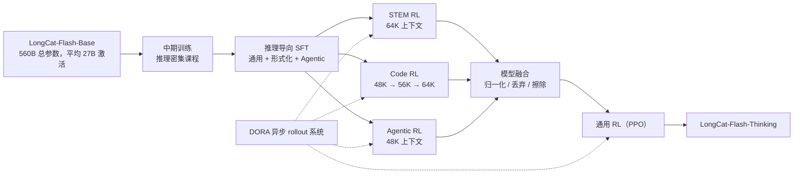
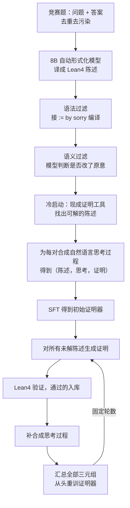
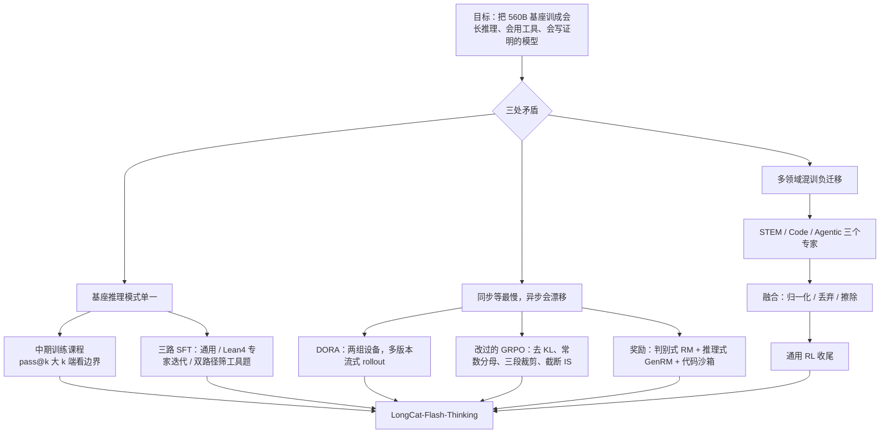

# LongCat-Flash-Thinking：三个领域分开练再合成一个，rollout 不再等最慢的那条

<!-- release-date: 2025-09-22 -->

> 本文依据美团 LongCat 团队的 **Introducing LongCat-Flash-Thinking: A Technical Report**，arXiv:2509.18883v2，2025-11-07 提交，共 24 页（正文 p. 1–17，作者名单 p. 18，参考文献 p. 19–22，附录 p. 23–24）。页码均指 PDF 自身的页码。文中区分三件事：**报告明确写了什么**、**我们怎么解释它**、**哪些是外部资料补充**。

## 阅读前先认识几个词

这份报告不讲新的模型结构，讲的是**怎样把一个训好的基座，用后训练变成会长篇推理、会调工具、会写形式化证明的模型**。先认识几个词：

- **长思维链（long Chain-of-Thought，long CoT）**：模型给答案前写出的几千到几万 Token 的推理，中间有试错、检查和改路。
- **冷启动（cold start）**：正式 RL 之前，先用高质量数据把模型教到一个像样的起点。
- **rollout 与策略版本**：RL 里让模型自己生成回答叫 rollout；模型每训一步就产生一个新的策略版本。
- **同步与异步 RL、陈旧度（staleness）**：同步是「一批回答全写完，再训一次」；异步是生成和训练各跑各的。异步的代价是训练用的样本可能来自几个版本之前的策略，落后几个版本就叫陈旧度。
- **GRPO（Group Relative Policy Optimization，组相对策略优化）**：对同一道题采一组回答，用组内平均分当基线，不再训练额外的价值模型。
- **pass@k**：同一道题采 $k$ 次，至少一次答对的概率。它衡量「有没有能力答对」，而不是「一次答对的概率」。
- **Lean4**：一种形式化证明系统，把数学命题写成程序，由编译器逐步检查证明是否严格成立。
- **任务向量（task vector）与模型融合**：微调后的权重减去微调前的权重叫任务向量；把几个任务向量按规则加回同一个起点，就是融合。

报告自己起的几个名字：

- **DORA（Dynamic ORchestration for Asynchronous rollout）**：美团的异步 RL 系统，让先写完的回答立刻往下走，同时让几个旧策略版本并存。
- **领域并行训练（domain-parallel training）**：STEM、代码、Agent 三个领域分别训出专家模型，再融成一个。
- **工具必要性（tool necessity）**：同一道题在「有工具」和「没工具」两种设定下各做一遍，通过率之差。

## 一句话先说清

LongCat-Flash-Thinking 是在 LongCat-Flash-Base 上做后训练得到的推理模型，560B 总参数、平均 27B 激活（PDF p. 2）。报告列的三项贡献是（PDF p. 2–3）：

1. **领域并行的 RL 训练与融合**：STEM、代码、Agent 三个领域解耦各训一个专家，再融成一个「接近帕累托最优」的模型。帕累托最优的意思是：找不到另一个模型能在某个领域更好、同时其他领域不变差；
2. **工业规模的 RL 基础设施 DORA**：异步架构比同步框架快三倍以上，在数万加速器上稳定训练；这一轮 RL 的投入接近预训练算力的 20%；
3. **更宽、更省的推理**：用工具把 AIME-25 的平均 Token 从 19,653 降到 6,965（少 64.5%），准确率基本不变；用 Lean4 专家迭代合成证明数据，形式化证明能力远超同类。

如果只记一句话：

> **RL 里互相打架的东西先拆开：领域拆开分别训，生成和训练拆开各自跑，每条回答从头到尾只用一个策略版本。拆完再用融合、重要性采样和陈旧度上限把它们接回来。**

## 先看全景：从基座到 Thinking 要走几步

据 PDF p. 2 Figure 2 上半部分与第 3.4 节重画。顺序以正文为准：先融合、再通用 RL（PDF p. 2、p. 11、p. 13）。Figure 2 的图注写成「a general RL stage followed by expert models fusion」，与图本身和正文的顺序相反，是图注笔误。

两大阶段、六个步骤，每一步的关键设定：

| 步骤 | 做什么 | 报告给出的关键设定 |
|---|---|---|
| 中期训练 | 往训练语料里注入推理密集数据 | 先在同架构小 MoE 上验证，pass@1 在 AIME-24 上提升 27.7（PDF p. 4） |
| 推理导向 SFT | 通用推理、形式化推理、Agentic 推理三路数据 | AdamW，学习率 3e-5，2 个 epoch，上下文 48K（PDF p. 7） |
| 领域并行 RL | STEM、代码、Agent 各训一个专家 | 上下文分别为 64K、48K–64K、48K（PDF p. 12–13） |
| 模型融合 | 三份任务向量合成一份 | 归一化 + DARE 式丢弃 + SCE 式擦除（PDF p. 13） |
| 通用 RL | 补通用能力、防安全回退 | 「最后一轮 PPO 训练」（PDF p. 13） |
| 系统底座 | DORA | 比同步快 3 倍以上；RL 算力接近预训练的 20%（PDF p. 3、p. 9） |

模型结构完全沿用 LongCat-Flash-Base。报告只用一句话提到零计算专家与快捷连接 MoE，说它们让模型「相比性能相当的模型有很大效率优势」（PDF p. 3）；机制本身见 LongCat-Flash 一篇。

## 第一层矛盾：推理 RL 有三处在打架

报告的每一个设计都对着一处矛盾：

1. **基座的推理模式太单一**。基座直接微调再做 RL，推理确实会涨，但模型常常产生同质化的推理模式，遇到难题不会深入反思（PDF p. 3）。原因在预训练语料：推理密集领域占比不足，显式的长思维链模式更是稀缺（PDF p. 4）。
2. **同步 RL 要等最慢的那条，异步 RL 又会漂移**。一批里只要有一条回答写到几万 Token，其他设备就得等；改成异步，训练用的样本又来自旧策略，推理引擎和训练引擎还算得不完全一样（PDF p. 7、p. 9–10）。
3. **多个领域混着训会负迁移**。各领域的回答长度差一个数量级，混在一起的 batch 分布不停跳动（PDF p. 12）。

冷启动对付第一处，DORA 和改过的 GRPO 对付第二处，领域并行与融合对付第三处。

## 第一阶段：冷启动，先把「会想」的潜力挖出来

### 中期训练：把推理课程排进预训练尾段

报告把中期训练改造成一个平衡过的课程，目标是把潜在的推理能力先激发出来，同时不损伤通用知识（PDF p. 4）。数据有两块：

- **STEM**：数学、物理、化学题，来自学术档案、教材和自有数据，强调竞赛级难度；优先保留需要多步推理的题，而不是靠事实检索就能答的；
- **算法编程**：从多个开源代码竞赛数据集汇总。

质量控制用启发式规则加 LLM-as-a-Judge 做过滤、去重、去污染；关键是仔细调推理数据与原有中期训练数据的混合比例（PDF p. 4）。附录补了细节（PDF p. 23）：规则去掉依赖外部信息或无法回答的题（URL、多表格、HTML/XML 标签）；合成答案先按规则去掉重复、截断、语言混杂和格式不合规的，再用模型加规则与标准答案比对等价性；标一小批数据训练神经打分器给每篇文档打难度分，低难度样本按比例降采样而不是全删。数据总量和混合比例的数值没有公开。

### 用 pass@k 看「推理边界」有没有被撑宽

报告没有在 560B 上做对照，而是先在一个**架构相同的小规模自有 MoE** 上做了预实验（PDF p. 4）。指标是 pass@k，用 Chen 等人的无偏估计：对一道题采 $N$ 个回答，其中 $C_x$ 个正确，随机抽 $k$ 个至少一个对的概率是（PDF p. 4，式 1）：

$$
\text{pass@}k = \mathbb{E}_{x \sim \mathcal{D}}\left[1 - \frac{\binom{N - C_x}{k}}{\binom{N}{k}}\right]
$$

分数线那一项是「抽到的 $k$ 个全错」的概率。用全部 $N$ 个样本算组合数，比真去抽 $k$ 次的估计方差小。

结果见 Figure 4（PDF p. 5）：在 AIME-24、BeyondAIME、LiveCodeBench（24.08–25.05）上，加了推理课程的模型从 pass@1 到 pass@128 的每个 $k$ 上都更高。正文给的 pass@1 提升是 AIME-24 27.7%、BeyondAIME 9.3%、LCB 6.5%（PDF p. 4）。从图上读两端：

| 基准 | pass@1 基线 → 增强 | pass@128 基线 → 增强 |
|---|---|---|
| AIME-24 | 约 0.10 → 0.38 | 约 0.47 → 0.87 |
| BeyondAIME | 约 0.05 → 0.15 | 约 0.45 → 0.60 |
| LiveCodeBench | 约 0.22 → 0.28 | 约 0.70 → 0.80 |

数值读自 PDF p. 5 Figure 4。对照图上的读数，正文那三个百分数是**绝对百分点**，不是相对提升，报告没有明说口径。

报告的解读是课程「有效拓宽了模型的推理边界」（PDF p. 4），并引用了 Yue 等人对推理边界的分析。按那条线索（外部补充）：RL 主要是把基座本来就能采到的正确解采得更频繁，大 $k$ 的 pass@k 衡量的正是基座能采到的边界。于是中期训练的作用可以这样理解：**在 RL 之前先把边界推出去，RL 再把边界内的正确解变成高概率。** 这是我们的解释，报告只说到「边界被拓宽」为止。

边界：这是小模型实验，模型规模没给，也没有在 560B 上重做对照。

### 推理导向 SFT：三种数据，三条流水线

中期训练之后是一段紧凑的 SFT，三路数据的合成流水线画在 Figure 3（PDF p. 3）。

#### 通用推理：先筛题，再拒绝采样

筛题三步（PDF p. 4–5）：LLM-as-a-Judge 去掉低质量或无法回答的题，代码题要求描述清楚、至少五个单元测试、有可执行的判题脚本；生成多样的回答做模型投票，剔除投票结果与标注答案不一致的题，这些题的标准答案可能本身就错了；除通用问答外，用专家模型的通过率估难度，通过率高于阈值的丢掉。回答用拒绝采样：以 LongCat-Flash-Chat 为主要生成器合成多个候选，规则加模型判断选最好的一条（PDF p. 5）。

附录按领域补了细节（PDF p. 23–24）：

| 领域 | 数据来源与处理 |
|---|---|
| STEM | 数十万条带可验证答案的题，覆盖数学、物理、化学、生物；多个推理模型各答一遍投票，剔除标准答案与投票不一致的 |
| 代码 | 主要来自开源竞赛数据；自建沙箱，所有推理模型都过不了全部测试的题剔除；小分类器标知识点与难度 |
| 逻辑 | 演绎、归纳、溯因三类，每类写生成器合成易中难三档的题；先用可验证奖励 RL 训一个小模型，再从它蒸馏长思维链 |
| 通用问答 | 单轮与多轮指令遵循，用反向生成保证回答满足全部约束；阅读理解、表格问答等常识题；安全上把查询分到 40 多个类别、五种回答方式，并专门优化「不过度拒答」 |

正文说代码题「至少五个单元测试」（PDF p. 5），附录写「多于 5 个」（PDF p. 23），两处差一个。

#### 形式化推理：让模型学会写 Lean4 证明

这是报告最有辨识度的一条流水线，因为大多数通用模型没有这项能力（PDF p. 3）。

任务定义（PDF p. 5）：自然语言题由问题 $x$ 和答案 $y$ 组成；自动形式化器 $\mathcal{I}_s$ 把它译成形式化陈述 $s = \mathcal{I}_s(x, y)$；模型生成证明 $\mathcal{P} = \pi_\theta(s)$；验证器给出 $\mathcal{V}(\mathcal{P}, s) \in \{\text{PASS}, \text{FAIL}\}$。报告做的是整证明生成：一次写出整份证明，不做逐步交互。

据 PDF p. 3 Figure 3 左下与 p. 5–6 正文重画。几处细节：

- **语法过滤**用的是按 Kimina-Prover 做法搭的 Lean4 服务器（v4.15）。`sorry` 在 Lean 里表示「证明先空着」，所以这一步只检查陈述本身能否编译（PDF p. 5）；
- **语义过滤**：报告发现自动形式化偶尔会改掉题目原意，于是再用模型判断形式化陈述与原题是否一致（PDF p. 5）；
- **证明器的起点**是经过中期训练的 LongCat-Flash-Base（PDF p. 6）；
- **专家迭代每轮都从头重训**，而不是接着训（PDF p. 6）。我们的理解是：每轮从同一起点、用全部数据重训，能避免多轮增量训练把早期偏差一层层累积；代价是每轮成本不随增量摊薄。报告没有解释这个选择。

为什么要给证明合成「思考过程」：Lean4 证明本身是形式语言，没有自然语言的推理痕迹；只用（陈述，证明）训练，模型学到的更像是照抄证明。加一段思考，让形式化证明也能走长思维链的路。这是我们的解释，报告只写了做法。

形式化陈述有多少条、迭代几轮、每轮解决率、8B 形式化器怎么训的，报告都没给。

#### Agentic 推理：只留「必须用工具」的题

矛盾（PDF p. 6）：现有工具数据集里，很多题不调工具也能答好。这种数据练不出真实的 Agent 行为。

**双路径评估**（PDF p. 6，式 2）：候选题来自 ToolBench、ToolLLM 等开源数据和自有数据，去重去污染后，让一个基线模型对每道题 $x$ 在「给工具」和「不给工具」两种设定下各生成 $N$ 条轨迹，由 LLM-as-a-Judge 算两边的通过率 $s_{\text{w/ tool}}(x)$ 与 $s_{\text{w/o tool}}(x)$。工具必要性定义为两者之差：

$$
v_x = s_{\text{w/ tool}}(x) - s_{\text{w/o tool}}(x)
$$

再用三个阈值筛题（PDF p. 6）：

$$
\{x \mid v_x > \tau_1 \wedge s_{\text{w/ tool}}(x) > \tau_2 \wedge s_{\text{w/o tool}}(x) < \tau_3\}
$$

三个条件各管一件事（我们的解读）：$\tau_1$ 保证工具带来的增益够大；$\tau_2$ 保证有工具时确实能解，否则采不到正例；$\tau_3$ 保证没工具时确实解不了，否则模型会学到「不用工具也行」。阈值取值没有公开。

**轨迹合成**（PDF p. 6）：搭一个含 MCP 服务器和模拟工具的环境；强生成模型为每道题产出多条候选轨迹；一组模型评审按正确性、逻辑一致性、工具使用完整性把关；最后按工具调用次数（单次或多轮）、依赖结构（串行或并行）、推理深度（查找、多跳、规划）分层，供课程学习用。

这一段的可迁移价值很高：**衡量「需不需要 X」最干净的方法，是让同一个模型在有 X 和没 X 两种条件下各做一遍，看差值。** 它不依赖人工标注，也不依赖模型的自我判断。同样的办法可以用来筛「需不需要检索」「需不需要长思考」。

### SFT 配方

三路数据的配比（PDF p. 23 Figure 10）：STEM 35%、代码 20%、通用问答 20%、Agent 14%、证明 8%、逻辑 3%。

配方细节（PDF p. 6–7）：严格去污染；为强化通用推理对 STEM 和代码上采样；按几个自定义的回答行为特征挑最终样本，包括平均回答长度、反思密度、查询聚类。训练在中期训练后的模型上做，AdamW，学习率 $3 \times 10^{-5}$，2 个 epoch，上下文 48K（PDF p. 7）。SFT 的总样本数没有公开。

## 核心设计一：DORA，让先写完的回答立刻往下走

报告对 RL 的定位很直接：它比 SFT 更省 Token、泛化更好，但训练不稳、对超参敏感、系统开销大（PDF p. 7）。解法分三层：系统层是 DORA，算法层是改过的 GRPO，奖励层是一套覆盖可验证与不可验证任务的奖励系统。先讲系统。

### 旧问题：调度会空转，生成会偏斜

RL 有好几个角色：生成回答的 Generator、被更新的 Actor、算参考概率的 Reference、打分的 Reward、估值的 Critic。报告指出两个老问题（PDF p. 7）：

- **调度**：分离架构（角色各用各的设备）因为阶段之间有依赖，总有设备在等；共卡架构（所有角色共用设备）不用等，但生成是访存受限、训练是算力受限，两种相反的负载绑在同一套硬件上，谁都跑不到最优；
- **生成偏斜**：同步训练里整个 batch 要等最长的那条回答。推理和 Agent 场景把它放大了。

已有的异步补丁是 partial rollout：把长回答切成几段，每段用当时最新的 Actor 生成、跨迭代拼起来。报告在实践中看到两个问题：换了新 Actor 后，被打断的样本要把已生成的部分重新 prefill 一遍；同一条回答混了多个策略版本，理论上会伤收敛（PDF p. 7）。这条路线的代表做法见 AReaL 一篇。

### 新设计：两组设备，多版本流式 rollout

DORA 的核心想法是：**让 Actor 的多个旧版本同时活着做流式 rollout，每条回答由同一个版本写到底**；再用角色的弹性共卡消除空转（PDF p. 8）。集群分成两组：

- **独立生成组（Standalone Generator Group）**：只做 Generator，是 Actor 的推理专用副本；
- **弹性角色组（Elastic Role Group）**：角色可以切换，既能当 Generator，也能跑 Reference & Actor、Reward & Critic 等训练角色。

一轮 RL 分三个阶段（PDF p. 8）：

1. **生成**：两组都开推理引擎做 rollout。推理实例最多保留「陈旧度」个数的策略版本；负载均衡控制器在各版本间重分资源并复用 KV cache；**写完的样本立刻流向下一阶段**；
2. **经验制作**：样本够训练条件后，弹性组缩减 Generator、启动其他角色，Reference & Actor 与 Reward & Critic 并行做推理。同时独立组**临时切到训练引擎重算 log 概率**，报告说这是把推理引擎与训练引擎的系统级不一致降到最小的关键一步；算完切回推理引擎，用之前的版本继续生成；
3. **训练**：Actor 与 Critic 在收集到的经验上训练，独立组继续生成不阻塞。某个版本满足淘汰规则后被删除。训练完成后，新权重用逐层点对点通信同步回 Generator。

图里要读出的是三件事同时发生。**流式**：先写完的先走，不等最长的那条。**多版本**：同一时刻有三种颜色在写，但每一行里的一条回答颜色不变。**弹性**：弹性组在一步之内从生成切到训练、再切回生成，而独立组从头到尾没停过。

被丢的 10、12 都是 θn−2 在写，这一点来自图的配色；图注只说它们「被丢弃并安排重新生成」（PDF p. 7）。按陈旧度 2 最多三个版本并存的规则，θn+1 一出现 θn−2 就出局，这是我们对配色的解读。

### 负载均衡：迁权重，也迁 KV cache

多版本并存带来新问题：各版本的样本数会失衡，旧版本的设备越来越闲。负载均衡控制器监控每台设备的负载，到阈值就重分资源，手段有两种：**权重迁移**（让一台设备换成另一个版本）和 **KV cache 迁移**（把正在写的样本连同 KV cache 搬到另一台设备）（PDF p. 8，Figure 6）。

Figure 6 的例子：均衡前两台跑版本 0、两台跑版本 1，其中样本 1、3、5 已写完。均衡时，版本 0 那台上没写完的样本 4 连同 KV cache 并到另一台版本 0 设备；腾出来的设备经权重迁移换成版本 1，接收从版本 1 设备迁来的样本 8 和新提示 10；空出位置的设备再接新提示 9、11。均衡后只剩一台跑版本 0，最旧版本占的设备越来越少，和陈旧度淘汰的方向一致。

### 报告总结的三个收益

（PDF p. 9）

1. **流式**：先写完的立刻进入后续阶段，不被最长的挡住；
2. **多版本**：每条回答由同一个 Actor 写到底，段与段之间不再不一致；被打断的样本可以直接复用 KV cache，在 prefill 占比高的场景里省下大量开销；
3. **弹性共卡**：除了进程内上下文切换与卸载这点时间，设备空转接近零；同时保留分离架构的好处，加速器的数量和类型都能按负载分配。

### 撑到数万卡的两处工程

（PDF p. 9）

- **大规模流式 RPC**：控制面建在 PyTorch RPC 上。给 TCPStore 加了分组键原语和初始化时的数据压缩，把通信复杂度从 $O(N^2)$ 降到 $O(N)$；运行时加了双向流式 RPC（PyTorch 原生只有一元 RPC），支撑推理引擎的流式 rollout；
- **大规模 MoE 并行**：生成用高度专家并行，既分摊计算，也让每张卡多出显存放长上下文的 KV cache。专家并行规模一大，主机侧 kernel 启动开销会导致执行不同步；改用图级编译降低 kernel 派发频率，并重叠通信与计算，rollout 比即时执行快 **1.5 倍**。

合起来：560B 的 LongCat-Flash 在数万加速器上比同步训练快 **3 倍以上**（PDF p. 9）。

### 代价与边界

- **陈旧度的账没有消失**，只是从系统层挪到了算法层；下一节全是在还它；
- **3 倍的分母没写**：对比的是哪套同步框架、绝对吞吐多少、流式 / 多版本 / 弹性三项各贡献多少，都没有；
- **被丢弃的样本白算了**，报告没有量化这类浪费；引擎切换和 KV cache 迁移的开销只说「可忽略」，没有数字；
- 加速器数量只有「数万」，训练时长与成本未公开。

## 核心设计二：把 GRPO 改到能吃异步数据

### 起点与两种漂移

报告从 GRPO 出发（PDF p. 9，式 3）。$\pi_\theta$ 是当前策略，$\pi_\mu$ 是生成样本的行为策略，对一道题采 $G$ 条回答：

$$
\mathcal{J}_{\mathrm{GRPO}}(\theta) = \mathbb{E}\left[\frac{1}{G}\sum_{i=1}^{G}\frac{1}{|y_i|}\sum_{t=1}^{|y_i|}\Big(\min\big(r_{i,t}(\theta)\hat{A}_{i,t},\ \mathrm{clip}_\varepsilon(r_{i,t}(\theta))\hat{A}_{i,t}\big) - \beta D_{\mathrm{KL}}[\pi_\theta \,\|\, \pi_{\mathrm{ref}}]\Big)\right]
$$

$r_{i,t}(\theta) = \pi_\theta / \pi_\mu$ 是第 $i$ 条回答第 $t$ 个 Token 的重要性比，$\mathrm{clip}_\varepsilon$ 把它截到 $[1-\varepsilon, 1+\varepsilon]$，$\hat{A}_{i,t}$ 是优势，$\pi_{\mathrm{ref}}$ 是 SFT 模型。这个目标默认「采样的策略与被优化的策略几乎一样」。

报告说，直接用到异步的复杂推理上，分布漂移会破坏收敛甚至快速崩溃。漂移有两个来源（PDF p. 9–10）：

1. **引擎数值差**：采样用 vLLM 这类高度优化的推理引擎，kernel 融合等优化不保证与训练引擎（如 Megatron）逐位一致；即使把推理引擎的采样概率当 $\pi_\mu$，后端不匹配累积的误差也会带来不稳定；
2. **策略陈旧**：每条样本可能来自多个旧版本，与正在优化的策略有差距。

报告还特别指出：**稀疏 MoE 让陈旧更严重**。不同版本的专家路由可能不同，同一个 Token 在两个版本下的概率会差很远；优势为负时，这会产生极大的重要性比和无界的方差（PDF p. 10）。

### 四处修改，各对一种病

（PDF p. 10）

1. **去掉 KL 项**。理由是默认的 $k_3$ 估计量期望无偏、梯度却有偏（引 Zang 2025 的博客）；去掉后也便于做幅度较大的策略更新；
2. **Token 级损失，分母用全局常数 $T_{\max}$**。沿 Liu 等人的做法，用训练中的最大生成长度这个常数当分母，缓解长度偏置。这样每个 Token 的权重既不随所在回答的长度变，也不随本 batch 的长短构成变。代价是回答普遍很短时有效梯度偏小，相当于隐式降低了学习率（我们的推断）；
3. **三段裁剪（triplet clipping）**。沿 DAPO（Yu 等，2025）与 Ye 等 2020 年的做法：$\epsilon_{\mathrm{neg}_{\mathrm{low}}}$ 与 $\epsilon_{\mathrm{neg}_{\mathrm{high}}}$ 约束负优势 Token 的重要性比，$\epsilon_{\mathrm{pos}_{\mathrm{high}}}$ 给正优势一个上界，作用是防崩溃、保住足够的熵；
4. **截断重要性采样**。引擎数值差会在训练中累积，于是用截断的重要性采样（Yao 等 2025；Ionides 2008）校正推理引擎与训练引擎的分布错配。

### 式 4：先看图，再读公式

为便于书写，下面把三个裁剪参数记为 $\varepsilon_{\mathrm{nl}}$、$\varepsilon_{\mathrm{nh}}$、$\varepsilon_{\mathrm{ph}}$。最终目标是（PDF p. 10，式 4；期望的下标 $x \sim \mathcal{D}$、$\{y_i\} \sim \pi_\mu$ 略去）：

$$
\mathcal{J}(\theta) = \mathbb{E}\left[\frac{1}{G \cdot T_{\max}}\sum_{i=1}^{G}\sum_{t=1}^{|y_i|}\min\big(r_{i,t}(\mu),\,C\big)\cdot\max\Big(\min\big(r_{i,t}(\theta)\hat{A}_{i,t},\ \mathrm{clip}(r_{i,t}(\theta),\,1-\varepsilon_{\mathrm{nl}},\,1+\varepsilon_{\mathrm{ph}})\hat{A}_{i,t}\big),\ \varepsilon_{\mathrm{nh}}\hat{A}_{i,t}\Big)\right]
$$

分三层读：

- **归一化** $\frac{1}{G \cdot T_{\max}}$：每个 Token 的权重是同一个常数；
- **引擎校正** $\min(r_{i,t}(\mu), C)$，其中 $r_{i,t}(\mu) = \pi_\mu^{\mathrm{train}} / \pi_\mu^{\mathrm{infer}}$：**同一个行为策略**，训练引擎算出的概率除以推理引擎算出的概率。两个引擎算得一样时它等于 1；截到 $C$ 是防个别 Token 上差异过大把梯度放大到失控。DORA 经验制作阶段「独立组切到训练引擎重算 log 概率」，算的正是这里的分子；
- **策略项**：内层是上下界不对称的 PPO 裁剪，正优势时起作用的是 $1+\varepsilon_{\mathrm{ph}}$，负优势时起作用的是 $1-\varepsilon_{\mathrm{nl}}$；外层的 $\max(\cdot, \varepsilon_{\mathrm{nh}}\hat{A})$ 是双重裁剪。优势为负、而当前策略反倒更偏爱这个 Token 时，$r$ 会很大，$r\hat{A}$ 是很大的负数；MoE 路由变化正会制造这种 Token。外层的 $\max$ 给它铺一层地板：$r$ 一旦超过 $\varepsilon_{\mathrm{nh}}$，这一项就变成常数，梯度归零。所以 $\varepsilon_{\mathrm{nh}}$ 不是一个「小 epsilon」，而是一个大于 1 的倍数。

一处要按意图读：式 4 把外层 $\max$ 写成了无条件的。若 $\varepsilon_{\mathrm{nh}} > 1 + \varepsilon_{\mathrm{ph}}$，按字面，正优势的 Token 会一律被外层选中常数项而失去梯度。结合正文「$\epsilon_{\mathrm{neg}_{\mathrm{high}}}$ 约束负优势」的说法，应理解为只对负优势生效。这是我们核对公式后的判断，报告没有说明。

### 三个训练策略

（PDF p. 10–11）

- **有放回的在线过滤**：流式生成阶段去掉准确率为 1 或 0 的提示，因为全对或全错的组内优势为零，不产生梯度。和 DAPO 动态采样的不放回不同，这里**有放回**，以保证每条数据至少被消费一次。异步场景下，陈旧度没超上限的提示直接复用，超了才重新生成；
- **陈旧度控制**：最大陈旧度是中断策略的一部分（就是上图丢弃 10、12 的那条规则）。在线过滤过采样的数据存进回放缓冲区，按预设的复用比例在后续迭代里与新样本混合，混合后的 batch 要打乱。报告承认这抬高了平均陈旧度，认为样本效率的收益值得；
- **不完整信号屏蔽**：打分出问题的样本（比如沙箱执行报错）不进损失，梯度略有偏但方差低；**写到长度上限、且没有被识别为重复**的样本也屏蔽，免得被截断的输出干扰损失。反过来读，被识别为陷入重复的截断样本不屏蔽、仍然吃负分，这是从措辞推出的，报告没有明说。

分组大小 $G$、各领域的 $T_{\max}$、三个裁剪参数、截断常数 $C$、最大陈旧度、复用比例、学习率与 batch 大小都没有公开。式 4 是一个可复现的**形状**，不是一份可复现的配置。

**可迁移的部分**：改目标函数之前，先列清系统里有几种漂移。引擎差用截断重要性采样，版本差用三段裁剪，长度差用常数分母；重要性比的两端都要设防，MoE 尤其需要大比值那一端的地板。

## 核心设计三：奖励系统，可验证的也交给会推理的裁判

（PDF p. 11）

**不可验证任务**（创意写作、知识问答）用判别式奖励模型：从 LongCat-Flash 的 SFT checkpoint 初始化，在人与模型联合标注的偏好数据上训练。对长思维链回答，**推理过程不作为输入**，奖励模型只看答案部分。

**可验证的 STEM 任务**不用规则匹配，而用**带推理过程的生成式奖励模型（GenRM）**：给定问题、参考答案和模型回答，先写推理再判对错。好处是能认出同义不同形的答案（报告的例子是 $a^2 - b^2$ 与 $(a+b)(a-b)$），能处理复杂表达式，判断带理由便于持续改进 GenRM 本身。人工标注测试集上的判断准确率（PDF p. 11，Table 1）：

| 奖励方式 | 判断准确率 |
|---|---:|
| 规则奖励 | 80.9% |
| 不带推理的 GenRM（直接输出对错） | 94.0% |
| 带推理的 GenRM（报告的方案） | 98.8% |

规则奖励约每五道判错一道，这些错判会直接变成 RL 的噪声。测试集规模、GenRM 的规模与训练细节没有公开。

**代码任务**用分布式沙箱集群验证，管理百万级并发的代码执行，支持 20 多种语言；为应对异步 RL 起伏的负载，用异步接口批量处理代码、不再轮询；一次编译多次运行；压缩与缓存分片保证传输与存储。

**验证器的吞吐是 RL 系统的一部分**：奖励算得慢，异步流水线再快也会在打分这一步堆积。

## 核心设计四：领域并行训练与模型融合

### 矛盾：混着训会负迁移

报告在大规模 RL 中观察到：多个领域混在一起的流水线，在异步训练下常出现负迁移，效率低、效果次优。原因被归结为训练 batch 之间显著的分布偏移，源头是各领域回答特征差别太大（PDF p. 12）。证据是 Figure 7 的长度分布：STEM 和代码的长尾一直拖到图的右边界 48K，Agent 工具使用和通用任务则集中在几千 Token 以内，峰值都在 2K 以内（读自 PDF p. 12 Figure 7）。

顺序训练（一次一个领域）能部分缓解，但报告说它低效且不灵活：后面的阶段一开始，就很难回头修早期领域的能力（PDF p. 12）。

为什么长度差异在**异步**训练下格外伤人，报告没有展开。我们的理解是两层：领域比例稍有波动，一个 batch 的梯度构成就大变；长回答写得慢、陈旧度天然更高，混着训等于把不同陈旧度的样本也混在了一起。两条都是推断。

于是先为各领域分别训专家，再融成一个，最后用一段通用 RL 收尾（PDF p. 12）。

### 每条赛道的数据与配置

RL 数据（PDF p. 12）：STEM 与代码先对已知基准去污染、去重；STEM 剔除多问、选择、判断这类格式；代码题的测试统一成标准输入输出。关键一步是**防奖励信号偏差**：用 SFT 模型对每题生成多条回答，只保留对错分布均衡的题，全对和全错的都去掉；代码题还用沙箱反馈剔除有歧义或测试对不上的题。Agent 专门整理了一批需要复杂推理与工具的数学题，每条是（题目、参考答案、评分细则）三元组。

各赛道的配置（PDF p. 12–13）：

| 赛道 | 上下文 | 课程与其他 |
|---|---|---|
| STEM RL | 固定 64K | 逐步调低「纳入训练」的通过率阈值，难度递增；动态调整裁剪上界 $\varepsilon_{\mathrm{ph}}$ 保稳定 |
| Code RL | 48K → 56K → 64K | 生成长度的第 90 百分位接近当前上限时扩窗 |
| Agentic RL | 固定 48K | 用 `<longcat_think>` 与 `<longcat_tool_call>` 标签的结构化对话模板；加一项工具调用格式奖励 |

Code RL 的扩窗规则很实用：不按步数定时扩，而是**看分布的尾巴碰没碰到天花板**。

Figure 2 下排画了四段 RL 的奖励与第 90 百分位回答长度随流式全局步数的变化（PDF p. 2）。读坐标轴：STEM RL 的长度轴在 30K–65K，Code RL 在 25K–55K，Agentic RL 在 8K–13K，General RL 在 4.4K–4.9K；奖励都在窄区间里剧烈波动。STEM 与 Code 的奖励有上行趋势，Agentic RL 的奖励与长度都在上行（长度约从 8.5K 涨到 13K），General RL 的奖励大体持平。这组图能支持的是「四段训练的长度尺度相差一个数量级」，这正是分开训的动机；它不是逐段的收敛证明，报告也没有给数值。

### 融合：归一化、丢弃、擦除

三个专家训完直接合并参数（PDF p. 13）。第 $i$ 个领域的任务向量是该领域 RL 后的权重减去共同起点：

$$
\tau_i = \theta^{i}_{\mathrm{RL}} - \theta_{\mathrm{SFT}}
$$

难点是参数干扰：三个向量在同一个参数上可能方向相反、大小悬殊。三步处理：

1. **归一化**：把各任务向量的幅度归一，平衡不同领域的贡献，否则更新幅度大的领域会盖过其他领域；
2. **丢弃**：类似 DARE，丢掉一部分冗余的增量参数；
3. **擦除**：受 SCE 启发，擦掉「少数方向」的参数更新。

一个最小的例子（我们构造的）：某个参数上 STEM 的增量是 $+0.8$，代码是 $+0.3$，Agent 是 $-0.4$。直接相加得 $+0.7$，多数方向被少数方向抵消掉一块；擦除少数方向后是 $+1.1$（再按归一化缩放），多数方向的信息完整保留。**融合永远有损，这三步是在选择损失落在谁头上。**

丢弃率、擦除阈值、归一化的具体方式没有公开，三步也没有各自的消融。

### 融合掉不掉分：Figure 8 与最终模型

报告用 Figure 8 证明融合几乎无损（PDF p. 13）。把最终模型（Table 2）放在一起看：

| 基准 | 领域专家 | 融合模型 | 最终模型 |
|---|---:|---:|---:|
| AIME-24 | 93.6（STEM） | 94.3 | 93.3 |
| AIME-25 | 90.8（STEM） | 90.8 | 90.6 |
| HMMT-25 | 84.8（STEM） | 85.4 | 83.7 |
| BeyondAIME | 70.8（STEM） | 71.2 | 69.5 |
| LiveCodeBench（24.08–25.05） | 78.0（Code） | 80.1 | 79.4 |
| τ²-Bench 平均 | 70.3（Agentic） | 70.6 | 74.0 |

前两列读自 PDF p. 13 Figure 8 的柱顶标注，第三列来自 PDF p. 14 Table 2（τ²-Bench 平均由三个子集 71.5、67.5、83.1 算得，与 Figure 1 的 74.0 一致）。

融合模型在六项上都不低于对应专家，LiveCodeBench 还高 2.1，这支持「接近帕累托最优」。第三列是我们补的对照：通用 RL 让四项数学各回落 0.2–1.7、LiveCodeBench 回落 0.7，τ²-Bench 平均则从 70.6 涨到 74.0。这符合通用 RL 的定位（广泛场景与对齐），但报告没有讨论这段回落，也没有说明 Figure 8 与 Table 2 是否用同一套评测配置。

### 通用 RL 收尾

最后一段的目标是提升创意写作、指令遵循等广泛场景的能力，并防止融合后安全等核心能力回退。数据来自开源与合成查询，用聚类去重并筛出高质量、有挑战的样本，然后做「最后一轮 PPO 训练」（PDF p. 13）。措辞是 PPO 而不是 GRPO，结合 DORA 里出现的 Critic 角色，这一段可能用了带 Critic 的 PPO；目标函数、奖励构成与数据量报告都没说。

### 代价与边界

- **没有「混合训练 vs 领域并行」的对照数字**，负迁移只有定性观察与长度分布图；
- **三个专家要三份 RL 算力**，算力怎么分没有说；
- **融合要求同一个起点**，三个专家都从同一个 SFT checkpoint 出发；MoE 的路由权重合并后专家负载会不会失衡，报告没有讨论；
- **通用 RL 之后数学小幅回落**，报告未提。

**可迁移的部分**：训练时分、部署时合。每条赛道用自己的上下文、课程和奖励，融合把它们收回一个模型；某个领域退化了只重训那一个专家。融合之后的收尾阶段要单独评测，它可能让专项能力小幅回落。

## 实验：哪些结论有证据，哪些要留问号

### 评测口径

八类评测：通用问答、对齐、数学、通用推理、代码、Agent 工具使用、形式化定理证明、安全；对比三个开放权重推理模型（DeepSeek-V3.1-Thinking、Qwen3-235B-A22B-Thinking-2507、GLM-4.5）和三个闭源模型（OpenAI-o3、Gemini2.5-Pro、GPT-5-Thinking）（PDF p. 13–15）。影响读数的几条（PDF p. 15）：

- 通用问答用**打分模型**判断语义是否一致，报告自己承认这会让分数略高于原始文档；
- AIME 与 HMMT 取 Mean@32，BeyondAIME 取 Mean@10，GPQA-Diamond 取 Mean@16，MATH-500、ZebraLogic、Sudoku-Bench、ARC-AGI 取 Mean@1；Sudoku-Bench 用 nikoli_100 子集；
- 代码全部测试通过才计 1 分，LiveCodeBench 取 2024-08 到 2025-05 的题；Agent 与代码用官方评测框架；
- MiniF2F-Test 共 244 题，证明通过 Lean4 服务器检查即算通过；
- 安全是四类**私有**测试集，经人工复核；VitaBench 是同团队自建的 Agent 基准；
- 推理参数 temperature 1.0、top-k 关闭、top-p 0.95；表中带 † 的分数取自外部报告。

### 主表

（PDF p. 14，Table 2；原表粗体与下划线标出第一、第二，这里不复制）

| 基准 | DeepSeek-V3.1-Thinking | Qwen3-235B-A22B-Thinking-2507 | GLM-4.5 | OpenAI-o3 | Gemini2.5-Pro | GPT-5-Thinking | LongCat-Flash-Thinking |
|---|---:|---:|---:|---:|---:|---:|---:|
| 总参数 / 激活参数 | 671B / 37B | 235B / 22B | 355B / 32B | – | – | – | 560B / 27B |
| MMLU-Pro | 84.4 | 84.4 | 81.5 | 85.3 | 86.7 | 84.5 | 82.6 |
| MMLU-Redux | 90.5 | 91.4 | 89.9 | 93.1 | 90.1 | 92.6 | 89.3 |
| IFEval（strict prompt） | 86.3 | 89.3 | 85.4 | 90.2 | 92.4 | 92.8 | 86.9 |
| Arena-Hard（hard prompt gemini） | 57.1 | 74.5 | 67.7 | 87.1 | 87.1 | 87.7 | 69.9 |
| MATH-500 | 98.8 | 99.6 | 95.4 | 98.4 | 98.0 | 99.2 | 99.2 |
| HMMT-25 | 80.4 | 83.8 | 76.3 | 71.9 | 79.3 | 84.8 | 83.7 |
| AIME-24 | 93.9 | 93.9 | 89.3 | 91.6† | 90.7 | 92.0 | 93.3 |
| AIME-25 | 87.9 | 92.5 | 85.5 | 88.9† | 89.2 | 94.6† | 90.6 |
| BeyondAIME | 71.8 | 71.5 | 66.0 | 63.2 | 63.0 | 70.0 | 69.5 |
| GPQA-Diamond | 84.2 | 80.4 | 78.3 | 81.9 | 84.0 | 84.4 | 81.5 |
| ZebraLogic | 96.1 | 97.5 | 90.9 | 94.3 | 92.4 | 92.7 | 95.5 |
| Sudoku-Bench | 1.0 | 2.0 | 1.0 | 70.0 | 0.0 | 63.0 | 56.0 |
| ARC-AGI | 37.5 | 45.3 | 21.4 | 47.3 | 46.8 | 59.0 | 50.3 |
| LiveCodeBench（24.08–25.05） | 73.5 | 75.4 | 61.1 | 76.2 | 74.2 | 80.6 | 79.4 |
| OJBench | 33.6 | 32.1 | 19.0 | 38.4 | 41.6 | 34.1 | 40.7 |
| SWE-Bench | 66.0† | 34.4 | 64.2† | 69.1† | 59.6† | 74.9† | 59.4 |
| BFCL V3 | 55.4 | 75.7 | 79.1 | 72.4† | 63.2 | 60.1 | 74.4 |
| τ²-Bench-Retail | 65.4 | 68.2 | 69.3 | 72.8 | 70.9 | 81.1† | 71.5 |
| τ²-Bench-Airline | 44.0 | 58.0 | 66.0 | 62.5 | 58.0 | 62.6† | 67.5 |
| τ²-Bench-Telecom | 23.7 | 47.3 | 56.1 | 67.5 | 38.3 | 96.7† | 83.1 |
| VitaBench | 13.5 | 21.5 | 26.8 | 35.3 | 24.3 | 29.3 | 29.5 |
| MiniF2F-Test pass@1 | 49.6 | 11.9 | 10.9 | 15.2 | 13.9 | 21.4 | 67.6 |
| MiniF2F-Test pass@8 | 74.4 | 20.9 | 22.1 | 29.6 | 29.4 | 39.7 | 79.4 |
| MiniF2F-Test pass@32 | 79.5 | 26.6 | 27.0 | 37.7 | 41.8 | 51.2 | 81.6 |
| 安全 Harmful | 79.2 | 84.3 | 70.4 | 64.8 | 44.3 | 56.8 | 93.7 |
| 安全 Criminal | 89.7 | 92.7 | 88.8 | 85.7 | 77.4 | 87.3 | 97.1 |
| 安全 Misinformation | 81.1 | 80.9 | 67.1 | 42.7 | 31.0 | 41.9 | 93.0 |
| 安全 Privacy | 96.2 | 100.0 | 97.6 | 100.0 | 95.0 | 98.8 | 98.8 |

### 逐类看：强在哪、弱在哪

报告的自我评价是「在一系列复杂推理任务上达到开源模型的最先进水平」（PDF p. 1）。逐类对表（名次是本文在七个模型里数的）：

- **通用问答与对齐是弱项**。MMLU-Pro 82.6、MMLU-Redux 89.3 在七个模型里分列第六、第七；IFEval 86.9 只高于 DeepSeek-V3.1 与 GLM-4.5；Arena-Hard 69.9 落后 Qwen3 的 74.5 和三个闭源模型的 87 以上。报告对这两类用的词是「有竞争力」（PDF p. 16），从数字看是实话；
- **数学是第一梯队，不是第一名**。HMMT-25 83.7 排第三（GPT-5 84.8、Qwen3 83.8）；AIME-24 93.3、AIME-25 90.6 都排第三；BeyondAIME 69.5 排第四。报告说它「超过 OpenAI-o3、与 Qwen3 和 GPT-5 相当」（PDF p. 16），前半句成立，后半句要看具体基准；
- **结构化谜题强，GPQA 偏弱**。ARC-AGI 50.3 仅次于 GPT-5 的 59.0；Sudoku-Bench 56.0 是开源模型里唯一超过 2 分的，但低于 o3 的 70.0 和 GPT-5 的 63.0；ZebraLogic 95.5 排第三。GPQA-Diamond 81.5 低于 DeepSeek-V3.1 和三个闭源模型；
- **代码是最硬的证据**。LiveCodeBench 79.4 是开源最高，仅次于 GPT-5 的 80.6；OJBench 40.7 仅次于 Gemini 的 41.6；
- **Agent 要分开看**。τ²-Bench-Airline 67.5 全表第一，Telecom 83.1 第二（GPT-5 的 96.7 取自外部），Retail 71.5 第三，VitaBench 29.5 第二。但 SWE-Bench 59.4 只高于 Qwen3 的 34.4（其余五个都取自外部报告），BFCL V3 74.4 排第三。「Agent 强」要限定在 τ²-Bench 这类对话式工具使用上；
- **形式化证明是压倒性优势**。MiniF2F-Test pass@1 67.6，第二名 DeepSeek-V3.1 是 49.6，差 18.0（PDF p. 17）；pass@8、pass@32 也都第一。这是 Lean4 专家迭代那条流水线的直接回报；
- **安全四类里三类第一**。Harmful 93.7、Criminal 97.1、Misinformation 93.0 远高于其他模型；Privacy 98.8 低于 Qwen3 与 o3 的 100.0。这是私有测试集，无法独立复现；闭源模型在 Misinformation 上只有 31.0–42.7，差距大到需要保留一个问号，测试集的构造可能对不同模型的拒答策略不公平，报告没有给样例。

更准确的说法是：**在代码、形式化证明、对话式工具使用、结构化谜题与安全上，它是开源模型里最强的；在通用知识、对齐、GPQA 和软件工程 Agent 上，它不是。**

### 用工具省 Token：Figure 9

Figure 9（PDF p. 16）横轴是 AIME-25 的平均 Token，纵轴是准确率。正文给的是：用工具后平均 Token 从 19,653 降到 6,965，少约 64.5%，准确率「保持」（PDF p. 16）。各点的读数：

| 模型 | 准确率 | 平均 Token |
|---|---:|---:|
| LongCat-Flash-Thinking（用工具） | 90.00 | 6,965 |
| GPT-5-Thinking | 94.60 | 约 7,100 |
| OpenAI o3 | 88.90 | 约 8,600 |
| DeepSeek V3.1-Thinking | 87.90 | 约 12,500 |
| LongCat-Flash-Thinking（不用工具） | 90.60 | 19,653 |
| Qwen3-235B-A22B-Thinking | 92.50 | 约 22,500 |
| GLM 4.5 | 85.50 | 约 23,000 |
| Gemini 2.5-Pro | 89.20 | 约 24,000 |

准确率是图上标注，两个精确 Token 数出自正文，其余 Token 数按点的横坐标估读。

两点要说清：「保持」严格说是从 90.6 降到 90.0；用工具后它进入了 GPT-5 与 o3 所在的低 Token 区域，但同一预算下 GPT-5 仍高 4.6。报告的结论是 Agent 系统能把部分推理步骤卸载给外部工具，高效地接近最先进水平（PDF p. 16），数据支持「高效」，「接近」要看和谁比。用的是什么工具、允许调几次、Token 数是否含工具返回，报告都没说。

首页 Figure 1（PDF p. 1）是 Table 2 中八项的柱状图汇总，数字与 Table 2 一致。

## 报告没有告诉我们的事

结论一节只重申三项贡献，没有列限制（PDF p. 17）。下面是对照正文归纳的缺口：

- **数据量**：中期训练的推理数据量与混合比例、SFT 各领域的绝对样本数（只有 STEM 的「数十万」与 Figure 10 的比例）、RL 各领域的题量；
- **小规模预实验**：那个同架构小 MoE 多大、训了多少 Token；
- **形式化流水线**：陈述条数、专家迭代轮数、每轮解决率、8B 形式化器的训练方式；
- **双路径筛选**：三个阈值、每题采样次数 $N$、用的基线模型；
- **RL 超参**：$G$、$T_{\max}$、三个裁剪参数、$C$、最大陈旧度、复用比例、学习率、batch 大小；
- **DORA 的账**：绝对吞吐、训练时长、成本、对比的同步框架、三项机制各自的贡献、丢弃样本比例、迁移开销；
- **领域并行的对照**：没有混合训练或顺序训练的分数；
- **融合超参**与三步各自的消融；
- **通用 RL**：只有一句「最后一轮 PPO」；
- **奖励模型**：判别式 RM 与 GenRM 的规模、GenRM 测试集大小；
- **私有基准**：VitaBench 与安全测试集无法独立复现；
- **口径**：Figure 8 与 Table 2 是否同一配置；通用 RL 后数学回落的原因。

## 最值得带回自己项目的八条

### 1. 先把边界推出去，再让 RL 收窄

做 RL 之前先看基座的大 $k$ pass@k 够不够高。中期训练把能采到的正确解变多，RL 再把它们变成高概率；边界不够，RL 再多也只在边界内打转。

### 2. 「需不需要 X」用对比测，不用标注

双路径筛选让同一个模型在有工具和没工具时各做 $N$ 遍，差值就是必要性。这个办法可以直接搬到「需不需要检索」「需不需要长思考」的数据筛选上。

### 3. 把验证器放进数据闭环

Lean4 服务器、代码沙箱、带推理的 GenRM，数据不是生成出来就算，而是验证通过才算。验证器的准确率（规则 80.9% 对 GenRM 98.8%）直接决定 RL 信号的信噪比。

### 4. 以「写完」驱动流水线，用多版本并存换每条样本一致

先写完的立刻往下走；不打断任何一条回答的策略版本，让旧版本把手头的活干完。代价是显存与陈旧度，收益是 KV cache 直接复用、目标函数不用处理「一条轨迹多个版本」。

### 5. 角色是状态，不是设备

弹性组在一步之内从生成切到训练再切回来。分离与共卡之外，还有「按阶段切换」这第三种选择。

### 6. 目标函数的每一处修改对应一种漂移

引擎差用截断重要性采样，版本差用三段裁剪，长度差用常数分母。先列清系统里有几种漂移，再决定改哪里。

### 7. 按分布的尾巴调课程

Code RL 看第 90 百分位长度碰没碰到上限再扩窗，STEM RL 把「纳入训练的通过率阈值」做成随训练拧的旋钮。课程不必事先切好几个数据包。

### 8. 训练时分、部署时合

领域并行让每条赛道用自己的上下文、课程与奖励；融合把它们收回一个模型。融合有损，收尾阶段还会让专项小幅回落，这两笔账都要摆出来评测。

## 用一张图重新串起全文

## 关键词回看

- **长思维链冷启动**：中期训练课程加推理导向 SFT，目标是激发潜力而不是教答案。
- **pass@k**：采 $k$ 次至少一次答对的概率；大 $k$ 端衡量推理边界。
- **自动形式化器**：把自然语言题译成 Lean4 陈述的 8B 模型；语法用 `sorry` 编译检查，语义用模型检查。
- **专家迭代**：证明器生成、Lean4 验证、通过的入库、从头重训，循环固定轮数。
- **工具必要性 $v_x$**：有工具与没工具两种设定下通过率之差，配三个阈值筛题。
- **DORA**：独立生成组 + 弹性角色组；生成、经验制作、训练三阶段；流式、多版本、弹性共卡。
- **陈旧度**：允许并存的旧策略版本数，超限的样本丢弃重生成。
- **$T_{\max}$ 分母**：用最大生成长度这个常数归一化 Token 级损失。
- **三段裁剪**：$\varepsilon_{\mathrm{nl}}$、$\varepsilon_{\mathrm{ph}}$ 是不对称的 PPO 裁剪，$\varepsilon_{\mathrm{nh}}$ 是负优势的双重裁剪地板。
- **截断重要性采样**：$\min(\pi_\mu^{\mathrm{train}} / \pi_\mu^{\mathrm{infer}}, C)$，校正两个引擎的数值差。
- **有放回在线过滤**：去掉全对与全错的题，且保证每题至少被消费一次。
- **GenRM**：先写推理再判对错的奖励模型。
- **任务向量与融合**：$\theta^{i}_{\mathrm{RL}} - \theta_{\mathrm{SFT}}$，靠归一化、丢弃、擦除处理干扰。

## 最后的判断

LongCat-Flash-Thinking 最有价值的地方，是它把后训练里几组天然打架的东西一一拆开，并且把「拆开之后怎么接回来」写得足够具体：领域拆开训，用任务向量融合；生成与训练拆开跑，用陈旧度上限和三段裁剪接住；推理引擎与训练引擎算得不一样，用截断重要性采样折算。每一处「接回来」都落在一个公式或规则上。

证据强度是分层的：

- **有直接数据支撑的**：中期训练撑宽 pass@k（Figure 4，小模型）；带推理的 GenRM 判得更准（Table 1）；融合不低于各专家（Figure 8）；代码、形式化证明、τ²-Bench 与安全上的领先（Table 2）；用工具省 64.5% Token（Figure 9）。
- **只有作者观察、没有对照的**：混合训练的负迁移、DORA 三项机制各自的贡献、「3 倍以上」的对比基线。
- **完全没公开的**：几乎所有数据量与 RL 超参、融合超参、加速器规模与成本。

还有几处要读者自己校准：Figure 2 的图注把融合与通用 RL 的顺序写反了；通用 RL 之后数学小幅回落；安全与 VitaBench 是私有基准；「与 GPT-5 相当」只在部分数学基准上成立。

如果只带走一句：

> **异步与并行省下的时间，都要用目标函数和融合规则还回去；先把要还的账列清楚，再决定拆多开。**

## 资料与阅读边界

**原始依据**

- 本地 `papers/Meituan/LongCat-Flash-Thinking.pdf`，即 [arXiv:2509.18883v2](https://arxiv.org/abs/2509.18883)（2025-11-07 提交，24 页）。arXiv 上只有 v1（2025-09-23）与 v2 两版，v2 即最新版。

**首发日证据**

- LongCat API 开放平台[更新日志](https://longcat.chat/platform/docs/zh/ChangeLog.html)在「版本：2025-09-22」下写明「LongCat-Flash-Thinking 发布」，正式发布并同步开源，可在 LongCat Chat 免费对话；美团官方新闻 [LongCat-Flash-Thinking 正式发布](https://www.meituan.com/news/NN250922124002165) 同日。`release-date` 取 **2025-09-22**，不取 arXiv v1 的 2025-09-23。

**外部补充（不是报告内容）**

- 官方仓库 [meituan-longcat/LongCat-Flash-Thinking](https://github.com/meituan-longcat/LongCat-Flash-Thinking) 的 README 写明激活参数随零计算专家在 18.6B–31.3B 之间变化（平均约 27B）、推理时用 `<longcat_tool_call>` 标签包工具调用。
- 同一更新日志记 2026-03-12 起 `model=LongCat-Flash-Thinking` 的请求自动切到续作 LongCat-Flash-Thinking-2601，续作见 LongCat-Flash-Thinking-2601 一篇。
- 推理边界的背景：[Does Reinforcement Learning Really Incentivize Reasoning Capacity in LLMs Beyond the Base Model?](https://arxiv.org/abs/2504.13837)（Yue 等，2025）。
- 报告引用的方法出处（按报告参考文献核对标题）：GRPO 出自 [DeepSeekMath](https://arxiv.org/abs/2402.03300)；三段裁剪与动态采样出自 [DAPO](https://arxiv.org/abs/2503.14476) 与 Ye 等 2020 年的双重裁剪 PPO；常数分母出自 [Understanding R1-Zero-Like Training](https://arxiv.org/abs/2503.20783)；DARE 出自 [Language Models are Super Mario](https://arxiv.org/abs/2311.03099)；SCE 出自 FuseChat（Wan 等，2024）；Lean4 服务器来自 [kimina-lean-server](https://github.com/project-numina/kimina-lean-server)。KL 项 $k_3$ 梯度有偏与截断重要性采样修正引擎差，分别出自 Zang 2025 和 Yao 等 2025 的博客，本文只转述报告对它们的引用。
- 本文中的推断与读数：Figure 4、Figure 7、Figure 9 与 Figure 2 下排的读数，pass@1 提升是绝对百分点的判断，式 4 外层 $\max$ 只对负优势生效的判断，丢弃样本对应 θn−2 的判断，Table 2 的名次，Figure 8 与 Table 2 的对照，都不是报告结论。
