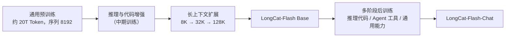
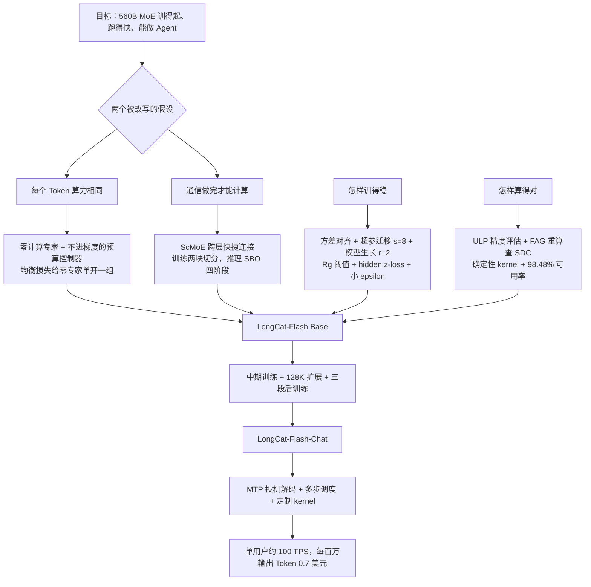

# LongCat-Flash：让每个 Token 自己决定花多少算力，再把通信等待藏进计算里

<!-- release-date: 2025-08-31 -->

> 本文依据美团 LongCat 团队的 **LongCat-Flash Technical Report**，arXiv:2509.01322v2，2025-09-19 提交，共 36 页（正文 p. 1–28，作者名单 p. 29，参考文献 p. 29–34，附录 p. 35–36）。页码均指 PDF 自身的页码。文中区分三件事：**报告明确写了什么**、**我们怎么解释它**、**哪些是外部资料补充**。

## 阅读前先认识几个词

- **混合专家（Mixture-of-Experts，MoE）**：把前馈网络（Feed-Forward Network，FFN）拆成很多个「专家」，每个 Token 只交给其中几个。总参数可以很大，每个 Token 真正用到的参数（激活参数）却很少。
- **路由器（Router）**：给每个专家打分、挑分数最高的 K 个的小网络。
- **专家并行（Expert Parallelism，EP）**：专家太多，一张卡放不下，就分散到很多卡上。每个 Token 要先被「派发」（dispatch）到专家所在的卡，算完再「收回」（combine），这两步都是跨卡通信。
- **多头潜在注意力（Multi-head Latent Attention，MLA）**：DeepSeek-V2 提出的注意力，把 Key 和 Value 压成一条短的潜向量再缓存。LongCat-Flash 直接沿用。
- **TPS 与 TPOT**：TPS 是每秒生成多少 Token；TPOT（Time-Per-Output-Token）是生成一个 Token 要多少毫秒。

这篇报告自己的新名字有三个：

- **零计算专家（Zero-Computation Experts）**：「什么都不算、把输入原样返回」的专家。路由器选中它，等于这个 Token 在这一层少算一个专家。
- **快捷连接 MoE（Shortcut-connected MoE，ScMoE）**：让 MoE 从层里第一个注意力的输出直接取输入，于是 MoE 的通信和主干上的稠密计算可以同时跑。
- **单批重叠（Single Batch Overlap，SBO）**：推理时在一个 batch 内部就把通信藏进计算，是 ScMoE 在推理侧的兑现。

## 一句话先说清

LongCat-Flash 是一个 560B 总参数的 MoE 语言模型，报告把它定位为**非思考（non-thinking）的基础模型**，主打效率与 Agent 能力（PDF p. 1）。它最值得记住的不是参数量，而是改写了 MoE 的两条默认规则：

1. **每个 Token 算力相同**：LongCat-Flash 让每个 Token 激活 18.6B 到 31.3B 不等的参数，平均约 27B，由路由器按上下文决定（PDF p. 1、p. 10）。
2. **通信做完计算才能开始**：LongCat-Flash 用一条跨层快捷连接，让稠密 FFN 与 MoE 的通信并排执行（PDF p. 8）。

外面再包一整套「训得稳、算得对、跑得快」的工程。报告给出的账单是（PDF p. 1、p. 4）：

- 30 天内训完 20T 以上 Token，训练可用率 98.48%；
- H800 上单用户超过 100 TPS，每百万输出 Token 0.7 美元。

如果只记一句话：

> **不是所有 Token 都值得同样多的计算，也不是所有通信都必须让计算干等。LongCat-Flash 把这两件事做进了架构，而不是留给事后的系统优化。**

## 先看全景：一层长什么样

和常见 MoE「一个注意力 + 一个 MoE」的层不同，LongCat-Flash 的每层有**两个 MLA、两个稠密 FFN 和一个 MoE**（PDF p. 5）。MoE 的输入不取自紧邻的前一步，而是抄近路取第一个 MLA 的输出。这两处改动分别是下面的核心设计一和二。

配置表（PDF p. 10）：

| 配置 | 数值 |
|---|---:|
| 层数（不含 MTP 层） | 28 |
| 隐藏维度 | 6144 |
| 注意力头数 × 每头维度 | 64 × 128 |
| MLA 的 KV 压缩维度 / Query 压缩维度 | 512 / 1536 |
| 稠密 FFN 中间维度 | 12288 |
| 每个 FFN 专家的中间维度 | 2048 |
| 每层 FFN 专家 / 零计算专家 | 512 / 256 |
| 每 Token 选中的专家数 K | 12 |
| 总参数 | 560B |
| 每 Token 激活参数 | 18.6B–31.3B，平均约 27B |
| 词表 | 131,072 |

注意「选中 12 个专家」不等于「激活 12 个 FFN 专家」：12 个名额里有几个被零计算专家占掉，由路由器对这个 Token 的判断决定。

训练全貌（PDF p. 10、p. 15）：

## 先讲矛盾：MoE 省算力的两个默认假设

### 假设一：每个 Token 花同样多的算力

传统 Top-K 路由给每个 Token 都分 K 个专家。预测一个逗号和预测一道数学题的最后一步，花的算力一模一样。

报告用投机解码作旁证：小草稿模型能稳定猜中大模型在大多数「简单」Token 上的输出，说明那些位置不需要大模型的全部算力（PDF p. 5）。

### 假设二：通信做完，计算才能开始

专家并行下，一个 MoE 层的顺序是固定的：dispatch 通信 → 专家计算 → combine 通信。计算依赖通信的结果，通信期间计算单元只能干等（PDF p. 8）。

共享专家架构可以在通信时先算共享专家，但共享专家只有一个，能遮住的通信很少（PDF p. 8）。

LongCat-Flash 对这两个假设各给了一个架构层面的回答。

## 核心设计一：零计算专家，让路由器替每个 Token 做算力预算

### 新设计：把「不做」也做成一个专家

每层在 512 个 FFN 专家之外，再放 256 个零计算专家，它们的输出就是输入本身，不做任何矩阵乘法（PDF p. 5–6）。路由器照常选 Top-12：12 个名额里有 4 个落在零计算专家上，这个 Token 在这一层就只跑 8 个 FFN 专家。「激活多少参数」从一个超参数变成了路由器的输出。零计算专家的思路出自 MoE++ 与 AdaMoE（PDF p. 5 引文）。

MoE 模块写成（PDF p. 6，式 1）：

$$
\mathrm{MoE}(x_t)=\sum_{i=1}^{N+Z} g_i\,E_i(x_t)
$$

$$
g_i=
\begin{cases}
R(x_t)_i, & R(x_t)_i \in \mathrm{TopK}\big(R(x_t)_i + b_i,\ K\big)\\
0, & \text{否则}
\end{cases}
\qquad
E_i(x_t)=
\begin{cases}
\mathrm{FFN}_i(x_t), & 1\le i\le N\\
x_t, & N<i\le N+Z
\end{cases}
$$

- $x_t$：第 $t$ 个 Token 进 MoE 时的隐状态；$N=512$，$Z=256$，$K=12$；
- $R$：softmax 路由器；$b_i$：第 $i$ 个专家的偏置。

一个细节：**选谁用 $R(x_t)_i+b_i$，加权用不含偏置的 $R(x_t)_i$**。偏置只改排名，不改权重。这与 DeepSeek-V3 的无辅助损失负载均衡同源，报告说它是在那条策略的偏置机制上改出来的（PDF p. 6）。

### 旧问题：模型不会自己学会省算力

直觉上，模型应该自己学会「简单 Token 走零计算专家」。报告说事实相反：不加约束时，模型倾向于少用零计算专家（PDF p. 6）。从语言模型损失看，多算一个专家几乎总是不亏，路由器没有动机把名额让给一个什么都不做的专家。所以必须从外面给它一个预算。

### 预算控制器：一个不进梯度的偏置更新

每步给 FFN 专家的偏置加一个增量（PDF p. 6，式 2）：

$$
\Delta b_i=
\begin{cases}
\mu\left(\dfrac{K_e}{K}\cdot\dfrac{1}{N}-\dfrac{T_i}{K\,T_{\mathrm{all}}}\right), & 1\le i\le N\\[8pt]
0, & N<i\le N+Z
\end{cases}
$$

- $\mu$：调整速率；$T_{\mathrm{all}}$：全局 batch 的 Token 总数；$T_i$：路由到第 $i$ 个专家的 Token 数；
- $K_e$：期望每个 Token 平均激活的 FFN 专家数，小于 $K$。

括号里前一项是「FFN 专家总共被用 $K_e$ 次时，第 $i$ 个应占的份额」，后一项是「它实际占的份额」。用多了偏置降，用少了偏置升。

报告没有直接写 $K_e$ 的值，但 Figure 3b 的均值稳在 8、对应约 27B 激活（PDF p. 6 图注），所以 $K_e=8$ 是本文据此的推断。

三点值得记住：

1. 这条更新**完全不进语言模型的梯度**（PDF p. 6）；
2. 目标不是「每个专家一样忙」，而是「FFN 专家的总用量落在 $K_e$」，所以它顺带管住了零计算专家的份额。零计算专家自己不更新偏置：它们彼此没有区别，只需要一个总量约束，而所有 FFN 专家达到各自份额时这个约束自动满足（PDF p. 7）；
3. 报告称它是一个 PID 控制器，并说相比无辅助损失策略里的固定步长增量，专家数变多时 softmax 路由的概率分布更稳（PDF p. 6–7）。式 2 显式写出的只有比例项，偏置逐步累加相当于对误差积分；这是我们的读法，不影响用法。

经验上，大 batch 和对 $\mu$ 做衰减让预算控制更稳，小 batch 可能要降低更新频率（PDF p. 7）。

### 负载均衡损失也要给零计算专家留位置

式 2 管的是语料级的均衡。为了防止单个序列里极端不均衡拖垮某个 EP 组，报告另加一条设备级均衡损失（出自 DeepSeek-V3），并改造它以容纳零计算专家（PDF p. 7，式 3–5）。把 $N$ 个 FFN 专家分成 $D$ 组：

$$
\mathcal{L}_{\mathrm{LB}}=\alpha\sum_{j=1}^{D+1} f_j P_j,
\qquad
P_j=\frac{1}{T}\sum_{i\in\mathrm{Group}_j}\sum_{t=1}^{T}R(x_t)_i
$$

$$
f_j=
\begin{cases}
\dfrac{D}{K_e T}\displaystyle\sum_{t=1}^{T}\mathbb{I}(\text{token } t \text{ 选中 Group}_j), & 1\le j\le D\\[10pt]
\dfrac{1}{(K-K_e)T}\displaystyle\sum_{t=1}^{T}\mathbb{I}(\text{token } t \text{ 选中零计算专家}), & j=D+1
\end{cases}
$$

$T$ 是一个 micro batch 的 Token 数。关键是第 $D+1$ 组：**所有零计算专家单独成一组**，频率的归一化分母用 $K-K_e$，FFN 组用 $K_e$。损失收敛时，FFN 专家与零计算专家的使用比趋向 $K_e:(K-K_e)$（PDF p. 7），按 $K_e=8$ 就是 8:4。

### 收益：同样平均算力下 loss 更低

对照实验（PDF p. 6，Figure 3a）：

| 配置 | Top-K | 每 Token 激活参数 | 平均 FFN 专家数 |
|---|---:|---|---:|
| 基线 | 8 | 固定 6B | 8 |
| 加零计算专家 | 12 | 动态 4.2B–7.0B | 8（波动小于 1%） |

两者平均算力相同。加零计算专家那条验证 loss 在约 500B Token 的训练里全程略低，读图差距约 0.01 量级；报告没给具体差值（读自 PDF p. 6 Figure 3a）。

这个实验的设计值得学：它比较的是「**同样平均算力下，固定分配对动态分配**」，而不是「加不加零专家」。否则收益分不清来自动态性还是来自 Top-K 变大。

### 正式训练里真的学会了按需分配吗

LongCat-Flash 训练中每个 Token 激活的 FFN 专家数（PDF p. 6–7，Figure 3b、3c）：

- 均值经过约 20B Token 的调整后收敛到期望值，所有层的波动小于 1%；
- 标准差一直很高。图注说它「增长到 3」，从图上读，曲线末端在 2.4–2.5 附近，仍在缓慢上升。

均值稳、标准差大，就是「预算被控住、分配却不均匀」。附录给了按评测集统计的平均激活数（PDF p. 35，Figure 11）：

| 评测集 | GSM8K | CMMLU | MATH | HumanEval | MBPP | MMLU |
|---|---:|---:|---:|---:|---:|---:|
| 平均激活 FFN 专家数 | 7.46 | 7.71 | 8.03 | 8.13 | 8.24 | 8.32 |

报告的概括是「英文 Token 比中文和数学 Token 分到更多算力」（PDF p. 35）。但表里 MATH 是 8.03，并不低；这句概括在 GSM8K 与 CMMLU 上成立，在 MATH 上不明显。

逐 Token 看（PDF p. 35–36，Table 8）：第一层里冠词、连词、介词这类功能词以及数字、标点稳定地拿到较少算力；第 28 层的分配不如第一层那么专门，但仍有模式，例如中文里标点前的 Token 往往少算。报告据此**假设**浅层按 Token 自身语义分配、深层按预测难度分配（PDF p. 35）。这是观察加猜想，没有消融。

### 一笔参数账：18.6B、27B、31.3B 从哪来

报告只给了三个数（PDF p. 10）。用配置表可以反推它们，这是本文的推算：

- FFN 专家若是 SwiGLU 结构，有三个 $6144\times 2048$ 矩阵，约 37.7M 参数；28 层叠起来，一个「名额」约 1.06B；
- $31.3-18.6=12.7\mathrm{B}$，正好是 $12\times 1.06$；
- 所以 18.6B 是「12 个名额全给零计算专家」时的固定部分（两个 MLA、两个稠密 FFN、嵌入等），31.3B 是「全给 FFN 专家」；
- 平均 8 个：$18.6+8\times 1.06\approx 27.1\mathrm{B}$；
- 专家总量 $512\times 28\times 37.7\mathrm{M}\approx 541\mathrm{B}$，加上约 18.6B 的固定部分约 560B。

四个数互相吻合。它提醒读者：**动态激活只动 FFN 专家这一块，注意力与稠密 FFN 是每个 Token 都要付的固定成本**，约占平均激活的三分之二。

### 代价与边界

- **推理系统要认识零计算专家**：部署时 DeepEP 与 EPLB 都被改过，让零计算专家的输出不需要通信（PDF p. 26）。复用这个设计的人要在推理框架里补同样的特判。
- **收益的直接证据来自 6B 激活的对照**，560B 上只有「均值收敛、标准差大」的间接证据。
- 动态激活让 batch 内每个 Token 的计算量不同，负载更不齐；训练侧靠均衡损失、推理侧靠 EPLB 兜底，报告没有量化额外的不均衡。

### 可迁移启发

- **给「不做」一个显式选项，比让模型学会「少做」容易**。但路由器天然倾向用满，需要一个不进梯度的控制器从外面设总量。
- **控制目标写成比例**：「实际份额减期望份额」让同一条规则同时管住均衡与预算。
- **对照实验固定平均算力**，否则动态分配的收益与「多选几个专家」的收益分不开。

## 核心设计二：ScMoE，把稠密 FFN 挪到通信旁边

### 新设计：让稠密 FFN 与 MoE 并排，而不是串联

报告说团队最初的架构是 MoE 与稠密 FFN 交错排布，性能与共享专家模型相当（PDF p. 7–8）；在此基础上引入 ScMoE（Cai 等，2024，出处见文末）：一条跨层快捷连接改变了执行顺序，**让上一块的稠密 FFN 与当前 MoE 层的 dispatch / combine 并行执行**，重叠窗口比共享专家大得多（PDF p. 8）。

关键在依赖关系。MoE 只依赖第一个 MLA 的输出，所以 dispatch 在第一个 MLA 算完那一刻就能发出；而主干上还剩「稠密 FFN → 第二个 MLA → 稠密 FFN」一整段不依赖通信结果的计算。这一整段就是通信可以躲进去的窗口。

训练侧还把 MoE 层沿 Token 维切成两个 chunk：一块的 dispatch 到了先算这一块，另一块还在路上；一块算完立刻 combine，同时算另一块（PDF p. 22）。于是两块之间互相遮，稠密 FFN 再遮第一块 dispatch。上图 (c) 就是这个状态。

### 收益一：质量中性

报告在三组规模与三种注意力上做了带与不带 ScMoE 的对照，训练 loss 曲线几乎重合（PDF p. 7–8，Figure 4）：

| 组 | 激活 / 总参数 | 注意力 | 训练步数 |
|---|---|---|---|
| a | 2.4B / 16B | MLA | 约 85K 步 |
| b | 3B / 20B | MHA | 约 85K 步 |
| c | 15B / 193B | GQA | 约 85K 步 |

（步数读自图的横轴。）报告的结论是 ScMoE 对质量中性，其收益与规模、注意力类型正交（PDF p. 8）。要保留的谨慎：比较的是训练 loss 不是下游任务；最大到 193B 总参数，560B 本身没有不带 ScMoE 的对照。

### 收益二：训练里暴露的通信从 25.3% 降到 8.4%

训练用的不是原生 all-to-all，而是带流水的 all-gather / reduce-scatter kernel。原因有两个：原生 all-to-all 会把本地数据放大 top-k 倍再走每卡 200Gb/s 的 RDMA 网络；它的拥塞控制不足，性能不稳（PDF p. 22）。在这套通信方案下，加上 ScMoE 后，**不能被计算遮住的 dispatch / combine 时间占比从 25.3% 降到 8.4%**（PDF p. 22）。

### 收益三：推理侧理论 TPOT 降近一半

报告说 ScMoE 让推理可以用 SBO 流水，理论 TPOT 比 DeepSeek-V3 这类模型低近 50%；而且稠密 FFN 上的张量并行通信走节点内 NVLink，专家并行通信走节点间 RDMA，两张网可以同时跑满（PDF p. 8）。具体见推理一节。

### 代价与边界

- **每层多出一个 MLA 和两个稠密 FFN**，这是每个 Token 都要跑的固定成本，前面参数账里的 18.6B 正是这么来的。报告在推理分析里也承认，LongCat-Flash 有一个遮不住的 MLA，同 batch 下每层比 DeepSeek-V3 略慢，靠层数少（28 对 61）把总延迟压下来（PDF p. 28）。
- 通信能不能被遮住，取决于稠密计算够不够多。稠密 FFN 中间维 12288 是隐藏维度的 2 倍（PDF p. 10），这个比例是否最优，报告没有讨论。
- ScMoE 是已有工作，报告的贡献是把它做到 560B 规模，并给出不同规模、不同注意力上的中性证据。

### 可迁移启发

- **重叠窗口的大小由数据依赖决定，不由调度技巧决定**。想遮住通信，先找一段不依赖通信结果的计算；没有，就在架构上造一段。
- 切 chunk 让通信与计算互相遮是通用手法；ScMoE 的特别之处是让第一块通信也有东西可遮。

## 核心设计三：方差对齐，让小模型上好用的设计放大后不失灵

报告观察到，小模型上表现好的架构选择放大后可能变差，反之亦然；他们把原因归到特定模块在初始化时的**方差失配**（PDF p. 8）。两处修正分别针对 MLA 与细粒度专家。

### MLA 的尺度修正

MLA 的 Query 与 Key 各有两部分：从低秩压缩向量恢复的 $q^C$、$k^C$，和带旋转位置编码的 $q^R$、$k^R$。LongCat-Flash 在两条压缩向量上各乘一个系数（PDF p. 8，式 6）：

$$
c^Q_t=\alpha_q\,W^{DQ}h_t,\qquad c^{KV}_t=\alpha_{kv}\,W^{DKV}h_t
$$

问题在于初始化时各分量的方差来源不同（PDF p. 9）：$q^C$、$q^R$ 的方差正比于 Query 压缩维度 $d_q$，$k^C$ 正比于 KV 压缩维度 $d_{kv}$，而 $k^R$ 直接从 $h_t$ 算，正比于模型维度 $d_{\mathrm{model}}$。三种维度混在一个点积里，改一个维度，注意力分数的尺度就变。修正是把低秩路径都缩放到以 $d_{\mathrm{model}}$ 为参考（PDF p. 9，式 7）：

$$
\alpha_q=\sqrt{\frac{d_{\mathrm{model}}}{d_q}},\qquad \alpha_{kv}=\sqrt{\frac{d_{\mathrm{model}}}{d_{kv}}}
$$

代入配置，$\alpha_q=\sqrt{6144/1536}=2$，$\alpha_{kv}=\sqrt{6144/512}\approx 3.46$（本文代入，报告没写这两个值；报告只说正式模型按该方法设置缩放系数，PDF p. 10）。在一个 1B 激活的 MoE 上，加修正后 loss 更低，读图 16K 步附近约低 0.02–0.03（PDF p. 9，Figure 5a）。

### 细粒度专家的初始化补偿

LongCat-Flash 沿用 DeepSeekMoE 的细粒度专家，把每个专家切成 $m$ 个更小的专家。报告发现这个设计对专家数、top-k、$m$ 等选择很敏感，原因是切分让 MoE 输出在初始化时的方差变小了（PDF p. 9）。补偿是给专家加权和整体乘一个 $\gamma$（PDF p. 9，式 8）：

$$
\mathrm{MoE}(x_t)=\gamma\left(\sum_{i=1}^{mN}g_i\cdot E_i(x_t)\right)
$$

$\gamma$ 来自两个各缩小 $m$ 倍的效应（PDF p. 9）：

1. **门控稀释**：专家从 $N$ 个变成 $mN$ 个，softmax 概率摊给更多专家，单个 $g_i$ 约小 $m$ 倍，输出方差约小 $m$ 倍；
2. **维度缩减**：每个细专家的中间维度小 $m$ 倍，单专家输出方差也约小 $m$ 倍。

报告据此取 $\gamma=\sqrt{m\cdot m}=m$，用来把切分后的输出方差补回切分前的水平（PDF p. 9）。这一节只有推导，没有单独的实验图。

### 可迁移启发

**每引入一个改变维度或专家数的设计，就问一次「初始化时的方差还对不对」**。方差对齐不能替代消融，但它让小模型上的结论更可能在大模型上成立，这是下一节「用小模型定超参」能成立的前提。

## 分词器与 MTP

分词器是 BPE，词表 131,072，沿用 GPT-4 的预分词框架，改了两处：加强中日韩字符切分；数字独立切分以帮助数学（PDF p. 10）。

多 Token 预测（Multi-Token Prediction，MTP）保留为辅助训练目标，用途是推理时做投机解码的草稿（PDF p. 10）：

- MTP 头用**单个稠密层**而不是 MoE 层；
- MTP loss 收敛很快，所以不从头训，而是在训练流程中途才引入。第 2.4 节说「训练流程中段」（PDF p. 10），第 6.1.2 节说「预训练后期」（PDF p. 24），两处说法不完全一致，都没给具体 Token 数；
- 评测中接受率超过 90%（PDF p. 10）。

## 训练策略：怎样把一个 560B 模型训得稳

目标只有一个：**不在大模型上做昂贵的试错**。

### 超参迁移：在 768 宽的代理模型上搜，按规则迁到 6144

大模型的学习率与初始化方差不能在大模型上搜。LongCat-Flash 按宽度缩放做超参迁移：先在小代理模型上找最优值，再按理论规则迁到目标模型（PDF p. 10）。宽度缩放因子 $s=n_{\mathrm{target}}/n_{\mathrm{proxy}}$，$n$ 是隐藏维度。报告采用 Everett 等人的「Adam LR Full Align」规则，针对标准参数化（PDF p. 10，Table 1）：

| 层与参数 | 目标模型设置 |
|---|---|
| 嵌入层初始化方差 | $\sigma^2_{\mathrm{target}}=\sigma^2_{\mathrm{proxy}}$ |
| 嵌入层学习率 | $\eta_{\mathrm{target}}=\eta_{\mathrm{proxy}}$ |
| 隐藏层与输出层初始化方差 | $\sigma^2_{\mathrm{target}}=\sigma^2_{\mathrm{proxy}}/s$ |
| 隐藏层与输出层学习率 | $\eta_{\mathrm{target}}=\eta_{\mathrm{proxy}}/s$ |

实际步骤（PDF p. 11）：取 $s=8$，代理模型宽度 768（$768\times 8=6144$）；在代理模型上做完整的逐层初始化方差与学习率搜索；按上表迁移，深度、稀疏度、batch size 不变。

报告说这显著降低了找超参的成本（PDF p. 11），但没有公开搜出的具体值，也没有「迁移结果与直接在大模型上搜差多少」的验证数据。读者拿到的是方法，拿不到数字。

### 模型生长：先训 14 层，再叠成 28 层

初始化不用随机，而是用层堆叠从「半尺寸」模型生长（PDF p. 11）：

$$
L_{\mathrm{small}}=l_1\circ l_2\circ\cdots\circ l_n,\qquad
L_{\mathrm{target}}=\underbrace{L_{\mathrm{small}}\circ\cdots\circ L_{\mathrm{small}}}_{r}
$$

$l_i$ 是小模型第 $i$ 层的变换，$r$ 是扩展倍数，LongCat-Flash 取 $r=2$。具体做法：先随机初始化训一个 14 层、结构与目标相同的模型，在数据的起始段上训数百亿 Token；再把它叠成 28 层，**保留全部训练状态**，包括样本计数器与学习率调度（PDF p. 11）。

报告说生长初始化有一条特征曲线：loss 先上升，然后加速收敛，最终优于随机初始化（PDF p. 11）。Figure 5b（6B 激活的对照，PDF p. 9）从约 4K 步画起，看不到上升段；生长版全程略低，差距在约 9K 步后更明显，末端约 0.56 对 0.57。报告给了两个**猜想**：小模型收敛快，给大模型更好的起点；生长操作可能起隐式正则的作用，防止参数塌缩（PDF p. 11）。还有一条实用警告：前身模型训过头，反而伤害目标模型的 Token 效率，生长时机要拿捏（PDF p. 11）。

### 稳定性：路由、激活、优化器三处

**路由稳定：给均衡损失的系数一个可测的上限。** 路由器同时受两股梯度拉扯：语言模型损失推动专家分工，均衡损失推动路由均匀。均衡梯度占上风时，各专家的路由权重趋同，路由变得与输入无关（PDF p. 11）。报告提出两个监控指标（PDF p. 12）：

- **路由权重相似度**：各专家路由权重向量两两余弦相似度的平均。高，就是均衡损失过强；
- **梯度范数比** $R_g$：两条损失对 batch 平均专家概率向量 $\vec P$ 的梯度范数之比（式 9）：

$$
R_g=\frac{\lVert\alpha\nabla_{\vec P}\mathcal{L}_{\mathrm{LB}}\rVert_2}{\lVert\nabla_{\vec P}\mathcal{L}_{\mathrm{LM}}\rVert_2}
$$

其中 $\mathcal{L}_{\mathrm{LB}}$ 不含系数 $\alpha$。准则是让均衡项只当正则，建议选 $\alpha$ 使 $R_g$ 低于一个小阈值，例如 $R_g<0.1$（PDF p. 12）。它把「$\alpha$ 取多大」从经验数字变成了可测量的目标，换规模也能沿用。

**激活稳定：hidden z-loss。** 训练中会出现「巨大激活」，个别隐状态元素的量级远超其他；报告观察到它与严重的 loss 尖峰相关（PDF p. 12）。受 ST-MoE 的 router z-loss 启发，报告在最后一层输出（最终 LayerNorm 之前）上加了一项（PDF p. 12，式 10）：

$$
\mathcal{L}_Z=\frac{\lambda}{T}\sum_{t=1}^{T}\left(\log\sum_{i=1}^{|z_t|}\exp\big(\mathrm{abs}(z_t^i)\big)\right)^2
$$

$z_t$ 是第 $t$ 个 Token 的最后一层输出，$|z_t|$ 是隐藏维度。$\log\sum\exp$ 近似「最大的那个绝对值」，平方后只有极大的元素贡献显著，所以它专打离群值。

Figure 6 是一个超参不佳的小模型（PDF p. 12）：不加时最后一层隐状态的 L2 范数从约 $10^2$ 升到 $10^4$–$10^5$，在约 21K 步冲到 $10^7$，同时训练 loss 冲到约 10；加系数 $10^{-7}$ 的 hidden z-loss 后范数稳在 $10^2$ 量级，loss 曲线没有变差（读自图，系数来自图例）。报告称这降低了 BF16 训练中数值出错的风险。

**优化器稳定：Adam 的 epsilon 不是可忽略的常数。** 模型越大，初始化越小、batch 越大，梯度二阶矩就越小；$\epsilon$ 与它量级相当时，Adam 的自适应就被破坏了（PDF p. 12）。报告在 390K 到 400M 参数的一组模型上扫 $\epsilon$（PDF p. 13，Figure 7）：

- **阈值效应**：$\epsilon$ 接近梯度 RMS 的范围时，loss 迅速变差；
- **下界稳定**：$\epsilon$ 低于这个阈值后，再降几乎没有影响；
- 模型越大，梯度 RMS 越小，危险区越往左移。

所以建议把 $\epsilon$ 设得比预期梯度 RMS 小好几个数量级。LongCat-Flash 用 $\epsilon=10^{-16}$（PDF p. 12）。

### 这一节的可迁移启发

- **大模型上不搜超参**，在有理论保证的规则下从代理模型迁移；方差对齐是迁移成立的前提。
- **初始化可以是训练的一部分**：先训一半深度再叠，前身不要训过头。
- **稳定性先做成指标**：路由相似度、$R_g$、最后一层范数、$\epsilon$ 与梯度 RMS 的距离。hidden z-loss 与小 $\epsilon$ 几乎零成本，最容易直接复用。

## 数据与预训练 recipe

### 通用预训练

数据管线只给了形状，没给各来源占比（PDF p. 13）：

- **内容抽取**：网页用定制版 trafilatura；STEM 材料另走一条流程，专门解析公式、代码和表格；
- **质量过滤**：先用分类器去掉明显低质的文档，再按流畅度、完整性等指标细筛；
- **去重**：MinHash 大规模去重，外加识别重复网页模板。

配比分两段（PDF p. 13）：

- **第一段**：通用数据用 SampleMix 的实例级混合，由质量分与多样性分算初始采样分布，再按细粒度领域与写作风格标签调整；广告、体育、招聘这类低价值领域降采样，科学这类推理密集领域升采样；
- **第二段**：推理密集领域优先，**STEM 与代码占最终配比的 70%**。预实验发现突然减少通用数据会让能力暂时下降，所以代码比例是逐步提高的，并用外部验证集的困惑度持续监控。

### 中期训练：推理与代码增强

用「预训练数据检索 + 数据合成」得到高质量推理与代码数据（PDF p. 13）。合成有三个机制：知识图谱遍历与节点组合，保证概念复杂度与领域覆盖；多阶段迭代精炼，逐步提高难度与思维链质量；文本与计算两种模态的生成与验证，保证数学正确。规则与模型过滤并用，最终是数千亿 Token（PDF p. 13）。第 3 节开头对这一阶段的概括是「数万亿」数据（PDF p. 10），两处量级不同，报告没解释。

### 长上下文扩展

| 阶段 | 上下文 | 训练 Token | RoPE 底数 |
|---|---:|---:|---:|
| 第一步 | 8K → 32K | 80B | 1,000,000 → 5,000,000 |
| 第二步 | 32K → 128K | 20B | → 10,000,000 |

（PDF p. 14）语料以自然长文本为主，如高质量书籍与小说；另整理了一个 20B Token 的仓库级代码集：挑高质量仓库，多阶段过滤掉非文本内容、构建产物与自动生成代码。配比与主预训练相同，再额外加 25% 的长上下文数据（PDF p. 14）。

### 去污染

（PDF p. 14）网页与代码数据：与测试集有任何 13-gram 重叠就删。合成数据与问答对：用 BGE-m3 嵌入算语义相似度，与任一测试样本相似度大于 0.9 就删；或者词面有重叠（稀疏嵌入）且相似度在 0.7–0.9 也删。

### Base 模型评测

所有模型在同一套流水线下评，少数复现不了的取公开数字并加星号（PDF p. 14）。摘几行（PDF p. 15，Table 2）：

| Benchmark | DeepSeek-V3.1 Base | Llama-4-Maverick Base | Kimi-K2 Base | LongCat-Flash Base |
|---|---:|---:|---:|---:|
| 总参数 / 激活参数 | 671B / 37B | 402B / 17B | 1043B / 32B | 560B / 27B |
| MMLU | 87.46 | 84.41 | 87.47 | 87.05 |
| MMLU-Pro | 59.29 | 63.90 | 68.36 | **70.32** |
| CEval | 89.33 | 81.93 | **91.24** | 87.73 |
| CMMLU | 88.21 | 80.71 | **90.35** | 87.19 |
| GPQA | 47.16 | 48.08 | 45.89 | **51.09** |
| SuperGPQA | – | 40.58* | 44.70* | **54.19** |
| BBH | 89.46 | 87.56 | 89.19 | **90.54** |
| GSM8K | 92.22 | 84.61 | **92.27** | 92.19 |
| MATH | 61.56 | 63.34 | **66.74** | 64.82 |
| MBPP+ | 59.26 | 70.11 | **80.49** | 77.25 |
| HumanEval+ | 67.07 | 60.37 | **69.84** | 65.85 |
| MultiPL-E | 62.00 | 58.35 | 59.22 | **69.25** |
| CRUXEval-O | 71.25 | 64.25 | 68.75 | **75.88** |

报告的自评（PDF p. 15）：以更少参数与 DeepSeek-V3.1 Base 打平，MMLU-Pro 明显领先；对 Kimi-K2 Base，通用任务略低，推理、数学、代码持平或领先。按表看，「参数效率高」成立；但对 Kimi-K2 Base 的「数学、代码持平或领先」要打折扣——MATH、MBPP+、HumanEval+ 三项 Kimi-K2 Base 都更高。报告正文还说对 DeepSeek-V3.1 Base 只在 CRUXEval 与 MultiPL-E 上有小差距（PDF p. 15），而表里这两项恰是 LongCat-Flash 更高，这句话与表对不上。

## 后训练：数据怎么造写得细，训练怎么做几乎没写

报告称后训练是「常规的多阶段框架」，分推理与代码、Agent 工具使用、通用能力三段，并说高质量难题稀缺是各领域的共同瓶颈（PDF p. 15）。它详细写了**数据怎么来**，却没写训练本身：用了哪种 RL 算法、有没有奖励模型参与训练、各段的 SFT 与 RL 数据量、步数与超参都没有。这一节是一份数据合成方法说明，不是可复现的后训练配方。

### 推理与代码

- **数学**（PDF p. 16）：用「角色（persona）+ self-instruct」生成新题。角色来自高质量预训练数据、已有数学题和 Persona Hub，按 STEM 学科打标签，再用 MinHash 挑出多样的角色集。答案验证两步：多个模型各答一遍取最一致的解；再训一个用推理数据强化过的生成式奖励模型，给解题步骤的逻辑打分。
- **代码**（PDF p. 16）：查询来自公开数据集、由 GitHub 代码片段生成、编程论坛和 Code Evol-Instruct 演化；训一个模型挑出清晰、一致、正确、解释充分的查询，再过滤掉乱码、重复和有逻辑错误的回答。软件工程任务上，整理并验证了上万个带测试用例的 Docker 镜像，用一个基于 Agent 的系统自主分析代码结构、定位文件、修 bug、加功能，得到数千条通过全部测试的轨迹。
- **逻辑推理**（PDF p. 16）：演绎、假设、归纳三类，含 LogicPro、PODA 与 Zebra 类谜题。先用 Pass@k 做难度平衡，再剔除先进思考模型也解不出的题；选择题改成填空题以防猜对。

### Agent 工具使用：先定义难度轴，再让每个轴可控

这是后训练里写得最用心的部分。报告先定义环境由**用户**和**工具**组成，二者性格不同（PDF p. 16）：用户没有上下游依赖，但不愿被打扰、不主动透露信息，所以模型要少问、问到点子上；工具可以频繁调用，但彼此依赖复杂。

在此基础上，把任务难度归到三个维度（PDF p. 16）：

1. **信息处理复杂度**：要多少推理才能把信息整合成所需形式；
2. **工具集复杂度**：把工具集建模成依赖关系的有向图，用节点数与边密度量化；
3. **用户交互复杂度**：少而精的多轮提问，适应不同对话风格、沟通意愿与信息披露模式。

然后用一组分工明确的 Agent 合成任务（PDF p. 17）：

| Agent | 负责什么 |
|---|---|
| UserProfileAgent | 生成用户画像，并控制对话风格、沟通意愿、信息披露模式 |
| ToolSetAgent | 仿照 Kimi-K2 的做法，枚举 40 个领域、1,600 个应用、80,000 个模拟工具，构成工具图；随机游走采样指定节点数的子图，以节点数控制工具复杂度 |
| InstructionAgent | 按约束复杂度、推理点数量、推理链长度生成完整任务描述 |
| EnvironmentAgent | 补充物品、地点、时间、天气等环境信息，并为物品和地点加入干扰项 |
| RubricAgent | 生成任务相关的检查清单；评估时用滑动窗口扫整条轨迹，持续更新清单完成状态 |
| ValidatorAgent 与 DeduplicatorAgent | 多角度查质量，去掉过于相似的任务 |

有了任务，再严格挑选回答构建冷启动训练集；另挑一部分任务留给后续训练，「让每个任务都值得大量探索」（PDF p. 17）。后续训练具体怎么做，报告没有展开。

值得带走的不是六个 Agent 的分工，而是**先定义难度轴、再让每个轴可控**：工具复杂度由子图节点数控，用户复杂度由画像参数控，信息复杂度由指令的三个维度控。可控才能排课程，才能分析模型在哪个轴上弱。

### 通用能力

- **指令遵循**（PDF p. 17）：单轮与多轮，约束复杂度与数量分档；多约束查询按 Ye 等人的方法滤掉语义质量低或约束冲突的；用可验证规则、模型验证和定制策略保证回答满足全部约束；另整理了批判（critique）数据。一个实用发现：有些约束类型本身很难遵守，直接生成合格的问答对不可靠，于是**反向生成**——先写一个保证满足约束的答案，再从答案反推问题。
- **长上下文**（PDF p. 17）：阅读理解、表格问答与自定义任务三类；把主题相关的片段聚合起来构造数据；对不完整的上下文专门强化拒答，以减少幻觉。
- **安全**（PDF p. 17）：在 Mu 等人的框架上，把查询分成 40 多个安全类别，回答分五种类型：遵从、按指引遵从、软拒绝、按指引软拒绝、硬拒绝。查询来自开放语料、内部业务风险报告、政府问答和模型合成的红队内容，自动标注加人工校验后映射到回答类型，生成的回答经人工评估后才作训练目标。

## Chat 模型评测：强在 Agent 与指令遵循，弱在长上下文结构化推理

### 评测口径

对比对象都是**非思考**模式：DeepSeek-V3.1、Qwen3-235B-A22B（2507 版）、Kimi-K2、GPT-4.1、Claude4-Sonnet、Gemini2.5-Flash；闭源模型走官方 API，支持思考模式的显式关闭（PDF p. 18）。几个影响读数的口径（PDF p. 18–19）：

- 通用领域 benchmark 不用精确匹配，用一个打分模型判断回答是否与参考答案一致；报告承认分数会略高于原始文档；
- AIME 类取 10 次平均；
- SWE-Bench-Verified 用 R2E-Gym（OpenHands 脚手架），限 100 轮迭代，DeepSeek-V3.1 例外用 OpenHands；TerminalBench 用 Terminus 框架直接提示；
- AceBench 用直接提示而不是函数调用。

两个自建评测（PDF p. 18）：**VitaBench** 取材于美团真实业务场景，跨领域的日常任务，明确标出工具依赖、刻意不给大量领域策略；平均每个任务超过 30 个可用工具，被评模型平均超过 60 轮交互；完整数据与构建方法「将在后续工作中发布」。**Meeseeks** 是同团队另一篇论文提出的多轮指令遵循评测，用迭代反馈模拟真实人机交互。

### 结果

代表性数字（PDF p. 20，Table 3；带星号的取自公开报告）：

| Benchmark | DeepSeek-V3.1 | Qwen3-235B-A22B | Kimi-K2 | GPT-4.1 | Claude4-Sonnet | Gemini2.5-Flash | LongCat-Flash |
|---|---:|---:|---:|---:|---:|---:|---:|
| MMLU | 90.96 | 90.23 | 89.86 | 89.64 | **91.75** | 86.33 | 89.71 |
| ArenaHard-V2 | 84.10 | **88.20** | 85.70 | 61.50 | 62.10 | 77.00 | 86.50 |
| IFEval | 86.69 | 88.54 | 88.91 | 85.58 | 88.35 | 83.92 | **89.65** |
| COLLIE | 43.80 | 49.71 | 56.34 | 50.00 | 51.22 | 48.60 | **57.10** |
| Meeseeks-zh | 33.83 | 35.32 | 42.79 | 41.54 | 35.07 | 34.84 | **43.03** |
| AIME25（avg@10） | 49.27 | **68.33** | 50.66 | 32.00 | 37.00 | 67.33 | 61.25 |
| BeyondAIME（avg@10） | 36.50 | **57.60** | 36.60 | 22.10 | 20.50 | 44.20 | 43.00 |
| GPQA-diamond | 74.90* | 77.43 | 75.76 | 67.68 | 70.71 | **80.30** | 73.23 |
| ZebraLogic | 85.30 | **94.22** | 89.11 | 56.30* | 75.85 | 51.78 | 89.30 |
| GraphWalks-128k | 73.54 | 80.72 | 47.50 | **85.02** | 80.57 | 64.83 | 51.05 |
| LiveCodeBench | **56.40*** | 46.48 | 46.70 | 39.21 | 45.59 | 39.65 | 48.02 |
| Humaneval+ | 92.68 | **94.51** | 85.98 | 93.29 | **94.51** | 87.80 | 88.41 |
| SWE-Bench-Verified | 66.00* | 42.00 | 64.60 | 48.60 | **68.00*** | 40.60 | 60.40 |
| TerminalBench | 31.30* | 17.28 | 25.93 | 28.40 | **40.74** | 12.35 | 39.51 |
| τ²-Bench telecom（avg@4） | 38.50 | 22.50 | 67.50 | 35.20 | 46.20 | 16.50 | **73.68** |
| τ²-Bench airline（avg@4） | 46.00 | 36.00 | 54.20 | 56.00 | **60.00** | 41.50 | 58.00 |
| τ²-Bench retail（avg@4） | 64.90 | 70.50 | 70.80 | 74.10 | **80.00** | 64.80 | 71.27 |
| AceBench | 69.70 | 71.10 | **82.20** | 80.10* | 76.20* | 74.50* | 76.10 |
| VitaBench（avg@4） | 20.30 | 8.50 | 18.20 | 19.00 | 23.00 | 8.00 | **24.30** |

读表要知道四件事：

1. **指令遵循是最强项**：IFEval、COLLIE、Meeseeks-zh 三项第一（PDF p. 19）。
2. **Agent 工具使用的优势集中在 telecom 与 VitaBench**：τ²-Bench telecom 73.68 领先第二名 Kimi-K2 六分多；airline 与 retail 低于 Claude4-Sonnet，retail 还低于 GPT-4.1；AceBench 低于 Kimi-K2 与 GPT-4.1。摘要里的「τ²-Bench 67.7」（PDF p. 4）是三个子集的平均，按表算 $(73.68+58.00+71.27)/3\approx 67.65$，这是本文的核算。
3. **明确的短板**：GPQA-diamond 73.23 与 GraphWalks-128k 51.05。报告把 GraphWalks 的差距归为「在超长上下文中分析结构化数据的能力」有待提升（PDF p. 19）。代码上 TerminalBench 39.51 第二，但 Humaneval+、MBPP+ 这类基础代码生成落后于领先模型。
4. **安全**用的是私有测试集，分有害、犯罪、错误信息、隐私四类（PDF p. 18）。LongCat-Flash 在有害（83.98）与犯罪（91.24）最高；错误信息 81.72 低于 DeepSeek-V3.1 的 83.17；隐私 93.98 低于所有给出数字的对比模型（PDF p. 20，Table 3）。报告只提了前两类的优势（PDF p. 20）。

还要留三点边界：VitaBench 与安全集都是私有的；通用领域用打分模型判分，与原始 benchmark 不完全可比；Agent 类 benchmark 对脚手架敏感，SWE-Bench 上各家用的框架并不完全一致。

## 训练 infra：先保证算对，再追求算快

报告给训练基础设施定的原则是「带精度的可扩展」：先系统地验证算子精度，把静默数据损坏（Silent Data Corruption，SDC）的在线检测嵌进空闲计算，再对所有计算与通信算子强制确定性，做到任意一步重跑 loss 逐位一致；然后才谈加速（PDF p. 20–21）。结果：数万加速器近线性扩展，可用率 98.48%，30 天训完（PDF p. 21）。

### 精度：用 ULP 给每个算子打分

ULP（Unit in the Last Place，最后一位单位）误差衡量加速器上 BF16 结果与 CPU 上 FP32 真值差多少个最后一位（PDF p. 21）。训练中用到的全部算子类型与形状都比了一遍。Table 4 是 GEMM 两种实现的对比：最极端的是输出形状 [1024, 576] 那一组，方案一的最大/最小误差是 65362 / −82046，方案二只有 6.5 / −9（PDF p. 21）。八组里方案二几乎处处更准，唯一例外是第 3 组的最小值（−112 对 −104）。

报告随后说了一句很诚实的话：算子精度控制必要但不充分——不同算子实现的训练 loss 差可能只有 $10^{-3}$–$10^{-4}$，benchmark 上却能差 5 个百分点以上；怎样低成本评估算子误差对模型的影响，仍是开放问题（PDF p. 21）。

### SDC 检测：挑最敏感的算子原地重算

大规模训练里 SDC 几乎不可避免：硬件悄悄算错，系统不报警。报告的手段是**片上原地重算**：找出对 SDC 最敏感的算子——FlashAttention 的反向（FAG），因为它同时混合张量计算与向量计算——重算一遍逐位比较，有差异就是潜在 SDC。检测编排在计算流里，间隔可调，在覆盖率与开销之间取舍（PDF p. 21）。

前提是算子必须确定性，否则「重算一遍逐位比较」无从谈起。

### 确定性 kernel：不为确定性付太多性能

| kernel | 为什么默认不确定或慢 | 做法 | 结果 |
|---|---|---|---|
| FAG | dQ、dK、dV 沿不同维度归约，原子加法不保序 | 用少量额外工作区按确定顺序累加 tile；双缓冲流水、调优的分块与负载均衡 | 原确定性版本的 1.6 倍，非确定性版本的 0.95 倍 |
| ScatterAdd | 输入输出操作数数量不匹配，默认实现只能在单个计算单元串行，最多慢 50 倍 | 分层归约，把梯度聚合并行到所有处理器 | 与非确定性版本持平 |
| Grouped GEMM | 计算量大但计算密度低 | 双缓冲流水；对角线分块避免 L2 冲突；限制计算单元数控制 HBM 带宽，以便与 dispatch / combine 重叠 | 比默认版本快 5%–45% |
| Fused GemmAdd | 权重梯度累加受带宽限制 | 把 FP32 加法融进 GEMM 尾声，不写回中间结果 | 3.12–3.86 倍，并消除 BF16 写回 HBM 的精度损失 |

（PDF p. 21–22）MoE 层的 permute / unpermute 这类 IO 密集 kernel 也重写了，并把丢 Token 与零计算专家的处理集成进去（PDF p. 22）。

### 并行策略：32 卡一个 EP 组，注意力用 CP 不用 TP

训练以专家并行组为中心，每组 32 个加速器（PDF p. 22）：组内注意力用上下文并行（Context Parallelism，CP=8）而不是张量并行（TP），以减少通信；FFN 用 EP 切分，也不用 TP；多个 EP 组再沿流水线并行（PP）与数据并行（DP）扩展。EP 省的是权重与优化器状态这类静态显存，代价是 dispatch / combine——这正是前面 ScMoE 与两块切分要遮的东西。

流水线用 V-ZB 算法，因为 1F1B、交错 1F1B、Zero-bubble 等策略各阶段显存不均衡；V-ZB 把显存拉平，峰值降到 60GB 以下。再启用 zero bubble 的事后验证（post-validation）策略，做到理论零气泡；优化器状态回滚时用上一步的备份数据代替求逆运算，以保住逐位对齐（PDF p. 22–23）。

### 可靠性与可观测性

可用率定义为「对最终训练轨迹有贡献的时间」占比，不可用时间包括故障恢复，以及最后一个 checkpoint 到故障之间浪费的时间（PDF p. 23）。三个数字（PDF p. 23）：

- 异步 checkpoint 把训练停顿压到 2–4 秒，于是可以存得更勤；
- 在线关键日志过滤、优化的初始化和全自动流程，把恢复时间压到 10 分钟以内；
- 可用率 98.48%，训练期间全部 20 次故障都自动处理，无人工干预。

可观测性分粗细两层：细粒度的 PyTorch profiler 时间线做分布式、并行感知的联合分析，找流水线气泡与跨 rank 通信等待；粗粒度的低开销监控抓慢节点；指标平台跟踪 loss、权重、梯度、激活（PDF p. 23）。

### 这一节的可迁移启发

- **确定性不是洁癖，是工具**：它让「重算一遍比一比」成为 SDC 探针，也让实验可复现。重写 kernel 能把代价压得很小（FAG 到非确定性的 0.95 倍，ScatterAdd 持平）。
- **精度要在算子级量化**，但别指望 loss 曲线告诉你 benchmark 会差多少——报告自己点破了这道鸿沟。
- **可用率的定义要把「最后一个 checkpoint 之后白算的时间」算进去**，否则异步 checkpoint 的价值体现不出来。

## 推理与部署：把 ScMoE 的窗口兑现成 100 TPS

报告的推理优化分两类：与模型结构绑定的，和系统层面通用的。目标是同时提高吞吐、并把单用户速度推到 H800 上 100 TPS（PDF p. 23）。这一节描述的是他们某一个部署集群上的实现（PDF p. 23）。

### 第四种重叠粒度：模块级

已有的通信计算重叠有三种粒度（PDF p. 23）：算子级如 NanoFlow，专家级如 EPS-MoE，层级如 DeepSeek-V3 的 TBO（Two Batch Overlap，用第二个 batch 的计算遮第一个 batch 的通信）。ScMoE 提供了第四种：模块级。SBO 在**一个 batch 内部**完成重叠，不需要凑两个 batch（PDF p. 23–24）。

报告对四个阶段的解释（PDF p. 24）：阶段 1 必须单独算，因为第一个 MLA 的输出是后面一切的输入；阶段 2 的通信开销大到必须把第二个注意力拆开、先拿 QKV 投影来凑计算；阶段 3 的延迟受益于宽 EP 部署——专家摊得越开，每卡算得越少；阶段 4 用第二个注意力的剩余部分和第二个稠密 FFN 遮 combine。

另外两个细节（PDF p. 24）：宽 EP 下，节点内 NVLink 与节点间 GPUDirect RDMA 可以同时跑；稠密 FFN 中间维大，用张量并行部署以省显存，为减少它前后的 all-gather 与 reduce-scatter，写了定制 kernel，并用 TP2 或 TP4 而不是 TP8。

### MTP 投机解码：三个旋钮

报告引用 MagicDec 对投机解码加速的分解（PDF p. 24）：

$$
\frac{T^{SD}_{\mathrm{Avg}}}{T_T}=\frac{1}{\Omega(\gamma,\alpha)}\left(\frac{\gamma\cdot T_D}{T_T}+\frac{T_V(\gamma)}{T_T}\right)
$$

$T^{SD}_{\mathrm{Avg}}$、$T_T$、$T_D$ 分别是投机解码、目标模型、草稿模型每 Token 的期望延迟；$\gamma$ 是一步的草稿 Token 数，$\alpha$ 是接受率，$\Omega(\gamma,\alpha)$ 是一步期望被接受的长度，$T_V(\gamma)$ 是目标模型验证的期望延迟。左边越小越好，三个旋钮各对应一个动作（PDF p. 24）：

| 旋钮 | 方向 | 报告的做法 |
|---|---|---|
| 期望接受长度 $\Omega$ | 越大越好，随接受率 $\alpha$ 升 | 用 MTP 做草稿，测试集上约 90% 接受率 |
| 草稿成本比 $\gamma T_D/T_T$ | 越小越好 | MTP 头用单个稠密层而不是 ScMoE 层 |
| 验证成本比 $T_V(\gamma)/T_T$ | 越小越好 | 用 C2T，先用一个分类模型滤掉不太可能被接受的草稿 Token 再验证 |

稠密层与 ScMoE 层做 MTP 头的对比（PDF p. 24，Table 5，6B 激活模型，MT-Bench）：

| MTP 头结构 | 头参数占主模型比例 | 接受率 |
|---|---:|---:|
| 稠密层 | 1.41% | 92.1% |
| ScMoE 层 | 4.17% | 92.9% |

ScMoE 头只多 0.8 个百分点的接受率，参数却接近 3 倍，报告说延迟上稠密层更优。

### MLA 在推理侧的作用

MLA 用 64 个头，一是减少注意力计算量，二是 KV cache 压得极小，降低存储与带宽压力。报告特别指出，在 SBO 里**注意力是那段永远遮不住的计算**，所以把它做小尤其重要（PDF p. 24）。实现上，MLA 的矩阵吸收形式让 64 个头共享 KV（类似 MQA 的结构），形状正好对齐 Hopper 的 WGMMA 指令（PDF p. 24）。

### 调度开销：GPU 太快，CPU 成了瓶颈

一次前向很快，投机解码又要分别调度验证 kernel 和草稿前向，解码阶段容易变成 kernel 启动受限（PDF p. 25）。两个措施：

- **TVD 融合**：把目标前向（Target）、验证（Verification）、草稿前向（Draft）融进一个 CUDA graph；
- **多步重叠调度器**：单步预调度不够，于是一次调度未来多步的 kernel，把 CPU 的调度与同步完全藏在 GPU 前向里（PDF p. 25，Figure 10 以 4 步为例）。

多步调度带来一个问题：投机解码每步接受几个 Token 事先不知道，提前给多步分配 KV cache 槽位会不会越分越偏？报告用归纳法证明不会（PDF p. 25）。设 MTP=1、步数 $n=4$，$R_i$ 是 GPU 做第 $i$ 次迭代时可用的 KV 槽位，$R_0=2n$；$U_{i,s}\in[1,2]$ 是第 $i$ 次迭代第 $s$ 步的接受长度，初值 $U_{-1,s}=2$。GPU 做第 $i$ 次迭代时，调度器按第 $i-1$ 次的接受长度给第 $i+1$ 次预分配 $A_i$ 个槽位：

$$
A_i=\sum_{s=0}^{n-1}U_{i-1,s},\qquad
R_i=R_{i-1}-\sum_{s=0}^{n-1}U_{i-1,s}+A_{i-1}
$$

归纳得到

$$
R_i=4n-\sum_{s=0}^{n-1}U_{i-1,s}\ \Rightarrow\ R_i\in[2n,3n]
$$

可用槽位被夹在 $2n$ 与 $3n$ 之间，下一轮总够用，也不会无限增长。这个小证明让「用上一轮的接受长度预估下一轮」这个看似不安全的做法有了保证。

### 自定义 kernel 与量化

- **MoE GEMM 的 SwapAB**（PDF p. 26）：DeepGEMM 这类库把权重当右矩阵、激活当左矩阵，左矩阵的 m 维（Token 数）最小 64，小 batch 要补零。SwapAB 把两者对调，让激活走粒度为 8 的 n 维，小 batch 时张量核利用率更高。
- **通信 kernel**（PDF p. 26）：用 NVLink Sharp 的硬件广播（multimem.st）与交换机内归约（multimem.ld_reduce），内联 PTX 写 reduce-scatter 与 all-gather，支持各卡 Token 数不均匀；在 4KB–96MB 的消息尺寸上全面优于 NCCL 与 MSCCL++，只占 4 个线程块。只占 4 个线程块的意义是把 SM 留给计算，这在 SBO 这种通信计算并排跑的流水线里很关键。
- **量化**（PDF p. 26）：与 DeepSeek-V3 相同的细粒度块量化，激活按 [1, 128]、权重按 [128, 128] 分块做 FP8。在此之上做逐层混合精度，用两套方法找不该量化的层：一是团队在 FPTQ 与 Super-Expert 里的观察，某些线性层（尤其是 Downproj）的输入激活有 $10^6$ 量级的极端值；二是逐层计算块量化的 FP8 相对与绝对误差，发现特定专家层误差显著。取两者交集保留高精度。具体保留了哪些层，报告没写。

### 部署形态与实测

部署用 PD 分离（prefill 与 decode 分开部署），难点是把 KV cache 从 prefill 节点传到 decode 节点；报告用逐层传输，高 QPS 下显著降低首 Token 延迟（TTFT）。prefill 与 decode 的最小部署单元都是 2 个节点 16 张 H800-80GB；用 DeepEP 做宽 EP，并改造 DeepEP 与 EPLB 以支持零计算专家（PDF p. 26）。

实测（PDF p. 26，Table 6）：

| 模型 | 注意力精度 | 平均上下文 | Hopper GPU 数 | TGS | TPS/u |
|---|---|---:|---:|---:|---:|
| DeepSeek-V3-profile | bf16 | 4096 | 128 | 2324 | 20 |
| DeepSeek-V3-blog | bf16 | 4989 | 144 | 1850 | 20–22 |
| LongCat-Flash | bf16 | 5000 | 128 | 3785 | 35 |
| LongCat-Flash | bf16 | 5000 | 128 | 2205 | 68.9 |
| LongCat-Flash | bf16 | 5000 | 128 | 804 | 100.5 |
| LongCat-Flash | fp8 | 5000 | 128 | 4230 | 26.4 |
| LongCat-Flash | fp8 | 8192 | 128 | 3240 | 33.8 |

TGS 是每卡每秒生成的 Token 数，越高成本越低；TPS/u 是单用户每秒拿到的 Token 数，越高越快；两个 DeepSeek-V3 数字分别来自 DeepSeek 公开的 profile 数据与博客（PDF p. 26）。同为 bf16、128 卡，LongCat-Flash 在 35 TPS/u 时 TGS 3785，是 DeepSeek-V3-profile 的约 1.6 倍；把速度推到 100.5 TPS/u 时 TGS 降到 804。三行 bf16 是**同一套系统上的三个工作点**，吞吐和速度此消彼长。

### 为什么盯着 100 TPS：Agent 的两种输出

报告分析了 ReAct 模式的 Agent 调用，发现输出分两种（PDF p. 26–27）：

- **推理内容**（用户可见）：解释与思考过程，匹配人的阅读速度即可，约 20 tokens/s；
- **动作指令**（用户不可见）：函数名与参数这类结构化数据，通常 30–100 个 Token，却直接决定工具调用何时启动，越快越好。

LongCat-Flash 在动作指令上做到接近 100 tokens/s；按 H800 每小时 2 美元，折合每百万输出 Token 0.7 美元；单轮工具调用延迟压到 1 秒以内（PDF p. 27）。这个换算可以用 Table 6 复核：$804\times 3600\approx 289$ 万 Token 每卡每小时，2 美元除以它约 0.69 美元每百万（本文复核）。

「100 TPS」因此不是炫技指标，而是从「一次工具调用要多久」倒推出来的产品需求。

### 理论极限：一层解码要多少微秒

报告把一层解码时间拆成注意力、dispatch、MoE、combine 四段，与 DeepSeek-V3、Qwen3-235B-A22B 对比（PDF p. 27）。假设：EP=128；DeepSeek-V3 与 LongCat-Flash 的 MLA 用 DP，Qwen3 的 GQA 用 TP4（它有 4 个 KV 头）；每卡 batch 96（报告承认 Qwen3 的 GQA KV cache 占显存大，实际很难做到，这里只为理论分析）；FlashMLA 在 H800 上按 660 TFlops、DeepEP 按 40GB/s 带宽；MTP=1、接受率 80%，Qwen3 不原生支持 MTP，假设一个接受率相当的投机采样（PDF p. 27）。

| 每层各模块耗时 | DeepSeek-V3 | Qwen3-235B-A22B | LongCat-Flash |
|---|---:|---:|---:|
| 层数 | 61 | 94 | 28 |
| 注意力 | 471 us | 314 us | 264 us |
| all-to-all dispatch | 275 us | 157 us | 236 us |
| MoE | 77 us | 29 us | 60 us |
| all-to-all combine | 551 us | 315 us | 472 us |
| 重叠策略 | TBO | TBO | SBO |
| TPOT | 30 ms | 26.2 ms | 16 ms |
| 每百万输出 Token | 0.17 美元 | 0.15 美元 | 0.09 美元 |

（PDF p. 27，Table 7）LongCat-Flash 的算式（PDF p. 27）：

$$
\mathrm{TPL}=264+236+60+472=1032\ \mu\mathrm{s},\qquad
\mathrm{TPOT}=\frac{28\times\mathrm{TPL}}{1000\times 1.8}\approx 16\ \mathrm{ms}
$$

TPL 是每层耗时；1.8 是 MTP=1、接受率 80% 时每步期望产出的 Token 数；除以 1000 把微秒换成毫秒。四段直接相加怎么理解，上面的 SBO 图已经画出：每个阶段的长度取两条道里较长的那条，阶段 2、4 由通信定长，主干藏在底下（这是本文的读法）。

实测 batch 96 下 TPOT 约 26 ms。报告说它「约为理论值的 61.5%」，与 DeepSeek-V3 的约 64% 相当（PDF p. 27）；按数字，$16/26\approx 61.5\%$，意思是实测达到了理论极限的 61.5%，而不是实测延迟比理论值短。差距主要来自小算子开销与通信带宽损失。

报告据此给出两条观察（PDF p. 28）：

1. LongCat-Flash 暴露的不只是 all-to-all 与 MoE，还有一个 MLA，所以同 batch 下每层比 DeepSeek-V3 略长；靠 28 对 61 的层数优势，总延迟反而更低；
2. 第二个 MLA 被 combine 遮住了，所以解码时序列长度可以在一定范围内增加而不显著涨延迟。

把两条合起来：ScMoE 的代价是每层多一个 MLA，收益是层数少一半、第二个 MLA 免费。在这组配置下，报告的答案是划算。

## 报告没有告诉我们的事

- **后训练的训练本身**：RL 算法、奖励模型怎样参与训练、各阶段数据量与超参、SFT 与 RL 的顺序。报告只写了数据怎么合成。
- **预训练数据构成**：各来源占比、过滤阈值、合成数据比例；只有「约 20T」「STEM 与代码 70%」「数千亿」几个总量。
- **算力账**：加速器型号与数量（只说「数万」）、总 GPU 小时。「30 天」是唯一的时间锚。
- **超参迁移的结果**：搜出的学习率与初始化方差，以及迁移与直接搜索的差距。
- **零计算专家与 ScMoE 在 560B 上的直接对照**：前者证据来自 6B 激活，后者最大到 193B 总参数。
- **MTP 头的引入时机与前身 14 层模型的训练量**：只有「中段 / 后期」「数百亿 Token」这样的描述。
- **VitaBench 与安全测试集**：报告发布时未公开。
- **量化时保留高精度的层**：方法有，清单没有。

报告的结论一节只重申了三项贡献，没有列限制或未来工作（PDF p. 28）。上面这些边界是对照正文归纳的，不是作者自陈。

## 最值得带回自己项目的八条

### 1. 把「不计算」做成一个可路由的选项

零计算专家让算力分配成为模型的输出。任何有固定 Top-K 的稀疏结构——专家、检索块、工具——都可以问：能不能加一个「跳过」选项，再从外面控制它的份额？

### 2. 预算控制器不进梯度，目标写成比例

式 2 与 loss 解耦，目标是「实际份额减期望份额」。同一条规则同时管住负载均衡与算力预算。

### 3. 重叠窗口是架构问题，不是调度问题

想让通信被遮住，先找一段不依赖通信结果的计算。ScMoE 用一条快捷连接把稠密 FFN 变成了这段计算；chunk 切分与 SBO 只是把已有的窗口用满。

### 4. 每改一次维度或专家数，检查一次初始化方差

MLA 的 $\alpha_q$、$\alpha_{kv}$ 与专家的 $\gamma=m$ 都不复杂，但它们决定了小模型的结论能否放大。

### 5. 大模型上不搜超参，也不从零初始化

代理宽度 768、$s=8$、四条迁移规则；先训 14 层再叠成 28 层并保留训练状态。这是「用小换大」的两条腿。

### 6. 稳定性先做成指标，再做成修复

路由权重相似度、$R_g<0.1$、最后一层范数、$\epsilon$ 与梯度 RMS 的距离。有了指标，hidden z-loss 与 $\epsilon=10^{-16}$ 这类几乎零成本的修复才知道该不该开。

### 7. 确定性是工具，不是负担

逐位可复现让「重算一遍比一比」成为 SDC 探针，也让实验可复现。重写 kernel 能把确定性的代价压到几个百分点。

### 8. 从产品需求倒推指标，理论极限连着实测给

「100 TPS」来自「一次工具调用 1 秒内」，「阅读内容 20 tokens/s 就够」。Table 7 的 16 ms 与实测 26 ms 放在一起，才告诉读者剩下的差距在哪：小算子与通信带宽损失。

## 用一张图重新串起全文

## 关键词回看

- **零计算专家**：恒等映射的专家，被选中即少算一个 FFN 专家；每层 256 个。
- **预算控制器**：不进梯度的专家偏置更新，把 FFN 专家的平均使用量控在 $K_e$（按图为 8）。
- **ScMoE**：MoE 从第一个 MLA 取输入的跨层快捷连接，让稠密 FFN 与 dispatch / combine 并行。
- **SBO / TBO**：单批重叠是 ScMoE 在推理侧的四阶段流水；两批重叠是 DeepSeek-V3 用第二个 batch 遮第一个 batch 通信的做法。
- **方差对齐**：MLA 的 $\alpha_q$、$\alpha_{kv}$ 与专家的 $\gamma=m$，让初始化方差不随维度漂移。
- **超参迁移 / 模型生长**：按宽度缩放因子把代理模型的超参迁到大模型；14 层训好再叠成 28 层。
- **$R_g$ 与 hidden z-loss**：均衡损失与语言模型损失的梯度范数比（建议小于 0.1）；对最后一层输出的 log-sum-exp 平方做惩罚，专压巨大激活。
- **ULP 与 SDC**：以最后一位单位计的算子误差；静默数据损坏，用确定性 FAG 原地重算来查。
- **V-ZB**：显存均衡的零气泡流水线并行。
- **MTP 与 TVD 融合**：训练时是辅助目标、推理时是草稿头；把目标前向、验证、草稿前向融进一个 CUDA graph。
- **SwapAB**：GEMM 里对调权重与激活的左右位置，避免小 batch 补零。

## 最后的判断

LongCat-Flash 最有价值的地方，是把两条大家默认的规则当成了可以改的设计变量。「每个 Token 算力相同」被零计算专家改掉，代价是要给路由器配一个外部控制器；「通信先于计算」被 ScMoE 改掉，代价是每层多一个 MLA 和两个稠密 FFN。报告没有假装它们免费：Table 7 里那个遮不住的 MLA，和 18.6B 的固定激活，就是账单。

证据强度是分层的：

- **有直接实验支撑的**：同平均算力下零计算专家更低的 loss（Figure 3a，6B 激活）、ScMoE 在三种规模上的质量中性（Figure 4，训练 loss）、MLA 尺度修正与模型生长的收益（Figure 5）、hidden z-loss 与 $\epsilon$ 的作用（Figure 6、7）、训练通信暴露 25.3% → 8.4%、Table 6 的实测吞吐。
- **只有作者观察或猜想的**：浅层按语义、深层按难度分配算力；模型生长为什么更好；超参迁移「显著降低成本」没有给数字。
- **完全没有公开的**：后训练的训练方法、数据配比、算力总账、两个私有评测集。

围绕两处改动，报告展示了一套「用小换大」的方法论：方差对齐让小模型的结论可放大，超参迁移与模型生长让大模型不用从零试错，确定性计算让每一步可复现可检错。这些工具不依赖 560B 这个规模，几乎每一条都能在更小的项目里用上。作为一份设计材料它足够具体；作为一份复现手册，它还差得远。

## 资料与阅读边界

**原始依据**

- 本地 `papers/Meituan/LongCat-Flash.pdf`，即 [arXiv:2509.01322v2](https://arxiv.org/abs/2509.01322)（2025-09-19 提交，36 页）。arXiv 上只有 v1（2025-09-01）与 v2 两版，v2 即最新版。

**首发日证据**

- 官方代码仓库 [meituan-longcat/LongCat-Flash-Chat](https://github.com/meituan-longcat/LongCat-Flash-Chat) 创建于 2025-08-30T16:00:04Z，首个提交 `Initial Commit` 在 2025-08-30T16:01:03Z，即北京时间 2025-08-31 零点，是能核实的最早官方公开事件。`release-date` 取 **2025-08-31**。官方新闻 [美团正式发布并开源 LongCat-Flash-Chat](https://www.meituan.com/news/NN250901129002898) 标注 2025-09-01，晚于仓库公开；Hugging Face 权重文件的更早提交无法证明当时已对公众可见，不作首发证据。

**外部补充（不是报告内容）**

- 报告引用的方法出处（按报告参考文献核对标题）：ScMoE 出自 [Shortcut-connected Expert Parallelism for Accelerating Mixture-of-Experts](https://arxiv.org/abs/2404.05019)（Cai 等，2024）；零计算专家出自 [MoE++](https://arxiv.org/abs/2410.07348) 与 [AdaMoE](https://arxiv.org/abs/2406.13233)；偏置机制出自 [Auxiliary-Loss-Free Load Balancing Strategy for Mixture-of-Experts](https://arxiv.org/abs/2408.15664)；超参迁移规则出自 [Scaling Exponents Across Parameterizations and Optimizers](https://arxiv.org/abs/2407.05872)（Everett 等，2024）；层堆叠出自 [Stacking Your Transformers](https://arxiv.org/abs/2405.15319)；hidden z-loss 的灵感来自 [ST-MoE](https://arxiv.org/abs/2202.08906)，巨大激活见 [Massive Activations in Large Language Models](https://arxiv.org/abs/2402.17762)；数据混合 [SampleMix](https://arxiv.org/abs/2503.01506)；V-ZB 见 [Pipeline Parallelism with Controllable Memory](https://arxiv.org/abs/2405.15362)；投机解码分解式出自 [MagicDec](https://arxiv.org/abs/2408.11049)，草稿过滤 [C2T](https://arxiv.org/abs/2502.13652)。
- 部署侧的开源实现：团队与 SGLang 社区合写的博客 [LongCat-Flash: Deploying Meituan's Agentic Model with SGLang](https://www.lmsys.org/blog/2025-09-01-sglang-longcat-flash/)（2025-09-01），说明 SBO 等做法已进入开源推理框架。
- 同团队后续报告见 LongCat-Flash-Thinking、LongCat-Flash-Thinking-2601、LongCat-Flash-Omni 各篇。
- 本文中的推断与读数：$K_e=8$、18.6B / 27B / 31.3B 的参数账、$\alpha_q$ 与 $\alpha_{kv}$ 的代入值、τ²-Bench 67.7 是三子集平均、0.7 美元的复核、SBO 四段与 TPL 的对应关系，以及 Figure 3、4、5、6 的读数，都不是报告原文。
