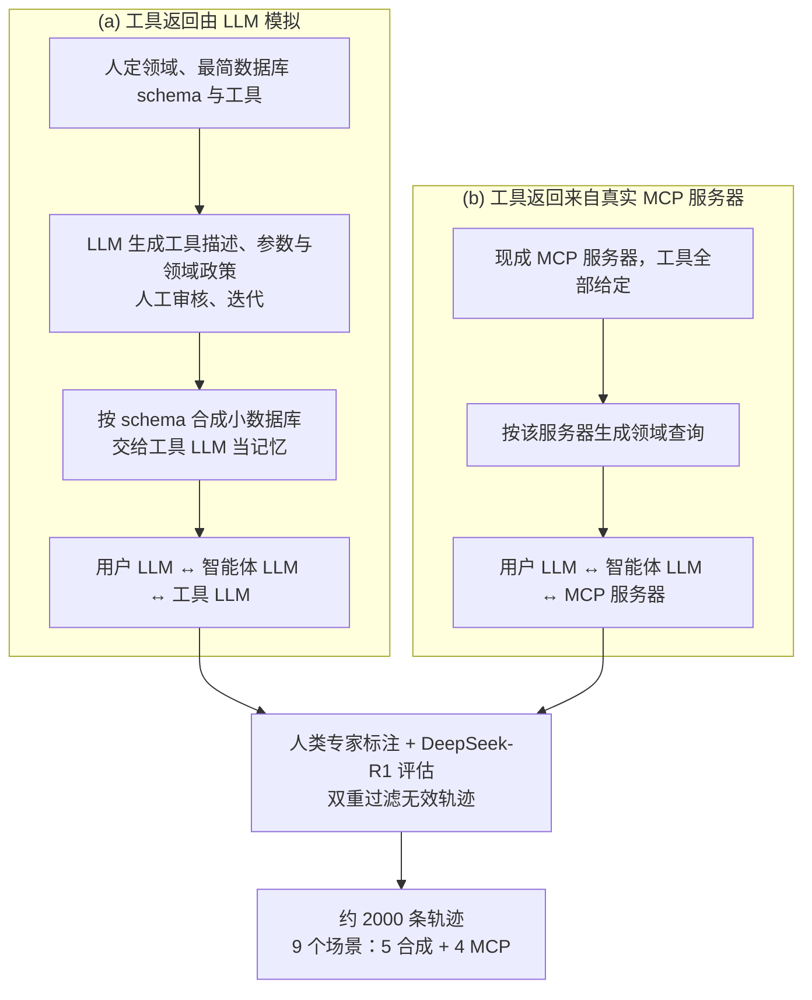

# 工具使用 RL 一直对着固定题目练，问题出在循环里没有会改口的用户

<!-- release-date: 2025-08-26 -->

> 本文依据 **MUA-RL: Multi-turn User-interacting Agent Reinforcement Learning for agentic tool use**，arXiv:2508.18669v1，2025-08-26 提交，共 25 页。页码均指 PDF 自身的页码。文中会区分三件事：**论文明确写了什么**、**我们怎么解释它**、**哪些是外部资料或本文推算**。

## 读前先把几个词说成人话

这篇论文不难在公式。它难在一个很容易被忽略的前提：工具使用的强化学习里，**对面的人是不是活的**。

先把会反复出现的词说清楚：

- **Agentic tool use（智能体式工具使用）**：模型不是一次写完答案，而是在对话里反复做两件事：跟用户把需求问清楚，对数据库或外部接口发出结构化调用。
- **Rollout（轨迹生成）**：让当前策略在一个任务上完整跑一局。跑出来的「用户话、工具调用、工具返回、对用户的回复」序列就是一条轨迹。
- **Cold-start（冷启动）**：强化学习之前先用少量高质量轨迹做一轮监督微调（Supervised Fine-Tuning，SFT），让模型先学会工具调用的格式和对话规矩。
- **GRPO（Group Relative Policy Optimization，组相对策略优化）**：同一道题采样一组轨迹，用组内均值和标准差当基线，不训练单独的价值网络（PDF p. 5）。
- **Non-thinking（非思考模式）**：Qwen3 可以关掉内部长推理、直接输出动作。这篇论文的训练和评测全部锁在这个模式（PDF p. 6–7）。
- **双控（dual-control）**：TAU2 Telecom 里用户也能调工具（比如自己重启手机），智能体得指挥用户动手，而不是自己包办。

论文把一次交互写成三元组 $(\mathcal{T},\mathcal{M},\mathcal{O})$：$\mathcal{T}$ 是工具集合，$\mathcal{M}$ 是对用户说的话，$\mathcal{O}=\mathcal{O}_{\text{db}}\cup\mathcal{O}_{\text{user}}$ 是观察，分成数据库返回和用户消息两类。每一回合里，智能体自己决定调不调工具、调几次，最后给用户发一条消息 $m_k$（PDF p. 3，式 1）。后文所有设计都踩在「观察里有一半来自用户」这件事上。

评测会出现四个基准，先知道它们测什么（PDF p. 7、p. 24–25）：

| 基准 | 测什么 | 规模 |
|---|---|---|
| TAU1-Bench | 零售、航空客服：守领域政策，用工具改数据库 | 零售 115 题、航空 50 题 |
| TAU2-Bench | 零售、航空换了工具集、政策与判分，更严；新增双控的电信域 | 电信 114 题 |
| BFCL-V3 Multi Turn | 多轮函数调用：基础集加缺参数、缺函数、长上下文三类加难集 | 每类 200 题，共 800 题 |
| ACEBench Agent | 机票、外卖、金融、通信等场景的多轮、多步工具使用 | 50 题、22 个工具 |

TAU1 和 TAU2 本身的设计见 tau-bench 与 tau2-bench 两篇，这里不重复。

## 一句话先说清

2025 年的工具使用强化学习，已经会把代码沙箱、搜索引擎、Docker 接进 rollout。论文点名的 ReTool、SkyRL、RAGEN 都是这个结构（PDF p. 2）。但它们共享一个没被追问的假设：**题目在训练开始前就写死了，对面没有一个会根据你刚才那句话改口的人。**

真实客服不是这样。用户会补一句「价格要更低」，会在你改完订单之后说「我其实要无防水那款」。智能体不但要把工具调对，还要把意图问清、在改数据库之前拿到明确确认。

MUA-RL 的回答是三件事叠在一起：

1. **把由大模型扮演的用户放进 RL 的 rollout 循环**，同时接一个真实可运行的数据库来核对工具结果；
2. **奖励只看任务最终是否按系统提示完成**，给 1 或 0，不给格式分、不给中间调用成功分；
3. 用户消息和工具返回的 token **不进损失**。

在这之前，先用约 2000 条合成轨迹做一轮轻量冷启动（PDF p. 6）。

上图引自 PDF p. 6 的 Figure 4。三代 rollout 下面接的是同一条「奖励 → 优势 → 更新策略」的回路，差别只在 rollout 里有谁。MUA-RL 做的是第三格：右侧那局会议室预订里，工具调用和用户对话是交错的，不是「先问完再一次性调」。

骨干不是新架构，是 Qwen3-8B、14B、32B 的非思考模式（PDF p. 6）。摘要给的 32B 成绩是 TAU2 Retail 67.3、Airline 45.4、Telecom 28.3，BFCL-V3 Multi Turn 28.4，ACEBench Agent 82.5，并概括为「超过或持平 DeepSeek-V3-0324 与 Qwen3-235B-A22B 的非思考模式」（PDF p. 1）。这句概括在五列上并不都成立，后面会逐列拆开。

### 一条阅读路线

如果只有半小时读原文，建议按这个顺序：

1. **p. 2 第 1 节**：现有工具 RL 的「预定环境 + 预写查询」到底漏了什么。
2. **p. 5–6 的 Figure 4 与第 3.3.3 节**：三代 rollout 和极简奖励。
3. **p. 6–7 的实验设定**：训练数据就是 TAU1 的 165 道题，训练用户和评测用户不是同一个模型，TAU1 奖励被改过。
4. **p. 8 Table 1、p. 9 Table 2、p. 11 Table 3**：分清训练域、近域和换设定。
5. **p. 18–24 附录 B**：同一笔改单在训练前后怎么变，这是全文最能说明问题的一段。

附录 A 的两条冷启动样例（p. 15–18）和附录 C 的基准说明（p. 24–25）第一次可以只当对照。

## 主要矛盾：用户是剧本时，最优策略就是抢跑

论文第 1 节的判断很直（PDF p. 2）：SFT 在合成工具轨迹上仍是主流做法，RL 被认为泛化更好，于是有了两类 RL 工作。一类是数学、代码这类静态、定义清楚的任务；另一类把外部环境接进 RL，但「通常运行在预定环境里、依赖预写的查询」。

真实用户会根据模型的回复调整问题和预期，形成一个需要双向适应的反馈环（PDF p. 2）。现有 RL 框架把这个环漏掉了。

**我们如何解释它。** 用户是一条写死的指令时，所有信息在第一句就给全了。这时对奖励最有利的策略是：尽快调工具、尽快写库。列出选项、报价、要一句 yes，这些动作在奖励里没有位置，训练时就不会长出来。只有当对面会在你写库之后才补一句「我要的其实是另一款」，「先确认再写库」才会变成拿分的必要条件。

所以矛盾是：

> 工具环境已经做真了，用户还是假的。模型学会的是「给定一个不会动的需求，怎么把工具调对」，而客服要的是「需求会随对话变化，怎么边问边调、在对的时机写库」。

这不是「再给工具调用加一条格式奖励」能解决的。MUA-RL 的做法是把用户从剧本改成环境的一部分。

## 核心设计一：把 LLM 用户放进 RL 循环

### 旧问题：第二代 rollout 有工具，没有对方

Figure 4(b) 的多步 rollout 已经把生成和真实工具执行交错起来。论文把这里的「数据库」说得很宽：代码沙箱、互联网检索都算（PDF p. 5）。题目本身仍是预写的，智能体不必学会问用户「你要改成哪一款蓝色」。

### 新设计：用户由大模型扮演，数据库是真的

论文在 rollout 中引入由 LLM 模拟的自动用户（PDF p. 5）。训练时用户模拟器是 GPT-4o-2024-11-20（PDF p. 7）。同时接入一个「真实、可运行的数据库环境」，用来核对工具调用的结果（PDF p. 2、p. 6–7）。

**用户是模拟的，数据库不是。** 这条分工要记住：工具结果必须能被真实环境核对，才谈得上「任务到底完成没有」；用户可以是模型，因为它要提供的是「会变的需求」，不是可核对的事实。

### 工作机制

一轮里智能体只做两类事之一：调工具与数据库交互，或用文本与用户沟通（PDF p. 3）。用户模拟器按当前对话给出下一条观察，可能补信息、改需求，也可能说 yes。

训练约束写在 PDF p. 7：每个任务最多 30 轮交互；序列上限 32768 token；rollout 时智能体采样温度 1.0；同一查询采 8 条轨迹（rollout number of 8）。

论文认为，模型自己的话、工具调用、用户消息、工具返回四样叠在一起，才把 rollout 的动态性、随机性和不确定性拉起来（PDF p. 5）。

### 代价和边界

- 训练用户是 GPT-4o，评测 TAU1 / TAU2 时换成 GPT-4.1（PDF p. 7）。两套模拟器之间的分布差，论文没有讨论。
- 30 轮上限是为了控制算力、防止交互过长（PDF p. 7），不是真实对话的性质。
- 「真实可运行的数据库」没有写实现：是否就是 TAU 官方环境、每条 rollout 是否重建状态，正文都没交代。
- **动态用户本身没有消融。** 实验比的是「去掉冷启动」和「去掉 RL」，没有「RL 循环里不放用户模拟器」这一组。所以「动态用户带来收益」在这篇里是由任务形式化、Figure 4 的三代对比和附录 B 的案例支撑的，不是由对照实验支撑的。

### 可迁移启发

任务的本质若是「对面会改口」，rollout 里就必须有一个会改口的对象。用户模拟器不必完美，但必须能根据智能体刚说的话改变下一句；只把工具环境做真、用户仍是一条固定指令，训练信号会把模型推向抢跑。

## 核心设计二：两条合成管线做冷启动

### 旧问题：直接上 RL，组内全是 0 分

多轮工具任务要求智能体调用陌生工具，并在文本沟通、工具调用、纠错之间来回切（PDF p. 3）。基座若连合法调用都发不出，同一组 8 条轨迹全是 0 分，GRPO 没有相对信号。真实交互日志又很难采：成本、系统复杂度、隐私和接口权限，论文四条都写了（PDF p. 3）。

### 新设计：假工具一条线，真 MCP 一条线

这张图按 PDF p. 4 的 Figure 3 与 p. 3–6 的正文重画，是流程示意。MCP 是 Model Context Protocol（模型上下文协议），现成的 MCP 服务器会自己执行工具，因此 (b) 这条线不用手写工具（PDF p. 4）。

(a) 这条线里最要紧的是工具 LLM。智能体调用时只把工具名和参数交给它，它按那份合成数据库「记忆」生成返回（PDF p. 3–4）。这样便宜、schema 好控；代价是工具返回也是模型编的。(b) 这条线用真实执行补上这一块，防止智能体学会「和另一个 LLM 对打」的捷径。

附录 A 各给了一条样例：大学选课走 LLM 模拟工具，AniList 动漫检索走真实 MCP（PDF p. 15–18）。选课那条几乎就是在教三件事：先用学号、姓名、生日认证；复述「把电话改成 555-123-4321」；用户回 yes 之后才调用 `update_address_or_phone`（PDF p. 16）。

训练超参：batch 128，2 个 epoch，AdamW，初始学习率 $5\times 10^{-6}$，余弦衰减（PDF p. 6）。

### 收益与代价：冷启动会写进偏见

冷启动在零售、航空上涨分，在电信上掉分。三个尺度都是如此：TAU2 Telecom 上 8B 从 19.1 掉到 9.0，14B 从 29.9 掉到 23.5，32B 从 24.8 掉到 19.3（PDF p. 8，Table 1）。论文给的原因是冷启动数据带进了领域特有的模式与偏见，离训练分布越远越难泛化；RL 再把这些偏见抵消掉（PDF p. 8）。

这组数字是全文最干净的一条因果证据，后面 Table 1 会再看到它。

公开材料没有列出 5 个合成场景与 4 个 MCP 服务器的完整名单，「约 2000 条」也没有按场景拆开。

### 可迁移启发

工具 RL 的冷启动数据不必大，但要真假工具都有：假工具便宜、好控 schema，真工具防捷径。更要预期 SFT 会让离训练域远的任务变差，后面必须有一段结果驱动的 RL 把它洗回来。

## 核心设计三：只给最终成败分，并掩掉别人的 token

### 旧问题：奖励越细，越容易刷代理指标

工具调用是高度结构化的行为，已有工作常把奖励做得很复杂：格式分、工具名或参数名匹配分、成功调用比例分（PDF p. 5）。论文认为，复杂奖励在动态多轮交互里未必教得会有效行为，反而会让模型不敢试错（PDF p. 5–6）。

### 新设计：$r\in\{0,1\}$

智能体按系统提示完成任务时 $r=1$，否则 $r=0$（PDF p. 6）。论文列了两条好处：对对话路径和工具调用顺序不敏感，只要结果对就给分；模型没法靠输出格式或调用语法刷分（PDF p. 6）。

优势是标准 GRPO 的组内标准化。同一查询 $q$ 采 $G$ 条轨迹，第 $i$ 条的优势是它的奖励减去组均值、再除以组标准差：

$$
A_i=\frac{r_i-\operatorname{mean}(\{r_j\}_{j=1}^{G})}{\operatorname{std}(\{r_j\}_{j=1}^{G})}
$$

策略目标是带裁剪的重要性比乘优势，再减一项对参考策略的 KL 惩罚（PDF p. 5，式 2–3）：

$$
\mathcal{J}(\theta)=\mathbb{E}\Big[\frac{1}{G}\sum_{i=1}^{G}\min\big(\rho_i A_i,\ \operatorname{clip}(\rho_i,1-\epsilon,1+\epsilon)A_i\big)\Big]-\beta\,\mathbb{D}_{\mathrm{KL}}(\pi_\theta\Vert\pi_{\mathrm{ref}})
$$

这里 $\rho_i=\pi_\theta(y_i\mid q)/\pi_{\mathrm{old}}(y_i\mid q)$ 是新旧策略对整条轨迹 $y_i$ 的概率比。论文给了 $\beta=0.001$，没给 $\epsilon$（PDF p. 7）。

**我们如何解释它。** 0/1 奖励配 $G=8$ 时，一组里 3 条做成、5 条没做成，做成的三条拿正优势，其余拿负优势。模型不会因为 JSON 更漂亮、或多调了一次 `think` 而多拿分。

### 两处容易漏的改动

**第一，TAU1 的奖励被改过。** 原版 TAU1 里，任务做成了但没在对话里提到规定信息（例如告诉用户库存还有几件），也给 0 分。RL 训练时作者去掉了这项对话内容要求，理由是他们观察到它妨碍模型学到正确的工具调用模式（PDF p. 7）。评测仍用官方评测代码（PDF p. 25），所以 TAU1 的数字是官方口径，而训练信号和官方判分并不同构。

**第二，损失掩码（loss mask）。** 工具返回与用户消息的 token 在算损失时被掩掉（PDF p. 7）。这些 token 不是策略生成的；不掩，梯度会浪费在模仿 GPT-4o 的口吻或数据库 JSON 的字段顺序上。掩码没有单独消融。

### 代价和边界

组内 8 条全错或全对时，标准差为 0，这一题没有相对信号。论文没写怎么处理这种组。它自己也把「更细的奖励塑形」和「与人类偏好进一步对齐」列为未来工作（PDF p. 11）。

### 可迁移启发

过程约束放进环境，不要塞进奖励。「改物品只能一次」「没确认就写库会出事」是环境规则；奖励只看最终状态，模型才会把确认问出来。格式分、提及分、调用成功率，都可能把模型推向代理指标。

## 训练配方

两段训练压成一张表（PDF p. 6–7）：

| 阶段 | 数据 | 优化 | 关键超参 |
|---|---|---|---|
| 冷启动 SFT | 约 2000 条合成轨迹，9 个场景（5 合成 + 4 MCP） | AdamW，余弦衰减 | batch 128，2 epoch，lr $5\times 10^{-6}$ |
| MUA-RL | TAU1 零售 115 题 + 航空 50 题 | GRPO，基于 VeRL | 25 epoch，batch 32，每题 8 条，$\beta=0.001$，32768 token，≤ 30 轮，温度 1.0 |

框架基于 VeRL（PDF p. 6），致谢里专门感谢 VeRL 团队的基础设施支持（PDF p. 11）。VeRL 的分布式设计见 HybridFlow 一篇。

论文没有写 RL 学习率、GPU 型号、卡时或墙钟时间，也没写总步数。Figure 5 的横轴止于约 120 步；若每个 epoch 按 165 / 32 取整为 5 步，25 个 epoch 约 125 步，和横轴大体对得上。这是我们的推算。

评测口径统一（PDF p. 7）：非思考、温度 0.0、全部走函数调用（Function Calling，FC）而非把工具说明塞进提示词；TAU1 / TAU2 用 GPT-4.1 当用户、每个测试集重复 4 次取平均；ACEBench 的用户模拟器与 TAU 相同。ACEBench 官方默认是提示词评测，作者改了官方评测代码来支持 FC（PDF p. 25）。

TAU2 Telecom 另报 **TCR（Task Completion Rate，任务完成率）**：一题有若干条验证条件，TCR 是满足的条件占比，不是只看成或不成（PDF p. 7）：

$$
\mathrm{TCR}(q)=\frac{|\{c_i\in C_q:\mathrm{satisfied}(c_i)\}|}{|C_q|}
$$

## 实验怎么证明

先钉死一件事：**RL 训练数据就是 TAU1 的 115 + 50 道题**，而 TAU1 测试集正是这 165 题（PDF p. 7、p. 25）。所以 TAU1 是训练域；TAU2 零售、航空是同领域但换了工具、政策和更严的判分；TAU2 Telecom、BFCL、ACEBench 才是换设定。读下面三张表都按这个分层。

### TAU1 / TAU2：近域追上更大模型，双控电信没有

Table 1（PDF p. 8），全部是非思考模式；TCR 只报了 Qwen3 与 MUA-RL 这几行：

| 模型 | TAU1 Retail | TAU1 Airline | TAU2 Retail | TAU2 Airline | TAU2 Telecom | Telecom TCR |
|---|---:|---:|---:|---:|---:|---:|
| GPT-4o-2024-11-20 | 63.0 | 45.5 | 67.3 | 46.9 | 24.1 | – |
| GPT-4.1 | 66.5 | 42.5 | 70.2 | 53.0 | 38.9 | – |
| DeepSeek-V3-0324 | 70.4 | 42.4 | 64.7 | 37.0 | 32.9 | – |
| Qwen3-235B-A22B | 65.2 | 32.0 | 64.9 | 36.0 | 24.6 | – |
| Qwen3-30B-A3B | 38.3 | 18.0 | 31.6 | 18.0 | 18.4 | – |
| Qwen3-4B | 24.3 | 16.0 | 28.1 | 12.0 | 17.5 | – |
| Qwen3-8B | 40.0 | 11.0 | 41.0 | 12.5 | 19.1 | 22.9% |
| Qwen3-8B 冷启动 | 36.7 | 12.0 | 31.4 | 16.0 | 9.0 | 12.1% |
| MUA-RL-8B | 56.5 | 29.5 | 49.8 | 19.0 | 21.8 | 25.2% |
| Qwen3-14B | 46.9 | 13.0 | 43.1 | 14.8 | 29.9 | 46.6% |
| Qwen3-14B 冷启动 | 50.8 | 23.0 | 53.7 | 24.0 | 23.5 | 32.9% |
| MUA-RL-14B | 65.9 | 42.0 | 66.0 | 38.0 | 33.4 | 54.3% |
| Qwen3-32B | 47.6 | 18.5 | 50.2 | 23.5 | 24.8 | 23.7% |
| Qwen3-32B 冷启动 | 58.9 | 36.0 | 58.2 | 31.1 | 19.3 | 21.6% |
| MUA-RL-32B | 72.6 | 46.5 | 67.3 | 45.4 | 28.3 | 45.1% |

读这张表要知道四件事。

**第一，训练域的领先要打折。** 32B 在 TAU1 Retail 的 72.6 超过 DeepSeek-V3-0324 的 70.4 和 GPT-4.1 的 66.5，但那是训练题。

**第二，近域是真强。** TAU2 Retail 67.3 与 GPT-4o 持平，高于 DeepSeek-V3-0324 的 64.7 和 Qwen3-235B-A22B 的 64.9；TAU2 Airline 45.4 高于这两个开源模型，但低于 GPT-4o 的 46.9 和 GPT-4.1 的 53.0。正文说 32B 在 TAU 零售与航空上「超过 GPT-4o」（PDF p. 8），这句只在 TAU1 两列成立；TAU2 零售是持平，航空是落后。

**第三，双控电信上最大的模型不是最强的。** 32B 只有 28.3，低于 DeepSeek-V3-0324 的 32.9 和 GPT-4.1 的 38.9。14B 反而是 33.4、TCR 54.3%，两项都高于 32B，也高于 GPT-4o 与 DeepSeek-V3-0324（PDF p. 8）。论文选 14B 来讲电信，这个选择是诚实的。

**第四，冷启动与 RL 的一掉一回。** 三个尺度的电信都是「冷启动掉、RL 回到基座之上」。这是「SFT 注入偏见、结果奖励再洗掉」这条因果链的直接证据（PDF p. 8）。

### BFCL 与 ACEBench：换了工具集还在，但不是第一

Table 2（PDF p. 9）：

| 模型 | BFCL Base | Miss Func | Miss Param | Long Context | BFCL 总分 | ACE 多轮 | ACE 多步 | ACE 总分 |
|---|---:|---:|---:|---:|---:|---:|---:|---:|
| GPT-4.1 | 48.0 | 34.0 | 35.0 | 45.5 | 40.5 | 83.3 | 90.0 | 86.7 |
| DeepSeek-V3-0324 | 41.0 | 21.0 | 23.0 | 34.5 | 29.8 | 73.3 | 75.0 | 74.2 |
| Qwen3-235B-A22B | 42.5 | 23.5 | 28.5 | 25.5 | 30.0 | 63.3 | 80.0 | 71.7 |
| Qwen3-30B-A3B | 14.0 | 1.5 | 7.5 | 8.5 | 7.9 | 36.7 | 30.0 | 33.4 |
| Qwen3-8B | 20.0 | 4.0 | 13.0 | 10.0 | 11.8 | 33.3 | 45.0 | 39.2 |
| Qwen3-8B 冷启动 | 24.0 | 11.0 | 16.5 | 10.0 | 15.4 | 36.7 | 55.0 | 45.9 |
| MUA-RL-8B | 21.0 | 11.5 | 15.0 | 11.0 | 14.6 | 46.7 | 60.0 | 53.3 |
| Qwen3-14B | 30.0 | 8.0 | 16.0 | 16.5 | 17.6 | 40.0 | 80.0 | 60.0 |
| Qwen3-14B 冷启动 | 35.0 | 13.5 | 21.5 | 19.5 | 22.4 | 50.0 | 90.0 | 70.0 |
| MUA-RL-14B | 40.5 | 14.0 | 25.0 | 21.5 | 25.3 | 56.7 | 100.0 | 78.3 |
| Qwen3-32B | 29.5 | 11.0 | 20.0 | 18.0 | 19.6 | 60.0 | 85.0 | 72.5 |
| Qwen3-32B 冷启动 | 35.0 | 21.0 | 28.5 | 19.5 | 26.0 | 53.3 | 100.0 | 76.6 |
| MUA-RL-32B | 42.0 | 20.0 | 30.0 | 21.5 | 28.4 | 70.0 | 95.0 | 82.5 |

ACEBench 上 32B 的 82.5 是表内除 GPT-4.1（86.7）外最高（PDF p. 8）。但它只有 50 题，14B 的多步已到 100.0，32B 反而 95.0，不宜把 82.5 读成稳定地「接近 GPT-4.1」。

BFCL 上 32B 的 28.4 高于自己的基座和冷启动，论文的措辞是「接近 DeepSeek-V3-0324」（PDF p. 8），表上也确实没超过 29.8 和 30.0。Long Context 一列尤其弱：21.5，对 34.5 与 25.5。摘要把 BFCL 28.4 写进「超过或持平更大开源模型」那一句，表上不是这样。

还有一处与正文措辞不符：正文说 BFCL 上 MUA-RL「在所有尺度上稳定提升」（PDF p. 8），但 8B 的 RL 后总分 14.6 低于冷启动的 15.4。

### 消融：两段各买一块能力

Table 3 只做 32B（PDF p. 11）：

| 模型 | TAU2 Retail | TAU2 Airline | TAU2 Telecom | BFCL Base | Miss Func | Miss Param | Long Context | BFCL 总分 |
|---|---:|---:|---:|---:|---:|---:|---:|---:|
| Qwen3-32B | 50.2 | 23.5 | 24.8 | 29.5 | 11.0 | 20.0 | 18.0 | 19.6 |
| 只有冷启动（w/o RL） | 58.2 | 31.1 | 19.3 | 35.0 | **21.0** | 28.5 | 19.5 | 26.0 |
| 只有 RL（w/o cold-start） | 61.6 | 41.0 | 28.1 | 29.5 | 13.0 | 20.0 | 14.5 | 19.3 |
| 完整 MUA-RL-32B | **67.3** | **45.4** | **28.3** | **42.0** | 20.0 | **30.0** | **21.5** | **28.4** |

只有冷启动：零售、航空涨，电信掉，BFCL 涨。像训练数据的任务变好，不像的变差，这是 SFT 的典型形状。

只有 RL：TAU2 三个域都涨，电信已经几乎追平完整系统（28.1 对 28.3），但 BFCL 总分不动（19.3 对基座 19.6），Long Context 还掉了 3.5。没有冷启动教的陌生工具格式，结果奖励在训练域够用，换工具集不够用。

论文的结论是去掉任何一段都会明显掉点，完整管线「在所有基准上」更好（PDF p. 10）。按总分确实如此；但细看子集，Miss Func 一列只有冷启动的 21.0 高于完整系统的 20.0（原表加粗的就是它）。

**我们如何解释它。** 冷启动主要买 BFCL 这种换工具集的泛化，RL 主要买 TAU2 这种同领域、更动态的完成率。两块能力来自不同阶段，所以两段都要，而不是某一段「更强」。

## 训练动态：涨分不是靠把话写长

上图引自 PDF p. 10 的 Figure 5。论文对它的解读集中在四点（PDF p. 9–10）：

- **轮数先升后稳在约 21–23 轮，响应长度基本不变**（图 e、f）。论文据此判断：性能提升不是来自更长的输出，而是来自更有结构的多轮交互，并称这与 GLM-4.5 的观察一致（PDF p. 9）。
- **8B 的 KL 波动明显更大**（图 a），论文归因于小模型容量有限，在探索与正则之间抖得更厉害；8B 的熵在早期快速下降（图 b）；梯度范数没有爆炸或发散（图 c）。
- **4-gram 去重率**衡量用词多样性。32B 更低且持续下降，论文解读为大模型靠增强工具使用而不是换说法来完成任务（图 g）。
- **整组全对的题目比例上升，整组全错的下降**（图 h、i）。附录 B 的案例就是一道从全错变成全对的题（PDF p. 10）。

**我们如何解释它。** 图 b 里 14B 的熵其实是缓慢上升的，论文没有评论；图 d 的奖励三条都在涨，但 8B 始终落后一截。这些是读图所得，不是论文的论断。

上图引自 PDF p. 11 的 Figure 6。Think 是给非思考模型用的推理接口，Transfer 是模型认为自己做不完时转人工（PDF p. 10）。论文把三条都下降解释为「减少了对完成任务贡献有限的工具的依赖」，少调 Think 让决策路径更短（PDF p. 10）。

**我们如何解释它。** 少转人工，既可能是真能自己做完了，也可能是 0/1 奖励在逼模型「别轻易认输」。论文没有把 Transfer 下降和最终成功率做关联分析，这里只能记成现象。

## 附录案例：同一笔改单，写库落在确认前还是确认后

附录 B 把「动态用户 + 最终奖励」到底改了什么策略，写到了可复述的粒度（PDF p. 18–24）。任务来自 TAU2 Retail：用户 Chen Johnson，要把待发货订单 `#W5061109` 里的白色无线耳机（$256.67）换成蓝色，并要求价格相同或更低、明确告知（PDF p. 21）。政策规定：改物品的工具每单只能调一次，调完订单状态变成 `pending (items modified)`，之后不能再改也不能取消；任何写库动作之前必须列出细节并拿到明确的 yes（PDF p. 19–20）。

两条轨迹的工具调用都是合法 JSON。基座的错误轨迹在 PDF p. 21–23，训练后的正确轨迹在 p. 23–24。论文的评语是：MUA-RL 没有让模型死背政策，而是把交互策略改成了谨慎、以政策为依据、以用户为中心（PDF p. 18）。

这和 0/1 最终奖励是对得上的。抢跑那条的每一步调用在过程上都「成功」了，按调用成功率甚至能拿正分；按最终结果是 0。只有看终局，「先写库再问」才会被惩罚。

**正确轨迹也不是无瑕的。** 商品变体里在售的蓝色款其实有 4 个，除图中 3 款外还有一款 4 小时续航、IPX4、$258.84（PDF p. 23）。模型只列了 3 款，却说「在售的蓝色有三款」；它还说第 3 款（$242.92）「略贵」，而 $242.92 其实低于原价 $256.67，下一轮报差价时才算对了 −$13.75（PDF p. 23–24）。漏掉的那款恰好高于原价、不满足用户的价格要求，所以结局不受影响。

**我们如何解释它。** 这正是结果奖励的两面：它能逼出「先确认再写库」，却不会惩罚不影响终局的错话。要纠正这类口误，得靠环境判分或更细的奖励，论文把后者列为未来工作。

## 论文没写、不能外推的边界

这篇没有独立的 Limitations 节。读完需要留下的判断：

- **不是新基座。** 三个 MUA-RL 模型都是 Qwen3 非思考模式的后训练产物（PDF p. 6）。
- **动态用户没有消融。** 实验证明了「冷启动 + RL」比只做一段好，没证明「循环里有用户模拟器」比没有好。这是把主主张和实验证据分开之后最需要记住的一条。
- **TAU1 是训练域。** 165 道训练题就是 TAU1 测试集。
- **摘要的对比不均一。** 32B 在 TAU2 零售、航空与 ACEBench 上超过或持平 DeepSeek-V3-0324 与 Qwen3-235B-A22B；在 TAU2 电信低于 DeepSeek-V3-0324；在 BFCL 低于这两个模型（PDF p. 8–9）。
- **不是单调变好。** 8B 的 BFCL 在 RL 后略降；32B 的 ACEBench 多步从冷启动的 100.0 降到 95.0；电信上 14B 强于 32B；消融里 Miss Func 冷启动单独更高（PDF p. 8–9、p. 11）。
- **用户是模拟的。** 训练 GPT-4o、评测 GPT-4.1，没有真人用户实验。
- **题量有的很小。** ACEBench 50 题，TAU1 航空 50 题。重复 4 次能降方差，但改一两题仍会摆动几个点。
- **没公开的实现：** RL 学习率与 $\epsilon$；GPU 与卡时；全 0 / 全 1 组的处理；掩码的对照；9 个场景的完整名单；用户模拟器的提示词；数据库是否每局重建；思考模式下方法是否成立。

结论写的未来方向是：更丰富的多模态环境、更细的奖励塑形、开放交互里与人类偏好对齐（PDF p. 11）。

## 可迁移启发

1. **先问训练循环里有没有会改口的对方。** 工具环境做真，只解决「调用有没有改对状态」。用户若还是写死的指令，策略会被推向抢跑。客服、技术支持、改订单这类任务，用户必须是环境的一部分。
2. **过程约束放进环境，奖励只看终局。** 「改物品只能一次」「没 yes 不写库」写在环境与政策里，奖励只判最终状态，确认才会变成策略。
3. **冷启动要小、真假工具都有，并预期它会写入偏见。** 约 2000 条就够让 Qwen3 学会基本格式；离训练域远的任务在 SFT 后变差，是后续 RL 要洗的东西。
4. **梯度只落在策略自己发出的 token 上。** 用户话和工具返回是环境，不是动作。
5. **看轮数与长度，别默认涨分来自写长。** 这篇的响应长度几乎不变、轮数稳在 21–23。若自己的客服 RL 曲线是长度狂涨、轮数不动，多半在学啰嗦。
6. **换工具集与同领域加难要分开看。** 只有 RL 时 TAU2 涨、BFCL 不涨；只有冷启动时 BFCL 涨、电信掉。两块能力来自不同阶段。
7. **声称超过更大模型时，先核训练域。** 把 TAU1 零售这种训练题的领先写进摘要，会把近域成绩说成泛化成绩。

## 关键词回看

- **MUA-RL**：把 LLM 模拟用户放进工具使用 RL 循环的框架，不是新基座。
- **三代 rollout**：纯文本 → 带工具的多步 → 用户与数据库同时在场的多轮。
- **冷启动两条管线**：LLM 模拟工具返回，或真实 MCP 服务器执行；都过人工加 DeepSeek-R1 的双重过滤。
- **0/1 最终奖励**：按系统提示完成任务才给 1；训练时还去掉了 TAU1「对话里必须提到某信息」的要求。
- **Loss mask**：用户消息与工具返回不进损失。
- **TCR**：TAU2 电信的细粒度完成率，按验证条件满足比例计。
- **训练域 / 近域 / 换设定**：TAU1 / TAU2 零售与航空 / TAU2 电信、BFCL、ACEBench。

## 资料与阅读边界

### 版本与首发日

- 本地原件 `papers/Meituan/MUA-RL.pdf`，25 页，页边标 `arXiv:2508.18669v1 [cs.AI] 26 Aug 2025`。截至 2026-09-30，[arXiv:2508.18669](https://arxiv.org/abs/2508.18669) 只有 v1，提交时间 2025-08-26 04:26:29 UTC。
- `release-date` 取 **2025-08-26**，即 arXiv v1。官方代码仓库 [zzwkk/MUA-RL](https://github.com/zzwkk/MUA-RL) 第一次带内容的提交是 2025-09-29（`1f39aeb`）；Hugging Face 上三个权重仓库的文件上传同在 2025-09-29，此前只有 2025-08-25 的空仓库初始化；冷启动数据集上传于 2025-10-08。这些都晚于 arXiv v1。

### 外部资料补充（不是 PDF 原文）

- 代码仓库为 Apache-2.0，含 `verl/` 与 `examples/sglang_multiturn/` 训练脚本；README 写了 4 × 8 卡、建议 H200 141GB 的多机配置，这是仓库说明，不能回写成论文的算力账单。
- 数据集卡片 [zzwkk/MUA-RL-Dataset](https://huggingface.co/datasets/zzwkk/MUA-RL-Dataset) 写公开的是 1580 条任务的子集，完整数据另有未公开部分；与论文「约 2000 条」不矛盾，也不能精确替代它。
- 权重：[MUA-RL-8B](https://huggingface.co/zzwkk/MUA-RL-8B)、[MUA-RL-14B](https://huggingface.co/zzwkk/MUA-RL-14B)、[MUA-RL-32B](https://huggingface.co/zzwkk/MUA-RL-32B)。其中 8B 的模型卡元数据把基座写成 Qwen3-32B，正文又写 8B 参数，以论文「Qwen3-8B 为骨干」为准。

### 本文覆盖的部分

摘要与 Figure 1；第 1 节动机与三项贡献；第 3 节任务形式化、Figure 2–4、两条冷启动管线、GRPO、三代 rollout 与奖励；第 4 节实验设定、Table 1–3、Figure 5–6；第 5 节结论；附录 A 两条冷启动样例；附录 B 案例；附录 C 基准说明。第 2 节相关工作只取了与本文对照有关的部分。

### 原文没有公开、本文也不补的缺口

- 「RL 循环里不放用户模拟器」的对照实验；
- RL 学习率、裁剪系数 $\epsilon$、全同分组的处理；
- 算力、卡时与训练墙钟；
- 冷启动 9 个场景的完整名单与分场景条数；
- 用户模拟器的提示词与两代模拟器之间的偏差分析。
