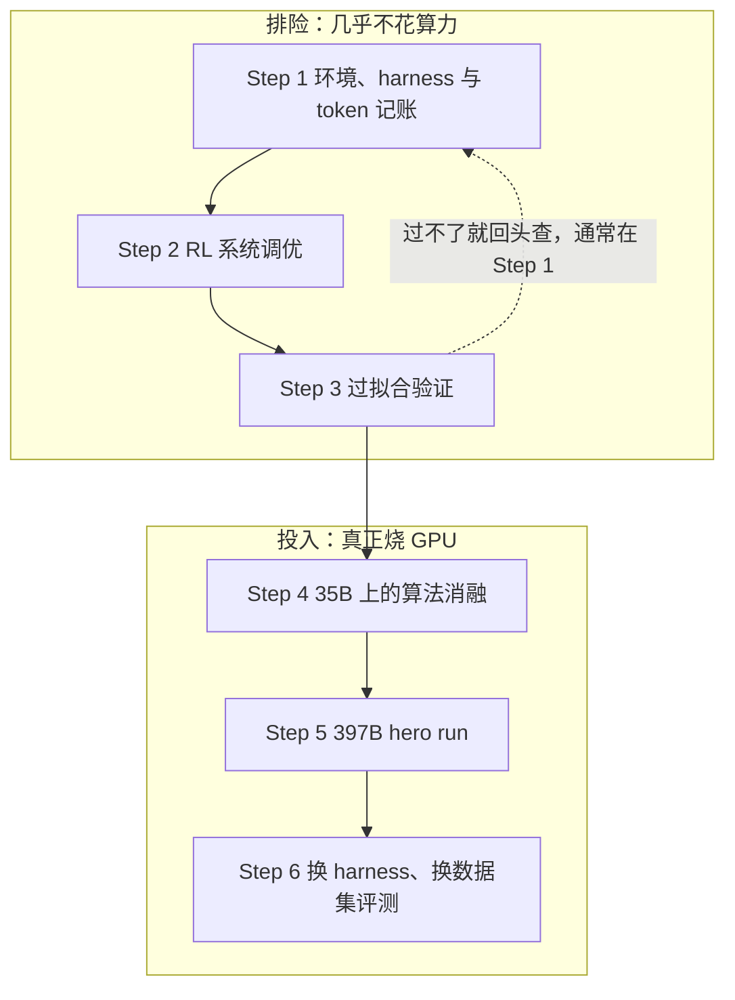
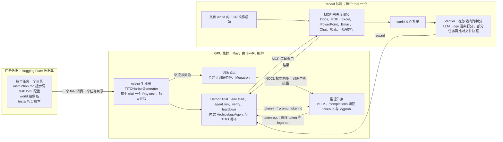

# 397B 知识工作 Agent 的 RL 全流程：算力从第四步才开始花，胜负在前三步就定了

<!-- release-date: 2026-09-01 -->

> 本文依据 Mercor Research 与 SkyRL 团队的官方博客 **Training frontier knowledge work agents: A 397B RL training guide with SkyRL**，<https://www.mercor.com/blog/training-frontier-knowledge-work-agents-a-397b-rl-training-guide-with-skyrl/>，页面标注发布于 2026-09-01，访问日期 2026-09-29。原件是网页，没有页码，事实锚写原文小节名：Background、Step 1–6（Step 1 下有 1.0–1.3 四个编号小节，Step 2 是编号 1–4 的四条）、Lessons and forward-looking；原文的四张表与六张带编号的图写作「原文 Table N」「原文 Figure N」。全文区分三层：**原文写了什么**、**我们如何解释它**、**哪些是外部补充**。

## 读前先把词说成人话

这篇 recipe 术语密，先把会反复出现的词讲清楚。

- **RL（Reinforcement Learning，强化学习）**：不给标准答案，让模型自己把事做完，事后按结果打分，再用分数调参数。
- **rollout 与轨迹（trajectory）**：让模型真的把一个任务从头做到尾，产生那一整串「思考、调工具、看结果、再思考」的记录，就是一条轨迹；生成它的过程叫 rollout。
- **harness（脚手架）**：包在模型外面、让它能干活的那层代码。它规定模型能用哪些工具、工具结果怎么塞回上下文、上下文满了怎么办、解析失败怎么处理。同一个模型换一套 harness，分数可以差很多。
- **MCP（Model Context Protocol，模型上下文协议）**：让模型调用外部服务的标准接口。本文里，模拟公司的文档、PDF、邮件、聊天各自架成一个 MCP 服务。
- **sandbox（沙箱）**：为每次试验单独启动的隔离容器，里面装着任务需要的文件系统和服务。
- **Pass@1、Pass@16 与平均奖励**：一个任务有若干条「必须满足」的评分项。Pass@1 是采一次就全部满足的任务比例；Pass@16 是采 16 次里至少一次全满足的比例；平均奖励给部分分，所以数值总比 Pass@1 高不少。
- **MoE（Mixture-of-Experts，混合专家）**：每个 token 只激活一小部分参数。`Qwen3.5-397B-A17B` 是总 397B、每 token 激活 17B；`Qwen3.6-35B-A3B` 是总 35B、激活 3B。
- **全异步 RL 与 staleness（陈旧度）**：训练和采样同时跑，采样用的权重可能落后训练端若干步，落后的步数就是陈旧度。
- **logprob（对数概率）**：模型认为某个 token 有多可能出现，取对数。训练端和推理端对同一条轨迹算出的 logprob 应该接近。

几个算法名在正文各自展开：GRPO 的出处见 DeepSeekMath 一篇，DAPO 见 DAPO 一篇，DPPO、TIS、TITO 在用到的地方再解释。

## 一句话先说清

这份 recipe 最反直觉的一条，藏在还没开始训练的地方：只修了 harness 里几个 bug、加了三条小规则，同一个没训练过的 `Qwen3.6-35B-A3B`，平均奖励就从 22.74% 涨到 28.69%。原文说，这些修复买到的，大约等于在没修的 harness 上训一个 epoch（原文 1.2 节）。

整篇文章就是这个判断的展开：

> RL 的六步里，前三步几乎不花算力，却决定后三步能不能赢。

Step 1 修环境、harness 与 token 记账，Step 2 调 RL 系统，Step 3 做过拟合验证。原文把这三步统称为 de-risking（排险），并写明 Step 4 之前不投入显著算力（原文开头）。真正花钱的是后三步：Step 4 在 35B 上做算法消融，Step 5 把最好的配置放到 397B 上跑 hero run，Step 6 换 harness、换数据集验证泛化。

结果是：`Qwen3.5-397B-A17B` 在保留的 480 个 APEX-Agents 任务上 Pass@1 从 16.11% 涨到 27.29%，相对提升约 70%；`Qwen3.6-35B-A3B` 从 13.96% 涨到 22.71%，超过了图上 Opus 4.5 High 那条 20.7% 的参考线（原文开头与 Figure 1）。

而全文最后的结论反过来给算法降温：五个算法旋钮里最好的一个只值 +3.9 分，整体后训练却给两个模型各带来 10–12 分（原文 Lessons and forward-looking）。

## 主要矛盾：模型会认真学习你 harness 的每一个 bug

知识工作 Agent 的公开研究少，原文给的理由很直接：真实环境造起来贵，长时程 rollout 训起来也贵（原文开头）。一条轨迹要跑几十轮工具调用、几万到十几万 token，一次失败的 rollout 就是一大笔 GPU 小时。

贵还只是一半。更麻烦的是，RL 会把环境里的一切都当成要学的东西：

- 环境失败的轨迹既浪费 GPU 小时，也会让奖励产生偏差；
- harness 的怪癖会教模型绕过 harness，把本该花在任务上的探索预算烧在绕路上；
- 训练端拿到的 token 若与推理端真正生成的不一致，梯度就落在模型没做过的事上（原文 Step 1 开头）。

这三种毛病在指标上长得和「模型不够强」一模一样，都表现为奖励低。于是矛盾变成：

> 一次 agentic RL 贵到只能跑几次，而跑坏的原因又常常不在模型身上。先用便宜的办法把「不在模型身上」的原因排干净，再把算力花出去。

这份 recipe 的结构，就是把这个排查顺序写成六步。

## 全景：六步怎么串起来

这张图按原文目录与 Step 3 的文字重画，原文没有对应的图。值得先记住那条虚线：过拟合验证过不了，不往下走，回头查 Step 1（原文 Step 3）。它用一个便宜的实验，把「模型学不会」和「环境没搭对」切开。

### 一次 RL trial 里，谁在跑什么

原文 Figure 3 是一张三栏架构图，原图很宽，缩到正文栏宽里字就读不清了，这里按原图与图注用 Mermaid 重画。这是机制示意，不含任何时间或吞吐数字。

从这张图读出三件事：

1. **agent loop 跑在 GPU 节点上。** 原文说这只是他们的选择，它同样可以跑在沙箱里、单独的容器里，或 Ray 集群的其他 CPU 节点上（原文 1.0 节）。
2. **agent 与推理引擎之间流动的是 token id，不是字符串。** 这就是 TITO，1.3 节解释为什么必须如此。
3. **判分在沙箱里跑。** 因为有些任务的判据是「rollout 前后文件的差异」，判分器必须看得到那个文件系统。原图还标出判分用的是外部的 Gemini judge API，数据侧写着训练集 1928 个任务、112 个 world（原文 Figure 3）。

## 背景：APEX-Agents 测什么，这是第几次

### 每个任务都活在一个「世界」里

APEX-Agents 是 Mercor 面向专业服务业的长时程、跨应用基准，共 480 个任务（原文 Background）。它和「只给一段提示」的基准不一样：每个任务都活在一个 world 里。一个 world 是一家模拟公司，装着几十份 PDF、表格和幻灯片，还架着聊天服务器和邮件服务器；很多任务共享同一个 world。Agent 通过 MCP 工具或直接写代码干活。480 个任务和全部文件都公开在 Hugging Face 上（原文 Background）。

**外部补充：基准本身。** 按 [APEX-Agents 论文](https://arxiv.org/abs/2601.14242)（v3，2026-02-23）与 [发布博客](https://www.mercor.com/blog/introducing-apex-agents/)：

| 项 | 取值 |
|---|---|
| 规模 | 480 个任务，分属 33 个 world；投行、公司法、管理咨询各 160 个 |
| 任务从哪来 | 投行分析师、管理咨询顾问、公司律师组成团队，在模拟项目里花 5–10 天协作造出 world，再据此出题 |
| 难度 | 专家估计每题需 1–2 小时 |
| 判分 | 每题 1–10 条必须满足的评分项，平均 4.06 条；由 Gemini 3 Flash 当裁判逐条判「满足 / 不满足」，裁判看任务、输出与改动日志，不看轨迹 |
| 主指标 | Pass@1：每题采 8 条轨迹，按「全部评分项都满足」算通过率，再对 480 题取平均 |
| 发布时的榜首 | Gemini 3 Flash 24.0%，GPT-5.2 23.0%，Claude Opus 4.5 与 Gemini 3 Pro 各 18.4% |

选它做靶子的理由也在这张表里：任务长、跨应用、判分只认「客户可交付」的完整结果，而且评分项是二值的，适合当 RL 奖励。

### 三篇里的第三篇

这是 Mercor「用专家数据后训练开源模型」系列的第三篇（原文开头）。前两篇是原文链接里的伴随博客，下表中带标注的细节取自那两篇，属于外部补充：

| 时间 | 数据 | 基座与结果 | 训练栈 |
|---|---|---|---|
| 2026 年 1 月 | 不到 1000 条专家标注任务；[伴随博客](https://www.mercor.com/blog/expert-data-drives-model-performance/)写明是 874 条、50 个 world，单 epoch、无 SFT 热身 | 基于 GLM 4.6，APEX-Agents 分数接近翻倍 | 私有（Applied Compute） |
| 2026 年 2 月 | 约 2000 条 | [伴随博客](https://www.mercor.com/blog/scaling-data-apex-agents/)：自 GLM-4.7 355B 后训练出 Applied Compute: Small，公司法 Pass@1 26.6% 居首、总榜第四；它在 98% 的轨迹里至少用一次代码执行，基座只有 19% | 私有 |
| 本篇 | 1928 条 OTS 任务 | 在公开的 SkyRL 上复现，并扩到 397B；训练脚本、权重、评测轨迹全部公开 | 公开 |

2 月那篇「学会用代码执行」的观察，会在本篇 Step 6 以另一种形式再出现一次。

### 训练设置的三个选择

**只做 RL，不做 SFT 热身。** 原文的理由只有一句：RL 是后训练里最难做对的部分（原文 Background）。目标是把 RL 这条路走通并公开，就不让 SFT 把难点提前抹平。

**选 SkyRL。** 三条理由：能轻松接入任意 agent harness；支持完全异步训练；训练循环兼容 Tinker，可以换算力后端（原文 Background）。SkyRL 由伯克利 Sky Computing Lab 与 Anyscale 合作构建。SkyRL-Agent 一篇讲的是同一框架里 rollout 内部的阶段流水调度，那里的训练仍是完全同策略，和这里的「完全异步训练」是两条不同的轴。

**训练数据无污染。** 训练用的是 APEX-Agents 的 off-the-shelf（OTS，现成）数据集：1928 个专家创建的任务，覆盖管理咨询、投行、公司法。形状与公开基准相同，但没有任何 world 或提示出现在基准里（原文 Background）。同样的 world 结构、完全不重叠的实例，是把「学到能力」和「记住答案」分开的前提。

### 头条结果

两条曲线都是前陡后平。397B 的第一个训练点 22.71 已贴着 Post-trained GLM-4.7 355B 那条 23.0% 的线，第二个点越过它，到最后仍没追上 Grok 4.5 High 的 29.4%；35B 最后停在 22.71%，误差棒跨着 23.0% 那条线（读自原文 Figure 1）。原文没有宣称追上 Grok。

Figure 1 的 35B 起点标 13.96，原文 Table 2 里同一个模型记作 13.97%，是同一组三次均值的取整差异。参考线里 Opus 4.5 High 是 20.7%，而 APEX-Agents 论文 v3 给的是 18.4%；博客没写参考线取自哪一版榜单，读图时把它当「大致水平」即可。

分领域的增益在原文 Figure 2 里是柱状图，柱顶标了数，这里改写成表并补上差值（Pass@1，%）：

| 领域 | 35B 基座 | 35B 后训练 | 增益 | 397B 基座 | 397B 后训练 | 增益 |
|---|---:|---:|---:|---:|---:|---:|
| 公司法 | 12.9 | 23.7 | +10.8 | 18.8 | 25.0 | +6.2 |
| 管理咨询 | 13.3 | 18.5 | +5.2 | 12.9 | 27.7 | +14.8 |
| 投行 | 15.6 | 25.8 | +10.2 | 16.7 | 29.2 | +12.5 |

原文图注的结论是：35B 涨得最多的是公司法，397B 涨得最多的是管理咨询（原文 Figure 2）。35B 在管理咨询只涨 5.2，是六格里最小的，原图上误差棒也最大。

两个 run 的最终 checkpoint 分别叫 `Qwen3.6-35B-A3B-Mercor` 与 `Qwen3.5-397B-A17B-Mercor`（原文开头）。注意小模型是 Qwen3.6 代、大模型是 Qwen3.5 代，这在 Step 6 会变成解释泛化差异的关键。

## Step 1：环境、harness 与 token 记账

### 1.0 什么跑在哪

数据格式和 rollout 生命周期都交给 **Harbor**。它出自 Terminal-Bench 团队，在容器环境里评测和优化 agent，能跨 Modal、Daytona 这类沙箱供应商并行跑试验，也能为 RL 生成 rollout（原文 1.0 节）。在 Harbor 之上，他们实现了自己的 `BaseAgent`，等价于 Mercor 内部的 archipelago loop agent。

一次 trial 的物理流程（原文 1.0 节）：OTS 数据交付把每个 world 打包成一个 `image.tar`，推到 ECR；试验开始时 Modal 拉镜像启动沙箱；镜像里装着这个 world 的文件系统，并运行操作它的 MCP 服务；agent loop 连上这些服务，把工具暴露给模型。

recipe 仓库刻意做得很小：SkyRL 和 Harbor 都是 pip 安装的依赖，没有 fork，自己写的代码只有几个文件（原文 1.0 节）。需要实现的 SkyRL 接口只有一个 `GeneratorInterface`，由 `tito_harbor_generator.py` 把每个 trial 作为 Ray task 交给 Harbor 的 `Trial`；MCP agent 是 Harbor `BaseAgent` 的子类 `agents/archipelago.py`；超时、重试、沙箱设置放在 `harbor_trial_config/archipelago_tito.yaml`；Step 2 与 Step 4 调过的每个旋钮都在 `scripts/` 下的启动脚本里。

**可迁移启发。** 判断一个 RL 框架好不好接，看两件事：不 fork 能不能接进来，以及要你实现的接口有几个。

### 1.1 环境稳健性：先把非模型错误压到接近零

这一步原文说基本是打地鼠，给了四个有代表性的做法（原文 1.1 节）：

1. **凡事加超时。** 文件下载、MCP 交互、容器拆除都要有超时。没有超时的东西，早晚会把一条 rollout 挂满它的端到端预算。它不报错，只是安静地占着并发额度。
2. **绕开 LLM judge 的限流。** 一次评测的裁判流量不大，但 RL 在 800 条以上并发 rollout 时会狠狠撞上限流。做法是在多个裁判 API key 之间轮询，带退避重试（`agents/llm.py`）。
3. **每个进程隔离 MCP 客户端。** 几百个 agent loop 共用一个 Python 进程，MCP 连接会不断掉线。做法是每个 agent loop 跑成独立的 Ray task。
4. **把每一种残余错误分类成「判这条试验失败」还是「重试」。** Harbor 已有大量容错逻辑，他们的补丁在 `agents/archipelago.py`，匹配失败特征的代码在 `metrics_helper.py`。

原文 1.1 节末尾的建议值得原样记住：训练前，按 RL 时预期的并发（他们是 300–600 条 rollout）把完整训练集跑一遍评测，把非模型错误率压到尽量接近零；不要太指望「训练时把错误 mask 掉」。

**我们如何解释它。** mask 看起来是把坏数据排除了，实际上同时改了数据分布。如果失败更容易发生在长任务、重工具调用的任务上，被 mask 掉的恰好是最难也最有价值的那批，剩下的批次会系统性地偏简单。错误率不是噪声，是有结构的偏差。

### 1.2 优化 harness：全文最反直觉的一节

**旧问题。** 默认的想法是「模型不够强，所以要训练」。可奖励低还有另一种来源：模型的工具在骗它。两种情况在平均奖励上长得一模一样。

**新做法。** 用未训练的模型跑一遍评测，然后读 trace：有多少失败反映模型真实的能力上限，有多少来自 harness 的怪癖甚至纯 bug？在 RL 之前把后者降到最低（原文 1.2 节）。读 trace 是慢活，但编码 agent 很擅长自动化它：让它系统性地分析 trace，用每个工具的失败率之类的指标找模式。

他们这样找到的三个问题（原文 1.2 节）：

1. 沙箱里一开始缺了一些 Python 包，agent 烧掉很多轮去试探到底装了什么，或者退回去用不太顺手的 MCP 服务。
2. PowerPoint 的 MCP 工具每次调用都返回 `None`，即使调用其实成功了。他们打补丁修了这个工具（`slides_output_validation_fix.py`）。
3. PDF 阅读器的 MCP 工具把二维版面压成一维文本，多栏表格被读乱。他们没有重写工具，而是引导模型改用 Python 包 `pdfplumber`。

另加了三条增强：快用完上下文预算时提醒模型收尾；工具调用解析失败时提示重试，而不是直接判失败；工具结果按固定的 token 或字符预算截断，单次调用撑不爆上下文（原文 1.2 节）。

**外部补充（recipe 仓库的 35B 启动脚本）。** 「引导模型用 `pdfplumber`」落地为一段追加在系统提示里的说明：告诉模型它是纯文本 agent、读表格型 PDF 时改用 `pdfplumber` 或 `camelot` 重新抽取、读 Excel 模型结构时用 `openpyxl` 看公式、沙箱里 `pip install` 不可用。脚本里工具结果截断上限默认 42,000 个字符，收尾提醒在上下文预算剩 20% 时触发。

这张图把原文 1.2 节那句话和两张表里的三个数对齐（数字取自原文 Table 1 与 Table 2）。三个数的来历：

- **22.74**：未训练模型在修复前的 harness 上，即原文 Table 1 第一行；
- **28.69 ± 0.80**：在同一套修复前 harness 上训满 1 个 epoch，即原文 Table 1 的 Baseline；
- **28.69 ± 1.2**：未训练模型在修复后的 harness 上，即原文 Table 2 里 Archipelago 列的基座。

原文 1.2 节说修复把基座从 22.74% 提到 28.69%、零训练，并且「大约等于」在没修的 harness 上训一个 epoch；原文 Step 4 又说，消融期的分数低于头条结果，是因为消融之后又落地了更多 Step 1 的 harness 优化。把这两句话对上，就得到上图的行列关系——这是我们的读法，原文没有把两张表摆在一起讲。两个 28.69 的标准差不同，是两次独立测量恰好相等。

Pass@1 讲的是同一个故事：原文链接的完整消融表里，未训练模型在修复前 harness 上的 Pass@1 是 9.10%，训 1 个 epoch 后 13.12%；Table 2 里未训练模型在修复后 harness 上是 13.97%。

**收益。** +5.95 分，没有梯度更新，没有一张 GPU 用于训练。

**我们如何解释它。** 如果不先修 harness 就开训，那一个 epoch 的算力，大概率花在让模型学会绕过 bug 上。这些「能力」在 bug 修好后立刻贬值。尤其是工具成功了却返回 `None` 这类 bug：模型看到「做了一件事，什么反馈都没有」，就会重试、改参数、换工具、怀疑自己前面的判断——一个静默失败的工具，消耗的不是一次调用，而是一整段推理。

**可迁移启发。** 任何 agentic RL 开跑之前，先用未训练模型做一次全量评测，把失败分成「模型问题」和「脚手架问题」两类。成本是一次评测，收益可能是一个 epoch。

### 1.3 TITO：为什么绝不能把引擎的文本重新分词

**旧问题。** RL 训练循环两端各做一件事：推理引擎生成轨迹，trainer 用轨迹算梯度。常见接法是引擎吐字符串、trainer 重新分词。原文指出这会造成两类错位（原文 1.3 节）：

1. 模型实际生成的 token，和 trainer 以为它生成的 token，不是同一串；
2. 多轮场景里，第 N 轮输出的 token id，和后续轮次把它当输入时的 token id，也不是同一串。

词表和例子照原文 1.3 节画：模型实际生成 `0, 1, 3`，拼成字符串 `<search>`；trainer 重新分词时可能选更长的匹配，切成 `2, 3`。于是 trainer 去提高 `2` 的概率，而模型当时的选择是先出 `0` 再出 `1`。原文把这叫 silent misalignment（静默错位）：不报错、不异常，训练悄悄变成了离策略（原文 1.3 节）。

**我们如何解释它。** 例子里只错一个 token。可真实词表有十几万条目，工具调用的标签、JSON 括号、缩进和换行都是分词器最爱做长匹配的地方，而 agentic 轨迹里全是这些结构，错位是系统性的。第二类错位更隐蔽：同一段文字在同一条轨迹的不同位置有两种 token 表示，trainer 没法把它当一条连续序列来算。

**新设计：做到 TITO（token-in-token-out）的三条路。** 原文逐条列了代价（原文 1.3 节）：

| 路径 | 做法 | 好处 | 代价 |
|---|---|---|---|
| 一 | 改写 harness，用 `/completions` 代替字符串进出的 `/chat/completions` | 控制力最强 | 工程量最大 |
| 二 | 让 `/chat/completions` 顺带返回输入输出的 token id（如 vLLM 的 `return_token_ids`） | 改动最小 | 解决不了第二类错位，每条轨迹会碎成多段训练序列，伤系统性能 |
| 三 | RL 框架提供代理层，把 `/chat/completions` 翻译成 `/completions` 并在内部记账 | 最方便 | 有隐式性，例如 harness 自己重试时行为不明确；SkyRL 即将支持 |

他们选了第一条，实现在 `agents/tito.py`。

**外部补充：原文引的两篇 TITO 文章。** vLLM 与 Agent Lightning 团队的 [No More Retokenization Drift](https://vllm.ai/blog/2025-10-22-agent-lightning)（2025-10-22）把「再分词漂移」归到三个来源：同一个词有不止一种切法、工具调用被解析后重新渲染、各框架的对话模板不同；vLLM 从 v0.10.2 起可以用 `return_token_ids` 直接拿回 token id。Hugging Face 的 [Agentic RL: Token-In, Token-Out Done Right](https://huggingface.co/blog/huggingface/tito)（2026-05-29）的主张是「解码过的 token 永远不再编码」：用一个 token 缓冲区当唯一真相，解析只用来决定路由，工具返回的内容按 token 增量拼接；它还指出改写历史（摘要、删推理）会真正破坏 TITO，需要把改写前的内容冻结成提示。SkyRL 的代理层方案是 [SkyRL issue #1959](https://github.com/NovaSky-AI/SkyRL/issues/1959)（RFC，访问时仍开着）。

**可迁移启发。** 任何「模型生成 → 文本 → 再解析回结构」的回路，都要问一句：转一圈回来还是原来那个东西吗？分词器、JSON 序列化、模板拼接都会悄悄改内容，RL 会把这种改变直接算进梯度。

## Step 2：RL 系统调优

环境和 harness 定下来之后，才轮到 RL 栈本身。长时程 agentic RL 的默认配置是全异步训练加 in-flight 权重更新，用来压低掉队者（straggler）的影响（原文 Step 2 开头）。这句引的两篇，经 arXiv 核实分别是 AReaL（arXiv:2505.24298，见 AReaL 一篇）与 PipelineRL（arXiv:2509.19128）。推理引擎用 vLLM，训练后端用 Megatron，调优按下面四条的顺序。

### 第 1 条：一个通宵，把 Megatron 调快

原文的说法很具体：花一个通宵的 Claude Code 会话，用一个 dummy 脚本扫三类参数——并行度（TP、EP、PP、CP）、CPU offload 的粒度、micro-batch 大小（`max_tokens_per_microbatch`）。他们用动态 micro-batching，并说它对 trainer 吞吐是关键的（原文 Step 2 第 1 条）。

**我们如何解释它。** 这里的轨迹从 2k 到 128k token 都有（原文 Step 4）。micro-batch 若按条数固定，一批短轨迹和一批长轨迹的显存占用能差几十倍：要么按最长的留余量、平时浪费，要么偶尔 OOM。按 token 数动态成批，每个 micro-batch 的显存才大致相等。

**外部补充（recipe 仓库启动脚本的默认值）。** 35B 训练端是 4 节点 × 8 卡，Megatron TP 8、EP 8；397B 是 8 节点 × 8 卡，TP 4、EP 16、CP 2、PP 4。两者 `max_tokens_per_microbatch` 都是 160,000，优化器状态全部卸到 CPU。

### 第 2 条：把集群切给 rollout 和训练

经验法则分两步：先按手里的算力定训练 GPU 数；再把尽可能多的 GPU 分给 rollout，直到 trainer 不用等生成。判据是 SkyRL 的 `timing/wait_for_generation_buffer` 面板，它为 0 就表示 trainer 从没在等生成（原文 Step 2 第 2 条）。

| run | 推理节点 : 训练节点 |
|---|---|
| 35B 的各次运行 | 12 : 4 |
| 397B 的 hero run | 12 : 8 |

推理侧远多于训练侧，这对长时程任务是自然的：一条轨迹要跑几十轮工具调用，生成才是瓶颈。397B 换的是训练侧翻倍，推理侧不变。

**可迁移启发。** 这条法则给了一个可观测的停止条件。任何异步系统的资源切分都可以照抄：先找到「谁在等谁」的那个指标，再把它推到零。

### 第 3 条：rollout 并发取两个天花板里较小的那个

rollout 并发（`generator.rate_limit.max_concurrency`）有两个天花板（原文 Step 2 第 3 条）。

**系统天花板**，对长时程任务通常是它先绑定：

$$
C_{\text{sys}} = \frac{\text{KV cache 总容量（token）}}{\text{平均轨迹长度（token）}}
$$

分子是全部推理 GPU 上 KV cache 能放下的 token 数，分母是平均一条轨迹多长。抬高它的办法是开 CPU KV cache offload，或提高 TP、PP、EP 并行度。

**算法天花板**，由全异步训练能容忍多少陈旧度决定：

$$
C_{\text{algo}} = (\text{最大陈旧步数} + 1) \times \text{mini-batch 大小} \times \text{每个提示的采样数}
$$

他们的取值是 $(3+1)\times 16\times 16 = 1024$ 条轨迹；超过这个数，多出来的轨迹对 trainer 来说太旧，不会被接受。

两次运行都是系统天花板先绑定：35B 设 550，397B 设 300，都远低于 1024（原文 Step 2 第 3 条）。

**我们如何解释它。** 在长时程 agentic RL 里，限制并发的通常不是算法对陈旧的容忍度，而是显存。纠结陈旧步数设 2 还是 4 之前，先算一下 KV cache 除以平均轨迹长度——那个数很可能才是真正的上限。完整消融表里每条轨迹平均有 77k–110k token，正是这笔账的分母。

### 第 4 条：比一比训练端与推理端的 logprob

配置定好之后，跑几步训练，比对 trainer 和推理引擎算出的 logprob（原文 Step 2 第 4 条）。这个检查抓到了一个真实的正确性问题：vLLM 的 CPU offload、GDN 模型、in-flight 权重更新三者组合有 bug。原文没说根因，也没说怎么修；GDN 原文只给了缩写，一般指 Gated DeltaNet，是 Qwen 近几代混合线性注意力用的那类模块，这层展开是外部补充。

两条线全程都在 0.03 这条健康线以下，而且没有用 rollout router replay 就做到了（原文 Step 2 第 4 条）。router replay 指在训练端重放推理时的 MoE 路由决策，让两端选到同一批专家；原文只说没用它，这层解释是外部补充。

**我们如何解释它。** 更大的 397B 反而更低更平，「模型越大训推越容易漂」的直觉在这份数据里没有得到支持；原文没有解释原因。训推不一致的形式化见 Stabilizing-RL-with-LLMs 一篇与 Score-Centering 一篇。

**可迁移启发。** logprob 差是 RL 系统里最便宜的正确性探针：几步就能看出来，对权重同步、量化、offload、并行切分的错误都敏感，还有一个能照抄的健康阈值。

## Step 3：过拟合验证

环境和系统都就绪，终于可以启动 run，但还不是 hero run。先确认这些任务确实可学：连少数几个任务都过拟合不了，端到端训练就毫无机会（原文 Step 3）。

配置很小：32 个任务，每个在离线评测里奖励方差非零；batch 32，每个提示采 8 条，同步训练。batch 等于任务总数，所以每一步就是一个 epoch（原文 Step 3）。「方差非零」这个筛选很关键：永远 0 分或永远满分的任务给不出梯度信号，放进来只会稀释批次。

图注说，应该在很少的步数内看到学习信号（原文 Figure 5）。曲线整体上行但不单调，判据是趋势，不是每一步都涨；32 个任务、每个 8 条样本，单步噪声本来就大。

**过不了怎么办。** 回头走一遍前面的步骤找问题，通常在 Step 1（原文 Step 3）。他们真实踩到的例子：用「rollout 前后比对文件」判分的任务，比只看最终回复判分的任务难过拟合得多。这把矛头指向了判分逻辑而不是模型；换用第三方文件比对工具后，文件抽取的保真度大幅提高，这些任务就变得可学了（原文 Step 3）。

**可迁移启发。** 按判分方式给任务分组，看哪一组学不动。某种判分方式的任务系统性学不会，多半不是模型的问题，而是判分本身有噪声——噪声化的奖励在 RL 里约等于没有奖励。

## Step 4：35B 上的算法消融

排险做完，才开始把算力花在科学上。原文先承认一个前提：RL 里奖励形状、探索、系统吞吐一起变，scaling 研究没有 SFT 干净。所以只消融少数几个有具体假设的旋钮，都在 `Qwen3.6-35B-A3B` 上做，每组取 epoch 1 的 checkpoint，在保留的 480 个任务上评 3 次（原文 Step 4）。他们相信这些旋钮的结论能跨模型规模迁移。

### 原文 Table 1

（`Qwen3.6-35B-A3B`，epoch 1 checkpoint，480 个保留任务评 3 次，均值 ± 标准差；`/` 表示与 Baseline 相同。）

| Run | Loss agg | IS variant | Context nudge | Mean Reward (%) | Avg turns | Tokens / turn | Tool call success (%) |
|---|---|---|---|---|---|---|---|
| Untrained model | — | — | — | 22.74 ± 1.04 | 16.80 ± 0.13 | 882.9 ± 19.0 | 96.60 ± 0.28 |
| 1. Baseline | token_mean | GLM-5 loss | False | 28.69 ± 0.80 | 21.21 ± 0.27 | 834.0 ± 14.7 | 98.37 ± 0.32 |
| 2. prompt_mean | prompt_mean | / | / | 32.54 ± 1.19 | 32.12 ± 0.64 | 837.8 ± 8.2 | 95.88 ± 0.02 |
| 3. DPPO | / | DPPO | / | 29.03 ± 0.45 | 32.40 ± 0.66 | 587.5 ± 13.1 | 97.16 ± 0.22 |
| 4. Context nudge | / | / | True | 31.64 ± 0.68 | 38.31 ± 0.64 | 685.8 ± 5.8 | 97.31 ± 0.18 |
| 5. DPPO + prompt_mean + nudge | prompt_mean | DPPO | True | 31.81 ± 0.81 | 35.99 ± 0.44 | 775.3 ± 8.4 | 97.74 ± 0.14 |

读这张表之前必须知道：这一节的绝对分数低于头条结果，因为消融之后又落地了更多 Step 1 的 harness 优化；消融内部所有 run 共用同一套 harness，组内比较是公平的（原文 Step 4）。所以不能把这张表和原文 Table 2 的分数直接比。

**外部补充：原文链接的完整消融表。** 图注链接到 recipe 仓库的 [full_ablation_table.md](https://github.com/Mercor-Intelligence/ApexAgents-SkyRL-Recipe/blob/main/assets/full_ablation_table.md)，它有 13 组 run，多给了 Pass@1、每条轨迹平均 token 数与超窗次数三列。与上表对应的几行（按平均奖励排）：

| 完整表编号 | 配置 | Mean Reward (%) | Pass@1 (%) | 平均 token / 轨迹 |
|---|---|---:|---:|---:|
| 4 | prompt_mean | 32.54 ± 1.19 | 16.74 ± 0.79 | 95,792 |
| 10 | DPPO + prompt_mean + nudge | 31.81 ± 0.81 | 16.11 ± 0.43 | 101,441 |
| 5 | Nudge | 31.64 ± 0.68 | 15.69 ± 1.18 | 96,297 |
| 11 | DPPO + prompt_mean + nudge + OLF | 30.30 ± 0.50 | 14.72 ± 0.43 | 103,034 |
| 3 | DPPO（ep1，第 88 步） | 29.03 ± 0.45 | 13.96 ± 0.21 | 87,124 |
| 1 | Baseline（ep1，第 87 步） | 28.69 ± 0.80 | 13.12 ± 1.63 | 77,462 |
| — | 未训练 | 22.74 ± 1.04 | 9.10 ± 1.26 | 87,703 |

另有带 ALP 的 6 组（27.24–31.60）和 ResetKV（每次权重同步都清空前缀缓存，30.57 ± 1.75）。完整表里 Baseline 的 IS 一列写的是 `rollout_is`，与博客 Table 1 的「GLM-5 loss」措辞不同，表注仍说 `/` 等于 GLM-5 loss；两者是否同一实现，仓库里没有说明。

### 旋钮一：token 聚合（+3.9 分）

**旧问题。** 一个 batch 的策略损失要怎么在 token 之间平均？设一个 batch 有 $G$ 个提示（即 $G$ 个 rollout 组），共 $N$ 条轨迹，第 $i$ 条长 $|y_i|$ 个 token，每个 token 上的代理损失记 $\ell_{i,t}$。原文列了三种自然的做法（原文 Step 4）：

`token_mean`，全体 token 一个池子，人人平等。这是多数开源框架实现 token 级损失的方式；Dr. GRPO 是它的变体，改成按一个常数归一化：

$$
L_{\text{tok}} = \frac{1}{\sum_i |y_i|}\sum_i \sum_t \ell_{i,t}
$$

`sequence_mean`，每条序列先自己平均，再在序列之间平均，这是原始 GRPO 的做法：

$$
L_{\text{seq}} = \frac{1}{N}\sum_i \frac{1}{|y_i|}\sum_t \ell_{i,t}
$$

`prompt_mean`，每个 rollout 组权重相等，组内 token 权重相等，这是 DAPO 目标所规定的形式，后来 ScaleRL 又强调了一次：

$$
L_{\text{prompt}} = \frac{1}{G}\sum_{g=1}^{G}\frac{\sum_{i\in g}\sum_t \ell_{i,t}}{\sum_{i\in g}|y_i|}
$$

**为什么这里格外要紧。** 他们的轨迹从 2k 到 128k token，跨六十多倍。在 `token_mean` 下梯度按 token 数加权，哪个提示的 rollout 最长，哪个提示就主导整个 batch（原文 Step 4）。`prompt_mean` 去掉这个偏置：每个提示不论长短，对梯度的贡献相同。

**收益。** `prompt_mean` 比 `token_mean` 基线高 3.9 分（原文 Step 4）。按上表，$32.54 - 28.69 = 3.85$。

**一处编号要对着看。** 原文在这句后面标的是「run 4 vs. 1」，而博客 Table 1 里 `prompt_mean` 是 run 2，run 4 是 context nudge。对照完整消融表就明白了：那边 `prompt_mean` 正是第 4 号。下文 context nudge 那句也标「run 4 vs. 1」，这次用的却是博客表的编号（完整表里 Nudge 是第 5 号）。两处数字都对得上，只是混用了两套编号。

**代价与边界。** `prompt_mean` 一行的工具调用成功率是 95.88%，全表最低，甚至低于未训练模型的 96.60%（原文 Table 1）。原文没有就此评论。

### 旋钮二：策略损失，DPPO 还是 GLM-5 loss

**共同点比区别更重要。** 两者都在修正训推不一致与全异步带来的策略陈旧，而且都直接把 rollout 端的 logprob 用进损失里。因此它们都不需要传统 TIS（Truncated Importance Sampling，截断重要性采样）为拿到 trainer 自己的 logprob 而额外跑的一次前向；在 10 万 token 量级的轨迹上，这是实打实的节省（原文 Step 4）。

**区别在于怎么处理分歧大的 token**（原文 Step 4）：

- **DPPO** 把训练端与推理端 logprob 分歧大的 token 直接屏蔽，判据是全变差散度的一个二值近似。全变差散度 $D_{TV}(p,q)=\frac{1}{2}\sum_x |p(x)-q(x)|$ 是两个分布之间的一种距离；「二值近似」是把它化成一个开关：分歧过阈值就丢掉这个 token 的梯度，否则照常。他们是在 Tmax 论文给出正面报告之后才试的。
- **GLM-5 loss** 则截断重要性比，出处是 GLM-5 报告 3.3 节（见 GLM-5 一篇）。

**我们如何解释它。** 一个把不可信的样本丢掉，一个把不可信的样本压小。丢掉更干脆，但损失数据；压小保留全部数据，但可信度低的样本仍参与更新。recipe 脚本里 DPPO 的上下阈值默认都是 0.15（外部补充）。

**结果。** 在 epoch 1，两者分数在噪声范围内（run 3 对 run 1）。DPPO 最明显的效果在行为而不在分数：它一致地把模型推向「更多轮、每轮更短」，平均轮数 21 → 32，每轮 assistant token 834 → 588（原文 Step 4）。

**可迁移启发。** 分数持平的两个配置，行为可以完全不同；行为差别会在更长的训练、更难的任务上放大成分数差别。只看一个标量，会以为这两个旋钮等价。

### 旋钮三：context nudge，一个改 harness 的手段

**做法。** 上下文预算只剩 20% 时，往对话里注入一条提示，请模型收尾（原文 Step 4）。

**机制。** 撑爆上下文的 rollout 变少，被整条清零的也就变少，每个 batch 可用的信号更多（原文 Step 4）。**我们如何解释它。** 撑爆上下文的轨迹拿不到有效奖励，它不只浪费一次生成，还进了 batch，把同组的优势估计往下拉。

**附带好处。** 因为按百分比触发，它还能稍稍吸收训练与评测上下文长度不一致的问题（原文 Step 4）。训练是 160k、评测是 256k，同一条百分比规则两边都成立。

**关键的实验设计。** 表里所有评测都关掉了 nudge，所以它的 +3.0 分是纯训练期收益，不是考试时多给了一条提示换来的（原文 Step 4）。完整消融表的超窗次数也支持这一点：评测时每次超窗的 rollout 只有 0–4 条，nudge 的收益不可能来自评测少超窗。

### 没帮上忙的几个

- **OLF（overlong filtering，超长过滤）**：把超长的 rollout 从损失里屏蔽掉，而不是给它惩罚。训练 160k、评测 256k 差距不算悬殊，两边都不做 compaction（上下文快满时把历史压成摘要再继续），所以本来就不指望它；结果是加上 OLF 反而掉 1.5 分，与 Composer 2 的发现一致（原文 Step 4）。完整表里是第 11 号对第 10 号，30.30 对 31.81。
- **ALP（adaptive length penalty，自适应长度惩罚）**：对 agent 生成的 token 与环境返回的 token 用不同惩罚系数。试过的每组设置都是中性到负面；原文给的两个可能解释都标成了猜测：训练时程太短，长度压力还来不及见效，或者系数还要再调（原文 Step 4）。
- **重置 KV cache**：图注列为「没有显著帮助」（原文 Table 1 图注）。完整表里它是 30.57 ± 1.75，均值高于 Baseline，但标准差也最大。

原文没有把这些藏起来，而是写清了预期、结果和可能的原因。

### 两条读表的习惯，以及为什么选 run 5

原文说有两条习惯让他们读表时保持诚实（原文 Step 4 末）：

1. **480 个任务单次评测的噪声有 ±1–3 分**，所以每个数都是 3 次均值；差距在 1 分左右以内的当平手。按这条，run 2、run 4、run 5 三者是并列，run 3 与 Baseline 是平手。
2. **看行为，不只看奖励**：轮数多、每轮 assistant token 少、工具调用成功率高，说明模型在做审慎的多步工作，而不是长篇大论。原文补了一句很少见的自我限制：这样读表没有严格理由，只是发现按这些指标看起来「审慎」的 run，也正是分数最好的那些。

最后他们选了 run 5（DPPO + prompt_mean + nudge）做 hero run 的配置（原文 Step 4）。

**我们如何解释它。** 表里平均奖励最高的是 run 2，比 run 5 高 0.73 分，按他们自己的标准是平手；而 run 2 恰好是唯一一个工具调用成功率低于未训练模型的配置。「看行为不只看奖励」在这里有了具体后果。

## Step 5：397B hero run

Step 4 之后，挑出最有把握的旋钮：DPPO、`prompt_mean`、harness 的 context nudge，不用长度惩罚，也不用课程学习，启动 397B（原文 Step 5）。原文还给了一句经验判断：35B run 与 397B run 之间唯一真正的差别是 RL 系统工作，而那部分在 Step 2 已经排过险了（原文 Step 5）。

**我们如何解释它。** 这是一个可证伪的主张：它成立，算法消融就可以在小模型上做完再搬到大模型；不成立，Step 4 的结论都要打折。397B 复现了 35B 的增益方向，算是一次支持，但只有一个规模对，不构成普遍证明。

Step 5 给了三张没有编号的曲线图：训练中的 Pass@1、Pass@16 与策略熵。Pass@16 的形状和上图一样，先跌后升，这里不再重复放。

**开头为什么先跌。** 原文的解释是异步 RL 的动态：简单任务先跑完（原文 Step 5）。**我们如何解释它。** 在全异步设置里，最早回流到 trainer 的是最快跑完的那批，也就是最简单的那批。训练最初几步的批次里，简单任务比例被系统性放大，指标虚高；长任务陆续回流后比例回到正常，指标就「掉」下来。这不是模型变差，是采样偏差在消退。在异步 RL 里看到前几十步指标先高后跌，先检查回流轨迹的难度分布，别急着回滚。

原文没有评论熵曲线。**我们如何解释它。** RL 里常担心熵坍缩，即越训越确定、越训越不敢探索。这两个 run 都没有出现，反而把熵抬了上去；原文没说这是刻意为之还是自然结果，因果无从判断。397B 的起点熵远低于 35B，说明更大的基座在这个任务分布上一开始就更确定。

三张曲线图的图例里，35B 的 run 名带着 `tito`、`dev1928`、`prompt_mean_dppo_prompt_nudge`，与 1.3 节的 token 记账、1928 条训练任务和 run 5 配置一一对得上。

**外部补充：训了几个 epoch。** 完整消融表标注 epoch 1 的 checkpoint 是第 87–88 步，recipe 脚本默认 `trainer.epochs=3`，而原文 Figure 1 的三个训练点落在约 90、180、265 步。我们据此推测 Figure 1 的三个点大致对应 epoch 1–3，原文没有明说。

## Step 6：评测与泛化

原文先摆出要检验的怀疑：领域里最近的经验表明，RL 的增益是绑在训练时那套 harness 上的（原文 Step 6 开头）。这句引的是 Kimi K3 报告（arXiv:2607.24653，见 Kimi-K3 一篇）。同一个问题的另一份证据是 Polar 一篇：同模型同算法，只换 harness 就能差 22 分。

### 换 harness：从 MCP 换成纯代码

他们把训练用的 MCP 版 harness Archipelago 换成流行的、基于代码的 OpenCode，在同样的 480 个任务上评测。OpenCode 下完全不暴露 MCP 服务：预装 agent 可能需要的 Python 包，让它只靠代码和文件工具干活——`bash`、`glob`、`read`、`grep`、`write`、`edit`、`todowrite`（原文 Step 6）。这不是换个包装，而是换一整套操作世界的方式。

**原文 Table 2**（MeanReward / Pass@1）

| 模型 | Archipelago（训练用） | OpenCode（保留） |
|---|---|---|
| Qwen3.6-35B-A3B | 28.69% ± 1.2 / 13.97% ± 1.46 | 26.22% ± 1.5 / 12.50% ± 1.04 |
| Qwen3.6-35B-A3B-Mercor | 38.69% ± 0.49 / 22.71% ± 0.95 | 37.93% ± 0.91 / 22.15% ± 0.87 |
| 差值 | +10.00 pt / +8.74 pt | +11.71 pt / +9.65 pt |
| Qwen3.5-397B-A17B | 31.29% ± 1.98 / 16.11% ± 1.48 | 28.92% ± 2.2 / 15.07% ± 2.29 |
| Qwen3.5-397B-A17B-Mercor | 43.18% ± 0.93 / 27.29% ± 1.04 | 37.62% ± 0.37 / 21.94% ± 0.12 |
| 差值 | +11.89 pt / +11.18 pt | +8.7 pt / +6.87 pt |

原文的结论：尽管两个 harness 差别很大，增益大体迁移了过去，而且 35B 迁移得明显比 397B 好（原文 Step 6）。把差值单独拎出来：35B 在没训过的 harness 上涨得比训练用的 harness 上还多；397B 在保留 harness 上丢了约四分之一的平均奖励增益、约四成的 Pass@1 增益。

**我们如何解释它。** 换到 OpenCode 后，后训练过的 397B（37.62 / 21.94）在数值上与后训练过的 35B（37.93 / 22.15）打平。一个 397B 在保留 harness 上只能和 35B 打平，说明两次后训练的可迁移性差得很远。原文没有把这个对比拎出来说。

### 为什么 35B 迁移得更好

原文的解释：训练过程中，`Qwen3.6-35B-A3B` 越来越依赖代码执行而不是 MCP 服务，`Qwen3.5-397B-A17B` 一直守着 MCP；可能是因为 Qwen3.6 接受过重得多的 agentic 后训练（原文 Step 6，「可能」是原文自己的措辞）。

图注的读法是：35B 越来越依赖代码执行，397B 全程保持同样的偏好（原文 Figure 6）。这张图和 Table 2 是同一件事的两种视角：35B 学到了一种更通用的做事方式（写代码），换掉工具接口它照样会做；397B 学到的是把手头这套 MCP 工具用得更好，接口一换，这部分就带不走。代际差异在这里比参数量更能解释结果。

2 月那篇伴随博客里，Applied Compute: Small 也是「学会了用代码执行」：98% 的轨迹里至少用一次，基座只有 19%（外部补充，见背景一节）。两次独立的后训练都往代码执行上走，说明在这个基准上，代码执行可能就是模型自己找到的通用原语。

**可迁移启发。** 希望 RL 的增益能跨脚手架存活，就要留意模型学到的是「通用操作原语」还是「这套 API 的用法」。这件事能在训练中直接观测：像 Figure 6 那样，把工具调用按类型统计成比例曲线。

### 再换一步：连数据集也换掉

他们又同时换了数据集和 harness：用 terminus-2 harness 评测 Terminal-Bench 2.1，结论是后训练模型在其他 agentic 任务上也能泛化，小模型同样迁移得更多，多半也能用它对代码执行的偏好来解释（原文 Step 6）。

**原文 Table 3**（Terminal-Bench 2.1，terminus-2，3 次平均）

| 模型 | 分数 |
|---|---|
| Qwen3.6-35B-A3B | 44.57% ± 2.85 |
| Qwen3.6-35B-A3B-Mercor | 50.94% ± 3.04 |
| 差值 | +6.37 pt |
| Qwen3.5-397B-A17B | 50.56% ± 2.66 |
| Qwen3.5-397B-A17B-Mercor | 55.43% ± 2.83 |
| 差值 | +4.87 pt |

评测设置是每题最多 1000 步、沙箱超时 3 小时。基线复现了 Artificial Analysis 报告的分数：35B 44.6%、397B 50.6%，都在误差范围内（原文 Table 3 图注）。先证明自己的评测管线能复现第三方公开数字，再拿它量自己的增益，否则一个 +6.37 分分不清是模型变强了还是评测跑法不同。

**我们如何解释它。** 在 Terminal-Bench 2.1 上，后训练过的 35B（50.94%）与未训练的 397B（50.56%）误差棒重叠，是一个直观的性价比参照。Terminal-Bench 这类终端任务的数据怎么造，见 Terminal-Data-Engineering 一篇。

### 确认没有把别的能力训坏

他们还评了 HLE 和 GPQA，确认模型没有丢掉非 agentic 的推理能力（原文 Step 6）。

**原文 Table 4**（3 次平均）

| 模型 | HLE（单轮） | GPQA |
|---|---|---|
| Qwen3.6-35B-A3B | 21.07% ± 0.60 | 84.51% ± 2.04 |
| Qwen3.6-35B-A3B-Mercor | 21.95% ± 0.80 | 84.51% ± 2.49 |
| 差值 | +0.88 pt | +0 pt |
| Qwen3.5-397B-A17B | 28.93% ± 0.67 | 87.54% ± 1.05 |
| Qwen3.5-397B-A17B-Mercor | 29.72% ± 0.18 | 88.55% ± 1.27 |
| 差值 | +0.79 pt | +1.01 pt |

原文的定性很克制：所有差值都在误差棒之内，所以读成「没有退化」，而不是「有提升」（原文 Table 4 图注）。四个差值都是正的，数据表面上允许写成「顺便提升了通用推理」，他们没有这么写。

## 结语：原文的两条结论与下一步

原文收尾只有两条（原文 Lessons and forward-looking）：

1. **算法选择的影响小于数据。** 五个旋钮里最好的一个给了 +3.9 分，整体后训练给两个模型各带来 10–12 分。对照 Table 2：35B 在 Archipelago 上 +10.00、OpenCode 上 +11.71；397B 在 Archipelago 上 +11.89、OpenCode 上 +8.7——四个数里三个落在这个区间。原文由此预计，向前沿收敛的下一段差距会从数据侧关掉。
2. **增益能跨 harness 迁移。** 后训练过的开源模型是可复用的资产，而不是焊死在某一套脚手架上的东西。按 Table 2 要给它加个边界：迁移程度取决于模型学到的是通用原语还是特定 API，35B 几乎全额迁移，397B 丢了一部分。

接下来要做的（原文 Lessons and forward-looking）：Step 1 的排险暴露了 APEX-Agents 数据集本身的一批改进点，会放进 APEX-Agents v1.1；把这套 playbook 用到更多现成数据集；数据侧继续投入 trace 分析；框架侧 SkyRL 正在落地改进，让用户少做 Step 1–2 的工作，包括 TITO 代理层与「任何 Tinker 兼容的算力后端」（[SkyRL issue #1949](https://github.com/NovaSky-AI/SkyRL/issues/1949)，访问时仍开着）。

原文还说明，训练脚本是为私有数据设计的，但完整的任务格式有文档，可以指向自己的数据（原文开头）。

## 原文没有公开的部分

- **总算力与训练时长。** 原文给了节点比例与并发，没给 GPU 总数、训练总时长、总成本。
- **奖励函数的细节。** 知道它给部分分、有些任务靠文件比对判分、用了 LLM judge；各任务的评分细则、裁判提示词原文都没有公开（公开基准的评分细则在 Hugging Face 数据集里，训练用的 OTS 数据是私有的）。
- **GDN 相关 bug 的根因与修法。**
- **nudge 的具体措辞、GLM-5 loss 的截断上下界。** 需要去看训练脚本；DPPO 阈值与收尾提醒的触发比例在脚本里（见上文外部补充）。
- **Applied Compute: Small 与 Figure 1 那条 Post-trained GLM-4.7 355B 参考线是不是同一个 checkpoint。** 两者吻合度很高，但原文没有明说。
- **训练步数与 epoch 的对应。** 见 Step 5 末尾的推测，原文没有直接给。

## 可以直接搬走的八条

1. **训练之前，先用未训练模型跑一次全量评测，读 trace。** 把失败分成「模型问题」和「脚手架问题」。这两类在平均奖励上一模一样，处理方式完全相反。本文里修 harness 值 +5.95 分，零训练。
2. **用 RL 时的真实并发去压测环境，凡跨进程、跨网络的调用都加超时。** 300–600 并发下的限流、连接掉线，在 10 并发的调试里一个都看不见。
3. **别指望训练时 mask 掉错误。** 错误率是有结构的，被 mask 掉的多半是最难的样本。
4. **任何「生成 → 文本 → 再解析」的回路都要验证往返一致。** TITO 是这条原则在 RL 上的具体形态。
5. **给异步系统找一个「谁在等谁」的零值指标，并先算显存天花板。** `wait_for_generation_buffer` 等于 0 是切分判据；KV cache 除以平均轨迹长度往往才是并发的真上限。
6. **用 logprob 差当最便宜的正确性探针。** 几步就能跑出来，健康线可以照抄：低于 0.03。
7. **正式训练前做一次小规模过拟合验证。** 32 个方差非零的任务、同步训练、每步一个 epoch；过不了就回头查环境，并按判分方式给任务分组找病灶。
8. **看行为指标，也看迁移。** 轮数、每轮 token、工具调用成功率能区分「分数一样但做法不同」的配置；工具调用按类型统计的比例曲线，能提前告诉你增益带不带得走。

## 关键词回看

- **APEX-Agents**：480 个知识工作任务的基准，每个任务活在一个模拟公司 world 里；Pass@1 要求全部评分项都满足。
- **OTS 数据集**：1928 个专家创建的训练任务，形状与基准相同、实例完全不重叠。
- **world**：一份模拟公司的文件系统加上运行其上的 MCP 服务，打包成镜像，按需启动成沙箱。
- **Harbor / Archipelago / OpenCode**：分别是 rollout 生命周期框架、训练用的 MCP 版 harness、评测时换用的纯代码 harness。
- **TITO 与静默错位**：训练端拿到的 token 必须与推理端真正采样的逐个对齐；重新分词会让 trainer 学到一条模型从没生成过的序列。
- **全异步训练与陈旧度**：训练与采样同时跑，采样权重落后若干步；陈旧度决定算法天花板。
- **系统天花板 / 算法天花板**：并发的两个上限，取较小者；本文两次都是系统天花板先绑定。
- **`token_mean` / `sequence_mean` / `prompt_mean`**：策略损失分别以 token、序列、rollout 组为等权单位聚合；轨迹长度跨度大时 `prompt_mean` 更稳。
- **DPPO / GLM-5 loss / TIS**：前两者直接用 rollout 端 logprob、省掉 TIS 的额外前向；DPPO 屏蔽分歧大的 token，GLM-5 loss 截断重要性比。
- **context nudge**：上下文剩 20% 时提醒收尾，只在训练期开，+3.0 分。
- **OLF / ALP**：超长过滤与自适应长度惩罚，本文设置下都没帮上忙。
- **过拟合验证**：用小任务集确认任务可学，是排险的最后一道门。

## 资料与阅读边界

- **原件与版本。** [官方博客](https://www.mercor.com/blog/training-frontier-knowledge-work-agents-a-397b-rl-training-guide-with-skyrl/)页面标注 2026-09-01 发布，元数据显示 2026-09-02 有过一次修改；本文按 2026-09-29 访问所见写，页面没有「完整技术报告待发布」之类的声明。原文的 Table 1–4 在网页上是图片，本文改写成表格。
- **首发日。** `release-date` 取 2026-09-01：两个模型的 Hugging Face 权重仓库（[35B](https://huggingface.co/mercor/Qwen3.6-35B-A3B-Mercor)、[397B](https://huggingface.co/mercor/Qwen3.5-397B-A17B-Mercor)）的「Initial release」提交在 2026-09-01（UTC），仓库在 8 月中旬预先建好，按本库口径不算首发；博客与 [recipe 仓库](https://github.com/Mercor-Intelligence/ApexAgents-SkyRL-Recipe)也都在同一天公开。
- **覆盖范围。** 原文开头、Background、Step 1（1.0–1.3）、Step 2（第 1–4 条）、Step 3、Step 4、Step 5、Step 6、Lessons and forward-looking、致谢与引用，以及 Figure 1–6、Table 1–4 和 Step 5 的三张曲线图。Figure 3 用 Mermaid 重画；Figure 2 改写成表；Step 5 的 Pass@16 曲线没有配图；两张讲解图（两个 28.69、TITO 错位）按原文 1.2、1.3 节与 Table 1–2 手绘。
- **外部补充（都已在文中标明）。** [APEX-Agents 论文](https://arxiv.org/abs/2601.14242)与[发布博客](https://www.mercor.com/blog/introducing-apex-agents/)的基准定义；[1 月](https://www.mercor.com/blog/expert-data-drives-model-performance/)与[2 月](https://www.mercor.com/blog/scaling-data-apex-agents/)两篇伴随博客；recipe 仓库的[完整消融表](https://github.com/Mercor-Intelligence/ApexAgents-SkyRL-Recipe/blob/main/assets/full_ablation_table.md)与启动脚本默认值；vLLM 与 Hugging Face 的两篇 TITO 文章；SkyRL issue #1959、#1949；GDN 与 router replay 的释义。原文引用的 13 个 arXiv 编号逐个核对过标题：[1] Tmax、[3] APEX-Agents、[6] AReaL、[7] PipelineRL、[8] Rethinking the Trust Region in LLM Reinforcement Learning（DPPO）、[9] Kimi K3、[10] GLM-5、[12] DAPO、[13] The Art of Scaling Reinforcement Learning Compute for LLMs（ScaleRL）、[14] Understanding R1-Zero-Like Training（Dr. GRPO）、[15] DeepSeekMath、[16] Just Enough Thinking（ALP）、[17] Composer 2 Technical Report。非 arXiv 的 [2] 是 Together AI 的 DeepSWE 博客（Qwen3-32B 上纯 RL 训出的开源编码 agent），[4]、[5] 是上面两篇 TITO 文章，[11] 是一篇讲 rollout 与训练不一致、提出 TIS 的 Notion 笔记，其正文未能取回。
- **本库相关篇目。** SkyRL-Agent、AReaL、Laminar、Polar、Stabilizing-RL-with-LLMs、Score-Centering、GSPO、GLM-5、Kimi-K3、DAPO、DeepSeekMath、Terminal-Data-Engineering。
