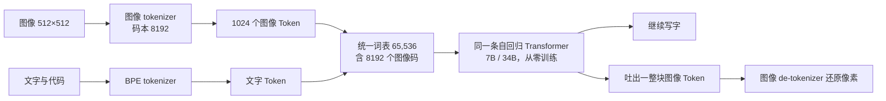
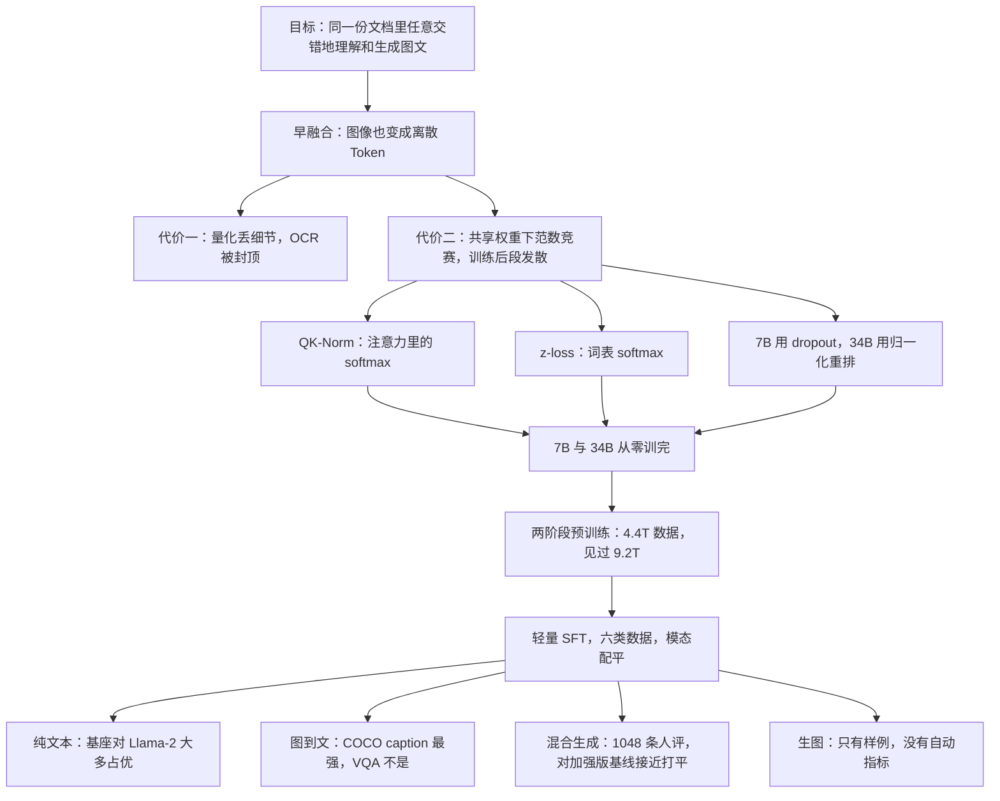

# Chameleon：把图像也切成 Token，同一条 Transformer 从零学会又看又画

<!-- release-date: 2024-06-18 -->

> 本文依据 Chameleon Team（FAIR at Meta）的 **Chameleon: Mixed-Modal Early-Fusion Foundation Models**，arXiv:2405.09818v2，2025-03-21 修订，封面日期 May 17, 2024，共 27 页。页码均指 PDF 自身页码。文中区分三件事：**报告明确写了什么**、**我们怎么解释它**、**哪些是外部资料或本文推算**。

## 阅读前先认识几个词

- **Token（词元）**：模型读写的最小单位。一个英文单词、一个汉字都可能被切成一块或几块。
- **码本（codebook）**：一张固定的「候选向量表」，每个候选有一个编号。把图像编码成离散 Token，就是给每一小块找最接近的候选、记下它的编号；解码时按编号取回向量，再还原成像素。
- **自回归**：一次只预测下一个 Token，把它接回输入再预测下一个。图像变成编号之后，画图也能这样一格一格地「写」出来。
- **后融合（late fusion）与早融合（early fusion）**：后融合是图像走独立的视觉编码器，到语言模型的某一层再接进来；早融合是从第一层起图和文就在同一条序列、同一套权重里。
- **softmax 的平移不变性**：给所有输入加同一个常数 $c$，softmax 的输出不变，即 $\mathrm{softmax}(z) = \mathrm{softmax}(z + c)$。这条性质是本文训练不稳定的病根。

报告里的三个稳定手段：

- **QK-Norm（query-key normalization）**：注意力打分前，先对 Query 和 Key 各做一次 LayerNorm，管住送进 softmax 的向量长度。
- **归一化重排（norm reordering）**：把 RMSNorm 从子层的入口挪到子层的输出上，再加回残差。
- **z-loss**：在损失里惩罚输出层 softmax 的配分函数，防止所有 logits 一起漂走。

## 一句话先说清

2024 年上半年公开的多模态模型大多是后融合：看图用现成的视觉编码器，画图外包给另一个扩散模型。它们擅长「看一张图、写一段话」，但很难在同一份文档里**任意交错地生成图和文**，比如写食谱写到一半，自己决定在这里插一张成品图，再接着把烤箱温度写完。报告把这称为完整的多模态文档建模（PDF p. 1）。

Chameleon 的做法是把图像也量化成离散 Token，和文字共用一张词表、一条从零训练的 Transformer、一个「预测下一个 Token」的目标（PDF p. 1–2）。想法不新，难的是训练：报告直说早融合的主要挑战是**优化稳定性与规模**（PDF p. 1），模型超过 8B 参数、数据超过 1T Token 后，发散常在训练很晚才出现（PDF p. 6）。

所以这份报告最硬的方法贡献，不是一个新的视觉模块，而是**一份让早融合从零训到 34B 的稳定配方**：QK-Norm + z-loss，再按规模选 dropout（7B）或归一化重排（34B）。对齐只做一轮轻量 SFT，没有 RLHF。

如果只记一句：

> **只要图像也是离散 Token，理解和生成就能共用一条自回归主干；代价是量化丢细节，以及一场从零开始的范数竞赛。**

## 先看全景：同一条序列里的两种 Token

据 PDF p. 2 的 Figure 1 与 §2.1 重画。原图用绿色画文字 Token、蓝色画图像 Token，每张图两端有 Start Image / End Image 边界标记。

三件事从这张图里读出来：

1. **主干外面没有视觉编码器**。图像先被量化成整数，再和文字走完全相同的层。
2. **生成也走同一条路**。模型吐出一块图像 Token，交给 de-tokenizer 还原，不另调扩散模型。
3. **训练数据本身是交错的**：纯文本、单张图配一段话、网页里图文穿插都有（PDF p. 4）。

报告在相关工作里把 Gemini 称为最相近的早融合模型，区别在于 Gemini 用了独立的图像解码器，而 Chameleon 是端到端的稠密模型、没有路由组件（PDF p. 17）。

## 核心设计一：图像也变成整数编号

### 旧问题

后融合的「看」和「画」是两套网络。好处是能复用训好的视觉编码器和语言模型；坏处是生成端不对称，模型没法在一条序列里自然地决定「这里插一张图」。早融合把不对称取消了，但把压力全压在图像 tokenizer 上：后面所有层能看见、能画出的东西，上限由它决定。

### 新设计

图像 tokenizer 新训，做法基于 Make-A-Scene（Gafni et al., 2022）（PDF p. 4）：

- 把 $512 \times 512$ 的图编成 **1024 个离散 Token**，码本大小 **8192**；
- 只用授权图像训练；因为生成人脸很重要，预训练时把含人脸的图像比例上采样 2 倍；
- 报告点名的核心弱点：**重建含大量文字的图像很差**，因此重度 OCR 类任务的能力被它封顶。

文字侧新训一个 BPE tokenizer，词表 **65,536，其中已包含 8192 个图像码本 Token**，用 sentencepiece 实现（PDF p. 4）。

$32 \times 32 = 1024$，相当于每 $16 \times 16$ 像素一格一个编号。这是本文按规格反推的，报告没写下采样倍数。

### 收益、代价

收益是架构极简：没有模态专用的编码器和解码器，Transformer 看到的永远是整数 ID，注意力、前馈、位置编码都不需要知道当前 ID 来自像素还是单词。

代价是量化本身就是信息瓶颈。码本外的细节在编码那一刻就没了，后面的 Transformer 再强也补不回来。报告自己承认 OCR 上限来自 tokenizer（PDF p. 4），人评题集里也没有 OCR 类题目（PDF p. 12 脚注）。

**对自己项目的用处**：既要看图又要画图时，先问量化损失能不能被任务接受。能接受，架构会简单很多；不能接受（文档、图表、小字），就别为了「统一成同一种符号」强行离散化。选了离散视觉 Token，等于提前承认哪些视觉任务不打算做好。

## 核心设计二：从零训练为什么会炸，三处补丁各管什么

这是全文最值得读的一节（PDF p. 6–8）。

### 病根：共享权重下的范数竞赛

骨架基本就是 Llama-2：RMSNorm、SwiGLU、RoPE（PDF p. 6）。照纯文本配方训混合模态数据，会在训练中后期因为范数缓慢增长出现复杂的发散（PDF p. 6）。

报告把原因收到 softmax 的平移不变性上。图和文两种模态的熵差很多，而所有权重跨模态共享，于是**每个模态都会把自己的范数悄悄抬高一点，好在 softmax 里抢到份额**。训练初期没事；一旦超出 bf16 的有效表示范围，就变成发散（PDF p. 6）。单模态里同样的现象叫 logit drift（PDF p. 6）。

裁自 PDF p. 6 的 Figure 5。三张子图分别支撑三句话：

- (a) **输出范数失控是未来发散的强先行信号**。发散可能在训练走完 20%–30% 之后才出现，但范数早就开始爬了（PDF p. 6）；
- (b) 7B 去掉 QK-Norm，大约在一个 epoch 的 20% 处发散（PDF p. 7）；
- (c) 7B 光有 QK-Norm 不够，还要在注意力和前馈之后加 dropout（PDF p. 7）。

图上的读图细节：(a) 里「只关 dropout」那条在 20k 步前后范数约 12，之后陡增；(c) 里不加 dropout 的曲线 loss 反而更低，只是在约 7 万步处就截止了（均为读图估计）。也就是说 dropout 在这里是**用一点 loss 换活着训完**。

裁自 PDF p. 7 的 Figure 6。它补上两条关键证据：

- (b) **关掉图像生成，同样的 7B 不发散**（PDF p. 6–7）。所以不稳定不是泛泛的「多模态」，而是**共享权重 + 图像生成 + softmax** 叠在一起。注意这张子图的 loss 刻度（约 0.93–1.15）和其他子图不可比，报告没说明口径；
- (c) 34B 上 dropout 救不了发散，有没有归一化重排都一样（PDF p. 7）。读图看，不重排的那条在约 4k、5.5k 步有尖峰；重排的那条没有尖峰，但在约 3.7 附近停滞（读图估计）。

### 三处补丁

softmax 在 Transformer 里出现两次：注意力内部，和最后的词表分类（PDF p. 6）。补丁就按这两处来。

**1. QK-Norm，管注意力里的 softmax。** 在注意力里对 Query、Key 做 LayerNorm，直接控制 softmax 输入的范数增长。这是相对 Llama 架构的第一处偏离，7B 和 34B 都开（PDF p. 6–7）。

**2. z-loss，管词表 softmax。** QK-Norm 解决不了最后一层的 logit 漂移（PDF p. 7）。设

$$
\sigma(x)_i = \frac{e^{x_i}}{Z},\qquad Z = \sum_i e^{x_i}
$$

$Z$ 是配分函数。损失里加上 $10^{-5} \log^2 Z$，让 $\log Z$ 不能离 0 太远，于是所有 logits 不能整体漂走（PDF p. 7）。两档都用。

**3. dropout 或归一化重排，按规模二选一。** 7B 的配方是 QK-Norm + z-loss + 注意力与前馈之后 dropout 0.1（PDF p. 7）。34B 这样不够，改用 Swin Transformer（Liu et al., 2021、2022）的归一化位置（PDF p. 7）：

$$
\begin{aligned}
\text{Chameleon-34B:}\quad & h = x + \mathrm{attention\_norm}(\mathrm{attention}(x)) \\
& \mathrm{output} = h + \mathrm{ffn\_norm}(\mathrm{feed\_forward}(h)) \\
\text{Llama-2:}\quad & h = x + \mathrm{attention}(\mathrm{attention\_norm}(x)) \\
& \mathrm{output} = h + \mathrm{feed\_forward}(\mathrm{ffn\_norm}(h))
\end{aligned}
$$

人话：Llama-2 先归一化再算子层；34B 先算子层，再把子层输出的范数按住，然后才加回残差，残差主干本身不做归一化。报告的理由是这能限制前馈块的范数增长，而 SwiGLU 是乘法结构，范数更容易被放大（PDF p. 7）。

三条相关观察（PDF p. 7）：

- 在 Llama-2 参数化发散之前，有没有重排，困惑度没有差别。这是「让模型活着训完」的改动，不是「让模型更强」的改动；
- 重排和 dropout 一起用效果不好，所以 34B 不用 dropout；
- 事后发现 7B 用了重排也能去掉 dropout，但**两种规模都离不开 QK-Norm**。

报告还提到，同期的 Unified-IO 2（Lu et al., 2023）也独立摸到了类似的多模态稳定手段（PDF p. 7）。

### 优化器与规模

AdamW，$\beta_1 = 0.9$、$\beta_2 = 0.95$、$\epsilon = 10^{-5}$；4000 步线性 warmup，之后学习率指数衰减到 0；weight decay 0.1；全局梯度裁剪 1.0（PDF p. 7）。全局 batch：7B 是 $2^{23}$（约 8M）Token，34B 是 $3 \times 2^{22}$（约 12M）Token（PDF p. 7）。

原文 Table 1（PDF p. 8）：

| 模型 | 参数 | 上下文 | GQA | Token | 学习率 | Epochs | Dropout | z-loss | QK-Norm |
|---|---|---|---|---|---|---|---|---|---|
| LLaMa-1 | 7B | 2k | 否 | 1.0T | $3.0 \times 10^{-4}$ | 1.0 | 0.0 | 0.0 | 否 |
| LLaMa-1 | 33B | 2k | 否 | 1.4T | $1.5 \times 10^{-4}$ | 1.0 | 0.0 | 0.0 | 否 |
| LLaMa-2 | 7B | 4k | 否 | 2.0T | $3.0 \times 10^{-4}$ | 1.0 | 0.0 | 0.0 | 否 |
| LLaMa-2 | 34B | 4k | 是 | 2.0T | $1.5 \times 10^{-4}$ | 1.0 | 0.0 | 0.0 | 否 |
| Chameleon | 7B | 4k | 否 | 4.4T | $1.0 \times 10^{-4}$ | 2.1 | 0.1 | $10^{-5}$ | 是 |
| Chameleon | 34B | 4k | 是 | 4.4T | $1.0 \times 10^{-4}$ | 2.1 | 0.0 | $10^{-5}$ | 是 |

两档学习率都比同尺寸 Llama-2 保守。34B 比 7B 多出来的是 GQA、归一化重排和「不用 dropout」，稳定配方不能在两档之间照搬。Table 1 没有列「归一化重排」这一栏，它只写在正文里。

Figure 6a 画的前 60 万步，报告说分别是 7B 训练的 55%、34B 的 80%（PDF p. 8）。按 9.2T Token 和上面的 batch 算，7B 约 110 万步、34B 约 73 万步，与这两个百分比吻合（本文算术）。

**对自己项目的用处**：最该带走的是诊断顺序，不是三个补丁的名字。**先盯最后一层的输出范数**，它比 loss 早很多；再判断漂的是注意力里的 softmax 还是词表 softmax，对症下药。多模态共享权重时，范数竞赛是默认风险，不是偶发 bug。小模型上管用的 dropout 不一定能救大模型。

## 核心设计三：两阶段预训练，以及 4.4T、4.8T、9.2T、约 10T

### 两个阶段

第一阶段占训练的前 80%，用大规模、完全无监督的数据（PDF p. 5–6）：

| 数据桶 | 规模 | 说明 |
|---|---|---|
| 纯文本 | 2.9T Token | Llama-2 与 CodeLlama 的预训练数据 |
| 图文对 | 14 亿对，1.5T Token | 公开来源 + 授权数据；图像 resize 后中心裁成 $512 \times 512$ |
| 图文交错 | 400B Token | 公开网页，不含 Meta 产品或服务的数据；图像过滤同图文对 |

所有图文对有 50% 的时间把图放在文字前面，也就是当成看图说话来训（PDF p. 5）。

第二阶段是最后 20%：第一阶段数据的权重降低 50%，混入更高质量的数据，同时保持相近的图文 Token 比例；另外加入一大批指令微调训练集的过滤子集（PDF p. 6）。第二阶段各来源的 Token 数和「更高质量」的判据没写。

### 四个 Token 数对应四件事

| 数字 | 出处 | 含义 |
|---|---|---|
| 4.8T | 第一阶段三桶之和，本文算术（PDF p. 5–6） | $2.9 + 1.5 + 0.4$ |
| 4.4T | Table 1 的 Token 列（PDF p. 8） | 训练数据集规模 |
| 9.2T | 正文（PDF p. 7–8） | 在完整数据上走 2.1 个 epoch，训练中见过的 Token 总数；$4.4 \times 2.1 \approx 9.2$ |
| 约 10T | Figure 1 图注（PDF p. 2）；引言说 34B 见过的 Token 是 Llama-2 的 5 倍（PDF p. 1） | 9.2T 的圆整说法 |

4.8T 与 4.4T 差的 0.4T，报告没有解释。**9.2T 里含图像**：第一阶段就有 1.9T 的图文对与交错 Token，第二阶段还保持相近比例，不能读成「纯文本 9.2T」。

### 硬件

预训练在 Meta 的 Research Super Cluster（RSC）上，对齐在其他内部研究集群上，都是 NVIDIA A100 80 GB；前者用 Quantum InfiniBand，后者用 Elastic Fabric（PDF p. 8）。

| 模型 | 并发 GPU | GPU 小时 |
|---|---:|---:|
| 7B | 1024 | 856,481 |
| 34B | 3072 | 4,282,407 |

来自 Table 2（PDF p. 8）。按 GPU 小时除以并发卡数，7B 约 35 天、34B 约 58 天墙钟（本文算术，假设全程满卡）。并行策略、MFU、精度细节都没写。

## 核心设计四：轻量对齐，SFT 也要配平模态

### 旧问题

预训练模型会「接着写」，但不知道用户想要一段带插图的回答，还是一句拒答。早融合多一个特有问题：「该不该开始吐图像 Token」写在同一个下一 Token 分布里。后融合模型由外部逻辑决定要不要调用生图模块；Chameleon 只能靠数据教。

### 新设计

对齐走 LIMA（Zhou et al., 2023）那条路：精心挑选的高质量数据做 SFT（PDF p. 9）。数据分六类（PDF p. 9，Table 3）：

| 类别 | 样本 | Token | 图像 |
|---|---:|---:|---:|
| Text | 1.6M | 940.0M | – |
| Code | 14.1K | 1.1M | – |
| Visual Chat | 15.6K | 19.4M | 16.7K |
| Image Generation | 64.3K | 68.0M | 64.3K |
| Interleaved Generation | 16.9K | 35.8M | 30.7K |
| Safety | 95.3K | 38.6M | 1.6K |

- 文字 SFT 继承 Llama-2，代码 SFT 继承 CodeLlama；
- 生图 SFT：用美学分类器给授权图像打分，先留评分至少 6 分的，再取尺寸与长宽比最接近 $512 \times 512$ 的 64K 张；
- Visual Chat 与交错生成：找第三方供应商收高质量数据，不含 Meta 用户数据；
- 安全数据：可能诱发不安全内容的提示配拒答，来源包括 Llama-2-Chat、Rainbow Teaming 合成的文本、Pick-A-Pic 里人工挑的生图提示、网络安全样例，以及内部人工标注加自动扩展的混合模态提示。报告强调混合模态提示特别重要，因为这类攻击不在纯文本或文生图安全数据的分布里（PDF p. 9）。

**模态配平**是这一节的关键句：SFT 阶段如果某种模态配对严重失衡，或者某种模态「该触发」的样本失衡，模型会学到一个与内容无关的先验，要么把这种模态压成哑巴，要么过度生成（PDF p. 9）。

优化细节（PDF p. 9–11）：余弦学习率，起点 $10^{-5}$，weight decay 0.1，batch 128，序列最长 4096；把尽可能多的问答对打包进一条序列，中间插分隔 Token；**只在回答 Token 上算损失**，报告说这带来小幅提升；dropout 0.05；保留预训练时的 z-loss。图像预处理按角色区分：提示里的图加边 padding 缩放，保证信息不被裁掉；回答里的图中心裁剪，保证生成观感（PDF p. 11）。

### 代价

对齐这么轻，安全主要靠拒答样本而不是奖励模型。报告在安全测试一节自己说，RLHF / RLAIF 能进一步抵抗越狱与恶意攻击，当前的安全调优是给「合理、善意地使用这份研究产物」的保护（PDF p. 14）。

**对自己项目的用处**：早融合模型的 SFT 配的不只是内容质量，还有「何时发出哪种 Token」。安全拒答、生图美学、交错文档要一起配平；只堆文字指令，图像通道会被用歪。

## 推理：统一表示把控制流搬进了每一步

训练时整条序列已经铺好；推理时每一步都要决定现在是在写字还是在画图。报告列了三个特有难点（PDF p. 8）：

1. **逐步数据依赖**：生成图像和生成文字的解码方式不同，每一步都要检查刚出的 Token（阻塞式地从 GPU 拷回 CPU）来决定控制流；
2. **按模态约束的掩码**：只允许生图时，不属于图像空间的 Token 要被掩掉；
3. **图像块定长**：文字天然可变长，而一张图对应固定长度的一块 Token。

为此他们基于 PyTorch 和 xformers 的 GPU 内核写了独立的推理管线，文字和图像都支持流式输出。流式时每一步都要按 Token 走条件逻辑；非流式时整块图像 Token 可以融合生成、不需要条件计算；掩码让 GPU 上不必分支。但即便非流式，写字时每个 Token 仍要检查是否是 image-start，以便切换到图像解码（PDF p. 8）。吞吐与延迟数字没给。

这不是算法贡献，却是早融合落地必然要付的系统税：统一表示省掉了双塔，却把「两个模块之间的接口」变成了「每一步的控制流」。

## 实验：先分清三种证据

摘要里的成绩有四句，证据类型完全不同（PDF p. 1）：看图说话 SOTA、纯文本超过 Llama-2，用的是自动指标；「非平凡的图像生成」没有自动指标表；长篇混合生成「匹敌或超过更大的模型」，用的是人评。

### 纯文本：预训练基座，没做 SFT

评测照 Llama-2 的协议，常识与阅读理解 0-shot，GSM8K 8-shot，MATH 4-shot（PDF p. 15–16）。原文 Table 6 的主要行（PDF p. 15）：

| 任务 | Chameleon 7B | Chameleon 34B | Llama-2 7B | Llama-2 34B | Llama-2 70B | Mistral 7B | Mixtral 8x7B | Gemini-Pro | GPT-4 |
|---|---:|---:|---:|---:|---:|---:|---:|---:|---:|
| PIQA | 79.6 | 83.3 | 78.8 | 81.9 | 82.8 | 83.0 | 83.6 | – | – |
| SIQA | 57.0 | 63.3 | 48.3 | 50.9 | 50.7 | – | – | – | – |
| HellaSwag | 74.2 | 82.7 | 77.2 | 83.3 | 85.3 | 81.3 | 84.4 | – | – |
| HellaSwag 10-shot | 75.6 | 85.1 | – | – | 87.1 | 83.9 | 86.7 | 84.7 | 95.3 |
| WinoGrande | 70.4 | 78.5 | 69.2 | 76.7 | 80.2 | 75.3 | 77.2 | – | – |
| ARC-E | 76.1 | 84.1 | 75.2 | 79.4 | 80.2 | 80.0 | 83.1 | – | – |
| ARC-C | 46.5 | 59.7 | 45.9 | 54.5 | 57.4 | 55.5 | 59.7 | – | – |
| OBQA | 51.0 | 54.0 | 58.6 | 58.2 | 60.2 | – | – | – | – |
| BoolQ | 81.4 | 86.0 | 77.4 | 83.7 | 85.0 | 84.7 | – | – | – |
| GSM8K maj@1 | 41.6 | 61.4 | 14.6 | 42.2 | 56.8 | – | – | – | – |
| GSM8K 多数投票 | 50.9（maj@8） | 77.0（maj@32） | – | – | – | 52.1（maj@8） | 74.4（maj@8）/ 75.1（maj@32） | 86.5（maj@32，CoT） | 92.0（SFT，CoT） |
| MATH maj@1 | 11.5 | 22.5 | 2.5 | 6.24 | 13.5 | – | – | 32.6 | 52.9 |
| MATH maj@4 | 12.9 | 24.7 | – | – | – | 13.1 | 28.4 | – | – |
| MMLU | 52.1 | 65.8 | 45.3 | 62.6 | 68.9 | 60.1 | 70.6 | 71.8 | 86.4 |

表注说 GSM8K 与 MATH 未特别标注的都是 maj@1；Mistral 7B 的 BoolQ、Mixtral 的 GSM8K maj@32 是报告自己框架测的，GPT-4 的 MATH 取自 Gemini 报告（PDF p. 15 表注）。

报告的读法（PDF p. 15–16）：常识与阅读理解上两档都与对应 Llama-2 相当，34B 在 8 项里有 5 项超过 Llama-2 70B，与 Mixtral 8x7B 同档；GSM8K 上 34B 的 maj@1 61.4 超过 Llama-2 70B 的 56.8，maj@32 77.0 超过 Mixtral 的 75.1；MMLU 两档都超过对应 Llama-2，34B 的 65.8 接近 Mixtral 70.6 与 Gemini-Pro 71.8。

两点要自己校准：

- 报告总结写「全面超过 LLaMa-2」（PDF p. 16），但表上 HellaSwag 0-shot 与 OBQA 两项，两档 Chameleon 都低于同尺寸 Llama-2，比如 OBQA 34B 是 54.0 对 58.2。按本文逐格数，常识与阅读 8 项里两档各赢 6 项；
- 报告把增益归因于三件事，而不是「早融合让文字变好」：Llama-2 预训练数据走了两个 epoch、总算力更多；代码数据显著帮到文本推理；最后 20% 的高质量数据（PDF p. 16）。三件事都没有单独消融。

### 图到文：caption 的 SOTA 落在 COCO

只报 34B（PDF p. 16–17）。caption 用 CIDEr，COCO 与 Flickr30k 都是 Karpathy 测试划分，Chameleon 的 caption 限长 30 个 Token；VQA 用 VQA-v2 test-dev。预训练数据没为 0-shot 专门排版，所以评测时借用了其他模型公开的提示。GPT-4V 与 Gemini 通过 API 试了多种提示和生成长度，报告取能拿到的最好成绩（PDF p. 16）。原文 Table 7（PDF p. 17）：

| 类别 | 模型 | 规模 | COCO | Flickr30k | VQAv2 |
|---|---|---|---:|---:|---:|
| 预训练 | Flamingo-80B | 80B | 113.8（32-shot） | 75.1（4-shot） | 67.6（32-shot） |
| 预训练 | IDEFICS-80B | 80B | 116.6（32-shot） | 73.7（4-shot） | 65.9（32-shot） |
| Chameleon | Chameleon | 34B | 120.2（2-shot） | 74.7（2-shot） | 66.0（2-shot） |
| Chameleon | Chameleon-SFT | 34B | 140.8（0-shot） | 82.3（2-shot） | – |
| Chameleon | Chameleon-MultiTask | 34B | 139.1（2-shot） | 76.2（2-shot） | 69.6 |
| 微调 | Flamingo-80B-FT | 80B | 138.1 | – | 82.0 |
| 微调 | IDEFICS-80B-Instruct | 80B | 123.2（32-shot） | 78.4（32-shot） | 68.8（32-shot） |
| 闭源 | GPT-4V | – | 78.5（8-shot，API） | 55.3（8-shot，API） | 77.2 |
| 闭源 | Gemini Nano 2 | – | – | – | 67.5 |
| 闭源 | Gemini Pro | – | 99.8（2-shot，API） | 82.2（4-shot，API） | 71.2 |
| 闭源 | Gemini Ultra | – | – | – | 77.8 |

报告的读法（PDF p. 16–17）：预训练 34B 用 2-shot，COCO 超过 80B 的 Flamingo 与 IDEFICS 的 32-shot，Flickr30k 与它们持平；微调后 SFT 与多任务版在 COCO 上超过表里所有模型，Flickr30k 上 SFT 最高；VQA-v2 上预训练 2-shot 与两个 80B 的 32-shot 相当，多任务微调后接近 IDEFICS-Instruct 与 Gemini Pro，但落后于 Flamingo-80B-FT、GPT-4V 和 Gemini Ultra。

**VQA 上的 SOTA 说法前后不一**。引言说 34B 在 VQA 与看图说话上达到 SOTA，胜过 Flamingo、IDEFICS 和 Llava-1.5（PDF p. 2）；§5.2 却写 Llava-1.5 在 VQAv2 上高于 Chameleon-34B，并把原因归到它额外用了 GPT-4 对话、ShareGPT、GQA 与区域级 VQA 数据做微调（PDF p. 16–17）。Llava-1.5 也不在 Table 7 里。能被表支持的只有「COCO caption SOTA」这一半。

### 长篇混合生成：1048 条人评

这是报告最强调的新能力，也最容易被摘要带偏。

**题集**（PDF p. 11）：第三方众包供应商让标注者按生活场景构思「希望多模态模型生成什么」，提示可以是纯文本或带图，但期望的回答必须图文混合。再由三名标注者判断提示是否清楚、是否期望回答带图，多数票过滤。最终 1048 条：441 条（42.1%）输入带图，607 条（57.9%）纯文本。人工分成 12 类，占比如下（PDF p. 11，Figure 8）：

| 类别 | 占比 | 类别 | 占比 | 类别 | 占比 |
|---|---:|---|---:|---|---:|
| Brainstorming | 18.6% | Advice | 10.2% | Hypothetical | 5.6% |
| Explanation | 14.4% | Comparison | 9.6% | Report | 5.4% |
| How-to | 12.5% | Identification | 9.3% | Other | 5.2% |
| Story | 3.9% | Article | 3.1% | Reasoning | 2.1% |

脚注说明，虽然没有刻意排除，但需要读出图中文字的 OCR 类题目没有出现在题集里（PDF p. 12）。

**对照**（PDF p. 12）：Chameleon 34B 对 GPT-4V 和 Gemini Pro 的 API。这两个 API 当时只能回文字。报告又做了加强版：在提示末尾加一句，要求它们在需要图时改写成 caption，再用 DALL-E 3 按 caption 生图替换回去，称为 GPT-4V+ 与 Gemini+。

**绝对评测：任务完成率**（PDF p. 12，Figure 9a 的正文数字）：

| 模型 | 完全完成 |
|---|---:|
| Chameleon | 55.2% |
| GPT-4V+（文字 + DALL-E 3） | 44.7% |
| Gemini+（文字 + DALL-E 3） | 37.6% |
| GPT-4V（只有文字） | 23.1% |
| Gemini（只有文字） | 17.6% |

报告自己怀疑，题集都期望混合输出，只回文字的答案容易被判成只完成一半（PDF p. 12）。这是评测设计带来的倾斜，不是 GPT-4V、Gemini 看不懂图。按类别看，Chameleon 在 Brainstorming、Comparison、Hypothetical 上较好，在 Identification、Reasoning 上较弱（PDF p. 12–13）；附录 Table 9 里 Story 一类 Chameleon 完全完成 31.7%，低于 GPT-4V+ 的 53.7%（PDF p. 25）。按输入模态，Chameleon 在纯文本提示上略好（57.7% 对 55.3%），两个加强版基线则在带图提示上略好（PDF p. 13、p. 25，Table 10）。

**相对评测：胜率**。两份回答随机顺序并排，标注者选更好的或「差不多」；胜率按赢记 1 分、平记 0.5 分计算（PDF p. 13 脚注）。附录 Table 11–14 给了计数（PDF p. 26–27）：

| 对照 | 赢 / 平 / 负 | 胜率 |
|---|---|---:|
| vs Gemini+，全部 1048 条 | 435 / 362 / 251 | 58.8% |
| vs Gemini+，带图提示 441 条 | 194 / 145 / 102 | 60.4% |
| vs GPT-4V+，全部 | 375 / 331 / 342 | 51.6% |
| vs GPT-4V+，带图提示 | 149 / 119 / 173 | 47.3% |
| vs Gemini，全部 | 561 / 327 / 160 | 69.1% |
| vs GPT-4V，全部 | 482 / 329 / 237 | 61.7% |

**60.4% 的来历要回表**。引言说 34B 对 Gemini-Pro 的偏好率 60.4%、对 GPT-4V 51.6%（PDF p. 2）；§4.2.2 说对 Gemini+ 与 GPT-4V+ 的总体胜率分别是 60.4% 与 51.6%，但同一段给出的 Gemini+ 分布是赢 41.5%、平 34.5%、负 24.0%，按脚注公式算是 58.8%（PDF p. 13）。附录显示 60.4% 是**带图提示子集**对 Gemini+ 的胜率，全体是 58.8%。51.6% 则确实是全体对 GPT-4V+。换句话说，两个头条数字一个是全体、一个是子集，对照对象也都是外挂了 DALL-E 3 的加强版。

另外两个细节值得记住：对 GPT-4V+ 的 Story 类，Chameleon 0 胜 15 平 26 负，胜率 18.3%（PDF p. 26，Table 12）；带图提示上对 GPT-4V+ 的胜率是 47.3%，低于一半。

**标注一致性一般**（PDF p. 14）：相对评测里三人全一致的约 28%–35%，两人一致的约 55%–60%，三人各执一词的约 10%，后者按平局计（Table 4）。任务完成率的 Krippendorff's Alpha 是 0.338（95% 区间 0.319–0.356）；相对评测对 Gemini+、GPT-4V+ 分别是 0.337 与 0.396（PDF p. 14 脚注）。报告自己的解读是，很多题上 Chameleon 与基线表现相近，相对判断本来就难。

§4.5 列了人评的边界（PDF p. 14）：提示来自众包，不是真实用户；题量有限，覆盖面有限；因为聚焦混合输出，OCR 与信息图类理解任务自然被排除；当时的多模态 API 只能回文字，没有别的原生混合生成模型可比，只能给它们外挂生图。

### 图像生成：有样例，没有自动指标

摘要说「non-trivial image generation」（PDF p. 1），贡献列表写「high quality image generation」（PDF p. 2），但全文**没有 FID、CLIP Score 或任何生图基准表**。能当证据的只有 Figure 2–4 与附录 A 的样例（PDF p. 3–5、p. 23–24），以及人评讨论里「生成的图通常与上下文相关」这句观察（PDF p. 14）。

### 安全测试

2 万条众包提示，覆盖文本与混合输入、诱发不安全的文字、图像或混合输出；另有内部红队对更大一档做了 445 轮交互，含多轮（PDF p. 14–15）。原文 Table 5（PDF p. 15）：

| 数据 | 模型 | 安全 | 不安全 | 不确定 |
|---|---|---:|---:|---:|
| 众包 | 7B | 99.2% | 0.4% | 0.4% |
| 众包 | 34B | 99.7% | 0.1% | 0.2% |
| 红队 | 34B | 93.9% | 1.6% | 4.5% |

正文给的计数是 7B 不安全 78 条（0.39%）、更大一档 19 条（0.095%），红队 7 条不安全、20 条不确定（PDF p. 14）。正文把更大一档写成「30B」，表里写 34B，是同一个模型。

## 限制与没公开的东西

报告写了的限制：tokenizer 重建带字的图很差，OCR 被封顶（PDF p. 4）；人评题集来自众包、偏向「请给出图文回答」，对只能回文字的 API 不公平，且没有其他原生混合生成模型可比（PDF p. 14）；轻量 SFT 挡得住善意使用，更强的对抗防护要靠 RLHF / RLAIF（PDF p. 14）。结论一节不再单列失败模式（PDF p. 17–18）。

报告内部几处对不上：60.4% 的口径、VQA 与 Llava-1.5 的 SOTA 说法、「全面超过 LLaMa-2」、30B 与 34B 的叫法、4.8T 与 4.4T，见上文。

没公开的：

- 图像 tokenizer 的结构细节、重建质量指标，以及主干训练时它是否冻结；
- 第二阶段各来源的 Token 数和过滤规则；4.8T 与 4.4T 的差；
- 并行策略、精度、MFU；
- 推理管线的吞吐与延迟；
- 图像生成的任何自动指标；
- 三个稳定手段各自的完整消融（只有 Figure 5–6 的几条曲线，且只画到发散或几十万步）；
- 文本增益三个归因各自的消融。

## 最值得带回自己项目的六条

### 1. 统一表示之前，先问生成端要不要统一

只需要看图回答时，后融合更省事，还能复用现成视觉编码器。Chameleon 付早融合的稳定税，是因为生成端也要在同一条序列里插图。需求不在，就不必付这笔税。

### 2. 共享权重训多模态，把输出范数当第一监控指标

loss 还没炸，范数已经在爬（Figure 5a）。QK-Norm、z-loss、把 norm 挪到子层输出上，管的都是同一件事：softmax 的平移不变性让各模态互相抬范数。

### 3. 稳定配方按规模分叉

7B 靠 dropout，34B 靠归一化重排，两者一起用反而不好；只有 QK-Norm 在两档都是刚需（PDF p. 7）。从小模型抄超参到大模型，在早融合里可能直接训崩。

### 4. 能关掉的变量就关掉一次

「关掉图像生成就不发散」（Figure 6b）这一条消融，把不稳定的来源从泛泛的「多模态」定位到「共享权重下的生图」。排查训练不稳时，先找一个能单独关掉的开关做对照。

### 5. SFT 要配平「何时发出哪种 Token」

早融合把「要不要画图」写进了下一 Token 分布，配比失衡就会学到与内容无关的模态先验（PDF p. 9）。

### 6. 人评要同时报原版与加强版基线，并写清分母

Chameleon 对只回文字的 API 胜率很高，对外挂 DALL-E 3 的 GPT-4V+ 全体只有 51.6%。评测混合生成时，基线怎么补齐、分母是全体还是子集，都会改变结论。

## 用一张图重新串起全文

## 关键词回看

- **早融合 / 后融合**：要不要从第一层起就把图文放进同一条序列和同一套权重。
- **离散视觉 Token**：$512 \times 512$ 的图编成 1024 个编号，码本 8192，词表 65,536 里含这 8192 个码。
- **softmax 平移不变性 / logit drift / 输出范数**：早融合从零训练会发散的原因和早期信号。
- **QK-Norm / z-loss / 归一化重排 / dropout**：两处 softmax 各一个补丁，外加按规模二选一的第三个。
- **4.4T / 9.2T / 约 10T**：数据集规模、见过的 Token 数、圆整说法，都含图像。
- **模态配平**：SFT 里防止模型学到「总画图」或「从不画图」的无条件先验。
- **GPT-4V+ / Gemini+**：给只能回文字的 API 外挂 DALL-E 3 的加强版基线。
- **胜率**：赢记 1 分、平记 0.5 分；60.4% 是带图提示子集，全体是 58.8%。

## 最后的判断

Chameleon 最值得学的，不是「一个模型刷了几张榜」，而是它把「完整的混合模态文档」当作第一等需求，愿意为此放弃现成的视觉编码器，再付一笔从零训练的稳定税。QK-Norm、z-loss 和子层输出归一化是这笔税的收据；两阶段数据、轻量 SFT 和模态配平是把主干变成能对话、能插图、能拒答的配方。

证据强度是分层的：

- **有实验撑住的**：早融合在 7B、34B 上能从零训完，前提是 QK-Norm 与 z-loss，再按规模选 dropout 或重排（Figure 5–6、Table 1）；关掉生图就不发散（Figure 6b）；34B 预训练基座在 COCO caption 上用更少的 shot 超过 80B 后融合模型（Table 7）；在期望图文输出的人评里，原生交错生成对只回文字的 API 有明显完成率优势（Figure 9）。
- **需要打折读的**：「全面超过 LLaMa-2」「VQA 达到 SOTA」「对 Gemini-Pro 60.4%」三句都比表说得满；人评题集偏向混合输出，一致性一般。
- **没有证据的**：同等数据与算力下早融合是否强于后融合（对照模型的数据、规模、shot 数都不同）；图像生成的自动指标；OCR 与读图表能力。

如果只带走一句：

> **统一的是 Token 和主干，稳住的是范数；没统一的，是评测口径。**

## 资料与阅读边界

**原始依据**

- *Chameleon: Mixed-Modal Early-Fusion Foundation Models*，[arXiv:2405.09818](https://arxiv.org/abs/2405.09818) v2（2025-03-21 修订，v1 为 2024-05-16），封面日期 May 17, 2024，27 页。全文 `(PDF p. N)` 均指这一版。v2 是 arXiv 上的最新版。

**首发日证据**

- `release-date` 取 **2024-06-18**，即 Chameleon 模型首次对外可用的日期。[Meta FAIR 官方博客](https://ai.meta.com/blog/meta-fair-research-new-releases/)标注 June 18, 2024，宣布在研究许可下公开 7B 与 34B 模型；[官方仓库 facebookresearch/chameleon](https://github.com/facebookresearch/chameleon) 的首个提交「Meta Chameleon」在 2024-06-18 16:10 UTC，README 同时给出论文、博客与权重申请页链接。
- arXiv v1（2024-05-16）发布时模型不可用，不作首发日；v2 修订日不回写。

**外部补充（不是报告内容）**

- 开源范围来自上面的官方博客：公开的模型支持混合模态输入、**只输出文字**，原话是「At this time, we are not releasing the Chameleon image generation model」。所以开源权重复现不了论文里的生图与混合生成人评。
- 官方仓库 README 把更大一档称为 30B，与 PDF 正文安全一节的「30B」一致，与 Table 1、Table 5 的 34B 并存。
- 同方向后来的路分成两支：继续把图像当离散 Token，或改回连续表示加扩散（见 Transfusion 一篇）。本文不引用后作的任何数字。
- 文中标为「本文算术」「读图估计」「本文逐格数」的内容（16 像素一格、4.8T 之和、训练步数与墙钟天数、Figure 5–6 的读数、Table 6 的胜负计数），报告原文都没有。
