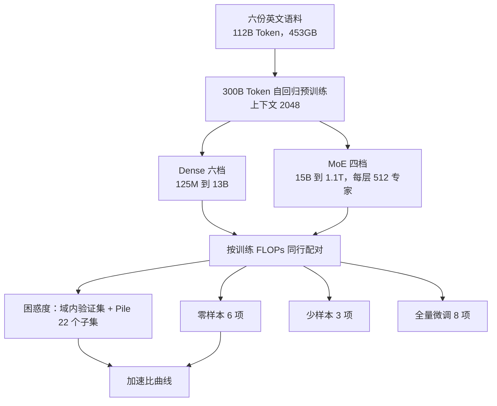
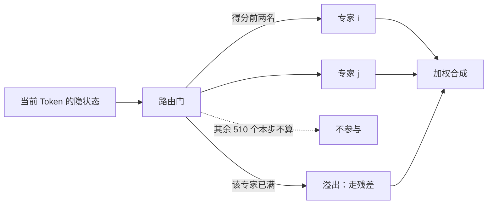

# 同样 FLOPs 下 MoE 何时赢过 dense，以及微调为什么赢不了

<!-- release-date: 2021-12-20 -->

> 本文依据 Meta AI 的 **Efficient Large Scale Language Modeling with Mixtures of Experts**，arXiv:2112.10684v2，2022-10-26，共 17 页（正文 p. 1–9，参考文献 p. 9–13，附录 A–G p. 14–17），EMNLP 2022。页码均指 PDF 自身的页码。文中区分三件事：**论文明确写了什么**、**我们如何解释或从图上读出什么**、**哪些是外部资料补充**。

## 读前先把几个词说成人话

这篇论文几乎不发明新模块。它难读的地方，是把「模型有多大」和「一次前向要算多少」故意拆开，再用四套评测去问：拆开之后，哪边还值钱。

- **Dense（稠密模型）**：每一层的全部参数，对每个 Token 都要算一遍。参数翻倍，单次计算量大致也翻倍。
- **MoE（Mixture-of-Experts，混合专家）**：把前馈网络（FFN）拆成许多个专家，每个 Token 只让其中少数几个干活。总参数可以很大，每 Token 的计算量却不跟着涨。这种「按输入决定算哪一部分」叫**条件计算（conditional computation）**。
- **ZFLOPs**：论文的训练成本单位，$10^{21}$ 次浮点运算（PDF p. 3 表 1）。全文拿训练 FLOPs 当账单，不拿总参数当账单。
- **零样本 / 少样本 priming**：权重不动，只在输入里放 0 条或 $k$ 条示例，让语言模型给每个候选答案打分、取最高分。
- **全量微调（full-shot fine-tuning）**：用下游任务的全部训练集，更新模型的全部参数。
- **MoE 加速比（speedup factor）**：打到同一个成绩，dense 花的训练 FLOPs 除以 MoE 花的（PDF p. 5–6）。

## 一句话先说清

2021 年底，大模型变强的最可靠办法仍是加参数、加训练算力，两者绑在一起（PDF p. 1）。稀疏 MoE 已经在语言建模和机器翻译上证明「参数可以变多、计算不必等比例变多」，但**还没有被证明在微调和零样本 / 少样本上有效**（PDF p. 1）。

Meta 这篇就量这一件事：同样的解码器骨架、同样的 300B Token，按训练 FLOPs 而不是总参数把 dense 和 MoE 配对，看四类评测里谁省钱。摘要的结论（PDF p. 1）：

- 除了微调，MoE 明显更省算力；
- 预算较小时，MoE 大约用四分之一的算力打平 dense；
- 差距随规模收窄，但最大的 1.1T MoE 仍一致优于算力相当的 6.7B dense；
- 这个差距在任务和领域之间变化很大，说明两种模型的泛化方式不一样。

后面所有表格都在给这四句划边界。对推理服务来说，边界比口号要紧：你买到的是「同样训练 FLOPs 下更大的容量」，不是「同样显存、同样微调流程下的免费升级」。

### 一条阅读路线

1. **p. 1 Figure 1**：三条加速比曲线。域内、域外、零样本不是同一回事。
2. **p. 3 表 1**：谁和谁算「算力相当」。1.1T MoE 对上的是 6.7B dense，不是 175B。
3. **p. 5–6 第 3.3.3 节**：加速比怎么从离散的几档模型插值出来。
4. **p. 6–7 Figure 2–3、表 2**：语言建模与零样本；p. 15 表 5 是 22 个 Pile 子集的全部困惑度。
5. **p. 7–8 表 3–4**：少样本仍赢；全量微调是例外。
6. **附录 D–G（p. 14–17）**：GPU 日与碳排、蒸馏、纯 FP16 与 FSDP、FLOPs 公式。

## 主要矛盾：容量和 FLOPs 被绑在同一张账单上

dense 把「能记住多少」和「每次要算多少」焊在一起。MoE 声称能把两件事拆开。可是拆开之后，省下的算力在语言建模上好不好使是一回事，搬到零样本、少样本、全量微调上还好不好使，是另外三回事。作者点名的缺口是：Switch Transformers 当时没把微调做扎实，零样本和少样本更是空白（PDF p. 1–2）。

所以这篇论文不是一套新路由算法，而是一次对照实验。「用 MoE 换算力」这句口号，要被四套评测分别定价，不能只拿验证集困惑度宣布胜利。

## 先看全景：这不是一座新模型，是一张配对表

这是按 PDF p. 1–5 的叙事重画的流程示意，不是论文原图。

贯穿全文的对照尺是表 1（PDF p. 3），同一行的模型训练 FLOPs 大致可比：

| 行 | Dense 参数 / 训练 ZFLOPs | 层 / 宽 | MoE 参数 / 训练 ZFLOPs | 专家数 |
|---|---|---|---|---:|
| 1 | 125M / 0.36 | 12 / 768 | 15B / 0.43 | 512 |
| 2 | 355M / 1.06 | 24 / 1024 | 52B / 1.30 | 512 |
| 3 | 1.3B / 3.57 | 24 / 2048 | 207B / 4.53 | 512 |
| 4 | 2.7B / 7.08 | 32 / 2560 | 这一档没有 MoE | — |
| 5 | 6.7B / 17.12 | 32 / 4096 | 1.1T / 22.27 | 512 |
| 6 | 13B / 32.67 | 40 / 5120 | 这一档没有 MoE | — |

MoE 与同行 dense 共用层数和宽度，只把 FFN 换掉。表里还列了 GPT-3 各档（760M 为 2.13、175B 为 430.17 ZFLOPs），作者没有自己训（PDF p. 3）。

两个数字对必须先钉住，后面所有「1.1T 赢了」都踩在上面。

第一，**1.1T 对上的是 6.7B，不是 175B**。$22.27 / 17.12 \approx 1.30$：多花约 30% 的训练 FLOPs，换来约 160 倍总参数。这两个除法是我们按表 1 算的。

第二，**FLOPs 相当不等于 GPU 时间相当**。附录 D 按实测训练速度折算 GPU 日：dense 每张 A100 按 160 TFLOP/s，MoE 按 115 TFLOP/s，差在 all-to-all 通信（PDF p. 14 脚注 14）。表 8 里 6.7B dense 是 1238 GPU 日，1.1T MoE 是 2241 GPU 日，约 1.8 倍（PDF p. 16）。

## 条件计算：隔层换成 512 个专家，每个 Token 只走两个

### 配置

dense 骨架尽量对齐 GPT-3，只有两处不同：只用稠密注意力（GPT-3 是稠密与局部带状稀疏交替），位置编码用正弦（跟 Shortformer），脚注说早期实验效果相当、还少学一些参数（PDF p. 3）。预归一化 Transformer，GELU 激活（PDF p. 3）。

MoE 沿用 GShard 的设计（PDF p. 2–3）：

- **隔一层**把 dense FFN 换成 MoE 层，不是每层都换；
- 每个 MoE 层 $E = 512$ 个专家，路由门给每个 Token 挑 **top-2**；
- 主损失上加一项加权的门控损失，鼓励 Token 在专家间均匀分布；
- 每个专家的容量是 $C \cdot B / E$ 个 Token，$B$ 是这一批的 Token 总数，容量因子 $C = 2$；专家接满之后再来的 Token 记为溢出，表示直接从残差连接绕过这一层专家。

这是按 PDF p. 2–3 的文字重画的机制示意，不是论文原图。

**我们如何解释容量这一条。** 按论文写的公式，$C = 2$ 时每个专家最多接 $2B/E$ 个 Token；top-2 下每个 Token 占两个名额，完全均匀时每个专家也正好分到 $2B/E$ 个。若按这个口径，均匀路由时没有任何余量，一点不均衡就会溢出。论文没有说第二个专家是否像 GShard 那样按概率派发，也没有报溢出比例，所以我们不知道有多少 Token 实际「白走了一层」。

### 他们拒绝的补丁，和换上的那个

Switch Transformers 报告过大 MoE 训练不稳，建议缩小初始化权重；本文「并不觉得有必要」（PDF p. 3）。他们改的是：专家参数看到的 batch 是 dense 参数的 $1/E$，于是把专家梯度乘上 $1/\sqrt{E}$，理由是「batch 增大 $E$ 倍，学习率该增大 $\sqrt{E}$ 倍」这条经验（PDF p. 3）。

**我们如何解释它。** 论文把这一步当成「按 batch 大小缩放专家学习率」。但在 Adam 下，常数倍缩放梯度会在一阶矩与二阶矩开方的比值里基本抵消，真正起作用的途径取决于它和梯度裁剪、$\epsilon$、FP16 损失缩放的先后次序；论文没有写这些细节，也没有消融。所以只能说「他们用了这个处理、训练稳住了」，不能说「专家步长被压到二十分之一」。

优化与日程（PDF p. 3–4）：Adam，$\beta_1 = 0.9$，$\beta_2 = 0.98$，$\epsilon = 10^{-8}$，权重衰减 0.01，dropout 0.1；学习率在前 375M Token 从 0 线性升温，再线性降回 0；batch 与峰值学习率按 GPT-3 的表随模型大小取。例外在脚注 4：355M dense 与 FLOPs 对齐的 52B MoE 没开 dropout，小规模上略好（PDF p. 4）。实现是 PyTorch + fairseq（PDF p. 4）。

### FLOPs 为什么和专家数无关

附录 G 按 Narayanan 等人的方法解析计数，并假定训练开了激活检查点，即反向之前多一次前向（PDF p. 17）：

$$
F_{\text{dense}} = 96\, T\, l\, h^{2}\left(1 + \frac{s}{6h} + \frac{V}{16\, l\, h}\right)
$$

$$
F_{\text{MoE}} = F_{\text{dense}} + 32\, T\, l\, h^{2}
$$

$T$ 是训练 Token 数，$l$ 层数，$h$ 隐藏维，$s$ 序列长度，$V$ 词表大小；全部模型 $T = 300 \times 10^{9}$、$s = 2048$、$V = 51200$。多出来的 $32\, T\, l\, h^{2}$，论文的解释是 top-2 让每隔一层多算一个 FFN，路由投影的 FLOPs 可以忽略。论文特意写：**这一项与专家数无关**（PDF p. 17）。

我们按公式验算了 6.7B：$l = 32$、$h = 4096$ 得约 17.13 ZFLOPs，与表 1 的 17.12 一致；再加 $32\, T\, l\, h^{2} \approx 5.15$ ZFLOPs，得 22.28，与 1.1T 的 22.27 一致。15B MoE 同理得 0.43。

**可迁移启发。** 做 MoE 对照时，同一行必须按每 Token 激活的 FLOPs 对齐，不能按总参数对齐：按参数对齐，MoE 看起来永远更贵；按 FLOPs 对齐，才能暴露它到底省没省。专家数从 64 加到 512，解析 FLOPs 一分不变，变的是总参数、显存和通信。

## 数据：112B 的池子，看了约 2.7 遍

预训练数据是六份英文语料的并集，共 112B Token、453GB（PDF p. 4）：

| 来源 | 体量 | 论文怎么描述 |
|---|---:|---|
| BookCorpus | 4GB | 一万多本未出版的书 |
| 英文维基 | 12GB | 去掉列表、表格和标题 |
| CC-News | 76GB | 2016-09 至 2019-02 抓取的 6300 万篇英文新闻 |
| OpenWebText | 38GB | GPT-2 所用 WebText 的开源复刻 |
| CC-Stories | 31GB | 过滤成 Winograd 那种故事风格的 CommonCrawl 子集 |
| 英文 CC100 | 292GB | 2018 年 CommonCrawl 快照，过滤成维基风格 |

前五份就是 RoBERTa 的预训练数据，第六份是 CC100 的英文部分；分词沿用 GPT-2 / RoBERTa 的 BPE，词表 5 万（PDF p. 4）。脚注 3 写明：Token 总数故意对齐 GPT-3 的 300B，但数据不是同一份（PDF p. 3–4）。$300 / 112 \approx 2.7$，池子被看了约两遍半，这是我们的除法。后面「域内省得多、数学几乎不省」，和「池子小、风格偏网页与维基」是同一张背景，论文没有把它做成因果消融。

## 怎么给「省了多少算力」定价

两档模型的成绩很少恰好相等，所以不能拿「1.1T 比 6.7B 高 3 分」当加速比。第 3.3.3 节的做法是：想达到成绩 $t$，分别估出 dense 与 MoE 需要多少训练 FLOPs，再相除（PDF p. 5）。手头只有离散的几档模型，中间值在对数坐标上线性插值：

$$
c(t) = \exp\Bigl(\log c_{\text{lo}}(t) + r\bigl(\log c_{\text{hi}}(t) - \log c_{\text{lo}}(t)\bigr)\Bigr),\qquad r = \frac{t - t_{\text{lo}}}{t_{\text{hi}} - t_{\text{lo}}}
$$

$t_{\text{lo}}$、$t_{\text{hi}}$ 是刚好夹住 $t$ 的两档成绩，$c_{\text{lo}}$、$c_{\text{hi}}$ 是它们的训练成本。加速比是 $c_{\text{dense}}(t) / c_{\text{MoE}}(t)$。论文的例子：dense 花 20 ZFLOPs 打到 90 分、MoE 花 5 ZFLOPs 打到同一分，加速比就是 4（PDF p. 6）。横轴画 $c_{\text{dense}}(t)$，不同任务就能放在同一把「dense 花了多少钱」的尺子上。

图上三条线的高低与走势，就是全文结论的形状。图上读不出的有三件事。

**第一，这是插值出来的估计，不是实测点。** 只有横轴下方那四档 dense 是真训过的模型，曲线上其余拐点来自对数插值。正文给的是区间：域内能匹配多花 8–16 倍算力的 dense，Pile 上只剩 2–4 倍；dense 预算 2–6 ZFLOPs 时约 4 倍，到约 30 ZFLOPs 时约 2 倍（PDF p. 6）。

**第二，「约 2 倍」和「多花 30%」量的不是同一个差。** 结论一节说最大的稀疏模型胜过「需要两倍计算」的 dense（PDF p. 8），对的是图上大预算处约 2 倍的加速比；表 1 里 22.27 对 17.12 的 30%，是这两个模型各自的训练账单。

**第三，加速比量的是训练 FLOPs，不是推理延迟，也不是服务吞吐。** 贡献列表写了「训练和推理的计算量只要一小部分」（PDF p. 2），但正文没有任何服务延迟、batch 或专家并行通信的测量。推理侧的「省」是从条件计算推出来的，不是测出来的。

## 语言建模：域内很赚，换个域就没那么赚

困惑度的评测方式（PDF p. 4）：把一个数据集的文档用空行拼起来，切成互不重叠的 2048 Token 块，各块独立打分。脚注 5 承认每块开头的 Token 上下文不足，滑窗会更准但更贵。域内用预训练数据留出的一小份，域外用 The Pile 的 22 个子集。

两个总数（PDF p. 15 表 5）：

| 评测集 | 125M | 1.3B | 6.7B | 13B | 15B MoE | 207B MoE | 1.1T MoE |
|---|---:|---:|---:|---:|---:|---:|---:|
| 域内验证 | 20.65 | 12.48 | 9.82 | 8.97 | 12.58 | 8.76 | 6.80 |
| Pile 22 子集平均 | 21.23 | 12.36 | 10.05 | 9.39 | 13.97 | 10.28 | 9.11 |

域内，15B MoE 的 12.58 已经贴着贵 8 倍多的 1.3B dense；1.1T 的 6.80 远低于 13B 的 8.97。Pile 上，207B MoE 的 10.28 反而不如 6.7B dense 的 10.05，1.1T 对 13B 只剩 9.11 对 9.39。正文的说法是：所有 MoE 在所有数据集上都胜过对应 dense，但优势随领域和规模变化很大，而且规模越大优势越小（PDF p. 6）。

Figure 3a 把 Pile 拆成几个代表子集画加速比曲线（PDF p. 6）。原图没有数字，下表按原图矢量坐标读出，精度约 ±0.1：

| Pile 子集 | dense 约 3.6 ZFLOPs（1.3B 档） | 约 7.1（2.7B 档） | 约 17（6.7B 档） | 曲线末端 |
|---|---:|---:|---:|---:|
| CommonCrawl | 5.0 | 5.5 | 4.1 | 3.6（约 33 ZFLOPs） |
| OpenSubtitles | 3.4 | 2.6 | 2.0 | 1.3（约 28） |
| ArXiv | 3.1 | 2.3 | 1.7 | 1.4（约 30） |
| DM Mathematics | 1.4 | 1.0 | 0.9 | 0.9（约 19） |

正文点名的是：MoE 在最接近训练语料的子集（如 CommonCrawl）上加速最大，ArXiv、OpenSubtitles 上较温和但仍可观；在与训练域差别很大的 DM Mathematics 上，最大的 MoE 只是「勉强」胜过对应 dense，困惑度 7.63 对 7.66（PDF p. 7）。

表里多出来的一条要特别记住：**DM Mathematics 的曲线在 6.7B 那一档已经掉到 1 以下**。原始困惑度上 1.1T 确实略好，但它多花了 30% 的训练 FLOPs；折算成加速比，MoE 在这里比 dense 更费算力。再往上对 13B dense（7.41），1.1T 直接输了（PDF p. 15 表 5）。

表 5 里还能看到另一个极端。Pile 的英文维基子集上，1.1T 是 6.65，6.7B 是 9.22，13B 是 8.56。**我们的解释**是维基本来就在训练数据里，这是一块披着「域外」名义的域内数据；GitHub 上 1.1T 的 3.99 对 13B 的 4.03，基本打平。

**我们如何解释整件事。** 条件计算加上的容量，优先拟合训练分布里反复出现的模式；换到训练里少见的分布，路由没有对应的专家可分，容量就闲着。论文把这称为两种模型「泛化方式不同」，列为未来研究（PDF p. 1、p. 9），没有给路由可视化或专家特化分析。

**可迁移启发。** 用 MoE 换训练算力之前，先问线上流量离预训练分布有多近。这篇论文支持的是「像训练集的地方省得多」；竞赛数学、陌生代码、领域字幕，不要默认能搬同一条加速比曲线。

## 零样本：全程赢，但曲线在收窄，任务之间也不像同一件事

评测协议跟 GPT-3（PDF p. 4–5）：除 OpenBookQA 与 StoryCloze 用测试集，其余用开发集；每个候选用同一模板单独打分，取最高。打分细节各任务不同：WinoGrande 取各候选共同后缀的对数似然；OpenBookQA 除以以「Answer: 」为上下文时的无条件概率；ReCoRD 取逐 Token 对数概率之和（与 GPT-3 取平均不同，脚注 9 说平均在预实验里更差）；其余任务取逐 Token 对数概率的平均，忽略候选共同的前缀（PDF p. 5）。SuperGLUE 被排除，因为用公开 API 复现不了 GPT-3 论文的数字，GPT-3 作者私下确认那一项用了另一套协议（PDF p. 4 脚注 7）。

先看 dense 基线立不立得住：作者的 dense 平均分与 GPT-3 论文相当、略高；用自己的评测代码跑公开 API 的 davinci，也能复现原论文最大模型的数字（PDF p. 7）。他们据此认为，尽管语料、注意力和位置编码都不同，这套框架可以拿来评 MoE。API 型号与论文尺寸的对应是他们猜的：ada 对 355M、babbage 对 1.3B、curie 对 6.7B（PDF p. 7 脚注 10）。

六项平均（PDF p. 7 表 2）：

| 算力档 | Dense 平均 | MoE 平均 | MoE 多出的分 |
|---|---:|---:|---:|
| 125M 对 15B | 53.6 | 62.4 | +8.8 |
| 355M 对 52B | 60.4 | 68.2 | +7.8 |
| 1.3B 对 207B | 66.8 | 70.7 | +3.9 |
| 6.7B 对 1.1T | 72.2 | 75.0 | +2.8 |
| 13B dense（无 MoE 搭档） | 74.2 | — | — |
| GPT-3 175B（论文数字） | 76.9 | — | — |

每一档 MoE 都高于配对的 dense，但多出来的分从 +8.8 缩到 +2.8；Figure 4 把同一件事画成几乎要交汇的曲线（PDF p. 7）。1.1T 的 75.0 还略高于更贵的 13B dense，但摸不到 GPT-3 175B 的 76.9。

任务之间不是同一张脸。Figure 3b 的加速比曲线（PDF p. 6），同样按矢量坐标读出：

| 零样本任务 | dense 约 3.6 ZFLOPs | 约 7.1 | 约 17 | 曲线末端 |
|---|---:|---:|---:|---:|
| PIQA | 7.0 | 6.0 | 3.7 | 3.9（约 33 ZFLOPs） |
| HellaSwag | 5.1 | 4.4 | 4.1 | 3.9（约 33） |
| ReCoRD | 2.6 | 1.7 | 1.2 | 1.2（约 25） |
| WinoGrande | 2.2 | 1.4 | 1.3 | 1.2（约 25） |

用表 2 的原始分核对最大一档：

| 任务 | 6.7B dense | 1.1T MoE | 13B dense | GPT-3 175B |
|---|---:|---:|---:|---:|
| ReCoRD | 87.5 | 88.0 | 88.5 | 90.2 |
| HellaSwag | 70.2 | 78.6 | 73.7 | 78.9 |
| PIQA | 78.2 | 80.3 | 79.0 | 81.0 |
| WinoGrande | 64.7 | 66.4 | 67.6 | 70.2 |
| StoryCloze | 80.5 | 81.8 | 80.9 | 83.2 |
| OpenBookQA | 51.8 | 55.2 | 55.4 | 57.6 |

HellaSwag 上 1.1T 的 78.6 已经贴着 GPT-3 175B 的 78.9，6.7B dense 只有 70.2；WinoGrande、ReCoRD 与 OpenBookQA 上，13B dense 反而更高。论文只写 MoE 在 HellaSwag、PIQA 上「显著」加速，在 ReCoRD、WinoGrande 上「更温和」（PDF p. 7），**没有解释为什么**；限制一节把「哪些因素让任务更偏爱 MoE」列为未解（PDF p. 9）。

**可迁移启发。** 不要用六项平均决定要不要上 MoE。平均分会被常识续写类任务拉高，被代词消歧类任务拉低；核心业务若更像后者，表 2 并不支持「换 MoE 就能少花四倍算力」。

## 少样本：MoE 仍赢，但从零样本往上爬得更慢

少样本只做三项：WinoGrande（$k = 50$）、StoryCloze（$k = 70$）、OpenBookQA（$k = 100$），这是 GPT-3 论文里在他们这个规模上相对零样本和多数类基线涨了至少 2 分的非生成任务（PDF p. 4 脚注 6）。每项随机抽 25 组示例取平均，每道测试题再打乱示例顺序，示例之间用一个换行分隔；塞不进上下文就截到能放下的最多完整示例（PDF p. 5）。

表 3 同时给绝对分和相对零样本的涨幅（PDF p. 8）。论文自己点的一对是：6.7B dense 三项平均从零样本涨 3.6 分到 69.3；1.1T MoE 涨 2.3 分到 70.1（PDF p. 7–8）。1.1T 的绝对分仍更高，但 **MoE 从示例里多拿到的分比 dense 少**。Figure 5 把涨幅对训练 ZFLOPs 画出来，MoE 那条线更平（PDF p. 8）。小 MoE 甚至是负涨幅：15B 平均 −0.9，其中 StoryCloze −2.1；52B 在 OpenBookQA 上也是 −2.1。

论文把 dense 随规模涨得更多，读成对「某些能力随规模涌现」的再次确认；对 MoE 只记录「更大的 MoE 也能从少样本受益，且所有设定下仍优于 dense 搭档」（PDF p. 7），**没有解释为什么 MoE 的边际更小**。

**我们如何解释它。** 一种说法是零样本已经用掉了 MoE 多出来的容量，示例能再撬动的空间更小；另一种同样兼容表格的说法是 MoE 更贴训练分布，提示词里的示例格式一旦和预训练文档不像，示范作用就弱于 dense。两种都只是读图的解释，论文没有测。

## 微调是例外：同一套 recipe，有的任务会把零样本优势吐回去

这是全文最不听话的一张表，也是后来 DeepSeekMoE 一篇回头点名的那条结论。

做法跟 GPT-1：在最后一层表示上接一个任务专用线性层，再接 softmax，每个候选单独过一遍；**全部参数都更新**，用完整训练集（PDF p. 5）。除零样本那几项，还加了 BoolQ、MNLI、SST-2 三个分类任务。6.7B、13B dense 与 1.1T MoE 因资源所限没做微调（PDF p. 8）。附录 B：固定 epoch（BoolQ、OpenBookQA、StoryCloze、PIQA 各 100 轮，HellaSwag、WinoGrande、SST-2 各 25 轮，MNLI 6 轮），按验证集选检查点；没有验证集或本身就在验证集上报告的，把训练集八二开（PDF p. 14）。

图上只画了一组配对。三组 FLOPs 配对的「微调 − 零样本」差值全在下表（PDF p. 8 表 4，差值是我们的减法）：

| 任务 | 125M dense | 15B MoE | 355M dense | 52B MoE | 1.3B dense | 207B MoE |
|---|---:|---:|---:|---:|---:|---:|
| StoryCloze | +21.8 | +6.7 | +18.5 | +9.0 | +17.0 | +2.8 |
| OpenBookQA | +15.2 | +9.2 | +17.0 | +0.4 | +18.0 | +0.2 |
| BoolQ | +17.1 | +10.7 | +16.6 | +19.3 | +20.9 | +23.3 |
| MNLI | +34.7 | +28.4 | +32.2 | +29.1 | +28.8 | +26.1 |
| SST-2 | +42.0 | +37.7 | +42.0 | +39.2 | +43.2 | +39.4 |
| HellaSwag | +17.0 | −15.9 | +18.6 | −19.5 | +15.7 | −28.3 |
| PIQA | +2.9 | −8.0 | +1.1 | −10.7 | −3.4 | −9.9 |
| WinoGrande | +13.6 | −3.2 | +9.1 | −1.4 | +9.3 | −10.5 |

论文的读法（PDF p. 8）：dense 微调在所有数据集上都有大收益；MoE 在 StoryCloze、BoolQ、SST-2、MNLI 上有大收益、OpenBookQA 上有一些，但在 HellaSwag、PIQA、WinoGrande 上反而变差；有收益的那些，微调后的 MoE「接近」对应 dense。

三处要按表读，不按口号读。

- **「dense 一律大涨」不完全成立。** 1.3B dense 在 PIQA 上从 74.6 掉到 71.2，355M 只涨 1.1。
- **「接近」基本是「略低」。** 24 格配对里，微调后的 MoE 绝对分只有两格高于对应 dense：15B 对 125M 的 OpenBookQA（51.2 对 50.6）、52B 对 355M 的 BoolQ（75.3 对 75.2）。StoryCloze 上 207B MoE 微调后 80.9，1.3B dense 是 93.8。
- **变差是真变差。** HellaSwag 上 207B MoE 零样本已经 70.5，微调后只剩 42.2，比 125M dense 微调后的 50.7 还低。

论文对原因几乎没做分析，只写了三句（PDF p. 8）：MoE 用的是和 dense **完全相同**的微调方法；MoE 也许该换办法，例如只微调专家参数或只微调非专家参数；留给未来。所以「微调是例外」是实验事实，不是定位清楚的机制。可能的原因——512 个专家被小数据集和 25–100 个 epoch 洗乱、路由在微调时塌掉、下游 batch 里溢出更多——**原文一个都没测**。

还有一格论文没讨论：BoolQ 上 MoE 的零样本随规模变差，15B 是 60.9、52B 是 56.0、207B 是 54.2（PDF p. 8）。

**这对「用 MoE 换算力」意味着什么。** 目标是预训练一次、靠 priming 服务很多任务，表 2 和表 3 支持换 MoE。目标是每个下游任务全量微调一份权重再上线，表 4 不支持：省下的预训练算力，可能在微调阶段连同零样本优势一起吐回去；微调后要存的也是 15B、52B、207B 的整份稀疏权重，显存账单按总参数走。

和 DeepSeekMoE 一篇对照时要注意：那篇的 16B 用 1.4M 条指令数据做 SFT 是做通了的，但数据形态、规模、专家切法都不同，不能直接当成本文结论的反例，本文能负责任说的只有「GPT-1 式全量微调、这八个分类与常识任务」。

## 蒸馏：稀疏训练的一部分红利，可以交给稠密学生

附录 E 处理的是服务侧会问的下一个问题：稀疏模型推理时参数太多、大部分闲着，存储成本高（PDF p. 15–16）。

学生一律是 12 层、宽 768 的 dense，即表 1 的 125M；损失是 25% 标准交叉熵加 75% 软蒸馏，让学生模仿老师的 logits；为加快实验，序列长度降到 1024（PDF p. 16）。表 9（PDF p. 16）：

| 老师 | 老师训练成本（ZFLOPs） | 学生域内验证困惑度 |
|---|---:|---:|
| 无（125M 基线） | 0.36 | 16.01 |
| 15B MoE | 0.43 | 15.20 |
| 355M dense | 1.06 | 14.88 |
| 52B MoE | 1.30 | 14.64 |
| 1.3B dense | 3.57 | 14.67 |
| 2.7B dense | 7.08 | 14.62 |

论文的结论：无论老师是 dense 还是 MoE，蒸馏学生都优于调好的 dense 基线；**稀疏训练的一部分效率优势能通过蒸馏传给稠密学生**，52B MoE 老师教出的学生（14.64）胜过 1.3B dense 老师（14.67），而后者训练成本是前者的两倍多（PDF p. 16）。

边界也清楚：只测了域内困惑度，没测学生的零样本和微调；207B 与 1.1T 没当过老师。它证明的是「训练用 MoE、部署用稠密学生」这条路在困惑度上走得通，不是「服务问题已经解决」。

## 系统侧：纯 FP16、FSDP，以及 MoE 为什么更吃通信

附录 F 是把 1.1T 稀疏和 13B 稠密塞进纯数据并行的那套工程（PDF p. 16–17）。

- **纯 FP16。** 常规混合精度用 Adam 时每参数约 16 字节：16 位与 32 位两份权重 6 字节、Adam 状态 8 字节、梯度 2 字节。他们丢掉 32 位权重（大 batch 下试点实验显示对质量无影响），再按张量最大绝对值把 Adam 的一阶、二阶矩动态缩放进 FP16，每步更新仍在 FP32 里算，内存约省一半（PDF p. 16–17）。
- **激活检查点。** 只存层与层之间的激活，层内在反向时重算；计算约多 33%，激活内存常能降到十分之一（PDF p. 17）。
- **FSDP。** 参数、梯度、优化器状态就地分片，前向与反向用到某层时才临时聚齐；比普通数据并行多 50% 通信，但能和计算重叠。粒度选择是每个 Transformer 层包一次：太细则消息太小，太粗则峰值内存按整块涨（PDF p. 17）。实现在 fairscale，可直接替换 PyTorch DDP（PDF p. 17 脚注 15）。

MoE 在这套栈上的额外代价写在附录 D：同样的 A100，dense 观察到 160 TFLOP/s，MoE 只有 115，归因于 all-to-all 通信，脚注说进一步优化实现可以降下来（PDF p. 14）。**原文没有给专家并行的拓扑、推理时的容量设置，也没有 serving 下的通信占比。**

碳排按 Azure NDv4、A100 TDP 400W、West US 2 的 0.3 kgCO2e/kWh、PUE 1.125 估算，每 GPU 日 3.24 kgCO2e，由云厂商全额抵消（PDF p. 14）。表 8：全部模型合计 7345 GPU 日、23.8 吨；1.1T MoE 7.3 吨，13B dense 7.7 吨；引用的 GShard 600B 是 4.8 吨、Switch 1.5T 是 72.2 吨、GPT-3 175B 是 552.1 吨（PDF p. 16）。这不含硬件制造，也不含试跑；作者估计试跑约再乘 2，他们早期扔掉过一版 6.7B dense 和一版 1.1T MoE，13B 只训了一次（PDF p. 15）。引言里「约 5000 GPU 日」的大预算（PDF p. 2）和表 8 单模型的 2241、2363 怎么对账，论文没有拆开。

**可迁移启发。** 条件计算省的是矩阵乘，不自动省通信和显存。1.1T 对 6.7B 是「FLOPs 多 30%、参数多约 160 倍、GPU 日多约 80%」。训练集群若已被 all-to-all 卡住，Figure 1 的加速比会先被利用率吃掉一块；部署时没有专家并行和好的专家放置，1.1T 不是 6.7B 的替代品。

## 偏见与限制

伦理一节用 StereoSet 与 CrowS-Pairs 比较了 dense 与 MoE（PDF p. 9，表 6–7 在 p. 15）：规模越大，两类模型的刻板印象都越重，最好与最差档的差异在 bootstrap 检验下显著；算力相当时，StereoSet 上两者相当，CrowS-Pairs 上 MoE 略好但不显著；作者直觉上认为稀疏模型可能更可控（比如设计特定专家），但没做实验（PDF p. 9、p. 14）。

限制一节很短（PDF p. 9）：只试了一种 MoE 配置，超参和结构跟 GPT-3，对 MoE 可能不是最优；没扫专家数等 MoE 专属超参；任务和领域差距很大，但不知道具体由什么因素造成。

## 读完该留下的判断

把四套评测叠在「用 MoE 换算力」这一句上，得到一张分层的价目表：

| 你要买的东西 | 这篇论文支不支持用 MoE 换 | 证据 |
|---|---|---|
| 同样训练 FLOPs 下更低的域内困惑度 | 支持，小预算约 4 倍，域内 8–16 倍 | Figure 1、表 5 |
| 换域后的语言建模 | 支持但只剩 2–4 倍；数学子集在大预算上低于 1 倍 | Figure 3a、表 5 |
| 零样本 priming | 支持，1.1T 仍胜 6.7B，优势在收窄，任务差异大 | 表 2、Figure 3b、Figure 4 |
| 少样本 priming | 绝对分支持，边际涨幅更小 | 表 3、Figure 5 |
| 全量微调后上线 | **不支持**，部分任务掉到零样本以下 | 表 4 |
| 稀疏老师蒸馏成稠密学生再部署 | 域内困惑度支持，下游没测 | 表 9 |
| 同样 GPU 日或同样显存下的服务吞吐 | **没测** | 只有 115 对 160 TFLOP/s 的训练利用率 |

这篇论文改写的不是「MoE 能不能做语言模型」——GShard 和 Switch 已经做过——而是第一次把 GPT-3 那套零样本、少样本协议套到稀疏自回归模型上，给出按 FLOPs 定价的加速比，并公开承认微调是例外。它留下的选型原则是：

> **MoE 换到的是「每 FLOP 的容量」，不是「每张卡的容量」，更不是「每份微调 recipe 的容量」。** 零样本、少样本、贴近训练分布的流量，这张票有效；全量微调、远离训练分布的数学、按总参数计费的显存，这张票会失效。

后来的 MoE 路线在几处都换了打法：DeepSeekMoE 一篇把几乎每层 FFN 都换成细粒度专家加共享专家，而不是这里的隔层 top-2 与 512 个大专家；指令微调与偏好优化取代了这里的 GPT-1 式全量微调。不要把 2021 年这套配置的行为，直接说成今天 MoE 基座的行为。

## 关键词回看

- **条件计算**：按输入选择算哪些参数，本文用它把总参数从每 Token FLOPs 里拆出去。
- **隔层 top-2 + 每层 512 专家**：本文唯一的 MoE 配置，沿用 GShard，不是 Switch 的 top-1。
- **容量因子 $C = 2$**：专家接满就溢出到残差；论文没报溢出比例。
- **专家梯度乘 $1/\sqrt{E}$**：补偿专家更小的 batch，替代 Switch 的改初始化；没有消融。
- **加速比**：对数插值后，打到同一成绩 MoE 少花的训练 FLOPs 倍数；域内、域外、零样本三条线不是同一个数。
- **算力相当的 6.7B**：1.1T MoE 的对照尺，训练 FLOPs 多 30%，GPU 日多约 80%。
- **微调例外**：同一套全量微调下，HellaSwag、PIQA、WinoGrande 的 MoE 会掉点。
- **蒸馏转移**：52B MoE 老师比 1.3B dense 老师便宜一半多，蒸出的 125M 学生困惑度几乎一样。

## 资料与阅读边界

- 原件：`papers/Meta/Efficient-Large-Scale-MoE.pdf`，即 [arXiv:2112.10684](https://arxiv.org/abs/2112.10684) v2（2022-10-26），17 页，截至 2026-09-30 仍是 arXiv 最新版。正式发表于 EMNLP 2022，ACL Anthology [2022.emnlp-main.804](https://aclanthology.org/2022.emnlp-main.804/)。
- 首发日取 2021-12-20：arXiv v1 在这一天公开，官方代码目录 fairseq `examples/moe_lm` 的首次提交（论文 README 与模型下载链接）也在同一天，是这批模型与方法最早的官方公开事件。
- Figure 1 与 Figure 3 的曲线数值、表里的差值和倍数，是按原图矢量坐标或表格做的换算，已在各处标明。

### 外部资料补充（不是 PDF 原文）

- 论文脚注 1 的代码地址是 [pytorch/fairseq 的 `examples/moe_lm`](https://github.com/pytorch/fairseq/tree/main/examples/moe_lm)，现在重定向到 [facebookresearch/fairseq](https://github.com/facebookresearch/fairseq/tree/main/examples/moe_lm)。README 提供 dense 125M–13B 与 MoE 15B、52B 的下载；207B 与 1.1T 写的是「Available by request」。该仓库在 GitHub 上已归档为只读，这是论文之后的仓库状态。
- 同目录的 [model card](https://github.com/facebookresearch/fairseq/blob/main/examples/moe_lm/model_card.md) 把表 1 那笔账写成「1.1T MoE 只比 6.7B dense 多 30% FLOPS，即参数增加 160 倍、FLOPS 只增加 30%」，与我们按表 1 的除法一致。
- README 还提醒：fairseq 的预处理把换行替换成句末符 `</s>`，模型在预训练中从没见过换行符，少样本提示里不该直接出现换行，要用 `replace_newlines_with_eos` 选项编码。PDF 只写了示例之间用一个换行分隔（PDF p. 5），没提这一层编码。

### 原文没有公开、本文也不补的缺口

- 溢出 Token 的比例、路由是否均匀、专家是否特化；
- 推理延迟、服务吞吐、专家并行拓扑与推理时的容量设置；
- 6.7B、13B dense 与 1.1T MoE 的微调数字，以及只微调专家或非专家参数的实验；
- 专家数、容量因子、隔层频率的消融；
- 蒸馏学生的零样本与微调数字；
- 引言「约 5000 GPU 日」与表 8 的对账。
