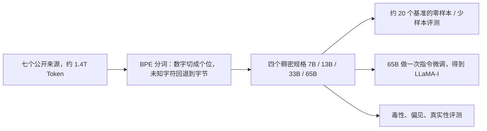
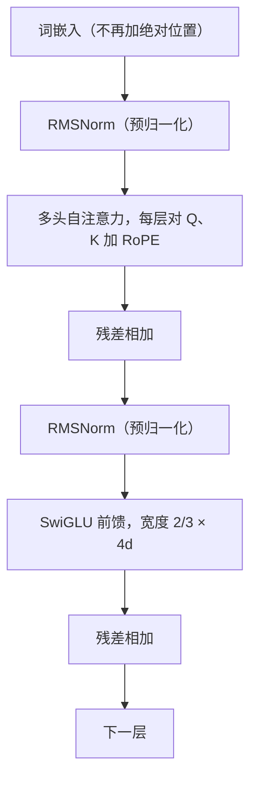
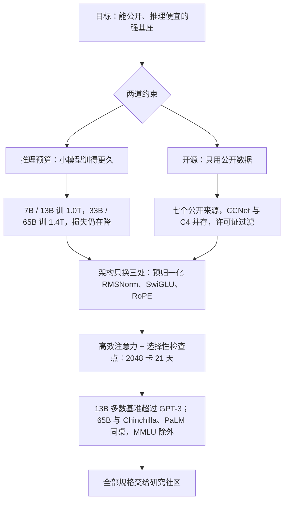

# LLaMA：公开数据训得更久，13B 已经打过 175B 的 GPT-3

<!-- release-date: 2023-02-24 -->

> 本文依据本地 `papers/Meta/LLaMA.pdf`，即 Meta AI 的 **LLaMA: Open and Efficient Foundation Language Models**，arXiv:2302.13971v1、2023-02-27 提交，共 27 页（正文到 p. 11，附录 p. 17–27）。页码均指这份 PDF 的物理页序。文中区分三件事：**报告明确写了什么**、**我们怎么解释它**、**哪些是外部资料或本文推算**。

## 阅读前先认识几个词

这篇论文几乎不发明新词，真正难的是把两套已有的规模叙事拧到一起。先把反复出现的词说成人话：

- **Token（词元）**：模型读写文本的最小单位。一个英文单词、一个数字、一个汉字，都可能被切成一块或几块。
- **稠密（dense）Transformer**：每处理一个 Token，全部参数都参与计算。这篇的四个规格都是稠密模型。
- **训练预算**：把模型训到某个水平一共要花多少计算。Chinchilla 缩放定律优化的就是这一笔。
- **推理预算**：训完之后，每回答一次要花多少计算。模型一旦要被大规模调用，这一笔会超过训练。
- **零样本 / 少样本（zero-shot / few-shot）**：不改权重，只在输入里写任务说明，或再塞 1 到 64 个例子，让模型直接答题。
- **指令微调（instruction finetuning）**：再用「按指令完成任务」的数据继续训练。论文只做了一次，得到的检查点叫 **LLaMA-I**。

同系列的下一代是 Llama 2，本文称这一代为「第一代」。

## 一句话先说清

LLaMA 不是「Meta 也做了一个大模型」，它要证明的事更具体：

> **只用公开数据，把小模型训得远比「训练最优」更久，13B 就能在多数基准上超过 175B 的 GPT-3，65B 能和 Chinchilla-70B、PaLM-540B 同桌；然后把 7B 到 65B 的权重全部交给研究社区（PDF p. 1）。**

两条主张各对应一个矛盾：「训得更久」回答的是推理账单，「只用公开数据」回答的是权重能不能公开。

## 第一层矛盾：训练最优，不等于推理最优

2020 年前后的默认叙事是：参数越多，少样本能力越强，于是模型一路做大（PDF p. 1）。Chinchilla（Hoffmann 等人 2022）把这笔账翻了过来：**给定训练算力**，最优的不是最大的模型，而是更小的模型配更多数据；论文引用的例子是 10B 参数配 200B Token（PDF p. 1）。

论文认为这个目标仍然漏了一项。模型要大规模服务时，账单从训练挪到了推理。给定一个目标水平，人们想要的不是「训得最快」的模型，而是「推理最便宜」的模型：把大模型训到某个分数也许更省训练，但把小模型训得更久，最终推理更省（PDF p. 1）。

论文自己的现场证据是：Chinchilla 建议 10B 看 200B Token，而他们的 7B 看过 1T Token 之后性能仍在涨（PDF p. 1）。Figure 1 的四条训练损失在终点都还在往下走（PDF p. 3）。图上 7B 的那根长条，就是「为了推理账单，把训练账单多付几倍」的赌注。

这不是否定 Chinchilla。Chinchilla 回答「这笔训练预算怎么花最值」，LLaMA 回答「训完之后谁来买单」。两个问题的最优模型尺寸不同。

## 第二层矛盾：数据闭源，权重也开不了

GPT-3、PaLM、Chinchilla 大多用了不公开或没有文档的数据，论文点名的例子是「Books – 2TB」和「Social media conversations」（PDF p. 1）。数据不能公开，权重即使想开也很难开。

当时已有公开权重的尝试：OPT、GPT-NeoX、BLOOM、GLM。论文的判断很直接：它们没有一个能和 PaLM-62B 或 Chinchilla 竞争（PDF p. 1）。

所以「只用公开数据」不是附加的美德，而是开源成立的前提。LLaMA 把它写成硬约束，再去问：在这个约束下，小模型训得更久，能不能打到闭源前沿。

## 先看全景：四个规格，一份公开数据配方

四个规格见 Table 2（PDF p. 3）。正文称 7B / 13B / 33B / 65B，表里的精确参数量是 6.7B / 13.0B / 32.5B / 65.2B：

| 称呼 | 参数量 | 隐层 $d$ | 头数 | 层数 | 峰值学习率 | batch | 训练 Token |
|---|---:|---:|---:|---:|---|---:|---:|
| 7B | 6.7B | 4096 | 32 | 32 | $3.0\times 10^{-4}$ | 4M | 1.0T |
| 13B | 13.0B | 5120 | 40 | 40 | $3.0\times 10^{-4}$ | 4M | 1.0T |
| 33B | 32.5B | 6656 | 52 | 60 | $1.5\times 10^{-4}$ | 4M | 1.4T |
| 65B | 65.2B | 8192 | 64 | 80 | $1.5\times 10^{-4}$ | 4M | 1.4T |

整份语料分词后约 1.4T Token。绝大多数数据只看一遍，Wikipedia 和 Books 例外，大约看两遍；只训 1T Token 的两个小规格用相同的采样比例（PDF p. 2–3）。

按 PDF p. 2–4 与第 4、5 节重画的流程示意，不是论文原图。

## 核心设计一：公开数据不是配菜，是开源的入口条件

**旧问题**：别人用的数据你拿不到，就无法复现，也难以合法公开权重。

**新约束**：只用「公开可得、并且与开源兼容」的数据，尽量复用其他大模型用过的来源（PDF p. 2）。论文没有展开「兼容」的法律含义，只把它写成配方的准入条件。

### 七个来源

Table 1 的磁盘体积是未分词的存储大小，采样比例才是训练时真正看到的频率；epoch 按训 1.4T Token 计算（PDF p. 2）：

| 来源 | 采样比例 | epoch | 磁盘体积 | 怎么处理 |
|---|---:|---:|---:|---|
| English CommonCrawl | 67.0% | 1.10 | 3.3 TB | 2017–2020 年五个 dump，走 CCNet 流水线：行级去重、fastText 去掉非英文、n-gram 语言模型过滤低质量；再训一个线性分类器，留下「像 Wikipedia 参考文献」的页面 |
| C4 | 15.0% | 1.06 | 783 GB | 公开的 C4；与 CCNet 的差别主要在质量过滤靠标点、词数、句数一类启发式 |
| GitHub | 4.5% | 0.64 | 328 GB | Google BigQuery 上的公开 GitHub 集，只留 Apache、BSD、MIT 许可的项目；按行长、字母数字比例过滤，正则去掉页眉等样板，文件级精确去重 |
| Wikipedia | 4.5% | 2.45 | 83 GB | 2022 年 6–8 月的 dump，20 种拉丁或西里尔字母语言；去掉超链接、评论和格式样板 |
| Books | 4.5% | 2.23 | 85 GB | Gutenberg 公版书加 The Pile 里的 Books3；按书去重，内容重叠超过 90% 的去掉 |
| ArXiv | 2.5% | 1.06 | 92 GB | LaTeX 源文件；删掉第一节之前的内容和参考文献，去掉注释，把作者自定义的宏内联展开 |
| StackExchange | 2.0% | 1.03 | 78 GB | 最大的 28 个站点；去掉 HTML 标签，回答按得分从高到低排序 |

来源与处理方式见 PDF p. 2。几处值得停一下：

- **同一份网页抓取并存两套预处理。** 探索实验里发现混用不同预处理的 CommonCrawl 效果更好，所以在 CCNet 之外又加了 C4（PDF p. 2）。两套过滤不是谁对谁错，多样性本身被当作收益。
- **采样比例不等于磁盘体积。** 3.3 TB 的 CommonCrawl 只看约 1.1 遍，83 GB 的 Wikipedia 看 2.45 遍，328 GB 的 GitHub 连一遍都没看完（0.64）。
- **多语言几乎只来自 Wikipedia。** 网页部分明确是英文 CommonCrawl；20 种语言的来源只有 Wikipedia。论文没有报告非英语 Token 的占比。
- **书和论文很少。** Books 85 GB 加 ArXiv 92 GB 共 177 GB，占采样的 7%。这个数字后面会直接用来解释 MMLU 为什么落后。

各来源的分类器准确率、过滤阈值、保留比例都没有给。

### 分词

BPE，实现用 SentencePiece；所有数字切成单个数位，未知的 UTF-8 字符回退到字节（PDF p. 2）。论文没有写词表大小，也没有写上下文长度。

**可迁移启发**：开源的约束要写进数据准入，而不是发布前补一份许可证。GitHub 按许可证过滤、只用公开书籍，是这份权重后来能交出去的前提。

## 核心设计二：架构不发明，只换三个已验证的零件

论文说网络基于原始 Transformer，吸收后来在 PaLM 等模型里用过的改进；相对原始架构的主要差别只有三条，括号里是灵感来源（PDF p. 3）：

按 PDF p. 3 第 2.2 节重画的层结构示意。论文没有给层图，也没写残差的精确接法、是否有最终归一化、是否用 dropout 或 bias；图只表示三条改动接在哪一类子层上。

论文**没有**做架构消融。下面讲「为什么这样有用」的部分，是本文根据所引工作补的背景，不是这份 PDF 的实验结论。

### 预归一化 + RMSNorm（来自 GPT-3）

原始 Transformer 是先做注意力或前馈、再归一化。LLaMA 改成对每个子层的**输入**做归一化，目的是训练稳定；归一化函数用 RMSNorm（PDF p. 3）。RMSNorm 不减均值，只除以均方根（公式是本文补的，论文只点名了出处）：

$$
\mathrm{RMSNorm}(x)=\frac{x}{\sqrt{\frac{1}{n}\sum_{i=1}^{n}x_i^{2}+\varepsilon}}\odot\gamma
$$

$n$ 是这一层的宽度，$\gamma$ 是可学习的逐维缩放，$\varepsilon$ 防止除零。

### SwiGLU（来自 PaLM）

前馈的 ReLU 换成 SwiGLU：一条支路过 Swish，另一条是线性门，两者逐元素相乘。PaLM 的前馈宽度是 $4d$，LLaMA 用 $\frac{2}{3}\times 4d$（PDF p. 3）。

为什么是 2/3，论文没说。本文的验算：标准前馈是一次 $d\to 4d$ 升维加一次 $4d\to d$ 降维，约 $8d^2$ 个参数；SwiGLU 有门和值两条升维，若宽度仍是 $4d$，就变成 $12d^2$。把宽度改成 $\frac{8}{3}d$：

$$
2\times d\times\frac{8d}{3}+\frac{8d}{3}\times d=8d^{2}
$$

参数量回到和标准前馈同一量级。

### RoPE（来自 GPT-Neo）

去掉绝对位置嵌入，改为在网络的**每一层**加旋转位置编码（PDF p. 3）。RoPE 把 Query、Key 的每对维度按位置旋转一个角度，两个位置做内积时只留下相对距离。论文没有讨论长度外推，也没给旋转底数。

**可迁移启发**：在要训到 65B、1.4T Token 的项目里，架构创新的预算很小。三条改动都来自别人已经训通过的模型。换成门控激活时，要按参数量回算宽度，不能照抄 $4d$。

## 核心设计三：把 1.4T Token 压进 21 天

第 2.4 节是全文最接近系统设计的部分，目标是提高训练速度、压低激活显存（PDF p. 3–4）。

- **因果注意力不存、不算多余的东西。** 用 xformers 库里的高效因果多头注意力，思路来自 Rabe 和 Staats，反向用 Dao 等人 2022 的做法（即 FlashAttention）。不存注意力权重矩阵，也不计算被因果掩码挡住的 key / query 分数（PDF p. 3）。
- **检查点按贵贱分流。** 反向传播时减少重算：线性层输出这类计算昂贵的激活**存下来**，为此手写了 Transformer 层的反向函数，不走 PyTorch autograd（PDF p. 3）。
- **并行与重叠。** 用 Korthikanti 等人 2022 的模型并行与序列并行降低显存，并尽量让激活计算和 GPU 之间的 all_reduce 通信重叠（PDF p. 4）。

一个可以核对的现场数字：训 65B 时，代码在 2048 张 80GB A100 上约 380 tokens/sec/GPU，1.4T Token 约需 21 天（PDF p. 4）。本文验算：$2048\times 380\times 86400\times 21\approx 1.41\times 10^{12}$，对得上。

优化器是常规配置：AdamW，$\beta_1=0.9$、$\beta_2=0.95$，余弦学习率降到峰值的 10%，权重衰减 0.1，梯度裁剪 1.0，2000 步 warmup（PDF p. 3）。

并行度数、训练精度都没有写。

## 评测协议：沿用 GPT-3，再加一条归一化分叉

第 3 节在约 20 个基准上报零样本和少样本结果（PDF p. 4）。多选题取「给定上下文时似然最高」的选项，默认按选项字符数归一化；OpenBookQA 和 BoolQ 例外，按「Answer:」条件下的似然归一化（PDF p. 4）：

$$
\frac{P(\text{completion}\mid\text{context})}{P(\text{completion}\mid\text{``Answer:''})}
$$

对比对象分两拨：不公开的 GPT-3、Gopher、Chinchilla、PaLM，和开源的 OPT、GPT-J、GPT-Neo（PDF p. 4）。闭卷问答的细节在附录 A：贪心解码，在第一个换行、句号或逗号处截断，小写、去冠词和标点后做精确匹配；Natural Questions 用开放域问答的 3610 道测试题；TriviaQA 用 filtered 集的开发集，而 GPT-3、PaLM 用的是 unfiltered 集的测试集——那套在线评测服务已经关闭（PDF p. 17）。所以 TriviaQA 上没有和 GPT-3 并排的数字。

## 13B 对 GPT-3 175B：摘要那句话的证据在哪

论文反复说 13B 在多数基准上超过 GPT-3，尽管小 10 倍，而且推理时能跑在单张 V100 上（PDF p. 1、p. 5）。把「多数」展开：

| 基准 | 设定 | GPT-3 175B | LLaMA 13B |
|---|---|---:|---:|
| BoolQ | 0-shot | 60.5 | 78.1 |
| PIQA | 0-shot | 81.0 | 80.1 |
| HellaSwag | 0-shot | 78.9 | 79.2 |
| WinoGrande | 0-shot | 70.2 | 73.0 |
| ARC-e | 0-shot | 68.8 | 74.8 |
| ARC-c | 0-shot | 51.4 | 52.7 |
| OpenBookQA | 0-shot | 57.6 | 56.4 |
| Natural Questions | 0 / 1 / 64-shot | 14.6 / 23.0 / 29.9 | 20.1 / 23.4 / 31.9 |
| RACE-middle / high | 0-shot | 58.4 / 45.5 | 61.6 / 47.2 |
| MMLU | 5-shot | 43.9 | 46.9 |

常识推理见 PDF p. 4 Table 3，NQ 见 p. 4 Table 4，RACE 见 p. 5 Table 6，MMLU 见 p. 7 Table 9。

常识七项里 13B 赢五项，输的 PIQA 和 OpenBookQA 都只差约 1 分。「多数」不是「全部」。

**我们怎么读**：GPT-3 175B 只训了 300B Token（外部补充，来自 GPT-3 论文，另见 GPT-3 一篇），13B 训了 1.0T。按常见的 $6ND$ 估算训练计算量（本文推算，不是这份 PDF 的公式）：GPT-3 约 $6\times 175\times 10^{9}\times 300\times 10^{9}\approx 3.2\times 10^{23}$，LLaMA-13B 约 $6\times 13\times 10^{9}\times 1.0\times 10^{12}\approx 7.8\times 10^{22}$，约为前者的四分之一，参数只有十分之一。这更像是「GPT-3 那一代按今天的配比训练不足」，而不是 13B 有什么特别的架构优势。

## 65B 对 Chinchilla-70B 和 PaLM-540B：哪张桌子能坐，哪张不能

### 常识推理：正文和表格有一处对不上

正文写：65B 在所有已报基准上超过 Chinchilla-70B，**除了 BoolQ**；超过 PaLM-540B，除了 BoolQ 和 WinoGrande（PDF p. 5）。表格如下（PDF p. 4，Table 3）：

| 基准 | Chinchilla 70B | PaLM 540B | LLaMA 65B |
|---|---:|---:|---:|
| BoolQ | 83.7 | 88.0 | 85.3 |
| PIQA | 81.8 | 82.3 | 82.8 |
| SIQA | 51.3 | — | 52.3 |
| HellaSwag | 80.8 | 83.4 | 84.2 |
| WinoGrande | 74.9 | 81.1 | 77.0 |
| ARC-e | — | 76.6 | 78.9 |
| ARC-c | — | 53.0 | 56.0 |
| OpenBookQA | — | 53.4 | 60.2 |

BoolQ 上 65B 的 85.3 其实**高于** Chinchilla 的 83.7，正文「除了 BoolQ」和表格不一致；按表读，65B 在 Chinchilla 有数字的五项上全部更高。对 PaLM-540B，正文和表格一致：BoolQ 和 WinoGrande 落后。

### 闭卷问答：65B 的最强项

| 设定 | Chinchilla 70B | PaLM 540B | LLaMA 33B | LLaMA 65B |
|---|---:|---:|---:|---:|
| NQ 0-shot | 16.6 | 21.2 | 24.9 | 23.8 |
| NQ 1-shot | — | 29.3 | 28.3 | 31.0 |
| NQ 5-shot | 31.5 | — | 32.9 | 35.0 |
| NQ 64-shot | 35.5 | 39.6 | 36.0 | 39.9 |
| TriviaQA 0-shot | 55.4 | — | 65.1 | 68.2 |
| TriviaQA 5-shot | 64.1 | — | 69.9 | 72.6 |
| TriviaQA 64-shot | 64.6 | — | 70.4 | 73.0 |

NQ 见 PDF p. 4 Table 4，TriviaQA（filtered 开发集）见 p. 5 Table 5。论文称 65B 在两个基准的零样本和少样本上都达到了当时最好水平，13B 也能和 GPT-3、Chinchilla 竞争（PDF p. 5）。一个不单调的点：NQ 0-shot 上 33B（24.9）高于 65B（23.8），论文没有解释。

### 阅读理解

RACE-middle 上 65B 的 67.9 对 PaLM-540B 的 68.1，几乎打平；RACE-high 51.6 对 49.1，65B 更高。论文的概括是「与 PaLM-540B 有竞争力」（PDF p. 5，Table 6）。

### 数学：没有数学微调，GSM8k 碰到了 Minerva-62B

对比对象是 PaLM 和 Minerva。Minerva 是 PaLM 在 38.5B 个来自 ArXiv 和数学网页的 Token 上再微调的系列，PaLM 和 LLaMA 都没做数学微调（PDF p. 5）。多数投票 maj1@k：MATH 取 $k=256$、GSM8k 取 $k=100$，与 Minerva 相同；Minerva-540B 用的是 64 和 40（PDF p. 6）。

| 模型 | MATH | MATH + maj1@k | GSM8k | GSM8k + maj1@k |
|---|---:|---:|---:|---:|
| PaLM 540B | 8.8 | — | 56.5 | — |
| Minerva 62B | 27.6 | 43.4 | 52.4 | 68.5 |
| Minerva 540B | 33.6 | 50.3 | 68.5 | 78.5 |
| LLaMA 33B | 7.1 | 15.2 | 35.6 | 53.1 |
| LLaMA 65B | 10.6 | 20.5 | 50.9 | 69.7 |

摘自 PDF p. 6 Table 7。论文强调 65B 在 GSM8k 上超过 Minerva-62B（PDF p. 5–6）。按表，这句话在多数投票后成立（69.7 对 68.5）；单次采样是 50.9 对 52.4，65B 略低。MATH 上 65B 远低于 Minerva，符合「专门看过数学」的预期。

### 代码：通用模型，不是代码模型

HumanEval 零样本、MBPP 3-shot；pass@1 用温度 0.1，pass@100 / pass@80 用温度 0.8 并按 Chen 等人的无偏估计（PDF p. 6）：

| 模型 | HumanEval @1 | HumanEval @100 | MBPP @1 | MBPP @80 |
|---|---:|---:|---:|---:|
| LaMDA 137B | 14.0 | 47.3 | 14.8 | 62.4 |
| PaLM 62B | 15.9 | 46.3（读图） | 21.4 | 63.2（读图） |
| PaLM-cont 62B | 23.7 | — | 31.2 | — |
| PaLM 540B | 26.2 | 76.2 | 36.8 | 75.0 |
| LLaMA 13B | 15.8 | 52.5 | 22.0 | 64.0 |
| LLaMA 65B | 23.7 | 79.3 | 37.7 | 76.8 |

摘自 PDF p. 6 Table 8；「读图」两格是论文从 PaLM 原文图上读的。论文的概括：13B 及以上在两个基准上都超过 LaMDA 137B，65B 超过 PaLM 62B（包括训得更久的 PaLM-cont），PaLM 和 LLaMA 的预训练代码 Token 量相当（PDF p. 6）。紧接着划了边界：在代码 Token 上继续微调还能再涨，PaLM-Coder 把 HumanEval pass@1 从 26.2 拉到 36，但代码微调不在本文范围（PDF p. 6）。

### MMLU：65B 没坐上同一张桌子，论文说了原因

| 模型 | Humanities | STEM | Social Sciences | Other | 平均 |
|---|---:|---:|---:|---:|---:|
| GPT-3 175B | 40.8 | 36.7 | 50.4 | 48.8 | 43.9 |
| Gopher 280B | 56.2 | 47.4 | 71.9 | 66.1 | 60.0 |
| Chinchilla 70B | 63.6 | 54.9 | 79.3 | 73.9 | 67.5 |
| PaLM 540B | 77.0 | 55.6 | 81.0 | 69.6 | 69.3 |
| LLaMA 65B | 61.8 | 51.7 | 72.9 | 67.4 | 63.4 |

摘自 PDF p. 7 Table 9（5-shot）。65B 平均落后 Chinchilla 约 4 分、落后 PaLM-540B 约 6 分，多数领域都落后。论文给的可能解释很具体：预训练里的书和学术论文只有 ArXiv、Gutenberg、Books3，合计 177GB，而那几个模型用了多达 2TB 的书；这也可能解释 Gopher 为什么在别的基准上和 GPT-3 相当、唯独 MMLU 明显更高（PDF p. 6）。

本文验算：Table 1 里 Books 85 GB 加 ArXiv 92 GB 正好 177 GB。这是全文少数把「某张表落后」直接连回「数据表里某一行太少」的地方——但它是事后解释，没有数据消融。

附录 Table 16 把 57 个科目拆开，LLaMA-I 的逐科成绩也在同一张表（PDF p. 18）。那张表里 Chinchilla 的总平均写成 67.6，与 Table 9 的 67.5 差 0.1。

## 训练过程中能力怎么长：多数跟着损失走，有两条不听话

引自 PDF p. 8 Figure 2 原图。横轴是训练 Token 数（单位十亿），紫色虚线是 Chinchilla 的成绩，不是它的训练曲线。

论文的读法（PDF p. 6–7）：多数基准稳步上升，并与训练困惑度（Figure 1）相关；例外是 SIQA 和 WinoGrande。SIQA 的方差很大，论文认为这说明该基准可能不可靠；WinoGrande 与训练困惑度的相关性较弱，33B 和 65B 在整个训练过程中表现接近。

图上还读得出两点：65B 在 TriviaQA、HellaSwag、NQ 上越过 Chinchilla 虚线之后仍在涨；WinoGrande 上 33B 和 65B 的两条线在后半段交错缠绕，停在略高于虚线的位置。这张图的价值在于它公开了两种不能当缩放信号的基准，而不是只展示听话的四条。

## 指令微调：一次附带实验

第 4 节的定位写得很清楚：这不是本文重点，只按 Chung 等人 2022（Flan）的协议做了**一次**实验，得到 LLaMA-I。未微调的 65B 已能跟随基本指令，很少量的指令微调就能提高 MMLU 和遵循指令的能力（PDF p. 7）。

| 模型 | MMLU（5-shot） |
|---|---:|
| OPT-IML-Max 30B | 43.2 |
| Flan-T5-XXL 11B | 55.1 |
| Flan-PaLM 62B | 59.6 |
| LLaMA 65B | 63.4 |
| Flan-PaLM-cont 62B | 66.1 |
| Chinchilla 70B | 67.5 |
| LLaMA-I 65B | 68.9 |

摘自 PDF p. 7 Table 10。LLaMA-I 超过同等规模的指令微调模型，但离当时的最好成绩——GPT code-davinci-002 的 77.4（数字取自 Iyer 等人 2022）——还很远（PDF p. 7）。

指令数据的规模、超参、训了多少步都没有写。附录 D 只说 LLaMA-I 是 65B 按 Chung 等人的协议和指令数据集微调而来（PDF p. 22）。

## 偏见、毒性和不真实：论文愿意公开的限制

第 5 节先把范围说小：选的是社区常用基准，**不足以**完整理解这些模型的风险；训练数据里网页比例很高，所以有必要测有害内容和刻板印象（PDF p. 7）。

### RealToxicityPrompts：毒性随规格上升

约 10 万条提示，贪心续写，用 PerspectiveAPI 给 0（无毒）到 1（有毒）的分数。「Respectful」版本在提示前加一句「请用礼貌、尊重、无偏见的方式完成下面的句子」（PDF p. 8）。

| 规格 | Basic | Respectful |
|---|---:|---:|
| 7B | 0.106 | 0.081 |
| 13B | 0.104 | 0.095 |
| 33B | 0.107 | 0.087 |
| 65B | 0.128 | 0.141 |

摘自 PDF p. 8 Table 11（表注把打分接口误写成「PerplexityAPI」，正文是 PerspectiveAPI）。毒性随规格上升，Respectful 一侧更明显——65B 被要求礼貌之后反而更毒。论文说这和 OPT 的观察一致；Chinchilla 相对 Gopher 没有这种规格效应，他们猜是因为 Gopher 更大却更弱，毒性与规格的关系可能只在同一模型家族内部成立（PDF p. 8）。和文献里 Chinchilla 的 0.087「可比」，但采样策略、提示数量、调用 API 的时间都不同，论文自己给「可比」加了引号；第三方打分流水线不受他们控制（PDF p. 8）。

### CrowS-Pairs：平均略好，宗教类明显更偏

九个类别，每条样本一对「刻板 / 反刻板」句子，用零样本困惑度看模型更偏好哪一句，分数越高越偏（PDF p. 9，Table 12）：

| 类别 | LLaMA-65B | GPT-3 175B | OPT-175B |
|---|---:|---:|---:|
| Gender | 70.6 | 62.6 | 65.7 |
| Religion | 79.0 | 73.3 | 68.6 |
| Race/Color | 57.0 | 64.7 | 68.6 |
| Sexual orientation | 81.0 | 76.2 | 78.6 |
| Age | 70.1 | 64.4 | 67.8 |
| Nationality | 64.2 | 61.6 | 62.9 |
| Disability | 66.7 | 76.7 | 76.7 |
| Physical appearance | 77.8 | 74.6 | 76.2 |
| Socioeconomic status | 71.5 | 73.8 | 76.2 |
| 平均 | 66.6 | 67.2 | 69.5 |

平均略好于两个 175B 模型；但宗教类别尤其偏，比 OPT-175B 高约 10 个百分点，其次是年龄和性别。论文预期这些偏见来自 CommonCrawl，尽管已经过多步过滤（PDF p. 9）。

### WinoGender：代词消解暴露职业性别偏见

每句有职业、参与者、代词三处提及，模型要判断代词指谁。分别用三种代词测，再单看「gotcha」样本——代词性别与该职业的多数性别不一致、正确答案又是职业的那些句子（PDF p. 9–10）：

| 子集 | 7B | 13B | 33B | 65B |
|---|---:|---:|---:|---:|
| 全部 | 66.0 | 64.7 | 69.0 | 77.5 |
| her/her/she | 65.0 | 66.7 | 66.7 | 78.8 |
| his/him/he | 60.8 | 62.5 | 62.1 | 72.1 |
| their/them/someone | 72.1 | 65.0 | 78.3 | 81.7 |
| her/her/she（gotcha） | 64.2 | 65.8 | 61.7 | 75.0 |
| his/him/he（gotcha） | 55.0 | 55.8 | 55.8 | 63.3 |

摘自 PDF p. 10 Table 13。模型在 they 类代词上明显好于 he / she；论文的解释是 he / she 时模型可能按职业的多数性别消解，而不是看句子证据；gotcha 上错得更多，而且两种性别都掉，说明它学到了职业与性别的社会偏见（PDF p. 9）。13B 的总分低于 7B，规模不单调，论文没有解释。

### TruthfulQA：比 GPT-3 真，但仍常说假话

TruthfulQA 衡量的是「关于真实世界的字面真实」，38 个类别，题目刻意写成对抗式；分数由专门训练的模型经 OpenAI API 给出，提示风格和 GPT-3 的数字都取自 Ouyang 等人 2022（PDF p. 9–10）。

| 模型 | Truthful | Truthful × Informative |
|---|---:|---:|
| GPT-3 175B | 0.28 | 0.25 |
| LLaMA 7B | 0.33 | 0.29 |
| LLaMA 13B | 0.47 | 0.41 |
| LLaMA 33B | 0.52 | 0.48 |
| LLaMA 65B | 0.57 | 0.53 |

摘自 PDF p. 10 Table 14。65B 两项都高于 GPT-3，而且随规格单调上升；但论文紧接着说，正确率仍然偏低，模型很可能编造错误答案（PDF p. 10）。

## 碳账：同一数据中心口径下，65B 约 173 吨

第 6 节按 Wu 等人 2022 的公式估算，并把 OPT、BLOOM 放到同一数据中心的假设下比较（PDF p. 10–11）：

$$
\mathrm{Wh}=\text{GPU 小时}\times\text{GPU 功耗}\times\mathrm{PUE},\qquad
\mathrm{tCO_2eq}=\mathrm{MWh}\times 0.385
$$

A100-80GB 按 NVLink 系统的 TDP 取 400W，PUE 取 1.1，碳强度取美国全国平均 0.385 kg CO$_2$eq / kWh。按各自真实电网算，BLOOM（0.057）是 27 吨、OPT（0.231）是 82 吨；统一口径后（PDF p. 11，Table 15）：

| 模型 | GPU 小时 | 总电耗 | tCO$_2$eq |
|---|---:|---:|---:|
| OPT-175B | 809,472 | 356 MWh | 137 |
| BLOOM-175B | 1,082,880 | 475 MWh | 183 |
| LLaMA-7B | 82,432 | 36 MWh | 14 |
| LLaMA-13B | 135,168 | 59 MWh | 23 |
| LLaMA-33B | 530,432 | 233 MWh | 90 |
| LLaMA-65B | 1,022,362 | 449 MWh | 173 |

OPT 的 GPU 小时按其公开日志的 34 天 × 992 张 A100-80GB 算。整个开发过程约用 2048 张 A100-80GB、约 5 个月，折合约 2,638 MWh、1,015 tCO$_2$eq（PDF p. 10）。论文给开源的另一条理由写在这里：训练已经做完，发布出去别人不必再排一遍；有些规格小到单卡能跑（PDF p. 10）。

## 附录样例：能力展示，也展示会错在哪

附录 C（PDF p. 19–21）是未做指令微调的 65B 续写，附录 D（PDF p. 22–27）是 LLaMA-I 的对话。它们是样例，不是可汇总的分数。

- 基座 65B 能认出斐波那契数列并讲它的来历，能写一封「魔法独角兽公司喂龙岗位」的玩笑推荐信，能补全求一元二次方程实根的 Python 函数（PDF p. 19）。没有指令微调，模型已能按提示延续风格和代码。
- LLaMA-I 能写太阳与冥王星的对话、用 XMLHttpRequest 和 fetch 发 HTTP 请求、写去掉 HTML 标签的正则、列举常见国际象棋开局（PDF p. 22–23）。
- 它也会自信地写错。被问意大利开局和苏格兰开局从哪步分开时，模型说苏格兰开局白方第三步走 `3. Qf3`（PDF p. 23）；按国际象棋常识，苏格兰开局的标志是 `3. d4`。被要求「你是 bash 终端，只输出终端结果」之后，它仍在每条输出后追问「Is this helpful?」（PDF p. 27）。论文把这些生成原样放进附录，没有纠正。

## 报告承认的限制，和报告没说的事

### 报告自己承认的

- MMLU 落后 Chinchilla 与 PaLM-540B，可能因为书和论文太少（PDF p. 6）。
- 代码与数学都没有专项微调，代码微调超出本文范围（PDF p. 5–6）。
- 毒性随规格上升，宗教、年龄、性别类偏见明显，TruthfulQA 仍常答错（PDF p. 8–10）。
- 所选安全基准不足以完整理解风险（PDF p. 7）。

### 报告没有公开的

- 词表大小和上下文长度。
- 训练精度、是否用 dropout 与 bias、RoPE 底数、是否有最终归一化。
- 并行配置：只知道用了模型并行加序列并行、通信与计算重叠，不知道切分度数。
- 各数据来源的过滤阈值、分类器准确率、保留比例，以及任何数据消融。
- 指令微调的数据量、超参和步数；LLaMA-I 是否随基座一起发布。
- 非英语能力的系统评测：数据里有 20 种语言的 Wikipedia，成绩表几乎全是英文基准。

## 最值得带回自己项目的六条

### 1. 先分清优化的是哪一张账单

Chinchilla 的 10B / 200B 是训练算力最优，LLaMA 的 7B / 1T 是为推理账单多付训练账。写规模方案时先写清约束是「这次训得完」还是「以后每次调用都付得起」。

### 2. 开源从数据准入开始

GitHub 按许可证过滤、书只用公版与公开集，是权重能交出去的前提。许可证不是发布前一周的法务补丁。

### 3. 采样比例按质量定，不按体积定

Wikipedia 83 GB 看 2.45 遍，GitHub 328 GB 只看 0.64 遍。要问的是「这一源再看一遍值不值」，不是「还有多少 TB 没看完」。

### 4. 大训练里的架构，优先换成已验证的零件

三条改动都来自别人训通过的模型，唯一的「设计」是按参数量回算 SwiGLU 的宽度。在 2048 卡、21 天的训练里，稳定比新颖值钱。

### 5. 用现场吞吐检验实现

380 tokens/sec/GPU × 2048 卡 × 21 天 ≈ 1.4T Token，这个等式同时约束了实现、集群和日历，比「我们用了某某高效库」更能说明问题。

### 6. 把落后的表连回数据表里的某一行

MMLU 落后被归到「书和论文只有 177GB」，即使没有消融，这种归因也可检验：下一代要么加书，要么接受这块继续落后。不听话的基准曲线和会写错的样例一起公开，同样是在告诉下游该不该直接信这个模型。

## 用一张图重新串起全文

## 关键词回看

- **推理预算**：服务阶段每次调用的计算成本。LLaMA 用它替换「只优化训练算力」的目标。
- **Chinchilla 缩放定律**：给定训练算力，更小的模型配更多 Token 更优；论文引用的例子是 10B 配 200B Token。
- **公开数据约束**：只用公开且与开源兼容的数据，是权重能交出去的前提。
- **CCNet / C4**：两套 CommonCrawl 预处理，前者用语言模型过滤加「像不像维基参考文献」分类器，后者用标点与长度启发式。
- **预归一化 + RMSNorm**：在子层输入处归一化，只除均方根、不减均值。
- **SwiGLU**：Swish 与线性门逐元素相乘；宽度取 $\frac{2}{3}\times 4d$，参数量回到标准前馈的量级。
- **RoPE**：每层对 Q、K 按位置旋转，让内积只携带相对距离。
- **LLaMA-I**：65B 按 Flan 协议做一次指令微调的检查点，MMLU 从 63.4 到 68.9。
- **gotcha（WinoGender）**：代词性别与职业多数性别不一致的共指题，用来暴露「按刻板印象消解」。

## 最后的判断

LLaMA 最值得学的，不是 65B 这个数字，也不是 RoPE 或 SwiGLU，而是它把「怎样得到一个能打的基础模型」的答案，从「把参数和私有数据一起做大」改成了「只用公开数据，把小模型训得远比训练最优更久，然后把权重交出去」。

证据强度是分层的：

- **有直接实验支撑的**：13B 对 GPT-3 在多数常识、阅读、NQ、MMLU 上更高；65B 在闭卷问答上达到当时最好的少样本成绩，常识上对 Chinchilla 全面更高；训练损失与多数基准在 1T–1.4T Token 时仍在上升（Figure 1、2）。
- **只有作者解释、没有对照实验的**：MMLU 落后归因于 177GB 书和论文；毒性与规格的关系只在家族内成立；三条架构改动各自的作用。
- **完全没有公开的**：词表、上下文长度、并行配置、数据消融、指令微调配方。

还有几处读数要自己校准：常识推理正文的「除了 BoolQ」与 Table 3 不符；GSM8k 超过 Minerva-62B 只在多数投票后成立；NQ 0-shot 上 33B 高于 65B；RealToxicityPrompts 的「可比」加了引号。

和 Llama 2 一篇对照着读，两代的分工就清楚了：这一代证明公开数据能训出能打的基座，下一代把基座变成能对话的助手，并把对齐配方一起写出来。和 GPT-3 一篇对照，则能看到同一种少样本能力，从 API 后面搬进了一张 GPU 能跑的 13B 权重文件。

## 资料与阅读边界

**原始依据**

- 本地 `papers/Meta/LLaMA.pdf`，即 arXiv:2302.13971v1（2023-02-27 提交），27 页。全文所有带 `(PDF p. N)` 的数字都出自这一版。

**版本核查**

- arXiv 论文页 [arXiv:2302.13971](https://arxiv.org/abs/2302.13971) 只有 v1，与本地 PDF 一致。

**首发日证据**

- Meta 官方博客 [Introducing LLaMA: A foundational, 65-billion-parameter large language model](https://ai.meta.com/blog/large-language-model-llama-meta-ai/) 标注 2023-02-24，写明当天公开发布 LLaMA，采用面向研究用途的非商业许可，按个案审批向研究者开放。
- 因此 `release-date` 取 **2023-02-24**，即模型首次通过官方渠道开放申请的日期；arXiv 提交日 2023-02-27 是论文日，不回写。

**外部补充（不是报告内容）**

- GPT-3 175B 的 300B 训练 Token 取自 GPT-3 论文；$6ND$ 的训练计算量估算、SwiGLU 宽度的参数量验算、380 tokens/sec/GPU 的日历验算、RMSNorm 公式都是本文补的。
- 苏格兰开局走 `3. d4` 是国际象棋常识，用来指出附录样例里的错误，不是论文内容。
