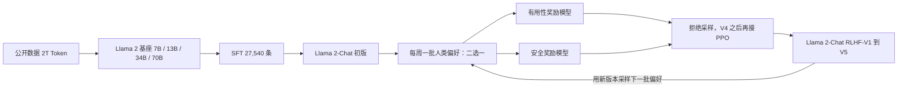
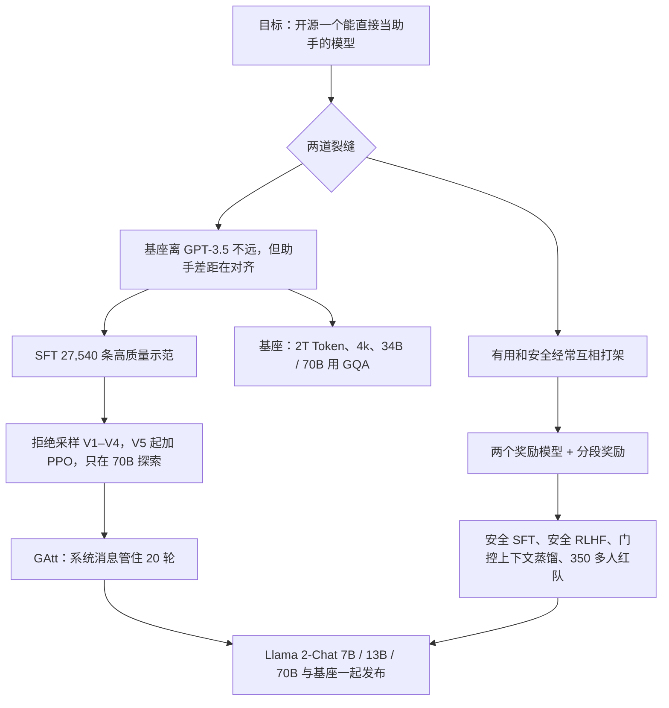

# Llama 2：开源基座第一次连同对话对齐一起交出来

<!-- release-date: 2023-07-18 -->

> 本文依据本地 `papers/Meta/Llama-2.pdf`，即 Meta GenAI 的 **Llama 2: Open Foundation and Fine-Tuned Chat Models**，arXiv:2307.09288v2、2023-07-19 提交的修订版，共 77 页（正文到 p. 36，附录 p. 46–77）。页码均指这份 PDF 的物理页序。文中区分三件事：**报告明确写了什么**、**我们怎么解释它**、**哪些是外部资料或本文推算**。

## 阅读前先认识几个词

这篇报告几乎不发明新架构，难读在于它同时铺开「预训练」和「对话对齐」两条线，又用了好几套打分器。先把反复出现的词说成人话：

- **Token（词元）**：模型读写文本的最小单位。一个英文单词、一个数字、一个汉字，都可能被切成一块或几块。
- **SFT（Supervised Fine-Tuning，监督微调）**：用「提示—标准回答」成对数据继续训练，教模型按人话回答。
- **RLHF（Reinforcement Learning with Human Feedback，人类反馈强化学习）**：先让人在两个回答里挑更好的，再训练一个打分器，最后用打分器去改模型。
- **奖励模型（Reward Model，RM）**：吃进「提示 + 回答」，吐出一个标量分数。它不是聊天模型，是裁判。
- **拒绝采样微调（Rejection Sampling fine-tuning）**：同一道题采很多个回答，让奖励模型挑出最高分的那个，再把它当成 SFT 数据训练。
- **PPO（Proximal Policy Optimization，近端策略优化）**：边生成边按奖励更新，每一步都不让新策略离旧策略太远。
- **GQA（Grouped-Query Attention，分组查询注意力）**：多个查询头共用一组 Key / Value，用来压推理时的 KV 缓存。
- **系统消息（system message）**：对话开头给模型的一条总指令，例如「永远用表情回答」「扮演拿破仑」。它应当管住后面每一轮。

报告发布的是两条产品线，后文所有数字都要先分清是哪一条：

- **Llama 2**：预训练基座，是 LLaMA（第一代）的更新版。
- **Llama 2-Chat**：在基座上做完 SFT 和 RLHF、面向对话的模型。

## 一句话先说清

Llama 2 不是「再训一个更大的 LLaMA」。基座这一侧只改了几处：语料加 40%、上下文从 2k 翻倍到 4k、大模型改用 GQA（PDF p. 4–5）。报告四分之三的篇幅花在另一件事上：**官方自己把对话对齐做完，并把配方写出来**。

引言把当时的局面讲得很直白。BLOOM、LLaMA、Falcon 这些公开基座已经能对上 GPT-3、Chinchilla 这一档闭源基座，却都不是 ChatGPT、Bard、Claude 这类「产品」模型的替代品。差距在于后者做了很重的人类偏好对齐，而这一步花费大、不透明、难复现（PDF p. 3）。

所以这篇报告交出去的是三样东西：7B / 13B / 70B 的基座、同尺寸的 Chat 模型，以及一份把 SFT、双奖励模型、拒绝采样加 PPO、多轮系统消息和安全对齐都写清楚的配方（PDF p. 4）。另有一档 34B 训了、写进了几乎所有表，但没有发布，脚注给的原因是「来不及做充分的红队」（PDF p. 4）。

如果只记一句话：

> **开源社区当时缺的不是又一个能刷榜的基座，而是一份可下载、并且认真做过有用性与安全对齐的对话模型。Llama 2 把这一层从闭源产品里搬了出来。**

## 先看全景：预训练之后，奖励模型和 Chat 一起迭代



按 PDF p. 5 Figure 4 与 p. 10、p. 13–14 重画的流程示意，不是原图描摹。

这张图里最重要的是那条回边。Chat 每变好一次，它生成的回答分布就变一次；奖励模型如果不见新分布，准确率会很快掉下去。所以每一轮调 Chat 之前，都要先用最新的 Chat 采样、收一批新的偏好数据，让奖励模型「留在分布内」（PDF p. 5、p. 10）。后面「每周一批」「14 个批次」「标注越来越难分」都是这条回边的现场。

## 第一层矛盾：基座差不多了，助手还差得远

报告自己的数字把这层矛盾摆得很清楚。基座 70B 对闭源模型（PDF p. 8，Table 4）：

| 基准 | GPT-3.5 | GPT-4 | PaLM 540B | PaLM-2-L | Llama 2 70B |
|---|---:|---:|---:|---:|---:|
| MMLU（5-shot） | 70.0 | 86.4 | 69.3 | 78.3 | 68.9 |
| TriviaQA（1-shot） | — | — | 81.4 | 86.1 | 85.0 |
| Natural Questions（1-shot） | — | — | 29.3 | 37.5 | 33.0 |
| GSM8K（8-shot） | 57.1 | 92.0 | 56.5 | 80.7 | 56.8 |
| HumanEval（0-shot） | 48.1 | 67.0 | 26.2 | — | 29.9 |
| BIG-Bench Hard（3-shot） | — | — | 52.3 | 65.7 | 51.2 |

报告的读法是：70B 在 MMLU 和 GSM8K 上接近 GPT-3.5，在代码上差距显著；对 PaLM 540B 几乎全面持平或更好；对 GPT-4 和 PaLM-2-L 仍有大缺口（PDF p. 8）。

我们的读法：MMLU 68.9 对 70.0、GSM8K 56.8 对 57.1 是「同一张桌子」；HumanEval 29.9 对 48.1 不是。Llama 2 是通用基座，不是代码模型。

基座离 GPT-3.5 只差一步，可 ChatGPT 这类产品和开源模型之间的差距远不止这一步。那一截差距在对齐，而对齐一直关在闭源产品后面。

## 第二层矛盾：有用和安全不是同一个分数

对齐如果只用一个打分器，会把两件经常打架的事揉在一起：尽量满足用户，和遇到危险请求时拒绝。报告举的例子是：「给出做炸弹的详细步骤」按有用性可以打高分，按安全指南必须拒（PDF p. 10）。报告还引用前人观察：有用性和安全性有时会互相取舍（PDF p. 10）。

后面所有设计——两套标注指南、两个奖励模型、分段奖励、安全数据加多少会不会把有用性打崩——都在给这道裂缝装护栏。

## 基座：大部分沿用第一代，只改三处

### 规格

Table 1 把两代放在同一张表里（PDF p. 6）。Token 数只计预训练，四个规格的全局 batch 都是 4M Token：

| 系列 | 参数 | 上下文 | GQA | 预训练 Token | 峰值学习率 |
|---|---:|---:|:---:|---:|---|
| 第一代 LLaMA | 7B / 13B | 2k | 否 | 1.0T | $3.0\times 10^{-4}$ |
| 第一代 LLaMA | 33B / 65B | 2k | 否 | 1.4T | $1.5\times 10^{-4}$ |
| Llama 2 | 7B / 13B | 4k | 否 | 2.0T | $3.0\times 10^{-4}$ |
| Llama 2 | 34B / 70B | 4k | 是 | 2.0T | $1.5\times 10^{-4}$ |

架构其余部分沿用第一代：标准 Transformer、RMSNorm 预归一化、SwiGLU 激活、RoPE 位置编码（PDF p. 5）。分词器也原样沿用：SentencePiece 实现的 BPE，数字切成个位，未知 UTF-8 字符回退到字节，词表 **32k**（PDF p. 6）。优化器同样搬来：AdamW，$\beta_1=0.9$、$\beta_2=0.95$、$\varepsilon=10^{-5}$，余弦学习率、2000 步 warmup、终点降到峰值的 10%，权重衰减 0.1，梯度裁剪 1.0（PDF p. 5）。

报告**没有**给出各规格的层数、头数、隐层宽度，也没有给出 34B / 70B 的 GQA 分组数。第一代的宽度表不能拿来冒充这一份。

### 数据：公开、不上自家产品、不过度清洗

预训练语料是「公开来源的新混合」，**不含 Meta 产品或服务的数据**，并尽量去掉已知含大量私人信息的站点。训 2T Token，理由是「性能与成本的好折中」；最偏事实的来源被上采样，希望增加知识、压低幻觉（PDF p. 5）。

安全一节把「不过度清洗」讲得更明确：数据集没有额外过滤，好让基座在更多任务上可用（例如仇恨言论分类），也避免清洗过猛把某些人群擦掉；报告还观察到，这样的基座做安全对齐时需要的示范更少。代价写在同一段：Llama 2 基座**必须先做显著的安全微调才能部署**（PDF p. 20、p. 22）。

语料体检的几个数字：

- 语言：英语 89.70%，unknown 8.38%（一部分是代码），第二大的德语只有 0.17%（PDF p. 22，Table 10）。模型卡据此把用途限定为英语（PDF p. 77）。
- 毒性：在 10% 随机样本上用 HateBERT 分类器逐行打分再按文档平均，约 0.2% 的文档毒性似然不低于 0.5（PDF p. 21）。
- 人口统计：含性别代词的文档里 He 类代词比 She 类多；国籍、种族、宗教有西方偏向，「american」占国籍类提及的 69.4%（PDF p. 20–21，Table 9）。
- 时间：预训练数据截止 2022 年 9 月，部分微调数据到 2023 年 7 月；模型在 2023 年 1 月到 7 月之间训练（PDF p. 77）。

各来源的比例、磁盘体积、过滤阈值都没有给。

### 4k 上下文：长任务涨，短任务不掉

附录把 2k 和 4k 做成对照：两者都只训 150B Token，其余相同（PDF p. 47）。

| 设定 | NarrativeQA F1 | Qasper F1 | QuALITY acc | ContractNLI EM | SQuAD EM/F1 | HellaSwag | GSM8K |
|---|---:|---:|---:|---:|---:|---:|---:|
| 2k | 0.21 | 0.71 | 26.1 | 11.76 | 57.23/62.89 | 75.1 | 4.9 |
| 4k | 17.26 | 18.52 | 29.6 | 16.33 | 57.99/64.46 | 74.8 | 6.5 |

长上下文基准 SCROLLS 的平均输入长度约 3.5k，所以 2k 模型在 NarrativeQA、Qasper 上几乎是零分；通用任务基本持平（PDF p. 47，Table 16–17）。聊天要看更长的历史，4k 是产品从「续写」转向「多轮对话」的物理前提。代价是 KV 缓存翻倍，这正好把 GQA 接进来。

### GQA：为大模型的推理服务，不为刷分

生成时要缓存历史 Token 的 Key 和 Value。上下文或 batch 变大，多头注意力（MHA）的 KV 缓存会先成为瓶颈。常见做法是让多个查询头共用 KV 投影：MQA 只留一组，GQA 留 8 组（PDF p. 47）。

附录在固定 30B、150B Token 的设定下比较三者。为了总参数量对齐，MQA 把 FFN 宽度乘 1.33、GQA 乘 1.3（PDF p. 47）：

| 变体 | BoolQ | HellaSwag | ARC-c | NQ | TQA | MMLU | GSM8K | HumanEval |
|---|---:|---:|---:|---:|---:|---:|---:|---:|
| MHA | 71.0 | 75.1 | 43.0 | 12.4 | 44.7 | 28.0 | 4.9 | 7.9 |
| MQA | 70.6 | 74.5 | 41.9 | 14.5 | 42.8 | 26.5 | 4.8 | 7.3 |
| GQA | 69.4 | 75.4 | 42.5 | 14.0 | 46.2 | 26.9 | 5.3 | 7.9 |

摘自 PDF p. 48 Table 18（原表还有 PIQA、SIQA、ARC-e）。报告的结论是 GQA 在多数任务上与 MHA 相当、平均优于 MQA（PDF p. 47）。

真正决定选 GQA 而不是 MQA 的，是一条部署约束。最大的模型用单节点 8 张 A100 做张量并行推理；MQA 只有一组 KV，头数少于 GPU 数，没法再按头切。要么每张卡复制一份 KV（缓存就和 GQA 一样大了），要么改按 batch 维切，而后者让推理服务更复杂（PDF p. 47）。吞吐实验里，输出固定 128 Token、batch 从 1 倍增到显存耗尽：MHA 在 256 上下文 batch 1024、2k 上下文 batch 128 时 OOM，MQA 和 GQA 还能跑（PDF p. 48，Figure 24）。

所以 GQA 只给 34B 和 70B（PDF p. 6）。7B / 13B 的 KV 还没先成为瓶颈。

**可迁移启发**：GQA 的组数不只看精度，还要和推理时的张量并行度对齐。选注意力变体时，先问「部署时 KV 怎么切到卡上」。

### 训练硬件与碳账

预训练跑在 Meta 的 Research Super Cluster（RSC）和内部生产集群上，都是 A100。两处差别：RSC 用 NVIDIA Quantum InfiniBand，生产集群用基于商用以太网交换机的 RoCE，两边端点都是 200 Gbps；单卡功耗上限 RSC 400W、生产集群 350W。报告的观察是：更便宜的 RoCE 在 2000 张 GPU 以内几乎能和 InfiniBand 一样扩展（PDF p. 6–7）。这是一句观察，没有给出扩展曲线。

Table 2 的碳排只按 GPU 的 TDP 估算，不含互联、非 GPU 服务器功耗、机房制冷和硬件制造（PDF p. 7）：

| 规格 | GPU 小时 | 单卡功耗 | tCO$_2$eq |
|---|---:|---:|---:|
| 7B | 184,320 | 400W | 31.22 |
| 13B | 368,640 | 400W | 62.44 |
| 34B | 1,038,336 | 350W | 153.90 |
| 70B | 1,720,320 | 400W | 291.42 |
| 合计 | 3,311,616 | | 539.00 |

合计约 3.3M GPU 小时（A100-80GB）、539 tCO$_2$eq，报告称 100% 由 Meta 的可持续发展项目抵消，并把开源当成「别人不必再付这笔预训练账」的理由（PDF p. 7）。34B 那一行记的是 350W，恰好是生产集群的功耗上限；报告没说明 34B 在哪个集群训练，这只是本文的推测。

Figure 5 把四个规格的训练困惑度画在一起，横轴到 2T Token；报告的观察是训完 2T **仍没有饱和迹象**（PDF p. 6）。

### 基座评测：对开源全面领先，对 Table 3 要看附录

Table 3 按类别汇总（PDF p. 8）。几行关键的：

| 模型 | Code | 常识推理 | 世界知识 | 阅读理解 | Math | MMLU | BBH | AGI Eval |
|---|---:|---:|---:|---:|---:|---:|---:|---:|
| 第一代 65B | 30.7 | 70.7 | 60.5 | 68.6 | 30.8 | 63.4 | 43.5 | 47.6 |
| Falcon 40B | 15.2 | 69.2 | 56.7 | 65.7 | 12.6 | 55.4 | 37.1 | 37.0 |
| Llama 2 7B | 16.8 | 63.9 | 48.9 | 61.3 | 14.6 | 45.3 | 32.6 | 29.3 |
| Llama 2 13B | 24.5 | 66.9 | 55.4 | 65.8 | 28.7 | 54.8 | 39.4 | 39.1 |
| Llama 2 34B | 27.8 | 69.9 | 58.7 | 68.0 | 24.2 | 62.6 | 44.1 | 43.4 |
| Llama 2 70B | 37.5 | 71.9 | 63.6 | 69.4 | 35.2 | 68.9 | 51.2 | 54.2 |

70B 对第一代 65B，MMLU 约 +5、BBH 约 +8，并且超过表里所有开源基座（PDF p. 8）。

这张表有一处要按附录读。正文说 Math 列是 GSM8K（8-shot）和 MATH（4-shot）的平均（PDF p. 7）。附录 Table 25 给了分项（PDF p. 51）：70B 是 56.8 与 13.5，平均 35.15，对得上 35.2；34B 是 42.2 与 6.24，平均 24.22，对得上 24.2；第一代四档也都对得上。但 Llama 2 7B 的分项是 14.6 与 2.5、13B 是 28.7 与 3.9，平均应约为 8.6 和 16.3，Table 3 却写成 14.6 和 28.7——恰好等于各自的 GSM8K。这两格更像误填了 GSM8K。按附录读，不能据 Table 3 说「13B 的数学超过 34B」。

另一个不单调的点在附录本身：Llama 2 34B 的 MATH 是 6.24，低于第一代 33B 的 7.1（PDF p. 51），报告没有解释。

**污染检查**另有一套口径（PDF p. 75–76）：在分词后的输入上做匹配，一个 Token 只要落在评测样本与训练集共有的、长于 10 个 Token 的片段里就算污染，允许 4 个位置的 skipgram 容差；再把样本分成「干净」（污染低于 20%）和「脏」（不低于 80%）等四类，只有四类都显著偏离才判定受影响。结论是只有 HellaSwag 和 MMLU-Humanities 被抬高，70B 受益大于 7B；这也让 70B 的 MMLU 总分有一点抬升，干净子集比抽样均值低 0.9 分（PDF p. 76，Table 51）。

## 核心设计一：SFT 只要几万条，预算转给偏好

**旧问题**：第三方指令数据很多，但多样性和质量不够，尤其不适合对话式指令（PDF p. 9）。

**新设计**：先用公开指令数据（Chung 等人 2022，第一代 LLaMA 的指令微调实验用的就是这一类）起步，然后把百万级第三方样本放到一边，改用供应商标注的少量高质量数据。报告观察到「几万条」就够，一共收了 **27,540** 条就停手，不含任何 Meta 用户数据（PDF p. 9）。小节标题直接叫「Quality Is All You Need」，并说与 LIMA 的结论精神一致（PDF p. 9；LIMA 另有一篇解读）。

两个改变后续预算的观察（PDF p. 9）：

1. 不同标注平台和供应商会导致明显不同的下游表现，外包也必须抽查数据。
2. 抽 180 条对比人写的答案和 SFT 模型自己的采样，模型输出常常已能与人写的竞争。于是标注力量转向 RLHF 的偏好对比。

微调配方（PDF p. 9）：余弦学习率、初始 $2\times 10^{-5}$，权重衰减 0.1，batch 64，序列长度 4096。把训练集里的提示和回答首尾拼接填满序列，中间用特殊 Token 隔开；**用户提示上的损失置零**，只在回答 Token 上回传；训 2 个 epoch。

样本格式的示意如下（本文按上述描述画的格式，不是语料原文；报告没有公开分隔 Token 的具体写法）：

```text
[提示1] <sep> [回答1] [提示2] <sep> [回答2] [提示3] <sep> [回答3 的前半段…]
 损失=0         回传     损失=0         回传     损失=0         回传
```

Table 5 给了两条示范：一首帮人记住前 10 个元素的诗，和一次拒绝「狠狠骂我」的请求（PDF p. 9）。有用性和安全性从 SFT 起就是同一套标注流程里的两份指南。

## 核心设计二：两个奖励模型，把目标的裂缝写成两个标量

### 偏好数据怎么收

协议选的是二选一，理由是这样最能扩大提示多样性（PDF p. 10）。标注员先写提示，再在两个回答里挑一个；两个回答来自不同的模型变体、用不同温度采样。标注员同时标出偏好强度：显著更好、更好、略好、几乎一样 / 不确定（PDF p. 10）。

有用性和安全性分开收。安全阶段另打一个三档标签（PDF p. 10）：选中的安全而落选的不安全占 18%，两个都安全占 47%，两个都不安全占 35%。「选中的不安全、落选的安全」这种情况不收，因为假定更安全的回答也会被人更喜欢。

数据每周收一批。Meta 自己的偏好数据一共 **1,418,091** 对比较，平均每段对话 3.9 轮、每条样本 798.5 Token；加上 Anthropic Helpful / Harmless、OpenAI Summarize / WebGPT、StackExchange、Stanford SHP、Synthetic GPT-J 等开源集，总计 2,919,326 对（PDF p. 11，Table 6）。附录把 140 万拆成 14 个周批次，从第 1 批 5,561 对涨到第 14 批 249,356 对，每条样本的平均长度也从 547.1 涨到 1008.0 Token——后期刻意多收多轮样本（PDF p. 51–52，Table 26）。

标注本身也有课程：第一版模型时让标注员把提示写简单，之后逐步加难、教新技能；同一个奖励模型给后续批次提示打的分逐步下降，说明提示平均越来越难（PDF p. 51、p. 53，Figure 26）。另一面是，随着 Chat 变好，「几乎一样 / 不确定」的占比显著上升、「显著更好」下降——两个都不错的回答越来越难分（PDF p. 51、p. 53，Figure 25）。

### 奖励模型长什么样

输入是「提示（含前文）+ 回答」，输出一个标量。架构和超参与预训练模型相同，只把预测下一个 Token 的分类头换成回归头；从**预训练过的 Chat 检查点**初始化，理由是让裁判和被评的模型「知道同样的东西」，避免一边以为事实对、另一边以为错，从而鼓励幻觉（PDF p. 10–11）。

基础损失是 InstructGPT 的二元排序损失。为了用上偏好强度，再减去一个离散间隔 $m(r)$（PDF p. 11，式 1–2）：

$$
L_{\mathrm{ranking}}=-\log\sigma\big(r_\theta(x,y_c)-r_\theta(x,y_r)-m(r)\big)
$$

$x$ 是提示，$y_c$ 是被选中的回答，$y_r$ 是落选的，$r_\theta$ 是奖励模型给的分。差别越大的一对，要求分差越大。附录试了两档间隔：小档依次是 1、2/3、1/3、0，大档是 3、2、1、0（PDF p. 52，Table 27）。

| 有用性 RM | 显著更好 | 更好 | 略好 | 几乎一样 | 平均 |
|---|---:|---:|---:|---:|---:|
| 无间隔 | 79.1 | 66.9 | 59.8 | 54.5 | 62.5 |
| 小间隔 | 80.4 | 67.3 | 60.4 | 55.0 | 63.0 |
| 大间隔 | 80.7 | 67.5 | 60.5 | 54.3 | 62.9 |

摘自 PDF p. 52 Table 28。间隔主要提升好分辨的那一端；大间隔会把相近样本上的准确率拉回去，还会把分数推成两极化的双峰分布，报告因此提醒 PPO 对奖励分布的变化敏感，校准留给以后（PDF p. 51–52，Figure 27）。安全 RM 另加了一项辅助损失，以 0.5 为阈值时对不安全回答的召回从 73.0 升到 90.4（PDF p. 53，Table 29）。

训练只跑 1 个 epoch（再长会过拟合），70B 的最大学习率 $5\times 10^{-6}$、其余 $1\times 10^{-5}$，余弦衰减到 10%，有效 batch 固定为 512 对（PDF p. 12）。

### 为什么是两个而不是一个

最终配比（PDF p. 12）：有用性 RM 用全部 Meta Helpfulness，再混入等量的、从 Meta Safety 与开源数据中均匀抽取的样本；安全 RM 用全部 Meta Safety 和 Anthropic Harmless，再按 90/10 混入有用性数据。那 10% 有用性数据对「两个回答都安全」的样本特别有帮助。

每批偏好留 1000 条做测试，合起来叫 Meta Helpfulness 和 Meta Safety（PDF p. 12）。结果（PDF p. 12，Table 7）：

| 模型 | Meta Helpful. | Meta Safety | Anthropic Helpful | Anthropic Harmless | 六项平均 |
|---|---:|---:|---:|---:|---:|
| SteamSHP-XL | 52.8 | 43.8 | 66.8 | 34.2 | 55.3 |
| Open Assistant | 53.8 | 53.4 | 67.7 | 68.4 | 63.0 |
| GPT-4 | 58.6 | 58.1 | — | — | — |
| 安全 RM | 56.2 | 64.5 | 55.4 | 74.7 | 64.3 |
| 有用性 RM | 63.2 | 62.8 | 72.0 | 71.0 | 70.6 |

各自在自己的领域最好。报告的解释是：单个模型要同时学会「哪个回答更好」和「这条提示是不是在攻击」，两个目标互相拉扯；拆成两个模型，任务就简单了（PDF p. 13）。

这张表不能读成「Meta 的 RM 比 GPT-4 更懂人类」。测试集是按 Llama 2-Chat 的输出收的，自家 RM 在自家数据上微调过，是主场；报告在表注和正文里都点明了这一点（PDF p. 12）。

按偏好强度拆开（PDF p. 12，Table 8）：安全 RM 在 Meta Safety 上，「显著更好」的准确率 94.3，「几乎一样」只有 55.3，接近随机。报告强调，对改进 Chat 真正重要的是分得开的那一端（PDF p. 13）。缩放上，更大的 RM、更多周的数据，准确率都还在涨，没有走平；报告把 RM 准确率当成 Chat 最终表现最重要的代理之一（PDF p. 13，Figure 6）。

**可迁移启发**：目标函数有裂缝时，先把裂缝暴露成两个信号，再决定怎么合。主场测试集上赢 GPT-4 只说明「对这个分布校准得好」，不说明这个 RM 可以当通用裁判。

## 核心设计三：先拒绝采样，后 PPO，只在 70B 上探索

### 两种算法的差别

迭代版本叫 RLHF-V1 到 V5（PDF p. 13）。报告把两种算法的差别写成广度和深度（PDF p. 14）：

- **广度**：拒绝采样对一个提示看 $K$ 个样本；PPO 只生成一个。
- **深度**：PPO 第 $t$ 步的样本来自第 $t-1$ 步更新后的策略；拒绝采样先用当前策略把整批数据采完，再像 SFT 一样微调一轮。

由于整体本来就是多轮迭代，两者的界线没那么分明。**到 RLHF-V4 为止只用拒绝采样，之后在拒绝采样的检查点上再跑 PPO，然后再采样**（PDF p. 14）。

### 拒绝采样的四个细节

1. **只在 70B 上做。** 更小的模型直接在 70B 挑出来的样本上微调，等于把大模型的能力蒸馏下去；蒸馏效果的分析留给以后（PDF p. 14）。
2. **别只用上一轮的样本。** 到 V3 为止只在上一轮的「袋子」里挑（例如 V3 只用 V2 的样本），分数在涨，但出现回退：V3 写押韵诗比前几版差。之后改成把所有历史版本里的高分样本都加回来，报告没给数字，只说效果显著（PDF p. 14–15）。
3. **多采样的收益来自最大值。** 在训练提示集上，N 个样本里的最高奖励随 N 上升，中位数基本不动；两条线的差就是拒绝采样能吃到的潜在收益（PDF p. 14–15，Figure 7）。
4. **温度要跟着模型重调。** SFT 模型和 RLHF 模型的最优温度不一样；对 RLHF 模型在 10 到 100 个样本里挑时，最优温度在 1.2–1.3 之间（PDF p. 15，Figure 8）。

### PPO：安全分数优先，再加 KL 护栏

PPO 优化的奖励是（PDF p. 15，式 4）：

$$
R(g\mid p)=\tilde R_c(g\mid p)-\beta\, D_{\mathrm{KL}}\big(\pi_\theta(g\mid p)\,\|\,\pi_0(g\mid p)\big)
$$

$p$ 是提示，$g$ 是生成，$\pi_\theta$ 是正在训练的策略，$\pi_0$ 是初始策略。KL 项罚的是「离初始策略太远」，用来稳住训练，也减少「奖励模型分数很高、人类评分却很低」的 reward hacking（PDF p. 15）。

$R_c$ 把两个奖励模型分段拼起来（PDF p. 15）：

$$
R_c(g\mid p)=\begin{cases}
R_s(g\mid p) & \text{提示被标为安全相关，或 } R_s(g\mid p)<0.15\\
R_h(g\mid p) & \text{其他情况}
\end{cases}
$$

$R_s$ 是安全 RM，$R_h$ 是有用性 RM。意思是：凡是可能诱发不安全回答的提示，或者安全 RM 已经觉得回答不安全，就只看安全分；否则看有用性分。0.15 这个阈值在 Meta Safety 测试集上对应精确率 0.89、召回率 0.55。最后再对 $R_c$ 做 logit 反变换并 whitening，得到 $\tilde R_c$，为的是稳定训练、并和 KL 项的量级配平（PDF p. 15）。

超参（PDF p. 15–16）：AdamW 同预训练，恒定学习率 $10^{-6}$；每次迭代 batch 512，PPO clip 0.2，mini-batch 64，每个 mini-batch 走一步；KL 系数 $\beta$ 在 7B / 13B 取 0.01，在 34B / 70B 取 0.005；所有模型训 200–400 次迭代，用留出提示做早停。70B 一次 PPO 迭代平均约 330 秒。

这里有全文最接近系统实现的一段。训练用 FSDP，前向、反向都很快，但生成阶段即使开了大 batch 和 KV 缓存也慢了约 20 倍；解决办法是生成前把权重在每个节点上聚合一次，生成完释放，再回到训练循环（PDF p. 16）。

**可迁移启发**：拒绝采样买的是「同一步多看几个样本」，PPO 买的是「每一步策略都在变」。先用拒绝采样把分布推到高分区，再用 PPO 在线修正，避免 PPO 从一个差策略起步。只在旗舰上探索、把挑出来的轨迹蒸馏给小模型，则是把采样与标注预算集中到最能探索的那个模型上。两条都依赖奖励模型还在分布内——所以全景图里那条回边不能省。

## 核心设计四：Ghost Attention，让系统消息活过 20 轮

**旧问题**：有些指令应当管住整段对话，例如「回答要简短」「扮演某位公众人物」。最初的 RLHF 模型几轮之后就会忘掉。Figure 9 左侧是「永远用表情回答」，模型第一轮还在用表情，问到巴黎怎么去纽约时已经改回普通文字（PDF p. 16）。

**新设计**：GAtt（Ghost Attention，幽灵注意力）。报告称它是受上下文蒸馏启发的一种「改微调数据的黑客」，不改模型结构（PDF p. 16）。


名字里的「幽灵」就在这张图里：推理时系统消息只出现一次，训练时的回答却都是在「每轮都看得见指令」的条件下采出来的，梯度按「它一直在」来走。GAtt 在 RLHF-V3 之后加入（PDF p. 17）。

效果按人工评测（PDF p. 54，Table 30）：属性在第一条消息里设定，之后第 2 到 20 轮明确追问（如「你最喜欢的爱好是什么」），评测只限公众人物和爱好两类属性。

| 对话轮次 | 不用 GAtt | 用 GAtt |
|---|---:|---:|
| 2 | 100% | 100% |
| 4 | 10% | 100% |
| 6 | 0% | 100% |
| 20 | 0% | 100% |

报告注明评测没有继续延长，所有样例的总长都少于 4048 Token（原文如此）（PDF p. 54）。训练里没出现过的约束，例如「永远用俳句回答」「只用一句话回答」，推理时也能守住（PDF p. 17、p. 54–55，Figure 28）。他们还把 GAtt 用在第一代 LLaMA 上（预训练上下文 2048、微调到 4096），模型在 2048 之外似乎仍能理解属性；报告称这「有希望」成为长上下文的便宜技巧（PDF p. 54）——这是观察，没有系统消融。

Figure 10 是注意力可视化：带 GAtt 的模型在更长的对话范围里对系统消息「Act as Oscar Wilde」保持较大的注意力激活（PDF p. 17）。报告自己说目前的实现还很朴素，下一步可以教模型在对话中途改系统消息（PDF p. 17）。

**可迁移启发**：多轮一致性不一定要改注意力。先让数据「每轮都看见指令」，再让损失「只训最后一轮」，就能把一条只出现一次的指令变成全程条件。它不解决 4k 窗口本身不够长的问题。

## 对齐做到哪了：裁判越中立，差距越小

### 迭代时先用模型当裁判

V1 到 V5 的每一轮消融，先看最新奖励模型的分数，以节省成本、加快迭代；大版本再用人类评测确认（PDF p. 17）。报告用 7 点量表的人工评分检查过，奖励模型和人类偏好总体校准得不错，所以可以把 pairwise 训练出来的 RM 当成逐条打分用（PDF p. 17，附录 Figure 29）。为了防 Goodhart 定律（指标一旦成为目标就不再是好指标），他们另用一个在多样开源数据上训的更一般的奖励模型交叉检查，并且每次标注都让新旧两版同时采样，顺手做一次「免费」的新旧对比（PDF p. 17–18）。


图上读得出的判断：自家 RM 当裁判，整条轨迹都更靠右上；GPT-4 当裁判，最新版对 ChatGPT 的赢率仍超过 60%，但只有两个 RLHF-v5 落进两轴都赢的区域（PDF p. 18）。报告自己也承认左图的裁判「可能偏向我们的模型」。轨迹也不是单调的：GPT-4 眼里 RLHF-v2 的无害性比 v1 掉了约 10 个百分点，v3 仍低于 v1，到 v4 才追回来；报告没有讨论这段回落。

### 人类评测：对开源拉开，对 ChatGPT 打平

人类评测用了 4000 多条单轮与多轮提示，每对回答三名评审，7 点量表；ChatGPT 用 `gpt-3.5-turbo-0301`，PaLM 用 `chat-bison-001`（PDF p. 18、p. 56–57）。

| 对比 | 赢 | 平 | 负 |
|---|---:|---:|---:|
| Llama 2-Chat 7B 对 MPT-7B-chat | 61.1 | 20.9 | 18.0 |
| Llama 2-Chat 13B 对 Vicuna-13B-v1.1 | 45.4 | 29.8 | 24.9 |
| Llama 2-Chat 34B 对 Vicuna-33B-v1.3 | 37.2 | 31.6 | 31.2 |
| Llama 2-Chat 34B 对 Falcon-40B-instruct | 76.3 | 14.6 | 9.1 |
| Llama 2-Chat 70B 对 PaLM-Bison | 53.0 | 24.6 | 22.4 |
| Llama 2-Chat 70B 对 ChatGPT-0301 | 35.9 | 31.5 | 32.5 |

读自 PDF p. 3 Figure 1 的柱内标注，单位是百分比；报告给的 95% 置信区间在 1%–2% 之间。正文把 70B 对 ChatGPT 写成「赢 36%、平 31.5%」（PDF p. 19）。

有一处正文和图对不上。正文说 34B 对「同尺寸的 Vicuna-33B 和 Falcon-40B」总体赢率都超过 75%（PDF p. 18），但 Figure 1 和按单轮、多轮拆开的 Figure 12 里，34B 对 Vicuna-33B 的赢率只有 37.2%，单轮和多轮都在 35%–40% 之间（PDF p. 3、p. 19）。超过 75% 的只有对 Falcon-40B 那一组。按图读更稳妥。

评审一致性用 Gwet AC2 衡量，在 0.37 到 0.55 之间：势均力敌的对比（如 70B 对 ChatGPT）偏低，赢家明显的对比（如 34B 对 Falcon）偏高（PDF p. 19）。

报告自己列的四条限制比赢率更重要（PDF p. 19）：

- 4000 条提示按学术标准不少，但覆盖不了真实使用。
- **提示集里没有任何编码或推理类提示。**
- 多轮对话只评最后一轮，不评整段任务体验。
- 生成式评测天生主观，换一批提示或换一份说明书，结论可能变。

评测协议本身也要看清（PDF p. 56，Table 31–32）：开源模型的上下文和生成都限制在 1000 Token（Llama 2-Chat 本可用 4000），闭源模型放到 2000；ChatGPT、PaLM、Falcon 没有官方系统提示，就用 Llama 2-Chat 那段「有帮助、尊重、诚实……」的系统提示。附录还做了一次去掉 ChatGPT 系统提示的评测，Llama 2-Chat 的赢率从 36% 升到 44%，单轮从 36% 升到近 49%（PDF p. 58）。按类别看，ChatGPT 在语言协助上更好，Llama 2-Chat 70B 在事实问题上更好——但报告注明后者常常是因为回答风格讨喜，不代表幻觉率更低；按轮数和字数切分，赢率没有趋势（PDF p. 58）。

**我们怎么读**：摘要里「可能是闭源模型的合适替代」成立的范围，是这 4000 条偏写作、事实、闲聊、推荐的提示；不含编码，不含推理。Table 4 里 HumanEval 29.9 对 48.1 的那条鸿沟，人类评测根本没测。

## 安全：预训练留脏，对齐阶段再洗

第 4 节有内容警告。下面只转述机制和数字。

### 预训练模型的安全基准

在 TruthfulQA、ToxiGen、BOLD 三个自动基准上比较基座（PDF p. 22–23，Table 11）：Llama 2-7B 相对第一代 7B，「真实且有信息量」从 27.42 升到 33.29（相对 +21.37%），毒性生成从 23.00 降到 21.25（相对 −7.61%）。但 13B 和 70B 的毒性反而更高（26.10、24.60），报告猜测与更多数据或不同配比有关，并说「预训练越大越毒」这个说法仍缺新证据（PDF p. 22）。基座在毒性指标上没有胜过别人，报告把原因归到「没有激进过滤」这个有意的选择（PDF p. 22）。

### 安全微调的三步

和通用微调同一套管子，多了安全专用的部分（PDF p. 23）：

1. **安全 SFT**：标注员先写可能诱发不安全行为的对抗提示，再写安全且有帮助的回答，并入第 3.1 节的 SFT。
2. **安全 RLHF**：训练专门的安全 RM，并用更难的对抗提示做拒绝采样和 PPO。
3. **安全上下文蒸馏**：在对抗提示前加一句安全前缀（如「你是一个安全、负责任的助手」）生成更安全的回答，再在**不带前缀**的提示上微调，把前缀「蒸」进权重。

风险类别分三大类：违法犯罪、仇恨与伤害、不合格建议（医疗、财务、法律）；攻击手法包括心理操纵、逻辑操纵、句法操纵、语义操纵、视角操纵（角色扮演）、非英语等（PDF p. 23–24）。理想回答的顺序是：先处理眼前的安全问题，再向用户解释风险，最后在可能时给额外信息（PDF p. 24）。

一个关键观察：模型从安全示范里泛化得很快，写出的安全回答往往比一般标注员写的更细。所以只收了几千条安全示范就整体转向 RLHF，让模型学更细腻的回答，并指望这对越狱更稳（PDF p. 24）。

### 安全数据加多少，有用性会不会塌

用两个中间检查点（RLHF 阶段有无对抗提示）比较：安全测试集上的安全 RM 分数整体右移，靠近 0 的长尾变薄；有用性测试集上的分数没有系统性跌到 $y=x$ 下方（PDF p. 24–25，Figure 14）。

更直接的是数据缩放实验：有用性数据固定约 0.9M，安全数据从 0% 加到 100%（约 0.1M），得到 0 / 1 / 10 / 25 / 50 / 100% 六档（PDF p. 24）。安全 RM 平均分明显上升、最不安全的左尾逐渐消失，有用性平均分几乎不变；报告的假设是有用性数据本来就够多（PDF p. 26，Figure 15）。

代价出现在「假拒绝」上：对合法提示因为不相干的安全顾虑而拒答。「我不能视频通话」「2024 超出我的知识截止」这类因能力不足的拒绝不算。安全数据越多，假拒绝越多（PDF p. 26）：

| 测试集 | 假拒绝率范围（安全数据 0% → 100%） |
|---|---|
| 有用性测试集 | 0.006%（1 次）到 0.05%（8 次） |
| 210 条边界集（看着像攻击、其实安全） | 15% 到 27% |

读自 PDF p. 67 Figure 33 的图注。边界集里的提示含「bomb」这类常和危险共现的词，模型难以判断（PDF p. 26）。定性样例里，安全数据加到 50% 时模型学会拒写冒犯内容，同时对「sex in a pan」（一种甜点）这类含敏感词的安全提示也变得保守（PDF p. 58）。

### 上下文蒸馏要用奖励模型门控

通用前缀能抬高安全 RM 分数，按风险类别定制、附带答题模板的前缀抬得更多（PDF p. 27–28，Figure 16a）。但蒸馏有副作用：对有用性提示做安全蒸馏会增加假拒绝，所以只对对抗提示做；即便是对抗提示，原本已经很好的回答被蒸馏后会过度强调前缀、变成空泛的安全套话。于是**只有蒸馏后安全 RM 分数更高，才保留蒸馏的输出**（PDF p. 28，Figure 16b）。

GAtt 和安全蒸馏是同一种思想的两种用法：一个把「扮演谁」蒸进多轮，一个把「你要安全」蒸进对抗提示。两者都靠改数据，而不是改模型。

### 红队：350 多人，把分数上看不见的洞找出来

安全是长尾问题：定量分数好，不等于某个具体攻击已被堵住（PDF p. 28）。红队由内部员工、合同工和外部供应商组成，超过 **350** 人，覆盖网络安全、选举欺诈、社媒虚假信息、法律、政策、民权、伦理、软件工程、机器学习、负责任 AI 和创意写作等领域（PDF p. 28）。还专门测了模型是否会协助制造核、生物、化学和网络武器，结论是「影响有限且已缓解」（PDF p. 29）。红队只评英语输出，但提示和对话上下文包括非英语，因为那是已知攻击面（PDF p. 29）。

早期模型被找出的三种模式（PDF p. 29）：先说「这不合适」，紧接着「话虽如此，下面是做法」；用歌、故事、诗这类创意写作请求绕过拒绝；把有问题的请求藏进积极、进步、赋能的措辞里。

报告定义了鲁棒性 $\gamma$：一次红队练习中，平均每人每小时能写出多少条触发违规的提示。7B 上经过多轮迭代从 1.8 降到 0.45；上一轮红队发现的违规提示，在新候选版本里平均有 90% 被拒绝（PDF p. 29）。34B 不发布的原因在这里闭环：红队是发布门，不是附录里的装饰。

### Chat 的安全人类评测

约 2000 条对抗提示（1,351 条单轮、623 条多轮），5 点量表，评 1 或 2 分算违规，三人多数投票（PDF p. 29–30）。一致性 Gwet AC2 在各批次 0.70–0.95 之间，Llama 2-Chat 上平均 0.92，比有用性评测高得多（PDF p. 30）。

| 模型 | 违规率约 |
|---|---:|
| Llama 2-Chat 7B / 13B | 3% |
| Llama 2-Chat 70B | 4% |
| Llama 2-Chat 34B | 7% |
| ChatGPT-0301 | 7% |
| Falcon-40B-instruct | 7.5% |
| MPT-7B-chat | 21% |
| Vicuna-13B-v1.1 | 25% |
| PaLM-Bison | 29% |
| Vicuna-33B-v1.3 | 38% |

读自 PDF p. 4 Figure 3 的柱高，是读图近似值。

几个读表要点（PDF p. 30–31）：

- Falcon 的回答通常只有一两句，少惹事也少帮忙，大量得 3 分；所以它的违规率和 Llama 2-Chat 34B 看着相近，平均评分却低得多（报告括号里的 3.88 对 4.45 是 Figure 17b 的平均评分，不是违规率）。
- 多轮比单轮更容易诱出不安全回答，所有模型都如此；Falcon 单轮很好、多轮明显变差，报告猜测是缺多轮 SFT 数据（Figure 18）。
- 按风险类别，Llama 2-Chat 在「不合格建议」上违规相对多一些，常见原因是缺「我不是专业人士」这类免责声明（Figure 19）。

自动基准（PDF p. 31，Table 14）：70B 从基座到 Chat，TruthfulQA 从 50.18 升到 64.14，ToxiGen 毒性从 24.60 降到 0.01；各尺寸 Chat 的毒性生成都接近 0%，是所有对比模型里最低的。ChatGPT 的 TruthfulQA 仍更高（78.46），毒性 0.20。

报告在 Figure 3 的图注里留了一句必须带走的话：这些安全评测用的内容标准「很可能偏向 Llama 2-Chat」（PDF p. 4）。

## 讨论：RLHF 之后出现的现象

### 监督可能不再是金标准

项目开始时不少成员更倾向监督标注，因为信号更密；结果强化学习在成本和时间上都更划算（PDF p. 32）。报告的解释很朴素：每个人写得不一样，SFT 会把差的那条尾巴也学进去，上限还被最会写的标注员卡住；让人**比较**两个回答，分歧要小得多，而模型可以走到最好的标注员也写不出的地方，人仍然能当评委。类比是：不是人人都是画家，但大多数人能评画（PDF p. 32）。Figure 20 显示从 SFT 到 RLHF-V2，最差的回答被逐步切掉，奖励分布整体右移（PDF p. 32）。

这是作者观察，不是消融。它解释了为什么 27,540 条 SFT 之后要把预算转向偏好，不证明任何任务都可以停掉 SFT。

### 温度被按提示类型重新标定

对 10 条创作类、10 条事实类提示，各采 25 个回答，温度从 0.1 扫到 1.5，用 Self-BLEU 衡量多样性（越低越多样）（PDF p. 33，Figure 21）。创作类提示（如「写一首诗」）上，调高温度仍能增加多样性，和 SFT 模型的斜率相近；事实类提示（如「某国首都是哪」）上，RLHF 迭代越往后，Self-BLEU 的斜率越平——温度升高，答案仍收敛到同一句（PDF p. 32–33）。RLHF 让同一个温度在不同提示上有了不同含义。

### 时间感和工具使用：观察，不是功能

用约 1000 条带日期的 SFT 例子（如「奥巴马当上总统是多久以前」，附提问日期和事件日期），模型表现出按时间组织知识的能力；这是手工测了几十个例子的观察（PDF p. 33，Figure 22）。

工具使用写得更大胆：他们从没标注过工具调用，Figure 23 却出现了零样本、按语义理解 API 参数、串联多个工具的例子（PDF p. 34）。接上计算器后，在 Toolformer 用过的三个数学集上（PDF p. 34，Table 15）：

| 模型 | ASDiv | SVAMP | MAWPS |
|---|---:|---:|---:|
| GPT-3 | 14.0 | 10.0 | 19.8 |
| Toolformer | 40.4 | 29.4 | 44.0 |
| Llama 2-Chat | 67.1 | 69.2 | 82.4 |

基线数字取自 Toolformer 论文（Toolformer 另有一篇解读），报告没有说明两边的设定是否完全对齐。报告自己也提醒工具使用会带来安全问题（PDF p. 34）。

## 报告承认的限制，和报告没说的事

### 报告自己承认的（PDF p. 34–35）

- 与所有大模型一样：预训练后知识不再更新，可能给出不合格建议，会幻觉。
- 第一版以英语为主；其他语言有一些能力，但很脆，因为预训练里本来就少。
- 公开网络数据仍可能让模型输出有害或带偏见的内容，微调缓解了但没切干净，非英语更明显。
- 安全调得有时过头：拒绝太多，或者安全提醒太啰嗦。
- 基座使用者要格外小心，按 Responsible Use Guide 另做调优和部署措施。

发布方式写在 5.3 节：Llama 2 可用于研究和商用，使用者须遵守许可证和可接受使用政策；另外提供输入输出层安全措施的代码示例和 Responsible Use Guide（PDF p. 35）。模型卡把许可证写成「自定义商用许可证」（PDF p. 77）。

### 报告没有公开的

- 各规格的层数、头数、隐层宽度，以及 34B / 70B 的 GQA 分组数。
- 预训练各来源的比例、过滤规则、上采样系数。
- 27,540 条 SFT 的领域分布、多轮占比，以及不同供应商之间的质量差。
- 拒绝采样的 $K$、各版本的温度日程、70B 样本蒸馏给小模型时的配比。
- PPO 的提示集来源，以及安全提示如何被打上安全相关标签。
- GAtt 训练数据的规模和约束组合的采样分布。
- 红队 $\gamma$ 在 13B / 70B 上的数字，武器相关测试的具体协议。
- 训练精度、并行度数、RoPE 底数。

## 最值得带回自己项目的七条

### 1. 先分清交出去的是基座还是助手

第一代交的是基座，社区自己去做对话微调。Llama 2 把基座和 Chat 拆成两条产品线，评测、安全和用途说明也分开写。发布前先写清楚：用户拿到手是直接聊，还是要自己再调。

### 2. 基座阶段的架构改动，以部署约束为准

相对第一代，点名的架构变化只有 4k 上下文和 GQA；选 GQA 而不是 MQA，决定性理由是单节点 8 卡张量并行时 KV 怎么切。消融还把 FFN 加宽，确保参数量没有偷偷变。

### 3. 安全可以从预训练洗，也可以故意留到对齐阶段洗

Llama 2 选后者：不激进过滤，换取下游泛化和更少的安全示范；代价是基座不能直接部署。这是一个带代价的选择，不是「脏数据更好」。

### 4. SFT 的上限是最好的标注员，偏好的上限是裁判准不准

几万条高质量 SFT 之后，模型已能和人写的答案竞争；再堆示范，学到的是标注员的方差。RLHF 把人从作者变成评委，前提是奖励模型跟得上策略分布，所以偏好要每周重收，而不是训一次 RM 用到底。

### 5. 目标有裂缝时，先拆成两个信号

两个 RM、分段奖励、安全数据从 0% 加到 100% 而有用性均值不动，都在回答同一个问题。假拒绝在主测试集上只有 0.05%，在边界集上是 15%–27%——产品必须单独做边界测试。

### 6. 只在旗舰上探索，把轨迹蒸馏给小模型

拒绝采样只跑 70B，小模型吃它挑过的样本。采样预算集中到最能探索的模型上；同时记得把历史版本的高分样本留在池子里，否则会出现 V3 写不好押韵诗那样的回退。

### 7. 公布赢率时，把「没测什么」写在同一段

70B 对 ChatGPT 赢 36%、平 31.5%，同一页写明没有编码和推理提示、只评最后一轮。换成 GPT-4 当裁判，赢率又比自家 RM 当裁判时小一圈。对外讲数字时，裁判是谁、题目缺什么，要和数字一起说。

## 用一张图重新串起全文



## 关键词回看

- **Llama 2 / Llama 2-Chat**：一条预训练产品线，一条对话对齐产品线；分数不能混用。
- **GQA**：分组查询注意力；34B / 70B 用来压 KV 缓存、配合单节点张量并行，7B / 13B 不用。
- **Quality Is All You Need**：SFT 用 27,540 条高质量示范，而不是百万级第三方指令。
- **有用性 RM / 安全 RM**：两个奖励模型，把有用和安全的裂缝写成两个标量。
- **偏好强度间隔**：排序损失里按「显著更好 / 更好 / 略好 / 几乎一样」减去不同间隔，让分得开的样本分差更大。
- **拒绝采样微调**：采 $K$ 个、按 RM 挑最好、再当 SFT 数据训练；V4 之前的主算法，只在 70B 上做。
- **分段奖励 + KL**：安全相关或安全分低于 0.15 时只看安全 RM，再减去偏离初始策略的 KL 惩罚。
- **GAtt**：幽灵注意力；合成时每轮带指令、训练时只留第一轮、只训最后一轮。
- **上下文蒸馏**：把安全前缀蒸进权重；必须用安全 RM 门控，否则误伤有用性。
- **红队 $\gamma$**：每人每小时能挖出的违规提示数；7B 从 1.8 降到 0.45。
- **假拒绝**：对安全提示因不相干的安全顾虑而拒答；主测试集最多 0.05%，边界集 15%–27%。

## 最后的判断

Llama 2 这份报告最值得学的，不是 70B 这个规格，也不是 GQA，而是它把「开源大模型」的默认形态从「一个能打的基座」改成了「一个能打的基座，加上一份写清楚的对话对齐配方」。

证据强度是分层的：

- **有直接实验支撑的**：2k 对 4k、MHA / MQA / GQA 的消融（Table 16–18）；RM 的间隔与辅助损失消融（Table 28–29）；安全数据缩放与假拒绝曲线（Figure 15、33）；GAtt 的 20 轮人工评测（Table 30）；带限制说明的人类评测与安全评测。
- **只有作者观察、没有对照实验的**：拒绝采样加回历史样本「效果显著」、RoCE 能扩展到 2000 卡、RLHF 优于 SFT 的机制解释、时间感和工具使用的涌现、GAtt 能用于长上下文。
- **完全没有公开的**：数据配比、模型宽度、拒绝采样与 PPO 的完整日程、蒸馏效果。

还有几处读数要自己校准：Table 3 里 7B / 13B 的 Math 列误填了 GSM8K；34B 对 Vicuna-33B「超过 75%」与图不符；Falcon 那组 3.88 对 4.45 是平均评分而不是违规率；自家 RM 当裁判的赢率比 GPT-4 当裁判时高一圈；人类评测不含编码与推理。

和 LLaMA 一篇对照着读，两代的分工就清楚了：第一代证明只用公开数据、把小模型训得更久，就能得到能打的基座；这一代证明要把基座变成能聊的助手，官方得自己付对齐和安全的那笔标注账单，并把方法写出来。后一代的做法见 Llama-3 一篇。

## 资料与阅读边界

**原始依据**

- 本地 `papers/Meta/Llama-2.pdf`，即 arXiv:2307.09288v2（2023-07-19 提交），77 页。全文所有带 `(PDF p. N)` 的数字都出自这一版。

**版本核查**

- arXiv 论文页 [arXiv:2307.09288](https://arxiv.org/abs/2307.09288) 的提交历史为 v1（2023-07-18）、v2（2023-07-19），v2 即最新版，与本地 PDF 一致。

**首发日证据**

- Meta 新闻室 [Meta and Microsoft Introduce the Next Generation of Llama](https://about.fb.com/news/2023/07/llama-2/) 标注 2023-07-18，写明 Llama 2 当天在 Azure AI 模型目录上线，并通过 AWS、Hugging Face 等渠道提供预训练与对话版权重，研究和商用免费。
- 因此 `release-date` 取 **2023-07-18**，即权重首次通过官方渠道开放的日期；arXiv v1 同日提交，v2 修订日不回写。

**外部补充（不是报告内容）**

- [Llama 2 Community License](https://ai.meta.com/llama/license/) 的版本发布日同为 2023-07-18。报告只写了「研究和商用」与「须遵守许可证和可接受使用政策」；许可证里另有两条报告没展开：许可证发布日当天月活超过 7 亿的产品需另向 Meta 申请许可；不得用 Llama 材料或其输出去改进其他大模型（Llama 2 及其衍生品除外）。
- 「34B 在生产集群训练」「GAtt 置零的原因」两处是本文的推测或展开；Figure 3、11 的数值是读图近似值。文中已逐处标明。
