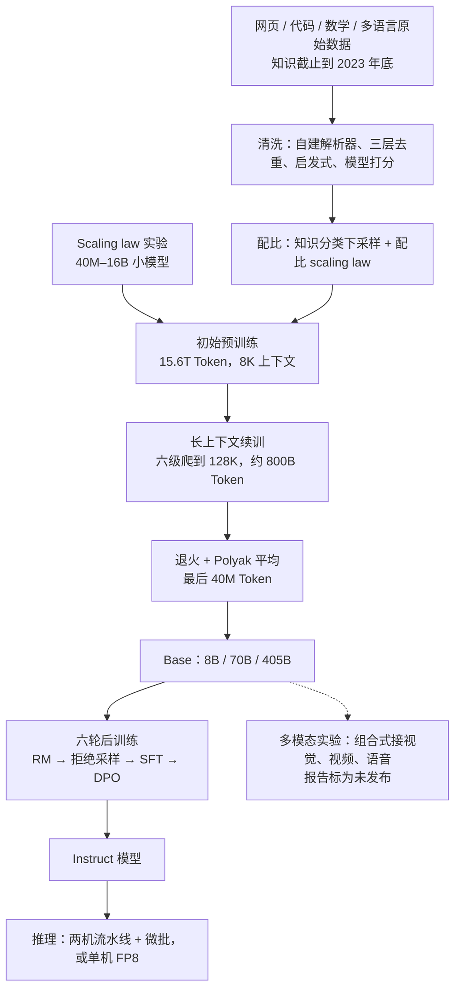
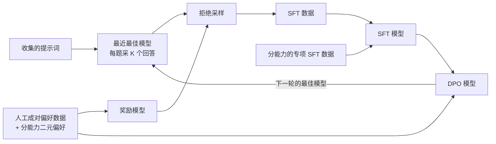
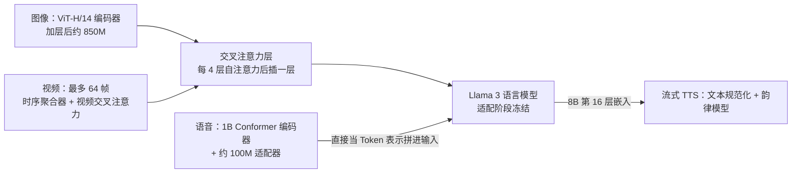

# Llama 3：405B 不押新架构，把复杂度花在数据、规模和训练系统上

<!-- release-date: 2024-07-23 -->

> 本文依据本地 `papers/Meta/Llama-3.pdf`，即 Meta Llama Team 的 **The Llama 3 Herd of Models**，arXiv:2407.21783v3、2024-11-23 提交的修订版，共 92 页（正文到 p. 71，p. 72–74 是贡献者名单，p. 75–92 是参考文献）。页码均指 PDF 自身的页码，与印刷页码一致。文中会区分三件事：**报告明确写了什么**、**我们怎么解释它**、**哪些是外部资料或本文推算**。

## 阅读前先认识几个词

这份报告几乎不发明新名词，难点在于它把老名词用到了很细的地方。先认几个：

- **Dense（稠密）模型**：每处理一个 Token，全部参数都参与计算。对照是 MoE（Mixture-of-Experts，混合专家），每个 Token 只激活一小部分参数。
- **FLOPs（浮点运算次数）**：训练的算力账单，大致正比于「参数量 × 训练 Token 数」。
- **Scaling law（缩放定律）**：用一批小模型的训练结果拟合出的经验规律，用来回答「这么多算力该训多大的模型、训多少 Token」。
- **MFU（Model FLOPs Utilization，模型算力利用率）**：训练时真正花在模型计算上的 FLOPs 占硬件理论峰值的比例，是大规模训练效率最常用的单一指标。
- **SFT（Supervised Finetuning，监督微调）**：拿「提示词—目标回答」成对数据继续训练。
- **拒绝采样（Rejection Sampling，RS）**：对同一个提示词采样很多个回答，用奖励模型挑最好的一个当训练数据。
- **DPO（Direct Preference Optimization，直接偏好优化）**：给一对「更好 / 更差」的回答，直接提高前者、压低后者的似然，不跑强化学习循环。

## 一句话先说清

2024 年公开的大模型路线正在分叉。一条路**让架构变聪明**：MoE、压缩 KV Cache 的注意力、新的路由与并行，DeepSeek-V2 一篇与 DeepSeek-V3 一篇讲的都是这条路。另一条路**让流程变可靠**：架构几乎不动，把力气花在数据、规模和训练系统上。

Llama 3 是后一条路的极端样本。旗舰是一个 **405B 参数的 dense Transformer**，上下文最长 128K，预训练用了 $3.8 \times 10^{25}$ FLOPs、15.6T 文本 Token，算力接近 Llama 2 最大版本的 50 倍（PDF p. 1–2）。架构相对 Llama 2 只有四处小改（PDF p. 6–7）。

报告把整篇的组织写在引言里，是三个杠杆（PDF p. 1–2）：

| 杠杆 | 报告的具体动作 | 关键数字 |
|---|---|---|
| 数据 | 更细的预训练清洗与配比，更严的后训练质量控制 | 约 15T 多语言 Token，Llama 2 是 1.8T |
| 规模 | 旗舰模型接近算力最优；8B、70B 训得远超算力最优 | $3.8 \times 10^{25}$ FLOPs，405B 参数 |
| 管理复杂度 | 选 dense 而不是 MoE；后训练只用 SFT + RS + DPO | — |

第三条最值得停一下。不选 MoE 的理由是**最大化训练稳定性**；不选 PPO 这类强化学习的理由是它们**更不稳定、更难扩展**（PDF p. 2）。结论一节说得更直白：预备实验里试过更复杂的架构和训练配方，收益抵不过引入的复杂度（PDF p. 70）。

如果只记一句话：

> **Llama 3 的创新预算不在模块，而在「让一条已知的路线在这个规模上不出错」：数据的每道工序能评估，模型大小和分数能在开训前预测，16K 张 GPU 的故障能自动恢复。**

## 先把家族关系理清楚

报告 Table 1 列了整个家族，并写明**本文所有结果都是 Llama 3.1 模型的结果**，行文里简称 Llama 3（PDF p. 1–2）：

| 模型 | 发布 | 多语言 | 长上下文 | 工具调用 |
|---|---|---|---|---|
| Llama 3 8B / 70B（含 Instruct） | 2024 年 4 月 | 否（脚注：用多语言数据预训练，但当时定位为英文） | 否 | 否 |
| Llama 3.1 8B / 70B / 405B（含 Instruct） | 2024 年 7 月 | 是 | 是 | 仅 Instruct 版 |

所以文中凡是 128K、多语言、工具调用，指的都是 7 月那一批。本文的首发日因此取 Llama 3.1 家族的首发日，取证见文末。

## 全景：从网页到部署的一条流水线

这张图按 PDF p. 3–4、p. 14–17、p. 51–54 的叙事重画，是流程示意，不含时间比例。下面按这条线逐段讲。

## 预训练数据：让每道工序都能单独评估

旧问题是：网页数据量大但脏，传统做法是套一组开源过滤器。你说不清哪一条规则带来了多少收益，也说不清它误删了什么。Llama 3 的做法是把清洗拆成一道道可以单独做实验的工序（PDF p. 4–6）。数据来自多种来源，知识截止到 2023 年底；先整域剔除含大量个人信息和成人内容的网站（PDF p. 4）。

### 网页清洗的四道工序

**一、自建 HTML 解析器。** 目标是样板去除的精确率和正文召回率，人工评测比第三方解析器好（PDF p. 5）。两个细节：数学常以预渲染图片出现、公式写在 `alt` 属性里，所以保留 `alt` 文本；**markdown 标记全部删掉**，因为实验发现对主要用网页训练的模型，保留 markdown 比纯文本更差（PDF p. 5）。报告只给了实验结论，没有解释原因。

**二、三层去重**（PDF p. 5）：

| 层级 | 做法 |
|---|---|
| URL 级 | 全量去重，同一 URL 只留最新版本 |
| 文档级 | 全局 MinHash，去掉近似重复文档 |
| 行级 | 类 ccNet 的激进去重：每 30M 篇文档一个桶，桶内出现超过 6 次的行删掉 |

行级去重附了一句自我批评：人工定性分析发现它不仅删掉导航菜单、Cookie 提示这类样板，**也删掉了一部分高频的高质量文本**；但实测指标提升明显，所以保留（PDF p. 5）。

**三、启发式过滤**（PDF p. 5）：用重复 n-gram 覆盖率删日志、报错这类长且唯一、行级去重抓不到的重复行；用「脏词」计数补域名黑名单漏掉的成人站；用 Token 分布的 KL 散度删掉异常 Token 过多的文档。

**四、模型打分。** 快的一路是 fasttext，判断一段文本像不像会被维基百科引用；重的一路是 RoBERTa 系分类器，**训练标签由 Llama 2 的 chat 模型给**：写清质量要求，让 Llama 2 判断文档是否达标，再出于效率用 DistilRoberta 给每篇文档打分（PDF p. 5）。代码与数学另走一条管线，分类器同样是 Llama 2 标注的 DistilRoberta，但提示词专门调向「数学推导、STEM 推理、代码与自然语言交错」的网页，并配了领域专用的 HTML 抽取与过滤规则，理由是代码和数学的 Token 分布与自然语言差得太远（PDF p. 5）。

多语言一路：fasttext 语言识别分成 176 种语言，每种语言内部各自做文档级、行级去重，再用多语言 Llama 2 分类器做质量排序；多语言 Token 的用量由实验定，在英文与多语言指标之间取平衡（PDF p. 5–6）。

**我们如何解释它。** 「用上一代模型标注、小模型蒸馏、全量打分」把质量判断变成了一个可训练、可扩展的分类任务，这是 15T 级语料能做细粒度筛选的前提。代价是质量的定义被上一代模型的偏好锚定，报告没有讨论这种偏好会不会传给下一代。

### 配比：让小模型替大模型投票

配比是最贵的超参数，不可能为试一个配比跑一次 405B。报告用两件工具（PDF p. 6）：

- **知识分类器**：给网页打「属于哪类知识」的标签，下采样在网上过度出现的类别，例子是艺术与娱乐；
- **配比的 scaling law 实验**：对候选配比训几个小模型，外推大模型在这个配比上的表现；反复多轮选出新候选，再用一个更大的模型实训验证关键指标。

最终配比大致是（PDF p. 6）：

| 类别 | Token 占比 |
|---|---:|
| 通用知识 | 约 50% |
| 数学与推理 | 25% |
| 代码 | 17% |
| 多语言 | 8% |

数学推理加代码合计 42%，这已经是一个明确押注推理与编程的配比。训练中途配比还在调：提高非英语占比、上采样数学、训练后期加入更新的网页数据把知识截止往后推、下采样后来认定为低质量的子集（PDF p. 14）。报告没有公开具体数据集、各来源比例和质量分切点。

### 退火当数据尺子

手上有一个几十亿 Token 的小众数据集，值不值得加进预训练？为它单独做 scaling law 实验太贵。报告的做法是：拿一个**训练到 50% 的 Llama 3 8B**，在 40B Token 上把学习率线性退火到 0，新数据集占 30% 权重、默认配比占 70%，看指标怎么变（PDF p. 6）。

同一把尺子还量出一个规模差异：在退火里加入 GSM8k 和 MATH 的训练集，8B 在两者验证集上分别提升 24.0% 和 6.4%（原文没说是绝对分还是相对比例），**405B 上的提升可以忽略**（PDF p. 6）。报告的解读是旗舰模型的上下文学习与推理能力已经够强，不需要领域内样本；这是作者的归因，不是受控实验。正式的退火数据里不放任何常用 benchmark 的训练集，以便真实评估 few-shot 与域外泛化（PDF p. 6）。

**可迁移启发。** 清洗的每道工序都要能单独做对照；配比和数据源价值用小模型、短程退火这类便宜实验先投票。另外，小模型上有效的数据干预不一定对大模型有效——8B 缺的东西，405B 可能本来就不缺。

## 架构：只改了四处

Table 3 把三个尺寸放在一起（PDF p. 7）：

| 配置 | 8B | 70B | 405B |
|---|---:|---:|---:|
| 层数 | 32 | 80 | 126 |
| 模型维度 | 4,096 | 8,192 | 16,384 |
| FFN 维度 | 14,336 | 28,672 | 53,248 |
| 注意力头数 | 32 | 64 | 128 |
| Key/Value 头数 | 8 | 8 | 8 |
| 峰值学习率 | $3 \times 10^{-4}$ | $1.5 \times 10^{-4}$ | $8 \times 10^{-5}$ |
| 激活函数 / 词表 / 位置编码 | SwiGLU / 128,000 / RoPE（$\theta = 500{,}000$） | 同左 | 同左 |

报告明说架构与 Llama、Llama 2 没有显著偏离，性能提升主要来自数据质量、多样性和训练规模（PDF p. 6）。相对 Llama 2 的四处小改（PDF p. 6–7）：

1. **GQA（Grouped-Query Attention，分组查询注意力），8 个 KV 头**：提升推理速度、缩小解码时的 KV Cache。三个尺寸的 KV 头都是 8，405B 是 128 个查询头共用 8 组 KV。
2. **跨文档注意力掩码**：预训练把多篇短文档拼进同一条序列，加掩码禁止它们互相注意。
3. **128K 词表**：tiktoken 的 100K Token 加 28K 个为非英语补的 Token。英文样本压缩率从 Llama 2 分词器的 3.17 提到 3.94 字符/Token，同样算力能「读」更多文本；新增的非英语 Token 同时改善压缩率和下游表现，不影响英文分词。
4. **RoPE 底数提高到 500,000**：更好地支持长上下文。报告引用的已有工作只证明这个值在 32,768 长度上有效，没有声称它对 128K 最优。

第二条最容易被跳过，下图把它画出来：

报告的观察是：这个掩码在标准预训练阶段影响有限，**在超长序列的续训中很重要**（PDF p. 6）。它还反过来约束了 infra：上下文并行必须支持这种掩码，这是后面选 all-gather 方案的理由之一（PDF p. 11）。

**为什么不用 MoE。** 报告只给了一句「为了最大化训练稳定性」（PDF p. 2），没有做 MoE 对照实验。相关工作一节补了一句：Llama 3 胜过 Mixtral、Arctic 这类 MoE，说明 dense 架构不是瓶颈，但训练、推理效率与大规模稳定性上仍有很多取舍（PDF p. 69）。代价也明确：每个 Token 都跑完 405B 参数，BF16 下装不进一台 8 卡 H100（PDF p. 51）。这是一次风险判断，不是技术上的胜负判定。

## Scaling law：从「该训多大」接到「会考多少分」

旧问题有两层（PDF p. 7）：已有 scaling law 通常只预测下一个 Token 的损失，预测不了具体 benchmark 的分数；而且它是小算力跑出来的，外推到大预算可能不可靠。可决策者关心的是分数——要决定 405B 还是 200B，你得知道哪个在 ARC、MMLU 上更好。

### 第一步：IsoFLOPs 找算力最优点

实验设置（PDF p. 7）：算力预算从 $6 \times 10^{18}$ 到 $10^{22}$ FLOPs，每个预算下训 40M 到 16B 不等的一组模型；cosine 学习率、线性 warmup 2,000 步，峰值 $2 \times 10^{-4}$ 到 $4 \times 10^{-4}$ 随模型大小调，衰减到峰值的 0.1；每步权重衰减为当步学习率的 0.1 倍；每个算力档用固定 batch，从 250K 到 4M。

原图引自 PDF p. 8 的 Figure 2 与 Figure 3。固定算力时，「训练 Token 数 → 验证损失」是一条开口向上的抛物线：模型太小容量不够，太大则看的 Token 太少。用二次多项式拟合每条曲线取最低点，就是该预算下的算力最优模型；再假设最优 Token 数与算力成幂律：

$$
N^\star(C) = A\,C^{\alpha}
$$

$C$ 是预训练算力，$N^\star(C)$ 是该预算下最优的训练 Token 数。拟合得 $(\alpha, A) = (0.53, 0.29)$（图例上是 0.537、0.299），外推到 $3.8 \times 10^{25}$ FLOPs 的建议是**训一个 402B 模型、看 16.55T Token**（PDF p. 8）。

最后训的是 405B。理由是一个很实用的观察：**算力越大，IsoFLOPs 曲线在最低点附近越平**，所以旗舰模型的表现对「模型大小 vs Token 数」的小幅取舍相对鲁棒（PDF p. 8）。在最优点附近，精确到 402 还是 405 已经不重要，重要的是别偏太远。

方向相反的决定同样写在引言里：8B 和 70B **训得远超算力最优**。算力最优只算训练成本；同样的推理预算下，一个训练过量的小模型比算力最优的模型更强。旗舰模型还会在后训练阶段反过来提升小模型（PDF p. 2）。

### 第二步：两跳把 FLOPs 接到准确率

原图引自 PDF p. 9 的 Figure 4（ARC Challenge）。两跳是（PDF p. 7–8）：

1. **第一跳，线性**：把算力最优模型在 benchmark 上「正确答案的归一化负对数似然」和训练 FLOPs 线性关联，只用 $10^{22}$ FLOPs 以内的 scaling law 模型；
2. **第二跳，S 形**：把这个负对数似然和准确率做 sigmoid 关联，除了 scaling law 模型，还用上 Llama 2 系列——它们用的是 Llama 2 的配比和分词器，但算力更高，正好补上高算力端的样本。

为什么要拆两跳？负对数似然随算力平滑单调，适合线性外推；准确率有上下界，中段变化最快，天然是 S 形，硬套直线会在两端失真。报告说这个预测**跨四个数量级外推仍相当准确，只是略微低估了旗舰模型的最终表现**（PDF p. 8）；图上 405B 的实测方块在预测三角的更优一侧。

**可迁移启发。** 决策看下游分数时，别只拟合损失：先接损失，再用有界函数族接指标。高算力端缺样本，可以借上一代模型补点，即使它们的数据配比不同。再看一眼拟合曲线在最优点附近有多平，它告诉你这个决策需要多精确。

## 训练系统：把 16K 张 H100 连成一台机器

这一节是报告里在别处最难读到的部分。

### 硬件与存储

405B 在最多 16K 张 H100 上训练，每卡 700W TDP、80GB HBM3，Grand Teton 服务器每台 8 卡 2 CPU、机内 NVLink，调度用 Meta 的 MAST（PDF p. 9）。Llama 1、2 训练于 AI Research SuperCluster，Llama 3 迁到了 Meta 的生产集群（PDF p. 8）。存储是 Tectonic 分布式文件系统，7,500 台 SSD 服务器、240 PB，持续吞吐 2 TB/s、峰值 7 TB/s；难点是 checkpoint 的突发写入会短时打满存储网络，而他们既想缩短 checkpoint 时 GPU 的停顿，又想提高 checkpoint 频率减少故障后丢失的工作——每张卡的状态从 1 MB 到 4 GB 不等（PDF p. 9）。

### 网络：人为造出 16 条流，然后不用拥塞控制

405B 用 RoCE（RDMA over Converged Ethernet）网络，较小的模型用 InfiniBand，都是 400 Gbps，调到了等效性能（PDF p. 9）。RoCE 集群是三层 Clos：机架 16 卡接一台 ToR 交换机；192 个机架组成一个 3,072 卡的 Pod，全二分带宽；8 个 Pod 组成 24K 卡的集群，但聚合层不再全二分，**收敛比 1:7**（PDF p. 9）。24K 卡里，Llama 3 预训练最多只用了 16K（PDF p. 9 脚注 5）。

训练流量是少数几条又粗又长的「肥流」，传统 ECMP（等价多路径路由）靠哈希分流，流太少就分不匀。对策有两条：集合通信库在两张 GPU 之间**建 16 条流而不是 1 条**；E-ECMP 再对 RoCE 包头的额外字段做哈希，把这 16 条流铺到不同路径上（PDF p. 9–10）。拥塞上，脊层用深缓冲交换机吸收集合通信的瞬时拥塞，加上 E-ECMP 本身降低拥塞概率，结果是 **24K 卡集群没有用 DCQCN 这类传统拥塞控制**（PDF p. 10）。

**我们如何解释它。** 拥塞控制是拥塞发生后减速；如果在流量形状上就把拥塞避开，那层反馈机制可以不要。先改流量的形状，再考虑调速。

### 4D 并行：维度顺序就是设计

四种并行叠加：张量并行（TP）切单个权重张量，上下文并行（CP）切序列，流水线并行（PP）按层切阶段，数据并行用 FSDP（全分片数据并行）（PDF p. 10）。FSDP 的用法有个改动：分片优化器状态和梯度，但**前向之后不对模型分片重新分片**，省掉反向时的一次 all-gather，是用显存换通信（PDF p. 10）。

顺序 [TP, CP, PP, DP] 按网络需求排：最内层要最高带宽、最低延迟，通常限制在一台服务器内；最外层可能跨多跳网络，必须容忍高延迟。DP 放最外，因为 FSDP 能异步预取分片权重、异步规约梯度（PDF p. 12）。挑配置时他们还做了显存估算器和性能投影工具，开训前探索配置、找显存缺口（PDF p. 12）。

三个阶段的实测配置（PDF p. 10，Table 4）：

| GPU 数 | TP | CP | PP | DP | 序列长度 | 每 DP 组 batch | 每批 Token | TFLOPs/GPU | BF16 MFU |
|---:|---:|---:|---:|---:|---:|---:|---:|---:|---:|
| 8,192 | 8 | 1 | 16 | 64 | 8,192 | 32 | 16M | 430 | 43% |
| 16,384 | 8 | 1 | 16 | 128 | 8,192 | 16 | 16M | 400 | 41% |
| 16,384 | 8 | 16 | 16 | 8 | 131,072 | 16 | 16M | 380 | 38% |

从 8K 卡扩到 16K 卡、MFU 从 43% 掉到 41%，报告给的原因是：为了保持每批总 Token 不变，每个 DP 组的 batch 减半（PDF p. 10）。上长上下文后 CP 开到 16、DP 压到 8，MFU 38%。每批 16M Token 在三个阶段保持不变。

### 流水线并行的三个坑与三个补丁

报告点名了现成实现的三个问题（PDF p. 10）：每卡 batch 要能被流水线阶段数整除，而预训练需要灵活调 batch；第一个阶段放 embedding 和 warm-up 微批，显存偏多；最后一个阶段要算输出投影和损失，成为延迟瓶颈。

补丁（PDF p. 11）：

1. **让 $N$ 可调**（$N$ 是同一阶段连续处理的微批数，Figure 6 的例子是 $N = 5$）：大规模下 batch 受限时可以少于阶段数，也可以多开微批掩盖点对点通信，在深度优先与广度优先调度之间找甜点；
2. **首尾阶段各少放一层 Transformer**：第一个阶段的第一块只有 embedding，最后一个阶段的最后一块只有输出投影和损失，显存与计算的不均衡一起抹平；
3. **交错调度**：一个流水线 rank 上放 $V$ 个阶段，整体气泡比例为

$$
\text{bubble ratio} = \frac{PP - 1}{V \times M}
$$

$PP$ 是流水线阶段数，$M$ 是微批总数；$V$、$M$ 越大气泡越小。另外 PP 用异步点对点通信（文档掩码带来额外计算不均衡时尤其有用），打开 `TORCH_NCCL_AVOID_RECORD_STREAMS` 省显存，并按显存 profiling 主动释放不再用的张量。结果：**8K 序列的预训练不需要激活重计算**（PDF p. 11）。

### 上下文并行：放弃 ring，改用 all-gather

序列拉到 128K 时，激活显存会压垮单卡。CP 把序列切成 $2 \times CP$ 块，第 $i$ 个 rank 拿第 $i$ 块和第 $2 \times CP - 1 - i$ 块，理由是负载均衡（PDF p. 11）；上图是这条规则在因果注意力下为什么能配平的示意。

更有意思的是通信方式。主流 CP 用环形结构让通信与计算重叠；Llama 3 反而**先 all-gather 全部 K 和 V，再用本地 Q 块算注意力**，all-gather 的延迟直接暴露在关键路径上。报告给两条理由（PDF p. 11–12）：all-gather 方案更容易支持文档掩码这类各种注意力掩码；而且因为用了 GQA，K、V 比 Q 小得多，注意力计算是 $O(S^2)$、all-gather 只是 $O(S)$（$S$ 为序列长度），开销可以忽略。

**我们如何解释它。** 架构上选 GQA，让 infra 有资格选更朴素的 CP；架构上加文档掩码，又逼 infra 选能支持掩码的 CP。架构决策和 infra 决策在互相开路。

### 数值稳定与通信库

通过比较**不同并行配置下的训练损失**，他们定位并修掉了几处影响稳定性的数值问题：多个微批的反向中梯度累加用 FP32，FSDP 跨数据并行的 reduce-scatter 用 FP32，前向里被多次使用的中间张量（例如视觉编码器输出）反向梯度也用 FP32 累加（PDF p. 12）。「换一种并行配置，损失应该不变」是一个可以检验的不变量，漂了就一定是数值实现的问题。

通信库 NCCLX 是 NCCL 的分支，主要改进高延迟网络：最外层的 PP、DP 可能跨多跳，延迟可达数十微秒。原生集合通信要分块、分段拷贝，带来大量小控制消息、额外内存拷贝和额外 GPU 周期；Llama 3 只解决了其中一部分——按网络延迟调分块和传输方式，让小控制消息以更高优先级通过网络、避免在深缓冲核心交换机里队头阻塞——更彻底的改动留给后续版本（PDF p. 12）。

## 54 天、466 次中断：目标是恢复速度，不是零故障

报告公开了 405B 预训练中一段 **54 天快照期**的故障账（PDF p. 13）：共 466 次作业中断，其中 47 次是计划内（固件升级、配置或数据集更新），419 次是意外中断；约 78% 的意外中断归因于确认或疑似的硬件问题，GPU 相关问题占全部意外中断的 58.7%；**需要大量人工介入的只有 3 次**，其余由自动化处理。即便自动化集群维护每天至少造成一次中断，有效训练时间仍高于 90%。

Table 5 的根因分类，只列前几名与值得注意的项（PDF p. 13）：

| 根因 | 类别 | 次数 | 占意外中断 |
|---|---|---:|---:|
| 故障 GPU | GPU | 148 | 30.1% |
| GPU HBM3 显存 | GPU | 72 | 17.2% |
| 软件 bug | 依赖 | 54 | 12.9% |
| 网络交换机 / 线缆 | 网络 | 35 | 8.4% |
| 计划外主机维护 | 计划外维护 | 32 | 7.6% |
| GPU SRAM | GPU | 19 | 4.5% |
| GPU 系统处理器 | GPU | 17 | 4.1% |
| 静默数据损坏 | GPU | 6 | 1.4% |

其余是网卡、NCCL 看门狗超时（各 7 次）、GPU 导热界面与传感器（6 次）和若干 3 次以下的主机部件。

同步训练的容错性天然差，单卡故障可能要重启整个作业（PDF p. 13）。所以他们的工夫下在三处（PDF p. 13–14）：

- **缩短作业启动和 checkpoint 时间**；
- **诊断要快**：大量使用 PyTorch 的 NCCL flight recorder，把集合通信元数据和调用栈记进环形缓冲，NCCLX 看门狗或心跳超时时自动转储；更耗算力的追踪可以**在线改配置开启，不用发版也不用重启作业**；
- **两类最难抓的故障**：NVLink 故障常表现为 CUDA kernel 里的 load/store 卡住却不返回明确错误码，NCCLX 与 PyTorch 协同设计后能读到通信库内部状态、检测到卡顿就自动超时，但报告承认这种卡顿无法完全避免；另一类是**变慢但不挂的掉队者**，一个就能拖慢几千张卡，他们做了工具按进程组给可疑通信排优先级，通常查几个头号嫌疑就能定位。

还有两条物理现实（PDF p. 14）：吞吐随一天中的时间有 **1–2% 的昼夜波动**，原因是午间温度更高影响 GPU 的动态调频调压；几万张卡同时升降功耗（一起等 checkpoint 或集合通信、作业启停）会让数据中心出现**数十兆瓦量级的瞬时功耗波动**，逼近电网的承受极限，报告把它列为扩展到更大模型时持续存在的挑战。

**可迁移启发。** 大规模同步训练要优化的是平均恢复时间，不是平均故障间隔；可观测性要能在线开关，因为「为了收集信息而重启」本身就是最贵的调试成本；最难的故障不是崩溃，而是变慢不报错。

## 预训练 recipe：三段

405B 的预训练分三段，8B 和 70B 配方类似（PDF p. 14）。

**一、初始预训练**（PDF p. 14）。AdamW，峰值学习率 $8 \times 10^{-5}$，线性 warmup 8,000 步，cosine 衰减到 $8 \times 10^{-7}$、共 1,200,000 步。batch 分三级爬升：起步 4M Token、序列 4,096；训完 252M Token 后翻倍到 8M、序列 8,192；训完 2.87T Token 后再翻倍到 16M。理由是早期小 batch 更稳、后期大 batch 更高效。报告的结论是这个配方很稳：**只观察到少量 loss spike，不需要干预来纠正发散**。

**二、长上下文续训**（PDF p. 14）。不从一开始用长序列，是因为自注意力计算随序列长度平方增长。从 8K 分**六个阶段**加到 128K，共用了约 800B Token。每级训到「适应了」才加，判据两条：短上下文评测**完全恢复**，且**在该长度上完美解决大海捞针**。两条缺一不可：只看第二条，可能得到会检索但短文本退化的模型；只看第一条，不知道长上下文是否真学会了。

**三、退火**（PDF p. 15）。在**最后 40M Token** 上把学习率线性退火到 0，上下文保持 128K，同时上采样极高质量的数据源；最后对退火期间的多个 checkpoint 做 Polyak 平均，得到最终预训练模型。注意这里的 40M 与前面数据尺子实验的 40B 是两件事；按 16M Token 的 batch 算，40M 只够几步更新（本文算术），报告没有进一步说明这个量级。

## 后训练：六轮同一个循环

这张图据 PDF p. 15 的 Figure 7 重画，是机制示意。每一轮都是「奖励模型 → 拒绝采样 → SFT → DPO」，**一共六轮**；每轮收集新的偏好标注和 SFT 数据，并从最新模型采样合成数据（PDF p. 17）。随着模型变强，他们相应提高提示词的复杂度，专挑模型落后的方向（PDF p. 17）。后训练默认说的都是 405B（PDF p. 15）。

为了工具调用这类一轮里要发多条消息、发往不同去处（用户、ipython）的场景，报告设计了新的多消息对话协议，用特殊的 header 与终止 Token 标明每条消息的来源、去处和换人说话的时刻（PDF p. 15–16）。这些格式 Token 后面还会在 DPO 里出现。

### 奖励模型

目标与 Llama 2 相同，但**去掉了 margin 项**，因为数据规模上去后它的改善在递减（PDF p. 16）。标注员在排序之后还会**编辑更好的那个回答**，于是部分样本有三级排序 edited > chosen > rejected（PDF p. 16–17）。训练时把提示词和多个回答拼进一行、回答随机打乱，消融显示提升效率而不损失准确率（PDF p. 16）。

**我们如何解释它。** 普通成对偏好的上限是标注员见过的最好回答；编辑一步等于让标注员造一个比两个候选都好的目标，把训练信号的上界抬高了。

### SFT：其实是拒绝采样的下游

标准交叉熵，**掩掉提示词上的损失**；最大的模型用学习率 $10^{-5}$ 训 8.5K–9K 步（PDF p. 16）。报告自己承认：叫它 SFT，**尽管很多训练目标其实是模型生成的**（PDF p. 16）。

拒绝采样的做法（PDF p. 18）：对每个人工收集的提示词，从最新的 chat 策略（通常是上一轮或某项能力上最好的 checkpoint）采 $K$ 个输出，$K$ 通常 10–30，由奖励模型挑最好的；后期轮次加系统提示词引导语气、风格和格式。工程上用 PagedAttention：先定一个最大输出长度，只有显存放得下这么长的输出才发起请求，避免换出；同一提示词的多个输出共享 KV Cache 页，**拒绝采样吞吐提升超过 2 倍**。在一个跑六轮、每题采 10–30 个的流水线里，推理吞吐就是数据量的上限。

### DPO 与两个补丁

报告也试过 PPO 这类在线策略算法，但在大模型上 **DPO 算力更省、表现更好，尤其在 IFEval 这类指令遵循 benchmark 上**（PDF p. 16）。这个结论只在他们的配置、数据与规模下成立，报告没给对照实验的细节。DPO 主要用各能力**最近几批**偏好数据，它们由上一轮最好的模型采得，更贴近当前要优化的策略分布；学习率 $10^{-5}$，$\beta = 0.1$（PDF p. 16）。

两个算法补丁（PDF p. 16）：

- **把格式 Token 从 DPO 损失里掩掉。** chosen 和 rejected 都带相同的 header、终止 Token；它们参与损失时，出现了**尾部重复**和**突然输出终止 Token** 的坏行为。报告的假设是：DPO 是对比式损失，两边共有的 Token 让模型同时要提高和压低它们的似然，目标自相矛盾。
- **加一项系数 0.2 的 NLL 损失**，只作用在 chosen 上：保持期望的生成格式，防止 chosen 的对数概率下降。

**我们如何解释第二条。** DPO 只约束两者的相对差距，模型可以把两边一起压低来降损失；绝对的 NLL 项等于给 chosen 装了一块地板。两个补丁都不改算法主体，补的是对比式目标的两个结构性漏洞：共有片段的梯度冲突，相对目标不管绝对水平。

最后，在 RM、SFT、DPO 每个阶段，都把不同数据版本或超参跑出来的模型**取平均**（PDF p. 16）。

### 后训练数据长什么样

偏好数据（PDF p. 17，Table 6）：

| 类别 | 占比 | 平均轮数 | 平均 Token/样本 | 提示 Token | 回答 Token |
|---|---:|---:|---:|---:|---:|
| 通用英文 | 81.99% | 4.1 | 1,000.4 | 36.4 | 271.2 |
| 代码 | 6.93% | 3.2 | 1,621.0 | 113.8 | 462.9 |
| 多语言 | 5.19% | 1.8 | 1,299.4 | 77.1 | 420.9 |
| 推理与工具 | 5.89% | 1.6 | 707.7 | 46.6 | 129.9 |
| 合计 | 100% | 3.8 | 1,041.6 | 44.5 | 284.0 |

采集时每个提示词从**两个不同模型**各采一个回答，模型可以用不同配比与对齐配方训出，拉开能力侧重；偏好强度分四档（显著更好 / 更好 / 略好 / 稍好），RM 和 DPO 都只用标为「显著更好」和「更好」的样本；RM 用当时全部偏好数据，DPO 只用各能力的最新批次（PDF p. 17）。

SFT 数据（PDF p. 18，Table 7）：

| 类别 | 样本占比 | 平均轮数 | 平均 Token | 上下文 Token | 最终回答 Token |
|---|---:|---:|---:|---:|---:|
| 通用英文 | 52.66% | 6.3 | 974.0 | 656.7 | 317.1 |
| 代码 | 14.89% | 2.7 | 753.3 | 378.8 | 374.5 |
| 多语言 | 3.01% | 2.7 | 520.5 | 230.8 | 289.7 |
| 考试类 | 8.14% | 2.3 | 297.8 | 124.4 | 173.4 |
| 推理与工具 | 21.19% | 3.1 | 661.6 | 359.8 | 301.9 |
| 长上下文 | 0.11% | 6.7 | 38,135.6 | 37,395.2 | 740.5 |
| 合计 | 100% | 4.7 | 846.1 | 535.7 | 310.4 |

长上下文只占 0.11% 的样本，但每条平均 38K Token；按 Token 算它的权重远不止 0.11%（本文的读法）。看配比要先问「按样本还是按 Token」。

### 清洗与剪枝：四把模型化的筛子

大部分训练数据是模型生成的，所以清洗很重（PDF p. 18–19）。规则层面，早期轮次出现了过多表情符号和感叹号；对过度道歉的语气，他们找出被滥用的短语（如「I'm sorry」），**小心平衡这类样本的比例**，而不是全删。模型层面有四把筛子：

| 筛子 | 做法 |
|---|---|
| 主题分类 | 把 Llama 3 8B 微调成主题分类器，分粗类（数学推理）和细类（几何与三角） |
| 质量打分 | RM 分数前四分之一算高质量；Llama 打分对通用英文用三维评分（准确、指令遵循、语气呈现），对代码用两维（找 bug、用户意图），满分算高质量 |
| 难度打分 | Instag：让 Llama 3 70B 给 SFT 提示词做意图标注，意图越多越复杂；再让 Llama 3 按三分制评对话难度 |
| 语义去重 | RoBERTa 对完整对话聚类，簇内按「质量分 × 难度分」排序，贪心保留与已选样本最大余弦相似度低于阈值的 |

质量打分那一行有个关键观察：**RM 分与 Llama 打分的分歧率很高**，两者合并在内部测试集上召回最好，最终保留被**任一方**判为高质量的样本（PDF p. 19）。

## 分能力的数据工程

各能力的做法有一个共同骨架：需要时从主预训练分出一个领域专家，用它和最新模型生成合成数据，再用执行、编译或模型判分这类可自动检查的信号过滤（PDF p. 19–28）。下面只讲每项能力里真正有信息量的地方。

### 代码：执行反馈打破自蒸馏天花板

代码专家从主预训练分叉，在 **1T Token、85% 以上是代码**的混合上继续预训练；最后几千步做长上下文微调把上下文扩到 16K；再按通用配方对齐，SFT 与 DPO 数据以代码为主。它用来在后续各轮收集高质量代码标注，并为代码提示词做拒绝采样（PDF p. 19）。合成 SFT 样本总计超过 2.7M 条（PDF p. 19）。

关键发现在执行反馈一路：8B、70B 用更强模型生成的数据训练会显著变好，但**用 405B 自己生成的数据训 405B 没用，甚至会变差**（PDF p. 20）。补救是引入外部真值——执行反馈，约 1M 条合成编程对话按这条流水线生成（PDF p. 20）：

1. 从各处采随机代码片段，让模型据此出编程题，覆盖长尾主题；
2. 让 Llama 3 用指定语言解题，提示里加入「良好编程的通用规则」、要求在注释里解释思路；
3. 正确性检查：静态分析（解析器 + linter，抓语法错、未初始化变量、未导入函数、风格和类型错误）加模型生成单元测试、在容器里连同解法执行；
4. 失败就把题目、错误解法和解析器 / linter / 测试的反馈（stdout、stderr、返回码）喂回去让模型改；测试失败时模型可以改代码，也可以改测试；只有全部通过的对话进入 SFT；
5. 多轮迭代，每轮改进后的模型生成下一轮数据。

**约 20% 的解法起初是错的，但自我纠正成功了**（PDF p. 20）。

另两路：把 Python、C++ 这类主流语言的数据翻译成 TypeScript、PHP 这类小众语言，靠语法解析、编译和执行保质，MultiPL-E 上显著提升（PDF p. 20）；对文档、解释这类执行反馈不太有用的能力，用**反向翻译**生成约 1.2M 条对话——先让模型给代码写注释或解释，再只凭注释或解释重新生成代码，以原代码为参照让 Llama 3 判断还原得有多忠实，取自验证分最高的进 SFT（PDF p. 20–21）。拒绝采样时还用代码专用系统提示词改善可读性、注释和变量命名（PDF p. 21）。

一个失败又修好的过滤实验（PDF p. 21–22）：对拒绝采样的代码数据，让早期 Llama 3 按「代码正确性」「代码风格」各打 0/1 分，只留满分 2 分的。结果下游指标**退化**了，原因是这个严格过滤**不成比例地删掉了难题的样本**。修法不是放宽阈值，而是**把最难那类数据的回答改写到能过裁判为止**。

**我们如何解释它。** 按质量分过滤天然带难度偏置：难题的回答平均分更低，只按分数切会系统性地删掉最有价值的样本。

### 多语言：几乎不用机器翻译

多语言专家同样从预训练分叉，在 **90% 多语言 Token** 的混合上继续预训练，再按通用配方后训练，用来在预训练彻底结束前收集更好的非英语标注（PDF p. 22）。目标语言是德、法、意、葡、印地、西、泰（PDF p. 22）。多语言 SFT 数据构成：人工标注 2.4%、其他 NLP 任务改写 44.2%、拒绝采样 18.8%、翻译来的推理数据 34.6%（PDF p. 22）。

两个细节（PDF p. 22）：拒绝采样早期在 0.2–1 之间随机取温度，高温回答更有创意，但容易出现不必要的语码转换，最后一轮固定用 0.6；奖励模型挑选之前先检查提示与回答语言一致，例如罗马化的印地语提示不应得到天城文回答。

他们**尽量不用机器翻译数据**，理由是翻译腔、姓名与性别偏见、文化偏见，也不想让模型只见到根植于英语文化的任务。唯一例外是合成的数学推理数据，因为数学题语言简单，翻译后几乎没有质量问题，加入后 MGSM 明显提升（PDF p. 22–23）。

### 数学与推理：五个困难、五个对策

报告先列困难，再对应给方法（PDF p. 23–24）：

| 困难 | 对策 |
|---|---|
| 越难的题，可用提示词越少 | 从预训练语料里挑数学内容转成问答；建数学技能分类体系，找出模型薄弱的技能，请人针对性出题 |
| 缺少真值思维链 | 让 Llama 3 为每题生成数量不等的分步解，按最终答案过滤；再让 Llama 3 自验证分步解是否有效 |
| 中间步骤可能错 | 训练结果奖励模型与分步奖励模型过滤；更难的题用 MCTS 配学到的分步奖励模型生成有效推理链 |
| 要会用工具 | 文本推理与 Python 代码交错解题，代码执行结果当反馈信号剔除无效推理链 |
| 训练与推理不一致 | 拿错误的生成，提示 Llama 3 改出正确结果，模拟从反馈中学习 |

报告没有公开这些奖励模型的规模、训练数据量，以及 MCTS 的搜索预算与超参。

### 长上下文：0.1% 就够

只用短上下文数据做 SFT，会让预训练得来的长上下文能力**显著退化**；人工标注长文又太耗时，所以主要靠合成（PDF p. 24）。三类合成数据：

- **问答**：从预训练混合里挑长文档，切成 8K 的块，让早期 Llama 3 基于随机选中的块出问答对，**训练时给整篇文档当上下文**；
- **摘要**：分层摘要，先用最强的 8K 上下文模型摘要每个 8K 块，再摘要这些摘要；训练时给整篇文档，要求保留所有重要细节，并基于摘要出需要全局理解的问题；
- **代码仓库推理**：解析 Python 的 import 找依赖，选出被**至少 5 个**其他文件依赖的关键文件，从仓库里删掉它，让模型指出哪些文件依赖它并补出缺失代码。

样本按 16K、32K、64K、128K 分档。仔细消融后发现，**把 0.1% 的合成长上下文数据混进原有短上下文数据**，长短两类 benchmark 同时最优（PDF p. 24）。DPO 只用短上下文数据也不伤长上下文，前提是 SFT 模型的长上下文已经够好；报告猜测原因是 DPO 的优化步数比 SFT 少得多（PDF p. 24）。

**我们如何解释它。** 长上下文能力是续训用约 800B Token 建起来的，SFT 里只需要极少量样本提醒它别丢。保住一项能力所需的数据，可能远少于获得它所需的数据。

### 工具调用：也要专门教「别调用」

三个核心工具：Brave Search、Python 解释器、Wolfram Alpha API（PDF p. 24–25）。核心工具实现为带方法的 Python 对象，零样本工具是带描述和文档的 Python 函数，也可以转成 JSON；所有工具调用都由 Python 解释器执行，必须在系统提示里启用，核心工具可逐个开关（PDF p. 25）。

数据采集有两处和主流程不同（PDF p. 25）：**按消息而不是按对话标注**——工具对话里常有多条助手消息，标注员在同一上下文下的两条消息之间选偏好，都有大问题就直接改一条，选中或改好的消息加入上下文后对话继续；标注员**不能排序或编辑工具输出**。另外，工具能力上**不做拒绝采样**，因为在工具 benchmark 上没看到收益，报告没解释原因。标注协议逐步加难：先单轮工具使用，再对话中的工具使用，最后多步工具使用与数据分析（PDF p. 25）。

合成数据分三类（PDF p. 25–26）：单步工具使用（生成必须调用某个核心工具的问题，例如超出知识截止日期的问题，执行后生成最终答案；约 30% 因调用无法执行或格式问题被滤掉）；多步工具使用（至少两次调用，推理与调用交错，类似 ReAct）；文件上传（`.txt`、`.docx`、`.pdf`、`.pptx`、`.xlsx`、`.csv`、`.tsv`、`.py`、`.json`、`.jsonl`、`.html`、`.xml`）。

最容易漏掉的一条（PDF p. 26）：他们特意加入简单数学与问答数据集的问题，**系统提示里开着工具，但回答不调用工具**，教模型在简单问题上别乱调用。零样本函数调用的数据则从 The Stack 里**挖真实函数**，抽取调用与定义、清洗过滤后，让 Llama 3 反向生成对应的自然语言问题；多轮函数调用用多个 Llama 3 变体扮演不同角色分别生成领域、API、问题、调用与响应（PDF p. 26）。

### 事实性与可操控性

事实性的原则是：后训练应让模型**知道自己知道什么，而不是给它加知识**（PDF p. 27）。知识探针的六步：从预训练数据抽一个片段 → 让 Llama 3 基于片段出一个事实性问题 → 采样模型的多个回答 → 以原片段为参照、Llama 3 当裁判判正确性 → 再判信息量 → 对在多次生成中**始终「有信息量但错误」** 的问题，生成拒答（PDF p. 27）。报告也承认预训练数据本身未必事实一致，所以另收一小批标注数据，专门处理事实矛盾多发的敏感话题。

**我们如何解释它。** 条件卡在「始终自信地答错」上：偶尔答错可能只是采样噪声，每次都笃定地错，才像模型内部有一个错误的强信念。

可操控性聚焦**系统提示词**控制回答长度、格式、语气和角色（PDF p. 28）。标注员自己设计系统提示词，再和模型多轮对话，评估模型在整段对话里是否一直遵守；报告给的例子是一个忙碌家庭的餐单助手，同时约束家庭成员、计划天数、剩菜复用、确认后给购物清单、忌口替换、工作日与周末区别等十几条。收集到的偏好数据用在奖励建模、拒绝采样、SFT 和 DPO 四个环节（PDF p. 28）。

## 推理：两机流水线，或单机 FP8

### 流水线并行在推理里性质变了

BF16 下 405B **装不进一台 8 卡 H100**，所以跨两台机器、16 张卡：机内用张量并行，机间带宽低、延迟高，用流水线并行（PDF p. 51–52）。训练时流水线气泡是大问题，推理时不是，因为推理没有需要冲刷流水线的反向传播，于是用**微批**提吞吐（PDF p. 52）。在 4,096 个输入 Token、256 个输出 Token 的负载下，两个微批让预填充和解码的吞吐都在相同本地 batch 下提高；额外的同步点会增加延迟，但总体的吞吐—延迟权衡更好（PDF p. 52，Figure 24）。

### FP8：三处保护与一种更敏感的评估

利用 H100 的原生 FP8，对模型内大部分矩阵乘法做 FP8 量化：主要是前馈网络的参数与激活，约占推理计算时间的 50%；**自注意力层的参数不量化**；用动态缩放因子并优化 CUDA kernel 降低算缩放因子的开销，kernel 已开源（PDF p. 52 与脚注 15）。405B 对某些量化方式很敏感，于是加了三处保护（PDF p. 52–53）：

1. **第一层和最后一层 Transformer 不量化**；
2. **动态缩放因子的上界卡在 1200**：日期这类高困惑度 Token 会产生很大的激活值，导致很高的缩放因子和不可忽略的下溢，进而解码出错；
3. **按行量化**：参数和激活矩阵按行各算缩放因子，比整张量共用一个更好（Figure 25）。

最值得带走的是评估方式（PDF p. 53）：标准 benchmark 常常显示 FP8 与 BF16 持平，**即使没做上面这些保护**；可不给缩放因子设上界时，模型**偶尔会输出损坏的回答，benchmark 分数却依然很好**。所以他们改看 FP8 与 BF16 各生成 100,000 条回答的**奖励模型分数分布**；Figure 26 里两者几乎重合，说明这套量化对回答影响很小。效率上，与两机 BF16 相比，FP8 在预填充阶段吞吐最多提升 50%，解码阶段的吞吐—延迟权衡明显更好（PDF p. 53，Figure 27）；Figure 27 图内另有一行标注：FP8 一台机器就放得下，所以其吞吐按 2 倍计（PDF p. 54）。

**我们如何解释它。** 准确率只看最终选项，偶发、局部的输出损坏不改变选项；要检测这类退化，得看分布的尾部，不能看平均值或准确率。

## 实验怎么证明

评测覆盖预训练模型（标准 benchmark、鲁棒性、对抗样本、污染分析）、后训练模型（知识、考试、代码、多语言、数学、长上下文、工具）、人类评测与安全（PDF p. 28–51）。逐项表格报告已给清楚，下面只讲读表要知道的几件事。

### 旗舰对比：接近但没全面超过闭源前沿

从 Table 2 摘 405B 与三家闭源模型（PDF p. 3）：

| Benchmark | Llama 3 405B | GPT-4 (0125) | GPT-4o | Claude 3.5 Sonnet |
|---|---:|---:|---:|---:|
| MMLU（5-shot） | 87.3 | 85.1 | 89.1 | **89.9** |
| MMLU-Pro（5-shot，CoT） | 73.3 | 64.8 | 74.0 | **77.0** |
| IFEval | **88.6** | 84.3 | 85.6 | 88.0 |
| HumanEval（0-shot） | 89.0 | 86.6 | 90.2 | **92.0** |
| GSM8K（8-shot，CoT） | **96.8** | 94.2 | 96.1 | 96.4（0-shot） |
| MATH（0-shot，CoT） | 73.8 | 64.5 | **76.6** | 71.1 |
| GPQA（0-shot，CoT） | 51.1 | 41.4 | 53.6 | **59.4** |
| BFCL | 88.5 | 88.3 | 80.5 | **90.2** |
| Nexus | **58.7** | 50.3 | 56.1 | 45.7 |
| InfiniteBench/En.MC | **83.4** | 72.1 | 82.5 | – |
| MGSM（0-shot，CoT） | **91.6** | 85.9 | 90.5 | **91.6** |

加粗为本文按行标出的最高值，不是原表的加粗。读法：405B 普遍超过 GPT-4 (0125)，与 GPT-4o、Claude 3.5 Sonnet 互有胜负；推理密集的 GPQA、MMLU-Pro 上仍有差距。8B 和 70B 在各自尺寸档普遍领先（PDF p. 2–3、p. 35–38）。

预训练模型方面，报告说对 405B 这一档的对手大多无法复算（没放出预训练模型或 API 不给对数概率），所以**不给 405B 的类别平均分**（PDF p. 29）。MMLU 选择题的标签变体、few-shot 标签分布、选项顺序和提示格式都改过一遍，预训练模型很稳，405B 尤其稳（PDF p. 30–33）；对抗集上，复述检测几乎不受 PAWS 的对抗构造影响，但数学推理和问答的对抗分数明显低于非对抗分数，预训练与后训练模型同样如此（PDF p. 33）。

### 每个分数都带置信区间

报告对 benchmark 分数报 95% 置信区间，假设分数服从高斯分布（PDF p. 29）：

$$
CI(S) = 1.96 \times \sqrt{\frac{S \times (1 - S)}{N}}
$$

$S$ 是观察到的分数（准确率或精确匹配），$N$ 是样本数。报告承认这个假设不对（分数有界），但初步 bootstrap 实验显示对离散指标是好的近似；而且抽样不是唯一的变异来源，所以这是实际变异的**下界**。看 Table 22 的 Nexus：405B 是 $58.7 \pm 4.1$，GPT-4o 是 $56.1 \pm 4.2$（PDF p. 39），区间大幅重叠。

### 污染分析：愿意写「测不出来」

方法是 8-gram 重叠：样本中有比例 $T_D$ 的 Token 落在预训练语料里至少出现过一次的 8-gram 中，就算被污染；$T_D$ 按数据集单独选，选使三个尺寸上「估计性能增益」最显著的那个值（PDF p. 34）。摘几行（PDF p. 34，Table 15）：

| 数据集 | 判定污染比例 | 405B 估计性能增益 |
|---|---:|---:|
| AGIEval | 98% | 16.3 |
| BIG-Bench Hard | 95% | 41.0 |
| HellaSwag | 85% | 14.3 |
| PiQA | 55% | 8.1 |
| NaturalQuestions | 52% | 0.8 |
| GSM8K | 41% | 1.3 |
| MATH | 1% | −0.2 |
| SQuAD | 0% | 0.0 |

报告自己的读法（PDF p. 34）：PiQA、HellaSwag 的污染和增益估计都高；NaturalQuestions 估计 52% 污染却几乎不影响分数；SQuAD 和 MATH 在低阈值下污染比例很高，却没有增益，说明污染要么没帮助，要么需要更大的 $n$。最诚实的一句：**MBPP、HumanEval、MMLU、MMLU-Pro 用 8-gram 算出的污染分数高到无法估出增益，需要别的方法**——恰恰是最常被引用的几个 benchmark。后训练数据则按每个 benchmark 的提示词做精确匹配去污染（PDF p. 34）。

### 人类评测：打平 GPT-4，但测的东西正是被优化的东西

约 7,000 条提示词，覆盖六项单轮能力（英语、推理、编码、印地语、西班牙语、葡萄牙语）和三项多轮能力（英语、推理、编码）（PDF p. 39）；约 10% 简单、30% 中等、60% 困难，**建模团队接触不到这些提示词**（PDF p. 40）。7 分制，判「更好」或「好得多」算一次胜（PDF p. 40）。

结果（PDF p. 40–41，Figure 17）：405B 与 GPT-4 (0125) 大致持平，多数能力的胜率差在误差范围内；多轮推理和编码胜过 GPT-4，多语言落后 GPT-4；英文与 GPT-4o 持平；多语言与 Claude 3.5 Sonnet 持平，单轮与多轮英文胜过它，但编码和推理落后于它。报告同时写道：人类评测结果**受语气、回答结构和冗长程度强烈影响，而这些正是后训练在优化的方向**；人类评测本身也会受标注员偏见影响（PDF p. 40）。把这两句连起来读，胜率要打一个折扣。

结论一节还给了两条组织上的做法（PDF p. 70）：预训练数据由**独立团队**采购处理，这个团队被强激励去防止外部 benchmark 污染；人类评测只由**不参与模型开发**的一小批研究员执行和访问。自动去污染方法可以被绕过，把利益冲突从流程里切掉更根本。

### 安全：违规率与误拒率一起报

安全一节占 PDF p. 40–51，这里只保留结构和几个必须并排看的数字。

- **两个互相拉扯的指标**：违规率（VR）与误拒率（FRR）；内部 benchmark 每项能力或语言超过 4000 条提示词，含对抗与边界两类（PDF p. 41–43）。这些 benchmark 是 Meta 内部的，**本节数字不可外部复现**，对手也因此匿名（PDF p. 44 脚注 13）。
- **记忆率**：用滚动哈希索引对语料的 n-gram 按不同出现频率采样提示与真值，测逐字复现比例；405B 在 50-gram 和 1000-gram 上平均 1.13% 和 3.91%，与同尺寸 Llama 2 用同样方法测的结果大致相当（PDF p. 42，Table 24）。
- **模型尺寸影响安全数据配比**：8B 需要更高比例的安全数据才能达到 70B 的安全水平，大模型更能分辨对抗与边界提示（PDF p. 43，Figure 18）。
- **长上下文**：针对 many-shot 越狱，用上下文里带不安全示范、回答却安全的样本做 SFT，256-shot 的攻击也基本被中和，对 FRR 与多数有用性指标几乎没影响（PDF p. 45）。
- **Llama Guard 3 的代价**（英文，相对 405B 本身，PDF p. 50–51，Table 25–26）：

| 过滤方式 | 违规率变化 | 误拒率变化 |
|---|---:|---:|
| 只过滤输入 | −76% | +95% |
| 只过滤输出 | −75% | +25% |
| 输入输出都过滤 | −86% | +102% |

全开 Llama Guard，英文误拒率翻倍还多。只报违规率下降是不完整的。

- **网络安全与化生武器**：代码解释器滥用上 405B 有 10.4% 的时间遵从恶意提示，70B 是 3.8%；针对 405B 的文本提示注入成功率 21.7%（PDF p. 46）。62 名内部志愿者（新手与专家各 31 人）的攻防提升测试中，用 405B 相比只用互联网没有显著提升；化生武器的提升测试同样没有显著提升（PDF p. 47–48）。

报告自己的限制声明：任何测试都不能保证穷尽风险，Llama 3 仍可能生成有害内容，尤其在英语以外的语言、以及被熟练的红队做提示工程时（PDF p. 51）。

## 多模态：组合式实验，报告标为未发布

报告还做了把图像、视频、语音接到 Llama 3 上的实验，但明确说这些模型**仍在开发中、尚未准备好发布**（PDF p. 2、p. 4、p. 54）。所以这里只讲设计选择和主要结果。

走的是**组合式**路线：分别训练编码器，再用适配层接到训好的语言模型上，而不是多模态联合预训练。四个理由（PDF p. 54）：视觉和语言可以并行开发；绕开视觉数据 Token 化、不同模态 Token 背景困惑度不同、模态争抢这些联合预训练的复杂性；**保证纯文本任务的表现不受影响**；交叉注意力不必让全分辨率图像穿过越来越大的 LLM 主干（尤其是每层 FFN），推理更省。

这张图据 PDF p. 55 的 Figure 28、p. 63 的 Figure 29 与 p. 56–65 正文重画，是结构示意。

**视觉**（PDF p. 56–58）：图像编码器是 630M 参数的 ViT-H/14，在 2.5B 图文对上训了 5 个 epoch；对比学习训出的编码器保不住细粒度定位信息，所以除最后一层外还取第 4、8、16、24、31 层特征，并插入 8 层门控自注意力，编码器共约 850M，每个 patch 输出 7680 维；编码器在后续训练中**不冻结**，这对文字识别尤其有用。交叉注意力层同样用 GQA，**405B 上交叉注意力约 100B 参数**。适配器先在约 6B 图文对上预训练（每张图最多 4 个 336 × 336 的 tile），再在约 500M 张图的退火集上提高分辨率；语言模型在适配训练中冻结。训练 405B 适配器时遇到三类新问题：图像 Token 走编码器与交叉注意力、文本 Token 只走主干，于是让每个流水线阶段固定为「4 层自注意力 + 1 层交叉注意力」并在所有阶段复制图像编码器；一张图平均 2,308 个 Token 而配文平均只有 192 个，于是给图像编码器加序列并行、微批从 1 加到 8；BF16 梯度累加不稳，改 FP32（PDF p. 57–58）。

**视频**（PDF p. 57–59）：最多 64 帧，时序聚合器（perceiver resampler）合并连续帧，每 4 个图像交叉注意力层前加视频交叉注意力层；预训练每段 16 帧聚成 1 个有效帧，SFT 时 64 帧、聚合因子 32 得到 2 个有效帧。视频聚合器与交叉注意力层的参数，报告写的是「Llama 3 7B 和 70B 分别为 0.6B 和 4.6B」（PDF p. 57），这里的 7B 应是 8B 的笔误。

**语音**（PDF p. 63–66）：与视觉相反，语音模块**不走交叉注意力**，而是生成可以和文本 Token 直接拼接的嵌入，好让语音接口用上语言模型的全部能力（PDF p. 64）。编码器是 1B 参数的 Conformer，80 维梅尔频谱输入，先降到 40ms 一帧，24 层；适配器约 100M 参数，把帧长再降到 80ms。编码器用 BEST-RQ 在约 15M 小时语音上自监督预训练；ASR 数据 230K 小时、覆盖 34 种语言，AST 数据 90K 小时（PDF p. 63–66）。SFT 时**语言模型不动**，报告的判断是大模型不微调也能拿到很强的结果，微调反而可能在非语音任务上引起能力争抢（PDF p. 66、p. 70）。语音生成用 Llama 3 8B 第 16 层的嵌入驱动文本规范化和韵律模型，实现流式合成（PDF p. 64–65）。

主要结果只摘最能说明问题的几项：

| 任务 | Llama 3 结果 | 对照 |
|---|---|---|
| 图像理解（Table 29，PDF p. 61） | 405B：MMMU 64.5，DocVQA 92.6，ChartQA 85.8 | 全部超过 GPT-4V；略落后于 Gemini 1.5 Pro 与 Claude 3.5 Sonnet |
| 视频理解（Table 30，PDF p. 62） | 70B：PerceptionTest 60.8，ActivityNet-QA 56.3 | 只评了 8B 与 70B，全部零样本 |
| 语音识别（Table 31，PDF p. 67） | 70B：LibriSpeech test-other 词错率 3.1，FLEURS 34 语言 8.2 | Whisper 4.9 与 14.4，SeamlessM4T v2 6.2 与 11.7 |
| 语音翻译（Table 32，PDF p. 67） | 70B：FLEURS 33 语言到英文 BLEU 33.7 | Whisper v2 21.9，SeamlessM4T v2 28.6 |

## 报告承认的限制，和报告没说的事

报告自己写明的：多模态模型未发布、仍在开发（PDF p. 2、p. 54）；8 种支持语言之外未做优化和安全调优（PDF p. 37 脚注 9）；安全 benchmark 是内部的、数字不可外部复现（PDF p. 44 脚注 13）；测试不能穷尽风险（PDF p. 51）；8-gram 方法测不出 MBPP、HumanEval、MMLU、MMLU-Pro 的污染（PDF p. 34）；人类评测受语气和冗长程度影响、也受标注员偏见影响（PDF p. 40）。

读完全文仍拿不到的：

- 预训练各来源的具体数据集、去重与质量分阈值、合成数据在预训练中的比例；只有四大类的百分比；
- 总 GPU 小时与总成本；报告只给了 GPU 数、MFU 与总 FLOPs；
- 54 天快照之外的故障统计；
- DPO 与 PPO 对比、dense 与 MoE 取舍的对照实验；
- 奖励模型规模、结果 / 分步奖励模型与 MCTS 的超参；
- 各类合成数据的完整提示词与过滤阈值；
- markdown 标记为何有害、工具能力上拒绝采样为何无效、最后 40M Token 退火的量级依据。

## 可以带回自己项目的几条

1. **把复杂度花在能被评估的地方。** 架构复杂度难以单独评估，数据流水线的每道工序可以。超大投入下，可评估性比理论上限更值钱。
2. **大决策前先让小实验投票。** 配比用配比 scaling law 定，数据源价值用短程退火量，模型大小用 IsoFLOPs 定，下游分数用两跳预测。
3. **预测下游指标分两跳，第二跳用有界函数。** 先把算力接到损失，再把损失接到准确率；准确率有天花板，线性外推一定在两端出错。
4. **把物理拓扑映射成并行维度的嵌套顺序。** 最内层进机内高带宽，最外层选能异步藏延迟的那一维。
5. **大规模训练优化恢复速度，不是故障率。** 419 次意外中断只有 3 次需要大量人工，比故障率本身更重要；可观测性要能在线开关。
6. **对比式损失要检查两边的公共部分，相对目标要配绝对地板。** DPO 掩掉格式 Token、加 NLL 项，都是这两条。
7. **按质量分过滤天然是按难度过滤。** 难题样本被系统性删掉时，改写难题样本比放宽阈值更好。
8. **检测偶发退化看分布，不看准确率。** FP8 的损坏回答在 benchmark 上看不见，在奖励分数分布里看得见。

## 关键词回看

- **三个杠杆**：数据、规模、管理复杂度；第三条解释了 dense 与 SFT + RS + DPO 这两个保守选择。
- **IsoFLOPs 曲线**：固定算力下「Token 数 → 验证损失」的抛物线，最低点即算力最优；越大的预算越平，所以 402B 与 405B 没有差别。
- **两跳 scaling law**：FLOPs →（线性）正确答案的归一化负对数似然 →（sigmoid）准确率，高算力端借 Llama 2 补点。
- **文档掩码**：拼接训练时禁止跨文档注意力，对长序列续训重要，也约束了 CP 的实现。
- **4D 并行 [TP, CP, PP, DP]**：顺序按网络带宽与延迟需求由内到外；DP 是 FSDP，前向后不重新分片。
- **all-gather 式 CP**：放弃 ring 重叠，因为 GQA 让 K、V 很小，且更容易支持文档掩码；序列切 $2 \times CP$ 块首尾配对。
- **有效训练时间**：54 天 466 次中断下仍高于 90%。
- **六轮后训练**：每轮 RM → 拒绝采样 → SFT → DPO，产出的最佳模型是下一轮的采样源。
- **DPO 两个补丁**：掩掉格式 Token；chosen 上加系数 0.2 的 NLL。
- **执行反馈**：代码合成数据的外部真值，约 20% 的解法经反馈自我纠正。
- **知识探针**：对「始终有信息量但错误」的问题生成拒答，让模型知道自己知道什么。
- **FP8 三处保护**：首尾层不量化、缩放因子上界 1200、按行量化；用奖励分数分布而非 benchmark 评估。
- **组合式多模态**：视觉走交叉注意力，语音走可拼接的嵌入，语言模型都不动。

## 最后的判断

**有实验或实测支撑的：** 两跳 scaling law 跨四个数量级预测 ARC Challenge，只略微低估（PDF p. 8–9）；退火实验在 8B 与 405B 上给出不同结论（PDF p. 6）；4D 并行在 8K–16K 卡上 MFU 38–43%，差异有明确解释（PDF p. 10）；0.1% 长上下文合成数据来自消融（PDF p. 24）；约 20% 代码解法经执行反馈自我纠正（PDF p. 20）；拒绝采样吞吐提升超过 2 倍（PDF p. 18）；FP8 预填充吞吐最多提升 50%，奖励分数分布几乎不变（PDF p. 53）；405B 人类评测与 GPT-4 (0125) 大致持平（PDF p. 40）。

**作者的判断或观察，没有被单独验证的：** dense 比 MoE 更适合这个规模（没有 MoE 对照）；DPO 优于 PPO（没有公开对照细节）；405B 不需要领域退火数据是因为上下文学习能力强；markdown 有害、行级去重净收益为正（只有结论）；工具能力上拒绝采样无效（只有现象）。

**没有公开的：** 数据配比细节、总训练成本、奖励模型与 MCTS 超参，以及最常用四个 benchmark 的真实污染程度。

把它和 DeepSeek-V3 一篇并排读，会看到两条对称的路线：一边把创新预算投给架构（MLA、细粒度 MoE、无辅助损失路由、FP8 训练），另一边投给数据流水线、scaling law 实践和集群运维。两边都在回答同一个问题：给定算力，怎样让每个 FLOP 都算数。架构路线要付训练稳定性和实现复杂度的代价；Llama 3 这条路要付推理成本的代价——405B 每个 Token 都跑完全部参数，BF16 下装不进一台机器。

如果只带走一句：

> **复杂度是有限资源。先决定把它花在哪一层，再去优化那一层。**

## 资料与阅读边界

**原始依据**

- 本地 `papers/Meta/Llama-3.pdf`：The Llama 3 Herd of Models，Llama Team, AI @ Meta，封面日期 July 23, 2024，页边标注 arXiv:2407.21783v3 [cs.AI] 23 Nov 2024，92 页。全文所有 `(PDF p. N)` 均出自这一版。

**版本核查**

- [arXiv:2407.21783](https://arxiv.org/abs/2407.21783) 的提交历史为 v1（2024-07-31）、v2（2024-08-15）、v3（2024-11-23），v3 即最新版，与本地 PDF 一致。

**首发日证据**

- 报告 Table 1 写明全文结果都来自 Llama 3.1 模型，Llama 3.1 8B / 70B / 405B 的发布时间为 2024 年 7 月（PDF p. 2）；本文讲的是这一批，所以取 Llama 3.1 家族的首发日。4 月发布的 Llama 3 8B / 70B 是不支持长上下文与工具调用的前一批 checkpoint。
- Meta 官方博客 [Introducing Llama 3.1: Our most capable models to date](https://ai.meta.com/blog/meta-llama-3-1/) 日期为 2024-07-23，同日发布 405B、70B、8B；报告封面日期同为 July 23, 2024（PDF p. 1）。因此 `release-date` 取 **2024-07-23**，而不是 arXiv v1 的 2024-07-31。

**外部补充（不是报告内容）**

- 本文中的组合数、比例换算（如 128 个查询头共用 8 组 KV、40M Token 约合几步更新）是本文算术；图中的块模型与文档示例是机制示意。
- FP8 kernel 位于报告脚注给出的 [FBGEMM gen_ai](https://github.com/pytorch/FBGEMM/tree/main/fbgemm_gpu/experimental/gen_ai)（PDF p. 52 脚注 15）；本文没有读源码，没有把源码细节写成报告结论。
- 跨篇对照：MLA、细粒度 MoE、无辅助损失负载均衡、FP8 训练等见 DeepSeek-V2 一篇与 DeepSeek-V3 一篇，本文不重讲；Llama 3 的后训练是 SFT + 拒绝采样 + DPO，不是 GRPO 一类的强化学习。
