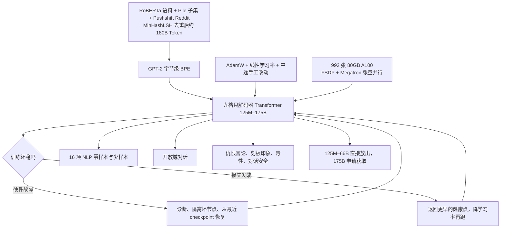

# OPT：公开复现 GPT-3 的训练日志，比再刷一张 175B 分数卡更值钱

<!-- release-date: 2022-05-03 -->

> 本文依据本地 `papers/Meta/OPT.pdf`，即 **OPT: Open Pre-trained Transformer Language Models**，Meta AI，arXiv:2205.01068v4，2022-06-21 提交，共 30 页。页码均指 PDF 自身的页码。文中区分三件事：**报告明确写了什么**、**我们怎么解释它**、**哪些是外部资料或本文推算**。

## 阅读前先认识几个词

这篇报告几乎不发明新架构。它难读的地方不在公式，而在训练现场的工程术语：

- **Token（词元）**：模型读写文本的最小单位。OPT 用 GPT-2 的字节级 BPE 切分（PDF p. 2）。
- **只解码器 Transformer**：从左到右逐个预测下一个 Token 的语言模型，与 GPT-3 同类。
- **零样本 / 单样本 / 少样本**：评测时在输入里放 0 个、1 个、K 个示例，权重不动。OPT 沿用 GPT-3 的提示和实验设置（PDF p. 4）。
- **损失发散（loss divergence）**：训练损失突然炸开、不再下降。
- **动态损失缩放（dynamic loss scaling）**：FP16 混合精度训练里的安全阀。梯度太小会下溢成 0，系统先给损失乘一个缩放系数再反传，并根据是否溢出自动调这个系数；系数掉到 0，说明数值已经不健康（PDF p. 3）。
- **checkpoint（检查点）**：定期存盘的权重。出事后退回某个仍然健康的存盘点重新跑。

报告里反复出现的专有名字：

- **FSDP（Fully Sharded Data Parallel，完全分片数据并行）**：把参数、梯度和优化器状态切到所有机器上，每张卡只存自己那一份。
- **Megatron-LM 张量并行**：把一层里的大矩阵再切开，让同一层的计算摊到多张 GPU 上。
- **metaseq**：训练 OPT-175B 的代码库，报告把它称作许多实现细节的「最终真源」（PDF p. 9）。
- **logbook（训练日志）**：训练 175B 期间的逐日记录，与代码一起公开（PDF p. 9）。

## 一句话先说清

2022 年春，100B 以上的语言模型已经能做零样本和少样本，但完整权重只在少数付得起账单的实验室手里；能通过付费 API 用到的，也拿不到权重，没法研究它为什么会偏见、为什么会有毒（PDF p. 1）。

OPT 的回答不是新架构，而是三件更朴素的事：

1. 按 GPT-3 的规格与超参，大体复现一套 125M 到 175B 的只解码器模型，125M–66B 直接放出，175B 按申请提供给研究者（PDF p. 1–2）；
2. 用 992 张 80GB A100 训 175B，每卡最高 147 TFLOP/s，碳足迹约为 GPT-3 的七分之一（PDF p. 1、p. 3、p. 9）；
3. 把训练里的硬件故障、损失发散、中途改学习率和回退点写进报告与日志，一起公开（PDF p. 3、p. 9）。

分数卡上，OPT-175B 零样本平均大体贴着 GPT-3，单样本和少样本略落后，分任务差异很大（PDF p. 4）；偏见与毒性指标上，它比 GPT-3 Davinci 更刻板、更容易续写出有毒内容（PDF p. 6–7）。

如果只记一句话：

> **闭源旗舰最稀缺的不是架构图纸，而是「把它训到 175B 而不中途死掉」的过程记录。OPT 把这份记录和权重一起交了出来，分数卡只是为了证明「拿到的确实是那个量级的东西」。**

## 先看全景：一套对齐 GPT-3 的模型，加一本训练事故簿

按 PDF p. 1–9 的叙事重画，是流程示意，不是论文原图。

30 页原件的分量分布：

| 部分 | 页码 | 讲什么 |
|---|---|---|
| 1 引言 | p. 1–2 | 为什么要开放，发布口径 |
| 2 方法 | p. 2–3 | 规格表、训练设置、语料、训练效率、训练过程中的调整 |
| 3 评测 | p. 4–6 | 16 项 NLP 任务、对话 |
| 4 偏见与毒性 | p. 5–8 | 仇恨言论、CrowS-Pairs、StereoSet、RealToxicityPrompts、对话安全 |
| 5 限制 | p. 8 | 作者的定性观察 |
| 6 发布考量 | p. 9–10 | 为什么公开日志、碳足迹、许可证 |
| 7–8 相关工作与结论 | p. 10 | — |
| 参考文献 | p. 11–16 | — |
| 附录 A | p. 17–18 | 16 项任务逐项曲线 |
| 附录 B | p. 19 | 贡献分工 |
| 附录 C 数据卡 | p. 19–23 | 语料组成、采集、分发 |
| 附录 D 模型卡 | p. 23–25 | 发布日期、许可证、用途 |
| 附录 E | p. 26–30 | 故意同时展示成功与失败的生成样例 |

## 主要矛盾：谁被允许研究 175B

报告开场就指出一个封闭的循环（PDF p. 1）：训一个这种规模的模型要几十万个计算日，没有显著资本复现不了；少数能通过 API 用到的，不给完整权重；于是稳健性、偏见、毒性这些已知问题，只能由付得起训练账单的实验室自己研究。

脚注 2 列了当时的例外：EleutherAI 放出了最大 20B 的稠密模型，Salesforce 也有开放模型，Meta 自己此前放过最大 13B 的稠密模型和 1.1T 的稀疏模型，BigScience 在做多语言大模型（PDF p. 1）。没有一个把「GPT-3 那个量级、能拿来对照的稠密模型」交到研究社区手里。

于是矛盾变成：

> 社区要研究 175B 的偏见和毒性，却拿不到 175B 的权重；能训 175B 的实验室，又很少把训练过程中那些没法做消融的中途改动写下来。

OPT 的每个设计选择都服务于切开这个循环。架构和超参「大体跟随」GPT-3，报告给的理由是透明，以及**降低训练不稳定的风险**（PDF p. 2）；语料全部来自公开数据集；日志与代码一起公开，因为许多实现细节「要么被当作行规不写，要么作者自己也没意识到漏了」（PDF p. 9）。

报告自己对目标的表述是「大致匹配 GPT-3 这一类模型的性能与规格，同时用上数据收集与高效训练的最新做法」（PDF p. 1）。与 GPT-3 一篇对照读时要记住：GPT-3 证明的是「少样本可以替代微调」，OPT 要证明的是「这个量级的模型可以被社区拿到手里复盘」，两篇解决的不是同一件事。

## 核心设计一：规格表是对照的横轴，不是新架构

| 模型 | 层数 | 头数 | $d_{model}$ | 峰值学习率 | 全局 batch（Token） |
|---|---:|---:|---:|---:|---:|
| 125M | 12 | 12 | 768 | $6.0 \times 10^{-4}$ | 0.5M |
| 350M | 24 | 16 | 1024 | $3.0 \times 10^{-4}$ | 0.5M |
| 1.3B | 24 | 32 | 2048 | $2.0 \times 10^{-4}$ | 1M |
| 2.7B | 32 | 32 | 2560 | $1.6 \times 10^{-4}$ | 1M |
| 6.7B | 32 | 32 | 4096 | $1.2 \times 10^{-4}$ | 2M |
| 13B | 40 | 40 | 5120 | $1.0 \times 10^{-4}$ | 4M |
| 30B | 48 | 56 | 7168 | $1.0 \times 10^{-4}$ | 4M |
| 66B | 64 | 72 | 9216 | $0.8 \times 10^{-4}$ | 2M |
| 175B | 96 | 96 | 12288 | $1.2 \times 10^{-4}$ | 2M |

表出自 PDF p. 2，表 1。正文写的是「八个 Transformer 语言模型」（PDF p. 2），表里却是九行；报告没有解释，这是本文的观察。

训练设置（PDF p. 2）：

- **初始化**照 Megatron-LM 代码库里的设定：权重服从均值 0、标准差 0.006 的正态分布；输出层的标准差再乘 $1.0/\sqrt{2L}$，$L$ 是总层数；偏置全部初始化为 0。
- 全部模型用 **ReLU** 激活，序列长度 2048。
- **AdamW**，$(\beta_1, \beta_2) = (0.9, 0.95)$，权重衰减 0.1。
- **线性学习率**：175B 在前 2000 步从 0 预热到峰值，小模型在前 375M Token 预热；之后在 300B Token 内衰减到峰值的 10%。另有一批中途改动，见训练过程一节。
- batch 从 0.5M 到 4M Token 不等，**整个训练过程保持不变**。
- dropout 全程 0.1，嵌入层不做 dropout。
- 梯度裁剪 1.0，中途改动里曾降到 0.3。
- 梯度**预除因子**：把「除以世界规模 $N$」拆成两次「除以 $\sqrt{N}$」，降低在所有 rank 上归约梯度时溢出或下溢的风险。

以 175B 为例把输出层缩放算一遍：$L = 96$，$\sqrt{2 \times 96} \approx 13.9$，输出层标准差约为 $0.006 / 13.9 \approx 4.3 \times 10^{-4}$。这个缩放的作用是防止残差一路累加把激活放大；报告只说照 Megatron 走，没有推导（算术为本文所做）。

### 跟 GPT-3 比，哪些对齐了，哪些改了

下表是本文按两份原件并排排出的，不是 OPT 报告里的表。GPT-3 一栏的依据是 GPT-3 一篇依据的原件（arXiv:2005.14165v4）。

| 项目 | GPT-3 | OPT | 说明 |
|---|---|---|---|
| 175B 的层 / 头 / 宽度 | 96 / 96 / 12288 | 96 / 96 / 12288 | 对齐 |
| 规格档 | 八档，含 760M | 九行，去掉 760M，加 30B、66B | OPT 正文仍写「八个」 |
| 上下文长度 | 2048 | 2048 | 对齐 |
| 注意力 | 层间交替稠密与局部带状稀疏 | 报告没有提稀疏注意力 | OPT 按字面是标准稠密解码器 |
| 激活函数 | 论文只说沿用 GPT-2 架构 | ReLU | OPT 没解释这个选择 |
| 优化器 | Adam，$\beta = (0.9, 0.95)$，衰减 0.1 | AdamW，同样的 $\beta$ 与衰减 | — |
| 学习率曲线 | 余弦衰减，260B Token 时到 10% | 线性衰减，300B Token 时到 10% | — |
| 175B 峰值学习率 | $0.6 \times 10^{-4}$ | $1.2 \times 10^{-4}$ | 高一倍 |
| 175B 的 batch | 3.2M，前期线性爬升 | 2M，全程恒定 | OPT 称改 batch 主要为计算效率（PDF p. 2） |
| 13B 的宽度与 batch | $d_{model}$ 5140，batch 2M | $d_{model}$ 5120，batch 4M | GPT-3 那一处与 $40 \times 128 = 5120$ 不符 |
| 1.3B 的头数 | 24 头，每头 128 维 | 32 头，每头 64 维 | 报告没讨论 |
| 梯度裁剪 | 1.0 | 1.0，中途降到 0.3 | 稳定性补丁 |
| dropout | 论文没写 | 0.1，嵌入不用 | — |
| 语料池与训练量 | 约 499B 的池子，训 300B | 约 180B 的池子，学习率按 300B 衰减 | 数据重复程度完全不同 |
| 硬件 | V100 | 992 张 80GB A100 | — |

最后一行值得先钉住。OPT 的语料只有约 180B Token（PDF p. 2），学习率却按 300B 规划；按图 1 的约 143k 步乘 2M Token 的 batch 估算，实际走了约 286B Token，也就是把语料读了约 1.6 遍（本文推算，报告没有给实际训练 Token 总数）。GPT-3 的池子约 499B，只训 300B，一遍都没读完。两边都能写「训 300B Token」，数据重复程度却差得很远。

### 这一节可以带走什么

复现闭源模型时，先写一张「故意对齐 / 故意改动 / 没讨论」的表。OPT 在层数、宽度、头数、上下文长度上对齐，才让「平均成绩贴着 GPT-3」这句话有意义；而激活函数、学习率、batch、语料量的改动都没有消融，后面任何分数差异都无法归因到其中一项。

## 核心设计二：语料全部来自公开数据集，但配比没有公开

语料是三块公开数据的拼接（PDF p. 2）：RoBERTa 用过的语料、The Pile 的一个子集、Pushshift.io Reddit。它们原本都已被筛成以英文为主，但 CommonCrawl 里仍有少量非英文。去重用文档级 MinHashLSH，Jaccard 相似度 $\geq 0.95$ 的删掉；报告专门提醒，Pile 里重复文档特别多，建议后来者再做一遍去重。全部用 GPT-2 字节级 BPE 切分，最终约 **180B Token**（PDF p. 2），数据卡写的是对应 800 GB（PDF p. 20）。

三块各装了什么：

- **RoBERTa 这一支**：BookCorpus 和 Stories，以及更新到 2021 年 9 月 28 日的 CCNews v2，预处理方式与 RoBERTa 原来的 CCNews 相同（PDF p. 2）。数据卡另写 CC-News 的英文新闻爬取区间是 2016 年 9 月到 2021 年 9 月（PDF p. 21）。
- **The Pile 这一支**：留下 CommonCrawl、DM Mathematics、Project Gutenberg、HackerNews、OpenSubtitles、OpenWebText2、USPTO 和 Wikipedia。其余子集被剔除，判据是**在 1.3B 规模上容易引发梯度范数尖峰**，或「因其他原因被认为不合适」；留下的子集都额外做了临时的空白字符规范化（PDF p. 2–3）。
- **Reddit 这一支**：来自 Baumgartner 等人整理、此前 BlenderBot 也用过的 Pushshift 语料。对话是树，语言模型要的是文档，于是在每个帖子里只取**最长的一条评论链**，其余路径丢掉，语料量减少约 66%（PDF p. 3）。

两条可以直接搬走的经验：

- **用小模型当数据的金丝雀。** 175B 上试一份会引发尖峰的数据，代价可能是一次发散加一次回退；1.3B 上的梯度尖峰便宜得多。被剔除的 Pile 子集完整名单报告没有列出。
- **对话树怎么压成文档，是一个会进入模型性格的决定。** 最长的评论链保留的是一个帖子里来回最多的那串争论。后面 CrowS-Pairs 与毒性指标变差，报告自己把原因指回 Reddit 这一支（PDF p. 6–7）；这是作者的推测，没有各来源精确占比来做因果证明。

报告**没有**给出各来源的采样权重，只说是拼接（concatenation）（PDF p. 2）。数据卡写验证集是「按各数据集在预训练语料中的体量比例，随机留出约 200MB」（PDF p. 20）。GPT-3 给过一张按质量加权的采样表，OPT 没有，这是报告没公开的实现细节。

数据卡还写明两件事：CommonCrawl 与 Reddit 的子集「如果直接阅读，可能冒犯、侮辱、威胁或引起焦虑」（PDF p. 21）；**数据集目前不向第三方分发**（PDF p. 23）。成分都是公开数据，拼接、去重后的那一份 800 GB 却不公开，想严格复现数据只能按名单自己再走一遍流水线。

## 核心设计三：训练效率与碳足迹

硬件与并行写在 2.4 节（PDF p. 3）：992 张 80GB A100；FSDP 配合 Megatron-LM 张量并行；每卡最高 **147 TFLOP/s**；Adam 状态用 FP32，因为已经切到所有主机上，权重保持 FP16；用动态损失缩放避免下溢。

发布考量一节补了一句很硬的话：当时这是已知唯一一个能在 NVIDIA GPU 上、**不用流水线并行**、训练 $\geq$ 175B 只解码器 Transformer 的开源实现（PDF p. 9）。报告没有给张量并行度、FSDP 分组大小这些切分细节，这些要去 metaseq 里看。

碳足迹（PDF p. 9）：

| 模型 | 估算碳排放（CO2eq） | 来源 |
|---|---:|---|
| OPT-175B | 75 吨 | 本报告 |
| GPT-3 | 500 吨 | 引 Patterson 等人 2021 |
| Gopher | 380 吨 | 引 Rae 等人 2021 |

$75 / 500 = 0.15$，约七分之一，与摘要一致。但脚注 10 立刻把这个数拆开：**算上消融、基线和停机时间，他们自己估计总成本大约再乘 2**（PDF p. 9）。也就是说，75 吨是「最终那一次 175B 跑完」的账；乘 2 之后约 150 吨，仍低于 500 吨，但已经不是七分之一。

报告也写了这些数字的局限：各家的估算并不都公开，会计口径不统一；训练只是 AI 系统碳足迹的一部分，实验和日后的推理都没算；硬件制造的隐含碳也需要理解。公开 logbook 的一个目的，就是让人看见「假设没有硬件故障、没有训练不稳定」的理论值，与「把整个开发周期算进去」的真实值之间的缝（PDF p. 9）。

### 这一节可以带走什么

报成本时写两行：最终一次训练，和含停机、消融、重跑的全周期。只报第一行，报的是一个没有故障的理论世界。

## 核心设计四：训练过程本身，就是这篇报告的主贡献

2.5 节只有一页，是全文信息密度最高的一页（PDF p. 3）。它记录的不是「我们用了 AdamW」，而是「175B 在哪些地方会出事，我们当时怎么救」。

### 硬件故障：两个月，至少 35 次手工重启

训练 OPT-175B 的集群硬件故障很多：两个月里至少 35 次手工重启，轮换掉超过 100 台主机（PDF p. 3）。手工重启的流程是：暂停训练，跑一组诊断找出有问题的节点，把被标记的节点隔离（cordon off），从最近保存的 checkpoint 恢复。由于被轮换的主机数明显多于手工重启次数，他们估计还有 **70 次以上**由硬件故障触发的自动重启（PDF p. 3）。

量级感（本文推算）：约 60 天里 35 次手工加 70 次以上自动，大约 100 次中断，平均每天都不止一次。报告没有给墙钟时间与有效训练时间的比例。

### 损失发散：看两个指标选回退点

散了之后，他们发现有效的办法是**降低学习率，并从更早的 checkpoint 重启**（PDF p. 3）。他们注意到三件事常常一起出现：损失发散；动态损失缩放系数跌到 0；最后一层激活的 $L^2$ 范数突然飙升。于是回退点不是「最近一次存盘」，而要同时满足（PDF p. 3）：

- 动态损失缩放系数仍处于「健康」状态，即 $\geq 1.0$；
- 从这一点继续，激活范数会往下走，而不是无界增长。

早期他们还发现把梯度裁剪从 1.0 降到 0.3 有助于稳定，具体细节在日志里（PDF p. 3）。

图 1 是实际走出来的学习率，不是开训前写在配置里的那条直线（PDF p. 3）。计划是一条从 $1.2 \times 10^{-4}$ 线性降到峰值 10% 的直线；实际曲线在约 37k 步之后被连续砍了四刀，约 61k 步还被调高过一次，终点约 $0.06 \times 10^{-4}$，低于计划的 $0.12 \times 10^{-4}$（读图）。图注只说「降低学习率有助于避开不稳定」。图 2 的图注说：中途的学习率改动对验证困惑度有清楚的影响（PDF p. 3）。

图上读得出、报告没写成文字的一点：约 61k 步学习率上调之后，验证困惑度随即短暂回升，大约三四千步后才恢复下降（读图）。这说明中途改动的效果是可见的，但报告没有做对照实验，**「降学习率有助于稳定」有图上的相关性，没有因果证明**。

### 其他中途试验

同一节还记了三次「飞行中改动」（PDF p. 3）：

1. **切到普通 SGD**：优化很快进入平台期，又切回 AdamW；
2. **重置动态损失缩放系数**：救回了一部分发散，不是全部；
3. **换新版 Megatron**：减轻了激活范数的压力，还提高了吞吐。

这些改动有一个共同的方法学困境，报告在发布考量一节自己写了：中途改动没法做干净的消融，除非把算力预算大幅加倍，所以以往的大模型论文干脆不提；OPT 选择把「当时为什么这么改」写下来（PDF p. 9）。

### 这一节可以带走什么

可以直接搬走的不是 $1.2 \times 10^{-4}$ 这个数，而是**重启判据的写法**：把「健康」定义成可观测的量（损失缩放系数、末层激活范数），而不是「loss 看起来还行」。自己的训练监控里至少要有这两条时间序列，出事后才有可执行的回退，而不是在最近十个 checkpoint 里碰运气。

## 评测：零样本贴着 GPT-3，单样本和少样本略落后

### 协议先对齐

16 项标准 NLP 任务：HellaSwag、StoryCloze、PIQA、ARC Easy 与 Challenge、OpenBookQA、WinoGrad、WinoGrande，以及 SuperGLUE（PDF p. 4）。提示与整体设置沿用 GPT-3，主要对照 GPT-3 论文报告的数字。统一报准确率，MultiRC 与 ReCoRD 的 F1 不报；SuperGLUE 里的 WSC 按 GPT-3 的做法改成选择题，报告提醒这种形式本身会影响分数（PDF p. 4）。

平均曲线里**故意去掉了 MultiRC 与 WIC**，因为这两项似乎系统性地偏向 GPT-3 或 OPT 其中一方，所以是 14 项平均（PDF p. 4）。

### 平均分：读自图 3 与图 4

| 设定 | 系列 | 125M | 2.7B | 30B | 175B |
|---|---|---:|---:|---:|---:|
| 零样本 | OPT | 49.5 | 60.4 | 66.7 | 69.0 |
| | GPT-3 | 48.5 | 62.3 | — | 71.2 |
| 单样本 | OPT | 50.0 | 62.9 | 68.9 | 71.8 |
| | GPT-3 | 52.3 | 65.6 | — | 74.8 |
| 32 样本 | OPT | 50.6 | 64.9 | 71.2 | 77.2 |
| | GPT-3 | 51.0 | 67.8 | — | 78.0 |

数值读自 PDF p. 4 图 3、图 4，误差约 ±0.5；GPT-3 没有 30B 这一档。图 4 里 OPT 的 32 样本在 13B 处没有数据点，所以表中不列 13B。

读这张表的三件事：

- **175B 处，零样本落后约 2 分，单样本约 3 分，32 样本不到 1 分。** 落后主要出现在单样本和中等规模，不是「示例越多差距越大」。OPT-175B 从零样本到 32 样本涨了约 8 分，GPT-3 约 7 分（读图）。
- **平均曲线掩盖了分任务的巨大差异。** 零样本下，报告说 10 项与 GPT-3 大致相当，3 项落后（只点名了 ARC Challenge 和 MultiRC），3 项（CB、BoolQ、WSC）两边都随规模无规律波动，很可能因为验证集太小，分别只有 56、277、104 条（PDF p. 4）。加上单列的 WIC，这组计数凑不齐 16，报告没有解释。
- **协议本身已经对不齐。** MultiRC 上，他们用 Davinci API 在自己的评测栈里复现不出 GPT-3 论文的数字，推测评测方法有差异（PDF p. 4）；单样本和少样本上，他们也推测自己的设置可能与 GPT-3 有显著不同（PDF p. 5）。WIC 上 OPT 在所有规模都高于 GPT-3，但 GPT-3 论文报的 WIC 准确率是 0%，二分类里这意味着把分类倒过来就是 100%，报告因此认为那个数字可疑（PDF p. 4 脚注 5）。这一点可以在 GPT-3 原件里核对：表 H.1 的 WiC 零样本在八个规格上全是 0.00（见 GPT-3 一篇）。

附录 A 的图 6、图 7 把 16 项逐一拆开（PDF p. 17–18）。零样本图上看得出：HellaSwag、StoryCloze、PIQA、ReCoRD 两边走得很近；ARC Challenge 在大规模上 OPT 明显低于 GPT-3；MultiRC 上 GPT-3 一直高出一截；WIC 上 GPT-3 是一条贴着 0 的线，OPT 在 50 附近；CB、WSC、BoolQ 两边都在噪声里抖动（读图）。同一张图还画了 PaLM、Chinchilla、Gopher 等模型。报告说 Chinchilla 和 Gopher 与同尺寸的其他模型大体一致，PaLM 在所有设置下普遍更高，即使控制了参数量；**他们推测 PaLM 的优势主要来自更高质量、更多样的预训练数据**（PDF p. 4）。这是作者推测，没有数据消融。

### 对话：无监督的 175B，接近有监督的 BlenderBot 1

对话评测照 BlenderBot 那套走：ConvAI2、Wizard of Wikipedia、Empathetic Dialogues、Blended Skill Talk，外加更新的 Wizard of Internet（PDF p. 5）。对照是无监督的 Reddit 2.7B，以及有监督的 BlenderBot 1 和 R2C2 BlenderBot。困惑度全部归一到 GPT-2 分词器的空间；OPT-175B 用贪心解码，最多 32 个 Token，除了交替的 `Person 1:` 与 `Person 2:` 之外不加任何提示（PDF p. 5）。

| 模型 | 监督 | C2 困惑度 | WW | ED | BST | WoI | C2 UF1 | WW | ED | BST | WoI |
|---|---|---:|---:|---:|---:|---:|---:|---:|---:|---:|---:|
| Reddit 2.7B | 无 | 18.9 | 21.0 | 11.6 | 17.4 | 18.0 | .126 | .133 | .135 | .133 | .124 |
| BlenderBot 1 | 有 | 10.2 | 12.5 | 9.0 | 11.9 | 14.7 | .183 | .189 | .192 | .178 | .154 |
| R2C2 BlenderBot | 有 | 10.5 | 12.4 | 9.1 | 11.7 | 14.6 | .205 | .198 | .197 | .186 | .160 |
| OPT-175B | 无 | 10.8 | 13.3 | 10.3 | 12.1 | 12.0 | .185 | .152 | .149 | .162 | .147 |

表出自 PDF p. 6，表 2。困惑度越低越好，UF1（Unigram F1）越高越好。OPT-175B 在所有任务上显著好于同样无监督的 Reddit 2.7B，在 ConvAI2 上与有监督的 BlenderBot 1 相当；在对所有模型都无监督的 Wizard of Internet 上困惑度最低，但 UF1 仍低于带 Wizard of Wikipedia 监督的模型（PDF p. 5）。

ConvAI2 上的表现好得让作者自己起疑，于是做了三件检查（PDF p. 5）：在预训练语料里搜 ConvAI2 的第一段对话，没找到重叠；在从未公开的 ConvAI2 隐藏测试集上测，得到 10.7 困惑度、.185 UF1，与验证集一致；在 ConvAI2 风格的 MultiSessionChat 子集上得到 9.7 困惑度、.177 UF1。MSC 与 WoI 都发布在所用 CommonCrawl 快照之后，泄漏风险小。报告据此认为 OPT-175B 能在对话里保持一致的人设。

## 偏见与毒性：数字比这一节的标题更直白

这一节的对照换成了 GPT-3 Davinci API，因为这些基准在 GPT-3 论文发表时还不存在（PDF p. 5）。报告开场承认这些基准有缺陷，但把它们当作理解危害的第一步。

### 仇恨言论检测：OPT 更高，原因未必光彩

用 ETHOS 数据，问模型一段英文是否带种族或性别歧视；少样本多分类时还多一个「都不是」选项（PDF p. 5–6）。

| 设定 | Davinci | OPT-175B |
|---|---:|---:|
| 零样本 | .628 | .667 |
| 单样本 | .616 | .713 |
| 少样本（二分类） | .354 | .759 |
| 少样本（多分类） | .672 | .812 |

表出自 PDF p. 6，表 3，数值是 F1。报告给了两个推测（PDF p. 6）：通过 Davinci API 评测，可能带上了原始 175B GPT-3 之外的安全控制机制；预训练数据里大量未审核的社交媒体讨论，给这类分类任务提供了额外的归纳偏置。两条都不是「我们的对齐更好」。

### CrowS-Pairs：除了宗教，几乎全部更刻板

| 类别 | GPT-3 | OPT-175B |
|---|---:|---:|
| 性别 | 62.6 | 65.7 |
| 宗教 | 73.3 | 68.6 |
| 种族 / 肤色 | 64.7 | 68.6 |
| 性取向 | 76.2 | 78.6 |
| 年龄 | 64.4 | 67.8 |
| 国籍 | 61.6 | 62.9 |
| 残疾 | 76.7 | 76.7 |
| 外貌 | 74.6 | 76.2 |
| 社会经济地位 | 73.8 | 76.2 |
| 总体 | 67.2 | 69.5 |

表出自 PDF p. 6，表 4，分数越低越公平。OPT 只在宗教上更好，残疾持平，其余更差。报告把原因指向训练数据：Nangia 等人 2020 年已发现 Pushshift Reddit 的刻板与歧视文本比例高于 Wikipedia 等语料，而它是 OPT 的主要来源之一（PDF p. 6）。

### StereoSet：总体接近，但接近的是合成分

| 类别 | 指标 | Davinci | OPT-175B |
|---|---|---:|---:|
| 职业 | LMS / SS / ICAT | 78.4 / 63.4 / 57.5 | 74.1 / 62.6 / 55.4 |
| 性别 | LMS / SS / ICAT | 75.6 / 66.5 / 50.6 | 74.0 / 63.6 / 53.8 |
| 宗教 | LMS / SS / ICAT | 80.8 / 59.0 / 66.3 | 84.0 / 59.0 / 68.9 |
| 种族 | LMS / SS / ICAT | 77.0 / 57.4 / 65.7 | 74.9 / 56.8 / 64.8 |
| 总体 | LMS / SS / ICAT | 77.6 / 60.8 / 60.8 | 74.8 / 59.9 / 60.0 |

表出自 PDF p. 7，表 5。LMS 是语言建模分（越高越好），SS 是刻板印象分（越低越好），ICAT 把两者合成（越高越好）。他们按 Token 数而不是字符数归一化，与 Jurassic-1 的报告不同（PDF p. 7）。报告的结论是两者总体相近：Davinci 在职业和种族上更好，OPT 在性别和宗教上更好；OPT 的 SS 全面更低，Davinci 的 LMS 普遍更高。「总体相近」说的是合成分，不是「两边偏见一样」。

### RealToxicityPrompts：三条线里 OPT 最高

照 PaLM 的设置：随机取 10,000 条提示，每条用核采样（$p = 0.9$）生成 25 段、每段 20 个 Token，按提示本身的毒性分桶，报续写的平均毒性概率（PDF p. 7）。

| 提示毒性分桶中心 | 0.05 | 0.15 | 0.25 | 0.35 | 0.45 | 0.55 | 0.65 | 0.75 | 0.85 | 0.95 |
|---|---:|---:|---:|---:|---:|---:|---:|---:|---:|---:|
| OPT-175B | 0.16 | 0.20 | 0.22 | 0.25 | 0.25 | 0.28 | 0.29 | 0.32 | 0.35 | 0.37 |
| Davinci | 0.14 | 0.18 | 0.20 | 0.21 | 0.23 | 0.24 | 0.25 | 0.27 | 0.28 | 0.31 |
| PaLM | 0.12 | 0.16 | 0.18 | 0.18 | 0.20 | 0.20 | 0.22 | 0.23 | 0.25 | 0.28 |

数值读自 PDF p. 7 图 5（数据点落在 0.01 的网格上）。OPT-175B 在每个分桶都最高；三个模型的续写毒性都随提示毒性上升，与 PaLM 报告的观察一致。报告再次把原因指回未审核的社交媒体文本：熟悉毒性语言，既提高检测也提高生成；这种强熟悉度好不好取决于下游任务，将来使用 OPT-175B 应考虑额外缓解，或在不合适的场景里干脆不用（PDF p. 7）。

仇恨言论检测更强、刻板印象更重、毒性续写更多，三件事可以同时为真，而且报告给它们的解释是同一份数据。

### 对话安全：和无监督的 Reddit 2.7B 一档

| 模型 | 困惑度 | F1 | Safe | Realistic | Unsafe | Adversarial |
|---|---:|---:|---:|---:|---:|---:|
| Reddit 2.7B | 16.2 | .140 | .300 | .261 | .450 | .439 |
| BlenderBot 1 | 12.4 | .161 | .028 | .150 | .250 | .194 |
| R2C2 BlenderBot | 13.8 | .160 | .022 | .133 | .289 | .222 |
| OPT-175B | 14.7 | .141 | .033 | .261 | .567 | .283 |

表出自 PDF p. 8，表 6。前两列是 SaferDialogues（衡量说错之后能否道歉或承认错误），后四列是 Safety Bench Unit Tests 按话题敏感度四档衡量回复有多不安全，越低越好（PDF p. 7）。OPT-175B 与 Reddit 2.7B 大体一档，Safe 与 Adversarial 略好，**Unsafe 一档明显更差**（.567）。报告的结论是：在精选对话数据上微调过的模型（BlenderBot 1、R2C2）毒性整体更低，将来若要把 OPT-175B 用于对话，应先做这种微调（PDF p. 8）。

### 不要把这一节读成「开源的原罪」

限制一节写得很清楚：首要目标是复现 GPT-3，所以这一版**选择不上**已有的毒性与偏见缓解方法（PDF p. 8）。这些数字反映的是「按 GPT-3 的目标、用带 Reddit 的公开数据、不做缓解」的模型，不是「开源」本身的代价。

## 限制：报告自己划的边界

第 5 节先说，标准评测上与 GPT-3 大体持平、安全与偏见评测大体可比，但这些评测未必能刻画全部局限；定性地看，OPT-175B 有其他大模型已被记录的那些毛病（PDF p. 8）：

- **不会执行指令**：给陈述句指令或直截了当的问句，模型倾向于模拟一段以这句指令开头的对话，而不是去执行。报告指向 InstructGPT 那类指令学习作为未来工作。
- **容易重复、卡进循环**：采样能降低发生率，但只采一条生成时，他们凭印象发现重复没有被完全消除；建议考虑 unlikelihood training 或 best-first decoding。
- **会说出事实错误**：在医疗、科学发现等看重准确性的场景尤其有害；他们相信检索增强会有帮助。
- **有毒、刻板，温和的提示也会触发，对抗提示很好找**：缓解方法文献一长串，这一版不用。

最后一段对当时的数据与评测实践各提了一条：现行做法是把能喂的数据尽量喂进去、几乎不做选择；评测本应更流水线、更一致，提示风格和示例数都会造成不可复现的差异（PDF p. 8）。报告的总判断是，这项技术**用于商业部署仍不成熟**（PDF p. 8）。

这些是作者观察加文献引用，不是新实验。

## 发布策略：分层开放，许可证非商用

发布口径写在引言与模型卡里（PDF p. 1、p. 24）：

- 125M 到 66B 直接放出；OPT-175B 按申请提供完整研究权限；
- 对象是学术研究者，政府、公民社会和学术机构的人员，以及工业界研究实验室；
- 许可证是非商用许可，指向 metaseq 里的 `MODEL_LICENSE.md`；
- 模型卡写明 OPT-175B 于 2022 年 5 月 3 日发布，版本 1.0.0，开发者 Meta AI；预期用途是语言模型研究，尤其是 Responsible AI 研究；**不用于生产或真实世界部署**（PDF p. 24）。

第 6 节把分层的理由讲成两件事：先让研究社区量化大模型的局限，再谈更广泛的商业部署；同时避免人人重训一个 175B，把碳成本再乘一遍（PDF p. 9）。日志的定位更彻底：它披露的不只是当前这版用了多少算力，还有基础设施或训练过程在这个规模上失稳时的**人力开销**（PDF p. 9）。附录 B 的分工对得上这一点：「训练与监控 OPT-175B」是一份十人名单，125M–66B 基线另有三人（PDF p. 19）。

发布考量一节还引了 Chinchilla 的结论：许多大模型按训练数据量看可能训练不足，继续加数据、继续训练这些基线可能还会提升；也有证据表明能力的阶跃可能出现在远小于 175B 的规模上，所以需要一整套尺度来研究（PDF p. 9）。

### 这一节可以带走什么

开放不是一个开关。OPT 把「小模型直接放、大模型申请、非商用许可、日志全放、代码全放、数据不外发」拆成了六件事，每件都写了理由。自己做发布时，也可以按风险分层，但要把每一层的理由写成可检查的句子。

## 附录 E：故意同时展示成功与失败

作者写明这些样例是**有意挑来同时展示成功和失败**的，提示用粗体，其余是续写（PDF p. 26）：

- **图 8 诗歌**：能就绩效评估这类题目写出有趣的诗，但很难让模型遵守韵脚和节奏（PDF p. 26）。
- **图 9 对话**：扮成自由女神像时进入爱国人设（「1886 年起就在这里」「为欢迎移民而建」），聊下去就退化成简单重复的回答（喜欢冰淇淋和苹果、红白蓝、狗）（PDF p. 26），正是限制一节「卡进循环」的样子。
- **图 10 翻译**：OPT 没有刻意按多语言训练，作者凭印象觉得它在德语、西班牙语、法语、中文的简单翻译上有有限的成功（PDF p. 27）。
- **图 11 写论文**：以「1. Introduction」开头通常比以「Abstract」开头写得更有意思，提示灵感来自 ResNet 论文的第一句（PDF p. 28）。
- **图 12 算术**：给出两道加法示例后，模型续写的 12 + 9 = 21、5 + 9 = 14、4 + 6 = 10 都对；换成减法，把 12 − 9 写成 −3，接着又自己改回问加法；乘法把 12 × 9 写成 102；除法把 12 / 3 写成 9。图注：从加法扩展到其他运算就会出错（PDF p. 29）。
- **图 13 Python**：只换一个变量名，生成结果就会变（PDF p. 30）。

## 实验支持、作者观察、没有公开的，分开写

**有实验或测量支撑的：**

- 九档规格训完，175B 在 992 张 80GB A100 上每卡最高 147 TFLOP/s（PDF p. 1、p. 3）；
- 14 项零样本平均随规模大体贴着 GPT-3，175B 处落后约 2 分（图 3，读图）；
- 无监督对话在 ConvAI2 上与有监督的 BlenderBot 1 相当，隐藏测试集与 MSC 上结果一致（PDF p. 5–6）；
- 仇恨言论检测 F1 高于 Davinci，CrowS-Pairs 总体更差，RealToxicityPrompts 每个分桶都更高，对话 Unsafe 一档更差（PDF p. 6–8）。

**只是作者观察或推测的：**

- PaLM 更强主要因为数据质量与多样性（PDF p. 4）；
- 仇恨言论检测的优势来自 Davinci API 的额外安全机制与 Reddit 数据（PDF p. 6）；
- 刻板与毒性更高来自未审核的社交媒体文本（PDF p. 6–7）；
- 降学习率有助于避开不稳定：有图 1、图 2 的相关性，没有对照实验（PDF p. 3）；
- 不会执行指令、重复采样去不掉（PDF p. 8）。

**报告没有公开的：**

- 各数据来源的采样权重与精确 Token 占比；被剔除的 Pile 子集完整名单；
- 张量并行度、FSDP 分组、主机拓扑；
- 墙钟时间、有效训练时间、实际训练 Token 总数、自动重启的精确次数（70 次以上是估计）；
- 每次中途改动对应的确切步数，正文只给图，细节在日志里；
- 激活函数、学习率、batch、语料量这些与 GPT-3 不同之处的消融。

## 最值得带回自己项目的六条

### 1. 复现闭源模型，先钉死对照的横轴

层数、宽度、头数、上下文长度对齐，其余改动列成表写明「改了、没消融」。否则任何分数差异都无从归因。

### 2. 用小模型给数据当金丝雀

Pile 子集能不能进 175B，判据是 1.3B 上的梯度范数尖峰（PDF p. 3）。贵的训练，都值得配一个专门用来淘汰数据的便宜模型。

### 3. 预处理决定要当成安全决策记下来

只留最长评论链、砍掉约 66%（PDF p. 3），不是中性的压缩。它和后面的刻板、毒性数字被报告放进了同一条解释链。

### 4. 回退判据写成可观测的量

健康点 = 损失缩放系数 $\geq 1.0$，且此后末层激活范数下降（PDF p. 3）。把这两条曲线放进训练监控。

### 5. 中途改动写下来，即使做不了消融

降学习率、改裁剪、换 Megatron 版本、试 SGD 再退回，没有一项在 175B 上做得了干净消融（PDF p. 3、p. 9）。稳定训练的知识大多存在值班记录里，不在最终的超参表里。

### 6. 成本和安全数字都不要只报好看的那一行

碳足迹报「最终一次」和「全周期约 2 倍」两行；安全指标里检测更强与生成更毒同时报。发布叙事是「让更多人研究危害」，不是「这个模型已经更安全」。

## 关键词回看

- **OPT / OPT-175B**：对齐 GPT-3 规格的开放只解码器模型套件，最大 175B。
- **metaseq**：训练与推理代码库，报告称其为实现细节的最终真源。
- **FSDP + 张量并行**：跨机器切参数与优化器状态，加上层内切矩阵；OPT 声明不用流水线并行。
- **动态损失缩放**：混合精度里给损失乘的系数，跌到 0 是数值不健康的信号。
- **损失发散与回退点**：降学习率，退到损失缩放系数仍 $\geq 1.0$ 且激活范数会下降的 checkpoint。
- **MinHashLSH 去重**：文档级模糊去重，Jaccard $\geq 0.95$。
- **CrowS-Pairs / StereoSet / RealToxicityPrompts / ETHOS**：分别测刻板偏好、刻板印象与语言建模的权衡、毒性续写、仇恨言论检测。
- **非商用许可 + 申请获取**：66B 及以下直接放出，175B 按申请提供给研究者，模型卡排除生产部署。

## 最后的判断

如果只从这篇报告带走一件事，不要带走「OPT-175B 平均成绩接近 GPT-3」。图 3 支持这句话；图 4、表 4、图 5 和表 6 同时支持另一句更重要的话：**对齐规格不等于对齐行为，更不等于对齐危害。**

被测量撑住的核心贡献是工程性的：

- 一套从 125M 到 175B 的开放稠密模型（175B 需申请）（PDF p. 1、p. 24）；
- 992 张 80GB A100 上每卡最高 147 TFLOP/s 的训练实现，以及 75 吨对 500 吨的碳足迹对照，外加「全周期约再乘 2」的自我修正（PDF p. 1、p. 3、p. 9）；
- 两个月里至少 35 次手工重启、100 台以上主机轮换、估计 70 次以上自动重启，以及「缩放系数加末层激活范数」这套回退判据（PDF p. 3）。

它留下的边界同样清楚，而且是自己划的：单样本和少样本略落后，原因没有拆清；评测协议与 GPT-3 已对不齐；不会执行指令；毒性高于 Davinci 与 PaLM；缓解方法这一版故意没上；训练数据不外发，采样权重与并行切分不公开（PDF p. 4–9、p. 23）。

> **它证明了 175B 稠密模型的训练过程可以被写下来、被公开、被后来者当成失败模式来研究；分数卡只是为了说明「你们拿到的确实是那个量级的东西」。**

## 资料与阅读边界

**原始依据**

- 本地 `papers/Meta/OPT.pdf`，即 arXiv:2205.01068v4（2022-06-21 提交），30 页。arXiv 论文页 [arXiv:2205.01068](https://arxiv.org/abs/2205.01068) 的提交历史为 v1（2022-05-02）到 v4（2022-06-21），v4 即最新版，与本地 PDF 一致。全文所有 `(PDF p. N)` 都出自这一版。

**首发日证据**

- 报告模型卡写明「OPT-175B was released on May 3, 2022」（PDF p. 24）。
- Meta 官方博客 [Democratizing access to large-scale language models with OPT-175B](https://ai.meta.com/blog/democratizing-access-to-large-scale-language-models-with-opt-175b/) 日期为 2022-05-03，宣布发布并给出小模型下载与 175B 申请入口。
- 因此 `release-date` 取 **2022-05-03**，即模型首次对外可用日，而不是 arXiv v1 的提交日（2022-05-02）或 v4 的修订日。

**外部补充（不是报告内容）**

- 发布当天的官方博客列出的直接放出规格是 125M 到 30B，并写「66B 即将放出」；本 PDF（v4）的引言写的是已放出 125M–66B。两者是不同时间点的口径。
- 报告指向的代码与日志：[metaseq](https://github.com/facebookresearch/metaseq)、[OPT175B_Logbook.pdf](https://github.com/facebookresearch/metaseq/blob/main/projects/OPT/chronicles/OPT175B_Logbook.pdf)。本文没有把日志里的内容写成报告结论。
- 初始化设定的出处是报告脚注 4 给出的 [Megatron-LM `pretrain_gpt3_175B.sh`](https://github.com/NVIDIA/Megatron-LM/blob/main/examples/pretrain_gpt3_175B.sh)；碳足迹对照引的是 Patterson 等人 2021（[arXiv:2104.10350](https://arxiv.org/abs/2104.10350)）与 Gopher（[arXiv:2112.11446](https://arxiv.org/abs/2112.11446)）。
- 与 GPT-3 的并排对照表、WiC 0.00 的核对，依据的是 GPT-3 一篇的原件 arXiv:2005.14165v4。
- 本文中的输出层标准差、实际训练 Token 约 286B 与约 1.6 遍、约 100 次中断，以及图 1、图 2、图 3、图 4、图 5 的读图数值，都是**本文根据报告数字所做的算术或读图**，报告原文没有这些数字。
