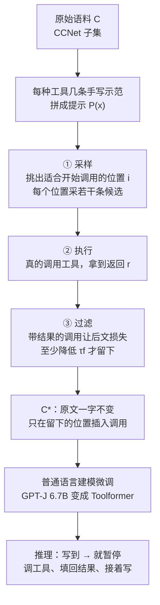

# Toolformer：让语言模型用自己的续写损失，挑出值得插进文本的 API 调用

<!-- release-date: 2023-02-09 -->

> 本文依据 **Toolformer: Language Models Can Teach Themselves to Use Tools** 的 NeurIPS 2023 会议定稿版：正文 PDF 13 页，另有补充材料 PDF 10 页，均取自 [NeurIPS 2023 论文集页面](https://proceedings.neurips.cc/paper_files/paper/2023/hash/d842425e4bf79ba039352da0f658a906-Abstract-Conference.html)。预印本是 arXiv:2302.04761v1（2023-02-09）。文中 `(PDF p. N)` 指正文 PDF 的页码，`(补充材料 p. N)` 指补充材料 PDF 的页码。文中区分三件事：**论文明确写了什么**、**我们怎么解释它**、**哪些是外部资料或本文推算**。

## 读前先把几个词说成人话

这篇几乎不改 Transformer 的结构。它改的是两件事：训练文本里允不允许出现工具调用，以及哪一次调用算「有用」。

- **API 调用（API call）**：一段插在正文里的特殊文本，形如 `[Calculator(400 / 1400) → 0.29]`。模型把它当普通 token 来预测。
- **工具（tool）**：输入和输出都能写成文本的外部程序。本篇用五种：问答系统、维基搜索、计算器、翻译、日历。
- **上下文学习（in-context learning）**：不改参数，只在提示里放几条示范，模型就能照着做。本篇用它给海量原文打候选调用。
- **困惑度（perplexity）与语言建模损失**：模型猜下一个 token 猜得有多难。损失越低，说明前面给的信息越有帮助。本篇的过滤器就是看这个。
- **零样本（zero-shot）评测**：下游题只给一句自然语言指令，不给「这道题该用计算器」的示范。
- **GPT-J**：EleutherAI 开源的 6.7B 自回归模型，本篇的基座。对照是 OPT 66B 和 GPT-3 175B（原始 davinci，参数量约为 GPT-J 的 10 倍和 25 倍，PDF p. 5）。

## 一句话先说清

2023 年初的大模型已经能靠几句提示做很多新任务，却在最基础的事上出错：算不准、查不到新事实、低资源语言弱、不知道今天几号（PDF p. 1）。这些事，计算器、搜索、翻译、日历早就做得很好。

把工具接给模型，当时有两条路，都不够好（PDF p. 1）：

1. **大量人工标注**，教模型何时去搜（例如 LaMDA）。贵；而且人觉得有用的地方，未必是模型觉得有用的地方。
2. **绑定具体任务的少样本提示**（例如 PAL、TALM）。换一道题、换一个工具，就要重写示范。

Toolformer 的回答是：

> 每种工具只手写几条示范，让模型自己在普通语料上到处试着插调用；真的执行这些调用，只留下那些「把结果给模型看，后文就更好猜」的；再用这份插过调用的语料做普通的语言建模微调。模型因此自己学会调哪个工具、何时调、传什么参数、结果怎么接进后文。

落到数字上（PDF p. 6–8）：

- **数学**：ASDiv / SVAMP / MAWPS 从 GPT-J 的 7.5 / 5.2 / 9.9 升到 40.4 / 29.4 / 44.0，超过 GPT-3 175B 的 14.0 / 10.0 / 19.8；97.9% 的题调了计算器。
- **事实补全（LAMA）**：三个子集 33.8 / 11.5 / 53.5，超过 GPT-3；98.1% 的题调了问答系统。
- **开放问答**：超过同尺寸基线，但仍低于 GPT-3。
- **语言建模**：关掉工具后，困惑度与只在同一份语料上微调的 GPT-J 相同。

你能拿走的，是一个监督信号的改写：**「这里该不该调工具」不必由人逐条标，模型自己的下一步预测损失就是过滤器。** 你拿不走的是链式调用、交互式搜索和多轮对话——论文明说方法本身做不到（PDF p. 9）。

### 一条阅读路线

1. **p. 2 的 Figure 1、Figure 2**：调用嵌在续写里，三步流水线。
2. **p. 3 的采样与过滤公式**：方法的全部引擎。
3. **p. 5 的 Table 2**：过滤阈值怎么决定每种工具剩多少条。
4. **p. 6–8 的 Table 3–5 与 Figure 4**：数学和 LAMA 是赢 GPT-3 的主场；开放问答与多语言没赢；约 775M 以下学不会。
5. **p. 9 的第 6 节**：五条限制。
6. **补充材料 p. 5–9**：解码开关、过滤样例、失败模式，以及换成 LLaMA 7B 后工具反而用处变小。

## 主要矛盾：想要自监督，又不想丢通用性

论文给自己立了两条必须同时满足的要求（PDF p. 1）：

- 学用工具必须是**自监督**的，不能依赖大规模人工标注；
- 模型不能丢掉通用性，要**自己决定**何时、用哪个、怎么用，工具使用不能绑死在某类下游题上。

这两条合起来，排除了当时最省事的两种做法：雇人标「这里该搜」，或者把工具用法写进评测提示。它要的是：同一份预训练风格的语料，插上工具调用之后，模型仍然是那个语言模型（PDF p. 2）。

## 先看全景：先试插，再执行，只留下帮得上续写的调用



按 PDF p. 2 的 Figure 2 与 p. 3–4 的方法段重画，是流程示意，不含实测时间。

因果顺序比名词更要紧：人标扩不到很多工具，也标不出「模型自己觉得有用」的位置，所以只能让模型在原文上自己采样；采样一定很吵，所以必须真的执行、再按损失过滤；过滤后的文本除了插入的调用与原文完全相同，所以微调不会把模型带偏成只会做某道下游题（PDF p. 4）。

## 核心设计一：API 调用就是一段能插进正文的文本

### 旧问题：工具接口和语言建模不在一个空间里

如果工具接口是一个独立控制器或专门的动作头，示范难采，也没法和「预测下一个词」共用一个损失。作者把约束收得很窄：每个工具的输入和输出都必须能写成文本（PDF p. 4）。这样调用就能无缝插进任意一段话。

### 新设计：一次调用是一个二元组，线性化后当普通 token

一次调用写成 $c=(a_c,i_c)$，$a_c$ 是工具名，$i_c$ 是输入。不带结果和带结果 $r$ 的两种线性化是（PDF p. 2）：

$$
e(c)=\texttt{<API>}\;a_c(i_c)\;\texttt{</API>},\qquad
e(c,r)=\texttt{<API>}\;a_c(i_c)\rightarrow r\;\texttt{</API>}
$$

实际并没有新增特殊 token：`<API>`、`</API>`、`→` 分别用已有的 `[`、`]`、`->` 表示，**不必改词表**（PDF p. 2 脚注 1）。

Figure 1 的四条续写（PDF p. 2）：

| 原文在说 | 模型插入的调用 |
|---|---|
| NEJM 是某机构的注册商标，那个机构是…… | `QA("Who is the publisher of The New England Journal of Medicine?") → Massachusetts Medical Society` |
| 1400 人里 400 人通过，占比…… | `Calculator(400 / 1400) → 0.29` |
| 名字来自西班牙语 tortuga，意思是…… | `MT("tortuga") → turtle` |
| 加州的 Brown Act 是一部…… | `WikiSearch("Brown Act")`，返回一段维基摘要 |

调用出现在要预测的内容**之前**：先问，拿到结果，原文再接着写出那个事实。模型学的是「先去问，再往下写」。

### 可迁移启发

想让语言模型用工具，先问接口能不能退化成一段可插入的文本。能的话，工具学习就能复用语言建模目标，不必先上强化学习。代价是：点按钮、填表、翻页这类交互动作，从一开始就不在这个表示里。

## 核心设计二：采样、执行、按后文损失过滤

这是全文真正的算法（PDF p. 3）。

### 采样：提示教格式，概率挑位置

每种工具写一个提示 $P(x)$，鼓励模型给原文 $x=x_1,\ldots,x_n$ 加调用。问答工具的提示（PDF p. 3，Figure 3）先交代任务——问题要帮助你补全这段话，调用格式是 `[QA(question)]`——再给两条示范，最后接上待标注的文本。结构如下（示意，只保留原文第一条示范）：

```text
（任务说明：给文本加问答 API 调用，格式 [QA(question)]）
Input: Joe Biden was born in Scranton, Pennsylvania.
Output: Joe Biden was born in [QA("Where was Joe Biden born?")] Scranton, [QA("In which state is Scranton?")] Pennsylvania.
Input: x
Output:
```

五种工具的完整提示在补充材料 A.2，示范条数分别是：问答 2 条、计算器 5 条、维基搜索 3 条、翻译 3 条、日历 5 条（补充材料 p. 1–3）。

位置不是随便抽的。对每个位置 $i$，先算模型在这里开始一次调用的概率（PDF p. 3）：

$$
p_i=p_M\left(\texttt{<API>}\mid P(x),\,x_{1:i-1}\right)
$$

概率超过采样阈值 $\tau_s$ 的位置才保留，多于 $k$ 个就只留最高的 $k$ 个；每个位置再以 `</API>` 为结束符采最多 $m$ 条候选调用（PDF p. 3）。默认 $\tau_s=0.05$、$k=5$、$m=5$；计算器和翻译经过启发式预筛后候选太少，改成 $\tau_s=0$、$k=20$、$m=10$（补充材料 p. 1）。

### 执行：怎么调完全取决于工具

采样只产生文本。下一步真的去执行：可能是调另一个神经网络、跑一段 Python，或者在语料上检索；每次调用必须返回一段文本 $r_i$（PDF p. 3）。

### 过滤：有用，等于让后文更好猜


这张讲解图由本文按 PDF p. 2 的 Figure 2 与 p. 3 的过滤公式绘制，不是论文原图，也不含实测损失值。

对位置 $i$ 之后的 token 做加权交叉熵，$z$ 是给模型的前缀（PDF p. 3）：

$$
L_i(z)=-\sum_{j=i}^{n} w_{j-i}\,\log p_M\left(x_j \mid z,\,x_{1:j-1}\right)
$$

然后比较两个量（PDF p. 3）：

$$
L_i^{+}=L_i\big(e(c_i,r_i)\big),\qquad
L_i^{-}=\min\Big(L_i(\varepsilon),\;L_i\big(e(c_i,\varepsilon)\big)\Big)
$$

$\varepsilon$ 是空序列。只有 $L_i^{-}-L_i^{+}\ge\tau_f$ 的调用才留下。

图上已经画了三行前缀和保留条件，这里只补三件图上看不出来的事：

1. **为什么 $L_i^{-}$ 里要有「调了但没结果」这一项。** 只看到问题本身也可能让后文变好猜（问题里已经暗示了答案方向）。把它算进基线，留下来的就只能是**结果本身**带来的信息。
2. **权重只看附近几个 token。** $\tilde w_t=\max(0,\,1-0.2t)$ 再归一化，只有随后 5 个 token 有权重（PDF p. 5）。作者要调用出现在信息真正被用到的地方附近。
3. **过滤时调用放在整段最前面，而不是插在位置 $i$。** 这时的模型还没见过句中出现调用，硬插进去会打断语流、抬高困惑度（PDF p. 3 脚注 2）。等确认有用，才插回位置 $i$ 去教「该在这里发起调用」。

### 阈值决定每种工具剩多少

Table 2（PDF p. 5）：

| 工具 | $\tau_f=0.5$ | $\tau_f=1.0$ | $\tau_f=2.0$ |
|---|---:|---:|---:|
| 问答 | 51,987 | 18,526 | 5,135 |
| 维基搜索 | 207,241 | 60,974 | 13,944 |
| 计算器 | 3,680 | 994 | 138 |
| 日历 | 61,811 | 20,587 | 3,007 |
| 翻译 | 3,156 | 1,034 | 229 |

默认 $\tau_f=1.0$；计算器和翻译剩得太少，放宽到 0.5（补充材料 p. 1）。按这组默认值，计算器约 3,680 条、维基搜索约 6 万条，差了一个多数量级——这是本文按默认阈值对表的读法，正文没有重述「最终用的是哪一列」。

### 微调：插回原文，目标仍是语言建模

过滤后，把各工具留下的调用合并，插回原位置，得到 $x^{*}=x_{1:i-1},\,e(c_i,r_i),\,x_{i:n}$；在 $C^{*}$ 上用普通语言建模目标微调 $M$（PDF p. 4）。除了插入的调用，$C^{*}$ 与 $C$ 是完全相同的文本，所以微调看到的内容和只在 $C$ 上微调一样；调用只出现在模型自己觉得有助于预测后文的位置上（PDF p. 4）。没有奖励模型，没有强化学习，没有人类偏好。

### 可迁移启发

「模型觉得有没有用」可以落成一个可计算的量：执行工具，看后文损失降了多少。这比人标便宜，也更贴模型自己的短板。代价同样清楚：它优化的是**续写**，不是下游题的准确率；过滤器放行的调用，不一定在人看来问对了问题（后文的过滤样例会给出反例）。

## 核心设计三：五种工具，一套插入格式

五种工具的例子在 Table 1（PDF p. 4）：

| 工具 | 实现 | 输入示例 | 返回示例 |
|---|---|---|---|
| 问答 | Atlas，在 Natural Questions 上微调过的检索增强模型 | Where was the Knights of Columbus founded? | New Haven, Connecticut |
| 维基搜索 | BM25，索引 KILT 的维基转储，返回短片段 | Fishing Reel Types | 一段讲纺车轮类型的维基文字 |
| 计算器 | 一段 Python，只支持加减乘除，结果保留两位小数 | 27 + 4 * 2 | 35 |
| 日历 | 无输入，返回当天日期 | （空） | Today is Monday, January 30, 2023. |
| 翻译 | NLLB 600M，fastText 判源语言，目标恒为英语 | sûreté nucléaire | nuclear safety |

各工具的实现细节写在第 3 节与补充材料 A.1（PDF p. 4，补充材料 p. 1）：

- **问答**：造 $C^{*}$ 时用 Atlas-large，以便处理数百万次调用；推理时换更大的 Atlas-xxl。
- **维基搜索与问答的分工**：搜索给的信息更全，但模型得自己从片段里抽出要用的部分；问答直接给短答案。
- **计算器**：只处理满足启发式的文档——100 个 token 的窗口里有至少三个数、其中一个是另两个四则运算的结果；或出现 `=`、`equals`、`total of`、`average of` 等后接数字；只满足「至少三个数」的文档随机留 1%。
- **日历**：假设文档创建日就是日历该返回的日期，从 URL 里抽；抽不到就丢掉，只剩约 18% 的文档。
- **翻译**：只处理「英文 + 非英文块 + 英文」的段落，块长 10 个 token，fastText 置信度大于 0.8；还要丢掉「翻译的原文只出现在调用之后」的样本，因为推理时模型看不到后文。

**我们如何解释它。** 五种工具补的是五类「语言模型自己做不好、外部系统做得很稳」的缺口：短事实、长背景、精确数字、低资源语言、当前日期。格式统一，所以能合并进同一份 $C^{*}$。统一的代价是：用一个工具的输出去喂另一个工具，从一开始就没有数据。

## 数据与训练：同一份 CCNet，每种工具最多 25k 条

实验设置在 PDF p. 5 与补充材料 B（补充材料 p. 3）：

| 项目 | 取值 |
|---|---|
| 语料 $C$ | CCNet 的一个子集；文档数与 token 数没写 |
| 基座 $M$ | GPT-J 6.7B |
| 额外过滤 | 所有调用都被滤掉的文本整条丢弃（PDF p. 5 脚注 3） |
| 每种工具上限 | 25k 条 |
| 序列长度 / batch | 1,024 / 128 |
| 学习率 | $1\times 10^{-5}$，前 10% 线性 warmup |
| 硬件 | 8 张 A100 40GB，BF16，DeepSpeed ZeRO-3 |
| 训练长度 | 最多 2,000 步，约 10 小时；每 500 步在 1,000 条 CCNet 开发集上测困惑度，取最好的检查点 |

「整条丢弃」会改变训练分布。作者假设剩下的仍足够接近原分布，并用后文的困惑度实验去验证这个假设（PDF p. 5 脚注 3）。

对照模型四档（PDF p. 5）：

| 名称 | 是什么 |
|---|---|
| GPT-J | 原版，不微调 |
| GPT-J + CC | 在**不带**调用的 $C$ 上微调 |
| Toolformer | 在插过调用的 $C^{*}$ 上微调 |
| Toolformer (disabled) | 同一个 Toolformer，解码时把 `<API>` 的概率手工置 0 |

disabled 这一档把两件事拆开：「看过工具返回之后模型自己变强了多少」，和「推理时真的去调工具多拿了多少」。后面每张表都要按这两截读。

## 推理与评测协议：写到箭头就停，每题最多一次，门槛放宽到前 10

推理时正常解码，直到模型写出 `→`；此时暂停、调用对应工具、把结果和 `</API>` 插回去，再接着写（PDF p. 4）。

评测时还改了两处（PDF p. 6）：

1. 只要 `<API>` 落在概率最高的 $k$ 个 token 里，就允许开始调用。$k=1$ 是普通贪心；主实验用 $k=10$，让模型更愿意调用。
2. **每条输入最多调用一次**，防止模型陷进不停调工具的循环。

下游一律是带指令的零样本：只用自然语言说明任务，不给示范（PDF p. 5）。作者特意选这个更难的设置，因为他们想看的正是「用户没事先指定用哪个工具时，模型会不会自己用」。

## 结果：数学和 LAMA 赢 GPT-3，开放问答和多语言没赢

### LAMA 与数学

Table 3（PDF p. 6）：

| 模型 | SQuAD | Google-RE | T-REx | ASDiv | SVAMP | MAWPS |
|---|---:|---:|---:|---:|---:|---:|
| GPT-J | 17.8 | 4.9 | 31.9 | 7.5 | 5.2 | 9.9 |
| GPT-J + CC | 19.2 | 5.6 | 33.2 | 9.6 | 5.0 | 9.3 |
| Toolformer (disabled) | 22.1 | 6.3 | 34.9 | 14.8 | 6.3 | 15.0 |
| **Toolformer** | **33.8** | **11.5** | **53.5** | **40.4** | **29.4** | **44.0** |
| OPT (66B) | 21.6 | 2.9 | 30.1 | 6.0 | 4.9 | 7.9 |
| GPT-3 (175B) | 26.8 | 7.0 | 39.8 | 14.0 | 10.0 | 19.8 |

**LAMA** 是把一句缺事实的话补完。原基准为掩码模型设计，所以只保留缺口在句末的例子；判分宽松到「正确答案出现在前 5 个词里」；因为 LAMA 本身来自维基，评测时**禁用维基搜索**（PDF p. 6）。相对 GPT-J 族里最好的基线，三个子集分别高 11.7、5.2、18.6 分；98.1% 的例子调了问答系统，0.7% 用了别的工具，1.2% 不调（PDF p. 6）。

**数学**只取模型给出的第一个数；如果写的是 `5+3=8` 这样的等式，取等号后的第一个数（PDF p. 6 脚注 4）。disabled 已经比 GPT-J 强，作者的解释是微调数据里大量「算式 → 结果」让模型自己的算术也涨了一点；允许调用之后三项都翻倍以上，97.9% 的题调了计算器（PDF p. 6）。

**我们如何解释它。** 计算器几乎是确定性的：算对了，后文那个数的损失就会掉，过滤信号很干净。这是 6.7B 能超过 175B 的场景；换成返回一段可能相关、也可能无关文字的搜索，就不是同一种信噪比了。

### 开放问答与时间类任务

Table 4（PDF p. 7）：

| 模型 | WebQS | NQ | TriviaQA | TEMPLAMA | DATESET |
|---|---:|---:|---:|---:|---:|
| GPT-J | 18.5 | 12.8 | 43.9 | 13.7 | 3.9 |
| GPT-J + CC | 18.4 | 12.2 | 45.6 | 12.9 | 2.9 |
| Toolformer (disabled) | 18.9 | 12.6 | 46.7 | 12.7 | 5.9 |
| **Toolformer** | 26.3 | 17.7 | 48.8 | **16.3** | **27.3** |
| OPT (66B) | 18.6 | 11.4 | 45.7 | 14.5 | 1.3 |
| GPT-3 (175B) | **29.0** | **22.6** | **65.9** | 15.5 | 0.8 |

**开放问答**判分为「前 20 个词里含正确答案」；评测时**关掉问答工具**，因为 Atlas 本身在 NQ 上微调过，开着就太简单了（PDF p. 6）。Toolformer 超过所有同尺寸模型，99.3% 的例子走维基搜索；disabled 几乎不动，说明这里的收益几乎全来自推理时检索。仍输给 GPT-3，作者给了两个具体原因：搜索引擎太简单，经常返回明显不匹配的结果；模型不能和它交互，既不能改写查询，也不能往下翻（PDF p. 7）。

**时间类任务**要拆开工具使用率看（PDF p. 7–8）：

- TEMPLAMA 是随时间变化的事实填空。日历只用了 0.2%，涨分主要来自维基搜索和问答；实体往往太冷门，光知道今天几号也帮不上。
- 作者认为最佳做法是「先问日历拿到今天，再带着日期去问问答系统」，但这被「每题最多一次调用」禁止，训练数据里各工具的调用又是独立采样的，模型也学不会。
- DATESET 是作者新造的日期题，例如「30 天前是星期几」。先随机选 500 个「今天」，再在四年范围内配过去或未来的日期，按模板填出 9,400 道题（补充材料 p. 4，Table 1）。日历用了 54.8%，涨分可以完全归给日历（PDF p. 8）。

### 多语言问答

MLQA：英文段落，问题分别是西、德、印地、越、中、阿六种语言，要求用英文答，判分为「前 10 个词里含正确答案」（PDF p. 7）。Table 5（PDF p. 7）：

| 模型 | Es | De | Hi | Vi | Zh | Ar |
|---|---:|---:|---:|---:|---:|---:|
| GPT-J | 15.2 | **16.5** | 1.3 | 8.2 | **18.2** | **8.2** |
| GPT-J + CC | 15.7 | 14.9 | 0.5 | 8.3 | 13.7 | 4.6 |
| Toolformer (disabled) | 19.8 | 11.9 | 1.2 | 10.1 | 15.0 | 3.1 |
| Toolformer | **20.6** | 13.5 | **1.4** | **10.6** | 16.8 | 3.7 |
| OPT (66B) | 0.3 | 0.1 | 1.1 | 0.2 | 0.7 | 0.1 |
| GPT-3 (175B) | 3.4 | 1.1 | 0.1 | 1.7 | 17.7 | 0.1 |
| GPT-J（全英文） | 24.3 | 27.0 | 23.9 | 23.3 | 23.1 | 23.6 |
| GPT-3（全英文） | 24.7 | 27.2 | 26.1 | 24.9 | 23.6 | 24.0 |

相对 disabled，六种语言调用翻译后都涨了；翻译工具的使用率在 63.8%–94.9% 之间，唯独印地语只有 7.3%（PDF p. 7）。但 Toolformer **并不稳定超过原版 GPT-J**：德语、中文、阿拉伯语都更低。作者归因于在 CCNet 上继续训练本身就伤了部分语言。OPT 和 GPT-3 极差，主要因为它们常常不按要求用英文作答；换成全英文输入后 GPT-3 重回最高，支持「它的问题出在多语言」这个假说（PDF p. 7）。

**正确的读法**：这张表证明翻译工具在 Toolformer 内部是正收益；它不证明「插调用的微调对多语言无副作用」。

### 语言建模：关掉工具，困惑度不变

在 WikiText 和 10,000 篇训练没用过的 CCNet 文档上测困惑度（PDF p. 8；数表在补充材料 p. 4 的 Table 2）：

| 模型 | WikiText | CCNet |
|---|---:|---:|
| GPT-J | 9.9 | 10.6 |
| GPT-J + CC | 10.3 | 10.5 |
| Toolformer (disabled) | 10.3 | 10.5 |

在 CCNet 上微调让另一份 CCNet 略好、WikiText 略差，作者猜是 GPT-J 原本的预训练数据更像 WikiText。关键是最后两行相同：在 $C^{*}$ 上训练相对在 $C$ 上训练，关掉调用后困惑度没有上升（PDF p. 8）。开着调用的困惑度没报，因为每个位置都要对所有可能的调用做边际化，算不动（PDF p. 8 脚注 5）。

它证明的是「作为语言模型没有变差」，不是「作为对话助手没有变差」——本篇没有对话评测。

## 分数里有一部分来自解码门槛

补充材料 Table 3 扫了解码参数 $k$（补充材料 p. 5）。All 是全体，AC 是模型选择调用的子集，NC 是不调用的子集，% 是调用率：

| $k$ | T-REx All | AC | NC | % | WebQS All | AC | NC | % |
|---:|---:|---:|---:|---:|---:|---:|---:|---:|
| 0 | 34.9 | — | 34.9 | 0.0 | 18.9 | — | 18.9 | 0.0 |
| 1 | 47.8 | 53.0 | 44.3 | 40.3 | 19.3 | 17.1 | 19.9 | 8.5 |
| 3 | 52.9 | 58.0 | 29.0 | 82.8 | 26.3 | 26.5 | 6.6 | 99.3 |
| 10 | 53.5 | 54.0 | 22.5 | 98.1 | 26.3 | 26.4 | — | 100.0 |

$k=0$ 就是 disabled；主表的 53.5 与 26.3 对应 $k=10$。

- **T-REx 上普通贪心已经拿到大头**：$k=1$ 从 34.9 到 47.8，再放到 $k=10$ 只多 5.7 分。
- **WebQS 上几乎全靠放宽门槛**：$k=1$ 只有 8.5% 的题去调，分数几乎不动；要到 $k=3$ 调用率 99.3%，分数才到 26.3。
- **$k=1$ 时模型有一点校准**：它选择不调的题，正是不调也答得还行的题（NC 44.3 高于全体不调的 34.9，WebQS 19.9 高于 18.9）。$k$ 变大后这份校准就没了（补充材料 p. 5）。

所以主表里的「模型自主决定调用」，是在解码时给 `<API>` 开了前 10 名的通道之后测出来的。这是评测协议的一部分，报 WebQS 26.3 时要把 $k$ 一起报。

## 缩放：大约 775M 才学得会用工具

同一套方法套到 GPT-2 的 124M、355M、775M、1.6B 上，只用问答、计算器、维基搜索三种工具（PDF p. 8）：


原图引自 PDF p. 8 的 Figure 4。

论文的结论（PDF p. 8）：约 775M 起，模型才学会利用工具，更小的模型带不带工具差不多；例外是主要用于问答的维基搜索，作者猜这个工具相对好用；模型变大后不用工具也更强，但用工具的能力同时在涨，最大模型上两条线的差距仍然很大。

**我们读图的补充**（读图约值，不是论文数字）：数学一组最符合「775M 才浮现」——124M、355M 两条线都在 2 分左右，775M 蓝线约 8、橙线仍约 2。LAMA 一组在 355M 时两条线仍几乎重合，775M 起拉开。还有一处要自己对上：6.7B 那一点，LAMA 蓝线约 29、数学约 27，都低于 Table 3 里 Toolformer 三项的平均（约 33 和 38，本文按表计算）；而 GPT-3 虚线约 24.5 与 14.6，正好等于 Table 3 的平均。我们推测是因为缩放实验只用三种工具、另训了一组模型，论文没有明说。

## 过滤器放行了什么：样例与失败模式

补充材料 Table 4 从 CCNet 里挑了十条标注，按 $L_i^{-}-L_i^{+}$ 从高到低排（补充材料 p. 6）：

| 分数 | 调用 | 直观上有用吗 |
|---:|---|:---:|
| 5.49 | 维基搜索「War memorial Flodden」，返回弗洛登纪念窗的来历 | 是 |
| 2.11 | 日历，返回「今天是 2017 年 3 月 9 日星期四」，后文是开放时间 | 是 |
| 2.08 | 问答「尼罗河大约多长」→ 6,853 km | 是 |
| 1.59 | 计算器 735 / 499 → 1.47，后文正是「热 1.47 倍」 | 是 |
| 0.92 | 维基搜索「Fast train success」，返回一首同名歌曲的排行榜 | 否 |
| 0.70 | 翻译葡萄牙语标题 → The Best Schools in Jersey | 是 |
| 0.33 | 日历，后文是复活节寻蛋活动 | 是 |
| −0.02 | 计算器 85 / 23 → 3.70（原文 23 是百分比） | 否 |
| −0.41 | 日历，后文与日期无关 | 否 |
| −1.23 | 问答「Who was last time I was with?」 | 否 |

高分大多直观有用，低分大多没用；例外是那条搜到歌曲的 0.92，没有给出相关信息却降低了困惑度（补充材料 p. 5）。作者的态度是：少量没滤干净的噪声反而有好处，逼模型不要盲信每一次返回（补充材料 p. 5）。

会议版补充材料还加了一节失败模式（补充材料 p. 5–6），都是定性观察，没有量化：

- **该调不调**：评测时整体偏少用工具。训练用的是 CCNet 段落，评测却是很短的问答式查询；答案本来就「记在权重里」的题更少去调。
- **调错工具**：数学题上偶尔去调问答或维基搜索，可能因为训练数据里这两类样本远多于计算器。
- **调用太简单**：造数据时计算器的非法调用很多；最终留下的调用虽然合法，但大多是两个数之间的一步运算。
- **返回没用**：最常见于朴素 BM25 的维基搜索；模型对这类返回有时忽略、有时照用，何时忽略还没搞清。

## 会议版新增：换成 LLaMA 7B，弱工具的用处消失了

会议版补充材料 G 把同一方法套到 LLaMA v1 7B 上，主要考察问答和维基搜索两种工具（计算器也试了，见下文第 3 条），问的是：基座变强之后，工具还有多大用（补充材料 p. 7）。生成、打分、阈值都沿用 GPT-J 的设置，维基搜索为省算力改成 $k=2$，微调学习率改成 $2\times 10^{-6}$（补充材料 p. 7）。

先看基座本身有多强。补充材料 Table 7（补充材料 p. 9），括号里是换成标准问答提示「Q: … A:」后的分数：

| 模型 | SQuAD | Google-RE | T-REx | WebQS | NQ | TriviaQA | ASDiv | SVAMP | MAWPS |
|---|---:|---:|---:|---:|---:|---:|---:|---:|---:|
| GPT-J | 17.8 | 4.9 | 31.9 | 18.5 | 12.8 | 43.9 | 7.5 | 5.2 | 9.9 |
| Toolformer | 33.8 | 11.5 | 53.5 | 26.3 | 17.7 | 48.8 | 40.4 | 29.4 | 44.0 |
| LLaMA 7B（不用工具） | 27.2 | 1.1 | 40.3 | 21.1（36.2） | 16.9（25.4） | 26.7（59.2） | 41.0 | 34.9 | 48.2 |

换对提示之后，不用任何工具的 LLaMA 7B 在问答和数学上已经全部超过 GPT-J 版 Toolformer（补充材料 p. 9）。

再看在 LLaMA 上用 Toolformer 方法。补充材料 Table 8（补充材料 p. 9）：

| 模型 | SQuAD | Google-RE | T-REx | WebQS | NQ | TriviaQA |
|---|---:|---:|---:|---:|---:|---:|
| LLaMA v1 7B | 27.2 | 1.1 | 40.3 | 36.2 | 25.4 | 59.2 |
| LLaMA-Toolformer (disabled) | 27.7 | 1.1 | 41.8 | 37.0 | 27.6 | 60.2 |
| LLaMA-Toolformer | **30.0** | **12.3** | **55.5** | 36.6 | 26.9 | 57.8 |
| LLaMA + GPT-J 数据 (disabled) | 27.2 | 1.1 | 40.3 | 37.1 | 27.1 | 59.7 |
| LLaMA + GPT-J 数据 | 28.6 | 11.1 | 54.2 | 35.7 | 26.8 | 55.7 |

LLaMA-Toolformer 用 LLaMA 自己生成、自己打分的数据；「LLaMA + GPT-J 数据」直接拿原 GPT-J Toolformer 的训练数据来微调 LLaMA。

三个结论，论文自己都写了（补充材料 p. 7–9）：

1. **强工具仍有用，弱工具反而拖后腿。** 问答工具（Atlas 给短而准的答案）在 LAMA 上仍大涨；维基搜索（BM25 返回长而杂的片段）在问答上让分数**下降**：开着调用反而低于 disabled。作者还观察到，越频繁触发调用，问答分数越低。工具的效用取决于基座在该任务上本来有多强——强模型需要能补它短板的工具。
2. **用更强的模型打分更好。** 自己生成、自己打分的 LLaMA-Toolformer 略好于用 GPT-J 数据的版本。补充材料 Table 6 在同样 1% 的 CCNet 上做了对照：$\tau_f=1$、$k=5$ 时，GPT-J 生成的问答调用，换 LLaMA 打分只有 61 条过线，而 LLaMA 自己生成、自己打分有 592 条（补充材料 p. 8）。
3. **计算器在 LLaMA 上没学会。** 用约一半的 CCNet 重新生成，在 $\tau_f=0.5$ 下只得到 401 条，比 GPT-J 少一个数量级，训出来的模型完全不调计算器（补充材料 p. 9）。作者的解释是 CCNet 里适合算数的位置本来就稀，而 LLaMA 的简单算术已经比 GPT-J 和 Toolformer 都好。

**一处论文内部的不一致。** 正文第 2 节的过滤损失由同一个模型 $M$ 计算（PDF p. 3）；补充材料 G.4.2 和 Table 6 却把原 GPT-J 数据描述为「GPT-J 生成、GPT-2 打分」（补充材料 p. 8）。论文没有解释，本文无法判断哪个是实际做法。

**我们如何解释它。** 这一节把正文的故事往回拉了一步：Toolformer 的收益有很大一部分来自「基座在该任务上很弱，而工具正好很准」。基座一强，准确的工具（问答）依然有用，嘈杂的工具（BM25 搜索）就从帮手变成干扰；而「损失降低」这个过滤信号本身也依赖打分模型的强弱。

## 限制：论文自己写的五条

第 6 节（PDF p. 9）：

1. **不能链式调用**：各工具的调用独立生成，微调数据里没有「把 A 的输出喂给 B」的样本。
2. **不能交互**：尤其是搜索，可能返回上百条结果，模型既不能往下翻，也不能改写查询。
3. **对措辞敏感**：决定调不调时，常常因输入换了个说法就不调了。
4. **样本效率低**：以计算器为例，处理一百多万篇文档只得到几千条有用调用。作者提到的后路是像其他自举方法那样迭代地跑，本篇没做。
5. **不考虑调用成本**：决定是否调用时，不计工具本身的计算开销。

读下来还要补上的（本文的判断）：

- 语料 $C$ 的规模、裁到 25k 之后各工具的实际配比都没给；
- 主表的问答分数依赖 $k=10$，不是纯贪心；
- 所有指标都是宽松的自动匹配（前 5 / 10 / 20 个词里含答案），没有人工评测；
- 没有发布权重、训练数据或代码；
- 会议版补充材料对打分模型的描述与正文不一致。

## 可迁移启发

1. **先把工具收成可插入的文本，再谈模型会不会用。** 输入输出都能写成 token，调用就能进语言建模目标；动作一旦包含点击、翻页、填表，就得另建环境。
2. **人只教格式，不标「这里该不该调」。** 每种工具 2–5 条示范管的是语法与意图，规模来自模型在原文上自己采样。
3. **过滤器对着模型自己的后续损失，基线里要扣掉「只看到问题」的那部分。** $L_i^{-}$ 取「不调用」和「调了没结果」的较小者，留下来的才是结果本身的信息量。
4. **过滤时放前缀、训练时插原位。** 还没见过句中调用的模型受不了突然出现的调用标记；两步不能并成一步。
5. **必须留一档「学过工具、推理时不许用」。** disabled 把「看过答案变强」和「会去问」拆开：数学上两截都有，开放问答上几乎只有后一截。
6. **评测协议会改变「自主」的含义。** $k=10$ 加每题一次调用，测的是被轻轻推了一把的自主；只说「模型自己决定调用」会说过头。
7. **独立采样加单次调用，学不会组合。** 需要「先查日期、再查事实」的任务，数据里根本没有两跳轨迹；要做多工具 agent，候选必须从单次插入改成轨迹。
8. **工具值不值得调，取决于基座有多强、返回值有多干净。** 确定性的计算器让 6.7B 超过 175B；嘈杂的 BM25 在 LLaMA 7B 上反而拉低分数。接工具之前先问：返回值能不能补上这个模型真正的短板。

## 关键词回看

- **$e(c)$、$e(c,r)$**：用已有 token `[`、`]`、`->` 写成的可插入调用，不改词表。
- **$\tau_s$、$k$、$m$**：位置的采样阈值、每段文本留几个位置、每个位置采几条候选。
- **$L_i^{-}-L_i^{+}\ge\tau_f$**：执行之后，只有让后文损失至少降低 $\tau_f$ 的调用才留下。
- **$C^{*}$**：同一份 CCNet 原文，只在留下的位置插入调用；每种工具最多 25k 条。
- **Toolformer (disabled)**：同一检查点，推理时禁止 `<API>`。
- **$k=10$ 解码**：`<API>` 进入前 10 名就允许调用，每题最多一次；主表数字用这一档。
- **775M**：Figure 4 上工具开始明显有用的规模。
- **工具效用依赖基座**：会议版补充材料在 LLaMA 7B 上发现，维基搜索从帮手变成干扰。

## 资料与阅读边界

### 本文依据的版本

- 依据：NeurIPS 2023 论文集中的[正文 PDF](https://proceedings.neurips.cc/paper_files/paper/2023/file/d842425e4bf79ba039352da0f658a906-Paper-Conference.pdf)（13 页，其中参考文献约 3 页）与[补充材料 PDF](https://proceedings.neurips.cc/paper_files/paper/2023/file/d842425e4bf79ba039352da0f658a906-Supplemental-Conference.pdf)（10 页）。作者 9 人，机构为 FAIR, Meta 与 Universitat Pompeu Fabra。
- 与 arXiv 预印本的关系：[arXiv:2302.04761](https://arxiv.org/abs/2302.04761) 截至 2026-09-30 只有 v1（2023-02-09 16:49:57 UTC 提交，17 页，作者 8 人）。会议版的正文结果表与 v1 数字一致；把 v1 的解码扫参、过滤样例、困惑度表挪进补充材料，并新增了失败模式（附录 F）与 LLaMA 7B 实验（附录 G）。

### 首发日

`release-date` 取 **2023-02-09**，即 arXiv v1 提交日。Toolformer 是研究原型，Meta 没有发布权重、代码或在线服务，按口径取技术首次官方公开日；已核查渠道里没有早于 arXiv v1 的官方公开事件。NeurIPS 2023 录用与会议论文集都更晚，不回写。

### 外部补充（不是论文原文）

- GPT-J 6.7B 出自 EleutherAI 的开源发布，OPT 66B、GPT-3 175B 只作对照，它们的预训练配方不属于本文。
- 本站相关篇目：WebGPT 一篇是 2021 年靠人类示范与偏好学浏览的另一条路线，正是本篇第 6 节说「交互式浏览做不到」时点名的对象；ToolACE 一篇是 2024 年用多智能体合成函数调用数据的后续路线；Llama-2 一篇在工具使用部分引用了本篇的数学结果作对照。各篇的数字不要互相搬用。

### 原文没有公开、本文也不补的缺口

- 语料 $C$ 的规模，裁到每种工具 25k 条后的实际配比；
- 带调用时的困惑度（脚注 5 说算不动）；
- Figure 4 各点的精确数值，以及 6.7B 点与 Table 3 平均不一致的原因；
- 原数据到底由 GPT-J 还是 GPT-2 打分（正文与补充材料说法不一）；
- 人工评测、对话能力、安全性、延迟与工具调用成本；
- 权重、训练数据、代码。
