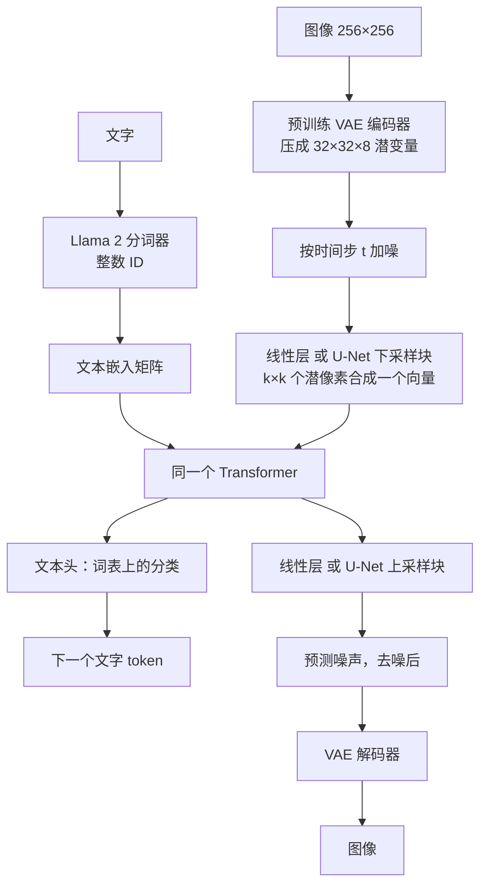
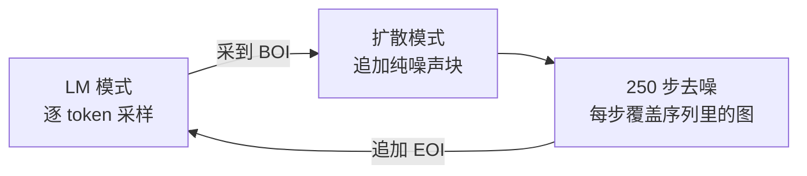

# Transfusion：同一个 Transformer，既预测下一个词，又给图像去噪

<!-- release-date: 2024-08-20 -->

> 本文依据 **Transfusion: Predict the Next Token and Diffuse Images with One Multi-Modal Model**，arXiv:2408.11039（2024-08-20 首次公开）的 ICLR 2025 正式版，共 24 页，作者单位署「Work done at Meta」（另一位署南加州大学）。页码均指这份 PDF 自身的页码。文中区分三件事：**报告明确写了什么**、**我们怎么解释它**、**哪些是外部资料或本文推算**。

## 读前先把几个词说成人话

语言模型和文生图模型都在「生成」，动作却完全不像。这篇论文难读的地方，是它要让同一份权重同时做这两种动作。

- **Next-token prediction（预测下一个词元）**：文字切成一串离散符号（token），模型每次从词表里挑下一个。串行、离散，训练目标是分类，叫语言模型损失（LM loss）。
- **Diffusion（扩散）**：从纯噪声出发，反复预测并减去噪声，整张图一起改。并行、连续，训练目标是回归：预测加进去的那份高斯噪声。本文用的是经典的 DDPM 写法。
- **VAE（变分自编码器）与 latent（潜变量）**：直接在像素上扩散太贵。先把图压成更小的连续张量，再在压缩后的空间里扩散。
- **VQ-VAE（向量量化自编码器）**：在 VAE 后面加一个码本，把每个连续潜向量换成码本里最近那个的编号。图就变成了一串整数，可以当文字来训——代价是量化会丢信息。
- **Patch（图像块）**：把 latent 切成小方块，摊成一条序列，才能送进 Transformer。
- **因果注意力与双向注意力**：前者规定每个位置只能看它左边；后者允许一块区域内互相都看。
- **CFG（Classifier-Free Guidance，无分类器引导）**：推理时把「有提示词的预测」和「没提示词的预测」做对比外推，让图更贴文字，代价是每步算两遍（PDF p. 4）。

同一模块里，Janus-Pro 一篇走的是另一条路：画图时把图量化成离散 ID，再像写字一样逐个预测。Transfusion 让图保持连续、用扩散来画。两篇不是谁的续作，而是同一个矛盾的两种解法。

## 一句话先说清

Transfusion 不是一个新的骨干网络，而是一份**从零预训练的配方**（报告自己用的词就是 recipe，PDF p. 1）：在同一条图文混合序列上，文字位置算语言模型损失，图像位置算扩散损失；注意力对文字保持因果、对同一张图内部放开双向；图像进出主干时走一层轻量的、模态专用的编解码层。

报告的三条主结论（PDF p. 1–2）：

- 数据、参数、算力都对齐时，它在每一项单模态和跨模态指标上都比「把图量化成 token 再训语言模型」的 Chameleon 配方缩放得更好；文生图 FID 追平对方只要约 1/34 的算力；
- 换上 U-Net 式的编解码块，一张图可以压到 16 个位置而质量损失很小；
- 放大到 7B 参数、2T 多模态 token，画图进入当时同规模扩散模型那一档，文字追平 Llama 1 7B。

如果只记一句：

> **离散和连续不必先统一成同一种符号。只要损失、掩码和进出接口按模态分开，同一份 Transformer 权重可以同时把两件事做好。**

### 一条阅读路线

24 页里正文到 p. 10，p. 11–16 是参考文献，p. 17–20 是附录，p. 21–24 是样例图。建议顺序：

1. **p. 2 Figure 1、p. 4 Figure 3–4**：一条序列、两种损失、一张混合掩码；
2. **p. 5 §3**：数据表示、架构、掩码、损失、推理切换，全文的方法就这一页；
3. **p. 7 Figure 5、Table 1，p. 8 Table 2**：和 Chameleon 的受控对照，以及「为什么连纯文本都更好」；
4. **p. 8–9 Table 3–5，p. 19 Table 9–10**：掩码、块大小、线性对 U-Net；
5. **p. 9–10 Table 6**：7B / 2T 对文献里的专用模型；
6. **p. 19–20 附录 B.2 与 Table 11**：图在前时要给噪声设上限。

## 主要矛盾：离散文字和连续图像，为什么难塞进同一个模型

写字时，模型必须守时间顺序：看见「一只」，才能预测「猫」。所以文字用因果注意力、用分类损失。

画画时，左上角的天空和右下角的草地必须同时知道彼此。扩散模型因此对整张图做双向注意力，用回归损失预测噪声。

把这两件事塞进同一个 Transformer、同一份权重、同一条序列，至少要同时解决四件事：

| 维度 | 文字要什么 | 图像要什么 |
|---|---|---|
| 数据形态 | 词表里的整数 ID | 连续向量 |
| 预测方式 | 一次一个离散符号 | 整块一起改、改很多轮 |
| 注意力 | 因果：只看前面 | 双向：同一张图里互相都看 |
| 损失函数 | 交叉熵 | 均方误差 |

报告在引言里点名了当时的两条主流做法（PDF p. 1）：

1. **把扩散模型当工具**：语言模型显式调用扩散模型，或者把一个预训练好的扩散模型嫁接到语言模型上。两套网络，谈不上「一个模型」。
2. **把连续模态量化成离散 token**，再训一个标准语言模型。架构变简单了，代价是丢信息（PDF p. 1）。报告在实验里按 Chameleon 的配方复现这条路当基线（PDF p. 6）。

Transfusion 要证明第三条可行：**不量化，也不外挂**，同一个模型既预测离散文字、又对连续图像做扩散，「没有信息损失」（PDF p. 1）。

## 先看全景：一条序列，两种损失，一份权重

图按 Figure 1（PDF p. 2）与 §3（PDF p. 5）重画。几件图上读不出、但要先知道的事：

- **图像块怎么进序列。** 每张图经 VAE 编成潜变量，块按从左到右、从上到下的顺序排成一串，前后包上特殊 token `BOI`（图像开始）与 `EOI`（图像结束），再插进文字序列（PDF p. 4）。
- **主干是一份，接口是两套。** 绝大多数参数在那个 Transformer 里；文字用嵌入矩阵进出，图像用线性层或 U-Net 的下 / 上采样块进出，两套参数不共享（PDF p. 5）。
- **损失粒度不同。** 语言模型损失按 token 算；扩散损失按整张图算——噪声在切块之前加到整张潜变量图上，一张图的所有块共享同一个时间步（PDF p. 5）。

两个损失直接相加，用一个系数平衡（PDF p. 5，式 4）：

$$
\mathcal L_{\mathrm{Transfusion}} = \mathcal L_{\mathrm{LM}} + \lambda \cdot \mathcal L_{\mathrm{DDPM}}
$$

$\lambda = 5$，来自初步实验，报告把继续调 $\lambda$ 留给未来工作（PDF p. 6、p. 19）。每个训练步两种模态、两个损失同时在（PDF p. 1）。

从数据到输出的完整链路如下，按 Figure 3（PDF p. 4）重画，属机制示意：

两种损失分别是什么，先说成人话。语言模型损失是「每个词位置上，正确那个词的对数概率取负再平均」（PDF p. 2，式 1）：

$$
\mathcal L_{\mathrm{LM}} = \mathbb{E}_{y}\left[-\frac{1}{n}\sum_{i=1}^{n} \log P_{\theta}(y_i \mid y_{<i})\right]
$$

扩散这一侧，前向过程把原图 $x_0$ 一步加成带噪版本 $x_t$（PDF p. 3，式 2）：

$$
x_t = \sqrt{\bar\alpha_t}\, x_0 + \sqrt{1-\bar\alpha_t}\,\epsilon,\qquad \epsilon \sim \mathcal N(0,I)
$$

$\bar\alpha_t$ 由噪声日程决定，这里用余弦日程，大致是 $\sqrt{\bar\alpha_t}\approx\cos(\frac{t}{T}\cdot\frac{\pi}{2})$ 再加一些调整（PDF p. 3）；训练用 $T=1000$ 步（PDF p. 6）。模型不直接预测 $x_0$，而是预测这份噪声 $\epsilon$，损失是均方误差（PDF p. 3，式 3）：

$$
\mathcal L_{\mathrm{DDPM}} = \mathbb{E}_{x_0,t,\epsilon}\left[\big\|\epsilon - \epsilon_{\theta}(x_t, t, c)\big\|^2\right]
$$

$c$ 是上下文，比如这张图前面的标题。

报告把这套写法看成一个更宽想法的一个实例：离散分布损失加连续分布损失，优化同一份参数；把扩散换成流匹配被明确列为未来工作（PDF p. 5）。全文实验都是 DDPM。

### 训练样本长什么样

图按 PDF p. 4–6 与附录 B 重画，是排法示意，不是语料原文。报告选择 80% 标题在前，理由是「画图可能比看图更吃数据」（PDF p. 19）。图在前的那 20% 带来一个训练—推理不一致，放到后面「噪声上限」一节讲。

## 核心设计一：混合注意力掩码

### 旧问题

因果掩码是语言模型能并行训练的前提：位置 $i$ 看不到 $i$ 之后的 token，一次前向就能得到每个位置的损失，且与推理时逐个生成看到的东西一致（PDF p. 5）。

图像不吃这套。如果一张图的块也只能看前面，右下角的信息永远流不到左上角。

### 新设计

规则只有两句（PDF p. 5）：整条序列默认因果；同一张图内部的块互相都能看。

图按 Figure 4（PDF p. 4）逐格重画。

**我们如何解释它。** 可以把它想成两种交通规则贴在同一条路上：车道（文字）仍是单向的；停车场（一张图）内部可以任意掉头；车一旦开出停车场，就不能再回去改已经写出去的字。训练时整条序列一次前向算完：文字位置用因果上下文预测下一个词，图像位置用整张图的块加上前面的文字预测噪声。

### 收益

Table 3（PDF p. 8）在 0.76B、$2\times 2$ 块上对照因果与双向：

| 编解码 | 注意力 | C4 PPL ↓ | Wiki PPL ↓ | Llama Acc | CIDEr ↑ | FID ↓ | CLIP ↑ |
|---|---|---:|---:|---:|---:|---:|---:|
| 线性 | 因果 | 10.4 | 6.0 | 51.4 | 12.7 | 61.3 | 23.0 |
| 线性 | 双向 | 10.4 | 6.0 | 51.7 | 16.0 | 20.3 | 24.0 |
| U-Net | 因果 | 10.3 | 5.9 | 52.0 | 23.3 | 16.8 | 25.3 |
| U-Net | 双向 | 10.3 | 5.9 | 51.9 | 25.4 | 16.7 | 25.4 |

（原表 Llama Acc 一栏的箭头印成了向下，这一栏其实越高越好。）

线性编解码时，双向把 FID 从 61.3 拉到 20.3，是全表最剧烈的一跳；纯文本几乎不动。U-Net 行的差距小得多，报告给的原因是：U-Net 块内部自带双向注意力，不依赖 Transformer 的掩码（PDF p. 8）。即便如此，CIDEr 仍从 23.3 升到 25.4。报告的结论是双向在两种编解码下、所有基准上都有利（PDF p. 8）——但 U-Net 那一行 Llama Acc 从 52.0 到 51.9 其实略降，差 0.1，可以视为持平。

### 代价与边界

- **掩码按「一张图」切块，不按「所有图像」切。** 序列里的第二张图能看第一张，第一张看不到第二张（PDF p. 5）。预训练数据基本是一对一的图文对，这个限制当时不显眼；做多图交错时要重新想。
- **注意力算子的实现报告没写。** 下面是我们的推断：标准因果注意力的快路径通常假设整条序列是下三角掩码，图内这块「非因果」区域会让现成快路径不能直接套用。报告没有给吞吐或延迟的数字。

### 可迁移启发

> **不要为了架构好看而强迫两种模态用同一种注意力。先问每种模态在生成时必须看见谁，再把掩码写成这些可见性的并集。**

文字的可见性是前缀，图像的可见性是同一张画布，并起来就是这张混合掩码。HunyuanImage-3.0 一篇记录了那份报告明说沿用 Transfusion 与 JanusFlow 把扩散并进语言模型的方式，它的「广义因果注意力」也是片段之间守因果、图像片段内部全互看——形状相同这一点是我们的对照，不是本报告的内容。

## 核心设计二：模态专用的编解码层，以及「一张图 16 个位置」

### 旧问题

VAE 已经把 256×256 像素压成 $32\times 32\times 8$ 的潜变量，每个潜像素对应 8×8 像素（PDF p. 18）。如果每个潜像素都占 Transformer 的一个位置，一张图就是 1024 个位置。位置越多，每一步扩散、每一次训练前向都越贵。

### 新设计

在 VAE 和 Transformer 之间再加一层，把 $k\times k$ 个相邻潜像素合成一个 Transformer 向量，出来时再展开（PDF p. 5，Figure 3）。报告试了两种实现：

1. **线性层**：一个矩阵乘法。所有配置下额外参数都不到总量的 0.5%（PDF p. 6）。
2. **U-Net 的下 / 上采样块**：带卷积和块内注意力，引用 Nichol & Dhariwal 2021 与 Saharia et al. 2022（PDF p. 5）。所有规模下额外参数都是 0.27B：对 7B 只多 3.8%，和嵌入层的参数量差不多；对 0.16B 则是 +106.1%（PDF p. 6、p. 19）。

图的格子按 PDF p. 18 脚注 7 画出，数字来自 Table 9（PDF p. 19）。16 就是摘要里「compress each image to just 16 patches」的来源（PDF p. 1）。

**我们如何解释 U-Net 块在干什么。** 主干在看「这些块和前面的文字是什么关系」；U-Net 块在看「这 $k\times k$ 个相邻潜像素自己内部的局部结构」。把二维邻域这种归纳偏置下放到一个小网络，主干就不必用自注意力去学它。

### 收益

Table 9 是 0.76B 上的完整对照（PDF p. 19；正文 Table 4 是其中 U-Net 与不合并的四行，PDF p. 9）：

| 编解码 | 潜像素 / 块 | 每图位置数 | C4 PPL ↓ | Wiki PPL ↓ | Llama Acc ↑ | CIDEr ↑ | FID ↓ | CLIP ↑ |
|---|---|---:|---:|---:|---:|---:|---:|---:|
| 不合并 | 1×1 | 1024 | 10.3 | 5.9 | 52.2 | 12.0 | 21.0 | 24.0 |
| 线性 | 2×2 | 256 | 10.4 | 6.0 | 51.7 | 16.0 | 20.3 | 24.0 |
| 线性 | 4×4 | 64 | 10.9 | 6.3 | 49.8 | 14.3 | 25.6 | 22.6 |
| 线性 | 8×8 | 16 | 11.7 | 6.9 | 47.7 | 11.3 | 43.5 | 18.9 |
| U-Net | 2×2 | 256 | 10.3 | 5.9 | 51.9 | 25.4 | 16.7 | 25.4 |
| U-Net | 4×4 | 64 | 10.7 | 6.2 | 50.7 | 29.9 | 16.0 | 25.7 |
| U-Net | 8×8 | 16 | 11.4 | 6.6 | 49.2 | 29.5 | 16.1 | 25.2 |

两件事同时成立：线性层压不动，位置越少图越差；U-Net 压得动，图像相关指标甚至随块变大而变好。报告的解释是：文字与图像的 token 比固定为 1:1，位置越少，同一预算里看过的图（和扩散噪声）越多（PDF p. 8、p. 18 脚注 7）。

报告据此说，服务成本「最多可能降到 1/64」（PDF p. 2）。这是按每图位置数 1024 对 16 做的估计，报告没有测端到端延迟。

**U-Net 的好处是归纳偏置，还是只是多了参数？** 报告把主干从 0.16B 放到 7B，U-Net 参数保持 0.27B 不变，看收益会不会随参数占比下降而消失（PDF p. 8–9）。Table 10 全表（PDF p. 19；正文 Table 5 是其中三档，PDF p. 9）：

| 主干 | 编解码 | 额外参数占比 | C4 PPL ↓ | Llama Acc ↑ | CIDEr ↑ | FID ↓ | CLIP ↑ |
|---|---|---:|---:|---:|---:|---:|---:|
| 0.16B | 线性 | 0.5% | 14.8 | 44.2 | 6.2 | 37.6 | 20.0 |
| 0.16B | U-Net | 106.1% | 14.4 | 45.7 | 15.3 | 18.8 | 23.9 |
| 0.37B | 线性 | 0.4% | 12.0 | 47.9 | 11.1 | 21.5 | 22.4 |
| 0.37B | U-Net | 71.3% | 11.8 | 48.8 | 21.1 | 18.1 | 24.9 |
| 0.76B | 线性 | 0.4% | 10.4 | 51.7 | 16.0 | 20.3 | 24.0 |
| 0.76B | U-Net | 35.5% | 10.3 | 51.9 | 25.4 | 16.7 | 25.4 |
| 1.4B | 线性 | 0.4% | 9.5 | 53.8 | 19.1 | 19.4 | 24.3 |
| 1.4B | U-Net | 19.3% | 9.4 | 53.4 | 28.1 | 16.6 | 25.7 |
| 7B | 线性 | 0.3% | 7.7 | 61.5 | 27.2 | 18.6 | 25.9 |
| 7B | U-Net | 3.8% | 7.8 | 61.1 | 33.7 | 16.0 | 26.5 |

相对收益随主干变大而缩小，但没有消失。0.37B 起，加了 U-Net 的小模型 FID 都好过线性 7B 的 18.6（0.16B 的 18.8 还差一点）；1.4B 加 U-Net（合计约 1.67B）的 CIDEr 28.1 超过线性 7B 的 27.2（PDF p. 9）。报告的判断是：U-Net 编解码确实带来了超出「多加参数」的归纳偏置收益（PDF p. 9）。

注意 Table 3–5、9–10 的 FID 与 CLIP 只用 5k 张图算，Table 1 用 30k 张（PDF p. 6 脚注 2）；消融的 CFG 是 3，受控对照是 5（PDF p. 6–7）。不同表的 FID 不要横比。

### 代价与边界

- **压缩伤文字。** U-Net 从 256 个位置压到 16 个，C4 PPL 从 10.3 升到 11.4，Llama Acc 从 51.9 降到 49.2（PDF p. 9）。报告的猜测是：位置越少，模型越要把参数花在「怎么读图」上（PDF p. 8）。
- **16 个位置只在 0.76B、0.5T 的消融里验证过。** 7B / 2T 旗舰用的是 U-Net、$2\times 2$，每图 256 个位置（PDF p. 9）。不要把「7B 模型一张图只占 16 个位置」写进笔记。
- **U-Net 块的结构细节**（通道数、层数、是否注入时间步）报告没写，只给了两个引用（PDF p. 5）。

### 可迁移启发

> **能用一个小的、带正确归纳偏置的模态前端把序列压短，就不要让主干去看原始分辨率。**

线性层几乎免费，但也几乎不帮忙。换到别的连续模态（频谱、点云、动作轨迹），值得先问：有没有一个便宜的、懂这个模态局部结构的模块，能在进 Transformer 之前把长度降下来？同时盯住两件事：单位成本降了多少，以及 token 比锁死时，「更多样本」与「每个样本更少算力」这笔交换划不划算。

## 核心设计三：两种损失直接相加

### 旧问题

同一个网络的输出，要同时喂一个分类头和一个回归头。两种损失量纲不同、尺度不同，随便加在一起，一个可能把另一个淹掉。

### 新设计与机制

做法就是式 4：文字位置标准交叉熵，图像位置 DDPM 均方误差，乘 $\lambda=5$ 相加（PDF p. 5–6）。「按 token 算」与「按图算」的区别见全景一节。

### 收益：文字只付了很小的代价

Table 2 把从 Llama 2 配方走到两条多模态配方的过程拆开，模型都是 0.76B（PDF p. 8）：

| 配方 | 每批数据 | C4 PPL ↓ | Wiki PPL ↓ | Llama Acc ↑ |
|---|---|---:|---:|---:|
| Llama 2 | 1M 文字 token | 10.1 | 5.8 | 53.7 |
| Transfusion：加扩散 | + 1M 图像块 | 10.4 | 6.0 | 52.7 |
| Chameleon：只加稳定性改动 | 1M 文字 token | 11.0 | 6.3 | 51.9 |
| Chameleon：再对图像 token 算 LM 损失 | + 1M 图像 token | 11.8 | 6.8 | 48.9 |

报告称 Transfusion 对文字的代价「非零」（PDF p. 7–8）。Chameleon 那一侧则两头受损：还没加图像，为稳住训练的架构改动已经把准确率拉到 51.9；再把量化图像 token 推进词表，又掉到 48.9。

### 代价与边界

- **$\lambda=5$ 没有消融表。** 不知道 1、5、10 差多少，也不知道损失是否再按 token 数或图数归一化。报告只说「简单地加起来」（PDF p. 5）。
- **训练与推理的一处不一致。** 扩散训练时输入的是带噪图，所以图后面的文字训练中条件在噪图上（PDF p. 5 脚注 1），推理时却看到干净图。附录 B.2 专门处理，见下文。

### 可迁移启发

> **异质目标不必先翻译成同一种损失。先让每个模态用自己最成熟的目标，再用一个标量去平衡——这个标量值得单独做实验，不要埋进「其余超参」。**

## 核心设计四：推理时在两种解码模式之间切换

### 旧问题

训练可以在一条序列上同时算两种损失，推理却要生成一个具体样本：文字一个 token 一个 token 采，图像要在噪声上迭代很多步。

### 新设计

解码算法按模式切换（PDF p. 5）：

1. 默认是 **LM 模式**，逐 token 采样（评测时文字用贪心解码，Llama 评测套件用排序分类，PDF p. 6）；
2. 一旦采到 `BOI`，切到**扩散模式**：在序列后追加 $n$ 个纯噪声块（$n$ 由目标尺寸决定），走完去噪；
3. 每一步用预测的噪声得到 $x_{t-1}$，**覆盖**序列里的 $x_t$——模型永远只条件在最新一步的带噪图上，看不到更早的时间步；
4. 去噪结束追加 `EOI`，切回 LM 模式。

训练用 1000 个时间步，推理按惯例用 250 步（PDF p. 6）。CFG 在受控对照里跟 Chameleon 一样取 5；报告说这个值对 Transfusion 不是最优，消融改用 3；7B 旗舰按基准分别调（PDF p. 6–7）。

### 收益

这套切换让任意的图文混合都能生成（PDF p. 5）。预训练覆盖的是图文对；「任意交错」是解码算法提供的能力，不是数据里充分训练过的分布。

### 代价与边界

下面是按报告设定做的推算：一张图要跑 250 次完整前向，开 CFG 接近 500 次；自回归画图的前向次数等于块数。两种生成的延迟结构完全不同，报告没有给任何一侧的实测延迟或显存。覆盖式更新省掉了保存历史时间步，但模型也因此无法回看更早的去噪状态，报告没讨论这是否限制质量。

### 可迁移启发

> **训练时两种损失可以同时存在；推理时要有一个显式的模态开关。** 开关做成特殊 token 的好处是，它本身也是语言模型能学会预测的符号，不需要外部控制器决定「下一段是图还是字」。

## 对照基线：报告自己训的 Chameleon 配方

报告没有拿别人训好的 Chameleon 来比，而是按 Chameleon 的配方训了一族受控基线：同样的数据、参数量与算力（PDF p. 6）。两边的自编码器也用完全相同的数据、算力与结构训练，唯一差别是 VQ-VAE 多一个量化层和码本损失（PDF p. 6、p. 20）。码本有 16,384 个 token 类型（PDF p. 6）。

但这条基线并不只差「量化」一件事。Chameleon 相对 Llama 架构还加了 query-key 归一化、post-normalization、denominator loss，并把学习率降到 $1\times 10^{-4}$，以压住训练不稳定；报告脚注说，初步实验里去掉这些改动 Chameleon 会优化失稳（PDF p. 6 脚注 3）。Table 2 正是把这两件事拆开看。

## 训练 recipe：写出来的部分

没有 GPU 数、并行策略、训练墙钟时间。写出来的如下。

**五档模型**，全部随机初始化、从零训，配置照 Llama 的标准设定（PDF p. 17 Table 8、p. 18）：

| 参数量 | 层数 | 嵌入维 | 注意力头 |
|---|---:|---:|---:|
| 0.16B | 16 | 768 | 12 |
| 0.37B | 24 | 1024 | 16 |
| 0.76B | 24 | 1536 | 24 |
| 1.4B | 24 | 2048 | 16 |
| 7B | 32 | 4096 | 32 |

**受控实验的数据**（几乎所有实验，PDF p. 6）：共 0.5T token（图像块也按 token 计），文字与图像 1:1；文字用 Llama 2 的分词器与语料（共 2T token）；图像用 3.8 亿张授权的 Shutterstock 图文对，中心裁剪并缩到 256×256；80% 标题在前。

**7B 旗舰的数据**（PDF p. 6）：共 2T token，1T 文字加约 35 亿个图文对（按每图 256 个块计）；为增加多样性加入 2.2 亿张公开图文对，预先滤掉含人的图；为重新平衡分布，上采样 8000 万张含人的 Shutterstock 图；再加入 CC12M；每个 epoch 合计 6.92 亿图文对，大约 5 个 epoch（PDF p. 2）；训练最后 1% 提高高美学图像的权重。2.2 亿张公开图的来源，除 CC12M 外报告没写。

**优化**（PDF p. 6、p. 18–19）：AdamW，$\beta_1=0.9$，$\beta_2=0.95$，$\epsilon=10^{-8}$；学习率 $3\times 10^{-4}$，4000 步热身，余弦降到 $1.5\times 10^{-5}$；weight decay 0.1，梯度裁剪 1.0。受控实验：序列 4096，每批 2M token，250k 步，合计 0.5T。旗舰：每批 4M token，500k 步，合计 2T。

**VAE**（PDF p. 6、p. 18、p. 20）：86M 参数，CNN 编解码器，潜变量 8 维，训 1M 步。损失沿用 Esser et al. 2021：

$$
\mathcal L_{\mathrm{VAE}} = \mathcal L_1 + \mathcal L_{\mathrm{LPIPS}} + 0.5\,\mathcal L_{\mathrm{GAN}} + 0.2\,\mathcal L_{\mathrm{ID}} + 0.000001\,\mathcal L_{\mathrm{KL}}
$$

依次是像素 L1、LPIPS 感知损失、基于块的判别器损失、基于 MoCo v2 特征的感知损失、KL 正则。对抗损失从第 5 万步才加入，先让重建过关。VQ-VAE 把 KL 项换成码本 commitment 损失（$\beta=0.25$，权重 1.0）（PDF p. 20）。

### 图在前时的噪声上限

20% 图在前的样本里，扩散目标照样给图加噪，于是后面的标题训练中看的是一张脏图。附录 B.2 只对这 20% 把噪声时间步上限设为 $t=500$（日程的一半），Table 11（PDF p. 20）：

| 模型 | 限制噪声 | C4 PPL ↓ | Llama Acc ↑ | CIDEr ↑ | FID ↓ | CLIP ↑ |
|---|---|---:|---:|---:|---:|---:|
| 0.76B U-Net | 否 | 10.3 | 51.9 | 25.4 | 16.7 | 25.4 |
| 0.76B U-Net | 是 | 10.3 | 52.1 | 29.4 | 16.5 | 25.4 |
| 7B U-Net | 否 | 7.8 | 61.1 | 33.7 | 16.0 | 26.5 |
| 7B U-Net | 是 | 7.7 | 60.9 | 35.2 | 15.7 | 26.3 |

看图说话明显变好，其他指标变化很小（PDF p. 19–20）。**我们如何解释它：** 看图说话需要图还认得出来，扩散又必须见过很脏的图；给「图作为条件」时的噪声设上限，是在两者之间折中。正文 Table 3–5 与 Table 9–10 的 U-Net 行（CIDEr 25.4、33.7）和 Table 11 的「否」行相同，说明这些消融默认没开这个限制。

## Scaling：同一算力下，连续扩散全面压过量化路线

§4.2 是全文的主实验。为了公平，Transfusion 这一侧只用线性 $2\times 2$ 编解码加双向注意力，不把 U-Net 的额外参数算进来（PDF p. 7）。FLOPs 用 $6ND$ 近似，$N$ 是参数量、$D$ 是 token 数；每个基准在 log 指标对 log FLOPs 上拟合直线，再算 **parity FLOP ratio**：Transfusion 要达到 Chameleon 同一分数所需的相对 FLOPs（PDF p. 7）。

图引自 PDF p. 7 Figure 5，坐标轴全是对数。报告的读法：每个基准上 Transfusion 的缩放都更好，两条线接近平行但有明显间距（PDF p. 7）。Table 1 是 7B、0.5T 这一档的绝对数字（PDF p. 7）：

| 指标 | Transfusion 7B | Chameleon 7B | 持平所需相对 FLOPs |
|---|---:|---:|---:|
| C4 PPL ↓ | 7.72 | 8.41 | 0.489 |
| Wiki PPL ↓ | 4.28 | 4.69 | 0.526 |
| Llama Acc ↑ | 61.5 | 59.1 | 0.600 |
| CIDEr ↑ | 27.2 | 18.0 | 0.218 |
| FID ↓ | 16.8 | 29.6 | 0.029 |
| CLIP ↑ | 25.5 | 24.3 | 0.319 |

读成人话（PDF p. 2、p. 7）：

- 文生图 FID 追平只需约 1/34 的算力（$1/0.029\approx 34$）；同 FLOPs 下 FID 大约低一半；
- 按 FID 与 CLIP 两项，不到三分之一的算力就超过 Chameleon——CLIP 的 0.319 正好落在 1/3 附近，FID 远不止；
- 看图说话在 21.8% 的 FLOPs 上持平；
- 连纯文本也更省：困惑度持平约需 Chameleon 的 50%–60% FLOPs。

最后一条报告自己也觉得意外：两边对文字用的是同一种目标（PDF p. 7）。Table 2 已经给出拆解；原因报告给了两个假说、没做判决实验（PDF p. 8）：量化图像 token 与文字在同一个输出分布里竞争；或者扩散画图更省参数，把更多容量留给了文字。能确定的只有现象。

## 放大到 7B / 2T：和文献里的专用模型比

§4.4 换了一套更偏画图的选择：U-Net 编解码、$2\times 2$ 块、2T token、上一节的数据混合（PDF p. 9）。参数写作 7.3B，即 7B 主干加 0.27B U-Net 块（PDF p. 2、p. 10）。

Table 6 是和文献报告数字的对照，不是受控实验（PDF p. 10）。除 Chameleon 外，其余模型都只会生成一种模态；带 `*` 的是冻住的文本编码器参数：

| 模型 | 参数 | 文字 token | 图像数 | Llama Acc ↑ | COCO FID ↓ | GenEval ↑ |
|---|---|---|---|---:|---:|---:|
| Llama 1 | 7.1B | 1.4T | — | 66.1 | — | — |
| Llama 2 | 7.1B | 2.0T | — | 66.3 | — | — |
| Chameleon | 7.1B | 6.0T | 5.0B | 67.1 | 26.74 | 0.39 |
| Imagen | 2.6B + 4.7B* | — | 5.0B | — | 7.27 | — |
| Parti | 20B | — | 4.8B | — | 7.23（每条提示采 16 张再重排） | — |
| SD 2.1 | 0.9B + 0.1B* | — | 2.3B | — | — | 0.50 |
| DALL-E 2 | 4.2B + 1B* | — | 2.6B | — | 10.39 | 0.52 |
| SDXL | 2.6B + 0.8B* | — | 1.6B | — | — | 0.55 |
| DeepFloyd | 5.5B + 4.7B* | — | 7.5B | — | 6.66 | 0.61 |
| SD 3 | 8B + 4.7B* | — | 2.0B | — | — | 0.68 |
| Transfusion | 7.3B | 1.0T | 3.5B | 66.1 | 6.78 | 0.63 |

报告的主张（PDF p. 9–10）：

- 画图与 DeepFloyd 同一档（FID 6.78 对 6.66，GenEval 0.63 对 0.61），超过 SDXL 与 DALL-E 2；
- 落后于 SD 3 的 0.68。报告指出 SD 3 用了合成标题，小规模上这一项就把 GenEval 从 0.433 抬到 0.498；Transfusion 为了简单只用自然数据；
- 文字 Llama Acc 66.1，与 Llama 1 7B 相同，略低于 Llama 2 7B。

对照 Stable-Diffusion-3 一篇所依据的报告：0.433 → 0.498 与那份报告 Table 4 的 43.27 → 49.78 一致；SD 3 的 0.68 与那份报告 Table 5 里 8B、$512^2$ 底模一行相同；但「2.0B 张图」这个训练量，那份报告里没有写。

这张表证明的是「一个模型可以同时进入两张榜」，不是「相同数据与算力下打赢专用模型」。

Figure 2 与 Figure 7–9 是这个 7B 模型的生成样例（PDF p. 3、p. 21–23），包括黑板上写「Transfusion」、玻璃球落海、两幅浣熊国王王后油画这类组合概念。它们是展示，报告没有说抽样协议，也没有失败案例。

## 图像编辑：预训练没见过的模态组合

预训练覆盖文到文、图到文、文到图，没有图到图（PDF p. 9）。报告借 LIMA 的思路，只用 8000 条公开的图像编辑样本（输入图、编辑指令、输出图）微调 7B 旗舰，看它能否泛化（PDF p. 10）。在 EmuEdit 测试集上人工查看随机样例，Figure 6 给出「去掉盘子上的纸杯蛋糕」「把右边的番茄换成青橄榄」「用 Arial 粗体写 Zebra」「改成卡通风」四例（PDF p. 10），Figure 10 另有八个随机样例（PDF p. 20、p. 24）。

报告的措辞克制：尽管实验有局限，结果提示 Transfusion 能适应新的模态组合（PDF p. 10）。没有编辑成功率、没有任何定量指标。这是存在性观察。

## 限制、没写的事、不要读过的结论

**报告几乎不谈限制。** 结论只有三句：弥合离散序列建模与连续媒体生成、用两个目标训一个联合模型、缩放高效且参数共享几乎没有代价（PDF p. 10）。没有失败模式小节。

**被证据支持的：**

- 数据、参数、算力受控时，连续扩散路线在六项指标上都优于「量化 + 语言模型」路线（Figure 5、Table 1）；
- 图内双向注意力对线性编解码是刚需（Table 3）；
- U-Net 前端让大块、短序列可行，且好处不能全归因于额外参数（Table 9、Table 10）；
- 量化图像 token 对纯文本的伤害大于扩散图像（Table 2）；
- 7B / 2T 同时接近专用扩散模型与同规模 Llama（Table 6）。

**不要读过的：**

- **没有证明扩散统一模型永远优于离散 token 统一模型。** 对照的是他们复现的 Chameleon 配方，还叠着稳定性改动与学习率差异。Janus-Pro 一篇的 GenEval 表里 Transfusion 是 0.63、Janus-Pro 自己是 0.80，那是另一份报告里的数字，不能拿来给本报告的结论翻案或背书。
- **没有证明 16 个位置够 7B 旗舰用。** 那是 0.76B 消融。
- **没有证明编辑能力来自预训练涌现。** 那是 8000 条样本微调后的定性观察。
- **没有和 SD 3 公平对比。** 数据、合成标题、冻结文本编码器，全都不同。

**报告没有公开的：** GPU 型号与数量、并行策略、精度、训练时长与成本；2.2 亿张公开图的来源与过滤细则；高美学子集的定义与上采样倍数；$\lambda$ 的选取曲线；U-Net 块的结构；混合掩码的算子实现与吞吐代价；旗舰在 GenEval 上的分项；编辑的定量指标；权重与代码。引言把音频、视频列为连续模态的例子（PDF p. 1），实验全部是图。

## 可以带回自己项目的几条

1. **先保住每种模态已经验证过的目标函数。** 为了架构统一去量化，付出的不只是画质，还有文字本身（Table 1、Table 2）。
2. **掩码按「生成时必须看见谁」来写。** 文字看前缀，图像看整张画布；不要为了用现成的因果核把图像砍成单向。
3. **模态前端的归纳偏置比多几个亿参数更关键。** U-Net 块在 7B 上只多 3.8% 参数，却让小得多的模型 FID 超过线性 7B。
4. **缩短序列前，先算「样本数」与「每样本算力」的交换。** token 比锁死时，块越大、看的图越多、每张图越便宜；U-Net 吃得下这笔交换，线性层吃不下。
5. **一个输入在另一条损失里被破坏时，要单独处理。** 图在前时，扩散把后面标题的条件弄脏；只给这部分设噪声上限，CIDEr 就从 25.4 到 29.4。
6. **从零训与在已有语言模型上接着训是两份配方。** 这篇的 $\lambda=5$、80% 标题在前、随机初始化，不能直接搬到「已有基座 + 新模态」的项目上。

## 关键词回看

- **Next-token / LM 损失**：文字的生成动作与分类损失；
- **DDPM / 预测噪声 $\epsilon$**：图像的生成动作与回归损失，按整张图算；
- **$\lambda$**：两种损失之间那个没有被消融的标量，取 5；
- **`BOI` / `EOI`**：序列上的模态边界，也是推理时的模式开关；
- **混合注意力**：默认因果，同一张图内部双向；
- **VAE 对 VQ-VAE**：连续潜空间对离散码本，报告认为量化是信息瓶颈；
- **线性层对 U-Net 块**：要不要给图像一个懂二维邻域的前端；
- **16 个位置 / 64 倍**：序列压缩的上限，只在 U-Net 前端、0.76B 消融下成立；
- **Parity FLOP ratio**：达到对方同一分数所需的相对算力，用来读 Figure 5 的间距；
- **噪声上限 $t=500$**：图作为条件时的去噪折中。

> **统一的是主干和序列，不是符号、损失和注意力。**

## 资料与阅读边界

- **原件**：arXiv:2408.11039 的 ICLR 2025 正式版，24 页；arXiv 上只有 2024-08-20 的 v1（23 页），分页与正式版不同，页码以本文所依据的正式版为准。正式版会议页：<https://proceedings.iclr.cc/paper_files/paper/2025/hash/12678c3948153f4bc391f51e2082bd6e-Abstract-Conference.html>。
- **首发日 2024-08-20**：报告只公开训练配方，没有对外开放权重、API 或产品，按报告库口径取这项技术首次官方公开日，即 arXiv v1 的提交日。
- **同方向对照**：Janus-Pro、HunyuanImage-3.0、Stable-Diffusion-3 三篇的内容只用于对照，均已在文中标明，不是本报告的内容。
- **本文推算**：$1/0.029\approx 34$、CFG 下约 500 次前向等算术，以及掩码快路径的系统推断。
