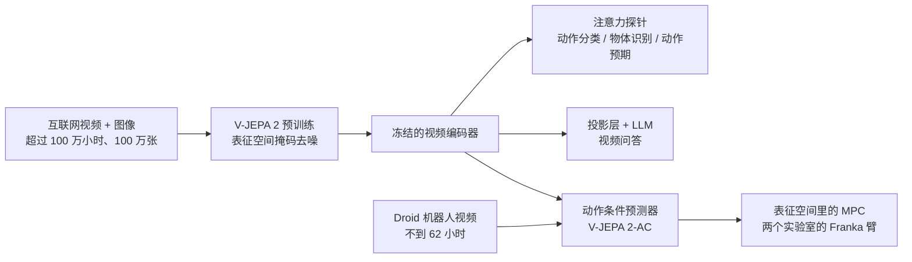

# V-JEPA 2：世界模型不必画出下一帧，规划只要在表征里比远近

<!-- release-date: 2025-06-11 -->

> 本文依据 FAIR at Meta 的 **V-JEPA 2: Self-Supervised Video Models Enable Understanding, Prediction and Planning**，arXiv:2506.09985v1（2025-06-11 提交），共 48 页，封面日期 2025-06-13。页码均指 PDF 自身的页码。文中会区分三件事：**报告明确写了什么**、**我们怎么解释它**、**哪些是外部资料或本文推算**。

## 读前先认识几个词

这篇报告横跨视频理解、动作预期、视频问答和机器人规划四个领域，但读懂它只需要下面几个概念：

- **自监督（self-supervised learning）**：训练信号来自数据本身，不靠人标「这是杯子」「下一步该抓」。本篇的预训练信号是视频里被遮住的那一块。
- **JEPA（Joint-Embedding Predictive Architecture，联合嵌入预测架构）**：先把输入压成向量，再让模型在向量空间里预测缺失的部分，而不是预测原始像素（LeCun 2022，PDF p. 2）。
- **编码器 / 预测器（encoder / predictor）**：编码器把画面压成表征；预测器在表征里补全被遮住的部分，或者在后训练之后根据动作想象下一帧的表征。
- **动作条件世界模型（action-conditioned world model）**：预测未来时把「我准备做什么」也喂进去。本篇把这样后训练出来的模型叫 **V-JEPA 2-AC**。
- **模型预测控制（Model Predictive Control，MPC）**：每一步先在模型里试很多候选动作，挑出看起来最接近目标的那一个去执行，看到新画面后再重来。本篇用 **交叉熵方法（Cross-Entropy Method，CEM）** 做这个搜索。
- **冻结探针（frozen probe）**：编码器参数不动，只在它的输出上训一个小网络去做分类。用来测「表征里装了什么」。

真正要记住的新名字只有两个：**V-JEPA 2**（在无动作视频上预训练出来的视频编码器）和 **V-JEPA 2-AC**（冻住这个编码器，另训一个吃动作的预测器）。

## 一句话先说清

V-JEPA 2 不是一个更会画视频的模型。它把「世界模型」拆成两段来训：

1. 在超过 100 万小时的互联网视频加 100 万张图像上，用表征空间里的掩码去噪预训练编码器，最大到 ViT-g、约 10 亿参数（PDF p. 1、p. 3）；
2. 冻住编码器，用 Droid 数据集里不到 62 小时、没有任务标签的机器人视频，另训一个约 3 亿参数的动作条件预测器（PDF p. 1、p. 9–10），然后把它部署到两个从没采过数据的实验室，用图像目标做抓取和抓放（PDF p. 12）。

摘要里的四个数字各有限定，引用时要带上：

- SSv2 上 77.3 的 top-1 是 **ViT-g384**（384 分辨率变体）在冻结注意力探针下的成绩；标准分辨率的 ViT-g 是 75.3（PDF p. 1、p. 16，表 4）。
- Epic-Kitchens-100 动作预期的 39.7 recall-at-5 同样来自 ViT-g384，相对此前最好的 PlausiVL 提升 44%（PDF p. 1、p. 17–18，表 5）。
- 视频问答的 84.0（PerceptionTest）和 76.9（TempCompass）是 ViT-g384 接 Llama 3.1 8B、用全部 8850 万条对齐数据训出的系统级结果；PerceptionTest 这一项是测试集、经过 SFT（PDF p. 1、p. 21，表 8）。
- 机器人部分是 10 次试验的成功率：两个实验室平均，杯子抓放 80%，盒子抓放 65%，抓盒子只有 25%（PDF p. 14，表 2）。

如果只记一句话，可以记：

> **规划需要的不是一张更逼真的下一帧，而是一个对动作敏感、又丢掉了不可预测细节的表征。在这样的表征里比距离，比生成视频便宜得多。**

## 先看全景：两段训练，三种用法

图引自原文 Figure 2（PDF p. 4）。左边是预训练，右边是动作条件后训练。两边的损失都是 L1，都算在表征上，都不碰像素。

预训练好的编码器接出三条用法（按 Figure 1 重画，PDF p. 2；流程示意，不是实测时间线）：

报告把这三条用法归成「理解、预测、规划」三种能力（PDF p. 3）。它们的顺序在论文里有一层因果：V-JEPA 2-AC 的规划能力，上限就是编码器表征里装了多少东西，所以第 5–7 节的探针和问答，其实是在检查「这个潜空间到底装了什么」（PDF p. 15）。

### 报告地图

| 页 | 内容 |
|---|---|
| p. 1–3 | 摘要、Figure 1 总览、四项贡献 |
| p. 4–8 | 预训练：目标函数、3D-RoPE、四条放大杠杆、VideoMix22M、渐进分辨率 |
| p. 8–11 | V-JEPA 2-AC：数据、教师强制与 rollout 损失、架构、能量最小化规划 |
| p. 11–15 | 零样本机器人：Octo 与 Cosmos 对照、到达 / 抓取 / 抓放、三条限制 |
| p. 15–18 | 冻结探针分类（表 4）、EK100 动作预期（表 5） |
| p. 19–21 | 视频问答：受控对照（表 6、7）与数据放大（表 8） |
| p. 21–23 | 相关工作、结论与未来方向 |
| p. 33–37 | 附录 A：预训练超参、YT1B 筛选、架构表、数据与训练日程消融 |
| p. 37–41 | 附录 B：AC 超参、任务定义、表征解码可视化、相机位置敏感性 |
| p. 41–45 | 附录 C–D：探针细节与消融、EK100 消融与更长预期时间 |
| p. 45–48 | 附录 E：两套视频问答对齐配方 |

## 主要矛盾：能看的数据最多，能动手的数据最少

要让机器人在一张陌生的桌子上把杯子放进盘子，模型至少要会三件事：看懂当前画面，想象某个动作之后世界会怎样，再从想象里挑一个动作执行。

传统的世界模型直接在「状态 + 动作」序列上训练，往往还要环境给奖励（PDF p. 1–2）。这类数据只能在自己控制的机器人上录，又贵又慢，规模上不去。

互联网上有海量视频，它们记录了「发生了什么」，却几乎没有「当时做了什么动作」。

于是这个领域卡在一个位置上：**数据最多的地方没有动作，有动作的地方数据少到撑不起一个通才。**

近年有一批工作用互联网视频加交互数据训练**动作条件视频生成模型**，再拿它控制机器人。报告点出这条线的问题：它们更多在评估画面是否逼真，很少真正拿来规划，原因之一可能是**靠生成视频来规划太贵**（PDF p. 2）。

V-JEPA 2 押的注是：

> 先用无动作视频把「可预测的世界」压进表征，再用很少的机器人数据让表征听懂动作。规划时比较的是向量，不生成像素。

## 核心设计一：在表征里做掩码去噪

### 旧问题：预测像素会逼模型去背噪声

如果训练目标是「把遮住的像素画回来」，模型必须同时学两件事：杯子大概往哪走，以及背景窗帘每一道褶皱怎么摆。后一件对控制几乎没用，却要占掉大量容量。报告的说法是：像素级生成目标会强调不可预测的细节，比如草地里每一片草、树上每一片叶子的位置；JEPA 只学可预测的部分，比如运动物体的轨迹（PDF p. 2）。

### 新设计：预测表征，不预测像素

V-JEPA 的目标是：从一段被随机丢掉部分图块的视频 $x$，预测完整视频 $y$ 的**表征**（PDF p. 4，式 1）：

$$
\min_{\theta,\phi,\Delta_y}\ \bigl\| P_\phi\bigl(\Delta_y,\ E_\theta(x)\bigr) - \operatorname{sg}\bigl(E_{\bar\theta}(y)\bigr) \bigr\|_1
$$

符号的意思是：

- $E_\theta$ 是编码器，只看得到没被遮住的图块；
- $P_\phi$ 是预测器，输入是编码器的输出，加上一组可学习的**掩码 token** $\Delta_y$，它只告诉模型「缺的块在哪」，不含图像内容；
- 目标来自 $E_{\bar\theta}$，也就是编码器参数的指数滑动平均（EMA），并且对它**停止梯度** $\operatorname{sg}(\cdot)$，防止表征塌缩成常数；
- 损失只算在被遮住的那些位置上（PDF p. 4）。

人话版：看得见的部分提供上下文，看不见的部分当考题，考题的标准答案是「完整视频被压成的意思」，不是原图。

视频先切成 $2\times 16\times 16$（时间 × 高 × 宽）的管状图块，再送进 Vision Transformer；遮挡沿用初代 V-JEPA 的多块遮挡策略（PDF p. 5）。附录给的遮挡参数是：空间上每块占画面的 15%–70%，时间上整段贯通（PDF p. 33，表 9）。

### 位置编码：从绝对正弦换成 3D-RoPE

初代 V-JEPA 用绝对 sincos 位置编码。本篇把特征维大约三等分，分别给时间、高、宽做一维旋转位置编码（RoPE），拼成 3D-RoPE。报告说这件事帮助稳住了最大那档模型的训练（PDF p. 4–5）。

### 收益、代价与可迁移启发

收益要到后面的探针和规划实验才能兑现：表征偏向运动与可预测结构，规划时不必生成视频。

代价同样清楚：**表征里没有的东西，后面的世界模型也变不出来。** 报告自己把这点写成第 5–7 节的动机（PDF p. 15）。

可迁移的一点：如果下游要的是控制或预测，而不是一张能交差的视频，把监督信号从像素挪到表征，等于主动放弃不可预测的噪声。代价是要额外防塌缩（EMA 目标加停梯度）。

## 核心设计二：四条杠杆，把 V-JEPA 放大成 V-JEPA 2

初代配方停在约 3 亿参数、200 万段视频、9 万步、16 帧短片段（PDF p. 5）。本篇加了四件事：数据、模型、训练时长、分辨率。每一步都用同一个尺子量：冻结编码器、训 4 层注意力探针，看六个分类任务的平均准确率。三个偏运动（SSv2、Diving-48、Jester），三个偏外观（Kinetics-400、COIN、ImageNet）（PDF p. 5）。

Figure 3 以 ViT-L/16 为起点，按顺序叠加（PDF p. 5）：

| 叠加的杠杆 | 从什么到什么 | 平均准确率 |
|---|---|---:|
| 起点：初代配方 ViT-L/16 | — | 84.2 |
| + 数据 | 200 万 → 2200 万段视频 | 85.2 |
| + 模型 | 3 亿（ViT-L）→ 10 亿（ViT-g） | 86.7 |
| + 训练更长 | 9 万 → 25.2 万步 | 87.5 |
| + 更高分辨率、更长片段 | 256 → 384，16 → 64 帧 | 88.2 |

累计 +4.0，每一项都是正的（PDF p. 5–6）。模型放大这一格，正文 p. 7 写 +1.5，Figure 5 左图的数点也是 86.0 到 87.5，但 Figure 5 的图注写成 +1.7（PDF p. 8）；以正文和图上的点为准。

### 数据：公开来源拼成 VideoMix22M

报告强调只用公开数据，方便复现（PDF p. 6）。表 1 的构成（PDF p. 6）：

| 来源 | 样本数 | 类型 | 总时长 | 是否筛选 | 采样权重 |
|---|---:|---|---:|---|---:|
| Something-Something v2 | 16.8 万 | 第一人称视频 | 168 小时 | 否 | 0.056 |
| Kinetics 400 / 600 / 700 | 73.3 万 | 第三人称动作 | 614 小时 | 否 | 0.188 |
| HowTo100M | 110 万 | 教程视频 | 13.4 万小时 | 否 | 0.318 |
| YT-Temporal-1B | 1900 万 | 通用 YouTube | 160 万小时 | 是 | 0.188 |
| ImageNet | 100 万 | 图像 | — | 否 | 0.250 |

图像沿时间复制成 16 帧完全相同的「静止视频」，才能和视频一起训（PDF p. 6）。采样权重是手工调出来的（PDF p. 6）。

有一处数字对不上：正文说未筛选的 YT1B 共「140 万视频小时」（PDF p. 6），表 1 里筛选后的 YT1B 却写 160 万小时。报告没有解释，两个数不要合成一个。

**筛选 YT1B。** YT1B 几乎没过滤，卡通、剪贴画一类内容会拖后腿。做法是（PDF p. 6、p. 33–34）：

1. 用 PySceneDetect 把视频切成镜头，丢掉短于 4 秒的，剩 3.16 亿个镜头；
2. 用 DINOv2 ViT-L 对每个镜头的中间帧取嵌入，聚成 150 万簇；
3. 把 Kinetics、SSv2、COIN、EpicKitchens 训练集的样本也编码，分到最近的簇上，只保留至少被一个目标样本命中的簇：约 21 万簇、1.15 亿个镜头；
4. 检索只能对齐目标分布的「支撑集」，对不齐比例，所以再按目标数据集加权采样（K710 权重 0.7，SSv2 与 COIN 各 0.125，EpicKitchens 0.05，表 11）。

验证集视频事先排除在未筛选池之外（PDF p. 6）。在 9 万步的短配方上，筛选后的 YT1B 比未筛选平均 +1.4；VM22M 相对初代 VideoMix2M 平均 +1，提升主要在 K400、COIN、ImageNet 这类外观任务上（PDF p. 6–7，Figure 4）。

**尺度会改变结论。** 附录表 13 在两个模型大小上比数据配方（PDF p. 35）：

- ViT-L 上，只用筛选 YT1B 在 COIN（86.5 对 86.0）和 K400（84.6 对 83.7）上甚至比 VM22M 好；
- ViT-g 上，VM22M 在四项任务上都好过「混合 + 未筛选 YT1B」；但只用筛选 YT1B 在 K400 上仍是 86.5，比 VM22M 的 86.2 略高；
- 长训之后（ViT-g），用未筛选数据的那一版大约在第 600 个「epoch」（每个等于 300 步）之后停止上涨，而 VM22M 继续往上走（PDF p. 36，Figure 12）。

所以准确的说法是：小模型上精选数据已经够用，大模型长训时混合数据的优势才显出来，未筛选数据会在训练后期拖住它。

### 训练日程：warmup–constant–decay，方便从中途分叉降温

学习率先线性升温 1.2 万步，然后保持恒定，最后 1.2 万步线性降温（PDF p. 7、p. 33）。报告说这和半余弦效果相当，但好处是可以从恒定阶段的不同检查点分别开降温，试长训更便宜（PDF p. 7）。教师 EMA 系数和权重衰减也改成常数（0.99925、0.04），不再像初代那样爬坡（PDF p. 7、p. 33）。

其余主阶段设置：全局 batch 3072，16 帧、256 分辨率、每秒 4 帧，学习率升到 $5.25\times 10^{-4}$（PDF p. 33，表 9）。恒定阶段训到 IN1K、COIN、SSv2 平台期或开始下降，再进入降温（PDF p. 33）。

降温阶段本身贡献很大。以 ViT-g 为例（PDF p. 36，表 14）：

| 阶段 | IN1K | COIN | SSv2 | K400 |
|---|---:|---:|---:|---:|
| 恒定阶段结束（未降温） | 83.8 | 89.1 | 75.1 | 85.8 |
| 降温，256 分辨率 | 84.6 | 90.7 | 75.3 | 86.6 |
| 降温，384 分辨率 | 85.1 | 90.2 | 76.5 | 87.3 |

报告说降温带来「每项超过一个点」的提升（PDF p. 36），但按表 14，256 分辨率降温在 SSv2 上只 +0.2、K400 上 +0.8；384 分辨率降温在 COIN 上反而比 256 低。读这张表时以数字为准。

### 渐进分辨率：贵的 64 帧、384 分辨率只出现在最后降温

图引自原文 Figure 5（PDF p. 8）。

直接用 $64\times 384\times 384$ 的输入从头训 ViT-g，报告估计要大约 60 GPU 年（A100）（PDF p. 7）。做法是：前 24 万步（1.2 万升温 + 22.8 万恒定）只看 16 帧、256 分辨率，最后 1.2 万步降温时再拉长片段、提高分辨率（PDF p. 7）。这样高分辨率长片段的开销只落在最后一段。

正文说这样把 GPU 时间降到了 **1/8.4**（PDF p. 8），Figure 5 图注写「最多约 8 倍」。但中间那幅柱图上，64 帧那一组的渐进训练约 $0.73\times 10^4$ GPU 天，从头训练约 $2.2\times 10^4$ GPU 天，比值只有约 3 倍；16 帧和 32 帧两组也只有约 2–2.6 倍（读自 Figure 5 中图）。**图和正文对不上，报告没有解释。** 能确定的是：渐进训练省了一大截，而从头训练的柱高（约 2.2 万 GPU 天）和「60 GPU 年」是吻合的。另外，图注说渐进训练是「25.2 万步低分辨率 + 1.2 万步 384 降温」，与正文「24 万 + 1.2 万」也差了一截。

片段长度的效果（PDF p. 8、p. 36）：

- 降温时把片段从 16 帧拉到 64 帧，哪怕评估仍只喂 16 帧，平均也 +0.7（Figure 5 右图：86.8 → 87.5）；
- 评估时也改喂更长片段，在单片段评估协议下，16 帧到 64 帧平均 +9.7（Figure 13）；
- 试过 128 帧和 256 帧，在这组理解任务上没有继续提升。

64 帧、每秒 4 帧大约是 16 秒，与结论里「本篇关注大约 16 秒以内的预测」对应（PDF p. 7、p. 23）。

### 编码器家族：预训练里的预测器很小

附录表 12（PDF p. 35）：

| 模型 | 参数量 | 宽度 | 深度 | 头数 | MLP |
|---|---:|---:|---:|---:|---:|
| 编码器 ViT-L | 3 亿 | 1024 | 24 | 16 | 4096 |
| 编码器 ViT-H | 6 亿 | 1280 | 32 | 16 | 5120 |
| 编码器 ViT-g | 10 亿 | 1408 | 40 | 22 | 6144 |
| 预训练预测器 ViT-s | 2200 万 | 384 | 12 | 12 | 1536 |

三档编码器共用同一个小预测器（PDF p. 35）。后面 V-JEPA 2-AC 的 3 亿参数预测器是**另训的新网络**，不要和这个 2200 万参数的预训练预测器混为一谈。

### 这一节可以带走什么

- **贵的分辨率只放在最后一段。** 主体训练用短片段、低分辨率，降温时才拉到目标规格，且评估时仍吃得到长片段的好处。任何「早期用便宜代理、末期对齐真实规格」的配方都是这个思路。
- **warmup–constant–decay 让「训多久」变成可以事后决定的事。** 从恒定阶段的不同检查点分叉降温，一次长跑可以看出多个训练长度的结果。
- **数据配方要在目标规模上重新验。** ViT-L 上的最优配方，在 ViT-g 长训时不一定成立。

## 核心设计三：冻住编码器，用不到 62 小时听懂动作

预训练之后的 V-JEPA 2 能补全视频里缺的块，但它并不知道「是哪个动作造成了这个变化」（PDF p. 8）。要把表征变成控制器，预测器必须看见动作。

### 旧问题：交互数据太少，不能拿它推倒视觉前端

在几十小时机器人视频上端到端重训 10 亿参数的编码器，互联网视频里学到的东西很容易被冲掉。报告的选择是：编码器冻住，只在它上面训一个新的、按帧因果的动作条件预测器（PDF p. 8，Figure 2 右）。

### 数据：只要画面和末端状态，不要任务标签

数据来自 Droid：桌面上的 7 自由度 Franka Panda 臂，两指夹爪，通过遥操作采集，片段通常 3–4 秒（PDF p. 9）。

这里的「无标签」很具体：不用奖励、不用这条演示在做什么任务、不用成功还是失败；只用原始视频和每一帧的**末端执行器状态**，共 7 维：3 维位置、3 维欧拉角朝向、1 维夹爪（PDF p. 9）。动作 $a_k$ 定义为相邻两帧末端状态之差，也是 7 维（PDF p. 9）。

每次采样 4 秒、256 分辨率、每秒 4 帧，得到 16 帧；短于 4 秒的视频直接丢掉，剩下不到 62 小时（PDF p. 9）。脚注写明用了 Droid 里约 2.3 万条轨迹，成功和失败都算（PDF p. 11）。只用左侧外置相机的画面；左右相机混着训、又不把相机位置当条件，效果会变差（PDF p. 37）。

### 损失：一步教师强制，加两步 rollout

每一帧由冻结的 ViT-g **单独**编码成 $16\times 16\times 1408$ 的特征图 $z_k$（PDF p. 9）。动作、末端状态和特征图按时间交错成 $(a_k, s_k, z_k)$ 送进预测器。

**教师强制（teacher forcing）**：每一步都用真实的过去去预测下一帧的表征，$T=15$（PDF p. 9，式 2）：

$$
L_{\mathrm{tf}}(\phi)=\frac{1}{T}\sum_{k=1}^{T}\bigl\| \hat z_{k+1}-z_{k+1}\bigr\|_1
$$

只训教师强制有一个问题：推理时要把自己的预测喂回去，一步步滚，误差会越积越大。于是再加一项 **rollout 损失**：从第一帧 $(s_1, z_1)$ 出发，沿着真实动作自回归地滚 $T=2$ 步，拿最后的预测和真实表征比（PDF p. 9，式 3）：

$$
L_{\mathrm{rollout}}(\phi)=\bigl\| P_\phi(a_{1:T},s_1,z_1)-z_{T+1}\bigr\|_1
$$

取 $T=2$ 意味着梯度只穿过一个循环步（PDF p. 9）。总损失是两项相加（PDF p. 9，式 4）。Figure 6 用 $T=4$ 画了两种损失的区别：左边每步的输入都是真实帧的编码，右边有的输入已经是模型自己刚预测出来的表征（PDF p. 10）。

### 预测器：3 亿参数、块因果注意力

预测器是约 3 亿参数的 Transformer：24 层、16 头、隐维 1024、GELU（PDF p. 10）。动作、末端状态和展平的特征图各走一个可学习的仿射变换，映到预测器的隐维；输出再经过一个仿射变换映回编码器的嵌入维。视频图块用 3D-RoPE，动作和位姿 token 只加时间维的旋转（PDF p. 10）。

**块因果（block-causal）注意力**：同一时刻的图块、动作和末端状态可以互相看，也可以看所有过去时刻，但看不到未来（PDF p. 10）。这和语言模型的因果注意力同构，只是「一个 token」换成了「一帧里的一整块空间特征加上这一步的动作」。

训练用 AdamW，学习率在 4500 步内从 $7.5\times 10^{-5}$ 升到 $4.25\times 10^{-4}$，恒定 85500 步，再用 4500 步降到 0；权重衰减 0.04，batch 256（PDF p. 37）。

### 收益、代价与可迁移启发

收益：互联网视频负责「世界通常怎么动」，62 小时机器人视频只负责「这条手臂的动作如何改变表征」。

代价：编码器在后训练里不再更新，Droid 里没见过的物体和相机几何，只能靠预训练表征里已有的不变性去扛。后面相机位置敏感的问题，就是这笔账。

可迁移的两点：

- **稀缺的交互数据不要拿去重写视觉前端**，拿去训一个听得懂动作的预测头；
- **失败轨迹对世界模型是合法样本。** 世界模型要学的是「做了这个动作会怎样」，不是「专家会怎么做」。报告在相关工作里正是拿这点和只能用成功演示的行为克隆对比（PDF p. 22）。

## 核心设计四：规划是在表征里比距离

图引自原文 Figure 7（PDF p. 11）。

给定一张目标图 $x_g$。当前帧和目标图分别编码成 $z_k$、$z_g$。在规划地平线 $T$ 上找一串动作，使预测器想象出来的未来表征尽量接近目标表征（PDF p. 10，式 5）：

$$
E(\hat a_{1:T};z_k,s_k,z_g)=\bigl\| P(\hat a_{1:T};s_k,z_k)-z_g\bigr\|_1
$$

$E$ 叫**能量函数**：它衡量「按这串动作走完，离目标还有多远」，越小越好。规划就是找能量最低的那串动作。

优化用 CEM：每个时间步的动作坐标从高斯分布里采样，初始均值为 0、方差为 1；每轮取表现最好的一批样本，用它们的统计量更新高斯的均值和方差；迭代若干轮后，把均值当作选出的动作序列（PDF p. 11，Figure 7 图注）。只执行第一个动作，看到新画面后重新规划，也就是后退地平线控制（receding horizon control）（PDF p. 11）。

实验里的设置：地平线取 1，每轮 800 个样本，精炼 10 轮，每轮取前 10 个更新分布（PDF p. 37）。报告说这些任务都比较「贪心」，短地平线就够；更长的地平线也能用，但更慢（PDF p. 37）。每个采样动作被限制在原点附近半径 0.075 的 $L_1$ 球里，对应单步末端最大约 13 厘米的位移，因为大动作对模型来说偏离了训练分布（PDF p. 12）。

## 实验一：零样本机器人

### 部署设定与对照

两台 Franka Emika Panda 臂，配 RobotiQ 夹爪，分别在两个实验室，**都不在 Droid 数据集里出现过**。视觉输入是未标定、低分辨率的单目 RGB 相机。两台机器人用完全相同的模型权重和推理代码，底层是操作空间控制（PDF p. 12）。V-JEPA 2-AC 和 Cosmos 用阻塞控制（等上一条动作执行完再发下一条）；Octo 两种控制方式都试，取更好的那个（PDF p. 12）。

两个对照（PDF p. 11）：

- **Octo**：一个支持图像目标的视觉–语言–动作模型，从 Open-X Embodiment（超过 100 万条轨迹）预训练的 octo-base-1.5 权重出发，在**整个** Droid 上用事后目标重标注（hindsight relabeling）做行为克隆：训练时随机截取轨迹片段，在往后 20 步以内均匀采一帧当目标图；输入单侧相机、256 分辨率、两帧上下文，一次输出 4 个未来动作。
- **Cosmos**：一个像素生成世界模型。从在 2000 万小时视频上训好的无动作 Cosmos（潜空间扩散、70 亿参数、连续 tokenizer）出发，用官方的动作条件微调代码在 Droid 上微调。报告为它调了三处：学习率降到视频条件配方的水平、去掉视频条件的 dropout、把噪声水平乘以 $e^{2}$（PDF p. 11）。报告说，就他们所知，这是第一次公开报告把 Cosmos 拿来做机器人控制（PDF p. 12）。Cosmos 本身见 Cosmos 一篇。

### 单目标到达：误差单调下降到 4 厘米以内

到达任务只给一张目标图，要求把末端移到对应位置。它测的是对动作效果的基本理解，以及从单目图像里读出深度的三维空间理解（PDF p. 12）。Figure 8 的三条轨迹（沿 x、y、z 方向到达）都在 4 厘米以内结束，报告说误差单调下降（PDF p. 12）。读图时可以看到，y 方向那条在第 2 步已降到约 2–3 厘米，之后基本持平、略有起伏（读自 Figure 8）。

报告把这看成一种视觉伺服（用相机反馈控制机械臂运动），差别在于经典视觉伺服依赖标定好的几何，而这里靠的是无标签真实视频训练出来的表征（PDF p. 12）。

图引自原文 Figure 9（PDF p. 13）。这张图固定 $\Delta z=0$，扫过 $\Delta x$ 和 $\Delta y$，画出式 5 的能量。真值动作在 $(0, -0.1)$，能量最低点大约在 $(0, -0.05)$（PDF p. 13）。

报告据此说两件事：模型能大致推断出动作的效果，不需要精密传感；能量面比较平滑、局部是凸的，有利于搜索（PDF p. 13）。

**我们如何解释它。** 最低点方向对、幅度只有真值的一半。这和后文附录 B.4 的发现是一致的：推断出的动作和真实动作之间大致差一个旋转加一个比例。报告没有把这两处联系起来，这是我们的读法。

### 抓取与抓放：子目标把长任务切成短任务

抓取、持物到达只给一张目标图。抓放额外给两张子目标图：物体被抓起、物体靠近目标位置，再加最终的放置图。模型先对第一张子目标优化 4 个时间步，自动切到第二张子目标走 10 步，最后对终点目标走 4 步（PDF p. 13）。

图引自原文 Figure 10（PDF p. 14），包含不同物体摆放和杂乱桌面。

表 2：每个设定 10 次试验，每次改变物体位置和起始姿态等（PDF p. 14）：

| 方法 | 实验室 | 到达 | 抓杯 | 抓盒 | 持杯到达 | 持盒到达 | 杯抓放 | 盒抓放 |
|---|---|---:|---:|---:|---:|---:|---:|---:|
| Octo | Lab 1 | 100% | 20% | 0% | 20% | 70% | 20% | 10% |
| Octo | Lab 2 | 100% | 10% | 0% | 10% | 70% | 10% | 10% |
| Octo | 平均 | 100% | 15% | 0% | 15% | 70% | 15% | 10% |
| V-JEPA 2-AC | Lab 1 | 100% | 70% | 30% | 90% | 80% | 80% | 80% |
| V-JEPA 2-AC | Lab 2 | 100% | 60% | 20% | 60% | 70% | 80% | 50% |
| V-JEPA 2-AC | 平均 | 100% | 65% | 25% | 75% | 75% | 80% | 65% |

读表要知道三件事：

1. **到达大家都会**，差距出在和物体交互的任务上（PDF p. 13）。
2. **成功率很依赖物体。** 杯子最好抓的方式是一根手指伸进杯口、夹住杯沿，动作稍有偏差就会错过杯沿；盒子可行的抓法更多，但夹爪要张得足够开（PDF p. 13）。V-JEPA 2-AC 抓盒子平均只有 25%，报告没有说这件事已经解决。
3. **样本量很小。** 每格 10 次，10 个百分点就是一次成败。

报告说 V-JEPA 2-AC「在所有任务上成功率最高」（PDF p. 13），严格说到达一项是和 Octo 并列。

### 和 Cosmos 比：同一套 CEM，差的是每一步的成本

讲解图依据 PDF p. 13、p. 15 表 3 与 p. 37 画成，条长按每步耗时的比例画。

表 3 只在 Lab 2 上做，同一块 RTX 4090，同样用 CEM，能量函数都是把目标图编码进各自模型的潜空间再比距离（PDF p. 13、p. 15）：

| 方法 | 样本数 | 迭代 | 地平线 | 每步耗时 | 到达 | 抓杯 | 抓盒 | 杯抓放 | 盒抓放 |
|---|---:|---:|---:|---|---:|---:|---:|---:|---:|
| Cosmos | 80 | 10 | 1 | 4 分钟 | 80% | 0% | 20% | 0% | 0% |
| V-JEPA 2-AC | 800 | 10 | 1 | 16 秒 | 100% | 60% | 20% | 80% | 50% |

每步 4 分钟时，一条抓放要执行一个多小时（PDF p. 13）。V-JEPA 2-AC 样本多 10 倍，每步只要 16 秒。

**我们如何解释它。** 差距来自每评估一个候选动作要做什么：Cosmos 要跑一次视频扩散，生成下一帧；V-JEPA 2-AC 只做一次预测器前向，在已经算好的表征上预测下一步。这就是「不生成像素」在工程上的兑现。

报告说 V-JEPA 2-AC 在所有技能上都更好（PDF p. 13），但表 3 里抓盒一项两者都是 20%，是并列。

报告设想的提速手段包括：更多规划算力、减少样本数和精炼轮数、先在世界模型的想象里训一个前馈策略来初始化规划，以及（只对 V-JEPA 2-AC 可行的）基于梯度的规划（PDF p. 13–14）。这些都是展望，没有做实验。

### 解码器：只给人看，不参与控制

图引自原文 Figure 15（PDF p. 39）。

为了看模型在「想」什么，附录另训了一个解码器：ViT-L 结构的前馈网络，把 V-JEPA 2 的表征映回 $256\times 256\times 3$ 的像素，用像素 $L_2$ 损失在 Droid 上训 15 万步（PDF p. 37–38）。训好后直接套在 V-JEPA 2-AC 滚出的表征上（PDF p. 38）。

图上能读出的四件事，都是报告自己的描述（PDF p. 39–40）：

- 背景糊，部分原因是解码器容量低；编码器保留了控制需要的主要部分；
- 按真实动作滚出的想象里，机械臂在动，架子等没被碰到的物体不动；
- 夹爪闭合时，杯子跟着手臂走；同一串动作但夹爪张开时，杯子留在原地；
- 最后一帧杯子的位置比真实轨迹略低，这是误差累积。

**不要把这些重建图读成「V-JEPA 2 会生成视频」。** 控制回路里从来没有这个解码器，它是事后的探针。

## 规划侧的三条限制

报告在第 4.3 节自己列了三条（PDF p. 14–15），附录又对第一条做了定量分析。

图引自原文 Figure 16（PDF p. 40）。

**相机位置。** 模型没有相机标定，只能从单目画面里隐式推断「动作坐标轴朝哪」。而很多时候机器人底座根本不在画面里，这个问题本身就不适定（PDF p. 14）。实际做法是手工试了几个机位，选定一个效果好的，之后所有实验都不动（PDF p. 14、p. 40）。

附录 B.4 把这件事量化了（PDF p. 40–41）：

1. 绕桌子在约 35–85 度范围内换机位（0 度是机器人底座，90 度是底座左侧；因为训练只用了左侧相机）；
2. 每个机位让机器人在水平面内随机动 201 步，对每对相邻帧求模型推断出的最优动作；
3. 用最小二乘求一个 $2\times 2$ 矩阵 $W^\star$，把推断动作映到真实动作。

结果：平均绝对误差约 1.6 厘米，而真实位移约 5 厘米，说明误差是系统性的；$W^\star$ 的条件数约 1.5，也就是说它近似一个旋转乘一个常数比例；旋转误差几乎随相机角度线性增长（PDF p. 41）。这也解释了 Figure 8 里误差为什么单调下降、却不是每步都降到最多（PDF p. 41）。

报告提了一个事后校正办法：让机器人随机动一阵，用最小二乘求出 $W^\star$，执行时把推断动作乘上这个旋转再发给控制器。报告特意强调**本文实验没有做这种校正**（PDF p. 41）。

**长地平线。** 两件事同时变坏：表征空间的自回归预测会累积误差；可能的动作轨迹数随地平线指数增长（PDF p. 14–15）。现在的抓放是靠人工给的图像子目标才跑通的；不给子目标的抓放，被报告明确列为需要长地平线规划、目前做不到的任务（PDF p. 15）。

**目标只能是图。** 野外部署时，用语言描述目标更自然。报告把第 7 节的语言对齐写成可能的起点，没有接到规划器上（PDF p. 15、p. 23）。

## 实验二：冻结表征里装了什么

世界模型能规划到什么程度，取决于表征里编码了什么（PDF p. 15）。第 5 节把六个分类任务分成两类：SSv2、Diving-48、Jester 要看多帧才能判断，测运动理解；K400、COIN、ImageNet 大多单帧就能判断，测外观理解（PDF p. 15）。

评估方法是冻结编码器，训一个 4 层的注意力探针：前三层是自注意力，最后一层把自注意力换成交叉注意力，用一个可学习的 query 去读编码器输出（PDF p. 15、p. 41）。图像编码器按帧提特征再拼接，所有模型用同一套协议（PDF p. 16）。

表 4 主结果（PDF p. 16）。除 ViT-g384 外，V-JEPA 2 都在 64 帧、256 分辨率上预训练，评估协议对齐；ViT-g384 六项都用 384 分辨率，SSv2 另外用 64 帧片段（PDF p. 16）：

| 方法 | 参数量 | 平均 | SSv2 | Diving-48 | Jester | K400 | COIN | IN1K |
|---|---:|---:|---:|---:|---:|---:|---:|---:|
| DINOv2 | 11 亿 | 81.1 | 50.7 | 82.5 | 93.4 | 83.6 | 90.7 | 86.1 |
| PEcore G | 19 亿 | 82.3 | 55.4 | 76.9 | 90.0 | 88.5 | 95.3 | 87.6 |
| SigLIP2 | 12 亿 | 81.1 | 49.9 | 75.3 | 91.0 | 87.3 | 95.1 | 88.0 |
| V-JEPA ViT-H（初代） | 6 亿 | 85.2 | 74.3 | 87.9 | 97.7 | 84.5 | 87.1 | 80.0 |
| InternVideo2s2-1B | 10 亿 | 87.0 | 69.7 | 86.4 | 97.0 | 89.4 | 93.8 | 85.8 |
| V-JEPA 2 ViT-L | 3 亿 | 86.0 | 73.7 | 89.0 | 97.6 | 85.1 | 86.8 | 83.5 |
| V-JEPA 2 ViT-H | 6 亿 | 86.4 | 74.0 | 89.8 | 97.7 | 85.3 | 87.9 | 83.8 |
| V-JEPA 2 ViT-g | 10 亿 | 87.5 | 75.3 | 90.1 | 97.7 | 86.6 | 90.7 | 84.6 |
| V-JEPA 2 ViT-g384 | 10 亿 | 88.2 | 77.3 | 90.2 | 97.8 | 87.3 | 91.1 | 85.1 |

表 4 另有一组文献值（VideoMAEv2、InternVideo2-1B / 6B、VideoPrism），探针结构不同，这里不列。

读这张表要带上报告自己的警告：各编码器的预训练数据不同（DINOv2 用 LVD-142M，PEcore G 用 MetaCLIP），只能算系统级对比，不是公平消融（PDF p. 16）。表注还提醒，PEcore G 用它自己的探针、448 分辨率时 ImageNet 能到 89.8，这里是 256 分辨率和另一种探针（PDF p. 16）。

能下的结论（PDF p. 16–17）：

- **运动理解明显更强**：SSv2 上 ViT-g 75.3，对 InternVideo 69.7、PEcore G 55.4；
- **外观够用但不是第一**：ImageNet 84.6，比初代 V-JEPA 高 4.6，仍低于 SigLIP2 的 88.0 和 PEcore G；
- ViT-g 的六项平均 87.5，是同协议下所有编码器里最高的。

**探针读数里也有探针自己。** 附录做了两组消融（PDF p. 42–43）：

- 把 4 层探针换成单层交叉注意力，平均分下降。报告正文说 ViT-L 降 1.4、ViT-g 降 1.0；按表 18 的数字，ViT-L 是 84.0 对 85.6，差 1.6（PDF p. 43）。Jester 是例外，单层已经饱和；
- Diving-48 和 Jester 两项从编码器的 4 个层取 token，而不只取最后一层。ViT-g 从 1 层改成 4 层，Diving-48 从 82.9 升到 86.7，Jester 从 96.1 升到 97.6（PDF p. 43，表 17）。

所以「冻结表征 + 探针」测到的是编码器和探针设计的合力。拿这类数字做横向比较时，要把探针结构写进协议。

## 实验三：动作预期，39.7 主要靠编码器

### 任务

Epic-Kitchens-100（EK100）是 100 小时第一人称厨房视频，覆盖 45 个厨房；共 3568 种动作标签，每个由动词和名词组成，动词 97 类、名词 300 类（PDF p. 17）。任务是：在一个动作开始前 1 秒，根据此前的一段视频（上下文），预测接下来的动词、名词和整个动作。未来不唯一，所以指标是按类平均的 recall-at-5（PDF p. 17）。

### 探针怎么接

探针同时接在冻结的编码器**和**预训练预测器上：上下文进编码器；预测器拿编码器输出加上「1 秒后那一帧」位置的掩码 token，预测那一帧的表征；两边的 token 拼起来送进注意力探针。探针最后一层有 3 个 query，分别接动作、动词、名词三个线性分类器，各用 focal loss 再相加（PDF p. 17）。上下文是 32 帧、每秒 8 帧；训练时预期时间在 0.25–1.75 秒之间随机取，验证固定 1 秒（PDF p. 18、p. 43–44）。

### 结果

表 5（PDF p. 17）：

| 方法 | 参数量 | 动词 | 名词 | 动作 |
|---|---:|---:|---:|---:|
| InAViT | 1.6 亿 | 51.9 | 52.0 | 25.8 |
| Video-LLaMA | 70 亿 | 52.9 | 52.0 | 26.0 |
| PlausiVL | 80 亿 | 55.6 | 54.2 | 27.6 |
| V-JEPA 2 ViT-L | 3 亿 | 57.8 | 53.8 | 32.7 |
| V-JEPA 2 ViT-H | 6 亿 | 59.2 | 54.6 | 36.5 |
| V-JEPA 2 ViT-g | 10 亿 | 61.2 | 55.7 | 38.0 |
| V-JEPA 2 ViT-g384 | 10 亿 | 63.6 | 57.1 | 39.7 |

三个对照都是专为动作预期设计的：InAViT 显式建模手与物体的交互，另外两个用了大语言模型（PDF p. 17–18）。3 亿参数的 ViT-L 已经超过 80 亿参数的 PlausiVL；从 ViT-L 到 ViT-g 动作一列 +5.3，换 384 分辨率再 +1.7；ViT-g384 相对 PlausiVL 是 +12.1，相对提升 44%（PDF p. 18）。

### 一个容易读过头的消融

附录表 20 比较了探针接什么输入（PDF p. 44）：

| 探针输入 | 动词 | 名词 | 动作 |
|---|---:|---:|---:|
| 只接编码器 | 61.3 | 57.0 | 39.1 |
| 只接预测器 | 48.7 | 34.7 | 20.2 |
| 两个都接 | 63.6 | 57.1 | 39.7 |

预测器只多贡献了 0.6。报告自己的判断是：EK100 **主要需要语义理解，而不是预报能力**（PDF p. 43）。摘要把 39.7 列在「预测」能力下，和这个消融放在一起看更准确：大规模预训练确实让表征更适合预期任务，但真正「预报未来」的那个预测器，在这个基准上不是主力。

### 限制

报告写得很干净（PDF p. 18）：

- 没有完全做对 EK100；附录的失败分布显示，最常见的失败都包含「动作」这一项没猜中（PDF p. 44–45，Figure 18 右）；
- 只测了 1 秒预期；拉到 2、4、10 秒，各档 recall 都明显下降（PDF p. 44–45，Figure 18 左）；
- 场景只有厨房，词表是封闭的，不知道换环境会怎样；
- 动作只能从固定类别里选，无法泛化到训练集没有的动作。

Figure 11 的失败例子里，模型提出了「关门」「放下香料包」这类说得通的动作，但把真实物体「茶包」认错了（PDF p. 18）。

## 实验四：视频问答，没有语言监督的编码器也能对齐

常见的视频多模态大模型（MLLM）用 CLIP、SigLIP、Perception Encoder 这类**看过图文对**的图像编码器，逐帧编码（PDF p. 19）。报告说，就他们所知，这是第一次用**完全没有语言监督**预训练的视频编码器训视频问答 MLLM（PDF p. 19）。

对齐方式是 LLaVA 式的非离散化早期融合：编码器输出的图块嵌入经过投影层，直接变成 LLM 的输入嵌入（PDF p. 19）。训练分阶段：先只训投影层做图像描述，再在大规模图像问答上训整个模型，最后在大规模视频描述与问答上继续训（PDF p. 19）。对齐数据共 8850 万条图文和视频–文本对，与 PerceptionLM 所用数据相近（PDF p. 19）。

评测覆盖三类基准（PDF p. 19）：PerceptionTest 测记忆、抽象、物理、语义等综合技能；MVP 用最小视频对来压制文本与外观偏置，测物理世界理解；TempCompass、TemporalBench、TOMATO 测时间理解；MVBench 偏单帧外观，TVBench 是为减少这种偏置提出的替代。

### 受控对照：同一个 LLM、同一份 1800 万数据、冻结编码器

LLM 固定为 Qwen2-7B-Instruct，编码器冻结，只换编码器（PDF p. 20，表 6）：

| 编码器 | 参数（编码器 / LLM） | 平均 | PerceptionTest | MVP | TempCompass | TemporalBench | TVBench | TOMATO | MVBench |
|---|---|---:|---:|---:|---:|---:|---:|---:|---:|
| DINOv2 ViT-g518 | 11 亿 / 70 亿 | 45.7 | 67.1 | 22.4 | 62.3 | 26.8 | 47.6 | 32.0 | 61.8 |
| SigLIP2 ViT-g384 | 11 亿 / 70 亿 | 48.1 | 72.4 | 26.2 | 66.8 | 25.7 | 48.7 | 33.2 | 64.0 |
| PE ViT-G/14 448 | 19 亿 / 70 亿 | 49.1 | 72.3 | 26.7 | 67.0 | 27.5 | 51.6 | 34.0 | 64.7 |
| V-JEPA 2 ViT-g512 | 10 亿 / 70 亿 | 52.3 | 72.0 | 31.1 | 69.2 | 33.3 | 55.9 | 37.0 | 67.7 |

V-JEPA 2 除 PerceptionTest 略低于 SigLIP2 和 PE（72.0 对 72.4 / 72.3）外，其余各项都更高；差距集中在 MVP、TemporalBench、TVBench 这几个偏时间理解的基准上（PDF p. 20）。因为这里只换了编码器，报告据此反驳「没有语言监督的视觉编码器对不上 LLM」这种常见看法（PDF p. 20）。

这组对照的配方细节（PDF p. 46–47）：基于 LLaVA-NeXT，128 张 H100，有效 batch 256；视觉 token 用注意力池化压缩 4–16 倍，让各编码器的 token 数大致相当；推理时均匀采 128 帧。图像不是简单重复成多帧，而是用改过的 Dynamic S² 切块，保住原分辨率（PDF p. 46）。

两个延伸结果：

- **放大编码器与分辨率**（端到端解冻，表 7，PDF p. 20）：256 分辨率下从 3 亿到 10 亿参数，PerceptionTest +0.9、TVBench +3.3、MVBench +1.2；再把分辨率从 256 提到 512，PerceptionTest +2.2、TemporalBench +4.0、TVBench +3.3。平均分从 ViT-L256 的 51.7 升到 ViT-g512 的 54.4。
- **帧数**：编码器冻结，增加帧数时 V-JEPA 2 的下游平均近似线性上升，DINOv2 持平或下降（PDF p. 47，Figure 19）。

### 放大数据：8850 万条，8B 档的系统级结果

第二档沿用 PerceptionLM 8B 的训练代码（基于 Lingua），LLM 换成 Llama 3.1 8B Instruct，编码器是 ViT-g384，投影层是 MLP、**不做池化**，每帧 288 个视觉 token（PDF p. 21、p. 47）。对齐数据从 1800 万放大到全部 8850 万（4.7 倍）（PDF p. 21）。

表 8（PDF p. 21）。V-JEPA 2 的 PerceptionTest 是测试集、经过 SFT，其余为零样本；对照数字取自各自论文，只有 MVP 是报告自己跑的（PDF p. 21、p. 48）：

| 方法 | 参数（编码器 / LLM） | 平均 | PerceptionTest | MVP | TempCompass | TemporalBench | TOMATO | TVBench | MVBench |
|---|---|---:|---:|---:|---:|---:|---:|---:|---:|
| InternVL-2.5 | 3 亿 / 70 亿 | 52.1 | 68.9 | 39.9 | 68.3 | 24.3 | 29.4 | 61.6 | 72.6 |
| Qwen2VL | 6.75 亿 / 70 亿 | 47.0 | 66.9 | 29.2 | 67.9 | 20.4 | 31.5 | 46.0 | 67.0 |
| Qwen2.5VL | 10 亿 / 70 亿 | 49.7 | 70.5 | 36.7 | 71.7 | 24.5 | 24.6 | 50.5 | 69.6 |
| PerceptionLM 8B | 10 亿 / 80 亿 | 56.7 | 82.7 | 39.7 | 72.7 | 28.3 | 33.2 | 63.5 | 77.1 |
| V-JEPA 2 ViT-g384 + Llama 3.1 8B | 10 亿 / 80 亿 | 59.5 | 84.0 | 44.5 | 76.9 | 36.7 | 40.3 | 60.6 | 73.5 |

相对 PerceptionLM 8B：PerceptionTest +1.3、MVP +4.8、TempCompass +4.2、TemporalBench +8.4、TOMATO +7.1；TVBench 和 MVBench 没有超过它（60.6 对 63.5，73.5 对 77.1），但仍高于 InternVL 与 Qwen 两代（PDF p. 21）。

配方细节（PDF p. 47–48）：Stage 2 和 Stage 3 用 512 张 H100；评测用 32 帧；Stage 3 计划 2.8 万步，在 2.2 万步早停。正文写 Stage 2、3 的全局 batch 分别为 2048 和 1024（PDF p. 47），附录表 22 把两阶段都印成 2048（PDF p. 48），两处不一致。

**这些数字测的是「表征能否对齐语言」，不是「V-JEPA 2-AC 能否听懂语言目标」。** 两件事在本篇里没有接上。

## 报告没有给的

- 预训练用了多少卡、跑了多久：只给了「64 帧 384 分辨率从头训约 60 GPU 年」的估计和渐进训练的 GPU 天柱图，且柱图与正文倍数对不上（PDF p. 7–8）；
- 数据混合权重是手工调的，没有给调参过程（PDF p. 6）；
- 规划部分：两个实验室的相机内参、底层控制器参数、每类任务的具体摆放；
- Cosmos 在 Droid 上微调的完整超参（只写了三处改动）；
- 8850 万对齐数据的完整清单与过滤规则；
- 规模：只放到 10 亿参数，结论里写「需要更多工作」才能把预训练配方继续放大（PDF p. 23）。

官方仓库是公开的，但本文只写 PDF 里写了的东西，不用源码现状补写论文没写的训练细节。

## 可迁移启发

### 1. 先决定预测对象，再谈能不能拿来规划

同一套 CEM、同一块 4090，生成视频的世界模型每步 4 分钟，表征世界模型每步 16 秒。如果下游是控制而不是做片，监督信号应该落在对动作敏感的表征上，而不是像素上。

### 2. 把「看」和「听懂动作」分开训

海量无动作视频负责表征，少量带本体状态的轨迹负责动作条件预测器。稀缺的交互数据不要拿去重写视觉前端；失败轨迹也是合法的训练样本。

### 3. 训练时就把推理方式考进去

只有教师强制时，推理时的自回归会越滚越偏；加一项两步 rollout 损失，让模型在训练里就见过「吃自己的输出」。这和语言模型的暴露偏差是同一个问题。

### 4. 贵的规格只出现在最后一段

主体训练看短片段、低分辨率，最后降温时再拉到 64 帧、384 分辨率。节省的倍数要自己核算，但方向是确定的。

### 5. 数据配方要在目标规模上重新验

ViT-L 上筛选数据单独用就够好，ViT-g 长训时混合数据才占优、未筛选数据会在后期拖住它。

### 6. 规划的目标可以是「一张图在表征里的位置」

不需要语言指令，也不需要奖励。但长任务靠的是人给的图像子目标，这是让它在真机上动起来的工程手段，不是长程规划已经解决。

### 7. 世界模型的坐标系会跟着相机走

没有标定时，模型推断出的动作轴会随相机角度系统性旋转。用随机动作加一次最小二乘，就能量出这个旋转；部署前做这一步，比事后怪模型更省事。

### 8. 探针读数里包含探针自己

4 层对 1 层、多层特征对最后一层，都会改变「冻结评估」的分数。横向比较时把探针结构写进协议。

## 关键词回看

- **JEPA**：先嵌入，再在嵌入空间里预测，而不是预测像素。
- **表征空间掩码去噪**：遮掉一部分时空图块，让预测器补出它们的表征；目标来自 EMA 编码器并停梯度，防止塌缩。
- **3D-RoPE**：特征维三等分，分别对时间、高、宽做旋转位置编码。
- **VideoMix22M（VM22M）**：SSv2、Kinetics、HowTo100M、筛选后的 YT1B、ImageNet 按权重混合的 2200 万样本。
- **检索式筛选**：按目标数据集在聚类里检索，只保留被命中的簇，再按目标分布加权。
- **渐进分辨率**：主训练用 16 帧、256 分辨率，降温阶段拉到 64 帧、384 分辨率。
- **V-JEPA 2-AC**：冻结编码器之上的 3 亿参数动作条件预测器，用 Droid 不到 62 小时的视频训出。
- **教师强制 / rollout 损失**：前者每步看真实过去，后者把自己的预测喂回去，减轻误差累积。
- **块因果注意力**：同一帧内部可以互看，只能看过去，不能看未来。
- **能量最小化 + CEM + 后退地平线**：在动作空间采样、选优、更新分布，只执行第一步再重规划。
- **图像子目标**：抓放任务里人工给的中间目标图，把长任务切成几段短任务。
- **注意力探针**：冻结编码器，用一个小 Transformer 读出类别。
- **早期融合 MLLM**：视觉 token 经投影层直接进 LLM。

## 最后的判断

V-JEPA 2 最值得记住的不是「SSv2 又刷高了」，而是它把世界模型的问题从「会不会画下一帧」改写成了「表征里有没有对动作敏感、对噪声不敏感的坐标」。

证据强度是分层的：

- **有直接实验支撑的**：四条预训练杠杆各自为正（Figure 3）；零样本真机上，潜空间 MPC 在两个实验室做成了短程抓放，且在交互任务上明显好于 Octo（表 2）；同一 CEM 下，表征世界模型每步 16 秒，生成式世界模型每步 4 分钟（表 3）；冻结编码器换进 MLLM 后，时间向问答更好（表 6）。
- **只有作者观察、或需要打折的**：能量面「平滑、局部凸」是一个任务一张图上的观察（Figure 9）；EK100 的 39.7 主要来自编码器的语义，不是预测器在预报未来（表 20）；8B 档问答是 8850 万对齐数据上的系统级结果，TVBench 和 MVBench 没有超过 PerceptionLM（表 8）；渐进训练的节省倍数，图和正文差了将近 3 倍。
- **报告明确承认的边界**：相机位置要人挑、动作坐标轴会随相机旋转；长任务要图像子目标；目标只能是图；抓盒子仍然经常失败；只放大到 10 亿参数。

如果只带走一句：

> **先用最大的无动作数据把可预测的结构压进表征，再用最小的交互数据让表征听懂动作；规划比较的是向量之间的距离，不是下一帧好不好看。**

同一条线后来的发展，见 V-JEPA 2.1（稠密特征）、VL-JEPA（预测文本嵌入）和 JEPA-Anything 几篇。

## 资料与阅读边界

- **原始依据**：`papers/Meta/V-JEPA-2.pdf`，即 arXiv:2506.09985v1，48 页。arXiv 提交历史截至核验只有 v1（2025-06-11 17:57:09 UTC），没有找到更新的修订版或会议正式版。
- **首发日**：取 2025-06-11，即权重首次可下载之日。官方 Hugging Face 权重仓库 `facebook/vjepa2-vitg-fpc64-256` 与 `facebook/vjepa2-vitl-fpc64-256` 的初始提交（含模型文件）都在 2025-06-11；官方代码仓 [facebookresearch/vjepa2](https://github.com/facebookresearch/vjepa2) 的首个提交在同日推送；官方博客 [Introducing the V-JEPA 2 world model](https://ai.meta.com/blog/v-jepa-2-world-model-benchmarks/) 也标注 2025-06-11；arXiv v1 同日稍晚。论文封面日期 2025-06-13 晚于公开日，不取。
- **外部补充**：官方博客称 V-JEPA 2 为「12 亿参数」，与 PDF 里「编码器约 10 亿、AC 预测器约 3 亿」不是同一种加法，本文以 PDF 为准。博客另发布 IntPhys 2、CausalVQA 等物理推理基准，不在本 PDF 里，本文没有写进正文。
- **本文推算与读图**：Cosmos 与 V-JEPA 2-AC 每评估一个候选的耗时折算（约 0.3 秒对 0.002 秒）是本文算术；Figure 5 中图的 GPU 天数、Figure 8 的 y 方向误差、Figure 16 的旋转误差范围都读自原图；能量面最低点与相机旋转分析之间的联系是我们的解释。
- **站内对照**：Cosmos 一篇讲本篇用作对照的像素生成世界模型；Dreamer 4、Genie 两篇讲另外两种世界模型取舍；V-JEPA 2.1、VL-JEPA、JEPA-Anything 是同系列后续工作。本文不引用它们的数字。
