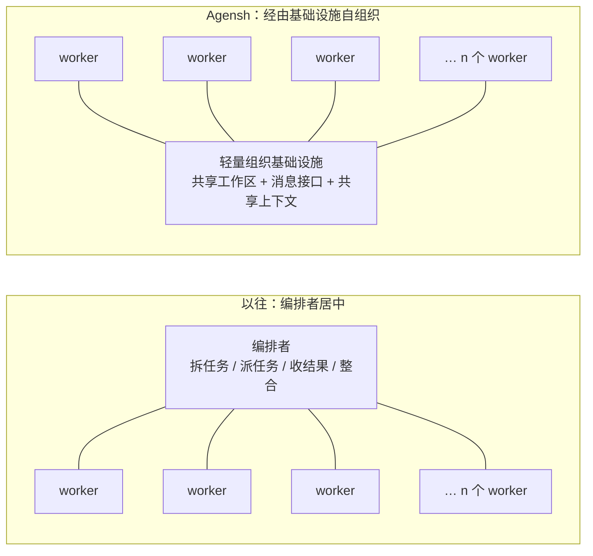
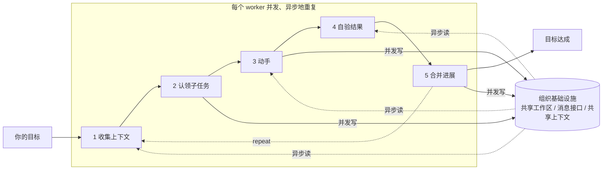
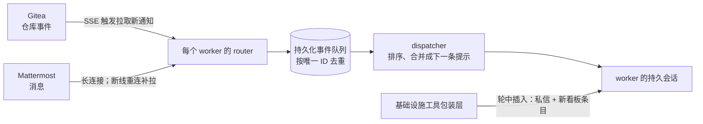

# Agensh：拿掉总调度，让 1,024 个 agent 靠共享基础设施自己组织起来

<!-- release-date: 2026-09-22 -->

> 本文依据 Microsoft Research 的 **Agensh: Scaling Organizational Intelligence to 1,024 Agents**，即 arXiv:2609.26781v1，2026-09-22 提交，共 13 页，封面标注为 Technical report（PDF p. 1）。作者 Zhihao Zhan、Ting Song（并列第一）、Li Dong、Shaohan Huang、Jianxun Lian、Yan Xia、Furu Wei，通讯作者为 Li Dong、Yan Xia、Furu Wei（PDF p. 1）。页码均指这份 PDF 的物理页码。全文把三件事分开标注：**报告明确写了什么**、**我们如何解释或验算它**、**哪些是外部资料补充**。

## 读前先把几个词说成人话

这篇论文没有模型、没有训练，也没有公式。它讲的是一套「让很多个 agent 一起干一件大活」的外壳，以及这套外壳能把人数推到多大。先把反复出现的词说清楚：

- **Agent（智能体）**：一个大模型加上一圈工具，能自己读环境、调工具、改状态，一轮一轮往目标推进。
- **Harness（外壳、驾驭层）**：包在模型外面的那层程序。它管对话状态、调模型、执行工具调用、决定下一轮喂什么。Claude Code、Codex、Copilot CLI 都是这种东西。
- **Worker（工人）**：多 agent 系统里真正干活的那一个 agent。本文里每个 worker 都是一个完整的单 agent 会话。
- **Orchestrator（编排者、总调度）**：在「编排者–工人」结构里，负责拆任务、派任务、收结果、做整合的那个主 agent。
- **自组织（self-organized）**：没有总调度，每个 worker 自己挑活、自己认领、自己合并，靠共享状态彼此避让与配合。
- **测试通过率（test-pass rate）**：ProgramBench 用隐藏测试去跑 agent 重建出的程序，通过的测试占比就是分数。
- **Organizational intelligence（组织智能）**：论文标题里的词。意思是把「多少个 agent 在协作」当成一个新的扩展维度，像模型参数量、推理时长一样可以往上加。

## 一句话先说清

现有的多 agent 外壳，基本都是一个主 agent 当编排者，把任务拆开发给一批并发的子 agent，再把结果收回来整合（PDF p. 2）。这样做的上限卡在编排者身上：它的上下文、它拆任务的能力、它整合结果的能力，决定了底下能挂多少工人（PDF p. 2）。

Agensh 的回答是 **把编排者整个拿掉**。每个 worker 跑同一个五步循环：看全局、认领子任务、动手、自验、合并；它们之间不靠上级，靠三件共享的「组织基础设施」来交换状态：一个 Git 共享工作区、一套消息接口、一块共享上下文看板（PDF p. 3–4）。

实验在 ProgramBench 最难的 5 道题上做，模型固定为 GPT-5.6-sol（high），单 agent 外壳固定为 Copilot，预算固定 6 小时（PDF p. 6）。结论有三条：

1. 从 1 个 agent 加到 128 个，5 道题平均最终通过率从 19.31% 升到 28.78%，绝对提高 9.47 个百分点，相对提高约 49%（PDF p. 6）。
2. 人越多，达到同一分数越早：pandoc 上 128 个 agent 在第 30 分钟就过了 30%，32 个与 8 个分别到第 60、90 分钟才过（PDF p. 6）。
3. 在 pandoc 上一路加到 1,024 个 agent，最终通过率从 33.89% 升到 55.06%（PDF p. 6）。

轨迹里还观察到：人数越多，worker 之间自发长出的合作形式越复杂，从两两协调接口，到多人联审，到标准化的合并流程，再到出现专职的「整合者」角色（PDF p. 7）。

读这篇要守住的边界：它证明的是「同一个模型、同一个预算下，加人能加分、能提速」，**没有** 和任何带编排者的外壳正面比过，没有报告 token 与费用，每个配置只给一个数、没有重复运行的方差。这些后面逐条讲。

## 主要矛盾：编排者自己成了瓶颈

单 agent 的限制很直白：一个上下文窗口、一条动作流、一条记忆流，只能串行往前走。任务一复杂，墙钟时间就长（PDF p. 2）。要突破，自然想到加 agent。

论文点名的现有做法是 Codex 子 agent、Claude Code 子 agent 与 agent teams、Copilot fleet、Kimi Agent Swarm（PDF p. 2）。它们的共同结构是编排者–工人：主 agent 规划、拆解、派发、管理。论文的判断有两层（PDF p. 2）：

- 这种结构通常需要一个 **训练过的** 编排者，才能拆得好。Kimi Agent Swarm 就是专门训练编排者的代表（见 Kimi-K2.5 一篇）。
- 即便编排者训练得好，整个系统的可扩展性仍然被「编排者能管多少人、能整合多少贡献」封顶。

相关工作一节把这个判断落到具体产品上（PDF p. 8）：Claude Code 的 agent teams 仍围绕一个固定的 lead 会话，由它创建其他 agent、管理共享任务；Codex 的子 agent 把结果路由回父 agent 汇总；Kimi Agent Swarm 训练编排者去拆解与调度，但本质上仍是编排者–工人的并行方案。

于是矛盾变成：

> 想让 agent 数量成为一个能一直往上加的维度，就不能让任何一个 agent 站在所有信息的汇合点上。那么没有上级之后，谁来拆任务、谁来防撞车、谁来整合？

Agensh 的答案是：拆任务、防撞车、整合，全部分摊给每个 worker 自己做；让这件事做得成的，是一层轻量的共享基础设施。

## 先看全景：从星形到总线

原文 Figure 2（PDF p. 2）把两种结构并排画出。下图按它重画，是结构示意，不是原图：

左边中心是一个会思考的 agent，它的上下文就是全体的瓶颈；右边中心只是一个 **不思考的共享存储与通信层**，原图里把它画成一个小方块。所有判断都发生在边缘的 worker 身上。

整套设计由两部分咬合（PDF p. 3）：

- **多 agent 合作循环**：每个 worker 跑的那一个循环，决定它怎样把自己的进展变成被验证过、被合进主线的贡献；
- **组织基础设施**：让已完成的工作、发现和消息在全组织里可见。

下面按这两部分讲，再讲它们怎样被装到现成的单 agent 外壳上。

## 核心设计一：每个 worker 跑同一个五步循环

### 旧问题：没有上级，谁来派活

编排者–工人结构里，「下一步做什么」是上级说了算。拿掉上级，每个 worker 就必须自己回答三个问题：还剩什么没做、我做哪块、做完怎么交。

### 新设计：五步循环，异步并发

原文 Figure 3（PDF p. 3）画的是这个循环以及每一步对基础设施的读写方向。下图按它重画：

读写箭头按原图逐一核对：收集上下文、动手、自验三步从基础设施读；认领、动手、合并三步往基础设施写（PDF p. 3，Figure 3）。

五步各自做什么（PDF p. 3）：

1. **收集上下文**：读共享的用户目标、当前状态、同伴进展与消息、已积累的发现，弄清做完了什么、还剩什么；也可以直接和环境交互，找下一个有用的点。
2. **认领子任务**：自己提出一个子任务，把范围作为一条 `CLAIM` 追加进共享上下文。两个 worker 的认领重叠或冲突时，鼓励它们用私信自行解决。
3. **动手**：在本地用工具解决自己认领的子任务。途中一旦确认了对别人有用的发现，就写进共享上下文。
4. **自验结果**：拿本地进展对照这个子任务的验收标准，不达标就改，直到达标。
5. **合并进展**：把贡献合进共享工作区，再发布一条更新，写明改了什么、背后的思路、验证证据。合并被冲突挡住时，先吸收最新的同伴进展、解冲突，再合一次。

合并之后回到第 1 步，基于新合入的工作和最新的同伴动态挑下一个子任务（PDF p. 4）。

### 工作机制：任务发现与分配变成每个人的副产品

这个循环里没有「分配」这一步。**每个 worker 自己提出并认领子任务，任务的发现与分配就在全组织范围内自组织地完成了**（PDF p. 4）。异步意味着谁也不用等谁跑完一圈（PDF p. 4）。

**我们如何解释它。** 这套循环和人类开源协作的节奏几乎一一对应：看 issue 与 PR、开 issue 认领、写代码、跑测试、提 PR 合主线、在频道里说一声。它的新意不在任何一步本身，而在于 **把整合的责任从中心挪到了每一次合并上**：第 5 步要求每个 worker 自己解冲突、自己带证据合入，主线因此不需要一个总整合者。代价是冲突与重复劳动不再被上级预先规避，只能事后靠认领、私信和合并冲突来发现。

### 可迁移启发

自己搭多 agent 流水线时，如果瓶颈在「主 agent 整合不过来」，可以先试着把整合拆进每个 worker 的收尾步骤：要求它带着验证证据合入、自己解冲突，而不是把结果交回上级。前提是有一个能检测冲突、能保留历史的共享工作区，下一节就是它。

## 核心设计二：三件组织基础设施

原文 Figure 4（PDF p. 4）把三件基础设施各自装什么列了出来，可以直接转写成表：

| 组件 | 原图列出的内容 | 在 Agensh 里用什么实现 | 投递时机 |
|---|---|---|---|
| 共享工作区 | 已完成的工作、进行中的工作、提议中的工作 | Git 平台，具体是自托管的 Gitea（PDF p. 5）| 按仓库事件通知 |
| 消息接口 | 同步进展、解决冲突、避免重复 | 聊天平台 Mattermost（PDF p. 5）：一个共享任务频道 + 一对一私信 | 频道消息在每轮循环开头；私信在每次基础设施工具调用结束时 |
| 共享上下文 | 观察、工作认领、失败尝试 | 思路取自 DeLM，改写了工具格式与 worker 指令（PDF p. 5）| 新条目在其他每个 worker 下一次基础设施工具调用返回时插入 |

### 共享工作区：用 Git 当组织的文件系统

论文对它的要求是：支持并发写、异步读；保留版本历史；支持合并，并把合并冲突暴露给 worker 去回退与解决（PDF p. 4）。Git 平台正好满足：每个 worker 在私有 checkout 与分支上改，再合进主分支；Git 记录每处改动的来源、检测文本级合并冲突，同时托管 issue 与 PR（PDF p. 4）。

**我们如何解释它。** Git 能检测的只是 **文本** 冲突。两个 worker 改了不同文件、但语义上互相打架，Git 不会拦。Agensh 把这一层交给第 4 步的自验与第 5 步合并后的复验（提示词要求合并被拒时先合最新 `main`、再对照参考程序重新检查，PDF p. 12），而不是交给基础设施。

### 消息接口：两档优先级

共享任务频道承载团队公告，私信承载紧急的一对一沟通（PDF p. 4）。两者的投递时机被刻意分开（PDF p. 4）：

- 频道消息优先级低，在每轮循环开头统一送达；
- 私信优先级高，在每一次基础设施工具调用结束时就送达，也就是 **打断对方当前这一轮**。

提示词把这条规则直接告诉 worker：两个人快要改同一处时发私信，其余一律走频道（PDF p. 11）。

### 共享上下文：带类型的短条目看板

这是三件里最有设计感的一件。worker 往看板上发简短、带类型的条目（PDF p. 4–5，提示词见 PDF p. 11）：

| 类型 | 含义 | 提示词里的用法 |
|---|---|---|
| `OBSERVED` | 观察到的参考程序行为 | 直接用 |
| `FACT` | 已确认的事实 | 直接用，不要重新推导 |
| `FAIL` | 被证伪的假设、失败的做法 | 提示词称它「价值最高」，因为能让同伴不再在上面花预算；正在做同一件事就立刻停 |
| `CLAIM` | 正在做的认领 | 撞上自己正在做的就私信解决，否则继续做自己的 |
| `PATCH_SUMMARY` | 完成的修改，格式 `files= \| idea= \| evidence=` | 合并后发布 |

条目有长度上限：普通条目 100 字符，`PATCH_SUMMARY` 300 字符，长版本放进 `detail` 字段，别人用 `board_unfold` 展开（PDF p. 11）。服务端是只追加的数据库，默认只给近期记忆；`board_read` 返回最近 2000 条，为了支撑更长的任务，另加了 `board_grep` 在完整历史里按关键词检索，支持 `,` 表示或、`&` 表示与（PDF p. 5、p. 11）。

**我们如何解释它。** 1,024 个 worker 同时往一块板上写，如果条目不设上限、不分类型，每个人的上下文很快就会被别人的流水账淹没。字符上限、类型标签、「最近 2000 条 + 全量 grep」这三个约束，是在给每个 worker 的上下文预算做 **组织级的压缩**。`FAIL` 被提示词单独拔高，是因为在一个没有上级的组织里，负面结果最容易被重复踩：没人记得谁已经试过那条死路。

### 可迁移启发

多 agent 共享记忆时，不要只给一个自由文本的「笔记区」。给条目分类型（尤其要有「失败」这一类），设长度上限，把全文放到二级展开，并提供按关键词回查全量历史的工具。这几条不依赖 Agensh，几乎可以原样搬进任何多 agent 流水线。

## 核心设计三：循环写在提示词里，外壳只管送事件

### 分层：组织外壳叠在单 agent 外壳上面

Agensh 不替换单 agent 外壳，而是叠在它上面（PDF p. 5）：

- **单 agent 外壳** 管本地的 agent 循环：维护对话状态、调模型、执行工具、产出下一步回复；
- **Agensh** 管组织层：worker 身份、合作协议、事件路由、可靠派发、共享工作区访问、消息、共享上下文，以及恢复与存活机制。

一句话：单 agent 外壳决定一个 worker 怎样思考与行动，Agensh 决定多少个 worker 接收事件、共享状态、互相协调（PDF p. 5）。

### 合作循环不硬编码

这是实现上最关键的一个选择：**五步循环是写在每个 worker 提示词里的工作流指令，不是写死在运行时里的**（PDF p. 5）。全部 worker 的提示词除了 worker ID 之外逐字相同，全文附在附录 A（PDF p. 5、p. 11–12）。因此换底层外壳只需要一层很薄的适配器，论文举的例子是 Claude Code 与 Copilot（PDF p. 5）。实验里实际用的是 Copilot（PDF p. 6、p. 13）。

附录 A 的提示词里，几处值得单独看（PDF p. 11–12）：

- **平等**：「1024 coders，all equal」，自己认领、自己构建、自己合并、自己挑下一件。
- **克制协调**：始终以复现参考程序为主，只有当你的信息能大幅影响别人时才动用协调工具。
- **完全自治**：不许在频道里问「下一步做什么」，答案永远是推进重建。违反铁律整道题作废。
- **工作循环** 被具体化为 6 步：跑参考程序找未探索区域 → 在看板上发 `CLAIM` → 在 `ulimit -v 67108864` 下对照参考行为写代码 → 用同样输入对比参考程序与自己的构建 → 推送、开 PR、合进 `main`（被拒就先合最新 `main` 再复验）→ 发 `PATCH_SUMMARY` 后回到第 1 步。

### 事件驱动的运行时

附录 B 讲清了事件是怎么送到 worker 手里的（PDF p. 12–13）：

- 每个 worker 配一个 router，监听 Gitea 的仓库活动与 Mattermost 的消息；新事件写进该 worker 的持久化队列并唤醒 dispatcher，每个事件带唯一 ID 用于去重（PDF p. 12）。
- dispatcher 把待处理事件排序、合并成下一条提示送进 worker 的持久会话，一轮结束才标记为已送达；轮中到达的事件留给下一轮。送达失败按逐渐拉长的间隔重试；router 重启后未完成的事件回到队列，尽量恢复该 worker 之前的会话（PDF p. 12）。
- 两个催促机制：worker 空闲 10 分钟，空闲检测器会发提示让它继续；一轮结束却没有写任何共享上下文条目，会追加一条提示提醒它发布发现（PDF p. 12）。
- 共享上下文有两条投递路径：新一轮开始时，router 把排队的工作区通知、新消息与近期看板一并拼进提示；轮中则由一个包在基础设施工具调用外面的包装层，把待送私信和新看板条目追加到工具返回值后面。这条路径只作用于 MCP 工具的返回，不会打断任意正在运行的进程（PDF p. 12–13）。

**我们如何解释它。** 「轮中插入」是整套设计里最省事也最聪明的一处：它不需要底层外壳支持任何中断机制，只要 worker 会调基础设施工具，新消息就搭着工具返回值进来。代价是一个 worker 如果长时间在跑自己的编译或测试、不碰基础设施工具，它就听不见私信。论文明确写了这条路径不打断任意进程（PDF p. 13），但没有测量由此造成的延迟。

### 可迁移启发

1. **协议进提示词，外壳只管搬运。** 把合作规则写成提示词，把运行时收窄成「可靠地送事件」，换模型、换外壳的成本最低。
2. **用工具返回值做带内信令。** 想让一个正在干活的 agent 及时收到高优先级消息，又不想改外壳，就把消息挂到它必然会调用的工具的返回值上。

## 实验怎么设：ProgramBench 最难的 5 道

### 任务

ProgramBench 要求 agent 在断网、6 小时预算下，从零重建一个参考程序的行为（PDF p. 6）。附录 A 的提示词把规则写得更具体（PDF p. 11–12）：参考程序以预编译二进制的形式挂在每个容器里，可以运行、喂输入、看输出，但权限是 `0111`，读不了字节，不许反编译；仓库根目录必须有能生成 `./executable` 的 `compile.sh`，没有就 0 分；评测时打包 HEAD、删掉提交进去的可执行文件、重新编译、跑隐藏测试。

从 ProgramBench 的 200 道题里，作者按官方扩展榜上前沿模型的平均通过率，挑出最难的 5 道（PDF p. 6、p. 13）。原文 Table 1（PDF p. 6）给出这 5 个参考仓库的规模：

| 任务 | 领域 | 提交 | 文件数 | 代码行数 | 代码体积 |
|---|---|---|---:|---:|---:|
| FFmpeg | 多媒体处理 | 360a402 | 10,090 | 1,549,005 | 75.51 MB |
| gromacs | 分子模拟 | 665ea4c | 8,982 | 815,539 | 47.30 MB |
| pandoc | 文档转换 | 5caad90 | 2,767 | 104,336 | 4.86 MB |
| PHP-src | 语言解释器 | c891263 | 26,266 | 2,812,757 | 119.76 MB |
| ctags | 代码索引 | 243595e | 7,313 | 246,228 | 9.15 MB |

领域一列取自正文（PDF p. 6）。pandoc 是 5 个里最小的，只有约 10 万行，这也是它被拿来冲 1,024 个 agent 的那一道。

### 配置

- 模型：所有配置都用 gpt-5.6-sol，推理强度 high（PDF p. 13）。
- 单 agent 外壳：Copilot，最大输入 272,000 token、最大输出 128,000 token（PDF p. 13）。
- 评测：按 ProgramBench 准备容器，总预算 6 小时，跑官方评测，报告 canonical-kept 通过率（PDF p. 13）。这个口径的定义 PDF 里没有展开。
- 错峰启动：为减少认领争抢，所有实验都错开拉起 agent，第一小时每 30 秒启动 1 个，之后每 3 秒启动 1 个（PDF p. 13）。
- 收尾：记第一个 agent 启动时刻为 $t$，在 $T = t + 6$ 小时全部终止并导出提交。$T$ 前 45 分钟发一次提醒「停止派发新功能，保证根目录能构建、已有工作已合并」，前 5 分钟再发一次「能合的合掉，然后停」（PDF p. 13）。
- 部署：1,024 个 worker 分布在 16 个节点上，每节点 64 个（PDF p. 13）。

**错峰启动的一个推论（我们验算的，原文没写）。** 按第一小时每 30 秒 1 个，第一小时约拉起 120 个 agent；之后每 3 秒 1 个。于是 128 个 agent 的配置大约在第 1 小时刚过就全员到齐，而 1,024 个的配置剩下约 900 个还要再花约 45 分钟，要到第 1 小时 45 分钟左右才全员上线。读下面「前 2 小时」的曲线时要记住：大组织在头一个小时里其实并不满员。

### 单 agent 基线

论文说单 agent 在实践中很少能自己撑满 6 小时，所以给它加了一个 stop hook，每当它想停下，就提示「总有新活……让 6 小时用满」（PDF p. 13）。对应地，多 agent 组织用的是前面那个 10 分钟空闲检测器，提示语几乎一样，只是把「上一份计划的范围」换成「之前各个 CLAIM 的范围」（PDF p. 13）。

**我们如何解释它。** 这一点对读数很要紧：基线不是「一个 agent 自然跑完就停」，而是被强行续命到 6 小时的单 agent。它排除了「多 agent 只是因为跑得更久」这个最简单的解释，让比较集中在「并发的人数」上。

## 结果一：加人，最终分数上去了

原文 Figure 5（PDF p. 5）是 6 张小图，每个点都标了数值，转写成表如下。条件都是同一模型、同一外壳、6 小时预算（PDF p. 6）。

| 任务 | 1 个 | 8 个 | 32 个 | 128 个 |
|---|---:|---:|---:|---:|
| **5 题平均** | 19.31 | 20.68 | 26.52 | 28.78 |
| FFmpeg | 6.54 | 11.97 | 13.22 | 12.89 |
| gromacs | 19.69 | 19.37 | 19.37 | 22.12 |
| pandoc | 33.89 | 41.75 | 43.11 | 50.94 |
| PHP-src | 10.63 | 11.86 | 12.23 | 12.35 |
| ctags | 25.82 | 18.47 | 44.69 | 45.62 |

单位是最终测试通过率（%），全部数字读自 Figure 5（PDF p. 5）；平均行的 4 个数正文也给了（PDF p. 6）。我们用各题数值重算了平均，四列与原文一致。

论文的读法：1 到 128 个 agent，平均提高 9.47 个百分点，相对约 49%；5 道题上最终分数「总体呈上升趋势」，说明持续加人能稳定而显著地提升长时程复杂软件复现的质量（PDF p. 6）。

**我们如何解释它。** 「总体上升」是对的，但逐行看并不单调，这一点原文用「generally」一带而过：

- **ctags 在 8 个 agent 时反而从 25.82 掉到 18.47**，到 32 个才跳到 44.69。
- **FFmpeg 在 128 个时比 32 个略低**（12.89 对 13.22）。
- **gromacs 从 1 到 32 个基本不动**（19.69、19.37、19.37），到 128 个才上到 22.12。
- **PHP-src 始终在 10.63–12.35 之间**，1 到 128 个只涨了 1.72 个百分点。

平均值的大头来自 pandoc 与 ctags 两道。每个配置只有一次运行、没有误差条，所以 8 个 agent 在 ctags 上的下跌是真实效应还是单次波动，从论文里判断不了。

## 结果二：加人，达到同一分数更早

图为原文 Figure 6（PDF p. 7），是 6 小时运行的前 2 小时，每 30 分钟一个检查点。

论文的读法：前 2 小时里，大组织普遍更早达到可比的通过率（PDF p. 6）。它举的 pandoc 例子是图上读不到精确数值、只能靠正文的那一句：128 个 agent 在第 30 分钟就超过 30%，32 个与 8 个分别在第 60 与第 90 分钟才首次超过，单 agent 在前 2 小时里始终没过 30%（PDF p. 6）。结论是：加人除了抬高最终分数，还能缩短达到某个分数所需的时间（PDF p. 6）。

图上读不出、需要补的几点判断：

- **提速并不是每道题都成立。** gromacs 上 128 个 agent 在第 30 分钟是四条线里最低的，ctags 上第 30 分钟领先的是 32 个而不是 128 个。结合上面的错峰启动推论，头 30 分钟里 128 个的配置实际只拉起了约 60 个 agent，早期曲线里混着「人还没到齐」的效应。
- **一个原文没有解释的不一致。** 按图读数（Figure 6，PDF p. 7），PHP-src 上 128 个 agent 在第 120 分钟约为 28.5%，但 Figure 5 给出的 6 小时最终值是 12.35%（PDF p. 5）；平均图上 128 个在第 120 分钟约为 30.4%，也高于最终的 28.78%。其余 4 道题上 128 个的第 120 分钟读数都不高于各自终值，平均图的落差完全来自 PHP-src。如果两张图是同一口径，那说明 PHP-src 这次运行在后 4 小时里分数掉了一半多。可能的原因包括后续合并引入回归、收尾阶段构建被破坏，或两张图的评测口径不同，但 **论文对此一句都没有写**，我们也无从判断是哪一种。这是本文读图得出的观察，不是原文主张。

## 结果三：pandoc 一路加到 1,024 个

原文 Figure 1（PDF p. 1）只在 pandoc 上做，横轴是 log2 刻度的 agent 数，右侧把每一档规模和轨迹里观察到的合作形式连在一起。转写如下：

| agent 数 | pandoc 最终通过率（%）| 该规模首次观察到的合作形式 |
|---:|---:|---|
| 1 | 33.89 | — |
| 8 | 41.75 | 同伴协调（peer coordination）|
| 32 | 43.11 | 多人整合（multi-worker integration）|
| 128 | 50.94 | 标准化工作流（standardized workflows）|
| 1,024 | 55.06 | 专职角色（specialized roles）|

数值与连线读自 Figure 1（PDF p. 1），128 个与 1,024 个两档正文也给了（PDF p. 6）。1,024 个比 128 个高 4.12 个百分点，比单 agent 高 21.17 个百分点（PDF p. 6）。

**我们如何解释它。** 从 128 到 1,024，人数翻了 8 倍，分数加了约 4 个点；前面从 1 到 8，人数也是翻 8 倍，分数加了约 8 个点。在 log 刻度上这条曲线大致是一条缓坡直线，原图也画了一条浅色的趋势虚线。它支持「还没饱和」，但单看一道题、每档一次运行，不足以外推出一条扩展律。256 与 512 两档没有测，1,024 也只测了 pandoc 这一道。

## 自组织的合作是怎么长出来的

论文第 3.2 节不给数字，只给轨迹里的具体案例（PDF p. 6–8）。所有 worker 跑同一个循环、拿同一份提示词，但随着规模变大，新的合作形式陆续出现（PDF p. 6）。

| 规模 | 论文给的标题 | 轨迹案例 |
|---|---|---|
| 8 个 | 与同伴协调实现 | gromacs 里，worker 先公布一个模块接口，其他人各自按接口实现命令模块；FFmpeg 里，一个 worker 与同伴讨论重叠后改了范围，转做互补的活（PDF p. 7）|
| 32 个 | 跨多人管理整合 | PHP-src 里，几个同伴先批准了一个贡献，另一个 worker 找到具体反例，批准被撤回，作者修好，同伴复审，再由一名同伴合入；参与沟通的人也更多了（PDF p. 7）|
| 128 个 | 自组织的专长分化与流程标准化 | worker 按过往经验挑审阅人，并长期复用这种审阅关系；可以把整合责任转给一个同伴，由他解冲突、验证、合入。pandoc 里两个 worker 定下一套整合协议：作者更新并测试分支，把提交哈希发给同伴验证与合入，后来被其他人沿用；失败几次后又改版，授权同伴包办更新、测试、检查、合入的全流程，新 PR 照此执行（PDF p. 7）|
| 1,024 个 | 组织规模的角色专长 | pandoc 里，多个 worker 担任整合者；一个 worker 可以同时联系几位候选整合者，选第一个有效回应的，取消其他请求，选定后才把代码交出去；同一技术领域的专长者可以在别人失败后接手，组织因此不依赖任何单个 worker（PDF p. 7）|

论文的总结是：合作从协调实现、到管理整合、到标准化流程、再到组织规模的专职角色，范围越来越广；而且这些全部是自组织的，由 worker 自己选合作者、分责任、定并修改流程（PDF p. 7–8）。

**我们如何解释它。** 这一节有两处要分开看：

- **被实验支持的**：每个案例都是真实轨迹里发生过的事，论文给了发生在哪道题、哪个规模。
- **只是作者观察的**：「某个规模首次出现某种合作形式」是按案例归纳的分档，没有统计（例如各规模下私信数量、审阅关系复用率、整合者人数），也没有把合作形式与分数建立因果关系。Figure 1 右侧的连线是叙事性的对应，不是测量。

还有一处值得注意：提示词里并没有「审阅」「整合者」这类角色，只说「全员平等」「自己合并」（PDF p. 11）。多个整合者的出现，恰好说明在上千人并发往同一个 `main` 合并时，**合并本身成了稀缺资源**，worker 自发把它变成了一个专职岗位。拿掉了编排者，组织又从下往上长出了一种局部的「整合中心」，只是它有很多个、可以互相替补。

## 放在相关工作里看

论文把自己放在两条线的交汇处（PDF p. 8）：

- **多 agent 组织与协作外壳**：Claude Code 的持久子 agent 与异步 agent teams、Codex 的子 agent 工作流、Kimi Agent Swarm。共同点是有一个固定的中心。Agensh 研究的是让 worker 共同承担发现任务、协调依赖、整合结果的组织结构。
- **共享上下文与去中心化协调**：DeLM 把异步 worker、任务队列与共享上下文组合起来，让 agent 不必经过中心控制器就能在累积进展上继续做，Agensh 的共享上下文思路就取自它；ChatCollab 把人与 AI 放进 Slack 当平级同伴；SlackAgents 把 agent 嵌进 Slack 工作区；Carlini 的 C 编译器实验用一个 Git 仓库加任务锁文件协调 16 个 Claude agent，由 worker 自选任务、自行合并，没有编排 agent；STORM 把多 agent 编码重述为状态管理问题，用共享工作区在写入时检测过期或冲突的编辑。

**我们如何解释它。** 和 Carlini 那个 16 个 agent 的实验相比，Agensh 的增量主要在三处：把 Git 之外的两条通道（分优先级的消息、带类型的看板）做成标配；把事件投递做成可恢复、可去重的运行时；把人数推到 1,024。和同期的 Self-Organizing-Agent-Teams 一篇也要分清：那篇是 **训练** 一支固定队伍学会一起推理，这篇完全不训练，只改外壳与提示词。

## 限制、边界，以及原文没给的东西

- **没有和编排者–工人方案正面比较。** 论文的核心论点是编排者限制可扩展性，但实验里唯一的对照是单 agent。Claude Code agent teams、Codex 子 agent、Copilot fleet 都没有作为基线出现在同一任务上。
- **没有消融。** 三件基础设施各自贡献多少、去掉共享上下文或私信会怎样、错峰启动与收尾提醒的作用，都没有实验。
- **没有成本。** 没有 token 用量、费用、算力或每个 agent 的调用次数。1,024 个 agent 跑 6 小时的开销，和单 agent 相差多少倍，论文没给。
- **每个配置一次运行。** 所有数字都没有重复实验与方差；ctags 在 8 个 agent 时的下跌、FFmpeg 在 128 个时的回落，无法区分是规律还是噪声。
- **1,024 只在一道题上。** 其余 4 道最多到 128；256 与 512 没有测。
- **最终分与前 2 小时曲线的落差没有解释**，见结果二。
- **自组织行为是案例，不是统计。** 没有按规模量化的协作指标。
- **评测口径细节缺失。** canonical-kept 通过率的定义、ProgramBench 隐藏测试的规模，都要去 ProgramBench 原文找，本 PDF 没写。
- **只测了一种任务。** 所有实验都是「从二进制黑盒重建程序」，这种任务天然可以按功能区切块、每块有明确的对照验收（跑参考程序比输出）。在验收标准不清楚的任务上，第 4 步的自验是否还站得住，论文没有讨论。

## 可迁移启发

1. **先问瓶颈在哪个节点，再决定加不加编排者。** 如果多 agent 系统的上限卡在主 agent 的上下文与整合能力，那加更多工人只会更堵。把整合下放给每个 worker、让中心退化成不思考的共享存储，是这篇给出的第一条可复用路线。
2. **共享状态要分通道、分优先级。** 慢而广的（频道、看板近期条目）在轮开头批量给；快而窄的（私信、新看板条目）挂在工具返回值上轮中插入。不同紧急程度的信息走不同时机，是控制上下文污染的关键。
3. **负面结果要有专门的位置。** `FAIL` 条目加上「不要重试已记录为 FAIL 的做法」这条纪律，是去中心化组织里防止重复踩坑的最低成本手段。
4. **协议写进提示词，运行时只管可靠投递。** 事件去重、持久队列、失败重试、会话恢复、空闲唤醒，这些是工程上必须做对的；合作规则本身留给提示词，换外壳和迭代规则都便宜。
5. **大规模并发要错峰上线、定时收口。** 一次性拉起上千个 agent 会在认领阶段严重撞车；收尾前 45 分钟冻结新功能、前 5 分钟只合并，是任何有硬截止的多 agent 任务都可以照搬的节奏。
6. **读「加人就涨分」时，先看对照是谁。** 这篇证明了「多个同质 worker 优于一个被续命的单 worker」，还没有证明「自组织优于有编排者」。自己做选型时，后一个问题仍需要自己的实验回答。

## 关键词回看

- **编排者–工人结构**：主 agent 拆派收整，工人并发执行。本文认为它的扩展性被编排者封顶。
- **多 agent 合作循环**：收集上下文、认领子任务、动手、自验、合并，五步，每个 worker 异步并发地重复。
- **组织基础设施**：共享工作区（Gitea）、消息接口（Mattermost，频道 + 私信）、共享上下文（DeLM 式看板）。
- **共享上下文条目**：`OBSERVED`、`FACT`、`FAIL`、`CLAIM`、`PATCH_SUMMARY`，带长度上限，可 grep 全量历史。
- **轮中插入**：私信与新看板条目挂在基础设施工具的返回值上送达，不打断任意进程。
- **错峰启动与收尾提醒**：第一小时每 30 秒 1 个、之后每 3 秒 1 个；$T$ 前 45 分钟与前 5 分钟两次提醒。
- **19.31% → 28.78%**：5 道最难 ProgramBench 题上 1 个到 128 个 agent 的平均最终通过率。
- **33.89% → 55.06%**：pandoc 上 1 个到 1,024 个 agent 的最终通过率。
- **自组织合作的四档**：同伴协调、多人整合、标准化工作流、专职角色，依次在 8、32、128、1,024 个 agent 的轨迹里出现。

## 资料与阅读边界

### 本文依据的版本与首发日

- 本地原件：`papers/Microsoft/Agensh.pdf`，13 页，页边标注 `arXiv:2609.26781v1 [cs.CL] 22 Sep 2026`（PDF p. 1）。
- 官方页 [arXiv:2609.26781](https://arxiv.org/abs/2609.26781) 截至 2026-09-27 只有 v1，提交于 2026-09-22 17:56:25 UTC，与本地原件一致。
- `release-date` 取 **2026-09-22**，即 arXiv v1 提交日。这是一篇外壳与方法论文，没有模型对外可用事件；论文列出的项目页 `aka.ms/Agensh` 与代码仓库 `github.com/microsoft/Agensh`（PDF p. 1）在核验时均未能访问，未能核实是否存在早于 arXiv 的官方公开事件。

### 报告明确写了、本文覆盖了的部分

摘要与 Figure 1；第 1 节引言与 Figure 2；第 2.1 节合作循环与 Figure 3；第 2.2 节三件基础设施与 Figure 4；第 2.3 节实现与分层；第 3 节任务选择与 Table 1；第 3.1 节主结果、Figure 5 与 Figure 6；第 3.2 节四档自组织合作；第 4 节相关工作；第 5 节结论；附录 A 完整 worker 提示词；附录 B 事件驱动运行时与共享上下文投递；附录 C 任务选择、agent 配置、评测、错峰启动、收尾提醒、1,024 部署与单 agent 基线。

### 外部资料补充（不是 PDF 原文）

- Kimi Agent Swarm 的训练式编排者见 Kimi-K2.5 一篇；训练一支固定 agent 队伍协作推理的对照工作见 Self-Organizing-Agent-Teams 一篇。两篇都是本站既有解读，只用于定位，不改变本文对 Agensh 原文的转述。
- DeLM（arXiv:2606.10662）、ProgramBench（arXiv:2605.03546）、STORM（arXiv:2605.20563）、Carlini 的 C 编译器实验等，本文只按 PDF 相关工作一节的描述转述，没有展开原文。

### 原文没有公开、本文也不补的缺口

- 与任何编排者–工人外壳的同任务对照；
- 三件基础设施与各项运行时机制的消融；
- token 用量、费用、节点硬件与每次运行的真实墙钟开销；
- 每个配置的重复次数与方差；
- canonical-kept 通过率的定义与隐藏测试规模；
- PHP-src 与平均分在第 2 小时与第 6 小时之间下降的原因；
- 自组织合作形式的定量统计；
- GPT-5.6-sol 这一模型的公开资料，本文未能核实，只按论文原样记录名称与推理强度；
- 代码仓库的实际内容与许可，本文未能访问。
