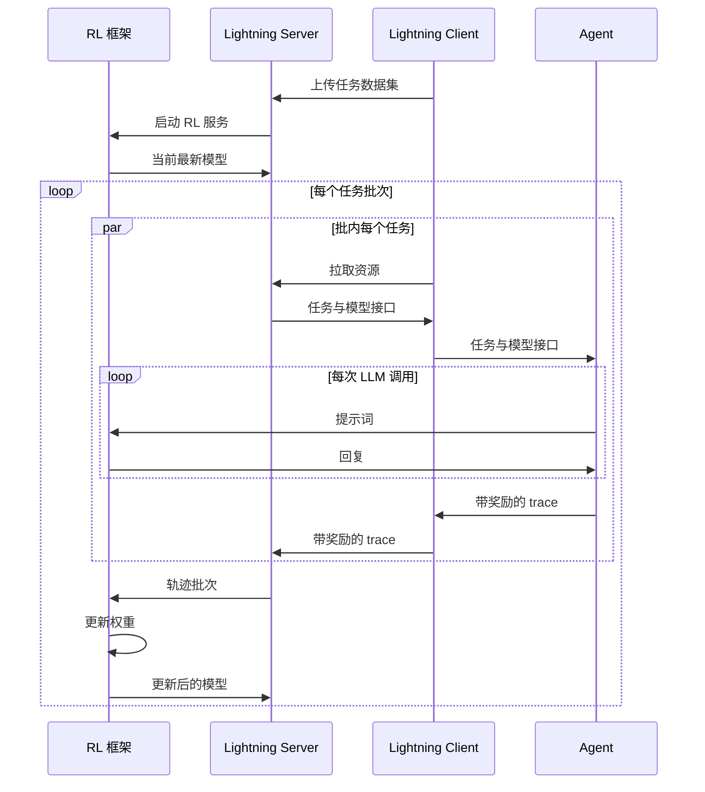

# Agent Lightning：训练器不必看懂 Agent，把每次调用拆成 MDP 转移就够了

<!-- release-date: 2025-06-06 -->

> 本文依据 **Agent Lightning: Train ANY AI Agents with Reinforcement Learning**，arXiv:2508.03680v1，2025-08-05 提交，共 20 页（正文 p. 1–15，参考文献 p. 16–18，附录 A–B p. 19–20）。八位作者全部署名 Microsoft Research，Xufang Luo、Yuge Zhang、Zhiyuan He 并列第一作者（PDF p. 1）。页码均指这份 PDF 自身的页码。文中区分三件事：**论文明确写了什么**、**我们怎么解释它**、**哪些是外部资料**。

## 读前先把几个词说成人话

这是一篇方法加系统的论文，没有模型架构和预训练 recipe。它讲的是：一个已经用某个框架写好的 Agent，怎样几乎不改代码就接到强化学习（Reinforcement Learning，RL）训练器上。

- **rollout（采样执行）与 trajectory（轨迹）**：让当前模型把任务跑一遍，叫一次 rollout；跑出来、拿去训练的那部分记录叫轨迹。论文特意区分了两个词：execution 指一次 Agent 运行收集到的全部数据，trajectory / episode 指从中抽出、真正用于训练的部分（PDF p. 4 脚注）。
- **reward（奖励）与优势**：给一次执行打一个分；优势是「这次比平均好多少」，决定梯度往哪推。
- **GRPO（Group Relative Policy Optimization，组相对策略优化）**：对同一道题采一组回答，用组内均值和标准差归一化奖励当优势，不需要单独训练一个价值网络（critic）。机制见 DeepSeekMath 一篇。
- **Agent**：论文的定义很宽：凡是执行过程中包含一次或多次大模型调用的软件系统都算（PDF p. 3）。一次执行里可能有好几次大模型调用，每次提示词都不一样，中间还夹着检索、执行 SQL、按计算器这类不是模型吐出来的内容。
- **MDP 与 POMDP**：马尔可夫决策过程（Markov Decision Process）把决策写成「状态 → 动作 → 奖励 → 新状态」；部分可观察马尔可夫决策过程（Partially Observable MDP）多一层：决策者只看得到状态的一部分。
- **transition（转移）**：「这一步看到了什么、做了什么、得了多少分」的一条记录。
- **loss mask（损失掩码）**：训练一条长序列时标出哪些 token 参与梯度、哪些只当上下文。

## 一句话先说清

今天能干活的 Agent 是用 LangChain、OpenAI Agents SDK、AutoGen 写出来的软件，不是 RL 框架里的一个 `env.step()`。可现有的大模型 RL 工具要么让你在训练系统里把 Agent 重写一遍，要么把整段多轮执行拼成一条超长序列、再靠掩码假装它还是单轮（PDF p. 2、p. 13–14）。两条路的前提相同：**训练器必须看懂 Agent 是怎么跑的**。

Agent Lightning 的回答建立在一个建模选择上：不去解析 Agent 的整张执行图，只把**每一次大模型调用**看成 MDP 里的一步动作。状态是执行快照，动作是这次调用吐出的整段文本，奖励挂在这次调用上（PDF p. 2、p. 6–7）。于是训练器看到的不再是「LangChain 怎么编排」，而是一串标准的「输入、输出、奖励」转移。

围绕这个选择，论文给了三件东西（PDF p. 2–3）：

1. **统一数据接口**：把任意 Agent 的执行记成调用序列，再抽出策略模型的转移；
2. **LightningRL**：一个两层的 RL 方法，先把整段回报分到每次调用上，再交给现成的单轮 RL 算法；
3. **Training-Agent Disaggregation（训练–Agent 分离）架构**：Lightning Server 管训练、对外暴露一个类 OpenAI 的模型接口，Lightning Client 当 Agent 运行时，顺手把可观测性框架接进数据采集。

实验不是一张分数表，而是三条奖励曲线：LangChain 写的 text-to-SQL、OpenAI Agents SDK 写的检索问答、AutoGen 写的计算器数学题，基座都是 Llama-3.2-3B-Instruct。论文的结论是「稳定、持续的提升」（PDF p. 11–14），正文没有写出任何一个测试集精确分数。

### 一条阅读路线

1. **p. 6 Figure 2**：一个检索问答 Agent 的执行怎样变成两条训练转移。
2. **p. 7 的 MDP 条目**：动作是一整次调用，不是一个 token。
3. **p. 8 Figure 3 与 p. 9 的三条优点**：拼接加掩码与按转移组织的差别。
4. **p. 9–10 Figure 4 与 §3.4**：Server、Client 各管什么。
5. **p. 11–14 §4**：三条曲线，以及它们没有证明什么。
6. **p. 19 附录 A**：「几乎零改动」实际要写多少代码。

## 主要矛盾：训练器必须看懂 Agent

### 两条旧路

论文在 §5.1 把现状分成两类（PDF p. 13–14）。

**拼接加掩码。** RAGEN、Trinity-RFT、rLLM、Search-R1 这些多轮 RL 工作，把一次执行里的所有轮次拼成一条长序列，再给这条序列设计掩码，让工具输出、环境反馈这些非策略 token 不参与更新（PDF p. 13–14）。

**在训练系统里重建 Agent。** verl、OpenRLHF、TRL、ROLL、AReaL 这些大规模 RL 系统主要为单轮设计；它们对 Agent 的扩展（论文点名了 SkyRL-v0 与 verl 的 agent loop 文档）通常要求开发者在训练系统内部把 Agent 重写一遍（PDF p. 14）。论文给的原因是：训练侧必须知道执行逻辑，才能决定拼接顺序和掩码打在哪。迁移费力、容易错，还要求开发者熟悉 Ray 这类分布式框架；Agent 依赖的 MCP 服务、外部工具和 API 塞进训练框架，维护也更重（PDF p. 14–15）。

### 拼接加掩码会在四个地方出错

论文的反对意见集中在 p. 9 与 p. 14，按因果链整理成四条：

1. **只能覆盖简单、顺序的工作流。** 真实 Agent 的编排常常既不固定也不确定：模型可能自己决定下一步调哪个工具、要不要改写查询、要不要直接作答（PDF p. 4）。多 Agent、动态分支、协议交换都不像「用户、助手、用户、助手」那样能预先排好拼接顺序（PDF p. 14）。
2. **上下文会越积越长。** 多轮对话、工具输出、MCP 报文、多 Agent 通信都往同一条序列上堆，超过模型输入上限，或者把训练服务的算力和显存打满（PDF p. 14）。
3. **掩码破坏位置连续性，也和应用绑死。** 旋转位置编码（Rotary Positional Embeddings，RoPE）默认 token 位置连续，掩码把中间一段挖掉再训练，打破了这个假设；掩码要同时打在输入、损失和注意力上，往往与具体应用绑定、不能泛化，校验、调试和 kernel 设计都更难，掩码一复杂效率也掉（PDF p. 9、p. 14）。
4. **信用分配被锁死在「整段共用一个奖励」上。** 拼接之后很难再对其中某一次调用单独给分、单独决定要不要更新（PDF p. 14）。

## 先看全景：两个组件，一个模型接口

图引自原文 Figure 4（PDF p. 9）。这张图就是论文要拆开的两类计算（PDF p. 10）：

- **重、但形态单一**：大模型生成，由 RL 框架管，对 Agent 露出一个类 OpenAI 的接口；
- **轻、但花样多**：应用逻辑和工具，用普通编程语言写成，不必和 GPU 放在一起，可以独立部署。

论文把这个互不干涉总结成两句：训练框架对 Agent 无感（agent-agnostic），Agent 对训练器无感（trainer-agnostic）（PDF p. 10）。附录 B 的时序图把一次训练走完了：

这张图根据原文附录 B 的 Figure 8（PDF p. 20）重画，是请求顺序的机制示意，不表示耗时。要注意内层循环：Agent 的每一次大模型调用直接打到 RL 框架的推理引擎上，整段跑完之后，带奖励的 trace 才经 Client 回到 Server，攒够一批再去更新权重。

论文把设计拆成两层，后面按这个顺序讲：**数据层**（§3.1–3.3，任意执行怎样变成训练器吃得下的转移）是真正的设计判断；**系统层**（§3.4，训练器怎样既不管 Agent 逻辑、又把新模型送到 Agent 手里）是把这个判断做成一个能跑的服务。

## 核心设计一：统一数据接口——一次执行里真正要记的只有调用

### 旧问题：要训练，就得先解析执行图吗

论文先借用编译器和 TensorFlow 的说法：软件执行可以表示成有向无环图，节点是组件调用，边是依赖或控制流（PDF p. 4）。Agent 的组件只有两类（PDF p. 3–4）：大模型，每次生成是无状态的「提示词 → 回复」，一个 Agent 可以挂多个模型，各有接口地址和参数 $\theta_i$；工具，查库、执行代码、调 API，可有状态也可无状态，近来常走 MCP 这类协议。

照理说，要从杂乱的执行记录里把这张图完整解析出来，才能学习。论文的判断是：这件事**对训练并不必要**，借用 MDP 的概念，只要认出当前状态和推动状态变化的调用就够了（PDF p. 4）。

### 新设计：状态是快照，调用是改快照的动作

图引自原文 Figure 2（PDF p. 6）。三个定义把这张图写成了符号：

**状态。** 执行快照，包括程序计数器、变量、调用栈、资源上下文，抽象成一组随时间演化的变量。同一道题 $x$ 可以跑多次，第 $k$ 次执行、第 $t$ 步的状态是（PDF p. 5，式 1）：

$$
\operatorname{state}_t(x,k)=\bigl\{\operatorname{variable}_i^{x,k,t}\bigr\}_{i=1}^{V}
$$

不是所有变量都值得记。循环计数器加一、中间字符串拼接对优化不重要；要盯的是被组件读写、带关键语义的那些，论文称作 **Semantic Variable（语义变量）**，概念借自微软的推理服务系统 Parrot（PDF p. 5）。图里的四个格子 UserInput、Query、Passages、Answer 就是语义变量，绿色表示已经有值。

**调用。** 语义变量的变化来自组件调用。第 $k$ 次执行由 $N$ 次调用组成，每次调用是（PDF p. 5，式 2–3）：

$$
\operatorname{call}_i^{x,k}=(\operatorname{meta}_i^{x,k},\ \operatorname{input}_i^{x,k},\ \operatorname{output}_i^{x,k})
$$

输出就是被调组件 $C_i$（某个模型或某个工具）吃掉输入后的结果。`meta` 记名字、类型、版本、接口地址，以及采样策略、温度这类运行参数（PDF p. 5）。一次调用不必看见状态的全部：图里的状态有四个变量，但模型第一次写检索词时只看得见用户问题，搜索工具只吃生成出来的那条查询（PDF p. 5）。

**奖励。** 每次调用可以附一个标量奖励 $r_i$（PDF p. 5，式 5）。中途奖励比如工具调没调成功、子任务完没完成；最终奖励 $r_N$ 评估整件事。现实里常常只有最终奖励，那是这个通式的特例：前面的奖励缺席，全靠最后一个数（PDF p. 5）。

### 工作机制：抽取

执行完成后，统一接口记下的是完整的调用序列，包括工具调用造成的状态变化；再做一次抽取，只有策略模型的调用进入 RL 轨迹。图里的检索那一次被留在执行日志里，训练器最终吃到两条转移：「UserInput → Query」和「UserInput 加 Passages → Answer」（PDF p. 6–7）。

### 收益、代价与边界

**收益。** 训练器不必知道检索词怎么拼出来的、段落是哪个库返回的、提示词模板长什么样。论文的原话是，这种抽取省掉了对高度动态的 Agent 运行记录做繁琐且不平凡的解析，让对任意 Agent 做 RL 成为可能（PDF p. 7）。由于非模型组件的状态变化也记了，接口在原理上还能支持只优化多 Agent 系统里的某几个角色，以及提示词优化这类非微调方法；但这篇论文的实验只做模型微调（PDF p. 6）。

**代价。** 训练器看不到这一步在整段对话里的位置。位置和历史若仍重要，必须由 Agent 自己写进这一次调用的输入：做摘要，或用模板把历史装配进当前提示词。论文把这写成优点（灵活构造观测，PDF p. 9），但它同时是一次责任转移：上下文怎么压缩、怎么选，现在归 Agent 运行时管，不归训练器。

### 可迁移启发

日志记得全，不等于训练样本就该那么全。观测系统尽可以按执行图记，优化器只应订阅「会改变被优化对象行为」的那些边。Agent Lightning 把订阅面收窄成「策略模型的每一次调用」。

## 核心设计二：把 Agent 写成 MDP——一次调用就是一步动作

### 单模型时是 POMDP

先看最简单的情况：只优化一个大模型。把它当策略，决策过程写成 POMDP（PDF p. 6–7）。元组写的是 $\mathcal{M}=(\mathcal{S},\mathcal{O},\mathcal{A},\mathcal{P},\mathcal{R})$，紧接着的条目里转移却写成 $\mathcal{T}(s'|s,a)$，论文没解释这处记号不一致（PDF p. 6–7）。按条目读：

| 符号 | 含义 | 在 Agent 里对应什么 |
|---|---|---|
| $\mathcal{S}$ | 状态空间 | 执行快照 $\operatorname{state}_t$ |
| $\mathcal{O}$ | 观测空间 | 策略模型这一次真正看见的输入 $\operatorname{input}_t$ |
| $\mathcal{A}$ | 动作空间 | 一次调用吐出的整段 token 序列，不是单个 token |
| $\mathcal{T}$ | 转移 | 通常未知；工具、环境、其他 Agent 都可能改状态 |
| $\mathcal{R}$ | 奖励 | 标量 $r_t=\mathcal{R}(s_t,a_t)$ |

与单轮 RL 最不同的一点：**动作的粒度是一次调用**。模型内部仍逐 token 生成，但 MDP 把 $(y_{t,1},\ldots,y_{t,N_t})$ 整包当成一个 $a_t$；执行完 $a_t$，Agent 进入 $\operatorname{state}_{t+1}$。回报是逐步奖励之和 $R=\sum_{t=1}^{T} r_t$，策略要最大化它（PDF p. 7）。

从执行里只抽策略模型的输入、输出和奖励（PDF p. 7，式 6–7）：

$$
\operatorname{execution}^{RL}(x,k)=\bigl\{(\operatorname{input}_t^{x,k},\ \operatorname{output}_t^{x,k},\ r_t^{x,k})\bigr\}_{t=1}^{T},\qquad \operatorname{output}_t^{x,k}=\pi_\theta(\operatorname{input}_t^{x,k})
$$

模型调用本身无状态。输入里可以塞角色指令、对话历史、检索段落、模板渲染后的结构化提示词；这些「输入是怎么来的」对训练器不可见（PDF p. 7）。这就是解耦在算法侧的落点。

### 一个模型多个角色，和多个模型，不是一回事

同一套公式直接适用于「一个模型、多个角色」。检索问答的例子里，第一次调用让模型专心写检索词，第二次让它专心作答，一个模型在一次执行里扮演了两个 Agent。只想优化其中几个角色，组转移时把其余角色的转移拿掉即可，论文说这比在拼接序列上改掩码直观得多（PDF p. 7）。后面 text-to-SQL 实验就这么做：三个角色只训两个。

多个**参数不同**的模型一起训，论文只给了方向（PDF p. 7）：朴素做法是每个模型单独当一个 MDP 分开优化，但会忽略策略之间的依赖；更原则的做法是多智能体强化学习（Multi-Agent Reinforcement Learning，MARL）或博弈论。这篇论文没有实现。

## 核心设计三：LightningRL——层次只做一件事，把回合回报派到每次调用上

### 单轮 RL 本来在优化什么

先看单轮设定（PDF p. 8，式 8）：给定题目 $x$，模型逐 token 生成整段回复 $(y_1,\ldots,y_N)$，结束后给一个标量奖励。简化后的 token 级损失是：

$$
\mathcal{L}(\theta)=-\mathbb{E}_{x\sim\mathcal{X},\ \operatorname{output}\sim\pi_\theta(\cdot|x)}\Biggl[\sum_{j=1}^{N}\log\pi_\theta(y_j\mid x,y_{<j})\cdot A_j\Biggr]
$$

$A_j$ 是第 $j$ 个 token 的优势。脚注写明：重要性比、裁剪、KL 项在式子里省略了，最终算法里按需加回（PDF p. 8）。各算法的差别主要在 $A_j$ 怎么估：PPO 学一个 critic；GRPO 用同题一组回复的均值和标准差归一化；REINFORCE++ 用整个训练批的平均奖励当基线（PDF p. 8）。单轮设定里「一次调用」和「一个回合」是同一件事，Agent 设定里不是。

### 新设计：两步分配

图引自原文 Figure 3（PDF p. 8）。LightningRL 要填的缝是：MDP 把一次调用当成一步动作，现成的大模型 RL 却在一次调用内部按 token 优化（PDF p. 8）。做法分两步（PDF p. 8–9）：

1. **回合级**：信用分配模块把整段 episode 的回报 $R$ 分到每一步动作上；
2. **动作级**：现成的单轮算法再把这一步的奖励分到该次调用内部的每个 token。

当前实现把第一步做成最简单的样子：**每一步动作的价值都等于最终回报 $R$**；第二步原样交给 GRPO、PPO 或 REINFORCE++。以 GRPO 为例，同一道题跑多次，每次执行拆成若干动作，再按题目分组，用式 8 算组内统计量（PDF p. 9）。

### 收益：论文自己归纳的三条

1. **单轮算法可以原样用，尤其是不训练价值网络的那一类**（PDF p. 9）。这是工程上最值钱的一句：Agent 侧的复杂度被挡在转移接口之外，训练侧继续跑打磨过的算法。
2. **观测可以按调用灵活构造**：当前输入可以是模型写的历史摘要、模板拼出的结构化提示词、或「你现在是检查者」这样的角色指令；拼接加掩码做不到这种模块化上下文（PDF p. 9）。
3. **实现更稳、也更好扩**：不破坏位置连续性，不为掩码写特殊 kernel；长轨迹自然拆成一批短转移，可以用梯度累积这类常规手段更新（PDF p. 9）。

### 代价与边界：信用分配几乎还是空的

§3.3.2 末尾说，信用分配模块可以换成启发式或学习出来的模型，将来可以给每步动作单独估一个高层价值；紧接着又说，实验表明「每步都抄最终回报」这个简单策略在多个场景已经有效（PDF p. 9）。

这句话要双向读。接口留了，以后换更好的分配器不必改数据采集；但**这篇论文没有证明层次 RL 比「整段共用一个奖励」更强**，因为它实现的就是整段共用一个奖励，只是发放单位从「一条拼好的序列」换成了「若干条转移」。图 3(b) 与 (c) 是机制示意，论文没有在同一任务上把两者跑成一张消融表。

**我们如何推断一个没被讨论的问题。** 按图 3(c) 的分组方式，一条成功的三步执行贡献三条同样高奖励的转移，一条失败的一步执行只贡献一条低奖励转移。按题把转移放进同一个 GRPO 组时，**步数多的执行在组里占的样本多**，组均值和标准差都会被它拉动。这与 DAPO 一篇讨论的「一个 token 的权重不该取决于它所在回答有多长」是同一类归一化问题。论文没写组内按转移平均还是先按执行平均，也没报平均每次执行拆出几步。

### 可迁移启发

「层次 RL」这个名字容易让人期待两套策略。这里的层次其实是**奖励发放的层次**：先决定这一次调用该不该被鼓励，再决定这次调用里哪些 token 该被鼓励。把两个问题分开，比一上来设计高层策略更容易落地；当前实现只做了「分开」，还没做「分配」。

## 核心设计四：训练–Agent 分离与 Agent 运行时

### Server：训练侧的控制器

用户把任务数据集交给 Server。Server 与 RL 框架一起初始化，把数据切成批，用事件驱动的方式在「生成」与「训练」两个阶段之间切换；任务按「库存」方式派给就绪的 Client，每个任务同时附上一个**只属于它**的类 OpenAI 接口地址，这个地址也是数据追踪的抓手（PDF p. 10）。Client 在运行时里执行 Agent、收集 trace 与奖励，交回 Server；Server 整理后交给训练框架更新参数（PDF p. 10）。训练侧举例点名的是 VeRL，参考文献指向 HybridFlow（PDF p. 10、p. 14）。

### Client：Agent 运行时的四件事

Client 负责编排执行、抓数据、处理错误、和 Server 通信（PDF p. 10–11）：

- **数据并行**：大批量是现代 RL 喂满算力、压低 rollout 延迟的前提。Client 做两级并行：节点内一个 Client 起多个 worker，每个跑一个 Agent 实例；节点间多个 Client 分布在不同机器上（PDF p. 10）。
- **不改 Agent 代码的数据采集**：两种埋点。一种基于 OpenTelemetry 与 AgentOps，自动给 Agent 代码打上执行轨迹、模型调用和环境交互；另一种是嵌在类 OpenAI 接口里的基本追踪，给不兼容 OpenTelemetry 的框架用，论文称它轻量、可扩展（PDF p. 10–11）。
- **容错**：RL 的探索会让 Agent 比推理时更频繁地崩溃、断网、输出非法、工具调用挂死。Client 抓住 Agent 自己没处理的失败，不让它们打停整次训练；失败任务可重试或改派，并留下详细日志（PDF p. 11）。
- **AIR（Automatic Intermediate Rewarding，自动中途奖励）**：稀疏、滞后的最终奖励不好学，人工标中途奖励又贵。AIR 把系统监控信号（比如工具调用的返回状态）转成中途奖励，开发者可以定制（PDF p. 2、p. 11）。

轻量的环境和奖励函数与 Agent 放在同一个 worker 里跑；手机模拟器、昂贵的奖励计算这类初始化重的，抽成共享服务，目前用简单的池化，将来可以做成 serverless（PDF p. 11）。

### 「几乎零改动」实际要改什么

摘要、引言和贡献里反复写 almost ZERO code modifications（PDF p. 1–3）。附录 A 给了一个现成 Agent 的接入例子：一个玩猜数字之类游戏的 Agent，目录里原有 `agent.py`、`environments/game_server.py`、`data/train.jsonl`，新增一个 `train.py`（PDF p. 19）：

- 自己起游戏环境；
- 写一个 `agent_run(resource, task)`，里面用 `resource.model_api` 当模型地址去调原来的 `agent_function`，再按标准答案算奖励并返回；
- 用 `Client` 连上 Server，上传数据，调用 `client.train(agent_run, nworkers=-1)`。

脚注说开源 API 可能会改，以 GitHub 为准（PDF p. 19）。

**我们如何解释它。** 「几乎零改动」的准确含义是：不用在 verl 里重写 Agent 循环，Agent 的业务逻辑、工具、编排保持原样；但仍要写一层薄封装，把模型地址换成 Server 发来的接口，并把奖励交回去。

### 代价与边界：完成的是 Agent 与训练器的解耦，不是生成与训练的解耦

Server 用事件在生成阶段和训练阶段之间切换、按批派任务，看起来是同步的批次循环（PDF p. 10，Figure 8）。这和 AReaL 那种生成侧不停、训练侧凑够就更新的异步不是一回事。论文在未来工作里才提到，可以把 trainer、rollout（推理引擎）和 Agent 工作流再拆一层，以缓解 rollout 瓶颈（PDF p. 15）。

**三个实验都没有报告启用 AIR**：text-to-SQL 与数学题的奖励是最终答案对不对，检索问答是格式分加 F1（PDF p. 12–13）。AIR 在这篇论文里是机制描述，不是实验结果。

### 可迁移启发

给已有系统加训练能力时，先找那个「所有实现都必须经过」的窄接口。这里找的是模型 API；观测数据走旁路（OpenTelemetry 这类），不从业务代码里往外掏。封装层越薄，「训练一个和线上一致的 Agent」这句话越能当真。

## 实验：三个框架、同一个 3B 模型、三条奖励曲线

三个任务各用一个 Agent 框架，基座都是 Llama-3.2-3B-Instruct（PDF p. 11–13）。设置汇总在 Table 1（PDF p. 11）：

| 任务 | 框架 | 数据集 | 工具 | Agent 数 | 实际训练的 Agent 数 |
|---|---|---|---|---:|---:|
| Text-to-SQL | LangChain | Spider | SQL 执行器 | 3 | 2 |
| 开放域问答 | OpenAI Agents SDK | MuSiQue | 维基百科检索 | 1 | 1 |
| 数学问答 | AutoGen | Calc-X | 计算器 | 1 | 1 |

全文没有超参表：学习率、组大小、批大小、温度、GPU 数量、墙钟时间、随机种子数都没写，也没点名三条曲线各用的是 GRPO、PPO 还是 REINFORCE++。下面凡是从坐标轴读出的数，都标明读自哪张图。

### Text-to-SQL：三个角色只训两个

给定自然语言问题和数据库，生成 SQL、执行、再根据结果回答。数据是 Spider：一万多道题、200 个数据库、138 个领域，测试时的数据库没见过（PDF p. 11–12）。工作流是一个多 Agent 系统（PDF p. 12）：SQL 写手先写查询交给执行器，执行成功返回数据、失败返回报错；检查者判断 SQL 和取回的信息对不对、够不够，决定改写还是直接回答；改写者按检查者的反馈改 SQL，不需要改写时它还负责根据检索结果作答。三个角色是**同一个模型、三套提示词**，训练时只更新写手和改写者，二者同时优化，检查者不动。这是「选择性优化」在实验里唯一的一次落地。

奖励是最终答案对不对，不是 SQL 是否完全匹配；测试集也按答案准确率评（PDF p. 12）。

图引自原文 Figure 5（PDF p. 12）。论文只说它「稳定提升」。从图上读，测试奖励的大部分涨幅发生在前 100 步，之后在一个区间里上下起伏；训练曲线噪声很大；没有误差棒，没有对照曲线。

### 检索问答：整份维基上的多跳题

先写检索词，再根据取回的文档决定改写查询还是作答。数据是 MuSiQue，一个由单跳题逐层组合而成、刻意避免浅层捷径的多跳问答基准；检索库是**整份维基百科、约 2100 万篇文档**，检索器用 BGE 向量加余弦相似度（PDF p. 12）。实现用 OpenAI Agents SDK，一个模型、一条包揽所有要做的事的指令，不用多 Agent 设定（PDF p. 12–13）。训练奖励是（PDF p. 13）：

$$
R=0.9\times R_{\text{correctness}}+0.1\times R_{\text{format}}
$$

格式分要求模型用 `<think>`、`<query>`、`<answer>` 这类标签把内容包好，包对得 1；正确性分是预测答案与标准答案的词级 F1。

图引自原文 Figure 6（PDF p. 13）。测试奖励起点接近 0，说明 3B 模型在「整份维基加多跳」上几乎做不成；40 步之后涨得很慢。有没有过拟合、检索质量有没有跟着变好，论文没有分析。

### 计算器数学题：让模型自己决定何时按计算器

自然语言数学题，Agent 要决定何时调用计算器算中间值，再给出最终答案。数据是 Calc-X，由 GSM8K、Ape210K 等数学集改造而来，强调把外部工具嵌进推理流程（PDF p. 13）。实现用 AutoGen，一个模型既写工具调用、又读工具输出、还给最终答案。奖励和测试指标都是最终答案对不对（PDF p. 13）。

图引自原文 Figure 7（PDF p. 14）。这是三条测试曲线里最像收敛的一条，论文的评语是：在需要精确外部调用与推理同时成立的工具增强设定里，它有效（PDF p. 13）。

### 这三条曲线证明了什么

**被支持的：**

- 同一个 3B 指令模型、同一套框架，接到了三种不同写法的 Agent 上，奖励在训练中上升；
- 多 Agent 系统里可以只挑一部分角色更新；
- SQL 执行器、维基检索、计算器这些工具可以留在 Agent 侧，不必搬进训练器。

**不被支持的：**

- **没有任何对照。** 看不到拼接加掩码、看不到只做监督微调、看不到训练前后在别的基准上的变化。
- **没有跨模型、跨规模。** 全部是 Llama-3.2-3B-Instruct。
- **没有长程或真实软件工程任务。** 没有仓库级编码、没有电脑操作、没有手机模拟器，尽管系统一节拿手机模拟器当环境服务的动机（PDF p. 11）。
- **AIR、更精细的信用分配、MARL，都没有进入这三张图。**

**我们如何解释它。** 三条测试曲线的共同形状是：第 0 步极低（约 0.15、接近 0、约 0.06），前二三十步猛涨，之后慢爬或走平（读自 Figure 5–7）。起点这么低，前期的大部分涨幅很可能来自学会格式与工具调用约定，而不是推理本身变强；论文没有拆分这两部分，这只是我们的推测。

## 相关工作里它和谁划清界限

§5.1 分了四类（PDF p. 13–15）：

- **多轮 LLM RL**：RAGEN、Trinity-RFT、rLLM、Search-R1 走拼接加掩码，Agent Lightning 改成按转移组织，并列出四条好处（PDF p. 13–14）；
- **大规模 LLM RL 系统**：verl、OpenRLHF、TRL、ROLL、AReaL 主要面向单轮，扩展到 Agent 通常要在训练系统里重建 Agent；本篇的差异被概括成完全解耦、训练引擎里不用写数据采集逻辑、Agent 侧几乎不改代码，建模上理论上能接多种训练框架（PDF p. 14–15）；
- **算法向的多轮 RL**：ArCHer（文字游戏）、WebShop（电商）多用小于 1B 的策略模型或参数高效微调，难复用到大模型（PDF p. 15）；
- **应用向的 RL**：Search-R1、R1-Searcher、DeepSWE、ReTool、SimpleTIR 绑定检索或编码等具体工作流，训练和推理都依赖预定义流程，目标不是通用 Agent 训练（PDF p. 15）。

§5.2 的未来工作有四条（PDF p. 15）：更多优化方法，提出「Component of Interest」概念，把提示词模板渲染当成一次工具调用来做提示词优化；更好的 RL 算法，包括长程信用分配、探索、off-policy；把 trainer、推理引擎、Agent 工作流再拆一层；更高效的服务，点名 Parrot 与 MInference。这些都还没做。

## 与同方向几篇串起来读

| | Agent Lightning | AReaL | Laminar | SkyRL-Agent | Polar |
|---|---|---|---|---|---|
| 解耦的是什么 | Agent 运行时与 RL 训练器 | 生成 GPU 与训练 GPU | 每条轨迹与全局权重同步点 | 多轮 Agent 执行的异步流水线调度 | harness 与训练样本重建 |
| 训练器看见什么 | 每次模型调用的「输入、输出、奖励」转移 | 模型自己采的 token，不再等最长的那条 | 同上，按条入库 | 流水线调度出的多轮轨迹 | 模型 API 代理截下的 token 级请求与响应 |

几条接续关系：

1. **和 AReaL 的切面不同。** AReaL 拆的是同一套模型的生成卡与训练卡，为的是不让最长的回复拖住集群；本篇拆的是 GPU 上的模型与 CPU 上的 Agent 程序，生成与训练之间仍是批次交替。两件事可以叠加。
2. **后来者把本篇当作对照。** Polar 一篇说 Agent Lightning 用标准化追踪和模型调用捕获降低了负担，但仍要求 Agent 遵守规定的接口；这是 Polar 原件的评价，和附录 A 展示的封装方式吻合。SkyRL-Agent 一篇的对照表把它归为「轨迹按转移组织」的一类，批评它是训练后端与 LangChain、AutoGen 之间的中间层，缺少对自定义工具与新任务的原生支持。ProRL-Agent 一篇分析的是它后来的开源代码（带 LightningStore 的版本），不是这篇论文里的系统。这些都是各自原件的说法，两边有出入时以各自原件为准。
3. **模型 API 这个接入点被后来者往下挪了一层。** 本篇的数据采集靠 OpenTelemetry 埋点或接口里的追踪；Polar 把观测点直接放到所有 harness 都必须去调的模型 API 代理上，连薄封装也省了。

## 限制与未公开的部分

- **信用分配几乎是恒等映射**：每步都等于最终回报；更精细的分配器、高层价值函数都只是方向。
- **AIR 没进实验**，多模型 MARL 只写了方向。
- **没有超参、算力和墙钟**：学习率、组大小、批大小、GPU 数、训练时长一个都没有。
- **没有任何基线或消融**，包括最该有的「拼接加掩码」对照。
- **正文没有一个精确测试分数**，只有曲线。
- **组内按转移归一化的长度偏置没讨论**（见上）。
- **生成与训练仍是批次交替**，大规模下 rollout 瓶颈留给了未来工作。

## 可迁移启发

1. **先定样本边界，再谈算法。** 把「一次模型调用」而不是「一条拼好的多轮序列」当训练样本，掩码、位置连续性、超长上下文、选择性更新同时从必须解决的问题变成可以不做的问题。
2. **别用掩码去模拟一个你其实没有的接口。** 下游结构复杂、上游优化器只认扁平序列时，先问一次调用、一次请求、一次工具往返能不能成为自然的样本边界。
3. **解耦切在「所有实现都必须经过」的那一层。** 这里是模型 API；观测数据走旁路采集。
4. **层次先做「分开」，再做「分配」。** 回合级与 token 级分开之后，回合级的分配器可以日后替换，而不必改采集链路。
5. **按转移分组时，检查每条执行贡献的样本数。** 否则长执行会在组统计里占更大权重。
6. **「接得上、跑得动」和「比旧方法好」是两件事。** 系统论文要看有没有同任务的对照，不能只看奖励曲线在涨。

## 关键词回看

- **统一数据接口**：一次执行记成「meta、输入、输出、奖励」的调用序列，再抽出策略模型的转移；训练器不解析执行图。
- **语义变量**：状态里被组件读写、带关键语义的变量；循环计数器这类不进入优化。
- **动作 = 一次模型调用**：POMDP 里的 $a_t$ 是整段回复，token 级优化交给底层的单轮算法。
- **LightningRL**：先把回合回报派到每次调用（当前实现是每步都等于 $R$），再在调用内部跑 GRPO、PPO 或 REINFORCE++。
- **拼接加掩码**：把多轮轨迹粘成一条长序列、盖住非策略 token；论文认为它耦合执行逻辑、破坏位置连续性、撑长上下文、妨碍选择性更新。
- **训练–Agent 分离**：重而单一的模型生成留在 RL 框架，轻而多样的 Agent 逻辑留在 Client，中间用类 OpenAI 接口与带奖励的 trace 相连。
- **Lightning Server / Client**：前者管任务、数据与训练切换，为每个任务发一个接口地址；后者是 Agent 运行时，管并行、采集、容错与 AIR。
- **AIR**：把工具返回状态这类监控信号转成中途奖励；有机制、无实验。
- **almost ZERO code modifications**：不在训练器里重写 Agent，但仍要写一层 `train.py` 薄封装。

## 资料与阅读边界

**版本与首发日。** [arXiv:2508.03680](https://arxiv.org/abs/2508.03680) 截至核验只有 v1（2025-08-05 提交），与依据的原件一致。`release-date` 取 2025-06-06：这篇论文讲的是一套系统，没有对外提供的模型，按「技术首次官方公开日」取最早事件。Agent Lightning 最早以「research preview」的形式在微软公开仓库 microsoft/autorl-research 发布，代码于 2025-06-06 合入主分支（[PR #12](https://github.com/microsoft/autorl-research/pull/12)），同一天 README 的新闻栏写上「2025.6.6 Agent Lightning is now available as a research preview」；微软研究院的[项目页](https://www.microsoft.com/en-us/research/project/agent-lightning/)同日上线（页面元数据的发布时间是 2025-06-06，互联网档案馆当天有快照）。独立仓库 [microsoft/agent-lightning](https://github.com/microsoft/agent-lightning) 在 2025-07-17 导入代码，PyPI 首个版本发布于 2025-08-01，都晚于 6 月 6 日。

**覆盖范围。** 摘要与 §1 动机、贡献；§2 Agent 的组件、编排与开发框架；§3.1 统一数据接口（式 1–5，Figure 2）；§3.2 MDP 与单模型多角色、多模型扩展（式 6–7）；§3.3 单轮 RL 预备（式 8）、LightningRL 与三条优点、信用分配（Figure 3）；§3.4 训练–Agent 分离、Server 与 Client、四项运行时能力（Figure 4）；§4 三个实验（Table 1，Figure 5–7）；§5.1 相关工作与 §5.2 未来工作；附录 A 接入代码；附录 B 时序图（Figure 8）。

**外部补充。**

- 后作 *Agent Lightning v1.0: Towards Harnessed Agentic RL*（[arXiv:2608.17528](https://arxiv.org/abs/2608.17528)，2026-08-18 提交）是重写后的另一篇论文。它的摘要说，最初这套「经模型接口代理把任意 Agent 接到 RL 训练」的做法后来被 verl Uni-Agent、AReaL 2.0、slime、Polar 等框架采用；约 3500 行实现、SWE-bench Verified 从 41.8% 到 56.4% 这些数字都属于 v1.0，不属于本篇。
- LightningStore、以 span 形式向 store 发对象、LLM Proxy，是 GitHub 上 [v0.2.0 版本](https://github.com/microsoft/agent-lightning/releases/tag/v0.2.0)（2025-10-22）才加入的产品改动，这篇论文里没有这些组件。官方仓库的主分支后来切到 v1.0，旧实现保留在 `v0.x` 与 `stable/v0.1.x` 分支。对组件名与 API 时以这份 PDF 和附录 A 为准。
- 「重分词漂移」这类后续讨论出自 Agent Lightning 团队的 [vLLM 博客](https://vllm.ai/blog/2025-10-22-agent-lightning)（2025-10-22），同样不在本篇里。

**原文未公开的缺口。** 三条曲线各用的算法与全部超参；GPU 数量与训练时长；AIR 是否在任一实验里打开；信用分配是否有「每步等于 $R$」以外的变体；每次执行平均拆成几条转移；组内归一化按转移还是按执行；任何精确的测试分数与对照基线。
