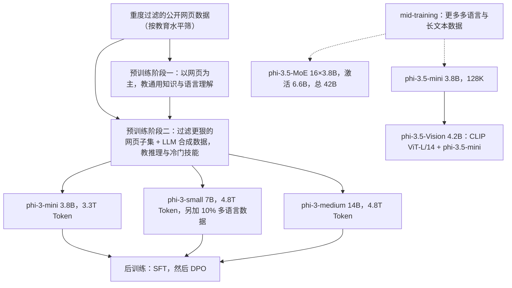
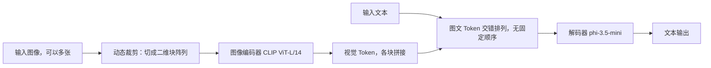
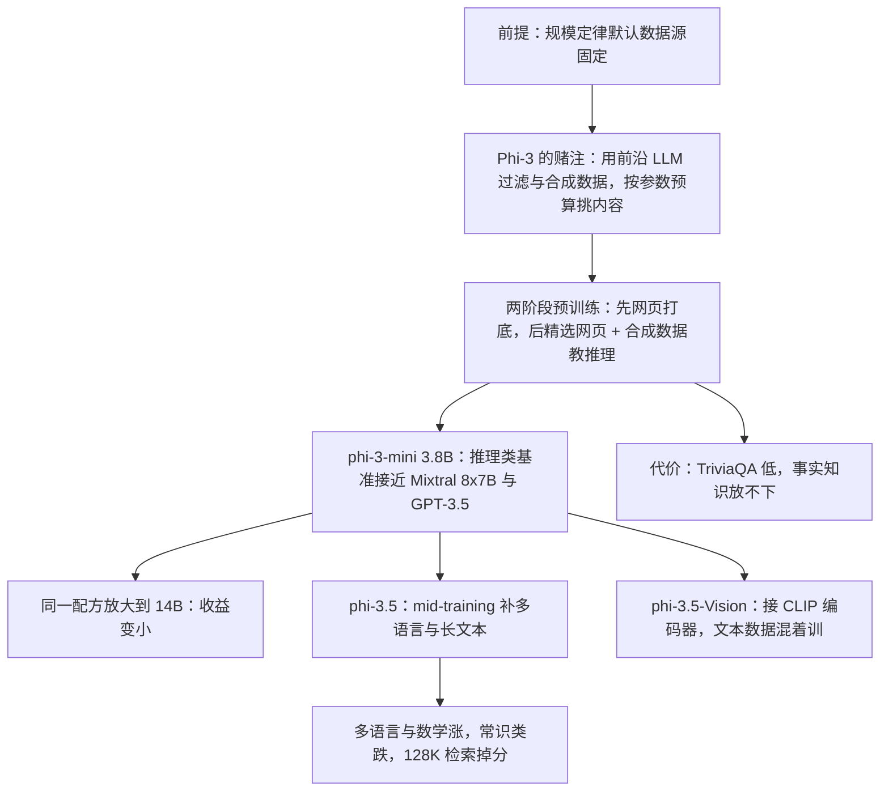

# Phi-3：参数预算定下来之后，数据决定能力放在哪

<!-- release-date: 2024-04-23 -->

> 本文依据本地 `papers/Microsoft/Phi-3.pdf`，即 **Phi-3 Technical Report: A Highly Capable Language Model Locally on Your Phone**，arXiv:2404.14219v4（2024-08-30），共 24 页，署名 Microsoft。页码均指 PDF 自身的页码。文中区分三件事：**报告明确写了什么**、**我们怎么解释它**、**哪些是外部资料或本文读图、推算所得**。

## 阅读前先认识几个词

- **Token（词元）**：模型读写文本的最小单位。「训练 3.3T Token」就是模型一共读过 3.3 万亿个这样的小块。
- **规模定律（scaling law）**：参数量、数据量、算力增加时，误差按幂律可预测地下降的经验规律。
- **算力最优（compute optimal）与过训练（over-train）**：前者回答「给定算力，参数和数据该按什么比例配」；后者明知不是算力最优，也给小模型多喂数据，用训练多花的钱换部署省下的钱。
- **KV Cache（键值缓存）**：生成时把前文每个 Token 的 Key 与 Value 留在显存里，免得每步重算。它随上下文变长而线性增长。
- **GQA（Grouped-Query Attention，分组查询注意力）**：几个 query 头共用一份 Key/Value，直接缩小 KV Cache。
- **MoE（Mixture-of-Experts，混合专家）**：把前馈层复制成多个「专家」，每个 Token 只让路由器挑少数几个干活。
- **SFT 与 DPO**：SFT 是用「问题 + 好答案」继续训练；DPO（Direct Preference Optimization，直接偏好优化）用「同一问题的好回答 / 坏回答」成对数据，直接把模型推向好的一边，不另训奖励模型。

## 一句话先说清

Phi-3 的主张是：**参数预算定下来之后，决定模型能力的主要是数据；而挑数据，本质上是在决定这点容量拿去装什么。**

phi-3-mini 只有 3.8B 参数、训练 3.3T Token，MMLU 68.8、MT-bench 8.38（PDF p. 1、p. 6）；同一条评测流水线下，Mixtral 8x7B（45B 总参数）MMLU 70.5，GPT-3.5 为 71.4、MT-bench 8.35（PDF p. 3、p. 6）。4 bit 量化后它约占 1.8 GB，能在 iPhone 14 上离线跑到每秒 12 个 Token 以上（PDF p. 3）。

而它为此几乎没动架构：phi-3-mini 刻意沿用 Llama-2 的块结构与分词器（PDF p. 2）。报告第一段就交代了底层判断：规模定律假设一个**固定的数据源**，而前沿大模型的出现，让我们能用新的方式与数据打交道，这个假设已经被打破（PDF p. 1）。

但同一份报告也把这条路线的代价摆了出来：3.8B 装不下太多事实知识，TriviaQA 只有 64.0（PDF p. 6、p. 9）；phi-3.5 加进多语言与长文本之后，128K 上的长文本检索明显掉分（PDF p. 7–8）。如果只记一句话：

> **小模型不是全面变强，而是被分配到了推理这一侧。加进一样东西，就要从别处腾出位置。**

## 先看全景：一份报告，六个模型

这份 24 页的报告是一本合订本：前半讲 phi-3-mini、small、medium 三个稠密模型，中间补上 phi-3.5-mini 与 phi-3.5-MoE 的多语言与长上下文，后面第 7 节是多模态的 phi-3.5-Vision。



依据 PDF p. 2–3、p. 5–6、p. 10 重画。两条虚线是有意的：报告只说 phi-3.5-mini 与 phi-3.5-MoE 在 mid-training 阶段加入了更多多语言与长文本数据（PDF p. 6），**没有说它们从哪个 checkpoint 出发、mid-training 用了多少 Token**。

| 模型 | 参数 | 训练 Token | 层 / 头 / 隐藏维 | 分词器，词表 | 默认上下文 | 与 mini 的差别 |
|---|---|---|---|---|---|---|
| phi-3-mini | 3.8B | 3.3T | 32 / 32 / 3072 | Llama-2 同款，32064 | 4K；LongRoPE 版 128K | 基准 |
| phi-3-small | 7B | 4.8T | 32 / 32 / 4096 | tiktoken，100352 | 8192 | GEGLU、muP、GQA、块稀疏注意力 |
| phi-3-medium | 14B | 4.8T | 40 / 40 / 5120 | 同 mini | 未写 | 同架构同数据，只放大 |
| phi-3.5-mini | 3.8B | 未写 | 未写 | 未写 | 128K | mid-training 补多语言与长文本 |
| phi-3.5-MoE | 16×3.8B，激活 6.6B，总 42B | 未写 | 未写 | 同 mini，32064 | 128K | 前馈层换成 16 选 2 的 MoE |
| phi-3.5-Vision | 4.2B | 预训练 0.5T | 语言部分即 phi-3.5-mini | — | 未写 | 接 CLIP ViT-L/14 图像编码器 |

表中数字来自 PDF p. 1–3、p. 6–7、p. 10。「未写」是原件确实没给。

## 第一层矛盾：规模定律默认数据是固定的

### 旧问题：只能决定读多少，不能决定读什么

算力最优和过训练两条路线都把训练数据当成一个给定的池子：你能调的是参数与 Token 的比例，调不了数据本身。报告明确说自己两条都不走，关注的是「**给定规模下**的数据质量」（PDF p. 3）。

### 新设计：data optimal regime

报告把这个方向叫 **data optimal regime（数据最优区间）**：按模型大小去校准训练数据，只保留「知识」水平合适的网页，多留那些可能提升「推理能力」的网页（PDF p. 3）。它给的例子很直白：某天英超某场比赛的比分，对前沿大模型可能是好数据，但对 mini 这个尺寸，要把这类信息删掉，给「推理」留出容量（PDF p. 3）。

背后是一个容量分配的直觉：3.8B 参数是个很小的柜子，装事实就装不下推理模式。既然装不下全部，就该主动挑。

脚注给这个词降了温：和「算力最优」一样，「最优」是一种**期望**，他们并不主张找到了某个规模下可证明最优的数据配比（PDF p. 3 脚注 3）。

### 两阶段预训练

数据由两部分组成：按「教育水平」重度过滤的公开网页，以及 LLM 生成的合成数据（PDF p. 3）。预训练分成**两个不相交、顺序执行**的阶段（PDF p. 3）：

1. **阶段一**以网页为主，教通用知识与语言理解；
2. **阶段二**把过滤得更狠的网页（阶段一语料的一个子集）和一些合成数据混在一起，教逻辑推理与各类冷门技能。

两点值得留意：推理向的数据集中在后期，而不是从头均匀铺开；阶段二的网页是阶段一的子集，同一批精选数据被读了两次。**报告没有公开**过滤分类器怎么训、阈值多少、过滤后留下多少、合成数据用哪个模型生成、两阶段各多少 Token。

### 证据：Figure 3 与它的边界


图引自 PDF p. 4，Figure 3。图注说 Llama-2 这四个模型是在**同一份固定数据**上训练的（PDF p. 4），所以紫线的斜率只反映规模。按图读，7B 的 phi-3-small 错误率约 25%，已低于 70B 的 Llama-2（约 31%）。

但红线不是一次受控实验。phi-1.5、phi-2、phi-3-mini、phi-3-small 四代之间，数据在变、Token 数在变，phi-3-small 还换了分词器、激活函数并加了块稀疏注意力（PDF p. 2）。红线把「模型变大」和「数据变好」混进了同一个斜率；按图读，phi-2 那个点也明显高出红线。报告图注的措辞是「接近数据最优区间的规模定律」，全文没有任何消融能把数据的贡献与架构的贡献分开。**这是一张示意性证据，不是规模定律的测量。**

### phi-3-medium：同一份数据放大到 14B，收益变小

为了在更大的模型上检验这份数据，报告训了 phi-3-medium：与 mini 同分词器、同架构，40 层、40 头、嵌入维 5120，用同样的数据多训了几轮，共 4.8T Token（PDF p. 3）。

报告自己写下了结果：有些基准从 7B 到 14B 的提升，比从 3.8B 到 7B 小得多，「或许说明」数据配比还需要为 14B 再做工作（PDF p. 3）。这是作者的推测，没有对照实验。但它和主线是一致的：为 3.8B 剪掉的那些「英超比分」，对 14B 也许本来有用。**数据配方和参数预算是绑定的**，放大模型时要重新调，和学习率一样。

### 这一节可以带走什么

- **先问这个参数预算下什么值得占位置，再问要多少数据。** 训垂直领域小模型时同样适用：哪些语料在浪费本来就不多的参数？
- **推理向的数据可以集中放在后期**，前期用宽口径的数据打底。
- **在小模型上调好的数据配方，不是规模无关的资产。**

## phi-3-mini：故意长得像 Llama-2

phi-3-mini 是标准的 Transformer 解码器，默认上下文 4K，隐藏维 3072、32 头、32 层，用 bfloat16 训练 3.3T Token（PDF p. 2）。它的关键决定不是技术选择，而是生态选择：为了最好地服务开源社区，它沿用与 Llama-2 相似的块结构和同一个分词器，于是为 Llama-2 开发的工具包都能直接适配（PDF p. 2）。

词表 32064 而不是 Llama-2 的 32000，脚注解释为去掉了 BoS token、为聊天模板加了额外 Token（PDF p. 2 脚注 1）。正文给的聊天模板如下（PDF p. 2），原文印的是 `/n`，按上下文应为换行符：

```text
<|user|>/n Question <|end|>/n <|assistant|>
```

长上下文版本 phi-3-mini-128K 用 LongRoPE 把上下文扩到 128K（PDF p. 2），报告没有展开 LongRoPE 的机制。

**这一条可以直接借走：创新在数据侧时，架构上主动求同。** 每一处「小改进」都在给使用者制造迁移成本，而小模型的核心卖点正是好部署。

### 手机上的那 1.8 GB

phi-3-mini 量化到 4 bit 后约占 1.8 GB 内存，部署在搭载 A16 Bionic 的 iPhone 14 上，原生、完全离线运行，每秒 12 个 Token 以上（PDF p. 3）。Figure 2 是三张截图，应用里的模型名是 `Phi-3-mini-4k-instruct-q4`；放大原图可读到其中两次生成的计时，分别是 11.80 秒、14.75 t/s 与 10.66 秒、12.47 t/s（PDF p. 4）。

算一笔账：$3.8 \times 10^{9}$ 个参数 × 0.5 字节 ≈ 1.9 GB，与报告的约 1.8 GB 同一量级（本文算术）。能不能进手机，第一约束是权重体积，而它由参数量和量化位宽决定。

报告**没有**给：用的哪种 4 bit 方案、量化后的精度损失、KV Cache 与运行时开销、长上下文下的速度、功耗与发热。三张截图都是短回答。

## phi-3-small：全家唯一一处认真的架构改动

phi-3-small（7B）一次改了好几处（PDF p. 2）：

- **分词器换成 tiktoken**，词表 100352，为了更好的多语言分词；默认上下文 8192；
- **激活函数换成 GEGLU**；
- **用 muP（Maximal Update Parametrization，最大更新参数化）调超参**：在小的代理模型上调好，再迁移到 7B，报告说这有助于性能与训练稳定；
- **GQA**：4 个 query 共享 1 个 key；
- **块稀疏注意力**，并另用 10% 的多语言数据。

muP 解决的旧问题是：小模型上调好的超参换到大模型往往失效，只能在大模型上重调，而每次重调都很贵。报告只给了名字和引用，没给迁移出来的超参值。

### 块稀疏注意力


据 PDF p. 3 Figure 1 与 p. 2 正文重画，格子逐一对过原图。

**旧问题**：注意力让每个 Token 回看全部历史，上下文越长，KV Cache 越大。朴素的稀疏注意力会漏信息，被跳过的位置就真的没人看了。

**新设计**：对每个注意力头，在 KV Cache 上施加**不同的**稀疏图案，保证在给定稀疏度下，所有 Token 都会被某些头看到（PDF p. 2）。报告的说法是，上下文就这样被各个头「分而治之」，KV Cache 显著减少。

**代价与边界**：

- **只有一半的层稀疏**。报告写明交替使用密集层与块稀疏层，在省 KV Cache 的同时保住长上下文检索（PDF p. 2）。这是一份便宜的保险：不确定稀疏会不会伤到某类能力时，让一部分层保持完整视野。
- **收益要靠算子兑现**。训练用基于 FlashAttention 的 Triton kernel；推理为 prefill 写了专门 kernel，decode 则扩展了 vLLM 的 paged attention kernel（PDF p. 2）。附录 C 致谢了 UC Berkeley 与清华的研究者在 vLLM kernel 上的帮助（PDF p. 24）。这是全文唯一一段 infra 内容。
- **没给数字**。KV Cache 省了多少、提速多少、稀疏度与块大小怎么选，全文没有。
- **没说清与 GQA 怎么对齐**。要让 KV Cache 真的变小，图案应当定义在 KV 头这一级，同组共享 key 的 query 头看同一份块；报告只说「对每个注意力头」。这是实现者会立刻卡住的空白，属于本文的推断。

按图 1 的设定推算（不是报告结论）：查询在第 $B$ 块、保留 $n_{\text{local}}$ 个局部块、步长为 $s$ 时，一个头保留的块数约为

$$
n_{\text{local}} + \left\lceil \frac{B - n_{\text{local}}}{s} \right\rceil
$$

$B$ 很大时，保留比例趋近 $1/s$。图 1 的玩具设定里（$B = 8$、$n_{\text{local}} = 2$、$s = 3$）每个头保留 4 块，正好一半。

## phi-3.5-MoE：把前馈层换成 16 个专家

phi-3.5-MoE 把 MoE 层作为前馈模块，16 个专家里做 top-2 路由，每个专家是一个独立的 GLU 网络，结果是「16×3.8B 的模型，6.6B 激活参数，42B 总参数」（PDF p. 2–3）。路由器用 SparseMixer 方法训练（PDF p. 3）；分词器与 mini、medium 相同，词表 32064（PDF p. 3）。

两个数字容易算不明白（以下是本文的解释）：

- $16 \times 3.8\text{B} = 60.8\text{B}$，总参数却只有 42B，因为只有前馈层被复制，注意力、嵌入与输出层是共享的；
- 激活 2 个专家却不是 $2 \times 3.8 = 7.6\text{B}$，原因相同：共享部分只算一次。

路由是离散选择，梯度传不回去，SparseMixer 属于在离散选择与反向传播之间搭桥的方法。报告只给了名字和引用，没有解释机制，也没有和别的路由训练方式对比；是否从稠密模型 upcycle 而来也没有说。

## 后训练：SFT 然后 DPO

报告对后训练只有一段（PDF p. 5）：

- **SFT** 用高度精选的数据，覆盖数学、代码、推理、对话、**模型身份认知**和安全；数据配比从纯英文样本开始；
- **DPO** 数据覆盖聊天格式、推理与负责任 AI（RAI）；做法是把不希望的行为当作「被拒绝」的回答，把模型从这些行为上引开；
- 目的除了提升数学、代码、推理、鲁棒性与安全，还要把一个语言模型变成用户能高效、安全交互的助手。

安全部分另有交代（PDF p. 8）：在有用性与无害性偏好数据集的基础上做了修改，再加多份内部生成的数据集；微软内部独立的红队在后训练过程中反复检查 phi-3-mini，团队按其反馈补充数据。phi-3-small、phi-3-medium 与 phi-3.5-MoE 走同样的红队流程、用同样的数据集，样本略多一些。

没有写的：SFT 与 DPO 的样本量、轮次、学习率等任何超参，合成或筛选流程。

## 评测：主表里站得住的，和要打问号的

### 协议写得克制

主表的所有数字出自**同一条流水线**，可能与别处发表的数字不同；few-shot 提示、温度 0；提示词与 shot 数来自微软内部的评测工具，「没有为 phi-3 模型对流水线做任何优化」（PDF p. 5）。紧跟一个脚注：在 Question 前加 `##` 能让 phi-3-mini 在很多基准上明显提分，但他们没这么做（PDF p. 5 脚注 4）。附录 A 贴了一个完整的 2-shot 提示样例（PDF p. 22）。

主动披露一个知道却没用的提分技巧，等于告诉读者这批数字里没有提示词调优的水分。

### 主表摘几行

| 基准 | phi-3-mini 3.8B | phi-3-small 7B | phi-3-medium 14B | Llama-3-In 8B | Mixtral 8x7B | GPT-3.5 |
|---|---:|---:|---:|---:|---:|---:|
| MMLU（5-shot） | 68.8 | 75.7 | 78.0 | 66.5 | 70.5 | 71.4 |
| GSM-8K（8-shot，CoT） | 82.5 | 89.6 | 91.0 | 77.4 | 64.7 | 78.1 |
| MATH（0-shot，CoT） | 41.3 | 34.6 | 53.1 | 28.2 | 11.1 | 45.3 |
| TriviaQA（5-shot） | 64.0 | 58.1 | 73.9 | 67.7 | 82.2 | 85.8 |
| HumanEval（0-shot） | 58.5 | 61.0 | 62.2 | 60.4 | 37.8 | 62.2 |
| MedQA（2-shot） | 53.8 | 65.4 | 69.9 | 60.5 | 62.2 | 63.4 |
| MT Bench | 8.38 | 8.70 | 8.91 | — | — | 8.35 |

数据取自 PDF p. 6。站得住的结论：在数学、代码与常识推理这类「靠模式」的任务上，phi-3-mini 以 3.8B 明显压过 Mixtral 8x7B，GSM-8K 高出 17.8 分；MT-bench 8.38 也略超 GPT-3.5 的 8.35。

必须一起看的反例是 TriviaQA：phi-3-mini 64.0，Mixtral 82.2，GPT-3.5 85.8。报告在弱点一节自己点破原因：模型「根本没有容量存太多事实知识」（PDF p. 9）。它给的补救是外挂搜索引擎，Figure 6 是一个例子：请 phi-3-mini 为 2026 年冬奥会期间规划三日游，不联网时它把行程放在了韩国平昌，接上 HuggingFace Chat-UI 的默认搜索后改成米兰与科尔蒂纳，还更具体（PDF p. 9、p. 11）。这是单个演示，不是量化评测。

这两组数放在一起，才是 data optimal regime 的完整图像：**它让小模型在一部分能力上变强，在另一部分能力上主动放弃。**

### 表内的非单调：7B 有时输给 3.8B

报告只说了「有些基准从 7B 到 14B 的提升比从 3.8B 到 7B 小得多」（PDF p. 3），没提有些基准从 3.8B 到 7B 是**下降**的（PDF p. 6）：MATH 41.3 → 34.6，TriviaQA 64.0 → 58.1，CommonSenseQA 80.2 → 80.0。

本文的读法：mini 与 small 之间不是一次干净的规模对照。small 换了分词器、激活函数，加了块稀疏注意力，还多了 10% 多语言数据（PDF p. 2）；任何一项都可能分走英文数学与事实的容量。而与 mini 同架构同分词器的 medium，分数就全面高于 mini。报告没有为这些变动做归因。

### Average 那一格对不上

主表 `Average` 行是 MMLU 到 MBPP 共 20 个基准的均值。本文逐列复算（PDF p. 6）：多数列与印出的值只差 0.1 以内，但 **phi-3-medium 复算为 77.19、表中是 76.7，GPT-3.5 复算为 73.78、表中是 72.8**。GPT-3.5 列里 TruthfulQA 与 TriviaQA 恰好都是 85.8。p. 7 的 RepoQA 表同样有小出入：Phi-3.5-MoE 五项均值 85.4、表中印 85，Llama-3.1-8B 均值 71.4、表中印 71。p. 9 的 Table 3 各列均值则都能复算对上。引用主表时，请引单个基准的分数，别引 `Average`。

## 多语言与长上下文：mid-training 挂上去的两样能力

phi-3.5-mini 与 phi-3.5-MoE 在 mid-training 阶段加入更多多语言与长文本数据，用 long-rope 方法和一种「混合上下文窗口」的做法，把上下文从 4K 扩到 128K，并称不损害 4K 任务（PDF p. 6）。混合上下文窗口具体怎么混、用了多少长文本数据，没有写。

### 多语言：补的是原本几乎空白的语言

Figure 4 比较了三个模型在 11 种语言上的 MMLU（5-shot）（PDF p. 7）。正文给的确切数只有均分：phi-3-mini 47.3、phi-3.5-mini 55.4、phi-3.5-MoE 69.9（PDF p. 7），与 Table 3 的多语言 MMLU 一行一致（PDF p. 9）。柱高没有标数，按原图读的约数如下：

| 语言 | phi-3-mini | phi-3.5-mini | phi-3.5-MoE |
|---|---:|---:|---:|
| 阿拉伯语 | 约 32 | 约 40 | 约 60 |
| 中文 | 约 39 | 约 50 | 约 67 |
| 荷兰语 | 约 43 | 约 55 | 约 72 |
| 俄语 | 约 38 | 约 48 | 约 68 |
| 乌克兰语 | 约 34 | 约 43 | 约 68 |
| 越南语 | 约 33 | 约 40 | 约 64 |
| 法语 | 约 59 | 约 58 | 约 74 |
| 意大利语 | 约 59 | 约 61 | 约 74 |
| 西班牙语 | 约 58 | 约 61 | 约 75 |
| 德语 | 约 55 | 约 60 | 约 74 |
| 英语 | 约 69 | 约 69 | 约 79 |

报告点名提升明显的是阿拉伯语、中文、俄语、乌克兰语、越南语（PDF p. 6–7）；按图读，荷兰语的涨幅也在这一档。法语、意大利语、西班牙语本来就有五六十分，几乎没动，英语持平。mid-training 补的是模型原本几乎空白的地方。

### 长上下文：128K 是上限，不是可用区间

RepoQA（在代码仓里检索并回答，PDF p. 7，Table 1）上，Phi-3.5-MoE 平均 85、Phi-3.5-Mini 77，高于 Llama-3.1-8B-Instruct 的 71、Mixtral-8x7B 的 68 与 Mixtral-8x22B 的 67.8，低于 gpt-4o 的 90.6 与 gemini-1.5-flash 的 90。

RULER（按长度分档的长文本检索）就露底了（PDF p. 8，Table 2）：

| 模型 | 标称窗口 | 4K | 8K | 16K | 32K | 64K | 128K | 平均 |
|---|---|---:|---:|---:|---:|---:|---:|---:|
| Llama-3.1-8B-Instruct | 128K | 95.5 | 93.8 | 91.6 | 87.4 | 84.7 | 77.0 | 88.3 |
| Phi-3.5-MoE | 128K | 94.8 | 93.0 | 93.2 | 91.6 | 85.7 | 64.2 | 87.1 |
| Phi-3.5-Mini | 128K | 94.3 | 91.1 | 90.7 | 87.1 | 78.0 | 63.6 | 84.1 |
| Mixtral-8x22B-Instruct-v0.1 | 64K | 95.6 | 94.9 | 93.4 | 90.9 | 84.7 | 31.7 | 81.9 |
| Mixtral-8x7B-Instruct-v0.1 | 32K | 94.9 | 92.1 | 92.5 | 85.9 | 72.4 | 44.5 | 80.4 |

从 64K 到 128K，Phi-3.5-MoE 掉 21.5 分，Phi-3.5-Mini 掉 14.4 分。报告没有回避：128K 上显著掉分，「我们怀疑」是 mid-training 缺少高质量长上下文数据，计划在下一版解决（PDF p. 7）。这是作者的推测，没有「加 / 不加长上下文数据」的对照。

读表还要注意：两个 Mixtral 在超出自身标称窗口的列上也有分数（8x22B 的 128K 列，8x7B 的 64K 与 128K 列），那些格子不是同条件比较。

### 换代的净效果：常识类基准退了

Table 3 把 phi-3.5-mini、phi-3.5-MoE 与 GPT-4o-mini、Gemini-1.5 Flash、Llama-3.1-8B、Mistral 系列并列（PDF p. 9）。报告的结论是：phi-3.5-mini 与 Mistral-Nemo-12B、Llama-3.1-8B 这类大得多的模型相当；phi-3.5-MoE 显著优于其他开源模型、与 Gemini-1.5 Flash 相当，并达到 GPT-4o-mini 平均表现的 90% 以上（PDF p. 7）。按表中均值算，69.2 / 74.9 ≈ 92%（本文算术）。

但把 Table 3 里 phi-3.5-mini 的分数，和 p. 6 主表里 phi-3-mini 在**相同 shot 数**下的分数并排，会看到报告没讲的另一面：


这张对照是本文拼的，要带三条限制读：两张表不保证出自同一条流水线，p. 5 的「同一流水线」承诺只覆盖 p. 6 主表；只取了两表 shot 数一致的行，BigBench-Hard 与 GPQA 在两表里 shot 数不同，已排除；报告从未把这两组数放在一起比，也没声称 phi-3.5-mini 在英文任务上全面强于 phi-3-mini。

在这三条限制下，方向仍然清楚：多语言、数学与代码上涨，常识与世界知识类基准普遍下滑。这和「mid-training 加入更多多语言与长文本数据」对得上。**在 3.8B 的容量里，加进去的东西要从别处腾位置**，与全文主线同一件事。

## 安全：红队、内部基准，和一张要打折读的图

### 红队前后

Figure 5 是微软 AI 红队测得的 phi-3-mini 有害回答比例，横轴是 8 个危害领域（PDF p. 8）。图例写的是「未做后训练」对「做了后训练加红队」。柱高没有标数，按原图读的约数：

| 危害领域 | 之前 | 之后 |
|---|---:|---:|
| current_events | 约 28% | 约 21% |
| cyber | 约 44% | 约 12% |
| fairness_bias | 约 55% | 约 29% |
| hate_speech | 约 56% | 约 9% |
| model_identity | 约 21% | 约 8% |
| political_misinfo | 约 74% | 约 38% |
| sexual | 约 65% | 约 11% |
| violence | 约 73% | 约 14% |

每一栏都下降。仇恨言论、性内容、暴力降得最多；current_events 降得最少；political_misinfo 虽然降了一半左右，之后仍是最高的一栏。

图注有一句关键限定：这些百分比是**被抬高的数字**，因为红队是用多轮对抗对话刻意诱导有害回答（PDF p. 8）。所以只有前后的相对变化可读，绝对值不能拿去和别家的安全评测横比。

### 内部多轮 RAI 基准

Table 4 用 GPT-4 模拟五类多轮对话并评分（PDF p. 8–10）。无据程度（Ungroundedness）从 0（完全有据）到 4（完全无据）；其余类别按危害严重度 0 到 7 打分，**DR-x**（defect rate，缺陷率）是严重度大于等于 $x$ 的样本占比。全表越低越好（PDF p. 9–10）。

| 指标 | phi-3-mini | phi-3-small | phi-3-medium | phi-3.5-MoE | phi-2 | Mistral 7B | Gemma 7B | Llama-3-In 8B |
|---|---:|---:|---:|---:|---:|---:|---:|---:|
| Ungroundedness | 0.603 | 0.299 | 0.213 | 0.228 | 1.481 | 0.935 | 0.679 | 0.328 |
| Third Party Harm（DR-1） | 0.240 | 0.253 | 0.251 | 0.105 | 0.240 | 0.562 | 0.383 | 0.373 |
| Harmful Content Continuation（DR-3） | 0.007 | 0.003 | 0.010 | 0.005 | 0.029 | 0.026 | 0.013 | 0.013 |
| Harmful Content Summarization（DR-3） | 0.100 | 0.110 | 0.112 | 0.12 | 0.144 | 0.223 | 0.103 | 0.082 |
| Jailbreak（DR-1） | 0.123 | 0.107 | 0.111 | 0.106 | 0.150 | 0.156 | 0.114 | 0.130 |

数据取自 PDF p. 10。无据程度一行有明显的规模效应：phi-2 1.481 → phi-3-mini 0.603 → phi-3-small 0.299 → phi-3-medium 0.213。本文的读法是，脱离给定材料乱说和容量有关，不是靠对齐就能补平；phi-3-mini 在这一行仍比 Llama-3-In 8B 差近一倍。

## phi-3.5-Vision：把视觉接到 mini 上

### 架构与数据



依据 PDF p. 10 重画。phi-3.5-Vision（4.2B）由图像编码器 CLIP ViT-L/14 与解码器 phi-3.5-mini 组成；视觉 Token 与文本 Token 交错排列；为适配高分辨率和各种长宽比，用动态裁剪把图切成二维块阵列，各块 Token 拼起来表示整张图；多图输入就把各图 Token 直接拼接（PDF p. 10）。

动态裁剪解决的旧问题是：ViT 类编码器通常只吃固定分辨率的方图，截图、文档、图表直接缩放会把字糊掉。切块后每块都是编码器的原生分辨率，代价是视觉 Token 数随图像面积增长。

预训练数据混合了交错图文文档、FLD-5B 的图文对、由 PDF 做 OCR 得到的合成数据、图表与表格理解数据集和纯文本，共 0.5T Token；最大分辨率上限 1344×1344，因为大多数训练图小于这个尺寸（PDF p. 10）。**预训练只在文本 Token 上算下一词预测损失，图像 Token 的损失被丢弃**（PDF p. 10）：这一阶段学的是「看着图把话说对」，不是重建图像。

后训练同样是 SFT 加 DPO（PDF p. 10、p. 12）：多模态 SFT 数据约 33B Token，覆盖自然图理解、图表与图示推理、PPT 理解、多图对比、视频摘要与模型安全；DPO 主要用文本数据加一份较小的多模态数据。两个阶段都**同时训多模态与纯文本任务**，为的是在获得多模态推理能力的同时尽量保住语言能力。给语言模型加新模态时，把原模态的数据一起混进去训，是一条便宜而通用的做法。

### 评测：先看协议改了什么

单图基准 9 项（PDF p. 14，Table 5）：phi-3.5-Vision 的 MMMU 43.0、ScienceQA 91.3、MathVista 43.9、MMBench 81.9、ChartQA 81.8、TextVQA 72.0。GPT-4O 在 MMMU（61.8）、MathVista（54.4）、MMBench（88.4）上仍明显领先，但 phi-3.5-Vision 在 ScienceQA（91.3 对 88.5）与 ChartQA（81.8 对 64.0）上更高。多图与视频基准（PDF p. 15，Table 6）：BLINK 57.0，高于同尺寸的对照组与 GPT-4o-mini（51.9），低于 Gemini 1.5 Pro（61.0）与 GPT-4O（63.2）；VideoMME 50.8，明显落后于 Gemini 1.5 Flash（62.3）与 GPT-4O（68.4）。

这些数要连同协议一起读（PDF p. 12–13）：

1. **模仿不懂提示工程的普通用户**：沿用 Llava-1.5 的评测设置，只让模型「选一个字母」或「用一个词或短语回答」，不用多选专用 Token，不对图像做缩放或预处理，只做 0-shot；因此数字可能与基线的已发表数字不同；
2. **BLINK 不用 ChatGPT 抽答案**，改为让被测模型直接从选项里选，保证对错完全来自被测模型；代价是与已发表的 BLINK 数字不能直接比；
3. **VideoMME 固定 16 帧**：按均匀时间覆盖抽帧，16 是 Azure OpenAI 模型单个提示能放的图像上限；原版让每个模型用它能接受的最大帧数。这张表衡量的是「同样 16 帧下谁理解得好」，能吃更多帧的模型被人为限制了；
4. **MM1 的数字是抄的**：正文说 MM1-3B-Chat 不公开，直接复制发表的数字（PDF p. 12），表注则把 MM1-7B-Chat 也列进去（PDF p. 14）。同一张表里混着两种来源。

### 视觉安全，以及能力与风险同源

安全后训练同时放在 SFT 与 DPO 里，数据除文本 RAI 数据集外还有多份内部多模态 RAI 数据集（PDF p. 13）。Table 7 的三个基准都是 0–10 分、越高越好（PDF p. 15）：

| 基准 | phi-3.5-Vision | 去掉安全后训练 | Llava-1.6 Vicuna | Qwen-VL-Chat | GPT4-V |
|---|---:|---:|---:|---:|---:|
| Internal（私有） | 8.16 | 7.06 | 5.44 | 7.27 | 8.55 |
| RTVLM（公开） | 5.44 | 3.56 | 3.86 | 4.78 | 6.81 |
| VLGuard（公开） | 9.10 | 4.66 | 5.62 | 8.33 | 8.90 |

VLGuard 从 4.66 到 9.10 是安全后训练最大的一处收益。Figure 8 按类别拆开，图注说安全后训练提升了「几乎所有」类别（PDF p. 16）。这个「几乎」是准确的：按原图读，VLGuard 的 safeimg-safetxt 基本持平，内部基准的 privacy 一类在安全后训练后略低。

弱点一节写得具体（PDF p. 14–15）：需要高层推理的问题表现有限；偶尔生成无据输出，在金融等敏感领域可能不可靠；安全上偶尔答了本该拒绝的请求，例子是**破解某些类型的验证码**、**描述含虚假信息的诈骗图片**。报告给的原因是：这部分来自常规指令微调学到的能力，比如 OCR，可视为有用性与无害性之间的权衡。

这是一个结构性矛盾：让模型读懂图里的字是核心能力，而这恰恰是它能帮人破验证码的原因。做多模态产品时要预设，最想要的那个能力，往往也是最难约束的那个。

## 报告承认的限制，和报告没说的事

### 报告自己承认的

- 事实知识容量不够，TriviaQA 低分；建议外挂搜索引擎（PDF p. 9）；
- 语言大体限于英文，小模型的多语言能力是下一步（PDF p. 10）；
- 幻觉、偏见的复现与放大、不当内容与安全问题仍然存在，下游使用要按场景评估（PDF p. 10）；
- 14B 上数据配比可能还不是最优（PDF p. 3）；
- 128K 上 RULER 显著掉分，怀疑缺少高质量长上下文数据（PDF p. 7）；
- phi-3.5-Vision 高层推理有限、会生成无据输出、偶尔答了该拒绝的请求（PDF p. 14–15）。

### 报告没有公开的

- **训练系统与成本**：GPU 型号与数量、训练时长、并行策略、训练框架都没有；唯一的 infra 内容是 phi-3-small 的 kernel 说明（PDF p. 2）；
- **训练超参**：优化器、学习率与调度、批大小、warmup、权重衰减都没有；muP 迁移出来的值也没有；
- **数据**：来源占比、「教育水平」过滤器的训练与阈值、去重、合成数据的生成方式与教师模型、数据截止日期、污染检查，全部没有；
- **消融**：一个都没有。数据与架构各自贡献多少、两阶段拆开会怎样、稀疏度怎么选、SparseMixer 与其他路由方法的对比、mid-training 要多少长文本才够，都没有对照；
- **phi-3.5 系列的训练规格**：phi-3.5-mini 与 phi-3.5-MoE 的层数、训练 Token 数、mid-training 数据量都没给；
- **部署细节**：4 bit 量化方案、量化损失、端侧长上下文的速度与内存。

### 原件内部对不上的地方

1. **phi-3.5-Vision 的参数量有两个说法**：正文与 Table 6 表头写 4.2B（PDF p. 10、p. 15），Table 7 表头写 3.8b+0.3b（PDF p. 15）。
2. **Figure 8 的图例写的是 Phi-3-Vision**，图注与正文都是 phi-3.5-Vision（PDF p. 16）。
3. **主表与 RepoQA 表的均值有几格复算不上**，见上文。
4. **MM1 两列的来源**：正文只说 MM1-3B-Chat 是抄的（PDF p. 12），表注说两列都是（PDF p. 14）。
5. **同一个文献键指代不同模型**：`[LLLL23]` 在参考文献里是 LLaVA-1.5 的论文 Improved baselines with visual instruction tuning（PDF p. 19），p. 12 与 Table 5 却用它标注 Llava-1.6 Vicuna 7B，p. 13–14 又用它标注 Llava-1.5。
6. **MMLU 的引用键指向 MATH 的论文**：主表 MMLU 一行引 `[HBK+ 21a]`（PDF p. 6），参考文献里该键的标题是 Measuring mathematical problem solving with the MATH dataset（PDF p. 17）。
7. **排版笔误**：p. 3 描述 phi-3-medium 的括号「(4.8T tokens total as for phi-3-small.」没有闭合；聊天模板里印的是 `/n`。

## 最值得带回自己项目的六条

### 1. 把挑数据当成容量分配

先问这个参数预算下哪些数据值得占位置，再问要多少数据。「英超比分」的例子可以直接套到任何垂直小模型上。

### 2. 创新在哪一侧，就只在那一侧花预算

phi-3-mini 的差异化在数据，于是架构、分词器全部向 Llama-2 看齐，换来整个生态即插即用。

### 3. 数据配方随规模失效

同一份数据放大到 14B，边际收益变小。小模型上验证过的配方，放大时要重新调。

### 4. 做近似时留一条完整通路

块稀疏层与密集层交替，而不是全稀疏。不确定近似会伤到哪类能力时，让一部分层保持完整视野。

### 5. 披露你没用的提分技巧和你改过的评测协议

「加 `##` 能提分但没加」，BLINK 不用 ChatGPT 抽答案，VideoMME 固定 16 帧。这些句子让读者知道数字能和什么比、不能和什么比。

### 6. 加新东西时，先算它挤掉了什么

phi-3.5-mini 换来多语言、数学与 128K 标称窗口，付出的是常识类基准与 128K 上的实际检索；给语言模型加视觉时，把纯文本数据一起混进去训。能力的加法，在小模型上总是伴随减法。

## 用一张图重新串起全文



## 关键词回看

- **data optimal regime（数据最优区间）**：不按算力配数据量，而按参数预算挑数据内容，为推理让出容量。
- **两阶段预训练**：阶段一以网页为主教通用知识，阶段二用更严过滤的网页子集加合成数据教推理，顺序执行、互不相交。
- **LongRoPE 与混合上下文窗口**：把上下文从 4K 扩到 128K 的两项做法，报告只给名字与引用。
- **块稀疏注意力**：每个头保留局部块，再按步长挑远程块；不同头的图案不同，合起来覆盖全部历史；与密集层交替使用。
- **muP**：让最优超参在不同宽度下大致不变，从而能在小代理模型上调、迁移到大模型用。
- **top-2 路由 MoE**：16 个专家每个 Token 只激活 2 个，42B 总参数只跑出 6.6B 的激活量。
- **SparseMixer**：训练 MoE 路由器、绕开离散选择不可导的方法，报告只给名字与引用。
- **DPO**：用成对偏好数据直接优化模型，Phi-3 用它把不希望的行为标成「被拒绝」样本。
- **Ungroundedness 与 DR-x**：前者 0–4 分衡量回答是否基于给定提示；后者是危害严重度不低于 $x$ 的样本占比。
- **动态裁剪**：把高分辨率图切成二维块阵列分别编码，保住细节，代价是视觉 Token 增多。

## 最后的判断

Phi-3 报告最有价值的，是它把一个方法论主张做成了一条可检验的产品线：**同样的参数预算，数据质量能换来多少能力，以及换不来什么。**

证据强度是分层的：

- **有并列数据支撑的**：同一条评测流水线下，phi-3-mini 在数学、代码、常识推理上明显超过 Mixtral 8x7B，MT-bench 略超 GPT-3.5（PDF p. 6）；RULER 各档的完整分数；Table 7 里安全后训练前后的对照。
- **只是作者推测、没有对照实验的**：14B 收益变小是因为数据配比还需再调（PDF p. 3）；128K 掉分是因为缺高质量长上下文数据（PDF p. 7）；Figure 3 的「数据最优规模定律」混着架构变化。
- **完全没有公开的**：算力、超参、数据配比与过滤实现、任何消融、phi-3.5 系列的训练规格。

还有几处要读者自己校准：主表的 `Average` 有两列复算不上；RULER 表里两个 Mixtral 有超出标称窗口的格子；Figure 5 的有害回答率是刻意抬高的；phi-3.5-mini 相对 phi-3-mini 的英文常识退步，报告没有提。

如果只带走一句：

> **小模型的能力不是「更强」或「更弱」，而是「被分配到哪里」。挑数据就是分配容量，这件事在 3.8B 上藏不住，所以 Phi-3 值得读。**

## 资料与阅读边界

**原始依据**

- 本地 `papers/Microsoft/Phi-3.pdf`，即 Phi-3 Technical Report，arXiv:2404.14219v4（2024-08-30），24 页。全文带 `(PDF p. N)` 的数字都出自这一版。

**版本核查**

- [arXiv:2404.14219](https://arxiv.org/abs/2404.14219) 的提交历史为 v1（2024-04-22）至 v4（2024-08-30），v4 即最新版，与本地 PDF 一致。早期版本只覆盖 phi-3-mini、small、medium，phi-3.5 三个成员是 v4 才出现的内容，别处引用的旧版数字可能与本文不同。

**首发日证据**

- 微软官方 Azure 博客 [Introducing Phi-3: Redefining what's possible with SLMs](https://azure.microsoft.com/en-us/blog/introducing-phi-3-redefining-whats-possible-with-slms/)（2024-04-23）写明：「Starting today, Phi-3-mini, a 3.8B language model is available on Microsoft Azure AI Studio, Hugging Face, and Ollama.」这是 Phi-3 家族最早的官方公开可用事件，`release-date` 取 **2024-04-23**。家族后续成员的上线日与 arXiv v1 提交日都不回写。

**外部补充（不是报告内容）**

- 官方模型卡 [Phi-3.5-mini-instruct](https://huggingface.co/microsoft/Phi-3.5-mini-instruct) 写明 512 张 H100-80G、训练 10 天、3.4T Token、2024 年 6–8 月训练；[Phi-3.5-MoE-instruct](https://huggingface.co/microsoft/Phi-3.5-MoE-instruct) 写明 512 张 H100-80G、训练 23 天、4.9T Token、2024 年 4–8 月训练。两张卡都把后训练写成 SFT、PPO 与 DPO，比报告多出 PPO 一步，两处口径不一致。

**本文读图与推算（不是报告原文）**

- Figure 3 各点的错误率、Figure 2 的计时、Figure 4 与 Figure 5 的柱高、Figure 8 各类别的升降，都是按原图读取的约数。
- 块稀疏保留块数的公式、MoE 参数量的拆解、1.8 GB 的算术、主表与 RepoQA 表的均值复算、phi-3-mini 与 phi-3.5-mini 的跨表对照，都是本文所做。
