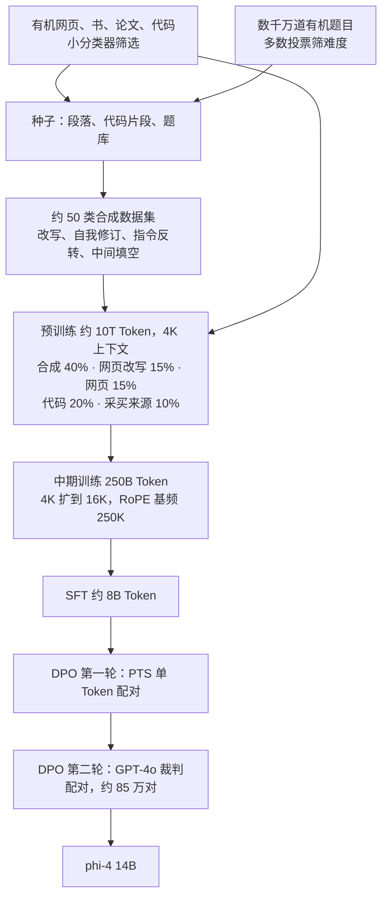
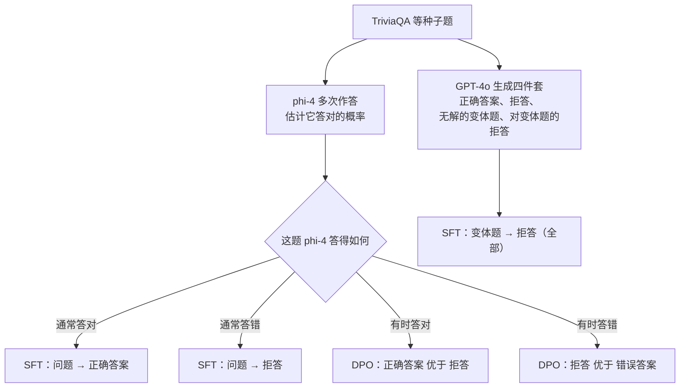
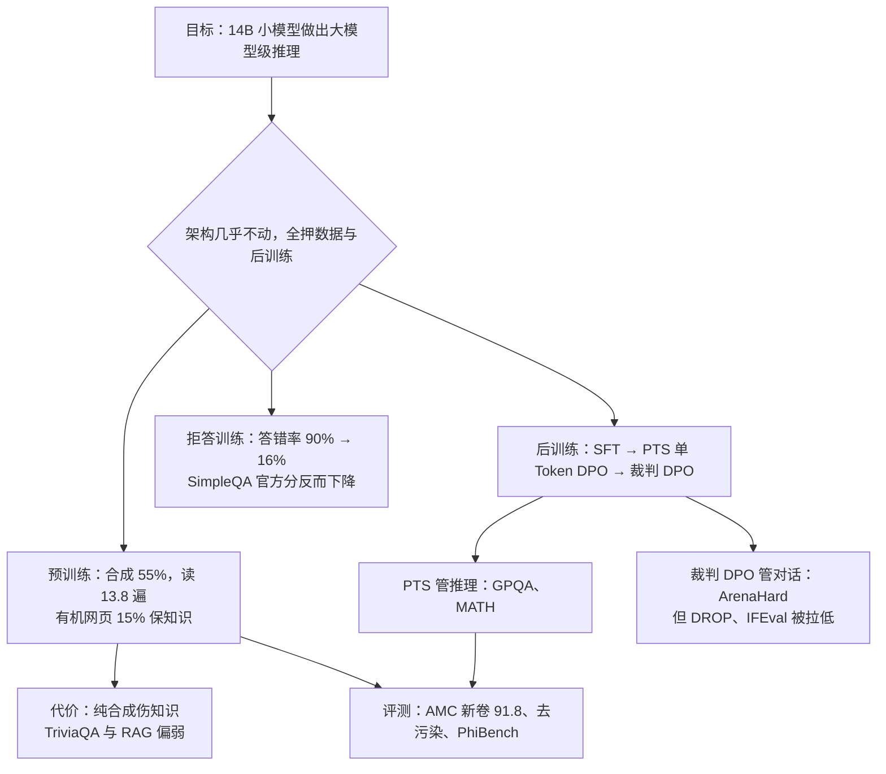

# Phi-4：合成数据可以反复读，但它不带新知识

<!-- release-date: 2024-12-12 -->

> 本文依据本地 `papers/Microsoft/Phi-4.pdf`，即 **Phi-4 Technical Report**，arXiv:2412.08905v1，2024-12-12 提交，共 36 页，署名 Microsoft Research。页码均指 PDF 自身的页码。文中区分三件事：**报告明确写了什么**、**我们怎么解释它**、**哪些是外部资料或本文推算**。

## 阅读前先认识几个词

- **Token（词元）**：模型读写文本的最小单位。
- **有机数据（organic data）**：报告的定义是「人类生成的、或其他非合成的数据」（PDF p. 2 脚注 2），如网页、书、代码仓库。
- **合成数据（synthetic data）**：由另一个语言模型生成或改写出来的训练样本。
- **epoch（遍）**：一批数据被完整读一遍。读 13.8 遍，就是这批数据在训练里出现了 13.8 次。
- **中期训练（midtraining）**：预训练之后、指令微调之前的一段继续训练，这里用来把上下文从 4K 拉到 16K。
- **SFT（Supervised Fine-Tuning，监督微调）**：用「问题 + 好答案」继续训，把续写模型变成助手。
- **DPO（Direct Preference Optimization，直接偏好优化）**：用「同一问题的较好回答 / 较差回答」成对训练，不单独训奖励模型。

这篇报告里最重要的两个新名字：

- **枢轴 Token（pivotal token）**：一条回答里，**单独它一个就让「最终答对的概率」大幅跳变**的那个 Token。
- **PTS（Pivotal Token Search，枢轴 Token 搜索）**：找出枢轴 Token、并把它做成只差一个 Token 的 DPO 配对的算法。

## 一句话先说清

Phi-4 是一个 14B 的稠密模型，架构几乎照搬 phi-3-medium（PDF p. 1、p. 7）。它这一代的全部押注在数据和后训练上：

- **预训练换了来源**：合成数据占 40%，加上网页改写共 55%，有机网页退到 15%（PDF p. 10，Table 5）；
- **后训练换了偏好信号的粒度**：第一轮 DPO 不再比较两整条回答，而是只比较决定成败的那一个 Token（PDF p. 14）；
- **主动接受一个基准分下降**：把模型训成「不会就拒答」，明知 SimpleQA 的官方分数会变差（PDF p. 16，Figure 6 图注）。

支撑第一条的是一个反直觉的实验：**同样的训练 Token 预算，把同一批合成数据读 12 遍，比读 4 遍、剩下的预算换成新鲜网页更好，而且看不到过拟合**（PDF p. 8–9，Figure 2）。代价由另一个实验露出来：**只用合成数据训的模型，知识型基准 TriviaQA 掉 14.8 分**（PDF p. 9，Table 3）。

如果只记一句话：

> **合成数据教「怎么想」可以反复喂，教「知道什么」替代不了有机数据。配比不是找最优，而是给每一类数据分工。**

## 先看全景：数据换了来源，架构几乎没动

机制示意，依据 PDF p. 5–7（数据）、p. 7 与 p. 10–11（预训练与中期训练）、p. 12（后训练）。图中没有任何实测时间或吞吐。

报告第 3 节关于架构只有两句话（PDF p. 7）：

| 项目 | phi-4 | 出处 |
|---|---|---|
| 结构 | 14B 稠密解码器 Transformer，「基本沿用 phi-3-medium」 | PDF p. 7 |
| 分词器 | 改用 tiktoken（为多语言），补齐后词表 100,352 | PDF p. 7 |
| 注意力 | 4K 上全注意力，不再用 phi-3-medium 的 2K 滑动窗口 | PDF p. 7 |
| 上下文 | 预训练 4096，中期训练扩到 16K | PDF p. 7 |
| 预训练 | 约 10T Token，线性 warmup 加衰减，峰值学习率 0.0003，权重衰减 0.1，全局 batch 5760 | PDF p. 7 |
| 超参怎么定 | 从更短训练程的 run 插值，再对 warmup 阶段做稳定性压测 | PDF p. 7 |

层数、隐藏维度、头数、优化器名字、精度、GPU 数量与训练时长，报告都没写。官方权重仓库的 `config.json` 给了规格：40 层、hidden 5120、40 个查询头、10 个 KV 头（即分组查询注意力）、FFN 中间维 17920、`rope_theta` 250000；模型卡写训练用 1920 张 H100-80G、21 天、9.8T Token（外部补充，来源见文末）。

所以 Phi-4 与 phi-3-medium 是**同尺寸、骨架几乎不变**的换代。后文所有差距，基本都要记在数据和后训练的账上。

## 第一层矛盾：网页数据的边际收益见顶，可知识只能从它来

### 旧做法卡在哪

Phi-3 那一代是两阶段预训练：阶段一大部分 Token 是过滤后的网页，阶段二以合成数据为主、少量超精滤网页。报告说，随着合成数据变多变复杂，**非合成 Token 带来的收益在 phi-3 那几个尺寸上已经变薄**（PDF p. 8）。它给了两条观察（PDF p. 8）：

1. 网页数据在重推理基准上收益很小；**把预算给合成数据的更多遍数，比补新鲜网页 Token 更好**；
2. 只用合成数据训的模型，在知识型基准上明显更差，而且**幻觉更多**。

这两条合起来就是全篇的主要矛盾：一个能无限复读、但几乎不带新知识的来源，和一个带知识、但对推理帮助见顶的来源，怎么分工。

### 为什么合成数据不是有机数据的便宜替身

报告在第 2.1 节先论证合成数据好在哪（PDF p. 4），给了两条理由。

**理由一：推理链是线性可学的。** 有机文本里，当前 Token 和下一个 Token 之间可能隔着好几步推理，next-token prediction 很难学。合成文本里每个 Token 本来就是由前文预测出来的，推理路径天然是模型能跟着走的形式。报告举的例子是：人写的数学解答可能开头就报答案，那是人先算完再「非线性编辑」出来的；而预训练要求模型从第一个 Token 起线性地写出它，这学不动。

**理由二：和推理时的上下文同分布。** 合成数据的格式更接近模型推理时要产出的样子。报告的例子是网络论坛：论坛文风和 LLM 对话差别很大，**如果一个事实只出现在论坛语料里，预训练后的模型会认为它在自己产出的对话里几乎不会出现**；把它改写成 LLM 的语言风格，推理时才调得出来（PDF p. 4）。

第二条值得单独记住。它给「训练数据里明明有，问模型却说不出」提供了一个机制解释：不是忘了，是那条知识所在的文本样式，在模型自己生成的上下文里概率太低。后面 Table 3 里「网页改写」能把 TriviaQA 的缺口补回一半，用的正是这个道理——这层连接是我们的解读，报告没有把两处连起来说。

### 证据一：同一批合成数据读 12 遍，胜过换成新网页

图引自 PDF p. 9 Figure 2。实验设定（PDF p. 8）：这是在阶段一 checkpoint 之上做的小规模「阶段二」预训练；每个规模跑两组，总训练 Token 相同，**合成数据的唯一 Token 数固定**（全量合成的一个子样本），只改它被读的遍数（4 或 12），剩下的预算由新鲜网页 Token 补齐。纵轴是 5-shot MMLU。

图上还有一个报告没点明的读法：**7B 读 12 遍的曲线（实线深蓝）末端约 0.74，和 14B 读 4 遍的曲线（黑色虚线）几乎重合**。也就是说，在这个设定里，多读合成数据的收益和模型翻倍相当。这是读图得出的，报告没有写成数字。

报告的图注只下了一个定性结论：「尽管对合成数据做了很多遍，我们没有看到过拟合行为，12 遍的模型实际上比看过更多唯一网页 Token 的模型更好」（PDF p. 9）。它**只比较了 4 遍和 12 遍**，没给「读到多少遍开始变坏」的拐点，也没解释为什么不过拟合。

### 证据二：只用合成数据，知识那一栏塌了

受这个现象启发，报告专门训了一个 13B 模型，**完全不用网页数据**，每个数据源看了 20 遍以上，明确标注「仅用于消融」（PDF p. 8）。相对 phi-3-medium 的差值（PDF p. 9，Table 3）：

| 数据构成 | MMLU | MMLU-pro | GSM8k | HumanEval | ARCC | MBPP | MATH | TQA |
|---|---:|---:|---:|---:|---:|---:|---:|---:|
| 纯合成 | +0.8 | +4.0 | +2.2 | +12.1 | 0.0 | +5.0 | +4.9 | **−14.8** |
| 合成 + 网页改写（各半） | +0.3 | +4.1 | +1.8 | +13.3 | +3.0 | +7.6 | +8.1 | **−7.7** |

TQA 是 1-shot TriviaQA，一个纯知识检索基准。它是全表唯一的大幅负值，而 HumanEval 同时涨了 12 分以上：**合成数据把「怎么做」教得很好，把「是什么」教得很差。**

第二行说明，网页改写这种「半合成」形态把 TQA 的缺口从 −14.8 收窄到 −7.7。报告对它的定义是：合成数据中规模很大的一个子类，内容是对过滤后网页的直接改写（PDF p. 9 脚注 5）。改写往数据里带回了一部分知识，但补不满。报告的结论是：这些观察让他们重新考虑网页数据在配比里的角色（PDF p. 8）。

### 换代的净效果：推理大涨，知识没涨

预训练结束后，phi-4 相对 phi-3-medium 的差值（PDF p. 8，Table 2）：

| 版本 | MMLU | MMLU pro | GSM8k | HumanEval | ARCC | MBPP | MATH | TQA |
|---|---:|---:|---:|---:|---:|---:|---:|---:|
| phi-4（4K） | +3.0 | +10.3 | +2.2 | +7.8 | +1.1 | +6.8 | +8.9 | −0.7 |
| phi-4（16K） | +2.7 | +8.9 | +1.2 | +9.0 | +0.9 | +9.6 | +8.4 | −1.5 |

评测是报告的内部实现：MMLU（5-shot）、MMLU-pro、ARCC（1-shot）用对数似然，TQA、MBPP、MATH、GSM8k 分别给 1、3、4、8 个示例（PDF p. 8）。

八列里七列涨，唯一跌的仍是 TriviaQA。这张表是方向上的证据，不是干净的归因：分词器换了（PDF p. 7），训练 Token 从 phi-3-medium 的 4.8T 涨到约 10T（4.8T 见 Phi-3 一篇），这些都和数据配方同时变了，报告没有拆开。

### 这一节可以带走什么

- **高质量数据的「重复读」可能比「找新数据」更划算。** 做垂直小模型时手上真正的好样本很少，先把已有的一批按可学习的形式多读几遍。边界是：报告只比了 4 遍与 12 遍，且恰恰对知识型能力不成立。
- **「模型学过却调不出」可能是分布问题。** 把知识改写成推理时的文风，比再堆一份原样语料更有用。

## 核心设计一：给每类数据分工，再定配比

### 最终配比

五类来源各负责一件事：合成数据负责推理模式，被读得最狠；过滤网页是唯一 Token 最多的一类（约 1.3T），负责知识，几乎只读一遍；代码是合成与原始代码的混合；采买来源指学术数据和书（PDF p. 10）。报告说，每类的遍数就是「分配到的 Token ÷ 唯一 Token」（PDF p. 10），按约 10T 的总量代回去五格都对得上（本文复算）。

### 配比怎么搜出来：在 7B、1T 上试，搬到 14B

报告用 1T Token 的短程训练做配比消融，依据两条他们「已确立」的规律：短训与长训的结果高度秩相关（直到数据源过拟合饱和）；7B 与 14B 在不同配比上的表现也高度秩相关，**前提是配比之间差得足够大**。于是实验在 7B 上做，结论搬到 phi-4（PDF p. 9）。

Table 4 冻结采买来源与代码（占 25%），只调剩下 75% 在合成（S）、过滤网页（W）、网页改写（WR）三者间的分配，数字都相对最终配比（PDF p. 10）：

| 变体 | MMLU | MATH | GSM8k | HumanEval | ARCC | MBPP | TQA | MMLU pro | 平均 |
|---|---:|---:|---:|---:|---:|---:|---:|---:|---:|
| 三者均分 | −3.3 | −5.4 | −5.8 | −1.2 | +0.6 | −2.0 | +3.3 | −3.6 | −2.2 |
| S | +3.3 | +4.0 | +2.1 | −6.1 | +1.9 | +0.4 | −3.0 | +3.7 | +0.8 |
| S + WR | +0.6 | +1.2 | +1.5 | −1.2 | +1.6 | +1.6 | −3.7 | +1.2 | +0.4 |
| S + W | −0.6 | −0.7 | −0.7 | −4.3 | +0.3 | −2.0 | +6.9 | +0.9 | 0.0 |

注意这张表的列序与 Table 2、3 不同（MATH 提到第二列，TQA 挪到 MMLU pro 前），跨表对数时要按表头对齐。

报告自己的三句读法（PDF p. 9–10）：

1. 均分最差，因为合成数据质量更高，均分等于稀释它；**唯一明显受益于网页数据的基准是 TQA**；
2. 第 2、3 行的合成重配比平均分**略好于**最终配比，但他们仍选择并入采买来源和知识型过滤网页，「以平衡模型各项能力」；
3. 选定配比与合成重配比之间的差距，**在后训练之后基本闭合**。报告把「把后训练效果也算进去的端到端配比优化」列为未来方向。

第 2 条是全节最值得学的地方：**最终配比不是平均分最优的那个，而是带着价值判断的取舍**——为了知识和少幻觉，主动放弃一点平均分。第 3 条则提醒这笔账并不简单：预训练阶段的差异会被后训练抹平，那么预训练时为知识做的取舍到底值多少，报告没有回答。

### 这一节可以带走什么

- **先写分工表，再谈配比。** 「这个来源负责教什么」比任何一个比例数字都更长寿。
- **用小模型、短训程做配比搜索**是小团队能直接复用的做法，但要守住报告给的边界：只有配比差得够大时，排序才能从 7B 搬到 14B。

## 核心设计二：合成数据怎么造，种子为什么要完美

### 50 类合成数据、约 400B Token

报告共造了 50 大类合成数据集，每类有自己的种子和多阶段提示流程，累计约 400B 未加权 Token（PDF p. 5）。四条原则是：多样性、细腻与复杂（要有边缘情况）、准确（代码能跑、证明成立）、思维链（PDF p. 4–5）。

**种子从哪来**（PDF p. 5）：

1. **网页与代码种子**：两级过滤，先挑教育价值高的页面，再把页面切成段落、分别按「事实含量」和「推理含量」打分；
2. **题库**：从网站、论坛、问答平台收题，再**用多数投票筛难度**——每题生成多个独立答案，全部一致的丢掉（太易），完全不一致的也丢掉（太难或有歧义）；**多数答案直接替代标准答案**，用于后续的拒绝采样生成；
3. **从书、论文、代码里抽问答对**：让模型找文本中的推理链和逻辑推进，把关键步骤改写成问题与答案。报告说「如果做得对」，训练这种改写内容比训练原文有效得多（PDF p. 5），但**没给数字**。

**怎么造**（PDF p. 5–6）：

- **改写与增广**：把段落里大部分有用内容改写成练习、讨论或结构化推理任务；
- **自我修订**：模型按侧重推理与事实的量规批评自己的输出，再改；
- **指令反转**：拿现成代码反向生成题面，指令放在代码前；**只保留原代码与据题面重新生成的代码高度一致的样本**；
- **验证**：合成代码走执行循环和测试；科学类题目的抽取方法要保证相关、有据、难度均衡。

附录 D 给了几段实物（PDF p. 30–36），它们说明流水线为什么能自动跑——**每一步的产物都带可机器读取的判断**：

| 附录 | 手法 | 实物里值得看的一点 |
|---|---|---|
| D.1.1（p. 30） | 给摘录打元数据 | 「复杂度」「事实晦涩度」「是否有推理链」是三个独立标签，推理步骤按「假设 → 结论 → 说明」写；原文随后按这些元数据筛选，与元数据一起当种子 |
| D.1.2（p. 31–32） | 自我修订 | 一道表观遗传学阅读题，批评者打「外部知识 1 分、选项迷惑性 2 分」并给具体建议；第 1 版加入 HPA 轴与皮质醇，又被打「难度 1 分」，第 2 版再加糖皮质激素响应元件 |
| D.1.3（p. 32） | 由片段造多轮对话 | 多个 agent 交替发言、摘要前文、注入新场景，每轮之后自我修订 |
| D.2（p. 32–34） | 中间填空 | 从代码片段挖掉中间一段，拒绝采样出带思维链的解；实例被判「3 分，部分正确」，理由是漏了 `elif c == 2 and not cused` 这个条件 |
| D.3（p. 34–36） | Agent 轨迹 | 在多种环境上跑 AgentKit，把它引导出的原始推理重写成自包含的陈述；报告说这批数据改善了内部基准上的规划、推理、工具使用、数学与纠错，没给数字 |

### 有机数据的新角色：知识底座和种子库

Phi-4 里有机网页不再是主料，而有两个用途：直接喂知识，以及当合成的种子。报告对后者有一句很硬的话：干净、正确的自然数据对合成播种「绝对关键」，**小错误会让衍生的合成文档严重退化**，所以他们在网页数据上做了「完美主义式」的策展（PDF p. 6）。具体做法（PDF p. 6–7）：

- **题库**：数千万道有机题目与解答；很多题缺准确解答，就换成合成解答并用多数投票提准确率；全部做去污染；
- **一条只有文字、没有表的消融**：有机问题比合成问题有效得多；把有机题库合成增广后确实有提升，但增益没那么大（PDF p. 6）；
- **定向采买**：arXiv、PubMed Central、GitHub 等可用来源，以及明确授权的书；
- **筛网页堆**：用约 $10^6$ 条 LLM 生成的标注训练**小的非 LLM 分类器**，从海量网页里挑最好的一小部分；这招会偏向 STEM 关键词，于是另建一条放大高质量非 STEM 内容（艺术、历史、旅行、文化、娱乐）的流水线；再按 n-gram 统计与压缩率找离群值，清掉损坏文本和二进制文件；
- **多语言**：从 CommonCrawl 与维基百科取多语言文档，fastText 语种识别分到 176 种语言，再用同一套（在多语言 LLM 标注上训的）质量分类器过滤；
- **自建抽取器**：为 TeX 源、ePub、Word、PDF 等各写解析；网页用自建 HTML 转文本抽取器，保护朴素解析器常弄坏的公式、代码块、表格和论坛楼层结构。

### 这一节可以带走什么

- **多数投票筛难度**几乎零成本：丢掉全对与全乱的题，留下「会一点但不稳」的。做 SFT 题库和评测集都能用。
- **指令反转 + 一致性回检**是一个通用的「造题面」配方：输出现成、输入缺失时，反推输入，再用输入重新生成输出做对账。
- **种子的错误会被放大。** 合成流水线越长，越要在源头做干净。

## 预训练收尾：中期训练与长上下文

### 从 4K 到 16K：用天然长文，不用拼接长文

报告先做消融：比较天然就长的数据与把短样本拼接填满序列的人造长文，**前者在长上下文任务上更好**（PDF p. 10，只给了结论，没给数字）。于是：

- 从高质量非合成数据（学术、书、代码）里筛出 8K 以上的样本，并上调 16K 及以上子集的权重；
- 新造满足 4K 以上长度要求的合成数据；
- 中期训练配比为 **30% 新长文 + 70% 预训练阶段召回的 Token**；
- RoPE 基频提高到 250K，峰值学习率降为预训练的十分之一，共训 **250B Token**（PDF p. 10–11）。

### 评测：故意选真实任务，不用大海捞针

报告写明，大海捞针、RULER 这类合成长上下文基准因简单可控而受欢迎，但他们侧重反映真实应用的任务，于是从 HELMET 里选了六类（PDF p. 11）。每格是 5 次运行的平均（PDF p. 11，Table 6）：

| 模型 | 长度 | Recall | RAG | ICL | Re-rank | QA | Summ |
|---|---:|---:|---:|---:|---:|---:|---:|
| phi-4 | 8K | 100.0 | 58.1 | 68.0 | 65.3 | 26.7 | 38.3 |
| Qwen-2.5-14B | 8K | 100.0 | 62.2 | 67.8 | 58.2 | 24.7 | 37.2 |
| Llama-3.3-70B | 8K | 92.0 | 65.3 | 69.4 | 64.4 | 30.0 | 37.8 |
| GPT-4o-mini | 8K | 99.2 | 65.8 | 74.4 | 69.4 | 31.3 | 38.5 |
| GPT-4o | 8K | 100.0 | 66.9 | 83.0 | 75.1 | 37.3 | 43.0 |
| phi-4 | 16K | 99.0 | 57.1 | 77.0 | 54.4 | 36.0 | 40.5 |
| Qwen-2.5-14B | 16K | 100.0 | 59.1 | 67.6 | 50.3 | 29.7 | 42.3 |
| Llama-3.3-70B | 16K | 92.0 | 62.2 | 70.0 | 63.3 | 36.7 | 41.9 |
| GPT-4o-mini | 16K | 100.0 | 63.6 | 78.4 | 63.9 | 36.0 | 45.2 |
| GPT-4o | 16K | 100.0 | 66.7 | 85.6 | 73.8 | 43.7 | 46.3 |

六类任务的口径（PDF p. 11）：Recall 从随机生成的长 JSON 里按键取值（SubEM）；RAG 在打乱的维基文档上答 NaturalQuestions、HotpotQA、PopQA（SubEM）；Re-rank 用 MSMARCO 重排前十（nDCG@10）；ICL 是多样本上下文学习（F1）；QA 读 NarrativeQAv2 长文答题、Summ 摘要 Multi-LexSum 法律文书，两项都由 GPT-4o 打分。

「长度」列是评测时的输入长度，各模型都有 8K 与 16K 两行，phi-4 的两行应是同一个模型在两种长度下的成绩（我们的读法，报告没有逐行说明）。读表要知道三件事（均为我们的读法）：

1. **RAG 一列 phi-4 两档都是全表最低**（8K 58.1、16K 57.1）。RAG 是「在给定材料里找事实」，这与「合成数据不带知识」的主线一致；
2. **Re-rank 从 8K 到 16K 五个模型全部下滑**，phi-4 掉得最多（65.3 → 54.4），GPT-4o 与 Llama-3.3-70B 只掉约 1 分；
3. **phi-4 的 ICL 在 16K 上反而大涨**（68.0 → 77.0）。报告对这几处都没有解释。

phi-4 只做到 16K，而前一代 Phi-3.5 的小模型已标称 128K（见 Phi-3 一篇）。报告没有提这个变化，也没说为什么停在 16K。

## 核心设计三：枢轴 Token 搜索，把偏好信号落到一个 Token 上

这是报告里技术上最有迁移价值的一块。

### 旧问题：整条回答的功劳被平摊到每个 Token 上

图引自 PDF p. 13 Figure 3。设定：GPT-4o 在温度 1 下解一道 MATH 题，初始答对概率 0.31；每个 Token 之后独立补全 529 次，答对比例决定颜色，底部折线画的是同一组概率。变化 ≥ 0.2 的 Token 加框，概率 ≤ 0.1 的 Token 加下划线。

图注给了两组关键数字：`negative` 与 `(a` 两个 Token 本身的生成概率分别是 0.31 和 0.12；同一前缀下的贪心选择分别是 `product`（0.66）和 `t`（0.88）。下划线（低概率 Token）和方框（枢轴 Token）几乎不重合，图注说这正是为了表明**枢轴 Token 与低概率 Token 是两回事**（PDF p. 13）。

现在把这条回答当成 DPO 的一整条正样本。报告指出三个问题（PDF p. 14）：

1. **信号被稀释**：回答里有大量比 `negative` 概率更低的 Token，它们一起贡献梯度，淹没了枢轴 Token 的信号；
2. **奖励错的东西**：那个让解法变得不稳的 `(a`，因为自身概率只有 0.12，**反而会收到很强的正向学习信号**；
3. **两段文本差很远时，比较它们各自的逐 Token 对数概率（DPO 做的事）没什么意义**，信号应该来自两段文本开始分叉之后的那几个 Token。

第 2 条可以这样理解（我们的解释）：DPO 要把正样本整条序列的对数概率推高，一个原本只有 0.12 的 Token，把它推高的梯度最大；「整条是好的」这个前提，把恰好被采到、其实不该鼓励的 Token 一起强化了。

### 新设计：只比较一个 Token

对回答 $t_1, t_2, \dots$ 的每个前缀，考虑「从这里继续生成，最终答对」的概率 $p(\text{success} \mid t_1, \dots, t_i)$。吐出一个 Token 前后，这个概率的跳变量就是该 Token 的分量。跳变大的 Token 就是枢轴 Token：

$$
\left| \, p(\text{success} \mid t_1, \dots, t_{i-1}) - p(\text{success} \mid t_1, \dots, t_i) \, \right| \geq p_{\text{gap}}
$$

$p_{\text{gap}}$ 是阈值，**报告没有给取值**（Figure 3 的方框用的是 0.2，那是画图的标注阈值）。概率靠采样补全再交给判定器（oracle）判对错来估：代码用完整的测试套件，数学题比对标准答案（PDF p. 14 脚注 6）。

找到之后，把 $Q + t_1, \dots, t_{i-1}$ 当作查询，一个让答对概率上升的单 Token 当接受、一个让它下降的单 Token 当拒绝，构成一条 DPO 配对。这两个 Token 直接从估概率时已采的补全里挑，不用额外生成（PDF p. 14 脚注 7）。

### 怎么找得快：按信息量二分

逐 Token 估概率太贵，每次估计都要几百次补全。Figure 4 的伪代码（PDF p. 13）把它变成递归二分，图上画不出的三个细节：

1. **切分点是累计 Token 对数概率的中点，不是 Token 个数的中点**，相当于按信息量折半；
2. **停止条件有两条**：段长 ≤ 1，或整段两端的概率差已小于 $p_{\text{gap}}$——后者让平稳区域一次跳过；
3. **概率估计要做记忆化**（Figure 4 图注），因为递归会反复估同一个前缀。

报告对正确性的说法很克制：二分**不保证找到全部**枢轴 Token，但**找到的一定是**；当答对概率沿解答近似单调时，它能找全（PDF p. 14）。无假阳性、可能假阴性、并给出假阴性消失的条件——这种边界声明值得照着写。

还有一条工程约束：**只对 $0.2 \le p(\text{success}) \le 0.8$ 的题做 PTS**，因为太易或太难的题上枢轴 Token 很少（PDF p. 14）。PTS 用在有标准答案的任务上：数学、各类问答、编程。

### 三条真实配对

Figure 5（PDF p. 15）给了三个例子，下划线标的是真正构成配对的那个 Token：

| 领域 | 上下文结尾 | 接受 | 拒绝 |
|---|---|---|---|
| 数学 | 「First, clear the fractions by」 | `cross`（-multiplying） | `multiplying`（both sides by） |
| 物理 | 「Given」 | `the`（vibrational frequency） | `that`（the potential interactions） |
| 代码 | `if num == other * 2 or (` | `other`（% 3） | `num`（* 2） |

报告对数学那条的解读是全节最深的一句：**枢轴 Token 往往不是真正的错误，而是把模型带上一条不那么有利的路**——两边分别乘分母与直接交叉相乘同样合法，但对这个模型来说后者更稳（PDF p. 14）。PTS 优化的因此不是「对错」，而是「在这个模型上哪条路更稳」。这类知识外部标注给不了，只能在自己的模型上做 rollout 测。

### 和同期工作怎么区分

报告在 Related Work 里摆了两类（PDF p. 16）：

- **Critical Tokens Matter**（引 [LLX+24]）：训一个模型给导致失败的 Token 打分，再加权 DPO 的拒绝样本。报告说 PTS 直接估 $p(\text{success})$，绕开了学出来的代理指标；对方还报告难以用于接受样本，而 PTS 同时产出正负两类；
- **自动过程监督**（引 [WLS+24]、[LLL+24]）：用搜索和 rollout 造数据训过程奖励模型。报告的定位是：PTS 也是一种自动过程监督，但产出的是**可以直接喂给 DPO 的 Token 级偏好数据**，不用再训一个过程奖励模型。

### 第一轮 DPO 的数据

Table 7（PDF p. 12），单位是样本条数：

| 数据集 | 条数 |
|---|---:|
| generic multiple-choice Q&A | 132,859 |
| math data | 76,552 |
| python data | 16,080 |
| cpp、go、java、js、rust data | 21,806 |
| unknown + safety data | 3,000 |

合计 250,297 条（本文加总）。`unknown` 指什么，报告没有定义。

### 这一节可以带走什么

- **任何用整条轨迹做偏好训练的场景，先问「哪一步决定了成败」。** 代码 Agent、数学解题都一样，整条加权会把偶然的好选择和偶然的坏选择一起强化。
- **$p(\text{success})$ 需要判定器**，所以 PTS 只在有客观对错的领域便宜可用；没有判定器就只能学一个裁判，回到了 PTS 想绕开的东西。
- **只做「半会不会」的题**（0.2–0.8）这一条不需要判定器也成立，筛训练题、评测题、RL 提示都能用。
- **在序列上二分找突变点时，按信息量而不是按长度切。**

## 核心设计四：第二轮 DPO，让 GPT-4o 当裁判

第一轮只修关键 Token，第二轮回到常规的全长度配对，报告称之为裁判引导 DPO（PDF p. 12）：

1. 提示来自多份公开指令微调数据集，也包括安全与负责任 AI（RAI）相关提示；
2. 每个提示用 GPT-4o、GPT-4t 和 phi-4 自己各生成回答，组合成多种配对；
3. GPT-4o 当裁判，给每条回答按准确性、风格、细节各打 1–5 分；**准确性更高、或三项平均更高的那条作正样本**；
4. 共约 85 万对。

Table 8（PDF p. 12）：

| 数据集 | 条数 |
|---|---:|
| any vs any accuracy | 532,000 |
| any vs any overall | 266,000 |
| unknown + safety data | 43,842 |

三行合计 841,842，与正文的「约 850k」吻合（本文加总）。`any vs any` 的命名报告没解释；从后缀看，`accuracy` 与 `overall` 大概对应上面第 3 步的两种判据，这是我们按名字的推测。

裁判提示词全文在附录 A.2（PDF p. 26–27）：先让裁判逐条列出每条回复的问题并归类为理解不足、逻辑错误、事实错误或风格问题，再讨论双方差异，最后打三项分。其中一条是专门针对「LLM 裁判偏爱长答案」写的：**如果问题没有指定详细程度，不要因为回答太详细或太简略而扣分**（PDF p. 27）。

两轮 DPO 里都混了少量安全与抑制幻觉的数据（PDF p. 12），Table 9 的表注给出比例为 1–5%（PDF p. 17）。

## 核心设计五：宁可拒答，也不编——明知基准分会掉

### 旧问题：预训练的目标和诚实冲突

附录 A.1 把矛盾说得很直白（PDF p. 23）：不加干预时 phi-4 几乎从不承认自己不知道，问「排名第 297 位的网球选手是谁」这种太难的题，它会像即兴喜剧一样「Yes, and……」地编一个表面合理的答案。原因是预训练的目标就是**把尽可能多的信息装进模型**，而不是教它认识自己的局限。

分工于是变成：**预训练负责装知识，后训练负责划边界**——先测出哪一档问题超出它的能力，再教它在那一档上拒答。

### 数据怎么造

机制示意，依据 PDF p. 23–24。三个细节：

1. **变体题要「听起来真实，但不可能有答案」**。提示词要求不能明显是假的、荒谬的或虚构的，国名必须是真实国家，不能出现「致敬原题」的名字；例子是把「Amelia Earhart 什么时候飞越大西洋」改成「Edgar Greenwood 什么时候飞越大西洋」（PDF p. 24）。这样模型学到的是拒绝「看起来该知道、其实不知道」的题，而不只是「一眼假」的题；
2. **拒答样本也是生成的**：提示 GPT-4o 想象自己是一个不知道答案、又不想瞎猜的 LLM 来写（PDF p. 25）；
3. **DPO 数据只用回答的前 5 个 Token**（PDF p. 24）——和 PTS 同一个精神：偏好信号集中在决定性的开头。

### 收益：一张故意做坏自己分数的图

SimpleQA 主要由维基百科上的冷门事实组成，报告说 phi-4、GPT-4o-mini 这类小模型只能答对 5–10%（PDF p. 24）。Figure 6（PDF p. 16）画了后训练各阶段的三档分布：

| 阶段 | 答对 | 未作答 | 答错 |
|---|---:|---:|---:|
| 基础模型 | 6.8% | 3.2% | 90.0% |
| SFT 后 | 3.7% | 57.5% | 38.7% |
| DPO 第一轮后 | 2.9% | 79.8% | 17.4% |
| 最终模型 | 3.0% | 81.1% | 15.8% |

答错率从 90.0% 降到 15.8%，代价是答对率从 6.8% 掉到 3.0%。报告的图注写道：他们相信最终结果是更好的行为，**尽管 simple-evals 给 SimpleQA 的 F1 分数实际上给基础模型打得比最终模型更高**（PDF p. 16）。

### 为什么变诚实会让分数变低

附录 A.1 给了一个算例（PDF p. 24）：一个总在作答、6% 对 94% 错的模型，其中有些「对」是蒙的；后训练压制幻觉后可能变成 3% 对、3% 错、94% 拒答。按 F1 它反而从 6% 降到 5.6%。

报告没写 F1 的公式。按 simple-evals 的口径（外部补充），它是「全部题上的答对率」与「作答题里的答对率」的调和平均：

$$
R = \frac{\text{答对}}{\text{全部}},\qquad
P = \frac{\text{答对}}{\text{作答}},\qquad
F_1 = \frac{2PR}{P+R}
$$

代入算例：前者 $P = R = 0.06$，$F_1 = 6\%$；后者 $P = 3/6 = 0.5$、$R = 0.03$，$F_1 = 2 \times 0.5 \times 0.03 / 0.53 \approx 5.66\%$，与报告的 5.6% 吻合（本文算术）。在答对率很低的区间，F1 被召回 $R$ 拖住，「少答」在分数上就表现为「变笨」。

还有一处读者要自己校准（我们的观察）：Table 1 与 Table 9 里 phi-4 的 SimpleQA 是 3.0，SFT 列 3.7、DPO 第一轮 2.9，**与 Figure 6 的「答对」列逐档相同**。而按上式，最终模型的 F1 应约为 5.1。所以表里的 SimpleQA 数字看起来是答对率，不是第 6 节所说的 F1（PDF p. 18）。

### 这一节可以带走什么

- **先测出模型自己的能力边界，再只针对那一档造拒答数据。** 关键不是「加一批拒答样本」，而是按模型当前的答对率决定每道题配什么。
- **「看起来真实的无解题」是最巧的一块**，不依赖任何规模。
- **作答率是要单独监控的产品指标。** 基础模型几乎每题都答、90% 答错；最终模型 81% 不答。只看一个聚合分数，两者的区别会被抹掉。

## 后训练消融：两轮 DPO 各买到了什么

Table 9（PDF p. 17）记录了后训练全程，并单独测了「去掉 PTS、只做第二轮」：

| 基准 | SFT | DPO 第一轮（PTS） | 只做第二轮 | phi-4（两轮） |
|---|---:|---:|---:|---:|
| MMLU | 82.8 | 84.8 | 84.2 | 84.8 |
| GPQA | 47.3 | 53.6 | 52.4 | **56.1** |
| MATH | 77.1 | **80.5** | 77.6 | 80.4 |
| HumanEval | 79.5 | 81.6 | 81.5 | **82.6** |
| MGSM | 80.8 | 80.8 | **81.5** | 80.6 |
| SimpleQA | **3.7** | 2.9 | 2.9 | 3.0 |
| DROP | 82.8 | **86.1** | 71.8 | 75.5 |
| MMLUPro | 61.9 | 70.0 | 67.2 | **70.4** |
| HumanEval+ | 77.9 | 81.9 | 81.4 | **82.8** |
| ArenaHard | 56.7 | 66.5 | 69.8 | **75.4** |
| IFEval | **66.2** | 63.0 | 63.0 | 63.0 |
| PhiBench（内部） | 48.2 | 54.5 | 53.0 | **56.2** |

最后一列与 Table 1 的 phi-4 列逐项一致（LiveBench 不在本表）。报告的结论是（PDF p. 16）：PTS 对重推理任务（GPQA、MATH）最有用，裁判引导 DPO 对「本身就用 GPT-4 当裁判」的 ArenaHard 特别有用，两者互补。按差值核一遍（本文算术，基线为 SFT）：

- MATH：第一轮 +3.4，只做第二轮 +0.5；GPQA：+6.3 对 +5.1——**PTS 对推理的贡献成立**；
- ArenaHard：+9.8 对 +13.1——**裁判 DPO 对裁判型基准的贡献成立**，报告自己点破了这里的评价循环；
- 互补：GPQA 两轮合用 56.1，高于任一单轮；ArenaHard 75.4 同理。

表里还有两行报告没讨论：

1. **DROP 是反互补的**：只做第一轮是 86.1，加上第二轮掉到 75.5，只做第二轮更低（71.8，比 SFT 的 82.8 低 11.0）。DROP 恰好是 phi-4 输给 Qwen-2.5-14B 的三项之一；
2. **IFEval 是唯一在 SFT 后就最好的行**：SFT 66.2，只做第一轮、只做第二轮、两轮都做都是 63.0。报告第 6 节把 IFEval 的短板归因于合成数据没把严格指令跟随当重点（PDF p. 18），但 Table 9 显示这 3.2 分是在 DPO 阶段丢的。

一个可能的机制（我们的推测，报告没这么说）：裁判量规只有准确性、风格、细节三项，没有「是否遵守格式约束」，被偏好的回答天然偏向写得详细漂亮，而不是严格按格式。

## 评测：宣称超过老师，证据怎么搭

### Table 1：只在两行上超过 GPT-4o

摘要的重头主张是：以往 Phi 模型大体是在蒸馏老师 GPT-4，而 phi-4 在 STEM 问答上**明显超过了老师**（PDF p. 1）。Table 1（PDF p. 2）：

| 基准 | phi-4 14B | phi-3 14B | Qwen 2.5 14B | GPT-4o-mini | Llama-3.3 70B | Qwen 2.5 72B | GPT-4o |
|---|---:|---:|---:|---:|---:|---:|---:|
| MMLU | 84.8 | 77.9 | 79.9 | 81.8 | 86.3 | 85.3 | **88.1** |
| GPQA | **56.1** | 31.2 | 42.9 | 40.9 | 49.1 | 49.0 | 50.6 |
| MATH | **80.4** | 44.6 | 75.6 | 73.0 | 66.3 | 80.0 | 74.6 |
| HumanEval | 82.6 | 67.8 | 72.1 | 86.2 | 78.9 | 80.4 | **90.6** |
| MGSM | 80.6 | 53.5 | 79.6 | 86.5 | 89.1 | 87.3 | **90.4** |
| SimpleQA | 3.0 | 7.6 | 5.4 | 9.9 | 20.9 | 10.2 | **39.4** |
| DROP | 75.5 | 68.3 | 85.5 | 79.3 | **90.2** | 76.7 | 80.9 |
| MMLUPro | 70.4 | 51.3 | 63.2 | 63.4 | 64.4 | 69.6 | **73.0** |
| HumanEval+ | 82.8 | 69.2 | 79.1 | 82.0 | 77.9 | 78.4 | **88.0** |
| ArenaHard | 75.4 | 45.8 | 70.2 | 76.2 | 65.5 | **78.4** | 75.6 |
| LiveBench | 47.6 | 28.1 | 46.6 | 48.1 | **57.6** | 55.3 | **57.6** |
| IFEval | 63.0 | 57.9 | 78.7 | 80.0 | **89.3** | 85.0 | 84.8 |
| PhiBench（内部） | 56.2 | 43.9 | 49.8 | 58.7 | 57.1 | 64.6 | **72.4** |

加粗照原表，是每行最高。前七行用 OpenAI 的 simple-evals（温度 0.5），MMLUPro 往下用内部框架（PDF p. 2、p. 18）。Llama-3.3 的 MATH 与 HumanEval 带脚注：simple-evals 格式要求严格，Llama 尤其难遵守，Meta 自报的是 77 与 88（PDF p. 2 脚注 1）。

读表要知道三件事：

1. **phi-4 只在 GPQA 与 MATH 两行拿到全表最高**，所以「超过老师」的准确边界是这两道 STEM 问答基准，不是整体。报告第 6 节的措辞也限定在 STEM 问答（PDF p. 18）；
2. **「12 个基准里赢 Qwen-2.5-14B 9 个」**（PDF p. 18）要排除内部 PhiBench 才凑得上 12：输的三项是 SimpleQA、DROP、IFEval。报告认为前两项的 simple-evals 数字「过于简化」，而 IFEval 暴露的是真弱点（PDF p. 18）；
3. **在团队自出的 PhiBench 上，phi-4 明显输给 GPT-4o**（56.2 对 72.4），也低于 GPT-4o-mini 与 Llama-3.3-70B。报告没讨论这个反差。我们的读法是：GPQA、MATH 测的是「有标准答案的推理题」，PhiBench 覆盖解释、纠错、出题等更宽的技能，phi-4 超过的是老师「做对题」的那部分。

引言还有一句「在许多推理基准上达到或超过 Llama-3.1-405B」（PDF p. 2），**全文没有任何一张表出现 405B**，这句在报告里没有数字支撑。

报告另说，phi-4 在 HumanEval 与 HumanEval+ 上高于所比的所有开放权重模型，包括更大的 Llama（PDF p. 18）。

### 第一道防线：考一张训练时还不存在的卷子

一个 14B 模型在研究生级科学问答上赢旗舰模型，这个主张足够反常，所以报告花了不少篇幅证明「不是背出来的」。最直接的证据是 2024 年 11 月的 AMC-10/12（美国数学竞赛）：比赛发生在全部训练数据收集之后，且在定完全部超参后才测（PDF p. 3）。Figure 1（PDF p. 3），四套题平均分，满分 150：

| 模型 | 原图分组 | 平均分 |
|---|---|---:|
| Llama-3.3 70B Instruct | 大模型 | 66.4 |
| Claude 3.5 Sonnet | 大模型 | 74.8 |
| Qwen 2.5 14b-Instruct | 小模型 | 77.4 |
| GPT 4o | 大模型 | 77.9 |
| GPT 4o-mini | 小模型 | 78.2 |
| Qwen 2.5 72b-Instruct | 大模型 | 78.7 |
| Gemini Flash 1.5 | 小模型 | 81.6 |
| Gemini Pro 1.5 | 大模型 | 89.8 |
| **phi-4** | 小模型 | **91.8** |

原图纵轴从 60 起，柱高差会夸大视觉差距；误差棒是估计值的 2σ。评测细节在附录 C（PDF p. 29–30）：

- 四套共 78 道题（每套 25 题，10A/12A、10B/12B 之间有重题），2024-11-06 或之后才公开；所有被测的外部模型都在此前发布；
- 每题独立生成 10 次、温度 0.5；按真实 AMC 规则计分，答对 6 分、空白 1.5 分、答错 0 分；
- 所有模型（包括 phi-4）都常不按要求把答案框起来，于是改用 GPT-4o（温度 1）从解答里抽取最终选项，「本来正确但没按格式收尾」的算对。

**有一处必须点破。** 附录 C 正文说该数据集「与最终模型完全独立」，同页脚注 8 却写：他们在三个最终候选上都测了，平均分都超过 89；**最终模型是在测它之前、但在看到另外两个候选的分数之后，基于其他因素选定的**（PDF p. 29）。所以这不是一次完全的盲测；但三个候选都过 89，91.8 也不是从一堆差结果里挑出来的。报告把这条限制主动写了出来。

同一节里，报告把长思维链模型单独拎开：QwQ-32B-Preview 在同样设定下平均 124.5 分，明显更高，但在这项任务上多用 4 倍 Token、参数多一倍以上，推理成本高一个数量级，「在成本或延迟上与 phi-4 不是同一档」（PDF p. 3–4）。

### 第二道防线：把去污染写成算法

附录 B（PDF p. 27–29）给了去污染流程：

- 对 20 个基准去污染，包括 MMLU、GPQA、MATH、GSM8k、HumanEval、MMLUPro、AGIEval、arena hard、mt-bench 与内部的 phibench 等（PDF p. 27）；**TriviaQA、SimpleQA、DROP、IFEval 不在清单里**；
- **两步混合 n-gram**（Algorithm 1，PDF p. 28）：先查 13-gram，命中且不在白名单里就直接判污染；否则算 7-gram 重叠比例，超过「信息阈值」判部分污染，超过「污染阈值」判污染；
- **13-gram 白名单**：维基与训练集里都常见的 13-gram 不删，它们是通用套话，例如 `a true true b false false c true false d false true` 这样的选择题选项串（PDF p. 27）。

p. 29 给了一个判例：一道划船手平均体重的题，训练侧来自 orca-math-word-problems-200k，测试侧是 AGIEval，13-gram 片段 `one of the crew who weighs 53 kg is replaced by a new` 命中，判为污染；同时列出的 7-gram 重叠比例是 0.3947。因为算法在 13-gram 命中时就已返回，**这个 0.3947 不能用来推断 7-gram 阈值的位置**。两个阈值的具体值、白名单规模、删了多少数据，报告都没给。

### 第三道防线：自己出一套没人见过的题

第 5 节先列学术基准的四类局限：污染、技能面窄、LLM 裁判偏向风格而非推理正确性、选择题测的是「聪明的猜测」（PDF p. 16–17）。对策是内部基准 PhiBench（PDF p. 17–18）：

1. **原创**：题目全部由团队自己写，确保不在预训练数据里；
2. **技能多样**：代码不只写孤立函数，还有调试、续写未完成代码、解释代码；数学包括找证明里的错、出相关题；
3. **生成题严格评分**：为裁判写详细的「裁判笔记」，报告说评分一致性显著提升。

PhiBench 指导了数据配比与后训练超参的决策，也用来定位模型弱点、给新数据源提供反馈（PDF p. 18）。它本身不公开。

### 这一节可以带走什么

- **反常主张要用三重证据兜住**：训练后才出现的考卷、算法级去污染、自出原创题。
- **把自己没做到的写出来**：脚注 8 那条比多报三个基准更能建立可信度。
- **13-gram 白名单**可以直接搬：做去重或去污染都会撞上「公共套话被误删」。
- **一句「达到或超过 X」，如果全文找不到 X 的任何数字，它就是修辞，不是结论。**

## 安全：Table 10 要逐行读

第 7 节的做法是后训练安全对齐、红队和自动化测试，覆盖数十个 RAI 危害类别；偏好数据用了两个公开的有用性与无害性数据集（引 [BJN+22]、[JLD+23]），改动受 Safety-tuned Llamas（引 [BSA+24]）启发，外加多份内部数据（PDF p. 18–19）。

RAI 基准用 GPT-4o 模拟五类多轮对话并评分：Grounding 0（无据）到 5（完全有据），越高越好；其余按危害严重度 0–7 打分，缺陷率 DR-x 是严重度 ≥ x 的样本占比，越低越好（PDF p. 19）。Table 10（PDF p. 19）：

| 指标 | phi-3 3B | phi-3 7B | phi-3 14B | Mistral 7B v0.1 | Mistral 7B v0.2 | Llama-3 8B | Gemma 7B | phi-4 |
|---|---:|---:|---:|---:|---:|---:|---:|---:|
| Grounding ↑ | 4.469 | 4.701 | 4.787 | 4.065 | 4.692 | 4.672 | 4.32 | 4.619 |
| 第三方内容危害 DR1 | 0.26 | 0.253 | 0.251 | 0.562 | 0.399 | 0.373 | 0.383 | 0.121 |
| 有害内容续写 DR3 | 0.007 | 0.003 | 0.01 | 0.026 | 0.018 | 0.013 | 0.013 | 0.036 |
| 有害内容摘要 DR3 | 0.105 | 0.11 | 0.112 | 0.223 | 0.16 | 0.082 | 0.103 | 0.102 |
| 越狱 DR1 | 0.117 | 0.107 | 0.111 | 0.156 | 0.153 | 0.13 | 0.114 | 0.073 |

报告只说 phi-4 那列加粗以便阅读，没有逐行解读。逐行看（我们的读法）：

- 第三方内容危害（0.121）与越狱（0.073）是全表最低；
- **有害内容续写（0.036）是全表最高**，是同尺寸 phi-3 14B（0.01）的 3.6 倍；
- **Grounding（4.619）低于 phi-3 的 7B 与 14B**，在八个模型里排第五。这与 TriviaQA 唯一负值、HELMET 的 RAG 垫底是同一方向：这一代弱的正是「基于给定材料把事实说准」。

后两条报告都没讨论。

红队部分（PDF p. 19）：微软 AI 红队（AIRT）做了两周演练，模拟普通与对抗用户的单轮、多轮场景。结论是 phi-4 的行为与 phi-3 家族相似，发现的若干风险行为通过追加几轮安全后训练处理；对越狱、提示编码、多轮攻击表现出较强防御；**在 phi-3-medium 上用 GCG 算法生成的对抗后缀迁移不到 phi-4**。报告最后说仍需更广泛的红队。

## 报告承认的弱点，和报告没说的事

### 报告自己承认的（PDF p. 20）

- **事实性幻觉是尺寸带来的根本限制**：如果 X 像一个真人名字，问「X 是谁」，模型有时会编一段传记；外挂搜索能改善，但无法完全消除；
- **严格遵循详细指令偏弱**，尤其是严格表格格式、预设的项目符号结构、精确的风格约束；原因部分在于合成数据偏向问答与推理；
- **推理题也会犯低级错**，例如可能答「9.9 比 9.11 小」；
- 数据里思维链样本很多，**简单问题也常写长篇大论**，可能让交互变得乏味；
- 能当聊天机器人用，但**是为单轮查询调优的**；
- 偏见、不当内容与安全问题「在所有维度上得到缓解，但没有完全解决」。

最后一条与 ArenaHard、IFEval 的成绩放在一起看更清楚：模型按单轮问答优化，多轮与格式约束下的表现自然偏弱——这是我们的连接，报告没有这么说。

### 报告没有公开的

- **架构规格与训练系统**：层数、维度、头数、优化器、精度、并行策略、GPU 数量与训练时长，报告都没写（官方模型卡补了部分，见文末外部补充）；
- **数据细节**：50 类合成数据的清单与各自 Token 量、合成生成的提示词（只公开了拒答与裁判两组）、质量分类器的训练方式与阈值、去污染阈值与删除比例、数据截止日期；
- **超参**：warmup 步数、衰减形状、batch 5760 的单位、SFT 的轮数与 batch、$p_{\text{gap}}$ 的取值；
- **消融的空白**：合成遍数的拐点（只比了 4 与 12）、数据变化与分词器变化的拆分、0.2–0.8 过滤区间的敏感性、为什么纯合成会伤知识的机制；以及几条只有文字没有数字的结论——有机问题优于合成问题、抽取推理链优于训原文、天然长文优于拼接长文、AgentKit 数据的收益；
- **评测**：PhiBench 的题目与评分细则；报告写了 176 种语言识别与 40 种语言的 SFT 数据（PDF p. 7、p. 12），但**只有 MGSM 一项多语言数学基准**，没有更广的多语言评测；
- **部署**：量化、推理框架、延迟与吞吐，一概没有。

### 原件内部对不上的地方

逐页核对时发现这些，都不改变主结论，引用时要知道：

1. **400B 与 580B**：第 2.2 节说 50 类合成数据累计约 400B 未加权 Token（PDF p. 5），但 Table 5 里合成与网页改写各 290B、合计 580B 唯一 Token，而网页改写按脚注属于合成数据（PDF p. 9–10）。报告没解释口径；
2. **75% 与 70%**：Table 4 说合成、网页、网页改写共占 75%，其余 25% 冻结（PDF p. 10）；但最终配比里这三类是 15% + 15% + 40% = 70%，代码加采买来源是 30%。消融时的冻结比例可能与最终不同，报告没说；
3. **100 次与 10 次**：Figure 1 图注写「100 runs」（PDF p. 3），附录 C 写每题 10 次独立生成（PDF p. 30）；
4. **SimpleQA 的指标名**：见上文，表内数字与 Figure 6 的答对率逐档相同，而非第 6 节所称的 F1；
5. **表号**：第 4.5 节说「在 Table 1 中展示后训练过程中分数的演化」（PDF p. 16），实际是 Table 9；
6. **未定义的标签**：`GPT-4t`、`any vs any`、`unknown + safety data`、去污染清单里的 `mcphi`，全文都没有定义。

## 最值得带回自己项目的六条

### 1. 数据的价值不在新旧，在分工

合成数据负责推理模式、可以读 13.8 遍；有机网页负责事实、替代不了；代码负责可验证性。**先写分工表，再谈配比**，并接受最终配比不是平均分最优。

### 2. 高质量数据的重复读，可能比找新数据划算

Figure 2 里，多读合成数据的收益与模型翻倍相当。但边界要记住：只在推理型基准上成立，对知识型不成立，拐点未知。

### 3. 偏好学习要做信用分配

PTS 把「哪一步决定成败」在数据构造阶段一次性消化掉，训练时仍用标准 DPO，不用再养一个过程奖励模型。同一原则的便宜版本是拒答 DPO 只取前 5 个 Token。

### 4. 只在模型「半会不会」的区间做数据

$0.2 \le p(\text{success}) \le 0.8$ 与多数投票筛难度是同一个思路：全对和全错的样本都没有信息量。筛训练题、评测题、RL 提示都适用，几乎零成本。

### 5. 反常主张要配得上它的证据成本

训练后才出现的考卷、算法级去污染、自出原创题，再加一条「我们本可以挑分、但只挑了一半」的披露。

### 6. 产品目标和基准分冲突时，选产品，并把冲突公开

SimpleQA 答对率从 6.8% 降到 3.0%，换来答错率从 90.0% 降到 15.8%。指标是手段，不是目的。

## 用一张图重新串起全文

## 关键词回看

- **有机数据 / 合成数据**：前者是人类生成或非合成的数据；phi-4 预训练里合成类共占 55%。
- **网页改写（web rewrites）**：合成数据的子类，对过滤网页的直接改写；能补回一部分知识。
- **合成遍数换新鲜度**：同样预算下，合成数据读 12 遍优于读 4 遍加更多新网页（Figure 2）。
- **多数投票筛难度**：丢掉答案全一致（太易）和完全不一致（太难或歧义）的题，多数答案代替标准答案。
- **指令反转**：由代码反推题面，只留重新生成的代码与原代码高度一致的样本。
- **中间填空**：挖掉文本或代码的中间段当答案，其余当上下文。
- **自我修订**：生成 → 按量规打分批评 → 再改。
- **枢轴 Token**：吐出它前后，答对概率的跳变超过阈值 $p_{\text{gap}}$ 的 Token。
- **PTS（Pivotal Token Search）**：按累计对数概率中点二分找枢轴 Token，产出单 Token 的 DPO 配对；需要判定器。
- **裁判引导 DPO**：GPT-4o 按准确性、风格、细节打分，取准确性或平均分更高者为正样本，约 85 万对。
- **拒答训练**：按模型自己的答对率决定每题配正确答案还是拒答，并用「看起来真实的无解题」教它拒绝。
- **去污染**：13-gram 命中即判污染，否则看 7-gram 重叠比例；常见 13-gram 进白名单防误删。
- **PhiBench**：团队自出、确保不在预训练数据里的内部基准。
- **中期训练**：250B Token，上下文 4K → 16K，RoPE 基频 250K，学习率降为十分之一，用天然长文而非拼接长文。
- **HELMET**：报告选用的长上下文评测套件，六类真实任务。

## 最后的判断

Phi-4 这份报告最值得学的，是它把「数据质量」这句口号拆成了几个可以检验的命题：合成数据能复读多少遍（Figure 2）、只用合成会丢什么（Table 3）、配比怎么取舍（Table 4、5）、后训练每一步各买到什么（Table 9）。

证据强度是分层的：

- **有实验支撑的**：12 遍合成优于 4 遍加新网页（Figure 2）；纯合成伤知识（Table 3）；均分配比最差（Table 4）；PTS 对 GPQA、MATH，裁判 DPO 对 ArenaHard 各有贡献且在这几项上互补（Table 9）；拒答训练把答错率从 90.0% 压到 15.8%（Figure 6）；phi-4 在 GPQA、MATH 与训练后才出现的 AMC 上超过 GPT-4o（Table 1、Figure 1）。
- **只有作者观察、没有数字的**：有机问题优于合成问题；抽取推理链改写优于训原文；天然长文优于拼接长文；AgentKit 数据的收益；「达到或超过 Llama-3.1-405B」。
- **表里有、报告没讨论的**：DROP 与 IFEval 在 DPO 阶段被拉低；Grounding 低于同尺寸前代；有害内容续写全表最高；PhiBench 上明显输给 GPT-4o。
- **完全没公开的**：架构规格、训练系统、合成数据清单与提示词、去污染阈值、PhiBench 内容。

如果只带走一句：

> **Phi-4 赌的是「推理模式可以大量制造、反复吸收，而知识不行」。前一半它用消融证明得相当扎实；后一半的代价，也在 TriviaQA、RAG 和 Grounding 这几行里一层层露了出来。**

同一条线的后续是 Phi-4-Reasoning 一篇，它在 phi-4 之上专门做推理后训练。

## 资料与阅读边界

**原始依据**

- 本地 `papers/Microsoft/Phi-4.pdf`，即 arXiv:2412.08905v1（2024-12-12 提交），36 页。arXiv 论文页 [arXiv:2412.08905](https://arxiv.org/abs/2412.08905) 只有 v1，与本地 PDF 一致。全文所有 `(PDF p. N)` 都出自这一版。

**首发日证据**

- 微软官方 Azure AI Foundry 博客 [Introducing Phi-4: Microsoft's Newest Small Language Model Specializing in Complex Reasoning](https://techcommunity.microsoft.com/blog/azure-ai-foundry-blog/introducing-phi-4-microsoft%E2%80%99s-newest-small-language-model-specializing-in-comple/4357090) 发布于太平洋时间 2024-12-12，宣布 Phi-4 当天在 Azure AI Foundry 可用。首发版正文写的是 Hugging Face 权重「下周」上线（该页评论区引用了这句原文）；现行正文「已在 Azure AI Foundry 和 Hugging Face 可用」是 2025-01-08 修改后的版本。官方模型卡的 Release date 同样写 2024-12-12。
- 因此 `release-date` 取 **2024-12-12**，即 Azure AI Foundry 首次可用日。Hugging Face 权重仓库的 `createdAt`（2024-12-11）是预置上传时间，公开开放在 2025 年 1 月，都不作首发日。

**外部补充（不是报告内容）**

- 官方权重仓库 [microsoft/phi-4](https://huggingface.co/microsoft/phi-4) 的 [`config.json`](https://huggingface.co/microsoft/phi-4/blob/main/config.json)：40 层、hidden 5120、40 个查询头、10 个 KV 头、FFN 中间维 17920、`rope_theta` 250000、词表 100352、最大位置 16384。
- 同仓库模型卡：MIT 许可证；训练用 1920 张 H100-80G、21 天、9.8T Token，训练时间为 2024 年 10–11 月；公开数据截止 2024 年 6 月及更早。
- SimpleQA 的 F1 口径（答对率与作答内准确率的调和平均）来自 OpenAI [simple-evals](https://github.com/openai/simple-evals) 的实现；本文用它复现了报告附录 A.1 的 6% → 5.6% 算例。
- phi-3-medium 的 4.8T 训练 Token、Phi-3.5 的 128K 上下文出自 Phi-3 一篇依据的 Phi-3 技术报告。
- 本文中的求和（Table 7、8）、差值（Table 9）、按约 10T 复算遍数、F1 算例与读图所得的曲线位置，都是**本文根据报告数字所做的算术或读图**，报告原文没有这些数字。
