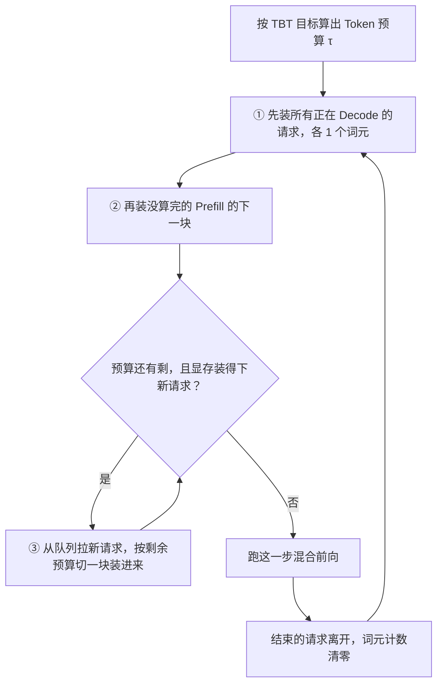

# Sarathi-Serve：把 Prefill 切开，正在吐字的 Decode 才不用停

<!-- release-date: 2024-03-04 -->

> 本文依据 **Taming Throughput-Latency Tradeoff in LLM Inference with Sarathi-Serve**，arXiv:2403.02310v3，2024-06-17，共 18 页。页码均指这份 PDF。作者来自 Microsoft Research India 与 Georgia Institute of Technology，一作 Amey Agrawal 的部分工作在 MSR India 实习期间完成；论文录用于 OSDI 2024，封面带 USENIX 产物评审的三枚徽章（PDF p. 1）。全文把三件事分开标注：**报告明确写了什么**、**我们如何解释或验算它**、**哪些是外部资料补充**。

## 读前先把几个词说成人话

这篇论文不难在公式，难在它同时用 GPU 算子和在线服务两套词。先把反复出现的几个钉住：

- **Prefill（预填充）**：一次请求的第一段。整段提示词一次喂进去，并行算完，吐出第一个输出词元。
- **Decode（解码）**：之后逐个生成。每一步只吃上一步刚生成的那个词元，再吐下一个，直到结束符。
- **KV Cache（键值缓存）**：每个处理过的词元留下的 Key、Value 向量。Decode 每步都要回看全部历史，所以它们留在显存里不重算。怎么分页管理它是 PagedAttention 一篇的事，本文不展开。
- **TTFT（Time To First Token，首词延迟）**：请求到达到第一个输出词元出现。论文取中位数。
- **TBT（Time Between Tokens，词间隔）**：同一请求相邻两个输出词元的间隔。每吐一个词就产生一个 TBT，论文看它的 P99，衡量「字吐得顺不顺」（PDF p. 4、p. 10）。
- **Capacity（容量）**：守住延迟目标时，系统能持续扛住的最大到达率，单位是每秒查询数。这是论文唯一的吞吐指标（PDF p. 4）。
- **迭代（iteration）**：模型的一次前向。调度器每一步决定这次前向里装哪些请求的哪些词元。
- **生成停顿（generation stall）**：正在 Decode 的请求被新来的整段 Prefill 堵住，输出流停住。这是论文要消灭的现象（PDF p. 2）。
- **Token 预算（token budget）**：每一步最多允许进入计算的词元数。它是这个调度器唯一的核心旋钮。
- **流水线气泡（pipeline bubble）**：流水线并行里，后一级在等前一级，GPU 空转的那段时间。

## 一句话先说清

2024 年初的在线推理系统被迫做单选题：要么像 FasterTransformer 那样先把正在解码的请求跑完，字吐得稳但吞吐低；要么像 Orca、vLLM 那样一有显存就把新请求的整段 Prefill 塞进来，吞吐高但正在吐字的人会被卡住几秒（PDF p. 2）。

Sarathi-Serve 的判断是：卡住的根源不是「混着跑」，而是 **「Prefill 必须一次算完」** 这个默认假设。它用两招打破它（PDF p. 1–3）：

1. **分块预填充（chunked-prefills）**：把一条长 Prefill 沿序列切成计算量相近的块，分几步算完。
2. **无停顿组批（stall-free batching）**：每一步先装所有正在 Decode 的请求，再装没算完的 Prefill 块，最后才用剩余预算接新请求。

两招叠在一起，每步的词元数被预算卡住，单步耗时几乎不再取决于提示词多长（PDF p. 3）。大批次因此用得起；步与步耗时均匀，流水线并行的气泡也跟着变小。

摘要的三个数（PDF p. 1）：Mistral-7B 单张 A100，容量是 vLLM 的 **2.6 倍**；Yi-34B 两张 A100，最多 **3.7 倍**；Falcon-180B 开流水线并行，端到端容量最多 **5.6 倍**。这三个数的分母各不相同，后文「实验怎么证明」会逐个拆开。

它不是新的注意力算子，也不是新的显存分配器，而是一个调度器，代码建在 vLLM 之上（PDF p. 9–10）。

### 一条阅读路线

1. **p. 5 Figure 3、Figure 4**：Prefill 一条请求就吃饱算力，Decode 批越大越划算。整篇的物理前提。
2. **p. 6 Figure 7**：四种调度放在同一条时间线上，谁在等一眼可见。
3. **p. 7 Figure 8**：同一件事在流水线并行里变成气泡。
4. **p. 8 Figure 9、p. 9 Algorithm 3 与 §4.3**：切块混批的代价，以及每步先装谁、预算怎么定。
5. **p. 11 Figure 10–11、p. 12 Figure 12–13**：容量对照，以及拧预算怎么走吞吐–延迟曲线。
6. **p. 13 Figure 14、Table 4 与 §6**：切块有多贵、两招拆开会怎样、和 PD 分离的关系。

## 主要矛盾：一块 GPU 上跑着两种相反的负载

一次请求在第一个输出词元处分成两段（PDF p. 3）。Prefill 并行处理几百到几千个提示词元，矩阵乘的行数够多，算力吃得饱。Decode 每步每条请求只进 1 个词元，却要把整份权重从显存读一遍，算力大半闲着。

论文先用 Mistral-7B、单张 A100、提示词 1024 量了一遍（PDF p. 5，Figure 3），读图如下：

| 批大小 | 1 | 2 | 4 | 8 | 16 | 32 | 64 |
|---|---:|---:|---:|---:|---:|---:|---:|
| Prefill 吞吐（词元/秒，读图） | 约 4,400 | 约 5,400 | 约 5,200 | 约 4,700 | — | — | — |
| Decode 吞吐（词元/秒，读图） | 约 10 | — | — | 约 110 | 约 220 | 约 420 | 约 810 |

两行的形状才是结论：Prefill 批从 1 加到 8，吞吐没有再涨，一条请求就已经吃饱；Decode 批从 1 加到 64，吞吐几乎按比例往上走。**Takeaway-1** 把它写成一句：批处理极大提升 Decode 吞吐，对 Prefill 几乎没用（PDF p. 5）。两阶段的绝对值也差得远，批 64 的 Decode 仍只有 Prefill 单条的五分之一左右。

时间花在哪？Figure 4 把一次前向拆成线性层、注意力和其他（PDF p. 5）。两阶段都是线性层占大头；注意力随序列长度平方增长，但即便序列很长，线性层仍占总时间 80% 以上。读图：Decode 一步从批 1 到批 64 都在 20 毫秒上下，线性层部分几乎不动。图注给了一个很好用的换算：**1 个 Decode 词元的线性层成本，约等于 128 个 Prefill 词元**（PDF p. 5）。

于是后文的分析只盯线性层。论文把一次线性层的耗时近似成（PDF p. 5）：

$$
T = \max(T_{\mathrm{math}},\ T_{\mathrm{mem}})
$$

$T_{\mathrm{math}}$ 是做乘加的时间，$T_{\mathrm{mem}}$ 是从显存搬数据的时间，谁大谁是墙。$T_{\mathrm{math}} < T_{\mathrm{mem}}$ 叫访存受限，模型浮点利用率（MFU）低；反过来叫算力受限，模型带宽利用率（MBU）低；两者相等时算力和带宽同时用满。**算术强度**是每搬 1 字节能做多少次运算，它对上设备的「算力 / 带宽」比值时就是甜点。

Figure 5 画的是 LLaMA2-70B 线性层、四张 A100，算术强度随批内词元数上升（PDF p. 6）：Decode 是左下角粉色访存区里的一个红点，Prefill 是上方算力区里的蓝点，中间标着「Balanced - Sarathi-Serve」的绿点落在约 600 个词元处。Figure 6 把同一件事换成时间：词元少时耗时几乎不涨，因为反正都在等权重；跨过门槛后才线性上升（PDF p. 6）。脚注说理论上 A100 约 200 个词元就该进入算力受限，但更高张量并行度下因为固定开销，实测要 500–600 个（PDF p. 6）。

**Takeaway-2**：Decode 批停在访存受限区，可以再往里塞词元而几乎不增加延迟（PDF p. 6）。

**我们如何解释它**：这就是「切开 Prefill 往 Decode 里塞」在物理上成立的原因。切出来的块吃的是 Decode 本来浪费的算力，不是 Decode 正在等的带宽。块太大，这一步就冲进算力区，又变成「等计算」，TBT 重新恶化。Token 预算要拧的，就是块的大小。

## 第二层矛盾：批要大，字就会停

Decode 要大批才能摊薄权重读取。可线上请求是陆续到的，新请求进来第一件事是 Prefill，所以大批次必然意味着：有人在吐字，有人在读提示词，两件事挤在同一张卡上。

论文把当时的调度器分成两类（PDF p. 2、p. 4–5，Algorithm 1–2）：

| | Decode 优先 | Prefill 优先 |
|---|---|---|
| 代表 | FasterTransformer 等请求级批处理 | Orca、vLLM 等迭代级批处理 |
| 做法 | 凑一批，先算完这批的 Prefill，再一直 Decode 到最后一条结束，才接新请求 | 每一步结束都检查显存，一有空就把新请求的 Prefill 急着塞进来 |
| 好处 | 新请求不会打断正在解码的人，TBT 好 | 后续 Decode 批更满，吞吐高 |
| 代价 | 有人先结束，批就变瘦，GPU 空转，吞吐低 | 一段 Prefill 可能跑好几秒，正在解码的人全部停住 |

还有一个容易读错的细节，按原文钉死（PDF p. 6）：**论文评测时的 vLLM，一步里要么全是 Prefill，要么全是 Decode，不混批**；Orca 可以混，但混的是整段 Prefill。今天的 vLLM 已不是这个实现，见文末「论文之后」。

Figure 1 是生成停顿的实测（PDF p. 1）：Yi-34B、两张 A100、128 条来自 arxiv-summarisation 的请求。左图 vLLM 的「已生成词元数」曲线在 200 秒附近出现一段持续数秒的平台，Sarathi-Serve 同段平滑上升。右图把负载从每秒 0.55 加到 1.0 个查询，读图 vLLM 的 P99 TBT 约 0.52、0.65、1.39 秒，Sarathi-Serve 一直在 0.31–0.33 秒。

下面这张图是整篇的核心证据，四种调度面对同样四条请求：

图上三种旧调度各自卡住一方。Orca 那一行最值得细看：它确实支持混批，可只要混进去的是整段 Prefill，这一步的耗时就由最长那条提示词决定，正在解码的人照样等（PDF p. 6–7，Figure 7 图注）。

**Takeaway-3**：Prefill 与 Decode 交错本身就是吞吐与延迟的取舍，当时的先进系统都选了 Prefill 优先，用 TBT 换吞吐（PDF p. 7）。Orca 论文建议用更小的批来压延迟尖刺；论文反驳说，减小 Decode 批会直接打掉吞吐（PDF p. 7）。

## 第三层矛盾：步与步不均匀，流水线就空转

张量并行（TP）把每层切到多张卡，每层要做两次 all-reduce，通信在关键路径上，所以只适合节点内的 NVLink；跨节点通常改用流水线并行（PP），按层切开，只在级间点对点传一次激活（PDF p. 2、p. 4）。代价是气泡：后一级必须等前一级把这个微批算完。

推理只有前向，按理说微批能把气泡填平；Orca 论文甚至认为迭代级调度能消除气泡（PDF p. 7）。论文的实测不支持这一点，原因是 LLM 每一步的计算量极不稳定：

论文点名三类气泡（PDF p. 7）：相邻两步 Prefill 词元数不同（PB1）；一步 Prefill 接一步 Decode，耗时差一截（PB2）；同是 Decode，注意力成本随 KV 变长，步与步仍不均匀（PB3）。量级例子来自 Falcon-180B：一条 4k 提示词的 Prefill 约 1150 毫秒，批 32 的一步纯 Decode 约 200 毫秒，交错一次就可能留下约 950 毫秒的气泡（PDF p. 7）。提示词越长、批越大，气泡越重。

**Takeaway-4**：一步的计算量随 Prefill / Decode 组成剧烈变化，这个方差在流水线并行里变成实打实的吞吐损失（PDF p. 7）。

**我们如何解释它**：三层矛盾其实是同一个根——一步里装多少计算没有上限。单卡上它表现为 TBT 尖刺，跨节点上它表现为气泡。所以解法不必分两套：只要每步计算量被同一个上限卡住，两件事一起缓解。

## 核心设计一：分块预填充——块要大到吃饱算力，小到不堵 Decode

最朴素的想法是「把 Decode 和 Prefill 混进同一步」，这正是 Orca 的混批。问题是真实提示词常有几千个词元：openchat_sharegpt4 的提示词中位数是 1730，arxiv_summarization 是 7059（PDF p. 8、p. 10）。整段混进去，TBT 照样爆。

分块预填充靠两个观察成立（PDF p. 8）：

1. Prefill 不需要整段提示词才能打满 GPU。Figure 4 里序列长度到约 512，Prefill 吞吐就开始饱和。
2. 真实提示词往往远长于 512。

所以存在一个窗口：块大到仍能吃饱算力，又小到不会把 Decode 的 TBT 拉爆。Figure 9 量了这个窗口值多少（PDF p. 8）。每格是「这一步耗时相对纯 Decode 的倍数」，左边是切块混批（Sarathi-Serve），右边是整段混批（Orca 式），全部读自柱顶标注：

**Mistral-7B，单张 A100，预算 256**

| 上下文 \ 批大小 | 1 | 32 | 64 |
|---|---|---|---|
| 1024 | 1.8 / 5.7 | 1.4 / 3.8 | 1.2 / 2.8 |
| 2048 | 1.9 / 10.2 | 1.4 / 5.5 | 1.3 / 3.7 |
| 4096 | 2.0 / 20.3 | 1.3 / 7.8 | 1.2 / 5.1 |

**LLaMA2-70B，四张 A100，预算 512**

| 上下文 \ 批大小 | 1 | 32 | 64 |
|---|---|---|---|
| 1024 | 3.6 / 7.1 | 3.1 / 6.0 | 2.5 / 4.7 |
| 2048 | 3.6 / 13.3 | 2.8 / 9.7 | 2.2 / 7.1 |
| 4096 | 3.7 / 28.3 | 2.5 / 16.6 | 1.9 / 10.6 |

正文点名的是 **28.3 倍**：朴素混批可以把 TBT 拉到纯 Decode 的 28.3 倍（PDF p. 8）。两张表的共同形状是：整段混批的倍数随上下文变长而暴涨，切块混批几乎不随上下文变；批越大，切块混批的相对代价越小。图注把后一点写成「上下文越长、批越大，切块对延迟的相对影响越小」（PDF p. 8）。

切块不是免费的。每一块的注意力都要读同一条提示词里**前面所有块**的 KV：切成 $N$ 块时，第 1 块的 KV 被再读 $N-1$ 次，第 2 块 $N-2$ 次，以此类推。计算量不变，显存读变多（PDF p. 9）。论文的判断是：即便块很小，Prefill 注意力仍是算力受限，这份额外读取通常不是主因；看得见的开销更多来自内核启动一类的固定成本（PDF p. 9）。实测开销见后文 Figure 14。

## 核心设计二：无停顿组批——每一步先装谁，比「要不要切」更重要

分块解决「一块多大」，无停顿组批解决「这一步先装谁」。Algorithm 3 把顺序写死（PDF p. 8–9）：

这张图按 PDF p. 9 Algorithm 3 转写：第 6–8 行装 Decode，第 9–12 行续算未完成的 Prefill，第 13–20 行接新请求，第 11 与 15 行按剩余预算算块大小，是机制示意，不含时间。

这个顺序比「混批」两个字硬得多，它保证三件事：

- 已经在吐字的请求每一步都会被调度，新来的长提示词挤不停它们。
- 一条 Prefill 一旦开切，会先于更新的请求被续完，不会在半路被新 Prefill 插队，留下一堆半成品同时占着 KV。
- 每步词元总数被 $\tau$ 卡住，单步耗时有上限，而且几乎不取决于提示词全长（PDF p. 3）。

回到 Figure 7 的例子（PDF p. 8–9）：C 到达后，它的 Prefill 被切成两块，分两步和 A、B 的 Decode 同跑；A 在第二块那一步后结束；D 等 C 的 Prefill 做完、预算空出来才开始自己的第一块。谁都没被整段卡住。

**我们如何解释它**：混批的收益来自 Decode 的空闲算力，混批的危害来自 Prefill 没有上限。真正要锁的不是「能不能混」，而是「混进去的 Prefill 谁说了算」。Token 预算就是那把锁，装批顺序是锁的钥匙。

**对自己的项目有什么用**：自己写调度器时，先把「Decode → 未完成 Prefill → 新请求」这条全序写成测试，再谈任何启发式。只开切块、仍按 Prefill 优先装批，得到的是后文表 4 里 TTFT 变差、TBT 没全好的那一行。

## Token 预算：把 TBT 目标编译成「每步最多塞多少词元」

预算由两股力平衡（PDF p. 9）：往小拧，每步 Prefill 词元少，TBT 好；往大拧，切得份数少，GPU 利用率更高、重复读 KV 更少，Prefill 更高效。论文另外点名两个暗坑。

**分块量化效应（tile quantization）**。GPU 做矩阵乘时把矩阵切成固定大小的 tile 交给线程块，维度不能被 tile 整除时，有的线程块在做无效计算。论文的例子：块大小取 257 比取 256，有时会让 Prefill 时间增加 **32%**（PDF p. 9）。

**流水线气泡**。块越大，步与步耗时差越大，气泡越多；块太小，算术强度掉下去，固定开销占比上升（PDF p. 9）。

所以论文的操作是：一次性 profile 不同词元数的批，把预算设成「不违反 TBT 目标的最大词元数」；实际用自家的推理模拟器 Vidur，在具体模型、并行度和硬件上搜这个值（PDF p. 9）。评测取值写在 §5.1（PDF p. 11）：严格目标下所有模型都是 **512**，宽松目标下是 **2048**，唯独 LLaMA2-70B 宽松档用 **1536** 来压气泡。按负载动态改预算被留作未来工作（PDF p. 11）。

## 实现：建在 vLLM 之上，不重做分页

§4.4 很短，边界清楚（PDF p. 9–10）：代码从开源 vLLM 长出来；分页的分块 Prefill 用 FlashAttention v2 和 FlashInfer 两套内核实现，评测全部走 FlashAttention，因为它支持的模型更多；另加了多种调度策略、流水线并行和一套遥测；张量与流水线通信都走 NCCL。附录 A 说得更直：这是 vLLM 的研究分支，**没有和开源 vLLM 做完整功能对等**，只保留了快速迭代研究所需的部分；复现实验在仓库的 `osdi-sarathiserve` 分支（PDF p. 18）。

所以这篇的新东西停在调度层。块表、物理块、写时复制都是底座，不是贡献。

## 实验怎么证明

### 实验台

| 模型 | 注意力 | GPU 与并行 | 总显存（每卡） |
|---|---|---|---|
| Mistral-7B | GQA + 滑动窗口 | 1 张 A100 | 80 GB（80 GB） |
| Yi-34B | GQA | 2 张 A100，TP2 | 160 GB（80 GB） |
| LLaMA2-70B | GQA | 8 张 A40，TP4 + PP2 | 384 GB（48 GB） |
| Falcon-180B | GQA | 2 节点 × 4 张 A100，TP4 + PP2 | 640 GB（80 GB） |

表 1（PDF p. 10）。除 LLaMA2-70B 外，机器是 Azure NC96ads v4：每台 4 张 80 GB A100，卡间两两 NVLink，机间 100 Gbps 以太网；LLaMA2-70B 用一台 8 张 48 GB A40 的服务器（PDF p. 10）。

负载只借数据集的长度分布，到达时间按泊松过程合成（PDF p. 10，表 2）：

| 数据集 | 提示词 中位 / P90 / 标准差 | 输出 中位 / P90 / 标准差 | 论文怎么看它 |
|---|---|---|---|
| openchat_sharegpt4 | 1730 / 5696 / 2088 | 415 / 834 / 101 | 多轮对话，每轮一条请求，提示词方差大 |
| arxiv_summarization | 7059 / 12985 / 3638 | 208 / 371 / 265 | 长文档摘要，接近 M365 Copilot 一类负载 |

两者分别去掉总长超过 8192 和 16384 的请求（PDF p. 10）。

**SLO 怎么定。** 仿照 Splitwise，以「这个模型在这套硬件上、4k 提示词、批 32、无 Prefill 干扰时一步 Decode 的耗时」为单位：严格档是它的 5 倍，宽松档是 25 倍（PDF p. 10）。绝对值见表 3：

| 模型 | 宽松 P99 TBT | 严格 P99 TBT |
|---|---:|---:|
| Mistral-7B | 0.5 秒 | 0.1 秒 |
| Yi-34B | 1 秒 | 0.2 秒 |
| LLaMA2-70B | 5 秒 | 1 秒 |
| Falcon-180B | 5 秒 | 1 秒 |

严格档对应聊天这类交互，宽松档对应「整段输出要在可预期时间内结束，但不苛求每个字」。容量的「可持续」还要求中位调度延迟不超过 2 秒，免得排队撑爆（PDF p. 10）。对照系统是 Orca 与当时的 vLLM。

### 容量：柱上倍数的分母是 Orca

Figure 10、11 每组三根柱，柱顶标一个倍数（PDF p. 11）。正文没说这个倍数的分母；用柱高一除，它对上的是 **Orca**，不是 vLLM（我们的读图验算）。全部标注如下：

| 模型 | 数据集 | 严格档 | 宽松档 |
|---|---|---:|---:|
| Mistral-7B | openchat | 2.78× | 2.15× |
| Mistral-7B | arxiv | 1.82× | 1.97× |
| Yi-34B | openchat | 4.00× | 2.44× |
| Yi-34B | arxiv | 1.69× | 1.94× |
| LLaMA2-70B | openchat | 5.54× | 6.31× |
| LLaMA2-70B | arxiv | 4.60× | 3.00× |
| Falcon-180B | openchat | 4.69× | 5.62× |
| Falcon-180B | arxiv | 4.20× | 2.75× |

相对 vLLM 的数字写在正文里（PDF p. 11）：Yi-34B、openchat、严格档，相对 Orca 4.0 倍、相对 vLLM 3.7 倍，这就是摘要的「最多 3.7 倍」；LLaMA2-70B、openchat 上，相对 Orca 最多 6.3 倍、相对 vLLM 最多 4.3 倍。

把摘要三个数的分母摆齐：

- **2.6 倍**：Mistral-7B、单张 A100，相对 vLLM（PDF p. 1、p. 14）。按 Figure 10a 读图，严格档 Sarathi-Serve 约 2.03、vLLM 约 0.77，相除约 2.6。图上那根柱标的 2.78 倍是相对 Orca。
- **3.7 倍**：Yi-34B、两张 A100、openchat、严格档，相对 vLLM（PDF p. 11）。
- **5.6 倍**：Falcon-180B、openchat、宽松档的柱顶标注 5.62 倍，按上面的读法分母是 Orca。同一格相对 vLLM（带论文自己补的流水线并行）只有 1.48 倍（PDF p. 12）。

**我们如何解释它**：读图还能看出一个形状。相对 vLLM 的优势集中在严格档；宽松档里 vLLM 的容量回升，Mistral-7B 与 Falcon-180B 上 Sarathi-Serve 的领先都只剩约 1.5 倍（读自 Figure 10a、Figure 13b）。这正对得上论文的观察：多数场景下 Orca 与 vLLM 在走到自己的吞吐上限之前就先违反了 P99 TBT，所以放宽目标能让它们的容量明显上升（PDF p. 11）。倍数大，说明停顿真是瓶颈；倍数小，说明目标松到停顿不再致命。

另两条观察（PDF p. 11）：arxiv 这组提示词更长，所有系统的绝对容量都更低；宽松档下 vLLM 明显强于 Orca，因为 Orca 会把多条提示词整段拼进一步，又没有 PagedAttention，能开的批更小。

### 拧预算，就能走那条吞吐–延迟曲线

图的形状讲了三件事（PDF p. 12）。第一，vLLM 按 Orca 论文的建议试了最大批 32、64、128，三条线几乎重合：PagedAttention 让大批在显存上装得下，可 Prefill 优先的调度在延迟约束下用不上这个批。第二，Sarathi-Serve 的吞吐–延迟取舍由预算精确控制：小预算在严格目标下领先，大预算在宽松目标下领先。第三，预算选错会输：最严目标下预算 2048 的容量低于 vLLM。

正文给了两个锚点：预算 512 在严格目标下相对 vLLM **3.5 倍**，预算 2048 在 Yi-34B、1 秒目标下相对 vLLM **1.65 倍**（PDF p. 12）。后一个读图对得上（约 1.28 对 0.78）。前一个正文写作「100 毫秒、Mistral-7B」，图注却写「Yi-34B 严格目标下 3.5 倍」；读图 Yi-34B 在 0.2 秒处约 1.14 对 0.33，约 3.5 倍，而 Mistral-7B 在 0.1 秒处约 2.03 对 0.77，约 2.6 倍。我们按图与图注，把 3.5 倍归到 Yi-34B。

### 跨节点：纯 TP 太慢，PP 要靠切块才能用

Falcon-180B 跑在两台 4 卡 A100 上，机间 100 Gbps 以太网，三种部署：vLLM 的 8 路 TP；vLLM 加上论文实现的流水线并行（节点内 TP4、节点间 PP2）；Sarathi-Serve 同样的 TP4 + PP2（PDF p. 12）。

Figure 13a 量纯 Decode 批的中位 TBT：跨节点 TP 约是「节点内 TP + 节点间 PP」的 2 倍，因为 all-reduce 要穿以太网（PDF p. 12）；读图批 8 时约 0.19 对 0.085 秒，批 128 时约 0.36 对 0.15 秒。Figure 13b：纯 TP 即便在宽松目标下容量也低；vLLM 的混合并行在宽松档还扛得住，一进严格档就被气泡拖下去。Sarathi-Serve 相对 vLLM 混合并行，宽松档 **1.48 倍**、严格档 **3.6 倍**；图注还写严格档相对纯 TP **4.3 倍**（PDF p. 12）。

**我们如何解释它**：分页解决「显存里能不能装下大批」，切块解决「大批跨节点时延迟和气泡会不会一起炸」。两件事在同一条服务链上缺一不可，但不是同一篇论文的贡献。

### 消融：切块有多贵，两招拆开会怎样

Figure 14 只问切块让 Prefill 自己慢多少（PDF p. 13）：Yi-34B、TP2，提示词 2k、4k、8k，块大小 512、1024、2048，纵轴相对不切块的耗时。正文写块 512 时「最多约 25%」，块 2048 时几乎看不出开销。读图块 512 的三根柱约 1.29、1.33、1.27，块 1024 约 1.20、1.22、1.17，块 2048 约 0.99、1.01、0.96。**正文的 25% 比柱高略低**，引用时应写「块 512 时约 25%–33%」更稳妥。

表 4 把两招拆开跑（PDF p. 13）：Yi-34B、两张 A100、预算 1024、128 条请求，单位秒。

| 调度 | openchat P50 TTFT | openchat P99 TBT | arxiv P50 TTFT | arxiv P99 TBT |
|---|---:|---:|---:|---:|
| 只混批，不切块 | 0.53 | 0.68 | 3.78 | 1.38 |
| 只切块，不混批 | 1.04 | 0.17 | 5.38 | 0.20 |
| 两招一起（Sarathi-Serve） | 0.76 | 0.14 | 3.90 | 0.17 |

论文的因果链（PDF p. 13）：只切不混，Decode 不再被整段 Prefill 堵住，TBT 好，但 Prefill 块略低效，又没有 Decode 帮忙填满步，TTFT 变差；只混不切，Prefill 与 Decode 共享一步，TTFT 好，但长 Prefill 仍制造停顿，TBT 差；两招一起，TBT 三档最好，TTFT 居中。论文说这些趋势在其他模型与硬件组合上一致，但只给了这一组。

## 论文怎么看 PD 分离

脚注 1 与 §6 把 Splitwise、DistServe、TetriInfer 单列成第三类「分离式」：把 Prefill 与 Decode 放到不同副本（PDF p. 2、p. 13）。论文承认这条路能**彻底消除**两阶段干扰，而且 Prefill 能以最高效率整段算，TTFT 往往更好，切块 Prefill 则会慢一些。它列的代价有两条：Prefill 结束要把 KV 迁到 Decode 副本，没有高带宽互连时迁移本身就难；Prefill 副本的显存用不满，因为 KV 主要堆在 Decode 侧。定量对比明确留作未来工作（PDF p. 13）。

同一节还把公平性调度、FastServe 的抢占、APIServe 借切块做多轮 API 的提前重算列为可以叠加的正交工作；FlashAttention、通信重叠、MQA、量化、MoE 也都标成正交（PDF p. 13–14）。GQA 只作为实验模型的既成事实出现：LLaMA2-70B 的 KV 占用比 LLaMA-65B 小 8 倍，让更大的 Decode 批装得下（PDF p. 4）。

跨篇对照（不是本 PDF 的内容）：同期的 DistServe 一篇站在另一边，认为切块混批只是拿 TTFT 换 TPOT，消不掉干扰。两篇的实验都只和共置系统比，没有正面交手。

## 论文写了什么、没写什么

**被实验托住的：**

- 生成停顿是 Prefill 优先调度的结构性产物，不是偶发（Figure 1、Figure 7）；
- 朴素混批可以把 TBT 拉到纯 Decode 的 28.3 倍，切块后同设置约 3.7 倍（Figure 9）；
- 切块加无停顿组批，在给定 P99 TBT 下提高容量，优势集中在严格目标（Figure 10–12）；
- 两招拆开都偏科，合在一起才同时压住 TTFT 与 TBT（表 4）；
- 跨节点纯 TP 的 Decode TBT 约是「节点内 TP + 节点间 PP」的 2 倍，没有切块，PP 在严格目标下用不起来（Figure 13）。

**只是作者观察、没有铺开的：**

- 线性层即便长序列也占 80% 以上时间、1 个 Decode 词元约等于 128 个 Prefill 词元，都只来自 Mistral-7B / 单张 A100 这一组（PDF p. 5）；
- 理论 200 个词元进入算力受限、实测 500–600 个，是一条脚注（PDF p. 6）；
- 「消融趋势在各模型与硬件上一致」只有文字，没有表。

**论文承认没做的：**

- 按负载动态调预算（PDF p. 11）；
- 与 PD 分离的定量比较（PDF p. 13）；
- 与开源 vLLM 的功能对等（PDF p. 18）；
- 到达过程是泊松合成，数据集本身没有时间戳（PDF p. 10）。

**完全没涉及的：**

- KV 分页、前缀缓存、写时复制的新设计，底座沿用 vLLM；
- 投机解码、量化、MoE 路由与专家并行；
- 优先级、抢占、公平性的完整策略，只规定了装批顺序；
- 注意力内核里怎么把分页和切块融在一起，只说用了 FlashAttention v2 与 FlashInfer；
- 能耗与美元成本，容量是唯一的吞吐指标。

## 论文之后发生了什么（外部补充）

以下都不是这份 PDF 的内容。

- **vLLM 吸收了这套调度。** vLLM v0.4.2 的性能调优文档（文档 PR [#4580](https://github.com/vllm-project/vllm/pull/4580)，2024-05-04 合并）写明：[默认调度仍是 Prefill 优先、不混批](https://docs.vllm.ai/en/v0.4.2/models/performance.html)；打开实验特性 `enable_chunked_prefill` 后改为先把所有待解码请求放进批，再用剩余的 `max_num_batched_tokens` 装 Prefill，最后一条装不下就切块，默认预算 512。这和 Algorithm 3 的顺序一致。2025-01 的 [vLLM V1 发布博客](https://blog.vllm.ai/2025/01/27/v1-alpha-release.html) 进一步取消了 Prefill / Decode 的调度区分，每步只按固定词元预算给各请求分配词元数，切块成了调度器的自然结果。所以用今天的 vLLM 去复现 Figure 10，会得到完全不同的对照。
- **PD 分离走了另一条路。** 论文点名的 Splitwise、DistServe，以及后来的 Mooncake，把「彻底拆开」做成了大规模服务的主流形态之一；Mooncake 一篇也记录了它只把「不必切块、又不破 TBT」的短 Prefill 内联进 Decode 批。两条路并不互斥。
- **前作 SARATHI**（[arXiv:2308.16369](https://arxiv.org/abs/2308.16369)）最早提出切块 Prefill 加「捎带 Decode」，测的是离线吞吐；本篇的参考文献 [29] 就是它（PDF p. 15）。两篇的数字不要混用。

## 可迁移启发

1. **先证明两个阶段是两种机器，再谈调度。** 论文最值得学的不是「切块」这个名词，而是先用 Figure 3–6 证明 Prefill 算力饱和、Decode 访存受限。调度器若仍把「一步前向」一视同仁，就只能在吞吐和 TBT 里单选。
2. **干扰的粒度决定尾延迟的粒度。** 整段 Prefill 是秒级干扰，切成 512 的块是几十毫秒级。用户感觉到的「卡一下」对应 P99 TBT，不是平均吞吐；表 4 里只混不切的 P99 TBT 仍有 0.68–1.38 秒。
3. **混批要锁顺序，不能只锁开关。** 「Decode → 未完成 Prefill → 新请求」这条全序才是策略。
4. **预算是 SLO 的编译结果，不是魔法数。** 512 和 2048 只是这份评测的取值；Figure 12 说明预算选错会输给 vLLM。换模型、换并行度、换卡都要重测，还要躲开 257 这种 tile 陷阱。
5. **一旦用了流水线，均匀比快更重要。** 切块在单卡上是为了 TBT，在 PP 上是为了让微批可比。跨以太网硬上纯 TP，Decode TBT 直接翻倍。
6. **看倍数先看分母和目标档。** 同一套系统，严格档相对 vLLM 在 2.6–4.3 倍之间，宽松档只剩约 1.5 倍；柱顶标注的分母还是 Orca。
7. **局部变慢换全局受控，要说清交换条件。** 切块让 Prefill 慢约四分之一，TTFT 略差。业务若是「长提示词、短输出、只考核首字」，论文自己的逻辑指向相反方向：加大预算，甚至不切。

## 关键词回看

- **Prefill / Decode**：前者算力受限，后者访存受限；前者一条就吃饱，后者批越大越划算。
- **生成停顿**：Prefill 优先调度把整段 Prefill 插进解码步之间，正在吐字的请求停住。
- **分块预填充**：沿序列把 Prefill 切成计算量相近的块，分几步算完。
- **无停顿组批**：每步按「Decode → 未完成 Prefill → 新请求」装批，总词元数不超过预算。
- **Token 预算**：每步词元上限，由 TBT 目标、切块开销、tile 对齐和 PP 气泡共同决定。
- **分块量化效应**：矩阵维度对不齐 tile 时的无效计算，257 对 256 可差 32%。
- **三类气泡**：Prefill 长短不一、Prefill 与 Decode 交替、Decode 注意力随 KV 变长。
- **Capacity**：守住 P99 TBT、中位调度延迟不超过 2 秒时的最大 QPS。

## 资料与阅读边界

- **本文依据**：[arXiv:2403.02310v3](https://arxiv.org/abs/2403.02310)，2024-06-17，18 页，为 arXiv 上的最新版；正式发表于 OSDI 2024（[会议页](https://www.usenix.org/conference/osdi24/presentation/agrawal)），会议论文集版的页码与本文所引不同。
- **`release-date` 取 2024-03-04**：Sarathi-Serve 是一套调度技术，没有单独上线的产品，按技术首次官方公开日记，即 arXiv v1 提交日（2024-03-04 18:47 UTC）。官方仓库 [microsoft/sarathi-serve](https://github.com/microsoft/sarathi-serve) 虽建于 2023-11，但无从证明当时已公开，2024-05-08 才有「准备开源发布」的提交，不回写；后续修订与开会日也不回写。
- **图表**：Figure 7、8 的讲解图据原图重画，是机制示意；Figure 12 的讲解图逐点读数重画，是读图近似；Figure 9、10、11 的倍数取自柱顶标注，Figure 1、3、4、13、14 的数值读自原图，均已在正文注明；Algorithm 3 转写为 Mermaid；表 1–4 按 PDF 转录。
- **未公开或无法核实**：Vidur 搜出的预算与实测曲线；「消融趋势在各组合上一致」的其他组数据；Figure 10–11 各柱的精确绝对值。
