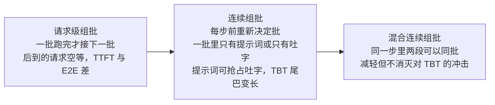
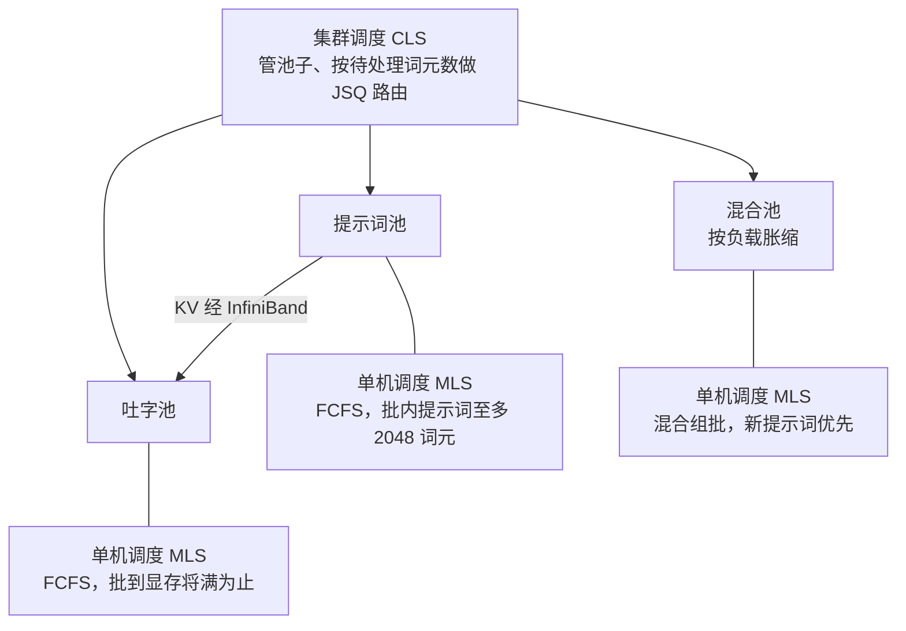

# Splitwise：算提示词的 GPU 和吐字的 GPU，本来就该分开买

<!-- release-date: 2023-11-30 -->

> 本文依据 **Splitwise: Efficient Generative LLM Inference Using Phase Splitting**，arXiv:2311.18677v2，2024-05-20，共 15 页。页码均指这份 PDF。作者 Pratyush Patel、Esha Choukse、Chaojie Zhang、Aashaka Shah、Íñigo Goiri、Saeed Maleki、Ricardo Bianchini；第一作者属 University of Washington，脚注说部分工作是在 Microsoft 实习期间完成，其余六位都属 Microsoft（PDF p.1）。全文把三件事分开标注：**报告明确写了什么**、**我们如何解释或验算它**、**哪些是外部资料补充**。

这是一篇 **推理集群的供货与调度** 论文，不是新注意力，也不是新的显存管理器。模型、kernel、显存分页都沿用当时的 vLLM；它改的是「哪台机器干哪一段活、买什么卡、限多少功耗」。

## 读前先把几个词说成人话

- **Prompt 阶段（prompt computation / prompt phase）**：一次请求的第一段。整段提示词一起过一遍模型，吐出第一个输出词元，同时写出这条请求的 KV 缓存。形状是大矩阵乘，算力吃得饱。后来的文献多叫它 Prefill。
- **吐字阶段（token generation / token phase）**：之后每一步只喂进上一个刚生成的词元，读完整份 KV 再吐下一个。并行度低，更吃显存带宽与容量。后来多叫 Decode。
- **KV 缓存（KV cache）**：每个词元在注意力层算出的 Key 与 Value，后面每一步都要回看，所以留在显存里不重算。拆机之后，它就是必须从一台机器搬到另一台的「请求状态」。
- **TTFT / TBT / E2E**：Time to First Token 是等到第一个输出词的时间；Time Between Tokens 是相邻两个输出词的间隔；End-to-End 是整个请求的耗时。TBT 是这篇论文自己加进指标集的，用来盯流式吐字顺不顺（PDF p.2，Table II）。
- **混合连续组批（mixed continuous batching）**：每一步前向都可以把「还在算提示词的请求」和「正在吐字的请求」装进同一批（PDF p.3）。论文除非另说都用这一档，它也是全部基线的组批方式。
- **CLS / MLS**：Cluster-Level Scheduler 管机器池与请求路由；Machine-Level Scheduler 管单机的排队与组批（PDF p.5）。
- **供货（provisioning）**：给定负载与 SLO，决定买几台、什么型号、放在哪个池里。论文用模拟器搜这件事。

PD 分离、KV 缓存的通用原理在知识库的 PD分离、KVCache 两篇；同期的另几种做法见 DistServe、Mooncake、Sarathi-Serve 三篇。这里只讲这份 PDF。

## 一句话先说清

Splitwise 的主张只有一句：**不要让「读提示词」和「吐字」抢同一台机器。**

理由不是「拆开更快」，而是两段活要的硬件根本不同：提示词要算力，吐字要显存带宽和容量。拆开之后，两段才能各买各的卡、各设各的功耗帽，再按吞吐、成本或供电去搜两池的台数（PDF p.1–2）。拆的代价是 KV 要过网，论文用逐层异步搬运把它压到用户几乎感觉不到。

摘要给的对照是：相对当时的集群设计，最多 **1.4×** 吞吐、成本低 **20%**；或在相同供电与成本预算下最多 **2.35×** 吞吐（PDF p.1）。结论段换了一组说法：同成本下 **1.76×** 吞吐、功率低 **15%**，或同成本同功率下 **2.35×** 吞吐（PDF p.12）。这几组数各自对应哪张图、哪个分母，放在「实验怎么证明」里拆开讲，它们不是同一张表的几个格子。

> **提示词吃算力，吐字吃带宽。代际升级把前者加得最猛、把后者加得最少，所以两段该跑在不同的机器上。**

### 一条阅读路线

1. **p.1 Table I**：A100 到 H100，哪几项涨得多、哪几项没涨。
2. **p.3–5 第 III 节的七条洞察**：Figure 4–9 与 Table IV，每条都在给「拆开」找硬件理由。
3. **p.5–6 Figure 10**：三个机器池和两级调度。
4. **p.6–7 Figure 11**：KV 怎么搬，逐层与串行怎么选。
5. **p.7–8 Table V 与 Figure 12**：四种机型组合和配比搜索。
6. **p.9–11 第 VI 节**：搬运实测、等功率 / 等成本 / 等吞吐三种供货，以及换负载的鲁棒性。

## 先看矛盾：新卡把算力加得最猛，吐字要的东西加得最少

论文开篇把 DGX-A100 和 DGX-H100 摆在一起（PDF p.1，Table I）：

| | A100 | H100 | 比值 |
|---|---:|---:|---:|
| TFLOPs | 19.5 | 66.9 | 3.43× |
| HBM 容量 | 80GB | 80GB | 1.00× |
| HBM 带宽 | 2039GBps | 3352GBps | 1.64× |
| 功耗 | 400W | 700W | 1.75× |
| NVLink | 50Gbps | 100Gbps | 2.00× |
| InfiniBand | 200GBps | 400GBps | 2.00× |
| 单机成本 | \$17.6/hr | \$38/hr | 2.16× |

算力涨了 3.43 倍，功耗涨了 1.75 倍，带宽只涨约 1.6 倍，容量一点没涨（PDF p.1）。表里 NVLink 写成 Gbps、InfiniBand 写成 GBps，后文实验又把 InfiniBand 写成 200 / 400 Gbps（PDF p.8–9），单位按原文照录。

论文由此推出三层麻烦（PDF p.1）：

1. 提示词阶段要最新卡的算力；吐字阶段即使用了当时最好的组批，计算单元仍然吃不饱。
2. 两段挤在同一台机器上，一步前向到底混进了多长的提示词是随机的，端到端延迟因此忽长忽短；服务只能多备昂贵的卡来守住交互式 SLO。
3. 云厂商同时在撞供电墙：新数据中心盖得再快，电也不够。

**我们如何解释它**：下一代 GPU 不是「每个阶段都快一截」。它把提示词要的东西加得最多，把吐字要的东西加得最少。只要这个剪刀差还在，「给吐字买新卡」就是在为用不上的算力和功耗付钱。后面所有异构组合，都从这张表出发。

## 一次请求为什么天生是两段

Figure 1 用「Is tomato a fruit?」画了一条时间线（PDF p.2）：提示词一次并行算完，得到第一个输出词，并把注意力层的上下文写进 KV 缓存；之后每一步只拿上一个词加整份 KV。所以前一段偏算力，后一段偏带宽与容量。

指标上，批处理类任务（如摘要）更在乎吞吐，对话 API 这类延迟敏感任务更在乎 TTFT 和 TBT（PDF p.2）。

组批有三档，Figure 2 画了它们对两段延迟的影响（PDF p.2–3）：

按 Figure 2 与第 II-D 节重画，是机制示意，不是实测时间。混合组批减轻不了的那部分，就是「和长提示词排在同一步的吐字，这一步会变慢」（PDF p.3）。拆机要消灭的正是它。

并行方面，全文用 8 卡张量并行，卡间走 NVLink；集群里每台机器一般 8 张旗舰 GPU，机器之间有 InfiniBand 数据面，云上每对 GPU 的 InfiniBand 带宽在 25–50GBps（PDF p.3）。这条现成的背板网络，是 Splitwise 敢拆机的物质前提。

## 七条洞察：同机混批为什么浪费

第 III 节是全文密度最高的地方。七条洞察各给一个拆机理由，后面的设计几乎都能在这里找到出处。

### 负载长什么样：编码和对话不是同一种活

刻画用 Azure 两条 LLM 服务在 **2023-11-11** 的生产轨迹：编码补全与对话。片段长 **20 分钟**，字段只有到达时间、输入词元数、输出词元数；因为隐私要求看不到提示词内容，评测时按长度造输入、强制生成对应长度的输出。刻画时 **请求之间不复用 KV**，用来模拟有安全保证的云服务（PDF p.3）。

模型取当时开源里最大的两档（PDF p.3，Table III），默认在一台 8×H100 上用 vLLM 跑：

| 模型 | 层数 | 隐藏维 | 注意力头数 |
|---|---:|---:|---:|
| Llama2-70B | 80 | 8192 | 32 |
| BLOOM-176B | 70 | 14336 | 112 |

Figure 3 的分布（PDF p.3）：编码的提示词中位数 **1500** 个词元（用户正在写的代码整段塞进来），输出中位数只有 **13**；对话的提示词中位数 **1020**、分布更宽，输出近似双峰、中位数 **129**。

**Insight I**：不同服务的提示词与输出分布可以差得很远（PDF p.3）。这条决定了后面「两池配比要跟着负载走」。

### 活跃词元很少，功夫都耗在吐字上

为了塞进单机，把轨迹缩到每秒 2 个请求。计数规则：提示词阶段按提示词长度记活跃词元，吐字阶段一条请求只记 1 个（PDF p.4）。Figure 4 显示，对话有 **60%–70%** 的时间批里只有 **20** 个或更少活跃词元；编码的输出更短，吐字阶段超过 **20%** 的时间只有 1 个活跃词元（PDF p.4）。

**Insight II**：混合连续组批大部分时间只批到很少的活跃词元（PDF p.4）。

延迟上（PDF p.4，Figure 5）：TTFT 随提示词长度几乎线性上涨，因为提示词阶段算力受限；硬把不同请求的输出词元批在一起，批到 **64** 时 TBT 也只涨到约 **2×**；不组批跑生产轨迹，E2E 的大头仍在吐字，连「长提示词、短输出」的编码也一样。BLOOM-176B 上，**1500** 个输入词元的提示词阶段，耗时只相当于 **6** 个输出词元的吐字阶段。

**Insight III**：对大多数请求，E2E 的大部分时间花在吐字阶段（PDF p.4）。

### 两段对组批的反应相反

Figure 6（PDF p.4）：提示词吞吐在批内超过 **2048** 个词元后开始下降，按轨迹中位数算，相当于批里不到 2 条请求；吐字吞吐随批增大一路上涨，直到批 **64** 时显存耗尽。Figure 7（PDF p.4–5）：提示词阶段先撞算力，吐字阶段每个活跃词元都要读自己整份上下文的 KV，先撞容量。

**Insight IV**：提示词的批要设上限才保性能；吐字的批越大越好，没有副作用（PDF p.4）。
**Insight V**：提示词组批受算力限制，吐字组批受显存容量限制（PDF p.5）。

### 功耗：吐字用不满供电预算，也不怕限功耗

这张图把 Figure 8 和 Figure 9 放在一起看（PDF p.5）：提示词阶段是算力密集的，功耗随批增大、顶到 TDP，功耗帽一降延迟就涨；吐字阶段访存受限，功耗不随批变，功耗帽从 700W 降到 350W、降掉一半以上，延迟几乎不动。

**Insight VI**：提示词阶段能有效用满 GPU 的供电预算，吐字阶段不能（PDF p.5）。

**我们如何解释它**：数据中心按峰值功率供电。一台吐字机永远只烧一半的电，却占着整台机器的供电额度，这部分额度就是白给的。给吐字机限功耗，等于把这份额度收回来再分给更多机器。后面的 Splitwise-HHcap 就是这条洞察的集群版。

### 换代卡：吐字不必坐最新的计算卡

Table IV 是 Llama2-70B、不组批、P50 的对照（PDF p.5）：

| | 编码 A100 | 编码 H100 | 比值 | 对话 A100 | 对话 H100 | 比值 |
|---|---:|---:|---:|---:|---:|---:|
| TTFT | 185 ms | 95 ms | 0.51× | 155 ms | 84 ms | 0.54× |
| TBT | 52 ms | 31 ms | 0.70× | 40 ms | 28 ms | 0.70× |
| E2E | 856 ms | 493 ms | 0.58× | 4957 ms | 3387 ms | 0.68× |
| 成本 | \$0.42 | \$0.52 | 1.24× | \$2.4 | \$3.6 | 1.5× |
| 能量 | 1.37 Whr | 1.37 Whr | 1× | 7.9 Whr | 9.4 Whr | 1.2× |

换到 A100，TTFT 掉得比 TBT 狠；编码几乎全是提示词，所以 E2E 伤得比对话重。整体上 A100 的推理成本与能耗不差于、甚至好于 H100（PDF p.5）。

**Insight VII**：吐字阶段可以跑在算力更弱的硬件上，换来更好的每瓦性能与每美元性能（PDF p.5）。

## 设计：两池各司其职，外加一个能伸缩的混合池

Figure 10 是总图（PDF p.5–6）。三个池的机器都预装同一份模型：

按 Figure 10 与第 IV-A、IV-B 节重画，是机制示意。

一条新请求被同时分配给 **一台提示词机和一台吐字机**。提示词机算出第一个词并写出 KV，把 KV 送给吐字机，吐字机用连续组批跑到结束；混合池里的机器用混合连续组批（PDF p.5）。设计目标随负载切换：低负载时优先延迟，高负载时避免两池切碎导致吞吐下降（PDF p.5）。

### 集群调度：池子怎么变

- **初始分配**：按预期负载与输入输出分布，把机器分到提示词池或吐字池（PDF p.6）。
- **混合池**：高负载时，机器可以临时移进混合池以减少碎片、守住 SLO。它记得自己原来的身份，队列里不再有「对面那类」任务时就回原池；切换池子没有可感知的延迟（PDF p.6）。
- **路由**：用 Join the Shortest Queue（JSQ），队列长度按 **待处理词元数** 算，不按请求条数。机器定期向 CLS 报告显存和队列变化，但不是每一步都报（PDF p.6）。
- **溢出**：队列超过阈值先找混合池；混合池也满，就去对面那一池找机器（吐字机来跑提示词，或反过来），并把它移进混合池（PDF p.6）。
- **粗粒度改派**：负载分布和最初假设差太远时，才把机器在提示词池与吐字池之间永久改派，而且很少做，通常要在混合池里待上相当一段时间才会触发（PDF p.6）。

提示词机和吐字机在请求进来时就一起定下来，是为了让 KV 搬运能和提示词计算重叠（PDF p.6）。

### 单机调度：三类机器三种规矩

- **提示词机**：FCFS。批内提示词总数限在 **2048** 个词元，依据就是 Figure 6a 的吞吐拐点；这是可配值，换模型或硬件可以改（PDF p.6）。
- **吐字机**：FCFS，能批多少批多少，显存快满时才开始排队（PDF p.6）。
- **混合机**：为守 TTFT，新到的提示词立刻优先；没容量就抢占吐字。为防吐字饿死，吐字的优先级随等待时间升高，并限制每条请求被抢占的次数（PDF p.6）。

**可迁移启发**：三类机器的规矩全都来自第 III 节的测量，而不是来自调度理论。提示词机的 2048 上限、吐字机「批到满」都是 Figure 6 的直接翻译。先测清每段活对批大小的反应，再定调度器的旋钮，旋钮才有依据。

## KV 怎么搬：逐层异步，而不是算完再寄

拆机的主要开销就是 KV 搬运（PDF p.6）。

**朴素做法**（Figure 11a）：提示词阶段结束、第一个词出来之后才开始整份寄 KV，而且必须寄完吐字机才能吐第二个词。这段时间直接计入最大 TBT 和 E2E；它正比于提示词长度，即使 InfiniBand 很快，长提示词也可能占掉 TBT 的可观一截（PDF p.6–7）。

**逐层做法**（Figure 11b）：每一层算完，这一层的 KV 就已定稿，立刻异步发出去，提示词机接着算下一层。这样还能让吐字机更早开工，让提示词机更早释放 KV 显存（PDF p.7）。

**代价与取舍**：逐层搬运和下一层的计算并行，需要每层做细粒度同步，可能干扰计算、拉长 TTFT，小提示词上尤其明显。而小提示词的 KV 本来就小，用不着逐层来藏。批内的词元数在计算开始时就已知，所以 Splitwise 二选一：**短提示词走串行，长提示词走逐层**（PDF p.7）。评测里 H100 的阈值是 **512** 个词元（PDF p.9）。

**实现**（PDF p.8）：搬运机制实现在 vLLM 之上，通信库用 MSCCL++。提示词机用零拷贝的单边 `put` 把 KV 经 InfiniBand 发出去，吐字机不必发任何接收指令；所有层的 `put` 都发出之后，提示词机再给一个信号量置位，吐字机等在这个信号量上；同步走的是同一条 InfiniBand 连接。一个批里的不同请求可能去不同吐字机，所以每条请求一个信号量。KV 按 vLLM 的块来寄，同一信号量下尽量合并连续的块以减少传输次数。

**可迁移启发**：拆机能不能成立，看的不是调度器，而是「状态搬运能藏进计算多少」。按层流水是通用做法，但它有固定的同步成本，所以要留一条给短请求的串行分支。

## 供货：四种机型组合，外加一台事件驱动模拟器

### 四种组合

命名规则：第一个字母是提示词机，第二个字母是吐字机（PDF p.7）。Table V 以 DGX-A100 为 1 归一（PDF p.8）：

| 设计 | 提示词机 | 成本 | 功率 | 吐字机 | 成本 | 功率 | 两机间带宽 |
|---|---|---:|---:|---|---:|---:|---:|
| Splitwise-AA | DGX-A100 | 1× | 1× | DGX-A100 | 1× | 1× | 1× |
| Splitwise-HH | DGX-H100 | 2.35× | 1.75× | DGX-H100 | 2.5× | 1.75× | 2× |
| Splitwise-HHcap | DGX-H100 | 2.35× | 1.75× | DGX-H100 | 2.5× | 1.23× | 2× |
| Splitwise-HA | DGX-H100 | 2.35× | 1.75× | DGX-A100 | 1× | 1× | 1× |

- **AA / HH**：同质集群，机器可以互换，是云上最常见的现成配置（PDF p.7）。
- **HA**：提示词用 H100、吐字用 A100，依据是 Table IV 和 Insight VII（PDF p.7）。
- **HHcap**：两池都用 H100，但把吐字机限到额定功率的 **70%**，每张 GPU 帽掉 **50%**，依据是 Figure 9 和 Insight VII（PDF p.7）。

同一台 DGX-H100，表里提示词机成本记 2.35×、吐字机记 2.5×，而 Table I 的单机成本比是 2.16×（PDF p.1、p.8）。原文没有解释这两处差额，本文照录。

### 配比怎么搜

供货用一台事件驱动的集群模拟器（Figure 13，PDF p.8），它模拟机器池、调度器、单机显存与队列以及 KV 搬运。输入六样（PDF p.7）：目标设计（如 HA 或 HHcap）；能按输入、输出、批大小估 TTFT 与 TBT 的性能模型；按目标分布截出的短轨迹；SLO；约束（如吞吐）；优化目标（如最小成本）。

Figure 12 是一个例子（PDF p.7）：编码负载、Splitwise-HH、用 2 分钟轨迹，在提示词机台数 × 吐字机台数的二维网格上画出 P50 / P90 / P99 的 TTFT、TBT、E2E 减速倍数；满足 70 RPS 峰值吞吐的配置里成本最低的是 **27 台提示词机 + 3 台吐字机**。这种「锁吞吐、最小化成本」的点，论文叫等吞吐成本最优（iso-throughput cost-optimized）。

优化目标有三个：吞吐、成本、功率（PDF p.7–8）。吞吐对云厂商和用户都重要；成本对两边的分量不同：同样吞吐下贵一点，云厂商可能因为省电省机位而接受，用户通常不接受；功率主要是云厂商在乎，因为同一座机房能多放 GPU。论文只算 **供电功率（provisioned power）**，不算动态功耗（PDF p.8）。

### 几条落地考虑

- **精度**：KV 无损搬运，不引入任何随机性，参数与状态和单机推理相同，所以不影响精度（PDF p.8）。
- **可扩展性**：LLM 请求比常规 ML 请求长得多，同等集群规模下调度开销更低；但超大集群上 CLS 可能成为瓶颈，分区或复制调度与本文正交（PDF p.8）。
- **容错**：提示词机或吐字机挂了，就把请求从头重跑，与当时的服务系统一样；也可以把提示词算完的 KV 存进内存数据库以跳过重算，甚至在吐字过程中定期存档。安全高效的故障恢复不在本文范围（PDF p.8）。

## 实验怎么证明

### 设定

- **真机原型**（PDF p.8）：改过的 vLLM 跑在 Azure 上两台 DGX-A100 与两台 DGX-H100 虚拟机，规格同 Table I，机器间 InfiniBand，H100 这对带宽翻倍（400 Gbps）。原版 vLLM 只有「提示词抢占吐字」的连续组批，TBT 会差很多，所以作者另外实现了混合连续组批，基线也用它。
- **模拟器**（PDF p.8–9）：按第 III 节的分布造请求，泊松到达，调每秒请求数加压。性能模型是按批大小、输入、输出、并行配置拟合的分段线性模型，80:20 划分训练与测试，平均绝对百分比误差（MAPE）小于 **3%**；端到端还用生产负载、超过 **5 万** 次迭代校验过模拟器。机间通信开销取自第 VI-A 节的实测。
- **SLO**（PDF p.9，Table VI）：以「DGX-A100、无争用」为参照的减速倍数，**九项都要满足**。TTFT 放得更松，因为它对 E2E 影响小。

  | | P50 | P90 | P99 |
  |---|---:|---:|---:|
  | TTFT | 2× | 3× | 6× |
  | TBT | 1.25× | 1.5× | 5× |
  | E2E | 1.25× | 1.5× | 5× |

- **基线**（PDF p.9）：Baseline-A100 与 Baseline-H100，分别全是 DGX-A100 或 DGX-H100，所有机器都用混合连续组批，和 Splitwise 混合池里的机器同一套。

### 搬运开销：用户几乎感觉不到

这部分是真机测量。Figure 14（开篇搬运图的右半边）：相对提示词计算本身，搬运开销小于 **7%**；串行搬运随提示词长度线性增长；逐层搬运的未重叠部分约是 A100 **8 ms**、H100 **5 ms**，基本恒定；H100 的带宽是 A100 的两倍，搬运也快约一倍（PDF p.9）。

Figure 15：编码轨迹、两机 Splitwise、不组批，对照单机不组批（PDF p.9）。串行搬运在长提示词上最多占到 E2E 的 **3%**，Splitwise（按长度二选一）只占 **0.8%**。用户唯一能感到的是 **第二个词** 的延迟：Splitwise 让第二个词慢 **16.5%**，串行搬运是 **64%**。

**我们如何解释它**：注意这组测量是 **不组批** 的两机实验。它证明的是「单条请求的搬运代价很小」，不是「集群满载时网络不会成为瓶颈」；后面集群级的结论都在模拟器里得出，搬运只以实测开销的形式被建模进去。

### 等功率：同样的电，拆开能多接请求

等功率以 **40** 台 DGX-H100 的功率为目标，同样功率能放 **70** 台 DGX-A100，记作 40P/T 与 70P/T（PDF p.9）。

各设计搜出的配比，直接读自 Figure 18、19、20 的图例（PDF p.11）：

| 供货目标 | 负载 | Baseline-A100 | Baseline-H100 | AA | HH | HA | HHcap |
|---|---|---|---|---|---|---|---|
| 等功率、吞吐最优 | 编码 | 70P/T | 40P/T | 55P, 15T | 35P, 5T | 35P, 8T | 35P, 7T |
| 等功率、吞吐最优 | 对话 | 70P/T | 40P/T | 45P, 25T | 25P, 15T | 25P, 26T | 25P, 21T |
| 等成本、吞吐最优 | 对话 | 86P/T | 40P/T | 51P, 35T | 25P, 15T | 30P, 21T | 30P, 10T |
| 等吞吐、功率最优 | 对话 | 88P/T | 24P/T | 25P, 16T | 5P, 17T | 21P, 1T | 8P, 16T |
| 等吞吐、成本最优 | 对话 | 88P/T | 24P/T | 25P, 16T | 5P, 17T | 11P, 19T | 19P, 3T |

P 是提示词机台数，T 是吐字机台数，P/T 表示同一批机器混跑。正文只对 Figure 18a 写明是对话负载，Figure 18b、19 的负载按上下文判为对话；编码一行取自 Figure 20a「为编码设计的集群」的图例。编码负载下 HH 配 35 台提示词机、5 台吐字机，对话负载下是 25 : 15：提示词重的负载多配提示词机，吐字重的多配吐字机（PDF p.10）。这正是 Insight I 的落地。

Figure 16（PDF p.10，等功率，红虚线为 SLO）的读法：

- **编码**：HH、HHcap、AA 都优于 Baseline-H100。负载升高后，基线因为把长提示词混进吐字，TBT 先爆。AA 能扛更高吞吐，但 TTFT 一直偏高；HA 用 H100 守 TTFT、用 A100 跑吐字，把这个缺口补上。高负载时混合池开始发挥作用：HA 的 P50 TBT 在 **90 RPS** 之后下降，因为 H100 跳进了混合池帮忙（PDF p.10）。
- **对话**：HHcap 在包括延迟在内的各方面都更好，因为对话的吐字阶段比编码长得多，吐字机更划算（PDF p.10）。

Figure 17 解释了收益从哪来（PDF p.10–11）：对话负载、低负载 **70 RPS** 时，40 台 Baseline-H100 有 **70%** 的时间只在跑 **15** 个或更少的词元，其余时间在和超长提示词混批，TBT 与 E2E 受损；Splitwise-HH 的 35 台提示词机大多空闲、一旦干活批得大得多，15 台吐字机也批得更好。高负载 **130 RPS** 时混合池用得更多，提示词机与吐字机的批大小开始趋同。

### 几个摘要数字各自的分母

这一节最容易引错。原文正文、摘要、结论与图上的读数并不完全一致，逐条摆出来：

| 说法 | 出处 | 约束与分母 | 与图对得上吗 |
|---|---|---|---|
| AA 吞吐 **2.15×**，功率、成本相同 | 正文（PDF p.10） | 对话，等功率，相对 Baseline-A100 | Figure 18a 上 AA 的吞吐柱读数约 2.4，更接近摘要的 2.35× |
| HA 吞吐 **1.18×**，成本低 **10%**，功率相同 | 正文（PDF p.10） | 正文写相对 Baseline-A100 | Figure 18a 上 HA 约 2.6、Baseline-H100 约 2.2；1.18× 只有以 Baseline-H100 为分母才对得上（本文读图） |
| AA 吞吐 **1.4×**，功率多 **25%**，机位 **2×** | 正文（PDF p.10） | 对话，等成本，相对 Baseline-H100 | Figure 18b 读数约 2.5 / 1.82，对得上 |
| HHcap 同吞吐，功率低 **25%**，成本与机位相同 | 正文（PDF p.10） | 对话，等吞吐功率最优，相对 Baseline-H100 | Figure 19a 读数功率约 0.38 / 0.48，约低 21% |
| AA 同吞吐，成本低 **25%** | 正文（PDF p.11） | 对话，等吞吐成本最优，相对 Baseline-H100 | Figure 19b 读数成本约 0.47 / 0.59，约低 20% |
| **1.4×** 吞吐、成本低 **20%** | 摘要（PDF p.1–2） | 未注明 | 1.4× 来自等成本，20% 更像等吞吐的成本差；两者不是同一次实验（本文推断） |
| **2.35×** 吞吐，同成本同功率 | 摘要、结论（PDF p.1、p.12） | 未注明 | 与 Figure 18a 上 AA 相对 Baseline-A100 的读数一致 |
| **1.76×** 吞吐，功率低 **15%**，同成本 | 结论（PDF p.12） | 未注明 | 在第 VI 节的图文里找不到对应读数 |

图上读数是本文读图近似。结论是：**同一个「1.4×」，在不同约束下是不同的点**。引用时必须带上「等什么、比谁」，而 2.15× 与 1.76× 两处，原文自身就没对齐。

### 换负载、换模型：混合池救得了同质，救不齐异质

Figure 20 故意拿等功率集群去跑「不是为它供货」的负载（PDF p.11）：

- **为编码供的货跑对话**：基线规模相近，不受影响。带混合池的 AA 与 HH 能自己变形，吞吐和延迟都没有损失。HA 与 HHcap 两池机型不同，相对「专为对话供的货」吞吐回退 **7%**。所有 Splitwise 设计仍明显好于任何基线。
- **为 BLOOM-176B 供的货跑 Llama2-70B**：参数更少，同一集群能扛高得多的吞吐；高负载下所有 Splitwise 设计都超过两条基线，HH 与 HHcap 的延迟一直最好。

### 批作业：压满之后退化成基线

批作业不必守那么紧的 SLO，可以一直加压换吐字吞吐（PDF p.11）。把等功率集群压满后，Baseline-A100 与 Splitwise-AA 的每美元吞吐并列最好，都是 **0.89 RPS/\$**；Splitwise-HH 与 Baseline-H100 同为 **0.75 RPS/\$**。原因是高负载下所有机器都进了混合池、全部在混合组批，Splitwise 退化成了台数相同的基线（PDF p.11）。

**我们如何解释它**：这不是失败，而是边界。拆机的收益来自「两段活在不同机器上各自批满」；当所有机器都被迫混跑时，这份收益自然消失。Splitwise 的价值集中在有延迟 SLO 的交互式服务上。

## 讨论与相关工作里自己划的边界

- **新模型**：只要还是自回归的两阶段，包括 MoE，方法都适用；为一个模型供的货也能高效服务另一个（PDF p.11–12）。
- **别的硬件**：T4 这类小卡显存不够跑现代 LLM。提示词阶段要高算力、高带宽、容量要求相对低；吐字阶段要中等算力、高容量与高带宽。AMD MI-250、带 HBM 的 Intel Sapphire Rapids 可能适合当吐字机，作者没有这些硬件和优化实现，留作未来工作（PDF p.12）。
- **互联**：同质机器之间 InfiniBand 很常见，但 H100 与 A100 之间的 InfiniBand 现实中未必现成；可以退到经 CPU 的 HPC 云 InfiniBand，或以太网上的 RoCE。论文估计带宽再低 **10×** 的互连仍可能划算，还可以在网上传之前压缩 KV（PDF p.12）。
- **异构碎片**：HA 这种设计会把机房切成不同代的 GPU，云厂商有自己的运维代价（PDF p.12）。
- **多轮对话**：当时的 Chat API 要求每轮把完整上下文重发一遍。将来如果服务有容量把上下文缓在 GPU 上避免重算，提示词阶段的显存画像会变，还可能要把 KV **搬回** 提示词机，等下一轮请求（PDF p.12）。

相关工作一节（PDF p.12）把异构调度、分布式数据流系统和当时的 LLM 服务工作（组批、调度、显存、CPU 或低算力设备推理）扫了一遍，结论是它们都把两阶段放在同一台机器上。Splitwise 的差别是专门的两阶段拆机，并做阶段感知的资源管理。参考文献里有 SARATHI（分块预填充，同机混批的另一条路），见 Sarathi-Serve 一篇。

## 论文写了什么、没写什么

**被真机实验托住的：**

- 逐层搬运把暴露的搬运时间压到约 5–8 ms，第二个词的额外延迟从 64% 降到 16.5%（Figure 14、15）；
- 第 III 节的七条洞察：活跃词元少、E2E 耗在吐字、两段对批与功耗帽的反应相反、A100 在吐字上更省（Figure 4–9、Table IV）。

**只在模拟器里成立的：**

- 全部集群级结论：等功率、等成本、等吞吐下的吞吐倍数、配比、换负载鲁棒性、批作业的 RPS/\$。模拟器用生产负载校验过，性能模型 MAPE 小于 3%，但 40 台、70 台这个规模从未在真机上跑过（PDF p.8–9）。

**作者观察、没有对照实验的：**

- 带宽再低 10× 的互连「可能仍然划算」（PDF p.12）；
- MI-250、Sapphire Rapids 适合当吐字机（PDF p.12）；
- 方法适用于 MoE 等所有自回归模型（PDF p.11–12）。

**原文不一致、未解释的：**

- 正文的 2.15× 与图、摘要的 2.35× 不一致；HA 的 1.18× 与正文写的分母不一致；结论的 1.76× / 15% 找不到对应读数（见上表）。
- Table V 里同一台 DGX-H100 的成本记 2.35× 与 2.5×，Table I 是 2.16×（PDF p.1、p.8）。
- 编码 AA 的配比正文写作「(55P, 15P)」，同一句又说 15 台给吐字池，Figure 20a 的图例写作 (55P, 15T)（PDF p.10–11），正文的第二个 P 是笔误。
- Table I 与第 V、VI 节的带宽单位不统一（PDF p.1、p.8–9）。

**完全没公开的：**

- 模拟器搜索的具体算法与每个设计的 SLO 余量；
- 集群里请求的平均搬运字节、网络拥塞下的表现；
- CLS 的队列阈值、混合池的触发阈值、粗粒度改派的判据；
- 功耗帽对硬件寿命或温度的影响。

## 论文之后发生了什么（外部补充）

下面整节都不是这份 PDF 的内容。

- **正式发表**：同名论文发表于 ISCA 2024（第 118–132 页，[DOI 10.1109/ISCA59077.2024.00019](https://doi.org/10.1109/ISCA59077.2024.00019)），又以短文形式刊于 IEEE Micro（2025-07，第 54–59 页，[DOI 10.1109/MM.2025.3575361](https://doi.org/10.1109/MM.2025.3575361)）。本文只依据 arXiv v2。
- **开源产物**：Azure 公共数据集仓库在 2024-03-24 加入了 [2023 年的 LLM 推理轨迹](https://github.com/Azure/AzurePublicDataset/blob/master/AzureLLMInferenceDataset2023.md)；模拟器 [splitwise-sim](https://github.com/Mutinifni/splitwise-sim) 于 2024-03-30 公开。论文引用的 vLLM 原型 [PR #2809](https://github.com/vllm-project/vllm/pull/2809) 于 2024-02-08 提交，2025-02-17 关闭，**没有合入** vLLM 主线。
- **同一路线的后续**：DistServe 按 goodput 为两阶段分别选并行策略；Mooncake 把 KV 变成集群级资源、加上过载拒绝，它的相关工作一节说 Splitwise 的 arXiv 版推动了他们。两篇在本站各有解读。vLLM 官方文档今天把 PD 分离列为实验特性，那是后来的工程实现，不是本文原型的合入，对照见 PagedAttention 一篇的「论文之后」一节。

## 可迁移启发

1. **先画两段活的资源画像，再决定拆不拆。** 七条洞察全是测量：活跃词元、批与吞吐、显存、功耗、换代卡。拆机的理由不是「解耦更优雅」，而是这些曲线的方向相反。自己做推理服务，先测这几条再动架构。
2. **代际剪刀差是买卡的依据。** 算力涨 3.43 倍、带宽涨 1.64 倍、容量不涨，意味着吐字阶段用新卡是在为用不上的算力付钱。评估新卡时，按阶段分别算每瓦和每美元性能。
3. **拆机的主开销是状态搬运，要按层藏进计算。** 逐层 `put` 加信号量，把暴露时间压到常数；短请求留一条串行分支，因为逐层同步本身有成本。
4. **第三个池是为了不被自己的切分卡死。** 两池分工在低负载时最好，高负载时混合池把碎片收回来；批作业压满时退化成基线，这是边界，不是故障。
5. **功耗帽是吐字侧几乎免费的杠杆。** 提示词一限功耗就慢，吐字限到一半几乎不动。按峰值供电的机房里，这直接等于多放机器。
6. **供货目标要写清是给谁的。** 用户看每美元吞吐，云厂商看每瓦吞吐和机位。同一个 1.4× 在等成本和等吞吐下是不同的点，引用必须带约束和分母。

## 关键词回看

- **Prompt 阶段 / 吐字阶段**：前者算力受限、功耗吃满、对功耗帽敏感；后者访存受限、功耗约一半、限功耗几乎无损。
- **TTFT / TBT / E2E**：TBT 是本文加进指标集的流式吐字指标。
- **混合连续组批**：两段同批，所有基线与 Splitwise 混合池都用它。
- **三池**：提示词池、吐字池、按负载胀缩的混合池。
- **CLS / MLS**：集群级 JSQ 路由加池管理；单机级 FCFS 与组批规则。
- **逐层 KV 搬运**：每层算完就异步 `put`，短提示词退回串行；H100 阈值 512 个词元。
- **Splitwise-AA / HH / HA / HHcap**：首字母是提示词机，次字母是吐字机；HHcap 把吐字机限到 70% 功率。
- **等功率 / 等成本 / 等吞吐**：三种供货约束，各自对应不同的「最优点」。
- **供电功率**：论文只算按峰值供电的额度，不算动态功耗。

## 资料与阅读边界

- **本文依据**：[arXiv:2311.18677](https://arxiv.org/abs/2311.18677) 的 v2（2024-05-20），15 页，是 arXiv 上的最新版；全部数字与页码只以这一版为准。
- **`release-date` 取 2023-11-30**：这是一项公开技术，没有作为产品对外可用；最早的官方公开事件是 arXiv v1 提交（2023-11-30 16:24:42 UTC）。轨迹、模拟器、vLLM 原型的公开都晚于这一天，v2 修订与 ISCA 发表不回写。
- **作者与归属**：第一作者属 University of Washington，部分工作在 Microsoft 实习期间完成；其余作者属 Microsoft（PDF p.1）。按主要归属放在 Microsoft 目录。
- **图表**：Figure 1、2、10 改写为 Mermaid 或正文；Figure 8、9 与 Figure 11、14 各合成一张讲解图，前者按原图逐柱读数，后者左半是机制示意、右半按原图读数，都是读图近似；Table I–VI 按 PDF 转录；Figure 18、19、20 的机器配比取自图例原文，其余读数已在正文注明是读图。Figure 3–7、12、13、15、17 只引用正文写出的结论与读图可见的形状。
