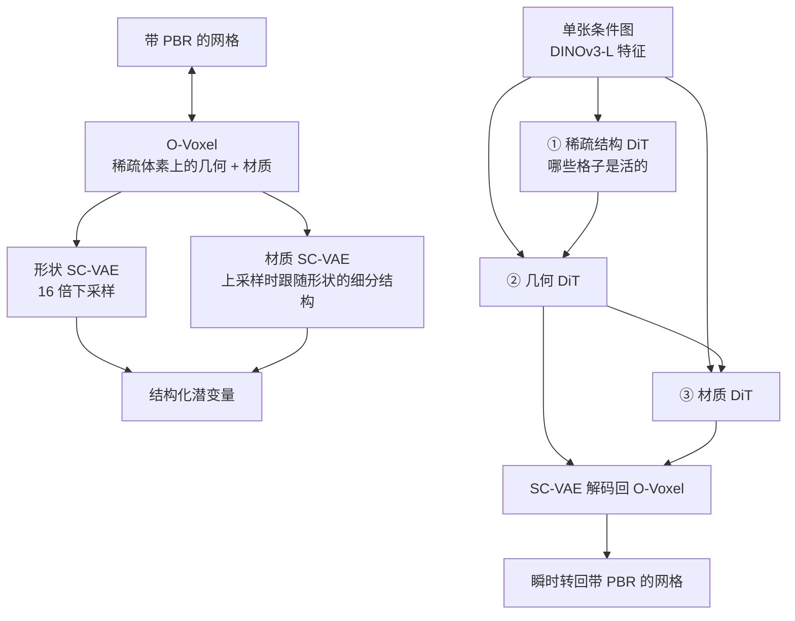
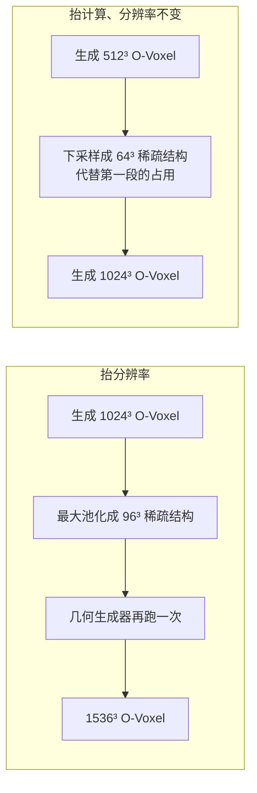

# TRELLIS.2：丢掉等值面场，用 O-Voxel 同时装进几何和外观

<!-- release-date: 2025-12-16 -->

> 本文依据清华大学与 Microsoft Research 等的 **Native and Compact Structured Latents for 3D Generation**（项目名 TRELLIS.2），arXiv:2512.14692v1，2025-12-16 提交，共 24 页（正文 12 页、附录 12 页）。页码均指 PDF 文件页码；附录从 PDF p. 13 起页脚重新从 1 印起，引用时以文件页码为准。文中区分三件事：**报告明确写了什么**、**我们怎么解释它**、**哪些是外部资料或本文推算**。

## 读前先把几个词说成人话

这篇难读的地方不在公式，而在它换掉了 3D 生成里一个默认成立的前提。先把会反复出现的词说清楚：

- **网格（mesh）**：一堆顶点连成三角面，游戏引擎和建模软件吃的就是它。它只是一层壳，本身没有「里面」和「外面」。
- **等值面场（iso-surface field）**：在空间里学一个标量函数，取「函数等于某个值」的那一层当表面。最常见的是**有向距离场（Signed Distance Function，SDF）**：空间中一点到表面的距离，外面为正、里面为负。**FlexiCubes** 是同一家族里更灵活的抽网格方法，论文把它和 SDF 并列当代表（PDF p. 2，引用 [53]）。
- **稀疏体素（sparse voxel）**：把空间切成规则小立方体，只保留和物体相交的那些格子。空格子不存、不算。
- **对偶轮廓（Dual Contouring，DC）**：一种抽网格算法。每个被表面穿过的格子里放一个顶点，相邻格子的顶点再连成面。
- **Hermite 数据**：表面切过一条格子棱时，记下交点坐标和该处法向。对偶顶点的位置就靠它们算。
- **PBR（Physically Based Rendering，基于物理的渲染）**：不把「看起来的颜色」写死，而是存成基础色、金属度、粗糙度等物理量，换灯光时由渲染器重算。
- **变分自编码器（VAE）与潜变量（latent）**：先把高分辨率数据压成短得多的潜变量，生成模型在压缩空间里跑，再解码还原。压缩比越高，生成越便宜，但边角和薄壁越容易糊。
- **token**：潜变量里的一个单元。本文里一个 token 就是压缩后稀疏格子上的一个活跃位置。
- **流匹配（flow matching）与扩散 Transformer（DiT）**：从噪声走到数据的生成模型。本文的三个生成器都是 DiT，用整流流（rectified flow）形式的流匹配训练（PDF p. 6、p. 15）。

两个新名字是：

- **O-Voxel（omni-voxel，全能体素）**：稀疏体素上同时存几何和 PBR 材质的表示。它不用任何场，靠「哪条格子棱被表面切开」来记几何。
- **SC-VAE（Sparse Compression VAE，稀疏压缩 VAE）**：把 O-Voxel 做 16 倍空间下采样的全稀疏卷积 VAE。

## 一句话先说清

2025 年底，大型 3D 生成模型大多把形状写成等值面场，把外观当后处理（先出白模，再靠多视图贴图烘焙回去）。论文认为问题出在表示本身（PDF p. 2）：

1. **等值面场要先分清里外。** 开口的薄片、非流形的交接、被外壳包住的内部结构，都分不清或会被预处理抹掉。
2. **外观和几何分家。** 前作 TRELLIS 虽然用结构化潜变量（SLAT）同时建几何和外观，但它的输入是多视图 2D 图像特征，监督几乎全靠渲染损失，复杂结构和材质仍然吃亏（PDF p. 2，引用 [65]）。

TRELLIS.2 的回答分三层：

- **表示**：O-Voxel 在稀疏体素上同时编码几何和 PBR（含不透明度），网格与 O-Voxel 之间可以瞬时双向转换，不经过优化、也不经过渲染（PDF p. 2）。
- **压缩**：SC-VAE 做 16 倍空间下采样，把一件 $1024^3$ 分辨率的带纹理资产压到约 9.6K 个潜变量 token（PDF p. 2）。
- **生成**：三个约 1.3B 参数的流匹配 DiT 依次生成稀疏占用、几何潜变量、材质潜变量，合计约 4B（PDF p. 2、p. 6）。

引言给出的 NVIDIA H100 端到端时间是：$512^3$ 约 3 秒、$1024^3$ 约 17 秒、$1536^3$ 约 60 秒（PDF p. 2）。人评里约 40 名参与者对 100 张图的生成结果投票，整体质量偏好 66.5%、只看形状 69.0%（PDF p. 7–8）。

如果只记一句话：

> **不要先把网格变成一个必须分清里外的场，再在场上做生成。直接记「表面切开了哪些格子棱」，里外这个全局假设就不需要了；表示变短之后，生成器也可以退回最朴素的 DiT。**

### 一条阅读路线

1. **p. 2 引言**：等值面场的三条限制，以及 9.6K token、3 / 17 / 60 秒这几个总数。
2. **p. 3 Figure 3 与 p. 3–4 §3.1**：灵活对偶网格和 QEF（式 2），材质六通道（式 3）。
3. **p. 5 §3.2**：稀疏残差自编码（式 4–5）、早剪枝、两段训练。
4. **p. 6 §3.3 与实现细节**：三段生成、训练课程、规模与超参。
5. **p. 8 Table 1–3、Figure 8**：重建对比、生成对比、消融、测试时级联。
6. **附录**：p. 13–15 的算法与网络表，p. 15–16 的 FlexGEMM 与数据表，p. 17–19 的评测协议与人评票数，p. 20 的限制。

## 先看全景：网格 ↔ O-Voxel ↔ 潜变量，生成走三段

按 Figure 2 与 §3.3 重画，只表示模块怎么连，不含耗时。

三个要点：

**第一，重建和生成共用 O-Voxel。** 训练数据走「网格 → O-Voxel → SC-VAE → 潜变量」，全程确定性加一次编码；推理时三个 DiT 在潜空间里生成，解码回 O-Voxel，再瞬时转成网格。不需要多视图烘焙，也不需要把生成的高斯和网格焊在一起——后者正是前作 TRELLIS 取资产时的做法（PDF p. 3）。

**第二，形状和材质各有一个 VAE、一个生成器，但住在同一套稀疏格子上。** 材质 VAE 在上采样时以形状 VAE 的细分结构为条件；材质 DiT 把几何潜变量沿通道拼进输入（PDF p. 5、p. 13）。所以第三段可以单独拿来给现成网格贴 PBR（PDF p. 7）。

**第三，前两段沿用 TRELLIS 的骨架，第三段是新的。** 先决定哪些体素是活的，再在活体素里填几何，这两步基本照 TRELLIS；把材质也放进原生 3D 潜空间生成，是本篇新加的（PDF p. 6）。

## 核心设计一：O-Voxel，让表面自己报告「我切开了哪条棱」

### 旧问题：等值面场要先发明一个「里外」

把三角网格变成 SDF，通常要判断每个格点在里还是在外、做洪水填充、再迭代优化。论文把 SDF 求值、洪水填充和迭代优化统称为先前工作里代价高、而 O-Voxel 用不着的步骤（PDF p. 4），并把等值面场的固有限制写成三类：开放面、非流形几何、封闭的内部结构（PDF p. 2）。上图左栏是这件事的形状：符号只在里外交界处翻转，而内腔墙两侧都算里面、开口薄片两侧都算外面。

另一条路是非结构化表示（网格、点云、高斯），它们不需要里外，但没有规则邻域，神经网络不好处理，也不好做潜空间压缩（PDF p. 2）。

### 新设计：灵活对偶网格，用「相交」代替「符号」

O-Voxel 把一件资产写成规则 $N\times N\times N$ 格子上的一组活跃体素（PDF p. 3，式 1）：

$$
f = \bigl\{\bigl(f^{\mathrm{shape}}_i,\; f^{\mathrm{mat}}_i,\; p_i\bigr)\bigr\}_{i=1}^{L}
$$

$p_i$ 是第 $i$ 个活跃体素的整数坐标，$L$ 是活跃体素数，和资产不相交的格子不存。每个活跃体素同时带几何特征 $f^{\mathrm{shape}}_i$ 和材质特征 $f^{\mathrm{mat}}_i$。

几何这一半叫**灵活对偶网格（Flexible Dual Grid）**：原始格子的每个单元对应一个对偶顶点，每条原始棱对应一张四边形，连起相邻单元里的对偶顶点（PDF p. 3）。它借了 Dual Contouring 的结构，差别在于怎么决定一张四边形在不在：经典 DC 看棱两端的符号是否相反，那仍然是场；O-Voxel **直接拿输入网格的三角面和格子棱求交**，棱被切开就激活对应的对偶面，交点与法向从三角面解析算出，作为 Hermite 数据（PDF p. 3–4）。没有符号，也就没有水密、流形这些前提。

每个活跃体素的几何特征有三样（PDF p. 4）：

| 量 | 含义 | 作用 |
|---|---|---|
| 对偶顶点 $v_i\in[0,1]^3$ | 格子内部的一个点 | 局部表面落在哪 |
| 棱相交标志 $\delta_i\in\{0,1\}^3$ | 沿 X、Y、Z 三条预定义棱是否被切开 | 相邻顶点之间要不要连四边形 |
| 剖分权重 $\gamma_i>0$ | 四边形怎么切成两个三角形 | 让表面更贴局部特征 |

每个体素只存共用最小坐标角的那三条棱，另外 9 条棱的标志存在邻居体素里（PDF p. 4，脚注 1）。剖分权重沿用 FlexiCubes 的灵活剖分规则（PDF p. 4，引用 [53]）——借的是它切三角形的办法，不是把表示改回等值面场。

### 工作机制：QEF 一次解出顶点，开口靠额外的边界项

对偶顶点的位置由一个二次误差函数（QEF）闭式求出（PDF p. 4，式 2）：

$$
\min_{v\in\mathrm{voxel}} e(v)=\sum_i d_{\Pi,i}^2+\lambda_{\mathrm{bound}}\sum_j d_{L,j}^2+\lambda_{\mathrm{reg}}\,d_{\hat q}^2
$$

三项分开看：

1. **平面项** $d_{\Pi,i}^2=\bigl(n_i\cdot(v-q_i)\bigr)^2$：顶点应该落在每个交点 $q_i$、法向 $n_i$ 确定的切平面上。这是 DC 原有的唯一一项，负责贴合表面、保住锐边。
2. **边界项** $d_{L,j}^2$：顶点到穿过该格子的网格开放边（boundary edge）的距离。布边、叶片边缘这种开口处没有「另一侧」，这一项把顶点拽到开口的边上，改善开放面的表示。
3. **正则项** $d_{\hat q}^2=\|v-\bar q\|^2$：顶点别离所有交点的均值太远，让顶点分布更平滑，也防止 QEF 在退化配置下失稳。

网格 → O-Voxel：找出所有被表面切开的格子棱，把相邻体素标成活跃，解析求 Hermite 数据，再解 QEF。O-Voxel → 网格：沿被切开的棱把对偶顶点连成四边形，按剖分权重切成两个三角形（PDF p. 4）。附录把两段写成 Algorithm 1 和 2，转换时剖分权重一律设为 0.5，之后可以由网络用渲染损失再调（PDF p. 4、p. 13）。

论文给出三条直接好处（PDF p. 4）：即时双向转换，单 CPU 上网格转 O-Voxel 只要几秒，从 O-Voxel 重建表面和材质在几十毫秒内（PDF p. 2）；任意拓扑，包括自相交和全封闭的内部结构；锐特征由对偶顶点的设计天然保住。

### 材质：六个数存在体素里，而不是先烘焙一张 UV

外观不是另贴一张图，而是每个活跃体素一份和几何对齐的体积属性（PDF p. 4，式 3）：

$$
f^{\mathrm{mat}}_i=(c_i,m_i,r_i,\alpha_i)
$$

$c_i$ 是三通道基础色，$m_i$ 金属度、$r_i$ 粗糙度、$\alpha_i$ 不透明度，一共六通道。论文强调不透明度让它能表示半透明表面，这是先前方法没有的（PDF p. 2）。

两个方向都是采样，不是优化（PDF p. 4，细节见 p. 14–15 的 Algorithm 3、4）：

- **纹理 → O-Voxel**：把体素中心投影到每个相交的三角形上，按 UV 和合适的 mipmap 层采样，再按点到面的距离加权平均。
- **O-Voxel → 纹理**：对查询点（顶点着色时是网格顶点，贴图时是 texel 对应的表面点）用相邻体素做三线性插值。重建出的网格不需要任何额外后处理就能渲染。

### 收益、代价、边界

上图裁自 Figure 1 左栏（PDF p. 1）。被外壳包住的内部结构正是等值面场最容易丢的那一类，下排的剖切图说明它们在重建里还在。图底的 token 数同时给出了压缩账：分辨率从 $512^3$ 到 $1536^3$，token 从约 2.2K 涨到约 20K。

代价写在附录 F（PDF p. 20），而且都是表示层面的：

- 表达力受体素分辨率限制。比格子还小的细节会混叠；两张靠得很近的平行表面穿过同一个体素时，QEF 会把顶点放在两者之间，材质也被平均成糊的。
- 重建和生成的结果有时会有小洞，论文认为多数能用补洞之类的常规后处理修掉，并把原因归到稀疏解码难以保证高分辨率下严格封闭、流形。
- O-Voxel 只管几何和材质，不编码部件分割或图结构拓扑。论文把这列为未来方向。

> **可迁移启发：当旧表示的失败不是「精度不够」，而是「前提不成立」时，不要在旧表示上打补丁。把「里外符号」这种全局假设，换成「这条棱有没有被表面切开」这种局部可观测的事件。** 开口那一项也值得带走：特殊拓扑往往不靠把主损失加大，而靠一项只在那种拓扑上才有意义的约束。

## 核心设计二：SC-VAE，16 倍压下去还要能还原内腔

### 旧问题：结构化潜变量准但太长，非结构化的短但糊

论文把近年的 3D 潜变量分成两派（PDF p. 3）：

- **非结构化潜变量**：受 Perceiver 启发，把 3D 数据编码成无序向量（如 3DShape2VecSet、Michelangelo；Table 1 里的 Dora 也建立在 Shape2VecSet 上）。压得狠，但重建保真受限。
- **结构化潜变量**：建立在稀疏先验上（如 TRELLIS 的 SLAT 及其扩展 Sparc3D、SparseFlex）。几何准，但 token 多、压缩效率低；Direct3D-S2、Ultra3D 等去优化网络计算，而没有把潜变量本身变短。

O-Voxel 已经是结构化的稀疏格子。若 VAE 只能做 4 倍、8 倍下采样，后面的 DiT 在 $1024^3$ 上仍然吃不消。论文的目标是从原生 3D 数据学潜空间，并把空间下采样做到 16 倍（PDF p. 2）。

### 新设计：全稀疏卷积，残差走「空间 ↔ 通道」

SC-VAE 是 U 形、全稀疏卷积的 VAE，不用 Transformer（PDF p. 5，Figure 4）。论文给的理由是：稀疏卷积在高分辨率下算得动，并且跨尺度泛化好——附录说输入超过 $512^3$ 时直接套用已训好的 SC-VAE，不做微调（PDF p. 15）。

让 16 倍压得住的，是从图像侧 DC-AE 借来、改到稀疏格子上的**稀疏残差自编码（Sparse Residual Autoencoding）**（PDF p. 5，引用 [1]）。2 倍下采样时，一个粗体素有 8 个子体素。论文不把它们平均掉，而是先堆到通道维，再分组平均（PDF p. 5，式 4）：

$$
F^{\mathrm{raw}}_{\mathrm{coarse}}=\mathrm{stack}\bigl(F_{\mathrm{child}_1},\ldots,F_{\mathrm{child}_8}\bigr)\in\mathbb{R}^{8C},\qquad
F_{\mathrm{coarse}}=\mathrm{avg\_groups}\bigl(F^{\mathrm{raw}}_{\mathrm{coarse}}\bigr)\in\mathbb{R}^{C'}
$$

$C$ 是细分辨率的通道数，$C'$ 是粗分辨率的通道数（通常 $C'=2C$）。稀疏格子里缺席的子体素贡献零向量。上采样对称地把粗特征拆回 8 份再按组复制到目标通道数（式 5）。这条捷径没有参数，作用是在高压缩比下缓解优化困难。

人话：平均池化是「八个邻居合成一个模糊的代表」，这里是「八个邻居先改排成更长的通道，位置信息搬进了通道顺序」。

另外两个工程选择（PDF p. 5）：

- **早剪枝上采样**：每次上采样前，模块先预测一个 8 位掩码 $\hat\rho\in\{0,1\}^8$，标出哪些子体素是活的，死的直接跳过，大幅省时间和显存（引用 XCube [51]）。
- **优化的残差块**：稀疏卷积在高稀疏度下的有效算力和参数效率都低。论文仿 ConvNeXt，把两层卷积改成「一层稀疏卷积 + 一层宽的逐点 MLP」，MLP 扮演 Transformer FFN 的角色。

编码器的逐级结构在 Table 4（PDF p. 15）：从 `Linear(6, 64)` 起，经 2×、4×、8×、16× 四级，通道 64 → 128 → 256 → 512 → 1024，每级是若干「稀疏卷积 + LayerNorm + 4 倍宽 MLP」块，最后 `Linear(1024, 32 × 2)` 输出 32 维潜变量的均值与方差。解码器对称。整网约 800M 参数，编码器 354M、解码器 474M（PDF p. 13）。

形状和材质是**两套** SC-VAE：一套建形状，另一套建材质，并在上采样时以形状 VAE 的细分结构为条件。这样拆是为了让生成可以按「先形状、再材质」的顺序走，也让「给定形状生成材质」成为可能（PDF p. 5）。

### 工作机制：先在低分辨率回归格子，再加切片式渲染损失

训练分两段（PDF p. 5，式 6–7；分辨率见 p. 14）：

1. **第一段，$256^3$**：直接在 O-Voxel 上回归。对偶顶点用 MSE，相交标志与剪枝掩码用 BCE，材质用 L1，外加 KL 项。先把「格子上的数」学稳。
2. **第二段，$512^3$**：加入基于渲染的感知损失。形状渲染掩码、深度、法线，材质渲染基础色与金属度—粗糙度—不透明度；相机随机摆放，而且近裁剪面很浅，故意「切进」表面，逼模型同时学外部和内部结构。

附录给出渲染损失（PDF p. 14，式 8）。先定义一个感知距离：

$$
d_p(a,b)=\|a-b\|_1+0.2\,d_{\mathrm{SSIM}}+0.2\,d_{\mathrm{LPIPS}}
$$

形状部分是 $\|\hat m-m\|_1+10\,\|\hat d-d\|_1+d_p(\hat n,n)$，材质部分是 $d_p(\hat c,c)+d_p(\widehat{mra},mra)$。$m$、$d$、$n$ 是掩码、深度、法线，$c$ 是基础色，$mra$ 是金属度—粗糙度—不透明度图。深度项的系数是 10。

SC-VAE 的训练数据是 Trellis-500K 那套集合（Objaverse-XL、ABO、HSSD）滤掉没有 PBR 的资产；16 张 H100，batch 128（PDF p. 6）。附录 Table 6 给出规模：形状 SC-VAE 用 473349 个资产，材质 SC-VAE 只留标准金属度—粗糙度工作流的 354966 个（正文写约 35 万）（PDF p. 16）。

### 证据：Table 1 的重建账

Table 1（PDF p. 8）的 MD、CD 都乘了 $10^6$，解码时间在 A100 上测。**MD（Mesh Distance）** 是两张网格之间的双向点到面距离，覆盖全部表面包括内部；**CD（Chamfer Distance）** 只在外壳上采样，只看外部形状；法线 PSNR 看表面细节（评测协议见 PDF p. 17）。Toys4K 一栏：

| 方法 | token 数 | 空间下采样 | 解码（秒） | 全表面 MD↓ | 外表面 CD↓ | 法线 PSNR↑ |
|---|---:|---:|---:|---:|---:|---:|
| Dora | 2.0K | — | 37.7 | 366.1 | 325.3 | 27.26 |
| Dora | 4.1K | — | 43.0 | 360.8 | 327.3 | 27.32 |
| TRELLIS | 9.6K | 4× | 0.108 | 85.07 | 2.755 | 30.29 |
| Direct3D-S2 512 | 3.0K | 8× | 1.86 | 137.6 | 23.85 | 26.34 |
| Direct3D-S2 1024 | 17K | 8× | 13.0 | 73.17 | 13.45 | 27.38 |
| SparseFlex 512 | 56K | 4× | 1.22 | 1.303 | 0.8366 | 36.56 |
| SparseFlex 1024 | 225K | 4× | 3.21 | 0.3132 | 0.8062 | 37.34 |
| 本文 512 | 2.2K | 16× | 0.077 | 0.0323 | 0.5890 | 39.54 |
| 本文 1024 | 9.6K | 16× | 0.301 | 0.0042 | 0.5660 | 43.11 |

更难的 Sketchfab Featured 一栏，本文 1024 的全表面 MD 是 0.0170、法线 PSNR 35.26，SparseFlex 1024 是 0.7593 与 32.12，TRELLIS 是 49.20 与 24.31（PDF p. 8）。

读表要知道三件事（以下是本文从表中算出的对比）：

- **和 SparseFlex 1024 比**：token 少到约 1/23，全表面 MD 小约 75 倍，解码快约 10 倍。
- **和前作 TRELLIS 比**：token 同为 9.6K，但 TRELLIS 只有 4 倍压缩，全表面 MD 是 85.07。它的外表面 CD 是 2.755，差距没有全表面那么悬殊——TRELLIS 主要输在看不见的内部，而这正是 O-Voxel 要救的拓扑。
- **材质重建没有基线**。论文说找不到只在给定形状上编码材质的合适对照，只报自己：PBR 属性图 38.89 dB / LPIPS 0.033，着色图 38.69 dB / 0.026（PDF p. 6）。

消融 Table 3 全在 $256^3$ 的 Sketchfab 策展集上做（PDF p. 8）：

| 设置 | token | 解码（毫秒） | MD↓ | 法线 PSNR↑ |
|---|---:|---:|---:|---:|
| SC-VAE，16 倍、32 通道 | 503 | 28.6 | 1.032 | 27.26 |
| 去掉残差自编码 | 503 | 28.7 | 1.747 | 26.73 |
| 去掉优化残差块 | 503 | 29.6 | 1.198 | 26.67 |
| SC-VAE，32 倍、128 通道 | 118 | 33.9 | 1.405 | 26.65 |
| 去掉残差自编码 | 118 | 34.0 | 7.394 | 25.01 |

去掉残差自编码（换成平均池化加最近邻上采样），16 倍时 MD 增加 69%、PSNR 掉 0.5 dB；32 倍时 MD 变成原来的 5.26 倍、PSNR 掉 1.6 dB。去掉优化残差块，MD 增加 16%、PSNR 掉 0.6 dB，耗时基本不变（PDF p. 8）。压缩越狠，残差自编码越关键。**这张表只打 VAE，不能外推成「$1024^3$ 生成质量也全靠这两项」**——生成器没有进入任何消融。

没写的东西：KL 系数与各损失权重 $\lambda$、两段各训多少步、两套 VAE 是否共享结构。输入的 `Linear(6, 64)` 里 6 维分别是什么，论文没逐项写。

> **可迁移启发：高倍率压缩时，先别学「怎么平均」，先学「怎么改排」。把细格子的信息搬到通道维当残差，比从零预测粗格子更不容易塌。** 3D 稀疏格子的额外教训是：上采样必须会剪枝，否则解码器会在该空的地方浪费算力。

## 核心设计三：三个朴素 DiT，在短潜空间里分段生成

### 旧问题：潜变量一长，生成器就得长出各种补丁

TRELLIS 的稀疏 DiT 带卷积 packing 和 skip connection（PDF p. 6，引用 [65]）。多视图贴图那条主流流水线则把外观交给 2D 扩散再烘焙回 3D，需要复杂的多视图渲染、烘焙与贴图对齐，视角之间容易不一致（PDF p. 3）。

### 新设计：占用 → 几何 → 材质，三段都在原生 3D 潜空间

生成器沿用 TRELLIS 的整体设计（PDF p. 6）：

1. **稀疏结构生成**：预测稀疏体素格子的占用布局，决定哪些格子是活的；
2. **几何生成**：在活体素里生成几何潜变量；
3. **材质生成**：以输入图像和已生成的几何潜变量为条件，生成与几何结构对齐的材质潜变量。

因为 SC-VAE 的空间压缩够高，DiT 丢掉了 TRELLIS 的卷积 packing 和 skip connection，退回「原味」DiT（PDF p. 6）。每个 DiT 约 1.3B：宽度 1536，30 块，12 头，MLP 宽 8192（PDF p. 6）。Table 5 写得更具体（PDF p. 15）：输入投影 `Linear(32(+32), 1536)`，括号里的 +32 是材质段把形状潜变量沿通道拼接；每块依次是 AdaLN-single、自注意力（12 × 128）、LayerNorm、交叉注意力（12 × 128）、AdaLN-single、FFN(1536, 8192)；输出 LayerNorm 加 `Linear(1536, 32)`。

条件分三种接法（PDF p. 6、p. 13–14）：时间步用 AdaLN-single，比逐块 AdaLN 省大量参数；图像特征来自 DINOv3-L，经交叉注意力注入；形状条件直接拼通道。位置用 RoPE，注意力前对 Q、K 做 RMSNorm（QK-Norm），目的是跨分辨率泛化和训练稳定。

训练目标是整流流。正向过程把数据 $x_0$ 沿直线插值到噪声 $\epsilon$（PDF p. 15）：

$$
x(t)=(1-t)\,x_0+t\,\epsilon,\qquad t\in[0,1]
$$

网络 $v_\theta$ 拟合这条直线的速度 $\epsilon-x_0$，即条件流匹配损失（PDF p. 15，式 9）：

$$
\mathcal{L}_{\mathrm{CFM}}(\theta)=\mathbb{E}_{t,x_0,\epsilon}\bigl\|v_\theta\bigl(x(t),t\bigr)-(\epsilon-x_0)\bigr\|_2^2
$$

注意这里 $t=0$ 是数据、$t=1$ 是噪声，生成时从噪声沿速度场反向走回数据。时间步按 $\mathrm{logitNorm}(1,1)$ 采样，与 TRELLIS 相同（PDF p. 15）。

### 训练课程与规模

课程很短，但关键（PDF p. 6）：

1. 稀疏结构生成先用 $512\times 512$ 的条件图，学粗占用、定全局稀疏布局；
2. 几何和材质生成器从 $512^3$ 输出（潜空间 $32^3$）逐步加到 $1024^3$ 输出（潜空间 $64^3$），条件图分辨率同步加到 1024。

$512/16=32$、$1024/16=64$，潜空间尺寸和 16 倍压缩是锁死的。$1536^3$ 不在这段课程里。

优化器 AdamW，学习率 $1\times 10^{-4}$，权重衰减 0.01，CFG 训练时条件丢弃率 0.1；每个 DiT 用 32 张 H100、batch 256（PDF p. 6）。训练集在 SC-VAE 那批数据上再加 TexVerse，约 80 万资产（PDF p. 6）；Table 6 的「全部训练集」是形状 976736、材质 737962（PDF p. 16）。每个资产用 Blender 渲染 16 个视角当条件图，视场角在 $10^\circ$–$70^\circ$ 间随机，灯光随机摆放、随机强度，目的是让模型把固有 PBR 属性和环境光照分开（PDF p. 6、p. 16）。最后还按 Sketchfab 缩略图估一个审美分，低于 4.5 的剔除（PDF p. 16）。**审美分模型怎么来、阈值怎么定，没写。**

### 测试时的两种「再跑一遍」

16 倍压缩把 token 压得足够少，论文把省下的预算用在推理期级联（PDF p. 8–9，Figure 8）：

- **抬分辨率**：$1536^3$ 不是训出来的，而是把 $1024^3$ 的结果当成更密的占用先验再生成一次。引言那条约 60 秒指的就是它（PDF p. 1–2）。
- **抬计算**：用已生成的 $512^3$ 结果替代第一段直接预测的稀疏结构，论文说能修正局部错误、得到更干净的布局，换来更细的细节和更稳的结构（PDF p. 9）。Figure 8 右侧标的是 $1024^3$ 20 秒对级联「20s+3s」（PDF p. 8）。多出的 3 秒与引言里 $512^3$ 约 3 秒的生成时间吻合，**这是本文的对应，图上没写明**；这 20 秒也不宜和引言 H100 上的约 17 秒当成同一次测量。

Figure 1 底栏把端到端时间拆成形状与材质两段（PDF p. 1），与引言的合计一致：

| 分辨率 | 合计（引言，H100） | 形状 + 材质（Figure 1） |
|---|---|---|
| $512^3$ | 约 3 秒 | 约 2 秒 + 约 1 秒 |
| $1024^3$ | 约 17 秒 | 约 10 秒 + 约 7 秒 |
| $1536^3$ | 约 60 秒 | 约 35 秒 + 约 25 秒 |

论文内部有一处口径冲突：引言说这些时间测于 H100（PDF p. 2），实验设置却写「所有运行时间都在 A100 上报告」（PDF p. 6），Table 1 的解码时间标的是 A100。合理的读法是：3 / 17 / 60 秒按引言算 H100，Table 1 按表注算 A100，两套数不要相加或互比。

> **可迁移启发：压缩比一旦高到生成器可以退回朴素架构，就不要再为旧的长序列保留补丁。把复杂度从「网络形状」挪回「表示有多短」。** 级联的用法同样可搬：用便宜的分辨率先得到占用先验，再把它当成更高分辨率的稀疏结构——前提是 VAE 真的与分辨率无关。

## 实验：生成、贴图与人评

### 图生 3D

测试用 100 张 Gemini 2.5 Flash Image（附录称 NanoBanana）生成的提示图，保证训练测试不相交，内容偏复杂几何、戏剧性光照与金属、皮革、锈、玻璃等材质（PDF p. 6、p. 18）。对照是 TRELLIS、Hi3DGen、Direct3D-S2、Step1X-3D、Hunyuan3D 2.1。Table 2（PDF p. 8）：

| 方法 | CLIP↑ | CLIP-N↑ | ULIP-2↑ | Uni3D↑ | 整体偏好 | 形状偏好 |
|---|---:|---:|---:|---:|---:|---:|
| TRELLIS | 0.876 | 0.748 | 0.470 | 0.414 | 6.40% | 2.82% |
| Hi3DGen | — | 0.753 | 0.395 | 0.373 | — | 6.57% |
| Direct3D-S2 | — | 0.746 | 0.420 | 0.392 | — | 12.2% |
| Step1X-3D | 0.875 | 0.738 | 0.464 | 0.411 | 11.8% | 0.469% |
| Hunyuan3D 2.1 | 0.869 | 0.753 | 0.474 | 0.427 | 13.3% | 7.51% |
| 本文 | 0.894 | 0.758 | 0.477 | 0.436 | 66.5% | 69.0% |

CLIP 用 4 个视角的渲染图（带 -N 的用法线图）与提示图算余弦相似度；ULIP-2 与 Uni3D 把网格采成 10000 点的彩色点云再算与图的相似度（PDF p. 18）。偏好是约 40 名参与者的投票占比。附录 Table 7 给出原始票数：整体一题共 202 票，本文 135、Hunyuan3D 2.1 27、Step1X-3D 24、TRELLIS 13、不确定 4；形状一题共 213 票，本文 147（PDF p. 19）。参与者看的是可暂停、可拖动、可放大的转台视频，各方法位置随机；形状题只给法线渲染（PDF p. 19）。

读表的判断：

- **自动指标领先很小，人评领先很大。** 论文把人评描述为视觉真实感、几何细节、提示对齐的综合偏好，没有声称自动指标拉开了同样的差距。
- **Hi3DGen 和 Direct3D-S2 没有整体质量这一列**，只参加了形状题。论文没写原因；从 Figure 6 看，这两家只给出法线渲染，没有外观输出（PDF p. 7）。Figure 6 另把 Step1X-3D 和 TRELLIS 标为「No PBR」——它们有颜色，但没有金属度、粗糙度这些 PBR 通道。
- 每题票数约 200，比例的统计误差在几个百分点量级（本文推算），足以支撑「压倒性偏好」，不足以细排第二名以后的次序。

### 给现成网格贴 PBR

上图裁自 Figure 7（PDF p. 8）。第三段生成器可以单独用作「给定网格与参考图，生成 PBR 贴图」。对照是多视图 PBR 生成加融合的 Hunyuan3D-Paint 与基于 UV 的 TEXGen（图中标 No PBR）。论文的判断（PDF p. 7）：多视图方法在形状与生成图、视角与视角之间不一致，产生鬼影或模糊；UV 方法受 UV 图块歧义与接缝所累；本文在 3D 里直接推外观，贴图更锐、形状与材质对齐，还能给内表面上纹理。**这一段只有图，没有表。**

### 实验证明到哪为止

- **重建**证明的是 O-Voxel 加 SC-VAE：两个测试集、全表面、外表面、法线三组指标全面领先，token 还更少（PDF p. 8）。Figure 12 的误差图补了头盔锁子甲和器皿锐饰两例（PDF p. 19、p. 22）。
- **生成**证明的是「这套潜空间上训出来的 4B 流匹配模型」：定性图覆盖薄结构、开口、半透明、内腔（Figure 5、13、14），定量是对齐分数加人评。
- **没有**的证据：几何或材质生成器的任何消融；DINOv3-L 的贡献；采样步数与 CFG 引导系数；文生 3D、部件、关节；端到端训练成本。

## FlexGEMM：稀疏卷积的算力要自己补

SC-VAE 全是稀疏卷积。论文为此用 Triton 写了自己的后端 **FlexGEMM**，一份代码同时跑在 NVIDIA 与 AMD 上（PDF p. 15）。核心做法是 Masked Implicit GEMM：把特征收集（im2col）与矩阵乘融进一个 kernel，减少全局显存读写；再用 Gray 码给活体素排序，把邻域模式相近的体素排在一起，跳过空邻居时减少 warp 发散；最后用 Split-K 把累加维切开并行（PDF p. 16）。论文报告相对常用稀疏卷积库最高约 2 倍训练加速，Figure 9 分 FP16、FP32 两组，对照 Spconv、Torchsparse、fvdb、WarpConvNet（PDF p. 16）。正文实验设置另写了「优化过的 Triton 子流形卷积」（PDF p. 6），但没有交代 Table 1 的时间是否用它测得。

> **可迁移启发：稀疏 3D 网络的瓶颈常常不在理论 FLOPs，而在空邻居让 warp 发散。把活体素按邻域模式重排，是比加宽网络更先该做的事。**

## 数据：先按 PBR 工作流滤，再按缩略图打审美分

数据管线大体沿用 TRELLIS，但去掉了 3D-FUTURE，因为它没有 PBR 材质（PDF p. 16）。形状 VAE 用全部剩余资产；材质 VAE 再用 Blender 脚本解析材质，只留标准金属度—粗糙度工作流；生成器再加 TexVerse 并做审美过滤。Table 6（PDF p. 16）：

| 来源 | 形状可用 | 材质可用 |
|---|---:|---:|
| TexVerse | 503387 | 382996 |
| ObjaverseXL（sketchfab） | 168307 | 141623 |
| ObjaverseXL（github） | 293887 | 202188 |
| ABO | 4485 | 4485 |
| HSSD | 6670 | 6670 |
| SC-VAE 训练集 | 473349 | 354966 |
| 全部训练集 | 976736 | 737962 |
| Toys4k（评测） | 3229 | 2282 |

重建评测用的是 Toys4k 里三张 PBR 贴图（基础色、金属度、粗糙度）齐全的 473 个实例，另加从 Sketchfab「Staff Picks」近两年上传、金属度—粗糙度工作流的 90 个资产（PDF p. 17），两者训练时都未见过。

> **可迁移启发：多模态训练集不要按「有这个文件」一刀切。** 几何 VAE 和材质 VAE 的可训练子集差了十几万，生成器再在上面加审美过滤——过滤规则跟着任务走。用平台缩略图估审美分便宜可扩展，但缩略图的构图和打光会漏进「资产好不好」的标签，论文没有讨论这种偏差。

## 放回同方向里看

同为物体级带 PBR 的图生 3D，Seed3D-2.0 走的是另一条路：几何仍是 VecSet 潜变量加 SDF 与 Dual Marching Cubes 抽网格，材质用另一个多视图 PBR 模型生成（见 Seed3D-2.0 一篇）。两边都在补「锐边与结构需要空间位置」这件事，只是 TRELLIS.2 把坐标做成表示本身，Seed3D 2.0 在第二阶段把体素坐标借进来当条件。Seed3D 2.0 还加了部件分解与关节，这正是本文附录 F 列为未来方向的那一块。前作 TRELLIS 的 SLAT 从多视图 2D 特征学、只做 4 倍压缩，本文从原生 3D 学、做到 16 倍，两篇可以对照读。这段对照是本文的位置说明，不是论文实验。

## 可迁移启发，串回整个系统

如果只记一个原则，就是开头那句：先换掉必须分清里外的场，再谈生成器多大。拆开之后有三条不依赖 4B 或 H100 的做法：

1. **局部可观测事件优于全局假设。** 棱上有没有交点，比格点的里外符号更容易从原始网格读出来。开口单独加一项约束，而不是指望主损失自己学会。
2. **压缩时改排，不要先平均。** 残差自编码把 8 个子体素搬到通道维；拿掉它，32 倍压缩下 MD 变成 5.26 倍。任何邻域聚合都可以先问一句：信息是被丢了，还是换了轴。
3. **表示够短，网络就能变回朴素。** 16 倍压缩让 DiT 丢掉 packing 与 skip；级联抬分辨率、给定形状贴材质，都是这条短潜变量上长出来的能力，不是另起的模型。

依赖规模的部分也要说清：三个 1.3B DiT、每个 32 张 H100、近百万资产、自研 Triton 稀疏卷积。没有这些，O-Voxel 作为表示仍然成立——网格与它之间的转换是单 CPU 上几秒的确定性算法。

## 关键词回看

- **等值面场 / SDF / FlexiCubes**：用函数的一层当表面。前提是分得清里外；开放面、非流形、封闭内腔先在预处理里受损。
- **O-Voxel**：稀疏体素上同时存几何与 PBR。几何是灵活对偶网格，材质是六通道体积属性。
- **Hermite 数据与 QEF**：交点加法向；二次误差把对偶顶点摆到最贴合切平面的位置，外加开放边项与正则项。
- **SC-VAE**：16 倍空间压缩的全稀疏卷积 VAE，残差走空间—通道改排，上采样前先剪枝；形状、材质各一套。
- **结构化潜变量**：压缩后仍挂在稀疏格子上的短序列。$1024^3$ 约 9.6K token。
- **三段流匹配 DiT**：占用、几何、材质，合计约 4B；$1536^3$ 靠测试时级联。
- **PBR 六通道**：基础色三通道加金属度、粗糙度、不透明度。
- **FlexGEMM**：Triton 写的稀疏卷积后端，Masked Implicit GEMM 加 Gray 码排序与 Split-K。

## 资料与阅读边界

**版本与首发日。** arXiv 官方页截至核验只有 v1（2025-12-16），与本文依据的版本一致。`release-date` 取 2025-12-16：arXiv v1 与 GitHub 仓库 [microsoft/TRELLIS.2](https://github.com/microsoft/TRELLIS.2) 的「Init Release」提交（2025-12-16 19:00 UTC，含推理代码与权重入口）在同一天，Hugging Face 模型卡 [microsoft/TRELLIS.2-4B](https://huggingface.co/microsoft/TRELLIS.2-4B) 也标注当日发布。GitHub 空仓库创建于 2025-11-26、Hugging Face 权重文件 2025-12-01 已上传，都属预置，不算对外可用。

**论文之后（外部补充）。** 正文写模型、代码与数据「将公开」（PDF p. 2），封面脚注指向项目页（PDF p. 1）。GitHub 在 2026-01-10 有一条「Release Training Code」提交，说明训练代码后来放出；Hugging Face 权重为 MIT 许可。这些只说明承诺后来兑现，不回写进论文当年写了什么。项目页 <https://microsoft.github.io/TRELLIS.2/> 与模型卡另有转换耗时、小洞与水密后处理等说明，正文以 PDF 为准。

**未公开或无法核实的缺口。** 各损失权重与 KL 系数、两段 VAE 训练的步数；生成采样步数与 CFG 引导系数；审美分模型；材质 VAE 与形状 VAE 的结构差异；DINOv3-L 与各生成段的消融；端到端训练成本。
