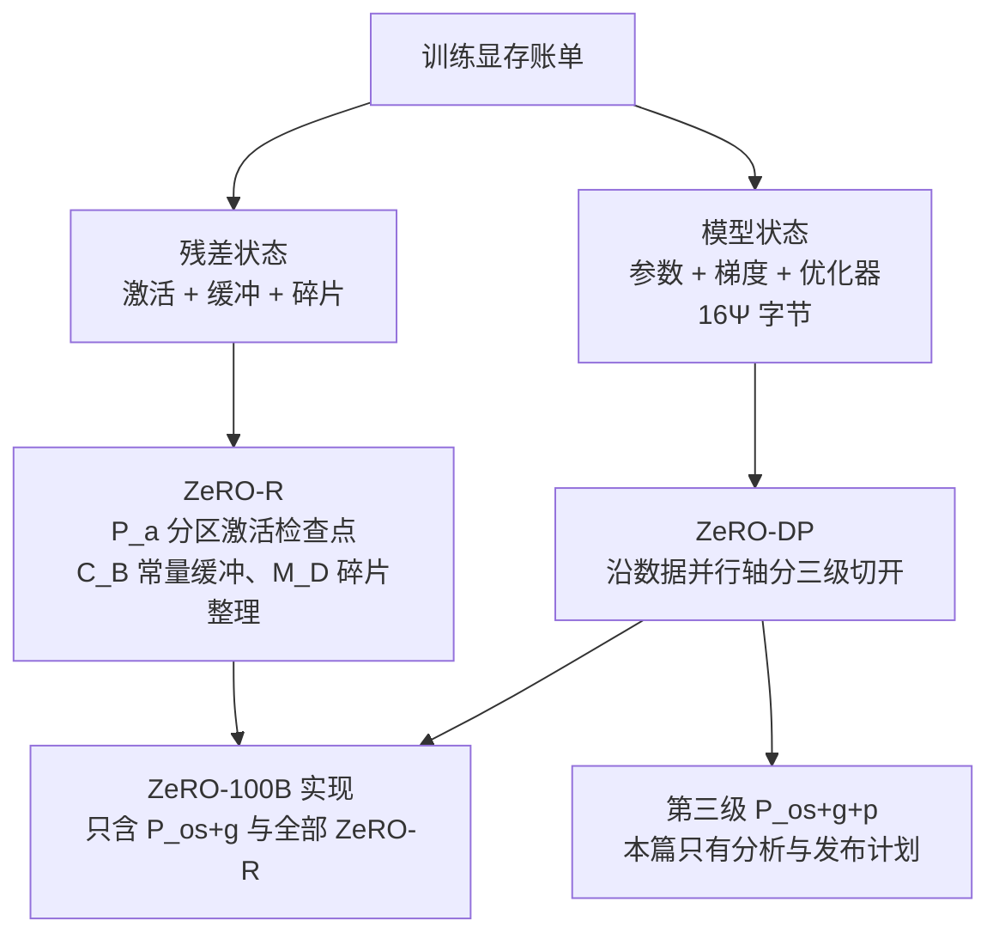

# ZeRO：沿数据并行轴消掉冗余副本，模型才能随卡数涨

<!-- release-date: 2019-10-04 -->

> 本文依据 Microsoft 的 **ZeRO: Memory Optimizations Toward Training Trillion Parameter Models**，arXiv:1910.02054v3，2020-05-13 修订，共 24 页。页码均指这份 PDF。作者是 Samyam Rajbhandari、Jeff Rasley（二人并列一作）、Olatunji Ruwase、Yuxiong He。文中会区分三件事：**报告明确写了什么**、**我们怎么解释它**、**哪些是外部资料或本文推算**。

## 读前先把几个词说成人话

这篇论文的门槛不在公式，在于它同时用两套词：「一张卡上到底堆了什么」，和「数据并行本来在通信什么」。前几个是通用背景，后几个是论文自己的设定。

- **数据并行（data parallelism，DP）**：每张卡放一份完整模型，各吃不同的数据，反向之后把梯度平均。卡变多，吞吐能涨，单卡显存不降。
- **模型并行（model parallelism，MP）**：把一份模型拆到多张卡上。本文主要指 Megatron-LM 那种沿层内矩阵切开的做法，也就是后来说的张量并行。
- **流水线并行（pipeline parallelism，PP）**：按层切，前几层在这张卡，后几层在那张卡，微批顺着往下传。
- **混合精度 Adam**：前反向用 FP16，更新用一份 FP32 参数，外加 FP32 的动量和方差。每个参数除了自己，还要背好几份「家当」。
- **集合通信**：All-Reduce 是「每张卡一份同形张量，加总后每张卡都拿到总和」；工业实现拆成 Reduce-Scatter（按块归约到不同卡）加 All-Gather（再把各块拼回每张卡）。Broadcast 是「一个拥有者发给所有人」。
- **激活检查点（activation checkpointing）**：前向只隔一段存一份激活，反向时重算中间结果。用大约 33% 的额外计算换掉大部分激活显存（PDF p. 8）。
- **模型状态（model states）**：参数、梯度、优化器状态。按参数个数涨，和批大小无关。
- **残差状态（residual states）**：激活、临时缓冲、碎片化后用不上的显存。
- **符号**：$\Psi$ 是参数个数；$K$ 是优化器状态相对参数的字节倍数；$N_d$ 是数据并行度；$N_m$ 是模型并行度。
- **ZeRO-DP**：沿数据并行轴分区模型状态，三级分别记作 $P_{\mathrm{os}}$、$P_{\mathrm{os}+g}$、$P_{\mathrm{os}+g+p}$。后来 DeepSpeed 把它们叫 ZeRO-1、ZeRO-2、ZeRO-3。
- **ZeRO-R**：收拾残差状态的三招：$P_a$（分区激活检查点）、$C_B$（常量大小缓冲）、$M_D$（碎片整理）。
- **ZeRO-100B**：这篇真正实现并评测的子集，即 $P_{\mathrm{os}+g}$ 加 ZeRO-R，不含切参数的第三级（PDF p. 4、p. 16）。

## 一句话先说清

2019 年，数据并行好用、好扩展，但每张卡都要复制一份完整模型状态，32 GB 的卡上超过 **1.4B** 参数就装不下（PDF p. 1）。模型并行能把模型切开，但一跨节点就慢得不能用。

ZeRO 的回答不是再发明一种切法，而是回头质疑数据并行的一个默认假设：**每张卡必须一直持有完整的参数、梯度和优化器状态**。它把这三样沿数据并行轴切成 $N_d$ 份，用的时候再拼回来。前两级通信量和普通数据并行一样，第三级多 50%；显存则随卡数下降。

摘要里的硬数字（PDF p. 1）：

- 分析上，今天的硬件有潜力训练超过 **1 万亿** 参数；
- 实现上，400 张 GPU 训 **超过 100B** 参数、超线性加速、总吞吐 **15 Petaflops**；
- 相对当时最好的系统，模型规模 **8 倍**、可达性能 **10 倍**；
- 不用模型并行可训到 **13B**，大于 Megatron GPT 8.3B 与 T5 11B；
- 用这套系统训出当时最大的语言模型 Turing-NLG（**17B**）。

读这篇要先分清两层：**分析**写到了万亿，**实现**只做到 $P_{\mathrm{os}+g}$ 加 ZeRO-R。第三级切参数在这份 PDF 里是分析和发布计划，不是实验。

### 一条阅读路线

如果只有半小时读原文，建议按这个顺序：

1. **p. 3 图 1**：7.5B、64 路数据并行，每卡从 120 GB 砍到 31.4 / 16.6 / 1.9 GB。先看显存，再看方法。
2. **p. 7–8 第 3 节**：混合精度 Adam 每参数 16 字节；1.5B 的权重只有 3 GB，却在 32 GB 卡上训不起来。
3. **p. 10–11 第 5 节与表 1**：三级各切什么；1024 卡全开三级，1T 只需 15.6 GB/卡。
4. **p. 13–14 第 7 节**：前两级通信 $2\Psi$，第三级 $3\Psi$。
5. **p. 4–5 图 2–3、p. 16–19 第 10 节**：170B、15 Petaflops、超线性、纯数据并行 13B、C1–C5 消融。
6. **p. 23–24 附录表 5–10**：每组实验的层数、隐藏维、每卡批大小。读吞吐要回到这里看批大小。

## 主要矛盾：加卡装不下模型，切开又跨不出节点

2018 到 2019 年，语言模型从 BERT-large 的 0.3B 走到 GPT-2 的 1.5B、Megatron-LM 的 8.3B、T5 的 11B（PDF p. 1）。再往几十亿、上万亿走，单卡先装不下。

**数据并行** 把同一份模型复制到每张卡，各吃不同样本（PDF p. 6）。计算粒度大、通信量相对小，所以好用、好扩展。但显存零节省：每加一张卡，只是多一份同样的副本（PDF p. 1）。

**模型并行** 能切开。当时最大的两个模型，T5 11B 靠 Mesh-TensorFlow，Megatron-LM 8.3B 靠层内切分（PDF p. 2）。它把每一层的计算和参数竖着分到多张卡，层与层之间要密集通信。节点内有高带宽还撑得住，一跨节点效率就崩。作者自己测过：用 Megatron-LM 把 **40B** 铺到两台 DGX-2 上，每张 V100 大约 **5 TFlops**，不到硬件峰值的 **5%**（PDF p. 2）。

流水线和 CPU 卸载也在菜单上，但都要拿别的东西换（PDF p. 6）。GPipe 要让批大小跟着流水线段数涨，tied-weights 和 BatchNorm 也不好做；PipeDream 靠多份过期参数藏气泡，费显存，也和标准训练不等价。把模型状态卸到 CPU，有工作报告最多一半训练时间花在 GPU–CPU–GPU 搬运上。

所以矛盾是：

> 数据并行好用、通信可控，但每卡复制一份，1.4B 以上装不下；模型并行能切开，跨节点却又慢又要改模型。当时没有一条路能同时保住显存、通信和易用性。

## 显存账单：1.5B 的权重只有 3 GB，训练却要 24 GB 以上

要决定切哪一刀，先得知道显存花在哪。论文拿一个具体例子开场：1.5B 的 GPT-2，FP16 权重大约 **3 GB**，却没法在一张 32 GB GPU 上用 TensorFlow 或 PyTorch 训起来（PDF p. 7）。

### 模型状态：每参数 16 字节

混合精度 Adam 下，每个参数要背（PDF p. 7–8）：

- FP16 参数、FP16 梯度，各 2 字节；
- FP32 参数、FP32 动量、FP32 方差，各 4 字节。

把优化器状态的倍数记作 $K$，混合精度 Adam 的 $K = 12$。每参数合计：

$$
2\Psi + 2\Psi + K\Psi = 16\Psi \ \text{字节}
$$

1.5B 参数至少 **24 GB**，远大于那 3 GB 的 FP16 权重（PDF p. 8）。**大头在优化器**：16 字节里有 12 字节是它。

后作 ZeRO-Infinity 把同一套 Adam 记成每参数 20 字节，多出来的是单独留的一份 FP32 梯度。两篇账本口径不同，本篇一律用 16 字节。

### 残差状态：模型状态之外还有三笔

**激活。** 按论文脚注，GPT-2 类结构的激活大约是（PDF p. 8 脚注 3）：

$$
12 \times \textit{hidden} \times \textit{batch} \times \textit{seq} \times \textit{layers}
$$

1.5B、序列 1K、批 32，大约 **60 GB**。开激活检查点能砍到大约 **8 GB**，代价是 33% 的重算。但 100B 的模型在批 32 时，开了检查点仍要大约 **60 GB**（PDF p. 8）。

**临时缓冲。** All-Reduce 要大消息才打得满带宽，实现常把全部梯度拍扁进一块缓冲。梯度是 FP16，这块缓冲却可能是 FP32：1.5B 模型要 **6 GB**（PDF p. 8）。缓冲随模型线性涨。

**碎片。** 申请显存要的是一整块连续空间。短命张量和长命张量交错分配，空闲总量够也可能申请失败。作者观察到极端情况下 **超过 30%** 的显存还空着，照样 OOM（PDF p. 8）。

这两笔账分别对应两套优化：**ZeRO-DP 砍模型状态，ZeRO-R 砍残差状态**。只砍一边，另一边会在百亿之后重新变成墙。

## 先看全景：两套优化、一个实现子集

这张图按 PDF p. 2–5 的叙事重画，是结构示意，不是论文原图。关键是右下那一格：后文所有 100B、170B、超线性的实验，切的都是前两级。

## 核心设计一：ZeRO-DP，把模型状态沿数据并行轴切开

### 洞察：状态不必一直在场

第 4.1 节给了三句话（PDF p. 9）：

1. 数据并行的计算粒度比模型并行粗、通信量更小，所以跨节点更好扩展；
2. 数据并行的显存差，恰恰差在每张卡都复制一份模型状态；
3. 数据并行和模型并行都让全部状态在整个训练中一直在场，其实不必。某一层的参数，只在这一层的前向和反向里用得到。

于是 ZeRO-DP 的做法是：**不复制模型状态，按数据并行进程切开；再用动态通信日程，在真正用到的时候把缺的那一块拼回来**。目标是让显存按 $N_d$ 下降，通信量仍接近普通数据并行（PDF p. 9）。

这张图根据 PDF p. 3 图 1 和 p. 10–11 的数字重画，条长按 GB 等比例。三级各自的机制和代价如下。

### $P_{\mathrm{os}}$：每张卡只更新自己那一段参数

把优化器状态均分成 $N_d$ 份，第 $i$ 个数据并行进程只存、只更新第 $i$ 份。前反向照旧用完整的 FP16 参数和梯度；一步结束后，各进程 All-Gather 更新过的参数，每张卡再拿到完整一份（PDF p. 10）。

显存从 $4\Psi + K\Psi$ 变成 $4\Psi + K\Psi / N_d$。$N_d$ 很大时约等于 $4\Psi$，**最多省 4 倍**（PDF p. 10）。

**我们如何解释它。** 大头在优化器，而且切它几乎不用改前反向，是最便宜的第一刀。但图上也看得出它的边界：7.5B 在 64 卡上仍要 31.4 GB，已经贴着 32 GB，激活没地方放。

### $P_{\mathrm{os}+g}$：梯度归约到负责的那张卡上就地释放

既然每张卡只更新自己那段参数，它也只需要那一段归约后的梯度。反向时某层梯度一算完，就只归约到「负责更新这些参数」的那张卡上，归约完立刻释放（PDF p. 10）。效果上就是一次 Reduce-Scatter。

实现上用分桶：把属于同一分区的梯度装进一只桶，整桶一起归约，好和反向重叠。NVIDIA AMP 分桶做的是 All-Reduce；这里在分区边界上做的是归约，不是 All-Reduce（PDF p. 10）。

显存变成 $2\Psi + 14\Psi / N_d \approx 2\Psi$，**最多省 8 倍**（PDF p. 10–11）。这一级就是 ZeRO-100B 里「模型状态」那一半的全部内容。

### $P_{\mathrm{os}+g+p}$：参数也按分区持有，用时再发过来

第三级把 FP16 参数也切开。每张卡只常驻自己那一份；前反向需要别人那段时，由拥有者 Broadcast 过来，用完就丢（PDF p. 11）。显存按 $N_d$ 线性下降：

$$
\frac{16\Psi}{N_d}
$$

作者把含义写得很满：只要设备数够分摊模型状态，数据并行就能装任意大的模型（PDF p. 11）。但这一级在本篇没有进入实现（PDF p. 5、p. 16）。

### 表 1：哪些组合装得进 32 GB 的卡

表 1 按数据并行度列出三个模型在三级下的每卡模型状态，单位 GB（PDF p. 11）：

| $N_d$ | 7.5B $P_{\mathrm{os}}$ | 7.5B $P_{\mathrm{os}+g}$ | 7.5B 三级 | 128B $P_{\mathrm{os}}$ | 128B $P_{\mathrm{os}+g}$ | 128B 三级 | 1T $P_{\mathrm{os}}$ | 1T $P_{\mathrm{os}+g}$ | 1T 三级 |
|---:|---:|---:|---:|---:|---:|---:|---:|---:|---:|
| 1 | 120 | 120 | 120 | 2048 | 2048 | 2048 | 16000 | 16000 | 16000 |
| 4 | 52.5 | 41.3 | 30 | 896 | 704 | 512 | 7000 | 5500 | 4000 |
| 16 | 35.6 | 21.6 | 7.5 | 608 | 368 | 128 | 4750 | 2875 | 1000 |
| 64 | 31.4 | 16.6 | 1.88 | 536 | 284 | 32 | 4187 | 2218 | 250 |
| 256 | 30.4 | 15.4 | 0.47 | 518 | 263 | 8 | 4046 | 2054 | 62.5 |
| 1024 | 30.1 | 15.1 | 0.12 | 513 | 257 | 2 | 4011 | 2013 | 15.6 |

不开 ZeRO 时，无论数据并行度多少，每卡都是第一行（PDF p. 11）。$N_d = 64$ 时三级分别能训到大约 7.5B、14B、128B；$N_d = 1024$ 且三级全开，1T 只要 **15.6 GB/卡**。16 TB 除以 1024，就是这个数（PDF p. 3、p. 11）。

表 2 把分析和实测对了一次（PDF p. 13）。右侧实测只开了 $P_{\mathrm{os}}$，表头沿用早期名字 ZeRO-OS：64 卡 6.2B、128 卡 12.5B、256 卡 25B、512 卡 50B、1024 卡 100B，左侧理论值是 7.6B、15.2B、30.4B、60.8B、121.6B。表注说实测「与理论上限吻合」。我们的读法是：两列同一量级，实测稍低，差额应来自理论列没算的激活和缓冲；这组实测的集群规模超过第 10 节的 400 卡，论文没交代是在哪台机器上跑的。

### 可迁移启发

先问自己卡在哪一笔：优化器、梯度，还是参数本身。只切优化器通信几乎不涨，但省下的有天花板；要上百亿且留出激活，至少切到梯度；要让显存随卡数线性降，才需要第三级。**每往后一级，买到的显存更少，付出的通信和实现复杂度更多。**

## 核心设计二：切完之后，通信量仍然接近原来的数据并行

显存省下来，第一个怀疑一定是通信爆炸。第 7 节专门回答这一问（PDF p. 13–14）。

这张图根据第 7 节的文字重画，是机制示意，块宽不代表时间。

**基线。** 大模型下 All-Reduce 是带宽受限的。工业实现拆成 Reduce-Scatter 加 All-Gather，各搬 $\Psi$ 个元素，一步合计 $2\Psi$（PDF p. 13）。

**前两级。** 梯度 Reduce-Scatter 是 $\Psi$；各卡更新完自己那段参数后 All-Gather，又是 $\Psi$。合计 $2\Psi$，和基线 **完全相同**（PDF p. 14）。换句话说，All-Reduce 的两步本来就在那里，ZeRO 只是把第二步收集的内容从「梯度」换成了「更新后的参数」，顺手换到了最多 8 倍显存。

**第三级。** 参数不常驻之后，前向每算到一个分区，拥有者先把权重发出去，用完丢掉，合计 $\Psi$；反向按相反顺序再来一次，又是 $\Psi$；梯度仍 Reduce-Scatter，$\Psi$。合计 $3\Psi$，是基线的 **1.5 倍**（PDF p. 14）。作者的说法是：把本来一步里的参数 All-Gather，重新排进整个前向，用完即丢。

**我们如何解释它。** 「体积相同」和「时间相同」是两件事。前两级的 $2\Psi$ 和基线同体积，但要分桶、要在分区边界上归约、要和反向重叠（PDF p. 10）。第三级的额外那份 $\Psi$ 落在前向的关键路径上：这层参数没到齐，这层就算不了。论文只给了体积分析，没有给第三级的实测重叠效率。

### 可迁移启发

先问每份状态的寿命：一步、一层，还是整个训练。寿命是一层的东西（某层的参数），就有机会「用时拼、用完丢」；而如果一次集合通信本来就要拆成两步，看看第二步能不能换成更有用的内容。**把通信重排，常常比削减通信更便宜。**

## 核心设计三：ZeRO-R，把激活副本、临时缓冲和碎片收拾掉

模型状态降下去之后，激活、缓冲和碎片成了第二堵墙。ZeRO-R 是三招，不是 ZeRO-DP 的第四级（PDF p. 3、p. 12–13）。

### $P_a$：模型并行把权重切开了，激活却还在每张卡上复制

层内模型并行常按列切开线性层。两张卡各算一半输出，但每张卡都需要 **完整的输入激活**（PDF p. 9）。于是权重切开了，激活仍是副本。注意这份冗余在模型并行组里，不在数据并行组里：数据并行的各卡吃不同数据，激活本来就不一样。

$P_a$ 的做法：一层前向算完，把输入激活按模型并行进程切开存起来；反向要用时再 All-Gather 拼回完整一份，而且一次只物化一层（PDF p. 12）。它和激活检查点配合，存的是分区后的检查点。极端情况下还可以把分区后的检查点卸到 CPU，记作 $P_{a+\mathrm{cpu}}$。

效果（PDF p. 12）：100B、批 32、序列 1024、模型并行度 16，每层存一份检查点，大约 **33 GB/卡**；开 $P_a$ 降到大约 **2 GB/卡**；再卸到 CPU，激活显存接近零。

通信账（PDF p. 14–15）：Megatron-LM 开检查点时，每个 Transformer 块前向两次、重算两次、反向两次 All-Reduce，合计 $12 \times \textit{seq} \times \textit{hidden}$。$P_a$ 在每个检查点重算前多一次 All-Gather，体积 $\textit{seq} \times \textit{hidden}$。增量 **不到原模型并行通信的 10%**。

这不到 10% 的代价能换回更多。$P_a$ 让激活显存按模型并行度下降，批就能按比例加大；DGX-2 上模型并行度可以到 16，批最多加 16 倍，而数据并行通信量与批大小成反比，可以掉一个数量级（PDF p. 15）。$P_{a+\mathrm{cpu}}$ 的代价是相对 $P_a$ 多出 2 倍的 CPU 往返数据移动，只在批仍然很小、数据并行通信才是主瓶颈时值得开（PDF p. 15）。低带宽搬运藏得住，是因为 GPT-2 及以上规模的模型，每步计算量与检查点体积之比 $\ge 10\mathrm{K}$，还随隐藏维线性涨（PDF p. 9）。

### $C_B$：融合缓冲不许再随模型涨

NVIDIA Apex 和 Megatron 为了让 All-Reduce 走大消息，会把全部参数融进一块缓冲。它随模型线性涨：3B 模型的 32 位融合缓冲要 **12 GB**（PDF p. 12）。ZeRO-R 改用常量大小的融合缓冲，模型变大时不再跟着涨，但保持足够大，效率还在。

### $M_D$：长命和短命张量不要交错着分配

碎片来自寿命交错（PDF p. 12）。前向时，检查点长命，被丢掉重算的激活短命；反向时，参数梯度长命，激活梯度和中间缓冲短命。ZeRO 预先分配两块连续缓冲，检查点和梯度一产生就拷进去。好处有两个：少因凑不出连续空间而 OOM；分配器少花时间找空洞，训练也更快（PDF p. 13）。

### 可迁移启发

「切完权重」不等于「训练能跑」。模型并行切权重时，常常在激活上制造新副本；融合缓冲和碎片会在你以为还剩三成显存的时候把你打成 OOM。**先按寿命把张量分成长命和短命两类，再决定预分配，比再加一张卡便宜。**

## 还要不要模型并行

数据并行的显存墙拆掉之后，模型并行还有用吗？论文的回答是：单为「装得下」，模型并行没那么必要了；ZeRO-DP 至少同样有效，模型切不整齐时甚至更好，扩展效率也相当或更好（PDF p. 3–4）。数据并行几乎不用改模型；当时的 Megatron-LM 要模型开发者改模型、系统开发者写分布式算子，而且只覆盖有限的算子和模型（PDF p. 4）。

仍值得叠模型并行的两种情况（PDF p. 4）：

1. 和 ZeRO-R 一起用，靠模型并行度再砍激活，给非常大的模型留空间；
2. 纯数据并行会把全局批推得太大、伤收敛时，用模型并行把全局批拉回可接受的范围。

两者叠加，单卡理论显存最多降 $N_d \times N_m$ 倍。论文给的万亿拼法是：1024 张 GPU，节点内 16 路模型并行，跨节点 64 路数据并行，批大小不必夸张（PDF p. 4）。这是分析，不是第 10 节的实验。

## 实现边界：这篇跑的是 ZeRO-100B

完整 ZeRO 在分析上能在大约 1K 张 V100 上跑万亿参数。但作者立刻补了一句：当时的算力下，训练时间会超过一年（PDF p. 4）。所以实现的目标收窄成：比当时最大的模型大约 **10 倍**（约 100B），并且仍在可训的时间范围内。

这个子集就是 ZeRO-100B：$P_{\mathrm{os}+g}$ 加全部 ZeRO-R，用 PyTorch 实现（PDF p. 4、p. 17）。接口包装任意 `torch.nn.Module`，用户不用改模型；可以和任意模型并行叠加，包括 Megatron-LM（PDF p. 17）。

发布计划写在正文里（PDF p. 5）：ZeRO 作为 DeepSpeed 的一部分开源；本文描述的全部实现计划在 2020 年 5 月底前发布；再往后启用第三级切参数，去支撑 1 万亿参数。

## 实验怎样证明：100B、400 卡、15 Petaflops、超线性

### 评测设置

硬件是 400 张 V100（25 台 DGX-2），节点间 **800 Gbps**（PDF p. 17）。不用模型并行时，基线是 PyTorch DDP；用模型并行时，基线是 2019 年 9 月的开源 Megatron-LM。模型都是 GPT-2 类 Transformer，靠改层数和隐藏维得到不同参数量（PDF p. 17）。

公平性有一条必须一起读（PDF p. 24）：部分基线跑在 384 或 256 卡上，因为总卡数要能被模型并行度整除，而他们只有 400 张卡。170B 的基线用 256 卡、模型并行度 256，数据并行度为 1，完全没有数据并行通信。卡更少对基线更有利。论文比的是 **每卡吞吐**，不是集群总吞吐。

### 图 2：170B 仍能跑，跨节点的纯模型并行不能

ZeRO-100B 在 400 卡上能高效跑到 **170B**，比 Megatron-LM 能高效跑的规模大 8 倍以上（PDF p. 17）。图 2 的关键在图注：ZeRO 一侧的模型并行始终留在节点内；基线大于 40B 就必须跨节点做模型并行（PDF p. 4）。

每卡吞吐与加速比读自图 2（PDF p. 4），每卡批大小取自附录表 5（PDF p. 23）：

| 模型 | ZeRO TFlops/卡 | 基线 TFlops/卡 | 加速比 | ZeRO 模型并行度 / 每卡批 | 基线模型并行度 / 每卡批 |
|---|---:|---:|---:|---|---|
| 1.5B | 约 30 | 约 26（节点内） | 约 1.1 倍 | 1 / 24 | 2 / 16 |
| 8B | 约 37 | 约 23（节点内） | 约 1.6 倍 | 4 / 64 | 8 / 8 |
| 40B | 约 36 | 约 5（跨节点） | 约 7 倍 | 4 / 12 | 32 / 4 |
| 60B | 约 36.5 | 约 6 | 约 6 倍 | 16 / 64 | 64 / 4 |
| 80B | 约 37.5 | 约 5 | 约 7 倍 | 16 / 32 | 128 / 4 |
| 100B | 约 38.5 | 约 4 | 约 10 倍 | 16 / 32 | 128 / 2 |
| 120B | 约 28 | 约 4 | 约 7 倍 | 16 / 24 | 128 / 2 |
| 140B | 约 27 | 约 4 | 约 7 倍 | 16 / 16 | 128 / 2 |
| 170B | 约 21 | 约 2 | 约 9 倍 | 16 / 12 | 256 / 2 |

正文给出的硬数字（PDF p. 5、p. 17）：8B 到 100B 平均维持 **15 Petaflops**，超过峰值的 **30%**；100B 每卡超过 **38 TFlops**；相对基线最多约 **10 倍**。

**我们如何解释它。** 基线崩在带宽上：节点内 NVSwitch 每链路大约 **300 GB/s**，跨节点 InfiniBand EDR 每链路大约 **12.5 GB/s**（PDF p. 17）。ZeRO 取消了「为了装得下而把模型并行拉出节点」这件事。表 5 的最后两列说得更直白：同样 100B，ZeRO 每卡批 32，基线每卡批只剩 2。省下的显存直接变成更大的微批，再变成更高的算术强度。

100B 之后 ZeRO 的吞吐往下掉，作者归因于显存不够、批加不上去（PDF p. 17）：每卡批从 32 降到 12。

附录还有一处对不上：表 4 把图 2 的 40B–60B 写成隐藏维 4096，表 5 写成 6144（PDF p. 19、p. 23）。本文以更细的表 5 为准。

### 图 3：64 到 400 卡，超线性

同一个 60B 模型（75 层、隐藏维 8192、模型并行度 16）从 64 卡加到 400 卡（PDF p. 5）。每卡批取自附录表 6（PDF p. 23），吞吐读自图 3：

| GPU | 每卡批 | 每卡 TFlops | 总吞吐 | 按 64 卡线性外推 |
|---:|---:|---:|---:|---:|
| 64 | 16 | 约 26 | 约 1.65 Petaflops | — |
| 128 | 48 | 约 37.5 | 约 4.8 Petaflops | 约 3.3 Petaflops |
| 256 | 48 | 约 39 | 约 10 Petaflops | 约 6.6 Petaflops |
| 400 | 64 | 约 36.5 | 约 14.6 Petaflops | 约 10.3 Petaflops |

论文的解释（PDF p. 5、p. 17–18）：$P_{\mathrm{os}+g}$ 让数据并行度上升时每卡模型状态下降，每卡批就能加大，算术强度随之上升。普通数据并行加卡时每卡显存不变，做不到这一点。

**我们如何解释它。** 超线性主要发生在 64 → 128 卡：每卡批从 16 跳到 48，每卡吞吐从约 26 跳到约 37.5。256 → 400 卡时每卡吞吐反而从约 39 略降到约 36.5，总吞吐仍高于线性外推，但这一段本身不再是「翻倍卡数、吞吐翻倍以上」。作者在脚注里承认批太大会伤收敛，但认为这些大模型到 1K 卡仍在「批还不够大」的区间（PDF p. 18 脚注 5）。

### 图 4：不用模型并行，128 卡训到 13B

把模型并行关掉，128 卡纯数据并行（PDF p. 16、p. 18）。每卡吞吐读自图 4，每卡批取自附录表 10（PDF p. 24）：

| 模型 | 1.5B | 2.5B | 4B | 6B | 8B | 10B | 11B | 12B | 13B |
|---|---:|---:|---:|---:|---:|---:|---:|---:|---:|
| ZeRO TFlops/卡 | 约 40 | 约 42 | 约 43.5 | 约 47 | 约 47 | 约 41 | 约 35.5 | 约 33 | 约 21 |
| 每卡批 | 24 | 24 | 16 | 12 | 8 | 6 | 4 | 4 | 2 |

基线 PyTorch DDP 只有两个点：1.16B 约 39 TFlops（每卡批 8），1.38B 约 18 TFlops（每卡批 1）。

正文结论（PDF p. 18）：ZeRO-100B 不用模型并行能训到 **13B**，平均每卡超过 **40 TFlops**；不开 ZeRO，纯数据并行最大 **1.4B**，每卡不到 **20 TFlops**。13B 大于当时最大的 T5 11B。没有模型并行的通信，这些模型还能跑在没有 NVLink 或 NVSwitch 的普通节点上。

两条曲线说的是同一件事：**吞吐跟着每卡批走**。基线 1.38B 每卡批只剩 1，吞吐掉到 18；ZeRO 的 13B 每卡批只剩 2，也掉到约 21。能训和训得高效是两档。

### 图 6–8：各招分别买到什么

消融的五种配置（PDF p. 18 表 3）：

| 配置 | ZeRO-DP | ZeRO-R |
|---|---|---|
| C1 | $P_{\mathrm{os}}$ | $C_B + M_D$ |
| C2 | $P_{\mathrm{os}}$ | $C_B + M_D + P_a$ |
| C3 | $P_{\mathrm{os}+g}$ | $C_B + M_D$ |
| C4 | $P_{\mathrm{os}+g}$ | $C_B + M_D + P_a$ |
| C5 | $P_{\mathrm{os}+g}$ | $C_B + M_D + P_{a+\mathrm{cpu}}$ |

三张图的读数（PDF p. 16，图 6–8）：

| 配置 | 最大模型（图 6，批 16、模型并行度 16） | 40B 最大缓存（图 7） | 100B 最大缓存（图 7） | 60B 每卡 TFlops（图 8） | 170B 每卡 TFlops（图 8） |
|---|---:|---:|---:|---:|---:|
| C1 | 40B | 约 30 GB | 图上没有 | 约 12 | OOM |
| C2 | 60B | 约 24 GB | 图上没有 | 约 12.5 | OOM |
| C3 | 50B | 约 25.5 GB | 图上没有 | 约 17 | OOM |
| C4 | 140B | 约 20 GB | 约 29.5 GB | 约 35 | OOM |
| C5 | 150B | 约 20 GB | 约 26.5 GB | 约 32 | 约 21 |

论文的读法（PDF p. 18–19）：C1 → C2 从 40B 到 60B，来自 $P_a$ 把激活按模型并行度 16 砍掉 16 倍；C4 跳到 140B，来自 $P_{\mathrm{os}+g}$ 把模型状态再减半；C5 到 150B，只来自把分区检查点卸到 CPU。40B 从 C4 到 C5 缓存不再下降，100B 会，因为 100B 的激活大得多。170B 不开 C5 就 OOM。吞吐大体随显存下降而上升，因为批能加大；例外是 60B 的 C4 → C5，显存更省但 CPU 往返拖慢了训练，所以 $P_{a+\mathrm{cpu}}$ 只在划算时才打开。

**我们如何解释它。** 表里最值得看的是 C3 的 50B 小于 C2 的 60B：在模型并行度 16、批 16 的设定下，切激活比切梯度更值钱。哪一招先上，取决于此时激活和模型状态谁更大——这正是图 7 里 C2 和 C3 缓存差不多的原因。

## Turing-NLG：用 ZeRO-100B 端到端训出的 17B

截至 2020-05-12，Turing-NLG 以超过 **17B** 参数成为当时最大的语言模型，Webtext-103 困惑度 **10.21**，端到端用 ZeRO-100B 训练，每卡维持 **41.4 TFlops**（PDF p. 19）。图 5 把它 30 万步的验证困惑度画在 Megatron-LM 8.3B 旁边（PDF p. 16）：读图，30 万步时 17B 约 9，8.3B 约 9.3。这条曲线的数据集图上没写，数值也和 10.21 不是同一个口径。

论文写到这里为止。17B 的层数、隐藏维、训练数据、学习率和下游任务，PDF 里都没有。

## 万亿那一跳：装得下，不等于训得完

第 9 节把「1T」当成系统视角最根本的一关：先能在现有硬件上装下，并且扩展效率还在（PDF p. 15）。相对当时 Megatron 在单台 DGX-2 上能高效跑的 16–20B，ZeRO 不必把细粒度模型并行拉出节点。三级全开时，1024 卡纯数据并行就能装下超过 1T；或者节点内 16 路模型并行、跨节点 64 路数据并行，同样 1024 卡（PDF p. 15）。

算力缺口写在同一节（PDF p. 15–16）：BERT-Large 在 1024 卡 DGX-2H 上大约 67 分钟；1T 模型单样本计算量大约是它的 **3000 倍**。即使序列长度和样本数不变，同样硬件、同样效率也要 **140 天**；实际样本和序列还会加，要超过一年。要在合理时间内训完 1T，需要 exa-flop 级系统。

**我们如何解释它。** 本篇的 1T 是「每参数 16 字节、1024 卡、三级全开」的除法，不含激活和工作显存。它回答的是「装得下」，并且在同一节老实写了「训不完」。

## 限制与边界

论文自己写明的，以及我们读完必须留下的判断：

- **第三级没有实验。** $P_{\mathrm{os}+g+p}$ 的显存线性下降和 1.5 倍通信，只有分析（PDF p. 11、p. 14）；实现和评测都是 $P_{\mathrm{os}+g}$ 加 ZeRO-R（PDF p. 16）。
- **1T 是除法加算力警告。** 表 1 的 15.6 GB/卡不含残差状态；第 9 节自己说训完要 140 天到一年以上（PDF p. 15–16）。
- **超线性依赖每卡批还能加。** 100B 以上吞吐下降，原因是批加不上去；批太大伤收敛的问题只在脚注里提到（PDF p. 4 脚注 1、p. 17、p. 18 脚注 5）。
- **基线的配置对基线有利，但也和 ZeRO 不对等。** 基线用更少的卡、170B 基线没有数据并行通信（PDF p. 24）；同时 ZeRO 一侧用的模型并行度和批大小都不同（PDF p. 23），比的是「各自能跑出的最好每卡吞吐」。
- **没有训练配方。** Turing-NLG 只有一个困惑度和一条曲线；没有数据、学习率、下游任务。
- **CPU 只碰激活检查点。** 模型状态始终在 GPU 上分区；论文刻意避开 CPU 卸载模型状态，理由是 PCIe 太慢（PDF p. 6）。

## 可迁移启发

1. **先画账单，再选刀。** 1.5B 权重 3 GB，训练账单 24 GB 起，差在优化器、梯度和 FP32 副本（PDF p. 7–8）。搞错对象，加多少卡都没用：数据并行砍不了单卡模型状态，检查点砍不了 Adam。
2. **冗余常常来自「一直持有」，不来自「用得到」。** 参数只在某层的前反向里需要。先问每份状态的寿命，再决定复制还是分区。
3. **重排通信，比削减通信便宜。** All-Reduce 本来就是两步，前两级只是把第二步从收梯度改成收新参数，体积不变，显存省到 8 倍。
4. **体积相同不等于时间相同。** 分桶、分区边界上的归约、与反向的重叠，都是实现要付的账；第三级多出的 $\Psi$ 还落在关键路径上。
5. **加卡时让每卡工作集变小，就能把省下的显存换成批。** 60B 的超线性、13B 的纯数据并行，都来自这一条：每卡批变大，算术强度变高。
6. **冗余可能换个轴藏着。** 数据并行轴上没有激活冗余，模型并行轴上有；$P_a$ 就是在模型并行组里把它切开。
7. **易用性本身就是规模手段。** 13B 不用模型并行、不用改模型（PDF p. 18）。很多团队卡在 1.4B，先到期的是切模型的工程税，不是算力。

## 关键词回看

- **模型状态 / 残差状态**：参数 + 梯度 + 优化器；激活 + 缓冲 + 碎片（PDF p. 2、p. 7–8）。
- **16Ψ、K = 12**：混合精度 Adam 每参数 16 字节，优化器占 12（PDF p. 8）。
- **$P_{\mathrm{os}}$ / $P_{\mathrm{os}+g}$ / $P_{\mathrm{os}+g+p}$**：切优化器、再切梯度、再切参数；最多约 4 倍、8 倍、$N_d$ 倍（PDF p. 11）。
- **2Ψ 与 3Ψ**：前两级通信等于数据并行；第三级 1.5 倍（PDF p. 13–14）。
- **$P_a$ / $P_{a+\mathrm{cpu}}$ / $C_B$ / $M_D$**：分区激活检查点、再卸到 CPU、常量缓冲、碎片整理（PDF p. 12–13）。
- **ZeRO-100B**：本篇实现的子集，$P_{\mathrm{os}+g}$ 加 ZeRO-R（PDF p. 16）。
- **超线性**：数据并行度上升 → 每卡模型状态下降 → 每卡批加大 → 每卡吞吐上升（PDF p. 5、p. 17–18）。
- **Turing-NLG**：17B，Webtext-103 困惑度 10.21，41.4 TFlops/卡（PDF p. 19）。

## 资料与阅读边界

### 版本与首发日

- 原件：[arXiv:1910.02054](https://arxiv.org/abs/1910.02054) v3，2020-05-13，24 页，为 arXiv 当前最新版。v1（2019-10-04）已被撤回，v2（2019-10-07）的实现只有切优化器状态的 ZeRO-OS；本文的数字一律来自 v3。
- `release-date` 取 **2019-10-04**，即 arXiv v1 首次公开日。这是方法论文，对象不是对外可用的产品，按技术首次官方公开日取值；v3 修订、会议发表和 2020-02 的 DeepSpeed 博客都晚于它。
- 正式发表：SC '20，IEEE [10.1109/SC41405.2020.00024](https://doi.org/10.1109/SC41405.2020.00024)，会议录页码 1–16。本文页码不采用会议版。

### 与 ZeRO-Infinity 一篇的分工

本篇讲「数据并行的冗余副本能不能消掉，消掉之后通信还剩多少」。后作 ZeRO-Infinity（2021-04）以本篇的第三级为底座，把模型状态卸到 CPU 和 NVMe，32T、NVMe、切块、带宽中心分区都属于那一篇，见 ZeRO-Infinity 一篇。两篇的每参数字节数口径不同（16 与 20），不要混用。

### 外部资料补充（不是 PDF 原文）

- DeepSpeed 开源仓库 <https://github.com/microsoft/deepspeed>，论文脚注给出（PDF p. 5 脚注 2）。
- Microsoft 研究院博客 [ZeRO & DeepSpeed](https://www.microsoft.com/en-us/research/blog/zero-deepspeed-new-system-optimizations-enable-training-models-with-over-100-billion-parameters/) 与 [Turing-NLG](https://www.microsoft.com/en-us/research/blog/turing-nlg-a-17-billion-parameter-language-model-by-microsoft/)，均发于 2020-02-10。Turing-NLG 博客写明 78 层、隐藏维 4256、28 个注意力头，在 Megatron-LM 上做 4 路张量切分，配合 DeepSpeed 与 ZeRO 用 256 张 GPU 跑全局批 512；评测写的是 WikiText-103 与 LAMBADA。PDF 写的是 Webtext-103、10.21，两个名字不擅自合并。
- 后来 DeepSpeed 把三级叫 ZeRO-1/2/3，PyTorch FSDP 是 ZeRO-3 的同类实现。2025 年的操作手册把 ZeRO 写成五维并行中的一维，见 Ultra-Scale-Playbook 一篇；NVIDIA 2021 年把不加模型并行的 ZeRO-3 当对照，见 Megatron-LM-2 一篇。那些是论文之后的测量，不回写本篇结论。
- 当时的对照对象：层内切分见 Megatron-LM 一篇，微批流水线见 GPipe 一篇。本文对它们的转述以本 PDF 写到的程度为准。

### 原文没有公开、本文也不补的缺口

- 第三级 $P_{\mathrm{os}+g+p}$ 的实测吞吐与通信重叠效率；
- 表 2 实测列所用集群的规模与型号；
- Turing-NLG 的结构、数据、学习率与下游任务（只在外部博客里）；
- 碎片整理、常量缓冲的具体尺寸与实现细节；
- 1T 规模的任何实际训练。
