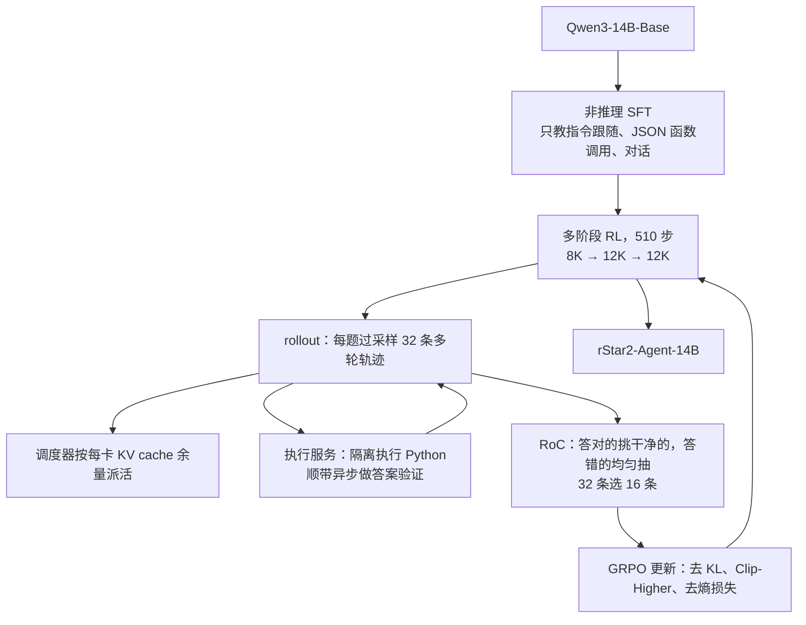
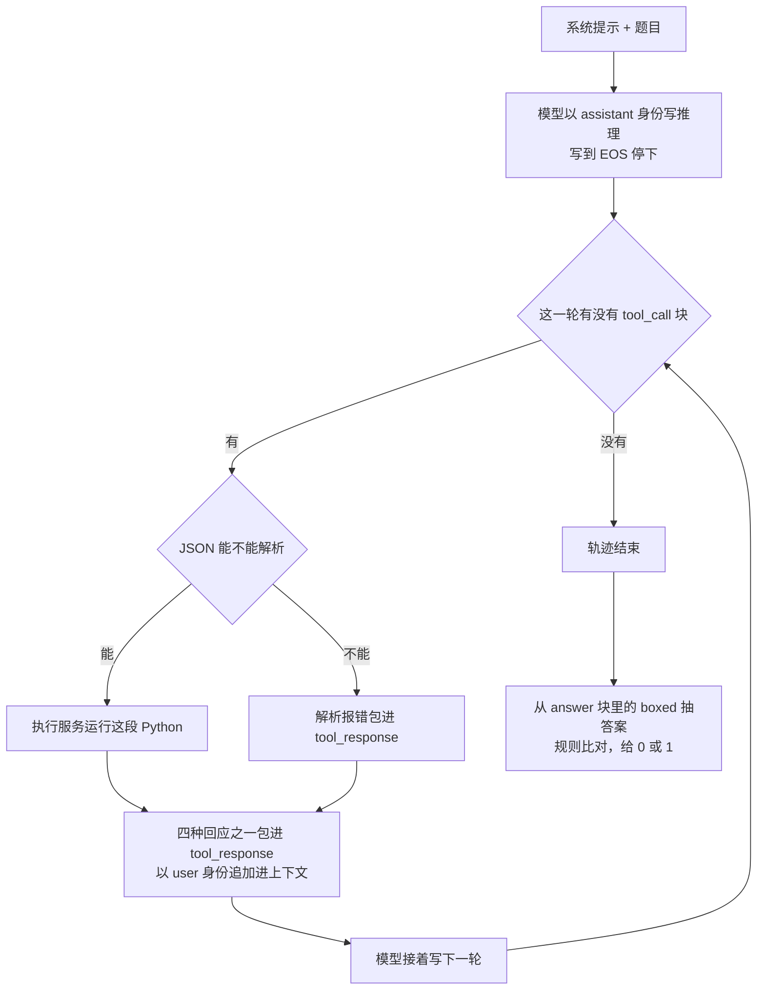
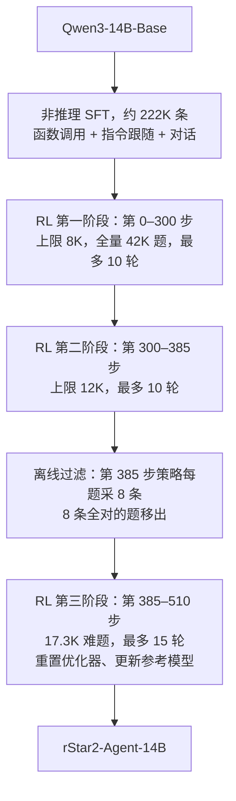

# rStar2-Agent：奖励一个字不改，只挑成功轨迹里干净的那一半

<!-- release-date: 2025-08-28 -->

> 本文依据 **rStar2-Agent: Agentic Reasoning Technical Report**，Microsoft Research，15 位作者（Ning Shang、Yifei Liu、Yi Zhu、Li Lyna Zhang 并列第一作者，Li Lyna Zhang 与 Mao Yang 为项目负责人），arXiv:2508.20722v1，2025-08-28，共 22 页（p. 19–22 为参考文献，无附录）。页码指这份 PDF 自身的页码。文中区分三件事：**论文明确写了什么**、**我们怎么解释它**、**哪些是外部资料或我们的推算**。

## 读前先把几个词说成人话

这篇的骨架是别人的（Qwen3-14B-Base），没有架构和预训练可讲。它讲的是：把一个 Python 解释器接进强化学习的回路之后，冒出来哪几个新问题，以及怎样用很少的算力把它们压住。

先把会反复出现的词说清楚：

- **rollout（轨迹生成）**：让当前模型对一道题自己写一遍答案。写出来的「题目 + 回答」叫一条 **trajectory（轨迹）**。
- **agentic RL（智能体强化学习）**：rollout 中间夹着真实的工具调用。一条轨迹是「模型写一段 → 环境回一段 → 模型再写一段」的多轮交替，而不是一口气写到底。
- **工具调用（tool call）**：模型吐出一段结构化文本，外部系统解析、真的执行，再把结果塞回上下文，让模型接着写。
- **结果奖励（outcome reward）**：只看最终答案对不对，对给 1、错给 0。中间过程不打分。
- **GRPO（Group Relative Policy Optimization，组相对策略优化）**：同一道题采一组回答，用组内均值和标准差把奖励换算成优势（advantage），不训练价值网络。完整机制见 DeepSeekMath 一篇。
- **RoC（Resample-on-Correct，答对之后再筛一遍）**：这篇的核心算法改动。装进 GRPO 就叫 **GRPO-RoC**。
- **avg@16 / avg pass@1**：同一道题采样 16 次，每次独立判对错，取平均正确率（PDF p. 14）。
- **KV cache**：推理引擎为每条正在生成的序列保存的中间状态。显存里放得下多少条，决定一张卡能同时跑多少条 rollout。
- **截断比例（clipping ratio）**：这篇里专指超出最大回答长度、被截断的 rollout 占比（PDF p. 12），不是 PPO 的比值裁剪。

## 一句话先说清

把 Python 解释器接进推理回路，好处很直接：模型不再只能自己检查自己，它可以真的算一遍。

但解释器同时带来一个不显眼的污染源。模型写的代码经常是错的，环境回一堆报错和 traceback，模型就把 token 花在修代码上，而不是推进推理。更麻烦的是，只看最终答案的奖励**看不见**这件事：中间调错五次工具、最后答对的轨迹，和一次调通的轨迹，拿的都是 1。

论文的做法是不碰奖励，只改「哪些轨迹有资格进入这一批更新」：先多采一倍，答错的原样均匀抽一半，答对的按「工具错误率 + 格式违规」打分、优先留干净的一半。配上一套能扛住每步几万次工具调用的执行服务、一个按 KV cache 余量派活的调度器、一套刻意压短长度的三阶段训练配方，结果如下：

| 指标 | 数值 | 条件 |
|---|---|---|
| 模型 | rStar2-Agent-14B | 基座 Qwen3-14B-Base（PDF p. 11） |
| RL 步数 | 510 | 分三个阶段（PDF p. 13） |
| 训练算力 | 64 张 AMD MI300X，一周内 | PDF p. 13–14 |
| AIME24 / AIME25 | 80.6 / 69.8 | avg@16，评测时带 Python 工具，最多 30 轮、每条 30K token（PDF p. 14） |
| HMMT Feb.25 | 52.7 | 同上（PDF p. 14） |
| 平均回答长度 | 9339.7 / 10943.4 token | AIME24 / AIME25（PDF p. 15） |

对照组里 671B 的 DeepSeek-R1 在 AIME24 上是 79.8（PDF p. 14）。「14B 追平 671B」就出自这两个数。它成立的范围有严格边界，实验一节会拆开讲。

### 一条阅读路线

如果只有半小时读原文，建议按这个顺序：

1. **p. 7 Figure 4**：答对的轨迹里，工具错误率在普通 GRPO 下走平不再降。这是全篇的问题陈述。
2. **p. 7–8 第 2.2.3 节与式 4–7**：RoC 怎么对正例、负例用两套规则。
3. **p. 16 Figure 9**：拿掉 RoC 的消融，全篇最干净的一格证据。
4. **p. 12–13 第 4 节**：非推理 SFT 与 8K → 12K → 12K 三阶段，以及两次失败尝试。
5. **p. 14–15 Table 3–5**：主结果，读的时候记住评测条件。
6. **p. 9–11 第 3 节**：执行服务与调度器，注意它们都没有量化收益。

## 主要矛盾：解释器接进来了，奖励却看不见它带来的错误

### 为什么要接一个解释器

近两年推理模型的主线是 test-time scaling：让模型在答题前写更长的思维链。论文承认这条路有效，但指出它的天花板：在容易出现细微中间错误、或需要换个思路的难题上，模型只能靠内部的自我反思，而自我反思常常查不出错误，初始思路有问题时也纠正不过来（PDF p. 3）。

论文的目标因此从 thinking longer 换成 think smarter：让模型学会调用工具去推理、验证，并按环境的反馈调整（PDF p. 3）。工具选的是 Python 代码与解释器，配 NumPy、SciPy、SymPy（PDF p. 4）。

为什么是它？论文的判据很实在：一个有价值的环境必须**可部署**，并且能给出**准确、可验证**的信号（PDF p. 3）。解释器不讨好模型：代码错了就报错，算错了就给出另一个数。

**我们如何解释它。** 模型自己写的检查，和被检查的内容出自同一套参数，不是独立证据。接一个会如实报错的外部执行器，等于接了一个独立的裁判。给 agent 挑工具时，第一问不是功能强不强，而是它的反馈能不能被独立信任。

### 工具带来了新噪声，奖励罚不到它

论文的诊断分两层（PDF p. 6–7）。

第一层，**环境噪声**。普通推理只要求「想对」，用工具还要求「写出能跑的代码」。代码写错时，环境返回的报错与推理任务本身无关，会误导模型把 token 花在修工具错误上。这种干扰在纯思维链里根本不存在。

第二层，**结果奖励看不见它**。中间工具调用出错、最后答案正确的轨迹，照样拿正奖励，等于告诉模型「这种错误可以接受」（PDF p. 7）。

图引自原文 Figure 4（PDF p. 7）。它统计的对象定义得很精确：**只看被判为正确的轨迹**，数其中出错的工具调用占全部工具调用的比例。论文正文给的平台值是 Qwen2.5-32B 约 15%、Qwen3-14B 约 10%（PDF p. 7）。

图上读得出、正文没展开的有两处。右图的普通 GRPO 先掉到 10% 左右，又反弹回 20% 以上，再长期震荡：模型一开始确实在学着少犯错，学到某个程度就不再学了。左图 GRPO-RoC 在第 385 步附近陡降，那正是第三阶段换数据集、重置优化器的时间点（PDF p. 13），论文没有解释这次陡降。

**我们如何解释它。** 右图那个「先降后升」的形状，是奖励缺一块导致的行为，不是能力上限。奖励不在乎中间错误，模型就没有理由继续压低它。论文由此下的结论是：模型倾向于产出冗长、低质量、带工具错误的轨迹，既拖累效果又抬高训练成本（PDF p. 7）。

### 为什么不直接改奖励

摆在面前的常规解法有两条，论文都点名拒绝（PDF p. 7）：引入步骤级奖励；保留结果奖励但对工具错误扣分。

理由有两条：一是复杂，要仔细的人工调参，甚至要额外造奖励模型；二是容易被 reward hacking。第二条论文给了一个带时间维度的例子：训练早期模型的推理能力还在发育，这时的步骤奖励或工具错误惩罚会妨碍有效探索（PDF p. 7）。

**我们如何解释它。** 一个惩罚项合理的前提，是模型已经有能力避免那种错误。训练早期这个前提不成立：因为写错代码而扣一个还不会写代码的模型的分，等于在教它少用工具。

于是矛盾变成：

> 奖励必须保持「只看答案」才不被 hack，可只看答案又会把带错的成功轨迹当好样本强化。能不能不动奖励，只动进入更新的数据？

## 先看全景：三件东西各管一段

这张图按 PDF p. 4–14 的叙事重画，是流程示意，不是论文原图。算法（RoC）管「哪些数据被学」，执行服务管「工具调用别拖住 GPU、别拖垮训练进程」，调度器管「生成阶段别空转」，配方管「回答长度别一开始就失控」。

## 一条带工具的轨迹长什么样

机制示意，按 PDF p. 4 的 Figure 2 与 p. 5 正文重画。轮数达到上限 $T$ 也会结束（PDF p. 5）。

执行服务只有四种回应（PDF p. 5）：有标准输出的成功执行，返回输出；无标准输出的成功执行，返回 IPython 风格的显示值；执行错误，返回报错与 traceback；超时，代码语法合法但没在时限内跑完，常见于死循环。四种都原样喂回模型。

有一个设计选择值得单独记：**基础设施层不做失败重试**。报错就是一种正常返回，让模型自己决定改不改。Figure 11（PDF p. 18）就是一例：模型调 SymPy 撞上 `GeneratorsNeeded` 异常，接着在推理里分析原因、换一种写法、重跑成功，最后手工复核加法、给出 117。

**我们如何解释它。** 代价是修 bug 的 token 全落在轨迹里，由上下文和训练算力买单；收益是不会出现「基础设施悄悄重试三次，模型永远学不会写对」的错配。当「从失败中恢复」本身是要训练的能力时，不要在模型看不见的层次把失败吞掉。

工具接口用的是通用的 JSON 函数调用：模型吐出 `tool_call` 标签，里面是含 `name` 与 `arguments` 的 JSON，工具名 `execute_python_code_with_standard_io`，参数 `code` 与 `input`（PDF p. 5）。论文拿它对比 markdown 代码块或 `<code>`、`<interpreter>` 这类自造标签，理由是消除解析歧义、把推理和执行分开、便于扩展到别的工具，并与通用 LLM API 的函数调用协议对齐（PDF p. 5）。另有一条格式约束：一条轨迹可以有多个 `reason` 块，但只能有一个 `answer` 块，最终数值包在 `\boxed{}` 里（PDF p. 6）。这条约束后面会变成 RoC 的一个打分项。

## 核心设计一：GRPO-RoC，正例和负例用两套规则

### 先看它继承的底座

GRPO 的目标（PDF p. 6 式 1）对每道题 $q$ 采 $G$ 条轨迹，逐 token 算新旧策略的概率比，乘上整条轨迹的优势，做裁剪。优势是组内标准化（PDF p. 6 式 2）：

$$
A_{i,t}=\frac{r_i-\operatorname{mean}(\{r_1,\dots,r_G\})}{\operatorname{std}(\{r_1,\dots,r_G\})}
$$

$r_i$ 是第 $i$ 条轨迹的奖励，同一条轨迹里所有 token 共用这个优势。奖励只有两个取值：从 `answer` 标签里的 `\boxed{}` 抽出答案，用规则化的 math_verify 比对，对给 1、错给 0（PDF p. 6 式 3）。

在底座上，论文采纳了几项「来自近期工作」的改动（PDF p. 6）：

| 改动 | 内容 | 论文给的理由 |
|---|---|---|
| 去掉 KL 惩罚 | 式 1 末尾的 $-\beta D_{\mathrm{KL}}$ 整项去掉 | 它把策略绑在参考模型附近，限制新的、带工具的推理模式被发现 |
| Clip-Higher | 裁剪上界 $\varepsilon_{\text{high}}$ 从 0.2 提到 0.28，下界 0.2 不动 | 让模型更好地探索高熵、低概率的 token，其中可能有关键的分叉 token |
| 去掉熵损失项 | 不再显式鼓励熵 | 它可能让熵不受控地增长，最终训练崩溃 |

Clip-Higher 明确引了 DAPO，其余两条归在那句总述之下（PDF p. 6）。还有一处正文没提、只体现在公式里：式 1 的归一化是「先句内平均、再句间平均」，式 6 换成了「全批所有 token 一起平均」，即 DAPO 一篇的 token 级损失（PDF p. 6、p. 8）。

**我们如何解释它。** 第三条与 DAPO 方向相反。DAPO 怕熵坍缩，所以托住熵；这里怕熵失控上涨，所以拿掉显式熵项。两边在同一个量上做了相反的处理，因为失效模式不同。rStar2 的 rollout 温度是 1.0（PDF p. 14），比很多工作高，熵往上跑的风险也更大。

### 新设计：过采样一倍，再按正负分开筛

示意图依据第 2.2.3 节与式 4–7（PDF p. 7–8），条数与被抽中的位置是虚构的。机制本身三句话能讲完（PDF p. 8）：

- 每题先采 $2G$ 条，实际取 $2G=32$、$G=16$（PDF p. 12）；
- **负例保多样性**：答错的轨迹不做任何筛选，按原分布抽 $\lfloor|O_{\text{neg}}|/2\rfloor$ 条，让模型见到各式各样的失败；
- **正例滤噪声**：答对的轨迹抽一半，按两类中间问题打分，罚分越低越容易被抽中。

一句话：**正例是「怎么做对」的示范，所以挑最好的；负例是「哪些坑会踩」的地图，所以保持多样。** 论文把这叫做非对称采样（PDF p. 7）。

### 两个罚分怎么算

**工具错误率**（PDF p. 8 式 4）。数这条轨迹里的工具调用总数和其中出错的个数：

$$
p_{\text{err}}=
\begin{cases}
0.5, & \text{完全没有工具调用}\\
\dfrac{\text{出错的工具调用数}}{\text{全部工具调用数}}, & \text{其他情况}
\end{cases}
$$

那个 0.5 是刻意的偏置，论文写明是为了鼓励使用工具（PDF p. 8）。效果是：一条完全不调工具、纯靠思维链答对的轨迹，罚分是 0.5；调了工具、错误率低于一半的轨迹，罚分更低、更容易被选中。

**我们如何解释它。** RoC 在正例筛选里悄悄塞进了一个「要学会用工具」的先验。它不在奖励里，所以不会被 hack；但它会系统性地让纯思维链的成功轨迹少进更新。

**格式违规**（PDF p. 8 式 5）。一条轨迹只允许一个 `answer` 块：

$$
p_{\text{format}}=
\begin{cases}
1, & \text{一个 answer 标签都没有}\\
\min\left(1,\ \dfrac{\text{answer 标签数}-1}{\text{轮数}}\right), & \text{其他情况}
\end{cases}
$$

论文的解释是：多轮代码环境很容易产生多余格式，比如 `answer` 之后又冒出 `reason`；标签多于一个往往意味着重复生成，按超出的个数成比例罚（PDF p. 8）。

两项相加 $p_{\text{total}}=p_{\text{err}}+p_{\text{format}}$，以与 $p_{\text{total}}$ 成反比的概率抽出一半正例（PDF p. 8）。论文特意说这样既引导模型走向干净轨迹，又保持对多样成功行为的接触（PDF p. 8）。

**我们如何解释它。** 按论文写法，这是概率偏好，不是硬截断：脏轨迹不是进不来，只是概率更低。这一点要紧，做成硬过滤，模型就再也见不到「工具出错、但被自己修好」的轨迹，而那恰是第 5.4 节想要的行为。另外，罚分恰好为 0 的轨迹（调了工具、零错误、一个 answer 标签），「反比概率」在数学上没有定义，论文没说怎么处理。

### 最终目标：只换了采样池

先定义单个 token 的裁剪项，避免下标压垮阅读：

$$
\ell_{i,t}=\min\Big(\hat r_{i,t}(\theta)\hat A_{i,t},\ \operatorname{clip}\big(\hat r_{i,t}(\theta),\,1-\varepsilon_{\text{low}},\,1+\varepsilon_{\text{high}}\big)\hat A_{i,t}\Big)
$$

带帽子的量都指 RoC 选出来的那 $G$ 条：$\hat r_{i,t}$ 是它们的逐 token 概率比，$\hat A_{i,t}$ 是只在这 $G$ 条上做组内标准化得到的优势（PDF p. 8 式 7）。目标是（PDF p. 8 式 6）：

$$
J_{\text{GRPO-RoC}}(\theta)=\mathbb E\left[\frac{1}{\sum_{i=1}^{G}|\hat o_i|}\sum_{i=1}^{G}\sum_{t=1}^{|\hat o_i|}\ell_{i,t}\right],\quad
\{\hat o_i\}_{i=1}^{G}\subset\{o_i\}_{i=1}^{2G}\ \text{由 RoC 选出}
$$

$\varepsilon_{\text{low}}=0.2$，$\varepsilon_{\text{high}}=0.28$（PDF p. 8）。对着式 1 看，一共三处不同：采样池从 $G$ 变成 $2G$ 再选回 $G$；损失分母换成全批 token 数；KL 项没了。

### 收益

最直接的收益在 Figure 4：答对轨迹里的工具错误率在两个基座上都持续下降，不再走平（PDF p. 7–8）。第二层收益在消融 Figure 9：准确率更高、回答更短（PDF p. 16），放在实验一节看。

### 代价与边界

- **采样成本翻倍。** 每题采 32 条只用 16 条，另外 16 条的生成和它们触发的工具调用全部丢弃。论文没有给这部分开销，也没有对照「同样的采样量全部用于 $G=32$ 的普通 GRPO」。
- **它不解决零梯度问题。** 正负两侧各取一半，批里的答对占比基本不变，组内标准化的统计量也大致不变。全对或全错的题在 RoC 之后仍然全对或全错，优势恒为 0。这与 DAPO 的动态采样解决的是两个问题。
- **它依赖「错误能被自动数出来」。** $p_{\text{err}}$ 能算，是因为解释器会明确报错。换到没有明确失败信号的环境（网页浏览、自然语言 API、人类反馈），这个分数算不出来。

**外部补充：发布版代码与论文写法不一致。** 官方仓库 [microsoft/rStar](https://github.com/microsoft/rStar) 的 `rstar2_agent/down_sample/roc.py` 里，答对一侧是**按罚分升序排序、直接取前 $k$ 条**，是硬截断，不是论文写的反比概率抽样；答错一侧取生成顺序的前 $k$ 条（首次发布时也按罚分排序，2025-09-05 的提交删掉了这一步）；两侧条数按原比例四舍五入，并各自保底至少 2 条；「出错的工具调用」按工具返回文本里是否含 error 字样判定。同一仓库的奖励函数先用 Prime 的判分、再退回 math_verify，对整段输出判分，不要求 `answer` 标签，所以没有 `answer` 标签的轨迹也可能拿到奖励 1，式 5 的第一分支在实现里是可达的。这是迁移后的发布版代码，不能反推训练 rStar2-Agent-14B 时的实现，但复现时要知道两者不同。

### 可迁移启发

1. **正例和负例不必用同一套筛选规则。** 正例是示范，要精；负例是边界，要广。SFT 数据清洗、对比学习负采样、偏好对构造里都能直接用。
2. **奖励看不见某个东西时，除了改奖励，还可以改数据的进入门槛。** 改奖励会改变优化目标，可能开出新的 hacking 面；改采样只改变训练分布，目标不动，失败模式更温和、更容易回退。

## 核心设计二：把工具执行做成独立服务

### 旧问题：在训练进程里就地跑 Python

最朴素的做法是用本地解释器直接执行模型生成的代码。论文列了两条否定理由（PDF p. 9）：

- **效率**：大规模多轮 rollout 里，一个训练批次能触发数千次代码执行。全放本地会打满 CPU，还让 GPU 干等。
- **安全**：模型生成的代码不可预测，可能有 bug、起不受控的线程、调用难以 kill 的外部库，对主训练进程是严重风险。

第二条常被低估。它的后果不是「跑得慢」，而是训练任务本身可能被一段随手写出的死循环拖垮。

### 新设计：主节点排队打包，工作节点并行执行

服务分布在这套 64 卡 MI300X 训练集群的 CPU 核上（PDF p. 10，Figure 5b）：

- **主节点**：一个中心任务队列，加 32 个 send worker。所有调用先进队列，避免直接压垮执行端；send worker 持续轮询，把最多 64 个调用打成一批，批满或超过固定超时就下发，并且**等这批结果回来才发下一批**。
- **工作节点**：各跑一个轻量任务调度器，经 Redis 队列把批内调用分给一个 1024 个 execution worker 的池子，执行完把结果交回 send worker，再转回 rollout 进程。

**我们如何解释它。** 「等结果回来才发下一批」是一个隐式的背压：上游发送速率被下游完成速度限住，队列不会无限膨胀。论文没有用这个词。

### 收益：每步几万次调用，延迟不随负载上涨

图引自原文 Figure 6（PDF p. 9），横轴是训练步。论文的文字结论是：每个训练步最多产生 45K 次工具调用，在这个规模下平均延迟 0.3 秒，含调度与执行时间（PDF p. 10）；引言写作可处理 45K 次并发调用、平均 0.3 秒返回（PDF p. 3）。同一句里括号写的是「45 calls per step」，少了一个 K，与上一句和图注的 45K 不一致（PDF p. 10），引用时要留意。

**我们如何解释它。** 图上更有说服力的是延迟与调用量**脱钩**：前 5 步调用量 3 万出头、延迟约 0.14 秒；第 12–20 步调用量跌到 1.4 万–1.7 万，延迟反而已经到 0.27 秒左右；之后调用量翻了近三倍，延迟一直停在 0.26–0.31 秒（读自 Figure 6）。延迟由单次调用本身决定（可能是代码变复杂了），不由排队决定，说明服务在 4 万级并发下没有饱和。

一个量级换算（我们的计算）：每步 512 道题、每题 32 条，即 16,384 条 rollout；按每步 4 万余次调用算，平均每条轨迹 2–3 次工具调用，远小于训练时允许的最大轮数 10（PDF p. 14）。论文没有报告每条轨迹的平均调用次数，这只作量级参考。

### 顺手把答案验证也搬出去

规则化的判分器（如 Math-Verifier）在复杂或边界情况的答案上**偶尔会跑很久**。放在训练循环里，会阻塞 rollout、让 GPU 空转。所以答案正确性验证也交给执行服务异步跑（PDF p. 10）。

**我们如何解释它。** 验证器在系统里的身份和工具一样，都是一段可能超时的 CPU 代码。很多 RL 框架把奖励计算当成轻量纯函数放在主循环里，遇到符号计算类验证器就会踩坑。

### 代价与边界

论文没写单次执行的超时秒数、内存上限，也没写解释器状态是否跨轮保留。从 Figure 2 与 Figure 11 看，模型每一轮都重新 import、重新定义函数，与「每次调用起独立进程」一致（PDF p. 4、p. 18），但这只是观察。官方仓库把执行器抽成独立的 [Code Judge](https://github.com/0xWJ/code-judge) 服务（外部补充），训练时用的具体参数没有公开。

## 核心设计三：按 KV cache 余量派 rollout

### 旧问题：静态平分，每一轮都等最慢的那条

早期实现建在 VERL v0.2 上，用最直白的静态分批：把 rollout 请求平均预分给各 GPU，每张卡 $N$ 条（PDF p. 10–11）。在多轮场景下出三种问题（PDF p. 11）：

1. **轮级长度不均反复出现。** 每条 rollout 轮数不同、每轮 token 数也不同。静态同步调度下，短的在**每一轮**都要等最长的；工具调用又通常按轮收集、按轮执行，同步延迟叠上来。单轮 RL 只等一次，多轮每轮都等一次。
2. **KV cache 溢出。** 推理引擎预判不了每条会生成多少 token，默认把分到的请求全部并行发出。某张卡的 KV cache 超容量时，SGLang 会**逐出一半正在生成的 rollout**，哪怕已经算了一大半；被逐出的要等其余跑完再重算。
3. 两者叠加，GPU 之间严重负载不均、大量空闲。

**我们如何解释它。** 第二条最有教育意义：「显存不够就逐出」这种看似温和的降级，在 RL rollout 里等于把已完成的计算作废。它不报错，只让墙钟时间悄悄变长。

### 新设计：先算每张卡安全放得下几条

图引自原文 Figure 7（PDF p. 10），是论文自己画的机制示意，不是实测时间线。做法（PDF p. 11）：给定最大 rollout 长度 $L$，按每张卡当前可用的 KV cache 估出它不溢出能承载的最大条数 $K$（$K<N$），只派这么多；各卡独立执行；多轮中工具调用一生成就异步发出，不等别的 rollout；某张卡跑完、腾出 KV 空间，调度器实时补新请求。

### 代价与边界

**论文没有给这个调度器任何量化收益。** 没有加速比、没有 GPU 利用率、没有开关对照；全部证据是 Figure 7 这张示意和一句「显著提升 GPU 利用率与整体 rollout 效率」（PDF p. 11）。这一节的结论强度明显低于 GRPO-RoC。

**外部补充。** 官方仓库 README 的 Important Note 写明：发布版训练框架已从 VERL v0.2 迁到 VERL v0.5，原框架里的负载均衡 rollout 调度器等特性没有一起迁移；这份发布版还没有完整训练过一个模型，只验证了前 50 步与原框架差异很小。论文里最吃工程的一块，恰是复现时拿不到的一块。

### 与异步 RL 系统的边界

这套调度与 AReaL 一篇、Laminar 一篇讲的不是同一件事。那两篇处理**步与步之间**的生成与训练解耦，为此付出陈旧度控制等算法代价；rStar2 处理的是**同一个训练步之内**的负载均衡与外部执行。论文里的 asynchronous 只用在工具调用派发与答案验证两处（PDF p. 10–11），全文没有提数据陈旧度或生成训练解耦。两条路可以叠加，论文没做。

## 训练配方：一个刻意不教推理的 SFT，加三段短长度 RL

按 PDF p. 11–14 重画的流程示意。各阶段的步数区间是我们按论文给的「第一阶段 300 步」「第二阶段最后一步是 385」「第三阶段再跑 125 步」「合计 510 步」推出来的（PDF p. 13）。

### 为什么冷启动刻意不放推理数据

多数同类工作先做一轮推理密集的 SFT 给策略暖启动。rStar2 反过来：SFT 只教通用指令跟随、JSON 格式和基本的代码工具用法，**不教推理**（PDF p. 11）。理由两条（PDF p. 3）：避免 SFT 过拟合；让初始回答保持短，这样 RL 既能更有效地培养推理，又能充分利用基座预训练时带着的能力。

**我们如何解释它。** 第二条是关键。回答长度是 agentic RL 里最贵的量，它同时决定 rollout 时间、KV cache 占用和工具调用次数。SFT 若把模型教成动辄写一万 token，整个 RL 都要为这个起点买单。

SFT 数据三组（PDF p. 11），合计约 222K 条（我们的求和）：

| 组别 | 条数 | 来源与处理 |
|---|---:|---|
| 函数调用 | 165K | 117K 来自 ToolACE-11K、APIGen-MT-5K、Glaive-function-calling-v2-101k；另 48K 是 Magicoder 代码数据**改写成 JSON 函数调用格式**，专门增强代码工具能力 |
| 指令跟随 | 30K | 来自 Tulu3 后训练数据，回答用 o4-mini 重写 |
| 对话 | 27K | 来自 LLaMA-Nemotron 后训练数据，每段对话的提示用 o4-mini 重写 |

SFT 超参：3 个 epoch，学习率 $5\times10^{-6}$，4% 预热，cosine 衰减，batch 128（PDF p. 14）。

两个细节值得记。48K Magicoder 被改写成 RL 阶段要用的那个接口格式：冷启动教的是**接口**，不是知识。另有两组文本经 o4-mini 重写，这个「非推理 SFT」里含有前沿闭源模型的成分，论文没有讨论它的影响。

Table 1（PDF p. 11）：

| 模型 | MATH-500 | AIME24 | AIME25 | BFCL v3 | IFEval | Arena-Hard |
|---|---:|---:|---:|---:|---:|---:|
| Qwen3-14B-Base | 62.0 | — | — | — | — | — |
| Qwen3-14B（官方对齐版） | 96.8 | 79.3 | 70.4 | 61.5 | 84.8 | 86.3 |
| 非推理 SFT 之后 | 57.4 | 3.33 | 0 | 63.1 | 83.7 | 86.8 |

SFT 之后 AIME25 是 0，工具使用、指令跟随、对话三项则达到或超过官方对齐版。论文的概括是：SFT 主要提升了工具使用、指令跟随和对话能力，同时保持与基座相当的数学表现（PDF p. 12）。

**我们如何解释它。** 「保持相当」对 MATH-500 大致成立（62.0 → 57.4）。AIME 两列的对照是空的，论文没报基座在 AIME 上的分数，所以这张表读不出 SFT 有没有伤到竞赛级数学能力。后面的结果才是最强的回答：这个 AIME25 为 0 的起点，510 步 RL 后到了 69.8（PDF p. 15）。SFT 教格式，RL 教本事。

### RL 数据：答案必须是整数

数据收集只有两条规则（PDF p. 12）：题目高质量、有挑战、答案标注正确；**答案必须是整数**。后者的理由是代数表达式判等出了名的难，Prime 与 math_verify 这类规则判分器认不出 $(a+b)(b+c)(c+a)$ 与 $(a+c)(c+b)(b+a)$ 是同一个解，会把正确的 rollout 判错（PDF p. 12）。误判为错比误判为对更致命，它随机惩罚正确行为。

| 来源 | 条数 | 处理 |
|---|---:|---|
| DAPO 训练集中的整数答案题 | 17K | 直接纳入 |
| AoPS 论坛题，经 OpenMathReasoning 整理 | 93K | 去掉无法验证的答案（如 The limit does not exist）、过于复杂的格式、错误答案 |
| Project Euler | 937 | 去掉答案数值过大、会让判分器超时的题（如 6.5e27330467） |
| 清洗后 | 42K | |

AoPS 那一侧的清洗用 Qwen3-32B 每题生成 16 个回答，只保留整数答案至少两次与原标注一致的题（PDF p. 12）。三个来源合计 110,937 题，最后留 42K，约 62% 被筛掉（我们的计算）。大部分公开数学题不满足「规则可验证」这个前提。

**我们如何解释它。** 这和 DAPO 一篇的做法是同一件事的两次独立实践：先设计验证器，再设计 RL。两个团队为同一个原因把答案约束成整数，这条经验的可信度比单篇的消融更高。

### 三个阶段各在解决什么

RL 超参（PDF p. 12、p. 14）：AdamW，学习率恒定 $1\times10^{-6}$，前 20 个 rollout 步线性预热；每步 512 道题，每题过采样 32 条、RoC 选 16 条；rollout 温度 1.0；最大轮数前两阶段 10、第三阶段 15。

图引自原文 Figure 8（PDF p. 14）。长度与分数的走势以图为准，下面只补图上读不出的判断。

**第一阶段：8K 上限，全量 42K 题，300 步**（PDF p. 12）。短上限可行，是因为非推理 SFT 后模型的初始回答只有约 1K token。这期间被截断的比例多次短暂超过 10%。论文的判断很反直觉：高截断比例通常意味着上限设小了，但他们坚持 8K 不放宽，理由是这会逼模型借助 GRPO-RoC 更有效地推理；观察到的结果是模型很快自我调整，截断比例回落、分数上升、回答变简洁（PDF p. 12）。

**我们如何解释它。** 一个「资源触顶」的指标，既可能说明资源不够，也可能说明策略还没学会节约。区分两者的办法是看它随时间的走向，而不是当前的绝对值。

**第二阶段：上限提到 12K，第 300–385 步**（PDF p. 13）。触发条件写得明确：第一阶段结束时截断比例稳定在 10% 左右，训练奖励与评测分数双双走平，8K 成了瓶颈。

**第三阶段：换难题，第 385–510 步**（PDF p. 13）。触发条件：第二阶段末，一个批次里超过 70% 的题因通过率满分被剔除，很多题对模型已经太简单。这里论文没有用「训练中动态剔除已解题」，而是做一次**离线过滤**：用第二阶段最新的策略在原 42K 题上每题采 8 条，移除 8 条全对的，剩 17.3K 道难题；在新数据上重置优化器状态，并把参考模型更新为最新策略。再跑 125 步后性能开始饱和甚至下降，于是停在 125 步。三阶段合计 510 步，64 张 MI300X 一周内跑完（PDF p. 13）。

逐阶段的数字（PDF p. 15）：

| 节点 | AIME24 | AIME25 |
|---|---:|---:|
| 非推理 SFT 之后 | 3.3 | 0 |
| 第一阶段结束（8K，300 步） | 72.1 | 64.2 |
| 第二阶段（12K） | 77.0 | 64.8 |
| 第三阶段结束（难题，510 步） | 80.6 | 69.8 |

第一阶段拿走了 AIME24 总增益的 89%、AIME25 的 92%（我们的计算：$(72.1-3.3)/(80.6-3.3)$ 与 $64.2/69.8$）。论文说第一阶段就超过纯思维链的 DAPO 基线 +21.7 与 +21.3（PDF p. 15）。

这张表有三处要标注：

1. **第二阶段的 77.0 不在阶段终点。** Figure 8 上标第二阶段成绩的星在第 330 步附近，不在第 385 步；星之后 AIME24 曲线回落到 72–75 一带，第三阶段才重新爬上去（读自 Figure 8）。所以「第二阶段结束时 77.0」更像阶段内的最好点。
2. **有两个「DAPO 基线」。** 正文 +21.7 / +21.3 反推出的基线是 50.4 / 42.9（我们的计算），对应 Table 6 的「DAPO-Qwen-14B w/ Forking tokens」一行；Figure 8 里那条灰色虚线约在 45 与 38，对应「DAPO-Qwen-14B」一行的 45.2 与 38.1（PDF p. 16）。两行都引自 Wang 等人 2025（高熵少数 token 那篇），是第三方把 DAPO 配方跑在 Qwen3-14B-Base 上的结果，不是 DAPO 论文自己的实验。
3. **两处字面张力，论文没解释。** 「超过 70% 的题被剔除」说明训练中一直在剔除全对组，而同一段又说不采用「训练中动态排除」（PDF p. 13）。合理的读法是：在线剔除全对、全错组一直开着，第三阶段加的是一次性的离线数据裁剪；官方仓库的训练脚本确实开着 `reject_equal_reward`（外部补充）。另一处是「更新参考模型」：目标里已经没有 KL 项（PDF p. 6），参考模型还用在哪里，论文没说。

### 长度上限只到 12K，在同行里是个异类

Table 2（PDF p. 12）：

| 方法 | 有推理 SFT | RL 阶段数 | 总步数 | 最大训练长度 | 难度过滤 |
|---|:-:|:-:|---:|---|---|
| DeepSeek-R1-Zero | ✗ | — | >9K | — | — |
| DeepSeek-R1 | ✓ | — | — | — | — |
| DAPO | ✗ | 1 | >5K | 20K | ✗ |
| ReTool | ✓ | 1 | 400 | 16K | — |
| MiniMax | ✓ | 4 | >4K | 40K→48K→56K→80K | 全阶段 |
| MiMo | ✓ | 3 | 175K | 32K→38K→48K | 全阶段 |
| Magistral | ✓ | 3 | — | 16K→24K→32K | 全阶段 |
| rStar2-Agent | ✗ | 3 | 510 | 8K→12K→12K | 仅第三阶段 |

论文的说法是：别人普遍全程至少 16K，他们从更短起步、逐阶段放大，这份效率由 GRPO-RoC 支撑，它让模型在更短的回答长度下也表现良好（PDF p. 12）。表里 MiMo 的 175K 步与其他行差着量级，论文没解释口径，照原表转录。

**我们如何解释它。** 这张表是各家公开配方的横向罗列，不是控制变量实验。步数少不代表方法更好，基座、数据、评测口径全不同。它能支持的只有一条：rStar2 的配方在训练预算上处在另一个区间。

## 两次被否掉的做法

第 4.3.1 节记录了没成功的尝试（PDF p. 13）。论文自己加了限定：分享是为了提供实践洞察，不是说这些方法本身无效。

### 超长过滤在这里失效，而且和 DAPO 的结论相反

背景：DAPO 认为，因为写超了就给负分会让模型困惑，一段推理正确的回答可能只是太长，于是提出 overlong filtering，把被截断的 rollout 整条丢掉、不赋奖励，后续多项工作沿用（PDF p. 13）。

rStar2 的实验结果是：**超长过滤没有收益，反而让超长 rollout 的比例上升**。论文给的可能解释是很多超长回答含有重复模式，没有负反馈，模型收不到纠正信号，就继续产出过长的输出。所以他们不用超长过滤，保留被截断的 rollout 并给负奖励；这些样本反而成了有用的信号，截断比例一冒尖，模型很快在随后几步把它压回来（PDF p. 13）。

**我们如何解释它。** 两个结论的实验条件差得足够远，不构成互相证伪，也不能互相引用。至少三处不同：长度上限不同（DAPO 20K，这里 8K / 12K），上限越紧，被截断的样本里「陷入重复」的比例越高；DAPO 还配了软性超长惩罚，rStar2 只对照了「整条丢掉」这一种；DAPO 是纯思维链，这里是多轮带工具，「超长」里混着工具返回和修 bug 循环。截断样本该怎么算分，取决于截断样本里装的是什么。

### n-gram 重复检测会误伤有效推理

第二个尝试是在 RoC 里再加一项：降低含重复模式的正确 rollout 被选中的概率，用的是 Phi-4-Reasoning 的 n-gram 重复检测（PDF p. 13）。结果**平均回答长度和推理分数一起变差**。

论文仔细看过被滤掉的「重复」轨迹，发现很难精确区分不良重复与合理推理：模型可能生成两次很相似的工具调用、只换了输入，用来验证结果。这是周密的推理，但简单的 n-gram 启发式常把它判成重复（PDF p. 13）。

**我们如何解释它。** 表层文本相似度不等于语义冗余。同样的陷阱出现在日志去重、缓存键设计、SFT 数据去重，以及任何用 n-gram 或编辑距离做质量过滤的地方。

### 论文自己总结的教训

LLM 的 RL 本质上是自我探索的，中间行为高度多样且不可预测；过于复杂的规则化奖励或打分会引入偏差、惩罚有用的行为、无法跨推理模式泛化。所以奖励只看最终答案，环境噪声、格式问题这类低质量中间行为交给 resample-on-correct 处理，而不是直接惩罚（PDF p. 13）。

这把全文主线闭合了：**奖励管目标，采样管数据。** 想纠正一个行为，先问它该由哪一层来管。

## 实验怎么证明

### 读数字之前先记住评测条件

| 项目 | 取值 |
|---|---|
| 数学与 GPQA-Diamond | 每条回答最多 30K token，温度 0.6，Figure 3 的提示模板，最多 $T=30$ 轮，每题采 16 次报 avg pass@1（PDF p. 14） |
| BFCL v3、IFEval、Arena-Hard | 各自默认模板，温度 0（PDF p. 14） |
| 去污染 | 训练数据里与这些基准有 8-gram 重叠的题全部移除（PDF p. 14） |

读后面所有数字时要同时记住四件事：

1. **rStar2-Agent-14B 评测时带 Python 工具**，最多 30 轮交互。Table 3 没有「是否用工具」这一列，只有 Table 6 有；论文也没说 Table 3 的对照模型用没用工具。按 DeepSeek-R1、QwQ-32B、Qwen3-14B 的公开定位，它们通常按纯思维链评测（我们的判断）。若如此，那张表比的是「带解释器的 14B」对「不带解释器的更大模型」。
2. **评测预算比训练宽松得多**：评测最多 30 轮、30K token，训练是 10 / 15 轮、8K / 12K。论文没报训练同款预算下的分数。
3. **对照模型分数的出处没说**，是复跑还是引用各自报告不清楚。
4. **这是数学专用模型**，RL 数据是 42K 道整数答案数学题，其他领域都是泛化观察。

### 主结果

Table 3（PDF p. 14）：

| 模型 | RL 前有推理 SFT | MATH-500 | AIME24 | AIME25 | HMMT Feb.25 |
|---|:-:|---:|---:|---:|---:|
| OpenAI o3-mini（medium） | — | 98.0 | 79.6 | 77.0 | 53.0 |
| DeepSeek-R1（671B） | ✓ | 97.3 | 79.8 | 70.0 | 44.4 |
| Claude-Opus-4.0（Think） | ✓ | 98.2 | 76.0 | 69.2 | — |
| Kimi k1.5 | ✓ | 96.2 | 77.5 | — | — |
| Magistral Medium | ✓ | 94.3 | 73.6 | 64.9 | — |
| QwQ-32B | ✓ | 98.0 | 79.5 | 65.8 | 47.5 |
| Magistral Small（24B） | ✓ | 95.9 | 70.7 | 62.8 | 35.7 |
| Qwen3-14B | ✓ | 96.8 | 79.3 | 70.4 | 48.9 |
| DeepSeek-R1-Zero（671B） | ✗ | 95.9 | 71.0 | 53.3 | 46.0 |
| rStar2-Agent-14B | ✗ | 97.8 | 80.6 | 69.8 | 52.7 |

论文强调的是 AIME24 的 80.6 分别高出 o3-mini（medium）1.0、DeepSeek-R1 0.8、Claude Opus 4.0（thinking）3.6（PDF p. 4、p. 14），以及只用轻量的非推理 SFT，就把性能从接近 0 推到 80.6 与 69.8（PDF p. 15）。首页 Figure 1 把 AIME24 画成随 RL 步数的曲线：rStar2-Agent-14B 在约 510 步到 80.6，DeepSeek-R1-Zero 一路延伸到约 9000 步才到 71.0（PDF p. 1，两个端点值标在图上）。两条线的「一步」不是同一件事：这边一步是 512 题 × 32 条多轮带工具的 rollout，R1-Zero 一步的规模论文没说。

### 「14B 追平 671B」成立在什么范围内

成立的部分：AIME24 的 80.6 是这张表最高；HMMT 的 52.7 高于除 o3-mini 外所有有分数的模型，比 DeepSeek-R1 高 8.3（我们的计算）；参数量相差约 48 倍（我们的计算）。

必须同时说的部分：

- **AIME25 上它不是第一，也不是第二。** o3-mini 77.0、Qwen3-14B 70.4、DeepSeek-R1 70.0 都在 69.8 之上。
- **和同尺寸的官方对齐版比，优势不大。** Qwen3-14B 在 AIME24 是 79.3，AIME25 是 70.4，后者反而更高。rStar2 赢在 MATH-500（+1.0）、AIME24（+1.3）和 HMMT（+3.8）（我们的计算）。这个对比比「超过 671B」信息量更大，因为规模相同。
- **最要紧的一条**：它是带解释器跑出这些分数的，对照模型大概率不是。能真算一遍的模型和只能心算的模型比数学竞赛题，本来就不是同一个任务。论文整篇都在讲工具，没有掩饰这一点，但 Table 3 的呈现容易让人忽略。

最稳妥的表述是：在最多 30 轮 Python 交互、30K 输出预算、avg@16 的评测条件下，一个 14B 数学专用模型在 AIME24 与 HMMT 上超过纯思维链的 671B DeepSeek-R1，在 AIME25 上与之基本持平。

### 更短的回答

Table 4（PDF p. 15）：

| 模型 | AIME24 平均回答长度 | AIME25 平均回答长度 |
|---|---:|---:|
| DeepSeek-R1-Zero（671B） | 14246.8 | 17132.9 |
| QwQ-32B | 11868.4 | 15865.4 |
| Qwen3-14B | 14747.6 | 17521.9 |
| rStar2-Agent-14B | 9339.7 | 10943.4 |

比 Qwen3-14B 短 36.7% 与 37.5%（我们的计算）。论文的解读是：强化更高质量的正例轨迹，让模型学会更聪明地用代码工具、更高效地推理（PDF p. 15）。

**口径缺口。** 多轮轨迹的「回答长度」包不包含工具返回的 `tool_response` 文本，论文没说。不包含的话，rStar2 少算了一部分实际占用的上下文，与纯思维链模型的对比就不完全公平。

### 跨域泛化，包括一处下降

Table 5（PDF p. 15），括号里是非推理 SFT 之后、RL 之前的分数：

| 模型 | GPQA-Diamond | BFCL v3 | IFEval（strict prompt） | Arena-Hard |
|---|---:|---:|---:|---:|
| DeepSeek-V3 | 59.1 | 57.6 | 86.1 | 85.5 |
| rStar2-Agent-14B | 60.9（42.1） | 60.8（63.1） | 83.4（83.7） | 86.6（86.8） |

论文的说法是：没在科学数据上训练，GPQA-Diamond 从 42.1 升到 60.9、高出 DeepSeek-V3 1.8，说明从数学学到的推理模式能迁移到科学推理；非推理的工具使用与对齐任务上没有提升，但保持与 SFT 基线相当（PDF p. 15）。

**我们如何解释它。** 括号里的三个数都小幅下降：BFCL v3 降 2.3、IFEval 降 0.3、Arena-Hard 降 0.2（我们的计算）。BFCL 的下降有点反直觉，训练全程都在调工具。一个可能的解释是，训练里只有一个函数，而 BFCL v3 考的是多样化 API 与多轮函数选择，两者形态并不重合；论文没有讨论。GPQA 那 1.8 分要放对参照：DeepSeek-V3 是非推理模型，这条证明的是「数学 RL 有跨域外溢」，不是「它是强科学推理模型」。

### 消融：拿掉 RoC 会怎样

对照设置（PDF p. 16）：基线 **GRPO with Tool** 去掉 RoC，每题生成 $G=16$ 条带工具的多轮 rollout，全部用于更新；其余超参不变，训练 300 步。另有一条无工具 DAPO 的水平参照线，取自先前工作报告的 2000 步后分数。

图引自原文 Figure 9（PDF p. 16）。第 300 步时大约是 AIME24 70 对 64、AIME25 59 对 52（读自 Figure 9）。论文的结论两层（PDF p. 16）：带工具的普通 GRPO 已明显超过 DAPO，说明引入工具本身有收益；在此之上，GRPO-RoC 准确率更高、回答更短，因为普通 agentic RL 忽略了环境噪声，产出冗长低质的 rollout。

这是全文最干净的一格证据：单一变量、同一基座、同样步数。它也有明确的边界：

- 只跑了 300 步，只覆盖相当于第一阶段的长度；
- 没有报告随机种子或多次运行；
- **没有等算力对照**：RoC 采 32 条用 16 条，基线采 16 条用 16 条，所以它证明的是「同样的更新条数下 RoC 更好」，不是「同样的总算力下 RoC 更好」；
- **长度上限对不上**：图中基线的平均回答长度到第 300 步已接近 12K，超过第一阶段 8K 的上限；两条线的起点约 3K，也不同于主训练 Figure 8 里约 1K 的起点（读自 Figure 8 与 Figure 9）。论文说「其余超参不变」，但这组消融用的最大长度、以及长度是否计入工具返回，都没写清。

### 跨基座对照

Table 6（PDF p. 16）：

| 模型 | RL 前推理 SFT | 用工具 | MATH-500 | AIME24 | AIME25 | RL 步数 |
|---|:-:|:-:|---:|---:|---:|---:|
| Qwen2.5-32B 系 | | | | | | |
| DeepSeek-R1-Zero-Qwen-32B | ✗ | ✗ | 91.6 | 47.0 | — | — |
| Open-Reasoner-Zero-32B | ✗ | ✗ | 92.2 | 48.1 | 36.0 | >1000 |
| DAPO-Qwen-32B | ✗ | ✗ | 90.3 | 50.0 | 32.1 | >5000 |
| VAPO-Qwen-32B | ✗ | ✗ | — | 60.4 | — | >5000 |
| ZTRL-32B | ✗ | ✓ | 87.8 | 56.7 | 33.3 | 600 |
| ReTool-32B | ✓ | ✓ | 93.4 | 67.0 | 49.3 | 400 |
| rStar2-Agent-Qwen2.5-32B | ✗ | ✓ | 94.8 | 69.4 | 57.3 | 700 |
| Qwen3-14B-Base 系 | | | | | | |
| DAPO-Qwen-14B | ✗ | ✗ | 92.2 | 45.2 | 38.1 | 2000 |
| DAPO-Qwen-14B w/ Forking tokens | ✗ | ✗ | 93.6 | 50.4 | 42.9 | 2000 |
| rStar2-Agent-14B | ✗ | ✓ | 97.8 | 80.6 | 69.8 | 510 |

32B 这一组用的是 Qwen2.5-32B-Instruct，不做额外 SFT，因算力所限只跑了前两个阶段、共 700 步（PDF p. 14–15）。论文提炼两条（PDF p. 15–16）：两个规模上，带代码工具的 agentic RL 都比纯思维链方法强，而且步数更少；与另一个 agentic RL 方法 ReTool 比，ReTool 在 RL 前做了推理 SFT，rStar2 只用非推理 SFT，AIME24 与 AIME25 仍高 2.4 与 8.0。

**我们如何解释它。** 这张表比 Table 3 更有说服力，因为它有「用工具」一列，读者能看见谁带工具、谁不带。它支持的是一个更窄但更结实的结论：同一基座上，把工具接进 RL 比不接强。表里没有「同一基座、带工具、不带 RoC」的行，那一格只在 Figure 9 里。另有一处不整齐：Figure 4 右图里 32B 的 GRPO-RoC 曲线只画到约 350 步，而 Table 6 写的是 700 步（读自 Figure 4）。

### RL 的天花板：510 步之后训崩了

第 5.3 节末尾是全篇最诚实的一段（PDF p. 16–17）。第三阶段在第 510 步达到峰值后，继续 RL 训练会让**策略和奖励信号双双崩溃**。他们试了五种补救：采样温度提到 1.2（引 Polaris）；进一步放宽最大回答长度；把工具交互次数 $T$ 从 10 提到 20；更高的 clip_high；重置优化器状态。全部无效。论文说据他们所知这种失效模式此前没有公开报道过（PDF p. 17）。

他们的假设是根因在模型容量：当前的 RL 实现无法可靠地把推理能力扩展到预训练已获得的范围之外（引 Yue 等人 2025）。如果真是这样，用最少的 RL 算力高效地摸到基座的推理天花板就至关重要，而他们的方法做到了（PDF p. 17）。

**我们如何解释它。** 这一段要拆三层读。实证：510 步后崩溃、五种补救无效，是可信的一手观察。解释：「根因是容量」是假设（原文 hypothesize），没有实验支持，引的 Yue 等人是一场尚未定论的争论中的一方。推论：「所以高效摸到天花板很重要」成立与否取决于那个假设。另外，补救里写「$T$ 从 10 提到 20」，而第三阶段的 $T$ 本来就是 15（PDF p. 14），论文没解释这处出入。这段最有用的不是结论，是那份五条失败补救的清单：下一个人可以直接跳过。

## 高熵 token：agentic RL 多出来的一类行为

第 5.4 节（PDF p. 17–19）做了一个轻量分析：随机抽 64 条轨迹，把每条里熵最高的 20% token 标绿（PDF p. 19）。低熵表示模型高置信，高熵表示不确定，往往触发进一步探索与自我反思。

两类模式（PDF p. 19）：

- **分叉 token（forking tokens）**：纯思维链 RL 里已被广泛观察到，触发自我反思（如「But before」「double-check」）与中间验证（如「rerun」「re-evaluate」）。论文的判断是：带代码工具的 agentic RL 保住了这类 token。
- **面向工具返回的反思 token**：agentic RL 特有。收到执行结果后，模型生成一串高熵 token 去分析、解读结果。Figure 10（PDF p. 17）里模型算出一道 3×3 网格染色题的 24 后，主动怀疑程序是否真编码了两个条件，逐条复核后重跑一遍才给出答案；Figure 11（PDF p. 18）就是前面那个撞上 SymPy 异常、自己改写代码的例子。

还有一个反直觉的观察：工具调用 token 本身（Python 代码和注释）**通常是低熵的**。论文给的可能解释是预训练已见过海量 Python；能否推广到非代码工具，论文明说留给未来（PDF p. 19）。

**我们如何解释它。** 这一节是定性观察，不是因果证明。论文没统计反思 token 的频率随训练怎么变，没做「开不开 RoC 时反思 token 差多少」的对照，两张图也是「代表性样例」。正确的读法是「训练后的输出里出现了这类行为」，而不是「GRPO-RoC 教会了模型反思」。那个低熵观察本身指向一个可检验的猜想：模型对某类内容的熵，反映它预训练时见过多少这类内容；换成模型没见过的工具协议，工具调用 token 本身可能变成高熵，占掉本该用于推理的探索预算。这是我们的推测。

## 与相邻几篇的边界

**与 DeepSeek-R1 一篇。** R1 证明「只用结果奖励就能长出推理能力」。rStar2 完全接受这个前提，把 0/1 规则奖励原样搬来，只是在外面加了一个真实环境。R1 的核心问题是「奖励够不够教出推理」，rStar2 的是「环境把轨迹弄脏了怎么办」。

**与 DAPO 一篇。** 最容易混的一对：

| 维度 | DAPO | rStar2-Agent |
|---|---|---|
| 任务形态 | 纯思维链，单轮 | 多轮，夹真实工具调用 |
| Clip-Higher | 提出，0.2 / 0.28 | 沿用，0.2 / 0.28 |
| token 级损失 | 提出并论证 | 在式 6 里用了，正文没提 |
| 熵 | 怕坍缩，要托住 | 怕失控，删掉显式熵项 |
| 批次筛选 | 剔除全对、全错组，消灭零梯度 | 在答对的轨迹内部挑干净的，去环境噪声 |
| 筛选后正负比例 | 被改变 | 基本不变 |
| 超长处理 | 超长过滤 + 软性超长惩罚 | 超长过滤无效，截断样本保留并给负奖励 |
| 长度上限 | 20K | 8K → 12K |
| 答案整数化 | 是 | 是，独立做了同一件事 |

两者是叠加关系：rStar2 建在 DAPO 的几项改动之上，加了自己的一项。真正冲突的只有超长过滤，条件差异前面已拆过。

**与 ReTool 一篇。** 同是「代码解释器接进 RL」。Table 6 的对照点在冷启动：ReTool 先做推理 SFT，rStar2 只做非推理 SFT。

**与 AReaL、Laminar 两篇。** 前面已专门写过：rStar2 消除的是一个训练步之内 GPU 等工具、等长尾的空转；那两篇消除的是步与步之间的生成与训练耦合。并列，可叠加。

**与 DeepSeek-V4 一篇。** 都要为 agent 训练跑代码，但量级和形态不同：V4 的沙箱是多种执行底座的弹性平台，rStar2 是单工具、单语言的高吞吐执行池。工具协议上，V4 选带特殊 token 的 XML 减少转义失败，rStar2 选 JSON 对齐通用函数调用生态。共同的部分才可迁移：工具协议不是表面格式，它决定解析器的错误率，而解析器的错误率会直接变成奖励噪声。

## 限制、边界，以及不要补进去的实现

- **单一领域。** RL 数据只有 42K 道整数答案数学题；跨域结果是泛化观察，BFCL 还小幅下降了。
- **消融只有一格是干净的。** RoC 开关、300 步、单基座，且没有等算力对照、长度上限没写清；执行服务与调度器**完全没有量化收益**。
- **「14B 超过 671B」有条件。** 带解释器、30 轮、30K、avg@16；换到同规模的 Qwen3-14B，优势明显收窄，AIME25 上没有优势。
- **510 步之后会崩。** 五种常规补救全部无效，根因只是假设。
- **算力账不全。** 只有「64 张 MI300X、一周、510 步」，没有 GPU 小时、各阶段耗时、rollout / 训练 / 工具执行的时间占比，也没有 RoC 过采样的开销。
- **实现细节缺失。** 执行超时与内存上限、解释器状态是否跨轮保留、RoC 取整余数归哪一侧、罚分为 0 时怎么抽、第三阶段在线剔除是否继续、删掉 KL 后参考模型的用途，都没写。
- **可复现性。** 发布版框架迁到了 VERL v0.5，调度器没有迁移，RoC 的实现与论文写法不同，也没有用它完整训过一个模型（外部补充）。
- **权重与数据。** 摘要只说代码与训练配方公开（PDF p. 1），结论写的是代码、数据集与配方已公开（PDF p. 19）；作者在官方仓库的议题里答复，数据集因内部审核暂不能开源（外部补充）。

## 可迁移启发

1. **想纠正一个行为，先问它该由哪一层管。** 奖励层改「什么是好」，采样层改「模型见到什么」。前者的错误会被优化放大，后者的错误通常只是浪费数据。拿不准时先动采样层。
2. **正例和负例的筛选规则不必对称。** 示范要精，边界要广。
3. **「触顶」指标看走向，不看绝对值。** 截断比例多次过 10% 仍不放宽 8K，结果它自己降了下来。超时率、OOM 率、限流命中率同理：先看趋势，再决定加资源还是让策略学会省。
4. **别在模型看不见的层次吞掉失败。** 工具报错原样喂回，不做基础设施重试；当「从失败中恢复」是训练目标时，静默重试就是在删训练信号。
5. **验证器也是一段可能超时的代码。** 把符号判分搬出主循环异步跑。
6. **按「剩余容量」调度，不按「任务条数」。** 生成长度不可预判的服务都适用；还要知道框架的降级策略是什么，SGLang 的「逐出一半」在 RL rollout 里就是把算完的活作废。
7. **冷启动教接口，不教答案风格。** 把代码数据改写成 RL 要用的函数调用格式，SFT 负责格式，RL 负责本事。
8. **先设计验证器，再设计 RL。** 大半公开数学题过不了「规则可验证」这一关。
9. **表层文本相似度不等于语义冗余。** 「换个输入再验证一遍」长得像重复，其实是好行为。

## 关键词回看

- **agentic RL**：rollout 里夹着真实工具调用与环境返回，一条轨迹是「写 → 回 → 写」交替。
- **GRPO-RoC / RoC**：过采样 $2G$ 条，答错的均匀抽一半，答对的按罚分反比抽一半，凑成 $G$ 条更新；实际 32 选 16。
- **answer-only outcome reward**：奖励只由最终答案对错决定。
- **$p_{\text{err}}$ / $p_{\text{format}}$**：正例的两个罚分；不调工具时 $p_{\text{err}}$ 记 0.5，用来鼓励用工具。
- **环境噪声**：工具返回的、与推理任务无关的信息，主要是报错与 traceback。
- **Clip-Higher**：裁剪上界 0.2 → 0.28，下界不动；出处见 DAPO 一篇。
- **非推理 SFT**：冷启动只教指令跟随、JSON 格式与基本工具用法，约 222K 条。
- **8K → 12K → 12K**：三阶段的最大训练长度，第三阶段换 17.3K 道离线筛出的难题。
- **45K / 0.3 秒**：执行服务每步最多的工具调用次数与平均延迟。
- **负载均衡 rollout 调度器**：按每卡可用 KV cache 派 rollout，工具调用异步发出。
- **分叉 token / 面向工具返回的反思 token**：两类高熵 token，后者是 agentic RL 特有的。
- **80.6 / 69.8 / 52.7**：AIME24、AIME25、HMMT Feb.25 的 avg@16，带工具评测。

## 资料与阅读边界

**版本与首发日。** [arXiv:2508.20722](https://arxiv.org/abs/2508.20722) 截至核验只有 v1，提交于 2025-08-28 12:45 UTC，与依据的原件一致，不需要替换。`release-date` 取 2025-08-28：这是一份带模型的方法报告，按「权重或 arXiv v1 中较早的官方公开日」取值。官方仓库 [microsoft/rStar](https://github.com/microsoft/rStar) 的 rStar2-Agent 内容首次提交于 2025-08-29 02:03 UTC，晚于 arXiv；官方渠道没有发布权重。Hugging Face 上唯一的 14B 权重仓库 [rstar2-reproduce/rStar2-Agent-14B](https://huggingface.co/rstar2-reproduce/rStar2-Agent-14B) 不在 Microsoft 组织名下，模型卡自称「reproduced version」，官方 README 从未链接它，无法确认为官方发布；它的权重文件提交于 2025-08-29 01:50 UTC，同样晚于 arXiv v1，不影响首发日。

**覆盖了原文哪些部分。** 摘要与 Figure 1；第 1 节引言；第 2.1 节多轮 rollout、工具调用格式、四种回应、提示模板（Figure 2–3）；第 2.2.1 节 GRPO 与三项改动（式 1–3）；第 2.2.2 节环境噪声与 Figure 4；第 2.2.3 节 RoC 与式 4–7；第 3 节基础设施（Figure 5–7）与答案验证外置；第 4.1 节非推理 SFT 与 Table 1；第 4.2 节 RL 数据；第 4.3 节三阶段、Table 2 与 Figure 8；第 4.3.1 节两次失败尝试；第 5.1 节设置与评测；第 5.2 节 Table 3–5 与逐阶段增益；第 5.3 节 Table 6、Figure 9 与 RL 天花板；第 5.4 节高熵 token 分析与 Figure 10–11；第 6 节结论。

**外部补充（不是论文原文）。**

- 官方仓库 README 的 Important Note：发布版迁到 VERL v0.5，负载均衡调度器等特性未迁移，未完整训练过模型，仅验证前 50 步。
- 官方仓库 `rstar2_agent/down_sample/roc.py` 与 `rstar2_agent/reward/compute_score.py`：正例按罚分排序取前 $k$、负例取生成顺序前 $k$、两侧各保底 2 条、按 error 字样判工具错误、奖励对整段输出判分；示例训练脚本开着 `reject_equal_reward` 并设 `down_sample_to_n=16`。
- 官方仓库议题 [#52](https://github.com/microsoft/rStar/issues/52) 中作者答复：数据集因内部审核暂不能开源。
- 执行器 [Code Judge](https://github.com/0xWJ/code-judge)；RL 框架 [verl](https://github.com/volcengine/verl)；推理引擎 [SGLang](https://github.com/sgl-project/sglang)；基座 [Qwen3-14B-Base](https://huggingface.co/Qwen/Qwen3-14B-Base)。

**原文未公开的缺口。** GPU 小时与各阶段耗时；RoC 过采样开销；执行服务的 CPU 核数、节点数、批超时、单次执行超时与内存上限；调度器的任何量化收益；Table 3 对照模型分数的来源与是否用工具；回答长度是否计入工具返回；消融的最大长度、种子数与等算力对照；RoC 取整规则与罚分为 0 时的抽样；第三阶段在线剔除是否继续；参考模型在无 KL 目标下的用途；SFT 与 RL 数据本身。
