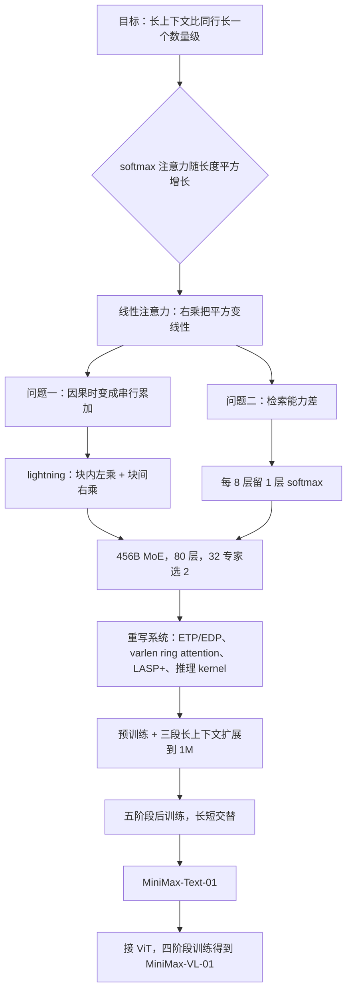

# MiniMax-01：线性注意力放大到 456B，靠每 8 层留 1 层 softmax 来「翻书」

<!-- release-date: 2025-01-15 -->

> 本文依据 MiniMax 发布的 **MiniMax-01: Scaling Foundation Models with Lightning Attention**，arXiv:2501.08313v1，2025-01-14 提交，共 68 页（正文 p. 1–40，参考文献 p. 40–48，贡献者 p. 49，附录 p. 50–68）。页码均指 PDF 自身的页码。文中会区分三件事：**报告明确写了什么**、**我们怎么解释它**、**哪些是外部资料或本文推算**。

## 阅读前先认识几个词

- **Token（词元）**：模型读写文本的最小单位。一个汉字、一个英文单词或一个标点，都可能被切成一个或多个 Token。
- **softmax 注意力**：今天几乎所有大模型用的注意力。每个新 Token 都要和前面所有 Token 两两打分，再按分数加权。上下文长度翻倍，这一步的计算量翻四倍。
- **KV Cache（Key-Value Cache，键值缓存）**：生成时把前文每个 Token 的 Key 和 Value 存在显存里，免得重算。它随上下文长度线性增长。
- **线性注意力（linear attention）**：把注意力公式里的乘法换个顺序，先把所有 Key 和 Value 压成一个固定大小的「状态」矩阵，再让每个 Query 去查这个状态。计算随长度线性增长，显存不随长度增长。
- **MoE（Mixture of Experts，混合专家）**：把前馈网络拆成很多个专家，每个 Token 只让其中少数几个干活。总参数可以很大，单次计算量不必跟着涨。

这份报告自己的三个名字：

- **lightning attention**：线性注意力的一种 GPU 友好实现，由报告团队成员此前提出，这份报告第一次把它放大到数百 B 参数。
- **hybrid-lightning（混合 lightning）**：每 8 层里 7 层用 lightning attention、1 层用 softmax 注意力。
- **MiniMax-Text-01 与 MiniMax-VL-01**：前者是语言模型，后者是在它上面接视觉编码器得到的视觉语言模型。

## 一句话先说清

线性注意力是个老主意，报告说它提出已经九年，却没有一个主流开源大模型采用（PDF p. 6）。MiniMax-01 要回答的是：**它为什么一直进不了生产，以及要付出什么才能让它进。**

报告给的答案分三层：

1. **算得快**：线性注意力在因果语言模型里会退化成一个逐位累加，GPU 跑不快。lightning attention 用分块把它拆成「块内左乘 + 块间右乘」，解决这个实现问题。
2. **记得住**：纯线性注意力做检索明显不行。每 8 层换回 1 层 softmax，检索能力反而超过纯 softmax。
3. **跑得起**：训练与推理框架都是为 softmax 写的，MoE 通信、百万 Token 序列并行、线上推理的变长批次，全部要重写。

最终的 MiniMax-Text-01 有 456B 总参数，每个 Token 激活 45.9B，32 个专家，训练时上下文到 1M Token，推理时外推到 4M（PDF p. 1）。MiniMax-VL-01 在它上面又训了 512B 视觉语言 Token（PDF p. 1）。

如果只记一句话：

> **便宜的方案没人用，通常不是因为它不够便宜，而是因为它缺了一块能力、少了一套配套。MiniMax-01 用 1/8 的 softmax 补能力，用重写整套系统补配套。**

### lightning attention 不是这份报告首次提出的

报告自己写明：它「最初由我们的团队成员在 Qin et al.（2024c）中提出」（PDF p. 7）。参考文献里对应的是 ICML 2024 的 *Various Lengths, Constant Speed: Efficient Language Modeling with Lightning Attention*，以及 *Lightning Attention-2*（arXiv:2401.04658）（PDF p. 46）。再往前，同一个研究组 2023 年的 TransNormerLLM（arXiv:2307.14995）已经用了 Lightning Attention 这个名字（外部补充，见文末）。

所以这份报告的定位是：**lightning attention 第一次被放大到数百 B 参数的商用模型**。报告的贡献清单也是这么写的：「第一次成功的大规模线性注意力实现」（PDF p. 3）。

## 全景：Text-01 长什么样

这张图里有三件事，后面各占一节：

- **注意力**只有 1/8 是平方复杂度的。另外 7/8 是 lightning，计算随长度线性增长，显存只占一个固定大小的状态。
- **前馈**是 MoE，32 个专家、每个 Token 走 2 个，专家 FFN 中间维 9216（PDF p. 4）。
- **归一化**用的是 PostNorm 加 DeepNorm 缩放，和今天主流的 PreNorm 相反。报告说这是因为混合结构特别依赖「有效深度」（PDF p. 12）。

报告的整体叙事顺序也是这三层：先用实验筛出架构（第 2 节，PDF p. 4–14），再为它重写系统（第 3 节，PDF p. 14–21），然后才是数据、训练和评测（第 4–6 节）。架构和系统两节占了 18 页，是全文最扎实的部分。

## 第一层矛盾：线性注意力在数学上便宜，在 GPU 上不便宜

### 同一个注意力，两种乘法顺序

去掉 softmax 之后，注意力就是三个矩阵连乘。以报告举例的 TransNormer 为例（PDF p. 6，式 2–3）：

$$
\mathbf{O} = \mathrm{Norm}\big((\mathbf{Q}\mathbf{K}^\top)\mathbf{V}\big) = \mathrm{Norm}\big(\mathbf{Q}(\mathbf{K}^\top\mathbf{V})\big)
$$

$\mathbf{Q}, \mathbf{K}, \mathbf{V}$ 都是 $n \times d$ 矩阵，$n$ 是序列长度，$d$ 是特征维度。两种算法结果一样，代价完全不同：

- **左乘** $(\mathbf{Q}\mathbf{K}^\top)\mathbf{V}$：先得到 $n \times n$ 的分数矩阵，计算 $O(n^2 d)$；
- **右乘** $\mathbf{Q}(\mathbf{K}^\top\mathbf{V})$：先得到 $d \times d$ 的小矩阵，计算 $O(n d^2)$。

当 $n \gg d$ 时，右乘便宜得多。生成时更好：把 $\mathbf{K}^\top\mathbf{V}$ 当成一个状态，每来一个新 Token 就加一项，每步只花 $O(d^2)$，和已经生成了多长无关（PDF p. 6）。

### 卡在「因果」这两个字上

语言模型是因果的：第 $t$ 个位置只能看前 $t$ 个位置。左乘加掩码很容易（PDF p. 7，式 4）：

$$
\mathbf{O} = \big[(\mathbf{Q}\mathbf{K}^\top) \odot \mathbf{M}\big]\mathbf{V}, \qquad M_{ts} = \begin{cases} 1 & t \geq s \\ 0 & t < s \end{cases}
$$

右乘却没法直接加掩码，只能写成逐位累加（PDF p. 7，式 5）：

$$
\mathbf{kv}_0 = 0, \qquad \mathbf{kv}_t = \mathbf{kv}_{t-1} + \mathbf{k}_t \mathbf{v}_t^\top, \qquad \mathbf{o}_t^\top = \mathbf{q}_t^\top \mathbf{kv}_t
$$

这就是一个 cumsum（累加和）。它的计算量是线性的，但第 $t$ 步必须等第 $t-1$ 步，**没法并行**。GPU 擅长的是大块矩阵乘法，不擅长这种一步接一步的循环。报告认为，这很可能就是线性注意力 2016 年提出后，LLaMA3、Qwen2.5、DeepSeek-V3、Mistral 都没有采用它的原因（PDF p. 6）。

### lightning attention：块内左乘，块间右乘

lightning 的思路是：**既然左乘好加掩码、右乘便宜，那就在小范围里用左乘，大范围里用右乘。**

把序列按行切成若干块。以前两块为例（PDF p. 7，式 7–9），第二块的输出可以拆成两部分：

$$
\mathbf{O}_2 = \underbrace{\mathbf{Q}_2\,\mathbf{KV}_1}_{\text{块间：右乘}} + \underbrace{\big[(\mathbf{Q}_2\mathbf{K}_2^\top)\odot\mathbf{M}\big]\mathbf{V}_2}_{\text{块内：左乘}}, \qquad \mathbf{KV}_1 = \mathbf{KV}_0 + \mathbf{K}_1^\top\mathbf{V}_1
$$

- **块内**：只涉及本块的 $B$ 个位置，左乘出来的分数矩阵是 $B \times B$，很小，掩码照常加；
- **块间**：前面所有块的信息已经汇总在 $d \times d$ 的 $\mathbf{KV}$ 里，一次右乘就拿到；
- **更新**：算完本块，把 $\mathbf{K}_t^\top\mathbf{V}_t$ 加进状态，交给下一块。

每一步都是规整的矩阵乘法，可以在片上 SRAM 里做完再写回显存（PDF p. 8，Algorithm 1）。循环仍然存在，但步数从 $n$ 降到 $n/B$，而且每一步是一次矩阵乘法而不是一次向量加法。总复杂度是 $O(nd^2 + nBd)$（PDF p. 7）。训练时块大小 $B$ 取 256（PDF p. 19）。

**我们的解读**：这和 FlashAttention 是同一类思路——数学公式不变，只改计算顺序和数据在显存层级间的搬运方式。区别在于 FlashAttention 省的是显存读写，lightning 省的是串行依赖。

报告在推导里省掉了归一化、SiLU 激活和门控（PDF p. 7）。从 Figure 3 看，实际的 lightning 层是：Q、K、V 各过一次 SiLU，做线性注意力，过 RMSNorm，再乘一个 Sigmoid 门（PDF p. 4）。另外，序列并行一节的图里出现了一个「带衰减的对角矩阵」$D$（PDF p. 18），说明实际实现带位置衰减；**衰减的具体形式和取值，这份报告没有写**。

### 速度：唯一跑赢 FlashAttention-2 的线性模型

报告用 3B 模型在单节点 H800 上测训练吞吐（每 GPU 每秒处理的 Token 数），序列长度从 1024 加到显存装不下为止（PDF p. 10，Figure 8）。结论两条：lightning 的训练速度**不随序列长度变化**；它是参与对比的线性模型里（另有 HGRN2、Mamba2）**唯一超过 FlashAttention-2 版 softmax** 的（PDF p. 10）。

读图补两句。1024 长度时 softmax 反而最快（约 1.66 万），到 2K–4K 之间才掉到 lightning 之下，线性注意力的速度优势是长序列才兑现的。hybrid 的吞吐也随长度一路下降，最长处约 1.3 万，与 Mamba2 相当：那 1/8 的 softmax 在训练吞吐上同样看得见。

### 这一节可以带走什么

- **复杂度低不等于跑得快**。一个 $O(n)$ 的串行循环，在 GPU 上可能比 $O(n^2)$ 的矩阵乘法还慢。评估一个「理论更便宜」的方案，先问它能不能写成大块规整的矩阵乘法。
- **分块是把串行依赖变粗的通用手段**：块内用贵但可并行的算法，块间只传一个小的汇总状态。前缀和、扫描、RNN 的并行化都是这条路。

## 第二层矛盾：纯线性注意力记不住，1/8 的 softmax 反而让它比纯 softmax 更强

### 先用 scaling law 判卷

报告没有拿一两个 benchmark 定架构，而是训了一组 scaling law：softmax、纯 lightning、hybrid-lightning 三种结构，各在 70M、160M、410M、1B、3B、7B 六个规模上训练，至多 300B Token，上下文 8192，全局 batch 400 万 Token，学习率 $3 \times 10^{-4}$ 固定不衰减（PDF p. 8–9）。拟合出来的规律（PDF p. 9，Table 2）：

| 结构 | 损失 $L(C)$ | 最优参数量 $N_{opt}(C)$ | 最优数据量 $D_{opt}(C)$ |
|---|---|---|---|
| Softmax | $3.7087\,C^{-0.0798}$ | $(1.82 \times 10^8)\,C^{0.7118}$ | $(2.56 \times 10^{10})\,C^{0.5102}$ |
| Lightning | $3.5391\,C^{-0.0768}$ | $(2.74 \times 10^8)\,C^{0.6470}$ | $(4.43 \times 10^{10})\,C^{0.4684}$ |
| Hybrid-lightning | $3.4797\,C^{-0.0763}$ | $(2.57 \times 10^8)\,C^{0.6670}$ | $(3.70 \times 10^{10})\,C^{0.4707}$ |

$C$ 是计算预算（单位 PFLOP/s-days）。报告的读法是：同样的预算下，带 lightning 的模型倾向于用更多参数和更多 Token，损失更低（PDF p. 9）。

**要留个心**：lightning 的指数（−0.0768）比 softmax（−0.0798）小，也就是说损失随算力下降得更慢。系数更低让它在实验区间里领先，但若把曲线外推到很大的预算，两条线会在某处交叉。报告没有讨论这一点。另外，固定学习率是「受限于算力」的妥协（PDF p. 9），这会让每个点都不在各自的最优训练状态。

计算量怎么算，报告给了三行公式（PDF p. 8，Table 1），$l$ 层数、$d$ 模型维度、$h$ 头数、$b$ 批大小、$n$ 序列长度：

| 结构 | 参数量 | 训练 FLOPs |
|---|---|---|
| Softmax | $12ld^2$ | $72bnld^2\left(1 + \frac{n}{6d} + \frac{5}{18d}\right)$ |
| Lightning | $12ld^2 + 2ld^2/h$ | $72bnld^2\left(1 + \frac{1}{2h} + \frac{5}{18d}\right)$ |
| Hybrid-lightning | $12ld^2 + 7ld^2/4h$ | $72bnld^2\left(1 + \frac{n}{48d} + \frac{7}{16h} + \frac{5}{18d}\right)$ |

括号里的 1 是投影和前馈，随长度增长的是第二项。softmax 的 $\frac{n}{6d}$ 到了 hybrid 变成 $\frac{n}{48d}$，正好是 1/8——只有 1/8 的层还在做平方计算。lightning 的 $\frac{1}{2h}$ 与 $n$ 无关，是那个 $d \times d$ 状态的开销。

把 Text-01 的 $d = 6144$、$h = 64$ 代进去，看括号里的倍数（本文算术；公式是稠密模型的口径，只用来看量级）：

| 序列长度 | Softmax | Hybrid-lightning |
|---:|---:|---:|
| 8K | 1.22 | 1.04 |
| 128K | 4.56 | 1.45 |
| 1M | 29.4 | 4.56 |

1M 时 hybrid 的单 Token 训练计算约是 softmax 的 1/6。但它**仍然随长度增长**：那 1/8 的 softmax 没有消失，长度再翻几倍，它还是会成为主项。后面推理一节的 95% 对 12% 与 Figure 2 的曲线形状，都是同一件事。

### 但纯 lightning 的检索崩了

同一组模型的下游评测（PDF p. 10，Figure 7）给了一个决定性的信号：常识推理几项三种结构不相上下，**唯独大海捞针（NIAH，Needle In A Haystack，在长文里藏一句话再问模型）上纯 lightning 远远落后**。报告据此下结论：线性注意力的语言建模能力与 Transformer 相近，但检索不行，「不适合做 LLM」（PDF p. 10）。

这就是本篇标题里「翻书」的意思。报告用一个 RNN 视角解释它（PDF p. 12，式 10–12）：把 softmax 注意力改写成递推，每生成一个 Token，它都会从头把前文「重新读一遍」，报告称之为 Going Through a Book；线性注意力只维护一个累加状态，旧信息被压进去之后就无法逐条回看。

于是有了混合方案：每 8 层把 1 层 lightning 换回 softmax（PDF p. 8）。图上的结果是：hybrid 在 1B 以上的 NIAH 都在 95 分以上，**不只追平、而且超过了纯 softmax**（PDF p. 10）。

### 为什么混合反而比纯 softmax 强：报告的解释与它的缺口

这个结果报告自己也说「有些反直觉」（PDF p. 12）。它给的解释是「容量」：把 RNN 的容量定义为循环状态的大小，softmax 的容量是 $O(d)$，lightning 的是 $O(d^2/h)$；因为 $d > h$，lightning 容量更大，所以混合模型的检索和外推更好（PDF p. 12）。

**我们认为这个论证不完整**。容量更大如果是原因，纯 lightning 应该检索更好，但 Figure 7 里纯 lightning 恰恰最差。更说得通的读法是两者分工：softmax 层负责精确回看，lightning 层用大状态承担大部分上下文汇总，两者合起来比单用任何一种都强。报告的实验只证明了「混合更好」这个结果，没有证明「因为容量」这个原因。

### 和别的混合方案比

报告还把 lightning 换成另外两种线性结构，同样每 8 层插 1 层 softmax，在 1B 规模比较（PDF p. 11，Table 3）：

| 1B 混合结构 | 训练吞吐（TGS） | CSR 平均 | NIAH | SCROLLS |
|---|---:|---:|---:|---:|
| Hybrid-cosformer2 | 23.3K | 46.64 | 43.6 | 10.9 |
| Hybrid-hgrn2 | 29.5K | **49.87** | 91.8 | 10.8 |
| Hybrid-lightning | **33.4K** | 49.55 | **95.7** | **13.3** |

hgrn2 在常识推理上略高，lightning 胜在速度和检索。又和「滑动窗口 + 每 8 层 1 层全注意力」比（PDF p. 11，Table 4，节选，窗口 512 的两行略去）。滑动窗口也能做到线性复杂度，而且本身就是 softmax，是个很强的对照：

| 规模 | 结构 | 训练吞吐（TGS） | CSR 平均 | NIAH | SCROLLS |
|---|---|---:|---:|---:|---:|
| 1B | Hybrid-window，窗口 256 | 35.6K | 48.61 | 46.8 | 10.6 |
| 1B | Hybrid-window，窗口 1024 | 33.6K | 48.02 | 53.9 | 10.6 |
| 1B | Hybrid-lightning | 33.4K | **49.55** | **95.7** | **13.3** |
| 3B | Hybrid-window，窗口 256 | 16.1K | 54.31 | 40.9 | 14.2 |
| 3B | Hybrid-window，窗口 1024 | 15.4K | 53.44 | 41.6 | 13.3 |
| 3B | Hybrid-lightning | 15.1K | **55.16** | **98.0** | **14.7** |

窗口只试到 1024，因为再大就比 hybrid-lightning 慢了，报告要在「同等速度」下比较（PDF p. 11）。结论很清楚：**同样每 8 层留 1 层全注意力，另外 7 层用 lightning 比用滑动窗口检索强得多**。窗口只能看近处，lightning 的状态汇总了全部前文。

### 放到 MoE 里再验一遍

上面都是稠密模型。报告又在 MoE 上做了两组更大的消融（PDF p. 12–13，Table 5）：

| 消融 | BBH | DROP | MMLU | CMMLU | MATH | GSM8k | ARC-C | WG |
|---|---:|---:|---:|---:|---:|---:|---:|---:|
| Softmax（28B MoE，激活 5B，1T Token） | 28.2 | 27.4 | 49.3 | **47.3** | 4.6 | **18.8** | 46.4 | 65.6 |
| Hybrid-lightning（同上） | **32.2** | **29.0** | **49.5** | 46.0 | **6.8** | 18.5 | **47.4** | **67.5** |
| PreNorm（60B MoE，激活 9.3B，48 层，500B Token） | 29.9 | 26.8 | 43.9 | 41.8 | 4.8 | 12.2 | 43.5 | **65.5** |
| PostNorm + DeepNorm（同上） | **32.6** | **27.6** | **50.2** | **49.2** | **5.7** | **16.8** | **46.2** | 65.4 |

第一组：hybrid 八项赢六项，CMMLU 和 GSM8k 略输。第二组：PostNorm 八项里七项领先，WinoGrande 差 0.1。报告正文说 PostNorm「在所有指标上一致优于」PreNorm（PDF p. 13），和表里的 65.4 对 65.5 略有出入。

为什么要换 PostNorm？报告的理由是：PreNorm 让梯度可以沿残差直通，训练稳，但也等于让一部分层被「跳过」，**有效深度变浅**；PostNorm 把归一化放在残差之后，保住有效深度，代价是容易梯度爆炸或消失，所以要配 DeepNorm 的缩放（PDF p. 12–13）。而混合结构恰恰「对深度特别敏感，更深的模型稳定地好于更浅的」，浅模型要多放 softmax 层才能达到同样效果（PDF p. 13）。

### 这一节可以带走什么

- **混合优于二选一**。纯线性便宜但缺检索，纯 softmax 能检索但贵，1/8 的 softmax 用很小的代价补上了唯一的短板。
- **比例本身是可推的**：公式里平方项的系数直接变成原来的 1/8。想调便宜程度和能力的平衡，改的就是这一个比例。
- **判架构看 scaling 曲线，但要看斜率也看截距**。截距低的曲线在实验区间领先，斜率平的曲线在外推时会被追上。

## 定尺寸：从「单机能不能跑 1M」倒推参数量

### 上限不是算力定的，是一台机器定的

报告先给了一个工程约束：**8 卡、每卡 80G、8-bit 量化下，单机要能处理 1M Token 的序列**，因此总参数不超过 500B（PDF p. 13）。理由是单机推理省掉跨机通信，效率最高。

在这个上限之下，报告写成一个带约束的优化问题：给定训练算力预算 $C$，在总参数 $P_{all} < 500$B 的条件下，选总参数和激活参数使损失最小（PDF p. 13，式 13）。

**本文算一遍这个上限为什么合理**（假设权重和 KV Cache 都按 8-bit 存；softmax 层的 KV 头数 8 取自官方权重的配置文件，报告只写了「GQA 组大小 8」）：

| 显存项（1M Token，单条序列） | 估算 |
|---|---:|
| 权重 456B，8-bit | 约 456 GB |
| 10 个 softmax 层的 KV Cache：$10 \times 8 \times 128 \times 2 = 20{,}480$ 元素/Token | 约 21 GB |
| 70 个 lightning 层的状态：$70 \times 64 \times 128 \times 128$ 元素，与长度无关 | 约 73 MB |
| 合计 | 约 478 GB，低于 640 GB |

如果 80 层全用同样的 GQA softmax，KV Cache 会到约 172 GB，合计约 628 GB，几乎贴着 640 GB，没有留给激活和批处理的余地。**这说明 7:1 的混合比例和 500B 的参数上限是一起定的**：正是 lightning 把 KV Cache 砍到原来的 1/8，才让 456B 的模型能在一台机器上吃下 1M Token。这是本文的推算，报告没有列这张账。

### 五个比例和一条新的 scaling 公式

报告先在小模型上定出五个变量的最优区间（PDF p. 13）：

1. softmax 与线性注意力的混合比例；
2. 深宽比；
3. 线性注意力「记忆大小」与 hidden size 之比；
4. 激活的 FFN 与注意力之比；
5. softmax 层里加 RoPE 的维度比例。

给出的结论有三条：混合结构对深度敏感，深比浅好；加大线性注意力的记忆大小显著提升效果；**softmax 层只在一半维度上加 RoPE，可以在长度外推时不掉点**（PDF p. 13）。具体数值，报告没有给。

然后训了激活参数 44M 到 1.2B、各 500B Token、16/32/64 个专家的一组模型拟合 scaling law。报告发现用已有公式外推到 9.3B 激活不准，于是提出了一个按专家数分别拟合的新形式（PDF p. 14，式 14）：

$$
L(P_{act}, T \mid E) = d + a\,P_{act}^{\alpha} + b\,T^{\beta} + c\,(P_{act} T)^{\gamma}
$$

$P_{act}$ 是激活参数，$T$ 是训练 Token 数，$E$ 是专家数，其余是拟合参数。和 Chinchilla 式相比，多了一个激活参数与数据量的交叉项。依据式 13 和式 14，报告选定 45.9B 激活、456B 总参数（PDF p. 14）。**拟合出来的参数值、以及 9.3B 上的预测误差，报告都没有公开**。

## 第三层矛盾：框架是为 softmax 写的，全部要重写

报告在这一节开头说，训练集群是 1500 到 2500 张动态变化的 H800，而业界现成的开源框架「缺乏成熟的技术支持」应对这套架构，所以训练和推理框架都自己重做了（PDF p. 14）。三个挑战分别对应 MoE、长序列和推理。

### MoE：专家太大，TP 和 PP 两头不讨好

MoE 的 all-to-all（每张卡都要把 Token 发给持有对应专家的卡）是通信大头。第一步是常规的：把 Token 分成两组，一组在通信时另一组在算，叠起来（PDF p. 14–15，Figure 9）。

真正的麻烦出在 Text-01 的专家规格上（PDF p. 15）：

- 用张量并行（TP）切专家，每张卡上的矩阵太小，计算强度太低，算得不划算；
- 不切，参数又太多，只能加大流水线并行（PP）；而 PP 不减少激活显存，长上下文训练恰恰最缺激活显存。

解法是给专家单独开两个进程组：**ETP（Expert Tensor Parallel）** 管专家权重怎么切，**EDP（Expert Data Parallel）** 管同一个专家的数据并行。于是有两套分解同时成立（PDF p. 15，式 15–16）：

$$
\text{world\_size} = \text{size}_{PP} \times \text{size}_{DP} \times \text{size}_{CP} \times \text{size}_{TP} = \text{size}_{PP} \times \text{size}_{EDP} \times \text{size}_{ETP} \times \text{size}_{EP}
$$

前一个管非 MoE 部分，后一个管 MoE 部分，两边的并行策略从此解耦。再在上面做 EP 与 ETP 通信的重叠（PDF p. 16，Figure 10）。报告还讲了一个取舍：分组越多重叠越充分，但太多会让调度复杂到 CPU 成为瓶颈。最终 MoE 部分的纯通信开销比优化前降了 50%（PDF p. 16）。

**我们的解读**：这里的可迁移点不是 ETP 这个名字，而是「给模型里规格不同的部分配不同的并行方式」。注意力和专家的形状差很远，硬用一套 TP/PP 配置，总有一边吃亏。

### 长序列：1M Token 怎么切到多张卡上

长上下文训练先做 data-packing：把不同长度的样本首尾拼成一条长序列，避免补零浪费（PDF p. 16）。拼接之后，两种注意力各有一个问题。

**softmax 层：varlen ring attention。** Ring attention 把序列切到多张卡上，KV 在卡之间环形传递。已有实现有两个缺口：FlashAttention 有变长接口但没有 ring 版本；TransformerEngine 有 ring 版本，但要求每条序列长度是 $2 \times$ CP 大小的整数倍，CP 一大、样本长度分布未知时会补大量的零（PDF p. 17）。报告的做法是直接对拼接后的整条序列做 ring attention，在注意力掩码里区分每条样本的偏移（PDF p. 17，Figure 11）。

**lightning 层：LASP+。**

LASP（Linear Attention Sequence Parallelism）是线性注意力的序列并行。它的问题就是前面那个 cumsum 在卡之间又出现了一次：第 $r$ 张卡的块间计算要用前面所有卡的 KV 之和，只能一张接一张地 send/recv（PDF p. 17）。LASP+ 改成三步：每张卡先算本地的 KV 前缀和；一次 AllGather 让所有卡拿到所有本地和；每张卡按自己的位置把前面几份加起来，得到全局前缀（PDF p. 17–19）。

报告的原话是 LASP+ 的计算速度「可达原 LASP 的 $1/N_{pcn}$」，$N_{pcn}$ 是并行计算节点数（PDF p. 19）。从上下文看指的是耗时降到约 $1/N_{pcn}$。代价是总通信量和临时显存变多，报告认为收益远大于开销（PDF p. 19）。

在 LASP+ 上再支持变长：每条样本先补齐到块大小 256 的整数倍，再首尾拼接，一个 kernel 处理整批（PDF p. 19）。

### 推理：研究版的 kernel 不能直接上线

报告说最初的 lightning 实现是「面向研究的」，不适合实际推理（PDF p. 19）。线上推理的难点是一批请求长度各异、有的带前缀缓存、有的不带。四项优化（PDF p. 20–21）：

| 优化 | 做了什么 | 报告给的收益 |
|---|---|---|
| 批量 kernel 融合 | prefill 时把补齐、分块、调整布局、算衰减融成一个 kernel；decode 时把 KV 计算和前缀 KV 更新融成一个 | decode 与短文本场景端到端延迟降 10%，在 H20 上收益比 H800 更明显 |
| prefill 与 decode 分开执行 | 长度为 1 的 Token 和长度大于 1 的用两个 kernel、两个 CUDA stream 并行 | 例：批大小 20、都带前缀缓存、一两条长 50 其余长 1，延迟从 100 毫秒降到 50 毫秒 |
| 多级补齐 | 块大小原为 256；有了前缀缓存后批内长度常低于 256，增加 32、64、128 三档，按长度选补零最少的一档 | 减少冗余计算，未给数字 |
| StridedBatchedMatmul 扩展 | 用 cuBLAS 的批量矩阵乘；256 × 256 的矩阵乘用 Hopper 的 WGMMA 指令，配合 TMA 异步搬运 | 未单独给数字 |

合起来，报告称在 H20 上端到端推理的 MFU（模型浮点利用率）超过 75%；在 1,024,000 Token 的序列上，如果注意力全用 softmax，注意力要占注意力加 FFN 总延迟的 95%，而 lightning 实现只占不到 12%（PDF p. 21）。

**这个 95% 对 12% 要看清口径**。按字面，它是在比较「全部用 softmax」与「用 lightning」时注意力在一层里的延迟占比，而不是 Text-01 这个混合模型整体的延迟拆分。报告没说混合模型里那 10 层 softmax 的占比是多少。

### Figure 2 的预填充延迟

报告开头的 Figure 2 比较了不同上下文长度下的预填充延迟（PDF p. 3）。读图，1M 输入时 MiniMax-Text-01 约 14 万毫秒，同一框架下的 Llama3-70B 拟合曲线已超过 70 万毫秒。

口径有三点要注意：MiniMax-Text-01 与 Llama3-70B 都是在 H800、TP=8、W8A16（权重 8-bit、激活 16-bit）的**自研推理框架**上测的，其他模型走的是官方 API，两类数字不可直接比；每条曲线是去掉离群点后的**二次函数拟合**；MiniMax 的曲线在 512K 之后也在上弯（PDF p. 3）。最后一点正是前面公式里那 1/8 平方项的样子。

### 这一节的代价与边界

报告写清楚的是方案和少数几个收益数字。**没写的**包括：MoE 优化后的整体训练 MFU、456B 模型的总训练 GPU 小时、varlen ring attention 和 LASP+ 在真实训练里的吞吐、以及推理框架与开源框架（如 vLLM）的对照。第 3 节更像一份设计说明，而不是一份性能报告。

## 预训练：数据、实验方法和训练配方

### 数据：用上一代模型给文档打分

语料来自学术文献、书籍、网页和代码（PDF p. 21–22）。三件事：

- **质量**：规则清洗与去重之后，用上一代模型（一个激活 5B、总参数 60B 的 MoE）当打分器。起初评了连贯、简洁、教育价值、有用、知识丰富、类别相关六个维度，发现相互高度相关，最后只留**知识深度、实用性、类别分布**三个主维度（PDF p. 22）。
- **格式**：网页和书籍抽取干净后直接当教材用；对话和问答数据，报告发现重格式（比如 Markdown）会引入固定模式、降低多样性，所以用一种嵌套文档格式配多种模板（PDF p. 22）。
- **配比**：高分内容效果更好，但**完全删掉低分内容反而伤下游**，所以从均匀分布出发，再上调高质量内容的采样权重（PDF p. 22）。

分词器是字节级 BPE，词表 200K，对多语言内容做了上采样以提高压缩率（PDF p. 22）。

### 数据实验：把「这批数据有没有用」做成假设检验

这是报告里一个容易被略过、但很值得学的方法（PDF p. 23）：

- **表述**：比较「加了新数据的模型」与基线模型在测试样本上的指标分布，备择假设是新数据的加权平均指标更高；
- **指标**：多选题不给选项编号，看每个选项续写的似然，按字节数归一化（排除分词器影响、也不偏袒短选项），再取 log softmax 得到每个样本的得分；
- **灵敏度**：用「明显差异 / 不同随机种子间的标准差」这个比值衡量指标的区分力；
- **样本量**：做统计功效分析，在 95% 置信度、80% 功效下，把最小可检测效应压到与训练方差相当，由此定最少测试样本数；
- **实验规模**：最终定在激活 1B、总参数 8B 的 MoE，训练 40B Token，其中 20B 网页、20B 待检验数据。

**可迁移点**：做数据消融之前，先量化「随机种子本身会带来多大波动」。不知道噪声有多大，任何 0.5 分的差异都没法解释。

### 重复几遍才算多

已有工作说高质量数据可以重复训到 50 遍（PDF p. 23）。报告认为那些实验的范式有问题：数据效率在训练过程中不是恒定的，小规模实验直接用最终训练的数据分布，对不齐。它的做法是先全局去重，再把文档**下采样**到与最终训练相同的重复次数，同时满足消融预算（PDF p. 23）。

结论：低质量数据训超过 2 遍就明显掉点，高质量数据可以训到 4 遍（PDF p. 23–24）。

### 训练配方

（PDF p. 24）

- 初始化：Xavier；DeepNorm 系数 $\alpha = (2N)^{0.25}$、$\beta = (8N)^{-0.25}$，$N$ 是层数；
- 优化器：AdamW，$\beta_1 = 0.9$、$\beta_2 = 0.95$，weight decay 0.1；
- 序列长度 8192；
- batch size 从 16M Token 起，69B Token 时升到 32M，790B 时升到 64M，4.7T 时升到 128M，之后不变；
- 学习率：500 步线性预热到 $2 \times 10^{-4}$，恒定训练 7.2T Token；后期出现梯度范数异常，归因于学习率过高，剩下 3.2T 改为 $1.3 \times 10^{-4}$；最后快速衰减阶段训练 1T Token，指数衰减到 $3 \times 10^{-5}$；
- MoE 辅助损失系数 0.01。

batch size 的扩法有依据：报告用 50M 到 600M 激活参数的小模型拟合了「训练损失与临界 batch size」的幂律，**损失降到对应值时就把 batch 翻倍**（PDF p. 24，Figure 13）。图上标的四个点是损失 2.22 对 16M、1.98 对 32M、1.77 对 64M、1.58 对 128M。**扩 batch 的时机由指标触发，而不是按步数拍脑袋**，这一条可以直接用。

**报告没给预训练总 Token 数**。按上面的描述有两种读法：若「剩下 3.2T」包含在 7.2T 之内，总量约 8.2T；若在之后，约 11.4T。原文措辞更像后者，但没法确定。

### 长上下文扩展：三个阶段，两次改 RoPE 频率

从 8K 逐步扩到 1M，分三段（PDF p. 25，Table 6。「短」指少于 32K Token，「中」32K–128K，「长」超过 128K）：

| 训练长度 | RoPE 基频 | Token 数 | 短 | 中 | 长 |
|---|---|---:|---:|---:|---:|
| 128K | 5M | 300B | 30% | 70% | 0% |
| 512K | 10M | 32B | 35% | 35% | 30% |
| 1M | 10M | 26B | 30% | 30% | 40% |

另外两条细节（PDF p. 24）：每一段的最后 20% 训练里混入 10% 高质量长文问答数据；阶段之间的数据分布用线性插值过渡，避免分布突变引起不稳定。

虽然只训到 1M，模型在 4M 的 NIAH 上全部通过（PDF p. 24–25，Figure 14，1M 以内每 32K 一格，1M 以上每 0.5M 一格）。报告同时承认：**NIAH 太早就满分了**，在最初的 128K 阶段就到顶，没法用来监控训练进度，所以改用难度随训练递增的任务来看中间 checkpoint（PDF p. 25）。

## 后训练：奖励、五个阶段与一个改过的 GRPO

### 奖励模型的四个维度

（PDF p. 26）

- **正确性**：数学和推理题用早期版本的 Text-01 判断答案是否一致，给二值奖励；代码在沙箱里跑测试，用通过率；
- **真实性**：采样回答、拆成陈述、聚类，再众包核验加大模型比对，得到真实性分数；
- **有用性**：规则约束自动核验，加人工评连贯、深度、相关与文风，加权合成；
- **无害性**：按 Constitutional AI 的思路定安全准则，由早期 Text-01 给标准化安全评估。

SFT 数据由各领域的「专家模型」拒绝采样生成：每个 prompt 在不同温度下采多条，按奖励层级挑最好的，再用 n-gram 和语义相似度过滤保证多样性（PDF p. 26）。

### 离线 RL 与在线 RL

离线阶段就是 DPO：同一 prompt 在不同温度下生成多个回答，用奖励模型挑最好和最差的配对（PDF p. 27）。报告对比了「SFT 见过的 prompt」与「没见过但同源的 prompt」，差别可以忽略，于是直接用前者。

在线阶段反过来，**必须用 SFT 没见过的 prompt**：复用前面阶段的 prompt 会让模型饱和，表现为回答困惑度下降（PDF p. 27）。prompt 优先选成功率适中的，信息量最大。

在线 RL 用的是改过的 GRPO，三处改动（PDF p. 27）：

1. **重要性采样权重裁剪**：PPO/GRPO 的裁剪是单边的，遇到「策略比值很大、优势为负」的 Token 会梯度不稳，于是在损失里额外裁掉这种情况；
2. **KL 项改写**：从方差与偏差的权衡出发，把 KL 写成 $\mathbb{D}_{KL}(\theta) = \mathbb{E}_t\big[\mathrm{SG}\big(\pi_\theta(a_t|s_t) - \pi_{ref}(a_t|s_t)\big)\log\pi_\theta(a_t|s_t)\big]$，$\mathrm{SG}$ 是停止梯度；
3. **平衡正负样本的优势**：控制不同样本组的奖励绝对值，避免分布偏斜时一边压倒另一边。

**值得对照看**：第 1 条已经在处理「重要性采样权重太大会让训练不稳」这个问题。半年后的 MiniMax-M1 把这个方向推成了 CISPO 算法，并且从「丢掉这类 Token」改成了「保留它们、只裁权重」，见 MiniMax-M1 一篇。

安全对齐贯穿 SFT 与 RL：按安全类别生成 prompt、从网页收集真实用户问题、让早期 Text-01 根据红队攻击 prompt 扩写，回答由一个融入了有用性原则的无害奖励模型挑选，以避免无理拒答（PDF p. 27–28）。

### 长短交替的五个阶段

（PDF p. 28–29，Table 7。整个后训练 RoPE 基频固定为 10M）

| 阶段 | 做什么 | 序列长度 | Epoch | Batch | 学习率 | 衰减 |
|---|---|---:|---:|---:|---|---|
| I | 短上下文 SFT | 8,192 | 2 | 128 | $10^{-5} \to 10^{-6}$ | Cosine |
| II | 长上下文 SFT，50% 长 prompt | 1,032,192 | 2 | 80 | $3 \times 10^{-6}$ | 恒定 |
| III | 短上下文 DPO | 8,192 | 1 | 64 | $5 \times 10^{-7} \to 5 \times 10^{-8}$ | Cosine |
| IV | 长上下文 DPO，全部长数据 | 1,032,192 | 1 | 64 | $5 \times 10^{-7}$ | 恒定 |
| V | 短上下文在线 RL | 8,192 | 1 | 512 | $10^{-6} \to 10^{-7}$ | Cosine |

两个观察：

- **长短交替**：先短后长再短再长，每次拉长之后都回到短序列校准一次，最后的在线 RL 只在 8K 上做。报告的目的是「长能力要有，短场景不能掉」（PDF p. 28）。
- **长阶段都用恒定学习率**，短阶段都用 cosine。报告没解释原因。

1,032,192 这个长度恰好等于 $1{,}048{,}576 - 16{,}384$，即 1M 减去 16K。报告没说为什么取这个值；可能是给输出或模板留出的余量，这是猜测。

## MiniMax-VL-01：视觉部分怎么接上去

### 结构：ViT-MLP-LLM，但拒绝池化

标准的「视觉编码器 + 投影层 + 语言模型」三段式：303M 参数的 ViT、随机初始化的两层 MLP 投影、Text-01 作为语言模型（PDF p. 36）。

动态分辨率：按预设网格把图片缩放到 336 × 336 到 2016 × 2016 之间，切成 336 × 336 的小块，另加一张 336 × 336 的缩略图，各自编码后拼接（PDF p. 36）。

报告特意强调的一点：常规做法会用池化或下采样压缩视觉特征，**VL-01 直接用原始高维特征**，理由是语言模型处理长序列的能力强，不必为省 Token 而丢信息（PDF p. 36）。这是 lightning 架构在视觉侧的一个直接红利。

### 视觉编码器从零训

ViT-L/14 从零训练，用 CoCa 的做法（对比损失加一个解码器的交叉熵损失）：先在 224 × 224 上训 37B 个图文对，再在 336 × 336 上微调 1.2B 个，字幕截断到 76 Token；ImageNet-1K 零样本分类 80.55%（PDF p. 37）。

训练数据（PDF p. 35–36）：694M 个去重图文对，其中 180M 张图有精修字幕，训练时原字幕与精修字幕各以 0.5 的概率采样；1 亿张图配细粒度描述，先由字幕模型生成再经人工修订，平均约 300 Token；以及大量合成的视觉问答指令数据。从指令数据里均匀抽 100 万对打标签，得到约 5 万个不同标签，其中 2,817 个出现超过 10 次，归为 14 大类（PDF p. 36，Figure 17）。

### 四阶段训练

（PDF p. 37–38）

| 阶段 | 目标 | 数据 | 更新哪些参数 |
|---|---|---|---|
| I 模态对齐 | 让模型能给图配字幕 | 80B Token 图像描述数据，固定 336 × 336 | 投影层与视觉编码器 |
| II 视觉理解增强 | 标准指令微调 | 420B 多模态 Token，与 Text-01 后训练数据按 20:1 混合 | 全部 |
| III 用户体验增强 | 贴近真实应用的多轮对话 | 44.8B 多模态 Token，1 个 epoch | 全部 |
| IV 偏好增强 | DPO | 4 万个图文对，另含大量纯文本对 | 全部 |

两个细节：第一阶段试过提高分辨率，下游没有收益，所以固定 336；第四阶段 DPO 在强模型上容易过拟合，因此**不到一个 epoch 就提前停止**（PDF p. 37–38）。第四阶段的负样本部分由 Text-01 故意往好回答里注入幻觉或错误生成（PDF p. 38）。

**一处对不上的数字**：前三阶段的 Token 数相加是 80 + 420 + 44.8 = 544.8B，而摘要说 VL-01 用了 512B 视觉语言 Token（PDF p. 1）。可能口径不同（比如第二阶段混入的纯文本不算），报告没说明。

### 成绩与短板

（PDF p. 39，Table 13，节选）

| 任务 | GPT-4o (11-20) | Claude-3.5-Sonnet (10-22) | Gemini-2.0-Flash (exp) | Qwen2-VL-72B | InternVL2.5-78B | MiniMax-VL-01 |
|---|---:|---:|---:|---:|---:|---:|
| MMMU | 63.5 | **72.0** | 70.6 | 64.5 | 66.5 | 68.5 |
| ChartQA | 88.1 | 90.8 | 88.3 | 91.2 | 91.5 | **91.7** |
| DocVQA | 91.1 | 94.2 | 92.9 | **97.1** | 96.1 | 96.4 |
| OCRBench | 806 | 790 | 846 | 856 | 847 | **865** |
| MathVista | 62.1 | 65.4 | **73.1** | 69.6 | 68.4 | 68.6 |
| OlympiadBench | 25.2 | 28.4 | **46.1** | 21.9 | 25.1 | 24.2 |
| MMLongBench-Doc | **41.4** | 31.4 | 31.4 | 11.6 | 19.7 | 32.5 |
| 内部用户体验 | 62.3 | 47.0 | **72.1** | 40.6 | 34.8 | 56.6 |

报告自己点出的短板（PDF p. 38–39）：高难度数学推理（OlympiadBench）明显落后；长文档理解只输给 GPT-4o，但单页与跨页两个子集的准确率只有 47.3% 与 28.4%；MEGA-Bench 上规划与指标评估类子任务吃力。内部用户体验集是 90 类任务、524 个中英双语样本（以中文为主），与训练集严格去重（PDF p. 39），附录 C 给了 6 个样例（PDF p. 62–67）。

## 评测：短任务够用，长上下文才是主场

### 核心基准：不是第一，是「不掉队」

（PDF p. 30，Table 8，节选）

| 任务 | GPT-4o (11-20) | Claude-3.5-Sonnet (10-22) | Gemini-1.5-Pro (002) | Qwen2.5-72B-Inst. | DeepSeek-V3 | Llama-3.1-405B-Inst. | MiniMax-Text-01 |
|---|---:|---:|---:|---:|---:|---:|---:|
| MMLU | 85.7 | 88.3 | 86.8 | 86.1 | 88.5 | **88.6** | 88.5 |
| MMLU-Pro | 74.4 | **78.0** | 75.8 | 71.1 | 75.9 | 73.3 | 75.7 |
| SimpleQA | **39.0** | 28.1 | 23.4 | 10.3 | 24.9 | 23.2 | 23.7 |
| C-SimpleQA | 64.6 | 56.8 | 59.4 | 52.2 | 64.8 | 54.7 | **67.4** |
| IFEval (avg) | 84.1 | **90.1** | 89.4 | 87.2 | 87.3 | 86.4 | 89.1 |
| Arena-Hard | **92.4** | 87.6 | 85.3 | 81.2 | 91.4 | 63.5 | 89.1 |
| GPQA (diamond) | 46.0 | **65.0** | 59.1 | 49.0 | 59.1 | 50.7 | 54.4 |
| GSM8k | 95.6 | **96.9** | 95.2 | 95.8 | 96.7 | 96.7 | 94.8 |
| MATH | 76.6 | 74.1 | **84.6** | 81.8 | **84.6** | 73.8 | 77.4 |
| MBPP+ | 76.2 | 75.1 | 75.4 | 77.0 | **78.8** | 73.0 | 71.7 |
| HumanEval | 90.2 | **93.7** | 86.6 | 86.6 | 92.1 | 89.0 | 86.9 |

表里还有 Gemini-2.0-Flash (exp) 和 DROP 一行，这里略去。评测用贪心解码加 0-shot 思维链（PDF p. 29）。

读法：Text-01 只在中文事实问答 C-SimpleQA 上第一；GSM8k 和 MBPP+ 是整张表最低；数学和代码明显落后于 DeepSeek-V3。报告的措辞也是「在大多数维度表现出色」而不是全面领先（PDF p. 29）。这份报告的主张从来不是「短任务最强」，而是「短任务不掉队，长任务明显领先」。

### RULER：128K 之后才拉开

（PDF p. 32，Table 9，节选，8K 与 16K 两列略去）

| 模型 | 4K | 32K | 64K | 128K | 256K | 512K | 1M |
|---|---:|---:|---:|---:|---:|---:|---:|
| GPT-4o (11-20) | **0.970** | 0.888 | 0.884 | – | – | – | – |
| Claude-3.5-Sonnet (10-22) | 0.965 | 0.950 | **0.952** | 0.938 | – | – | – |
| Gemini-1.5-Pro (002) | 0.962 | **0.958** | 0.938 | 0.917 | 0.916 | 0.861 | 0.850 |
| Gemini-2.0-Flash (exp) | 0.960 | 0.957 | 0.937 | 0.860 | 0.797 | 0.709 | – |
| MiniMax-Text-01 | 0.963 | 0.954 | 0.943 | **0.947** | **0.945** | **0.928** | **0.910** |

64K 以内各家差不多，Text-01 并不第一；128K 之后它是唯一几乎不掉的，1M 时比 Gemini-1.5-Pro 高 0.06（PDF p. 31）。RULER 有 13 个任务，包括多跳追踪和聚合，比 NIAH 难得多（PDF p. 31）。

### LongBench v2：唯一超过人类基线的

（PDF p. 32，Table 10，overall 一列；其他模型的数字取自 LongBench v2 官方榜单，见 PDF p. 31 脚注）

| 模型 | 带思维链 | 不带思维链 |
|---|---:|---:|
| 人类 | 53.7 | 53.7 |
| GPT-4o (11-20) | 51.4 | 50.1 |
| Claude-3.5-Sonnet (10-22) | 46.7 | 41.0 |
| Qwen2.5-72B-Inst. | 43.5 | 42.1 |
| DeepSeek-V3 | 未报告 | 48.7 |
| MiniMax-Text-01 | **56.5** | **52.9** |

带思维链时 56.5 超过人类基线 53.7。按长度拆开看，它只在「短」这一档（0–32K 词）明显高于人类（61.7 对 47.2），「中」档（56.7 对 59.1）和「长」档（47.2 对 53.7）都低于人类（PDF p. 32）。总分的领先主要来自难题：它在 hard 子集上 50.5，人类只有 25.1。

### MTOB：从一本语法书里学一门新语言

MTOB（Machine Translation from One Book）让模型在上下文里读一本 Kalamang 语的语法书、一份词表和 375 个例句，然后翻译。Kalamang 是一门几乎没有网络语料的语言（PDF p. 32）。半本书约 81K Token，整本约 133K（PDF p. 32）。

（PDF p. 33，Table 11，英译 Kalamang，ChrF）

| 模型 | 无上下文 | 半本书 | 整本书 | 半本增益 | 整本增益 |
|---|---:|---:|---:|---:|---:|
| GPT-4o (11-20) | 9.90 | **54.30** | – | 44.40 | – |
| Claude-3.5-Sonnet (10-22) | 20.22 | 53.62 | 55.65 | 33.39 | 35.42 |
| Gemini-1.5-Pro (002) | 16.79 | 53.68 | **57.90** | 36.89 | 41.11 |
| MiniMax-Text-01 | 6.0 | 51.74 | 51.60 | **45.7** | **45.6** |

Text-01 的绝对分不是最高，但**无上下文时最低、增益最大**。报告检查过预训练数据，Kalamang 相关内容极少，而其他模型可能在训练数据里见过（PDF p. 32）。这是全篇最干净的「从上下文学习」证据：分数的提升几乎全部来自那本书。反方向（Kalamang 译英，BLEURT）Text-01 与其他模型大致相当（PDF p. 32–33）。

一个小异常：Text-01 整本书（51.60）比半本书（51.74）略低。报告没讨论。

报告还用 MTOB 跟踪了长上下文扩展全过程，分数稳步上升（PDF p. 32–33，Figure 16）。

### MR-NIAH：多轮对话里的精确回忆

普通 NIAH 太简单，报告自建了多轮版 MR-NIAH：用最多约 2000 轮的历史对话当干草堆（2K 到 1M Token），在 25%、50%、75% 位置插入目标对话，最后一轮要求模型原样复述其中一次回答；按回答里三个核心要素命中几个算分（PDF p. 30–31）。附录给的例子里，英文集最多 1889 轮、中文集 2053 轮历史（PDF p. 51）。Figure 15 显示 Text-01 在长输入下衰减最少（PDF p. 31）。报告说会公开这个基准的数据和代码（PDF p. 51）。

### 内部基准与搜索

内部基准来自海螺 AI（Hailuo AI）的真实用户问题，以中文为主（PDF p. 33）。（PDF p. 34，Table 12，节选）

| 模型 | 通用助手 | 创意写作 | 知识问答 | 指令遵循 | 代码 | 安全 | 长上下文 |
|---|---:|---:|---:|---:|---:|---:|---:|
| GPT-4o (11-20) | 70.9 | 70.3 | 69.2 | 50.4 | 94.0 | 85.4 | 86.2 |
| Claude-3.5-Sonnet (10-22) | 66.8 | 54.3 | 52.0 | 61.5 | **94.4** | 92.9 | 47.1 |
| DeepSeek-V3 | 66.8 | 64.6 | 77.0 | 51.8 | 94.0 | 74.9 | 77.8 |
| MiniMax-Text-01 | **73.9** | **81.3** | **78.6** | 46.3 | 90.2 | 90.9 | **93.8** |

原表还有「困难能力」一列（Text-01 64.8，GPT-4o 11-20 最高 73.5）和另外 6 个模型版本。Text-01 在长上下文、创意写作和知识问答上领先，**指令遵循（46.3）是明显短板**，报告归因于特定指令类型的训练数据不足（PDF p. 34）。

搜索工具：报告先界定需要搜索的场景，约占用户查询的 30%–40%；模型用特殊 Token 直接调用工具，不做多步规划；在域外端到端评测上，接入搜索后从 58% 提升到 71.5%（PDF p. 34–35）。报告不确定其他助手有没有类似工具，所以没做横向对比（PDF p. 35）。

## 报告承认的限制，和报告没说的事

### 报告自己承认的

（PDF p. 40）

- 现有长上下文检索评测偏人造或简化场景，长文推理在文档分析这类真实应用里评估得还不够；
- **模型仍保留 1/8 的 softmax 注意力**，团队在研究完全去掉它的架构；
- 预训练代码数据有限，复杂编程能力要改进。

### 报告没有公开的

- lightning 层衰减的具体形式与取值；
- 线性注意力「记忆大小」等五个架构比例的最优值；
- 式 14 的拟合参数，以及对 9.3B 与 456B 的预测误差；
- 预训练总 Token 数（只能从分段描述推出 8.2T 或 11.4T 两种读法）、总 GPU 小时与训练 MFU；
- 数据打分模型的阈值、各来源配比、去污染方法；
- 奖励模型规模、在线 RL 的超参与三处 GRPO 改动的完整公式；
- 安全评测的独立结果（内部 Safety 一列之外）；
- VL 四阶段 Token 总数与摘要 512B 的对应关系。

## 报告之后

这份报告的混合路线在 MiniMax 自己的后续模型里走了一段又改了方向，这里只给篇名，细节各见站内对应解读：

- MiniMax-M1 以 Text-01 为底座继续训练，把同一套 7:1 混合注意力用到大规模强化学习的推理模型上，见 MiniMax-M1 一篇；
- MiniMax-M2 改回全注意力，官方给出的理由之一正是混合注意力在更大规模的复杂多跳推理上出现缺口，见 MiniMax-M2 一篇；
- MiniMax-M3 的注意力底座换成了 GQA 之上的块稀疏注意力，见 MiniMax-Sparse-Attention 一篇。

**我们的判断**：本篇里「混合超过纯 softmax」的证据，规模在 70M–7B 的稠密模型与 28B 的 MoE、上下文 8192（PDF p. 8–12）。在这个范围内它成立；往上外推，后续代际的选择说明它不一定成立。这不影响这份报告当时写了什么，只是提醒读的时候把实验规模记在旁边。

## 最值得带回自己项目的七条

### 1. 先问「便宜的方案为什么没人用」

线性注意力九年没进主流，不是因为大家不知道它便宜，而是因为它在 GPU 上跑不快、检索又不行。先找出那个真正卡住的点，再决定要不要投。

### 2. 复杂度低不等于跑得快

一个串行的 $O(n)$ 可能输给一个并行的 $O(n^2)$。分块、块内用可并行的算法、块间只传小状态，是把理论复杂度兑现成实际速度的通用办法。

### 3. 混合优于二选一，比例从成本公式里读

1/8 的 softmax 把平方项系数降到 1/8，同时补上检索。想在便宜和能力之间找平衡，先把成本写成公式，看哪一项是你要压的。

### 4. 判架构看 scaling 曲线，并且同时看截距和斜率

一两个 benchmark 容易被噪声左右。scaling 曲线更稳，但截距领先不代表外推也领先。

### 5. 做数据消融前，先量化噪声

报告用随机种子间标准差衡量指标区分力，用功效分析定样本量。没有这一步，小幅差异都没法解释。

### 6. 让「什么时候扩容」由指标触发

batch size 按损失与临界 batch 的幂律翻倍，而不是按步数定。任何「到时候加一点」的决策，都可以找一个可观测的指标来触发。

### 7. 换了架构，配套假设要整套重新体检

归一化位置（PreNorm 改 PostNorm）、并行策略（ETP/EDP）、序列并行（LASP+）、推理 kernel、评测指标（NIAH 太早饱和），全都跟着换了。一个架构改动的真实成本，写在这张账单的后面几行。

## 用一张图重新串起全文

## 关键词回看

- **线性注意力**：先算 $\mathbf{K}^\top\mathbf{V}$ 再乘 $\mathbf{Q}$，计算随长度线性增长，状态大小固定。
- **cumsum 问题**：因果掩码下右乘退化成逐位累加，不能并行，是线性注意力长期跑不快的原因。
- **lightning attention**：块内左乘、块间右乘的分块实现，由报告团队成员此前提出，本报告首次放大到数百 B 参数。
- **hybrid-lightning**：每 8 层 7 层 lightning、1 层 softmax；平方项系数降到 1/8，检索能力超过纯 softmax。
- **PostNorm + DeepNorm**：归一化放在残差之后保住有效深度，用 DeepNorm 缩放稳住训练。
- **global router**：跨专家并行组同步各专家待处理 Token 数再分发，降低 token-drop 率。
- **ETP / EDP**：专家专用的张量并行与数据并行进程组，让 MoE 与非 MoE 部分的并行策略解耦。
- **varlen ring attention**：对拼接后的整条序列做 ring attention，按样本偏移处理掩码，免去补零。
- **LASP+**：本地前缀和加一次 AllGather，去掉线性注意力序列并行里的卡间串行依赖。
- **MR-NIAH**：多轮对话版的大海捞针，要求原样复述某一轮的历史回答。
- **MTOB**：在上下文里读一本语法书学一门新语言，检验长上下文学习能力。

## 最后的判断

MiniMax-01 最值得学的，不是 lightning attention 这个算子本身，而是**它把「为什么便宜的方案进不了生产」拆成了能分别处理的几件事**：实现慢，用分块解决；检索差，用 1/8 的 softmax 解决；系统不支持，就整套重写。

证据强度是分层的：

- **有直接实验支撑的**：纯 lightning 检索差、混合结构检索优于纯 softmax（Figure 7，稠密 410M–7B）；hybrid 与 PostNorm 在 MoE 上的消融（Table 5）；与其他混合方案、滑动窗口的对比（Table 3、4）；RULER、LongBench v2、MTOB 上的长上下文优势。
- **只有作者解释、没有验证的**：「容量更大所以检索更好」的机制解释；PostNorm「一致优于」PreNorm 的措辞（表里有一项反例）；LASP+ 的加速倍数。
- **没有公开的**：衰减设计、架构比例的最优值、scaling 公式参数、总训练成本、RL 超参。

还有几处口径要自己校准：95% 对 12% 是「全 softmax 对 lightning」的注意力延迟占比，不是混合模型的拆分；Figure 2 里 Text-01 与 Llama3-70B 走自研框架，其他模型走 API；VL 的 Token 数与摘要对不上。

如果只带走一句：

> **换掉注意力的数学形式，只是账单的第一行。实现要重写，架构要补短板，系统要重做，评测指标也要重挑。愿不愿意付完整张账单，决定这类改动能不能落地。**

## 资料与阅读边界

**原始依据**

- 本地 `papers/MiniMax/MiniMax-01.pdf`，即 [arXiv:2501.08313](https://arxiv.org/abs/2501.08313) v1（2025-01-14 提交），68 页。arXiv 上仅此一版，与本地原件内容一致。全文带 `(PDF p. N)` 的内容都出自这一版。

**首发日证据**

- 官方新闻 [MiniMax-01 is Now Open-Source: Scaling Lightning Attention for the AI Agent Era](https://www.minimax.io/news/minimax-01-series-2) 页面标注 2025.1.15，宣布发布并开源 MiniMax-Text-01 与 MiniMax-VL-01 两个模型，同时开放 API（每百万输入 Token 0.2 美元、输出 1.1 美元）并可在 MiniMax Chat 使用。`release-date` 取 **2025-01-15**。
- arXiv 提交时间是 2025-01-14 18:50（UTC），换算北京时间已是 1 月 15 日凌晨；官方权重仓库 [MiniMaxAI/MiniMax-Text-01](https://huggingface.co/MiniMaxAI/MiniMax-Text-01) 的权重在发布前已预先上传，不作为公开可用日。

**外部补充（不是报告内容）**

- lightning attention 的早期论文：[TransNormerLLM](https://arxiv.org/abs/2307.14995)（arXiv:2307.14995，2023-07-27）在摘要中提出 Lightning Attention；[Lightning Attention-2](https://arxiv.org/abs/2401.04658)（arXiv:2401.04658，2024-01-09）；[Various Lengths, Constant Speed: Efficient Language Modeling with Lightning Attention](https://arxiv.org/abs/2405.17381)（arXiv:2405.17381，ICML 2024）。后两篇是报告参考文献里的 Qin et al. 2024b 与 2024c（PDF p. 46）。
- 官方权重的 [`config.json`](https://huggingface.co/MiniMaxAI/MiniMax-Text-01/blob/main/config.json)：80 层、softmax 层在每 8 层的第 8 位、`num_key_value_heads` 为 8、`rotary_dim` 为 64（即每头 128 维的一半）、DeepNorm 的 α 为 3.5566（等于 $(2 \times 80)^{0.25}$，与 PDF p. 24 的公式一致）。本文显存估算里的 KV 头数取自这里。另外，这份配置里的 `router_aux_loss_coef` 是 0.001，与报告预训练所写的 0.01（PDF p. 24）不同，可能是后续阶段调小后的值，报告没有说明。
- 本文中「本文算术」「本文推算」「我们的解读」标出的内容都不是报告结论，包括：Table 1 在 $d = 6144$、$h = 64$ 时的倍数表，1M Token 的显存估算，预训练总 Token 数的两种读法，1,032,192 = 1M − 16K 的猜测，VL 阶段 Token 数的加法，以及对「容量」论证的保留意见。
- Figure 7 中纯 softmax 与纯 lightning 的 NIAH 数值、Figure 2 的延迟数值、Figure 8 的曲线走势，都是读图所得，原图没有标数。
