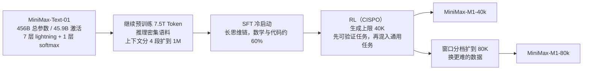

# MiniMax-M1：把「想得更久」的成本从平方压回线性，强化学习才付得起

<!-- release-date: 2025-06-16 -->

> 本文依据 MiniMax 发布的 **MiniMax-M1: Scaling Test-Time Compute Efficiently with Lightning Attention**，arXiv:2506.13585v1，2025-06-16 提交，共 22 页（正文 p. 1–15，参考文献 p. 15–21，贡献者 p. 22）。页码均指 PDF 自身的页码。文中会区分三件事：**报告明确写了什么**、**我们怎么解释它**、**哪些是外部资料或本文推算**。

## 阅读前先认识几个词

- **Token（词元）**：模型读写文本的最小单位。
- **测试时算力（test-time compute）**：模型回答问题时花掉的计算。让模型先写一长串推理再给答案，就是在加测试时算力。o1、DeepSeek-R1 这类推理模型的进步，主要来自这条轴（PDF p. 2）。
- **softmax 注意力与 lightning attention**：前者每生成一个 Token 都要回看全部前文，计算随长度平方增长；后者是线性注意力的一种高效实现，只维护一个固定大小的状态。M1 沿用 MiniMax-Text-01 的混合结构：每 8 层里 7 层 lightning、1 层 softmax。机制细节见 MiniMax-01 一篇。
- **强化学习里的重要性采样（importance sampling，IS）**：用旧策略采样的数据来更新新策略时，每个 Token 要乘一个比值 $r$ = 新策略概率 / 旧策略概率，纠正分布偏差。
- **PPO 与 GRPO 的裁剪（clip）**：$r$ 偏离 1 太多时，把这个 Token 的更新截掉，防止一步走太远。GRPO 是 PPO 的变体，用同一题的一组回答互相比较来算优势，省掉价值模型。
- **zero-RL**：不经过 SFT，直接在基座模型上做强化学习。

## 一句话先说清

推理模型靠「想得更久」变强，但在 softmax 注意力里，想得越久，每多想一步就越贵。强化学习要生成成千上万条长回答，这笔账要付很多遍。

MiniMax-M1 的做法是：**直接拿已经是线性为主的 MiniMax-Text-01 当底座来训推理模型**。它有 456B 总参数、每 Token 激活 45.9B，原生支持 1M 输入（PDF p. 1）。报告称，生成 64K Token 时 M1 的计算不到 DeepSeek-R1 的 50%，100K 时约 25%（PDF p. 2）。

架构省下的算力，要靠算法和工程才能真正用上。报告的另外两块贡献是：

1. **CISPO**：一个新的强化学习算法，不裁 Token、只裁重要性采样权重，在对照实验里用一半的训练步数追平 DAPO（PDF p. 7）；
2. **一组针对混合架构的 RL 修补**：训推概率对不上、AdamW 的 epsilon、重复生成、长度扩展时的后段崩坏（PDF p. 7–8、12）。

结果是整个 RL 阶段在 512 张 H800 上跑了 3 周，按租用价约 53.47 万美元（PDF p. 1）。报告发布了两个模型：生成上限 40K 的 M1-40k，和继续扩到 80K 的 M1-80k，前者是后者训练的中间阶段（PDF p. 1）。

如果只记一句话：

> **「想得更久」是一条要自己买单的 scaling 轴。M1 先用架构把单价降下来，再用算法和一串数值修补把它真正用满。**

## 先讲矛盾：想得越久，每多想一步越贵，而 RL 要付几千遍

### 第一笔账：生成越长，单步越贵

softmax 注意力生成第 $t$ 个 Token 时要看前面全部 $t-1$ 个，所以生成 $L$ 个 Token 的注意力总计算约与 $L^2$ 成正比。推理模型动辄生成几万 Token，平方项就成了主角。

读这张图要记住它是**理论 FLOPs**，按结构算出来，不是实测延迟（PDF p. 1，Figure 1 右）。按图读，64K 时 M1 约为 R1 的 0.4 倍，与正文「不到 50%」一致；100K 处读出来约 0.29 倍，比正文说的「约 25%」略高，128K 处才到约 0.24 倍（PDF p. 2）。读图有误差，量级是一致的：**生成长度过了几万 Token，M1 的单位计算是 R1 的四分之一到三分之一**。

M1 的线也不是完全笔直的，它有一点点上弯。那是每 8 层里保留的那 1 层 softmax。

### 第二笔账：RL 要把这笔账付很多遍

强化学习的每一步，都要先让模型对一批题各生成一组回答（rollout），再根据奖励更新。报告明确说：**RL 训练的主要瓶颈往往是 rollout 的计算和延迟**（PDF p. 7）。回答越长，rollout 越贵，而且是每一步都要付。所以注意力的平方项在 RL 里不是一次性的代价，而是乘上了训练步数。

### 为什么以前没人这么做

线性注意力、稀疏注意力、状态空间模型这些替代方案都存在，但报告说它们「没有在大规模推理模型上得到充分验证」，几乎所有有竞争力的推理模型仍然用传统注意力（PDF p. 2）。唯一的例外是腾讯的 Hunyuan-T1，用了 Mamba 架构，但没开源、细节很少（PDF p. 2）。

报告自称 M1 是「世界上第一个开放权重的大规模混合注意力推理模型」（PDF p. 1）。它的风险也在这里：没人在这种架构上做过大规模 RL，踩什么坑都是第一次。

## 全景：从 MiniMax-Text-01 到 M1-80k

架构没有变，M1 的全部新东西都在训练上。报告列了一张各家推理模型的最大输入、输出长度（PDF p. 3，Table 1）：

| | o3 | Gemini 2.5 Pro | Claude 4 Opus | DeepSeek-R1-0528 | Qwen3-235B | MiniMax-M1-80k |
|---|---:|---:|---:|---:|---:|---:|
| 最大输入 | 200K | **1M** | 200K | 128K | 128K | **1M** |
| 最大输出 | **100K** | 64K | 32K | 64K | 32K | 80K |

报告说 1M 输入是 DeepSeek-R1 的 8 倍，比当时所有开放权重推理模型大一个数量级（PDF p. 2）。

## RL 之前的两步：继续预训练与 SFT

### 继续预训练 7.5T Token

目标是在 RL 之前先把基座的推理和长上下文能力拉上去（PDF p. 4）：

- **数据**：改进网页与 PDF 解析、加强启发式清洗规则，保证数学和代码数据的召回；优先从网页、论坛、教材里抽取天然的问答对，**严格不用合成数据**；对问答数据做语义去重；STEM、代码、书籍和推理相关数据的比例提高到 70%。
- **配方**：调小 MoE 辅助损失系数，同时调整并行策略以支持更大的 micro batch，缓解辅助损失对模型效果的伤害；学习率先恒定 $8 \times 10^{-5}$ 训 2.5T Token，再用 5T Token 衰减到 $8 \times 10^{-6}$。
- **长上下文**：从 32K 分四段扩到 1M。报告观察到，混合 lightning 架构扩得太猛会**突然梯度爆炸**。它的归因是：lightning 各层的衰减率不同，靠前的层更关注局部信息，靠前层的参数优化跟不上靠后层的变化（PDF p. 4）。解法只是把扩展做得更平缓。

最后这条值得记一下：MiniMax-01 报告没写 lightning 的衰减设计，M1 这里第一次透露了「不同层衰减率不同」这个事实，但仍然没给具体数值。

### SFT：只为 RL 铺路

SFT 的目的只有一个：注入带反思的长思维链模式，给 RL 一个好起点（PDF p. 4）。数据覆盖数学、代码、STEM、写作、问答和多轮对话，**数学和代码约占 60%**（PDF p. 4）。报告没有给 SFT 数据的总量。

## 核心贡献一：CISPO，不裁 Token，只裁权重

### 旧问题：裁剪会把「分叉词」永久踢出梯度

先看 PPO 的目标（PDF p. 5，式 1），$r_{i,t}$ 是第 $i$ 条回答第 $t$ 个 Token 的重要性采样比值，$\hat{A}_{i,t}$ 是优势：

$$
J_{PPO}(\theta) = \mathbb{E}\left[\frac{1}{|o_i|}\sum_{t=1}^{|o_i|}\min\Big(r_{i,t}(\theta)\hat{A}_{i,t},\ \mathrm{clip}\big(r_{i,t}(\theta), 1-\epsilon, 1+\epsilon\big)\hat{A}_{i,t}\Big) - \beta D_{KL}(\pi_\theta \,\|\, \pi_{ref})\right]
$$

GRPO 把优势换成组内标准化的奖励（PDF p. 5，式 2）：

$$
\hat{A}_{i,t} = \frac{R_i - \mathrm{mean}(\{R_j\}_{j=1}^{G})}{\mathrm{std}(\{R_j\}_{j=1}^{G})}
$$

$\min$ 加 $\mathrm{clip}$ 的效果是：当优势为正、比值 $r$ 已经超过 $1+\epsilon$ 时，这一项变成常数，**这个 Token 的梯度直接归零**。

报告在混合架构上做 zero-RL 时发现，GRPO 伤害训练、长思维链也长不出来。一系列消融之后，定位到的罪魁就是这个裁剪（PDF p. 5）：

- However、Recheck、Wait、Aha 这类反思用词，往往是推理路径上的「分叉点」；
- 它们在基座模型里很少见、概率很低；
- 一次更新之后，它们的比值 $r$ 很容易变大，于是在第一轮 on-policy 更新后就被裁掉，**后面的离策略更新里再也拿不到梯度**（PDF p. 5）。

报告还说，这个问题在混合架构模型上尤其严重（PDF p. 5），但没有解释为什么。

DAPO 的办法是把裁剪上界调高。报告说在它们的设定里效果不够，因为 M1 **每批生成的数据要做 16 轮离策略更新**（PDF p. 6）。更新轮数越多，比值越容易跑出去，越多 Token 被裁。

### 新设计：把裁剪从更新挪到权重上

报告从带分布修正的 REINFORCE 出发（PDF p. 6，式 3）：

$$
J_{REINFORCE}(\theta) = \mathbb{E}\left[\frac{1}{|o_i|}\sum_{t=1}^{|o_i|}\mathrm{sg}\big(r_{i,t}(\theta)\big)\hat{A}_{i,t}\log\pi_\theta(o_{i,t} \mid q, o_{i,<t})\right]
$$

$\mathrm{sg}$ 是停止梯度：比值只当一个权重乘在前面，梯度只从 $\log\pi_\theta$ 走。CISPO（Clipped IS-weight Policy Optimization）在这个式子上做两件事：裁的是这个权重本身，再配上 GRPO 的组内优势和 token 级损失（PDF p. 6，式 4–5）：

$$
J_{CISPO}(\theta) = \mathbb{E}\left[\frac{1}{\sum_{i=1}^{G}|o_i|}\sum_{i=1}^{G}\sum_{t=1}^{|o_i|}\mathrm{sg}\big(\hat{r}_{i,t}(\theta)\big)\hat{A}_{i,t}\log\pi_\theta(o_{i,t} \mid q, o_{i,<t})\right]
$$

$$
\hat{r}_{i,t}(\theta) = \mathrm{clip}\big(r_{i,t}(\theta),\ 1-\epsilon^{IS}_{low},\ 1+\epsilon^{IS}_{high}\big)
$$

区别就在一处：PPO 裁掉的是「这个 Token 要不要更新」，CISPO 裁掉的是「这个 Token 更新多大」。**比值再大，权重也只是封顶，Token 始终留在梯度里。**

几个实现细节（PDF p. 6–7）：

- 下界 $\epsilon^{IS}_{low}$ 设成一个很大的值，等于不设下界，**只调上界** $\epsilon^{IS}_{high}$；
- 权重被裁过，梯度有一点偏差，报告认为换来了更低的方差和更稳的训练；
- 不裁的话，CISPO 就退化成标准的策略梯度；
- 沿用 DAPO 的动态采样和长度惩罚；
- 不加 KL 惩罚项。

所以虽然式 5 写成双边裁剪，**实际用的是单边上界裁剪**。$\epsilon^{IS}_{high}$ 的具体取值报告没给。

### 统一形式：裁剪策略变成一个掩码

报告把 PPO 式的裁剪写成一个 Token 级掩码乘回 CISPO 的目标里（PDF p. 7，式 6–7）：

$$
M_{i,t} = \begin{cases} 0 & \hat{A}_{i,t} > 0 \text{ 且 } r_{i,t}(\theta) > 1+\epsilon_{high} \\ 0 & \hat{A}_{i,t} < 0 \text{ 且 } r_{i,t}(\theta) < 1-\epsilon_{low} \\ 1 & \text{其他} \end{cases}
$$

这个掩码就是 PPO 信任域隐含的那个掩码。有了它，「丢不丢这个 Token」和「权重封不封顶」变成两个可以分别调的超参。**我们的解读**：这把过去混在一个 $\min(\cdot)$ 里的两件事拆开了，一是限幅，二是丢弃。CISPO 的主张就是：只要限幅，不要丢弃。

### 收益：对照实验在 Qwen 上做的

实证对比用的是 **Qwen2.5-32B 基座**，在 DAPO 的数学数据集上做 zero-RL，看 AIME 2024（PDF p. 7，Figure 2）。结论两条：同样步数下 CISPO 高于 DAPO 和 GRPO；用一半的步数达到 DAPO 的水平，即报告说的「2 倍加速」（PDF p. 6–7）。

读图补充：Figure 2 的纵轴是 32 次采样的平均正确率。约 1400 步时 CISPO 在 40 分左右，DAPO 在 33 分左右，GRPO 在 23 分左右；CISPO 大约在 450 步时到达 DAPO 在约 950 步时的水平（PDF p. 6）。

**要看清口径**：这是一个 32B 稠密 softmax 模型上的对照，不是在 M1 本身上做的。它证明了 CISPO 在一般设定下更快；至于「在混合架构上尤其必要」这一点，报告只给了定性描述，没有 M1 上的消融。

### 这不是凭空出现的

MiniMax-01 报告的在线 RL 已经对 GRPO 做过一处改动：遇到「比值很大、优势为负」的 Token 时额外裁掉（MiniMax-01 PDF p. 27，见 MiniMax-01 一篇）。那时的思路还是「丢掉危险的 Token」。M1 反过来，改成「保留所有 Token、只限幅」。同一个团队在同一个问题上换了一个方向。

### 这一节可以带走什么

- **限幅和丢弃是两件事**。很多稳定性技巧把两者绑在一起，拆开看往往能发现：你真正想要的只是限幅。
- **稀有但关键的样本最容易被「保护性」机制误伤**。任何按比值、按置信度、按损失大小截断的机制，都要检查被截掉的是不是恰好是你最想学的那部分。

## 混合架构在 RL 里的三个新麻烦

报告说，作为第一个在这种架构上做大规模 RL 的团队，它们遇到了一些独有的问题（PDF p. 7）。

### 麻烦一：训练时和推理时的概率对不上

RL 里，同一个 Token 的概率要算两遍：rollout 时用推理 kernel 算一遍，训练时用训练 kernel 再算一遍。理论上两个值应该完全相同。

报告发现两者差得很远，而且**这个问题直接导致奖励不涨**（PDF p. 7）。有意思的是，在更小的、softmax 注意力的稠密模型上没有出现（PDF p. 7）。逐层排查后，误差的主要来源是**输出层 LM head 里数值很大的激活**。修法是把 LM head 提到 FP32 精度（PDF p. 7）。

Figure 3 用散点图展示了修复前后：每个点是一个 Token，横轴推理概率、纵轴训练概率。修复前皮尔逊相关系数 0.987319，修复后 0.997135，报告正文概括为从「约 0.9x」提到「0.99x」；这个指标在训练中保持稳定，奖励才开始上涨（PDF p. 7–8）。

**我们的解读**：0.987 听起来已经很高，但 RL 的更新量正比于两个概率的比值。概率一旦有系统偏差，重要性采样比值就不再是 1 附近的噪声，而是一个有方向的误差，会被当成信号学进去。**RL 里「差不多一致」不够，要逐 Token 一致。**

### 麻烦二：AdamW 的 epsilon 差了几个数量级

报告说 $\beta_1$、$\beta_2$、$\epsilon$ 配错会导致不收敛，比如 VeRL 框架的默认值 betas = (0.9, 0.999)、eps = $10^{-8}$ 就会出问题（PDF p. 8）。两条观察：

- M1 训练中梯度的量级横跨 $10^{-18}$ 到 $10^{-5}$，**大多数小于 $10^{-14}$**；
- 相邻两步的梯度相关性很弱。

于是改为 $\beta_1 = 0.9$、$\beta_2 = 0.95$、eps = $10^{-15}$（PDF p. 8）。

**我们的解读**：AdamW 的更新大致是 $m / (\sqrt{v} + \epsilon)$。梯度在 $10^{-14}$ 量级时，$\sqrt{v}$ 也在这个量级，$10^{-8}$ 的 $\epsilon$ 比它大一百万倍，分母几乎全是 $\epsilon$，自适应缩放失效，这些参数实际上几乎不动。把 $\epsilon$ 降到 $10^{-15}$，才让分母重新由梯度自己决定。$\beta_2$ 从 0.999 降到 0.95，是让二阶矩的记忆变短，适应「相邻梯度不太相关」的情形。报告只给了现象和取值，这个机制分析是本文的。

### 麻烦三：病态的重复长回答

复杂题目会诱发很长、不断重复的回答，它们的大梯度威胁训练稳定（PDF p. 8）。报告的目标是在循环刚开始时就截断，而不是事后惩罚已经重复的文本。

字符串匹配抓不住形式多变的重复，报告改用概率：模型一旦陷入循环，每个 Token 的概率都会飙高。规则是**连续 3000 个 Token 的概率都高于 0.99 就停止生成**（PDF p. 8）。这同时去掉了拖慢 rollout 吞吐的长尾样本。

### 这一节可以带走什么

- **换了架构，数值假设要整套重新体检**。精度、优化器超参、生成长度分布，在旧架构上验证过的默认值都可能失效。
- **监控训推一致性**。把训练端与推理端对同一批 Token 算出的概率画成散点，是一张成本极低、价值极高的诊断图。

## RL 数据：四类可验证，一类靠奖励模型

### 规则可验证的任务

所有这类任务都用规则判定最终答案正确性作为奖励，外加格式奖励（PDF p. 9）。

| 类别 | 来源与构造 | 过滤与难度控制 | 规模 |
|---|---|---|---|
| 数学 | 公开来源与官方竞赛的数十万道竞赛级题目 | 去不完整与格式错误；跨 RL 数据源嵌入去重；与 SFT 数据严格隔离；n-gram 与嵌入去污染；去掉多小问、证明题、判断题；选择题改为开放式；只留规则能解析答案的题；用强推理模型算 pass@10，只留通过率严格介于 0 和 0.9 之间的 | 约 5 万 |
| 逻辑 | 41 类任务（如密码、数独），用 SynLogic 框架合成，每类有生成器和规则验证器 | 难度上界：强推理模型 pass@10 大于 0；下界：Text-01 通过率在 0 到 0.5 之间的最低难度参数；训练后期提高难度 | 约 5.3 万 |
| 竞赛编程 | 在线评测平台与编程网站的公开题目；缺测试用例的用 Text-01 生成 | 按模型采样通过率过滤，留中等难度的高质量题 | 3 万 |
| 软件工程 | 基于 GitHub 真实 issue 与 PR，参照 SWE-bench 搭容器化沙箱 | 通过全部测试给正奖励；编译错误、运行失败、测试回退给零或负奖励 | 几千 |

（PDF p. 9–10）

两条值得单独记：

- **SFT 与 RL 数据严格隔离**。报告的理由是，SFT 阶段泄漏到 RL 阶段的数据会妨碍探索（PDF p. 9）。
- **难度窗口用通过率定义**：太容易（通过率高）的没有学习信号，太难（通过率 0）的也没有。数学用「0 到 0.9」，逻辑用上下两个模型的通过率夹出一个区间。

### 不可验证的任务：2.5 万样本与生成式奖励模型

通用 RL 数据共 2.5 万条，分两类（PDF p. 10）：

- **有标准答案但规则难判**：STEM 与事实类问题，答案客观但表达方式多样。用生成式奖励模型（GenRM）按五档打分，判断回答与标准答案是否一致。GenRM 的效果用两件事衡量：在人工标注基准上的准确率，以及它挑出的 Best-of-N 与 pass@N 之间的差距（PDF p. 10）。
- **没有标准答案**：指令遵循、创意写作等。先由多个内外部模型生成候选参考答案、经内部质量评估，再用瑞士轮在训练集上选出最合适的参考答案；训练时 GenRM 把模型回答与参考答案两两比较，给 −1、0、1 三档分（PDF p. 10–11）。带约束的指令遵循题同时用规则奖励检查约束、用模型奖励评质量（PDF p. 10）。

### 长度偏见：必须在线治

GenRM 会偏爱更长的回答，不管推理质量如何。这会诱导策略靠堆字数骗奖励（PDF p. 11）。

报告先试了离线办法：训练数据覆盖各种长度与质量、加入对抗样本、改模型结构。结论是**纯离线的评估与预防，经常挡不住 RL 训练中出现的长度偏见**（PDF p. 11）。

于是核心策略变成**在线监控**：设指标检测策略是否在任务成功率与推理深度没有提升的情况下不成比例地拉长输出；一旦发现，立即重新校准 GenRM。RL 侧再配合奖励整形、值裁剪和归一化，降低奖励对长度这类表面特征的敏感度（PDF p. 11）。

### 课程：先可验证，再逐步混入通用任务

RL 开始时只用规则奖励的推理任务，再逐步混入通用任务，并对两类任务动态加权（PDF p. 11）。报告的目的是：可验证技能不遗忘，通用能力逐步提升，同一个策略学会「该严谨时严谨、该灵活时灵活」。

## 从 40K 到 80K：把「想得更久」真正练出来

第一轮 RL 的输出上限是 40K Token，得到 M1-40k；在此基础上继续把生成长度扩到 80K，得到 M1-80k（PDF p. 11）。

三件事（PDF p. 12）：

- **先换数据**：用 40K 模型评估通过率，去掉容易的题，偏向难的数学和代码；合成推理数据下采样，因为它在长上下文 RL 里会让输出重复、同质，持续接触这类模式会伤整体表现。
- **分档扩窗**：40K → 48K → 56K → 64K → 72K → 80K。升档看两个经验信号：生成序列的困惑度是否收敛；输出长度的第 99 百分位是否已经逼近当前窗口上限。
- **后段崩坏**：每一档训练的后期，生成序列的后半段会退化成不连贯的乱码，同时困惑度上升。报告找到的根因是：扩窗时**负样本的长度增长比正样本快得多**，更早撞到窗口上限，于是大量负梯度集中在序列后段。这种不平衡来自 GRPO 式优势归一化本身的不对称，再叠加 token 级损失（PDF p. 12）。

三项修复：用重复检测提前截断，别让重复回答占满窗口；**样本级损失与 token 级归一化结合**，缓和正负样本不平衡；同时调小梯度裁剪阈值和 $\epsilon^{IS}_{high}$（PDF p. 12）。

**我们的解读**：这里有一条很通用的因果链。token 级损失让长样本贡献更多梯度；失败的样本往往更长（绕圈、重复、跑题）；于是扩长度这件事会系统性地放大负梯度，而且集中在序列末尾。**任何「按 Token 平均」的损失，遇到长度与正负强相关的数据，都要检查一次这种不对称。**

## 成本账：53.47 万美元买的是哪一段

报告的原话是：完整 RL 训练在 512 张 H800 上用了 3 周，租用成本 534,700 美元（PDF p. 1、3、5）。

**本文算术**：512 张 × 21 天 × 24 小时 = 258,048 GPU 小时，折合每 GPU 小时约 2.07 美元，说明报告是按每卡每小时约 2 美元的租用价换算的。

这个数字**只覆盖 RL 阶段**。在它之前还有 456B 模型上 7.5T Token 的继续预训练，按常理算力远大于 RL 阶段，报告没有给它的成本；更早的 Text-01 预训练当然也不在内。「50 多万美元训出一个推理模型」这种说法是不准确的。

## 评测：哪些结论有证据，哪些要打问号

### 评测设置

所有任务都用温度 1.0、top-p 0.95 采样（PDF p. 12）。AIME 与 GPQA Diamond 各采 32 次取平均通过率；LiveCodeBench 与 FullStackBench 各采 16 次（PDF p. 12）。SWE-bench Verified 基于 Agentless 框架，但改成两段式定位（先粗粒度定位文件，再细粒度定位代码元素），不用基于嵌入的检索（PDF p. 13）。TAU-bench 用 GPT-4.1 当用户模型、通用系统提示词、不加自定义工具，最多 40 步交互（PDF p. 14）。MultiChallenge 由 GPT-4o 评分（PDF p. 14）。

### 主表

（PDF p. 13，Table 2，节选；括号里是各模型的思考预算，Seed-Thinking-v1.5 一列与 MATH-500、ZebraLogic、MMLU-Pro 三行略去）

| 任务 | o3（100K） | Gemini 2.5 Pro（64K） | Claude 4 Opus（64K） | DeepSeek-R1（32K） | DeepSeek-R1-0528（64K） | Qwen3-235B（32K） | M1-40k | M1-80k |
|---|---:|---:|---:|---:|---:|---:|---:|---:|
| AIME 2024 | 91.6 | **92.0** | 76.0 | 79.8 | 91.4 | 85.7 | 83.3 | 86.0 |
| AIME 2025 | **88.9** | 88.0 | 75.5 | 70.0 | 87.5 | 81.5 | 74.6 | 76.9 |
| LiveCodeBench | 75.8 | **77.1** | 56.6 | 55.9 | 73.1 | 65.9 | 62.3 | 65.0 |
| FullStackBench | 69.3 | – | **70.3** | 70.1 | 69.4 | 62.9 | 67.6 | 68.3 |
| GPQA Diamond | 83.3 | **86.4** | 79.6 | 71.5 | 81.0 | 71.1 | 69.2 | 70.0 |
| HLE（无工具） | 20.3 | **21.6** | 10.7 | 8.6* | 17.7* | 7.6* | 7.2* | 8.4* |
| SWE-bench Verified | 69.1 | 67.2 | **72.5** | 49.2 | 57.6 | 34.4 | 55.6 | 56.0 |
| OpenAI-MRCR（128K） | 56.5 | **76.8** | 48.9 | 35.8 | 51.5 | 27.7 | 76.1 | 73.4 |
| OpenAI-MRCR（1M） | – | **58.8** | – | – | – | – | 58.6 | 56.2 |
| LongBench-v2 | 58.8 | **65.0** | 55.6 | 58.3 | 52.1 | 50.1 | 61.0 | 61.5 |
| TAU-bench（airline） | 52.0 | 50.0 | 59.6 | – | 53.5 | 34.7 | 60.0 | **62.0** |
| TAU-bench（retail） | 73.9 | 67.0 | **81.4** | – | 63.9 | 58.6 | 67.8 | 63.5 |
| SimpleQA | 49.4 | **54.0** | – | 30.1 | 27.8 | 11.0 | 17.9 | 18.5 |
| MultiChallenge | **56.5** | 51.8 | 45.8 | 40.7 | 45.0 | 40.0 | 44.7 | 44.7 |

带 * 的 HLE 分数只在纯文本子集上测（PDF p. 13）。

### 怎么读这张表

报告的主张分两层（PDF p. 3、14）：

- **数学和竞赛编程**：M1 超过原版 DeepSeek-R1 和 Qwen3-235B 的部分项目，但**明显落后于 DeepSeek-R1-0528**。AIME 2024 上 M1-80k 的 86.0 在开放权重模型里排第二。
- **软件工程、长上下文、工具使用**：这是 M1 的主场。SWE-bench 56.0 仅次于 R1-0528 的 57.6；长上下文两项在开放权重模型里明显领先，超过 o3 和 Claude 4 Opus，仅次于 Gemini 2.5 Pro；TAU-bench 上 M1-40k 超过所有开放权重模型和 Gemini 2.5 Pro。

后一层和架构直接相关：1M 输入、便宜的长生成，正好对应长文档、长代码库和多轮工具调用。**M1 赢的地方，正是线性注意力省钱的地方。**

### 三处要标出的口径

1. **80k 并不总是强于 40k**。报告说 M1-80k 在大多数基准上「持续优于」M1-40k（PDF p. 14）。表里确实大多如此，但 OpenAI-MRCR 两项（76.1 → 73.4，58.6 → 56.2）和 TAU-bench retail（67.8 → 63.5）都是 80k 更低，MultiChallenge 持平。报告没讨论。**我们的猜测**：80K 阶段的数据偏向难的数学和代码、下采样了合成推理数据，长上下文检索和工具对话可能被挤掉了一些；这没有证据。
2. **SWE-bench 的框架是自己改过的**。两段式定位、不用嵌入检索，与其他模型各自报告的数字不一定是同一套框架。
3. **TAU-bench 的用户模型和提示词是自己定的**，其他模型的分数若来自各自报告，设置也可能不同。报告没说明表里对比模型的分数是自测还是引用。

### RL scaling 的证据

Figure 4 跟踪了训练过程中三个基准的成绩与平均回答长度（PDF p. 14–15）：两者一起上升；AIME 与 LiveCodeBench 的平均回答长度超过 2 万 Token；AIME 2024 正确率从 68% 升到 80%（PDF p. 14）。

报告据此说「正确率提升与回答变长强相关」（PDF p. 14）。**这是相关，不是因果**：两者都随训练步数增长，并不能说明是变长导致了变准。

## 报告之后

同一路线的后续，站内各有解读，这里只给篇名：MiniMax-M2 改回全注意力，报告里给出的理由包括混合注意力在更大规模复杂推理上的质量难以准确评估（见 MiniMax-M2 一篇）；MiniMax-M3 换成了 GQA 之上的块稀疏注意力（见 MiniMax-Sparse-Attention 一篇）。

读 M1 时值得把这一点放在旁边：M1 自己报告的「训推概率对不上」「lightning 各层衰减率不同导致扩长度时梯度爆炸」，都是混合架构带来的数值麻烦。M1 解决了它们，但也说明这条路的工程成本不低。

## 报告没有告诉我们的事

- **架构细节**：M1 报告没有重述层数、头数、专家配置，只说继承 Text-01（PDF p. 1–2）；lightning 各层衰减率的取值也没有；
- **继续预训练**：7.5T Token 的来源配比（只给了 STEM 等占 70%）、四段长上下文扩展的每段长度与 Token 数、调小后的辅助损失系数；
- **SFT**：数据总量、训练超参；
- **RL 超参**：组大小 $G$、$\epsilon^{IS}_{high}$ 的取值、学习率、每批题数、KL 之外的正则、40K 阶段训练了多少步（Figure 4 横轴约 4000 步，但没说对应哪个阶段）；
- **CISPO 在 M1 上的消融**：只有 Qwen2.5-32B 上的对照；
- **GenRM**：规模、训练数据量、人工标注基准的大小与准确率；
- **长度偏见的监控指标与重新校准的触发阈值**；
- **成本**：继续预训练的算力与成本；
- **评测**：对比模型分数的来源（自测还是引用）。

## 最值得带回自己项目的六条

### 1. 先证明瓶颈在哪一段，再决定动哪一刀

报告明确说 RL 的瓶颈往往是 rollout（PDF p. 7）。M1 的整套设计都围着这一点：线性注意力省的就是长 rollout 的钱。先量出瓶颈，再选方案。

### 2. 限幅和丢弃要分开

CISPO 的全部改动，就是把 PPO 的「超出范围就丢弃」换成「超出范围就封顶」。任何带截断的稳定性机制，都值得问一句：我要的是限幅，还是真的要丢？

### 3. 换了架构，数值假设要整套重新体检

LM head 精度、AdamW 的 epsilon、长度扩展的节奏，三个默认值在新架构上都失效了。迁移一个成熟配方到新结构时，先把「理论上应该相等」的量实际比一遍。

### 4. 扩容时机看尾部，不看均值

扩窗的判据之一是输出长度的第 99 百分位是否逼近上限。均值离上限还远时，尾部可能已经在撞墙，而撞墙的正是最容易出问题的那些样本。

### 5. 按 Token 平均的损失，要检查长度与正负的相关

负样本更长，token 级损失就会系统性放大负梯度。这类不对称在长度变化大的训练里一定会出现，要么在损失里做样本级归一化，要么从源头截断病态长样本。

### 6. 评分器的偏差要在线治

GenRM 的长度偏见，离线怎么修都挡不住训练中的利用。把「策略是否在钻奖励模型的空子」做成在线指标，发现就重新校准。

## 关键词回看

- **测试时算力**：回答问题时花的计算，推理模型靠它变强，softmax 注意力下随生成长度平方增长。
- **混合 lightning 架构**：每 8 层 7 层线性注意力、1 层 softmax，M1 直接继承自 MiniMax-Text-01。
- **CISPO**：裁剪重要性采样权重而不是裁剪 Token 更新，所有 Token 都保留梯度。
- **分叉词**：However、Wait、Recheck、Aha 这类低概率但决定推理走向的 Token，最容易被 PPO 式裁剪踢掉。
- **统一掩码形式**：把 PPO 信任域的丢弃写成 Token 级掩码，与权重限幅分开调。
- **训推精度不一致**：训练与推理 kernel 算出的 Token 概率不同，M1 通过把 LM head 提到 FP32 修复。
- **AdamW epsilon**：梯度量级远小于 epsilon 时，自适应缩放失效；M1 用 $10^{-15}$。
- **重复截断**：连续 3000 个 Token 概率都高于 0.99 就停止生成。
- **GenRM 长度偏见**：生成式奖励模型偏爱长回答，需要在线监控和重新校准。
- **分档扩窗**：40K 到 80K 分六档，按困惑度收敛与长度 P99 两个信号升档。
- **后段崩坏**：负样本先撞长度上限，负梯度集中在序列后段，生成末尾变成乱码。

## 最后的判断

M1 这份报告最值得学的，不是「线性注意力推理模型」这个标签，而是它**把「让模型想得更久」当成一条需要逐项买单的 scaling 轴**：架构降单价，算法提效率，数值修补保稳定，课程与分档扩窗控节奏，缺一环就在那一环出问题。

证据强度分层：

- **有直接实验支撑的**：CISPO 在 Qwen2.5-32B 上快于 DAPO 和 GRPO（Figure 2）；LM head 提到 FP32 后训推概率相关性从 0.987 到 0.997（Figure 3）；主表里软件工程、长上下文、工具使用的领先；RL 过程中成绩与长度同步上升（Figure 4）。
- **只有作者描述、没有数据的**：裁剪在混合架构上「尤其严重」；lightning 各层衰减率不同导致梯度爆炸的归因；AdamW 设置的必要性；后段崩坏的根因分析；长度偏见在线监控的效果。
- **没有公开的**：RL 超参、CISPO 在 M1 上的消融、继续预训练的成本、GenRM 的细节。

还有几处口径要自己校准：FLOPs 对比是理论值；53.47 万美元只是 RL 阶段；80k 并非全面强于 40k；SWE-bench 与 TAU-bench 的评测框架是自己定的。

如果只带走一句：

> **不要把「想得更久」当成一个可以随手打开的开关。它要架构、算法、数值和课程一起买单，哪一环没付钱，它就在哪一环崩给你看。**

## 资料与阅读边界

**原始依据**

- 本地 `papers/MiniMax/MiniMax-M1.pdf`，即 [arXiv:2506.13585](https://arxiv.org/abs/2506.13585) v1（2025-06-16 提交），22 页。arXiv 上仅此一版。全文带 `(PDF p. N)` 的内容都出自这一版；引用 MiniMax-01 报告的地方标明了「MiniMax-01 PDF」。

**首发日证据**

- 官方新闻 [MiniMax-M1, the World's First Open-Source, Large-Scale, Hybrid-Attention Reasoning Model](https://www.minimax.io/news/minimaxm1) 页面标注 06.16.2025，宣布在 MiniMax App 与 Web 免费开放、提供 API，并在 Hugging Face 与 GitHub 发布权重与技术报告。`release-date` 取 **2025-06-16**。
- 权重仓库 [MiniMaxAI/MiniMax-M1-80k](https://huggingface.co/MiniMaxAI/MiniMax-M1-80k) 的权重文件在 2025-06-14 已预先上传、代码仓库 [MiniMax-AI/MiniMax-M1](https://github.com/MiniMax-AI/MiniMax-M1) 同日创建，均为发布前的准备，不作为公开可用日。

**外部补充（不是报告内容）**

- 官方权重的 [`config.json`](https://huggingface.co/MiniMaxAI/MiniMax-M1-80k/blob/main/config.json) 与 MiniMax-Text-01 的配置一致：80 层、其中 10 层是 softmax、64 个注意力头每头 128 维、8 个 KV 头、hidden 6144、32 个专家每 Token 选 2 个、专家中间维 9216。这印证了 M1 没有改架构；M1 报告本身没有列这些数字。
- 官方新闻稿里另有一个口径：生成 8 万 Token 时 M1 所需算力约为 DeepSeek-R1 的 30%。与报告正文「64K 不到 50%、100K 约 25%」以及本文读图一致。
- 本文中「本文算术」「我们的解读」「我们的猜测」「读图」标出的内容都不是报告结论，包括：Figure 1 与 Figure 2 的读数、每 GPU 小时约 2.07 美元的换算、AdamW epsilon 失效的机制分析、后段崩坏的通用化解读、80k 在部分项目上不如 40k 的原因猜测。
