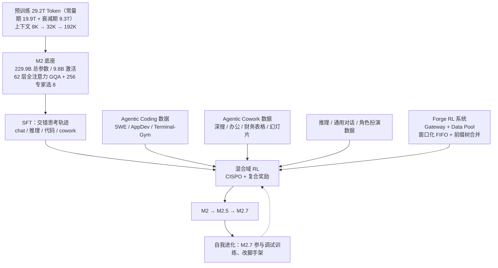
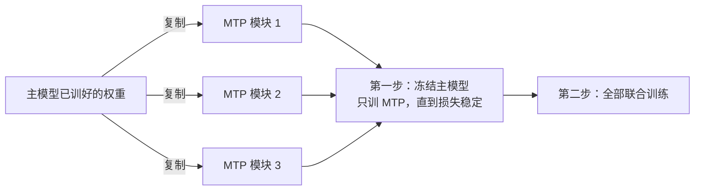
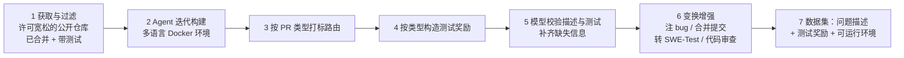
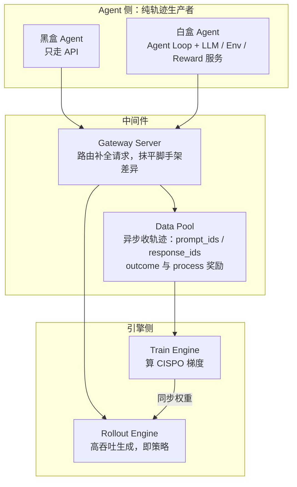
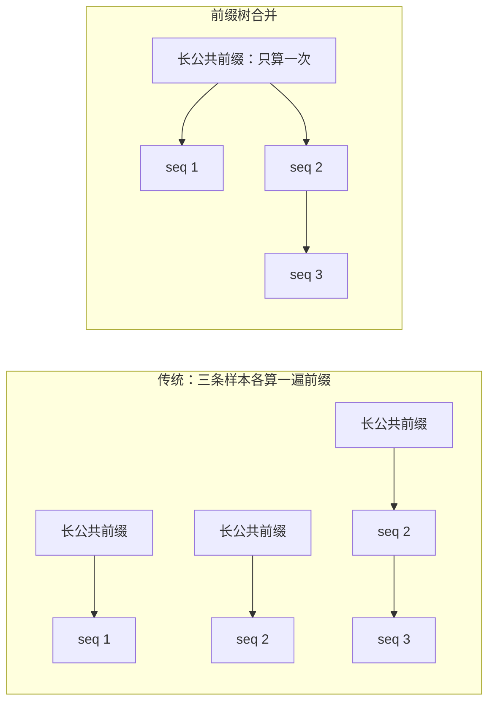
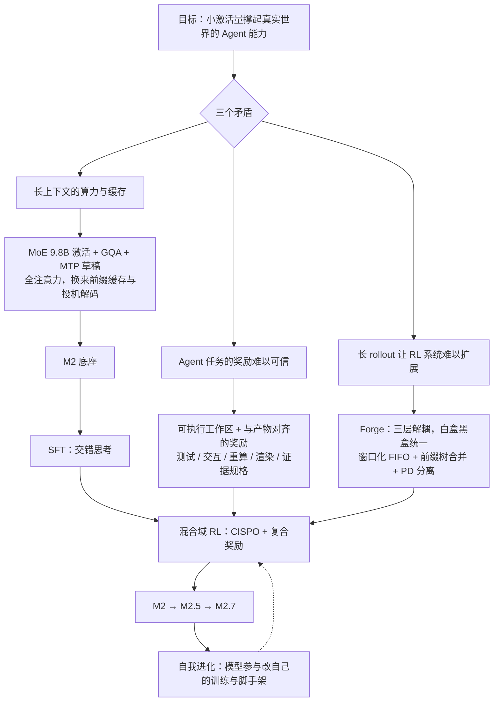

# MiniMax-M2：底座退回全注意力，能力押在可验证的奖励和 RL 系统上

<!-- release-date: 2025-10-27 -->

> 本文依据 MiniMax 的 **The MiniMax-M2 Series: Mini Activations Unleashing Max Real-World Intelligence**，arXiv:2605.26494v2，2026-07-30 修订，共 35 页（正文 p. 1–31，参考文献 p. 31–34，贡献者名单 p. 35）。页码均指 PDF 自身的页码。文中区分三件事：**报告明确写了什么**、**我们怎么解释或验算它**、**哪些是外部资料补充**。

## 阅读前先认识几个词

这份报告的重心在后训练，名词最密的是 RL 和 Agent 那几章。先用人话过一遍：

- **MoE（Mixture-of-Experts，混合专家）**：把前馈层拆成很多个小网络（专家），每个 Token 只经过其中几个。总参数可以很大，单个 Token 用到的很少。标题里的「mini activations」说的就是后一件事。
- **GQA（Grouped-Query Attention，分组查询注意力）**：多个查询头共用一组 Key 和 Value，减小推理时的 KV 缓存。它仍然是标准的全注意力，只是少存几份 KV。
- **MTP（Multi-Token Prediction，多 Token 预测）**：主模型旁边挂一个小模块，顺便预测再往后几个 Token。训练时多一份信号，推理时可以当草稿做投机解码。
- **投机解码（speculative decoding）**：先让便宜的草稿模块猜几个 Token，再让主模型一次前向验证。猜对就省几步，猜错就退回，输出分布和逐个生成一样。
- **rollout 与轨迹**：让模型在环境里实际跑一遍任务叫 rollout，跑出来的整段记录叫轨迹。
- **脚手架（scaffold）与 harness**：模型外面那层负责管上下文、调工具、决定何时再调一次模型的程序。同一个模型换一套脚手架，成绩可以差很多。
- **交错思考（interleaved thinking）**：想一段、调一次工具、看结果、再想一段，而且前几轮想过的内容一直留在上下文里。

## 一句话先说清

MiniMax-M2 是一个 229.9B 总参数、每 Token 只激活 9.8B 的 MoE 模型，62 层、全注意力、原生 192K 上下文，预训练 29.2T Token（PDF p. 2–3）。报告写的是一个家族：M2 是底座，M2.5 和 M2.7 是后续 checkpoint，评测章节比的是 M2.7（PDF p. 25）。

底座只占五页。其余二十多页讲三件事，报告说它们从 M2 到 M2.7 一路共同演化（PDF p. 2、p. 30）：

1. **Agent 驱动的数据流水线**：每一类任务配上可运行的工作区，奖励尽量来自「跑一遍验证」，而不是「让一个模型打分」；
2. **Forge**：把训练、推理和 Agent 彻底解耦的 RL 系统，白盒 Agent 和只走 API 的黑盒 Agent 都能接；
3. **自我进化的早期形态**：M2.7 在自家基础设施上排查失败的训练任务、改自己的脚手架。

如果只记一句话：

> **当 Agent 能力主要由后训练决定时，底座可以退回最稳妥的全注意力 MoE。省算力靠小激活量，涨能力靠难以被骗的奖励，扩规模靠 RL 系统的解耦。**

## 先看全景：一个保守的底座，一条激进的后训练线

这张图是按报告第 2–7 节的叙事重画的机制示意，报告本身没有整体流程图。报告只给了三个 checkpoint 的先后顺序，没有给日期；按 MiniMax 平台的发布日志（外部补充），M2 是 2025-10-27，M2.5 在 2026 年 2 月，M2.7 是 2026-03-18。报告 v1 在 2026-05-26 才上传，比 M2 首发晚七个月。

报告没有说 M2.5 和 M2.7 是否动过预训练。结论一节说 9.8B / 229.9B 的底座「与三个组件一起」从 M2 演化到 M2.7（PDF p. 30），我们据此理解三者共用同一底座。

## 第一层矛盾：Agent 任务又长又难

报告开篇把问题说成两件事（PDF p. 2）：

1. Agent 任务的上下文天然极长，训练和推理都被效率与成本拖住，高可用的生产部署尤其如此；
2. 真实场景的任务又难又高风险，比如生产级软件工程和知识密集的办公自动化。

第一件逼你省算力，第二件逼你堆能力。

先算一笔账，看第一件事有多重。M2 每层 8 个 KV 头；按官方权重配置里的每头 128 维（外部补充），每个 Token 要缓存 $2 \times 8 \times 128 \times 62 = 126{,}976$ 个元素，BF16 下约 248 KB。一条塞满 192K 的轨迹，光 KV 缓存就约 50 GB（本文算术）。一次 Agent 任务又要反复调模型、反复带着这段历史。

面对第一件事，MiniMax 上一代的回答是换掉注意力的数学形式：MiniMax-Text-01 把 Lightning Attention 和全注意力交错使用（PDF p. 4）。到了 M2，报告把这条路收了起来，**每一层都用全注意力**（PDF p. 3–4）。省算力的手段退回最保守的组合：MoE 把激活压到 9.8B，GQA 把 KV 份数压到查询头的六分之一，MTP 让推理一次多出几个 Token。

创新预算全部挪去对付第二件事。

## 底座：退回最保守的组合

### 配置

| 配置 | M2 |
|---|---:|
| 总参数 / 每 Token 激活参数 | 229.9B / 9.8B |
| 层数 | 62 |
| 隐藏维度 | 3072 |
| 词表 | 200,064 |
| 预训练 Token | 29.2T |
| 最大上下文 | 192K |
| 注意力 | 全注意力，48 个查询头，8 个 KV 头（GQA），全模型用 RoPE |
| 每层专家 / 每 Token 激活专家 | 256 / 8 |
| 路由 | sigmoid 门控 + 可学习的专家偏置 |
| MTP | 预训练 1 个模块，继续预训练的衰减阶段扩到 3 个 |

全部来自 PDF p. 3 与 p. 5。激活占总参数约 4.3%，每 Token 用 1/32 的专家，每个 KV 头服务 6 个查询头（本文算术）。

官方权重配置（外部补充，不是报告内容）还给出几个报告没写的数：每头 128 维，专家内部维度 1536，RoPE 只旋转每头 128 维里的 64 维，没有共享专家，`attn_type_list` 的 62 个位置全部是同一种注意力。

### MoE 的三处改动

报告说 MoE 层改了三件事，分别对准表达力、路由动态和负载均衡（PDF p. 3–4）：

- **细粒度专家**：更多、更小的专家。理由是路由的组合更多样，专家在设备间的利用率方差更小；
- **sigmoid 门控**：softmax 让所有专家的分数加起来等于 1，一个高了别的必然低，报告叫它零和约束。sigmoid 让每个专家独立打分，多个专家可以同时高置信被选中，训练时路由更平滑；
- **专家偏置**：给每个专家的门控分数加一个可学习的偏移，与模型参数一起优化，隐式调节专家使用率，于是辅助负载均衡损失可以「大幅调小」。这里引用的是 DeepSeek 团队的无辅助损失负载均衡（Wang et al., 2024a）。

注意措辞：是「大幅调小」，不是「去掉」。报告没有给偏置的更新规则、辅助损失的权重，也没有这一项的消融。

### 小规模消融：细粒度和 MTP 各自带来什么

细粒度专家与 MTP 的证据是同一张代理规模的消融表：2B 激活、17.8B 总参数、500B Token（PDF p. 4，Table 1）。基线是 32 选 2；细粒度把专家切成四分之一大小、每 Token 选 8 个，激活和总参数都不变。

| 基准 | 基线（32 选 2） | + MTP | 细粒度（128 选 8） |
|---|---:|---:|---:|
| MATH（4-shot） | 19.6 | 21.3 | **24.1** |
| MMLU（5-shot） | 39.8 | 39.7 | **40.2** |
| ARC-Challenge（25-shot） | 27.4 | 27.5 | **27.8** |
| KorBench（3-shot） | 14.1 | **15.0** | 14.8 |
| HumanEval（0-shot） | 29.7 | 30.1 | **32.5** |

读表要知道三件事：

1. 细粒度的收益集中在 MATH（+4.5）和 HumanEval（+2.8），知识类的 MMLU 只动 0.4。我们的解释是：细粒度增加的是「组合」，32 选 2 只有 496 种组合，128 选 8 约有 $1.4 \times 10^{12}$ 种；需要多种技能协同的推理和代码更吃这一点，知识量取决于总参数，而总参数没变。这是推断，报告没有分析涨在哪里；
2. 报告说 MTP「在各项基准上一致提升，推理型任务提升最大」（PDF p. 5）。表上 MMLU 其实从 39.8 掉到 39.7，只能说基本持平；
3. 表里细粒度那一列是否同时带了 MTP，报告没有说明。

### MTP：训练时是信号，推理时是草稿

预训练用 1 个 MTP 模块，结构跟随 DeepSeek-V3；MTP 损失权重从 0.3 开始，衰减阶段退火到 0.1（PDF p. 5）。模块内部结构见 Figure 2（PDF p. 7）：每个模块有自己的 RMSNorm、线性投影和一个 Transformer 块，嵌入层和输出头与主模型共享。

为了做多步投机解码，继续预训练的衰减阶段把模块从 1 个扩到 3 个。关键在新模块怎么初始化（PDF p. 5–6）：

据 PDF p. 5–6 第 2.3 节与 Figure 2 的「Copy & Initialize」箭头重画。

报告给了两个复制初始化的理由：复制来的模块收敛快得多，随机初始化的模块起步损失很高，会暂时拖累主模型；复制也让主模型的表示在过渡期受的扰动最小。他们也试过全程冻结主模型，结果 MTP 模块的最终质量比联合训练差（PDF p. 5–6）。

推理时三个模块出草稿，主模型一次前向验证，输出质量与逐个自回归相同，只换来吞吐（PDF p. 6）。接受率和加速倍数报告没给。

这条线在 RL 阶段还会再出现：MTP 模块要跟着策略一起训，否则策略一漂移，草稿就猜不中了（见 Forge 一节）。

**可迁移的部分**：训练中途往模型上加新模块，「复制已有权重、先冻结主干、再联合训」是低风险的起步法，它把新模块的高损失隔离在主干之外。

## 核心决定：回到全注意力

这一节最值得对着读，因为它是上一代混合注意力路线的作者自己写的反例。报告先下结论：在横跨推理、代码和 Agent 的生产场景里，他们没找到任何一种高效注意力变体能稳定追平全注意力（PDF p. 4）。然后给了三个理由。

### 理由一：质量损失量不准

开发 MiniMax-Text-01 时，混合注意力模型在 MMLU、BBH、MATH、LongBench 上看起来和全注意力打平；规模一大，复杂多跳推理上的短板才露出来。他们为此做了代理指标，可是代理指标与真实下游表现的相关性很脆弱，换个规模或任务分布就可能失效。更麻烦的是，统计上可信的评测所需算力随任务复杂度快速上涨，不同架构又会和数据分布、训练配方以不可预测的方式相互作用（PDF p. 4）。

这段话的分量在于：**它不是说线性注意力被证明更差，而是说「证明它不更差」这件事贵到做不起，做出来也不一定可信。** 对一个要发布生产模型的团队，这就足以做决定。

### 理由二：基础设施跟不上

线性与稀疏注意力的基础设施不如全注意力成熟：很多线性架构连训练时都是访存瓶颈；推理时对低精度存储敏感，没有原生的前缀缓存，和投机解码怎么结合也不清楚（PDF p. 4）。

后三条都是 Agent 服务的命门。Agent 对话有大量共享前缀（同一段系统提示、同一份工具说明），前缀缓存省下的是真钱；投机解码是 M2 靠 MTP 拿吞吐的手段。一种注意力如果和这两件事合不上，在生产里就没有位置。

### 理由三：混合滑动窗口实验输在长上下文

他们在 M2 的注意力层上大量试了混合滑动窗口注意力（Sliding Window Attention，SWA），在多种配置下继续预训练几千亿到上万亿 Token：换 SWA 与全注意力的比例、调 RoPE、层内混合与层间混合、分析归纳头与检索头、加 sink token（PDF p. 4）。结论是所有变体在检索、多跳推理和上下文学习上都退步了。

预训练后的对照（PDF p. 5，Table 2），最后一列是本文算的差值：

| 基准 | 全注意力 | 混合 SWA | 差值 |
|---|---:|---:|---:|
| HELMET ICL | 75.8 | 72.7 | −3.1 |
| MMLU | 85.5 | 85.6 | +0.1 |
| MATH | 60.3 | 60.3 | 0 |
| RULER 32K CWE | 99.0 | 99.0 | 0 |
| RULER 32K MQ | 99.0 | 99.0 | 0 |
| RULER 128K CWE | 90.0 | 72.0 | −18.0 |
| RULER 128K MQ | 99.0 | 93.0 | −6.0 |
| MTOB K-e Bleurt | 60.0 | 45.0 | −15.0 |
| MTOB e-k ChrF | 44.8 | 27.2 | −17.6 |

表的形状说明一切：短上下文和知识题完全没差，差距全部落在 128K 检索和 MTOB 上。背景补充（外部）：RULER 是合成的长上下文测试，CWE 是在长文里数最常见的词，MQ 是一次问多根「针」；MTOB 让模型读一本语法书去翻译一门陌生语言。它们考的都是「远处的信息必须原样看到」，正是滑动窗口做不到的事。

SFT 之后（PDF p. 6，Table 3）：

| 基准 | 全注意力 | 混合 SWA | 差值 |
|---|---:|---:|---:|
| AIME 2025 | 86.7 | 86.7 | 0 |
| ARC-AGI-1 | 38.9 | 39.6 | +0.7 |
| GPQA-Diamond | 75.3 | 72.7 | −2.6 |
| MMLU-Pro | 80.5 | 80.1 | −0.4 |
| IFBench | 23.1 | 27.2 | +4.1 |
| SWE-verified | 54.7 | 50.2 | −4.5 |
| Terminal-Bench | 26.7 | 23.8 | −2.9 |
| BrowseComp-zh | 32.8 | 28.7 | −4.1 |
| GAIA-103 | 53.4 | 51.5 | −1.9 |
| XBench-ds | 58.0 | 63.0 | +5.0 |
| τ2-Bench retail | 62.3 | 67.5 | +5.2 |
| τ2-Bench telecom | 32.5 | 21.0 | −11.5 |

报告的归纳是：超过 32K 的基准（Agent 任务和复杂长上下文评测）上 SWA 明显更差；32K 以内差异有正有负、绝对值小，SWA 在部分指令跟随和短程 Agent 任务（IFBench、XBench-ds）上持平甚至更好，全注意力在知识密集的 GPQA-Diamond、MMLU-Pro 上保持优势（PDF p. 5）。报告没有标出哪几个基准属于「超过 32K」，所以 Table 3 里每一行该归哪一类，读者只能自己判断。

### 这个决定被证明了多少

必须标清一个边界：**Table 2 和 Table 3 比的是全注意力与混合 SWA，不是全注意力与 Lightning Attention。** 关于线性注意力，报告只给了 Text-01 时期的定性经验和基础设施论据，没有在 M2 规模上给对照数字。所以「回到全注意力」这个决定，被数据证明的部分是「SWA 混合在长上下文上不行」，线性注意力那一半是经验判断。

报告的展望一段也说明这不是永久的决定：上下文继续变长、GPU 算力增长放缓，次二次方注意力会越来越重要，他们在投入更好的长上下文数据、评测方法和基础设施，为这个转变做准备（PDF p. 5）。

### 可以带走什么

- 选架构之前先问**能不能量得准**。小规模分不出差别、大规模对照又付不起，选更成熟的那一边不是保守，是理性；
- 低精度存储、前缀缓存、投机解码，是任何新注意力进生产的入场券；
- 想省长上下文的成本，SWA 混合在 32K 以内几乎免费，超过之后要付检索能力的代价。

## 预训练数据：只有一个轮廓

这一节只有一页多（PDF p. 6–7）：

- 来源：网页、学术文献、书籍、代码、结构化问答；
- 质量：用基于模型的奖励打分加辅助分类器，从多个维度评估文档；平衡采样，上调高质量内容，同时保留类别多样性；
- 配比：代码、数学和 STEM 相对自然分布显著上采样；
- 阶段：常量阶段 19.9T Token；随后上下文从 8K 分步扩到 32K、再到 192K；衰减阶段总预算 9.3T Token，同时包含短文本衰减数据和长上下文数据，长数据主要来自高质量代码拼接、天然长篇的 PDF 文档和按主题打包的相关文档。

19.9T + 9.3T 正好是 29.2T。报告没有写各来源占比、去重与污染检查、质量分类器的训练方式、合成数据用没用、学习率与 batch 日程、优化器、GPU 数量和训练时长。

## 核心设计一：每条轨迹都有可执行的工作区和对齐产物的奖励

从第 4 节起才是报告的正题（PDF p. 7–16）。摘要里的一句话是整章的总纲：每条轨迹都「扎根在一个可执行的工作区里，配一个与产物形态对齐的奖励」（PDF p. 1）。报告在贡献里说得更直白：把每条被接受轨迹的**奖励质量和可信度**提上去，无论靠可执行的验证信号还是靠裁判模型核查证据，是释放底座潜力「最要紧的事」（PDF p. 2）。

这句话是理解整章的钥匙。报告不是在比谁的数据多，而是在比谁的奖励更难被骗。先用一张表看清每个域拿什么当奖励（本文整理）：

| 域 | 任务从哪来 | 奖励或验收信号 | 页码 |
|---|---|---|---|
| 软件工程（SWE） | GitHub PR | 按 PR 类型抽测试，在 Docker 里跑 | p. 7–9 |
| 应用开发（AppDev） | 专家元查询 + LLM 扩写 | Agent 部署并操作应用：执行、交互、视觉三层 | p. 9–11 |
| 终端 | Stack Overflow | Agent 生成的 Docker 与统一测试套件 | p. 11–12 |
| 深度搜索 | 种子问题反复改写遮蔽 | 证据规格；报告式问题用评分表 | p. 12–13 |
| 办公交付物 | GDPval 种子 + 职业数据库分层合成 | 多轴评分表 + 反编造清理 | p. 13 |
| 财务与表格 | 先跑工具再反推任务；工作簿漫步 | 外部引擎重算后逐格比对 | p. 13–14 |
| 幻灯片 | 源文档派生；真实幻灯片编辑 | 执行 + Agent 判功能 + 版式规则 + 渲染成图打分 | p. 14 |
| 推理 | 现有题源 + 针对短板合成 | 验证器 + 多模型交叉核对 + 评分表 | p. 14–15 |
| 通用对话与写作 | 精选查询，长思维链 | 规则检查 + 模型评估 | p. 15–16 |
| 角色扮演 | 专家模型自博弈 | Role-Play Bench 惩罚失败模式 + 产品真实反馈 | p. 16 |

规律很清楚：**能跑就跑，跑不了就交互或渲染，最后才用裁判模型，而且裁判也要给证据。** 这条排序本身就是可迁移的设计原则。下面只讲每条流水线里真正有信息量的那几步。

### SWE：从 PR 到可验证任务

旧问题是三件事缠在一起：任务要多样，要能客观验证，还要扩到大规模训练需要的量。GitHub PR 天然自带描述、代码改动和测试，但原始数据很脏（PDF p. 7）。

据 PDF p. 8 Figure 3 上半部分重画。

几个关键环节：

- **非 Python 的环境最难建**。依赖异构、版本冲突多，环境合成的可靠性明显下降。办法是一个注入了专家知识的 Agent 执行回路，按执行反馈迭代改构建脚本；要处理编译型语言（Java、Go、Rust、C++）的工具链、各语言不同的构建与测试接口、仓库级的结构差异（PDF p. 8）；
- **奖励按 PR 类型定义**（PDF p. 8–9）：修 bug 抽 F2P（修前失败、修后通过）和 P2P（修前修后都通过）两类测试，P2P 用来保证没引入新 bug；加功能时测试依赖新代码，F2P/P2P 常不适用，改为抽新增的测试点；性能优化没有「修」的过程，抽能稳定、显著体现优化前后差异的 P2P 测试；
- **变换增强**（PDF p. 9）：注入额外 bug 提难度；合并相邻提交构造多步修复（做法类似 SWE-Smith）；把修 bug 反转成 SWE-Test，要求写一个「打补丁前失败、打补丁后通过」的测试，仍然完全可验证；代码审查任务不需要运行环境，由另一个 LLM 核验一致性，报告称之为「近似可验证」。

最终覆盖十多种编程语言（PDF p. 9）。数据集规模报告没给。

### AppDev：专家在环，Agent 当验证者

从零建应用和改仓库有三点不同：任务没法从现有代码里抽，质量要运行时验证，评价同时包含功能正确和主观设计（PDF p. 9）。流水线是专家写元查询和系统提示、LLM 扩写、MinHash 去重、按技术栈合理性 / 功能可行性 / 需求清晰度三类评分表过滤（PDF p. 10）。其中两步最值得记。

**提示蒸馏（prompt distillation）**。专家把最佳实践写进系统提示：报告举例说早期模型有「滥用模板化渐变背景」的坏习惯，提示里就写明设计规范；还要求先写规格再实现、复杂任务维护 TODO 列表、用测试自我验证。**采样时给模型完整的加强版提示，训练时有选择地删掉一部分。** 这种不对称让模型把专家经验内化成默认行为，上线后不再依赖长提示（PDF p. 10）。

**Agent-as-a-Verifier（AaaV）**。把生成的应用部署进沙箱，由一个验证 Agent 实际去用它。三层递进，每一条判据给出二元通过或失败，并且必须附证据（PDF p. 10–11）：

| 层 | 查什么 | 地位 |
|---|---|---|
| 执行层 | 文件存在与语法、依赖可装、构建成功、服务启动、HTTP 状态、页面无 JS 报错 | 硬门槛，失败立刻拒绝 |
| 交互层 | 用 Playwright 找控件、点按钮填表单、走完核心功能流程 | 计入通过率 |
| 视觉层 | 布局专业度、视觉层次、配色、是否符合现代 UI 规范 | 计入通过率 |

各层通过率就是拒绝采样的奖励。报告强调它与 LLM-as-a-Judge 的区别：不是看静态代码或截图打分，而是多轮操作运行中的应用，对照专家评分表给观察到的行为打分（PDF p. 11）。

### Terminal-Gym：从 Stack Overflow 合成终端任务

种子是完整的 Stack Overflow 数据：丢掉没有采纳答案、低分和过长的帖子，按标签只留终端、系统配置、调试、脚本类，再只保留可脚本化、可验证、与 Linux/Docker 相关、难度适中的，每个线程选一个高质量答案成问答对；改写成结构化任务后按可测性、完整性、清晰度分四档，只留前两档（PDF p. 11）。

然后三阶段合成（PDF p. 12）：

1. **环境与测试**：Agent 写 Dockerfile 和测试脚本，失败就把结构化诊断反馈回去迭代修，直到通过或到重试上限；
2. **查询演化 + 统一测试**：原始描述常含提示、文件路径或预期输出，用受控演化把它们抽象掉或删掉；所有变体共用同一套测试，逼测试去验证任务逻辑，而不是描述风格；
3. **难度校准**：优先保留提示少、零样本通过率低的变体；参考求解器的历史通过率和环境合成时的修复次数都当难度信号。

第 2 步是这条线最巧的地方：**同一个任务的多种说法共用一套测试，测试就没法偷看措辞。**

### Agentic Cowork：四个办公域共用一套模板

编程之外，真实部署还要 Agent 在异构的专业环境里干活。四个域（深度搜索、办公交付物、财务与表格、幻灯片）共用同一个设计：任务实例化在真实可运行的工作区上；轨迹从一组轮换的强教师模型蒸馏，脚手架刻意扰动；接受与否由与产物形态对齐的验证信号决定，而不是一个通用裁判；结果无法机器验证的子任务，采多个候选，沿「推理与动作轨迹」「最终产物」两条轴成对比较，再过一道严格的评分表过滤（PDF p. 12）。

各域的特色一句话讲完：

- **深度搜索**：从种子问题出发反复改写、遮蔽它依赖的实体，直到能区分强弱 Agent，难度因此可以连续调；每个任务配一份证据规格，只有答案扎根在实际检索到的证据上、而不是从记忆里背出来，轨迹才被接受（PDF p. 12–13）；
- **办公交付物**：以 GDPval 基准里 harness 能支持的任务为锚，再从公开职业数据库的大类往下分出带地域和文化差异的子类，每个任务配真实的支撑文档工作区、几种具体程度不同的问法和一份交付物规格；验收用多轴评分表（正向行为、负向行为、关键错误、地域适当性、推理深度），再清掉编造数据、引用或实体的轨迹（PDF p. 13）；
- **财务与表格**：财务检索与推理用前作 DIVE 的**证据驱动合成**，把出题顺序倒过来，先跑真实的财务工具拿到执行轨迹，再反推出严格由轨迹蕴含的任务，参考答案完全由工具返回决定；表格操作用**工作簿漫步**，Agent 对种子工作簿执行一串原子操作，路过的中间状态回收成新种子，再从轨迹反推答案、从答案反推问题。验收优先做值级匹配：执行产出文件、用外部引擎重算公式、逐格对真值工作簿（PDF p. 13–14）；
- **幻灯片**：新建和局部编辑两条流；因为幻灯片最终是被人看的，验收叠加执行成功、Agent 判功能、版式规则检查，最后**把交付物渲染成图片再打分**；为防过拟合单一渲染工具，还混入其他幻灯片库生成的轨迹（PDF p. 14）。

「先执行、再反推任务」值得单独记：**它让可验证性从构造上成立，而不是出完题再去找答案。**

### 推理、通用对话与角色扮演

**推理**沿三条轴扩规模（PDF p. 14–15）：查询侧扩独特问题，尤其是覆盖不足的难度段；响应侧每题生成多条正确解法，报告观察到域外能力随每题响应数增加而持续提升，说明多样解法教的是可迁移的策略而不是答案；训练侧在固定算力下研究「扩查询」与「扩响应」的最优配比，按阶段和当前瓶颈动态分配。质量上，用多次 rollout 的交叉比较找病态题，用多模型的表现差异找标注错误。这些都没有给数字。

**通用对话与写作**以带长思维链的高质量样本为主，目标是灌入推理、保住通用能力、给 RL 一个稳定的冷启动；写作接入文件系统读写结构化文档，数据同时有带工具和不带工具的样本（PDF p. 15–16）。

**角色扮演**单独成轨（PDF p. 16）。它的出发点是一个判断：失配可以客观检测，对齐是主观的。所以 Role-Play Bench 不去评「演得好不好」，而是惩罚具体失败模式（出戏、逻辑错误），报告说这个离线指标与线上参与度强相关。数据来自风格各异的专家模型大规模自博弈，策略用真实产品交互的隐式和显式反馈做 RLHF，反馈先经因果推断和分层去偏，并用熵监控抑制奖励作弊。

## SFT：把交错思考种下去

SFT 只有一个目标：让模型学会交错思考，给 RL 一个好起点。常规长思维链把推理关在一个连续块里；M2 的 SFT 数据把思考片段和中间的动作、观察交错起来。数据靠按各域奖励信号做的大规模拒绝采样，加多阶段清洗产出，覆盖 chat、推理、代码、cowork 四个域（PDF p. 16）。SFT 的数据量、轮数和超参报告都没给。

## RL 算法：环境边界画在生成接口上

### 建模：模型之外的一切都是环境

M2 把 LLM 当策略，把**生成过程之外的一切**当环境，包括上下文管理、记忆访问和 Agent 状态转移（PDF p. 16）。写成马尔可夫决策过程：第 $t$ 步的状态 $s_t$ 就是当前上下文窗口的内容；动作 $a_t$ 是**一次 LLM 补全**，里面可以同时有推理、工具调用、显式的上下文管理操作、与子 Agent 的通信；环境执行后返回观察 $o_t$，下一状态由一个任意的转移函数决定（PDF p. 17，式 1）：

$$
s_{t+1} = f_{\mathrm{trans}}(s_t, a_t, o_t)
$$

$f_{\mathrm{trans}}$ 可以追加消息，也可以截断、摘要甚至重写整段历史。工具（代码解释器、搜索、API）和 harness（上下文管理、分支逻辑、子 Agent 委派）都算环境（PDF p. 17）。

这个建模的直接后果是：**训练以单个 $(s_t, a_t)$ 对为原子**，每一对是策略梯度的一个样本。模型不需要知道 $s_t$ 是简单追加来的，还是激进截断或整段重写来的；而信用分配、优势估计和奖励传播仍在整条轨迹上做（PDF p. 17）。这两句话是后面 Forge 能同时接白盒和黑盒 Agent 的理论根基。

### CISPO：重要性权重只调幅度，下界钉在 0

策略优化沿用 MiniMax-M1 提出的 CISPO（Clipped Importance Sampling Policy Optimization）（PDF p. 17，式 2）：

$$
J_{\mathrm{CISPO}}(\theta) = \mathbb{E}\left[\frac{1}{\sum_{i=1}^{G}|o_i|}\sum_{i=1}^{G}\sum_{t=1}^{|o_i|} \mathrm{sg}\big(\hat r_{i,t}(\theta)\big)\,\hat A_{i,t}\,\log\pi_\theta(o_{i,t}\mid q, o_{i,<t})\right]
$$

$G$ 是每个提示的 rollout 条数，$|o_i|$ 是第 $i$ 条轨迹的 Token 数，外层按整组总 Token 数平均；$\mathrm{sg}(\cdot)$ 是停止梯度。重要性比率做非对称裁剪（PDF p. 17，式 3）：

$$
\hat r_{i,t}(\theta) = \mathrm{clip}\left(\frac{\pi_\theta(o_{i,t}\mid q, o_{i,<t})}{\pi_{\theta_{\mathrm{old}}}(o_{i,t}\mid q, o_{i,<t})},\ 0,\ 1+\epsilon^{\mathrm{IS}}_{\mathrm{high}}\right)
$$

上界防止更新过大；**下界是 0**，允许把当前策略下已经变得不太可能的动作大幅降权。比率被停止梯度包住，于是它只调节梯度的幅度，不引入二阶项，得到稳定的一阶更新（PDF p. 17–18）。

和 PPO 式裁剪对比着看（我们的解释）：PPO 把超出范围的 Token 的梯度直接截断为零；CISPO 裁的是权重，每个 Token 的 $\log\pi_\theta$ 梯度都还在，只是被加权。式 2 里没有 KL 项，报告也没说有没有别的正则；$\epsilon^{\mathrm{IS}}_{\mathrm{high}}$ 和 $G$ 的取值没给。

### 优势与奖励

优势用 reward-to-go 减一个轨迹级基线（PDF p. 18，式 4）：

$$
\hat A_{i,t} = \sum_{p=t}^{T} r_p - B_i
$$

$B_i$ 怎么算，报告没有定义。

奖励有三个分量。理由是一条 Agent 轨迹可能长达 192K Token、含上千个中间动作，只在结尾给一个分数，信用分配太粗（PDF p. 18）：

- **过程奖励**：稠密的中间奖励，惩罚语言混杂和工具调用格式错误，奖励结构良好的中间推理，在每个 $(s_t, a_t)$ 上给信号；
- **任务完成时间奖励**：功能等价的两条轨迹，可能因为工具串行还是并行、子 Agent 调用开销不同，墙钟时间差很多。于是把相对完成时间写进奖励（式 5）：

$$
r_t^{\mathrm{speed}} = h\left(\frac{T_{\mathrm{completion}}}{T_{\mathrm{baseline}}}\right)
$$

  $h(\cdot)$ 单调递减，$T_{\mathrm{baseline}}$ 是参考时间，目的是让策略主动发现并行机会；
- **任务表现**：主信号。

合起来是 $r_t = \alpha \cdot r_t^{\mathrm{process}} + \beta \cdot r_t^{\mathrm{speed}} + r_t^{\mathrm{perf}}$（式 7）。报告另写了一个带折扣的 reward-to-go $G_t = \sum_{\tau=t}^{T}\gamma^{\tau-t} r_\tau$（式 6），和式 4 的不带折扣写法有出入，没说最终用哪个、$\gamma$ 取多少。$\alpha$、$\beta$、$h$、$T_{\mathrm{baseline}}$ 都没给，也没有任何一个分量的消融。

我们的判断：时间奖励是这套设计里最有个性、也最需要小心的一项。它把「并行调工具」直接写进目标，也给了策略一个与正确性无关的可优化方向；报告没有讨论速度与质量的权衡，也没说有没有观察到为了快而牺牲质量的行为。

### 混合域 RL：一锅炖，按阶段调火

通用 Agent 训练夹在两种失败之间：只在 Agent 任务上做 RL，会灾难性遗忘基础推理和通用知识；按域顺序分阶段训，后训的域又会侵蚀先训的域（PDF p. 18–19）。

M2 的做法是**每个阶段内同时从推理、代码、Agent、通用四个域取数据**，让每一步梯度都由多样的任务分布共同决定；跨阶段调三条轴（PDF p. 19）：

| 轴 | 早期阶段 | 后期阶段 |
|---|---|---|
| 域配比 | 侧重推理与通用，巩固基础 | 逐步提高 Agent 与代码比例 |
| 上下文长度 | 先练短程决策 | 按域各自扩到长轨迹 |
| 难度 | 宽的混合 | 集中在难题上 |

报告说收益是复合的：基础推理、各域质量和端到端体验一起变好（PDF p. 19）。这是作者的描述，阶段数、配比和长度都没给，也没有和「分域训练」的对照实验。

## 核心设计二：Forge，一个吞得下几小时 rollout 的 RL 系统

### 不可能三角

报告把大规模 Agent RL 的系统需求归结为三个互相拉扯的目标：系统吞吐、训练稳定（策略梯度方差有界）、Agent 灵活性（支持任意 Agent 架构而不改训练框架）；优化目标写成「吞吐 × 样本效率」，把稳定与灵活当约束（PDF p. 19，式 8）。这个式子更像一句宣言，它的作用是把三对具体张力摆上桌（PDF p. 20）：

- **吞吐 vs 稳定**：rollout 从几秒到几小时不等，追吞吐就会打乱数据分布；
- **灵活 vs 效率**：支持任意 Agent，与「Agent 状态和训练逻辑紧耦合才能高效处理数据」冲突；
- **长程信用分配 vs 吞吐最优调度**：调度天然偏向短而易的任务，长达 192K Token 的轨迹就被挤到后面。

后面每个设计都对应其中一对。

### 三层解耦

据 PDF p. 20 Figure 4 与第 6.2.2 节重画。Agent 侧完全不知道训练和推理怎么做，只负责驱动环境、记录 $(s_t, a_t, o_t)$；黑盒与白盒 Agent 都只和 Gateway 打交道，Gateway 把补全请求路由给 Rollout Engine，并连向 Data Pool；Data Pool 存补全（prompt_ids、response_ids）与奖励（outcome、process），异步收数据，让生成和训练各自独立扩展（PDF p. 20–21）。报告说这就是把前面的 RL 建模落到了系统上：策略与环境的边界在生成接口，对应到系统里就是引擎侧与 Agent 侧的边界。

### 白盒与黑盒：同一个 Gateway，两种可见度

- **白盒 Agent** 把上下文管理逻辑交给框架实现，框架能直接观察这些变换，构造出忠实反映「上下文管理后的真实分布」的训练序列。适合策略明确的做法，比如滑动窗口截断、周期性摘要（PDF p. 21）；
- **黑盒 Agent** 被当成不透明的轨迹生产者，只把补全请求发给 Gateway。框架只收外部可见的 $(s_t, a_t, o_t)$，其中 $s_t$ 就是每次请求时模型实际看到的上下文。深度思考循环、激进的上下文重写、层级化多 Agent 都能接，不改 Agent 一行代码（PDF p. 21）。

报告称这个设计已在数百种 Agent 脚手架和数千种工具调用格式上验证过（PDF p. 21）。

它能成立，靠的正是「训练以 $(s_t, a_t)$ 对为原子」：策略梯度只需要「模型当时看到了什么、说了什么」，那么一个只走 API 的黑盒 Agent 留下的请求日志就够了。**RL 建模的抽象选择，直接决定了系统能兼容多宽的 Agent 生态。**

### 窗口化 FIFO：在严格顺序与贪心之间开一扇窗

严格 FIFO 保分布，但被慢样本堵住队头；完全贪心吞吐最高，但早期批次被短而易的任务占满、难任务挤到后面，导致梯度振荡（PDF p. 21）。窗口化 FIFO 给定生成队列 $Q = [T_0, \dots, T_{N-1}]$ 和队头 $i$，只允许在 $[T_i, T_{i+W-1}]$ 里取已完成的轨迹：窗口内贪心，窗口外无论完成与否一律挡住，窗口只在队头被消费后前移（PDF p. 21–22）。

$W$ 是一个旋钮：越小越接近严格 FIFO，越大越接近贪心。报告的实践值 $W = 0.3N$「保持接近 FIFO 的分布性质，同时显著减少集群空闲」（PDF p. 22），没有给空闲减少了多少。

图下半部分的「离策略滞后 10」值得多看一眼：它给出了这个调度器**最坏会让一条样本落后多少步**。一个可调的调度旋钮同时有一个可算的离策略上界，这让「吞吐换稳定」变成一笔能提前算清的账。

### 前缀树合并：共享前缀只算一次

多轮 Agent 轨迹里，一个 rollout 组内的样本有大量共享前缀。传统训练把每个样本独立处理，重复计算公共前缀（PDF p. 22）。

据 PDF p. 23 Figure 6 重画。共享前缀的多个补全合并成一棵树，前向时前缀只算一次再分叉；前向结束后按元数据把树拆开，逐样本算损失（PDF p. 22）。

报告强调它与独立样本训练**数学上完全等价**：因果注意力在共享前缀上的计算，算一次还是算 $k$ 次，激活都一样，零近似误差。实践中最高 40 倍训练加速，内存也相应下降（PDF p. 22）。

「最高」两个字要看清（我们的解释）：实际倍数取决于一组里有多少条样本共享多长的前缀。组内样本多、前缀远长于各自的响应段时接近组大小倍；前缀短或组小则收益有限。典型值报告没给。

### 推理侧三件事

RL rollout 的生成吞吐由三项优化撑起（PDF p. 22–23）：

- **MTP 投机解码，且 MTP 与策略共训**：MTP 模块通过 top-$K$ KL 损失跟着 RL 策略持续训练，保证策略演化时草稿接受率不掉；
- **异构的 prefill / decode 分离**：两阶段拆成独立调度的实例，消除 MoE 下混合调度的相互干扰，各用适合自己的并行策略；
- **全局 L3 KV 缓存池**：分布式文件系统支撑的全局 KV 缓存，靠组级 rollout 调度提高前缀命中率；一个代价感知的路由器在排队延迟与缓存迁移代价之间权衡，避免多轮交互里的重复 prefill。

回头看注意力那一节的基础设施理由：前缀缓存和投机解码，正是全注意力换来的东西。**架构决定和系统决定在这里合上了。** 三项都没有给吞吐或延迟数字。

## 交错思考：把推理状态留在上下文里

Agent 要在推理和工具调用之间交替，关键设计问题是：前面想过的内容要不要跨回合保留（PDF p. 23）。原文 Figure 7 用三列消息序列对比了三种协议（PDF p. 25），转成表：

| 协议 | 消息序列的形状 | 问题 |
|---|---|---|
| 不思考 | 工具调用、工具响应交替，最后才有一段思考和回答 | 中途没有推理 |
| 前置思考 | 先想一大段，再连续调工具，最后总结 | 无法根据中间观察调整 |
| 交错思考 | 思考、内容、工具调用、工具响应反复交替 | 上下文更长 |

报告的定义是：模型交替产生推理 Token $r_t$ 和动作 Token $a_t$，每段推理都以完整历史为条件（PDF p. 24，式 9）。让它成立的关键决定是**推理状态持久化**：第 $t$ 回合的完整输出，包括所有思考块，都进入下一回合的上下文（PDF p. 24，式 10）：

$$
\mathcal{H}_{t+1} = \mathcal{H}_t \oplus [\mathrm{assistant}(r_t, a_t)] \oplus [\mathrm{tool}(o_t)]
$$

丢掉思考块，历史就退化成只有 $a_t$ 和 $o_t$，模型每一回合都得重新推导约束和中间结论，状态漂移会累积，自我纠错会变差（PDF p. 24）。报告把每一回合概括成「计划、行动、反思」三步。

消融只有方向：在每次调用前剥掉先前回合的思考块，各 Agent 基准上都有一致差距，深度搜索和软件工程这类长多步任务差得尤其多（PDF p. 24）。没有表，没有数字。

外部补充：MiniMax-M2 官方仓库的 README 要求调用方把历史里的 `<think>...</think>` 原样回传，否则性能会受影响。**推理状态持久化因此不只是训练协议，也是部署协议**：你的 Agent 框架如果清掉思考块，就把模型放回了它没被训练过的那种分布。

## 自我进化：从模型帮忙查 bug 到模型改自己的脚手架

报告把这一节定位成一个渐进的转变，而不是突变（PDF p. 24）。

**模型迭代系统**（Figure 8A，PDF p. 26）的原则是「人掌舵，模型建造」：研究员配置目标、通过对话引导、审阅输出决定下一步。Agent 在一个「Agent Harness」里工作，报告说这个工作区**完全由内部的 M2.7 生成，没有人写的代码**，配有层级化技能、持久记忆、安全护栏和评估基础设施（PDF p. 24）。

**双回路工作流**（Figure 8B，PDF p. 26）是 RL 团队的实际用法：实验规划（人）→ 开发与运行（AI 自主）→ 分析与报告（AI 自主）→ 评审与讨论（人加 AI）→ 迭代。评审之间 Agent 可以自动继续做有边界的分析，重大迭代由人触发。报告给的数字是：M2.7 剖析正在跑的任务、读日志、诊断指标异常，自动改代码和配置，**吸收了每天 30%–50% 的迭代工作量**（PDF p. 25）。

**递归的脚手架升级**：让 M2.7 优化一个内部编程脚手架，它完全自主地迭代了 100 轮，分析失败、改代码、评估改动，引入了循环检测之类的机制、找到了更好的参数组合，在内部评测上带来 30% 的提升（PDF p. 25）。

这一节的阅读边界要标清楚：「30%–50% 工作量」怎么度量、100 轮迭代的任务定义与基线、「30% 提升」评的是什么，报告都没说。唯一能部分核对的案例是后面的 MLE Bench Lite。

## 实验：哪些结论有证据，哪些要打问号

### 设置里会影响读数的几条

M2.7 与四个闭源模型比较：Claude Opus 4.6、Claude Sonnet 4.6、GPT 5.4、Gemini 3.1 Pro，各用最强推理配置；M2.7 与 M2.5 开思考并用交错思考协议；默认温度 1.0、top-p 0.95，Agent 基准上所有模型共用脚手架和工具环境（PDF p. 25–26）。但有几处例外（PDF p. 27）：

- SWE 类四项用 Claude Code 当统一脚手架，**GPT 5.4 例外，用它自己的 Codex 脚手架**；
- Terminal-Bench 2.0 在未重跑的情况下，**基线分数引自官方报告**；
- 搜索三项共用 WebExplorer 框架，**Token 用量超过最大上下文的 30% 时，丢掉所有助手回复和工具返回**以维持搜索；
- 推理与知识七项按 Artificial Analysis Index v4.0 协议，无工具、单样本；
- 七个基准是 MiniMax 自建的：NL2Repo、VIBE-Pro、HyperTask、RISE、MM Claw、MEWC v2、Finance Modeling Pro（PDF p. 26–27）。

它们不构成质疑，但意味着这张表不是严格受控的对照。

### 主表

Table 4（PDF p. 28），粗体是每行最高分，「–」表示该模型在此脚手架下没有分数：

| 块 | 基准 | M2.7 | M2.5 | Opus 4.6 | Sonnet 4.6 | GPT 5.4 | Gemini 3.1 Pro |
|---|---|---:|---:|---:|---:|---:|---:|
| 编程 Agent | SWE-bench Pro | 56.2 | 55.4 | 57.3 | 57.2 | **57.7** | 54.2 |
| | SWE-bench Multilingual | 76.5 | 74.1 | **77.8** | 75.9 | 70.5 | – |
| | Multi-SWE-bench | **52.7** | 51.3 | 50.3 | 51.0 | 49.0 | – |
| | NL2Repo（内部） | 39.8 | 26.6 | 43.7 | 43.3 | **46.8** | 35.9 |
| | Terminal-Bench 2.0 | 57.0 | 51.7 | 65.4 | 59.1 | **75.1** | 68.5 |
| | MLE Bench Lite | 66.6 | 51.5 | **75.7** | 72.7 | 71.2 | 66.6 |
| 应用开发 | VIBE-Pro（内部） | 55.6 | 54.2 | 55.6 | **56.1** | – | 41.0 |
| | HyperTask（内部） | 67.6 | 59.4 | **75.7** | 74.1 | – | 50.9 |
| 搜索 | BrowseComp | 77.8 | 76.3 | 84.0 | 74.7 | 82.7 | **85.9** |
| | Wide Search | 75.2 | 70.3 | **79.4** | 75.8 | 77.9 | – |
| | RISE（内部） | 64.3 | 50.2 | **68.5** | 58.8 | 63.3 | – |
| 办公与工具 | GDPval-AA | 50.0 | 35.0 | 55.0 | 57.0 | **58.0** | 41.0 |
| | Toolathlon | 46.3 | 38.3 | 47.2 | 44.8 | **54.6** | 48.8 |
| | MM Claw（内部） | 62.7 | 57.6 | **75.4** | 64.2 | 73.6 | 61.8 |
| | MEWC v2（内部） | 63.3 | 49.8 | 62.0 | **77.2** | 76.5 | 42.2 |
| | Finance Modeling Pro（内部） | 57.0 | 33.8 | 69.0 | 66.2 | **75.3** | 35.6 |
| 推理与知识 | AIME 2026 | 94.2 | 87.2 | 92.5 | 92.7 | **97.0** | 88.7 |
| | GPQA-Diamond | 89.8 | 85.2 | 89.6 | 87.5 | 92.0 | **94.1** |
| | SciCode | 47.0 | 43.0 | 51.9 | 46.8 | 56.6 | **58.9** |
| | IFBench | 76.0 | 72.0 | 53.1 | 56.6 | 73.9 | **77.1** |
| | AA-LCR | 72.0 | 65.0 | 70.7 | 70.7 | **74.0** | 72.7 |
| | HLE | 28.0 | 19.0 | 36.7 | 30.0 | 41.6 | **44.7** |
| | MMLU-Pro | 81.8 | 85.2 | 89.1 | 87.3 | 87.5 | **91.2** |

粗体沿用原表；「内部」标记是本文按第 8.1 节对各基准的说明加的。

### 怎么读这张表

**M2.7 拿到最高分的只有一行**：Multi-SWE-bench 的 52.7（PDF p. 27–28）。其余多数行处在「与最强闭源差几分」的位置。摘要里的「approaches the performance of the strongest closed-weight frontier systems」（接近最强闭源系统）（PDF p. 3）是准确的描述；结论一节的「parity with frontier systems」（与前沿打平）（PDF p. 30–31）则说得满了。

**差距最大的几行**：Terminal-Bench 2.0 上 57.0 对 GPT 5.4 的 75.1，Finance Modeling Pro 上 57.0 对 75.3，HLE 上 28.0 对 Gemini 的 44.7，MM Claw 上 62.7 对 75.4，SciCode 上 47.0 对 58.9。差 12–18 分，不是噪声。

**一处系列内退步报告没有解释**：MMLU-Pro 上 M2.7 是 81.8，M2.5 是 85.2，掉了 3.4 分；正文只写「M2.7 reaches 81.8 on MMLU-Pro」（PDF p. 28）。考虑到 M2.7 大幅加重了 Agent 与办公任务，这可能是混合域 RL 没完全挡住的知识侵蚀；这是我们的推断。

**报告自己强调的亮点**都和数据流水线对应（PDF p. 27–28）：NL2Repo 从 26.6 到 39.8，归因于新增的全栈仓库数据；MLE Bench Lite 从 51.5 到 66.6，与 Gemini 3.1 Pro 打平；RISE 从 50.2 到 64.3；办公块系列内涨幅最大，MEWC v2 +13.5、Finance Modeling Pro +23.2、GDPval-AA +15.0；IFBench 的 76.0 被归因于多域 RL 和评分表过滤。

### 系列内进步：十一项都在涨，但读法要小心

Figure 9（PDF p. 29）画了 M2、M2.5、M2.7 在 11 个基准上的柱状图，限于三者都在同一脚手架下评过的基准。AIME 用的是 AIME 2025，因为它是三者都报告过的唯一一版；M2 的 BrowseComp 用的是 Hugging Face 上的官方分数（PDF p. 29 图注）。数字读自图上标注：

| 基准 | M2 | M2.5 | M2.7 | 总涨幅 |
|---|---:|---:|---:|---:|
| SWE-bench Multilingual | 56.5 | 74.1 | 76.5 | +20.0 |
| Multi-SWE-bench | 36.2 | 51.3 | 52.7 | +16.5 |
| MLE Bench Lite | 40 | 51.5 | 66.6 | +26.6 |
| VIBE-Pro | 42.4 | 54.2 | 55.6 | +13.2 |
| BrowseComp | 44 | 76.3 | 77.8 | +33.8 |
| Wide Search | 62.3 | 70.3 | 75.2 | +12.9 |
| Toolathlon | 18.8 | 38.3 | 46.3 | +27.5 |
| GDPval-AA | 34 | 35 | 50 | +16.0 |
| AIME 2025 | 78 | 86.3 | 94 | +16.0 |
| GPQA-Diamond | 78 | 85.2 | 89.8 | +11.8 |
| AA-LCR | 61 | 65 | 72 | +11.0 |

正文明确给了其中 8 项的涨幅；SWE-bench Multilingual、Multi-SWE-bench、VIBE-Pro 三项是本文按首尾柱相减。

报告的两个观察是：每一项都单调上升，涨幅从 +11 到 +33.8；涨幅跟着数据投入走，M2.5 / M2.7 新增任务族的深度搜索、工具使用、自主 ML 工程跳得最陡，「M2 原本就强的」SWE-bench Multilingual 和 Multi-SWE-bench 涨得平缓（PDF p. 29）。

后一句和图上的数对不上：这两项的总涨幅是 +20.0 和 +16.5，高于报告举作「陡」的 Wide Search（+12.9）和 GDPval-AA（+16.0），也高于它们自己的起点所暗示的「原本就强」（M2 在 Multi-SWE-bench 上只有 36.2）。能成立的说法是它们在 **M2.5 → M2.7 这一段**涨得平缓（+2.4、+1.4）。

另一个读法上的要点：**11 项里有 8 项，M2 → M2.5 的跳跃大于 M2.5 → M2.7**，BrowseComp 尤其明显（+32.3 对 +1.5）；例外是 MLE Bench Lite、GDPval-AA 和 AA-LCR。而三个贡献里，自我进化是 M2.7 才有的。所以这张图能支持的是「数据流水线 + Forge」两条轴的效果；自我进化对基准分数贡献了多少，从图上分不出来。报告把三条轴并列说成每次发布都稳定进步（PDF p. 29），这是它的解释，不是图上能直接读出的结论。

### MLE Bench Lite：自我进化最接近可核对的一次

设置（PDF p. 27、p. 30）：M2.7 作为独立的 ML 工程师做 22 个竞赛，每个竞赛单张 A30、24 小时；harness 由短期记忆和自我反馈驱动，本身没有人写的代码；每轮结束后 Agent 写一份记忆文件并做自我批评，给下一轮定优化方向；3 次独立试验，逐任务取最好的验证 checkpoint、报告测试集奖牌率。

结果：最好的一次拿到 9 金 5 银 1 铜；3 次平均奖牌率 66.6%，与 Gemini 3.1 Pro 打平（PDF p. 30）。9 + 5 + 1 = 15 枚，15 / 22 约 68.2%，与三次均值相容（本文算术）。

Figure 10（PDF p. 30）画的是奖牌率随「最大累计有效运行时间」的变化，横轴到约 27 小时。读图估计：「任意奖牌」曲线约 18 小时后稳定在 70% 上下，「任意奖牌（真实 / 按验证集选择）」曲线稳定在 50% 上下，金、银、铜三条约在 39%、22%、9%。

这张图有两处对不上，报告没有解释：

1. 第 8.1 节说报告的数字按验证集选 checkpoint（PDF p. 27），可图上「按验证集选择」那条曲线在 50% 上下，远低于 66.6%；
2. 铜牌曲线约 9%，相当于 22 个任务里 2 枚，而最好的一次只有 1 枚铜牌。

图画的是哪一次试验、还是某种聚合，报告没说。我们只能标出来，不能消除歧义。

报告自己说，这个案例更重要的是定性观察：M2.7 愿意调试自己的训练脚手架、改配置文件、迭代几百轮（PDF p. 30）。

### 首页 Figure 1 里多出来的一栏

Figure 1（PDF p. 1）有八个小图，其中七个对应 Table 4 的行；第八个「Artificial Analysis」正文没有出现。图上 M2.7 为 50，M2.5 为 42，Gemini 3.1 Pro 与 GPT 5.4 为 57，Opus 4.6 为 53，Sonnet 4.6 为 52。报告没说它是 Artificial Analysis 的哪个综合指数。

## 报告没有告诉我们的事

- **预训练**：数据配比、去重与污染检查、质量分类器、学习率与 batch 日程、优化器、算力与时长、任何成本数字；
- **架构**：辅助损失权重与专家偏置的更新规则；每头维度与 RoPE 的旋转维数（只在权重配置里有）；MTP 的接受率与加速倍数；
- **注意力决定**：只有 SWA 混合的对照，没有 Lightning Attention 在 M2 规模上的对照；「几千亿到上万亿 Token」的实验没给配置清单；Table 3 哪些基准算「超过 32K」；
- **后训练数据**：各域的数据量、教师模型是哪些、拒绝采样的接受率、「响应数与域外泛化」的曲线；
- **SFT 与 RL**：SFT 规模与超参；$\epsilon^{\mathrm{IS}}_{\mathrm{high}}$、$G$、$\alpha$、$\beta$、$\gamma$、$h$、$T_{\mathrm{baseline}}$、$B_i$；式 4 与式 6 的折扣写法不一致；RL 阶段数与配比；任何一个奖励分量的消融；
- **Forge**：窗口化 FIFO 省了多少空闲，前缀树合并的典型倍数，PD 分离与 KV 缓存池的数字，集群规模；
- **交错思考**：消融只有方向；普通多轮对话是否也保留思考块；
- **自我进化**：「30%–50% 工作量」与「30% 提升」的口径；Figure 10 与 66.6% 的关系；
- **评测**：七个内部基准的样本与评分表；各基准的方差；MMLU-Pro 的退步；
- **系列**：M2.5 与 M2.7 相对 M2 在训练上具体改了什么，只有「数据流水线新增任务族」这一层；安全对齐、多语言、许可证、部署配置一概没写。

结论一节自己也承认：数据、RL 系统、自我进化三条轴「都远未饱和」，后续 M2.x 会继续同时扩展（PDF p. 31）。

## 最值得带回自己项目的七条

### 1. 先问能不能量得准，再问哪个更好

M2 回到全注意力的第一个理由不是「线性注意力差」，而是「小规模分不出差别，大规模对照做不起」。任何架构选型都先检查评测能否在付得起的规模上给出可信信号；给不出，就选基础设施最成熟的那个。

### 2. 奖励的可信度排序：能跑就跑，跑不了就交互或渲染，最后才用裁判

SWE 用测试，AppDev 用 Playwright 点按钮，表格用外部引擎重算，幻灯片渲染成图打分。裁判模型只在无法机器验证时出场，而且要给证据。这条排序比任何单条流水线都值得抄。

### 3. 让可验证性从构造上成立

财务任务先跑工具再反推题目，终端任务让多个说法共用一套测试。**出题的顺序决定了答案能不能被验证**，比出完题再补验证器可靠得多。

### 4. 提示蒸馏：采样时给全，训练时抽走

把专家最佳实践写进系统提示用于采样，训练时有选择地删掉一部分。模型把这些实践内化成默认行为，上线后不再依赖长提示。这是把「提示工程」转成「模型能力」的低成本办法。

### 5. 把环境边界画在生成接口上，Agent 生态就自动兼容

训练只需要「模型看到了什么、说了什么」，任何只走 API 的黑盒 Agent 留下的请求日志都可以直接训练。建模的抽象选择决定了系统能接多宽的生态。

### 6. 完成时间方差大的流水线，用一扇窗换一个可算的上界

窗口内乱序、窗口间有序，同时控制吞吐和分布漂移，而且最坏的离策略滞后能提前算出来。$W$ 就是那个旋钮，M2 用的是 $0.3N$。

### 7. 优先找零近似误差的加速，并让辅助模块跟着主模型一起动

前缀树合并的价值不只在 40 倍，更在于它精确等价，不需要额外消融证明没伤质量。反过来，投机解码的草稿模块在 RL 期间必须共训，否则策略一漂移接受率就掉。

以下几条**依赖 MiniMax 的规模或产品**，不建议直接照搬：把墙钟时间写进奖励（需要稳定的执行环境和速度—质量权衡的监控）；让模型自主迭代上百轮改脚手架（需要完善的护栏与评估设施）；用真实产品的隐式反馈做 RLHF（需要因果去偏能力）。

## 用一张图重新串起全文

## 关键词回看

- **mini activations**：229.9B 总参数只激活 9.8B，全文论点的起点。
- **细粒度专家 / sigmoid 门控 / 专家偏置**：MoE 的三处改动，分别对准组合多样性、路由平滑和负载均衡。
- **回到全注意力**：放弃混合注意力的三个理由是量不准、基础设施跟不上、SWA 混合输在长上下文。
- **MTP 复制初始化**：从 1 个模块扩到 3 个时复制主模型权重，先冻结主干再联合训；RL 期间与策略共训。
- **可执行工作区 + 与产物对齐的奖励**：所有后训练数据流水线的共同原则。
- **AaaV（Agent-as-a-Verifier）**：部署应用后由 Agent 实际操作，执行、交互、视觉三层验证。
- **提示蒸馏**：采样时给完整专家提示，训练时部分删除。
- **证据驱动合成**：先执行工具得到轨迹，再反推出轨迹蕴含的任务。
- **环境边界在生成接口**：模型之外的一切都是环境，训练以 $(s_t, a_t)$ 对为原子。
- **CISPO**：重要性权重裁到 $[0, 1+\epsilon^{\mathrm{IS}}_{\mathrm{high}}]$ 并停止梯度，只调梯度幅度。
- **复合奖励**：过程奖励 + 完成时间奖励 + 任务表现。
- **混合域 RL**：每个阶段四个域同时训，跨阶段调配比、长度和难度。
- **Forge**：Agent 侧、中间件、引擎侧三层解耦的 RL 系统。
- **白盒 / 黑盒 Agent**：是否把上下文管理逻辑交给训练框架。
- **窗口化 FIFO**：窗口内贪心、窗口间有序，$W = 0.3N$。
- **前缀树合并**：共享前缀只算一次，数学等价，最高 40 倍。
- **推理状态持久化**：思考块留在历史里，下一回合以它为条件。

## 最后的判断

这份报告最有价值的地方，恰恰是它最不炫技的地方。

它用几页篇幅承认：自家上一代押注的混合注意力，在生产里量不准、跑不顺，于是退回全注意力。然后把「架构创新」的预算挪到了「奖励可信度」和「RL 系统」上。后面二十页讲的，是怎样为每一类 Agent 任务造出能跑、能验、能渲染的环境，怎样让一个 RL 系统同时吞下几秒和几小时的 rollout，以及怎样让训练流水线开始由模型自己参与维护。

证据强度是分层的：

- **有直接数据支撑的**：SWA 混合在长上下文上明显输给全注意力（Table 2、Table 3）；细粒度专家在小规模代理实验上涨了推理与代码（Table 1）；M2 → M2.7 在 11 个基准上单调上升（Figure 9）；M2.7 在 Multi-SWE-bench 上领先，多数基准落后最强闭源几分（Table 4）。
- **只有作者描述、没有数字的**：交错思考的消融、混合域 RL 相对分域训练的优势、窗口化 FIFO 省下的空闲、自我进化吸收的工作量与 30% 提升、放弃线性注意力的经验判断。
- **完全没公开的**：几乎所有超参、所有数据规模、训练成本、七个内部基准的内容。

还有几处要读者自己校准：Figure 9 的正文把涨幅不小的两个 SWE 基准说成「平缓」；系列内的大跳跃主要发生在 M2 → M2.5，分不出自我进化的贡献；MLE Bench Lite 的曲线与 66.6% 的口径对不上；「与前沿打平」只在一行上成立。

如果只带走一句：

> **当 Agent 能力主要由后训练决定时，最值得投资的不是更聪明的注意力，而是更难被骗的奖励和更能扩展的 RL 系统。**

## 资料与阅读边界

**原始依据**

- 本地 `papers/MiniMax/MiniMax-M2.pdf`，即 [arXiv:2605.26494v2](https://arxiv.org/abs/2605.26494)（2026-07-30 修订，35 页）。arXiv 上只有 v1（2026-05-26）与 v2 两版，v2 即最新版。

**首发日证据**

- MiniMax 官方新闻 [MiniMax M2 & Agent: Ingenious in Simplicity](https://www.minimax.io/news/minimax-m2) 标注 2025-10-27，同日宣布 API 限时免费、MiniMax Agent 开放、权重在 Hugging Face 开源；[MiniMax 平台发布日志](https://platform.minimax.io/docs/release-notes/models) 同样把 MiniMax-M2 记在 2025-10-27。`release-date` 取 **2025-10-27**，即家族底座 M2 首次对外可用日。

**外部补充（不是报告内容）**

- 发布日志记 M2.1 于 2025-12-22、M2.5 于 2026 年 2 月、M2.7 于 2026-03-18、M3 于 2026-06-01。报告全文没有提到 M2.1 和 M3。
- [MiniMaxAI/MiniMax-M2 的 config.json](https://huggingface.co/MiniMaxAI/MiniMax-M2/blob/main/config.json)：每头 128 维、专家内部维度 1536、`rotary_dim` 64、共享专家维度 0、`attn_type_list` 62 个位置相同。本文的 KV 缓存算式用到其中的每头维度。
- 官方仓库 [MiniMax-AI/MiniMax-M2](https://github.com/MiniMax-AI/MiniMax-M2) 的 README 要求把历史中的 `<think>...</think>` 原样回传；「交错思考」一节的部署要求引自这里。
- 报告引用的两篇 MiniMax 前作（已按 arXiv 页面核对）：[DIVE](https://arxiv.org/abs/2603.11076)（arXiv:2603.11076，财务任务的证据驱动合成出处）；[WebExplorer](https://arxiv.org/abs/2509.06501)（arXiv:2509.06501，工作簿漫步的思路来源与搜索评测框架）。
- 与 MiniMax-01、MiniMax-M1 的对照只用了本报告自己的说法：M2「与 Text-01 交错 Lightning Attention 和全注意力的混合设计分道扬镳」（PDF p. 4），CISPO 来自 M1（PDF p. 17）。两代的具体机制见 MiniMax-01 与 MiniMax-M1 两篇。
- 本文中的算术与推断：激活占比、专家组合数、KV 缓存体积、差值列、Figure 9 三项涨幅、离策略滞后的解释、前缀树倍数与组大小的关系、MMLU-Pro 退步的原因、Figure 1 与 Figure 10 的读数，都不是报告结论。
