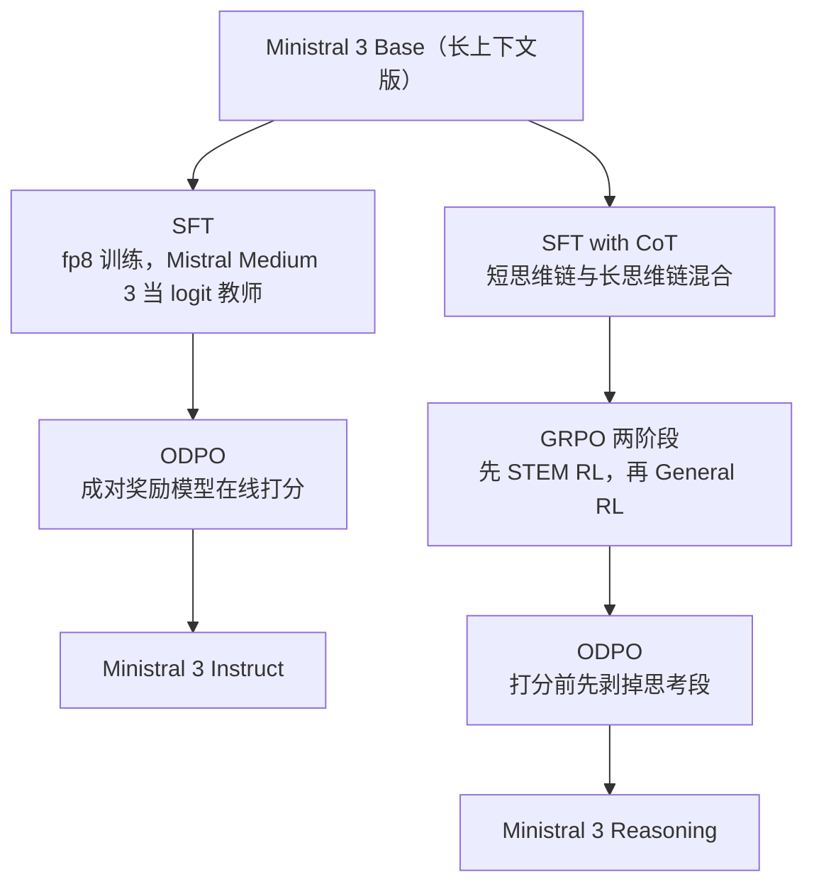

# Ministral 3：小模型不从零练起，而是从 24B 父模型上一刀一刀剪下来

<!-- release-date: 2025-12-02 -->

> 本文依据本地 `papers/Mistral/Ministral-3.pdf`，即 Mistral AI 的 **Ministral 3**，arXiv:2601.08584v1，2026-01-13 提交，共 14 页。页码均指 PDF 自身的页码。文中会区分三件事：**报告明确写了什么**、**我们怎么解释它**、**哪些是外部资料或本文推算**。

## 阅读前先认识几个词

- **稠密模型（dense）**：每个 token 都要跑完全部参数的模型，和只激活一部分专家的 MoE 相对。Ministral 3 全家都是稠密模型。
- **剪枝（pruning）**：把训练好的模型里不太重要的层、维度直接删掉，得到一个更小的模型。
- **知识蒸馏（knowledge distillation）**：让小模型（学生）去模仿大模型（教师）输出的整个概率分布，而不只学数据里的标准答案。教师的分布还告诉学生「第二可能、第三可能是什么」，信息更多。
- **logit**：模型在 softmax 之前给词表每个位置打的原始分数。对着 logit 蒸馏，学生拿到的是教师完整的概率轮廓。
- **GQA（Grouped Query Attention，分组查询注意力）**：多个查询头共用一套 Key/Value，省推理显存。
- **DPO / ODPO**：DPO（Direct Preference Optimization，直接偏好优化）用「这条比那条好」的成对数据直接调模型；ODPO 是它的在线版本，成对样本由当前模型现场生成。
- **GRPO（Group Relative Policy Optimization，组相对策略优化）**：对同一题采样一组回答，用组内相对好坏当优势信号的强化学习算法。

这份报告自己起的名字只有一个：**级联蒸馏（Cascade Distillation）**，即「剪枝 → 蒸馏 → 再剪枝」的循环。

## 一句话先说清

Ministral 3 要解决的不是「小模型不够聪明」，而是**造一个好的小模型，代价并不小**。

反直觉的地方在于：小模型不便宜。报告开篇就摆出对照，Qwen3 训了 36 万亿 token，Llama 3 训了 15 万亿（PDF p. 1）。token 数几乎不随模型变小而减少，参数少了，数据的账单没少。

Ministral 3 的回答是：**别从零开始**。Mistral 手里已经有一个训好的 24B 模型 Mistral Small 3.1。把它剪小，用它自己当老师把剪掉的能力补回来；补完再剪一次、再补一次，一路剪到 3B。报告称这样做出来的模型只训了 1–3 万亿 token，就与那些训练预算大得多的模型可比（PDF p. 1）。

如果只记一句话：

> **训练预算的大头不在「模型多大」，而在「从哪里出发」。有一个训好的父模型，起点本身就是最大的一笔算力。**

还要先说清这份文件的性质：正文约 10 页，其余是贡献者名单和参考文献。方法写得相当具体，连伪代码都给了两段；但数据、算力、超参几乎全部留白。它是一份**方法说明**，不是**复现手册**，这一点会贯穿后面所有判断。

## 先看全景：一条剪枝链，九个模型

图上两件事是后文的主线：**往下剪的是绿色的短上下文版本，不是紫色的最终 Base**；**第一刀只砍 FFN，后两刀才动深度和宽度**（后一点来自外部配置，见图注）。

三个 Base 出来之后，每个再分两条后训练支线（Instruct 与 Reasoning），于是一共 **9 个开源权重模型**：3 个尺寸 × 3 个变体，全部 Apache 2.0（PDF p. 2）。同场发布的大模型见 Mistral-Large-3 一篇。

架构本身没有新东西：decoder-only Transformer，GQA、RoPE、SwiGLU、RMSNorm（PDF p. 2–3）。三个尺寸的配置（PDF p. 2，Table 1）：

| 配置 | Ministral 3 14B | Ministral 3 8B | Ministral 3 3B |
|---|---:|---:|---:|
| 层数 | 40 | 34 | 26 |
| 隐藏维度 | 5120 | 4096 | 3072 |
| Q / KV 头 | 32 / 8 | 32 / 8 | 32 / 8 |
| FFN 维度 | 16384 | 14336 | 9216 |
| 输入输出嵌入共享 | 否 | 否 | 是 |
| 上下文 | 256K | 256K | 256K |

词表全家统一 131K。只有 3B 共享输入输出嵌入，理由是「避免嵌入参数在总参数里占比过大」（PDF p. 3）。算一下就明白：$131{,}072 \times 3072 \approx 4.0$ 亿，对 3B 来说一份嵌入就是七分之一左右，两份就是七分之二（本文算术）。

**视觉能力是现成的。** 所有尺寸都挂同一个 410M 参数的 ViT 视觉编码器，架构沿用 Pixtral，权重直接从 Mistral Small 3.1 Base 复制并**全程冻结**；只有 ViT 到语言模型的投影层被丢弃，为每个尺寸重新训练（PDF p. 3）。也就是说，**三个尺寸的「眼睛」完全一样，不一样的只是「脑子」**。这一点后面解释多模态成绩时用得上。

## 第一层矛盾：为什么「训练一个小模型」并不便宜

从零训练一个语言模型，算力大致是

$$
C \approx 6 \, N \, D
$$

$N$ 是参数量，$D$ 是训练 token 数（这是通用的经验公式，不是报告给出的）。模型变小，$N$ 确实小了；可 $D$ 并不跟着缩，要学会语法、常识、多语言、数学和代码，小模型照样得读十几万亿 token，业界的做法甚至是让小模型练得更久，把有限的容量填满。于是：大模型贵在参数，小模型贵在数据，两头都贵。

Ministral 3 的切入点是：**这些数据其实已经有人读过了，就凝固在 Mistral Small 3.1 的权重里。** 与其再读一遍，不如把那份权重当起点，把「学知识」换成「搬知识」。剪枝负责把结构缩小，蒸馏负责把被剪坏的部分补回来。

## 核心设计一：级联蒸馏，一次数据流里剪三刀

### 循环体只有三行

报告的伪代码直白到几乎不用解释（PDF p. 3，Algorithm 1）：

1. **剪**：把更大的已训练模型剪成目标尺寸，用剪出来的权重初始化子模型；
2. **补**：用教师的 logits 蒸馏，续训这个刚剪完的模型；
3. **再来**：对更小的目标尺寸重复。

剪枝方法参照 Minitron 和 Wanda 两条前人路线；**蒸馏教师对所有尺寸都固定为 Mistral Small 3.1**，不随子模型变小而更换（PDF p. 3）。报告还给了一个好用的换个角度：整条流水线可以看成 **「带权重剪枝的父模型持续预训练」** （PDF p. 3）。它不是三次独立训练，而是一次连续的训练，中间插了两次剪刀。

### 一次数据流，中途落剪刀

引自原文 Figure 2（PDF p. 3）。报告的文字说明是：**整个过程不重复用数据**，级联只把数据混合走一遍，剪枝发生在途中（PDF p. 3）。图上读得出三件事，都是我们的读图：

- **每一刀之后损失都猛跳，又很快回落**。剪枝造成的损伤主要在「一开始」，蒸馏修复得很快；
- **修复的平台随尺寸抬高**：14B 几乎贴着教师的损失线，8B 高一截，3B 再高一截。容量少了，蒸馏也补不满；
- **数据流大致按 0.3 / 0.3 / 0.4 切给三个尺寸**。

图注只写「Illustration of Cascade Distillation」，没说这是实测曲线还是示意，也没给横轴对应多少 token。一个报告没明说的推论是：如果按图上的切分、把整条流按 3 万亿算，14B 这一支读过约 1 万亿、3B 的祖先链读完了全部 3 万亿，恰好对上「1–3 万亿 token」这个区间（PDF p. 1）。这只是推测，报告没给各尺寸的 token 数。

### 最容易读漏的一处：往下传的是短上下文版本

每一跳其实产出**两个**检查点：16,384 上下文的短上下文检查点，以及在它基础上扩到 262,144 的最终 Base。**下一刀剪的是短上下文那个**（PDF p. 3 Algorithm 1、p. 4、p. 2 Figure 1）。长上下文扩展是一条支路，走到 Base 就结束。

为什么这样安排，报告**没有解释**。按工程常识推测：长上下文训练本身贵，如果每一跳都先扩到 256K 再剪，等于把最贵的一段做三遍；剪枝要在一批校准数据上统计激活，短序列上做更省。这是我们的推测。模式本身可以迁移：

> **把「昂贵的能力扩展」放在链条末端做成叶子，别让它进入要反复执行的主循环。**

### 省在哪里，证据在哪里

报告的说法是「相比每个小模型都从零训练，级联蒸馏在 FLOP 上显著更高效」（PDF p. 3），贡献列表里写的是「只用从零预训练成本的一小部分」（PDF p. 2）。直觉上省在三处：起点不是随机数，而是一个已经会说话的模型的子集，续训只需「修复」；蒸馏的监督是教师在整个词表上的分布，同样多的 token 传递的信息更多；三个尺寸共享一条数据流。

但要说清：**报告没有给任何一个 FLOP 数字**，没有和从零训练的对照，没有 GPU 小时。「显著更高效」是论断，不是测量。

## 核心设计二：剪刀落在三个轴上

一个 Transformer 可以从三个方向变小：变浅（层数）、变窄（隐藏维度）、变瘦（FFN 中间维度）。三刀各用一种重要性判据，在一个「很大的校准 batch」上统计（PDF p. 4，Algorithm 2）。

### 层剪枝：一层「改动了多少」的比值

旧做法（Minitron）是逐层做反事实：删掉某一层，看下游困惑度变差多少。准，但贵，有多少层就要跑多少次评测。Ministral 3 改用一个一次前向就能算的代理量，**层输出激活范数与输入激活范数之比**（PDF p. 4）。按 Algorithm 2 的写法是：

$$
r_\ell = \mathbb{E}_x\!\left[\frac{\lVert h_\ell^{\text{out}}(x)\rVert}{\lVert h_\ell^{\text{in}}(x)\rVert}\right]
$$

$h_\ell^{\text{in}}$、$h_\ell^{\text{out}}$ 是第 $\ell$ 层的输入和输出激活，$\mathbb{E}_x$ 是在校准数据上取平均；取 $r_\ell$ 最大的若干层保留。直觉是：残差网络里，一层如果几乎不改变残差流，删掉它代价也小。

两处要注意。其一，正文文字写的是「输入与输出激活范数之比」（ratio of input to output），伪代码算的却是 `output_norm / input_norm`，方向相反（PDF p. 4）；以伪代码为准，因为它与「保留 top-k」的写法自洽。其二，报告说这个代理「更简单但足够强」，却没有给它和反事实困惑度排序的一致性对比，「足够强」是作者的经验判断。

### 隐藏维度剪枝：全网共用一个 PCA 旋转

隐藏维度不能像层那样「删掉第 37 维」了事：残差流是贯穿全网的主干道，每一层都在同一份状态上读写，直接砍几维会砍出一个七零八落的模型。

做法是（PDF p. 4）：把**所有层**的注意力归一化层与前馈归一化层的输入激活拼在一起，做主成分分析（PCA），得到**一个在整个网络里一致的旋转矩阵**，把模型投影到更低维的空间，同时让保留的方差最大。拆成人话：先给整个网络换一套坐标系，让重要信息集中到前几维，再截掉后面的维度。**共用一个旋转**是关键，各层各转各的，层与层之间的接口就对不上了。

> **要压缩一个被多个模块共享的表示时，先换基、再截断，比直接按重要性挑维度更安全。**

报告没有给 PCA 保留了多少解释方差，也没说校准数据是什么，只提到「在一个验证集上」保留最关键的部分（PDF p. 4）。

### FFN 维度剪枝：量「这条通路平时有多活跃」

SwiGLU 前馈层是（PDF p. 4）：

$$
\mathrm{FFN}(x) = W_2\big(\mathrm{SiLU}(W_1 x) \odot W_3 x\big)
$$

$W_1$、$W_3$ 把输入升到中间维度，逐元素相乘后由 $W_2$ 降回来。中间维度就是要剪的轴。重要性是括号里那个乘积在每一维上的平均绝对值：

$$
s_j = \mathbb{E}_x\big[\,|\,\mathrm{SiLU}(W_1 x)_j \cdot (W_3 x)_j\,|\,\big]
$$

按 $s_j$ 取 top-k，保留 $W_1$、$W_3$ 对应的列与 $W_2$ 对应的行。三个矩阵共享这根轴，**必须用同一组下标一起删**，伪代码专门写出了这一点（PDF p. 4）。

### 没被剪的那个轴：注意力头

Table 1 里三个尺寸的 Q/KV 头都是 32 / 8（PDF p. 2），外部配置显示每头维度也都是 128。三刀**完全没碰注意力头**，注意力只是被动地随隐藏维变窄（$W_Q$ 的输入维从 5120 变到 3072）。KV 头数直接决定推理时 KV Cache 的大小，而报告的立意正是面向算力和显存受限的场景（PDF p. 1），它却没有讨论为什么不剪。我们的推测是：8 个 KV 头已是 GQA 的常见下限；保持头结构不变，也让父模型的注意力权重剪完仍「对得上」，蒸馏更好修。这只是推测。

### 第一刀为什么只砍 FFN

全景图里第一刀的标注来自外部配置：Mistral Small 3.1 与 14B 的层数、隐藏维完全相同，只把 FFN 从 32768 砍到 16384。这解释了引言里那句「14B Base 紧密匹配 Mistral Small 3.1 Base，同时小 40% 以上」（PDF p. 1）为什么能成立：深度和残差宽度都没动，只是每层的前馈瘦了一半，而前馈通常是参数大头。真正的结构性收缩发生在后两跳，后面 3B 的种种问题也正出现在那之后。这一段是外部补充加我们的解释，报告正文没有把父模型与子模型的配置并排列出。

## 蒸馏目标：只用 forward KL

剪完要把模型修回来。常见做法是把两个目标加权混合：学教师的分布，同时学数据的真实下一个词，配比是要调的超参。Ministral 3 的发现是：**只用 forward KL 蒸馏目标，比去调这个配比效果更好**（PDF p. 4）。

forward KL 是让学生分布 $q$ 去覆盖教师分布 $p$：

$$
\mathrm{KL}(p \,\Vert\, q) = \sum_{v} p(v) \log \frac{p(v)}{q(v)}
$$

$v$ 遍历整个词表。教师认为可能的词，学生必须给出不小的概率，否则惩罚很重；所以它是「覆盖优先」的目标，倾向于让学生把教师的整个概率轮廓摊开学下来。（公式与解释是背景知识，报告只写了结论。）

为什么去掉下一词预测反而更好，报告**没有解释**，也没给数据或曲线。一个合理的理解是：教师本来就在这类数据上训过，它的分布里已经包含了「真实答案」，而且是带置信度的平滑版本；再加一项 one-hot 目标，等于用更粗的形式把同一信息再灌一遍，还多一个超参。这是我们的解释。

蒸馏数据是纯文本与图文交错数据的混合（PDF p. 4），报告对数据的描述只有这一句。

## 长上下文：一条支路，没有评测

预训练分两段（PDF p. 4–5）：短上下文段 16,384；长上下文段从 16,384 扩到 262,144，方法是 **YaRN 加上注意力层里按位置调整的 softmax 温度**，报告引用了 Scalable-Softmax 与 Llama 4 两条来源（PDF p. 3、p. 5）。

从 16K 到 256K 是 16 倍。YaRN 是一种 RoPE 插值方案，负责让位置编码在没见过的长度上不失效；按位置调温度针对的是另一个问题：序列越长，注意力要把同一份概率分给越多位置，分布越来越平，模型「越看越糊」，于是随位置把注意力调锐一点。（这两句机制说明是背景知识。）外部配置与此一致：三个尺寸的 RoPE 都是 YaRN、倍数 16、原始长度 16384，并带一个 Llama 4 风格的缩放参数。

两个空白：

- 教师 Mistral Small 3.1 的官方配置上下文是 128K（外部补充），而学生这一段被训到 256K，教师照样是它（PDF p. 2 Figure 1）。报告没说长上下文段实际用多长的序列，也没说教师如何为更长的输入给出监督；
- **全篇没有任何长上下文评测**。三个尺寸都写着 256K，却没有一个数字告诉你这个长度下的检索或推理质量。

## 核心设计三：选谁当老师

这是全文最有信息量的一节（PDF p. 8–9，§5.1）。报告明说三条发现都是在**独立复现前人结论**（PDF p. 2），分别对应 Busbridge et al. 2025 与 Goyal et al. 2025。

### 发现一：更强的老师，预训练时反而更差

Mistral 手里有一个强得多的 Mistral Medium 3。直觉上它当老师应该更好，实测相反：**用 Mistral Small 3.1 蒸馏出来的 14B，在下游一致优于用 Mistral Medium 3 蒸馏的版本**，而且这还是在**没有对齐 FLOP** 的设置下（PDF p. 9）。报告把它归到**容量鸿沟（capacity gap）**：师生差距太大时，教师的分布学生学不来（PDF p. 2）。

Figure 3（PDF p. 8）是 14B 在六个基准上的柱状图，没有数值标注。我们的读数：

| 基准 | MS3.1 教师 | Medium 3 教师 |
|---|---:|---:|
| MMLU-Redux | ≈0.77 | ≈0.765 |
| HellaSwag | ≈0.77 | ≈0.77 |
| TriviaQA | ≈0.555 | ≈0.55 |
| MATH | ≈0.38 | ≈0.37 |
| AGI-EVAL | ≈0.57 | ≈0.545 |
| Winogrande | ≈0.73 | ≈0.73 |

（读自 PDF p. 8 Figure 3，纵轴从 0.3 起，没有误差棒。）方向确实六项一致，但幅度很小：最大的 AGI-EVAL 约 2 个百分点，其余多在 1 个百分点以内。准确的说法是**方向一致、幅度很小、没有量化**，而纵轴从 0.3 起又在视觉上放大了差距。

后半句同样重要：**到了后训练，用更强的 Mistral Medium 3.1 蒸馏是有好处的**（PDF p. 9），所以 SFT 阶段换了老师（PDF p. 5）。合起来：

> **容量鸿沟是分阶段的。预训练要让学生建立自己的表示，教师太强会压过它；后训练要让学生学会一种行为，教师越强越好。**

### 发现二：预训练就该用 Instruct 版老师

在**预训练**阶段就用**后训练过的**教师，而不是它的 Base 版，学生更强（PDF p. 9）。Figure 4 是 3B 的消融，纵轴从 0 起，我们的读数：

| 基准 | MS3.1 Base 教师 | MS3.1 Instruct 2506 教师 |
|---|---:|---:|
| MMLU-Redux | ≈0.685 | ≈0.69 |
| HellaSwag | ≈0.70 | ≈0.70 |
| TriviaQA | ≈0.425 | ≈0.43 |
| MATH（maj@4） | ≈0.40 | ≈0.555 |
| MBPP | ≈0.565 | ≈0.59 |
| MMMU | ≈0.48 | ≈0.49 |

（读自 PDF p. 9 Figure 4。）报告自己的概括与图一致：对数学和代码影响大，对多模态影响小而一致，对知识类影响可忽略（PDF p. 9）。

模式很好解释：知识类几乎不动，因为 Base 教师本来就会，后训练没往里加事实；数学一骑绝尘，因为 MATH 这类题的收益主要来自「按步骤展开、把中间结果写出来」这种**行为**，而这正是后训练教出来的。**从 Instruct 教师蒸馏，等于在预训练阶段就提前注入了一部分后训练的行为。**（这是我们的解释。）

### 发现三：偏好对齐过的老师更好

用两个内部版本的 Mistral Medium 3 对比，一个只做过 SFT、一个做过偏好对齐，在学生的 SFT 阶段蒸馏：结论是后者 **「总是显著更好」，且收益在学生自己做完偏好对齐后仍在** （PDF p. 9）。

这一条**没有图、没有任何数字**，只有一句定性判断，是三条里证据最薄的。

## 后训练：两条支线，共用一个 ODPO 收尾

按 PDF p. 2 Figure 1 右半与 §3.2–3.3 重画，是流程示意。**Reasoning 不接在 Instruct 之后，两条线都从长上下文 Base 出发**，报告明写推理后训练「从预训练检查点开始，而不是 ODPO 变体」（PDF p. 5）。两条线互不干扰，代价是通用能力要各练一遍。

### Instruct 线：SFT 换老师，ODPO 用软标签

**SFT**（PDF p. 5）：用 fp8 量化训练；仍然带 logit 蒸馏损失，但**教师换成 Mistral Medium 3**；视觉编码器继续冻结，只训适配器。这正是发现一后半句在配方里的落地：同一条流水线的两个阶段用了两个老师，因为要搬的东西不一样。

**ODPO**（PDF p. 5）有四处具体改动：

1. **在线采样**：每个样本从**当前策略**采两个候选，温度 $T = 0.7$，再用一个文本奖励模型排序。离线数据反映的是别的模型的错误；在线采样让训练信号对准这个模型此刻真正会犯的错。
2. **成对奖励模型（Pairwise Reward Model，PWRM）**：给定对话历史和两个候选，直接预测哪个更好，用结构化成对数据 SFT 训出来。
3. **软标签**：把 PWRM 的二项概率输出接进损失，用**双边损失**按「被偏好的概率」给每条回答加权，代替硬的赢家 / 输家标签。PWRM 只有 55% 把握时，这条样本的推力就该比 95% 时小（例子是我们的）。
4. **两处稳定化**：调 PWRM 的温度来校准胜负概率；用一种 $\beta$ 重缩放让损失对 $\beta$ 的取值更不敏感。报告没给损失的具体形式，也没给 $\beta$ 取值。

还有一条很工程的做法：**采样中出现无限循环的回答自动判为输家**。报告说在线变体对缓解「无限生成」这类模型自身产生的伪影特别重要（PDF p. 5）。这类坏行为在离线偏好数据里根本不会出现，因为那些数据不是这个模型生成的；只有让模型自己犯一次，才能用偏好信号把它压下去。ODPO 阶段还开启了工具执行，报告称这提升了工具使用表现；并称在线偏好优化相对 SFT 和离线变体都显著提升了与人类偏好的一致性（PDF p. 5），这句没附数字。

> **奖励模型给的是概率，不是判决。把置信度直接带进损失，比先阈值化成硬标签再训练浪费的信息少。**

### Reasoning 线：SFT、GRPO、ODPO 三段

**SFT**（PDF p. 5）混合短思维链和长思维链：短的来自通用 SFT 数据，长的是推理轨迹，前面加一段推理专用的系统提示。轨迹覆盖数学、代码、通用对话、指令遵循、多语言、工具使用和视觉推理；过滤是「轻量」的，只去掉格式糟糕、重复过多、语言乱切换的样本。

**3B 在这里出了事故。** 报告直说：3B 用普通 SFT 得到的模型「脆弱、过度冗长，输出里大量重复和无限生成」；补救是拿 Magistral Small 1.2 当教师做 logit 蒸馏，这才压住冗长、稳住了后续 RL（PDF p. 6）。同一份配方在 14B、8B 上走得通，到 3B 要额外打补丁。

**GRPO** 分两段，配方沿用 Magistral 的做法（Rastogi et al. 2025）（PDF p. 6）：

- **STEM RL**：数学、代码、视觉推理，题目来自开源与自有来源，经多步流水线过滤掉无效、不完整以及太简单或太难的题；
- **General RL**：扩到通用对话、指令遵循、开放式推理。为每个提示生成**原子化的评分细则（atomic grading rubrics）**，训练时由 LLM 裁判逐条核对（例如是否忠于提示、回答质量），**奖励等于满足的细则比例**。报告说这一段提升了指令遵循与通用对话，同时 STEM 成绩「保持，有时甚至提升」。

把一个模糊的「好不好」拆成一串能逐条打钩的小条件，再用比例当奖励，就把主观判断变成了稳定、稠密的信号。

还有一条很朴素的观察：**最大生成长度从 32K 提到 80K**，因为 RL 期间有「不可忽略比例」的生成被截断；放开之后，模型能把最难的题想完，成绩又涨了一截（PDF p. 6）。长思维链的 RL 里，**截断不是中性的工程限制**：一条本来能做对的轨迹被砍断，会被当成失败样本，直接污染奖励。

**ODPO** 与 Instruct 线相同，只改一处：**送给奖励模型打分前，先把思考段剥掉**（PDF p. 6）。奖励模型评的应该是最终回答，而不是写给模型自己看的草稿。

报告在 §5.3 给了这一步的效果（PDF p. 10，Figure 6）：推理模型擅长难题，但通用对话质量常常落后，所以在 GRPO 之后加 ODPO。图上没有数值，我们的读数（左为 GRPO 后，右为 ODPO 后）：

| 尺寸 | ArenaHard | EQBench | WildBench |
|---|---|---|---|
| 14B | ≈25 → ≈41 | ≈12.5 → ≈43.5 | ≈55 → ≈63.5 |
| 8B | ≈20 → ≈39.5 | ≈19.5 → ≈34 | ≈56.5 → ≈63.5 |
| 3B | ≈15 → 基本不变 | ≈14 → ≈16 | ≈47 → ≈49 |

（读自 PDF p. 10 Figure 6 的叠加柱。）14B 与 8B 大幅提升；3B 在公开基准上没有显著改善，他们是靠内部人工评测更好，才选了 ODPO 检查点作为发布版本（PDF p. 10）。

## 评测数字真正说了什么

所有对比模型都用 Mistral 自己的评测流水线、同一配置重跑（PDF p. 6–7）。这一点值得肯定，直接抄别人报告里的数字是常见的不公平来源。

### Base：同档对比

Table 2（PDF p. 7）的要点：14B 在 TriviaQA（74.9 对 70.3）和 MATH（67.6 对 62.0）上超过 Qwen 3 14B，其余接近，且全面好于 Gemma 3 12B；8B 除 TriviaQA 外都超过更大的 Gemma 3 12B；3B 对 Qwen 3 4B 是 TriviaQA、MATH 赢（MATH 60.1 对 40.5），MMLU-Redux、AGIEval、多语言 MMLU 输。报告的说法是 3B 这一档「差距变得更明显」（PDF p. 7）。

### 学生在数学上反超了老师

Table 3（PDF p. 7）把 Base 全家和 24B 教师并排。最扎眼的是 MATH：教师 55.8，14B 67.6、8B 62.6、3B 60.1，**三个学生全部超过教师**。GPQA Diamond 上 14B、8B 都是 39.9，高于教师的 36.9；MMMU 上 14B 的 59.9 高于教师的 59.1。报告对这个现象**一句评论都没有**。

结合发现二，最可能的解释是：**预训练蒸馏用的是后训练过的教师**，而 Figure 4 显示 Instruct 教师能把 3B 的 MATH 从约 0.40 拉到约 0.55，量级正对得上。表里那一列「Mistral Small 24B」则多半是 Base 版（引言拿 14B 与「Mistral Small 3.1 Base」相比，PDF p. 1）。所以更可能是**学生学的是老师的成品行为，却在和老师的半成品比**。但必须说清：§3.1 只写教师是「Mistral Small 3.1」，**从头到尾没有指明最终配方用的是 Base 还是 Instruct 版**，Table 3 也没标那一列是哪个版本。上面是推断。

### 保留率：知识先掉，技能后掉

把 Table 3 换成「相对教师的保留率」（**本文用 PDF p. 7 Table 3 的数字计算，报告没有这一列**）：

| 评测 | 考什么 | 14B | 8B | 3B |
|---|---|---:|---:|---:|
| MATH | 解题过程 | 121% | 112% | 108% |
| MBPP | 代码生成 | 100% | 98% | 88% |
| ARC-Challenge | 常识推理 | 98% | 96% | 93% |
| MMLU | 广谱知识 | 98% | 94% | 87% |
| MMMU | 多模态理解 | 101% | 93% | 89% |
| TriviaQA | 事实记忆 | 94% | 86% | 75% |
| NaturalQS | 开放域事实 | 87% | 75% | 64% |
| MathVista | 多模态数学 | 85% | 70% | 45% |

三件事：

1. **事实记忆最先塌。** TriviaQA 和 NaturalQS 是纯记忆题，保留率跌得最快。事实存在参数里，参数少了就装不下，蒸馏也搬不动。
2. **过程性技能几乎不掉，甚至变好。** MATH 三个尺寸都超过 100%，会不会解题更多取决于学到了正确的展开方式。
3. **多模态数学塌得最狠。** MathVista 从 85% 一路跌到 45%，比 MMMU 陡得多。三个尺寸的视觉编码器是同一个、冻结不变（PDF p. 3），所以这个塌方与「眼睛变差」无关，全部发生在语言模型和新训的投影层上。MathVista 要先看懂图、再在图上做多步推理，是全套评测里**复合度最高**的任务。模型变小时，最先失守的不是某个单项，而是**把两种能力串起来**的能力。

以上三条是我们对表的解读，报告只说了一句「性能随尺寸平滑缩放，剪枝后的模型保留了教师的大部分能力」（PDF p. 7 表注）。

> **压缩模型前，先问这个能力是存在参数里还是存在行为里。存参数的会随体积消失；存行为的能靠蒸馏几乎完整搬走；需要多种能力串联的复合任务，掉得比任何单项都快。**

### Instruct 与 Reasoning

Table 4（PDF p. 8）：14B 的 Instruct 在 Arena Hard（55.1 对 42.7）、WildBench、MATH 上都高于不开思考的 Qwen3 14B；8B 与 Qwen3-VL-8B 互有胜负（WildBench、MM MTBench 略高，Arena Hard 与 MATH 较低）；3B 的 Arena Hard 只有 30.5，低于 Qwen3-VL-4B 的 43.8，甚至低于 Gemma3-4B 的 31.8。这一档的对手都是 4B，比它大。

Table 5（PDF p. 8）是推理版对 Qwen 3 推理版：

| 基准 | Qwen 3 14B | Ministral 3 14B | Qwen3-VL 8B | Ministral 3 8B | Qwen3-VL 4B | Ministral 3 3B |
|---|---:|---:|---:|---:|---:|---:|
| AIME 2024 | 83.7 | 89.8 | 86.0 | 86.0 | 72.9 | 77.5 |
| AIME 2025 | 73.7 | 85.0 | 79.8 | 78.7 | 69.7 | 72.1 |
| HMMT 2025 | 55.8 | 67.5 | 57.5 | 55.8 | 50.8 | 51.7 |
| GPQA Diamond | 66.3 | 71.2 | 67.1 | 66.8 | 60.1 | 53.4 |
| PhyBench | 22.0 | 26.0 | 22.0 | 20.0 | 9.0 | 15.0 |
| LiveCodeBench v6 | 59.3 | 64.6 | 58.0 | 61.6 | 51.3 | 54.8 |

14B 六项全胜，HMMT 2025 与 AIME 2025 领先 11 分以上；8B 六项里只赢 LiveCodeBench、打平 AIME 2024，其余略低；3B 对 4B 赢五项，GPQA Diamond 输得多（53.4 对 60.1）。报告正文对这张表只字未评，输的地方照实列出。

**口径要看清**：Table 5 报的是 **pass@16**，LiveCodeBench 是 **pass@5**，报告的理由是降低方差（PDF p. 8）。采 16 次有一次对就算对，分数会明显高于日常单次使用的体验，不能和别家报告的 pass@1 混着比。

## 冗长度被当成设计目标，而不是副作用

引自原文 Figure 5（PDF p. 9）。14B 与 8B 的 Instruct 用大约十分之一的输出长度，拿到了与 Qwen3-VL 8B 相当或更高的 GPQA Diamond 准确率；3B 则明显低于 Qwen3-VL 4B。报告给的原因是：**Ministral 3 Instruct 的后训练没有在 General RL 之前做 Reasoning RL，而 Qwen 3 做了**，这「可能」导致两者冗长度不同（PDF p. 9）。这是作者的归因，图只呈现了相关性。

另外，图注写「with Ministral 3 instruction-following and reasoning」，图上却只有 Instruct 模型。

紧接着是一段实验记录（PDF p. 10）：他们试过往 Instruct 的 SFT 数据里掺不同比例的长思维链，配上精心设计的系统提示。**长思维链比例越高，STEM 成绩越好，但模型开始过度反思、自言自语、反复回溯**。报告贴了一段真实输出，满是「Wait, ...」「Wait, but let's check another way ...」这样的自我打断。作者的判断是：对通用聊天模型，这种行为「不受欢迎、不自然」。于是选择**不掺**，把长思维链留给 Reasoning 变体。

> **同一个改动在基准上是收益，在产品体验上可能是代价。两者冲突时，先想清楚这个模型的角色，而不是默认追分。**

## 3B 是这条链上最脆的一环

把散落各处的证据拼起来，3B 有四条独立线索：

1. **普通 SFT 失败**：脆弱、冗长、重复、无限生成，只能靠 Magistral Small 1.2 蒸馏来救（PDF p. 6）；
2. **ODPO 在公开基准上几乎无效**，靠内部人工评测才选定发布版本（PDF p. 10）；
3. **对超参更敏感**：脚注直说 3B base 在微调时比 14B、8B 更敏感（PDF p. 10 脚注 4）；
4. **损失平台最高**：Figure 2 上 3B 那一段修复后离教师的损失线最远（PDF p. 3）。

但核心问题没有答案：**3B 的疲软是因为它只有 3B，还是因为它是级联的第三跳？** 报告没有「从 24B 直接一刀剪到 3B」的对照，也没有「从 8B 单跳剪到 3B」的对照。而这恰恰是方法名里「级联」二字唯一的卖点。整篇报告论证了「剪枝加蒸馏有效」，却没有论证 **「多跳比单跳更好」** 。

## 报告承认的限制，和报告没说的事

报告**没有 Limitations 一节**。下面是原件里确实没有的东西，按类压成一张表：

| 类别 | 给了什么 | 没给什么 |
|---|---|---|
| 数据 | 「纯文本与图文交错数据的混合」一句（PDF p. 4）；总量 1–3 万亿 token（PDF p. 1） | 来源、配比、去重、质量过滤、合成占比、多语言比例、污染检查；各尺寸各分到多少 token |
| 算力与成本 | 「显著更 FLOP 高效」「只用一小部分成本」的文字（PDF p. 2–3） | 任何 FLOP、GPU 型号与卡数、时长；与从零训练的对照 |
| 训练系统 | SFT 用 fp8（PDF p. 5） | 并行、通信、算子、容错 |
| 超参 | ODPO 采样温度 0.7（PDF p. 5）；RL 生成上限 32K → 80K（PDF p. 6） | 学习率、batch、调度、优化器；GRPO 组大小与裁剪；DPO 的 $\beta$ 与损失形式 |
| 剪枝 | 三种判据与伪代码（PDF p. 4） | 校准数据与规模；PCA 保留的方差；每一跳的剪枝比例依据；三刀各自贡献的消融 |
| 方法验证 | 教师选择的两张图（PDF p. 8–9） | 级联多跳对单跳直剪；剪枝加蒸馏对从零训练；范数比值对反事实困惑度 |
| 评测 | 五张表、四张图 | 长上下文评测（尽管写着 256K）；安全与偏见评测；延迟、吞吐、显存、量化后表现；引言提到的 Mistral Small 3.2 2506 的对比表 |
| 版本 | 教师是「Mistral Small 3.1」 | 最终预训练配方用的是 Base 版还是 Instruct 版 |

最后一类尤其要紧：面向「算力与显存受限」场景的报告，却没有给推理侧的任何实测。

### 原件内部的前后不一致

- **推理模型的上下文长度**：引言写「256K（推理模型为 128K）」（PDF p. 1），Table 1 与结论都写 256K（PDF p. 2、p. 11）。外部补充：官方 [Ministral-3-14B-Reasoning-2512](https://huggingface.co/mistralai/Ministral-3-14B-Reasoning-2512) 的配置是 262144，所以引言的 128K 更像笔误。
- **后训练教师是 Medium 3 还是 3.1**：§3.2.1 写 Mistral Medium 3（PDF p. 5）；§5.1 同一段先说 Medium 3、脚注却链到 Medium 3.1 的文档页，下一句又写 Medium 3.1（PDF p. 9）；结论写 Medium 3（PDF p. 11）。读者无法确定预训练消融里那个「更强的教师」和后训练实际用的是不是同一个。
- **层剪枝比值的方向**：文字是「输入比输出」，伪代码是「输出比输入」（PDF p. 4）。
- **图注与图对不上**：Figure 4 的图注说比较了 Base 与后训练（instruct/reasoning）教师，图例里只有 Base 和 Instruct 2506（PDF p. 9）；Figure 5 的图注提到 reasoning，图上一个 Reasoning 模型都没有（PDF p. 9）。
- **图里的基准不在 §4 的评测清单里**：HellaSwag、Winogrande（Figure 3）、EQBench（Figure 6）（PDF p. 6、p. 8、p. 10）。
- 几处文字疏漏：「a two-stages」（PDF p. 4）、「input to to」（PDF p. 4）、§5.1 第三段以孤立的「Post」开头（PDF p. 9），贡献者名单里「Tom Bewley」连列两次（PDF p. 11）。都不影响技术内容。

## 哪些结论有证据，哪些只是作者观察

| 结论 | 证据 | 强度 |
|---|---|---|
| 预训练时 MS3.1 教师优于 Medium 3 | Figure 3，14B，六个基准（PDF p. 8） | 方向一致，幅度 1–2 个百分点，无数值、无误差棒 |
| 预训练时 Instruct 教师优于 Base 教师 | Figure 4，3B，六个基准（PDF p. 9） | 纵轴从 0 起，MATH 差距大且可解释，三条教师结论里最扎实 |
| ODPO 大幅提升 14B、8B 的对话基准 | Figure 6（PDF p. 10） | 增量清楚；3B 无提升也照实画出 |
| 与同档开源模型的相对位置 | Table 2–5（PDF p. 7–8） | 同一流水线重跑，是报告最规范的部分；推理表是 pass@16 |
| 级联蒸馏比从零训练显著更省 | 文字（PDF p. 2–3） | 无数字、无对照 |
| **多跳级联优于单跳直剪** | 无 | 方法名的核心词，没有实验 |
| 范数比值是好用的层重要性代理 | 文字（PDF p. 4） | 无与旧方法的一致性对比 |
| 只用 forward KL 优于调配比 | 文字（PDF p. 4） | 无数据、无曲线 |
| 偏好对齐过的教师「总是显著更好」 | 文字（PDF p. 9） | 无图无数 |
| Instruct 输出短是因为没做 Reasoning RL | Figure 5 与一句归因（PDF p. 9） | 相关性，非受控实验 |
| 长思维链让 Instruct 过度反思 | 定性描述加一段样例（PDF p. 10） | 无量化 |

## 最值得带回自己项目的六条

### 1. 训练预算的大头是起点

有一个训好的父模型，就等于已经买下了十几万亿 token 的算力。剪枝加蒸馏，本质是把这笔已经付过的钱再花一次。对任何有自家基座的团队都成立。

### 2. 压缩前先分清「知识」和「行为」

事实型能力随体积消失（NaturalQS 保留率 64%），过程型能力能被蒸馏搬走（MATH 保留率 108%），复合任务掉得最快（MathVista 保留率 45%）。这决定了小模型该放在什么场景：让它基于给定材料推理，比让它自己知道答案靠谱得多。

### 3. 教师要按阶段选

预训练怕容量鸿沟，教师太强反而差；后训练要传行为，教师越强越好；而且预训练阶段就可以用后训练过的教师，提前把行为灌进去。

### 4. 共享的表示，先换基再截断

隐藏维度被全网共用，所以用一个全网一致的 PCA 旋转把信息集中到前几维再截断。凡是「多个模块读写同一份状态」的地方都能用这个套路。

### 5. 把奖励模型的概率当概率用，并让模型自己犯错

PWRM 的二项输出直接进损失，比阈值化成硬标签省信息；在线采样能抓到离线数据里根本不存在的失败模式，比如无限生成。

### 6. 长思维链的 RL，先查截断率

生成上限从 32K 放到 80K 就有额外收益，因为原本被砍断的正确轨迹不再被当成失败。调算法之前，先确认奖励没有被截断污染。

还有一条阅读方法：**方法名里最响亮的那个词，往往正是消融最薄的地方。** 这份报告叫级联蒸馏，而「级联」恰恰是唯一没有对照实验的部分。

## 关键词回看

- **级联蒸馏（Cascade Distillation）**：剪枝 → 蒸馏 → 再剪枝，一条数据流从 24B 走到 3B，教师全程是 Mistral Small 3.1。
- **短上下文检查点往下传**：每一跳的 16K 版本是下一刀的输入，256K 的 Base 是叶子。
- **三刀剪枝**：层剪枝（输出 / 输入激活范数比）、隐藏维度剪枝（全网共用的 PCA 旋转）、FFN 剪枝（SwiGLU 乘积的平均绝对值）；注意力头不剪。
- **forward KL 单目标**：只用蒸馏目标，不混下一词预测。
- **YaRN + 按位置的 softmax 温度**：把 16K 扩到 256K 的两件工具。
- **容量鸿沟（capacity gap）**：预训练时教师太强，学生反而学不好；后训练不受此限。
- **ODPO + PWRM**：在线采两条、成对奖励模型打分、用软标签的双边损失，无限循环直接判负。
- **原子化评分细则（atomic grading rubrics）**：把「回答好不好」拆成能逐条打钩的条件，满足比例即奖励。
- **保留率**：学生分数除以教师分数，本文用它区分知识型与行为型能力。

## 最后的判断

这份报告值得读，但要读对地方。

**它做对的事**：把一个真实可用的压缩配方写得足够具体，两段伪代码、三种剪枝判据、一个明确的蒸馏目标、四处 ODPO 改动、两阶段 GRPO，都能拿去实现；三条教师结论虽是复现前人，放在一起构成一条清晰的判断线；评测全部自己重跑，输的地方照实列出。

**它没做的事**：没有一个数字支撑「省了多少算力」这个核心卖点；没有一个实验验证「级联」这个方法名；没有一行数据描述；没有一项长上下文评测，尽管架构表上写着 256K。

证据强度分三层：**有对照的**是两张教师消融图、ODPO 效果图和五张同流水线重跑的评测表；**只有作者观察的**是 FLOP 效率、forward KL 更优、偏好对齐教师更好、冗长度的归因；**完全没公开的**是数据、算力、超参、剪枝比例、最终教师版本和长上下文质量。

如果只带走一句：

> **小模型的成本大头从来不在参数，而在数据。Ministral 3 的答案是，那笔钱可以只付一次，再沿着一条链一路花下去；至于这条链是不是非得「级联」，报告还欠一个对照。**

## 资料与阅读边界

**原始依据**

- 本地 `papers/Mistral/Ministral-3.pdf`，即 arXiv:2601.08584v1（2026-01-13 提交），14 页。全文所有带 `(PDF p. N)` 的数字都出自这一版。

**版本核查**

- arXiv 论文页 [arXiv:2601.08584](https://arxiv.org/abs/2601.08584) 只有 v1，与本地 PDF 一致。

**首发日证据**

- 官方博客 [Introducing Mistral 3](https://mistral.ai/news/mistral-3) 标注 2025-12-02，同时发布 Mistral Large 3 与 Ministral 3 的 14B / 8B / 3B。
- 官方权重仓库 `mistralai/Ministral-3-14B-Base-2512` 的 main 分支首个提交在 2025-12-02；仓库 `createdAt` 为 2025-10-31，是提前预置，不作为首发日。
- 因此 `release-date` 取 **2025-12-02**，而不是 arXiv 提交日 2026-01-13。

**外部补充（不是报告内容）**

- 官方 `config.json`：[Mistral-Small-3.1-24B-Base-2503](https://huggingface.co/mistralai/Mistral-Small-3.1-24B-Base-2503)、[Ministral-3-14B-Base-2512](https://huggingface.co/mistralai/Ministral-3-14B-Base-2512)、[Ministral-3-8B-Base-2512](https://huggingface.co/mistralai/Ministral-3-8B-Base-2512)、[Ministral-3-3B-Base-2512](https://huggingface.co/mistralai/Ministral-3-3B-Base-2512)、[Ministral-3-14B-Reasoning-2512](https://huggingface.co/mistralai/Ministral-3-14B-Reasoning-2512)。用于：全景图里每一刀剪掉的维度（24B 为 40 层、隐藏维 5120、FFN 32768）、每头维度 128、教师上下文 128K、学生 RoPE 为 YaRN 倍数 16，以及推理版上下文 262144。
- Figure 3、4、6 的数值与对 Figure 2、5 的读图，是本文从 PDF 页面读出的，报告未标注数值。
- 保留率表、嵌入参数占比、「按 3 万亿推算各尺寸 token」等，是本文用报告数字做的算术或推测。
- $C \approx 6ND$、forward KL 的公式与性质、YaRN 与温度缩放的机制说明是背景知识，报告没有写出。
