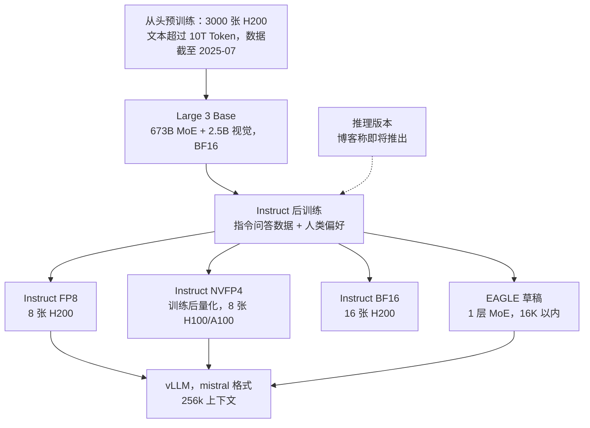

# Mistral Large 3：DeepSeek-V3 的骨架，专家少一半、宽一倍，配方留在门里

<!-- release-date: 2025-12-02 -->

> 本文依据两份网页原件，访问日期 2026-09-30：Mistral AI 官方博客 **Introducing Mistral 3**（2025-12-02，<https://mistral.ai/news/mistral-3>），以及 Hugging Face 上的 **Mistral-Large-3-675B-Instruct-2512** 模型卡（<https://huggingface.co/mistralai/Mistral-Large-3-675B-Instruct-2512>）。博客没有小节编号，下文用小节名做锚；模型卡同理。截至访问日，Mistral Large 3 **没有技术报告**。文中区分三件事：**原件明确写了什么**、**我们怎么解释它**、**哪些来自官方附属文件、权重配置或第三方**。

## 阅读前先认识几个词

- **MoE（Mixture-of-Experts，混合专家）**：把一层前馈网络拆成很多个小网络（专家），每个 Token 只让其中少数几个干活。总参数可以很大，单个 Token 的计算量却不必跟着涨。
- **激活参数**：一个 Token 前向时真正参与计算的参数量。Large 3 对外写 675B 总参数、41B 激活。
- **共享专家**：每个 Token 都必经、不参与路由挑选的专家。
- **MLA（Multi-head Latent Attention，多头潜在注意力）**：DeepSeek-V2 提出的注意力。它把每个 Token 要缓存的 Key 和 Value 压成一条短的潜向量，推理时不必把它还原（机制见 DeepSeek-V2 一篇）。
- **NVFP4**：NVIDIA 在 Blackwell 上原生支持的 4 bit 浮点格式，每 16 个数共用一个 FP8 缩放因子。
- **投机解码（speculative decoding）与 EAGLE**：先用一个很小的草稿模型连猜几个 Token，大模型一次性验证，猜对的部分等于白赚了几步解码。
- **模型卡（model card）**：权重仓库首页的说明文档，给规格、用法和限制，一般不讲训练过程。

## 一句话先说清

Mistral Large 3 是 Mistral 自 Mixtral 之后的第一个 MoE 旗舰：675B 总参数、41B 激活，用 3000 张 H200 从头训练，Base 与 Instruct 都以 Apache 2.0 开源（原文「Mistral Large 3: A state-of-the-art open model」）。

把原件和它附带的权重配置放在一起读，能读出三件事：

1. **架构几乎就是 DeepSeek-V3 的骨架**。注意力的每一个维度都与 V3 相同；MoE 每层的专家总容量也相同，只是把 256 个窄专家换成 128 个宽一倍的专家，每个 Token 从选 8 个改成选 4 个。这一条原件没写，来自权重配置与 Mistral 员工在模型仓库讨论区的回复。
2. **训练配方基本不公开**。博客只给了「3000 张 H200、从头训练」；博客链到的官方合规文件多给了一层粗粒度的数据画像（文本超过 10T Token、数据截至 2025 年 7 月），但没有配比、超参与消融。
3. **原件最厚的部分是部署**：三种精度的权重、每种精度对应哪档节点、vLLM 启动命令、EAGLE 草稿模型、运行时推荐设置，外加官方自己承认的三条限制。

如果只记一句话：

> **当架构借自公开骨架、配方又不公开时，一个开源旗舰能拿出来比的，只剩「专家怎么切」这一个结构选择，和「你能不能在自己的机架上把它跑起来」。**

## 先看原件给了什么

官方公开物分散在五处。先把它们各自能回答什么摆清楚，后文每个数字都从这里取：

| 来源 | 给了什么 | 没给什么 |
|---|---|---|
| 博客 Introducing Mistral 3 | 定位、3000 张 H200、Base 与 Instruct 评测图、LMArena 名次、NVFP4 与 vLLM / NVIDIA 合作、上线渠道、API 价格 | 架构细节、训练数据、超参 |
| Instruct / Base / NVFP4 / Eagle 四张模型卡 | 673B + 2.5B 的模块拆分、能力清单、部署节点、vLLM 命令、推荐设置、三条已知限制；评测图与博客相同 | 训练过程 |
| 各仓库 `params.json` | 完整结构超参、量化范围、上下文扩展参数 | 为什么这样选 |
| AI Governance Hub 上两份合规文件（博客「Next Steps」小节链接） | 参数量区间、输入上限、数据来源类别与规模档位、数据采集截止月份、开源部署所需硬件 | 精确 token 数、配比、训练步骤 |
| 模型仓库讨论区的官方回复 | 与 DeepSeek-V3 的关系 | — |

后三类不属于博客与模型卡正文。`params.json` 是官方随权重发布的配置文件，合规文件是博客直接链到的官方文档，讨论区回复来自 Mistral 员工账号；下文用到它们时都会标明出处。

## 全景：一个 61 层的 MLA + MoE，再挂一个 2.5B 视觉编码器

模型卡「Key Features」把 Large 3 拆成两个部件：**673B 参数、39B 激活的细粒度 MoE 语言模型**，加一个 **2.5B 的视觉编码器**。「细粒度（granular）」是官方的原词，模型卡没有解释它具体指什么。

下面的结构数字全部来自 Instruct 仓库的 `params.json`，并与 DeepSeek-V3 的 `config.json` 并排：

| 量 | Mistral Large 3 | DeepSeek-V3 | 在系统里干什么 |
|---|---:|---:|---|
| 层数 | 61 | 61 | Transformer 层数 |
| 隐藏维度 | 7168 | 7168 | 残差流宽度 |
| 注意力头数 | 128 | 128 | — |
| Query 压缩维度 | 1536 | 1536 | MLA 的查询低秩 |
| KV 压缩维度 | 512 | 512 | MLA 缓存的潜向量宽度 |
| 每头维度（内容 + 位置） | 128 + 64 | 128 + 64 | 解耦 RoPE 的两条通道 |
| Value 每头维度 | 128 | 128 | — |
| 前几层保持稠密 | 3 | 3 | 之后各层才换成 MoE |
| 稠密层 FFN 中间维度 | 16384 | 18432 | — |
| 路由专家数 × 中间维度 | 128 × 4096 | 256 × 2048 | 每层专家池 |
| 每 Token 选几个路由专家 | 4 | 8 | Top-k |
| 共享专家 | 1 个，宽 4096 | 1 个，宽 2048 | 每个 Token 必经 |
| 路由打分 | softmax，不分组 | sigmoid，8 组里先挑 4 组 | 见下文 |
| 词表 | 131072 | 129280 | — |

注意力部分一个数都没变。所以 MLA 的全部推导，包括矩阵吸收与解耦 RoPE，都可以直接照 DeepSeek-V2 一篇去理解，这里不重复。

这张表不是我们硬凑的对照。有用户在模型仓库讨论区问 Large 3 是不是在 DeepSeek-V3 0324 上继续训的，Mistral 员工回复说：Large 3 的专家「更少但更胖」，所以**不是**在 V3 上训的；另外 RoPE 缩放不同、每 Token 选的专家更少、集成了视觉编码器；同时承认架构「深受 DS3 启发」，「大体相同」（HF 讨论 #6，2025-12-09）。vLLM 的实现也印证了这一点：`MistralLarge3ForCausalLM` 直接继承 `DeepseekV3ForCausalLM`，只是把 Mistral 的权重名映射成 DeepSeek 的。

### 专家怎么切：这是 Large 3 唯一可见的结构选择


图上两条专家带一样长，意思是**每层的路由专家总参数完全相同**：$256 \times 2048 = 128 \times 4096$。下面的黄色条也一样长：**一个 Token 经过的路由专家总宽度相同**，$8 \times 2048 = 4 \times 4096 = 16384$。真正变的只有切法。

这个变化的含义可以按 DeepSeekMoE 一篇的框架来读（以下是我们的解释，原件没有讨论）：

- **组合数变小**。从 256 个里挑 8 个约有 $4 \times 10^{14}$ 种组合，从 128 个里挑 4 个约有 $1 \times 10^{7}$ 种，差了七个数量级（本文算术）。DeepSeekMoE 的论点正是「切得越细，专家组合越灵活、越能特化」；Large 3 往反方向退了一步。
- **路由目标变少、单个专家变大**。每个 Token 只需发往 4 个路由专家而不是 8 个，专家并行时一个 Token 最多要到达的设备数从 8 降到 4，每个专家的矩阵则大了一倍。这对大 GEMM 更友好，对负载均衡更敏感：挑中的专家少了，任意一个专家过热的影响都更大。
- **不分组路由**。DeepSeek-V3 先把 256 个专家分成 8 组、挑 4 组，再在组内挑专家，目的是限制跨节点通信；Large 3 的配置里分组数是 1，即直接全局挑 4 个。专家少了一半，分组限流的必要性也跟着降了。

打分函数也换了。vLLM 在把 Large 3 的配置转成 DeepSeek 格式时写死了 softmax 打分、Top-k 后重新归一化；Red Hat 的 Day-0 部署文把 Large 3 的路由概括为「更少但更大的专家、softmax 路由、Top-4」。DeepSeek-V3 用的是 sigmoid 打分加无辅助损失的偏置均衡。**Large 3 训练时用了什么负载均衡手段，原件、配置与合作方文章都没说。**

哪种切法更好，原件没有给任何对照实验。能带走的是问题本身：**专家数、专家宽度、每 Token 选几个、共享专家多宽，是四个一起动的旋钮**，只抄其中一个得到的是另一个模型。

### 参数账：41B 和 39B 是同一个模型的两种说法

按 `params.json` 逐项乘出来（本文算术，未计归一化层与偏置）：

- 注意力每层约 187M，61 层合计约 11.4B；
- 前 3 层稠密 FFN 合计约 1.1B；
- 后 58 层每层 128 个路由专家加 1 个共享专家，每个约 88M，合计约 659B；
- 输入嵌入与输出层各约 0.94B。

加起来约 **673.4B**，与模型卡的 673B 吻合。激活参数按「注意力 + 稠密层 + 每层 4 个路由专家 + 1 个共享专家 + 输出层」算约 **39.0B**，与模型卡的 39B 吻合。

再加上 2.5B 视觉编码器，就是博客与模型卡首句里的 675B / 41B。所以 41B 的口径是**把视觉编码器也算进了激活参数**。这是我们的算术推断，官方没有写明口径。

### 上下文：8K 起点，YaRN 放大 36 倍

模型卡写的是 256k 上下文，vLLM 命令默认 `--max-model-len 262144`。配置里的位置编码上限却是 294,912。两者的关系在配置里写得很清楚：

- YaRN 的原始长度 8192、放大因子 36，$8192 \times 36 = 294{,}912$，正好是位置上限；
- 另有一组 `llama_4_scaling`（原始长度 8192、$\beta = 0.1$）。按 vLLM 的实现，它把位置 $p$ 上的 Query 乘一个随长度缓慢增长的系数：

$$
s(p) = 1 + \beta \ln\!\left(1 + \left\lfloor \frac{p}{8192} \right\rfloor\right)
$$

$p < 8192$ 时 $s = 1$，不起作用；到 256k 附近 $s \approx 1.35$。它抵消的是「序列越长、注意力越被摊薄」的问题，这是 Llama 4 引入的做法。

原始长度 8192 暗示预训练主体是在 8K 上跑的，长上下文靠后续扩展。**这是从配置推断的，原件没写训练时的上下文课程。** 服务时以官方命令的 256k 为准，294,912 只是位置表能编到的上限，不代表在那个长度上测过。

用 MLA 的好处在这里兑现：每个 Token 每层只缓存 $512 + 64 = 576$ 个数，61 层共 35,136 个。按 FP8 存（Red Hat 的部署命令带 `--kv-cache-dtype fp8`），一条 256k 的请求约占 9.2 GB 显存（本文算术）。这就是单节点能开满 256k 的底气。

### 视觉：Pixtral 式编码器，定位是辅助模态

视觉编码器的配置是 48 层、隐藏维度 1664、patch 14、最大边长 1540，相邻 2 × 2 个 patch 合并成一个 Token；vLLM 用 Pixtral 的多模态外壳加载它。按这些数，一张最大尺寸的方图约产生 $55 \times 55 \approx 3000$ 个视觉 Token（本文算术，未计换行等特殊 Token）；参数量按层数与宽度估算约 2.5B，与模型卡对得上。

模型卡在推荐设置里要求图片宽高比接近 1:1，避免过瘦过宽的图；限制条款里又写明它在多模态任务上可能落后于视觉优先的模型。容量分配一边倒（673B 对 2.5B），这条自我降预期是可信的。每条请求的图片上限，官方合规文件写 8 张，模型卡的投机解码命令写 10 张，Mistral 员工在讨论区说本地部署可以放到上下文装得下为止——三处不一致，以你用的部署方式为准。

## 训练：原件只给了硬件锚点，合规文件多给了一层数据画像

博客关于训练只有两句：Large 3 用 3000 张 H200 从头训练，是 Mistral 预训练上「实质性的一步」；整个 Mistral 3 家族都在 Hopper GPU 上训练，以利用 HBM3e 带宽（原文「Mistral Large 3: A state-of-the-art open model」与「Mistral, NVIDIA, vLLM & Red Hat join forces…」两小节）。

博客「Next Steps」小节链到 AI Governance Hub。那里挂着两份为欧盟 AI 法案准备的官方文件，比博客多给了一些，但仍是粗粒度：

**《Technical Documentation for Downstream Providers》（v.1，2025-12-02）：**

- Base 是「一次大规模预训练的直接产物」；Instruct 在 Base 上用**指令问答数据与人类偏好**做后训练，这一阶段没有大规模预训练；
- 参数量只给区间：总参数 500B–1T，激活参数 15B–50B；
- 输入上限：文本 256k Token、图片 8 张，输出只有文本；
- 开源部署的硬件：标准推理 16 张 H200，FP8 推理至少 8 张 H200；
- 数据来自公开互联网信息、第三方授权的非公开数据集、内部合成数据，以及 Le Chat、AI Studio 等 Mistral 产品里的用户数据（用户可选择退出）；清洗手段只列了精确与模糊去重、安全评估与自有过滤器。

**《Public Summary of Training Content》（v.1）：**

- 文本数据量勾选「超过 10T Token」档，图片勾选「100 万到 10 亿张」档；
- 公开数据集点名了 Common Crawl，其余只按类别描述（通用参考、STEM 与代码推理、政府与法律文本）；
- 爬虫遵守 robots.txt，**数据采集截至 2025 年 7 月**；
- 用了 Mistral 其他产品的用户交互数据，没用这个模型自己的交互数据；
- 合成数据来自 Mistral 内部模型和第三方供应商。

把这些合起来，训练这一半的公开程度是：**规模有档位、来源有类别、时间有截止，但没有一个能拿来复现的数字**。没有精确 token 数与配比，没有优化器、学习率与 batch，没有上下文扩展的步骤，没有负载均衡的做法，没有后训练的阶段划分（是否有 RL 也没说），没有任何消融。

还有一处小矛盾：Instruct 仓库自带的系统提示词模板里写着「知识库最后更新于 2023-10-01」，而训练内容摘要说数据采集到 2025 年 7 月。前者更像模板沿用，但官方没有澄清，模型的实际知识截止日期无法从原件确认。

关于「是不是基于 DeepSeek-V3 训的」，官方的论据是专家形状不同（HF 讨论 #6）。我们的判断：专家矩阵形状不同，确实无法直接拷贝 V3 的专家权重；但注意力部分的形状与 V3 完全一致，形状本身证明不了什么。外部能依据的只有模型卡「从头训练（trained from the ground up）」这句声明。

## 评测：三张图，都要看口径

博客与模型卡「Benchmark Results」小节放的是同样三张图，数字都印在图上。下面三张表逐格读自原图。

### Base：和 DeepSeek-V3.1、Kimi-K2 的基座比

读自博客与模型卡的「Base Model Benchmark Comparison」图：

| Benchmark | Mistral Large 3（675B） | DeepSeek-V3.1（670B） | Kimi-K2（1.2T） |
|---|---:|---:|---:|
| MMMLU（8 种语言平均） | **85.5** | 84.2 | 83.5 |
| GPQA-Diamond（5-shot，无 CoT） | **43.9** | 41.9 | 35.6 |
| SimpleQA（精确匹配） | 23.8 | 19.7 | **26.0** |
| AMC | 52.0 | 46.4 | **54.4** |
| LiveCodeBench（无 CoT） | 34.4 | 35.6 | **40.2** |

读这张表要知道三件事：

- 图上给 Kimi-K2 标的是 1.2T，而 Kimi-K2 技术报告写的总参数是 1.04T（外部补充，见 Kimi-K2 一篇），这个标注的来由原件没解释；
- 五项里 Large 3 赢了多语言知识（MMMLU）与科学问答（GPQA），输了代码（LiveCodeBench 对两家都输）；对 Kimi-K2 还输了 SimpleQA 与 AMC；
- 没有给评测框架、提示模板和采样设置，外部无法复现。

### Instruct：第三方人工盲评的胜率

读自「Model Performance Comparison（Instruct）」图，图注写明「由第三方组织人工评判」：

| 对手 | 通用提示胜率 | 多语言提示胜率 |
|---|---:|---:|
| DeepSeek V3.1 | 53% | 57% |
| Kimi K2 | 55% | 60% |

博客正文「在通用提示上与市场上最好的指令微调开源权重持平，多语言对话同类最佳」这句话，证据就是这张图：通用提示上 53%–55% 接近五五开，多语言上拉开到 57%–60%。

但每一行的胜与负加起来都是 100%，平局去哪了没说；样本量、提示来源、评审人数也都没给。这是一组方向性的证据，不是能复算的实验。

### LMArena：名次与分数要分开读

博客原句是：Large 3 在 LMArena 上**首发**位列开源非推理类第 2、开源总榜第 6。紧跟着的「LMArena ELO Score」图给了分数与误差（读自原图）：

| 模型 | LMArena 分数 |
|---|---:|
| Mistral Large 3 | 1418 ± 11 |
| Qwen3-VL（non-thinking） | 1394 ± 4 |
| Qwen3 2507（non-thinking） | 1421 ± 4 |
| Kimi-2 0905（non-thinking） | 1418 ± 7 |
| DeepSeek v3.2（non-thinking） | 1423 ± 7 |

按点估计，图里有两个模型高于 Large 3；而 Large 3 的误差条是五个里最宽的（±11），和上面三个模型的区间都重叠。「第 2」用的是哪种排名规则、哪天的榜单快照，原文没说，所以图与名次无法互相核对。能稳妥说的是：**首发时它和同代几款非推理开源旗舰处在同一个统计区间里。** 排行榜是活的，这个名次只属于发布那一刻。

博客同页还有一张 GPQA Diamond 与输出 Token 数的散点图，那是 Ministral 3 的，见 Ministral-3 一篇。

## 部署：原件真正写厚的部分

### 三种精度对三档节点


模型卡开头写：FP8 可在单节点 B200 或 H200 上部署，NVFP4 可在单节点 H100 或 A100 上部署，另有 BF16 版本「如果需要」。图上补的是这句话背后的算术：FP8 权重就比 8 张 80 GB 卡的总显存多，所以老一代节点只能走 NVFP4；BF16 连 8 张 H200 也装不下，合规文件因此写「标准推理 16 张 H200」。Base 仓库只有 BF16 一种精度，想在 Base 上做后训练要按这一档准备。

两种量化各自保留了什么，写在权重配置里：

| | FP8（Instruct 默认仓库） | NVFP4 |
|---|---|---|
| 量化的部分 | 所有线性层；权重按 128 × 128 分块，激活按每 128 个一组动态量化 | 只有前馈层与专家；权重与激活都按每 16 个一组 |
| 保留原精度的部分 | 词嵌入、输出层、视觉编码器与适配器、路由器、MLA 的两个降维投影 | 词嵌入、输出层、视觉编码器与适配器、路由器、**全部注意力** |
| 官方说法 | 想微调时推荐它，某些情况下比 NVFP4 更准 | 性能接近 FP8、更省显存；超过 64k 上下文会明显掉点，此时改用 FP8 |

NVFP4 只砍前馈与专家，与 NVIDIA 技术博客的描述一致。原因不难理解：专家矩阵占了约 98% 的参数（上面的参数账），把它们压到 4 bit 就拿到了几乎全部的显存收益；注意力、路由器、视觉塔参数少、对误差又敏感，留着不动风险最小。

NVFP4 模型卡还交代了三件事：

- 这个 checkpoint 最初是对 FP8 Instruct 做**训练后量化**得到的，由 vLLM 与 Red Hat 用 llm-compressor 完成；
- 校准数据以文本为主，所以在视觉数据集上有轻微回退；
- 在 B200 上有明显加速；在 A100、H100 这类没有原生 FP4 的卡上，vLLM 会回退到 Marlin FP4 内核，**只省显存、不比 FP8 快**。

2026 年 9 月该卡又加了一条更新：NVIDIA 重新校准了权重，目标是让长上下文表现接近原版。更新前后的差距原件没有给数字。

### vLLM 是唯一的官方路径

模型卡说来不及把 Large 3 加进 Hugging Face Transformers，欢迎社区提 PR；官方只给 vLLM 用法。最小启动命令（模型卡「Serve」小节）：

```bash
vllm serve mistralai/Mistral-Large-3-675B-Instruct-2512 \
  --max-model-len 262144 --tensor-parallel-size 8 \
  --tokenizer_mode mistral --config_format mistral --load_format mistral \
  --enable-auto-tool-choice --tool-call-parser mistral
```

三个 `mistral` 开关说明权重、配置与分词器都是 Mistral 自己的布局，而不是 Hugging Face 的默认格式；后两个开关是开启原生函数调用所必需的。

版本要求上有一处笔误要知道：Instruct 模型卡写「vllm >= 1.12.0」，但 vLLM 并没有 1.12.0 这个版本；NVFP4 模型卡在 2026-01-29 经社区 PR 改成了 0.12.0，Instruct 卡到访问日仍是旧写法。

### EAGLE 草稿模型：一层 MoE，只管 16K 以内

模型卡推荐配套的草稿模型 `Mistral-Large-3-675B-Instruct-2512-Eagle`：投机 3 个 Token，草稿侧 `max_model_len` 设为 16384。它的 `params.json` 显示只有 **1 层**，维度与主模型相同，而且这一层就是 MoE 层（128 专家、Top-4、1 个共享专家）；权重文件约 11.7 GB。

所以官方投机加速只覆盖 16K 以内的生成上下文，不覆盖满 256k。模型卡只说「视任务不同，可以期待明显加速」，没有给接受率与加速比。

### 推荐设置与三条已知限制

模型卡「Recommended Settings」给了四条运行经验：

1. 系统提示要把环境与用途写清楚，包括 agent 里怎么用工具；
2. 日常与生产环境温度低于 0.1，创意场景可以调高（示例代码里写的是 0.15，与这条不完全一致）；
3. 工具清单要短而明确，不要给模型塞一堆用不到的工具；
4. 图片宽高比接近 1:1，过瘦过宽的要裁。

「Known Issues / Limitations」只有三条，官方原意是：

- **不是专用推理模型**，严格推理场景下专用推理模型可以超过它；
- **多模态任务上可能落后于视觉优先的模型**；
- **部署复杂**，体量与架构使它在资源受限或大规模场景下都不容易高效部署。

博客写「推理版本即将推出（A reasoning version is coming soon）」。截至访问日，Hugging Face 上 mistralai 组织里没有任何 Large 3 推理版权重，官方 collection 仍是发布时的四项（Instruct FP8、Instruct NVFP4、Eagle、Base）。同场发布的 Ministral 3 当天就有推理版，见 Ministral-3 一篇。

### 合作方的数字（外部补充，不是 Mistral 原文）

- NVIDIA 技术博客（2025-12-02）：Large 3 每层 128 个专家，约为 DeepSeek-R1 的一半；在 GB200 NVL72 上配合 Wide-EP（宽专家并行）与 Dynamo 的预填充 / 解码分离，相对 H200 性能最高 10 倍，在每用户 40 Token/秒的交互目标下超过每兆瓦 500 万 Token/秒。这是 NVIDIA 在自家硬件上的服务测量；
- Red Hat Developer（2025-12-02）：路由为「更少但更大的专家、softmax、Top-4」，长上下文用 Llama 4 式的 RoPE 缩放；8 × H200 单节点的部署命令带 `--kv-cache-dtype fp8`；
- vLLM recipes：FP8 在 8 × H200 上跑、支持到 256k；NVFP4 可在 4 × B200 上跑，建议 64k 以内使用；纯文本任务可以关掉视觉编码器，把显存让给 KV 缓存。

## 原件没写的

- 精确训练 token 数、数据配比、语言比例、代码比例、去重与过滤阈值；
- 优化器、学习率、batch、并行拓扑、训练时长；
- 预训练的上下文长度课程与 YaRN 扩展的训练步数；
- 路由负载均衡的手段与系数；
- 后训练阶段划分，是否用了 RL；
- 视觉编码器怎么训、怎么和语言模型对齐；
- 与 Mixtral、Mistral Large 2 或任何架构变体的受控对照；
- 三张评测图的评测设置、样本量与平局处理；
- 推理版本的方法与时间表；
- 模型的实际知识截止日期。

## 最值得带回自己项目的五条

### 1. 借骨架时，想清楚自己改的那一刀

Large 3 拿来了 DeepSeek-V3 几乎全部的维度，只动了专家的切法、路由打分与上下文扩展。**如果你的项目也站在公开骨架上，把「改了什么、没改什么」列成一张并排表，比任何宣传词都更能说明你的工作量在哪。**

### 2. 专家切法是四个旋钮，不是一个

专家数、专家宽度、Top-k、共享专家宽度要一起定。Large 3 在总容量和激活宽度都不变的前提下，把「细」换成了「粗」，换来更少的路由目标和更大的矩阵。**评估 MoE 结构时，先固定总容量和激活宽度，再比切法。**

### 3. 量化先砍最肥、最不敏感的那一块

NVFP4 只量化前馈与专家，这部分占了约 98% 的参数；注意力、路由器、视觉塔全部保留。**做训练后量化时，先按参数占比与误差敏感度给模块排序，而不是一刀切。** 同时要记住，校准数据只覆盖文本，视觉就会回退。

### 4. 部署承诺要写到算术层面

「单节点可部署」只有配上权重体积、节点显存、上下文上限和草稿模型的长度上限，才是可执行的承诺。Large 3 的模型卡把 NVFP4 在 64k 以上掉点、EAGLE 只到 16K、老卡上 NVFP4 不提速都写了出来。**发布自己的模型时，把这些边界和规格写在同一页。**

### 5. 「没有技术报告」也可以读出结论

原件不给配方，但给了配置、权重体积、量化范围、合规文件里的数据档位。**读这类材料时，先把官方附属文件和权重配置扒一遍，往往比等一份永远不来的技术报告更有收获。**

## 用一张图重新串起全文

下图根据博客、模型卡与 collection 重画，虚线是博客承诺、访问日尚未交付的部分。



## 关键词回看

- **细粒度 MoE（granular MoE）**：官方用词。落到配置上是每层 128 个宽 4096 的路由专家、选 4 个，外加 1 个共享专家，前 3 层稠密。
- **MLA**：注意力维度与 DeepSeek-V3 完全相同，每 Token 每层缓存 576 个数。
- **softmax 路由、不分组**：与 DeepSeek-V3 的 sigmoid 加分组限流不同，来自 vLLM 的配置转换与 Red Hat 的描述。
- **YaRN × 36 与 Llama 4 式缩放**：从 8K 原始长度扩到 256k 服务上限的两件工具。
- **673B / 39B 与 675B / 41B**：前者只算语言模型，后者加上 2.5B 视觉编码器。
- **FP8 / NVFP4 / BF16**：681.5 GB / 403.1 GB / 1352 GB，分别对应 8 张 H200、8 张 80 GB 卡、16 张 H200。
- **EAGLE 草稿**：1 层 MoE，投机 3 个 Token，16K 以内。
- **AI Governance Hub**：Mistral 为欧盟 AI 法案挂出的合规文件，是训练数据画像的唯一官方来源。

## 最后的判断

Mistral Large 3 的公开材料，结构上借、配方上藏、部署上写得很满。

它的证据强度可以分三层：

- **有官方数字支撑的**：675B / 41B 的规模与模块拆分、3000 张 H200、三张评测图上的数字、三种精度的部署档位、三条自认的限制；
- **有官方文件但只有档位的**：训练数据超过 10T Token、图片 100 万到 10 亿张、采集截至 2025 年 7 月、后训练用了指令数据与人类偏好；
- **完全没有公开的**：配比、超参、负载均衡、后训练细节、任何消融与评测设置。

还有几处需要读者自己校准：「第 2 名」是首发快照，图上的误差条与另外三款模型重叠；人工盲评胜率没交代平局；Base 图里对手的参数量标注与对手官方数字不一致；「不是基于 DeepSeek-V3」只能依据官方声明，注意力形状本身证明不了什么。

如果只带走一句：

> **当两个模型的骨架几乎一样时，决定差异的是没有公开的那部分——数据与训练。Large 3 把这部分留在了门里，所以它能教你的是怎么切专家、怎么部署，而不是怎么训练。**

## 资料与阅读边界

**原始依据**（访问日期 2026-09-30）

- Introducing Mistral 3，Mistral AI 官方博客，2025-12-02：<https://mistral.ai/news/mistral-3>
- Mistral-Large-3-675B-Instruct-2512 模型卡：<https://huggingface.co/mistralai/Mistral-Large-3-675B-Instruct-2512>
- 同系列模型卡：[Base](https://huggingface.co/mistralai/Mistral-Large-3-675B-Base-2512)、[NVFP4](https://huggingface.co/mistralai/Mistral-Large-3-675B-Instruct-2512-NVFP4)、[Eagle](https://huggingface.co/mistralai/Mistral-Large-3-675B-Instruct-2512-Eagle)、[BF16](https://huggingface.co/mistralai/Mistral-Large-3-675B-Instruct-2512-BF16)；[官方 collection](https://huggingface.co/collections/mistralai/mistral-large-3)

**版本与首发日**

- 网页原件没有版本号，本文依据访问日的页面。截至访问日，Mistral 没有发布 Large 3 的技术报告，也没有发布推理版本。
- `release-date` 取 2025-12-02：博客发布日、官方文档的模型发布日、合规文件的「Release Date」都是这一天；Instruct、Base、NVFP4、Eagle 四个权重仓库的首个可见提交也都在 2025-12-02。仓库 `createdAt` 更早（最早 2025-09-28），那是预置时间，不是首发。

**官方附属文件（博客链接跟进）**

- AI Governance Hub 的 Mistral Large 3 页面：<https://legal.mistral.ai/ai-governance/models/mistral-large-3>。其上两份 PDF：《Technical Documentation for Downstream Providers》v.1（2025-12-02，10 页）与《Public Summary of Training Content》v.1（5 页，文件内的「最后更新」日期印作 31/07/2025，早于发布日，Hub 上的挂出日期是 2026-07-31）。
- 各仓库的 `params.json`、`SYSTEM_PROMPT.txt` 与权重文件体积。本文的参数账、KV 缓存体积、视觉 Token 数，都是根据这些配置做的算术。
- Mistral 官方文档的模型页：<https://docs.mistral.ai/models/mistral-large-3-25-12>（API 模型名 `mistral-large-2512`，价格与博客一致：输入每百万 Token 0.5 美元、输出 1.5 美元）。

**外部补充（不是原件内容）**

- DeepSeek-V3 的 [`config.json`](https://huggingface.co/deepseek-ai/DeepSeek-V3/blob/main/config.json)：用于架构并排表。
- 模型仓库讨论区 [#6](https://huggingface.co/mistralai/Mistral-Large-3-675B-Instruct-2512/discussions/6) 中 Mistral 员工关于与 DeepSeek-V3 关系的回复（2025-12-09），以及 [#8](https://huggingface.co/mistralai/Mistral-Large-3-675B-Instruct-2512/discussions/8) 中关于本地图片上限的回复。
- vLLM 中 Large 3 的实现：[`mistral_large_3.py`](https://github.com/vllm-project/vllm/blob/83319b44c26af45de4753c74f55a07df8c637a25/vllm/model_executor/models/mistral_large_3.py) 继承 DeepSeek-V3 的模型类；配置转换里写死 softmax 路由；`llama_4_scaling` 的公式取自同一提交的 `deepseek_v2.py`。
- [NVIDIA 技术博客](https://developer.nvidia.com/blog/nvidia-accelerated-mistral-3-open-models-deliver-efficiency-accuracy-at-any-scale/)、[Red Hat Developer](https://developers.redhat.com/articles/2025/12/02/run-mistral-large-3-ministral-3-vllm-red-hat-ai)、[vLLM recipes](https://github.com/vllm-project/recipes/blob/main/Mistral/Mistral-Large-3.md)，均为发布合作方的材料。
- 博客引用的 [LMArena 排行榜](https://lmarena.ai/leaderboard/text) 是活的，本文只用博客记录的首发名次与图中分数。
- 模型卡页脚曾显示一条 GPQA Diamond 分数，来自社区尚未合并的评测 PR（讨论 #12），不是官方数字，本文不采用。
