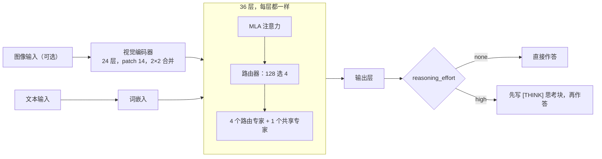
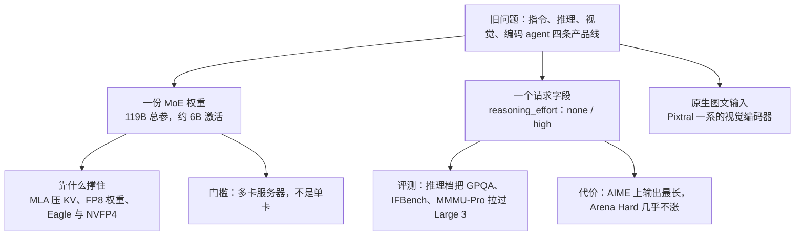

# Mistral Small 4：一份权重加一个开关，把推理、看图和写代码收进 119B / 6B 激活的 MoE

<!-- release-date: 2026-03-16 -->

> 本文依据 Mistral AI 官方博客 **Introducing Mistral Small 4**（<https://mistral.ai/news/mistral-small-4>），页面标注发布日 2026-03-16，访问日期 2026-09-30。博客正文没有小节编号，下文用「原文某某小节」指代，小节名照录原文英文标题。博客没有配套技术报告；架构维度、推荐配置来自官方权重仓与模型卡，一律标为**外部补充**。文中会区分三件事：**博客明确写了什么**、**我们怎么解释它**、**哪些是外部资料或本文算术**。

## 阅读前先认识几个词

- **MoE（Mixture-of-Experts，混合专家）**：一层里放很多个前馈「专家」，每个 token 只叫醒其中几个。总参数可以很大，单个 token 的计算量却很小。
- **激活参数（active parameters）**：处理一个 token 时真正参与计算的参数量。它决定每个 token 的算力开销，不决定显存里要放多少权重。
- **测时计算（test-time compute）**：推理时让模型多写一段思考再作答，用更长的输出换更高的正确率。
- **`reasoning_effort`**：Small 4 的请求级参数。设为 `none` 时直接作答，设为 `high` 时先逐步推理。
- **Magistral、Pixtral、Devstral**：Mistral 此前分开发布的三条产品线，分别主攻推理、多模态和编码 agent。
- **MLA（Multi-head Latent Attention，多头潜在注意力）**：出自 DeepSeek-V2，把每个 token 要缓存的 Key、Value 压成一条短的潜向量，用来省 KV Cache（生成时缓存的历史键值）。**博客没提 MLA**，它出现在权重仓的配置字段里。

## 一句话先说清

Small 4 要解决的是一个产品层面的矛盾：Mistral 以前按能力切产品线，要快用 Instruct，要难题用 Magistral，要看图用 Pixtral，要改代码用 Devstral。用户得先判断任务属于哪一类，再换模型；同一段对话很难既看图、又调工具、又在难题上想得久。

博客给的回答是：**一份 MoE 权重，加一个请求级的推理开关，再加原生图文输入**（原文开篇）。规格是（原文「Key architectural details」）：

- 128 个专家，每个 token 激活 4 个；
- 总参数 119B，每个 token 激活 6B，**算上词嵌入与输出层是 8B**；
- 256k 上下文；
- 可配置的推理强度；
- 原生多模态，输入文本和图像。

许可证是 Apache 2.0（原文开篇），API 价格为每百万输入 token 0.15 美元、每百万输出 token 0.6 美元（原文页尾的模型卡片）。

这是一份产品发布博客，不是技术报告。它给了规格、两条效率数字、三组评测和部署入口；**训练数据、token 预算、算力、超参、路由与负载均衡、任何消融，一个字都没有**。读者能带走的是「这个接口为什么这样设计、评测该怎么读」，不是一份可以照着练的配方。

如果只记一句话：

> **能力合并发生在权重和接口上：一份权重装下多种技能，一个请求字段决定这次花多少测时计算。开关让用户选，但也要求评测把两档都报出来。**

## 先看全景：一个请求在 Small 4 里怎么走

图里「128 选 4」「图像输入」「推理开关」来自博客；层数、MLA、共享专家、视觉编码器的形状和 `[THINK]` 思考块来自官方权重仓的 `params.json`、`config.json` 与模型卡（外部补充）。这是结构示意，不代表各部分的计算量比例。

## 核心设计一：四条产品线收成一份权重

### 博客写了什么

博客开篇说 Small 4 是「第一个把我们旗舰模型的能力统一起来的 Mistral 模型」：Magistral 管推理、Pixtral 管多模态、Devstral 管编码 agent，现在由一个模型兼任，用户「不必再在快速的指令模型、强大的推理引擎和多模态助手之间选择」（原文开篇）。「Why Mistral Small 4?」一节的说法略有不同：它合并的是 Magistral（推理）、Devstral（编码 agent）和 Mistral Small（指令）（原文「Unified capabilities」）。模型卡的措辞与后者一致：Instruct、Reasoning（此前叫 Magistral）、Devstral 三个家族（外部补充）。

两种说法并不矛盾：视觉能力以「原生多模态输入」的形式并进来，而权重仓的 `config.json` 里视觉编码器的类型就写着 `pixtral`（外部补充）。

### 我们怎么解释

「统一」容易被听成「把三份旧权重焊在一起」。更可靠的读法是：后训练目标从「每条线专精一项」改成「同一套专家、同一套工具协议，用开关选推理深度」。MoE 天然适合这件事，专家可以分工、路由器可以按 token 选人。但博客**没有**给任何证据说明专家真的按技能分化：没有路由热图，也没有按任务统计的专家使用率。

对用户，统一的好处在接口：同一个模型名、同一套函数调用、同一种图片传法，只改一个字段。对训练，统一通常更难：推理轨迹很长、指令回复要短、agent 要调工具，三类目标很容易互相拉扯。博客不谈这层权衡，所以「统一成功」目前只被评测图支撑，没有训练故事支撑。

## 核心设计二：推理强度做成请求字段

博客的定义（原文「Reasoning on demand」）：

- `reasoning_effort="none"`：快速、轻量的回答，聊天风格与 Mistral Small 3.2 相同；
- `reasoning_effort="high"`：逐步深入推理，啰嗦程度与此前的 Magistral 模型相当。

注意这两处「相同」「相当」说的是**风格与篇幅**，不是能力或参数量：Small 3.2 是 24B 的稠密模型，Small 4 是 119B 的 MoE。模型卡补充了推荐温度（外部补充）：`high` 用 0.7，`none` 按任务在 0.0–0.7 之间选；vLLM 部署时用 `mistral` 推理解析器把思考块和可见回答切开。

这个设计的因果链是：

- **旧问题**：推理模型和指令模型分成两个端点，客户端要自己判断任务难度、在两个模型名之间路由，缓存、计费、监控都分两套。
- **新设计**：同一个端点，按请求决定是否花测时计算。
- **收益**：客户端不分叉；轻量请求不必为长思考付延迟和费用。
- **代价**：评测、缓存键、计费、SLA 都必须把这个字段带上，否则「这个模型多强、多贵、多快」会对不齐；而且开关只有两档，博客没有给中间档，也没有给思考长度的预算上限。

后面的评测会反复看到一件事：**开不开推理，分数可以差出十几到四十几分**（例如 AIME 2025 从 36 到 84）。所以讨论 Small 4「强不强」，第一句必须先问开没开。

## 核心设计三：119B 常驻，6B 计算

### 规格与它的三个激活数字

博客写的是「119B 总参数，每个 token 激活 6B（含词嵌入与输出层为 8B）」（原文「Key architectural details」）；模型卡写的是「每个 token 激活 6.5B」（外部补充）；Mistral 文档的模型页也写 6.5B（外部补充）。同一个模型有 6B、6.5B、8B 三个说法，原文没有解释口径。

用权重仓 `params.json` 的维度逐项相乘，可以把参数分到各部分（本文算术，下图）：

图上能读出两件事：

- **总量几乎全是路由专家**。128 个专家、36 层，约 116B，占 97%。算出的总量 119.4B 与官方权重仓标注的 119,401,317,952 个参数吻合，说明这套拆法对得上。
- **三个激活数字里，6B 和 6.5B 都能对上口径**：不含词嵌入与输出层约 5.6B，就是博客的「6B」；含进去约 6.6B，就是模型卡的「6.5B」。**博客括号里的「8B」按配置算不出来**，连视觉编码器都算上也只有约 7.0B。可能另有计数口径，原文没说。

### 权重仓给出的结构（外部补充）

博客只给了专家数和参数量。官方权重仓 `params.json` 与 `config.json` 给出的骨架是：

| 部分 | 配置 | 人话 |
|---|---|---|
| 主干 | 36 层，宽 4096，词表 131072，输入输出词嵌入不共享 | 每一层都是 MoE 层，没有保留稠密层（`first_k_dense_replace` 为 0） |
| 注意力 | 32 头；Query 先压到 1024 维，Key、Value 压到 256 维潜向量，另留 64 维位置通道 | MLA 形态；每头 Query、Key 为 64 维内容 + 64 维位置，Value 128 维 |
| MoE | 128 个路由专家选 4 个，外加 1 个共享专家，专家中间维 2048 | 共享专家博客没写 |
| 位置编码 | YaRN，原始长度 8192，放大 128 倍到 1,048,576 | 配置上限是 1M，**比博客宣传的 256k 大** |
| 权重精度 | FP8（e4m3），视觉编码器、投影层和输出层保留 BF16 | 主权重就是 FP8 |
| 视觉编码器 | 24 层，宽 1024，patch 14，图像边长上限 1540，相邻 2×2 patch 合并后送入主干，类型 `pixtral` | 沿用 Pixtral 一系的视觉塔 |

两处值得展开。

**MLA 是 256k 上下文的前提。** 按配置，每层每个 token 只缓存 256 维潜向量加 64 维位置键，共 320 个元素，36 层合计 11,520 个；若 32 个头各存完整的 128 维 Key 和 128 维 Value，每层是 8192 个，MLA 只有它的约 3.9%（本文算术）。按每元素 2 字节算，一条 256k 的请求约占 6 GB KV Cache（本文算术，实际取决于部署时的 KV 精度）。所以「小激活 + 长上下文」这句宣传，真正靠的是 MLA 这类缓存压缩，而不是 MoE 本身。机制见 DeepSeek-V2 一篇。

**256k 与 1M。** 宣传是 256k，官方推荐的 vLLM 命令也把最大长度设成 262,144（外部补充）；配置里的 1M 是 YaRN 外推留出的上限。博客没有证明 1M 可用，落地仍应按 256k 承诺。

### 这一节可以带走什么

- **「激活 6B」不等于「6B 显存」**。激活量管的是每个 token 的计算，不管权重驻留；119B 的专家都得放在显存里。下一节的硬件要求就是这件事的直接后果。
- **宣传小激活时，要同时交代 KV 怎么压、权重用什么精度**。否则长上下文会把激活上的优势吃掉。Small 4 的博客没写这两件事，权重仓写了。

## 效率与部署：40%、3 倍，以及最少要几张卡

### 两条效率数字

原文「Performance highlights」：

- 延迟优化配置下，端到端完成时间减少 40%；
- 吞吐优化配置下，每秒请求数是 Mistral Small 3 的 3 倍。

两条都**没有**附硬件、batch、精度、是否开投机解码，也没说 40% 的对照对象是不是同样是 Small 3。它们可以同时成立，因为优化目标不同：延迟档用小 batch，吞吐档用大 batch 吃满专家并行。不要把两个数乘在一起理解成「又快又省」。

### 硬件门槛

原文「Enterprise-grade efficiency」写了部署门槛：

- 最低配置：4× NVIDIA HGX H100、2× NVIDIA HGX H200，或 1× NVIDIA DGX B200；
- 推荐配置：4× HGX H100、4× HGX H200，或 2× DGX B200。

HGX、DGX 通常指整机或整板，原文没说「4×」数的是整机还是 GPU。按权重体积推一下（本文算术）：FP8 权重约 120 GB，4 张 80 GB 的 H100 是 320 GB、2 张 141 GB 的 H200 是 282 GB、1 张 192 GB 的 B200 放得下权重，数字上更像是 **GPU 张数**。模型卡给的 vLLM 命令用的是 2 卡张量并行（外部补充）。无论哪种读法，结论一样：**6B 激活的模型，门槛是多卡服务器，不是单张消费卡。**

### 官方给的两个加速件

模型卡与 Hugging Face collection 列了两份衍生权重（外部补充）：

- **Eagle 草稿头**（`Mistral-Small-4-119B-2603-eagle`）：用于投机解码，先由小草稿头猜几个 token，再由主模型一次验证；
- **NVFP4 量化版**（`Mistral-Small-4-119B-2603-NVFP4`）：4 bit 浮点权重，省显存、提吞吐。collection 的注释写明「长上下文上性能会下降」，并把 FP8 主权重标为「最佳精度」。

### 生态与 NVIDIA 这条线

博客说 Small 4 已可在 vLLM、llama.cpp、SGLang、Transformers 上运行，并与 NVIDIA 一起为 vLLM 与 SGLang 做了推理优化（原文「Enterprise-grade efficiency」）；在 build.nvidia.com 上可免费试用，发布当天就有 NVIDIA NIM 容器，可以用 NVIDIA NeMo 做领域微调（原文「Availability」）。跟进这些链接取到的背景（外部补充）：

- **NIM 页面**：列出 262K 上下文、119B 参数、图文输入、文本输出、支持函数调用与推理；访问时免费端点已标为「Deprecated」，镜像仍可下载。
- **NeMo 链接**指向 NeMo Automodel 仓库里的一份微调配方：用 MedPix-VQA 医学影像问答数据做全参数微调、冻结视觉编码器，流水线并行 4 段、专家并行 8 路，学习率 1e-5。这是「怎么微调」的一个样例，不是训练 Small 4 本身的配方。
- **Nemotron Coalition**：同日发布的伴随公告说，Mistral 作为创始成员加入 NVIDIA 牵头的开放前沿模型联盟，联盟第一项工作是在 DGX Cloud 上训练一个基座，用于后续开源的 Nemotron 4 家族。它和 Small 4 的训练没有直接关系。

## 评测一：和 Mistral 自家模型比

博客第一张图题为「Performance comparison across internal models」，放在「Performance highlights」之后，分文本与视觉两组（原文第一张图）。Small 4 画两截柱：实心是 Instruct（即 `none`），斜线加高部分是 Reasoning（即 `high`）；对照模型只有一根灰柱。改写成表：

| 基准 | Small 4 Instruct | Small 4 Reasoning | Small 3.2 | Medium 3.1 | Large 3 |
|---|---:|---:|---:|---:|---:|
| GPQA Diamond | 59.1 | **71.2** | 50 | 65.7 | 64.1 |
| MMLU Pro | 73.5 | 78 | 69 | 76.8 | **80.9** |
| AllenAI IFBench | 35.7 | **48** | 34 | 40.8 | 37.8 |
| Arena Hard | 55.8 | 58.3 | 43.1 | **67.3** | 66.7 |
| MMMU-Pro（视觉） | 46.3 | **60** | 49.1 | 43.8 | 54 |

读这张图要先知道三件事：

1. **纵轴从 20 起，不是从 0 起**，柱高之间的视觉差距被放大了。
2. **对照模型那根灰柱是什么模式，图上没说**。Medium 3.1、Large 3 有没有同等的推理预算，读者无从判断；「Small 4 超过 Large 3」只在博客选的这组对照下成立。
3. **开推理带来的增益差别很大**：GPQA Diamond +12.1、IFBench +12.3、MMMU-Pro +13.7，Arena Hard 只有 +2.5（本文算术）。

逐项看：

- **GPQA Diamond、IFBench、MMMU-Pro** 上，开推理后的 Small 4 高过三个对照；这是博客最想让人看到的几根柱。
- **MMLU Pro 与 Arena Hard** 上，即使开推理也不如 Large 3 与 Medium 3.1。同一张图里就有反例：合并后的模型不是处处领先。
- **MMMU-Pro 的 Instruct 档（46.3）低于上一代 Small 3.2（49.1）**。只看短模式会得出「视觉退步」，只看长模式会得出「视觉超过 Large 3」，两根都得报。

我们的解释：这张图的自变量其实是**测时计算**。GPQA、MMMU-Pro 这类需要多步推理的题，长思考收益大；Arena Hard 更看对话风格与后训练，长思考加分有限。

## 评测二：和推理专线 Magistral 比

博客第二张图（同样题为「Performance comparison across internal models」，放在「Reasoning on demand」之后）只比推理档，对手是推理专线 Magistral 的两个 1.2 版本：

| 基准 | Small 4（High） | Magistral Medium 1.2 | Magistral Small 1.2 |
|---|---:|---:|---:|
| LCR | 71.2 | **73** | 27 |
| AIME25 | 83.8 | **84.4** | 80.2 |
| Collie | **62.9** | 61.3 | 60.3 |
| LiveCodeBench | 63.6 | **66.1** | 60.7 |

Small 4 没有全面超过 Magistral Medium 1.2，四项里输三项，但都在 3 分以内；它明显补上的是 Magistral Small 1.2 在长上下文推理（LCR）上的短板，27 对 71.2。这支持「合并后推理档够用」，不支持「推理专线可以下架」。

## 评测三：分数与输出长度

### 博客写了什么

原文「Enterprise-grade efficiency」之后有一张三联图，图注是「Score vs. Output Length across three benchmarks」：上半是分数，下半是平均输出长度（千字符）。配套文字的三个主张：

1. 开推理的 Small 4「在三个基准上都达到或超过 GPT-OSS 120B，同时输出显著更短」；
2. AA LCR 上，Small 4 得 0.72，只用 1.6K 字符，而 Qwen 模型要多 3.5–4 倍输出（5.8–6.1K）才能达到可比的分数；
3. LiveCodeBench 上，Small 4 超过 GPT-OSS 120B，输出少 20%。

### 图上读出来的数

上图把原图三联里的推理档重新画在「分数—长度」平面上。完整读数（Instruct / Reasoning）如下：

| 模型 | AA LCR 分数 | AA LCR 长度 | LiveCodeBench 分数 | LiveCodeBench 长度 | AIME 2025 分数 | AIME 2025 长度 |
|---|---|---|---|---|---|---|
| Mistral Small 4 | 44 / 72 | 0.2K / 1.6K | 32 / 64 | 2.1K / 18.7K | 36 / 84 | 3.9K / 27.9K |
| GPT-OSS 120B | 40 / 51 | 0.4K / 2.5K | 55 / 63 | 2.6K / 23.6K | 45 / 89 | 1.6K / 14.9K |
| Claude Haiku | 64 / 80 | 0.3K / 2.7K | 40 / 49 | 1.2K / 14.2K | 34 / 83 | 1.2K / 未标 |
| Qwen3-next 80B | 62 / 75 | 1K / 5.8K | 40 / 66 | 6.9K / 16.8K | 65 / 88 | 6.6K / 17.7K |
| Qwen3.5 122B | 只标 84 | 1.3K / 5.7K | 58 / 74 | 7.0K / 20.9K | 80 / 93 | 7.7K / 26.4K |

LCR 图下有一行脚注：这是 AA LCR 的**自定义实现**，用 gpt-4.1-mini-2025-04-14 当裁判，上下文不够长的模型用「middle-out」方式截断输入。原图长度那一栏的横轴刻度只标到 6，而条上的标注一直到 27.9K，条长与数字对不上，上表一律按标注数字。

### 三条主张逐条核

- **AA LCR：成立，但「可比」要打折**。72 对 GPT-OSS 的 51，输出 1.6K 对 2.5K，又高又短。Qwen 两个模型的推理档输出是 5.8K 与 5.7K，约为 Small 4 的 3.6 倍，落在「3.5–4 倍」之内；但原文写的「6.1K」在图上找不到。分数上 Qwen3-next 是 75、Qwen3.5 是 84，后者比 Small 4 高 12 分，说「可比」偏宽。
- **LiveCodeBench：成立**。64 对 63 算持平；输出 18.7K 对 23.6K，少约 21%，对上「少 20%」。但两个 Qwen 分数更高（66、74）。
- **AIME 2025：不成立**。Small 4 推理档 84，低于 GPT-OSS 120B 的 89；输出 27.9K，几乎是 GPT-OSS 14.9K 的两倍，是图中最长的。「三个基准都达到或超过 GPT-OSS、同时显著更短」这句，在 AIME 上两半都不对。

还有一处小出入：第二张图（对 Magistral）里 Small 4 的 LCR 是 71.2，这张图是 72。两者可能不是同一套实现，原文没说。

我们的解释：测时计算的收益和代价高度依赖任务。长文档检索推理只需要一条短证据链，Small 4 在这里停得很早；竞赛数学大家都会把思维链拉到上万字符，Small 4 也不例外。另一个值得注意的读数是 Instruct 档：Small 4 的短模式输出极短（LCR 只有 0.2K），分数也最低一档（AIME 36、LiveCodeBench 32），**它的分数几乎全靠推理档拿**。开关管的是「开不开」，不是「开多少」；要控制成本，应用层还得自己设 `max_tokens`。

## 基准各测什么（外部补充）

博客只给基准名，没有链接。下表的定义来自各基准自己的论文或主页，不是博客内容：

| 基准 | 测什么 |
|---|---|
| GPQA Diamond | 研究生水平的生物、物理、化学选择题，专门挑「搜索引擎也查不到答案」的难题（[arXiv:2311.12022](https://arxiv.org/abs/2311.12022)） |
| MMLU Pro | MMLU 的加难版，选项从 4 个扩到 10 个、题目更偏推理（[arXiv:2406.01574](https://arxiv.org/abs/2406.01574)） |
| AllenAI IFBench | 用训练时没见过的、可程序验证的约束来测指令遵循能否泛化（[arXiv:2507.02833](https://arxiv.org/abs/2507.02833)） |
| Arena Hard | 从真实对话里筛出的难提示，由强模型当裁判两两比较（[arXiv:2406.11939](https://arxiv.org/abs/2406.11939)） |
| MMMU-Pro | 多学科图文题的加强版，过滤掉只看文字就能答的题（[arXiv:2409.02813](https://arxiv.org/abs/2409.02813)） |
| LiveCodeBench | 按发布时间持续收集的编程竞赛题，用时间切分减轻训练数据污染（[arXiv:2403.07974](https://arxiv.org/abs/2403.07974)） |
| Collie | 带组合约束的文本生成，例如限定字数、指定位置用某个词（[arXiv:2307.08689](https://arxiv.org/abs/2307.08689)） |
| AA LCR | Artificial Analysis 的长上下文推理题，要从很长的多份文档里找证据再推理；博客用的是自定义实现 |
| AIME 2025 | 2025 年美国数学邀请赛题目，答案是整数，靠多步推导 |

## 博客没有公开的东西

- **训练**：预训练与后训练的数据、token 数、算力、超参；三条产品线的能力是怎么并进来的（蒸馏、RL、拒绝采样，还是别的）；
- **架构的设计理由**：为什么 128 选 4、为什么加共享专家、为什么全部层都用 MoE；路由与负载均衡怎么做；
- **长上下文**：怎样从 8192 的原始长度训到 256k；
- **评测条件**：采样次数、温度、工具环境、对照模型的推理档设置；三组评测都是 Mistral 自己跑的；
- **效率数字的条件**：40% 与 3 倍的硬件、batch、精度与对照对象；
- **安全**：没有安全评测或红队结果。

截至访问日，Mistral 没有为 Small 4 发布技术报告。「没公开做法」本身就是结论：这份材料和 Mistral Large 3 的模型卡是同一类，给的是规格、产品评测与部署配方。

## 可迁移的设计启发

1. **用请求字段合并产品线，而不是合并部署名。** `reasoning_effort` 让一个端点服务两种深度，客户端不分叉；但评测、缓存、计费都得带上这个字段。
2. **报分数时两档都报。** Small 4 的 Instruct 与 Reasoning 在 AIME 上差 48 分；只报一档，读者就会误判它强在哪。
3. **「分数—长度」平面比单个分数诚实，但必须分任务画。** 同一个模型在 LCR 上最短、在 AIME 上最长，平均成一个「高效」会骗人。
4. **激活参数、KV 压缩、权重精度三件事要一起交代。** 激活管计算，MLA 管长上下文的缓存，FP8 管权重体积；缺一件，「小而快」就说不清。
5. **对照组里放专线模型。** 第二张图放了 Magistral Medium 1.2，读者才能看清合并模型离专线还差多少。
6. **把产品博客当规格书读，不当论文读。** 能迁移的是接口形状与读图纪律，不是学习率。

## 用一张图重新串起全文

这是本文对全文逻辑的归纳，不对应博客里的任何原图。

## 关键词回看

- **128 选 4 + 共享专家**：每层 128 个路由专家挑 4 个，外加 1 个每个 token 都走的共享专家；后者只在权重仓配置里出现。
- **6B / 6.5B / 8B**：博客、模型卡、博客括号里的三个激活数字；前两个按配置分别对应「不含」与「含」词嵌入和输出层，8B 算不出来。
- **`reasoning_effort`**：`none` 风格像 Small 3.2，`high` 篇幅像 Magistral；两档之间没有中间档。
- **MLA**：Key、Value 压成 256 维潜向量加 64 维位置键，KV Cache 约为完整多头注意力的 3.9%。
- **YaRN 128 倍**：配置上限 1M，宣传与推荐部署都是 256k。
- **FP8 主权重、NVFP4、Eagle**：分别对应最佳精度、更高吞吐、投机解码。
- **Score vs. Output Length**：LCR 上又短又高，LiveCodeBench 上持平而更短，AIME 上更低且更长。

## 最后的判断

**有图可查的**：内部对照里推理档在 GPQA Diamond、IFBench、MMMU-Pro 上超过 Medium 3.1 与 Large 3 的灰柱；对 Magistral Medium 1.2 四项三输但差距都在 3 分内，并补上了 Magistral Small 在 LCR 上的短板；LCR 与 LiveCodeBench 上「分数不低于 GPT-OSS、输出更短」成立。

**只是主张、没有条件的**：40% 的端到端提速与 3 倍的每秒请求数；「最佳效率」的说法。

**与图对不上的**：「三个基准都达到或超过 GPT-OSS、输出显著更短」在 AIME 2025 上两半都不成立；Qwen 的「6.1K」图上没有；激活参数「8B」按配置算不出来。

**完全没有公开的**：训练的一切、架构取舍的理由、评测条件。

这一代 Small 做对的是接口：一份权重、一个开关、一种图文输入方式，外加权重仓里把 MLA、FP8、YaRN 这些服务所需的不变量写得清清楚楚。没回答的是代价：开关的剂量效应、合并对各项能力的影响、长思考在哪些任务上不划算。博客自己的图已经给出了反例，读的时候按图说话。

> **开关让一个模型能在「快」和「想得久」之间切换，但哪一档更好是任务的函数，不是模型的属性。**

## 资料与阅读边界

### 本文依据的版本与首发日

- 原件：Mistral AI 官方博客 [Introducing Mistral Small 4](https://mistral.ai/news/mistral-small-4)，页面标注 2026-03-16，访问日期 2026-09-30。网页会原地改动、不留版本号，访问日期即本文的版本锚。
- 访问时页面上「Score vs. Output Length」的图注与文字都在，三张图本身已不在页面里；Internet Archive 存下的 2026-03-16 版本里这三张图是嵌在博客中的，与官方模型卡 `images/lcr.png`、`livecode.png`、`aime.png` 相同。评测三的读数来自这三张图。
- `release-date` 取 **2026-03-16**：博客页面、Mistral 文档的模型页都标这一天，官方权重仓 `mistralai/Mistral-Small-4-119B-2603` 的第一条公开提交在 2026-03-16 20:33 UTC，博客称发布当天即有 NVIDIA NIM。权重仓的创建时间是 2026-01-23，属于提前建库，不是首发。
- 截至访问日，没有找到 Mistral Small 4 的官方技术报告。

### 跟进了哪些链接（外部补充，不是博客原文）

- **权重与模型卡**：[Hugging Face collection](https://huggingface.co/collections/mistralai/mistral-small-4)（FP8 主权重、NVFP4、Eagle 三个条目及注释）、[主权重卡](https://huggingface.co/mistralai/Mistral-Small-4-119B-2603)（6.5B 激活、推荐温度、vLLM 命令、`params.json` 与 `config.json` 的结构）。
- **Mistral 文档**：[模型页](https://docs.mistral.ai/models/mistral-small-4-0-26-03)（API 名 `mistral-small-2603`、v26.03、6.5B 激活、256k、价格与支持的接口）。
- **NVIDIA**：[build.nvidia.com 模型页](https://build.nvidia.com/mistralai/mistral-small-4-119b-2603)（规格与 NIM 部署）、[NeMo Automodel 微调配方](https://github.com/NVIDIA-NeMo/Automodel/blob/main/examples/vlm_finetune/mistral4/mistral4_medpix.yaml)、[Nemotron Coalition 公告](https://mistral.ai/news/mistral-ai-and-nvidia-partner-to-accelerate-open-frontier-models)。
- **AI Governance Hub**（legal.mistral.ai）：是 Mistral 的合规文档总入口，访问时没有 Small 4 的专属技术文档。
- 基准定义见上文「基准各测什么」一节的论文链接。
- 本站相关篇目：MLA 的机制见 DeepSeek-V2 一篇；同一家的更大一档见 Mistral-Large-3 一篇；稠密小模型家族见 Ministral-3 一篇。这些篇目的结论都不是本文的依据。
- 文中所有「本文算术」都是按配置或图上数字做的计算：参数分项、KV Cache 比例与体积、推理档增益、长度倍数、GPU 显存推算，博客与模型卡都没有给出这些数。
