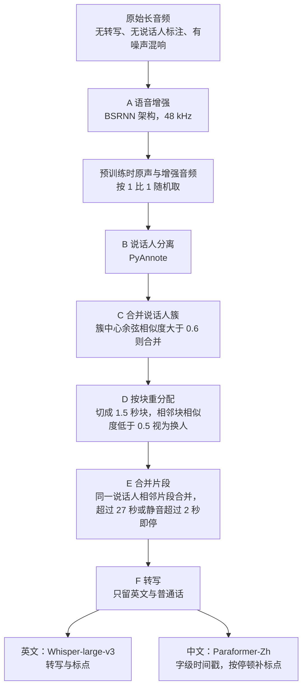
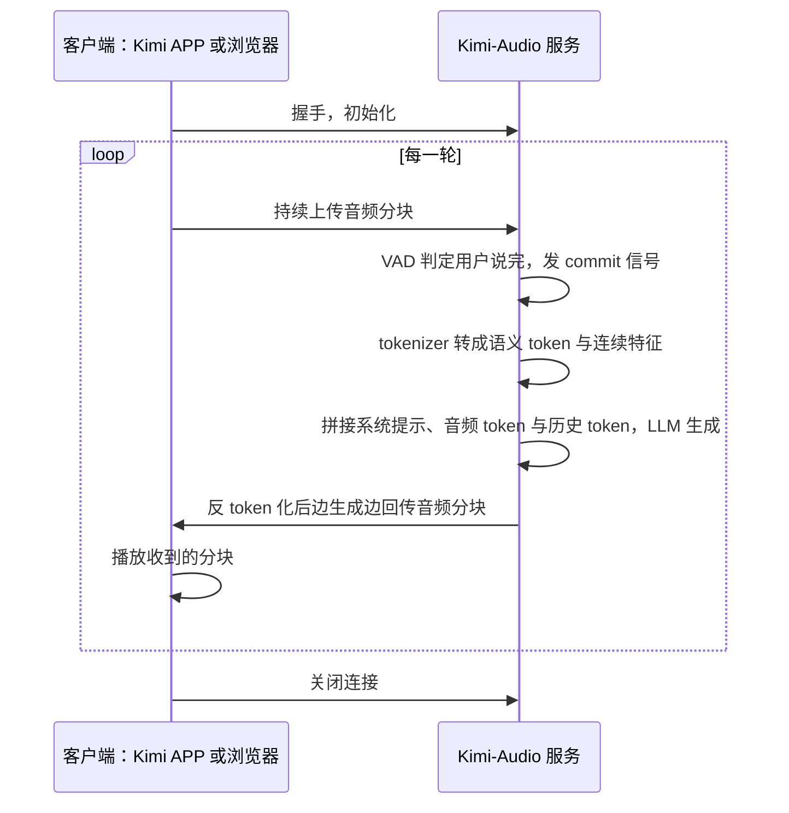
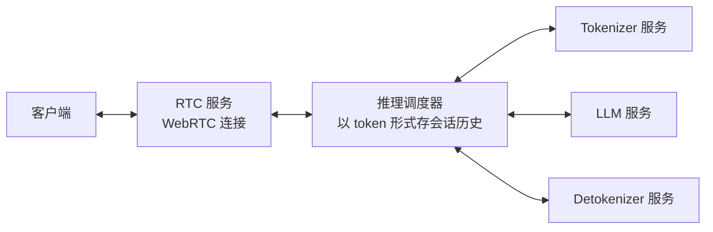
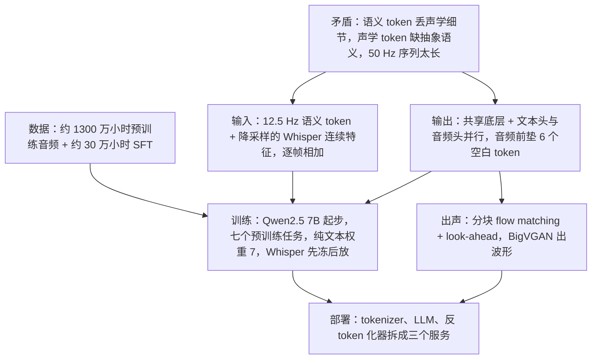

# Kimi-Audio：让语音同时走「离散 token」和「连续向量」两条路

<!-- release-date: 2025-04-25 -->

> 本文依据 Kimi Team 的 **Kimi-Audio Technical Report**，arXiv:2504.18425v1（2025-04-25 提交），共 26 页，正文到 p. 21，其后为参考文献与贡献者名单。页码均指 PDF 自身页码。文中区分三件事：**报告明确写了什么**、**我们怎么解释它**、**哪些是外部资料或本文的算术**。

## 阅读前先认识几个词

- **音频 tokenizer**：把连续的声波变成一串离散编号的模块。离散化之后，音频就能像文字一样喂给自回归语言模型，用「预测下一个编号」来训练。
- **语义 token 与声学 token**：这是本篇最重要的一组对立。语义 token 由带语音识别（ASR）监督的 tokenizer 产出，只关心「说了什么」；声学 token 由带重建损失的神经编解码器产出，关心「听起来什么样」，包括音色、情绪、环境声（报告第 8 节的定义，PDF p. 21）。
- **连续特征**：不做离散化，直接把编码器输出的浮点向量当输入。信息全，但它不是编号，语言模型没法在它上面算「下一个 token」的交叉熵。
- **帧率（Hz）**：每秒多少个 token 或特征帧。12.5 Hz 就是 1 秒音频对应 12.5 个位置。
- **反 token 化（detokenizer）**：把语义 token 还原成可播放声音的模块。本篇里分两步：flow matching 模型先把 token 变成 mel 谱（一种按人耳感知排列的时频图），声码器再把 mel 谱变成波形。
- **WER（Word Error Rate，词错误率）**：识别错了多少词，越低越好。

## 一句话先说清

Kimi-Audio 是一个开源的 7B 级音频基座模型，同一个模型做语音识别、音频理解、语音问答和实时语音对话（PDF p. 1、p. 12）。

它的核心做法是**不给音频挑一种表征，而是同时用两种**（PDF p. 3–4）：

- **输入**：12.5 Hz 的离散语义 token 负责「说了什么」，Whisper 抽出的连续特征负责「听起来怎样」，两路逐帧**相加**后送进语言模型；
- **输出**：共享的 Transformer 底层之上分出文本头和音频头，并行生成文本 token 和语义 token，文本给音频当锚；
- **出声**：语义 token 交给分块流式的 flow matching 反 token 化器，边生成边播放。

撑起这一切的是约 1300 万小时音频的预训练，外加约 30 万小时的 SFT 数据（PDF p. 6、p. 12）。结果上，它在 LibriSpeech 上 WER 做到 1.28 / 2.42，VoiceBench 平均 76.93，人评语音对话均分 3.90，仅次于 GPT-4o 的 4.06（PDF p. 16、p. 18、p. 19）。

如果只记一句：

> **一种表征很难同时满足「能被语言模型消化」和「信息不丢」。Kimi-Audio 把这两个要求分给两条对齐到同一帧率的通道，语言模型的接口一点不改。**

这份报告的另一面也要先知道：它把工程细节交代得很足（每个阈值、每个数据集、每个 epoch），却几乎没有消融来证明上面那几个架构选择到底值多少分。后面会逐条分开。

## 先看全景：三块组件，两条输入通道，两个输出头

上图裁自原文 Figure 2（PDF p. 4）。图上有几处正文没有用文字复述的信息，读图时要看准：

- **雪花与火焰**：Audio Tokenizer 和 Audio Detokenizer 标雪花（冻结），Whisper Encoder 和 Adaptor 标火焰（可训练）。这与正文一致：Whisper 特征提取器只在预训练前约 20% 的 token 冻结，之后放开（PDF p. 12）；反 token 化器单独分三阶段训练（PDF p. 12）。
- **输入是「一格两层」**：虚线框里蓝色的音频 embedding 和绿色的音频 token 逐格上下配对，这就是正文说的两路相加、占同一批位置（PDF p. 4）。
- **两个头吃同一份输入**：共享层的输出一路进文本头，另一路绕过文本头直接进音频头。两个头是并列的，不是先文本后音频的串行。
- **两行输出一样长**：文本那一行写完后用空白 token 补齐；音频那一行开头先垫几格空白（图上标 Audio Delay），再开始出音频 token。图上画了 3 格，正文写的是 6 个（PDF p. 11），以正文为准。

能拿到的配置放在一起：

| 组件 | 报告写的 | 位置 |
|---|---|---|
| 离散语义 token | 沿用 GLM-4-Voice 的有监督 tokenizer：在 Whisper 编码器结构里加向量量化层，12.5 Hz、单码本 | PDF p. 3–4 |
| 连续特征 | Whisper large-v3 初始化，50 Hz，经 adaptor 降到 12.5 Hz，加到语义 token 的 embedding 上 | PDF p. 4、p. 12 |
| 音频 LLM | 共享层与文本头从 Qwen2.5 7B 初始化，音频头随机初始化；词表扩入语义 token 与特殊 token | PDF p. 5、p. 12 |
| 反 token 化器 | 与 MoonCast 同架构：flow matching 把 12.5 Hz token 变成 50 Hz mel，BigVGAN 出波形；分块流式加 look-ahead | PDF p. 5 |

报告没给的：码本大小与扩展后的词表规模、adaptor 结构、共享层与两个头各占几层、模型总参数量。

## 第一层矛盾：音频该用哪种表征

### 两种 token 各缺一半

报告在结尾的「挑战」一节把这道矛盾写得最干净（PDF p. 21）：

- 语义 token 靠 ASR 辅助损失得到，关注的是转写信息，**抓不住理解与生成都需要的声学细节**；
- 声学 token 靠重建损失得到，关注的是描述性的声学细节，**抓不住通往文本智能所需的抽象语义**。

说成人话：tokenizer 的训练信号决定了它眼里有什么。按「能不能认出字」来量化，情绪、音色、背景音都会被当噪声丢掉，可情绪识别、场景分类、音乐理解恰恰要靠这些；按「能不能还原波形」来量化，「这是哪个词」又散落在细节里，语言模型很难直接拿来当语言用。

### 还有一道长度账

第二个矛盾是序列长度。文本 token 每秒只有几个，音频表征常常每秒几十帧。报告说降低每秒 token 数，是为了弥合文本序列与音频序列之间的差距，于是把语义和声学两路都定在 12.5 Hz（PDF p. 2、p. 3）。按本文算术，Whisper 原生的 50 Hz 要多出 4 倍位置，预训练成本、上下文窗口和对话轮数都会跟着吃紧。

### 报告的答案：两路都要

Kimi-Audio 的选择是（PDF p. 2–4）：

1. 主表征用离散语义 token，保住语言模型的接口和 12.5 Hz 的长度；
2. 在同一批位置上加一路连续 Whisper 特征，把语义量化丢掉的声学细节补回输入；
3. 输出侧同时生成文本 token，让文本能力给音频生成当锚。

报告自己也承认这只是过渡：它在第 8 节把「同时装下语义与声学的统一表征」列为未来方向（PDF p. 21）。

## 核心设计一：混合输入，离散与连续逐帧相加

### 工作机制

**离散路**直接复用 GLM-4-Voice 的语义 tokenizer：它在 ASR 模型的 Whisper 编码器结构里插一层向量量化，把连续语音表征变成 12.5 Hz、单码本的离散 token（PDF p. 3–4）。这套 token 既是音频 LLM 的输入，也是音频头的输出词表。

**连续路**用预训练 Whisper 的特征，原生 50 Hz；adaptor 把它降到 12.5 Hz，然后**加到**语义 token 的 embedding 上（PDF p. 4）。训练序列的记号里也是同样写法：$a_i$ 表示连续向量 $a^c_i$ 与语义 token 查表后的 embedding $a^d_i$ 相加（PDF p. 10）。

「相加而不是拼接」是这里最容易被跳过的细节。我们的理解是：相加让两路共用同一批序列位置，位置数仍是「音频秒数 × 12.5」，注意力开销不变；拼接则要么翻倍序列，要么改隐藏维度。代价是两路必须逐帧严格对齐，这正是把 Whisper 从 50 Hz 降到 12.5 Hz 的原因。

### 收益与代价

- **收益**：语言模型的词表、损失和解码方式都不用动，就把声学细节补进了输入。Whisper 特征在预训练约 20% token 之后解冻、与主干联合训练（PDF p. 12），所以这一路不是固定的外部特征，会朝任务适配。
- **代价**：推理时多跑一个 Whisper 编码器，报告没有单列这部分开销。细节只补在**输入侧**，输出仍是纯语义 token，生成音频的表现力要靠反 token 化器和后训练数据补。
- **没有被证明的**：报告没有「只用语义 token 输入」对「语义 token 加 Whisper 特征」的对照，连续路到底值多少分，报告答不了。

**对自己的项目有什么用**：模型已有离散 token 接口、又缺原始信号的细节时，改动最小的办法是另开一路同帧率的连续特征加到 embedding 上。前提是有一个可信的预训练编码器，并且两路能对齐到同一帧率；两路天然对不齐时，这个方案的工程成本会迅速超过收益。

## 核心设计二：共享底层，文本头与音频头并行

### 旧问题

语音对话的输出侧有两个要求互相拉扯：回答要聪明，就得依赖文本 LLM 的语言能力；出声要快，音频 token 就不能等文本整段写完。只让音频 token 当唯一输出，模型得在没有文本锚的情况下自己组织语言。

### 新设计

报告把标准 LLM 拆成共享与专用两部分（PDF p. 5）：原始 Transformer 靠下的若干层作为共享层，处理输入、学跨模态表征；其上分出两个各含若干 Transformer 层的并行头，文本头自回归出文本 token，音频头自回归出语义 token，再交给反 token 化器合成波形。

共享层和文本头直接用预训练文本 LLM 的权重初始化，音频头随机初始化（PDF p. 5）。报告的理由是这样能在学音频的同时保住文本理解与生成能力。

### 关键细节：垫 6 个空白 token，把音频起点往后推

这是并行生成方案里唯一给出取舍依据的参数（PDF p. 11）：

1. 在「音频 → 语义 token + 文本」交错任务里，同一批位置要同时出文本 token 和语义 token；
2. 语义 token 序列总比对应文本长，所以这更像一个流式 TTS 任务；
3. 作者发现**开头几个语义 token 最难预测**，因为模型要同时给出下一个文本 token 和它对应的音频 token；
4. 办法是在语义 token 前垫 6 个特殊空白 token，让音频晚几步起跑；
5. 6 是在初步实验里按生成质量与延迟权衡出来的，报告没给这条权衡的任何数字。

按本文算术，6 个 token 在 12.5 Hz 下相当于 0.48 秒音频长度。这不是报告实测的端到端延迟。

我们对第 3 条的解释是：文本先走几步，音频头生成时就能看到「接下来要说什么」，不必在同一步里既决定用词又决定发音。

### 收益与代价

- **收益**：文本头沿用预训练 LLM 的能力，给生成质量托底；两个头同步推进，配合流式反 token 化，不必等整段文本写完才出声。
- **代价**：音频头从零学一套全新词表，所以报告专门设计了映射与交错两大类预训练任务来「接上」两个模态（PDF p. 10–11）。两路长度不同要补空白 token，序列里有一部分位置不携带信息。
- **没有被证明的**：没有「先文本后音频」的串行基线，也没有空白 token 数量的扫描。

**对自己的项目有什么用**：给 LLM 加新输出模态时，先试「共享底层 + 专用头 + 保留原模态的头当锚」，而不是另训一个解码器。真正要提前想好的是两路长度不一样怎么办；Kimi-Audio 的答案（补空白、推迟新模态起点）很朴素，但报告唯一给出取舍依据的参数恰好落在这里。

## 核心设计三：分块流式反 token 化

### 旧问题

语义 token 只是编号，变成能听的声音要经过 token → mel → 波形两步。实时对话不能等整句生成完再解码。最直觉的做法是把 token 切块、逐块独立解码，但报告说初步实验里块边界会出现断续（PDF p. 5）。

### 工作机制

上图按 PDF p. 5 第 2.4 节正文重画，是机制示意。

**分块自回归**（PDF p. 5）：音频切成块（例如每块 1 秒）；语义 token 上采样 4 倍，对齐 50 Hz 的 mel；训练和推理都用块级因果掩码，第 $i$ 块把所有更早的块（它们的 mel 与 token）当 prompt；flow matching 前向把本块 mel 加噪，反向在本块 token 与历史 prompt 的条件下去噪。推理时 LLM 每生成一块，就解一块 mel，再用 BigVGAN 出这一块的波形。

**look-ahead**（PDF p. 5）：有了长历史，块边界仍然会退化，报告给的原因是块级因果注意力让边界位置看不到后文。于是对第 $i$ 块，从下一块借来前 $n$ 个（例如 4 个）语义 token 拼在末尾一起解码，只保留属于本块的那段 mel。这个机制不需要重新训练，代价只是第一块要晚 $n$ 个 token。按本文算术，$n = 4$ 约合 0.32 秒音频。

### 训练分三阶段（PDF p. 12）

| 阶段 | 数据 | 做什么 |
|---|---|---|
| 一 | 预训练语料中约 1M 小时音频 | 联合预训练 flow matching 模块与声码器，学多样的音色、韵律与音质 |
| 二 | 同一批预训练数据 | 分块微调，块长在 0.5–3 秒之间动态变化 |
| 三 | Kimi-Audio 发音人的高质量单人录音 | 微调，定住最终音色 |

第二阶段随机化块长，我们的理解是让模型在训练里就见过各种切法，推理换块长时不失配。第三阶段意味着对外只有一个发音人的音色（PDF p. 9、p. 12）。

**对自己的项目有什么用**：任何分块流式生成都会撞上边界不连续。两条经验都便宜好搬：训练时随机化块长；解码时向后多看几个单位、只保留自己那段。后者不用重训，代价是一次可预测的首块延迟。

## 数据：1300 万小时预训练与约 30 万小时 SFT

### 预训练语料

纯音频部分约 1300 万小时，覆盖有声书、播客、访谈等真实场景，含声学事件、音乐、环境声、人声和多语种信息（PDF p. 6；摘要写作「超过 1300 万小时」，PDF p. 1）。纯文本数据的细节指向 Kimi k1.5 的报告（参考文献 [65]，PDF p. 6），文本预训练直接用 MoonLight 的数据（参考文献 [44] 即 Muon is Scalable for LLM Training，PDF p. 11）。

大多数原始音频没有转写、语种、说话人标注和切分边界，还常带噪声、混响和多人重叠（PDF p. 6）。报告强调自己与同类流水线的区别：别人追求切出干净的短片段，它要的是**带一致长程上下文的长音频标注**（PDF p. 6）。

### 流水线

上图按原文 Figure 3 与第 3.1 节重画（PDF p. 6–7），只表示处理顺序。几个决定都是被真实缺陷逼出来的：

- **语音增强会伤理解**：增强模型会把环境声和音乐一起去掉，所以预训练时原声与增强版各取一半（PDF p. 6）。清洗步骤会不会删掉下游要用的信号，这是报告少见的诚实细节。
- **分离结果要修三遍**：PyAnnote 会把同一个人拆成多个标签，也会把多人混在一段，原始片段长度从不到 1 秒到超过 100 秒不等，于是有 C、D、E 三步后处理（PDF p. 7）。
- **中文标点靠停顿补**：Paraformer-Zh 不出标点，相邻字间隔在 0.5–1.0 秒之间补逗号，超过 1.0 秒补句号（PDF p. 7）。

流水线跑在 30 台云实例上，每台 128 个 vCPU、1 TB 内存、8 张 NVIDIA L20，合计 3840 个 vCore、30 TB 内存、240 张 L20；优化后日处理约 20 万小时原始音频（PDF p. 7）。

### SFT 数据分三块

报告强调，大部分 SFT 数据用公开数据源和工具构造，没有买数据（PDF p. 2）。

**一、音频理解**（PDF p. 7–8）：主要用开源数据集，覆盖 6 类任务。下表按任务重排自原文 Table 1（PDF p. 8），时长单位为小时：

| 任务 | 数据集与时长 | SFT epoch |
|---|---|---:|
| ASR | Emilia 98305、Libriheavy 51448、MLS 45042、WenetSpeech4TTS 12085、WenetSpeech 10518、GigaSpeech 10288、CommonVoice 1854 与 43（表中出现两次）、KeSpeech 1428、AISHELL-2 1036、LibriSpeech 960、zhvoice 901、Magicdata 747、LibriTTS 568、VoxPopuli 529、AISHELL-1 155、AISHELL-3 65、Fleurs 17 | 2.0 |
| ASR（内部） | Kimi Inhouse ASR Data 55000 | 2.0 |
| 音频问答 AQA | CompA-R 159、AVQA 纯音频 112、MusicAVQA 纯音频 77.1、ClothoAQA 7.4 | 2.0，ClothoAQA 为 4.0 |
| 音频描述 AAC | WavCaps 3793.3、AudioCaps 137、Clotho-v2 24.0、MACS 10.9 | 2.0 |
| AAC/AQA（内部） | Kimi Inhouse Audio Data 5200 | 2.0 |
| 语音情绪 SER | ESD 29、IEMOCAP 10、MELD 9、RAVDESS 3、SAVEE 0.1 | 2.0 |
| 声音事件 SEC | VGGSound 513、FSD50K 80.8 与 74（表中出现两次）、VocalSound 19、UrbanSound8K 9、Nonspeech7k 6.2、ESC50 1 | 2.0，VocalSound 与 Nonspeech7k 为 4.0 |
| 声学场景 ASC | CochlScene 169.0、TAU2022 67、TUT2017 13、TUT2016 10 | 2.0，TUT2017 为 4.0 |

**二、语音对话**（PDF p. 9）：多轮对话，用户侧与助手侧分开造。

- 用户问题：LLM 写文本，Kimi-TTS 念出来，提示音色从超过 125K 个音色的库里随机选；
- 助手回答：选定一位配音演员作为 Kimi-Audio 发音人，用这一个音色合成带风格与情绪的回答。录音棚里预定义了 20 多种风格与情绪，每种情绪分 5 个强度等级，每个风格与等级各录一条参考音频，全程由专业录音导演指导。

两个配套系统：

| 系统 | 作用 | 报告写的实现 |
|---|---|---|
| Kimi-TTS | 零样本 TTS，3 秒提示音即可保留音色、情绪与风格 | 类似 MoonCast：LLM 生成语音 token，flow matching 反 token 化器出声；在流水线产出的约 1M 小时数据上训练，再用强化学习提升稳健性与质量 |
| Kimi-VC | 把各种真实语音转成 Kimi-Audio 发音人的音色，保留风格、情绪与口音 | 基于 Seed-VC；训练时用一个音色偏移模型扰动源音色，缓解信息泄漏、对齐训练与推理；再用该发音人的录音微调 |

Kimi-VC 解决的是配音演员录不全所有风格与口音的问题。我们的理解是，表现力数据是**从真实语音里搬风格**，而不是全靠 TTS 从零合成。

**三、语音进、文字出的对话**（PDF p. 9–10）：把公开的文本 SFT 数据的用户问题转成多种音色的语音。转之前先过滤含复杂数学、代码、表格、复杂多语或过长的文本，做口语化改写，并把带复杂指令的单轮问答拆成指令简单的多轮对话。来源见原文 Table 2（PDF p. 10）：Infinity-Instruct 7M、OpenOrca 2M、OpenHermes-2.5 1M、Tulu3 900K、NuminaMath 860K、Magpie-Pro 300K、Magpie-MT 300K、Evol-Instruct 143K、Synthia 119K、Evol-Instruct-Code 80K 条，全部 2.0 epoch。

SFT 数据总计约 30 万小时（PDF p. 12）。

## 训练 recipe：七个预训练任务与一次解冻

### 训练序列怎么摆

流水线把一段原始音频切成 $N$ 个片段，每个片段 $S_i$ 有音频 $a_i$ 和转写 $t_i$；每段音频再抽出连续向量 $a^c_i$ 与语义 token $a^d_i$（PDF p. 10）。一个训练片段可以只用其中一到两种，例如只用 $a^d_i$、只用 $t_i$、用 $a^c_i/a^d_i$ 或 $a^d_i/t_i$。两个约定（PDF p. 10）：

1. $a^c_i/a^d_i$ 是相加，合成最终音频特征，简记为 $a_i$；$a^d_i/t_i$ 是把两者的查表 embedding 相加作输入，再由各自的头分别生成；
2. 音频与文本序列用空白 token 补到等长。

### 七个任务与权重

下表转自原文 Table 3（PDF p. 11），原表用下划线标出算损失的位置，这里改写成一列：

| 类别 | 任务 | 序列 | 在哪些 token 上算损失 | 权重 |
|---|---|---|---|---:|
| 单模态 | 纯文本 | $t_1, t_2, \dots, t_N$ | 文本 | 7 |
| 单模态 | 纯音频 | $a^d_1, a^d_2, \dots, a^d_N$ | 语义 token | 1 |
| 音频文本映射 | 音频 → 文本（ASR） | $a_1, t_1, a_2, t_2, \dots$ | 文本 | 1 |
| 音频文本映射 | 文本 → 音频（TTS） | $t_1, a^d_1, t_2, a^d_2, \dots$ | 语义 token | 1 |
| 音频文本交错 | 音频 → 语义 token | $a_1, a^d_2, a_3, a^d_4, \dots$ | 语义 token | 1 |
| 音频文本交错 | 音频 → 文本 | $a_1, t_2, a_3, t_4, \dots$ | 文本 | 1 |
| 音频文本交错 | 音频 → 语义 token + 文本 | $a_1, a^d_2/t_2, a_3, a^d_4/t_4, \dots$ | 语义 token 与文本 | 2 |

三类任务的分工（PDF p. 10–11）：单模态各自学知识；映射任务逼模型会「听写」和「念出来」；交错任务让一段音频的下一段以另一种形式出现，把两个模态在同一序列里接起来。6 个空白 token 的延迟就出在最后一个任务里。

有一处前后不一致：正文 4.1.4 写的权重是「1 : 7 : 1 : 1 : 1 : 1 : 2，如 Table 3 所示」（PDF p. 12），而 Table 3 自上而下是 7、1、1、1、1、1、2（PDF p. 11），纯文本排在第一行。按表格，纯文本的权重是 7。我们的理解是作者把文本放在最重的位置，是为了不让大量音频训练冲掉语言能力，报告没有明说这个理由。

### 超参

| 项 | 预训练 | SFT |
|---|---|---|
| 起点 | Qwen2.5 7B，词表扩入语义 token 与特殊 token | 预训练后的权重 |
| 数据 | 585B 音频 token + 585B 文本 token，1 个 epoch | 约 30 万小时，各数据源 2–4 个 epoch |
| 优化器 | AdamW | AdamW |
| 学习率 | $2\times10^{-5}$ 余弦衰减到 $2\times10^{-6}$ | $1\times10^{-5}$ 余弦衰减到 $1\times10^{-6}$ |
| warmup | 前 1% token | 前 10% token |

以上均出自 PDF p. 12。Whisper 特征提取器在预训练前约 20% token 冻结，之后解冻与其余部分联合训练（PDF p. 12）。报告的说法是让它更贴合训练数据与目标任务；先冻后放的节奏，我们的理解是让主干先在一个稳定的表征上收敛。

SFT 还有三个设计（PDF p. 12）：不设任务切换标记，统一用自然语言指令；每条指令同时准备文本版和由 Kimi-TTS 零样本合成的音频版，训练时随机选一个；用 LLM 为 ASR 造 200 条指令、为其他任务各造 30 条，每个样本随机挑一条。各数据源 2–4 个 epoch 是「基于全面的消融实验」定的，但消融结果本身没给（PDF p. 12）。

## 推理与部署：三段拆开扩

报告拿实时语音对话当部署范例，因为它在基础设施上最复杂（PDF p. 12–13）。

上图按原文 Figure 4 与第 5.1 节重画（PDF p. 13–14），是消息顺序示意。

生产环境里，tokenizer、LLM、反 token 化器三块**都是计算密集的**，所以拆成独立服务各自扩缩（PDF p. 14）：

上图按原文 Figure 5 与第 5.2 节重画（PDF p. 14）。调度器每轮做四件事：调 tokenizer 把用户音频转 token，拼上历史作为输入，交 LLM 生成回复 token，调反 token 化器转成音频；所有输出 token 存回会话历史（PDF p. 14）。三个推理服务各自带负载均衡和多个实例（PDF p. 14）。

这一节没有任何端到端延迟、首包时间、实时率、并发量或 GPU 配置数字，所有延迟表述都是定性的。能量化的延迟线索只有两处机制：6 个空白 token 和 look-ahead 的 4 个 token。流式设计做了，流式收益没有被量化。

## 评测工具集：连复现都难

报告把评测工具集当成独立贡献，理由是音频领域即便模型完全开源，也很难复现论文里的数字（PDF p. 15）。它列了三个原因：

- **指标实现不统一**：文本归一化不同会让 WER 算出不同值；音频问答用精确字符串匹配，判不了 LLM 长回答的语义对错；
- **配置太敏感**：解码温度、系统提示和任务提示都会显著影响结果；
- **生成侧缺基准**：生成的语音回答质量与连贯性还没有 benchmark。

对应的做法（PDF p. 15–16）：按 Qwen2-Audio 的口径实现标准化 WER；参照 VoiceBench 用 GPT-4o-mini 当裁判评语义正确性；用统一平台支持多模型并排比较，把推理参数与提示策略定义成可共享的「recipe」；另外录制并发布一个语音对话评测集，考语音控制（情绪、语速、口音）、共情对话和多样风格（讲故事、绕口令）。工具集开源在 [MoonshotAI/Kimi-Audio-Evalkit](https://github.com/MoonshotAI/Kimi-Audio-Evalkit)。

下面四张表都是在这套工具里跑的，对照模型为 Qwen2-Audio、Baichuan-Audio、Step-Audio、GLM-4-Voice、Qwen2.5-Omni（PDF p. 17）。

## 实验：四张表各证明了什么

### 语音识别（原文 Table 4，PDF p. 16，WER 越低越好）

| 数据集 | Qwen2-Audio-base | Baichuan-Audio-base | Step-Audio-chat | Qwen2.5-Omni | Kimi-Audio |
|---|---:|---:|---:|---:|---:|
| LibriSpeech test-clean / test-other | 1.74 / 4.04 | 3.02 / 6.04 | 3.19 / 10.67 | 2.37 / 4.21 | **1.28 / 2.42** |
| Fleurs zh / en | 3.63 / 5.20 | 4.15 / 8.07 | 4.26 / 8.56 | 2.92 / **4.17** | **2.69** / 4.44 |
| AISHELL-1 | 1.52 | 1.93 | 2.14 | 1.13 | **0.60** |
| AISHELL-2 ios | 3.08 | 3.87 | 3.89 | **2.56** | **2.56** |
| WenetSpeech test-meeting / test-net | 8.40 / 7.64 | 13.28 / 10.13 | 10.83 / 9.47 | 7.71 / 6.04 | **6.28 / 5.37** |
| Kimi-ASR 内部 subset1 / subset2 | 2.31 / 3.24 | 3.41 / 5.60 | 2.82 / 4.74 | 1.53 / 2.68 | **1.42 / 2.44** |

粗体按原表。读表要知道三件事：LibriSpeech test-other 和 AISHELL-1 的领先最明显；Fleurs 英文输给 Qwen2.5-Omni（4.44 对 4.17），AISHELL-2 打平，正文仍把 AISHELL-2 写成「SOTA」（PDF p. 18）；内部测试集只能看一致性，不是公开可比证据。

### 音频理解（原文 Table 5，PDF p. 17，越高越好）

| 数据集 | Qwen2-Audio-base | Baichuan | GLM-4-Voice | Step-Audio-chat | Qwen2.5-Omni | Kimi-Audio |
|---|---:|---:|---:|---:|---:|---:|
| MMAU music / sound / speech | 58.98 / 69.07 / 52.55 | 49.10 / 59.46 / 42.47 | 38.92 / 43.54 / 32.43 | 49.40 / 53.75 / 47.75 | **62.16** / 67.57 / 53.92 | 61.68 / **73.27** / **60.66** |
| ClothoAQA test / dev | 71.73 / 72.63 | 48.02 / 48.16 | — | 45.84 / 44.98 | **72.86** / 73.12 | 71.24 / **73.18** |
| VocalSound | 93.82 | 58.17 | — | 28.58 | 93.73 | **94.85** |
| Nonspeech7k | 87.17 | 59.03 | — | 21.38 | 69.89 | **93.93** |
| MELD | 51.23 | 23.59 | — | 33.54 | 49.83 | **59.13** |
| TUT2017 | 33.83 | 27.9 | — | 7.41 | 43.27 | **65.25** |
| CochlScene test / dev | 52.69 / 50.96 | 34.93 / 34.56 | — | 10.06 / 10.42 | 63.82 / 63.82 | **79.84 / 80.99** |

原表 Baichuan 一列混用了 Baichuan-chat 与 Baichuan-Audio-base 两个版本，GLM-4-Voice 只测了 MMAU。

领先幅度最大的是声学场景与非语音声音：TUT2017 从 43.27 到 65.25，CochlScene 从 63.82 到 79.84，Nonspeech7k 从 87.17 到 93.93；MMAU 的 speech 类也高出 6.74 分（本文算术）。没拿第一的是 MMAU music（61.68 对 62.16）和 ClothoAQA test（71.24 对 72.86），正文也只声称 sound 和 speech 两类领先（PDF p. 18）。这种「越靠声学细节、领先越多」的模式和混合输入的动机方向一致，但它是和别的模型比，不是和自己的消融比，不能当作连续路收益的证明。

### 语音进、文字出的对话（原文 Table 6，PDF p. 18）

| 模型 | OpenAudioBench：AlpacaEval / Llama Q. / Reasoning QA / TriviaQA / Web Q. | VoiceBench：AlpacaEval / CommonEval / SD-QA / MMSU | VoiceBench：OpenBookQA / IFEval / AdvBench / Avg |
|---|---|---|---|
| Qwen2-Audio-chat | 57.19 / 69.67 / 42.77 / 40.30 / 45.20 | 3.69 / 3.40 / 35.35 / 35.43 | 49.01 / 22.57 / 98.85 / 54.72 |
| Baichuan-chat | 59.65 / 74.33 / 46.73 / 55.40 / 58.70 | 4.00 / 3.39 / 49.64 / 48.80 | 63.30 / 41.32 / 86.73 / 62.51 |
| GLM-4-Voice | 57.89 / 76.00 / 47.43 / 51.80 / 55.40 | 4.06 / 3.48 / 43.31 / 40.11 | 52.97 / 24.91 / 88.08 / 57.17 |
| Step-Audio-chat | 56.53 / 72.33 / 60.00 / 56.80 / **73.00** | 3.99 / 2.99 / 46.84 / 28.72 | 31.87 / 29.19 / 65.77 / 48.86 |
| Qwen2.5-Omni | 72.76 / 75.33 / **63.76** / 57.06 / 62.80 | 4.33 / 3.84 / 57.41 / 56.38 | 79.12 / 53.88 / 99.62 / 72.83 |
| Kimi-Audio | **75.73** / **79.33** / 58.02 / **62.10** / 70.20 | **4.46** / **3.97** / **63.12** / **62.17** | **83.52** / **61.10** / **100.00** / **76.93** |

这张表测的是**语言智能有没有被音频训练冲掉**，正是纯文本权重 7 与「共享层 + 文本头」要保的东西。VoiceBench 七个子项和平均全部第一，平均 76.93，比 Qwen2.5-Omni 高 4.10 分（本文算术）。OpenAudioBench 的 Reasoning QA（58.02 对 63.76）和 Web Questions（70.20 对 73.00）没赢，正文称为「highly competitive」（PDF p. 19）。

### 语音对话（原文 Table 7，PDF p. 19，人评 1–5 分）

| 模型 | 语速控制 | 口音控制 | 情绪控制 | 共情 | 风格控制 | 平均 |
|---|---:|---:|---:|---:|---:|---:|
| GPT-4o | 4.21 † | **3.65** | 4.05 | **3.87** | **4.54** | **4.06** |
| Step-Audio-chat | 3.25 | 2.87 | 3.33 | 3.05 | 4.14 † | 3.33 |
| GLM-4-Voice | 3.83 | 3.51 | 3.77 | 3.07 | 4.04 | 3.65 |
| GPT-4o-mini | 3.15 | 2.71 | 4.24 † | 3.16 | 4.01 | 3.45 |
| Kimi-Audio | **4.30** | 3.45 † | **4.27** | 3.39 † | 4.09 | 3.90 † |

粗体为原表第一，「†」为原表下划线（第二）。报告的结论是：除 GPT-4o 外，Kimi-Audio 在情绪控制、共情和语速控制上最高，口音控制略逊于 GLM-4-Voice，平均 3.90，接近 GPT-4o 的 4.06（PDF p. 19）。

读表时要注意两点。第一，口音控制一列的下划线标在 Kimi-Audio 的 3.45 上，但 GLM-4-Voice 是 3.51，第二名应是 GLM-4-Voice，这与正文「GLM-4-Voice 口音控制略好」的说法也对不上，是原表的标注疏漏。第二，这是全文唯一的主观评测，也是「表现力」这一卖点唯一的证据，但报告没有公开评分人数、评分者一致性、评分指引，也没说 GPT-4o 的语音是经什么接口产生的。

原文 Figure 1（PDF p. 1）是一张把各基准画在一起的雷达图，数字都能在上面四张表里找到，本文不再单独转录。

## 哪些参数是靠「初步实验」定的

| 被选中的设计 | 报告给的依据 | 有没有数字 | 位置 |
|---|---|---|---|
| 各 SFT 数据源 2–4 个 epoch | 「基于全面的消融实验」 | 只给了每个数据集最终的 epoch，没给消融结果 | PDF p. 8、p. 12 |
| 音频前垫 6 个空白 token | 初步实验里权衡质量与延迟 | 无 | PDF p. 11 |
| look-ahead 的 $n$ | 初步研究发现块边界仍断续 | 无，且写作「例如 4」 | PDF p. 5 |
| 分块反 token 化本身 | 初步实验里独立分块会在边界断续 | 无 | PDF p. 5 |
| 原声与增强音频 1 : 1 混采 | 经验发现增强会去掉环境声与音乐 | 无 | PDF p. 6 |

最关键的缺口是两条最主要的架构主张都没有消融：**连续路值多少分**（没有「只用语义 token」的对照），以及**双头并行是否优于串行**（没有串行基线）。12.5 Hz 也没有与 25 Hz、50 Hz 的对照，七个任务的权重没有敏感性分析。

## 报告给自己安排的坐标

相关工作一节把前人分成四堆（PDF p. 19–20），分法本身就是立论：

- **ASR 与音频理解**（Qwen-Audio、Qwen2-Audio、SALMONN、OSUM）：Whisper 接 LLM，但大多不原生支持音频输出；
- **TTS 与音频生成**（AudioLM、VALL-E、LLASA、UniAudio、VoiceBox）：只做生成，缺理解、对话与指令跟随；
- **实时语音对话**（Moshi、GLM-4-Voice、Mini-Omni、OmniFlatten、LLaMA-Omni、Freeze-Omni）：依赖纯语音数据集，预训练不足，语言建模质量或通用性受损；
- **通用音频语言基模**：Baichuan-Audio 用多码本离散化同时捕语义与声学，但偏语音域；Step-Audio 是 130B 的统一模型，依赖合成语音且成本高；Qwen2.5-Omni 用 Thinker-Talker 结构，偏重流式推理，缺少在原始音频上的大规模预训练。

Kimi-Audio 的自我定位是：全开源、有真正的音频预训练、能跟随指令、能实时（PDF p. 20–21）。其中最有讨论价值的对照是 Baichuan-Audio 的「多码本离散」与 Kimi-Audio 的「单码本离散 + 一路连续」，两条路想解决同一个问题，但报告只有一段文字定位，没有实验对照（PDF p. 20）。

库内相关篇目：Whisper 一篇讲连续特征的来源模型；EnCodec 一篇与 DAC 一篇讲声学 token 路线；VALL-E 一篇讲用编解码器 token 自回归合成语音；Moshi 一篇讲文本与音频并行生成的实时对话；Qwen2.5-Omni 一篇讲 Thinker-Talker；Step-Audio-2 一篇是同期中文语音交互的另一条路线；Muon-is-Scalable-for-LLM-Training 一篇与 Kimi-k1.5 一篇对应本报告文本数据的两条引用。

## 作者自陈的三条天花板

第 8 节的三条判断是作者自己承认的局限（PDF p. 21）：

1. **从转写走向描述**：现有音频预训练用 ASR 转写桥接两个模态，只顾「说了什么」，丢掉了副语言信息、声学场景和非语言声音。应当同时引入描述性文本（audio caption）。
2. **更好的音频表征**：语义 token 缺声学细节，声学 token 缺抽象语义，值得做把两者整合进同一表征的方案。
3. **在音频建模里扔掉 ASR 与 TTS**：当前基模在预训练和微调里都重度依赖 ASR 与 TTS 造数据，行为像是对现有 ASR/TTS 系统的精致蒸馏，很难突破它们的天花板。方向是用原生音频数据训练。

这三条与前文直接对上：混合输入是第 2 条没解决之前的折中；整套 SFT 数据构造（LLM 写文本、Kimi-TTS 念出来、Kimi-VC 搬音色）正是第 3 条批评的做法。它们都是方向判断，没有实验。

## 判断：哪些站得住，哪些要打问号

**有表格数据支撑的**（PDF p. 16–19）

- 多个中英文 ASR 基准领先：LibriSpeech 1.28 / 2.42、AISHELL-1 0.60、WenetSpeech 6.28 / 5.37；
- 声学场景与非语音声音理解领先明显：TUT2017 65.25、CochlScene 79.84、Nonspeech7k 93.93；
- 语音进、文字出的对话能力没有被音频训练削弱：VoiceBench 平均 76.93；
- 人评语音对话均分 3.90，高于除 GPT-4o 外的所有对照。

**有做法但只有机理理由的**

- 混合输入优于任一单一表征：全文最核心的主张，没有消融；
- 双头并行优于串行：只有论证；
- 12.5 Hz、七个任务的权重、6 个空白 token、look-ahead 的 4、块长：都只说由初步实验决定；
- 所有「低延迟」表述：没有一个毫秒数。

**完全没公开的**

- 码本大小、扩展后词表规模；adaptor 结构；共享层与两个头的层数；总参数量；
- 训练用的 GPU 数量、时长与并行策略（第 5 节只讲推理服务拆分）；
- 1300 万小时语料的语种分布、去重与授权处理；
- 人评的评分人数、指引与一致性；
- 自己的推理温度与采样设置（报告批评别人不公开配置，正文却没列出自己的）。

总的判断：这是一份**工程披露密度很高、科学验证密度很低**的报告。阈值 0.6 / 0.5、27 秒、日处理 20 万小时、585B token、纯文本权重 7 都交代清楚了，却几乎没有回答「换一个值会怎样」。数据与配方部分可以当事实用，架构部分要当设计选择看。

## 最值得带回自己项目的六条

1. **表征两难时，加一路同帧率的连续特征，而不是换掉主表征。** 词表、损失、解码都不用动，前提是有可信的预训练编码器、两路能对齐。
2. **相加比拼接更值得先试。** 位置数不变，注意力开销不变；Kimi-Audio 把 Whisper 从 50 Hz 降到 12.5 Hz 就是为了能相加。
3. **给新输出模态留一个原模态的并行头，并用最重的权重继续训原模态。** 纯文本权重 7 是防能力回退最便宜的保险。
4. **多路并行自回归长度不齐时，补空白 token，并考虑把新模态的起点整体后移。** 6 个空白 token 这个做法几乎能搬到任何「一路引导另一路」的场景。
5. **分块流式生成两件套：训练时随机化块长，解码时向后多看几个单位再截掉。** 后者不用重训。
6. **清洗数据时先问会不会删掉下游要用的信号。** 语音增强去掉了环境声与音乐，于是原声与增强版各取一半；任何「让数据更干净」的步骤都可能删掉标签之外的信息。

另一条值得学的是态度：把评测配方当成交付物一起开源，承认「即使完全开源也很难复现论文结果」。

依赖规模或组织条件、难以直接搬的：1300 万小时语料与 240 张 L20 的处理集群；请配音演员在录音棚录 20 多种风格、每种 5 级强度（其中「用 VC 从真实语音搬风格」的思路比录音本身更可迁移）；三段推理服务各自扩缩需要真实流量才划算。

## 用一张图重新串起全文

## 关键词回看

- **混合音频表征**：离散语义 token 与连续 Whisper 特征在同一批 12.5 Hz 位置上相加，前者给接口，后者给细节（PDF p. 3–4）。
- **语义 token**：GLM-4-Voice 的有监督 tokenizer 产出，单码本、12.5 Hz（PDF p. 3–4）。
- **adaptor**：把 Whisper 特征从 50 Hz 降到 12.5 Hz 的模块，结构未公开（PDF p. 4）。
- **共享层与双头**：靠下的层共享，文本头与音频头并行生成；共享层与文本头继承文本 LLM 权重（PDF p. 5）。
- **空白 token 延迟**：音频 token 前垫 6 个空白，让文本先走几步（PDF p. 11）。
- **分块自回归反 token 化**：块级因果掩码，历史块当 prompt，flow matching 逐块出 mel（PDF p. 5）。
- **look-ahead**：借下一块前 $n$ 个 token 一起解码，只留本块，不用重训（PDF p. 5）。
- **音频文本交错预训练**：一段音频的下一段换成语义 token 或文本出现，把两个模态接起来（PDF p. 11）。
- **Kimi-TTS 与 Kimi-VC**：造对话数据的两件工具，一个把文本念成语音，一个把真实语音转成统一发音人的音色（PDF p. 9）。
- **评测 recipe**：把推理参数与提示策略标准化并开源，解决音频模型难以复现的问题（PDF p. 15）。

## 资料与阅读边界

- **原始依据**：本地 `papers/Moonshot/Kimi-Audio.pdf`，即 arXiv:2504.18425v1，26 页。[arXiv 摘要页](https://arxiv.org/abs/2504.18425) 只有 v1 一个版本，与本地一致。
- **首发日**：取 2025-04-25。官方仓库 [MoonshotAI/Kimi-Audio](https://github.com/MoonshotAI/Kimi-Audio) 的 News 写明当日发布技术报告、评测工具集，以及 Kimi-Audio-7B-Instruct 的推理代码与权重；Hugging Face 上 Kimi-Audio-7B-Instruct 的权重文件提交时间为 2025-04-25。预训练版 Kimi-Audio-7B 的权重晚两天，于 2025-04-27 发布。
- **外部补充**：以上仓库与权重信息不是报告内容；报告正文只给出代码与评测工具集的仓库地址（PDF p. 1、p. 16）。
- **本文算术**：6 个空白 token 约 0.48 秒、look-ahead 4 个 token 约 0.32 秒、50 Hz 相对 12.5 Hz 的 4 倍位置、MMAU speech 与 VoiceBench 平均的差值。
- **署名**：Kimi Team，项目负责人为 Xu Tan 与 Xinyu Zhou，贡献者按姓氏字母排序（PDF p. 26）。
- **原文 Figure 2 为裁图**，其余图（Figure 3、4、5）按原文重画为 Mermaid，反 token 化机制图为本文手绘，均已在图下注明来源页。
