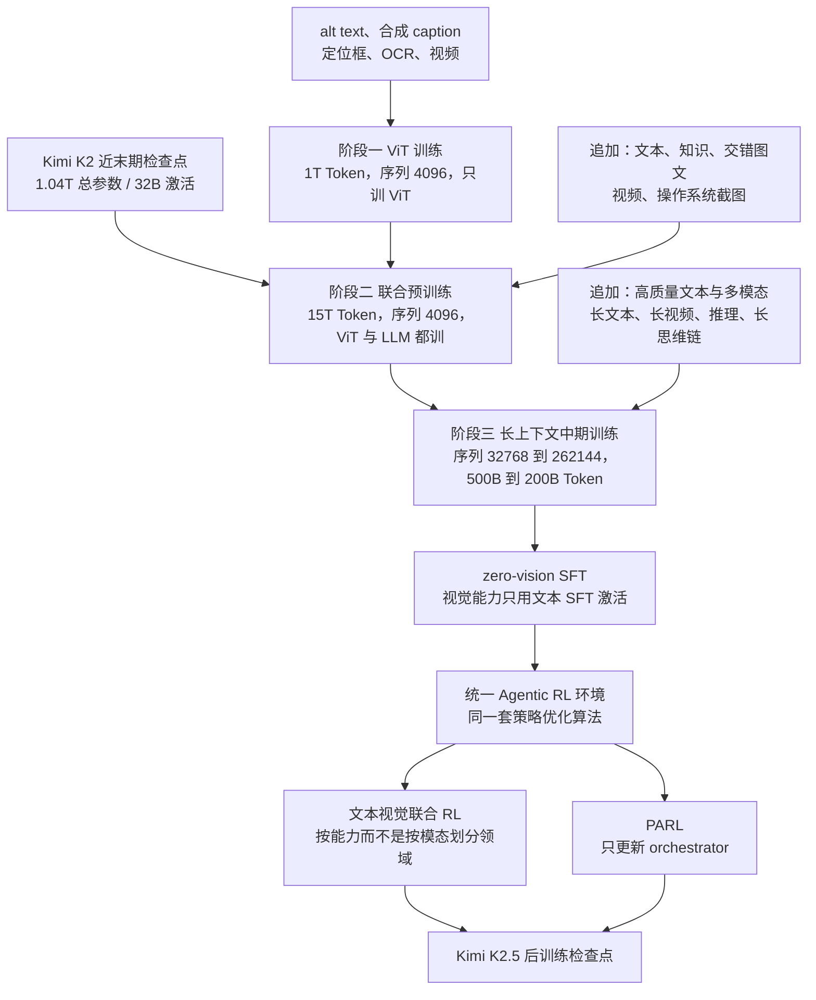
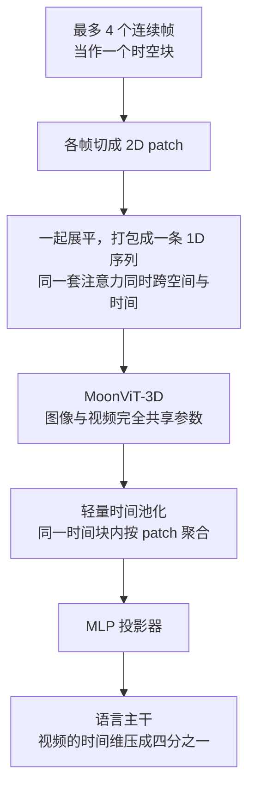
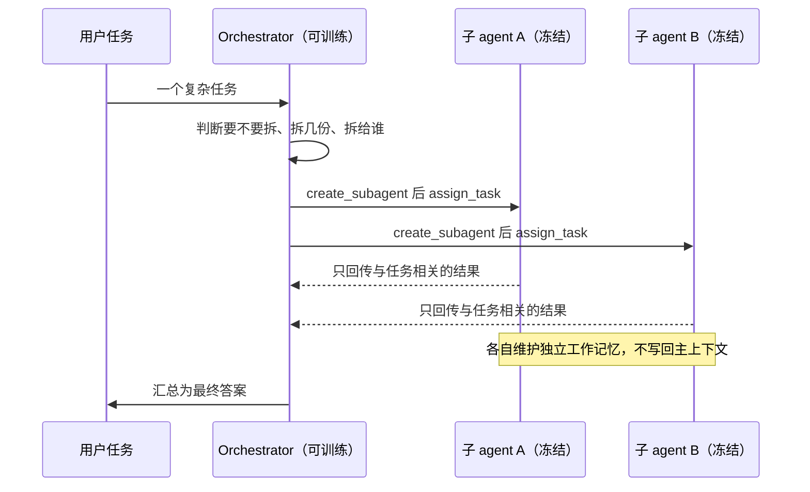
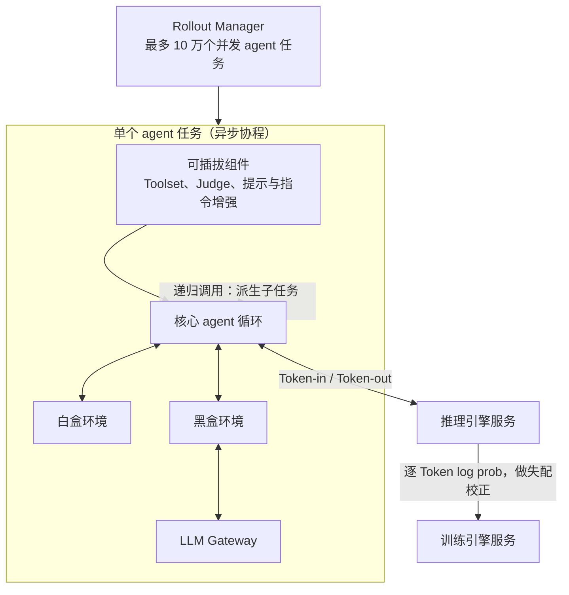
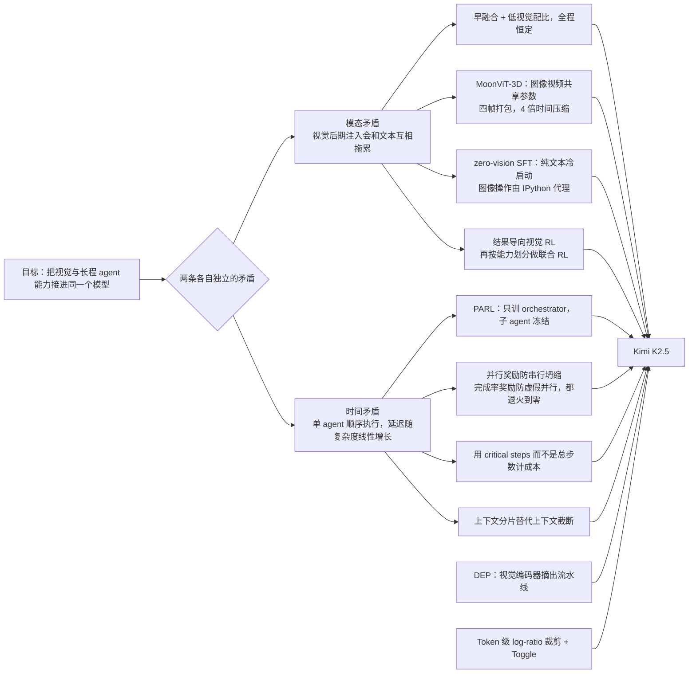

# Kimi K2.5：视觉不是外挂，并行不是编排脚本

<!-- release-date: 2026-01-27 -->

> 本文依据 Kimi Team 的 **Kimi K2.5: Visual Agentic Intelligence（Technical Report of Kimi K2.5）**，arXiv:2602.02276v2，2026-08-07 提交的修订版，共 31 页。页码均指 PDF 自身的页码。文中会区分三件事：**报告明确写了什么**、**我们怎么解释它**、**哪些是外部资料或本文推算**。

## 阅读前先认识几个词

这篇报告的门槛不在数学，在名词密度。先把反复出现的概念翻成人话：

- **Token（词元）**：模型读写内容的基本小块。文字、图像和视频最后都会被切成一串 Token 送进模型。
- **VLM（Vision-Language Model，视觉语言模型）**：既能读图又能读文的模型。常见做法是「先有语言模型，再接一个看图的部件」。
- **ViT（Vision Transformer，视觉 Transformer）**：把图片切成小方块（patch，图块）当成序列处理的视觉编码器。K2.5 的这颗叫 MoonViT-3D。
- **SFT（Supervised Fine-Tuning，监督微调）**：用「问题—标准回答」的成对数据教模型怎么答。
- **RL（Reinforcement Learning，强化学习）**：让模型真的去做任务，按结果好坏调参数。模型做一次任务留下的完整过程叫 **rollout（采样轨迹）**。
- **Agent（智能体）**：不只回一句话，而是会调工具、跑代码、看网页、连续执行很多步的模型系统。

K2.5 自己起的名字也先翻一遍：

- **原生多模态预训练**：从预训练早期就按一个固定的低比例掺入视觉数据，而不是训练快结束时才大批灌入。
- **zero-vision SFT（零视觉监督微调）**：后训练冷启动阶段一张图都不用，只用文本 SFT 数据，就把「看图并调工具」的行为激活出来。
- **Agent Swarm（智能体集群）**：一个可训练的调度者（orchestrator）动态创建一批冻结的子 agent，把任务拆开并行做。
- **PARL（Parallel-Agent Reinforcement Learning，并行智能体强化学习）**：训练这个调度者的 RL 范式，只更新调度者，子 agent 全程冻结。
- **critical steps（关键步数）**：按计算图里「关键路径」的思路计算一个并行 episode 真实耗时的步数。

## 一句话先说清

Kimi K2.5 最容易被误读的一点是：**它几乎没有动语言模型本身。**

底座就是 Kimi K2：1.04T 总参数、32B 激活参数，384 个专家每 Token 激活 8 个（稀疏度 48），优化器是带 QK-Clip 的 MuonClip。报告把 MuonClip、架构设计与训练基础设施的细节全部指回 Kimi K2 技术报告，自己不复述（PDF p. 6–7）。

还有一个容易读混的数字：Kimi K2 本身在 15T 高质量**文本** Token 上预训练（PDF p. 6）；K2.5 在它之上**再加**约 15T 视觉文本混合 Token（PDF p. 2、p. 8）。这是两笔独立的 15T。

所以 K2.5 的创新预算花在另外两件事上：

1. **信息从哪进来**：视觉从联合预训练第一天起就以恒定的低比例混在文本里；后训练冷启动一张图都不给，靠纯文本把视觉工具调用激活出来；再用结果奖励做视觉 RL。
2. **工作在时间上怎么排**：单个 agent 顺序调工具，完成时间随任务复杂度线性增长。K2.5 训练模型自己决定「要不要拆、拆成几份、拆给谁」，并用 critical steps 而不是总步数来结算成本。

两条线在报告里几乎是独立的两章，但指向同一个判断：

> **基座已经够强时，下一段收益往往不来自继续改结构，而来自改变信息进入模型的方式，以及改变工作在时间轴上的摆放方式。**

## 先看全景：三段预训练、两条后训练支线

这张图据 Table 3 与 §2、§3、§4.3–4.4 重画（PDF p. 2–8），只表达连接关系，不表示各阶段的算力比例。三个数据节点逐字对应 Table 3 的数据行；表里后两阶段的数据格以「+」开头，意思是在上一阶段的数据上追加（PDF p. 7）。

读这张图要先知道几条边界：

- **Token 账有一处对不齐。** §4.3 说三阶段「约 15T Token」（PDF p. 7），但 Table 3 的三格是 1T、15T、500B→200B，加起来超过 16T。更稳妥的读法是：15T 指联合预训练那一段，§4.3 的「约 15T」是概数。
- **「500B→200B」怎么拆，报告没解释。** 它和同一列的「32768→262144」并排，读成「两个子阶段，先在较短序列上训 500B、再在 256K 上训 200B」是本文的推断。第三段用 YaRN 插值逐步扩长上下文（PDF p. 8）。
- **联合预训练接的是 K2 的 near-end 检查点**，即 K2 训练快结束但还没结束的那个，不是发布版 K2（PDF p. 8）。数据配方在 K2 基础上引入新的独有 Token、提高代码内容权重、限制每个数据源的最大轮次。
- **报告没有给 K2.5 的架构表**，也没有 MoonViT-3D 的参数量、层数和 patch size。

架构只有一句话：MoonViT-3D、MLP 投影器、Kimi K2 的 MoE 语言模型三件，沿用 Kimi-VL 的设计原则（PDF p. 7）。下面这张规格表不是报告内容，来自官方仓库 README 的 Model Summary（外部补充，链接见文末）：

| 项 | 值（外部补充） |
|---|---:|
| 层数（含 1 层稠密层） | 61 |
| 注意力隐藏维 | 7168 |
| 注意力机制 / 头数 | MLA / 64 |
| 专家数 / 每 Token 激活 / 共享专家 | 384 / 8 / 1 |
| 单专家隐藏维 | 2048 |
| 词表 | 160K |
| 上下文长度 | 256K |
| 视觉编码器 | MoonViT，400M 参数 |

## 第一条主线：视觉从第一天就在

### 旧做法卡在哪

多模态模型的常规路线是：先把语言模型训好，训练靠后时接视觉并大量灌视觉数据，比例常到 50% 以上。报告把这称作常规认知（conventional wisdom），它的假设是「多模态是语言能力之外的事后追加」（PDF p. 2）。

后期注入的问题是：模型要在很短的一段训练里同时做两件互相冲突的事，接受一种全新的输入分布，又不能把已经稳定的语言表示搞坏。

上图引自 Figure 9（PDF p. 22），纵轴没有刻度，只能读趋势。附录把文本曲线上那一下叫 **dip-and-recover（先掉后回）**：视觉数据刚进来时文本能力先降，之后慢慢恢复。作者归因于模态域偏移——突然涌入的视觉 Token 打乱了已经建立的语言表示空间，模型只能暂时牺牲文本能力去换跨模态对齐（PDF p. 22）。这个归因是作者的解释，报告没有做隔离它的实验。

### 一个把「总量」和「时机」分开的消融

消融固定了视觉 Token 与文本 Token 的总预算，只改两件事：视觉从训练的第几成开始注入，以及注入期间的视觉文本配比。为了严格对上预算，注入之前先用算好长度的纯文本训练（PDF p. 3，Table 1）：

| 配置 | 注入时机 | 视觉：文本 | 视觉知识 | 视觉推理 | OCR | 文本知识 | 文本推理 | 代码 |
|---|---|---|---:|---:|---:|---:|---:|---:|
| Early | 0% | 10%:90% | **25.8** | **43.8** | **65.7** | **45.5** | 58.5 | **24.8** |
| Mid | 50% | 20%:80% | 25.0 | 40.7 | 64.1 | 43.9 | **58.6** | 24.0 |
| Late | 80% | 50%:50% | 24.2 | 39.0 | 61.5 | 43.1 | 57.8 | 24.0 |

值得自己算一遍（**本文算术，报告没写这个乘法**）：注入之后剩下的训练比例乘以视觉配比，三行分别是 $1.0 \times 0.1$、$0.5 \times 0.2$、$0.2 \times 0.5$，都等于 0.1。三个配置用的视觉 Token 一样多，只是摊在长短不同的时间窗里。

于是结论很干净：**同样多的视觉数据，摊得越早越薄越好。** Early 六列赢五列，唯一的例外是文本推理，Mid 以 58.6 对 58.5 高 0.1。报告的说法是，视觉配比本身对最终多模态性能影响极小，早融合加低配比更好（PDF p. 3）。K2.5 因此在整个训练过程中按恒定比例混合文本与视觉 Token（PDF p. 2）。

三条边界必须一起记：

- 消融模型的规模、总 Token 数与各列评测集的构成，报告都没给。
- 正式训练用的那个「恒定比例」是多少，报告没公布。10%:90% 只是消融表的一行。
- 六列绝对值都不高（视觉知识 25.8、代码 24.8），这是早期信号，不是终态能力对比。

**可迁移的是方法**：做数据课程实验时，把「总预算」和「投放形状」分开控制。很多「加了 X 数据没用」的结论，其实是把总量和时机搅在了一起。

### MoonViT-3D：图像和视频共用一套参数

视频进模型最贵的不是算力，是 Token 数。几分钟的视频抽帧后就能吃掉整个上下文窗口。常见解法是给视频单做一个模块或一条分支，K2.5 不这么做。

这张图据 §1 与 §4.2 的描述重画（PDF p. 2、p. 7），是机制示意。

它把 NaViT 的 patch n' pack（图块打包）从空间维推广到时间维。Kimi-VL 那一代的 MoonViT 由 SigLIP-SO-400M 初始化、用 NaViT 的打包策略处理原生分辨率图像；MoonViT-3D 在此基础上把最多四帧打包进同一条序列，进投影器之前按时间块做池化，得到 **4 倍时间压缩**（PDF p. 7）。引言的说法是「以 patch 为单位做时间平均」，同样的上下文窗口能处理最长 4 倍的视频（PDF p. 2）。

两层价值：

1. **同一窗口能装下 4 倍长的视频**。后面 LVBench、LongVideoBench 喂了 2000 帧以上的评测靠的就是它（PDF p. 13）。
2. **图像与视频完全共享参数和嵌入空间**，图像预训练学到的东西整体迁移到视频，不需要专门的视频模块（PDF p. 7）。

代价报告只说了一半：额外的时间注意力改善了高速运动与视觉特效的理解（PDF p. 7），但四帧一池化意味着块内的帧间细节被平均掉。报告没有给「不做时间压缩」的对照，这 4 倍压缩损失了多少，从报告里看不出来。

### ViT 训练阶段：接着 SigLIP 训，所以只留一个 caption 损失

第一阶段只训 ViT。MoonViT-3D 是**从 SigLIP 继续预训练**得到的，数据是图文对和视频文本对，文本侧的目标很杂：图片的 alt text、图像与视频的合成 caption、定位框、OCR 文本（PDF p. 7）。

损失只有一项：以图像或视频为条件生成描述的交叉熵 $\mathcal{L}_{\mathrm{caption}}$。报告专门点了一句：**与 Kimi-VL 的实现不同，这一段不含对比损失（contrastive loss）**（PDF p. 7）。

为什么可以不要对比损失？报告只给了结论，**以下是本文的解释**：对比损失的作用是从零把图像和文本拉进同一个表示空间，而起点 SigLIP 本来就是用对比目标训好的，这层对齐已经在权重里。这一阶段真正缺的是读懂原生高分辨率图像与视频，以及把视觉特征吐成语言模型能接着算的东西——两件事都是「看着东西说话」，一个 caption 交叉熵就够。对比损失还依赖大批量负样本，省掉它，这一阶段才做得到「吃掉约 1T Token、训练 FLOPs 却很少」。

对齐分两段（PDF p. 7）：

- 第一段用 caption 损失更新 MoonViT-3D，把它对齐到 **Moonlight-16B-A3B**（一个小得多的语言模型），约 1T Token，训练 FLOPs 很少。报告说这一段让 MoonViT-3D 主要学会理解高分辨率图像和视频。
- 第二段非常短，只更新 MLP 投影器，把 ViT 接到 1T 参数的语言模型上，为联合预训练铺路。

为什么不直接对齐 1T 模型，报告没说。**本文的理解**：编码器对齐这件事对语言模型规模不敏感，用 16B 模型跑 1T Token 比用 1T 模型便宜得多；等编码器已经「会说话」，再用一小段训练把接口换成大模型即可。**先在便宜的目标上把新模块训熟，再做一次短的接口迁移**，这个做法值得直接复用。

同一团队后来的 Kimi-K3 一篇改成视觉编码器从零训练、不再用 SigLIP 初始化，理由是训练稳定性。两篇放在一起看，分歧点正是「新模块接着谁训」。

### 预训练数据：类别清单几乎逐条对应后面的强项

附录 B 只给类别、不给任何占比（PDF p. 22–23）。

文本侧四个领域：Web Text、代码、数学、知识，处理流程大多沿用 K2。单独强调的是**强化代码智能**：上调代码数据权重，扩了仓库级代码（跨文件推理与架构理解）、互联网上的 issue、code review 与 commit 历史，以及从 PDF 和网页语料里检索出的代码相关文档；目标是仓库级理解与补丁生成、单测编写这类 agentic coding 子任务（PDF p. 22）。

视觉侧七类：caption、交错图文、OCR、知识、感知、视频、agent 数据（PDF p. 23）。几条值得单拎：

- **caption 数据严格限制合成 caption 的比例**，以抑制幻觉。
- **OCR 数据覆盖多语言文本、密集版面和多页文档**，对应后面 OCRBench、OmniDocBench 1.5、InfoVQA 三项表内最高分（PDF p. 12）。
- **STEM 解题语料**：定向检索加爬取；没有明确问题格式的资料，用 in-context learning 自动改写成 K-12 到大学水平的结构化题目。这是把「有内容没题目」的语料变成监督信号的通用做法。
- **图像—代码配对**：HTML、React、SVG 等代码与各自渲染截图配对，让模型把结构逻辑和视觉几何对齐。引言说 K2.5 在 image/video-to-code 上达到 SOTA（PDF p. 2），数据来源就在这里。
- **GUI 截图与动作轨迹**，覆盖桌面、移动和网页，含人工标注的演示，对应后面的 OSWorld-Verified 与 WebArena。
- **定位数据**：边界框、点引用，外加新引入的 **contour-level segmentation（轮廓级分割）** 任务。三种粒度与后面 RL 阶段的 IoU 奖励、高斯加权距离奖励、分割 IoU 奖励一一配套。

**读一份报告的评测强项时，回头去数据章节找对应类别，常常比读方法章节更能解释分数从哪来。**

## 后训练：冷启动一张图都不给

### 矛盾在哪

预训练完的 VLM 看得懂图，却不会**因为看图而去调工具**。要它做「把这张图二值化后数一数物体」，得先教会这套行为，这就是多模态 RL 的冷启动问题。

常规解法是人工标注或提示工程造视觉思维链数据。报告指出这类数据**多样性太差**：视觉推理常被限制在简单示意图上，工具操作退化成裁剪、旋转、翻转这三板斧（PDF p. 3）。

### zero-vision SFT：用写代码代替「视觉工具」

K2.5 的 SFT 阶段只用文本数据激活视觉 agentic 能力。关键在于所有图像操作都通过 IPython 里的程序化操作来代理，报告称之为传统视觉工具使用的一种泛化；它能支撑像素级操作（比如二值化后计数来估物体尺寸），并泛化到定位、计数、OCR（PDF p. 3）。

为什么成立？因为「遇到要精确算的对象就写代码、看结果、再修正」这套行为，在纯文本 SFT 数据里又多又杂；到了图像上，它直接通用。报告给的原因是：联合预训练已经建立了足够强的图文对齐，能力可以跨模态自然泛化（PDF p. 2–3）。所以 **zero-vision SFT 能成立，前提是前面的原生多模态预训练成立**，两者不能单独搬走一个。

报告还说，这一阶段加入人工设计的视觉轨迹反而损害泛化；初步实验里 text-vision SFT 在视觉 agentic 任务上「差得多」，可能因为缺高质量视觉数据（PDF p. 2–3）。这组对比**没有数值表**，所以它是作者观察，不是带对照数字的消融。

SFT 数据本身沿用 K2 的流水线：从 K2、K2 Thinking 与一组内部专家模型合成候选回答，按领域分流水线，结合人工标注、提示工程与多阶段验证（PDF p. 8）。数据量没有公开。

### 结果导向的视觉 RL：把「不看图」这个失效模式钉死

只靠文本激活的行为有明显失效模式：模型有时直接忽略视觉输入，该看图时不看（PDF p. 3）。于是接着在「不看图就做不对」的三类任务上做结果导向 RL：视觉定位与计数、图表与文档理解、筛过的必须依赖图像的 STEM 题（PDF p. 3）。

Figure 2 给了四条从最小 zero-vision SFT 出发的视觉 RL 曲线。横轴只写「RL flops」、没有刻度，纵轴有刻度；每张小图用两条虚线标出起点和终点，下表读自这两条虚线（PDF p. 4）：

| 基准（读自 Figure 2） | 起点约 | 终点约 |
|---|---:|---:|
| MMMU Pro | 0.713 | 0.760 |
| MathVision | 0.698 | 0.783 |
| CharXiv（RQ） | 0.633 | 0.765 |
| OCRBench | 0.794 | 0.910 |

四条都一路上升，CharXiv 涨得最多（约 13 个点）。报告据此说「zero-vision 激活加长时间 RL」足以获得稳健的视觉能力（PDF p. 4）。横轴没有刻度，所以我们不知道这段 RL 花了多少算力。

成功轨迹被回收做 **RFT（rejection-sampling fine-tuning，拒绝采样微调）**，形成一条自我改进的数据管线，给后面的联合 RL 提供更丰富的多模态推理轨迹（PDF p. 3）。

### 反直觉的一点：视觉 RL 把文本也拉高了

常见担心是视觉 RL 会拖累文本能力。报告在视觉 RL 前后测了三个纯文本基准（PDF p. 4，Table 2）：

| 基准 | 视觉 RL 前 | 视觉 RL 后 | 变化 |
|---|---:|---:|---:|
| MMLU-Pro | 84.7 | 86.4 | +1.7 |
| GPQA-Diamond | 84.3 | 86.4 | +2.1 |
| LongBench v2 | 56.7 | 58.9 | +2.2 |

作者的分析是：视觉 RL 改善了模型在**结构化信息抽取**类问题上的校准，降低了在「长得像视觉定位任务」的查询（计数、OCR 一类）上的不确定性（PDF p. 4）。这个解释没有被隔离验证，报告也没做「同等算力的纯文本 RL」对照，不能排除「多做一段 RL 本来就会涨」。稳妥的说法是：**在这份报告的设置下，视觉 RL 没有损害文本能力，三项文本指标同时上升。**

### 于是领域不再按模态切

因为迁移是双向的，K2.5 的正式 RL 放弃了按输入模态划分的专家分工，改成**按能力划分领域**：知识、推理、代码、agentic 等。每个领域同时从纯文本和多模态查询里学，生成式奖励模型（GRM）也跨这些异构轨迹打分，中间不设模态屏障（PDF p. 4）。

含义是：**模态是输入格式，不是能力边界。** 按模态切，同一种能力会被切成两份各学各的，跨模态迁移的红利就被切掉了。给多任务训练划领域时，先问一句「我要分开的是能力，还是只是输入形式」。

## 第二条主线：Agent Swarm 把顺序执行拆开

### 旧问题：步数可以很多，时间不能很长

现在的 agentic 模型基本顺序执行：想一步、调一次工具、看结果、再想下一步。报告点名自家的 K2 Thinking：即使能撑住几百步推理，推理时间仍随步数线性增长，延迟不可接受，也限制了任务复杂度的上限（PDF p. 2）。第二个后果是上下文越堆越长，工具返回、中间推理、失败重试都留在同一条上下文里（PDF p. 4）。

### 第一个决定：只训调度者，子 agent 全冻结

这张时序图据 Figure 3 与 §5.2 的上下文管理段重画（PDF p. 5、p. 14），是信息流示意，不表示真实时序。Figure 3 原图里调度者先创建一批「AI 研究员」「物理研究员」「事实核查」「网页开发」之类的专职子 agent，再分两批派出 100 个和 25 个任务。

架构是解耦的：一个可训练的调度者，加一批从**固定的中间策略检查点**实例化出来的冻结子 agent；子 agent 的执行轨迹不进优化目标（PDF p. 2、p. 5）。报告给了两个不端到端一起训的理由（PDF p. 5）：

1. **信用分配歧义**：多智能体设置下结果奖励稀疏且带噪。最终答案对了，不代表每个子 agent 都执行得干净；答错了，也不代表所有子 agent 都错了。
2. **训练不稳定**：调度策略和执行策略同时变，二者互相追着对方的分布跑。

冻结之后，子 agent 的输出被当成**环境观测**，而不是可微的决策点。报告说这样把高层协调逻辑和低层执行能力解开，收敛更稳（PDF p. 5）。工程上还有两条：先用小尺寸子 agent 训调度者，再换成更大的模型；RL 框架能动态调整子 agent 与调度者的推理实例比例，把集群用满（PDF p. 5）。

代价同样清楚：子 agent 的能力不会因为参与集群而变强，整个 Agent Swarm 的执行上限被那个固定中间检查点锁住。报告没有给「解冻之后会怎样」的对照。

**可迁移**：任何「一层决策、一层执行」的系统（路由器与后端、编排器与工具、检索器与阅读器），只要最终结果没法干净地归因到每一层，就先把其中一层钉死当环境，只优化另一层。

### 第二个决定：奖励要防两种方向相反的坍缩

PARL 的奖励是三项相加（PDF p. 5）：

$$
r_{\mathrm{PARL}}(x, y) = \lambda_1 \, r_{\mathrm{parallel}} + \lambda_2 \, r_{\mathrm{finish}} + r_{\mathrm{perf}}(x, y)
$$

- $r_{\mathrm{perf}}(x, y)$ 是主项：对任务 $x$，解 $y$ 的整体成功与质量；
- $r_{\mathrm{parallel}}$ 是实例化奖励，鼓励创建子 agent；
- $r_{\mathrm{finish}}$ 是子 agent 完成率，奖励被真正完成的子任务；
- $\lambda_1$、$\lambda_2$ 在训练过程中**退火到零**（PDF p. 6）。

两个辅助项各防一种失败（PDF p. 5–6）：

- 没有 $r_{\mathrm{parallel}}$，会发生 **serial collapse（串行坍缩）**：并行有风险，拆错就白干，策略很容易退回「自己一步步做」这个局部最优。
- 只有 $r_{\mathrm{parallel}}$，又会发生 **spurious parallelism（虚假并行）**：调度者疯狂 spawn 子 agent 把并行指标刷高，却没有做有意义的分解，这是一种奖励作弊。$r_{\mathrm{finish}}$ 要求子任务真的被完成，把策略推回可行的分解。

退火到零同样关键：辅助项是脚手架，不是目标。**为打破局部最优加辅助奖励时，几乎一定要再加一项堵住它自身的作弊路径，并给整组脚手架安排退场时间。**

### 第三个决定：换一把尺子

这是全篇最漂亮的设计，因为它没加任何约束，只换了度量。

用总步数约束训练和评测，并行没有好处——40 步拆给 4 个子 agent 各做 10 步，总步数一点没少。K2.5 借计算图里关键路径的概念定义 critical steps：把 episode 看成 $t = 1, \dots, T$ 个阶段，每个阶段主 agent 执行一个动作，要么直接调工具，要么实例化一组并行子 agent。设 $S_{\mathrm{main}}^{(t)}$ 是主 agent 在阶段 $t$ 的步数（通常为 1），$S_{\mathrm{sub},i}^{(t)}$ 是这一组第 $i$ 个子 agent 的步数；一个阶段的时长由组里跑得最久的那个决定（PDF p. 6）：

$$
\mathrm{CriticalSteps} = \sum_{t=1}^{T} \left( S_{\mathrm{main}}^{(t)} + \max_i S_{\mathrm{sub},i}^{(t)} \right)
$$

上图的步数是本文构造的例子。它展示了这个度量的两个方向：**奖励能缩短最长分支的均衡分解，不奖励不缩短最长分支的多余并发。** 报告的原话是，调度者被激励去最小化端到端延迟，而不是单纯最大化并发度或总工作量（PDF p. 6）。

**可迁移**：想让系统学会某个行为时，先检查成本度量是不是根本区分不了这个行为。很多时候不需要加惩罚项，只要把度量从「总量」换成「关键路径」「p99」「最长分支」这类真正对应用户体验的量。

### 第四个决定：不教它并行，只改任务分布

训练提示**没有明确指示模型去并行**（PDF p. 6）。做法是构造一批专门压榨顺序执行极限的合成提示：**wide search（宽搜索）** 要同时探索大量互相独立的信息源，**deep search（深搜索）** 要多条推理分支最后聚合；再加上长文档分析、大规模文件下载这类受真实负载启发的任务。在固定的推理步数与工具调用预算下，顺序执行很难做完（PDF p. 6）。

上图引自 Figure 4（PDF p. 6）。横轴没有刻度，纵轴有：训练准确率的平滑曲线从约 36% 升到约 64%；平均并行度前半程在 8 左右徘徊，甚至略降，后半程才明显上扬，末端约 14。

右图比图注说的更有信息量：**并行度不是一开始就被推高的**。前半程准确率已经在涨，并行度却没动；并行是在准确率涨到一定程度之后才被「发现」划算的。这和「并行不被假定天然有利，要不要、何时、怎么并行都由环境反馈与 RL 探索学出来」（PDF p. 5）的说法一致。这段读图是本文的解释，报告只写了「并行度逐步提高」。

### 效果：三个基准、一条时间曲线、一张上下文对比

先看准确率（PDF p. 14，Table 6）：

| 基准 | K2.5 Agent Swarm | Kimi K2.5 单 agent | Claude Opus 4.5 | GPT-5.2 | GPT-5.2 Pro |
|---|---:|---:|---:|---:|---:|
| BrowseComp | **78.4** | 60.6 | 37.0 | 65.8 | 77.9 |
| WideSearch（item-F1） | **79.0** | 72.7 | 76.2 | — | — |
| In-house Swarm Bench | **58.3** | 41.6 | 45.8 | — | — |

- BrowseComp 绝对提升 17.8 个点，超过 GPT-5.2 Pro 的 77.9（PDF p. 14）。
- WideSearch 提升 6.3 个点，超过 Claude Opus 4.5。引言里这组数写成 72.8%→79.0%（PDF p. 2），与 Table 4、Table 6 的 72.7 差 0.1，以表为准。
- 内部 Swarm Bench 提升 16.7 个点，但报告自己写明它的任务**就是专门为奖励并行分解设计的**（PDF p. 14），这一栏的说服力要打折。它覆盖四个领域：开放网络检索、批量下载、100 篇以上文档的阅读、10 万词以上的长文写作（PDF p. 13）。

时间收益来自 Figure 8（PDF p. 15）。纵轴是相对执行时间，下表取图上标出节省倍数的五个位置，数值读自图上散点，与正文「单 agent 从约 1.8 倍涨到 7.0 倍以上，Agent Swarm 保持在 0.6–1.6 倍」一致（PDF p. 14）：

| 目标 Item-F1 | 单 agent 执行时间 | Agent Swarm 执行时间 | 图上标注的节省 |
|---|---:|---:|---:|
| 30% | 约 1.8× | 约 0.6× | 3.0× |
| 40% | 约 2.4× | 约 0.8× | 3.0× |
| 50% | 约 3.2× | 约 1.0× | 3.2× |
| 60% | 约 4.4× | 约 1.2× | 3.7× |
| 70% | 约 7.2× | 约 1.6× | 4.5× |

**关键在斜率，不在倍数。** 单 agent 的时间随目标变难急剧上升，Agent Swarm 近乎走平，所以「4.5 倍」不是固定的加速比，而是这条曲线最右端的读数：任务越难差距越大。图只覆盖 30%–70%，更简单的任务还剩多少优势，这份报告答不了。

上图引自 Figure 7（PDF p. 14），数值读自图。报告的结论是 Agent Swarm「在效率与准确率上都优于 Discard-all」、用少得多的 critical steps 拿到更高准确率（PDF p. 15）。图里还有一个正文没提的细节：**预算只有 100 步左右时，Agent Swarm 反而更差**（约 47% 对约 60%）。拆任务、派子 agent 本身要花步数，预算太紧时这笔开销还没收回来。横轴只写了 steps，报告没说明它是不是 critical steps。

### 一个副产品：上下文管理从被动变主动

现有的长任务上下文策略基本是**被动**的：Hide-Tool-Result（只留最近一轮工具返回）、Summary（摘要压缩）、Discard-all（超过阈值就把历史全丢）。它们都在溢出之后才反应，常常牺牲结构信息或中间推理（PDF p. 14）。

Agent Swarm 提供了另一条路：长任务被拆成语义上互相隔离的子任务，每个子 agent 有自己有界的局部上下文和独立的工作记忆，不会直接改写或污染调度者的全局上下文；回传的只是与任务相关的输出，不是完整交互轨迹（PDF p. 14）。报告把这叫做 **context sharding（上下文分片）**，与 context truncation（上下文截断）相对：前者按语义把上下文切给不同执行体，后者按位置切掉一段（PDF p. 14–15）。

**可迁移**：设计长任务系统的上下文策略时，先问一句——我是在压缩一条越来越长的历史，还是可以一开始就把它切成几条互不干扰的短历史？前者的天花板是压缩率，后者的天花板是任务能不能分解。

## 两条主线共用的 RL 底盘

文本视觉联合 RL 与 PARL 用的是同一套环境与算法（PDF p. 8）。

### 统一 Agentic RL 环境：递归协程是 PARL 能落地的原因

这张图据 Figure 10 与附录 D 重画（PDF p. 24）。

环境层是 Gym 风格的标准接口，常用部件做成可插拔模块：Toolset 负责各种带沙箱的工具，Judge 负责多维奖励，另有提示多样化与指令遵循增强模块（PDF p. 23–24）。

真正关键的是执行层的一句话：**每个 agent 任务都是独立的异步协程，每个任务可以递归触发子任务的 rollout**（PDF p. 24）。如果 rollout 只能是「一条轨迹从头跑到尾」，「调度者中途派生四个子 agent、等它们各自跑完再继续」在训练框架里就无从表达。递归协程把 rollout 从线性结构变成树形结构，Parallel-Agent RL 与 Agent-as-Judge 都成了同一机制的两种用法（PDF p. 24）。Rollout Manager 在 RL 中编排最多 **100,000 个并发 agent 任务**，支持 partial rollout 等特性；每个任务从托管池里取一个带沙箱与专用工具的环境实例（PDF p. 24）。

另外两条工程约定与下面的算法直接咬合（PDF p. 24）：

- 严格的 **Token-in-Token-out**，并**记录推理引擎所有输出的 log probability**，用于训练—推理失配校正。没有逐 Token 的推理侧概率，就算不出下一节那个比值。
- 只能走标准 LLM API 协议的**黑盒环境**，通过 **LLM Gateway** 代理按自定义协议记录请求与响应，也能被优化。

**可迁移**：一个训练范式能不能实现，常常取决于 rollout 抽象是线性的还是可递归的。要做多智能体、agent-as-judge 或任何「轨迹里嵌轨迹」的训练，先改 rollout 的数据结构，再谈算法。

### 策略优化：只看 log-ratio 的 Token 级裁剪

对数据集 $\mathcal{D}$ 里的每个问题 $x$，用旧策略 $\pi_{\mathrm{old}}$ 采 $K$ 条回答。先定义第 $j$ 条回答第 $i$ 个 Token 上新旧策略的概率比：

$$
\rho_i^j = \frac{\pi_\theta\left(y_i^j \mid x, y_{0:i}^j\right)}{\pi_{\mathrm{old}}\left(y_i^j \mid x, y_{0:i}^j\right)}
$$

目标函数是（PDF p. 8，式 1）：

$$
\mathcal{L}_{\mathrm{RL}}(\theta) = \mathbb{E}_{x \sim \mathcal{D}} \left[ \frac{1}{N} \sum_{j=1}^{K} \sum_{i=1}^{|y^j|} \left( \mathrm{Clip}\left(\rho_i^j, \alpha, \beta\right) \left( r(x, y^j) - \bar{r}(x) \right) - \tau \left( \log \rho_i^j \right)^2 \right) \right]
$$

$\bar{r}(x)$ 是这 $K$ 条回答的平均奖励，$N$ 是这一批生成的总 Token 数，$\alpha, \beta, \tau > 0$ 是超参数。拆开只有三件事：

1. 同组平均奖励当基线，$r - \bar{r}$ 就是这条回答相对同组的优势；
2. $\mathrm{Clip}$ 是一个**梯度掩码**：log-ratio 落在 $[\alpha, \beta]$ 内的 Token 正常算梯度，落在外面的直接置零；
3. $\tau (\log \rho)^2$ 惩罚新旧策略在单个 Token 上的偏离。

与标准 PPO 裁剪的关键区别，报告写得很直白：**它严格只看 log-ratio 来限制离策略漂移，不管优势的正负号**（PDF p. 8）。动机是工程现实：训练框架与推理框架的实现差异会放大离策略偏差，同一份权重在两套引擎里算出的概率并不完全一样，这个差异在长程多步工具调用里被不断放大。报告说这个机制对维持训练稳定「必不可少」，相对 K1.5 的算法这是新增的部分；优化器仍是 MuonClip（PDF p. 8）。

$\alpha$、$\beta$、$\tau$ 的取值与「不加这个裁剪会怎样」的对照，报告都没给。

### 奖励：可验证的直接判，视觉任务按几何结构软匹配

三类奖励（PDF p. 8）：有可验证解的推理与 agentic 任务用**规则型结果奖励**；为 Token 效率加**预算控制奖励**；通用任务用 **GRM（Generative Reward Model，生成式奖励模型）**。视觉任务再单独设计：

| 视觉任务 | 奖励设计 |
|---|---|
| 视觉定位 | 基于 F1 的奖励，软匹配来自 IoU（交并比） |
| 点定位 | 基于 F1 的奖励，软匹配来自最优匹配下的高斯加权距离 |
| 多边形分割 | 预测多边形栅格化成二值掩码，与真值掩码算分割 IoU |
| OCR | 归一化编辑距离 |
| 计数 | 按预测与真值的绝对差给奖励 |
| 合成视觉谜题 | 由 Kimi K2 当 LLM verifier 给反馈 |

这张表的共同点是**把「几乎对」和「完全错」区分开**。定位只给 0/1 奖励时，偏了三个像素的框和找错物体的框得到同样的惩罚，梯度里没有「往哪挪」的信息。先问奖励函数能不能表达接近程度，再问它准不准。

GRM 那一段有三点（PDF p. 8–9）：它部署在**已验证的奖励信号之上**，覆盖聊天助手、编码 agent、搜索 agent 与产出物生成 agent，而不只评对话；它不是二值裁判，评的维度包括有用性、回答就绪程度、上下文相关性、详略、生成产出物的美观度与严格的指令遵循；为了缓解奖励作弊和对单一偏好信号过拟合，针对不同任务情境用**多套不同的 GRM rubric**。rubric 内容、GRM 规模和数量都没公开。

### Toggle：效率训练要留一个反向相位

之前的 K1.5 与 K2 给每道题设 Token 预算，超了就罚。报告观察到一个副作用，叫 **length-overfitting（长度过拟合）**：刚性预算下训出来的模型泛化不到更大的计算量，给它更多推理 Token 也用不上，只会退回被截短的推理模式（PDF p. 9）。你以为在训「简洁」，实际在训「短」，这两件事在难题上会分家。

Toggle 让两种目标交替。设 $t$ 是训练迭代数，$m$ 是相位长度，$K$ 是每题的 rollout 数（PDF p. 9）：

$$
\tilde{r}(x, y) =
\begin{cases}
r(x, y) \cdot \mathbb{I}\left[ \frac{1}{K} \sum_{i=1}^{K} r(x, y_i) < \lambda \ \text{or} \ |y_i| \le \mathrm{budget}(x) \right], & \lfloor t/m \rfloor \bmod 2 = 0 \\
r(x, y), & \lfloor t/m \rfloor \bmod 2 = 1
\end{cases}
$$

- **Phase 0（预算受限相位）**：要在题目相关的预算内解题；但只有当模型在这道题上的平均正确率超过阈值 $\lambda$ 时才生效，还没做对的题不罚长度。
- **Phase 1（标准扩展相位）**：可以一直写到最大 Token 上限，鼓励用算力换质量。

预算取正确回答长度的第 $\rho$ 分位数，训练开始时估一次，之后固定（PDF p. 9，式 2）：

$$
\mathrm{budget}(x) = \mathrm{Percentile}\left( \left\{ |y_j| \ : \ r(x, y_i) = 1,\ i = 1, \dots, K \right\},\ \rho \right)
$$

效果在 K2 Thinking 上验证：平均减少 **25%–30%** 的输出 Token，性能影响可忽略；重复验证、机械计算这类冗余模式大幅减少；只在数学与编程任务上训练，GPQA 与 MMLU-Pro 上也稳定减少 Token，性能只边际下降（PDF p. 9）。Figure 5 是两张雷达图，每条轴上标了变化量，下表读自这些标注（PDF p. 10）：

| 轴（读自 Figure 5） | 性能变化 | 平均输出 Token 变化 |
|---|---:|---:|
| AIME 2025 | +1.1% | −6179 |
| HMMT 2025 Feb | +0.6% | −7967 |
| HMMT 2025 Nov | +0.8% | −8127 |
| LiveCodeBench v6 | +2.2% | −745 |
| GPQA-Diamond | −1.0% | −4912 |
| MMLU-Pro | −2.0% | −817 |
| Overall | +0.3% | −4791 |

图上的汇总是「性能改善 5、退化 2；Token 减少 7、增加 0」，这 7 条轴里有一条是 Overall，所以是 6 个基准加一个总体。退化的两项恰好是训练域之外的 GPQA 与 MMLU-Pro，和正文「跨域泛化、性能边际下降」对得上。

K2.5 正式模型的 Token 用量对照（PDF p. 13，Table 5，括号内是平均输出 Token，单位千）：

| 基准 | Kimi K2.5 | Kimi K2 Thinking | Gemini-3.0 Pro | DeepSeek-V3.2 Thinking |
|---|---:|---:|---:|---:|
| AIME 2025 | 96.1 (25k) | 94.5 (30k) | 95.0 (15k) | 93.1 (16k) |
| HMMT Feb 2025 | 95.4 (27k) | 89.4 (35k) | 97.3 (16k) | 92.5 (19k) |
| HMMT Nov 2025 | 91.1 (24k) | 89.2 (32k) | 94.5 (15k) | 90.2 (18k) |
| IMO-AnswerBench | 81.8 (36k) | 78.6 (37k) | 83.1 (18k) | 78.3 (27k) |
| LiveCodeBench | 85.0 (18k) | 82.6 (25k) | 87.4 (13k) | 83.3 (16k) |
| GPQA Diamond | 87.6 (14k) | 84.5 (13k) | 91.9 (8k) | 82.4 (7k) |
| HLE-Text | 31.5 (24k) | 23.9 (29k) | 38.4 (13k) | 25.1 (21k) |

横着读，K2.5 相对自家 K2 Thinking 几乎每项「分更高、Token 更少」（GPQA 多用了 1k）。竖着读要诚实：**Gemini-3.0 Pro 每一项都比 K2.5 用更少的 Token**，而且除 AIME 外分数都更高。报告把它放进了同一张表，没有回避。

**可迁移**：优化效率时要保留一个不受效率约束的相位，否则模型会把「在这个预算下做对」学成「不要超过这个长度」。

## 系统侧：唯一的新 infra 设计 DEP

训练基础设施继承自 K2，报告的原话是「minimal modifications」；新增的只有 **DEP（Decoupled Encoder Process，解耦编码器过程）**（PDF p. 9）。

旧问题：流水线并行（PP）下，视觉编码器和文本嵌入同在第一段 Stage-0。多模态输入的规模天然波动（这一批有几张图、分辨率多高都不固定），Stage-0 的计算与显存剧烈起伏。已有办法是给 VLM 定制 PP 配置，比如 Kimi-VL 手工减少 Stage-0 里的解码器层数腾显存。报告的评价是：这缓解了显存压力，但没从根本上解决负载不均；更要紧的是，它让纯文本训练里调到极致的并行策略无法直接复用（PDF p. 9–10）。

DEP 利用了视觉编码器在计算图里的特殊位置：**它是前向的起点，也是反向的终点**（PDF p. 10）。两头都在边界上，就可以不参与中间那条流水线。三段各做什么，图上已经写明；要补的是两处取舍：

- **为什么能复制到每张卡**：因为视觉编码器小。
- **为什么要重算**：第一段丢掉了全部中间激活，只留输出激活，这样主干训练时的显存峰值和纯文本一样；代价是反向前再跑一遍视觉前向。

结果：K2.5 无缝继承 K2 的并行策略，多模态训练效率达到纯文本训练的 **90%**（PDF p. 10）。报告还提到同期的 LongCat-Flash-Omni 设计思路相近。

**可迁移**：分布式系统里遇到「体量小、波动大」的组件，先看它在依赖图上的位置。若它在边界上，常常可以整体复制、单独调度、必要时重算，把它的波动整个隔离在主流程之外。

附录 C 还有几项容易跳过的数字（PDF p. 23）：

- H800 集群，节点间 **8×400 Gbps RoCE**；
- **16 路 PP（带 virtual stages）+ 16 路专家并行 + ZeRO-1 数据并行**，因此可在任何 32 的倍数个节点上训练；
- 交错 1F1B 调度下，EP 的 all-to-all 与计算重叠；
- 对 LayerNorm、SwiGLU 与 MLA 上投影做选择性重计算，把不敏感的激活压成 FP8-E4M3，其余激活以重叠流式 offload 到 CPU。

数据加载有两条值得记：**确定性**——严格管理随机种子与 worker 状态，任何中断后恢复，数据序列与未中断时完全相同；**增强**——对视觉和文本做随机增强，但几何变换时保持 2D 坐标与方向元数据的完整性。后者对定位任务是硬要求：图翻转了，框也得跟着翻（PDF p. 23）。

GPU 总数、训练时长、总 FLOPs 与成本都没给。「32 的倍数」只说明拓扑弹性，不说明规模。

## 评测：先看条件，再看数字

### 读表前要知道的配置

K2.5 默认 temperature 1.0、top-p 0.95、上下文 256k；对照模型各用自己的高性能推理配置：Claude Opus 4.5 开 extended thinking，GPT-5.2 用 xhigh，Gemini 3 Pro 用 high thinking level，DeepSeek-V3.2 开思考（只测文本），Qwen3-VL-235B-A22B 用思考模式（只测视觉）。带 `*` 的是 K2.5 团队内部复测（PDF p. 11、p. 24–25）。

采样与预算（PDF p. 25–27）：推理类基准最大完成预算 96k，AIME 2025 与 HMMT 2025（Feb）取 Avg@64，GPQA-Diamond 取 Avg@8；图像与视频最大 64k、Avg@3，短视频抽 128 帧、分辨率上限 896，长视频抽 2048 帧、分辨率 448；编码任务 Avg@5；Seal-0 与 WideSearch 取 Avg@4，其余 agentic 基准单次运行；电脑操作每个 episode 最多 100 步，OSWorld-Verified 温度 0、WebArena 温度 0.1，所有模型一次性评测（PDF p. 27）。

三条限制条件必须和分数一起读：

1. **SWE-Bench 系列与 Terminal Bench 2.0 都在非思考模式下取得。** SWE-Bench 用内部框架，工具只有 `bash`、`create_file`、`insert`、`view`、`str_replace`、`submit`，三个变体都在非思考模式下达到峰值。Terminal Bench 2.0 用默认的 Terminus-2 框架，关掉思考模式是因为 K2.5 思考模式的上下文管理实现与 Terminus-2 的会话状态处理不兼容（PDF p. 26）。
2. **GPT-5.2-xhigh 在视觉评测里约有 10% 的失败率**（重试三次仍无输出），这些被算作错，所以它的视觉分数是保守下界。因为拿不到稳定的 GPT-5.2 API，WideSearch 等高成本基准被跳过。LongBench v2 那一栏的 GPT-5.2 用的是 high，因为 xhigh 常不按多选格式作答（PDF p. 25）。
3. **默认不做上下文管理**：超出窗口的任务直接算失败。例外是 HLE 带工具用 Hide-Tool-Result（超过阈值只留最近一轮工具消息，此前全部推理链完整保留），以及 BrowseComp 同时报了带与不带 Discard-all 的两组（PDF p. 26）。

第三条对读表影响最大：BrowseComp 60.6 与 74.9 是同一个模型在两种上下文策略下的分数（PDF p. 12），差 14.3 分。在长程搜索里，上下文策略本身就是一个和模型能力同量级的变量。

### 主表里的强项与弱项

完整数值在 Table 4（PDF p. 12）。下面摘能划出边界的几组，对照三个闭源模型：

| 基准 | Kimi K2.5 | Claude Opus 4.5 | GPT-5.2 (xhigh) | Gemini 3 Pro |
|---|---:|---:|---:|---:|
| HLE-Full（无工具） | 30.1 | 30.8 | 34.5 | **37.5** |
| HLE-Full（带工具） | **50.2** | 43.2 | 45.5 | 45.8 |
| SimpleQA Verified | 36.9 | 44.1 | 38.9 | **72.1** |
| AdvancedIF | 75.6 | 63.1 | **81.1** | 74.7 |
| LongBench v2 | 61.0 | 64.4* | 54.5* | **68.2*** |
| SWE-Bench Verified | 76.8 | **80.9** | 80.0 | 76.2 |
| Terminal Bench 2.0 | 50.8 | **59.3** | 54.0 | 54.2 |
| CyberGym | 41.3 | **50.6** | — | 39.9* |
| BrowseComp（无上下文管理） | 60.6 | 37.0 | **65.8** | 37.8 |
| DeepSearchQA | **77.1** | 76.1* | 71.3* | 63.2* |
| OCRBench | **92.3** | 86.5* | 80.7* | 90.3* |
| InfoVQA (test) | **92.6** | 76.9* | 84* | 57.2* |
| LVBench | **75.9** | 57.3 | — | 73.5* |
| OSWorld-Verified | 63.3 | **66.3** | 8.6* | 20.7* |

**明显强的地方**：会用工具的场景。HLE 带工具比不带工具高 20.1 分，并超过所有闭源对照；BrowseComp 开 Discard-all 后 74.9，高于 Opus 4.5 的 57.8 与 Gemini 3 Pro 的 59.2（GPT-5.2 只报了一个 65.8，没分两种设置）；DeepSearchQA、FinSearchComp T2&T3（67.8）、Seal-0（57.4）三项都是表内最高；OCRBench、OmniDocBench 1.5（88.8）、InfoVQA 都是表内最高；长视频 LVBench 与 LongVideoBench（79.8）靠喂 2000 帧以上拿到报告所说的全局 SOTA（PDF p. 13），这和 MoonViT-3D 的时间压缩直接相关。OSWorld-Verified 63.3 是**只靠 GUI 动作、不用外部工具**取得的；正文另拿 OpenAI Operator（基于 o3）的 42.9 作对照，WebArena 58.9 高于 Operator 的 58.1、低于 Opus 4.5 的 63.4（PDF p. 13）。表里 GPT-5.2 与 Gemini 3 Pro 在 OSWorld 上只有 8.6 与 20.7，是内部复测、一次性评测、Opus 只给电脑操作工具不给浏览器工具的条件下得到的（PDF p. 27），和这些模型自家公布的数不能直接比。

**明显落后的地方**：参数化知识与高难度软件工程。SimpleQA Verified 36.9 对 Gemini 3 Pro 的 72.1，差了近一倍，是全表最大的单项差距；不带工具的 HLE 低于 GPT-5.2 与 Gemini 3 Pro；SWE-Bench Verified、Terminal Bench 2.0、SWE-Bench Pro（50.7，对 55.4* 与 55.6）都低于 Opus 4.5 与 GPT-5.2；CyberGym 41.3 低于 Opus 的 50.6，这项测的是只给弱点的高层描述、去真实开源项目里找已被发现过的漏洞，报的是难度等级 1（PDF p. 11、p. 26）；LongBench v2 低于 Gemini 与 Opus。

**正文与表格有一处不一致**：正文说 K2.5 在 ZeroBench 上「大幅领先」（PDF p. 13），但 Table 4 里不带工具时 GPT-5.2 同为 9，带工具时 Gemini 3 Pro 的 12 高于 K2.5 的 11（PDF p. 12）。表格优先于叙述。

一个诚实的画像是：**K2.5 是一台很强的「会用工具的视觉 agent」，但不是知识最全、单步推理最强的模型。** 这份报告也**没有安全评测章节**：CyberGym 只是编码类的一个分数，没有能力下界评估、第三方红队或滥用风险讨论。

### Agent Swarm 的评测边界

配置在附录 E.8（PDF p. 27–28）。调度者除了网页搜索、代码解释器、网页浏览，多两个工具：`create_subagent`（用自定义系统提示与名字创建可复用的子 agent）和 `assign_task`（把任务派给已创建的子 agent）。步数上限按工具调用与环境交互合计：

| 基准 | 调度者最多步数 | 每个子 agent 最多步数 |
|---|---:|---:|
| BrowseComp | 15 | 100 |
| WideSearch | 100 | 100 |
| 内部 Swarm Bench | 100 | 50 |

`assign_task` 的工具描述里写着「只要有可能就并发启动多个 agent，以最大化性能」（PDF p. 28）。这和正文「训练提示不显式指示模型并行」不矛盾——那句说的是任务提示——但读者要知道，**工具描述本身给了并行的明确引导**。

报告没有给子 agent 数量上限，也没有给 1500 这类协同步数。「最多 100 个子 agent、跨最多 1500 个协同步骤」出自官方技术博客（外部补充，见文末）。

### 案例：证明能端到端做事，不是消融

附录 F 给了两组定性案例（PDF p. 29–31）。

**Figure 11：黑神话悟空长视频分析。** 输入是 32 个视频文件、24 小时 1080p 连续游戏录像、共 40GB。主 agent 先 `ls` 看目录，读到环境里 `AGENTS.md` 的约定——大于等于 25MB 的视频交给并行子 agent——于是创建 32 个子 agent 各处理一个视频的抽帧与事件时间线，随后又创建 9 个子 agent 并行剪辑精彩片段，最后汇总成带时间线、内嵌片段和交互图表的 HTML 页面。

两个观察：**触发并行的是环境里一条配置约定**，部署时 Agent Swarm 的行为可以被项目级规则文件直接引导；这个案例把两条主线的接点展示得最清楚——没有视频压缩，单个子 agent 读不完一段视频；没有 Agent Swarm，32 段视频只能串行。但它是发布方自选的单个案例，没有成功率、失败样本与耗时。

**Figure 12：三个视觉推理案例。** 迷宫寻路（二值化后跑 BFS，路径 3288 个点）、饼图面积（HSV 色彩分割，红 45.9%、蓝 23.4%、绿 30.7%，回答绿加蓝 54.1%）、找不同（像素级差分图先自动检出 27 个区域，最后给出 10 处主要差异）。这正是 zero-vision SFT「用代码处理图像」的成品：模型写的是 OpenCV 与 NumPy。饼图例子还有一处自我校验——检出的彩色像素之和（58778）与总彩色像素（61609）对不上，模型解释为黑边与抗锯齿，改用检出色彩之和做分母。

GDPVal-AA 的 41.0 引自 Artificial Analysis，是截至 2026-01-28 的排行榜快照（PDF p. 28）。

## 报告没有告诉我们的事

31 页里，参考文献占 4 页、作者名单占 2 页（PDF p. 16–21），省略比同类报告更多：

- **架构**：层数、隐藏维、专家维、注意力配置全部指回 K2 报告；MoonViT-3D 的参数量、层数、patch size、分辨率上限也没写。
- **数据**：正式训练的视觉文本配比；文本四个领域与视觉七个类别只有类别，没有占比、来源、许可与污染检查（PDF p. 22–23）；SFT 数据量。
- **训练规模**：GPU 数量、训练时长、总 FLOPs、成本。
- **RL 超参**：$\alpha$、$\beta$、$\tau$、$\lambda$、$\lambda_1$、$\lambda_2$、$m$、$\rho$ 全部未给。
- **PARL 的关键设定**：子 agent 来自哪个中间检查点、并行度上限、三项奖励的相对量级。
- **消融**：早融合、时间压缩、zero-vision SFT、Toggle、DEP 各自对最终分数的贡献，全尺寸上都没有独立消融；Table 1 是小规模代理实验，Table 2 是单阶段前后对比；「加视觉轨迹更差」没有数值。
- **推理与部署**：没有量化、投机解码或服务侧调度章节。
- **安全**：没有安全评测、能力下界评估或第三方评估。
- **限制与未来工作**：没有这一节，结论一页只有一段正面总结（PDF p. 15）。本文列出的边界，都是从配置、脚注和表格里推出来的。

## 最值得带回自己项目的八条

### 1. 分开控制「总预算」和「投放形状」

Table 1 三行用的视觉 Token 一样多，只是时间窗不同，结论就分出了高下。总量和时机一起变，结论无法归因。

### 2. 冷启动数据的模态可以和目标能力不一致

zero-vision SFT 用纯文本激活视觉工具调用，前提是底层表示已对齐、行为能用通用载体（写代码）表达。缺高质量目标模态数据时，先问这个行为能不能换一种模态来教。

### 3. 按能力而不是按输入格式划分领域

按模态切专家会把同一种能力切成两份，白白丢掉迁移红利。

### 4. 不能干净归因的多层系统，先冻结一层

PARL 冻结子 agent、只训调度者，一次绕开信用分配歧义和训练不稳定。代价是被冻结那层的能力被锁死。

### 5. 辅助奖励要成对出现，并且要能退场

$r_{\mathrm{parallel}}$ 打破串行坍缩，$r_{\mathrm{finish}}$ 堵住它自身的作弊路径，两者最后退火到零。

### 6. 改度量常常比加约束更根本

总步数区分不了并行与串行，critical steps 可以。靠一堆惩罚项去引导某个行为之前，先检查主度量是不是根本没表达这个行为。

### 7. 效率训练必须保留一个不受约束的相位

Toggle 的两相交替防的是长度过拟合。用惩罚压资源的训练，都应该周期性解开惩罚，确认模型还能用满资源。

### 8. 小而抖的组件，看它在依赖图上的位置

DEP 把位于前向起点、反向终点的视觉编码器从流水线里摘出来，复制、均分、重算，主干并行策略原样复用。

## 用一张图重新串起全文

左右两支在报告里是并列的两章，不存在先后依赖；底部两项是两条主线共用的底盘。

## 关键词回看

- **原生多模态预训练**：视觉从预训练早期就以恒定低比例混入，而不是末期高比例灌入。
- **dip-and-recover**：中后期注入视觉时文本能力先掉后回，作者归因于模态域偏移。
- **MoonViT-3D**：把 NaViT 的 patch 打包推广到时间维，最多四帧一块共用一套注意力，池化后时间维压成四分之一。
- **zero-vision SFT**：只用文本 SFT 冷启动视觉 agentic 能力，图像操作由 IPython 程序化操作代理。
- **结果导向视觉 RL**：只在不看图做不对的任务上做 RL，配合定位、分割、OCR、计数各自的软匹配奖励。
- **按能力划分领域**：RL 领域按知识、推理、代码、agentic 切，不按输入模态切。
- **Agent Swarm / PARL**：可训练调度者 + 冻结子 agent；子 agent 轨迹不进优化目标。
- **serial collapse / spurious parallelism**：两种方向相反的失败，分别由并行奖励与完成率奖励堵住。
- **critical steps**：每个阶段只算主 agent 步数加最长子 agent 步数，再按阶段求和。
- **context sharding**：按语义把上下文切给不同执行体，区别于按位置截断。
- **Token 级 log-ratio 裁剪**：只按 log-ratio 掩掉梯度，不看优势符号，用来吸收训练与推理框架的偏差。
- **Toggle**：预算受限相位与标准扩展相位交替，防止长度过拟合。
- **DEP**：视觉编码器复制均分做前向、丢中间激活、反向前重算；多模态训练效率为纯文本的 90%。

## 最后的判断

这份报告没有新架构、没有新算子，却回答了一个很多团队正在面对的问题：**基座已经训好了，下一步往哪投。** 它给的两条答案都不在模型结构里。

第一条是把视觉从「事后插件」改成「同期公民」。早融合低配比让两种模态在整个预训练里共同演化；zero-vision SFT 承认高质量视觉轨迹稀缺，改用充裕的文本数据教一种通用行为；结果导向的视觉 RL 再把这个行为钉在真的需要看图的任务上；最后按能力而不是按模态划分领域。

第二条是承认单 agent 的时间维已经到顶。Agent Swarm 的高明不在「多智能体」这个概念，而在三个具体决定：冻结子 agent 绕开信用分配、成对的辅助奖励堵住两个方向的坍缩、把成本度量从总步数换成 critical steps。

证据强度要分层看：

- **有直接实验或数表支撑的**：固定预算下早融合更好（Table 1，小规模代理）；视觉 RL 后三项文本指标上升（Table 2）；Agent Swarm 在三个基准上的提升（Table 6）与 WideSearch 上的时间曲线（Figure 8）；Toggle 在 K2 Thinking 上的 Token 下降（Figure 5）。
- **只有作者观察或定性描述的**：text-vision SFT 更差；dip-and-recover 源于模态域偏移；视觉 RL 通过「改善校准」提升文本；Token 级裁剪「必不可少」；DEP 的 90% 效率没有给对照细节。
- **完全没有公开的**：架构细节、数据配比、训练规模、全部 RL 超参、各设计的全尺寸独立消融、安全评测。

还有几处要自己校准：SWE-Bench 系列与 Terminal Bench 来自非思考模式与内部框架；BrowseComp 的两个单 agent 分数差在上下文策略；内部 Swarm Bench 是为并行分解设计的；ZeroBench「大幅领先」与表格不符；Figure 7 显示预算很紧时 Agent Swarm 反而更差。

如果只带走一句：

> **基座稳定之后，最大的杠杆常常不在模型里，而在两件事上：信息以什么形状、什么时机进入模型；工作以什么形状被摆在时间轴上。**

## 资料与阅读边界

**原始依据**

- 本地 `papers/Moonshot/Kimi-K2.5.pdf`，即 arXiv:2602.02276v2（2026-08-07 提交），31 页。全文所有 `(PDF p. N)` 都出自这一版。

**版本核查**

- arXiv 论文页 [arXiv:2602.02276](https://arxiv.org/abs/2602.02276) 的提交历史为 v1（2026-02-02）与 v2（2026-08-07），v2 即最新版，与本地 PDF 一致，无需替换。

**首发日证据**

- [AWS Bedrock 的 Kimi K2.5 模型卡](https://docs.aws.amazon.com/bedrock/latest/userguide/model-card-moonshot-ai-kimi-k2-5.html) 写明「Model launch date: Jan 27, 2026」。
- 官方权重仓库 [moonshotai/Kimi-K2.5](https://huggingface.co/moonshotai/Kimi-K2.5) 的提交历史：权重文件在 2026-01-01 预先上传，模型卡 README 在 2026-01-27 集中更新，与公开发布同日。仓库 `createdAt`（2026-01-01）是预置时间，不是首发日。
- 报告自身也自洽：附录 E.9 引用的 GDPVal-AA 排行榜快照是 2026-01-28（PDF p. 28）。
- 因此 `release-date` 取 **2026-01-27**，不取 arXiv v1 提交日（2026-02-02）或 v2 修订日。

**外部补充（不是报告内容）**

- 官方仓库 [MoonshotAI/Kimi-K2.5](https://github.com/MoonshotAI/Kimi-K2.5) README 的 Model Summary：61 层（含 1 层稠密层）、注意力隐藏维 7168、MLA、64 头、384 个专家每 Token 选 8 个、1 个共享专家、单专家隐藏维 2048、词表 160K、上下文 256K、视觉编码器 MoonViT 400M 参数。本文开头的规格表来自这里。
- 官方技术博客 [Kimi K2.5 Tech Blog](https://www.kimi.com/blog/kimi-k2-5.html)：Agent Swarm 支持「最多 100 个子 agent、跨最多 1,500 个协同步骤」。报告正文没有这两个上限。
- 报告引用的相关工作（延伸阅读）：[NaViT](https://arxiv.org/abs/2307.06304)、[SigLIP](https://arxiv.org/abs/2303.15343)、[YaRN](https://arxiv.org/abs/2309.00071)、[Kimi K2](https://arxiv.org/abs/2507.20534)、[Kimi-VL](https://arxiv.org/abs/2504.07491)、[Muon is Scalable for LLM Training](https://arxiv.org/abs/2502.16982)（Moonlight-16B-A3B 的出处）。
- 本文中所有标「约」的曲线读数（Figure 2、Figure 4、Figure 7、Figure 8）都读自原图坐标，不是报告给出的精确数；Table 1 的「三行视觉 Token 相同」与 critical steps 图的步数都是本文的算术或构造。
